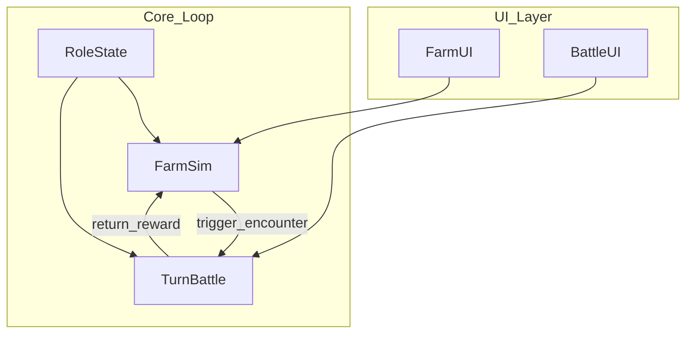

# 农场经营 + 回合战斗 手机游戏 Demo — 规格说明（SPEC）

# Farm Management + Turn-Based Battle Mobile Game Demo — Specification (SPEC)

---

## 术语与命名 / Glossary

**中文：** 本文档中 **Role** 专指由玩家操控的主角之显示名与剧情名；实现代码中可使用如 `PlayerRole`、`PlayerActor` 等类型名，以避免与引擎或语言保留概念混淆。  
**English:** In this document, **Role** is the display and narrative name of the player-controlled protagonist; implementation may use type names such as `PlayerRole` or `PlayerActor` to avoid confusion with engine or language reserved concepts.

**中文：** **设计基准分辨率** 指竖屏下逻辑设计画布为 **宽 1080 像素 × 高 1920 像素**（1080×1920）；UI 与布局以此为准，在其它物理分辨率上通过缩放与安全区适配。  
**English:** **Design baseline resolution** means a portrait logical design canvas of **1080 pixels wide × 1920 pixels tall** (1080×1920); UI and layout follow this baseline, with scaling and safe-area adaptation on other physical resolutions.

**中文：** **安全区** 指避开刘海、圆角与系统手势带的可交互内容区域；具体边距可在实现阶段按平台取 `Screen.safeArea` 或等价 API。  
**English:** **Safe area** is the region for interactive content that avoids notches, rounded corners, and system gesture areas; margins can be taken from `Screen.safeArea` or equivalent APIs per platform during implementation.

**中文：** **农场（Farm）** 指种植、生长、收获与资源产出的模拟模块（Demo 可极简）。  
**English:** **Farm** refers to the simulation module for planting, growth, harvest, and resource output (the demo may be minimal).

**中文：** **回合战斗（Turn-Based Battle）** 指按回合顺序结算行动的战斗模块。  
**English:** **Turn-based battle** refers to the combat module where actions are resolved in turn order.

**中文：** Unity 工程路径：`PetDemo_2/PetDemo_2`（相对仓库根目录）。  
**English:** Unity project path: `PetDemo_2/PetDemo_2` (relative to repository root).

---

## 1. 目标与范围 / Goals and Scope

**中文：** 本 Demo 旨在验证一条可玩闭环：玩家在农场完成至少一次「种植→等待/推进→收获→获得资源」，并可通过既定入口进入一场最小回合战斗，战斗结束后带着简单奖励或状态变化返回农场流程；全程以竖屏 1080×1920 为设计基准，主角统一称为 Role。  
**English:** This demo aims to validate one playable loop: the player completes at least one farm cycle of “plant → wait/advance → harvest → gain resources,” can enter one minimal turn-based battle through a defined entry point, and returns to the farm flow with simple rewards or state changes; the whole experience uses portrait 1080×1920 as the design baseline, and the protagonist is consistently named Role.

**中文：** **范围内**：竖屏 UI 壳层、农场极简循环、回合战斗最小规则集、农场与战斗之间的场景或界面切换、Role 的基础属性在两侧系统中的体现（可简化为少量数值）。  
**English:** **In scope:** portrait UI shell, a minimal farm loop, a minimal turn-based rule set, navigation between farm and battle (scenes or UI flow), and Role’s basic attributes reflected in both systems (can be simplified to a few stats).

**中文：** **范围外（非目标）**：联网多人、账号与云存档、内购与广告、完整经济平衡、长剧情、大量关卡与敌人种类、高级 AI、本地化全流程（SPEC 双语仅为文档要求，不代表游戏内多语言成品）。  
**English:** **Out of scope (non-goals):** online multiplayer, accounts and cloud saves, IAP and ads, full economic balance, long narrative, large amounts of levels and enemy types, advanced AI, and full in-game localization (bilingual SPEC is documentation-only, not a shipped multilingual product).

---

## 2. 设计基准与显示 / Display and Safe Area

**中文：** 设计基准分辨率为 **1080×1920**，**竖屏**；宽度 1080、高度 1920 为逻辑像素（与 Canvas 参考分辨率一致）。  
**English:** The design baseline resolution is **1080×1920**, **portrait**; width 1080 and height 1920 are logical pixels (aligned with the Canvas reference resolution).

**中文：** 重要 UI（血条、主要按钮、作物格）应落在安全区内；背景可全屏铺色或铺图至边缘，但需避免关键信息贴边被裁切。  
**English:** Important UI (health bars, primary buttons, crop slots) should lie within the safe area; backgrounds may extend to full bleed, but critical information must not be clipped at edges.

**中文：** 触摸目标建议最小约 **44×44** 逻辑像素（或按平台指南取等价值），以保证手机可操作。  
**English:** Touch targets should be at least about **44×44** logical pixels (or equivalent per platform guidelines) for reliable mobile interaction.

**中文：** 当前 Unity 工程 `ProjectSettings` 中默认窗口尺寸可能仍为 **1920×1080** 习惯配置；**实现阶段**须将 Player 与 Game 视图策略与本文档的 **1080×1920 竖屏** 对齐（见第 8 节）。  
**English:** The Unity project `ProjectSettings` may still use **1920×1080** style defaults; **during implementation**, Player and Game view strategy must be aligned with this document’s **1080×1920 portrait** baseline (see Section 8).

---

## 3. 系统架构与流程 / System Design

**中文：** 建议划分为：**FarmSim**（农场模拟）、**TurnBattle**（回合战斗）、**RoleState**（Role 的跨场景属性与背包简化状态）、**FarmUI** / **BattleUI**（展示与输入）、**Navigation**（在农场与战斗之间切换场景或界面栈）。农场可在满足条件时触发战斗，战斗结束后将奖励写回 `RoleState` 与农场相关资源。  
**English:** Suggested modules: **FarmSim** (farm simulation), **TurnBattle** (turn-based combat), **RoleState** (cross-scene Role stats and simplified inventory), **FarmUI** / **BattleUI** (presentation and input), and **Navigation** (scene or UI-stack switches between farm and battle). The farm may trigger battle when conditions are met; after battle, rewards are written back to `RoleState` and farm-related resources.



**中文：** **数据流摘要**：UI 将玩家操作交给模拟或战斗核心；核心读写 `RoleState`；战斗结束通过 `return_reward` 更新农场可用资源或 Role 属性。  
**English:** **Data flow summary:** UI forwards player actions to simulation or battle cores; cores read/write `RoleState`; battle completion updates farm-available resources or Role stats via `return_reward`.

---

## 4. 核心玩法规则（草案）/ Core Gameplay Rules

### 4.1 农场 / Farm

**中文：** **Demo 极简目标**：存在至少一块可种植地块；玩家选择作物种子并种植；经过固定回合数或「推进时间」操作后作物成熟；收获后增加一种货币或材料（如 `CropToken`），用于后续或战斗入口条件。  
**English:** **Minimal demo goal:** at least one plantable tile; the player chooses a seed and plants; after a fixed number of turns or a “advance time” action the crop becomes mature; harvesting grants one currency or material (e.g. `CropToken`) for later use or battle entry conditions.

**中文：** 作物状态机建议至少包含：`Empty` → `Planted` → `Growing` → `Mature`；Demo 可省略浇水、虫害等。  
**English:** The crop state machine should include at least: `Empty` → `Planted` → `Growing` → `Mature`; watering and pests may be omitted in the demo.

**中文：** **可砍需求**：多种作物、农田扩建、NPC 商店、天气系统——首版 SPEC 不纳入 P0。  
**English:** **Cuttable for later:** multiple crops, farm expansion, NPC shops, weather — not in P0 for this SPEC.

### 4.2 回合战斗 / Turn-Based Battle

**中文：** **Demo 极简目标**：单场战斗包含 **Role** 与 **至少一名敌人**；按 **速度或固定先后** 决定出手顺序；每回合单位可选择 **攻击** 或 **防御**（Demo 可仅实现攻击）；一方 **HP ≤ 0** 则战斗结束。  
**English:** **Minimal demo goal:** one battle with **Role** and **at least one enemy**; turn order by **speed or fixed order**; each turn a unit may **attack** or **defend** (demo may implement attack only); battle ends when one side has **HP ≤ 0**.

**中文：** 伤害公式首版可采用：`damage = max(1, attacker.atk - defender.def)`，再按需取整；后续平衡调整须先更新 SPEC。  
**English:** Initial damage formula: `damage = max(1, attacker.atk - defender.def)`, rounded as needed; balance changes require SPEC updates first.

**中文：** **可砍需求**：技能树、元素克制、Buff/Debuff 复杂栈、多目标与位置——首版 SPEC 不纳入 P0。  
**English:** **Cuttable for later:** skill trees, elemental counters, complex buff/debuff stacks, multi-target positioning — not in P0.

### 4.3 串联 / Linking Farm and Battle

**中文：** 进入战斗的条件示例：收获达到指定次数、或点击「试炼」按钮消耗 `CropToken`；实现任选其一即可满足 Demo。  
**English:** Example battle entry conditions: harvest count threshold, or a “trial” button consuming `CropToken`; implementing any one satisfies the demo.

**中文：** 战斗胜利奖励示例：增加金币、恢复 Role HP、或解锁下一作物；Demo 至少实现一种可感知反馈。  
**English:** Example victory rewards: gold increase, Role HP restore, or unlocking the next crop; the demo should implement at least one clear feedback.

---

## 5. 数据结构 / Data Structures

**中文：** 以下为逻辑结构草案；字段名在实现中应保持一致，变更须同步 SPEC。  
**English:** The following are logical schema drafts; field names should stay consistent in code, and changes must sync back to the SPEC.

```text
// RoleStats — 主角 Role 的可战斗与可展示属性
// RoleStats — combat and display stats for protagonist Role
struct RoleStats {
  string displayName;       // 固定为 "Role" / fixed "Role"
  int maxHp;
  int currentHp;
  int atk;
  int def;
  int speed;                // 决定出手顺序；Demo 可恒为 10 / turn order; demo may fix at 10
}

// CropTile — 单块农田
// CropTile — single farm tile
struct CropTile {
  string tileId;
  enum TileState { Empty, Planted, Growing, Mature }
  TileState state;
  string cropTypeId;      // Demo 可单一作物 / demo may use one crop type
  int growthTurnsRemaining;
}

// BattleUnit — 战斗中的单位实例
// BattleUnit — unit instance in battle
struct BattleUnit {
  string unitId;
  bool isPlayerControlled;  // Role 为 true / true for Role
  RoleStats stats;          // 敌人可复用同形结构或子集 / enemies may reuse subset
}

// BattleAction — 回合内行动
// BattleAction — action in a turn
enum ActionType { Attack, Defend, Pass }
struct BattleAction {
  string actorUnitId;
  ActionType type;
  string targetUnitId;      // Defend 可为空 / may be empty for Defend
}

// GameSession — Demo 级会话状态（非完整存档系统）
// GameSession — demo-level session state (not a full save system)
struct GameSession {
  RoleStats role;
  list<CropTile> farmTiles;
  int cropTokens;
  bool battleUnlocked;      // 可选 / optional
}
```

---

## 6. 接口与交互 / APIs and Interactions

**中文：** 本 Demo **无对外 REST/HTTP API**；所有交互为客户端内 C# 接口与 UI 事件。  
**English:** This demo has **no external REST/HTTP APIs**; all interaction is in-client C# APIs and UI events.

**中文：** **输入**：单指触摸点击/短按；农场为地块与按钮；战斗为行动按钮（攻击/防御/结束回合若需要）。  
**English:** **Input:** single-finger tap/short press; farm uses tiles and buttons; battle uses action buttons (attack/defend/end turn if needed).

**中文：** **建议对内服务接口（概念层）**  
**English:** **Suggested internal service interfaces (conceptual)**

- `IFarmService.Plant(tileId, cropTypeId)` — 种植 / plant on a tile  
- `IFarmService.AdvanceTime()` — 推进生长 / advance growth  
- `IFarmService.Harvest(tileId)` — 收获 / harvest  
- `IBattleService.StartEncounter(enemyTemplateId)` — 开始战斗 / start battle  
- `IBattleService.SubmitAction(BattleAction)` — 提交本回合行动 / submit turn action  
- `INavigationService.GoToFarm()` / `GoToBattle()` — 场景或界面切换 / scene or UI navigation  

**中文：** **事件（命名示例）**：`OnCropStateChanged`、`OnBattleEnded(result)`、`OnRoleStatsChanged`；用于 UI 刷新。  
**English:** **Events (examples):** `OnCropStateChanged`, `OnBattleEnded(result)`, `OnRoleStatsChanged`; for UI refresh.

**中文：** 场景加载可使用 Unity `SceneManager` 或单场景内面板切换；SPEC 不强制二选一，由实现选型并在变更记录中注明。  
**English:** Scene loading may use Unity `SceneManager` or in-scene panel switching; the SPEC does not mandate either; record the choice in the revision log.

---

## 7. 实现优先级与依赖 / Implementation Priority

**中文：** **P0**：竖屏 1080×1920 UI 壳；显示 Role 名称与基础属性；农场单地块种植—推进—收获—获得 `cropTokens`；一场最小回合战斗（Role vs 1 敌）；战斗结束后回到农场并体现一项奖励或状态变化。  
**English:** **P0:** portrait 1080×1920 UI shell; show Role name and basic stats; single-tile plant–advance–harvest with `cropTokens`; one minimal battle (Role vs one enemy); return to farm with one visible reward or state change.

**中文：** **P1**：多块农田、简单敌人数值模板、防御行动、简单战斗 UI 动效。  
**English:** **P1:** multiple tiles, simple enemy stat templates, defend action, simple battle UI motion.

**中文：** **P2**：入口条件多样化、胜利结算面板、可选本地持久化（PlayerPrefs 级）。  
**English:** **P2:** varied entry conditions, victory summary panel, optional local persistence (PlayerPrefs-level).

**中文：** **依赖关系**：`RoleState` 为 Farm 与 Battle 的共享依赖；Navigation 依赖两者场景或 UI 就绪；无循环依赖。  
**English:** **Dependencies:** `RoleState` is shared by Farm and Battle; Navigation depends on both being ready; no circular dependency.

---

## 8. 技术实现建议 / Technical Notes (Unity)

**中文：** **Canvas**：使用 Screen Space - Overlay 或 Camera 模式均可；**Canvas Scaler** 建议 **Scale With Screen Size**，参考分辨率 **1080×1920**，Match 可设为 **0.5** 或按宽度优先微调，使竖屏手机接近设计稿。  
**English:** **Canvas:** Overlay or Camera mode is fine; **Canvas Scaler** should use **Scale With Screen Size** with reference resolution **1080×1920**; Match around **0.5** or width-biased tuning for phones.

**中文：** **Player Settings**：将 **默认方向** 设为竖屏优先，并限制不必要横屏；将 **默认分辨率/Game 视图** 与 **1080×1920** 对齐；Android/iOS 图标与启动图非 P0，可后续补。  
**English:** **Player Settings:** set **default orientation** to portrait-primary and restrict unnecessary landscape; align **default resolution / Game view** with **1080×1920**; icons and splash screens are not P0.

**中文：** **与当前工程差异**：仓库内 `ProjectSettings` 常见默认仍为 **1920×1080** 横屏习惯；实现时须改为与本 SPEC 一致，避免 UI 在错误纵横比下验收。  
**English:** **Gap vs current project:** `ProjectSettings` may still reflect **1920×1080** landscape habits; implementation must align with this SPEC to avoid wrong-aspect acceptance.

**中文：** **资源**：`PetDemo_2/PetDemo_2/Assets/Scenes/Air/Role/` 下已有角色相关美术，**可选复用**为 Role 展示；若路径或资产变更，更新本节说明。  
**English:** **Assets:** character art under `PetDemo_2/PetDemo_2/Assets/Scenes/Air/Role/` may **optionally** represent Role; update this note if paths or assets change.

**中文：** **组织建议**：脚本分 Assembly 或文件夹 `Farm`、`Battle`、`UI`、`Core`；保持单一入口场景加载流程清晰。  
**English:** **Organization:** scripts under folders such as `Farm`, `Battle`, `UI`, `Core`; keep a clear bootstrap scene flow.

---

## 9. 变更记录 / Revision Log

| 版本 / Ver | 日期 / Date | 说明 / Notes |
|------------|-------------|--------------|
| 0.1 初稿 / Draft | 2026-05-06 | 首次建立双语 SPEC；定义 1080×1920、Role、农场与回合战斗最小闭环。 / Initial bilingual SPEC; defines 1080×1920, Role, minimal farm and turn-based loop. |

---

## 附录 A：编辑自检清单 / Appendix A: Editorial Checklist

**中文：** 每次编辑本文档后，应逐项核对以下各项；**English:** After each edit, verify the following:

**中文：** 每个新增要点是否均已提供对应的英文表述，且无半句遗漏。  
**English:** Every new point has a matching English statement with no half-missing pairs.

**中文：** 分辨率是否在全篇保持一致为 **竖屏 1080×1920**，未与 **1920×1080** 混用为设计基准。  
**English:** Resolution stays **portrait 1080×1920** everywhere as the design baseline, not mixed up with **1920×1080**.

**中文：** **Role** 是否始终指玩家主角，且与敌人、NPC 命名区分清楚。  
**English:** **Role** consistently means the player protagonist, distinct from enemies and NPCs.

**中文：** 数据结构字段与第 6 节接口、事件命名是否跨章节一致。  
**English:** Data fields align with Section 6 interfaces and event names across sections.

**中文：** 第 7 节优先级是否存在无法实现之循环依赖；P0 是否可在短周期内交付最小可玩。  
**English:** Section 7 priorities have no impossible circular dependencies; P0 is shippable as minimal playable in a short iteration.

**中文：** 若增删 mermaid 图，节点 ID 是否避免空格与保留关键字冲突。  
**English:** If mermaid diagrams change, node IDs avoid spaces and reserved-keyword conflicts.

**中文：** 技术建议与当前 Unity 工程设置若不一致，是否已在第 8 节或第 2 节说明「须在未来实现中对齐」。  
**English:** If technical notes differ from current Unity settings, Sections 8 or 2 state that implementation must align later.

---

*文档结束 / End of document.*
