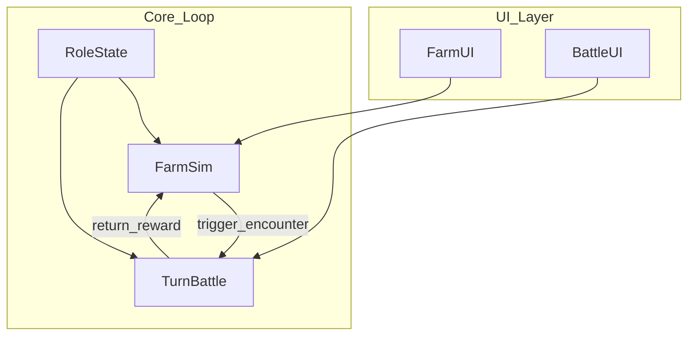
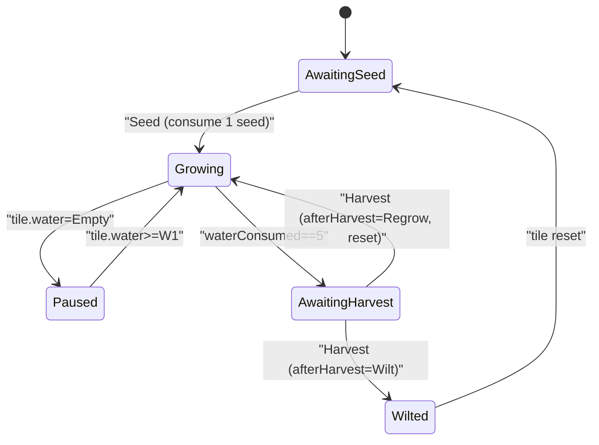
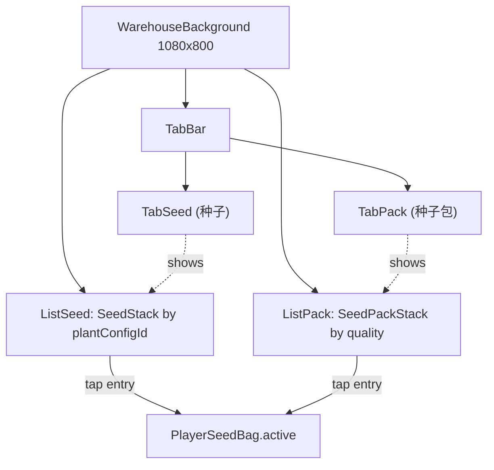

# 农场经营 + 回合战斗 手机游戏 Demo — 规格说明（SPEC）

# Farm Management + Turn-Based Battle Mobile Game Demo — Specification (SPEC)

---

## 术语与命名 / Glossary

**中文：** 本文档中 **Role** 专指由玩家操控的主角之显示名与剧情名；实现代码中可使用如 `PlayerRole`、`PlayerActor` 等类型名，以避免与引擎或语言保留概念混淆。  
**English:** In this document, **Role** is the display and narrative name of the player-controlled protagonist; implementation may use type names such as `PlayerRole` or `PlayerActor` to avoid confusion with engine or language reserved concepts.

**中文：** **设计基准分辨率** 指竖屏下逻辑设计画布为 **宽 1080 像素 × 高 1920 像素**（1080×1920）；UI 与布局以此为准，在其它物理分辨率上通过缩放与安全区适配。  
**English:** **Design baseline resolution** means a portrait logical design canvas of **1080 pixels wide × 1920 pixels tall** (1080×1920); UI and layout follow this baseline, with scaling and safe-area adaptation on other physical resolutions.

**中文：** **安全区** 指避开刘海、圆角与系统手势带的可交互内容区域；具体边距可在实现阶段按平台取 `Screen.safeArea` 或等价 API。  
**English:** **Safe area** is the region for interactive content that avoids notches, rounded corners, and system gesture areas; margins can be taken from `Screen.safeArea` or equivalent APIs per platform during implementation.

**中文：** **农场（Farm）** 指种植、生长、收获与资源产出的模拟模块（Demo 可极简）。  
**English:** **Farm** refers to the simulation module for planting, growth, harvest, and resource output (the demo may be minimal).

**中文：** **回合战斗（Turn-Based Battle）** 指按回合顺序结算行动的战斗模块。  
**English:** **Turn-based battle** refers to the combat module where actions are resolved in turn order.

**中文：** Unity 工程路径：`PetDemo_2/PetDemo_2`（相对仓库根目录）。  
**English:** Unity project path: `PetDemo_2/PetDemo_2` (relative to repository root).

**中文：** **1 阶 / 2 阶 / 3 阶属性（Tier-1 / Tier-2 / Tier-3 Attributes）** 指主角 Role 与战斗单位（含敌人）的分组数值集合：**1 阶**为基础战斗常量（攻击 `atk`、防御 `def`、生命 `maxHp/currentHp`、敏捷 `agility`），直接参与伤害与出手顺序；**2 阶**为施加方触发率（暴击率 `critRate`、连击率 `comboRate`、反击率 `counterRate`、格挡率 `blockRate`），取值范围 `0..1`；**3 阶**为承受方对应的抵消率（`critResist / comboResist / counterResist / blockResist`），同样 `0..1`，与 2 阶字段一一抵消。  
**English:** **Tier-1 / Tier-2 / Tier-3 Attributes** are grouped numeric stat sets carried by Role and any battle unit (including enemies): **Tier-1** are base combat constants (attack `atk`, defense `def`, life `maxHp/currentHp`, agility `agility`) that directly drive damage and turn order; **Tier-2** are attacker-side trigger rates (`critRate`, `comboRate`, `counterRate`, `blockRate`) in `0..1`; **Tier-3** are the defender-side resistances (`critResist`, `comboResist`, `counterResist`, `blockResist`) in `0..1`, paired one-to-one with Tier-2 fields to offset them.

---

## 1. 目标与范围 / Goals and Scope

**中文：** 本 Demo 旨在验证一条可玩闭环：玩家在农场完成至少一次「种植→等待/推进→收获→获得资源」，并可通过既定入口进入一场最小回合战斗，战斗结束后带着简单奖励或状态变化返回农场流程；全程以竖屏 1080×1920 为设计基准，主角统一称为 Role。  
**English:** This demo aims to validate one playable loop: the player completes at least one farm cycle of “plant → wait/advance → harvest → gain resources,” can enter one minimal turn-based battle through a defined entry point, and returns to the farm flow with simple rewards or state changes; the whole experience uses portrait 1080×1920 as the design baseline, and the protagonist is consistently named Role.

**中文：** **范围内**：竖屏 UI 壳层、农场极简循环、回合战斗最小规则集、农场与战斗之间的场景或界面切换、Role 的基础属性在两侧系统中的体现（可简化为少量数值）。  
**English:** **In scope:** portrait UI shell, a minimal farm loop, a minimal turn-based rule set, navigation between farm and battle (scenes or UI flow), and Role’s basic attributes reflected in both systems (can be simplified to a few stats).

**中文：** **范围外（非目标）**：联网多人、账号与云存档、内购与广告、完整经济平衡、长剧情、大量关卡与敌人种类、高级 AI、本地化全流程（SPEC 双语仅为文档要求，不代表游戏内多语言成品）。  
**English:** **Out of scope (non-goals):** online multiplayer, accounts and cloud saves, IAP and ads, full economic balance, long narrative, large amounts of levels and enemy types, advanced AI, and full in-game localization (bilingual SPEC is documentation-only, not a shipped multilingual product).

---

## 2. 设计基准与显示 / Display and Safe Area

**中文：** 设计基准分辨率为 **1080×1920**，**竖屏**；宽度 1080、高度 1920 为逻辑像素（与 Canvas 参考分辨率一致）。  
**English:** The design baseline resolution is **1080×1920**, **portrait**; width 1080 and height 1920 are logical pixels (aligned with the Canvas reference resolution).

**中文：** 重要 UI（血条、主要按钮、作物格）应落在安全区内；背景可全屏铺色或铺图至边缘，但需避免关键信息贴边被裁切。  
**English:** Important UI (health bars, primary buttons, crop slots) should lie within the safe area; backgrounds may extend to full bleed, but critical information must not be clipped at edges.

**中文：** 触摸目标建议最小约 **44×44** 逻辑像素（或按平台指南取等价值），以保证手机可操作。  
**English:** Touch targets should be at least about **44×44** logical pixels (or equivalent per platform guidelines) for reliable mobile interaction.

**中文：** 当前 Unity 工程 `ProjectSettings` 中默认窗口尺寸可能仍为 **1920×1080** 习惯配置；**实现阶段**须将 Player 与 Game 视图策略与本文档的 **1080×1920 竖屏** 对齐（见第 8 节）。  
**English:** The Unity project `ProjectSettings` may still use **1920×1080** style defaults; **during implementation**, Player and Game view strategy must be aligned with this document’s **1080×1920 portrait** baseline (see Section 8).

---

## 3. 系统架构与流程 / System Design

**中文：** 建议划分为：**FarmSim**（农场模拟）、**TurnBattle**（回合战斗）、**RoleState**（Role 的跨场景属性与背包简化状态）、**FarmUI** / **BattleUI**（展示与输入）、**Navigation**（在农场与战斗之间切换场景或界面栈）。农场可在满足条件时触发战斗，战斗结束后将奖励写回 `RoleState` 与农场相关资源。  
**English:** Suggested modules: **FarmSim** (farm simulation), **TurnBattle** (turn-based combat), **RoleState** (cross-scene Role stats and simplified inventory), **FarmUI** / **BattleUI** (presentation and input), and **Navigation** (scene or UI-stack switches between farm and battle). The farm may trigger battle when conditions are met; after battle, rewards are written back to `RoleState` and farm-related resources.



**中文：** **数据流摘要**：UI 将玩家操作交给模拟或战斗核心；核心读写 `RoleState`；战斗结束通过 `return_reward` 更新农场可用资源或 Role 属性。  
**English:** **Data flow summary:** UI forwards player actions to simulation or battle cores; cores read/write `RoleState`; battle completion updates farm-available resources or Role stats via `return_reward`.

---

## 4. 核心玩法规则（草案）/ Core Gameplay Rules

### 4.1 种植系统 / Planting System

**中文：** 本节自 v0.5 起取代原「极简农场（`Empty/Planted/Growing/Mature` 四态）」，作为新的农场子系统。  
**English:** Since v0.5, this section replaces the previous "minimal farm (`Empty/Planted/Growing/Mature` four-state)" model and serves as the new farm subsystem.

#### 4.1.1 农田规模与分组 / Tile Layout

**中文：** **农田规模与分组**：固定 24 块农田，每 4 块为 1 组、共 6 组；每块农田同一时间最多容纳 1 株植物。UI 上以 6 行 × 4 列网格在 [UI0.png](PetDemo_2/Assets/Scenes/Air/UI/UI0.png) 主界面之上同屏可见，无需滚动。  
**English:** **Tile scale and grouping:** a fixed 24 tiles arranged as 6 groups of 4; each tile holds at most 1 plant at any moment. The UI presents a 6-row × 4-column grid overlaid on [UI0.png](PetDemo_2/Assets/Scenes/Air/UI/UI0.png), fully visible on screen with no scrolling.

**中文：** 农田按 `orderIndex` 1..24 排序（自上而下、每行内自左而右），轮训操作机制按此顺序扫描（详见 §10）。  
**English:** Tiles are ordered by `orderIndex` 1..24 (top-to-bottom, left-to-right within each row); the smart polling mechanism scans in this order (see §10).

#### 4.1.2 农田 5 维独立状态 / Five Independent Tile State Dimensions

**中文：** 每块农田同时持有以下五个互不耦合的子状态机；每一维必处于其唯一取值之一。  
**English:** Each tile holds the following five mutually-decoupled sub-state-machines simultaneously; each dimension must hold exactly one value.

| 维度 / Dimension | 取值 / Values | 说明 / Notes |
|---|---|---|
| `planting` | `AwaitingSeed` / `Seeded` | 待播种 / 已播种 |
| `fertilizer` | `AwaitingFertilizer` / `Fertilized` / `None` | 待施肥 / 已施肥 / 未激活 |
| `water` | `Empty` / `W1` / `W2` / `W3` | 待浇水 / 浇水 1~3 阶；上限 W3，达到 W3 后不可再浇 / max W3, cannot water further once at W3 |
| `pest` | `AwaitingPestControl` / `PestControlled` / `None` | 待捉虫 / 已捉虫 / 未激活 |
| `harvest` | `AwaitingHarvest` / `Harvested` / `None` | 待收获 / 已收获 / 未激活 |

**中文：** `None` 仅当 `planting = AwaitingSeed`（即空田）时取，表示该维度尚未激活；一旦播种，对应维度立即转入有效初始取值（具体初值见 §4.1.4）。  
**English:** `None` is used only when `planting = AwaitingSeed` (empty tile), meaning the dimension is inactive; once seeded, the corresponding dimension immediately enters a valid initial value (see §4.1.4 for initial values).

#### 4.1.3 玩家可执行操作与统一按钮 / Player Actions and Unified Button

**中文：** 玩家共可执行 5 种操作：`播种 / Seed`、`浇水 / Water`、`施肥 / Fertilize`、`捉虫 / PestControl`、`收获 / Harvest`。这 5 种操作 **共享同一枚「操作」按钮**，按当前焦点田的最高优先级动态切换文字与图标；具体扫描与优先级算法见 §10。  
**English:** The player has 5 actions in total: `Seed`, `Water`, `Fertilize`, `PestControl`, `Harvest`. **All five share a single unified action button** whose label and icon switch dynamically based on the focused tile's highest-priority action; see §10 for scan and priority algorithms.

**中文：** 操作优先级（建议）：`收获 > 浇水 > 施肥 > 捉虫 > 播种`；其中 `浇水 > 施肥 > 捉虫` 为玩家明确指定，`收获`置首位（避免错过成熟作物），`播种`置末位（兜底动作）。  
**English:** Action priority (proposed): `Harvest > Water > Fertilize > PestControl > Seed`; the user explicitly specified `Water > Fertilize > PestControl`, with `Harvest` placed first (to avoid missing mature crops) and `Seed` placed last (fallback action).

**中文：** **「播种」操作的活跃道具来源**：种子仓库中存放两类道具——「具体种子（Seed）」与「种子包（SeedPack）」。玩家在仓库中选中其一作为 `PlayerSeedBag.active`（详见 §5、§9.4）；当焦点田进入「播种」分支时，按 `active.kind` 决定具体行为：  
- `Seed`：直接产出与该 `plantConfigId` 对应的固定植物；  
- `SeedPack`：按该品质对应的固定权重表（同品质 = 同内容，详见附录 B.4）随机抽取 1 种 `plantConfigId` 后产出植物。  

无论哪一分支，最终在农田上创建 `PlantInstance` 的初始化逻辑（`waterConsumed=0`、`tile.planting=Seeded` 等）保持一致，详见 §4.1.4。  
**English:** **Active item source for the `Seed` action:** the seed warehouse stores two item categories — concrete `Seed` and `SeedPack`. The player picks one as `PlayerSeedBag.active` (see §5 and §9.4). When the focused tile enters the `Seed` branch, behavior depends on `active.kind`:  
- `Seed`: directly produces the fixed plant for that `plantConfigId`;  
- `SeedPack`: weighted-rolls one `plantConfigId` from the fixed contents table of that quality (same quality = same contents; see Appendix B.4) and then produces the plant.  

Either branch ends with the same `PlantInstance` initialization on the tile (`waterConsumed=0`, `tile.planting=Seeded`, etc.); see §4.1.4 for full details.

#### 4.1.4 植物状态机与生长进程 / Plant State Machine and Growth Process

**中文：** 植物状态：`Growing`（生长）/ `Paused`（暂停生长）/ `AwaitingHarvest`（待收获）/ `Wilted`（枯萎）。植物维护 `waterConsumed (0..5)` 与 `appearanceNode (1..5)` 两个数值字段，并以 `currentStageRemainingSec` 跟踪当前一阶水的剩余倒计时。  
**English:** Plant states: `Growing` / `Paused` / `AwaitingHarvest` / `Wilted`. Each plant maintains numeric fields `waterConsumed (0..5)`, `appearanceNode (1..5)`, and `currentStageRemainingSec` for the current water-stage countdown.

**中文：** **生长进程规则（核心）**：

1. **播种**：依据 `PlayerSeedBag.active.kind` 分两支处理（详见 §4.1.3、§5、附录 B.4）：
   - **`Seed` 分支**：消耗 `SeedStack(active.id)` 中 1 个 → 选定 `plantConfigId = active.id`。
   - **`Pack` 分支**：消耗 `SeedPackStack(active.id)`（即对应品质堆）中 1 个 → 调用 `RollSeedPack(active.id) → plantConfigId`，按附录 B.4 的固定权重表随机抽取一种作物，并触发 `OnSeedRolledFromPack(tileId, packQuality, rolledPlantConfigId)`。
   
   两分支汇合后：在该田创建 `PlantInstance` 并进入 `Growing`；初值 `waterConsumed=0`、`appearanceNode=1`、`currentStageRemainingSec=baseStageSeconds`；同时设置 `tile.planting=Seeded`、`tile.fertilizer=AwaitingFertilizer`、`tile.harvest=AwaitingHarvest`、`tile.pest=PestControlled`、`tile.water=Empty`。
2. **暂停 / 恢复**：`tile.water=Empty` 时植物处于 `Paused`，倒计时冻结；`tile.water∈{W1,W2,W3}` 时植物处于 `Growing`，倒计时按当前速度推进。
3. **倒计时结束**：执行 `tile.water` 阶 −1、`waterConsumed +=1`、`appearanceNode = min(5, waterConsumed+1)`、重置 `currentStageRemainingSec=baseStageSeconds`。若 `tile.water` 减为 `Empty`，植物切换为 `Paused`。
4. **施肥加速**：当 `tile.fertilizer=Fertilized` 时，倒计时按 ×1.5 速度推进（即 `currentStageRemainingSec` 每秒减少 1.5 秒，等价于剩余时间整体 ×0.667）。
5. **待收获判定**：`waterConsumed == 5` 时立即进入 `AwaitingHarvest`，停止倒计时；同时把 `tile.harvest` 推为 `AwaitingHarvest`，并强制将 `tile.fertilizer` 复位为 `AwaitingFertilizer`（允许下一周期再次施肥）。

**English:** **Growth process rules (core):**

1. **Seeding:** branch by `PlayerSeedBag.active.kind` (see §4.1.3, §5, Appendix B.4):
   - **`Seed` branch:** consume 1 from `SeedStack(active.id)` → choose `plantConfigId = active.id`.
   - **`Pack` branch:** consume 1 from `SeedPackStack(active.id)` (the stack of that quality) → invoke `RollSeedPack(active.id) → plantConfigId` to weighted-sample one crop from the fixed contents table in Appendix B.4, and fire `OnSeedRolledFromPack(tileId, packQuality, rolledPlantConfigId)`.
   
   After either branch: create a `PlantInstance` on the tile and enter `Growing`; initial values `waterConsumed=0`, `appearanceNode=1`, `currentStageRemainingSec=baseStageSeconds`; tile flags set to `tile.planting=Seeded`, `tile.fertilizer=AwaitingFertilizer`, `tile.harvest=AwaitingHarvest`, `tile.pest=PestControlled`, `tile.water=Empty`.
2. **Pause / resume:** when `tile.water=Empty`, the plant is `Paused` with the countdown frozen; when `tile.water∈{W1,W2,W3}`, the plant is `Growing` with the countdown active at the current speed.
3. **Countdown end:** apply `tile.water` stage −1, `waterConsumed +=1`, `appearanceNode = min(5, waterConsumed+1)`, and reset `currentStageRemainingSec=baseStageSeconds`. If `tile.water` falls to `Empty`, the plant switches to `Paused`.
4. **Fertilizer acceleration:** when `tile.fertilizer=Fertilized`, the countdown advances at ×1.5 speed (i.e. `currentStageRemainingSec` decreases by 1.5 per real second, equivalent to overall remaining time ×0.667).
5. **Maturity:** as soon as `waterConsumed == 5` the plant enters `AwaitingHarvest` and the countdown stops; the tile's `harvest` is pushed to `AwaitingHarvest`, and `tile.fertilizer` is forcibly reset to `AwaitingFertilizer` (allowing fertilization in the next cycle).

#### 4.1.5 收获结算 / Harvest Resolution

**中文：** 玩家执行「收获」后，依据 `PlantConfig.afterHarvest` 选择分支：

- **`Wilt`（一次性 / annual）**：销毁 `PlantInstance`，农田全维度复位为初始（`planting=AwaitingSeed`、`fertilizer/pest/harvest=None`、`water=Empty`、`plantInstanceId=null`）。
- **`Regrow`（多次性 / perennial）**：保留 `PlantInstance`，重置 `waterConsumed=0`、`appearanceNode=1`、`state=Growing`；同时 `tile.harvest=AwaitingHarvest`、`tile.fertilizer=AwaitingFertilizer`、`tile.pest=PestControlled`、`tile.water` 保留当前阶（玩家可继续利用先前剩余的水）。

**English:** When the player performs `Harvest`, the branch is selected by `PlantConfig.afterHarvest`:

- **`Wilt` (annual):** destroy the `PlantInstance` and reset all tile dimensions to initial (`planting=AwaitingSeed`, `fertilizer/pest/harvest=None`, `water=Empty`, `plantInstanceId=null`).
- **`Regrow` (perennial):** keep the `PlantInstance`, reset `waterConsumed=0`, `appearanceNode=1`, `state=Growing`; set `tile.harvest=AwaitingHarvest`, `tile.fertilizer=AwaitingFertilizer`, `tile.pest=PestControlled`; `tile.water` keeps its current stage (the player may continue to use any leftover water).

#### 4.1.6 外围事件 / 捉虫 / External Event and Pest Control

**中文：** 植物处于 `Growing` 时，外围事件调度器按植物 `pestEventIntervalSec` 与 `pestEventProb` 配置抽取触发：成功触发即将 `tile.pest` 翻为 `AwaitingPestControl`。玩家执行「捉虫」后翻回 `PestControlled`。**捉虫的具体玩法（如小游戏、判定规则、未及时处理的负面收益）暂列为 P1，待后续补充**；Demo 实现为单击即完成、暂不影响生长倒计时。  
**English:** While a plant is `Growing`, an external event scheduler samples per-plant `pestEventIntervalSec` and `pestEventProb` config: on success it flips `tile.pest` to `AwaitingPestControl`. Performing `PestControl` flips it back to `PestControlled`. **The detailed pest-catch gameplay (mini-game, hit checks, penalties for inaction) is P1, pending later definition**; the demo implements it as a single tap with no current effect on the growth countdown.

#### 4.1.7 5 节点外观映射 / Five-Node Appearance Mapping

**中文：** 植物外观节点 = `min(5, waterConsumed + 1)`。播种瞬间为节点 1；每消耗 1 阶水 +1；消耗第 4 阶水后到达节点 5，对应「待收获」外观。具体精灵 ID 与作物列表见附录 B。  
**English:** Appearance node = `min(5, waterConsumed + 1)`. Seeding sets node 1; each water-stage consumed advances by 1; after the 4th stage consumed the plant reaches node 5 — the "awaiting harvest" appearance. Sprite IDs and crop list are listed in Appendix B.

#### 4.1.8 植物状态机示意 / Plant State Machine Diagram



#### 4.1.9 可砍需求 / Cuttables

**中文：** 捉虫小游戏、施肥/浇水的资源消耗、虫害负面收益、土壤肥力衰减、天气与季节——首版 SPEC 不纳入 P0。  
**English:** **Cuttables:** pest mini-game, fertilizer/water resource costs, pest damage penalties, soil fertility decay, weather and seasons — not in P0.

### 4.2 回合战斗 / Turn-Based Battle

**中文：** **Demo 极简目标**：单场战斗包含 **Role** 与 **至少一名敌人**；按 **敏捷（`agility`，原 `speed`）或固定先后** 决定出手顺序；每回合单位可选择 **攻击** 或 **防御**（Demo 可仅实现攻击）；一方 **HP ≤ 0** 则战斗结束。  
**English:** **Minimal demo goal:** one battle with **Role** and **at least one enemy**; turn order by **agility (`agility`, formerly `speed`) or fixed order**; each turn a unit may **attack** or **defend** (demo may implement attack only); battle ends when one side has **HP ≤ 0**.

**中文：** 伤害公式首版可采用：`damage = max(1, attacker.atk - defender.def)`，再按需取整；后续平衡调整须先更新 SPEC。  
**English:** Initial damage formula: `damage = max(1, attacker.atk - defender.def)`, rounded as needed; balance changes require SPEC updates first.

**中文：** **2/3 阶属性的 P0 行为**：本阶段仅作为 `RoleStats` 中的可读字段与 UI 展示数据，**不参与** `damage = max(1, attacker.atk - defender.def)` 的实际结算；P0 期间无论 `critRate / comboRate / counterRate / blockRate` 与对应抵消率取何值，伤害公式不变。出手顺序仍由 1 阶 `agility` 驱动（与原 `speed` 同义）。  
**English:** **Tier-2/3 P0 behavior:** during P0 these are read-only fields on `RoleStats` for UI display only and **do not** participate in the actual `damage = max(1, attacker.atk - defender.def)` resolution; regardless of the values of `critRate / comboRate / counterRate / blockRate` and their resistances, the damage formula stays unchanged in P0. Turn order is still driven by Tier-1 `agility` (same semantics as the legacy `speed`).

**中文：** **P1 接入占位**：当 2/3 阶进入战斗结算时，建议判定顺序为 `暴击 → 连击 → 反击 → 格挡`，每项以 `effectiveRate = clamp(attackerRate - defenderResist, 0, 1)` 抵消思路计算最终触发率；具体随机化、与基础伤害的乘加关系、与 `defend` 行动的叠加规则均留待 P1 SPEC 细化（变更必须先更新本节）。  
**English:** **P1 hookup placeholder:** when Tier-2/3 enter battle resolution, the proposed check order is `Crit → Combo → Counter → Block`; each uses `effectiveRate = clamp(attackerRate - defenderResist, 0, 1)` to derive the final trigger rate; randomization, multiplicative/additive interaction with base damage, and stacking with the `Defend` action are all deferred to P1 SPEC details (any change must update this section first).

**中文：** **可砍需求**：技能树、元素克制、Buff/Debuff 复杂栈、多目标与位置——首版 SPEC 不纳入 P0。  
**English:** **Cuttable for later:** skill trees, elemental counters, complex buff/debuff stacks, multi-target positioning — not in P0.

### 4.3 串联 / Linking Farm and Battle

**中文：** 进入战斗的条件示例：收获达到指定次数、或点击「试炼」按钮消耗 `CropToken`；实现任选其一即可满足 Demo。  
**English:** Example battle entry conditions: harvest count threshold, or a “trial” button consuming `CropToken`; implementing any one satisfies the demo.

**中文：** 战斗胜利奖励示例：增加金币、恢复 Role HP、或解锁下一作物；Demo 至少实现一种可感知反馈。  
**English:** Example victory rewards: gold increase, Role HP restore, or unlocking the next crop; the demo should implement at least one clear feedback.

---

## 5. 数据结构 / Data Structures

**中文：** 以下为逻辑结构草案；字段名在实现中应保持一致，变更须同步 SPEC。  
**English:** The following are logical schema drafts; field names should stay consistent in code, and changes must sync back to the SPEC.

```text
// RoleStats — 主角 Role（与所有战斗单位）的可战斗与可展示属性
// 字段按 1/2/3 阶分组；1 阶为整数，2/3 阶为 0..1 的浮点
// RoleStats — combat & display stats for Role and any battle unit (incl. enemies)
// Fields grouped by Tier-1/2/3; Tier-1 are ints, Tier-2/3 are floats in [0,1]
struct RoleStats {
  string displayName;       // 固定为 "Role" / fixed "Role"
  // ---- Tier-1：基础战斗属性 / Base combat stats ----
  int atk;                  // 攻击 / attack
  int def;                  // 防御 / defense
  int maxHp;                // 生命上限 / max life
  int currentHp;            // 当前生命 / current life
  int agility;              // 敏捷；决定出手顺序；Demo 可恒为 10
                            // agility; drives turn order; demo may fix at 10
                            // 取代旧字段 speed（同义重命名，见 §11 v0.6）
                            // replaces the legacy field "speed" (rename, see §11 v0.6)
  // ---- Tier-2：施加方触发率（0..1） / Attacker trigger rates [0,1] ----
  float critRate;           // 暴击率 / crit rate
  float comboRate;          // 连击率 / combo rate
  float counterRate;        // 反击率 / counter rate
  float blockRate;          // 格挡率 / block rate
  // ---- Tier-3：承受方抵消率（0..1） / Defender resistances [0,1] ----
  float critResist;         // 抵消暴击率 / crit resist
  float comboResist;        // 抵消连击率 / combo resist
  float counterResist;      // 抵消反击率 / counter resist
  float blockResist;        // 抵消格挡率 / block resist
}

// Demo 默认值 / Demo defaults (Role)：
//   Tier-1: atk=10, def=5, maxHp=50, currentHp=50, agility=10
//   Tier-2: critRate=comboRate=counterRate=blockRate=0.05
//   Tier-3: critResist=comboResist=counterResist=blockResist=0.00
// 敌人模板 / Enemy templates 共用同形 RoleStats，2/3 阶默认全 0；具体平衡数值在 P1 实装时补全。
// Enemies share the same RoleStats schema with Tier-2/3 defaulted to 0;
// concrete balance values are supplied when P1 implementation lands.

// CropTile — 单块农田（5 维独立状态机，详见 §4.1.2）
// CropTile — single farm tile (five independent dimensions, see §4.1.2)
enum PlantingFlag   { AwaitingSeed, Seeded }
enum FertilizerFlag { None, AwaitingFertilizer, Fertilized }
enum WaterStage     { Empty, W1, W2, W3 }                  // 上限 W3 / max W3
enum PestFlag       { None, AwaitingPestControl, PestControlled }
enum HarvestFlag    { None, AwaitingHarvest, Harvested }

struct CropTile {
  string tileId;
  int orderIndex;                  // 1..24，决定轮训扫描顺序 / drives polling order
  PlantingFlag    planting;
  FertilizerFlag  fertilizer;
  WaterStage      water;
  PestFlag        pest;
  HarvestFlag     harvest;
  string plantInstanceId;          // 空表示无植物 / empty when AwaitingSeed
}

// 种子仓库道具体系（自 v0.6 起）：仓库内存放两类道具——
//   1) 具体「种子 / Seed」（按 plantConfigId 堆叠，1 个 = 1 颗固定植物）
//   2) 「种子包 / SeedPack」（按品质 quality 堆叠；同品质 = 同内容；播种瞬间开包）
// Seed warehouse item system (since v0.6): two item categories live in the warehouse —
//   1) concrete Seed (stacked by plantConfigId; 1 item = 1 fixed plant)
//   2) SeedPack    (stacked by quality; same quality = same contents; rolled on planting)

// SeedPackQuality — 种子包品质 4 级 / four pack-quality tiers
//  Common 普通(白) | Rare 稀有(蓝) | Epic 史诗(紫) | Legendary 传说(橙)
enum SeedPackQuality { Common, Rare, Epic, Legendary }

// SeedStack — 仓库中具体种子的堆叠条目，以 plantConfigId 为堆叠键
// SeedStack — concrete-seed stack in the warehouse, stacked by plantConfigId
struct SeedStack {
  string plantConfigId;            // 同时也是堆叠键 / also the stacking key
  int    count;
}

// SeedPackStack — 仓库中种子包的堆叠条目，以品质为堆叠键
// SeedPackStack — seed-pack stack in the warehouse, stacked by quality
struct SeedPackStack {
  SeedPackQuality quality;         // 同时也是堆叠键 / also the stacking key
  int             count;
}

// ActiveKind / ActiveSelection — 玩家当前选中的活跃道具（用于「播种」操作）
// ActiveKind / ActiveSelection — currently active item picked for the `Seed` action
enum ActiveKind { Seed, Pack }
struct ActiveSelection {
  ActiveKind kind;
  string     id;                   // kind=Seed 时为 plantConfigId / when Seed: plantConfigId
                                   // kind=Pack 时为 SeedPackQuality 的字符串值
                                   // when Pack: stringified SeedPackQuality
}

// PlayerSeedBag — 玩家的种子仓库（即背包，详见 §4.1.3 / §9 / §9.4）
// PlayerSeedBag — player's seed warehouse (serves as bag, see §4.1.3, §9, §9.4)
struct PlayerSeedBag {
  list<SeedStack>     seeds;       // 按 plantConfigId 堆叠 / stacked by plantConfigId
  list<SeedPackStack> seedPacks;   // 按 quality 堆叠       / stacked by quality
  ActiveSelection?    active;      // 当前活跃道具（最多一个，可空） / current active item, at most one
}

// SeedPackContents — 单一品质对应的固定权重表（同品质 = 同内容）
// SeedPackContents — fixed weighted contents per quality (same quality = same contents)
struct SeedPackContentsEntry {
  string plantConfigId;            // 抽中后产出的作物 / yielded crop on roll
  float  weight;                   // 相对权重，权重和不必为 1 / relative weight, sum need not be 1
}
struct SeedPackContents {
  SeedPackQuality              quality;
  list<SeedPackContentsEntry>  entries;
}

// PlantConfig — 植物静态配置（来自附录 B 的配置表）
// PlantConfig — static plant config (from the table in Appendix B)
enum AfterHarvest { Wilt, Regrow }
struct PlantConfig {
  string id;
  string displayName;
  list<string> appearanceSpriteIds; // 长度 5：节点 1..5 / length 5: node 1..5
  float  baseStageSeconds;          // 每阶水倒计时基础秒数 / per-stage base seconds
  float  fertilizerSpeedMul;        // 默认 1.5 / default 1.5
  AfterHarvest afterHarvest;
  float  pestEventIntervalSec;      // 外围事件抽取间隔 / pest event sampling interval
  float  pestEventProb;             // 单次抽取触发概率 0..1 / per-sample probability
}

// PlantInstance — 在场植物运行时实例
// PlantInstance — runtime plant instance on a tile
enum PlantState { Growing, Paused, AwaitingHarvest, Wilted }
struct PlantInstance {
  string instanceId;
  string plantConfigId;             // 与 PlantConfig.id 对应 / matches PlantConfig.id
  string tileId;                    // 所在农田 / hosting tile
  PlantState state;
  int   waterConsumed;              // 0..5
  int   appearanceNode;             // 1..5，= min(5, waterConsumed + 1)
  float currentStageRemainingSec;   // 当前一阶水的剩余倒计时 / remaining countdown of current stage
}

// BattleUnit — 战斗中的单位实例
// BattleUnit — unit instance in battle
struct BattleUnit {
  string unitId;
  bool isPlayerControlled;  // Role 为 true / true for Role
  RoleStats stats;          // 敌我同形：均使用完整 1~3 阶 RoleStats
                            // shared schema: both sides use the full Tier-1/2/3 RoleStats
                            // 敌人 Tier-2/3 默认全 0，P0 不参与结算（见 §4.2）
                            // enemy Tier-2/3 default to 0, not active in P0 (see §4.2)
}

// BattleAction — 回合内行动
// BattleAction — action in a turn
enum ActionType { Attack, Defend, Pass }
struct BattleAction {
  string actorUnitId;
  ActionType type;
  string targetUnitId;      // Defend 可为空 / may be empty for Defend
}

// GameSession — Demo 级会话状态（非完整存档系统）
// GameSession — demo-level session state (not a full save system)
struct GameSession {
  RoleStats role;
  list<CropTile> farmTiles;          // 固定长度 24 / fixed length 24
  list<PlantInstance> plants;         // 当前在场植物 / live plants
  PlayerSeedBag seedBag;              // 种子仓库 = 背包 / warehouse-as-bag
  list<PlantConfig> plantConfigs;     // 由附录 B 数据加载 / loaded from Appendix B
  list<SeedPackContents> packContents; // 4 品质权重表，由附录 B.4 加载 / 4 quality tables, loaded from Appendix B.4
  int cropTokens;
  bool battleUnlocked;                // 可选 / optional
}
```

---

## 6. 接口与交互 / APIs and Interactions

**中文：** 本 Demo **无对外 REST/HTTP API**；所有交互为客户端内 C# 接口与 UI 事件。  
**English:** This demo has **no external REST/HTTP APIs**; all interaction is in-client C# APIs and UI events.

**中文：** **输入**：单指触摸点击/短按；农场为地块与按钮；战斗为行动按钮（攻击/防御/结束回合若需要）。  
**English:** **Input:** single-finger tap/short press; farm uses tiles and buttons; battle uses action buttons (attack/defend/end turn if needed).

**中文：** **建议对内服务接口（概念层）**  
**English:** **Suggested internal service interfaces (conceptual)**

种植系统 / Planting system（自 v0.5 起取代 `IFarmService`）：

- `IPlantingService.SelectActive(kind, id)` — 设置当前活跃道具：`kind=Seed` 时 `id` 为 `plantConfigId`；`kind=Pack` 时 `id` 为 `SeedPackQuality` 字符串值（自 v0.6 起取代 `SelectActiveSeed`） / set the current active item: when `kind=Seed`, `id` is a `plantConfigId`; when `kind=Pack`, `id` is the stringified `SeedPackQuality` (replaces `SelectActiveSeed` since v0.6)
- `IPlantingService.GetActive() → ActiveSelection?` — 读取当前活跃道具 / read the current active selection
- `IPlantingService.RollSeedPack(quality) → plantConfigId` — 内部接口：按 `SeedPackContents[quality]` 的固定权重表抽取 1 种作物（详见附录 B.4） / internal: weighted-sample one crop from the fixed contents table for the quality (see Appendix B.4)
- `IPlantingService.ExecuteUnifiedAction()` — 触发统一「操作」按钮：执行智能轮训扫描并对首块「有事可做」的农田执行最高优先级动作（详见 §10） / triggers the unified action button: smart polling scan + execute highest-priority action on the first actionable tile (see §10)
- `IPlantingService.GetTile(orderIndex) → CropTile` — 按 1..24 的顺序号读取农田 / fetch a tile by 1..24 order index
- `IPlantingService.GetActionableActionOf(tileId) → ActionType?` — 查询某农田当前可执行的最高优先级动作（无可执行返回空） / query the highest-priority action available on a tile (null if none)
- `IPlantingService.GetCurrentFocusTileId() → string?` — 读取当前焦点田（用于 UI 高亮） / get the current focus tile (for UI highlight)
- `IPlantingService.TickGrowth(deltaSeconds)` — 推进所有 `Growing` 植物的倒计时（由主循环调用） / tick all `Growing` plants' countdowns (called by main loop)

战斗系统 / Battle system：

- `IBattleService.StartEncounter(enemyTemplateId)` — 开始战斗 / start battle  
- `IBattleService.SubmitAction(BattleAction)` — 提交本回合行动 / submit turn action  
- `INavigationService.GoToFarm()` / `GoToBattle()` — 场景或界面切换 / scene or UI navigation  

**中文：** **操作类型枚举**（与按钮文字/图标映射）：`enum ActionType { Seed, Water, Fertilize, PestControl, Harvest }`。  
**English:** **Action type enum** (mapped to button label/icon): `enum ActionType { Seed, Water, Fertilize, PestControl, Harvest }`.

**中文：** **事件（命名示例）**：

- `OnTileFlagsChanged(tileId)` — 农田任一维度状态变化（UI 刷新单格） / any of a tile's five dimensions changed
- `OnPlantStateChanged(plantInstanceId, newState)` — 植物状态机切换 / plant state-machine transition
- `OnAppearanceNodeChanged(plantInstanceId, node)` — 植物外观节点变化（驱动精灵切换） / plant appearance node change (drives sprite swap)
- `OnFocusChanged(tileId)` — 当前焦点田变化（UI 高亮迁移） / focused tile changed
- `OnUnifiedActionExecuted(tileId, actionType)` — 一次统一按钮操作执行完成 / a unified action has been executed
- `OnSeedBagChanged()` — 仓库 = 背包内容变化（种子 / 种子包数量、当前 `active` 选择等） / warehouse/bag content changed (seed / pack counts, current `active`, etc.)
- `OnSeedRolledFromPack(tileId, packQuality, rolledPlantConfigId)` — 「播种」分支为 `Pack` 时，按品质权重表 roll 出具体作物的瞬间触发；UI 可据此播放开包动画 / fired at the moment the `Pack` branch of `Seed` rolls a concrete crop from the quality contents table; the UI may use it to play an open-pack animation
- `OnPestEventTriggered(tileId)` — 外围事件触发：田进入待捉虫 / pest event triggered on a tile
- `OnBattleEnded(result)`、`OnRoleStatsChanged` — 战斗与角色属性事件（沿用，作为粗粒度通知） / battle and role events (carried over, coarse-grained)
- `OnRoleAttributeChanged(tier, fieldId)` — 角色属性的细粒度变更通知；`tier ∈ {1,2,3}` 对应 §5 中 1/2/3 阶分组，`fieldId` 为字段名字符串（如 `"atk" / "critRate" / "blockResist"`），便于属性面板按阶或按字段做局部刷新 / fine-grained role attribute change; `tier ∈ {1,2,3}` matches Tier-1/2/3 grouping in §5, `fieldId` is the field name string (e.g. `"atk" / "critRate" / "blockResist"`) to enable per-tier or per-field partial refresh on the attribute panel

**English:** **Events (examples):** see the bilingual list above; all are intended for UI refresh.

**中文：** 场景加载可使用 Unity `SceneManager` 或单场景内面板切换；SPEC 不强制二选一，由实现选型并在变更记录中注明。  
**English:** Scene loading may use Unity `SceneManager` or in-scene panel switching; the SPEC does not mandate either; record the choice in the revision log.

---

## 7. 实现优先级与依赖 / Implementation Priority

**中文：** **P0**：竖屏 1080×1920 UI 壳；显示 Role 名称与基础属性（覆盖完整 1 阶 `atk / def / maxHp / currentHp / agility`，并以只读形式展示 2/3 阶字段）；`RoleStats` 数据结构升级为 1~3 阶分组（§5）；24 农田 6×4 网格在主界面同屏可见；五维独立状态机；统一「操作」按钮 + 智能轮训（§10）；5 节点植物外观；`Wilt / Regrow` 两种 `afterHarvest`；`Fertilized` ×1.5 速度；至少 1 种作物可走通「播种 → 浇水 → 施肥（可选）→ 待收获 → 收获」闭环；一场最小回合战斗（Role vs 1 敌），按 `damage = max(1, atk - def)` 结算（2/3 阶不参与）；战斗结束后回到农场并体现一项奖励或状态变化。  
**English:** **P0:** portrait 1080×1920 UI shell; show Role name and basic stats (full Tier-1 `atk / def / maxHp / currentHp / agility`, plus Tier-2/3 fields rendered read-only); `RoleStats` upgraded to the Tier-1/2/3 grouping (§5); 24 tiles in a 6×4 grid fully visible on the main screen; five independent state dimensions; unified action button + smart polling (§10); 5-node plant appearance; both `Wilt` and `Regrow` `afterHarvest`; `Fertilized` ×1.5 speed; at least one crop completes the loop "Seed → Water → Fertilize (optional) → AwaitingHarvest → Harvest"; one minimal battle (Role vs one enemy) resolved by `damage = max(1, atk - def)` (Tier-2/3 not active); return to farm with one visible reward or state change.

**中文：** **P1**：外围事件 / 捉虫的具体玩法（小游戏、判定、未及时处理的负面收益）；多作物（附录 B 6 种全部接入）；播种、收获、施肥的过场动效；与 §4.2 战斗的串联条件（如以收获物代替原 `cropTokens`）；简单敌人数值模板与防御行动；**2/3 阶属性接入战斗结算**：按 §4.2 占位顺序 `暴击 → 连击 → 反击 → 格挡` 实现判定与 `effectiveRate = clamp(attackerRate - defenderResist, 0, 1)` 抵消，并补全敌人模板的 1~3 阶默认数值。  
**English:** **P1:** detailed pest mini-game (hit checks, penalties); all 6 crops from Appendix B wired in; seed/harvest/fertilize transition motion; battle entry conditions linked to harvested goods (replacing the original `cropTokens` placeholder); simple enemy stat templates and the defend action; **Tier-2/3 attributes enter battle resolution**: implement the `Crit → Combo → Counter → Block` order from §4.2 with `effectiveRate = clamp(attackerRate - defenderResist, 0, 1)`, and supply Tier-1/2/3 defaults for enemy templates.

**中文：** **P2**：仓库 ↔ 背包分离与升级；本地持久化（PlayerPrefs 级）保存农田与植物快照（含完整 1~3 阶 `RoleStats`）；天气/季节、土壤肥力衰减；胜利结算面板；属性成长 / 装备加成对 1~3 阶字段的修改通道。  
**English:** **P2:** warehouse-vs-bag separation and upgrades; local persistence (PlayerPrefs-level) for tile and plant snapshots (including full Tier-1/2/3 `RoleStats`); weather/seasons, soil fertility decay; victory summary panel; growth/equipment modifiers feeding into Tier-1/2/3 fields.

**中文：** **依赖关系**：`RoleState`（含完整 1~3 阶 `RoleStats`）为种植与战斗的共享依赖；`RoleStats` 数据结构升级先于 §4.2 P1 战斗扩展；`PlantConfig` 为种植的静态依赖（来自附录 B）；Navigation 依赖两者就绪；无循环依赖。  
**English:** **Dependencies:** `RoleState` (carrying the full Tier-1/2/3 `RoleStats`) is shared by Planting and Battle; the `RoleStats` schema upgrade must land before the P1 battle extension in §4.2; `PlantConfig` is a static dependency for Planting (from Appendix B); Navigation depends on both being ready; no circular dependency.

---

## 8. 技术实现建议 / Technical Notes (Unity)

**中文：** **Canvas**：使用 Screen Space - Overlay 或 Camera 模式均可；**Canvas Scaler** 建议 **Scale With Screen Size**，参考分辨率 **1080×1920**，Match 可设为 **0.5** 或按宽度优先微调，使竖屏手机接近设计稿。  
**English:** **Canvas:** Overlay or Camera mode is fine; **Canvas Scaler** should use **Scale With Screen Size** with reference resolution **1080×1920**; Match around **0.5** or width-biased tuning for phones.

**中文：** **Player Settings**：将 **默认方向** 设为竖屏优先，并限制不必要横屏；将 **默认分辨率/Game 视图** 与 **1080×1920** 对齐；Android/iOS 图标与启动图非 P0，可后续补。  
**English:** **Player Settings:** set **default orientation** to portrait-primary and restrict unnecessary landscape; align **default resolution / Game view** with **1080×1920**; icons and splash screens are not P0.

**中文：** **与当前工程差异**：仓库内 `ProjectSettings` 常见默认仍为 **1920×1080** 横屏习惯；实现时须改为与本 SPEC 一致，避免 UI 在错误纵横比下验收。  
**English:** **Gap vs current project:** `ProjectSettings` may still reflect **1920×1080** landscape habits; implementation must align with this SPEC to avoid wrong-aspect acceptance.

**中文：** **资源**：`PetDemo_2/PetDemo_2/Assets/Scenes/Air/Role/` 下已有角色相关美术，**可选复用**为 Role 展示；若路径或资产变更，更新本节说明。  
**English:** **Assets:** character art under `PetDemo_2/PetDemo_2/Assets/Scenes/Air/Role/` may **optionally** represent Role; update this note if paths or assets change.

**中文：** **组织建议**：脚本分 Assembly 或文件夹 `Farm`、`Battle`、`UI`、`Core`；保持单一入口场景加载流程清晰。  
**English:** **Organization:** scripts under folders such as `Farm`, `Battle`, `UI`, `Core`; keep a clear bootstrap scene flow.

---

## 9. 主界面与种子仓库弹窗 / Main Menu and Seed Warehouse Modal

**中文：** **主界面** 以全屏 `Image` 展示美术资源 `Assets/Scenes/Air/UI/UI0.png` 作为主要画面；Canvas 参考分辨率 **1080×1920**（竖屏），与第 2、8 节一致。  
**English:** The **main menu** uses a full-screen `Image` with art `Assets/Scenes/Air/UI/UI0.png` as the primary screen; the Canvas reference resolution is **1080×1920** (portrait), consistent with Sections 2 and 8.

**中文：** 主界面包含一枚 **种子仓库入口按钮**，其 `Image.sprite` 使用 `Assets/Scenes/Air/UI/ZhongZi-1.png`；点击后显示 **种子仓库** 弹窗层（`GameObject` 默认隐藏，点击后 `SetActive(true)`）。  
**English:** The main menu includes a **seed warehouse entry button** whose `Image.sprite` uses `Assets/Scenes/Air/UI/ZhongZi-1.png`; tapping it shows the **seed warehouse** modal layer (a `GameObject` hidden by default, then `SetActive(true)`).

**中文：** **种子仓库** 为叠在主界面之上的弹窗：底层为半透明遮罩（可点击关闭），前景为 `Image`，背景图使用 `Assets/Scenes/Air/UI/ZhongZiCangKu_1.png`；具体布局与边距可在实现中微调，但资源路径须保持一致。  
**English:** The **seed warehouse** is a modal over the main menu: a semi-transparent dim layer (tap to close) with a foreground `Image` using `Assets/Scenes/Air/UI/ZhongZiCangKu_1.png`; layout margins may be tuned in implementation, but asset paths must stay as specified.

**中文：** **运行时装载约定**：为确保构建包内 `Resources.Load` 可用，在 `Assets/Resources/AirUI/` 下维护与上述三张图 **同名** 的副本（`UI0.png`、`ZhongZi-1.png`、`ZhongZiCangKu_1.png`）；更新 `Scenes/Air/UI` 源图后应同步更新 `Resources/AirUI` 副本，避免运行时与美术稿不一致。  
**English:** **Runtime loading:** To support `Resources.Load` in builds, keep **same-named** copies under `Assets/Resources/AirUI/` (`UI0.png`, `ZhongZi-1.png`, `ZhongZiCangKu_1.png`); when source art under `Scenes/Air/UI` changes, sync the `Resources/AirUI` copies to avoid runtime vs. design mismatch.

**中文：** **场景入口**：在 `Assets/Scenes/SampleScene.unity`（或后续主菜单场景）中放置挂有 `AirMainMenuRuntimeBuilder` 的根物体（例如 `Boot`），于 `Awake` 中创建 `EventSystem`（若缺失）、`Canvas` 及上述 UI 层级。  
**English:** **Scene bootstrap:** In `Assets/Scenes/SampleScene.unity` (or a later main-menu scene), place a root object (e.g. `Boot`) with `AirMainMenuRuntimeBuilder`, which in `Awake` creates `EventSystem` (if missing), `Canvas`, and the UI hierarchy above.

**中文：** **占位说明**：若 `ZhongZiCangKu_1.png` 尚未由美术提供，可使用临时图占位，但文件名与路径不变，便于替换。  
**English:** If `ZhongZiCangKu_1.png` is not yet delivered, use a temporary image but keep the same file name and path for easy replacement.

**中文：** **种子仓库面板（WarehouseBackground）** 运行时 `RectTransform`：`Width`/`Height` 为 **1080×800**（与参考分辨率宽度对齐）；锚点居中时 `anchoredPosition.y` 为 **-355**。  
**English:** **Seed warehouse panel (`WarehouseBackground`)** at runtime uses `RectTransform` **1080×800** (aligned with design width); with center anchors, `anchoredPosition.y` is **-355**.

### 9.1 24 农田网格布局 / 24-Tile Grid Layout

**中文：** 24 农田以 **6 行 × 4 列** 网格直接叠加在 [UI0.png](PetDemo_2/Assets/Scenes/Air/UI/UI0.png) 主背景之上，同屏可见、无需滚动；网格父容器 `FarmGridRoot` 锚点为画布中心（0.5, 0.5）。  
**English:** The 24 tiles are laid out as a **6-row × 4-column** grid directly overlaid on the [UI0.png](PetDemo_2/Assets/Scenes/Air/UI/UI0.png) main background, fully visible without scrolling; the grid parent `FarmGridRoot` is anchored at canvas center (0.5, 0.5).

**中文：** **设计建议尺寸（可在实现中按美术微调，但比例保持）**：

| 项 / Item | 值 / Value | 说明 / Notes |
|---|---|---|
| 单格 `TileSlot` | 220 × 160 px | 包含农田底图、植物精灵、状态徽标位 / hosts soil sprite, plant sprite, and status badges |
| 列间距 / column gap | 24 px | 4 列共 3 个间距 / 3 gaps for 4 columns |
| 行间距 / row gap | 12 px | 6 行共 5 个间距 / 5 gaps for 6 rows |
| 网格宽 / grid width | 4 × 220 + 3 × 24 = **952 px** | 留 64 px 横向边距 / leaves ~64 px margin |
| 网格高 / grid height | 6 × 160 + 5 × 12 = **1020 px** | 留出顶部 Role 区与底部按钮区 / leaves room for Role at top and buttons at bottom |
| `FarmGridRoot.anchoredPosition` | `(0, 60)` | 相对画布中心略向上偏；可由实现按 UI0.png 美术再调 / slightly above center; tunable per artwork |

**English:** **Suggested design sizes (tunable in implementation while keeping proportions):** see the table above.

**中文：** **`orderIndex` 编号规则**：自上而下、每行内自左而右；第 1 行 = `1..4`、第 2 行 = `5..8`、…、第 6 行 = `21..24`。这一编号同时决定 §10 智能轮训的扫描顺序与每组 4 块的视觉分组。  
**English:** **`orderIndex` numbering:** top-to-bottom, left-to-right within each row; row 1 = `1..4`, row 2 = `5..8`, …, row 6 = `21..24`. This numbering drives the scan order of §10 smart polling and the visual 4-tile grouping.

**中文：** **每个 `TileSlot` 的子层级建议**：底图 `SoilImage`（土壤）→ 植物精灵 `PlantImage`（按 `appearanceNode` 切换）→ 状态徽标层 `StatusBadges`（小图标显示当前 `water` 阶、`fertilizer`、`pest`、`harvest` 提示）→ 焦点高亮 `FocusRing`（默认隐藏，由 `OnFocusChanged` 事件驱动显示）。  
**English:** **Suggested child hierarchy for each `TileSlot`:** `SoilImage` (soil) → `PlantImage` (swapped by `appearanceNode`) → `StatusBadges` (icons for current `water` stage, `fertilizer`, `pest`, `harvest`) → `FocusRing` (hidden by default, shown when driven by `OnFocusChanged`).

### 9.2 统一「操作」按钮 / Unified Action Button

**中文：** 主界面底部居中放置一枚 `UnifiedActionButton`（建议尺寸 360 × 160 px，位于 `anchoredPosition (0, -780)` 附近）；其文字与图标随当前焦点田的最高优先级动作动态切换（`Seed / Water / Fertilize / PestControl / Harvest`），点击调用 `IPlantingService.ExecuteUnifiedAction()`。  
**English:** A `UnifiedActionButton` is placed at the bottom-center of the main screen (suggested size 360 × 160 px, around `anchoredPosition (0, -780)`); its label and icon switch dynamically by the focused tile's highest-priority action (`Seed / Water / Fertilize / PestControl / Harvest`), and tapping it invokes `IPlantingService.ExecuteUnifiedAction()`.

**中文：** 当 24 田全部「无事可做」时，按钮置灰并显示「暂无操作 / No Action」，禁用点击。  
**English:** When none of the 24 tiles is actionable, the button is disabled and shows "暂无操作 / No Action".

### 9.3 Role 属性面板 / Role Attribute Panel

**中文：** 主界面顶部 Role 区允许扩展为「属性面板入口」按钮（与种子仓库入口对齐风格，置于安全区内）；点击后弹出 **Role 属性面板** 弹窗层（与 §9 种子仓库一致的遮罩 + 前景结构），用于以只读方式展示 §5 中 `RoleStats` 的全部 1~3 阶字段。P0 实现仅需文字行展示数值，无需特效与曲线图。  
**English:** The top Role area on the main screen may be extended with an "attribute panel entry" button (visually aligned with the seed warehouse entry, inside the safe area); tapping it opens the **Role Attribute Panel** modal (same mask + foreground pattern as the §9 seed warehouse) to display every Tier-1/2/3 field of `RoleStats` from §5 in read-only form. P0 implementation only requires text rows; no effects or charts.

**中文：** **属性面板分组与展示顺序**（与 §5 字段顺序保持一致）：

| 分组 / Group | 字段 / Fields | 显示格式 / Display |
|---|---|---|
| 1 阶 / Tier-1 | `atk` 攻击、`def` 防御、`maxHp/currentHp` 生命、`agility` 敏捷 | 整数；生命显示为 `currentHp / maxHp` |
| 2 阶 / Tier-2 | `critRate` 暴击率、`comboRate` 连击率、`counterRate` 反击率、`blockRate` 格挡率 | 百分比，保留 1 位小数（如 `5.0%`） |
| 3 阶 / Tier-3 | `critResist`、`comboResist`、`counterResist`、`blockResist` 抵消率 | 百分比，保留 1 位小数 |

**English:** **Panel grouping and display order (matching §5 field order):** see the table above; Tier-1 numeric, life shown as `currentHp / maxHp`; Tier-2/3 shown as percentages with 1 decimal place (e.g. `5.0%`).

**中文：** **刷新驱动**：属性面板订阅 §6 的 `OnRoleAttributeChanged(tier, fieldId)` 事件做按字段局部刷新；同时兼容粗粒度 `OnRoleStatsChanged` 做整面板重绘。面板关闭时取消订阅，避免冗余事件回调。  
**English:** **Refresh driver:** the panel subscribes to `OnRoleAttributeChanged(tier, fieldId)` from §6 for per-field partial refresh, and also handles the coarse-grained `OnRoleStatsChanged` for full redraws. Subscriptions are released when the panel closes to avoid redundant callbacks.

**中文：** **占位说明**：属性面板的入口图标与背景图美术资源未在 §9 列出，P0 可直接复用现有美术或使用占位色块；正式美术补全后在变更记录中注明，并按 §9 同例在 `Assets/Resources/AirUI/` 下维护副本。  
**English:** **Placeholder note:** entry icon and panel background art are not yet listed in §9; P0 may reuse existing art or use placeholder color blocks. When final art is delivered, record it in the revision log and mirror copies under `Assets/Resources/AirUI/` per the §9 convention.

### 9.4 种子仓库双 Tab 切换 / Seed Warehouse Tabs

**中文：** 种子仓库面板（基于现有 [ZhongZiCangKu_1.png](PetDemo_2/Assets/Scenes/Air/UI/ZhongZiCangKu_1.png)，1080×800、`anchoredPosition.y = -355`）顶部新增 `TabBar`，包含两枚 Tab：「种子 / Seed」与「种子包 / SeedPack」。同一时间只渲染当前 Tab 对应的列表，未选中 Tab 半透明。  
**English:** A `TabBar` is added at the top of the seed warehouse panel (existing [ZhongZiCangKu_1.png](PetDemo_2/Assets/Scenes/Air/UI/ZhongZiCangKu_1.png), 1080×800, `anchoredPosition.y = -355`) with two tabs: "种子 / Seed" and "种子包 / SeedPack". Only the active tab's list is rendered; the inactive tab is semi-transparent.



**中文：** **布局建议（设计像素，可在实现中按美术微调）**：

| 项 / Item | 值 / Value | 说明 / Notes |
|---|---|---|
| `TabBar` 尺寸 / size | 1000 × 80 px | 位于面板顶部内边距 24 px 处 / 24 px padding from panel top |
| 单 `Tab` 尺寸 / each tab | 480 × 80 px | 两 Tab 间距 40 px / 40 px gap between tabs |
| 选中态 / selected | 不透明 + 强调色描边 | inactive Tab 半透明 0.5 / inactive at 0.5 alpha |
| `EntryRow` 列表项 | 行高 96 px，左侧图标 80 × 80 px，右侧名称 + 数量 | tap → 写入 `bag.active` / tap writes `bag.active` |
| 列表区域 / list region | 1000 × ~600 px | 顶部 24 px 起，向下铺满；超出可竖向滚动 / vertical scroll if overflow |

**English:** **Suggested layout (design pixels, tunable in implementation):** see the table above.

**中文：** **「种子」Tab 列表条目（`SeedStack`）**：图标 = 对应 `PlantConfig.appearanceSpriteIds[0]`（节点 1，即播种期外形）；名称 = `PlantConfig.displayName`；数量 = `count`。点选时调用 `IPlantingService.SelectActive(Seed, plantConfigId)`，行高亮且其它行取消高亮。  
**English:** **`Seed` tab entry (`SeedStack`):** icon = `PlantConfig.appearanceSpriteIds[0]` (node 1, the seeded look); name = `PlantConfig.displayName`; count = `count`. On tap, invokes `IPlantingService.SelectActive(Seed, plantConfigId)`, highlights the row, and clears other highlights.

**中文：** **「种子包」Tab 列表条目（`SeedPackStack`）**：图标使用通用「种子包」精灵 + 品质色徽标外圈；名称 = 品质本地化字符串（普通 / 稀有 / 史诗 / 传说）；数量 = `count`。点选时调用 `IPlantingService.SelectActive(Pack, quality)`。  
**English:** **`SeedPack` tab entry (`SeedPackStack`):** icon = a generic seed-pack sprite framed by the quality color ring; name = the localized quality string (Common / Rare / Epic / Legendary); count = `count`. On tap, invokes `IPlantingService.SelectActive(Pack, quality)`.

**中文：** **品质色（建议值，可在实现中按美术调整）**：

| 品质 / Quality | 中文名 / CN | 建议色 / Suggested color | 备注 / Notes |
|---|---|---|---|
| `Common` | 普通 | 白 (`#F5F5F5`) | 默认起步品质 / starter quality |
| `Rare` | 稀有 | 蓝 (`#4FA3FF`) | — |
| `Epic` | 史诗 | 紫 (`#A26CFF`) | — |
| `Legendary` | 传说 | 橙 (`#FF9F40`) | 最高品质 / highest tier |

**English:** **Quality colors (suggested, tunable per artwork):** see the table above.

**中文：** **空 Tab 提示**：若当前 Tab 列表为空，居中显示提示文案——种子 Tab 显示「暂无种子，去开包看看吧」；种子包 Tab 显示「暂无种子包」。提示不阻止 Tab 切换。  
**English:** **Empty-tab hint:** when the active tab list is empty, show a centered hint — Seed tab shows "暂无种子，去开包看看吧 / No seeds yet, open a pack"; Pack tab shows "暂无种子包 / No seed packs yet". The hint never blocks tab switching.

**中文：** **`active` 同步与互斥**：仓库 UI 始终高亮反映 `PlayerSeedBag.active`：当 `active.kind=Seed` 时仅在「种子」Tab 列表中高亮 `id=active.id` 的行；当 `active.kind=Pack` 时仅在「种子包」Tab 列表中高亮 `quality=active.id` 的行。两 Tab 之间永远只有一行处于「活跃」态。当玩家在另一 Tab 选中条目时，旧的 `active` 自动被覆盖（不需要额外清除）。  
**English:** **`active` sync and mutual exclusion:** the warehouse UI always reflects `PlayerSeedBag.active` — when `active.kind=Seed`, only the `id=active.id` row in the Seed tab is highlighted; when `active.kind=Pack`, only the `quality=active.id` row in the Pack tab is highlighted. Across both tabs only one row is active at a time. Selecting an item in the other tab overwrites the previous `active` (no explicit clearing needed).

---

## 10. 智能轮训操作机制 / Smart Polling Operation

**中文：** 玩家在种植系统中只通过 **一枚统一按钮** 与 24 块农田交互。系统按 `orderIndex` 1..24 顺序扫描，定位首块「有事可做」的农田作为当前焦点，并执行该田的最高优先级动作；按钮的文字 / 图标始终反映"将要在焦点田执行的那一个动作"。  
**English:** In the planting system the player interacts with all 24 tiles through a **single unified button**. The system scans tiles in `orderIndex` 1..24 order, picks the first actionable tile as the current focus, and executes the highest-priority action on it; the button's label/icon always reflects "the action that will be executed on the focus tile".

### 10.1 优先级表 / Priority Table

**中文：** 给定一块农田 `tile`，其当前可执行动作（自高到低）按下表判定，命中即停：  
**English:** Given a tile, its currently-executable action is determined top-to-bottom by the table below; first hit wins:

| 顺位 / Rank | 动作 / Action | 触发条件 / Condition |
|---|---|---|
| 1 | `Harvest` 收获 | `tile.harvest == AwaitingHarvest` |
| 2 | `Water` 浇水 | `tile.planting == Seeded && tile.water != W3` |
| 3 | `Fertilize` 施肥 | `tile.planting == Seeded && tile.fertilizer == AwaitingFertilizer` |
| 4 | `PestControl` 捉虫 | `tile.planting == Seeded && tile.pest == AwaitingPestControl` |
| 5 | `Seed` 播种 | `tile.planting == AwaitingSeed && seedBag.active != null && countOf(seedBag.active) > 0`（`countOf` 按 `active.kind` 分别在 `seeds` 或 `seedPacks` 中查找；详见 §4.1.3、§5、§9.4） |
| — | （无可执行 / none） | 上述均不满足，扫描跳过该田 / scan skips the tile |

**中文：** 注：用户原话明确给出 `浇水 > 施肥 > 捉虫`；`收获` 置首是为避免错过成熟作物，`播种` 置末是兜底动作。如需调整可在变更记录中记一笔。  
**English:** Note: the user explicitly specified `Water > Fertilize > PestControl`; `Harvest` is placed first to avoid missing mature crops, and `Seed` is placed last as a fallback action. Any adjustment must be recorded in the revision log.

### 10.2 扫描算法 / Scan Algorithm

```text
function executeUnifiedAction():
  for i in [1..24]:                        # 按 orderIndex 顺序 / in orderIndex order
    tile = farmTiles[i]
    action = highestPriorityActionOf(tile) # 见 §10.1 优先级表 / per §10.1 table
    if action != null:
      setFocusTile(tile)                    # 触发 OnFocusChanged / fires OnFocusChanged
      apply(action, tile)                   # 触发 OnTileFlagsChanged / OnPlantStateChanged 等
      fire OnUnifiedActionExecuted(tile.id, action)
      return
  # 全部 24 田无事可做：按钮置灰 / no actionable tile: disable the button
  setFocusTile(null)
```

**中文：** **按钮文字预览**：UI 在每帧（或每个事件回调后）调用 `previewNextAction()`：执行同样的扫描，但只取首个命中的 `(tile, action)` 而 **不真正执行**，用于刷新按钮文字 / 图标，并把 `FocusRing` 高亮迁移到该田。  
**English:** **Button preview:** the UI calls `previewNextAction()` per frame (or after each event): the same scan returns the first hit `(tile, action)` **without execution**, used to refresh the button label/icon and to move `FocusRing` highlight to that tile.

### 10.3 焦点高亮 / Focus Highlight

**中文：** 仅有「下一次按下按钮将作用于的那块田」显示 `FocusRing`；点击执行后立即重新预览，焦点可能跳到下一块。当全部 24 田无事可做时，焦点为 `null`，按钮文字显示「暂无操作 / No Action」并置灰。  
**English:** Only the tile "the next tap will act on" shows `FocusRing`; after a tap the preview re-runs immediately and the focus may jump to a new tile. When no tile is actionable, focus is `null` and the button is disabled showing "No Action".

### 10.4 与外围事件 / 主循环的协作 / Cooperation with External Events and Main Loop

**中文：** 主循环每帧调用 `IPlantingService.TickGrowth(deltaSeconds)`，推进所有 `Growing` 植物的倒计时；倒计时结束触发的 `tile.water` 变化、`appearanceNode` 切换、`AwaitingHarvest` 进入，都会引起 `OnTileFlagsChanged` / `OnPlantStateChanged` / `OnAppearanceNodeChanged`，UI 据此重新执行 `previewNextAction()` 以同步按钮文字与焦点。外围事件调度器（捉虫）在独立计时器到点时触发 `OnPestEventTriggered`，同样会引发预览重算。  
**English:** The main loop calls `IPlantingService.TickGrowth(deltaSeconds)` each frame, advancing all `Growing` plants' countdowns; countdown completion produces `tile.water` changes, `appearanceNode` swaps, and `AwaitingHarvest` entries, raising `OnTileFlagsChanged` / `OnPlantStateChanged` / `OnAppearanceNodeChanged`. The UI re-runs `previewNextAction()` accordingly to sync button label and focus. The external (pest) event scheduler fires `OnPestEventTriggered` on its own timer and also triggers a preview refresh.

---

## 11. 变更记录 / Revision Log

| 版本 / Ver | 日期 / Date | 说明 / Notes |
|------------|-------------|--------------|
| 0.1 初稿 / Draft | 2026-05-06 | 首次建立双语 SPEC；定义 1080×1920、Role、农场与回合战斗最小闭环。 / Initial bilingual SPEC; defines 1080×1920, Role, minimal farm and turn-based loop. |
| 0.2 | 2026-05-06 | 增加主界面、种子入口按钮与种子仓库弹窗的资源路径与运行时构建约定；Resources/AirUI 副本与 `AirMainMenuRuntimeBuilder` 入口。 / Added main menu, seed button, and seed warehouse modal paths plus runtime build notes; Resources/AirUI mirrors and `AirMainMenuRuntimeBuilder` bootstrap. |
| 0.3 | 2026-05-06 | 实现：`Assets/Scripts/UI/AirMainMenuRuntimeBuilder.cs`；`SampleScene` 增加 `Boot` 物体挂载该组件；运行时自 `Resources/AirUI` 加载三张 Sprite。 / Implemented script, Boot in SampleScene, runtime load from Resources/AirUI. |
| 0.4 | 2026-05-07 | `WarehouseBackground` 尺寸 1080×800，`Pos Y`=-355（运行时代码）。 / `WarehouseBackground` size 1080×800, `Pos Y`=-355 in runtime builder. |
| 0.5 | 2026-05-07 | 新增「种植系统」并取代原 §4.1 极简农场：24 田 6×4 网格、农田五维独立状态机（`planting/fertilizer/water/pest/harvest`）、植物 4 态状态机与 5 节点外观、`Wilt/Regrow` 两种 `afterHarvest`、`Fertilized` ×1.5 速度、外围事件 / 捉虫框架；§5 增补 `CropTile` 五维、`PlantInstance`、`PlantConfig`、`SeedItem`、`PlayerSeedBag` 等数据结构；§6 用 `IPlantingService` 取代 `IFarmService` 并增补一组事件；§7 P0/P1/P2 全面重排；§9 增补 24 田网格布局与统一「操作」按钮约定；新增 §10 智能轮训操作机制（变更记录顺延为 §11）；新增附录 B 植物配置表骨架。 / Added the planting system and replaced the original §4.1 minimal farm: 24-tile 6×4 grid, five independent tile state dimensions, plant 4-state machine with 5 appearance nodes, `Wilt/Regrow` `afterHarvest`, `Fertilized` ×1.5 speed, external pest event framework; expanded §5 with new data structures; replaced `IFarmService` with `IPlantingService` and added new events in §6; reordered P0/P1/P2 in §7; added grid layout and unified action button conventions in §9; added §10 Smart Polling Operation (revision log shifts to §11); added Appendix B Plant Config Table. |
| 0.6 | 2026-05-07 | 新增主角 1~3 阶属性系统：术语表加入 Tier-1/2/3 条目；§4.2 明确 2/3 阶在 P0 仅作数据/展示、不参与 `damage = max(1, atk-def)`，并以 `Crit→Combo→Counter→Block` 与 `effectiveRate = clamp(attackerRate-defenderResist, 0, 1)` 作为 P1 占位；§5 把 `RoleStats` 重写为 1/2/3 阶分组（含 8 个 0..1 浮点字段），并把 `speed` 重命名为 `agility`（同义：决定出手顺序），`BattleUnit.stats` 升级为同形完整 `RoleStats`；§6 在保留 `OnRoleStatsChanged` 的同时新增 `OnRoleAttributeChanged(tier, fieldId)` 细粒度事件；§7 P0/P1/P2 同步增补 1~3 阶相关任务；§9 新增 §9.3 Role 属性面板入口与展示约定；附录 A 增补对应自检项。 / Added the Tier-1/2/3 protagonist attribute system: glossary now defines Tier-1/2/3; §4.2 states Tier-2/3 are data/display only in P0 and do not affect `damage = max(1, atk-def)`, with `Crit→Combo→Counter→Block` plus `effectiveRate = clamp(attackerRate-defenderResist, 0, 1)` reserved as the P1 placeholder; §5 rewrites `RoleStats` into Tier-1/2/3 groups (with 8 new 0..1 float fields) and renames `speed` to `agility` (same semantics: drives turn order), upgrading `BattleUnit.stats` to the full shared schema; §6 adds the fine-grained `OnRoleAttributeChanged(tier, fieldId)` event alongside `OnRoleStatsChanged`; §7 updates P0/P1/P2 with the corresponding work items; §9 adds §9.3 Role Attribute Panel entry and display conventions; Appendix A appends matching checklist items. |
| 0.7 | 2026-05-07 | 引入「种子」与「种子包」双类道具与 4 级品质（普通/稀有/史诗/传说）：§4.1.3 新增活跃道具来源说明；§4.1.4 第 1 步「播种」拆为 `Seed` / `Pack` 两分支（Pack 在播种瞬间按品质权重 roll）；§5 新增 `SeedPackQuality`、`SeedStack`、`SeedPackStack`、`ActiveKind/ActiveSelection`、`SeedPackContents` 等数据结构，重构 `PlayerSeedBag`（移除 `activeSeedId` → 改用 `active: ActiveSelection?`，并把 `seeds` 类型由 `SeedItem` 改为 `SeedStack`），`GameSession` 增补 `packContents`；§6 用 `SelectActive(kind,id)` 取代 `SelectActiveSeed`，新增 `RollSeedPack` 内部接口与 `OnSeedRolledFromPack` 事件；§9 新增 §9.4「种子仓库双 Tab 切换」（含布局、品质色、`active` 同步与互斥）；§10.1 优先级表「Seed」条件改用 `seedBag.active` 与 `countOf(active)` 表达；附录 A 增补两项自检（active 跨节一致、B.4 权重完备）；新增附录 B.4「种子包品质 → 权重表骨架」（4 品质 × 6 作物 Demo 默认权重 + CSV）。 / Introduced two warehouse item categories ("Seed" and "SeedPack") with 4 quality tiers (Common/Rare/Epic/Legendary): §4.1.3 documents the active-item source; §4.1.4 step 1 splits into `Seed` / `Pack` branches (the Pack branch rolls weighted contents at planting time); §5 adds `SeedPackQuality`, `SeedStack`, `SeedPackStack`, `ActiveKind/ActiveSelection`, `SeedPackContents`, refactors `PlayerSeedBag` (replacing `activeSeedId` with `active: ActiveSelection?` and changing `seeds` from `SeedItem` to `SeedStack`), and extends `GameSession` with `packContents`; §6 replaces `SelectActiveSeed` with `SelectActive(kind, id)`, adds the internal `RollSeedPack` and the `OnSeedRolledFromPack` event; §9 adds §9.4 "Seed Warehouse Tabs" (layout, quality colors, active sync and mutual exclusion); §10.1 rewrites the `Seed` priority condition using `seedBag.active` and `countOf(active)`; Appendix A adds two self-check items (cross-section active consistency, B.4 weight completeness); Appendix B.4 "Seed Pack Quality → Weighted Contents Skeleton" is added (4 qualities × 6 crops Demo defaults + CSV). |

---

## 附录 A：编辑自检清单 / Appendix A: Editorial Checklist

**中文：** 每次编辑本文档后，应逐项核对以下各项；**English:** After each edit, verify the following:

**中文：** 每个新增要点是否均已提供对应的英文表述，且无半句遗漏。  
**English:** Every new point has a matching English statement with no half-missing pairs.

**中文：** 分辨率是否在全篇保持一致为 **竖屏 1080×1920**，未与 **1920×1080** 混用为设计基准。  
**English:** Resolution stays **portrait 1080×1920** everywhere as the design baseline, not mixed up with **1920×1080**.

**中文：** **Role** 是否始终指玩家主角，且与敌人、NPC 命名区分清楚。  
**English:** **Role** consistently means the player protagonist, distinct from enemies and NPCs.

**中文：** 数据结构字段与第 6 节接口、事件命名是否跨章节一致。  
**English:** Data fields align with Section 6 interfaces and event names across sections.

**中文：** 第 7 节优先级是否存在无法实现之循环依赖；P0 是否可在短周期内交付最小可玩。  
**English:** Section 7 priorities have no impossible circular dependencies; P0 is shippable as minimal playable in a short iteration.

**中文：** 若增删 mermaid 图，节点 ID 是否避免空格与保留关键字冲突。  
**English:** If mermaid diagrams change, node IDs avoid spaces and reserved-keyword conflicts.

**中文：** 技术建议与当前 Unity 工程设置若不一致，是否已在第 8 节或第 2 节说明「须在未来实现中对齐」。  
**English:** If technical notes differ from current Unity settings, Sections 8 or 2 state that implementation must align later.

**中文：** §10 智能轮训的优先级表与 §4.1.3 文字描述是否一致；`§4.1.4` 生长规则字段名（`waterConsumed / appearanceNode / currentStageRemainingSec`）是否与 §5 `PlantInstance` 完全对齐。  
**English:** The priority table in §10 matches the prose in §4.1.3; field names in the §4.1.4 growth rules (`waterConsumed / appearanceNode / currentStageRemainingSec`) align exactly with `PlantInstance` in §5.

**中文：** 1~3 阶属性字段命名在 §术语、§4.2、§5、§6、§7、§9.3 中是否完全一致（`atk / def / maxHp / currentHp / agility`、`critRate / comboRate / counterRate / blockRate`、`critResist / comboResist / counterResist / blockResist`），分阶分组顺序保持「Tier-1 → Tier-2 → Tier-3」。  
**English:** The Tier-1/2/3 field names are consistent across glossary, §4.2, §5, §6, §7, §9.3 (`atk / def / maxHp / currentHp / agility`, `critRate / comboRate / counterRate / blockRate`, `critResist / comboResist / counterResist / blockResist`), and the grouping order stays "Tier-1 → Tier-2 → Tier-3".

**中文：** `speed → agility` 重命名是否在全文（§5 `RoleStats`、§6 接口注释、§7 优先级、§9.3 属性面板等）完成；任何残留的 `speed` 是否已转写为 `agility` 或加注「同义旧名」说明，避免实现期出现两个名字。  
**English:** The `speed → agility` rename is complete across the document (§5 `RoleStats`, §6 interface notes, §7 priorities, §9.3 attribute panel, etc.); any remaining `speed` mention is rewritten to `agility` or annotated as a legacy synonym, so implementation does not see two names for the same field.

**中文：** 附录 B 植物配置表的 `appearanceSpriteIds` 长度是否恒为 5；若美术尚未补足节点 5，是否已在 SPEC 中标注「暂用节点 4 复用」。  
**English:** Appendix B `appearanceSpriteIds` length is always 5; if art for node 5 is missing, the SPEC notes "temporarily reuse node 4".

**中文：** `PlayerSeedBag.active`（`ActiveSelection { kind, id }`）的字段名与语义是否在 §4.1.3、§5、§6、§9.4、§10.1 全部一致；`SeedPackQuality` 4 个枚举值在 §5、§9.4 品质色表、附录 B.4 中拼写完全相同（`Common / Rare / Epic / Legendary`），中英对照不互换。  
**English:** `PlayerSeedBag.active` (`ActiveSelection { kind, id }`) field names and semantics are consistent across §4.1.3, §5, §6, §9.4, §10.1; the 4 `SeedPackQuality` enum values appear identically (`Common / Rare / Epic / Legendary`) in §5, the §9.4 quality color table, and Appendix B.4 — without bilingual swaps.

**中文：** 附录 B.4 是否为 `Common / Rare / Epic / Legendary` 4 个品质 **均** 提供了至少 1 条 `entries`；每条 `weight ≥ 0`；行内权重和 > 0；所有 `plantConfigId` 均能在 §B.2 的 6 种作物中找到对应行。  
**English:** Appendix B.4 provides **at least one** `entries` row per quality among `Common / Rare / Epic / Legendary`; every `weight ≥ 0`; the per-quality weight sum is > 0; every `plantConfigId` referenced is present in §B.2's 6 crops.

---

## 附录 B：植物配置表骨架 / Appendix B: Plant Config Table Skeleton

**中文：** 植物配置以表格形式给出，运行时由实现层从此骨架生成 `PlantConfig` 实例并装入 `GameSession.plantConfigs`；6 种作物精灵复用 `Assets/Scenes/Air/NongZuoWu/` 下的 1~4 号节点，节点 5（待收获外观）暂以节点 4 复用，待美术补足后再替换。  
**English:** Plant config is provided as a table; at runtime the implementation loads `PlantConfig` instances from this skeleton into `GameSession.plantConfigs`. The 6 crops reuse node 1~4 sprites under `Assets/Scenes/Air/NongZuoWu/`; node 5 (the "awaiting harvest" appearance) temporarily reuses node 4 until art is supplied.

### B.1 字段定义 / Field Definitions

| 字段 / Field | 类型 / Type | 默认值 / Default | 说明 / Notes |
|---|---|---|---|
| `id` | string | — | 唯一植物 ID / unique plant id |
| `displayName` | string | — | 显示名（中文） / display name |
| `appearanceSpriteIds` | list&lt;string&gt; (length 5) | — | 节点 1..5 精灵资源路径（去掉 `.png`） / sprite paths for nodes 1..5 (without `.png`) |
| `baseStageSeconds` | float | **30.0** | 每阶水倒计时基础秒数（5 阶 = 一个完整生长周期） / per-stage base seconds (5 stages = one full growth cycle) |
| `fertilizerSpeedMul` | float | **1.5** | 已施肥时的速度倍率 / countdown speed multiplier when fertilized |
| `afterHarvest` | enum | `Wilt` 或 `Regrow` | 收获后分支 / branch after harvest |
| `pestEventIntervalSec` | float | **60.0** | 外围事件抽取间隔（秒） / pest event sampling interval |
| `pestEventProb` | float | **0.20** | 单次抽取触发概率 0..1 / per-sample probability |

### B.2 Demo 默认数据 / Demo Default Data

**中文：** 以下为 6 种作物的 Demo 默认值；表中精灵路径相对 `Assets/`，`appearanceSpriteIds[4]`（=节点 5）暂用节点 4 复用占位。`afterHarvest` 选择来源：番茄/辣椒/草莓 → 多次性 `Regrow`，西瓜/南瓜/花生 → 一次性 `Wilt`。  
**English:** Below are demo defaults for the 6 crops; sprite paths are relative to `Assets/`, and `appearanceSpriteIds[4]` (node 5) temporarily reuses node 4. `afterHarvest` selection: tomato / chili / strawberry → perennial `Regrow`; watermelon / pumpkin / peanut → annual `Wilt`.

| `id` | `displayName` | `appearanceSpriteIds` (1..4, 5=4 复用) | `baseStageSeconds` | `fertilizerSpeedMul` | `afterHarvest` | `pestEventIntervalSec` | `pestEventProb` |
|---|---|---|---|---|---|---|---|
| `fanqie` | 番茄 | `Scenes/Air/NongZuoWu/FanQie-1`、`-2`、`-3`、`-4`、`-4` | 30 | 1.5 | `Regrow` | 60 | 0.20 |
| `xigua` | 西瓜 | `Scenes/Air/NongZuoWu/XiGua-1`、`-2`、`-3`、`-4`、`-4` | 45 | 1.5 | `Wilt` | 90 | 0.15 |
| `lajiao` | 辣椒 | `Scenes/Air/NongZuoWu/LaJiao-1`、`-2`、`-3`、`-4`、`-4` | 30 | 1.5 | `Regrow` | 60 | 0.25 |
| `chaomei` | 草莓 | `Scenes/Air/NongZuoWu/ChaoMei-1`、`-2`、`-3`、`-4`、`-4` | 25 | 1.5 | `Regrow` | 50 | 0.20 |
| `nangua` | 南瓜 | `Scenes/Air/NongZuoWu/NanGua-1`、`-2`、`-3`、`-4`、`-4` | 50 | 1.5 | `Wilt` | 90 | 0.15 |
| `huasheng` | 花生 | `Scenes/Air/NongZuoWu/HuaSheng-1`、`-2`、`-3`、`-4`、`-4` | 35 | 1.5 | `Wilt` | 75 | 0.18 |

**中文：** **运行时装载约定**：与 §9 同例，若需在构建包内通过 `Resources.Load` 装载，应在 `Assets/Resources/NongZuoWu/` 下维护同名副本；当源图变更时同步更新副本。  
**English:** **Runtime loading:** as in §9, if these are to be loaded via `Resources.Load` in builds, keep same-named copies under `Assets/Resources/NongZuoWu/` and sync them when source art changes.

### B.3 后续可扩展字段（占位） / Future Fields (Placeholders)

**中文：** 以下字段不在 P0：每植物的浇水/施肥资源消耗、捉虫小游戏类型 ID、虫害未处理时的负面收益、收获掉落物列表、解锁条件。计划在升级到 P1 时补全字段定义并更新本附录。  
**English:** The following fields are not in P0: per-plant water/fertilizer resource cost, pest mini-game type id, pest damage if unattended, harvest drop list, unlock conditions. To be defined when raising to P1.

### B.4 种子包品质 → 权重表骨架 / Seed Pack Quality → Weighted Contents Skeleton

**中文：** 自 v0.7 起引入「种子包」道具：同品质 = 同内容；玩家执行「播种」且 `active.kind=Pack` 时，按下表的相对权重抽取 1 种作物（详见 §4.1.4 第 1 步、§5 `SeedPackContents`、§6 `RollSeedPack`、§9.4）。运行时由实现层从此骨架生成 `list<SeedPackContents>` 并装入 `GameSession.packContents`。下表权重为 Demo 默认值，实现可在不变更结构的前提下调整数值。  
**English:** Since v0.7, "seed packs" are introduced: same quality = same contents; when the player performs the `Seed` action with `active.kind=Pack`, one crop is weighted-sampled per the table below (see §4.1.4 step 1, §5 `SeedPackContents`, §6 `RollSeedPack`, §9.4). The implementation loads `list<SeedPackContents>` from this skeleton into `GameSession.packContents`. Weights are Demo defaults and may be tuned without structural changes.

#### B.4.1 字段定义 / Field Definitions

| 字段 / Field | 类型 / Type | 默认值 / Default | 说明 / Notes |
|---|---|---|---|
| `quality` | `SeedPackQuality` | — | 4 个枚举值之一 / one of the 4 enums |
| `entries[i].plantConfigId` | string | — | 必须存在于 §B.2 中 / must exist in §B.2 |
| `entries[i].weight` | float | — | 相对权重，要求 `>= 0`；权重和不要求归一 / relative weight, must be `>= 0`; sum need not be 1 |

**中文：** **抽取算法**：`weightedSample(entries)` 计算 `total = sum(weight)`，在 `[0, total)` 取均匀随机数 `r`，按 `entries` 顺序累加权重直到累计值 `>= r` 命中并返回该 `plantConfigId`；当所有 `weight` 均为 0 时视为配置错误，应在加载阶段给出警告并跳过该品质。  
**English:** **Sampling:** `weightedSample(entries)` computes `total = sum(weight)`, draws a uniform `r` in `[0, total)`, scans entries cumulatively until the running sum reaches `r`, and returns that `plantConfigId`; if every `weight` is 0 the config is invalid — emit a warning at load time and skip the quality.

#### B.4.2 Demo 默认权重 / Demo Default Weights

**中文：** 设计意图：低品质偏向常见、易种作物（番茄/辣椒/草莓）；高品质偏向稀有、长周期作物（西瓜/南瓜/花生）；`Legendary` 保留少量低品质作物作为兜底，避免抽到「全空」体感。每行权重和列于「合计」一列，仅作核对参考。  
**English:** Design intent: lower qualities favor common, fast crops (tomato / chili / strawberry); higher qualities favor rare, long-cycle crops (watermelon / pumpkin / peanut); `Legendary` keeps a small chance for low-tier crops as a safety net so the player never feels the pull is "empty". The right-most "Sum" column is for cross-check only.

| 品质 / Quality | 番茄 `fanqie` | 西瓜 `xigua` | 辣椒 `lajiao` | 草莓 `chaomei` | 南瓜 `nangua` | 花生 `huasheng` | 合计 / Sum |
|---|---:|---:|---:|---:|---:|---:|---:|
| `Common` 普通 | 60 | 0  | 30 | 10 | 0  | 0  | 100 |
| `Rare` 稀有 | 30 | 10 | 30 | 25 | 0  | 5  | 100 |
| `Epic` 史诗 | 0  | 30 | 0  | 35 | 25 | 10 | 100 |
| `Legendary` 传说 | 8  | 25 | 8  | 9  | 25 | 25 | 100 |

**中文：** **CSV 等价表达** （便于直接装载）：

```text
quality, plantConfigId, weight
Common,    fanqie,   60
Common,    lajiao,   30
Common,    chaomei,  10
Rare,      fanqie,   30
Rare,      xigua,    10
Rare,      lajiao,   30
Rare,      chaomei,  25
Rare,      huasheng,  5
Epic,      xigua,    30
Epic,      chaomei,  35
Epic,      nangua,   25
Epic,      huasheng, 10
Legendary, fanqie,    8
Legendary, xigua,    25
Legendary, lajiao,    8
Legendary, chaomei,   9
Legendary, nangua,   25
Legendary, huasheng, 25
```

**English:** **CSV equivalent** (for direct loading): see the block above.

#### B.4.3 后续可扩展项（占位） / Future Items (Placeholders)

**中文：** 以下不在 P0：限定时段的「活动权重表」叠加、保底机制（连续 N 抽未中高稀有度时的提升）、品质本身的稀有度展示与开包动画时长。计划在 P1 时补全。  
**English:** Not in P0: time-limited "event weight overlays", pity mechanics (boost when N consecutive rolls miss the higher tier), quality rarity display and open-pack animation duration. To be defined at P1.

---

*文档结束 / End of document.*
