# 农场经营 + 回合战斗 手机游戏 Demo — 规格说明（SPEC）

# Farm Management + Turn-Based Battle Mobile Game Demo — Specification (SPEC)

---

## 术语与命名 / Glossary

**中文：** 本文档中 **Role** 专指由玩家操控的主角之显示名与剧情名；实现代码中可使用如 `PlayerRole`、`PlayerActor` 等类型名，以避免与引擎或语言保留概念混淆。  
**English:** In this document, **Role** is the display and narrative name of the player-controlled protagonist; implementation may use type names such as `PlayerRole` or `PlayerActor` to avoid confusion with engine or language reserved concepts.

**中文：** **设计基准分辨率** 指竖屏下逻辑设计画布为 **宽 1080 像素 × 高 1920 像素**（1080×1920）；UI 与布局以此为准，在其它物理分辨率上通过缩放与安全区适配。  
**English:** **Design baseline resolution** means a portrait logical design canvas of **1080 pixels wide × 1920 pixels tall** (1080×1920); UI and layout follow this baseline, with scaling and safe-area adaptation on other physical resolutions.

**中文：** **安全区** 指避开刘海、圆角与系统手势带的可交互内容区域；具体边距可在实现阶段按平台取 `Screen.safeArea` 或等价 API。  
**English:** **Safe area** is the region for interactive content that avoids notches, rounded corners, and system gesture areas; margins can be taken from `Screen.safeArea` or equivalent APIs per platform during implementation.

**中文：** **农场（Farm）** 指种植、生长、收获与资源产出的模拟模块（Demo 可极简）。  
**English:** **Farm** refers to the simulation module for planting, growth, harvest, and resource output (the demo may be minimal).

**中文：** **回合战斗（Turn-Based Battle）** 指按回合顺序结算行动的战斗模块。  
**English:** **Turn-based battle** refers to the combat module where actions are resolved in turn order.

**中文：** Unity 工程路径：`PetDemo_2/PetDemo_2`（相对仓库根目录）。  
**English:** Unity project path: `PetDemo_2/PetDemo_2` (relative to repository root).

**中文：** **1 阶 / 2 阶 / 3 阶属性（Tier-1 / Tier-2 / Tier-3 Attributes）** 指主角 Role 与战斗单位（含敌人）的分组数值集合：**1 阶**为基础战斗常量（攻击 `atk`、防御 `def`、生命 `maxHp/currentHp`、敏捷 `agility`），直接参与伤害与出手顺序；**2 阶**为施加方触发率（暴击率 `critRate`、连击率 `comboRate`、反击率 `counterRate`、格挡率 `blockRate`），取值范围 `0..1`；**3 阶**为承受方对应的抵消率（`critResist / comboResist / counterResist / blockResist`），同样 `0..1`，与 2 阶字段一一抵消。  
**English:** **Tier-1 / Tier-2 / Tier-3 Attributes** are grouped numeric stat sets carried by Role and any battle unit (including enemies): **Tier-1** are base combat constants (attack `atk`, defense `def`, life `maxHp/currentHp`, agility `agility`) that directly drive damage and turn order; **Tier-2** are attacker-side trigger rates (`critRate`, `comboRate`, `counterRate`, `blockRate`) in `0..1`; **Tier-3** are the defender-side resistances (`critResist`, `comboResist`, `counterResist`, `blockResist`) in `0..1`, paired one-to-one with Tier-2 fields to offset them.

---

## 1. 目标与范围 / Goals and Scope

**中文：** 本 Demo 旨在验证一条可玩闭环：玩家在农场完成至少一次「种植→等待/推进→收获→获得资源」，并可通过既定入口进入一场最小回合战斗，战斗结束后带着简单奖励或状态变化返回农场流程；全程以竖屏 1080×1920 为设计基准，主角统一称为 Role。  
**English:** This demo aims to validate one playable loop: the player completes at least one farm cycle of “plant → wait/advance → harvest → gain resources,” can enter one minimal turn-based battle through a defined entry point, and returns to the farm flow with simple rewards or state changes; the whole experience uses portrait 1080×1920 as the design baseline, and the protagonist is consistently named Role.

**中文：** **范围内**：竖屏 UI 壳层、农场极简循环、回合战斗最小规则集、农场与战斗之间的场景或界面切换、Role 的基础属性在两侧系统中的体现（可简化为少量数值）。  
**English:** **In scope:** portrait UI shell, a minimal farm loop, a minimal turn-based rule set, navigation between farm and battle (scenes or UI flow), and Role’s basic attributes reflected in both systems (can be simplified to a few stats).

**中文：** **范围外（非目标）**：联网多人、账号与云存档、内购与广告、完整经济平衡、长剧情、大量关卡与敌人种类、高级 AI、本地化全流程（SPEC 双语仅为文档要求，不代表游戏内多语言成品）。  
**English:** **Out of scope (non-goals):** online multiplayer, accounts and cloud saves, IAP and ads, full economic balance, long narrative, large amounts of levels and enemy types, advanced AI, and full in-game localization (bilingual SPEC is documentation-only, not a shipped multilingual product).

---

## 2. 设计基准与显示 / Display and Safe Area

**中文：** 设计基准分辨率为 **1080×1920**，**竖屏**；宽度 1080、高度 1920 为逻辑像素（与 Canvas 参考分辨率一致）。  
**English:** The design baseline resolution is **1080×1920**, **portrait**; width 1080 and height 1920 are logical pixels (aligned with the Canvas reference resolution).

**中文：** 重要 UI（血条、主要按钮、作物格）应落在安全区内；背景可全屏铺色或铺图至边缘，但需避免关键信息贴边被裁切。  
**English:** Important UI (health bars, primary buttons, crop slots) should lie within the safe area; backgrounds may extend to full bleed, but critical information must not be clipped at edges.

**中文：** 触摸目标建议最小约 **44×44** 逻辑像素（或按平台指南取等价值），以保证手机可操作。  
**English:** Touch targets should be at least about **44×44** logical pixels (or equivalent per platform guidelines) for reliable mobile interaction.

**中文：** 当前 Unity 工程 `ProjectSettings` 中默认窗口尺寸可能仍为 **1920×1080** 习惯配置；**实现阶段**须将 Player 与 Game 视图策略与本文档的 **1080×1920 竖屏** 对齐（见第 8 节）。  
**English:** The Unity project `ProjectSettings` may still use **1920×1080** style defaults; **during implementation**, Player and Game view strategy must be aligned with this document’s **1080×1920 portrait** baseline (see Section 8).

---

## 3. 系统架构与流程 / System Design

**中文：** 建议划分为：**FarmSim**（农场模拟）、**TurnBattle**（回合战斗）、**RoleState**（Role 的跨场景属性与背包简化状态）、**FarmUI** / **BattleUI**（展示与输入）、**Navigation**（在农场与战斗之间切换场景或界面栈）。农场可在满足条件时触发战斗，战斗结束后将奖励写回 `RoleState` 与农场相关资源。  
**English:** Suggested modules: **FarmSim** (farm simulation), **TurnBattle** (turn-based combat), **RoleState** (cross-scene Role stats and simplified inventory), **FarmUI** / **BattleUI** (presentation and input), and **Navigation** (scene or UI-stack switches between farm and battle). The farm may trigger battle when conditions are met; after battle, rewards are written back to `RoleState` and farm-related resources.

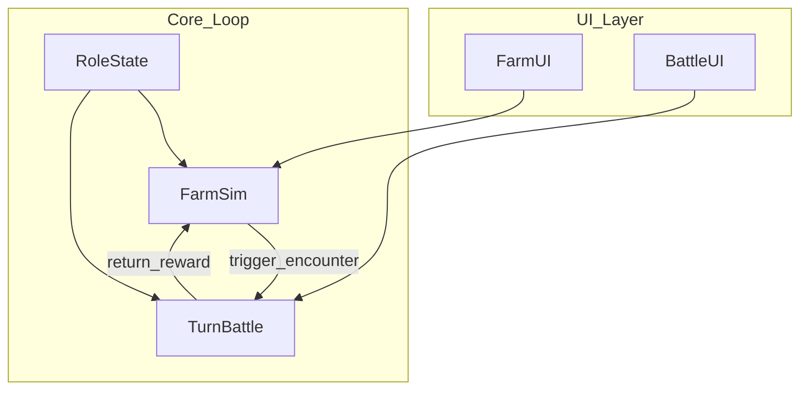

**中文：** **数据流摘要**：UI 将玩家操作交给模拟或战斗核心；核心读写 `RoleState`；战斗结束通过 `return_reward` 更新农场可用资源或 Role 属性。  
**English:** **Data flow summary:** UI forwards player actions to simulation or battle cores; cores read/write `RoleState`; battle completion updates farm-available resources or Role stats via `return_reward`.

---

## 4. 核心玩法规则（草案）/ Core Gameplay Rules

### 4.1 种植系统 / Planting System

**中文：** 本节自 v0.5 起取代原「极简农场（`Empty/Planted/Growing/Mature` 四态）」，作为新的农场子系统。  
**English:** Since v0.5, this section replaces the previous "minimal farm (`Empty/Planted/Growing/Mature` four-state)" model and serves as the new farm subsystem.

#### 4.1.1 农田规模 / Tile Layout

**中文：** **农田规模**：固定 20 块农田；每块农田彼此独立，同一时间最多容纳 1 株植物。UI 上以 5 行 × 4 列网格在 [UI0.png](PetDemo_2/Assets/Scenes/Air/UI/UI0.png) 主界面之上同屏可见，无需滚动。  
**English:** **Tile scale:** a fixed 20 tiles; each tile is independent and holds at most 1 plant at any moment. The UI presents a 5-row × 4-column grid overlaid on [UI0.png](PetDemo_2/Assets/Scenes/Air/UI/UI0.png), fully visible on screen with no scrolling.

**中文：** 农田按 `orderIndex` 1..20 排序（自上而下、每行内自左而右），轮训操作机制按此顺序扫描（详见 §10）。  
**English:** Tiles are ordered by `orderIndex` 1..20 (top-to-bottom, left-to-right within each row); the smart polling mechanism scans in this order (see §10).

#### 4.1.2 农田 5 维独立状态 / Five Independent Tile State Dimensions

**中文：** 每块农田同时持有以下五个互不耦合的子状态机；每一维必处于其唯一取值之一。  
**English:** Each tile holds the following five mutually-decoupled sub-state-machines simultaneously; each dimension must hold exactly one value.

| 维度 / Dimension | 取值 / Values | 说明 / Notes |
|---|---|---|
| `planting` | `AwaitingSeed` / `Seeded` | 待播种 / 已播种 |
| `fertilizer` | `AwaitingFertilizer` / `Fertilized` / `None` | 待施肥 / 已施肥 / 未激活 |
| `water` | `Empty` / `W1` / `W2` / `W3` | 待浇水 / 浇水 1~3 阶；上限 W3，达到 W3 后不可再浇 / max W3, cannot water further once at W3 |
| `pest` | `AwaitingPestControl` / `PestControlled` / `None` | 待捉虫 / 已捉虫 / 未激活 |
| `harvest` | `AwaitingHarvest` / `Harvested` / `None` | 待收获 / 已收获 / 未激活 |

**中文：** `None` 仅当 `planting = AwaitingSeed`（即空田）时取，表示该维度尚未激活；一旦播种，对应维度立即转入有效初始取值（具体初值见 §4.1.4）。  
**English:** `None` is used only when `planting = AwaitingSeed` (empty tile), meaning the dimension is inactive; once seeded, the corresponding dimension immediately enters a valid initial value (see §4.1.4 for initial values).

#### 4.1.3 玩家可执行操作与统一按钮 / Player Actions and Unified Button

**中文：** 玩家共可执行 5 种操作：`播种 / Seed`、`浇水 / Water`、`施肥 / Fertilize`、`捉虫 / PestControl`、`收获 / Harvest`。**自 v2.9 起，`Seed`「播种」从统一按钮中下线**；**自 v2.10 起，`Fertilize`「施肥」也从统一按钮中下线**：统一按钮现仅承担 `Water / PestControl / Harvest` 3 种动作的动态切换，按当前焦点田的最高优先级显示文字与图标；`Seed` 的触发改由「种子仓库内播种触发按钮 + 手势」承担（详见 §9.4.6），`Fertilize` 的触发改由「主界面施肥入口按钮 + 肥料仓库 + 农田点击」三段式承担（详见 §9.7）。具体统一按钮的扫描与优先级算法见 §10。  
**English:** The player has 5 actions in total: `Seed`, `Water`, `Fertilize`, `PestControl`, `Harvest`. **Since v2.9, `Seed` is removed from the unified action button**; **since v2.10, `Fertilize` is also removed from the unified action button**: the unified button now dynamically switches only among `Water / PestControl / Harvest` based on the focused tile's highest-priority action. `Seed` is triggered through the in-warehouse sow button + gesture instead (see §9.4.6); `Fertilize` is triggered through a three-stage flow: main-menu fertilize entry button + fertilizer warehouse modal + tile tap (see §9.7). See §10 for the unified-button scan and priority algorithms.

**中文：** 统一按钮操作优先级（v2.10 起）：`收获 > 浇水1阶 > 浇水2阶 > 浇水3阶`；其中 `浇水1阶/2阶/3阶` 分别表示把当前水位从 `Empty -> W1`、`W1 -> W2`、`W2 -> W3` 的那一次浇水。`Seed` 与 `Fertilize` 均不再出现在该链中。  
**English:** Unified-button action priority (since v2.10): `Harvest > Water stage 1 > Water stage 2 > Water stage 3`; the three water stages mean the water actions that advance `Empty -> W1`, `W1 -> W2`, and `W2 -> W3` respectively. Both `Seed` and `Fertilize` are no longer in this chain.

**中文：** **「播种」操作的活跃道具来源**：种子仓库中存放两类道具——「具体种子（Seed）」与「种子包（SeedPack）」。玩家在仓库中选中其一作为 `PlayerSeedBag.active`（详见 §5、§9.4）；当焦点田进入「播种」分支时，按 `active.kind` 决定具体行为：  
- `Seed`：直接产出与该 `plantConfigId` 对应的固定植物；  
- `SeedPack`：按该品质对应的固定权重表（同品质 = 同内容，详见附录 B.4）随机抽取 1 种 `plantConfigId` 后产出植物。  

无论哪一分支，最终在农田上创建 `PlantInstance` 的初始化逻辑（`waterConsumed=0`、`tile.planting=Seeded` 等）保持一致，详见 §4.1.4。  
**English:** **Active item source for the `Seed` action:** the seed warehouse stores two item categories — concrete `Seed` and `SeedPack`. The player picks one as `PlayerSeedBag.active` (see §5 and §9.4). When the focused tile enters the `Seed` branch, behavior depends on `active.kind`:  
- `Seed`: directly produces the fixed plant for that `plantConfigId`;  
- `SeedPack`: weighted-rolls one `plantConfigId` from the fixed contents table of that quality (same quality = same contents; see Appendix B.4) and then produces the plant.  

Either branch ends with the same `PlantInstance` initialization on the tile (`waterConsumed=0`, `tile.planting=Seeded`, etc.); see §4.1.4 for full details.

#### 4.1.4 植物状态机与生长进程 / Plant State Machine and Growth Process

**中文：** 植物状态：`Growing`（生长）/ `Paused`（暂停生长）/ `AwaitingHarvest`（待收获）/ `Wilted`（枯萎）。植物维护 `waterConsumed (0..5)` 与 `appearanceNode (1..5)` 两个数值字段，并以 `currentStageRemainingSec` 跟踪当前一阶水的剩余倒计时。  
**English:** Plant states: `Growing` / `Paused` / `AwaitingHarvest` / `Wilted`. Each plant maintains numeric fields `waterConsumed (0..5)`, `appearanceNode (1..5)`, and `currentStageRemainingSec` for the current water-stage countdown.

**中文：** **生长进程规则（核心）**：

1. **播种**：自 v2.9 起，触发入口改为 `IPlantingService.TrySeedTile(tileId)`（由 §9.4.6 的仓库内播种按钮 + 手势驱动），统一按钮不再触发该分支。命中 `tile.planting==AwaitingSeed && active!=null && countOf(active)>0` 后，依据 `PlayerSeedBag.active.kind` 分两支处理（详见 §4.1.3、§5、附录 B.4）：
   - **`Seed` 分支**：消耗 `SeedStack(active.id)` 中 1 个 → 选定 `plantConfigId = active.id`。
   - **`Pack` 分支**：消耗 `SeedPackStack(active.id)`（即对应品质堆）中 1 个 → 调用 `RollSeedPack(active.id) → plantConfigId`，按附录 B.4 的固定权重表随机抽取一种作物，并触发 `OnSeedRolledFromPack(tileId, packQuality, rolledPlantConfigId)`。
   
   两分支汇合后：在该田创建 `PlantInstance` 并进入 `Growing`；初值 `waterConsumed=0`、`appearanceNode=1`、`currentStageRemainingSec=baseStageSeconds`；同时设置 `tile.planting=Seeded`、`tile.fertilizer=AwaitingFertilizer`、`tile.harvest=AwaitingHarvest`、`tile.pest=PestControlled`、`tile.water=Empty`。
2. **暂停 / 恢复**：`tile.water=Empty` 时植物处于 `Paused`，倒计时冻结；`tile.water∈{W1,W2,W3}` 时植物处于 `Growing`，倒计时按当前速度推进。
3. **倒计时结束**：执行 `tile.water` 阶 −1、`waterConsumed +=1`、`appearanceNode = min(5, waterConsumed+1)`、重置 `currentStageRemainingSec=baseStageSeconds`。若 `tile.water` 减为 `Empty`，植物切换为 `Paused`。
4. **施肥加速**：当 `tile.fertilizer=Fertilized` 时，倒计时按 ×1.5 速度推进（即 `currentStageRemainingSec` 每秒减少 1.5 秒，等价于剩余时间整体 ×0.667）。
5. **待收获判定**：`waterConsumed == 5` 时立即进入 `AwaitingHarvest`，停止倒计时；同时把 `tile.harvest` 推为 `AwaitingHarvest`，并强制将 `tile.fertilizer` 复位为 `AwaitingFertilizer`（允许下一周期再次施肥）。

**English:** **Growth process rules (core):**

1. **Seeding:** since v2.9, the entry point is `IPlantingService.TrySeedTile(tileId)` (driven by the in-warehouse sow button + gesture in §9.4.6); the unified action button no longer triggers this branch. After confirming `tile.planting==AwaitingSeed && active!=null && countOf(active)>0`, branch by `PlayerSeedBag.active.kind` (see §4.1.3, §5, Appendix B.4):
   - **`Seed` branch:** consume 1 from `SeedStack(active.id)` → choose `plantConfigId = active.id`.
   - **`Pack` branch:** consume 1 from `SeedPackStack(active.id)` (the stack of that quality) → invoke `RollSeedPack(active.id) → plantConfigId` to weighted-sample one crop from the fixed contents table in Appendix B.4, and fire `OnSeedRolledFromPack(tileId, packQuality, rolledPlantConfigId)`.
   
   After either branch: create a `PlantInstance` on the tile and enter `Growing`; initial values `waterConsumed=0`, `appearanceNode=1`, `currentStageRemainingSec=baseStageSeconds`; tile flags set to `tile.planting=Seeded`, `tile.fertilizer=AwaitingFertilizer`, `tile.harvest=AwaitingHarvest`, `tile.pest=PestControlled`, `tile.water=Empty`.
2. **Pause / resume:** when `tile.water=Empty`, the plant is `Paused` with the countdown frozen; when `tile.water∈{W1,W2,W3}`, the plant is `Growing` with the countdown active at the current speed.
3. **Countdown end:** apply `tile.water` stage −1, `waterConsumed +=1`, `appearanceNode = min(5, waterConsumed+1)`, and reset `currentStageRemainingSec=baseStageSeconds`. If `tile.water` falls to `Empty`, the plant switches to `Paused`.
4. **Fertilizer acceleration:** when `tile.fertilizer=Fertilized`, the countdown advances at ×1.5 speed (i.e. `currentStageRemainingSec` decreases by 1.5 per real second, equivalent to overall remaining time ×0.667).
5. **Maturity:** as soon as `waterConsumed == 5` the plant enters `AwaitingHarvest` and the countdown stops; the tile's `harvest` is pushed to `AwaitingHarvest`, and `tile.fertilizer` is forcibly reset to `AwaitingFertilizer` (allowing fertilization in the next cycle).

#### 4.1.5 收获结算 / Harvest Resolution

**中文：** 玩家执行「收获」后，依据 `PlantConfig.afterHarvest` 选择分支：

- **`Wilt`（一次性 / annual）**：销毁 `PlantInstance`，农田全维度复位为初始（`planting=AwaitingSeed`、`fertilizer/pest/harvest=None`、`water=Empty`、`plantInstanceId=null`）。
- **`Regrow`（多次性 / perennial）**：保留 `PlantInstance`，重置 `waterConsumed=0`、`appearanceNode=1`、`state=Growing`；同时 `tile.harvest=AwaitingHarvest`、`tile.fertilizer=AwaitingFertilizer`、`tile.pest=PestControlled`、`tile.water` 保留当前阶（玩家可继续利用先前剩余的水）。

**中文（自 v3.27 起，v3.44 修订数量字段）：** 普通农田收获成功后，将 `max(1, PlantConfig.harvestFruitCount)` 份「果实」按 `plantConfigId` 堆叠写入 `GameSession.fruitBag`（详见 §4.1.11），**不**再直接修改 `RoleStats`。`harvestRewardStat` 仍保留在 `PlantConfig` 中，供农田 Tips 等展示关联；`eatBuffIconResource` 供吃下果实时的**纯演示** Buff 图标（不参与战斗结算）。  
**English (since v3.27, v3.44 revises count field):** After a normal tile harvest succeeds, add `max(1, PlantConfig.harvestFruitCount)` **fruit** units stacked by `plantConfigId` into `GameSession.fruitBag` (see §4.1.11); **do not** write `RoleStats` directly. `harvestRewardStat` remains for tile-tip association text; `eatBuffIconResource` is a **presentation-only** buff icon after eating fruit (no battle stat writes).

**English:** When the player performs `Harvest`, the branch is selected by `PlantConfig.afterHarvest`:

- **`Wilt` (annual):** destroy the `PlantInstance` and reset all tile dimensions to initial (`planting=AwaitingSeed`, `fertilizer/pest/harvest=None`, `water=Empty`, `plantInstanceId=null`).
- **`Regrow` (perennial):** keep the `PlantInstance`, reset `waterConsumed=0`, `appearanceNode=1`, `state=Growing`; set `tile.harvest=AwaitingHarvest`, `tile.fertilizer=AwaitingFertilizer`, `tile.pest=PestControlled`; `tile.water` keeps its current stage (the player may continue to use any leftover water).

#### 4.1.6 外围事件 / 虫灾与捉虫 / External Event and Pest Control (v3.50)

**中文（自 v3.50 起）：** 当植物 `AdvanceOneStage` 使 `appearanceNode` 进入 **2 或 3**（对应 CSV `sprite2` / `sprite3`）时，若本株尚未触发过虫灾且该节点尚未做过抽取，则按 `PlantConfig.pestSpriteProb` 判定一次：`Random.value < pestSpriteProb` 成功则将 `tile.pest` 置为 `AwaitingPestControl`、`PlantState` 置为 `Paused`，并触发 `OnPestEventTriggered(tileId)`；**每株植物生命周期内最多触发 1 次**；节点 2 与节点 3 **各只抽 1 次**（无论成败均标记该节点已抽）。虫灾期间 `TickGrowth` 不推进该株倒计时（等同缺水暂停）。田面叠放可点击、循环闪烁的 `AirUI/WH_Chong`；点击后打开 §9.10 全屏「打虫子」演示；**自 v3.79 起**玩家点「胜利」后调用 `IPlantingService.CompleteAllPestControl()`，**一次胜利清除农田内所有**处于 `AwaitingPestControl` 的田格：逐格将 `tile.pest` 翻回 `PestControlled`，对每格按相同恢复逻辑处理（若植物因虫灾 `Paused` 且 `tile.water != Empty` 则恢复 `Growing`）并触发 `OnTileFlagsChanged(tileId)`。`pestEventIntervalSec` / `pestEventProb` 列保留于 CSV 但本 Demo **不使用**定时抽取。  
**English (since v3.50):** When `AdvanceOneStage` sets `appearanceNode` to **2 or 3** (CSV `sprite2` / `sprite3`), if this plant has not yet triggered a pest event and this node has not been rolled, sample once with `Random.value < pestSpriteProb`. On success: `tile.pest = AwaitingPestControl`, `PlantState = Paused`, `OnPestEventTriggered(tileId)`. **At most one pest event per plant lifetime**; nodes 2 and 3 each get **one roll** (mark the node rolled win or lose). While `AwaitingPestControl`, `TickGrowth` does not advance that plant (same as drought pause). The tile shows a blinking clickable `AirUI/WH_Chong`; tap opens the §9.10 fullscreen pest demo; **since v3.79, Victory** calls `CompleteAllPestControl()`, which **clears every** `AwaitingPestControl` tile farm-wide in a single win: each tile flips to `PestControlled`, applies the same recovery (resume `Growing` when paused by pest and `tile.water != Empty`), and fires `OnTileFlagsChanged(tileId)`. `pestEventIntervalSec` / `pestEventProb` remain in CSV but are **unused** in this demo.

#### 4.1.6.1 地鼠偷窃与打地鼠 / Mole Theft and Whack-a-Mole (v3.52)

**中文（自 v3.52 起）：** 当植物 `AdvanceOneStage` 使 `appearanceNode` 进入 **4 或 5**（对应 CSV `sprite4` / `sprite5`）时，若本株尚未触发过地鼠偷窃且该节点尚未做过抽取，则按 `PlantConfig.moleSpriteProb` 判定一次：`Random.value < moleSpriteProb` 成功则将 `tile.moleTheft` 置为 `AwaitingMoleTheft`、`PlantState` 置为 `Paused`；**每株植物生命周期内最多触发 1 次**；节点 4 与节点 5 **各只抽 1 次**（无论成败均标记该节点已抽）。地鼠偷窃期间 `TickGrowth` 不推进该株倒计时（等同缺水/虫灾暂停）；`IsHarvestActionable` 返回 `false`（不可收获）。田面叠放可点击、循环闪烁的 `AirUI/WH_Tou`；点击后打开 §9.12 全屏 **「附魔」转盘玩法**（`EnchantScreenView`，**自 v3.82 起取代 v3.52 「打地鼠」演示**）。**自 v3.82 起收尾衔接变更**：附魔玩法胜利后**不再**走 §9.13 转盘摇奖，而是 `CompleteMoleTheft(tileId)`（`tile.moleTheft → MoleTheftResolved`）+ `TriggerSingleTileMutation(tileId)` 将该株置为「变异待收获」，停留 1 秒后自动 `TryHarvestMutation` 弹出收获弹窗；附魔玩法失败「放弃」则调用 `AbandonMoleTheftPlant(tileId)` 直接删除该植物。  
**English (since v3.52; v3.82 handoff change):** When `AdvanceOneStage` sets `appearanceNode` to **4 or 5** (CSV `sprite4` / `sprite5`), if this plant has not yet triggered mole theft and this node has not been rolled, sample once with `Random.value < moleSpriteProb`. On success: `tile.moleTheft = AwaitingMoleTheft`, `PlantState = Paused`. **At most one mole theft per plant lifetime**; nodes 4 and 5 each get **one roll**. While `AwaitingMoleTheft`, `TickGrowth` does not advance that plant and harvest is blocked. The tile shows a blinking clickable `AirUI/WH_Tou`; tap opens the §9.12 fullscreen **Enchant wheel game** (`EnchantScreenView`, **replaces the v3.52 whack-a-mole demo since v3.82**). **Since v3.82** the win handoff changed: instead of chaining §9.13, victory calls `CompleteMoleTheft(tileId)` + `TriggerSingleTileMutation(tileId)` (plant becomes "mutation awaiting harvest"), waits 1s, then auto `TryHarvestMutation` to show the reveal popup; on loss the **Abandon** option calls `AbandonMoleTheftPlant(tileId)` to delete the plant.

#### 4.1.7 5 节点外观映射 / Five-Node Appearance Mapping

**中文：** 植物外观节点 = `min(5, waterConsumed + 1)`。播种瞬间为节点 1；每消耗 1 阶水 +1；消耗第 4 阶水后到达节点 5，对应「待收获」外观。具体精灵 ID 与作物列表见附录 B。  
**English:** Appearance node = `min(5, waterConsumed + 1)`. Seeding sets node 1; each water-stage consumed advances by 1; after the 4th stage consumed the plant reaches node 5 — the "awaiting harvest" appearance. Sprite IDs and crop list are listed in Appendix B.

#### 4.1.8 植物状态机示意 / Plant State Machine Diagram

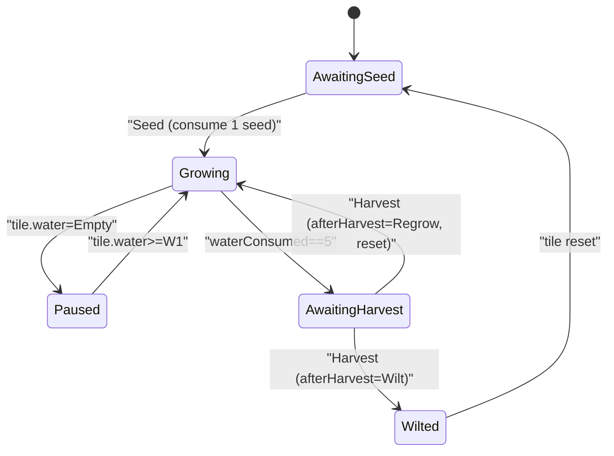

#### 4.1.9 可砍需求 / Cuttables

**中文：** 捉虫小游戏、施肥/浇水的资源消耗、虫害负面收益、土壤肥力衰减、天气与季节——首版 SPEC 不纳入 P0。  
**English:** **Cuttables:** pest mini-game, fertilizer/water resource costs, pest damage penalties, soil fertility decay, weather and seasons — not in P0.

#### 4.1.10 农田变异机制 / Group Mutation (v3.17)

**中文：** 自 v3.17 起，在 §4.1 种植系统之上叠加一层「同组同 ID 同步成熟」奖励玩法：当同一行 4 田全部满足触发条件时，4 株 `PlantInstance` 即时被一株「四格植物」（`MutationPlant`）替换，并直接进入 `AwaitingHarvest`；玩家点击该 4 格植物收获时，按 50% / 50% 分流为「精灵植物」或「技能植物」，弹窗展示对应配置内容。本子系统不替换原有种植 5 维状态机，仅在触发时**临时锁定**这 4 田。  
**English:** Since v3.17, a "same-row-same-ID-synchronized maturation" bonus mechanic is layered on top of §4.1: when all 4 tiles in a single row satisfy the trigger condition, the 4 `PlantInstance`s are instantly replaced by one "four-tile plant" (`MutationPlant`) which enters `AwaitingHarvest` directly; tapping the harvest icon on it resolves a 50/50 roll between "Pet plant" and "Skill plant", revealing the corresponding config in a modal. This subsystem does not replace the planting state machine — it only temporarily **locks** the four tiles while the mutation is active.

**中文（产品配置 v3.27）：** 当前 Demo **默认关闭**上述「四格合并」触发：`PlantingService` 内 `kRowMutationTriggerEnabled == false` 时不调用 `TryTriggerMutationForTile`，不产生新 `MutationPlant`；同组四田各自继续浇水至自然 `AwaitingHarvest`。实现代码与 §4.1.10 数据结构（`MutationPlant`、`MutationOverlayView` 等）保留，将来将常量改为 `true` 即可恢复。  
**English (product config v3.27):** In the current demo the row-merge trigger above is **off by default:** when `PlantingService.kRowMutationTriggerEnabled` is `false`, `TryTriggerMutationForTile` is not invoked and no new `MutationPlant` is created; the four tiles in a group continue watering independently to natural `AwaitingHarvest`. Implementation and §4.1.10 data structures (`MutationPlant`, `MutationOverlayView`, etc.) remain so flipping the constant back to `true` can re-enable the feature.

**中文（自 v3.59 起，v3.60 修订 UI 入口）：** 除上述「四格合并」外，另有一条 **「单格变异」** 入口：`MutationPlant.tileIds` 允许 **长度 1**（仅占用发起流程的那一格）。由 **§9.13** 转盘在玩家点击「确定」且 **`grantMutationOnConfirm==true`**（当前实现：**仅 §9.12 打地鼠** 胜利后）时调用 `IPlantingService.TriggerSingleTileMutation(tileId)` 写入；**§9.11 捉虫** 胜利后的转盘将该参数置为 **false**，**不调用**该 API（无单格变异）。抽签规则（50%/50% 品类与 `refId` 来源）与 §4.1.10.2 的「四格路径」相同，但删除 **1** 株 `PlantInstance` 并锁定 **1** 田。四格路径仍要求 `tileIds.Count == 4`。  
**English (since v3.59, v3.60 UI entry):** Besides the four-tile merge, a **single-tile mutation** path exists: `MutationPlant.tileIds` may have **length 1**. It is created when the §9.13 wheel's **Confirm** runs with **`grantMutationOnConfirm==true`** (currently: **only after §9.12 mole** victory) by calling `IPlantingService.TriggerSingleTileMutation(tileId)`. The **§9.11 pest** flow sets this flag **false** and **does not** call that API (no single-tile mutation). The roll rules (50/50 kind and `refId` pools) match §4.1.10.2's four-tile path, but only **one** `PlantInstance` is removed and **one** tile is locked. The four-tile path still requires `tileIds.Count == 4`.

##### 4.1.10.1 分组与触发条件 / Grouping and Trigger

**中文：** **分组定义**：与 §9.1 的行布局一致——每行 4 田为 1 组，`groupIndex = ((orderIndex - 1) / 4) + 1`，共 5 组；第 1 组成员 `orderIndex ∈ {1,2,3,4}`，第 5 组成员 `orderIndex ∈ {17,18,19,20}`。  
**English:** **Grouping:** aligned with §9.1 row layout — each row of 4 tiles is one group, with `groupIndex = ((orderIndex - 1) / 4) + 1`, totaling 5 groups; group 1 has `orderIndex ∈ {1..4}`, group 5 has `orderIndex ∈ {17..20}`.

**中文：** **触发条件（必须 4 项全部满足）**：
1. 4 田 `tile.planting == Seeded` 且 `tile.lockedByMutationId` 均为空。
2. 4 田 `tile.plantInstanceId` 均非空，对应 4 株 `PlantInstance` 存在。
3. 4 株 `PlantInstance` 的 `plantConfigId` 完全相同。
4. 4 株 `PlantInstance` 的 `appearanceNode == 4`（即已消耗 3 阶水，尚未自然进入 `AwaitingHarvest`）。

**English:** **Trigger condition (all four required):**
1. All 4 tiles have `tile.planting == Seeded` and empty `tile.lockedByMutationId`.
2. All 4 tiles have non-empty `tile.plantInstanceId` with corresponding `PlantInstance`s present.
3. All 4 `PlantInstance`s share the same `plantConfigId`.
4. All 4 `PlantInstance`s have `appearanceNode == 4` (i.e. consumed 3 water stages and not yet naturally `AwaitingHarvest`).

**中文：** **检测时机**：仅在 `AdvanceOneStage` 把某株植物的 `appearanceNode` 推进到 4 后立即检测一次该植物所在组；其它路径（播种、收获、施肥、外围事件）不触发检测。一旦组内任意一株推进到 `appearanceNode == 5` 或 `AwaitingHarvest`，该组本周期的窗口期结束，玩家若想再次触发，需重新走「Seed → 浇水到 node==4」的流程（与 §4.1.5 一致）。  
**English:** **Detection timing:** only checked once whenever `AdvanceOneStage` advances a plant's `appearanceNode` to 4, examining that plant's group; no other path (seed, harvest, fertilize, external event) triggers detection. Once any plant in the group advances to `appearanceNode == 5` or `AwaitingHarvest`, the window for this cycle is closed and the player must replant and re-water back to node 4 to retry (consistent with §4.1.5).

##### 4.1.10.2 变异执行 / Mutation Execution

**中文：** 满足触发条件后，按以下顺序原子执行：
1. **品类抽签**：按 50% / 50% 抽取 `MutationKind ∈ {Pet, Skill}`；若中签的列表为空则降级到另一类型，二者皆空时记录 Warning 并放弃本次变异（4 田保持原状，玩家可继续浇水自然成熟）。
2. **内容抽签**：从 `petConfigs` 或 `skillConfigs` 中均匀随机选 1 条 `refId`。
3. **删除 4 株植物**：从 `session.plants` 与 `plantById` 中移除 4 株 `PlantInstance`。
4. **写入 4 田锁定**：4 田 `lockedByMutationId = mutationId`；同时把这 4 田的 5 维子状态写为 `planting=Seeded`、`fertilizer=None`、`water=Empty`、`pest=None`、`harvest=None`、`plantInstanceId=null`（即"被托管在变异植物之下"，UI 不再渲染单格植物或徽标）。
5. **创建 `MutationPlant`**：写入 `session.mutations`，字段 `instanceId / kind / refId / groupIndex / tileIds (4) / state=AwaitingHarvest`。
6. **事件**：依次触发 4 次 `OnTileFlagsChanged(tileId)`、最后触发一次 `OnMutationCreated(mutationId)`。

**English:** After the trigger passes, execute atomically in this order:
1. **Kind roll:** 50% / 50% pick `MutationKind ∈ {Pet, Skill}`; if the chosen list is empty fall back to the other; if both empty, log a warning and skip (4 tiles unchanged, player can continue watering to natural maturity).
2. **Content roll:** uniformly pick a `refId` from `petConfigs` or `skillConfigs`.
3. **Delete 4 plants:** remove the 4 `PlantInstance`s from `session.plants` and `plantById`.
4. **Lock 4 tiles:** set `lockedByMutationId = mutationId` on the 4 tiles; also reset their 5-dimension state to `planting=Seeded`, `fertilizer=None`, `water=Empty`, `pest=None`, `harvest=None`, `plantInstanceId=null` (i.e. "hosted under the mutation plant", and UI suppresses per-tile plant rendering).
5. **Create `MutationPlant`:** push to `session.mutations` with fields `instanceId / kind / refId / groupIndex / tileIds (4) / state=AwaitingHarvest`.
6. **Events:** fire `OnTileFlagsChanged(tileId)` 4 times in `orderIndex` ascending order, then `OnMutationCreated(mutationId)` once.

**中文（自 v3.59 起，单格路径）：** 由 `TriggerSingleTileMutation(tileId)` 调用，不依赖 §4.1.10.1 窗口期。前提：`tileId` 存在、`tile.plantInstanceId` 非空、`tile.lockedByMutationId` 为空、`petConfigs` 与 `skillConfigs` 不同时为空。执行顺序与上表一致，但步骤 3~4 仅处理 **1** 株植物与 **1** 块田，`MutationPlant.tileIds` 仅含该 `tileId`；步骤 6 改为 **1** 次 `OnTileFlagsChanged` + **1** 次 `OnMutationCreated`。`groupIndex` 仍按 `((orderIndex - 1) / 4) + 1` 写入。  
**English (since v3.59, single-tile path):** Invoked by `TriggerSingleTileMutation(tileId)`, independent of §4.1.10.1. Preconditions: `tileId` exists, `tile.plantInstanceId` non-empty, `tile.lockedByMutationId` empty, and not both `petConfigs` and `skillConfigs` empty. Same ordered steps as above, but steps 3–4 operate on **one** plant and **one** tile; `MutationPlant.tileIds` contains only that `tileId`; step 6 fires **one** `OnTileFlagsChanged` plus **one** `OnMutationCreated`. `groupIndex` still uses `((orderIndex - 1) / 4) + 1`.

##### 4.1.10.3 锁定语义 / Lock Semantics

**中文：** 当 `tile.lockedByMutationId != null` 时，该田对所有玩家操作短路：
- §4.1.3 五动作（`Seed / Water / Fertilize / PestControl / Harvest`）的 `IsXxxActionable` 起始判定一律 `return false`；
- §10 智能轮训 `FindNextAction` 不会扫描到该田；
- §9.1.1 农田 Tips 的"已种植且非待收获"分支不再触发；
- §9.7 三段式施肥的 tile 点击不写入肥料。

**English:** When `tile.lockedByMutationId != null`, the tile short-circuits every player action:
- the §4.1.3 five-action `IsXxxActionable` checks all `return false` upfront;
- §10 smart polling `FindNextAction` never scans this tile;
- the §9.1.1 "planted & not awaiting harvest" tip branch never triggers;
- the §9.7 fertilize-tap path does not apply fertilizer.

##### 4.1.10.4 收获结算 / Harvest Resolution

**中文：** `MutationPlant` 不参与统一按钮的优先级链，仅响应「直接点击」（由 §5.2 `MutationOverlayView` 中的图标点击转发）。**自 v3.59 起，`MutationOverlayView` 的变异果实入口图标按 `MutationKind` 区分资源：`kind=Pet` 使用 `Resources/AirUI/ShiWu_2`，`kind=Skill` 使用 `Resources/AirUI/DaShouHuo_2`**（**v3.20** 的 `DaShouHuo_1` 映射由 v3.59 替换）。点击后调用 `IPlantingService.TryHarvestMutation(mutationId)`，按以下顺序执行：
1. 校验 `mutation` 存在且 `state == AwaitingHarvest`；否则返回 `false`。
2. `mutation.state = Harvested`；从 `session.mutations` 中移除。
3. `mutation.tileIds` 中每一块田 `lockedByMutationId = null`，并按 `Wilt` 路径全维度复位（`planting=AwaitingSeed`、`fertilizer/pest/harvest=None`、`water=Empty`、`plantInstanceId=null`）。
4. 对 `tileIds` 中每一田触发一次 `OnTileFlagsChanged(tileId)`（顺序与列表一致），再触发一次 `OnMutationHarvested(mutationId, kind, refId)`；UI 层据此弹窗。

**English:** `MutationPlant` does not participate in the unified-button priority chain; it only responds to **direct taps** forwarded by §5.2 `MutationOverlayView`. **Since v3.59, the mutation fruit entry icon is selected by `MutationKind`: `kind=Pet` uses `Resources/AirUI/ShiWu_2`, and `kind=Skill` uses `Resources/AirUI/DaShouHuo_2`** (replacing the **v3.20** `DaShouHuo_1` mapping). The tap calls `IPlantingService.TryHarvestMutation(mutationId)`, executed in order:
1. Verify the mutation exists and `state == AwaitingHarvest`; otherwise return `false`.
2. Set `mutation.state = Harvested` and remove from `session.mutations`.
3. For every tile id in `mutation.tileIds`, set `lockedByMutationId = null` and reset all dimensions per the `Wilt` path (`planting=AwaitingSeed`, `fertilizer/pest/harvest=None`, `water=Empty`, `plantInstanceId=null`).
4. Fire one `OnTileFlagsChanged(tileId)` per locked tile (in list order), then `OnMutationHarvested(mutationId, kind, refId)`; the UI layer renders the modal accordingly.

##### 4.1.10.5 弹窗规则 / Reveal Modal

**中文：** 弹窗（`MutationRevealPopupView`）以半透明遮罩 + 中央面板形式呈现：
- **Pet 分支**：左侧通过 `PetPreviewRig`（独立 `Camera + RenderTexture`，渲染 Spine `SkeletonAnimation` 预制体）输出到 `RawImage`；**Fantazia 来源预制体在实例化根节点上须先对 XY 放大 20%（`FantaziaMonsterDisplay.PackVisualScaleMultiplier = 1.2`），再水平镜像**（`localScale.x` 取负、保留幅度，实现见 `FantaziaMonsterDisplay.ApplyBoostAndHorizontalMirror`）；右侧两行文本展示 `PetConfig.displayName`、`PetConfig.traitDescription`；动画从 `PetConfig.randomAnimations` 中均匀抽签选 1 个，若列表为空则使用 `SkeletonAnimation` 当前默认动画。
- **Skill 分支**：左侧 `Image.sprite = Resources.Load<Sprite>(SkillConfig.iconResource)`；右侧两行文本展示 `SkillConfig.displayName`、`SkillConfig.description`。
- **Skill 图标缩放约束（v3.19）**：`LeftPreview/SkillIcon` 的本地缩放固定为 `localScale = (0.5, 0.5, 1)`，用于在保持 `preserveAspect=true` 前提下避免技能图标在 360×360 预览容器中过大占位。

弹窗仅由 `OnMutationHarvested` 驱动；点击遮罩或关闭按钮关闭，关闭时销毁 Pet 实例并停止预览 Camera 渲染。

**English:** The modal (`MutationRevealPopupView`) renders a dim layer + center panel:
- **Pet branch:** left side uses `PetPreviewRig` (its own `Camera + RenderTexture` rendering a Spine `SkeletonAnimation` prefab) blitted into a `RawImage`; **Fantazia-sourced prefabs must first scale XY by +20% (`FantaziaMonsterDisplay.PackVisualScaleMultiplier = 1.2`), then be horizontally mirrored on the instantiated root** (`localScale.x` negated while preserving magnitude; see `FantaziaMonsterDisplay.ApplyBoostAndHorizontalMirror`); right side shows two lines `PetConfig.displayName`, `PetConfig.traitDescription`; the animation is uniformly sampled from `PetConfig.randomAnimations`, falling back to the prefab's default animation if empty.
- **Skill branch:** left side uses `Image.sprite = Resources.Load<Sprite>(SkillConfig.iconResource)`; right side shows `SkillConfig.displayName`, `SkillConfig.description`.
- **Skill icon scale constraint (v3.19):** `LeftPreview/SkillIcon` keeps a fixed local scale `localScale = (0.5, 0.5, 1)` so that with `preserveAspect=true` the skill icon does not over-occupy the 360×360 preview container.

The modal is driven only by `OnMutationHarvested`; tapping the dim layer or close button dismisses it, destroys the Pet instance, and stops the preview camera.

##### 4.1.10.6 状态图 / Mutation State Diagram

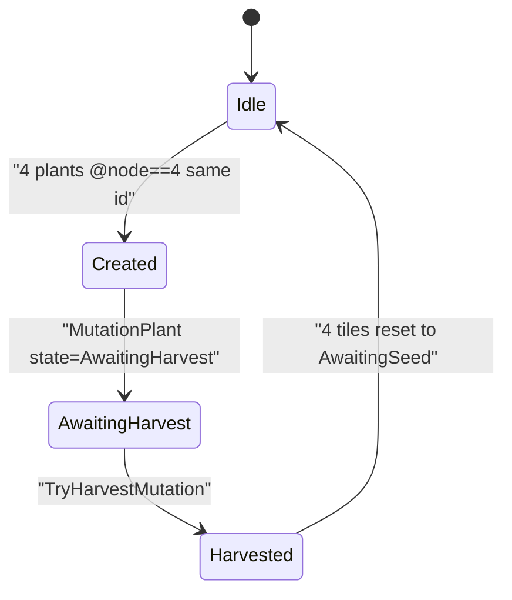

#### 4.1.11 果实背包 / Fruit Bag (v3.27)

**中文：** 普通农田收获（§4.1.5 `TryHarvestTile` → `ApplyHarvest`）成功后，奖励以「果实」形式进入 `PlayerFruitBag`，按 `plantConfigId` 堆叠累加数量；收获本身 **不**改变 `RoleStats`。`PlantingService` 在写入后触发 `OnFruitBagChanged`；可选触发 `OnHarvestFruitReady(tileId, plantConfigId, count)` 供 UI 播放飞向果实入口的动效（不写入属性）。主界面提供「果实背包」入口按钮 + 半透明遮罩 + 只读列表（作物名、数量），布局约定见 §9.9。**自 v3.41 起**，§9.8.13 统一仓库面板把 `PlayerFruitBag` 作为果实槽数据源，并通过 `IPlantingService.EatOneFruit(plantConfigId)` / `EatFruitToFull(plantConfigId)` 把选中果实换算为 `RoleStats.stamina`（换算系数见 §9.8.13.6 与 `PlantConfig.fruitStaminaGain`）；§9.9 入口与本入口并行存在，互不替代。  
**English:** After a normal farm harvest (`TryHarvestTile` → `ApplyHarvest` in §4.1.5), rewards are stored as **fruit** in `PlayerFruitBag`, stacked and incremented by `plantConfigId`. Harvesting itself does **not** change `RoleStats`. `PlantingService` raises `OnFruitBagChanged` after writes; it may also raise `OnHarvestFruitReady(tileId, plantConfigId, count)` for optional UI flight toward the fruit-bag button (no stat write). The main menu exposes a fruit-bag entry, dim modal, and read-only list — see §9.9. **Since v3.41**, the §9.8.13 unified warehouse panel uses `PlayerFruitBag` as the data source for its fruit slot grid and converts the selected fruit into `RoleStats.stamina` via `IPlantingService.EatOneFruit(plantConfigId)` / `EatFruitToFull(plantConfigId)` (formula in §9.8.13.6 and `PlantConfig.fruitStaminaGain`); the §9.9 entry coexists with the §9.8.13 entries without replacement.

#### 4.1.12 精灵背包与上场数量 / Pet Bag and Field Pet Limit (v3.70)

**中文：** 自 v3.70 起，玩家通过 §4.1.10 收获到的「精灵」（`MutationKind.Pet`）**不再**由 UI 直接生成伴侣；改由 `PlantingService` 写入 **`PlayerPetBag`**，并在 **`PetDeployment`** 有空槽时按 **`RestrictionProfile.fieldPetLimit`** 自动上场。默认 **`fieldPetLimit = 2`**，本期**不可提升**。  
**English:** Since v3.70, Pets from §4.1.10 harvest (`MutationKind.Pet`) are **no longer** spawned directly by UI companions; `PlantingService` writes them into **`PlayerPetBag`** and auto-deploys into **`PetDeployment`** while slots remain under **`RestrictionProfile.fieldPetLimit`**. Default **`fieldPetLimit = 2`**, not increasable in this release.

**中文：** **限制接受（P0）**：`PlantingService` 构造时写入 `restrictionProfile = { fieldPetLimit: 2, accepted: true }`；进入底栏「家园 / JiaYuan」与 `InvasionService.OpenBattle()` 时读取同一 profile（P0 无额外弹窗，为后续多套规则预留）。  
**English:** **Restriction acceptance (P0):** on `PlantingService` construction set `restrictionProfile = { fieldPetLimit: 2, accepted: true }`; home tab and `OpenBattle()` read the same profile (no extra modal in P0).

**中文：** **获得流程**：`TryHarvestMutation` 成功且 `kind == Pet` 时，在触发 `OnMutationHarvested` **之前**调用 `GrantPet(refId)` → `TryAutoDeploy(instanceId)`。自动上场顺序：**先 `LowerLeft`，再 `UpperLeft`**；已满员则仅留背包。  
**English:** **Grant flow:** on successful `TryHarvestMutation` with `kind == Pet`, call `GrantPet(refId)` then `TryAutoDeploy(instanceId)` **before** `OnMutationHarvested`. Auto-deploy order: **LowerLeft first, then UpperLeft**; overflow stays in the bag only.

**中文：** **可见性**：仅**已上场**精灵在底栏 `OpenKey == JiaYuan` 时由 §9.5.1 展示；其它 Tab 隐藏伴侣节点。  
**English:** **Visibility:** only **deployed** pets are shown by §9.5.1 while `OpenKey == JiaYuan`; hidden on other tabs.

**中文：** **战斗联动**：见 §12.3 / §12.4；上场精灵出现在玩家左侧上/下槽，偶数我方行动轮按「左下 → 左上 → 主角」攻击，精灵伤害 `max(1, floor(playerAttack * 0.5))`（`playerAttack` 取自本场 `BattleSession`，见 §12.5）。  
**English:** **Battle linkage:** see §12.3 / §12.4; deployed pets at player upper-left / lower-left; on even player-action rounds attack in order lower → upper → role; pet damage `max(1, floor(playerAttack * 0.5))` from this battle's `BattleSession.playerAttack`.

### 4.2 回合战斗 / Turn-Based Battle

**中文：** **Demo 极简目标**：单场战斗包含 **Role** 与 **至少一名敌人**；按 **敏捷（`agility`，原 `speed`）或固定先后** 决定出手顺序；每回合单位可选择 **攻击** 或 **防御**（Demo 可仅实现攻击）；一方 **HP ≤ 0** 则战斗结束。  
**English:** **Minimal demo goal:** one battle with **Role** and **at least one enemy**; turn order by **agility (`agility`, formerly `speed`) or fixed order**; each turn a unit may **attack** or **defend** (demo may implement attack only); battle ends when one side has **HP ≤ 0**.

**中文：** 伤害公式首版可采用：`damage = max(1, attacker.atk - defender.def)`，再按需取整；后续平衡调整须先更新 SPEC。  
**English:** Initial damage formula: `damage = max(1, attacker.atk - defender.def)`, rounded as needed; balance changes require SPEC updates first.

**中文：** **2/3 阶属性的 P0 行为**：本阶段仅作为 `RoleStats` 中的可读字段与 UI 展示数据，**不参与** `damage = max(1, attacker.atk - defender.def)` 的实际结算；P0 期间无论 `critRate / comboRate / counterRate / blockRate` 与对应抵消率取何值，伤害公式不变。出手顺序仍由 1 阶 `agility` 驱动（与原 `speed` 同义）。  
**English:** **Tier-2/3 P0 behavior:** during P0 these are read-only fields on `RoleStats` for UI display only and **do not** participate in the actual `damage = max(1, attacker.atk - defender.def)` resolution; regardless of the values of `critRate / comboRate / counterRate / blockRate` and their resistances, the damage formula stays unchanged in P0. Turn order is still driven by Tier-1 `agility` (same semantics as the legacy `speed`).

**中文：** **P1 接入占位**：当 2/3 阶进入战斗结算时，建议判定顺序为 `暴击 → 连击 → 反击 → 格挡`，每项以 `effectiveRate = clamp(attackerRate - defenderResist, 0, 1)` 抵消思路计算最终触发率；具体随机化、与基础伤害的乘加关系、与 `defend` 行动的叠加规则均留待 P1 SPEC 细化（变更必须先更新本节）。  
**English:** **P1 hookup placeholder:** when Tier-2/3 enter battle resolution, the proposed check order is `Crit → Combo → Counter → Block`; each uses `effectiveRate = clamp(attackerRate - defenderResist, 0, 1)` to derive the final trigger rate; randomization, multiplicative/additive interaction with base damage, and stacking with the `Defend` action are all deferred to P1 SPEC details (any change must update this section first).

**中文：** **可砍需求**：技能树、元素克制、Buff/Debuff 复杂栈、多目标与位置——首版 SPEC 不纳入 P0。  
**English:** **Cuttable for later:** skill trees, elemental counters, complex buff/debuff stacks, multi-target positioning — not in P0.

**中文（v3.211 增补，v3.212 / v3.220 修订）：** **多单位阵型战斗**（主角 Role + 公会跟随 NPC 对战怪物，九宫格站位、速度排序出手、列/行优先级选目标）见 **§12.14**。`InvasionBattleModal_2` 内 `evt_fight_small_1` / `evt_fight_small_2` / `evt_fight_boss` **一律**走该模式（全队入场）。该模式下每大回合内所有存活单位按 `agility` **降序**行动（同速随机）；伤害结算采用本节 `damage = max(1, attacker.atk - defender.def)`。每名队员独立 HP；胜后死亡者 30% HP 复活（§12.14.6.2）。§12.3 全屏入侵战仍可沿用 legacy 固定「我方先→敌方」交替与固定 `attack` 伤害。  
**English (v3.220):** Modal_2 fight events all use **§12.14** grid party battle; §12.3 fullscreen invasion may keep legacy 1v1.

### 4.3 串联 / Linking Farm and Battle

**中文：** 进入战斗的条件示例：收获达到指定次数、或点击「试炼」按钮消耗 `CropToken`；实现任选其一即可满足 Demo。  
**English:** Example battle entry conditions: harvest count threshold, or a “trial” button consuming `CropToken`; implementing any one satisfies the demo.

**中文：** 战斗胜利奖励示例：增加金币、恢复 Role HP、或解锁下一作物；Demo 至少实现一种可感知反馈。  
**English:** Example victory rewards: gold increase, Role HP restore, or unlocking the next crop; the demo should implement at least one clear feedback.

---

## 5. 数据结构 / Data Structures

**中文：** 以下为逻辑结构草案；字段名在实现中应保持一致，变更须同步 SPEC。  
**English:** The following are logical schema drafts; field names should stay consistent in code, and changes must sync back to the SPEC.

```text
// RoleStats — 主角 Role（与所有战斗单位）的可战斗与可展示属性
// 字段按 1/2/3 阶分组；1 阶为整数，2/3 阶为 0..1 的浮点
// RoleStats — combat & display stats for Role and any battle unit (incl. enemies)
// Fields grouped by Tier-1/2/3; Tier-1 are ints, Tier-2/3 are floats in [0,1]
struct RoleStats {
  string displayName;       // 固定为 "Role" / fixed "Role"
  // ---- Tier-1：基础战斗属性 / Base combat stats ----
  int atk;                  // 攻击 / attack
  int def;                  // 防御 / defense
  int maxHp;                // 生命上限 / max life
  int currentHp;            // 当前生命 / current life
  int agility;              // 敏捷 / 基础攻击速度；决定出手顺序；亦为 §B.21 role_levels.baseAtkSpeed 写回目标
                            // agility / base attack speed; drives turn order; also target of §B.21 baseAtkSpeed
                            // 取代旧字段 speed（同义重命名，见 §11 v0.6）
                            // replaces the legacy field "speed" (rename, see §11 v0.6)
  // ---- 体力（v3.40 新增，见 §9.8.12） / Stamina (new in v3.40, see §9.8.12) ----
  int stamina;              // 体力当前值，整数 [0, staminaMax]；默认 0
                            // current stamina, integer in [0, staminaMax]; default 0
  int staminaMax;           // 体力上限；默认 100；本期固定不变
                            // stamina max; default 100; immutable in this release
                            // 写入入口仅有 IPlantingService.EatOne / EatToFull
                            // only writers: IPlantingService.EatOne / EatToFull
                            // 「主角已吃饱」≡ stamina == staminaMax
                            // "role is full" ≡ stamina == staminaMax
  // ---- Tier-2：施加方触发率（0..1） / Attacker trigger rates [0,1] ----
  float critRate;           // 暴击率 / crit rate
  float comboRate;          // 连击率 / combo rate
  float counterRate;        // 反击率 / counter rate
  float blockRate;          // 格挡率 / block rate
  // ---- Tier-3：承受方抵消率（0..1） / Defender resistances [0,1] ----
  float critResist;         // 抵消暴击率 / crit resist
  float comboResist;        // 抵消连击率 / combo resist
  float counterResist;      // 抵消反击率 / counter resist
  float blockResist;        // 抵消格挡率 / block resist
  // ---- 六宫属性（v3.178，§12.13 详细属性弹窗；整数展示值，与 Tier-2 触发率独立） ----
  // ---- Hex attrs (v3.178, §12.13 detail modal; int display values, separate from Tier-2 rates) ----
  int criticalHit;          // 暴击 / Critical Hit；默认 3
  int combo;                // 连击 / Combo；默认 6
  int counterattack;        // 反击 / Counterattack；默认 12
  int stun;                 // 击晕 / Stun；默认 2
  int evasion;              // 闪避 / Evasion；默认 4
  int lifeSteal;            // 吸血 / Life Steal；默认 8
  // ---- 家园成长属性（v3.188，§9.14.11 / §B.21；与战斗六宫独立） ----
  // ---- Home growth attrs (v3.188, §9.14.11 / §B.21; independent of battle hex) ----
  int intelligence;         // 智商 / intelligence
  int memory;               // 记忆 / memory
  int imagination;          // 想象 / imagination
  int physique;             // 体魄 / physique
  int charm;                // 魅力 / charm
  int emotionalIntelligence;// 情商 / emotional intelligence
  // ---- 等级与经验（v3.186 / v3.188；自 v3.208 起实现加经验与升级，升级不扣减 currentExp） ----
  // ---- Level & exp (v3.186 / v3.188; since v3.208: add-exp + level-up; currentExp not deducted on level-up) ----
  int level;                // 等级；默认 1 / level; default 1
  int currentExp;           // 当前经验进度；升级时不减、不归零（可大于本级需求）/ current exp progress; not deducted on level-up
  int expToNextLevel;       // 升至下一级所需单级经验；优先来自 §B.23，回退 §B.21 / single-level exp; prefer §B.23, fallback §B.21
}

// Demo 默认值 / Demo defaults (Role)：
//   Tier-1: atk/maxHp/agility 由 §B.21 Lv1 写回（默认表：atk=12, maxHp=25, agility=2）；def=5
//   Stamina (v3.40): stamina=0, staminaMax=100
//   Tier-2: critRate=comboRate=counterRate=blockRate=0.05
//   Tier-3: critResist=comboResist=counterResist=blockResist=0.00
//   Hex (v3.178): criticalHit=3, combo=6, counterattack=12, stun=2, evasion=4, lifeSteal=8
//   Growth (v3.188): intelligence/memory/imagination/physique/charm/emotionalIntelligence 由 §B.21 Lv1 写回（默认各 10）
//   Level (v3.186 / v3.208): level=1, currentExp=0, expToNextLevel 优先由 §B.23 写回（默认 100）
// 敌人模板 / Enemy templates 共用同形 RoleStats，2/3 阶默认全 0；具体平衡数值在 P1 实装时补全。
// Enemies share the same RoleStats schema with Tier-2/3 defaulted to 0;
// concrete balance values are supplied when P1 implementation lands.

// CropTile — 单块农田（5 维独立状态机，详见 §4.1.2）
// CropTile — single farm tile (five independent dimensions, see §4.1.2)
enum PlantingFlag   { AwaitingSeed, Seeded }
enum FertilizerFlag { None, AwaitingFertilizer, Fertilized }
enum WaterStage     { Empty, W1, W2, W3 }                  // 上限 W3 / max W3
enum PestFlag       { None, AwaitingPestControl, PestControlled }
enum MoleTheftFlag  { None, AwaitingMoleTheft, MoleTheftResolved }  // v3.52
enum HarvestFlag    { None, AwaitingHarvest, Harvested }

struct CropTile {
  string tileId;
  int orderIndex;                  // 1..20，决定轮训扫描顺序 / drives polling order
  PlantingFlag    planting;
  FertilizerFlag  fertilizer;
  WaterStage      water;
  PestFlag        pest;
  MoleTheftFlag   moleTheft;       // v3.52：地鼠偷窃事件维度
  HarvestFlag     harvest;
  string plantInstanceId;          // 空表示无植物 / empty when AwaitingSeed
  string lockedByMutationId;       // v3.17：被同组变异植物锁定时写入 MutationPlant.instanceId；
                                   // 非空时所有 5 类操作短路返回 false（详见 §4.1.10.3）
                                   // v3.17: when locked by group mutation, holds MutationPlant.instanceId;
                                   // when non-empty all 5 actions short-circuit (see §4.1.10.3)
}

// 种子仓库道具体系（自 v0.6 起）：仓库内存放两类道具——
//   1) 具体「种子 / Seed」（按 plantConfigId 堆叠，1 个 = 1 颗固定植物）
//   2) 「种子包 / SeedPack」（按品质 quality 堆叠；同品质 = 同内容；播种瞬间开包）
// Seed warehouse item system (since v0.6): two item categories live in the warehouse —
//   1) concrete Seed (stacked by plantConfigId; 1 item = 1 fixed plant)
//   2) SeedPack    (stacked by quality; same quality = same contents; rolled on planting)

// SeedPackQuality — 种子包品质 4 级 / four pack-quality tiers
//  Common 普通(白) | Rare 稀有(蓝) | Epic 史诗(紫) | Legendary 传说(橙)
enum SeedPackQuality { Common, Rare, Epic, Legendary }

// SeedStack — 仓库中具体种子的堆叠条目，以 plantConfigId 为堆叠键
// SeedStack — concrete-seed stack in the warehouse, stacked by plantConfigId
struct SeedStack {
  string plantConfigId;            // 同时也是堆叠键 / also the stacking key
  int    count;
}

// SeedPackStack — 仓库中种子包的堆叠条目，以品质为堆叠键
// SeedPackStack — seed-pack stack in the warehouse, stacked by quality
struct SeedPackStack {
  SeedPackQuality quality;         // 同时也是堆叠键 / also the stacking key
  int             count;
}

// ActiveKind / ActiveSelection — 玩家当前选中的活跃道具（用于「播种」操作）
// ActiveKind / ActiveSelection — currently active item picked for the `Seed` action
enum ActiveKind { Seed, Pack }
struct ActiveSelection {
  ActiveKind kind;
  string     id;                   // kind=Seed 时为 plantConfigId / when Seed: plantConfigId
                                   // kind=Pack 时为 SeedPackQuality 的字符串值
                                   // when Pack: stringified SeedPackQuality
}

// PlayerSeedBag — 玩家的种子仓库（即背包，详见 §4.1.3 / §9 / §9.4）
// PlayerSeedBag — player's seed warehouse (serves as bag, see §4.1.3, §9, §9.4)
struct PlayerSeedBag {
  list<SeedStack>     seeds;       // 按 plantConfigId 堆叠 / stacked by plantConfigId
  list<SeedPackStack> seedPacks;   // 按 quality 堆叠       / stacked by quality
  ActiveSelection?    active;      // 当前活跃道具（最多一个，可空） / current active item, at most one
}

// SeedPackContents — 单一品质对应的固定权重表（同品质 = 同内容）
// SeedPackContents — fixed weighted contents per quality (same quality = same contents)
struct SeedPackContentsEntry {
  string plantConfigId;            // 抽中后产出的作物 / yielded crop on roll
  float  weight;                   // 相对权重，权重和不必为 1 / relative weight, sum need not be 1
}
struct SeedPackContents {
  SeedPackQuality              quality;
  list<SeedPackContentsEntry>  entries;
}

// 肥料道具体系（自 v2.10 起）：仓库内存放具名「肥料 / Fertilizer」道具
//   每种 FertilizerType 由 (id, displayName, speedMul, description, iconResource) 描述；
//   speedMul 在该次施肥生效期间覆盖 PlantConfig.fertilizerSpeedMul；description/iconResource
//   供 §9.7 预制体详情区与图标展示。具体的施肥触发流程见 §9.7。
// Fertilizer item system (since v2.10): named fertilizer items live in a dedicated
//   bag. Each FertilizerType is described by (id, displayName, speedMul, description,
//   iconResource); speedMul overrides PlantConfig.fertilizerSpeedMul when applied;
//   description/iconResource feed the §9.7 prefab detail area and icons.
//   Trigger flow is documented in §9.7.

// FertilizerType — 肥料静态配置（来自附录 B.7）
// FertilizerType — static fertilizer config (from Appendix B.7)
struct FertilizerType {
  string id;                       // 唯一 id；同时作为 FertilizerStack 的堆叠键
                                   // unique id; also the stacking key in FertilizerStack
  string displayName;              // 显示名（中文） / display name
  float  speedMul;                 // 该肥料生效时的倒计时速度倍率 / countdown speed mul when active
  string description;            // 道具描述（UI 详情区）；可空则回退 displayName / item description for UI; fallback to displayName when empty
  string iconResource;           // Resources 下 Sprite 路径（无扩展名），如 AirUI/ShiFei-1 / Resources sprite path for icon
}

// FertilizerStack — 肥料背包中的堆叠条目，以 fertilizerId 为堆叠键
// FertilizerStack — fertilizer bag stack, stacked by fertilizerId
struct FertilizerStack {
  string fertilizerId;             // 同时也是堆叠键 / also the stacking key
  int    count;
}

// PlayerFertilizerBag — 玩家的肥料仓库（即背包）
// PlayerFertilizerBag — player's fertilizer warehouse (serves as bag)
struct PlayerFertilizerBag {
  list<FertilizerStack> stacks;    // 按 fertilizerId 堆叠 / stacked by fertilizerId
  string?               activeId;  // 当前活跃肥料 id；空 = 未选 / current active fertilizer id; empty = none
}

// FruitStack — 果实背包堆叠条目（自 v3.27 起，见 §4.1.11）
// FruitStack — fruit bag stack entry (since v3.27, see §4.1.11)
struct FruitStack {
  string plantConfigId;            // 堆叠键 / stacking key
  int    count;
}

// PlayerFruitBag — 玩家果实背包（自 v3.41 起追加 activeId，用于 §9.8.13 统一仓库的"吃果实"流程）
// PlayerFruitBag — player's fruit bag (since v3.41: adds activeId for the §9.8.13 "eat fruit" flow)
struct PlayerFruitBag {
  list<FruitStack> stacks;         // 按 plantConfigId 堆叠 / stacked by plantConfigId
  string?          activeId;       // 当前选中果实的 plantConfigId；空 = 未选 / current selected fruit's plantConfigId; empty = none
}

// FoodConfig — 食物道具静态配置（自 v3.40 起，详见 §9.8.12）
// FoodConfig — static config of a food item (since v3.40, see §9.8.12)
struct FoodConfig {
  string id;                       // 唯一 id；也是 FoodStack 堆叠键 / unique id, also stacking key
  string displayName;              // 显示名（中文） / display name
  int    staminaGain;              // 单次食用回复的体力，固定 20（Demo 默认；预留可配置）
                                   // stamina restored per consumption; fixed 20 in Demo (configurable)
  string iconResourcePath;         // Resources 下 Sprite 路径（无扩展名），可空
                                   // Resources sprite path (no extension), nullable
  string description;              // 简短描述，可空 / short description, nullable
}

// FoodStack — 食物背包堆叠条目（以 foodId 为堆叠键）
// FoodStack — food bag stack entry (stacked by foodId)
struct FoodStack {
  string foodId;                   // 同时也是堆叠键 / also the stacking key
  int    count;
}

// PlayerFoodBag — 玩家食物仓库（即背包，自 v3.40 起）
// PlayerFoodBag — player's food warehouse (since v3.40)
struct PlayerFoodBag {
  list<FoodStack> stacks;          // 按 foodId 堆叠 / stacked by foodId
  string          activeId;        // 当前选中的食物 id；空 = 未选 / current selected; empty = none
}

// PlantConfig — 植物静态配置（来自附录 B 的配置表）
// PlantConfig — static plant config (from the table in Appendix B)
enum AfterHarvest { Wilt, Regrow }
struct PlantConfig {
  string id;
  string displayName;
  list<string> appearanceSpriteIds; // 长度 5：节点 1..5 / length 5: node 1..5
  list<string> appearanceSpineIds;  // 可选，长度 0 或 5；空串 = 该节点回退 sprite / optional; empty → sprite fallback
  string fruitIconResource;
  int harvestFruitCount;
  string eatBuffIconResource;
  // harvestRewardStat（实现：RoleStatType）、fruitStaminaGain 等见 C# `Models.PlantConfig`。
  float  baseStageSeconds;          // 每阶水倒计时基础秒数 / per-stage base seconds
  float  fertilizerSpeedMul;        // 默认 1.5 / default 1.5
  AfterHarvest afterHarvest;
  float  pestEventIntervalSec;      // 保留列；v3.50 Demo 未使用 / retained; unused in v3.50 demo
  float  pestEventProb;             // 保留列；v3.50 Demo 未使用 / retained; unused in v3.50 demo
  float  pestSpriteProb;            // 进入 appearanceNode 2/3 时各抽一次的概率 0..1 / per-node roll at nodes 2 & 3
  float  moleSpriteProb;            // 进入 appearanceNode 4/5 时各抽一次的概率 0..1 / per-node roll at nodes 4 & 5
}

// PlantInstance — 在场植物运行时实例
// PlantInstance — runtime plant instance on a tile
enum PlantState { Growing, Paused, AwaitingHarvest, Wilted }
struct PlantInstance {
  string instanceId;
  string plantConfigId;             // 与 PlantConfig.id 对应 / matches PlantConfig.id
  string tileId;                    // 所在农田 / hosting tile
  PlantState state;
  int   waterConsumed;              // 0..5
  int   appearanceNode;             // 1..5，= min(5, waterConsumed + 1)
  float currentStageRemainingSec;   // 当前一阶水的剩余倒计时 / remaining countdown of current stage
  bool  pestEventConsumed;          // 本株是否已触发虫灾（一生一次）/ lifetime pest triggered
  int   pestSpriteRollMask;         // 位标记：节点 2/3 是否已抽过概率（bit1=node2, bit2=node3）
  bool  moleTheftEventConsumed;     // 本株是否已触发地鼠偷窃（一生一次）/ lifetime mole theft triggered
  int   moleSpriteRollMask;         // 位标记：节点 4/5 是否已抽过概率（bit2=node4, bit3=node5）
}

// 农田变异机制（自 v3.17 起，见 §4.1.10）
// Group mutation mechanic (since v3.17, see §4.1.10)

// MutationKind — 变异植物的内容分支
// MutationKind — content branch of the mutation plant
enum MutationKind { Pet, Skill }

// MutationPlant — 一株「变异果实」的运行时实例；占据 1 或 4 块田直到收获（见 §4.1.10）
// MutationPlant — runtime instance of a mutation fruit; locks 1 or 4 tiles until harvested (see §4.1.10)
struct MutationPlant {
  string instanceId;                 // 唯一 id；同时也是 CropTile.lockedByMutationId 的取值
                                     // unique id; also the value written to CropTile.lockedByMutationId
  MutationKind kind;
  string refId;                      // kind==Pet 时为 PetConfig.id；kind==Skill 时为 SkillConfig.id
                                     // PetConfig.id when Pet; SkillConfig.id when Skill
  int    groupIndex;                 // 1..6
  list<string> tileIds;              // 长度 1（单格变异，§9.13）或 4（四格合并，§4.1.10.1），按 orderIndex 升序
                                     // length 1 (§9.13 single-tile) or 4 (four-tile merge §4.1.10.1), ascending orderIndex
  PlantState state;                  // 仅取 AwaitingHarvest / Harvested
                                     // only AwaitingHarvest / Harvested
}

// PetConfig — 精灵静态配置（来自附录 B.11）
// PetConfig — static pet config (from Appendix B.11)
struct PetConfig {
  string id;                         // 唯一 id / unique id
  string displayName;                // 中文展示名 / display name
  string traitDescription;           // 精灵特性描述（弹窗右栏第二行） / trait description (modal line 2)
  string prefabResource;             // Resources 下 GameObject 路径（不带扩展名），例 "Pets/Monster_11_Pure Slime"
                                     // Resources path of GameObject (no extension), e.g. "Pets/Monster_11_Pure Slime"
  list<string> randomAnimations;     // SkeletonAnimation 中可随机抽取的动画名；若空则使用预制体默认
                                     // animation names available for random pick on SkeletonAnimation;
                                     // empty falls back to the prefab's default
}

// SkillConfig — 技能静态配置（来自附录 B.12）
// SkillConfig — static skill config (from Appendix B.12)
struct SkillConfig {
  string id;                         // 唯一 id / unique id
  string displayName;                // 中文展示名 / display name
  string description;                // 技能描述（弹窗右栏第二行） / description (modal line 2)
  string iconResource;               // Resources 下 Sprite 路径（不带扩展名），例 "SkilIcon/Skill1001"
                                     // Resources sprite path (no extension), e.g. "SkilIcon/Skill1001"
}

// BattleUnit — 战斗中的单位实例
// BattleUnit — unit instance in battle
struct BattleUnit {
  string unitId;
  bool isPlayerControlled;  // Role 为 true / true for Role
  RoleStats stats;          // 敌我同形：均使用完整 1~3 阶 RoleStats
                            // shared schema: both sides use the full Tier-1/2/3 RoleStats
                            // 敌人 Tier-2/3 默认全 0，P0 不参与结算（见 §4.2）
                            // enemy Tier-2/3 default to 0, not active in P0 (see §4.2)
}

// BattleAction — 回合内行动
// BattleAction — action in a turn
enum ActionType { Attack, Defend, Pass }
struct BattleAction {
  string actorUnitId;
  ActionType type;
  string targetUnitId;      // Defend 可为空 / may be empty for Defend
}

// GameSession — Demo 级会话状态（非完整存档系统）
// GameSession — demo-level session state (not a full save system)
struct GameSession {
  RoleStats role;
  list<CropTile> farmTiles;          // 固定长度 20 / fixed length 20
  list<PlantInstance> plants;         // 当前在场植物 / live plants
  PlayerSeedBag seedBag;              // 种子仓库 = 背包 / warehouse-as-bag
  PlayerFertilizerBag fertilizerBag;  // 肥料仓库 = 背包（自 v2.10 起） / fertilizer bag (since v2.10)
  PlayerFruitBag fruitBag;             // 果实背包（自 v3.27 起，§4.1.11） / fruit bag (since v3.27, §4.1.11)
  PlayerFoodBag  foodBag;              // 食物仓库（自 v3.40 起，§9.8.12） / food bag (since v3.40, §9.8.12)
  list<FoodConfig> foodConfigs;        // 食物静态表（Demo 直接内置；P1 可改 CSV） / food configs (built-in for Demo)
  list<PlantConfig> plantConfigs;     // 由附录 B 数据加载 / loaded from Appendix B
  list<SeedPackContents> packContents; // 4 品质权重表，由附录 B.4 加载 / 4 quality tables, loaded from Appendix B.4
  list<FertilizerType> fertilizerTypes; // 肥料类型表，由附录 B.6 加载（自 v2.10 起） / fertilizer types from Appendix B.6 (since v2.10)
  list<MutationPlant> mutations;      // 当前在场的变异植物（自 v3.17 起） / live mutation plants (since v3.17)
  list<PetConfig>  petConfigs;        // 精灵静态表，由附录 B.11 加载（自 v3.17 起） / pet configs from Appendix B.11 (since v3.17)
  list<SkillConfig> skillConfigs;     // 技能静态表，由附录 B.12 加载（自 v3.17 起） / skill configs from Appendix B.12 (since v3.17)
  int cropTokens;
  bool battleUnlocked;                // 可选 / optional
}
```

---

## 6. 接口与交互 / APIs and Interactions

**中文：** 本 Demo **无对外 REST/HTTP API**；所有交互为客户端内 C# 接口与 UI 事件。  
**English:** This demo has **no external REST/HTTP APIs**; all interaction is in-client C# APIs and UI events.

**中文：** **输入**：单指触摸点击/短按；农场为地块与按钮；战斗为行动按钮（攻击/防御/结束回合若需要）。  
**English:** **Input:** single-finger tap/short press; farm uses tiles and buttons; battle uses action buttons (attack/defend/end turn if needed).

**中文：** **建议对内服务接口（概念层）**  
**English:** **Suggested internal service interfaces (conceptual)**

种植系统 / Planting system（自 v0.5 起取代 `IFarmService`）：

- `IPlantingService.SelectActive(kind, id)` — 设置当前活跃道具：`kind=Seed` 时 `id` 为 `plantConfigId`；`kind=Pack` 时 `id` 为 `SeedPackQuality` 字符串值（自 v0.6 起取代 `SelectActiveSeed`） / set the current active item: when `kind=Seed`, `id` is a `plantConfigId`; when `kind=Pack`, `id` is the stringified `SeedPackQuality` (replaces `SelectActiveSeed` since v0.6)
- `IPlantingService.GetActive() → ActiveSelection?` — 读取当前活跃道具 / read the current active selection
- `IPlantingService.RollSeedPack(quality) → plantConfigId` — 内部接口：按 `SeedPackContents[quality]` 的固定权重表抽取 1 种作物（详见附录 B.4） / internal: weighted-sample one crop from the fixed contents table for the quality (see Appendix B.4)
- `IPlantingService.SelectActiveFertilizer(fertilizerId)` — 自 v2.10 起新增：设置当前活跃肥料 id（写入 `PlayerFertilizerBag.activeId`）；`fertilizerId` 必须存在于 `GameSession.fertilizerTypes`，否则记录 Warning 并保持原值。成功后触发 `OnFertilizerBagChanged`。 / Since v2.10: set the active fertilizer id (writes `PlayerFertilizerBag.activeId`); the id must exist in `GameSession.fertilizerTypes`, otherwise log a warning and keep the previous value. Fires `OnFertilizerBagChanged` on success.
- `IPlantingService.GetActiveFertilizer() → string?` — 自 v2.10 起新增：读取当前活跃肥料 id（未选时返回空） / Since v2.10: read the current active fertilizer id (empty when none).
- `IPlantingService.GetFertilizerBag() → PlayerFertilizerBag` — 自 v2.10 起新增：返回 `GameSession.fertilizerBag` 引用（UI 刷新用） / Since v2.10: returns the `GameSession.fertilizerBag` reference for UI refresh.
- `IPlantingService.ApplyFertilizerToTile(tileId) → bool` — 自 v2.10 起新增：对指定 `tileId` 应用当前活跃肥料；失败原因（返回 `false`）：`tileId` 不存在 / `tile.fertilizer != AwaitingFertilizer` / `activeId == null` / `count(activeId) <= 0` / `activeId` 不在 `fertilizerTypes`。成功后将 `tile.fertilizer` 推为 `Fertilized`、库存 -1、并先后触发 `OnTileFlagsChanged(tileId)`、`OnFertilizerBagChanged`、`OnFertilizeApplied(tileId, fertilizerId)`；该次施肥的速度倍率取活跃 `FertilizerType.speedMul`，覆盖 `PlantConfig.fertilizerSpeedMul`。 / Since v2.10: apply the active fertilizer to the given `tileId`. Returns `false` on missing tile / `tile.fertilizer != AwaitingFertilizer` / `activeId == null` / `count(activeId) <= 0` / unknown `activeId`. On success: pushes `tile.fertilizer` to `Fertilized`, decrements stock by 1, and fires `OnTileFlagsChanged(tileId)`, `OnFertilizerBagChanged`, and `OnFertilizeApplied(tileId, fertilizerId)` in order; the active `FertilizerType.speedMul` overrides `PlantConfig.fertilizerSpeedMul` for this fertilization.
- `IPlantingService.ApplyFertilizerToAllAwaitingTiles() → int` — 自 v3.22 起新增：批量施肥入口（§9.7「全部施肥」按钮调用）。按 `orderIndex` 1..20 升序遍历 20 块田，对每块满足 `tile.planting == Seeded && tile.fertilizer == AwaitingFertilizer && lockedByMutationId == null` 的农田调用一次内部施肥路径（与 `ApplyFertilizerToTile` 完全一致：库存 -1、`tile.fertilizer = Fertilized`、写入 `PlantInstance.appliedFertilizerSpeedMul`、触发 `OnTileFlagsChanged(tileId)` + `OnFertilizerBagChanged` + `OnFertilizeApplied(tileId, fertilizerId)` 三连事件）；当 `bag.activeId` 为空、未在 `fertilizerTypes`、对应堆叠 `count<=0` 或库存在循环中归零时立即停止剩余田的处理。返回值为本次实际成功施肥的田数（≥0），便于 UI 或日志记录；不发出额外的"批量完成"事件——所有联动通过逐田三连事件触达。 / Since v3.22: batch-fertilize entry (used by §9.7 "全部施肥" button). Iterates the 20 tiles in ascending `orderIndex` 1..20 and for each tile satisfying `tile.planting == Seeded && tile.fertilizer == AwaitingFertilizer && lockedByMutationId == null` invokes the same internal fertilize path as `ApplyFertilizerToTile` (decrements stock, sets `tile.fertilizer = Fertilized`, writes `PlantInstance.appliedFertilizerSpeedMul`, and fires the three-event sequence `OnTileFlagsChanged(tileId)` + `OnFertilizerBagChanged` + `OnFertilizeApplied(tileId, fertilizerId)`); the loop short-circuits the moment `bag.activeId` is empty / unknown to `fertilizerTypes` / the matching stack count drops to zero. Returns the number of tiles successfully fertilized in this call (≥0) for UI or logging use; no additional "batch-complete" event is emitted — all linkage is delivered via per-tile three-event sequences.
- `IPlantingService.ExecuteUnifiedAction()` — 触发统一「操作」按钮：执行智能轮训扫描并对首块「有事可做」的农田执行最高优先级动作（自 v2.9 起扫描链不再包含 `Seed`；自 v2.10 起也不再包含 `Fertilize`，详见 §10） / triggers the unified action button: smart polling scan + execute highest-priority action on the first actionable tile (since v2.9 the chain excludes `Seed`; since v2.10 it also excludes `Fertilize`; see §10)
- `IPlantingService.TrySeedTile(tileId) → bool` — 自 v2.9 起新增：直接尝试在指定 `tileId` 上播种；内部沿用 §4.1.4 第 1 步的 `Seed/Pack` 双分支语义，并触发既有事件链（`OnTileFlagsChanged / OnSeedBagChanged / OnSeedRolledFromPack`）。失败原因（返回 `false`）包括：`tileId` 不存在 / `tile.planting != AwaitingSeed` / `seedBag.active == null` / `countOf(active) == 0` / 对应 `plantConfigId` 不在 `plantConfigs` 中。供 §9.4.6 的仓库内播种按钮 + 手势直接调用，单次成功消耗 1 个种子或 1 个种子包。 / Since v2.9: directly attempt to seed the tile by `tileId`; reuses the §4.1.4 step-1 `Seed/Pack` branch semantics and fires the existing events. Returns `false` on: missing `tileId` / `tile.planting != AwaitingSeed` / `seedBag.active == null` / `countOf(active) == 0` / unknown `plantConfigId`. Called directly by the in-warehouse sow button and gesture in §9.4.6; one success consumes one seed or one seed pack.
- `IPlantingService.TryHarvestTile(tileId) → bool` — 自 v3.2 起新增：直接尝试对指定 `tileId` 执行收获（供 §9.1 农田点击入口调用）。失败返回 `false`：`tileId` 不存在 / `tile.harvest != AwaitingHarvest` / `plantInstanceId` 或 `PlantConfig` 缺失。成功后沿用 §4.1.5 的 `Wilt/Regrow` 分支，将果实写入 `fruitBag` 并触发 `OnFruitBagChanged` 与（可选）`OnHarvestFruitReady`；**自 v3.27 起不再**发出 `OnHarvestRewardReady`。 / Since v3.2: directly attempt harvest on target `tileId` (for §9.1 tile-tap entry). Returns `false` on missing tile / non-harvestable tile / missing plant instance or config. On success, follows §4.1.5 `Wilt/Regrow`, writes fruit into `fruitBag`, and fires `OnFruitBagChanged` plus (optionally) `OnHarvestFruitReady`; **since v3.27** it does **not** emit `OnHarvestRewardReady`.
- `IPlantingService.TryWaterTile(tileId) → bool` — **自 v3.62 起新增**：对指定 `tileId` 执行一次浇水（内部 `ApplyWater`）。失败：`tileId` 不存在 / 非 `IsWaterStage1/2/3Actionable` / 变异锁定。成功触发 `OnTileFlagsChanged`；**不**触发 `OnUnifiedActionExecuted`（供 §9.5.2 精灵协助浇水）。 / **Since v3.62:** apply one water step on `tileId` via `ApplyWater`. Returns `false` on missing tile / no actionable water stage / mutation lock. On success fires `OnTileFlagsChanged` only; does **not** fire `OnUnifiedActionExecuted` (for §9.5.2 pet assist).
- `IPlantingService.GetPendingWaterDisplayTier(tileId) → int` — **自 v3.70 起新增**；**自 v3.71 起修订**：返回该田**已受理未提交**的待浇水次数 `0..3`（直接对应 `JiaoShi_Dai_1/2/3`），与 `tile.water` 解耦。 / **Since v3.70** (revised **v3.71**): returns queued pending water count `0..3` for overlay sprites, independent of `tile.water`.
- `IPlantingService.GetFruitBag() → PlayerFruitBag` — 自 v3.27 起新增：返回 `GameSession.fruitBag` 引用（UI 刷新用）。 / Since v3.27: returns the `GameSession.fruitBag` reference for UI refresh.
- `IPlantingService.ApplyHarvestRoleReward(statType, amount)` — 自 v3.2 起新增：提交一次属性奖励，写入 `GameSession.role` 并触发 `OnRoleStatsChanged`；**普通收获路径不再调用**（自 v3.27 起收获改入果实背包，见 §4.1.11）。 / Since v3.2: commit a stat reward into `GameSession.role` and fire `OnRoleStatsChanged`; **normal harvest no longer calls this** since v3.27 (harvest goes to fruit bag per §4.1.11).
- `IPlantingService.GetRoleStats() → RoleStats` — 自 v3.2 起新增：返回主角属性快照，供主界面属性显示初始化与刷新。 / Since v3.2: returns role stats snapshot for main-menu display init/refresh.
- `IPlantingService.GetTile(orderIndex) → CropTile` — 按 1..20 的顺序号读取农田 / fetch a tile by 1..20 order index
- `IPlantingService.GetActionableActionOf(tileId) → ActionType?` — 查询某农田当前可执行的最高优先级动作（无可执行返回空） / query the highest-priority action available on a tile (null if none)
- `IPlantingService.GetCurrentFocusTileId() → string?` — 读取当前焦点田（用于 UI 高亮） / get the current focus tile (for UI highlight)
- `IPlantingService.TickGrowth(deltaSeconds)` — 推进所有 `Growing` 植物的倒计时（由主循环调用） / tick all `Growing` plants' countdowns (called by main loop)
- `IPlantingService` 事件 **`OnRoleStatsChanged`** — 粗粒度：当 `GameSession.role` 实际发生写入时触发。  
- `OnFruitBagChanged()` — 自 v3.27 起新增：`fruitBag.stacks` 内容变化（收获入包等）。 / Since v3.27: `fruitBag.stacks` changed (e.g. harvest grant).
- `OnHarvestFruitReady(tileId, plantConfigId, count)` — 自 v3.27 起新增：一次收获刚写入果实背包后的可选表现事件（尚未、也不应写入 `RoleStats`）；UI 可据此播放飞向果实入口动效。 / Since v3.27: optional presentation event after fruit is granted (not applied to `RoleStats`); UI may use it for flight FX toward the fruit-bag entry.
- `OnHarvestRewardReady(tileId, statType, amount)` — **v3.2–v3.26**：一次收获产出待表现属性奖励；**v3.27 起普通收获不再发出**（保留事件占位供将来其它系统复用时可再启用）。 / **v3.2–v3.26:** pending stat reward after harvest; **since v3.27** normal harvest does **not** emit this (kept as a reserved hook for other systems if needed).
- `IPlantingService.TryHarvestMutation(mutationId) → bool` — 自 v3.17 起新增：直接尝试收获指定 `MutationPlant`（由 §5.2 `MutationOverlayView` 的图标点击转发）。失败原因（返回 `false`）：`mutationId` 不存在 / `state != AwaitingHarvest`。成功后将 `mutation.state` 推为 `Harvested` 并从 `session.mutations` 移除；`mutation.tileIds` 中每一块田 `lockedByMutationId=null` 并按 `Wilt` 路径全维度复位（`planting=AwaitingSeed`、`fertilizer/pest/harvest=None`、`water=Empty`、`plantInstanceId=null`）；对列表中每一块田触发一次 `OnTileFlagsChanged(tileId)`（**自 v3.59 起** 列表长度可为 1 或 4），最后触发一次 `OnMutationHarvested(mutationId, kind, refId)`。 / Since v3.17: directly attempt to harvest a `MutationPlant` (forwarded by the icon tap in §5.2 `MutationOverlayView`). Returns `false` on missing id or non-`AwaitingHarvest` state. On success: set `mutation.state = Harvested` and remove from `session.mutations`; clear `lockedByMutationId` on every tile in `mutation.tileIds` and reset all dimensions per the `Wilt` path; fire one `OnTileFlagsChanged(tileId)` per tile (since **v3.59** the list length may be 1 or 4), then `OnMutationHarvested(mutationId, kind, refId)`.
- `IPlantingService.TriggerSingleTileMutation(tileId) → bool` — **自 v3.59 起新增**：将指定田上当前 `PlantInstance` 原子替换为一株 **单格** `MutationPlant`（`tileIds.Count == 1`），抽签规则同 §4.1.10.2。失败原因（返回 `false`）：`tileId` 不存在 / `plantInstanceId` 为空 / `lockedByMutationId` 非空 / `petConfigs` 与 `skillConfigs` 均为空。成功：删除原植物、锁定该田并写入 `MutationPlant`、`OnTileFlagsChanged` + `OnMutationCreated`（详见 §4.1.10.2 单格段落）。**自 v3.60 起**：曾仅由 §9.12 地鼠流程后的 §9.13 转盘「确定」调用；**自 v3.82 起**：改由 §9.12 `EnchantScreenView` 附魔胜利后直接调用（不再经 §9.13 转盘）；§9.11 捉虫流程后的转盘仍**不得**调用（`grantMutationOnConfirm: false`）。 / **Since v3.59:** atomically replace the tile's current `PlantInstance` with a **single-tile** `MutationPlant` (`tileIds.Count == 1`) using the same roll rules as §4.1.10.2. Returns `false` if: missing tile / empty `plantInstanceId` / non-null `lockedByMutationId` / both pet and skill lists empty. On success: remove the plant, lock the tile, push `MutationPlant`, fire `OnTileFlagsChanged` + `OnMutationCreated`. **Since v3.60:** previously called only by the §9.13 wheel **Confirm** after §9.12 mole; **since v3.82** called directly by §9.12 `EnchantScreenView` on enchant victory (no longer via §9.13); the §9.11 pest wheel still must **not** call this.
- `IPlantingService.GetTileById(tileId) → CropTile?` — **自 v3.82 起新增**：按 `tileId` 取田（§9.12 附魔界面取激活植物精灵用）；未找到返回 `null`。 / **Since v3.82:** fetch a `CropTile` by `tileId`; `null` if not found.
- `IPlantingService.AbandonMoleTheftPlant(tileId) → bool` — **自 v3.82 起新增**：§9.12 附魔玩法失败后「放弃」时调用，直接删除该田 `PlantInstance` 并复位田。失败（返回 `false`）：`tileId` 不存在 / 无有效 `plantInstanceId`。成功：从 `session.plants` / `plantById` 移除植物；`tile.planting=AwaitingSeed`，清空 `water/fertilizer/pest/moleTheft/harvest/plantInstanceId`；触发 `OnPlantStateChanged(instanceId, Wilted)` + `OnTileFlagsChanged(tileId)`。 / **Since v3.82:** called by §9.12 enchant **Abandon**; delete the tile's `PlantInstance` and reset the tile. `false` if missing tile / no valid `plantInstanceId`. On success: remove from `session.plants` / `plantById`; reset tile dimensions; fire `OnPlantStateChanged(Wilted)` + `OnTileFlagsChanged`.
- `IPlantingService.GetMutation(mutationId) → MutationPlant?` / `GetMutations() → IReadOnlyList<MutationPlant>` — 自 v3.17 起新增：UI 拉取 / 枚举当前在场的 `MutationPlant`。 / Since v3.17: UI fetch / enumerate live `MutationPlant`s.
- `IPlantingService.GetPetConfig(id) → PetConfig?` / `GetSkillConfig(id) → SkillConfig?` — 自 v3.17 起新增：根据 `MutationPlant.refId` 取静态配置（弹窗渲染用）。 / Since v3.17: lookup static config by `MutationPlant.refId` for modal rendering.

食物 / 体力（自 v3.40 起新增，详见 §9.8.12）/ Food & Stamina (since v3.40, see §9.8.12)：

- `IPlantingService.GetFoodBag() → PlayerFoodBag` — 返回 `GameSession.foodBag` 引用（UI 刷新用）。 / Returns the `GameSession.foodBag` reference for UI refresh.
- `IPlantingService.GetFoodConfigs() → IReadOnlyList<FoodConfig>` — 返回 `GameSession.foodConfigs` 引用（UI 列表渲染、查名/查图标用）。 / Returns the `GameSession.foodConfigs` reference (for UI lookup/render).
- `IPlantingService.GetFoodConfig(foodId) → FoodConfig?` — 按 id 查找单条 `FoodConfig`，未找到返回 `null`。 / Lookup a single `FoodConfig` by id, `null` when missing.
- `IPlantingService.SelectActiveFood(foodId)` — 写入 `PlayerFoodBag.activeId`；`foodId` 为空或对应库存 0 时清空选中；否则 id 必须存在于 `foodConfigs` 且 `count > 0`，非法时 `Debug.LogWarning` 并保持原值。成功后触发 `OnFoodBagChanged`。 / Writes `PlayerFoodBag.activeId`; clearing if empty or zero-stock; otherwise the id must exist in `foodConfigs` with positive count. Logs warning on invalid id. Fires `OnFoodBagChanged` on success.
- `IPlantingService.GetActiveFood() → string?` — 读取当前活跃食物 id（未选时返回空）。 / Reads the current active food id (empty when none).
- `IPlantingService.EatOne(foodId) → bool` — 消耗 1 个指定食物，体力 `+= FoodConfig.staminaGain`，并 `clamp(0, staminaMax)`。失败原因（返回 `false`）：`foodId` 不存在 / 库存 ≤ 0 / 体力已满（`stamina == staminaMax`）。成功后依次触发：`OnFoodBagChanged`、`OnStaminaChanged(stamina, staminaMax)`。 / Consumes one unit of the food, increments `stamina` by `FoodConfig.staminaGain` clamped to `[0, staminaMax]`. Returns `false` on missing id / non-positive stock / already-full stamina. On success fires `OnFoodBagChanged` then `OnStaminaChanged(stamina, staminaMax)`.
- `IPlantingService.EatToFull(foodId) → int` — 在不超过上限的前提下，循环消耗指定 `foodId` 直至体力满或库存耗尽；每次 `+= staminaGain` 且 `clamp(0, staminaMax)`。返回实际消耗的食物份数（≥0）。仅触发 1 次 `OnFoodBagChanged` 与 1 次 `OnStaminaChanged`（合批），减少事件抖动。 / Repeatedly consumes the food while stamina is below max and stock remains; each step adds `staminaGain` clamped to `[0, staminaMax]`. Returns the number of units consumed (≥0). Fires `OnFoodBagChanged` once and `OnStaminaChanged` once (batched) to reduce event churn.
- `IPlantingService.IsRoleFull() → bool` — 等价于 `stamina == staminaMax`；**统一仓库 §9.8.13** 用其控制「吃 / 一键吃饱」在未满时显示、满时隐藏；**「开始」按钮**另见 §9.8.13.5（`stamina >= 10` 即显，无需满体力）。 / Equivalent to `stamina == staminaMax`; **§9.8.13** uses it for **Eat / Eat-to-Full** (shown while not full). **Start** visibility is defined separately in §9.8.13.5 (`stamina >= 10`, not tied to full).

果实食用 / Eat-fruit (自 v3.41 起新增，详见 §9.8.13)：

- `IPlantingService.SelectActiveFruit(plantConfigId)` — 写入 `PlayerFruitBag.activeId`；`plantConfigId` 为空或对应库存 0 时清空选中；否则必须存在于 `plantConfigs` 且果实库存 `count > 0`，非法时 `Debug.LogWarning` 并保持原值。成功后触发 `OnFruitBagChanged`。 / Writes `PlayerFruitBag.activeId`; clears on empty or zero-stock id; otherwise the id must exist in `plantConfigs` with positive fruit stock. Invalid input logs a warning and leaves the value unchanged. Fires `OnFruitBagChanged` on success.
- `IPlantingService.GetActiveFruit() → string?` — 读取当前活跃果实 `plantConfigId`（未选时返回空）。 / Reads the current active fruit id (empty when none).
- `IPlantingService.EatOneFruit(plantConfigId) → bool` — 消耗 1 个指定果实，`stamina += FruitStaminaGain(plantConfigId)`，并 `clamp(0, staminaMax)`。`FruitStaminaGain` 见 §9.8.13.6（优先 `PlantConfig.fruitStaminaGain`（>0），否则常量 `10`）。失败原因（返回 `false`）：`plantConfigId` 不存在 / 果实库存 ≤ 0 / 体力已满。成功后依次触发：`OnFruitBagChanged`、`OnStaminaChanged(stamina, staminaMax)`。 / Consumes one unit of the fruit and adds `FruitStaminaGain(plantConfigId)` to `stamina` (clamped). Returns `false` on missing id / non-positive stock / already-full stamina. On success fires `OnFruitBagChanged` then `OnStaminaChanged`.
- `IPlantingService.EatFruitToFull(plantConfigId) → int` — 在不超过上限的前提下循环消耗指定 `plantConfigId` 直至体力满或果实库存耗尽；返回实际消耗的果实份数（≥0）。仅触发 1 次 `OnFruitBagChanged` 与 1 次 `OnStaminaChanged`（合批）。 / Loop-consumes the fruit until stamina is full or stock runs out; returns the count of units eaten. Batched events.

体力扣除（战斗开战，自 v3.43 起新增，详见 §12.9）/ Stamina consume (battle start, since v3.43, see §12.9)：

- `IPlantingService.TryConsumeStamina(int amount) → bool` — 若 `amount <= 0` 视为非法，返回 `false` 且不修改体力。若 `GameSession.role.stamina < amount`，返回 `false` 且不修改体力。否则执行 `stamina -= amount` 并 `clamp(0, staminaMax)`，触发 **1 次** `OnStaminaChanged(stamina, staminaMax)`；**不**触发 `OnRoleStatsChanged`（与 `EatOne` / `EatOneFruit` 体力路径一致）。 / If `amount <= 0`, invalid, returns `false` without writes. If `GameSession.role.stamina < amount`, returns `false` without writes. Otherwise subtracts `amount`, clamps to `[0, staminaMax]`, fires **one** `OnStaminaChanged(stamina, staminaMax)`; does **not** fire `OnRoleStatsChanged` (same as food/fruit stamina paths).

战斗系统 / Battle system：

- `IBattleService.StartEncounter(enemyTemplateId)` — 开始战斗 / start battle  
- `IBattleService.SubmitAction(BattleAction)` — 提交本回合行动 / submit turn action  
- `INavigationService.GoToFarm()` / `GoToBattle()` — 场景或界面切换 / scene or UI navigation  

**中文：** **操作类型枚举**（与按钮文字/图标映射）：`enum ActionType { Seed, Water, Fertilize, PestControl, Harvest }`。  
**English:** **Action type enum** (mapped to button label/icon): `enum ActionType { Seed, Water, Fertilize, PestControl, Harvest }`.

**中文：** **事件（命名示例）**：

- `OnWaterPendingChanged(tileId)` — **自 v3.70 起新增**；**自 v3.71 起**：`_pendingWaterCounts` 次数增减时触发；UI 刷新 `PendingWaterIcon`，**不**表示 `tile.water` 已写入 / **Since v3.70** (v3.71: `_pendingWaterCounts`); refreshes overlay only, not committed `tile.water`
- `OnTileFlagsChanged(tileId)` — 农田任一维度状态变化（UI 刷新单格） / any of a tile's five dimensions changed
- `OnPlantStateChanged(plantInstanceId, newState)` — 植物状态机切换 / plant state-machine transition
- `OnAppearanceNodeChanged(plantInstanceId, node)` — 植物外观节点变化（驱动精灵切换） / plant appearance node change (drives sprite swap)
- `OnPlantTileInteracted(tileId)` — **自 v3.94 起新增**：农田 Tile 发生浇水/施肥/精灵协助浇水类互动时派发（`CommitWaterTile` / `CommitFertilizeToTile` / `TryWaterTile` 成功路径）；**不含收获**；驱动该田 Spine 植物播 `work_1` / **Since v3.94:** fired on successful water/fertilize/pet-water assist; **not harvest**; drives `work_1` on that tile's Spine plant
- `OnFocusChanged(tileId)` — 当前焦点田变化（UI 高亮迁移） / focused tile changed
- `OnUnifiedActionExecuted(tileId, actionType)` — 一次统一按钮操作执行完成 / a unified action has been executed
- `OnSeedBagChanged()` — 仓库 = 背包内容变化（种子 / 种子包数量、当前 `active` 选择等） / warehouse/bag content changed (seed / pack counts, current `active`, etc.)
- `OnSeedRolledFromPack(tileId, packQuality, rolledPlantConfigId)` — 「播种」分支为 `Pack` 时，按品质权重表 roll 出具体作物的瞬间触发；UI 可据此播放开包动画 / fired at the moment the `Pack` branch of `Seed` rolls a concrete crop from the quality contents table; the UI may use it to play an open-pack animation
- `OnFertilizerBagChanged()` — 自 v2.10 起新增：肥料背包内容变化（堆叠数量、当前 `activeId` 选择等） / Since v2.10: fertilizer bag content changed (stack counts, current `activeId`, etc.)
- `OnFertilizeApplied(tileId, fertilizerId)` — 自 v2.10 起新增：一次施肥成功执行完成（由 `ApplyFertilizerToTile` 触发，对应 §9.5 的村民 `attack_3` 动画驱动） / Since v2.10: a fertilization has been successfully applied (fired by `ApplyFertilizerToTile`; drives the §9.5 villager `attack_3` animation)
- `OnMutationCreated(mutationId)` — 自 v3.17 起新增：同组 4 田触发条件成立后由 `PlantingService.ApplyMutation` 末尾发出；UI 由此在 4 田中心点实例化「四格植物」图标（§5.2）。 / Since v3.17: emitted at the end of `PlantingService.ApplyMutation` once the row trigger condition succeeds; the UI uses it to instantiate the "four-tile plant" icon at the 4 tiles' centroid (§5.2).
- `OnMutationHarvested(mutationId, kind, refId)` — 自 v3.17 起新增：玩家点击 4 格植物执行 `TryHarvestMutation` 成功后发出；UI 据 `kind` 选择 Pet 弹窗或 Skill 弹窗并按 `refId` 渲染内容（§4.1.10.5）。 / Since v3.17: emitted when `TryHarvestMutation` succeeds; the UI picks Pet or Skill modal by `kind` and renders content by `refId` (§4.1.10.5).
- `OnFoodBagChanged()` — 自 v3.40 起新增：`foodBag.stacks` 或 `foodBag.activeId` 发生变化（食用、库存变化、选中切换等）。 / Since v3.40: `foodBag.stacks` or `foodBag.activeId` changed (consume / stock change / selection change).
- `OnStaminaChanged(int newValue, int max)` — 自 v3.40 起新增：体力实际写入后触发；订阅者用于刷新 `StaminaBarView` 等 UI；`newValue` 已 `clamp(0, max)`。 / Since v3.40: fired after stamina is written; subscribers refresh UI such as `StaminaBarView`; `newValue` is already clamped to `[0, max]`.
- `OnPestEventTriggered(tileId)` — 外围事件触发：田进入待捉虫 / pest event triggered on a tile
- `OnBattleEnded(result)`、`OnRoleStatsChanged` — 战斗与角色属性事件（沿用，作为粗粒度通知） / battle and role events (carried over, coarse-grained)
- `OnRoleAttributeChanged(tier, fieldId)` — 角色属性的细粒度变更通知；`tier ∈ {1,2,3}` 对应 §5 中 1/2/3 阶分组，`fieldId` 为字段名字符串（如 `"atk" / "critRate" / "blockResist"`），便于属性面板按阶或按字段做局部刷新 / fine-grained role attribute change; `tier ∈ {1,2,3}` matches Tier-1/2/3 grouping in §5, `fieldId` is the field name string (e.g. `"atk" / "critRate" / "blockResist"`) to enable per-tier or per-field partial refresh on the attribute panel

**English:** **Events (examples):** see the bilingual list above; all are intended for UI refresh.

**中文：** 场景加载可使用 Unity `SceneManager` 或单场景内面板切换；SPEC 不强制二选一，由实现选型并在变更记录中注明。  
**English:** Scene loading may use Unity `SceneManager` or in-scene panel switching; the SPEC does not mandate either; record the choice in the revision log.

---

## 7. 实现优先级与依赖 / Implementation Priority

**中文：** **P0**：竖屏 1080×1920 UI 壳；显示 Role 名称与基础属性（覆盖完整 1 阶 `atk / def / maxHp / currentHp / agility`，并以只读形式展示 2/3 阶字段）；`RoleStats` 数据结构升级为 1~3 阶分组（§5）；20 农田 5×4 网格在主界面同屏可见；五维独立状态机；统一「操作」按钮 + 智能轮训（§10）；5 节点植物外观；`Wilt / Regrow` 两种 `afterHarvest`；`Fertilized` ×1.5 速度；至少 1 种作物可走通「播种 → 浇水 → 施肥（可选）→ 待收获 → 收获」闭环；一场最小回合战斗（Role vs 1 敌），按 `damage = max(1, atk - def)` 结算（2/3 阶不参与）；战斗结束后回到农场并体现一项奖励或状态变化。  
**English:** **P0:** portrait 1080×1920 UI shell; show Role name and basic stats (full Tier-1 `atk / def / maxHp / currentHp / agility`, plus Tier-2/3 fields rendered read-only); `RoleStats` upgraded to the Tier-1/2/3 grouping (§5); 20 tiles in a 5×4 grid fully visible on the main screen; five independent state dimensions; unified action button + smart polling (§10); 5-node plant appearance; both `Wilt` and `Regrow` `afterHarvest`; `Fertilized` ×1.5 speed; at least one crop completes the loop "Seed → Water → Fertilize (optional) → AwaitingHarvest → Harvest"; one minimal battle (Role vs one enemy) resolved by `damage = max(1, atk - def)` (Tier-2/3 not active); return to farm with one visible reward or state change.

**中文：** **P1**：外围事件 / 捉虫的具体玩法（小游戏、判定、未及时处理的负面收益）；多作物（附录 B 6 种全部接入）；播种、收获、施肥的过场动效；与 §4.2 战斗的串联条件（如以收获物代替原 `cropTokens`）；简单敌人数值模板与防御行动；**2/3 阶属性接入战斗结算**：按 §4.2 占位顺序 `暴击 → 连击 → 反击 → 格挡` 实现判定与 `effectiveRate = clamp(attackerRate - defenderResist, 0, 1)` 抵消，并补全敌人模板的 1~3 阶默认数值。  
**English:** **P1:** detailed pest mini-game (hit checks, penalties); all 6 crops from Appendix B wired in; seed/harvest/fertilize transition motion; battle entry conditions linked to harvested goods (replacing the original `cropTokens` placeholder); simple enemy stat templates and the defend action; **Tier-2/3 attributes enter battle resolution**: implement the `Crit → Combo → Counter → Block` order from §4.2 with `effectiveRate = clamp(attackerRate - defenderResist, 0, 1)`, and supply Tier-1/2/3 defaults for enemy templates.

**中文：** **P2**：仓库 ↔ 背包分离与升级；本地持久化（PlayerPrefs 级）保存农田与植物快照（含完整 1~3 阶 `RoleStats`）；天气/季节、土壤肥力衰减；胜利结算面板；属性成长 / 装备加成对 1~3 阶字段的修改通道。  
**English:** **P2:** warehouse-vs-bag separation and upgrades; local persistence (PlayerPrefs-level) for tile and plant snapshots (including full Tier-1/2/3 `RoleStats`); weather/seasons, soil fertility decay; victory summary panel; growth/equipment modifiers feeding into Tier-1/2/3 fields.

**中文：** **依赖关系**：`RoleState`（含完整 1~3 阶 `RoleStats`）为种植与战斗的共享依赖；`RoleStats` 数据结构升级先于 §4.2 P1 战斗扩展；`PlantConfig` 为种植的静态依赖（来自附录 B）；Navigation 依赖两者就绪；无循环依赖。  
**English:** **Dependencies:** `RoleState` (carrying the full Tier-1/2/3 `RoleStats`) is shared by Planting and Battle; the `RoleStats` schema upgrade must land before the P1 battle extension in §4.2; `PlantConfig` is a static dependency for Planting (from Appendix B); Navigation depends on both being ready; no circular dependency.

---

## 8. 技术实现建议 / Technical Notes (Unity)

### 8.1 开发规则：界面优先预制体 / Development Rule: Prefab-First UI

**中文：** 遇到**新增功能界面**（全屏页、弹窗、面板、可复用控件、列表项模板等）的需求时，**必须优先采用预制体（Prefab）方式制作**，**禁止**在运行时脚本中硬写 UI 层级与样式。本条为全局开发约束，与 §9 中 `FarmGridRoot`、`WarehouseBackground`、`UnifiedActionButton`、`BottomNavBar` 等既有「预制体驱动」约定一致，并适用于后续所有新界面（如创角、公会、商店、仓库等）。

**中文补充约束：** 对于后续**新增功能开发**，凡涉及可视化承载、可复用交互节点、独立面板/弹窗、列表项模板、场景内可重复实例化对象等内容时，**应优先评估并尽量采用预制体方式交付**；除非该功能明确属于纯逻辑、纯数据或无独立实例化载体的实现，否则不应默认跳过该约束。若当前需求**是否应做成预制体**存在不确定性（例如职责边界不清、预制体粒度难以判断、后续复用性未定），**必须先询问用户确认后再实施**，不得由开发者自行拍板改为纯代码直搭。

**English:** When adding **new feature screens** (full-screen pages, modals, panels, reusable widgets, list item templates, etc.), **prefabs must be the primary delivery path**; **do not** assemble full UI hierarchies and styling in runtime scripts. This is a global development constraint, aligned with existing prefab-driven patterns in §9 (`FarmGridRoot`, `WarehouseBackground`, `UnifiedActionButton`, `BottomNavBar`, etc.) and applies to all future screens (character creation, guild, shop, warehouse, etc.).

**Additional English constraint:** For subsequent **new feature development**, whenever the work involves visual containers, reusable interaction nodes, standalone panels/modals, list item templates, or repeatedly instantiated in-scene objects, the team should **evaluate prefab delivery first and use prefabs whenever reasonably applicable**. Do not skip this rule by default unless the feature is clearly pure logic, pure data, or has no standalone instantiable carrier. If there is any uncertainty about **whether the feature should be implemented as a prefab** (for example, unclear responsibility boundaries, unclear prefab granularity, or undecided reuse scope), **ask the user for confirmation before implementation** instead of unilaterally switching to a code-built approach.

**中文：** **推荐流程**：

1. **先在编辑器制作 `.prefab`**：在 Unity Inspector 中配置 `RectTransform`、锚点、层级挂点、`Image` / `Text` / `Button` 样式、子节点命名（如 `Title`、`CloseButton`、`ListContent`）等视觉与布局；美术图源写入预制体或 `Resources` 引用，而非在 C# 中 `Resources.Load` 后逐字段赋值样式。
2. **运行时只做装配与绑定**：`*View` / `*Presenter` / `AirMainMenuRuntimeBuilder` 等脚本负责 `Resources.Load` 或 Inspector 序列化引用 → `Instantiate` → 查找子节点 → 订阅服务事件 → 刷新数据与文案；**不得**覆盖预制体已设定的位置、尺寸、颜色、字体、按钮过渡色等样式属性。
3. **列表与重复项用模板克隆**：需要动态数量的条目时，在父预制体内提供隐藏的 `*Template` 子节点（见 §9 `SeedPackOptionTemplate`），运行时 `Instantiate` 模板并写入图标/数量/文案；模板缺失时才允许最小化代码兜底。
4. **仅缺失资源时回退代码**：当预制体路径为空或 `Resources.Load` 失败时，才允许用极简代码创建占位节点以保证 Play 模式不中断，并 **`Debug.LogWarning` / `Debug.LogError`** 提示执行对应 `Tools/PetDemo/Generate … Prefab` 菜单补做正式预制体；回退产物**不得**作为正式视觉验收标准。
5. **独立生成入口**：每个新界面宜提供 `Tools/PetDemo/Generate <Name> Prefab`（或等价菜单），支持**单独创建/更新**该预制体，不与 `FarmGridRoot/TileSlot` 等批量生成流程耦合（见 §9 `WarehouseBackground` 独立编辑约定）。

**English:** **Recommended workflow:**

1. **Author `.prefab` in the editor first:** configure `RectTransform`, anchors, hierarchy mounts, `Image` / `Text` / `Button` styling, and child naming (`Title`, `CloseButton`, `ListContent`, etc.) in the Unity Inspector; wire art via prefab or `Resources` references, not by assigning style fields from C# after `Resources.Load`.
2. **Runtime scripts assemble and bind only:** `*View` / `*Presenter` / `AirMainMenuRuntimeBuilder` load or reference the prefab → `Instantiate` → resolve child nodes → subscribe to services → refresh data/copy; **must not** override prefab-authored position, size, colors, fonts, or button transition colors.
3. **Clone templates for lists:** for dynamic item counts, embed a hidden `*Template` child in the parent prefab (see §9 `SeedPackOptionTemplate`); runtime clones the template and fills icons/counts/labels; minimal code fallback only when the template is absent.
4. **Code fallback only when assets are missing:** if the prefab path is empty or `Resources.Load` fails, a minimal placeholder hierarchy is allowed so Play mode does not break, with **`Debug.LogWarning` / `Debug.LogError`** pointing to the matching `Tools/PetDemo/Generate … Prefab` menu; fallback output is **not** acceptable for visual sign-off.
5. **Dedicated generate menu:** each new screen should expose `Tools/PetDemo/Generate <Name> Prefab` (or equivalent) for **standalone create/update**, decoupled from batch generators such as `FarmGridRoot/TileSlot` (see §9 `WarehouseBackground` standalone editing convention).

**中文：** **反模式（应避免）**：在 `Build()` / `Awake()` 中连续 `new GameObject` + `AddComponent<Image/Text/Button>` 拼出完整面板；在代码里写死 `anchoredPosition`、`sizeDelta`、`fontSize`、`color` 作为主界面布局来源；把美术调参需求改写成 C# 常量而非回预制体编辑。

**English:** **Anti-patterns (avoid):** building entire panels in `Build()` / `Awake()` via chained `new GameObject` + `AddComponent<Image/Text/Button>`; treating hard-coded `anchoredPosition`, `sizeDelta`, `fontSize`, and `color` in C# as the source of truth for main UI layout; encoding art/layout tweaks as C# constants instead of editing the prefab.

**中文：** **Canvas**：使用 Screen Space - Overlay 或 Camera 模式均可；**Canvas Scaler** 建议 **Scale With Screen Size**，参考分辨率 **1080×1920**，Match 可设为 **0.5** 或按宽度优先微调，使竖屏手机接近设计稿。  
**English:** **Canvas:** Overlay or Camera mode is fine; **Canvas Scaler** should use **Scale With Screen Size** with reference resolution **1080×1920**; Match around **0.5** or width-biased tuning for phones.

**中文：** **Player Settings**：将 **默认方向** 设为竖屏优先，并限制不必要横屏；将 **默认分辨率/Game 视图** 与 **1080×1920** 对齐；Android/iOS 图标与启动图非 P0，可后续补。  
**English:** **Player Settings:** set **default orientation** to portrait-primary and restrict unnecessary landscape; align **default resolution / Game view** with **1080×1920**; icons and splash screens are not P0.

**中文：** **与当前工程差异**：仓库内 `ProjectSettings` 常见默认仍为 **1920×1080** 横屏习惯；实现时须改为与本 SPEC 一致，避免 UI 在错误纵横比下验收。  
**English:** **Gap vs current project:** `ProjectSettings` may still reflect **1920×1080** landscape habits; implementation must align with this SPEC to avoid wrong-aspect acceptance.

**中文：** **资源**：`PetDemo_2/PetDemo_2/Assets/Scenes/Air/Role/` 下已有角色相关美术，**可选复用**为 Role 展示；若路径或资产变更，更新本节说明。  
**English:** **Assets:** character art under `PetDemo_2/PetDemo_2/Assets/Scenes/Air/Role/` may **optionally** represent Role; update this note if paths or assets change.

**中文：** **组织建议**：脚本分 Assembly 或文件夹 `Farm`、`Battle`、`UI`、`Core`；保持单一入口场景加载流程清晰。  
**English:** **Organization:** scripts under folders such as `Farm`, `Battle`, `UI`, `Core`; keep a clear bootstrap scene flow.

---

## 9. 主界面与种子仓库弹窗 / Main Menu and Seed Warehouse Modal

**中文：** **主界面** 以全屏 `Image` 展示美术资源 `Assets/Scenes/Air/UI/UI0.png` 作为主要画面；Canvas 参考分辨率 **1080×1920**（竖屏），与第 2、8 节一致。  
**English:** The **main menu** uses a full-screen `Image` with art `Assets/Scenes/Air/UI/UI0.png` as the primary screen; the Canvas reference resolution is **1080×1920** (portrait), consistent with Sections 2 and 8.

**中文：** 主界面包含一枚 **种子仓库入口按钮**，其 `Image.sprite` 使用 `Assets/Scenes/Air/UI/ZhongZi-1.png`；点击后显示 **种子仓库** 弹窗层（`GameObject` 默认隐藏，点击后 `SetActive(true)`）。  
**English:** The main menu includes a **seed warehouse entry button** whose `Image.sprite` uses `Assets/Scenes/Air/UI/ZhongZi-1.png`; tapping it shows the **seed warehouse** modal layer (a `GameObject` hidden by default, then `SetActive(true)`).

**中文：** **种子仓库** 为叠在主界面之上的弹窗：底层为半透明遮罩（可点击关闭），前景为 `Image`，背景图使用 `Assets/Scenes/Air/UI/ZhongZiCangKu_1.png`；具体布局与边距可在实现中微调，但资源路径须保持一致。  
**English:** The **seed warehouse** is a modal over the main menu: a semi-transparent dim layer (tap to close) with a foreground `Image` using `Assets/Scenes/Air/UI/ZhongZiCangKu_1.png`; layout margins may be tuned in implementation, but asset paths must stay as specified.

**中文：** **运行时装载约定**：为确保构建包内 `Resources.Load` 可用，在 `Assets/Resources/AirUI/` 下维护与上述三张图 **同名** 的副本（`UI0.png`、`ZhongZi-1.png`、`ZhongZiCangKu_1.png`）；更新 `Scenes/Air/UI` 源图后应同步更新 `Resources/AirUI` 副本，避免运行时与美术稿不一致。  
**English:** **Runtime loading:** To support `Resources.Load` in builds, keep **same-named** copies under `Assets/Resources/AirUI/` (`UI0.png`, `ZhongZi-1.png`, `ZhongZiCangKu_1.png`); when source art under `Scenes/Air/UI` changes, sync the `Resources/AirUI` copies to avoid runtime vs. design mismatch.

**中文：** **场景入口**：在 `Assets/Scenes/SampleScene.unity`（或后续主菜单场景）中放置挂有 `AirMainMenuRuntimeBuilder` 的根物体（例如 `Boot`），于 `Awake` 中创建 `EventSystem`（若缺失）、`Canvas` 及上述 UI 层级。  
**English:** **Scene bootstrap:** In `Assets/Scenes/SampleScene.unity` (or a later main-menu scene), place a root object (e.g. `Boot`) with `AirMainMenuRuntimeBuilder`, which in `Awake` creates `EventSystem` (if missing), `Canvas`, and the UI hierarchy above.

**中文：** **占位说明**：若 `ZhongZiCangKu_1.png` 尚未由美术提供，可使用临时图占位，但文件名与路径不变，便于替换。  
**English:** If `ZhongZiCangKu_1.png` is not yet delivered, use a temporary image but keep the same file name and path for easy replacement.

**中文：** **种子仓库面板（WarehouseBackground）** 自 v2.5 起改为**独立预制体驱动**：运行时优先实例化 `WarehouseBackground.prefab`（默认 `Resources/Prefabs/Farm/WarehouseBackground.prefab`，可由 `AirMainMenuRuntimeBuilder` Inspector 覆盖）；仅在预制体缺失时回退代码创建默认面板（`Width/Height=1080×800`、中心锚点、`anchoredPosition.y=-355`）。  
**English:** **Seed warehouse panel (`WarehouseBackground`)** is **standalone prefab-driven** since v2.5: runtime first instantiates `WarehouseBackground.prefab` (default `Resources/Prefabs/Farm/WarehouseBackground.prefab`, overrideable from `AirMainMenuRuntimeBuilder` Inspector); only falls back to code-built defaults when prefab is missing (`Width/Height=1080×800`, center anchors, `anchoredPosition.y=-355`).

**中文：** **独立创建与编辑约定（v2.5）**：`WarehouseBackground.prefab` 必须支持**单独创建/更新**，不与 `FarmGridRoot/TileSlot/UnifiedActionButton` 的批量生成流程耦合；编辑器菜单应提供独立入口（如 `Tools/PetDemo/Generate Warehouse Background Prefab`）用于只重建该预制体。  
**English:** **Standalone creation/editing convention (v2.5):** `WarehouseBackground.prefab` must support **independent create/update**, decoupled from batch generation of `FarmGridRoot/TileSlot/UnifiedActionButton`; the editor should provide a dedicated menu entry (e.g. `Tools/PetDemo/Generate Warehouse Background Prefab`) to rebuild only this prefab.

**中文：** **编辑职责**：`WarehouseBackground` 的位置、尺寸、层级挂点、遮罩内边距由预制体承担；`AirMainMenuRuntimeBuilder` 仅负责「打开/关闭弹窗」与「将 `SeedWarehouseListView` 挂入面板根节点」，不覆盖预制体中的样式与布局。  
**English:** **Editing responsibility:** `WarehouseBackground` prefab owns position, size, hierarchy mount point, and modal spacing; `AirMainMenuRuntimeBuilder` only handles modal open/close and attaches `SeedWarehouseListView` into the panel root, without overriding prefab-authored style/layout.

### 9.1 20 农田网格布局 / 20-Tile Grid Layout

**中文：** 20 农田以 **5 行 × 4 列** 网格直接叠加在 [UI0.png](PetDemo_2/Assets/Scenes/Air/UI/UI0.png) 主背景之上，同屏可见、无需滚动；网格父容器 `FarmGridRoot` 锚点为画布中心（0.5, 0.5）。  
**English:** The 20 tiles are laid out as a **5-row × 4-column** grid directly overlaid on the [UI0.png](PetDemo_2/Assets/Scenes/Air/UI/UI0.png) main background, fully visible without scrolling; the grid parent `FarmGridRoot` is anchored at canvas center (0.5, 0.5).

**中文：** **设计建议尺寸（可在实现中按美术微调，但比例保持）**：

| 项 / Item | 值 / Value | 说明 / Notes |
|---|---|---|
| 单格 `TileSlot` | 220 × 160 px | 包含农田底图、植物精灵、状态徽标位 / hosts soil sprite, plant sprite, and status badges |
| 列间距 / column gap | 24 px | 4 列共 3 个间距 / 3 gaps for 4 columns |
| 行间距 / row gap | 12 px | 5 行共 4 个间距 / 4 gaps for 5 rows |
| 网格宽 / grid width | 4 × 220 + 3 × 24 = **952 px** | 留 64 px 横向边距 / leaves ~64 px margin |
| 网格高 / grid height | 5 × 160 + 4 × 12 = **848 px** | 留出顶部 Role 区与底部按钮区 / leaves room for Role at top and buttons at bottom |
| `FarmGridRoot.anchoredPosition` | `(0, 60)` | 相对画布中心略向上偏；可由实现按 UI0.png 美术再调 / slightly above center; tunable per artwork |

**English:** **Suggested design sizes (tunable in implementation while keeping proportions):** see the table above.

**中文：** **`orderIndex` 编号规则**：自上而下、每行内自左而右；第 1 行 = `1..4`、第 2 行 = `5..8`、…、第 5 行 = `17..20`。这一编号同时决定 §10 智能轮训的扫描顺序与每组 4 块的视觉分组。  
**English:** **`orderIndex` numbering:** top-to-bottom, left-to-right within each row; row 1 = `1..4`, row 2 = `5..8`, …, row 5 = `17..20`. This numbering drives the scan order of §10 smart polling and the visual 4-tile grouping.

**中文：** **每个 `TileSlot` 的子层级建议**：底图 `SoilImage`（土壤）→ 植物展示双通道（**v3.93**）`PlantImage`（`Image`，静态精灵）与运行时懒创建的 `PlantSpineHost`（`SkeletonGraphic`）；`TileSlotView.Refresh` 经 `PlantConfig.ResolveFarmAppearance(appearanceNode)` 决定当前节点用 Spine 或 Sprite，**同一时刻仅一种可见**；小图标场景（种子仓库、果实背包、战斗奖励等）仍只用 `appearanceSpriteIds` → **（v3.24）** 缺水提示 `NeedWaterIcon`（条件显示，叠于田面中央，见下段）→ **（v3.70）** 待浇水受理叠层 `PendingWaterIcon`（见「待浇水受理叠层」段）→ 状态徽标层 `StatusBadges`（小图标显示当前 `water` 阶、`fertilizer`、`pest`、`harvest` 提示）→ 焦点高亮 `FocusRing`（默认隐藏，由 `OnFocusChanged` 事件驱动显示）→ 焦点箭头 `FocusArrow`（默认隐藏，位于格子上方，指示「统一按钮下一次将操作的目标田」）。  
**English:** **Suggested child hierarchy for each `TileSlot`:** `SoilImage` (soil) → plant display dual channel (**v3.93**): `PlantImage` (`Image`, static sprite) and a runtime-lazy `PlantSpineHost` (`SkeletonGraphic`); `TileSlotView.Refresh` uses `PlantConfig.ResolveFarmAppearance(appearanceNode)` so only one channel is visible per node; icon UIs (seed bag, fruit bag, battle rewards, etc.) still use `appearanceSpriteIds` only → **(v3.24)** conditional `NeedWaterIcon` (center overlay; see next paragraph) → **(v3.70)** pending-water accept overlay `PendingWaterIcon` (see "Pending water accept overlay") → `StatusBadges` (icons for current `water` stage, `fertilizer`, `pest`, `harvest`) → `FocusRing` (hidden by default, shown when driven by `OnFocusChanged`) → `FocusArrow` (hidden by default, positioned above the slot, indicating the tile that the unified button will operate on next).

**中文：** **农田植物 Spine 回退链（v3.93）**：CSV 可选列 `spine1..5` 非空时，农田主视觉优先 `Resources.Load<SkeletonDataAsset>(spineN)`；加载失败或列为空则回退 `spriteN`。Spine 路径示例：`NongZuoWu/FanQie/FanQie_1_SkeletonData`（不含扩展名）。  
**English:** **Farm plant Spine fallback (v3.93):** when optional CSV columns `spine1..5` are non-empty, the farm tile prefers `Resources.Load<SkeletonDataAsset>(spineN)`; on load failure or empty column, fall back to `spriteN`. Example Spine path: `NongZuoWu/FanQie/FanQie_1_SkeletonData` (no extension).

**中文：** **Spine 植物动画约定（v3.94）**：仅农田主视觉 Spine 通道参与；动画名大小写不敏感，缺失时 Warning 并回 `idle`。`appearanceNode` 变化且当前节点为 Spine → 播 1 次 `Grow` → 回退；默认循环 `idle`；`OnPlantTileInteracted(tileId)`（浇水/施肥/精灵协助浇水，**不含收获**）→ 目标田播 1 次 `work_1` → 回退；家园风效播放期间所有 Spine 植物循环 `work_2`，风效结束后回 `idle`。单次动画结束后：风效仍进行中 → `work_2`，否则 → `idle`。  
**English:** **Spine plant animation convention (v3.94):** farm Spine channel only; case-insensitive clip names with idle fallback. On `appearanceNode` change at a Spine node: play `Grow` once then resume; default loop `idle`; `OnPlantTileInteracted(tileId)` (water/fertilize/pet water assist, **not harvest**) plays `work_1` once on that tile; while home wind FX is active all Spine plants loop `work_2`, then return to `idle` when wind ends.

**中文：** **家园风效资源与挂载（v3.98/v3.99）**：运行时 `Resources.Load<GameObject>("SpecialEffects/Wind")`；资源由 `Assets/Resources/SpecialEffects/wind.unitypackage` 解压为 `Wind.prefab` + 依赖材质/贴图/Shader（**须入库，不可仅保留 .unitypackage**）。`JiaYuanWindEffectController` 在 **`JiaYuanWorldScreen` 根节点**下创建全屏 `WindEffectHolder`（**不挂** `JiaYuanWorldContent`，避免视口平移；**作为根层最后子节点**，叠在 `JiaYuanViewport` 之上、低于 MainCanvas 其余 HUD 兄弟节点）；播放时 `SetAsLastSibling`、粒子 `scalingMode=Hierarchy`、`renderAlignment=View`、`sortingOrder≈5` 并 `Play()`。**渲染前提（v3.99）**：`MainCanvas` 使用 `Screen Space - Camera` + `Main Camera`（`planeDistance=100`）；`Screen Space - Overlay` 下粒子在 Game 视图恒被 UI 盖住（Scene 可见、Game 不可见）。逻辑状态仍经 `OnWindStateChanged` 驱动植物 `work_2`（与视觉层解耦）。  
**English:** **Home wind FX assets and parenting (v3.98/v3.99):** runtime loads `Resources/SpecialEffects/Wind`; assets extracted from `wind.unitypackage` into `Wind.prefab` plus deps (package alone is insufficient). `JiaYuanWindEffectController` creates full-screen `WindEffectHolder` under **`JiaYuanWorldScreen` root** (not `JiaYuanWorldContent`; **last root child** above `JiaYuanViewport`, below other MainCanvas HUD siblings); on play: `SetAsLastSibling`, `scalingMode=Hierarchy`, `renderAlignment=View`, `sortingOrder≈5`, `Play()`. **Render prerequisite (v3.99):** `MainCanvas` uses `Screen Space - Camera` + `Main Camera` (`planeDistance=100`); under `Screen Space - Overlay`, particles are always behind UI in Game view (visible in Scene only). Logic still via `OnWindStateChanged` → plant `work_2`.

**中文：** **`PlantSpineHost` 布局约定（v3.97 / v3.98）**：当 `TileSlot` 主视觉走 Spine 通道（`PlantSpineHost` 激活并播放动画）时：`localScale.x/y` **固定为 `0.75`**（Z 继承 `PlantImage.localScale.z`）；`anchoredPosition.y` **固定为 `0`**（X 继承 `PlantImage.anchoredPosition.x`）。静态 `PlantImage` 通道不受影响。`TileSlotView.TryShowPlantSpine` 在显示 Spine 时写入上述布局。  
**English:** **`PlantSpineHost` layout convention (v3.97 / v3.98):** when the tile uses the Spine channel: **`localScale.x/y = 0.75`** (Z from `PlantImage`); **`anchoredPosition.y = 0`** (X from `PlantImage`). The static `PlantImage` channel is unchanged. `TileSlotView.TryShowPlantSpine` applies this layout when showing Spine.

**中文：** **`WaterBadge` 激活态着色（`Image.color`，与 `tile.water` 对应）**：`W1` = `#4E8AA1`，`W2` = `#346274`，`W3` = `#1E4452`；**Alpha（0–255）统一为 `80`**（Unity `float` α ≈ `80/255`）。由 `TileSlotView.Refresh` → `GetWaterColor` 在运行时写入；`TileSlot.prefab` 中 `WaterBadge` 的序列化 `m_Color` 仅作编辑器默认参考，应以本段为权威。  
**English:** **`WaterBadge` active tint (`Image.color`, mapped from `tile.water`):** `W1` = `#4E8AA1`, `W2` = `#346274`, `W3` = `#1E4452`; **Alpha (0–255) is uniformly `80`** (Unity `float` α ≈ `80/255`). Applied at runtime by `TileSlotView.Refresh` → `GetWaterColor`; serialized `m_Color` on `WaterBadge` in `TileSlot.prefab` is editor reference only — this paragraph is authoritative.

**中文：** **自 v0.9 起，网格改为预制体驱动**：`FarmGridRoot` 与 `TileSlot` 均改为可在编辑器中直接调 `RectTransform` 的预制体。运行时由 `FarmGridView` 负责实例化 `FarmGridRoot`，并按 `orderIndex 1..20` 实例化 20 个 `TileSlot` 子节点；位置公式与 §9.1 的 5×4 规则保持不变。  
**English:** **Since v0.9, the grid is prefab-driven:** both `FarmGridRoot` and `TileSlot` become editor-adjustable prefabs with editable `RectTransform`s. At runtime, `FarmGridView` instantiates `FarmGridRoot`, then instantiates 20 `TileSlot` children in `orderIndex 1..20`; the positioning formula still follows the same 5×4 rule in §9.1.

**中文：** **预制体资源约定**：默认从 `Resources/Prefabs/Farm/` 加载 `FarmGridRoot.prefab` 与 `TileSlot.prefab`；若项目改用其他路径，可在 `AirMainMenuRuntimeBuilder` 上通过序列化字段覆盖（以 Inspector 配置为准）。  
**English:** **Prefab asset convention:** defaults are loaded from `Resources/Prefabs/Farm/` as `FarmGridRoot.prefab` and `TileSlot.prefab`; if the project uses a different path, override via serialized fields on `AirMainMenuRuntimeBuilder` (Inspector values take precedence).

**中文：** **编辑职责拆分**：整体网格位置与层级由 `FarmGridRoot` 预制体负责（如 `anchoredPosition`、父层级关系）；单格尺寸、植物图层边距、徽标与高亮布局由 `TileSlot` 预制体负责。这样可在不改代码的前提下完成大多数 UI 调整。  
**English:** **Editing responsibility split:** overall grid placement/layering is owned by the `FarmGridRoot` prefab (e.g., `anchoredPosition`, parent hierarchy), while per-tile size, plant padding, badge layout, and focus styling are owned by the `TileSlot` prefab. Most UI tweaks can then be done without code changes.

**中文：** **两种布局模式（自 v1.0 起）**：`FarmGridView` 启动时先扫描 `FarmGridRoot` 的直接子节点，若发现 `≥ FarmTileCount`（20）个挂载 `TileSlotView` 组件的子节点，则进入「**手动布局模式**」——直接按 `sibling order 1..20` 绑定到 `orderIndex`，不再实例化新格子，每格的 `RectTransform`（`anchoredPosition` / `sizeDelta` / `pivot` / `anchors`）以及子层级布局完全由预制体决定，从而支持每格独立位置与大小。否则进入「**自动布局模式**」，按 §9.1 的 5×4 公式由代码生成 20 格（必要时可挂 `GridLayoutGroup` 让根节点接管布局）。  
**English:** **Two layout modes (since v1.0):** when `FarmGridView` starts, it first scans direct children of `FarmGridRoot`. If it finds at least `FarmTileCount` (20) direct children carrying a `TileSlotView` component, it enters **manual layout mode** — binding them to `orderIndex` 1..20 by `sibling order` and skipping any instantiation, so each tile's `RectTransform` (`anchoredPosition` / `sizeDelta` / `pivot` / `anchors`) and child hierarchy is fully owned by the prefab, enabling per-tile position and size editing. Otherwise it enters **auto layout mode**, generating 20 tiles via the 5×4 formula in §9.1 (optionally letting a `GridLayoutGroup` on the root drive the layout).

**中文：** **收获直点入口（v3.2）**：当农田 `tile.harvest==AwaitingHarvest` 时，`TileSlotView` 需显示 `Resources/AirUI/ShouHuo-0` 图标，并允许玩家直接点击该田触发 `IPlantingService.TryHarvestTile(tileId)`；若同次点击既满足收获又满足施肥，收获优先。  
**English:** **Direct tap harvest entry (v3.2):** when `tile.harvest==AwaitingHarvest`, `TileSlotView` should show `Resources/AirUI/ShouHuo-0` and allow direct tap to call `IPlantingService.TryHarvestTile(tileId)`; if both harvest and fertilize are possible on one tap, harvest takes priority.

**中文：** **缺水暂停生长提示（v3.24）**：当植物因 §4.1.4「暂停 / 恢复」处于**需浇水才能继续生长**时（`tile.water==Empty` 且 `PlantInstance.state ∈ {Growing, Paused}`，且该格未被 §4.1.10.3 变异锁定），在本格田面中央叠加 `Resources/AirUI/QueShui_1`（子节点名 `NeedWaterIcon`，`Image.raycastTarget=false`，可由预制体提供或由 `TileSlotView` 在缺失时运行时创建并插在 `FocusRing` 之前以保证叠放顺序）。一旦 `tile.water` 为 `W1/W2/W3`（可继续推进生长倒计时）或植物不再处于上述生长链（如 `AwaitingHarvest`），图标隐藏。由 `TileSlotView.Refresh` 根据 `OnTileFlagsChanged` / `OnPlantStateChanged` 等既有事件链刷新。  
**English:** **Low-water growth-pause hint (v3.24):** when §4.1.4 pause/resume implies the plant **needs watering to keep growing** (`tile.water==Empty` and `PlantInstance.state ∈ {Growing, Paused}`, and the tile is not mutation-locked per §4.1.10.3), overlay `Resources/AirUI/QueShui_1` at the tile center (`NeedWaterIcon`, `Image.raycastTarget=false`; may be prefab-authored or runtime-created by `TileSlotView` when missing, inserted just before `FocusRing` for draw order). Hide as soon as `tile.water` is `W1/W2/W3` (countdown can advance) or the plant leaves that growth chain (e.g. `AwaitingHarvest`). Updated via `TileSlotView.Refresh` on the existing `OnTileFlagsChanged` / `OnPlantStateChanged` event chain.

**中文：** **待浇水受理叠层（v3.70，v3.71 修订语义）**：统一按钮（含 §9.2.1 自动浇水）每成功受理一次 `Water`，`PlantingService` 对该田 `_pendingWaterCounts[tileId]++`（**不修改** `tile.water`）；同田可连续受理直至达到上限。子节点名 `PendingWaterIcon`；`RectTransform` 与 `NeedWaterIcon` 一致（150×150 居中）；叠放于 `NeedWaterIcon` 之上、`FocusRing` 之前。图标映射：**待浇水次数 N → `Resources/AirUI/JiaoShi_Dai_N`（N=1..3）**；`GetPendingWaterDisplayTier` 直接返回该次数。受理上限：`pendingCount` 不得超过该田尚可执行的浇水次数（`tile.water==Empty` 最多 3、`W1` 最多 2、`W2` 最多 1、`W3` 不可再受理）。`CommitWaterTile` 每次 `pendingCount--`（至 0 移除）并执行一次 `ApplyWater`。互斥：`pendingCount>0` 时隐藏 `NeedWaterIcon`；`pendingCount==0` 后按 v3.24 恢复。事件：`OnWaterPendingChanged` + `OnTileFlagsChanged`。`TryWaterTile` **不**增减 pending。  
**English:** **Pending water overlay (v3.70, semantics revised v3.71):** each accepted unified `Water` increments `_pendingWaterCounts[tileId]` without changing `tile.water`; same tile may stack until the cap. Overlay sprite **N → `JiaoShi_Dai_N`**; `GetPendingWaterDisplayTier` returns the count. Cap: `Empty` max 3, `W1` max 2, `W2` max 1, `W3` none. Each `CommitWaterTile` decrements count once and runs one `ApplyWater`. Hide `NeedWaterIcon` while `pendingCount>0`. `TryWaterTile` does not touch pending.

#### 9.1.1 农田格子上方 Tips（v3.15） / Tile-Top Tips

**中文：** 自 v3.15 起，`TileSlotView` 新增「植物信息 Tips」交互：仅当玩家点击**已种植且非待收获**（即 `tile.plantInstanceId!=null` 且 `tile.harvest!=AwaitingHarvest`）的田格时弹出；空地（未种植）不弹。Tips 显示在目标格子的正上方，背景图使用 `FeiLiaoUI_1`（运行时加载路径建议 `Resources/AirUI/FeiLiaoUI_1`，若缺失则允许降级为纯色底）。  
**English:** Since v3.15, `TileSlotView` adds a "plant info tip" interaction: it only appears when the player taps a tile that is **planted and not awaiting harvest** (`tile.plantInstanceId!=null` and `tile.harvest!=AwaitingHarvest`); empty tiles do not trigger it. The tip is displayed directly above the target tile, using `FeiLiaoUI_1` as the background (recommended runtime path `Resources/AirUI/FeiLiaoUI_1`; if missing, degrade to a solid-color background).

**中文：** **阶段文案规则**：阶段取 `PlantInstance.appearanceNode (1..5)`。当阶段为 `1~2` 时，Tips 固定单行显示 `未知`；当阶段达到 `3+` 时，Tips 改为两行：第一行 `PlantConfig.displayName`，第二行由实现拼接为「每次收获 `harvestFruitCount` 个果实 + 关联属性标签 +（若配置了 `eatBuffIconResource`）吃下演示 Buff 说明」，**不参与战斗数值结算**。  
**English:** **Stage text rules:** stage is `PlantInstance.appearanceNode (1..5)`. For stages `1~2`, the tip shows a fixed single line: `未知`. For stage `3+`, the tip becomes two lines: first line `PlantConfig.displayName`; second line is built from `harvestFruitCount`, the associated stat label, and an optional eat-buff demo note when `eatBuffIconResource` is set — **no battle stat resolution**.

**中文：** **属性标签映射（Tips 第二行中文标签用）**：`Atk -> 攻击`、`Def -> 防御`、`MaxHp -> 生命上限`、`Agility -> 敏捷`。**自 v3.44 起**不再在 Tips 中拼接「+N」属性增量（收获数量改由 `harvestFruitCount` 明示；`eatBuffIcon` 仅为吃下演示）。  
**English:** **Stat label mapping (for tip line 2):** `Atk -> 攻击`, etc. **Since v3.44**, tips no longer append a misleading `+N` stat delta; harvest size is shown via `harvestFruitCount`, and `eatBuffIcon` is eat-time demo only.

**中文：** **关闭策略与优先级**：Tips 打开后创建画面级外部点击关闭区（点击非 Tips 区域即关闭），并启动 5 秒自动关闭计时；若期间再次点击其它符合条件的田格，Tips 复用同一实例并重置位置、文案与 5 秒计时。`TileSlotView` 单击农田的**处理顺序**为：`ClickMode` 播种消费 > 收获直点 > **（自 v3.21 起）** 若 `PlayerFertilizerBag.activeId` 已选且目标田 `Seeded && fertilizer==AwaitingFertilizer`，则调用 `ApplyFertilizerToTile(tileId)`（成功则短路） > 已种植且非待收获时再触发 Tips。避免出现「Tips 无条件短路导致生长阶段永远不执行施肥」的假缺陷。  
**English:** **Dismiss policy and priority:** when opened, the tip creates a screen-level outside-click dismiss area (tap outside tip to close) and starts a 5-second auto-dismiss timer; if another eligible tile is tapped during display, the same tip instance is reused and its position/content/timer are reset. **`TileSlotView` tile-click handling order:** click-mode sow consume > direct harvest tap > (**since v3.21**) if `PlayerFertilizerBag.activeId` is set and the tile is fertilize-eligible (`Seeded && fertilizer==AwaitingFertilizer`), call `ApplyFertilizerToTile(tileId)` (return on success) > trigger tips only afterward for planted non-harvest tiles. This avoids a false regression where unconditional tip handling prevents fertilization mid-growth.

**中文：** **Tips 文本布局（v3.16）**：`Line1` 的 `RectTransform.anchoredPosition.y = -80`，`Line2` 的 `RectTransform.anchoredPosition.y = -140`（两者均相对 Tips 顶部锚点）。  
**English:** **Tip text layout (v3.16):** `Line1` uses `RectTransform.anchoredPosition.y = -80`, and `Line2` uses `RectTransform.anchoredPosition.y = -140` (both relative to the tip top anchor).

**中文：** **手动布局识别规则**：仅检索 `FarmGridRoot` 的 **直接** 子节点（不递归），按当前 `sibling index` 升序收集挂 `TileSlotView` 的对象；其它装饰子节点（无 `TileSlotView`）会被忽略。若数量 `≥ FarmTileCount`，全部按 `orderIndex 1..N` 绑定且不再实例化。若 `0 < 数量 < FarmTileCount`，进入「**混合布局**」：先绑定已有手动格到 `orderIndex 1..手动数`，再仅为缺失的 `orderIndex` 按 5×4 公式实例化（**不得**保留手动格的同时再生成完整 1..N 套，避免重复 `TileSlot_01..NN`）。运行时还会销毁名称序号 `> FarmTileCount` 的遗留 `TileSlot_XX` 子节点（如 `TileSlot_21..24`）。若无任何 `TileSlotView` 子节点，才整体进入自动模式生成全部格子。  
**English:** **Manual-mode detection:** only **direct** children of `FarmGridRoot` are scanned (no recursion) for `TileSlotView`; decorative children are ignored. If the count is `≥ FarmTileCount`, all are bound to `orderIndex 1..N` with no further instantiation. If `0 < count < FarmTileCount`, **hybrid layout** applies: bind existing manual slots to `orderIndex 1..manualCount`, then instantiate only missing indices via the 5×4 formula (**must not** keep manual slots and also spawn a full duplicate `TileSlot_01..NN` set). At runtime, orphan `TileSlot_XX` children with index `> FarmTileCount` (e.g. `TileSlot_21..24`) are destroyed. With zero manual slots, full auto layout generates every tile.

**中文：** **`GridLayoutGroup` 与手动模式互斥**：手动布局模式下不应在 `FarmGridRoot` 上启用 `GridLayoutGroup`（否则其每帧重新排版会覆盖手工位置）；自动布局模式下若挂 `GridLayoutGroup`，则其 `cellSize` 与 `spacing` 接管单格尺寸/间距。  
**English:** **`GridLayoutGroup` is mutually exclusive with manual mode:** in manual layout, do not enable `GridLayoutGroup` on `FarmGridRoot` (it would re-arrange children every frame and overwrite handcrafted positions); in auto layout, if `GridLayoutGroup` is present, its `cellSize` and `spacing` take over per-cell size and gaps.

#### 9.1.4 家园世界 Y 轴深度排序（v3.111） / Home World Y-Axis Depth Sort

**中文：** 自 v3.111 起，家园世界层内**主角、上场精灵、植物及田格内全部可见 UI** 不再依赖 `FarmGridRoot` / `VillagerRoleRoot` / `PetCompanionRoot` 之间的静态 sibling 顺序决定互遮关系，而由 `JiaYuanWorldDepthSorter` 按 **`JiaYuanWorldContent` 局部 Y 坐标** 动态写入各实体 `Canvas.overrideSorting`。  
**English:** Since v3.111, protagonist, deployed pets, plants, and all visible per-tile UI in the home world no longer rely on static sibling order among `FarmGridRoot` / `VillagerRoleRoot` / `PetCompanionRoot`; `JiaYuanWorldDepthSorter` drives occlusion via dynamic `Canvas.overrideSorting` keyed by **local Y in `JiaYuanWorldContent`**.

**中文：** **遮挡规则**：**Y 越低（屏幕越靠下）越靠前**，应遮挡 Y 更高的对象。  
**English:** **Occlusion rule:** **lower Y (closer to screen bottom) draws in front** and occludes higher-Y objects.

**中文：** **主排序键 `sortY`（`JiaYuanWorldContent` 局部空间）**：

| 实体 | sortY 来源 |
|------|-----------|
| 田格内全部可见 UI（`SoilImage`、植物、`NeedWaterIcon`、`PendingWaterIcon`、状态徽标、虫灾/地鼠图标、`FocusRing`/`FocusArrow`） | 对应 `TileSlot` 中心点（`pivot=0.5,0.5` 的 `RectTransform.position` 转局部后的 Y） |
| 主角 | **`VillagerRole` 子节点中心点**转局部后的 Y（`VillagerRoleRoot` 仅作坐标锚点，**不作**排序判定点） |
| 上场精灵 | 各 `PetCompanion_*` 中心点转局部后的 Y |
| 变异果实图标 | 四格中心平均点转局部后的 Y（同 `MutationOverlayView.ComputeCenterAnchoredPosition` 的世界坐标算法） |

**English:** **Primary key `sortY` (local to `JiaYuanWorldContent`):** see table above; protagonist uses **`VillagerRole` center**, not `VillagerRoleRoot`.

**中文：** **次排序键 `layerOffset`（同 Y 时保持 §9.1 格内语义）**：

```text
Soil(0) < WaterBadge(5) < Plant(10) < NeedWater(20) < PendingWater(30)
  < StatusBadges(40) < PestMoleIcon(50) < FocusRing(60)
  < Villager(70) < Pet(80) < MutationIcon(90)
```

**中文：** **`WaterBadge` 与植物**：`WaterBadge` 的 `layerOffset=5`，**低于** `Plant`/`PlantSpineHost`（`10`），使植物 Spine 遮挡水分徽标；其余 `StatusBadges`（施肥/虫/收获）仍为 `40`。  
**English:** **`WaterBadge` vs plant:** `WaterBadge` uses `layerOffset=5`, **below** `Plant`/`PlantSpineHost` (`10`), so plant Spine occludes the water tint badge; other status badges remain at `40`.

**中文：** **sortingOrder 公式（v3.112 修订）**：`sortingOrder = Clamp(BaseOrder - Round(sortY * SortPrecision) + layerOffset, 0, WorldMax)`（`BaseOrder=WorldMax=499`，`SortPrecision=2`）。世界 Y 排序**必须**落在家园世界带 `0..499` 内，不得侵入 §9.8.17 HUD 带 `1000+`。  
**English:** **Formula (revised v3.112):** clamped to world band `0..499`; must not overlap §9.8.17 HUD band `1000+`.

**中文：** **不参与排序**：`JiaYuanWorldContent/Background`；`MainHudLayerRoot` 及全部 HUD 子树（见 §9.8.17）。  
**English:** **Excluded:** `Background`; `MainHudLayerRoot` and all HUD subtrees (§9.8.17).

**中文：** **`JiaYuanWorldDepthSorter` API**：

```csharp
void Initialize(RectTransform worldContent);
void RegisterOrUpdate(in DepthSortEntry entry);
void Unregister(RectTransform visual);
void MarkDirty();
float ResolveSortYFromWorldPoint(Vector3 worldPosition);
```

`DepthSortEntry`：`RectTransform visual`、`float sortY`、`int layerOffset`、`bool active`、`bool useVisualCenterY`（主角/精灵为 `true`，田格 UI 为 `false`）。

**中文：** **刷新时机**：`LateUpdate` 在脏标记为真时批量刷新；主角拖动/寻路移动、精灵拖动/巡逻、田格 `Refresh()`、变异图标创建/销毁时调用 `MarkDirty()`。  
**English:** **Refresh:** batched in `LateUpdate` when dirty; mark dirty on role/pet moves, tile refresh, mutation icon changes.

**中文：** **实现优先级**：P0 必做「主角/精灵/植物/田格 UI Y 轴互遮 + 格内 layerOffset 保序 + 不破坏寻路/拖动/镜头跟随」；P1 可按「仅 Y 变化实体」优化刷新频率。  
**English:** **Priority:** P0 ships correct Y-sort occlusion without breaking movement/follow APIs.

### 9.2 统一「操作」按钮 / Unified Action Button

**中文：** 主界面底部居中放置一枚 `UnifiedActionButton`（建议尺寸 **282 × 193** px，位于 `anchoredPosition (0, -660)`，相对画布中心锚点）；其文字与图标随当前焦点田的最高优先级动作动态切换（`Seed / Water / Fertilize / PestControl / Harvest`），点击调用 `IPlantingService.ExecuteUnifiedAction()`。  
**English:** A `UnifiedActionButton` is placed at the bottom-center of the main screen (suggested size **282 × 193** px, at `anchoredPosition (0, -660)` relative to the canvas center anchor); its label and icon switch dynamically by the focused tile's highest-priority action (`Seed / Water / Fertilize / PestControl / Harvest`), and tapping it invokes `IPlantingService.ExecuteUnifiedAction()`.

**中文：** 当 20 田全部「无事可做」时，按钮置灰并显示「暂无操作 / No Action」，禁用点击。  
**English:** When none of the 20 tiles is actionable, the button is disabled and shows "暂无操作 / No Action".

**中文：** **自 v1.1 起，统一按钮改为预制体驱动**：运行时优先实例化 `UnifiedActionButton.prefab`，并直接复用预制体中配置好的 `RectTransform`、背景 `Image`、`Button` 过渡色、文字 `Text` 样式；仅在缺失预制体时回退到代码构建默认样式。  
**English:** **Since v1.1, the unified button is prefab-driven:** runtime now prefers instantiating `UnifiedActionButton.prefab` and reuses the prefab-authored `RectTransform`, background `Image`, `Button` transition colors, and label `Text` style; only falls back to code-built defaults when prefab is missing.

**中文：** **预制体资源约定**：默认从 `Resources/Prefabs/Farm/UnifiedActionButton.prefab` 加载；如项目使用其它位置，可在 `AirMainMenuRuntimeBuilder` 的序列化字段中覆盖，且 Inspector 配置优先于默认路径。  
**English:** **Prefab asset convention:** default load path is `Resources/Prefabs/Farm/UnifiedActionButton.prefab`; if another location is preferred, override via serialized fields on `AirMainMenuRuntimeBuilder`, with Inspector assignment taking precedence.

**中文：** **编辑职责**：按钮位置/尺寸、圆角底图、字体大小、颜色状态（Normal/Highlighted/Pressed/Disabled）应在预制体内编辑；`UnifiedActionButtonView` 仅负责服务绑定、文案切换、可交互状态与事件订阅，不覆盖预制体样式。  
**English:** **Editing responsibility:** button position/size, rounded background, font size, and color states (Normal/Highlighted/Pressed/Disabled) should be edited in the prefab; `UnifiedActionButtonView` is responsible only for service binding, label switching, interactable state, and event subscriptions, without overriding prefab styling.

#### 9.2.1 Auto 自动浇水子按钮 / Auto Auto-Water Sub-Button (v3.23)

**中文：** 自 v3.23 起，`UnifiedActionButton` 在其右下角附挂一枚 **70 × 70 px** 的 `AutoToggleButton` 子按钮，按钮文案固定为 `Auto`，由 `UnifiedActionButtonView` 在运行时自动构建（不依赖额外预制体），父节点为 `UnifiedActionButton` 根 `RectTransform`，与统一按钮一同移动。  
**English:** Since v3.23, `UnifiedActionButton` carries a **70 × 70 px** `AutoToggleButton` sub-button at its bottom-right corner, with fixed label `Auto`, built at runtime by `UnifiedActionButtonView` (no extra prefab required), parented under the `UnifiedActionButton` root `RectTransform` so it moves with the unified button.

**中文：** **`AutoToggleButton` 锚点与定位约定**：`anchorMin = anchorMax = (1, 0)`（父节点右下角），`pivot = (0, 1)`（自身左上角对齐至父节点右下角），`anchoredPosition = (-42, 41)`（设计基准分辨率下相对该锚点的微调位置）；`sizeDelta = (70, 70)`。文案 `Auto` 居中、白字、`fontSize = 28`，可在实现端微调。  
**English:** **`AutoToggleButton` anchor/placement convention:** `anchorMin = anchorMax = (1, 0)` (parent bottom-right corner), `pivot = (0, 1)` (own top-left aligned to the corner), `anchoredPosition = (-42, 41)` (tuned offset in baseline-resolution logic pixels from that anchor); `sizeDelta = (70, 70)`. Label `Auto` is centered white text at `fontSize = 28`, tunable in implementation.

**中文：** **资源约定**：统一按钮底图增加第二张精灵 `Resources/AirUI/JiaoShui-2`，与 v0.5 起的 `Resources/AirUI/JiaoShui-1`（即原 `JiaoShui`）共同构成「手动 / 自动」两态底图；入侵态仍由 `Resources/AirUI/ZhanDouKaiShi` 接管，与本节互斥。  
**English:** **Asset convention:** the unified button gains a second sprite `Resources/AirUI/JiaoShui-2`, which together with `Resources/AirUI/JiaoShui-1` (originally `JiaoShui` since v0.5) forms the "manual / auto" two-state background; in invasion phase `Resources/AirUI/ZhanDouKaiShi` still takes over and is mutually exclusive with this section.

**中文：** **`UnifiedActionButtonView` 自动模式状态机**：维护布尔值 `autoMode`（默认 `false`）与 `autoRunning`（默认 `false`）。`autoMode == false` 时统一按钮底图为 `JiaoShui-1`，点击行为不变（一次性 `IPlantingService.ExecuteUnifiedAction()`）；`autoMode == true` 时统一按钮底图为 `JiaoShui-2`，点击行为变为「切换 `autoRunning`」：`false → true` 启动自动浇水协程，`true → false` 停止之。`AutoToggleButton` 点击负责翻转 `autoMode`；翻转回 `false` 时若 `autoRunning == true` 必须立刻停止协程并清零，避免子按钮关闭后协程残留。  
**English:** **`UnifiedActionButtonView` auto-mode state machine:** maintains booleans `autoMode` (default `false`) and `autoRunning` (default `false`). When `autoMode == false`, the unified button shows `JiaoShui-1` and click runs the original one-shot `IPlantingService.ExecuteUnifiedAction()`; when `autoMode == true`, the unified button shows `JiaoShui-2` and click toggles `autoRunning`: `false → true` starts the auto-water coroutine, `true → false` stops it. `AutoToggleButton` clicks toggle `autoMode`; flipping back to `false` while `autoRunning == true` must immediately stop the coroutine and clear it, so the loop never lingers after the sub-button is turned off.

**中文：** **自动浇水协程约定**：以 `0.3 s`（300 ms）为固定周期循环调用 `IPlantingService.ExecuteUnifiedAction()`；按 §10.1 v2.10 后的优先级链 `Harvest > Water1 > Water2 > Water3`，自动循环天然实现「自动浇水（含偶发的自动收获）」。当出现下列任一条件时，协程必须立即停止并将 `autoRunning` 置为 `false`：(a) 玩家再次点击统一按钮；(b) 玩家点击 `AutoToggleButton` 退出自动模式；(c) 进入入侵态（`InvasionService.GetPhase() == Invading`）；(d) `UnifiedActionButtonView` 被销毁。  
**English:** **Auto-water coroutine contract:** loop-invokes `IPlantingService.ExecuteUnifiedAction()` at a fixed `0.3 s` (300 ms) cadence; per the §10.1 post-v2.10 chain `Harvest > Water1 > Water2 > Water3`, this loop naturally realizes "auto watering (with occasional auto harvest)". The coroutine must immediately stop and clear `autoRunning` to `false` whenever any of the following holds: (a) the player clicks the unified button again; (b) the player clicks `AutoToggleButton` to leave auto mode; (c) invasion phase begins (`InvasionService.GetPhase() == Invading`); (d) `UnifiedActionButtonView` is destroyed.

**中文：** **入侵态联动**：进入入侵态时统一按钮底图切回 `ZhanDouKaiShi` 并按 v3.11 触发 `OpenBattle()`；同时 `AutoToggleButton` 必须隐藏（`gameObject.SetActive(false)`）以避免玩家在战斗入口位置误触。离开入侵态后恢复 `AutoToggleButton` 显示，并按 `autoMode` 现值还原 `JiaoShui-1` 或 `JiaoShui-2`；`autoRunning` 在入侵态被强制清零（不会自动恢复）。  
**English:** **Invasion linkage:** on entering invasion, the unified button reverts to `ZhanDouKaiShi` and triggers `OpenBattle()` per v3.11; meanwhile `AutoToggleButton` must be hidden (`gameObject.SetActive(false)`) to prevent mis-taps at the battle entry. On leaving invasion, `AutoToggleButton` is shown again and the unified background is restored to `JiaoShui-1` or `JiaoShui-2` according to the current `autoMode`; `autoRunning` is force-cleared during invasion and does not resume automatically.

**中文：** **可见性与禁用**：当 20 田全部「无事可做」时，统一按钮按 §9.2 既有规则置灰禁用；`AutoToggleButton` 始终保持可点击（仅做模式切换不消耗服务调用），不随统一按钮的 `interactable` 状态同步禁用。`autoRunning == true` 时若主按钮被服务方置为不可交互，协程仍可正常调用 `ExecuteUnifiedAction()`（服务内部会以 `false` 返回值短路），不需要额外的 UI 中断。  
**English:** **Visibility and disable:** when none of the 20 tiles is actionable, the unified button is greyed out per §9.2; `AutoToggleButton` always stays clickable (it only flips mode and does not consume service calls) and does not mirror the unified button's `interactable` state. While `autoRunning == true`, even if the main button becomes non-interactable, the coroutine still calls `ExecuteUnifiedAction()` (the service internally returns `false` and short-circuits); no extra UI interruption is required.

**中文：** **实现优先级（v3.23）**：P0 必做「`AutoToggleButton` 子按钮构建 + 双底图切换 + 0.3 s 自动循环 + 入侵态联动停机」；P1 可选扩展按钮按下/抬起态精灵差异、按下时的轻量动效与音效。  
**English:** **Implementation priority (v3.23):** P0 must implement "`AutoToggleButton` sub-button construction + dual-background switch + 0.3 s auto loop + invasion-phase stop"; P1 may add pressed/released sprite differences, lightweight press feedback, and SFX.

### 9.3 Role 属性面板 / Role Attribute Panel

**中文：** 主界面顶部 Role 区允许扩展为「属性面板入口」按钮（与种子仓库入口对齐风格，置于安全区内）；点击后弹出 **Role 属性面板** 弹窗层（与 §9 种子仓库一致的遮罩 + 前景结构），用于以只读方式展示 §5 中 `RoleStats` 的全部 1~3 阶字段。P0 实现仅需文字行展示数值，无需特效与曲线图。  
**English:** The top Role area on the main screen may be extended with an "attribute panel entry" button (visually aligned with the seed warehouse entry, inside the safe area); tapping it opens the **Role Attribute Panel** modal (same mask + foreground pattern as the §9 seed warehouse) to display every Tier-1/2/3 field of `RoleStats` from §5 in read-only form. P0 implementation only requires text rows; no effects or charts.

**中文：** **属性面板分组与展示顺序**（与 §5 字段顺序保持一致）：

| 分组 / Group | 字段 / Fields | 显示格式 / Display |
|---|---|---|
| 1 阶 / Tier-1 | `atk` 攻击、`def` 防御、`maxHp/currentHp` 生命、`agility` 敏捷 | 整数；生命显示为 `currentHp / maxHp` |
| 2 阶 / Tier-2 | `critRate` 暴击率、`comboRate` 连击率、`counterRate` 反击率、`blockRate` 格挡率 | 百分比，保留 1 位小数（如 `5.0%`） |
| 3 阶 / Tier-3 | `critResist`、`comboResist`、`counterResist`、`blockResist` 抵消率 | 百分比，保留 1 位小数 |

**English:** **Panel grouping and display order (matching §5 field order):** see the table above; Tier-1 numeric, life shown as `currentHp / maxHp`; Tier-2/3 shown as percentages with 1 decimal place (e.g. `5.0%`).

**中文：** **刷新驱动**：属性面板订阅 §6 的 `OnRoleAttributeChanged(tier, fieldId)` 事件做按字段局部刷新；同时兼容粗粒度 `OnRoleStatsChanged` 做整面板重绘。面板关闭时取消订阅，避免冗余事件回调。  
**English:** **Refresh driver:** the panel subscribes to `OnRoleAttributeChanged(tier, fieldId)` from §6 for per-field partial refresh, and also handles the coarse-grained `OnRoleStatsChanged` for full redraws. Subscriptions are released when the panel closes to avoid redundant callbacks.

**中文：** **占位说明**：属性面板的入口图标与背景图美术资源未在 §9 列出，P0 可直接复用现有美术或使用占位色块；正式美术补全后在变更记录中注明，并按 §9 同例在 `Assets/Resources/AirUI/` 下维护副本。  
**English:** **Placeholder note:** entry icon and panel background art are not yet listed in §9; P0 may reuse existing art or use placeholder color blocks. When final art is delivered, record it in the revision log and mirror copies under `Assets/Resources/AirUI/` per the §9 convention.

### 9.4 种子仓库双 Tab 切换 / Seed Warehouse Tabs

**中文：** 种子仓库面板（基于现有 [ZhongZiCangKu_1.png](PetDemo_2/Assets/Scenes/Air/UI/ZhongZiCangKu_1.png)，1080×800、`anchoredPosition.y = -355`）顶部新增 `TabBar`，包含两枚 Tab：「种子 / Seed」与「种子包 / SeedPack」。同一时间只渲染当前 Tab 对应的列表，未选中 Tab 半透明。  
**English:** A `TabBar` is added at the top of the seed warehouse panel (existing [ZhongZiCangKu_1.png](PetDemo_2/Assets/Scenes/Air/UI/ZhongZiCangKu_1.png), 1080×800, `anchoredPosition.y = -355`) with two tabs: "种子 / Seed" and "种子包 / SeedPack". Only the active tab's list is rendered; the inactive tab is semi-transparent.

**中文：** **默认打开页签**：每次从主界面点击种子仓库入口并打开弹窗时，默认激活「种子包 / SeedPack」Tab（而非「种子 / Seed」）。  
**English:** **Default opening tab:** whenever the seed warehouse modal is opened from the main menu entry button, the default active tab is `SeedPack` (not `Seed`).

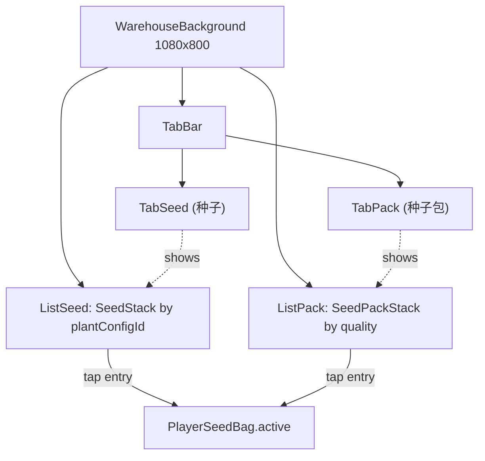

**中文：** **布局建议（设计像素，可在实现中按美术微调）**：

| 项 / Item | 值 / Value | 说明 / Notes |
|---|---|---|
| `TabBar` 尺寸 / size | 1000 × 80 px | 位于面板顶部内边距 24 px 处 / 24 px padding from panel top |
| 单 `Tab` 尺寸 / each tab | 480 × 80 px | 两 Tab 间距 40 px / 40 px gap between tabs |
| 选中态 / selected | 不透明 + 强调色描边 | inactive Tab 半透明 0.5 / inactive at 0.5 alpha |
| `EntryRow` 列表项 | 行高 96 px，左侧图标 80 × 80 px，右侧名称 + 数量 | tap → 写入 `bag.active` / tap writes `bag.active` |
| 列表区域 / list region | 1000 × ~600 px | 顶部 24 px 起，向下铺满；超出可竖向滚动 / vertical scroll if overflow |

**English:** **Suggested layout (design pixels, tunable in implementation):** see the table above.

**中文：** **「种子」Tab 列表条目（`SeedStack`）**：图标 = 对应 `PlantConfig.appearanceSpriteIds[0]`（节点 1，即播种期外形）；名称 = `PlantConfig.displayName`；数量 = `count`。点选时调用 `IPlantingService.SelectActive(Seed, plantConfigId)`，行高亮且其它行取消高亮。  
**English:** **`Seed` tab entry (`SeedStack`):** icon = `PlantConfig.appearanceSpriteIds[0]` (node 1, the seeded look); name = `PlantConfig.displayName`; count = `count`. On tap, invokes `IPlantingService.SelectActive(Seed, plantConfigId)`, highlights the row, and clears other highlights.

**中文：** **实现约束（v2.2）**：`Seed` 条目构建逻辑不得依赖 `SeedPackQuality` 或 `quality` 局部变量；其背景样式仅由 Seed 条目默认样式与 `active` 高亮状态决定。  
**English:** **Implementation constraint (v2.2):** `Seed` entry construction must not depend on `SeedPackQuality` or any `quality` local variable; its background style is driven only by the Seed default style and `active` highlight state.

**中文：** **「种子包」Tab 列表条目（`SeedPackStack`）**：图标使用通用「种子包」精灵 + 品质色徽标外圈；名称 = 品质本地化字符串（普通 / 稀有 / 史诗 / 传说）；数量 = `count`。点选时调用 `IPlantingService.SelectActive(Pack, quality)`。  
**English:** **`SeedPack` tab entry (`SeedPackStack`):** icon = a generic seed-pack sprite framed by the quality color ring; name = the localized quality string (Common / Rare / Epic / Legendary); count = `count`. On tap, invokes `IPlantingService.SelectActive(Pack, quality)`.

**中文：** **品质色（建议值，可在实现中按美术调整）**：

| 品质 / Quality | 中文名 / CN | 建议色 / Suggested color | 备注 / Notes |
|---|---|---|---|
| `Common` | 普通 | 白 (`#F5F5F5`) | 默认起步品质 / starter quality |
| `Rare` | 稀有 | 蓝 (`#4FA3FF`) | — |
| `Epic` | 史诗 | 紫 (`#A26CFF`) | — |
| `Legendary` | 传说 | 橙 (`#FF9F40`) | 最高品质 / highest tier |

**English:** **Quality colors (suggested, tunable per artwork):** see the table above.

**中文：** **空 Tab 提示**：若当前 Tab 列表为空，居中显示提示文案——种子 Tab 显示「暂无种子，去开包看看吧」；种子包 Tab 显示「暂无种子包」。提示不阻止 Tab 切换。  
**English:** **Empty-tab hint:** when the active tab list is empty, show a centered hint — Seed tab shows "暂无种子，去开包看看吧 / No seeds yet, open a pack"; Pack tab shows "暂无种子包 / No seed packs yet". The hint never blocks tab switching.

**中文：** **`active` 同步与互斥**：仓库 UI 始终高亮反映 `PlayerSeedBag.active`：当 `active.kind=Seed` 时仅在「种子」Tab 列表中高亮 `id=active.id` 的行；当 `active.kind=Pack` 时仅在「种子包」Tab 列表中高亮 `quality=active.id` 的行。两 Tab 之间永远只有一行处于「活跃」态。当玩家在另一 Tab 选中条目时，旧的 `active` 自动被覆盖（不需要额外清除）。  
**English:** **`active` sync and mutual exclusion:** the warehouse UI always reflects `PlayerSeedBag.active` — when `active.kind=Seed`, only the `id=active.id` row in the Seed tab is highlighted; when `active.kind=Pack`, only the `quality=active.id` row in the Pack tab is highlighted. Across both tabs only one row is active at a time. Selecting an item in the other tab overwrites the previous `active` (no explicit clearing needed).

**中文：** **种子包条目视觉规范（v2.1，`EntryRow_Pack_Common` 基准）**：`WarehouseBackground` 的 `ListFrame` 内展示「种子包」时，行样式改为卡片化布局，以下参数为 `Common` 的强约束，其他品质沿用同一布局仅替换文本与品质逻辑。  
**English:** **Seed-pack entry visual spec (v2.1, `EntryRow_Pack_Common` baseline):** inside `WarehouseBackground/ListFrame`, seed-pack entries use a card-like layout. The following values are hard constraints for `Common`; other qualities reuse the same layout and only differ by text/quality logic.

**中文：** **预制体子选项模板（v2.6）**：`WarehouseBackground.prefab` 内新增 `SeedPackOptionTemplate`（默认隐藏）作为「种子包」子选项模板，要求至少包含：`BigIcon`（大图标）、`SmallIcon`（小图标），以及 `SmallIcon/Count`（数量文本，显示该品质种子包当前拥有数）。运行时构建 `SeedPack` 列表时优先克隆该模板并写入图标/数量；模板缺失时才回退到代码构建。  
**English:** **Prefab sub-option template (v2.6):** add `SeedPackOptionTemplate` (hidden by default) inside `WarehouseBackground.prefab` as the seed-pack sub-option template, which must include at least `BigIcon` (large icon), `SmallIcon` (small icon), and `SmallIcon/Count` (count label showing current owned amount for that pack quality). Runtime should clone this template first when building the `SeedPack` list and fill icons/count; only fallback to code-built layout when the template is absent.

| 节点 / Node | 属性 / Property | 值 / Value | 说明 / Notes |
|---|---|---|---|
| `EntryRow_Pack_Common` | `Image.sourceImage` | `item_1340000` | 背板图 / card background sprite |
| `EntryRow_Pack_Common` | `Image.color` | `#FFFFFF` + `A=255` | 全白不透明 / opaque white |
| `EntryRow_Pack_Common` | `RectTransform` | `PosX=-7`, `PosY=114`, `Width=360`, `Height=360` | 基准卡片尺寸与锚点位移 |
| `IconImage` | `Image.sourceImage` | `item_1340000` | 图标图源与背板一致（临时资源约定） |
| `IconImage` | `RectTransform` | `PosX=-417`, `PosY=-395`, `Width=128`, `Height=128` | 图标位置与尺寸 |
| `Name` | `RectTransform` | `PosX=-415`, `PosY=-476`, `Width=96`, `Height=96` | 品质名位置与尺寸 |
| `Count` | `RectTransform` | `PosX=-422`, `PosY=-515` | 数量文本位置 |
| `Count` | `Text.alignment` | `MiddleCenter` | 数量文本居中 |
| `SmallIcon` | `RectTransform` | `PosX=-425`, `PosY=-278`, `Width=96`, `Height=96` | 小图标位置与尺寸（v2.8：PosY 由 -416 调整为 -278，向上抬升以避免与 `Count` 文本重叠）/ Small icon position and size (v2.8: PosY adjusted from -416 to -278, raised to avoid overlap with the `Count` label) |

**中文：** **资源装载约束（v2.1）**：运行时 `Image.sourceImage=item_1340000` 必须可被 `Resources.Load<Sprite>()` 命中，建议落地为 `Assets/Resources/AirUI/item_1340000.png`（加载路径 `AirUI/item_1340000`）；若仅存在于 `Assets/Scenes/Air/UI/`，仅可作为 Unity Editor 下的调试回退，不作为发布版资源来源。  
**English:** **Asset loading constraint (v2.1):** runtime `Image.sourceImage=item_1340000` must be resolvable via `Resources.Load<Sprite>()`, preferably at `Assets/Resources/AirUI/item_1340000.png` (load path `AirUI/item_1340000`); if it exists only under `Assets/Scenes/Air/UI/`, it may be used as an Editor-only debug fallback and must not be treated as the shipping runtime source.

#### 9.4.6 仓库内播种触发按钮与手势 / In-Warehouse Sow Button and Gesture

**中文：** 自 v2.9 起，「播种」操作的玩家入口从统一按钮迁移到种子仓库面板内的专用「播种」按钮 + 手势。设计目标：玩家在仓库选中 1 种「种子」或「种子包」后，仓库底部出现「播种」按钮，按下该按钮即关闭仓库 modal 并进入播种手势态；按住拖动可连续在多块田上播种，单击松开后可对单块田点击播种（一次性）。  
**English:** Since v2.9, the player entry for `Seed` is moved from the unified button to a dedicated in-warehouse "Sow" button + gesture. Design goal: after the player selects one `Seed` or `SeedPack` in the warehouse, a "Sow" button appears at the bottom of the warehouse panel; pressing it immediately closes the warehouse modal and enters a sow-gesture state. Holding-and-dragging seeds multiple tiles in one gesture; tap-and-release arms a one-shot click-sow that consumes the next tap on a sowable tile.

**中文：** **可见性与显示位置**：`SowActionButton` 的 GameObject 实际挂在 Canvas 根节点（不进入 `SeedWarehouseModal` 子树），但视觉位置位于 `WarehouseBackground` 底部居中，建议尺寸 360 × 120 px，`anchoredPosition (0, -680)` 附近（位于 20 田统一按钮之上、仓库面板内底部空白区）。显示条件：`seedBag.active != null` **且** 仓库 modal 处于打开状态 **且** 当前手势状态为 `Idle`；任一条件不满足则按钮 `SetActive(false)`。该挂载位置（Canvas 根而非 modal 子树）是支持「按下按钮 → 关闭 modal → 后续 IDrag/IPointerUp 仍能触发」这一交互链路的必要前提。  
**English:** **Visibility and placement:** the `SowActionButton` GameObject is parented under the Canvas root (NOT inside `SeedWarehouseModal` subtree), but visually positioned at the bottom-center of `WarehouseBackground` (suggested size 360 × 120 px, `anchoredPosition (0, -680)`, sitting above the 20-tile unified button and inside the bottom whitespace of the warehouse panel). Visibility conditions: `seedBag.active != null` **and** the warehouse modal is open **and** the current gesture state is `Idle`; any failure causes `SetActive(false)`. The Canvas-root parenting (not modal-subtree) is required so that the interaction chain "press button → close modal → later IDrag/IPointerUp still fire" works correctly.

**中文：** **手势状态机**：`SowGestureController` 维护四态 `Idle / Armed / SlideMode / ClickMode`，跨手势持有 `HashSet<string> sownThisGesture` 用于同田防重。  
**English:** **Gesture state machine:** `SowGestureController` maintains four states `Idle / Armed / SlideMode / ClickMode`, with a cross-gesture `HashSet<string> sownThisGesture` to deduplicate per-tile sows within a single drag.

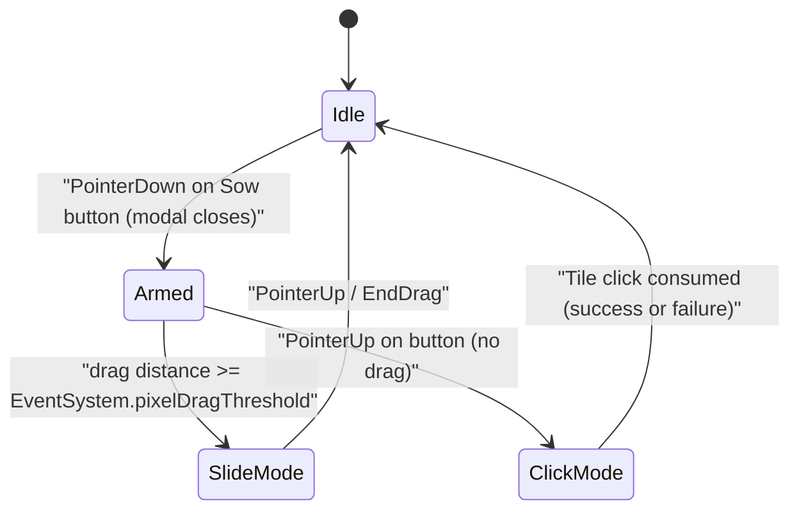

**中文：** **状态转移与行为**：

| 起始 / From | 触发 / Trigger | 终态 / To | 关键行为 / Key Behavior |
|---|---|---|---|
| `Idle` | `IPointerDown` on Sow button | `Armed` | 关闭 `SeedWarehouseModal`（`SetActive(false)`）；清空 `sownThisGesture`；记录起手指针位置 / close modal; clear dedup set; record press origin |
| `Armed` | `IBeginDrag` 或位移 ≥ `EventSystem.pixelDragThreshold` | `SlideMode` | 隐藏按钮（保留 GameObject 与 raycast 以接收后续 IDrag/IPointerUp）；进入持续命中阶段 / hide button visuals while keeping the GameObject alive for IDrag/IPointerUp |
| `Armed` | `IPointerUp` 且未达到拖拽阈值 | `ClickMode` | 隐藏按钮；进入「下一次 Tile 点击播种」待命态 / hide button; arm one-shot click sow |
| `SlideMode` | `IDrag` | `SlideMode` | 用 `EventSystem.RaycastAll(eventData)` 找首个 `TileSlotView`；若 `tileId` 不在 `sownThisGesture` 中且 `tile.planting==AwaitingSeed && active!=null && countOf(active)>0`，调用 `TrySeedTile(tileId)`，成功后加入 `sownThisGesture` / raycast tile under cursor; if eligible, call `TrySeedTile`, then add to dedup set |
| `SlideMode` | `IPointerUp` / `IEndDrag` | `Idle` | 清理状态；按钮可见性按 `Idle` 规则重新评估（默认仓库已关闭，按钮维持隐藏直到玩家再次打开仓库并选中 active） / cleanup; button visibility reevaluated by Idle rules |
| `ClickMode` | `TileSlotView.IPointerClick(tileId)` | `Idle` | 调用 `TrySeedTile(tileId)`；无论成功失败均退出 `ClickMode`（成功消耗 1 个种子 / 包，失败保留 active 不变） / call `TrySeedTile`; exit regardless of result |
| `ClickMode` | 玩家再次点击 `SowActionButton`（如手动取消）| `Idle` | 直接退出待命态（按钮在 `ClickMode` 期间默认隐藏，故此分支为可选保险） / cancel branch (button is hidden during ClickMode by default, so this branch is optional) |

**English:** **Transitions and behavior:** see the table above.

**中文：** **判定阈值**：使用 Unity `EventSystem.pixelDragThreshold`（默认值约 5–10 px，由 `EventSystem` 单例提供）作为「点击 / 滑动」分界。`SowActionButtonView` 实现 `IPointerDownHandler / IPointerUpHandler / IBeginDragHandler / IDragHandler / IEndDragHandler`，依赖 EventSystem 自带的拖拽分发流水线。  
**English:** **Threshold:** use Unity's `EventSystem.pixelDragThreshold` (default ~5–10 px, provided by the `EventSystem` singleton) as the click-vs-slide boundary. `SowActionButtonView` implements `IPointerDownHandler / IPointerUpHandler / IBeginDragHandler / IDragHandler / IEndDragHandler`, relying on the EventSystem's built-in drag dispatch pipeline.

**中文：** **同田防重**：`sownThisGesture` 在每次 `Armed` 进入时清空；`SlideMode` 内每次 `IDrag` 触发的 raycast 命中若已在集合中则跳过；保证一次拖动经过同一 tile 时不会消耗多份种子。`ClickMode` 不需要该集合（一次性消费）。  
**English:** **Same-tile dedup:** `sownThisGesture` is cleared whenever `Armed` is entered; in `SlideMode`, each `IDrag` raycast hit is skipped if already in the set, so a single drag traversing the same tile never consumes multiple seeds. `ClickMode` does not need this set (single-shot consume).

**中文：** **`countOf(active)==0` 自动结束**：`TrySeedTile` 在内部检查 `seeds` / `seedPacks` 堆数量为 0 时返回 `false`；`SlideMode` 仍按指针位置继续追踪（不强制结束手势），但所有后续命中均不消耗种子；玩家松手即结束。`active` 在数量耗尽时不自动清零（`PlayerSeedBag.active` 保留），由仓库 UI 在下次打开时根据 `seeds` / `seedPacks` 列表中是否仍有该堆做高亮态显示。  
**English:** **Auto-stop on empty count:** `TrySeedTile` returns `false` when the internal stack count drops to 0; `SlideMode` keeps tracking the pointer (does not force-end the gesture) but no subsequent hit consumes a seed; the player ends the gesture by releasing. `active` is not auto-cleared when the count drains (`PlayerSeedBag.active` stays); the warehouse UI re-evaluates highlight on next open based on remaining stacks.

**中文：** **接口契约**：
- `IPlantingService.TrySeedTile(tileId) → bool`：见 §6
- `TileSlotView` 实现 `IPointerClickHandler`：在 `SowGestureController.IsClickMode` 为 true 时调用 `controller.RequestClickModeSow(tileId)`；否则：`AwaitingHarvest` 走 `TryHarvestTile(tileId)`；若已选肥料且田 `Seeded && fertilizer==AwaitingFertilizer`（§9.7）则先试 `ApplyFertilizerToTile(tileId)`；失败或未选肥料时再对已种植且非待收获触发 §9.1.1 Tips
- `SowGestureController.Init(modalRt, service)`：在 `AirMainMenuRuntimeBuilder` 构建仓库 modal 后注入 modal 引用与服务句柄，用于 IPointerDown 关闭 modal

**English:** **Interface contracts:**
- `IPlantingService.TrySeedTile(tileId) → bool`: see §6
- `TileSlotView` implements `IPointerClickHandler`: when `SowGestureController.IsClickMode` is true, call `controller.RequestClickModeSow(tileId)`; otherwise: `AwaitingHarvest` goes to `TryHarvestTile(tileId)`; when a fertilizer is selected and the tile is `Seeded && fertilizer==AwaitingFertilizer` (§9.7), attempt `ApplyFertilizerToTile(tileId)` first; on failure/no selection, trigger §9.1.1 tips for planted tiles that are not awaiting harvest
- `SowGestureController.Init(modalRt, service)`: injected by `AirMainMenuRuntimeBuilder` after the warehouse modal is built, providing the modal reference and service handle so that `IPointerDown` can close the modal

**中文：** **实现优先级**：P0 必做「按钮显隐 + IPointerDown 关闭 modal + SlideMode 持续命中 + ClickMode 一次性命中 + 同田防重」；视觉过场（按钮按下抖动、命中田闪烁）可延至 P1。  
**English:** **Implementation priority:** P0 must ship "button visibility + close modal on IPointerDown + SlideMode continuous hit + ClickMode one-shot hit + same-tile dedup"; visual polish (button press bounce, hit-tile flash) may wait until P1.

### 9.5 主界面村民展示与待机动作 / Main Menu Villager Display and Idle Motion

**中文：** 主界面增加一名可视化主角 Role；**自 v3.48 起** Spine 形象切换为 **`Assets/Scenes/Air/LangRen/Role_cslangren`**（`Role_cslangren_SkeletonData` / `Role_cslangren_Material`），**仍通过**历史路径 `Assets/Scenes/Air/Role/Hero_Role_cunmin.prefab` 与 `Resources/Prefabs/Air/Hero_Role_cunmin.prefab` 装载（文件名保持兼容，预制体内引用已指向 LangRen 骨骼）。**待机 / 浇水施肥 / 收获队列** 三类动画名由 `MainRoleCunminPresenter` 的 Inspector 字段配置，并在运行时按候选链解析：**待机** `idleAnimationName`（默认 `exclusive_2`）→ `exclusive_2` → `standby_1` → `animation` → `idle` → 骨骼首条动画；**浇水与施肥** `waterFertilizeAnimationName`（默认 `attack_3`）→ `attack_3` → `attack_1` → `attack` → `animation` → 首条；**收获相关 wait** `harvestGrowthAnimationName`（默认 `wait_3`）→ `wait_3` → `wait_1` → `wait` → `animation` → 首条。交互动画语义不变：**每次统一按钮成功执行 `Water` → 播放一次解析后的「攻击类」动画（不循环）后回到待机**；**自 v2.10 起，每次 `OnFertilizeApplied`（即 §9.7 三段式施肥成功）也触发同一条「攻击类」动画**；**自 v3.2 起至 v3.26**：每次收获成功且 `GameSession.role` 因收获实际变化（经 `OnRoleStatsChanged`）→ 播放一次解析后的「wait 类」动画后回到待机；**自 v3.27 起**，普通农田收获不再直接改 `RoleStats`，故默认不再因收获排队 wait 动画（仍保留 `OnRoleStatsChanged`→wait 队列逻辑供战斗等其它来源使用）。**UGUI 层级**：`VillagerRoleRoot` 须在 **农田网格与统一操作按钮之后** 创建（或等价地调整 `siblingIndex`），使角色显示在 **主背景与网格之上**、**种子仓库遮罩弹窗之下**（弹窗打开时仍盖住角色）。  
**English:** Add a visible protagonist Role on the main menu. **Since v3.48**, the Spine silhouette is **`Assets/Scenes/Air/LangRen/Role_cslangren`** (`Role_cslangren_SkeletonData` / `Role_cslangren_Material`), still loaded via the legacy paths `Assets/Scenes/Air/Role/Hero_Role_cunmin.prefab` and `Resources/Prefabs/Air/Hero_Role_cunmin.prefab` (filename kept for compatibility; the prefab now references the LangRen skeleton). **Idle / water-fertilize / harvest-queue** clip names are configured on `MainRoleCunminPresenter` and resolved at runtime with fallbacks: **idle** `idleAnimationName` (default `exclusive_2`) → `exclusive_2` → `standby_1` → `animation` → `idle` → first skeleton animation; **water+fertilize** `waterFertilizeAnimationName` (default `attack_3`) → `attack_3` → `attack_1` → `attack` → `animation` → first; **harvest wait** `harvestGrowthAnimationName` (default `wait_3`) → `wait_3` → `wait_1` → `wait` → `animation` → first. Interaction semantics are unchanged: **each successful unified `Water` plays the resolved "attack-like" clip once (non-looping) then returns to idle**; **since v2.10, each `OnFertilizeApplied` also triggers the same "attack-like" clip**; **v3.2–v3.26:** each successful harvest that changes `GameSession.role` plays the resolved "wait-like" clip once then returns to idle; **since v3.27**, normal farm harvest no longer writes `RoleStats` by default, so harvest no longer queues wait clips (the `OnRoleStatsChanged` queue remains for other sources such as battle). **UGUI layering:** `VillagerRoleRoot` must be created **after** the farm grid and unified action button (or equivalent `siblingIndex` adjustment) so the character draws **above background and grid** and **below** the seed-warehouse modal mask when open.

**中文：** **动画交叠默认策略**：解析后的「攻击类」动画（历史默认 `attack_3`）连点时 **打断并重播** 当前攻击类片段。若在攻击类播放期间触发「wait 类」（历史默认 `wait_3`，收获涨属性），**将 wait 类排入队列**，待当前攻击类结束后再播；若在 wait 类期间触发新的攻击类，**打断 wait 类并播放攻击类**，已排队的额外 wait 类仍按队列依次播完。  
**English:** **Animation overlap policy:** rapid water/fertilize taps **interrupt and restart** the resolved **attack-like** clip (historically `attack_3`). If a **wait-like** clip is requested while an attack-like clip is playing (harvest stat gain; historically `wait_3`), **queue the wait-like clip** until the attack-like clip completes. If an attack-like clip is requested while a wait-like clip is playing, **interrupt the wait-like clip and play the attack-like clip**; any queued extra wait-like clips still drain in order.

**中文：** 村民节点默认锚点为画布顶部中点（`anchorMin = anchorMax = (0.5, 1)`），当前默认初始坐标为 `(0, -600)`（v3.14），用于与主界面前景元素避让；具体数值仍可由策划/美术在 `MainRoleCunminPresenter` 的 Inspector 微调。  
**English:** The role node defaults to top-center canvas anchors (`anchorMin = anchorMax = (0.5, 1)`), with current default initial coordinates `(0, -600)` (v3.14) to better avoid foreground overlap on the main menu; final coordinates remain Inspector-tunable in `MainRoleCunminPresenter`.

**中文：** **数据结构定义（运行时配置）**：  
**English:** **Data structure definition (runtime config):**

```csharp
struct MainRoleCunminConfig {
    GameObject villagerPrefab;          // default: Hero_Role_cunmin.prefab; Player 构建需 Resources 副本，见下
    Vector2 anchoredPosition;           // default: (0, -600), editable in Inspector
    Vector3 localScale;                 // default: (0.35, 0.35, 1)
    string idleAnimationName;           // default: "exclusive_2" (loop)
    string waterFertilizeAnimationName; // default: "attack_3" (once)
    string harvestGrowthAnimationName;  // default: "wait_3" (once)
}
```

**中文：** **接口/API 设计**：`AirMainMenuRuntimeBuilder` **不再内联** Spine 与村民预制体逻辑；在同一 `Boot` 物体上挂载 `MainRoleCunminPresenter`，由其在 `Build(RectTransform canvasRect, IPlantingService service)`（或等价入口）内创建 `VillagerRoleRoot`、实例化预制体、订阅 `OnUnifiedActionExecuted` 与 `OnRoleStatsChanged`，并用 **强类型** `Spine.Unity.SkeletonAnimation` 驱动动画。Builder 在农田 UI 与统一按钮构建完成之后调用该 Presenter 一次即可。  
**English:** **Interface/API design:** `AirMainMenuRuntimeBuilder` must **not** embed Spine/villager prefab logic inline. Add `MainRoleCunminPresenter` on the same `Boot` object; it implements `Build(RectTransform canvasRect, IPlantingService service)` (or equivalent), creates `VillagerRoleRoot`, instantiates the prefab, subscribes to `OnUnifiedActionExecuted` and `OnRoleStatsChanged`, and drives animations via **strongly typed** `Spine.Unity.SkeletonAnimation`. The builder invokes this presenter **once after** farm grid and unified button are built.

**中文：** **资源装载约束（Player 构建）**：非 Editor 环境下不能使用 `AssetDatabase`；须额外提供可被 `Resources.Load<GameObject>("Prefabs/Air/Hero_Role_cunmin")` 命中的预制体副本（建议路径 `Assets/Resources/Prefabs/Air/Hero_Role_cunmin.prefab`，与工程内权威美术预制体保持内容一致）。Editor 下仍可回退 `Assets/Scenes/Air/Role/Hero_Role_cunmin.prefab`。  
**English:** **Asset loading (player builds):** `AssetDatabase` is unavailable outside the Editor; ship a prefab copy addressable via `Resources.Load<GameObject>("Prefabs/Air/Hero_Role_cunmin")` (recommended path `Assets/Resources/Prefabs/Air/Hero_Role_cunmin.prefab`, kept in sync with the authored asset). In the Editor, loading from `Assets/Scenes/Air/Role/Hero_Role_cunmin.prefab` remains a valid fallback.

**中文：** **实现优先级**：P0 必做「预制体显示 + 待机/攻击类/wait 类动画经 §9.5 候选链可解析 + 浇水/施肥触发攻击类动画 + 收获涨 atk 时 wait 类动画 + Inspector 可调位置/层级正确」；更复杂的状态机可延至 P1。  
**English:** **Implementation priority:** P0 must ship prefab display + idle/attack/wait clips resolvable via the §9.5 fallback chains + attack-like clip on water/fertilize + wait-like clip when harvest increments atk + Inspector-tunable pose + correct draw order; richer state machines may wait until P1.

**中文：** **技术实现建议**：优先保留 `Hero_Role_cunmin.prefab` 内部材质、骨骼与默认动画配置，避免运行时二次拼装；`VillagerRoleRoot` 仅承担锚点定位（中上部）与缩放控制。若后续换美术，仅替换预制体引用，不改主界面构建流程。  
**English:** **Technical notes:** Prefer preserving material/skeleton/default animation authored inside `Hero_Role_cunmin.prefab` to avoid runtime reassembly; `VillagerRoleRoot` should only control anchoring (upper-middle) and scale. Future art swaps should only replace prefab reference without changing the main-menu build pipeline.

**中文：** **运行时依赖与预制体洁净度（v2.3）**：村民骨骼链路依赖工程内已导入的 `spine-unity` Runtime（位于 `Assets/Spine/`），其提供 `Spine/Skeleton` Shader 与 `SkeletonAnimation`、`SkeletonDataAsset`、`SpineAtlasAsset` 等 MonoBehaviour 类型；缺失该 Runtime 时 §1.11 容错路径会切到 UI 占位回退，但 P0 正路径不可达。**Runtime 的主版本·次版本必须与骨骼导出数据一致**，详见下一条「Spine 导出版本与运行时对齐（v2.4）」。`Hero_Role_cunmin.prefab` 上**只保留** `Transform / MeshFilter / MeshRenderer / SkeletonAnimation` 四类组件（外加子节点 `CarryAnchor` 这一仅 Transform 的锚点），不允许残留任何 P1 才需要的角色驱动器（如基于 `motor` 的 idle/walk 切换器）；任何 P1 控制器若以"未实装的脚本占位"形式留在预制体中，会因 `missingMonoScripts > 0` 而触发回退，等价于把 P0 正路径直接掐断。  
**English:** **Runtime dependency and prefab hygiene (v2.3):** the villager skeleton path depends on the imported `spine-unity` Runtime under `Assets/Spine/`, which provides the `Spine/Skeleton` shader and the `SkeletonAnimation` / `SkeletonDataAsset` / `SpineAtlasAsset` MonoBehaviours; without this Runtime, §1.11 fallback to UI placeholder kicks in but the P0 happy path is unreachable. **The Runtime major.minor must match the skeleton export data** — see the next clause "Spine export vs runtime alignment (v2.4)". `Hero_Role_cunmin.prefab` must contain **only** `Transform / MeshFilter / MeshRenderer / SkeletonAnimation` (plus a `CarryAnchor` Transform-only child), with no leftover P1-only character drivers (e.g. motor-driven idle/walk switchers). Any P1 controller left behind as a "missing-script placeholder" will trip `missingMonoScripts > 0`, which forces fallback and effectively disables the P0 happy path.

**中文：** **Spine 导出版本与 spine-unity Runtime 对齐（v2.4）**：`SkeletonDataAsset` 引用的 `*.skel.bytes`（或 JSON）内含 Spine Editor 导出版本号；当前 Demo 主角骨骼 `Role_cslangren.skel.bytes`（及历史 `Role_cunmin.skel.bytes`）报告 **4.1.x**（例如 `4.1.17`）时，工程内必须使用官方 **spine-unity 4.1**（及匹配的 spine-csharp），否则 `SkeletonBinary.ReadSkeletonData` 无法解析，编辑器弹出 `Version mismatch! Skeleton data could not be loaded`，村民链路退回 §1.11。**两条合规路径（二选一）**：（**A**）在 Spine Editor **4.2** 中打开工程并重新导出对应骨骼全套资源（至少替换 `*.skel.bytes`，并按官方流程刷新 atlas / 贴图 / `.atlas.txt`），从而与已导入的 **spine-unity 4.2** 对齐；（**B**）骨骼继续使用 **4.1.x** 导出物不变，则从官网下载并导入 **spine-unity 4.1** 对应 unitypackage，**替换** 工程中现有的 `Assets/Spine/`（及可选示例目录），使 Runtime 与数据同为 4.1。**禁止**仅篡改第三方插件源码以绕过版本对话框——主版本·次版本不匹配时二进制格式可能根本不可用。  
**English:** **Spine export vs spine-unity Runtime alignment (v2.4):** `SkeletonDataAsset` references `*.skel.bytes` (or JSON) that embed the Spine Editor export version string; when the hero skeleton export (e.g. `Role_cslangren.skel.bytes`, and historically `Role_cunmin.skel.bytes`) reports **4.1.x** (e.g. `4.1.17`), the project must use the official **spine-unity 4.1** runtime (and matching spine-csharp); otherwise `SkeletonBinary.ReadSkeletonData` fails to parse, Unity shows `Version mismatch! Skeleton data could not be loaded`, and the villager path falls back to §1.11. **Two compliant paths (pick one):** (**A**) Re-export the skeleton from Spine Editor **4.2** (replace at least `*.skel.bytes`, and refresh atlas / textures / `.atlas.txt` per Spine workflow) to align with the already-imported **spine-unity 4.2**; (**B**) Keep the **4.1.x** export assets unchanged, download and import the official **spine-unity 4.1** unitypackage, and **replace** the existing `Assets/Spine/` (and optional Examples) so Runtime and data are both 4.1. **Do not** hack third-party runtime sources only to silence the version dialog — mismatched major.minor may mean an incompatible binary format.

### 9.5.1 主界面精灵伴侣展示 / Main Menu Pet Companion Display (v3.24)

**中文：** 自 v3.24 起，玩家通过 §4.1.10 收获到的「精灵」（即 `OnMutationHarvested` 事件中 `kind == MutationKind.Pet`）必须以**伴侣**形式持续出现在主界面 **§9.5 主角** 的旁边。每只精灵以 `SkeletonGraphic` 形式渲染（与 §9.5 主角同构，避免与 Screen Space Overlay 主画布相互遮挡），**Y 坐标与主角的 `villagerAnchoredPosition.y` 完全一致**，X 坐标位于主角右侧，以固定步长依次排开。**自 v3.62 起**，伴侣默认进入 §9.5.2「精灵巡逻」双状态 FSM（待机 / 协助种植），不再仅无限循环 idle。  
**English:** Since v3.24, every Pet obtained via §4.1.10 (i.e. `OnMutationHarvested` with `kind == MutationKind.Pet`) must appear as a persistent **companion** beside the **§9.5 hero** on the main menu. Each pet is rendered with `SkeletonGraphic` (mirroring §9.5 to avoid being occluded by the Screen Space Overlay canvas), with **Y matching `MainRoleCunminPresenter.villagerAnchoredPosition.y`** and X laid out to the right at a fixed stride. **Since v3.62**, companions enter the §9.5.2 patrol FSM (idle / assist planting) instead of only looping idle forever.

**中文：** **触发与数据来源**：  
**English:** **Trigger and data source:**

- **触发** / **Trigger**：`IPlantingService.OnMutationHarvested(mutationId, kind, refId)` 中 `kind == MutationKind.Pet`。
- **数据查询** / **Lookup**：通过 `IPlantingService.GetPetConfig(refId)` 获取 `PetConfig`；通过 `Resources.Load<GameObject>(PetConfig.prefabResource)` 取得权威 Spine 预制体并提取其 `SkeletonDataAsset`。
- **资源回退** / **Fallback**：若 `prefabResource` 为空 / 资源缺失 / `SkeletonDataAsset` 解析失败，仅记录 `Debug.LogWarning` 并跳过本次创建，不阻塞 §4.1.10.5 的 `MutationRevealPopupView` 弹窗与其它系统。

**中文：** **位置规则**：  
**English:** **Position rule:**

- 在主画布下创建 **`PetCompanionRoot`** 节点，锚点与 `MainRoleCunminPresenter.VillagerRoleRoot` 一致（`anchorMin = anchorMax = (0.5, 1)`、`pivot = (0.5, 0.5)`、`anchoredPosition = (0, 0)`），保证两者坐标系完全对齐。
- 每只精灵作为 `PetCompanionRoot` 的子节点（命名 `PetCompanion_{petId}_{seq}`），其 `RectTransform` 锚点 `(0.5, 0.5)`、`pivot=(0.5, 0.5)`，`anchoredPosition.y` **直接复用 `MainRoleCunminPresenter.villagerAnchoredPosition.y`**（默认 `-600`），`anchoredPosition.x` 按 `petCompanionFirstOffsetX + (index * petCompanionStrideX)` 计算（默认 `320 + index * 220`）。
- 默认 `sizeDelta = (480, 720)`；`localScale` 默认 `(0.40, 0.40, 1)`，经 **`FantaziaMonsterDisplay.BoostedHorizontallyMirroredScale`** 后为 **`(-0.48, 0.48, 1)`**（先 XY ×**1.2** 再 Fantazia 水平镜像，见 §9.5.1.3），与主角 `(-0.53, 0.53)` 同向翻转、整体协调，使精灵略小于主角以体现「随从」尺度，可在 Inspector 微调。
- **重复持久化** / **Persistence**：精灵一旦显示则在场景内一直保留；同一 `petId` 多次收获将连续追加（叠加显示多只）。

**中文：** **动画规则**：  
**English:** **Animation rule:**

- 默认每只精灵循环播放 `idle` 动画。
- 若骨骼数据中缺少名为 `idle` 的动画，按以下顺序回退：先取 `PetConfig.randomAnimations` 中的第一项；再回退到骨骼数据 `Animations[0]`；皆缺失时仅记录 Warning，不阻塞渲染（精灵以静默 Pose 显示）。

**中文：** **UGUI 层级（v3.111 修订）**：`PetCompanionRoot` 与 `VillagerRoleRoot` 仍同挂 `JiaYuanWorldContent`（构建顺序：农田 → 主角 → 精灵），但**互遮关系**改由 §9.1.4 `JiaYuanWorldDepthSorter` 按 Y 轴动态决定，不再以静态 sibling 保证「角色永远在网格之上」。弹窗打开时仍由弹窗的更高 `sortingOrder` 覆盖伴侣。  
**English:** **UGUI layering (revised v3.111):** `PetCompanionRoot` and `VillagerRoleRoot` remain under `JiaYuanWorldContent` (build order: farm → hero → pets), but **occlusion** is driven by §9.1.4 `JiaYuanWorldDepthSorter` Y-sort, not static siblings; modals with higher `sortingOrder` still cover companions when open.

#### 9.5.1.1 数据结构与接口 / Data Structure and APIs

**中文：** **数据结构定义（运行时配置）**：  
**English:** **Data structure definition (runtime config):**

```csharp
class PetCompanionPresenter : MonoBehaviour {
    Vector2 rootAnchoredPosition;        // default (0, 0)；与 VillagerRoleRoot 一致
    float   petCompanionFirstOffsetX;    // default 320；首只精灵相对主角的 X 偏移
    float   petCompanionStrideX;         // default 220；多只精灵之间的 X 步长
    float   companionAnchoredPosY;       // default -600；与 MainRoleCunminPresenter.villagerAnchoredPosition.y 同步
    Vector2 petGraphicSize;              // default (480, 720)
    Vector3 petLocalScale;               // default (0.40, 0.40, 1)
    string  idleAnimationName;           // default "idle"

    void Build(RectTransform canvasRect, IPlantingService service);
    // 订阅 OnMutationHarvested；当 kind==Pet 时拉取 PetConfig 并 SpawnCompanion(petConfig)
}
```

**中文：** **接口/API 设计**：`PetCompanionPresenter` 由 `AirMainMenuRuntimeBuilder.Build()` 在创建 `MainRoleCunminPresenter` 后追加挂载，并以同一 `canvasRect / service` 入参调用 `Build`。Presenter 内部维护 `List<RectTransform>` 已生成精灵节点，新精灵在末尾追加；`OnDestroy` 解订阅服务事件。  
**English:** **Interface/API design:** `PetCompanionPresenter` is mounted by `AirMainMenuRuntimeBuilder.Build()` immediately after `MainRoleCunminPresenter`, sharing the same `canvasRect / service` parameters. The presenter maintains an internal `List<RectTransform>` of spawned pet nodes, appends new ones to the tail, and unsubscribes from service events in `OnDestroy`.

#### 9.5.1.2 实现优先级 / Implementation Priority

**中文：** P0 必做「Pet 收获后立即出现 + 与主角同 Y + 循环 `idle` 动画 + 多只横向排开 + 资源缺失安全回退」；P1 可加入入场动画（淡入 / 弹跳）、点击交互（弹出精灵详情）、行为 AI（呼吸 / 跟随主角动作）、持久化到存档等。  
**English:** P0 must ship "pet appears immediately after harvest + same Y as the role + looping `idle` + horizontal layout for multiple pets + safe fallback on missing assets"; P1 may add entry animation (fade / bounce), click interaction (pet detail popup), behavior AI (breathing / following the role), and save persistence.

#### 9.5.1.3 技术实现建议 / Technical Notes

**中文：**
- **复用 §9.5 模式**：与 `MainRoleCunminPresenter.TryBuildSkeletonGraphic` 类似——实例化预制体只做探针读取，随后销毁。**必须**同步预制体权威 `SkeletonAnimation` 上的 `initialSkinName`（及 `initialFlipX/Y`）；若仅用 `SkeletonDataAsset` 的默认皮肤而预制体配置了 `V1/V3` 等变体皮肤，运行时骨骼可能无任何附件挂载，从而导致 `SkeletonGraphic` 顶点为空、画面上「看得见节点但完全没有外形」（典型如 `Monster_102_Hamy Alsapphire` 的 `initialSkinName=V3`）。**多图集/多材质**：当 `SkeletonDataAsset.atlasAssets.Length > 1` 或 `atlasAssets[0].MaterialCount > 1` 时，`SkeletonGraphic` 必须启用 `allowMultipleCanvasRenderers`（与 Spine Unity 官方对 Unity UI 单 CanvasRenderer 单纹理限制的说明一致）。
- **Shader 依赖**：`SkeletonGraphic` 需 `Spine/SkeletonGraphic` Shader（spine-unity Runtime 自带）；缺失时 Presenter 仅记录一次 Warning 并跳过本只精灵。
- **缺失脚本扫描**：与 §9.5 同样调用 `GetComponentsInChildren<MonoBehaviour>(true)` 校验 `null != null` 计数，规避 P1 残留脚本占位的预制体。
- **不与主角动画耦合**：精灵巡逻与主角动画完全独立，不订阅 `OnUnifiedActionExecuted / OnRoleStatsChanged / OnFertilizeApplied`，避免与 `attack_3 / wait_3` 主角动画冲突；协助浇水/收获调用 `TryWaterTile` / `TryHarvestTile`，**不得**触发 `OnUnifiedActionExecuted`。
- **Fantazia 水平镜像 + 放大 20%**：凡 `prefabResource` 指向自 `Assets/Fantazia Animated 2D Monsters/Prefabs/` 复制到 `Resources/Pets/` 的精灵，伴侣根 `RectTransform.localScale` **必须**经 `FantaziaMonsterDisplay.BoostedHorizontallyMirroredScale`（先 `localScale.xy *= PackVisualScaleMultiplier`（默认 **1.2**），再 `localScale.x = -Mathf.Abs(localScale.x)`）处理后再 `Initialize`，与 §4.1.10.5 / §12.3 / B.11 一致。
- **不复用 `PetPreviewRig`**：`PetPreviewRig` 输出的 `RenderTexture` 仅用于 `MutationRevealPopupView` 单只预览；伴侣需多只共存且与 UI 一同布局，故必须使用 `SkeletonGraphic` 直挂主画布。

**English:**
- **Mirror §9.5 pattern, with prefab fidelity:** akin to `MainRoleCunminPresenter.TryBuildSkeletonGraphic` — probe-instantiate the prefab once, read its authored setup, then destroy the probe. **You MUST** mirror the authoritative `SkeletonAnimation.initialSkinName` (and `initialFlipX/Y`) onto `SkeletonGraphic`. If UI creation only uses `SkeletonDataAsset`'s implicit default skin while the prefab was authored with a variant skin (e.g. `V3` on `Monster_102_Hamy Alsapphire`), attachments may resolve to emptiness → zero mesh vertices → a RectTransform hierarchy that looks present but renders no silhouette.**Multi-page / multi-material atlases:** when `SkeletonDataAsset.atlasAssets.Length > 1` or `atlasAssets[0].MaterialCount > 1`, `SkeletonGraphic.allowMultipleCanvasRenderers` must be enabled (official Spine constraint for Canvas UI vs one texture per `CanvasRenderer`).
- **Shader dependency:** `SkeletonGraphic` requires the `Spine/SkeletonGraphic` shader (shipped by spine-unity Runtime); when missing, the presenter logs a single warning and skips that pet.
- **Missing-script guard:** like §9.5, call `GetComponentsInChildren<MonoBehaviour>(true)` and count nulls to dodge prefabs polluted by P1 placeholders.
- **Decoupled from role animation:** the looping `idle` is fully independent — the presenter must NOT subscribe to `OnUnifiedActionExecuted / OnRoleStatsChanged / OnFertilizeApplied` to avoid clashing with `attack_3 / wait_3`.
- **Fantazia horizontal mirror + +20% scale:** whenever `prefabResource` points to a pet duplicated from `Assets/Fantazia Animated 2D Monsters/Prefabs/` under `Resources/Pets/`, the companion root `RectTransform.localScale` **must** pass through `FantaziaMonsterDisplay.BoostedHorizontallyMirroredScale` (first `localScale.xy *= PackVisualScaleMultiplier` (default **1.2**), then `localScale.x = -Mathf.Abs(localScale.x)`) before `Initialize`, matching §4.1.10.5 / §12.3 / Appendix B.11.1.
- **Do not reuse `PetPreviewRig`:** `PetPreviewRig` outputs a single `RenderTexture` consumed by `MutationRevealPopupView`; companions need multiple instances co-existing within the canvas layout, so they must use `SkeletonGraphic` directly under the main canvas.

### 9.5.2 精灵巡逻 / Pet Patrol (v3.62)

**中文：** 自 v3.62 起，§9.5.1 收获的每只精灵在**底部导航「家园 / JiaYuan」**打开时运行独立双状态巡逻 FSM；离开家园 Tab 时暂停协助逻辑、保持当前位置并强制待机。  
**English:** Since v3.62, each §9.5.1 companion runs an independent two-state patrol FSM while the bottom nav **Home / JiaYuan** tab is open; leaving that tab pauses assist logic, freezes position, and forces idle.

#### 9.5.2.1 状态与切换 / States and Transitions

| 状态 | 行为 |
|------|------|
| **状态1 待机 (`Idle`)** | 在当前 `anchoredPosition` **循环** `idle`（动画名解析同 §9.5.1）；**每播完一整圈** idle（Spine `TrackEntry.Complete` 且 `entry.Loop==true`）后抽签下一状态 |
| **状态2 协助种植 (`AssistPlanting`)** | 随机选一块「有植物」田 → 线性插值移动到田面中心（`moveDurationSec`，默认 0.6s）→ 非循环 `attack` **2 遍** → 按田状态施加效果 → 抽签下一状态；**协助结束后留在该田位置**进入待机，不强制回到主角旁 |

**抽签规则**（每次「当前状态要求的动作序列」结束后执行一次）：

- 若 20 田中**不存在**任何「有植物」田 → **100%** 进入 / 保持 **状态1**
- 否则 → **65%** 状态1、**35%** 状态2（`UnityEngine.Random.value < 0.65f`）

**有植物田**：`tile.planting == Seeded` 且 `plantInstanceId` 非空 且 `lockedByMutationId` 为空。

**协助效果**（攻击 2 遍结束后，对**本次选中的** `tileId` 判定，优先级与 §10.1 一致）：

1. 可收获 → `IPlantingService.TryHarvestTile(tileId)`
2. 否则任一可浇水阶（`IsWaterStage1/2/3Actionable`）→ `IPlantingService.TryWaterTile(tileId)`
3. 皆不可 → **仅播放攻击，不写农田数据**

**家园 Tab 联动**（`BottomNavBarView.OnOpenChanged`，`OpenKey` 与 `JiaYuanHomeFeatureEntriesView.JiaYuanNavKey` 比较）：

| 事件 | 行为 |
|------|------|
| 离开 `JiaYuan` | 停止各精灵协程；`homePatrolEnabled=false`；**不修改** `anchoredPosition`；强制状态1 + 循环 idle |
| 进入 `JiaYuan` | `homePatrolEnabled=true`；每只精灵 **重新抽签** 并进入对应状态（可能立刻开始协助序列） |
| 新收获精灵 | 若当前为家园 Tab → 重新抽签；否则 → 仅循环 idle（不启动协助）直至下次进入家园 |

#### 9.5.2.2 数据结构与接口 / Data Structures and APIs

```csharp
enum PetPatrolState { Idle, AssistPlanting }

const float kIdleStateProbability = 0.65f;   // 进入 / 保持状态1
const float kAssistStateProbability = 0.35f; // 进入状态2（仅当存在有植物田时）

class PetCompanionPresenter : MonoBehaviour {
    float moveDurationSec;              // default 0.6
    float animationWaitTimeout;         // default 8
    string attackAnimationName;         // default "attack"；回退 Attack / attack_1
    string idleAnimationName;           // default "idle"（同 §9.5.1）

    void Build(RectTransform canvasRect, IPlantingService service);
    void BindBottomNavBar(BottomNavBarView barView); // 订阅 OnOpenChanged；由 AirMainMenuRuntimeBuilder 在底栏创建后调用
}
```

**服务层（§6）新增**：

- `IPlantingService.TryWaterTile(tileId) → bool` — 对指定田执行一次浇水（`ApplyWater`）；失败：`tileId` 不存在 / 非 `IsWaterStage1/2/3Actionable` / 变异锁定。成功触发 `OnTileFlagsChanged`；**不**触发 `OnUnifiedActionExecuted`。

**坐标**：目标田位置 = `FarmGridView.GetTileSlotRect(tileId).position` 经 `RectTransformUtility` 转换到 `PetCompanionRoot` 本地 `anchoredPosition`；`FarmGridView.Instance` 为空时跳过移动、原地攻击。

#### 9.5.2.3 实现优先级 / Implementation Priority

**中文：** P0 = 双状态 FSM + 概率 + 协助移动/攻击×2/浇水或收获 + 家园 Tab 暂停与重抽签 + `TryWaterTile`；P1 = 移动缓动曲线、面向翻转、点击精灵详情。  
**English:** P0 = dual-state FSM, probabilities, assist move/attack×2/water-or-harvest, home-tab pause/re-roll, and `TryWaterTile`; P1 = move easing, facing flip, tap-to-detail.

### 9.6 主界面主角四维属性直显 / Main Menu Hero Four-Stat Display

**中文：** 主界面增加一行主角属性文本，固定展示 **攻击 / 防御 / 血量 / 敏捷** 四项基础数值；用于 P0 快速验证角色战斗信息可见性。该行文本默认位于主界面中部并横向排开，后续允许在 Inspector 中微调位置与间距。  
**English:** Add a single row of hero stats on the main menu, showing four base values: **Attack / Defense / HP / Agility**. This is a P0 visibility feature for quick combat-stat verification. The row is centered horizontally by default and supports later Inspector tuning for position and spacing.

**中文：** **数据结构定义（运行时配置）**：  
**English:** **Data structure definition (runtime config):**

```csharp
struct HeroMainMenuStatsDisplayConfig {
    int atk;                    // 攻击
    int def;                    // 防御
    int hp;                     // 血量（P0 先显示单值）
    int agility;                // 敏捷
    int fontSize;               // 固定 36
    Vector2 centeredAnchorPos;  // 默认 (0, 106)，居中锚点
    float atkPosX;              // 默认 -378
    float defPosX;              // 默认 -105
    float hpPosX;               // 默认 154
    float agilityPosX;          // 默认 421
}
```

**中文：** **接口/API 设计**：`AirMainMenuRuntimeBuilder.Build()` 增加 `BuildHeroStatsDisplay(canvasRect)` 子流程；该流程创建 `HeroStatsRow` 根节点与 4 个子 `Text`（`AtkText / DefText / HpText / AgilityText`），统一设置 `fontSize=36`、`alignment=MiddleCenter`。四项文本在 P0 阶段仅显示数值（如 `120`、`80`、`1000`、`60`），不显示属性名。`HeroStatsRow` 默认 `anchoredPosition.y=106`，四个子文本默认 `anchoredPosition.x` 依次为 `-378 / -105 / 154 / 421`。为兼容历史场景：若 `heroStatsRowAnchoredPosition.y≈0` 或仍保留旧默认 `y≈182`，运行时统一改为 `106`。  
**English:** **Interface/API design:** `AirMainMenuRuntimeBuilder.Build()` adds `BuildHeroStatsDisplay(canvasRect)`, creating `HeroStatsRow` with four child texts (`AtkText / DefText / HpText / AgilityText`) using shared `fontSize=36` and `alignment=MiddleCenter`. In P0, each text shows numeric value only (e.g., `120`, `80`, `1000`, `60`) without field labels. Defaults: `HeroStatsRow.anchoredPosition.y=106`, and child text `anchoredPosition.x` values are `-378 / -105 / 154 / 421`. Back-compat: if serialized `heroStatsRowAnchoredPosition.y≈0` **or** the legacy default `y≈182`, runtime forces `106`.

**中文：** **实现优先级（更新）**：P0 必做真实 `RoleStats` 显示与事件驱动刷新；自 v3.2 起收获属性增量采用「图标飞行到目标属性位后再更新数值」，并在命中后执行目标文本放大回弹与闪烁。  
**English:** **Implementation priority (updated):** P0 must ship live `RoleStats` display with event-driven refresh. Since v3.2, harvest stat increments update only after icon-flight reaches the target stat position, then play a pop-and-flash effect on the target text.

**中文：** **技术实现建议**：初版避免引入复杂布局组件，直接按固定坐标手工放置 4 个 `Text` 节点；`HeroStatsRow` 的 `PosY` 与各子文本 `PosX` 通过序列化字段暴露给 Inspector，便于策划/美术后续调整而无需改代码。  
**English:** **Technical notes:** avoid complex layout components in the first pass and place the four texts with fixed coordinates. Expose `HeroStatsRow` `PosY` and each child text `PosX` as serialized fields in Inspector for easy follow-up tuning without code changes.

### 9.7 施肥入口与肥料仓库弹窗 / Fertilize Entry and Fertilizer Warehouse Modal

**中文：** 自 v2.10 起，`Fertilize`「施肥」从统一按钮（§9.2 / §10）下线，改为「**主界面入口按钮 + 肥料仓库弹窗 + 农田点击**」三段式触发，对齐 §9.4.6 中 `Seed` 的播种交互模型。  
**English:** Since v2.10, `Fertilize` is removed from the unified button (§9.2 / §10) and switches to a three-stage flow: **main-menu entry button + fertilizer warehouse modal + tile tap**, mirroring the `Seed` interaction model in §9.4.6.

**中文：** **入口按钮（`FertilizeEntryButton`）**：在主界面 `SeedWarehouseButton` 右侧紧邻放置，建议尺寸 150×150，`anchorMin = anchorMax = (0.5, 0)`、`anchoredPosition = (450, 290)`、`Image.sprite` 加载自 `Resources/AirUI/ShiFei-1`；`Button.transition = None`，仅承担「打开 / 关闭肥料仓库弹窗」职责。  
**English:** **Entry button (`FertilizeEntryButton`):** placed immediately to the right of `SeedWarehouseButton` on the main menu; suggested size 150×150, `anchorMin = anchorMax = (0.5, 0)`, `anchoredPosition = (450, 290)`, `Image.sprite` loaded from `Resources/AirUI/ShiFei-1`; `Button.transition = None`, only responsible for opening/closing the fertilizer warehouse modal.

**中文：** **肥料仓库弹窗（`FertilizeWarehouseModal`）**：与 §9 种子仓库弹窗采用一致的「半透明遮罩 + 前景面板」结构；前景面板实例化 **`Resources/Prefabs/Farm/FertilizerWarehousePanel.prefab`**（与种子仓库 **不同** prefab；不修改种子仓库 `WarehouseBackground.prefab`），点击 dim 区或入口按钮可关闭。根节点 **`RectTransform.sizeDelta.x = 1080`**；根 `Image.sprite` 美术源为 `Assets/Scenes/Air/UI/FeiLiaoUI_0.png`（由菜单 `Tools/PetDemo/Generate Fertilizer Warehouse Prefab` 写入预制体）。**上半区**：展示当前选中肥料的放大图标与 **`FertilizerType.description`**（空则回退 `displayName`）；其下两个按钮文案固定为「全部施肥」「施肥1个」。**「施肥1个」**仅关闭肥料弹窗（不调用 `ApplyFertilizerToTile`），便于玩家返回主界面后点击农田完成单格施肥。**「全部施肥」（自 v3.22 起）** 先关闭肥料弹窗回到主场景，再调用 `IPlantingService.ApplyFertilizerToAllAwaitingTiles()` 自动对所有满足「已种植且 `tile.fertilizer == AwaitingFertilizer` 且未被变异锁定」条件的农田批量施肥；按 `orderIndex` 升序处理，每格成功消耗 1 份当前活跃肥料库存，库存归零或活跃 id 不存在时立即停止；每次成功仍按 §9.7「农田点击执行」逐格触发 `OnTileFlagsChanged / OnFertilizerBagChanged / OnFertilizeApplied` 三连事件，UI 与 §9.5 主角 `attack_3` 联动复用既有路径无需特殊处理。**下半区**：以 `FeiLiaoUI_1.png` 为槽位底图，图标形式列出 `PlayerFertilizerBag.stacks` 中 `count>0` 的条目，槽内小图标来自 `FertilizerType.iconResource`（`Resources.Load<Sprite>`）；点击槽调用 `IPlantingService.SelectActiveFertilizer(id)` 并刷新选中高亮。**默认选中**：打开弹窗且背包非空时，若 `activeId` 为空或指向已无库存的 id，则自动选中 **第一条有效堆叠**。`stacks` 为空时居中显示「暂无肥料 / No Fertilizer」，详情区与按钮可按实现禁用或留空。  
**English:** **Fertilizer warehouse modal (`FertilizeWarehouseModal`):** uses the same "dim mask + foreground panel" pattern as the §9 seed warehouse modal; the foreground instantiates **`Resources/Prefabs/Farm/FertilizerWarehousePanel.prefab`** (distinct from the seed `WarehouseBackground.prefab`; do not modify the seed prefab); tapping the dim area or the entry button closes it. Root **`RectTransform.sizeDelta.x = 1080`**; root `Image.sprite` is authored from `Assets/Scenes/Air/UI/FeiLiaoUI_0.png` (baked by `Tools/PetDemo/Generate Fertilizer Warehouse Prefab`). **Upper half:** shows the selected fertilizer's large icon and **`FertilizerType.description`** (fallback to `displayName` when empty); below are two buttons labeled 「全部施肥」 and 「施肥1个」. **「施肥1个」** only closes the fertilizer modal (it does **not** call `ApplyFertilizerToTile`), so the player returns to the farm and taps a tile to fertilize one slot. **「全部施肥」 (since v3.22)** first closes the fertilizer modal back to the main scene, then calls `IPlantingService.ApplyFertilizerToAllAwaitingTiles()` to batch-fertilize every tile that satisfies "planted AND `tile.fertilizer == AwaitingFertilizer` AND not mutation-locked". The service iterates tiles in ascending `orderIndex`, each success consumes 1 stock of the current active fertilizer, and the loop stops immediately when stock reaches zero or the active id is invalidated. Each successful per-tile apply still fires the §9.7 "tile-tap execution" three-event sequence (`OnTileFlagsChanged / OnFertilizerBagChanged / OnFertilizeApplied`), so the UI and §9.5 villager `attack_3` linkage reuse the existing path with no special handling needed. **Lower half:** lists owned stacks (`count>0`) as icon slots using `FeiLiaoUI_1.png` as the slot background; small icons load from `FertilizerType.iconResource` via `Resources.Load<Sprite>`; tapping a slot calls `SelectActiveFertilizer(id)` and updates selection highlight. **Default selection:** when opening with a non-empty bag, if `activeId` is empty or points at zero stock, auto-select the **first valid stack**. When `stacks` is empty, show the centered "暂无肥料 / No Fertilizer" hint; detail area and buttons may be disabled or left empty per implementation.

**中文：** **农田点击执行**：`TileSlotView` 自 v2.10 起在根节点挂 `Button`，`onClick` 回调到 `FarmGridView` 持有的 `IPlantingService` 调用 `ApplyFertilizerToTile(tileId)`。仅在 `tile.fertilizer == AwaitingFertilizer && bag.activeId != null && countOf(activeId) > 0` 时返回 `true`、`tile.fertilizer` 推为 `Fertilized` 且库存 -1 并触发 §6 三连事件；其他情况返回 `false`，UI 不报错（也不影响焦点高亮、统一按钮预览等既有逻辑）。同一格的「焦点 / `FocusRing` / `FocusArrow`」依然由统一按钮的扫描决定，不因施肥点击改变。  
**English:** **Tile-tap execution:** since v2.10, `TileSlotView` carries a `Button` on its root node; the `onClick` callback routes back to the `IPlantingService` instance held by `FarmGridView` and calls `ApplyFertilizerToTile(tileId)`. It returns `true` only when `tile.fertilizer == AwaitingFertilizer && bag.activeId != null && countOf(activeId) > 0`, pushing `tile.fertilizer` to `Fertilized`, decrementing stock by 1, and firing the §6 three-event sequence; otherwise returns `false` silently (without affecting focus highlight, unified-button preview, etc.). The "focus / `FocusRing` / `FocusArrow`" of the same tile is still determined by the unified-button scan and is unaffected by the fertilize tap.

**中文：** **倒计时倍率**：该次施肥生效期间，`PlantInstance` 的倒计时按 **活跃肥料的 `FertilizerType.speedMul`** 推进，**覆盖** `PlantConfig.fertilizerSpeedMul` 的默认 1.5。倍率随 `tile.fertilizer` 在 §4.1.4 第 5 步被强制复位为 `AwaitingFertilizer` 时一并失效（下一周期的施肥将根据当时的活跃肥料重新覆盖）。  
**English:** **Countdown multiplier:** during a fertilization, the `PlantInstance` countdown advances at the active fertilizer's `FertilizerType.speedMul`, **overriding** `PlantConfig.fertilizerSpeedMul` default 1.5. The override is cleared when `tile.fertilizer` is forcibly reset to `AwaitingFertilizer` in §4.1.4 step 5 (the next cycle re-applies the override using the then-active fertilizer).

**中文：** **数据装载**：`FertilizerType` 列表由 `Assets/Resources/Configs/Farm/fertilizers.csv` 加载（详见附录 B.6）；`PlayerFertilizerBag.stacks` 的开局值由 `initial_inventory.csv` 中 `kind=Fertilizer` 行写入（详见附录 B.5），P0 默认无任何肥料行——开局玩家无肥料，需由后续战斗等系统产出。  
**English:** **Data loading:** `FertilizerType` entries are loaded from `Assets/Resources/Configs/Farm/fertilizers.csv` (see Appendix B.6); the initial value of `PlayerFertilizerBag.stacks` is written from `kind=Fertilizer` rows in `initial_inventory.csv` (see Appendix B.5); P0 ships with no fertilizer rows — the player has no fertilizer at game start, and supply must come from later systems such as battle drops.

**中文：** **实现优先级**：P0 必做「入口按钮 + 弹窗（预制体_icon 条 + 详情 + 双按钮）+ 空态提示 + 农田点击应用 + 三连事件 + `attack_3` 联动 + 「全部施肥」一键批量施肥（自 v3.22 起）」；肥料类型扩展、获取途径（战斗掉落 / 商店 / 任务）等留待后续版本扩展。  
**English:** **Implementation priority:** P0 must ship the entry button, modal (prefab with icon strip + detail + two buttons), empty hint, tile-tap apply, three-event sequence, `attack_3` linkage, and the 「全部施肥」 one-tap batch-fertilize flow (since v3.22); extending fertilizer types and acquisition channels (battle drop / shop / quest) are deferred to later versions.

#### 9.7.1 收获视角入口与自由拖动镜头 / Harvest View Entry and Free Camera Pan

**中文：** 自 v3.90 起，主 Canvas 追加全屏层 `HarvestViewEntryLayer`（`HarvestViewEntryView`），仅在底栏 `JiaYuan` Tab 打开时显示；位置 `(450, 438)`、尺寸 `150×150`，与 §9.7 肥料入口纵向错开。**自 v3.110 起**，该层扩展为三态 UI 状态机，并在家园视口 `JiaYuanViewport` 底层挂载 `HarvestViewPanInput` 以接收滑动手势。  
**English:** Since v3.90, the main Canvas adds a full-screen `HarvestViewEntryLayer` (`HarvestViewEntryView`), visible only when the bottom-nav `JiaYuan` tab is open; position `(450, 438)`, size `150×150`. **Since v3.110**, it uses a three-state UI machine and mounts `HarvestViewPanInput` under `JiaYuanViewport` for swipe-driven camera pan.

**中文：** **节点层级**：

```text
MainCanvas
└── HarvestViewEntryLayer (RectTransform stretch + HarvestViewEntryView)
    ├── HarvestViewEntryButton (Image + Button, 默认显示)
    │   └── CountLabel (可收获数量, 仅 Entry 态显示)
    └── HarvestViewCloseButton (Image + Button, HarvestLock 态显示)

JiaYuanViewport
├── HarvestViewPanInput (透明 Image + 滑动手势, Entry/FreePan 时 raycastTarget=true)
└── JiaYuanWorldContent
```

**English:** **Node hierarchy:** see tree above.

**中文：** **三态状态机**（`HarvestViewUiState`）：

| 状态 | 可见按钮 | 图标资源 | 镜头行为 | 滑动手势 |
|------|----------|----------|----------|----------|
| `Entry` | `HarvestViewEntryButton` | `Resources/AirUI/ShouHuo_0` | `JiaYuanViewportFollowController` 跟随村民 | 视口非按钮区滑动 → 进入 `FreePan` 并开始平移 |
| `FreePan` | `HarvestViewEntryButton` | `Resources/AirUI/ShouHuo_2` | 手动平移 `JiaYuanWorldContent.anchoredPosition` | 持续拖动平移；点击入口钮 → `Entry` |
| `HarvestLock` | `HarvestViewCloseButton` | `Resources/AirUI/ShouHuo_1`（仅图标，无黑底/×） | `SetSowAnchorLock(true, ZhongTian)` 锁定种田区锚点 | **忽略**，不改变镜头；点击关闭钮 → `Entry` |

**English:** **Three-state machine (`HarvestViewUiState`):** see table above.

**中文：** **状态转移**：`Entry` + 点击入口钮 → `HarvestLock`；`Entry` + 视口滑动 → `FreePan`；`FreePan` + 点击入口钮 → `Entry`（`ExitFreePanMode` + `SnapOnce` 恢复跟随）；`HarvestLock` + 点击关闭钮 → `Entry`（`ExitAnchorViewLock`）；离开 `JiaYuan` Tab 或 `OnDestroy` 强制复位为 `Entry` 并清理镜头锁/自由模式。  
**English:** **Transitions:** `Entry` + tap entry → `HarvestLock`; `Entry` + viewport swipe → `FreePan`; `FreePan` + tap entry → `Entry` (`ExitFreePanMode` + `SnapOnce`); `HarvestLock` + tap close → `Entry` (`ExitAnchorViewLock`); leaving `JiaYuan` tab or `OnDestroy` resets to `Entry` and clears locks.

**中文：** **自由模式镜头钳位（v3.110 固定坐标，覆盖动态 `ClampContentPosition`）**：`JiaYuanWorldContent.anchoredPosition.x ∈ [-696, 507]`，`y ∈ [-748, 1050]`。  
**English:** **Free-pan clamp (v3.110 fixed coords, overrides dynamic `ClampContentPosition`):** `anchoredPosition.x ∈ [-696, 507]`, `y ∈ [-748, 1050]`.

**中文：** **`JiaYuanViewportFollowController` API 契约（v3.110 增补）**：

```csharp
void EnterFreePanMode();              // 停止跟随/锚点锁，保持当前 content 位置
void ExitFreePanMode();               // 退出手动模式，恢复 LateUpdate 跟随
void ApplyFreePanScreenDelta(Vector2 screenDelta);  // 屏幕位移 → content 位移 + 固定钳位
void ExitAnchorViewLock();            // 收获视角退出（既有，清除 ZhongTian 锁）
```

**English:** **`JiaYuanViewportFollowController` API (v3.110):** see pseudocode above.

**中文：** **可收获数量**：`IPlantingService.GetHarvestablePlantCount()`（田格 `AwaitingHarvest` + 待收获变异各计 1）；`count==0` 时入口图标置灰（`DimEntryColor`），仅在 `Entry` 态刷新并显示 `CountLabel`。  
**English:** **Harvestable count:** `GetHarvestablePlantCount()`; dim icon when zero; `CountLabel` only in `Entry` state.

**中文：** **手势互斥**：`HarvestViewPanInput` 在 `SowGestureController.IsSlideMode` 为 true，或种子/肥料/果实等全屏 Modal 打开时暂停（`raycastTarget=false`），避免与 §9.4.6 播种手势及仓库弹窗冲突。农田格、主角/精灵拖动等同层子节点射线优先级高于 `HarvestViewPanInput`，不触发自由模式。  
**English:** **Gesture mutex:** pause `HarvestViewPanInput` during sow slide mode or open warehouse modals; farm tiles and character drags take raycast priority over the pan layer.

**中文：** **实现优先级**：P0 必做三态切换、三图标、视口滑动平移、固定钳位、Tab 互斥复位；与 §9.8.14 家园视口跟随及 §9.4.6 播种镜头锁共用 `JiaYuanViewportFollowController`，互斥由状态标志位保证。  
**English:** **Implementation priority:** P0 ships three-state switching, three icons, viewport swipe pan, fixed clamp, and tab-reset; shares `JiaYuanViewportFollowController` with §9.8.14 follow and §9.4.6 sow anchor lock, mutexed by state flags.

#### 9.8.15 顶部 DingUI 装饰条（`TopDingBar`）(v3.122)

**中文：** `MainHudLayerRoot` 子节点 **`TopDingBar`** 由 `TopDingBarView` 构建，锚点左上（`anchor/pivot=(0,1)`），贴齐屏幕顶边；装饰图 **`Resources.Load<Sprite>("AirUI/DingUI")`**，`Image.preserveAspect=true`、`SetNativeSize()`；缺图时整节点保持 `active=false` 并 `Debug.LogWarning`。须在 `AirMainMenuRuntimeBuilder.Build()` **全部其它 HUD 构建完成之后**调用 `TopDingBarView.BuildInto(hudRoot, bottomNavBar)`，并 `MainHudLayerRoot.ApplySortTier(..., MainUiSortTier.HudTop)`。  
**English:** Child **`TopDingBar`** under `MainHudLayerRoot` is built by `TopDingBarView`, top-left anchored; sprite `AirUI/DingUI`; hidden when asset missing. Build after all other HUD; sort tier `HudTop`.

**中文：** **显隐规则**：订阅 `BottomNavBarView.OnOpenChanged`；当 `newKey` 为 `JiaYuan` / `JueSe` / `GongHui` / `ShangDian` 之一且 DingUI 资源存在时显示并 `SetAsLastSibling()`，否则隐藏。  
**English:** Visibility follows bottom-nav key among `JiaYuan` / `JueSe` / `GongHui` / `ShangDian` when the DingUI sprite exists.

**中文（v3.122 家园跳转创角；v3.158 公会同步）**：当底栏 `OpenKey == "JiaYuan"` 或 `OpenKey == "GongHui"` 且 `TopDingBar` 可见时，整条 DingUI **可点击**（`Image.raycastTarget=true` + `Button.transition=None`）；点击后打开 §9.14 创角界面：`CharacterCreationScreenView.Show()`，并同步执行与 §9.14.6 首次进入存档相同的遮挡——`MainHudLayerRoot.SetVisible(false)`、`JiaYuanWorldScreenView.SetWorldScreenEnabled(false)`。若创角界面已显示则忽略重复点击。玩家经创角界面「进入家园」页签列表「跳转」仍走 `OnNavigateToBottomNav` 恢复 HUD 与世界层。其它 Tab（`JueSe` / `ShangDian`）下 DingUI 仅装饰，**不可**跳转创角。  
**English:** **Since v3.122 (JiaYuan) / v3.158 (GongHui):** when `OpenKey` is `JiaYuan` or `GongHui` and `TopDingBar` is visible, the bar is clickable and opens §9.14 character creation with the same HUD/world hide as first launch; no-op if already shown. `JueSe` / `ShangDian` keep the bar decorative only.

**中文：** **API**：`TopDingBarView.BindNavigateToCharacterCreation(Action navigate)` — 由 `AirMainMenuRuntimeBuilder` 在创角界面构建完成后注入导航委托。  
**English:** `BindNavigateToCharacterCreation(Action)` is wired from `AirMainMenuRuntimeBuilder` after the character-creation screen is built.

##### 9.8.15.1 公会跟随 NPC 头像列（v3.159）

**中文：** 当底栏 `OpenKey == "GongHui"` 且玩家在公会场景内点击任意 NPC 名牌 `InteractButton`（拉手）后，`TopDingBar` 左下角出现该 NPC 的 **84×84** 头像（资源与名牌 Avatar 一致，取自 `FriendCatalog` 或 Inspector 覆盖）。多名 NPC 依次拉手时，头像按点击顺序以**单列向下**追加（`FollowerAvatarSpacing=8px`，左下内边距 `16px`）；同一 NPC 重复拉手不追加。头像子节点 `FollowerAvatarStack` 挂于 `TopDingBar` 根下，锚点左下，`raycastTarget=false` 不阻挡 DingUI 点击跳转创角。  
**English:** On `GongHui` tab, each successful NPC `InteractButton` tap appends an **84×84** avatar at the bottom-left of `TopDingBar`, stacked downward in click order; duplicates ignored; stack does not block DingUI clicks.

**中文：** **生命周期**：头像与 §9.8.9.6 NPC 跟随会话绑定；`GuildNpcFollowController.StartFollow` 成功后通过 `FollowerAdded` 事件驱动 `TopDingBarView` 追加头像；底栏切离 `GongHui` 时 `TopDingBarView` 调用 `ClearFollowerAvatars()` 清空并隐藏；再次进入公会时头像为空（跟随列表已在 `OnDisable` 复位）。`GongHuiScreenView.BindTopDingBar` + `AirMainMenuRuntimeBuilder` 构建后连线；`npcFollowController` 仍为懒创建，实际订阅在 `EnsureSceneSpawned`。  
**English:** Avatar lifetime matches the guild follow session; cleared when leaving `GongHui`; wired via `BindTopDingBar` after HUD build.

**中文：** **API**：`TopDingBarView.BindGuildFollowController(GuildNpcFollowController)`；`GuildNpcFollowController.FollowerAdded`；`GuildNpcMarker.ApplyAvatarToImage(Image)`。  
**English:** APIs: `BindGuildFollowController`, `FollowerAdded`, `ApplyAvatarToImage`.

#### 9.8.17 主界面 HUD 排序分层（v3.112） / Main HUD Sort Tiers

**中文：** 自 v3.112 起，`MainCanvas` 下分为**世界层**与 **HUD 层**两频段，避免 §9.1.4 世界 `overrideSorting` 盖住底栏/按钮/弹窗。`AirMainMenuRuntimeBuilder` 在 `MainCanvas` 下创建 `MainHudLayerRoot`（`Canvas.overrideSorting=true`，`sortingOrder=HudChrome`），全部 HUD 挂入该根或其子树；`JiaYuanWorldScreen` 仍直挂 `MainCanvas`。  
**English:** Since v3.112, `MainCanvas` splits into **world** and **HUD** bands; all HUD under `MainHudLayerRoot`; `JiaYuanWorldScreen` stays on `MainCanvas`.

**中文：** **`MainUiSortTier` 常量**：

| 常量 | 值 | 典型内容 |
|------|-----|----------|
| `WorldMax` | `499` | §9.1.4 世界 Y 排序上界 |
| `HudChrome` | `1000` | 底栏（`BottomNavBar`；EnterHomeHud 态下另见 HUD `BottomTabBar` / `HudEnterHomeTabBarView`）、属性条、种子/肥料/果实入口、统一操作钮、播种钮、家园订单/仓库入口、入侵入口、收获视角入口 |
| `HudScreen` | `1100` | 底栏 Tab 全屏（公会/角色成长/主线/竞技场等） |
| `HudModal` | `1200` | 种子/肥料/果实仓库弹窗、订单弹窗、统一仓库 Hub |
| `HudOverlay` | `1300` | 虫灾/附魔/转盘、入侵战斗全屏 |
| `HudTop` | `1400` | `TopDingBarView` |
| `HudPopup` | `1500` | 变异收获弹窗、升级对话框、TileTips、存档选择等顶层弹窗 |

**中文：** **`MainHudLayerRoot` API**：`BuildUnder(mainCanvas)` 创建 HUD 根；`ApplySortTier(node, tier)` 为 Modal/Screen/Overlay 根节点写入独立 `overrideSorting`；`EnsureGraphicRaycaster(go)` 为带 `Canvas` 的节点补齐 `GraphicRaycaster`。**凡启用 `overrideSorting` 的嵌套 Canvas 必须自带 `GraphicRaycaster`**（父级 `MainCanvas` 射线不会穿透子 Canvas）；`MainHudLayerRoot`、`ApplySortTier` 目标节点及 §9.1.4 `JiaYuanWorldDepthSorter` 动态 Canvas 均须调用。  
**English:** See `MainHudLayerRoot.BuildUnder` / `ApplySortTier` / `EnsureGraphicRaycaster`; **each nested `overrideSorting` Canvas needs its own `GraphicRaycaster`** (parent raycaster does not reach child canvases); applies to HUD tiers and §9.1.4 world depth sorter canvases.

### 9.8 主界面底部一级导航切换栏 / Main Menu Bottom Primary Navigation Switch Bar

**中文：** 自 v3.29 起，§9.8 由「4 入口图标」整体重写为「5 按钮一级导航切换栏」。主界面底部布置 1 条整体宽 `1080` × 高 `160` 的横向切换栏，沿屏幕底边贴紧，包含 5 个固定顺序的按钮（从左到右）：`GongHui`（公会）、`JueSe`（角色）、`JiaYuan`（家园）、`ZhuXian`（主线）、`ShangDian`（商店）。该切换栏**完全替代** v3.2 的「底部 4 入口图标」实现，原 `MaoXian`（冒险）入口下线，新增 `JiaYuan` 与 `ZhuXian` 两项。  
**English:** Since v3.29, §9.8 is fully rewritten from "four bottom entry icons" to "five-button primary navigation switch bar". The main menu hosts a single horizontal bar at the screen bottom, width `1080` × height `160`, containing five fixed-order buttons (left-to-right): `GongHui`, `JueSe`, `JiaYuan`, `ZhuXian`, `ShangDian`. The new bar **fully replaces** the v3.2 four-entry implementation: `MaoXian` is retired and `JiaYuan` / `ZhuXian` are introduced.

#### 9.8.1 两态尺寸与互斥语义 / Two-State Sizes and Mutex

**中文：** 每个按钮持有两种状态：`Open`（打开中）与 `Closed`（关闭中）。**任一时刻必须有且仅有 1 个按钮处于 `Open`**，其余 4 个按钮必为 `Closed`；点击任一 `Closed` 按钮，运行时立即把它切换为 `Open` 并把原 `Open` 按钮翻回 `Closed`。`Open` 按钮宽度 = `364` 像素，`Closed` 按钮宽度 = `179` 像素；由 `364 + 179 × 4 = 1080` 可知，无论哪一个按钮处于 `Open`，5 个按钮的宽度总和恰好填满整条 1080 宽切换栏，不会出现空隙或溢出。  
**English:** Each button holds one of two states: `Open` or `Closed`. **Exactly one button must be `Open` at any moment**, with the other four forced into `Closed`. Tapping any `Closed` button immediately promotes it to `Open` and demotes the previous `Open` button back to `Closed`. Width is `364` for `Open` and `179` for `Closed`; since `364 + 179 × 4 = 1080`, the five buttons together exactly fill the 1080-wide bar regardless of which button is `Open`, leaving no gap or overflow.

**中文：** **默认 `Open` 项**：`JiaYuan`（家园，索引 2）；可在 `BottomNavBarView.defaultOpenIndex` Inspector 字段中改为其它索引（0..4）。  
**English:** **Default `Open` item:** `JiaYuan` (index 2); adjustable via the Inspector field `BottomNavBarView.defaultOpenIndex` to any index in `0..4`.

**中文（自 v3.207 起，EnterHomeHud 互斥底栏）：** 当主流程处于 **EnterHomeHud**（`OpenKey == "GongHui"`，或创角 `EnterHomeButton` / `OnNavigateToBottomNav("GongHui")` 汇合入口）时：`MainHudLayerRoot` **可见**；**隐藏** `BottomNavBar`；在 `MainHudLayerRoot` 下显示与 §9.14.10 同款的 **`BottomTabBar`**（`HudEnterHomeTabBarView`，默认 `EnterHomeButton` IconOpen）；内容为 `GongHuiScreen`（主 HUD 全屏层，`offsetMin.y = BottomTabBarHeight`，**不再**走创角 `EnterCharacterCreationEmbed`）。当 `OpenKey` 为 `JueSe` / `JiaYuan` / `ZhuXian` / `ShangDian` 时：恢复显示 `BottomNavBar`，隐藏 HUD `BottomTabBar`，并 **`JiaYuanWorldScreenView.SetWorldScreenEnabled(true)`** 恢复世界层门控（实际显隐仍按 `OpenKey`；公会 `Building_3` 等 `SwitchToBottomNav` 同此路径），行为与既有 §9.8 一致。HUD `BottomTabBar` 点「亲密度 / 装扮 / 家园 / 训练」→ 打开创角覆盖层并 `NavigateFromGuild` 至对应页签（`MainHudLayerRoot.SetVisible(false)`）；点「进入家园」在已激活时 no-op。  
**English (since v3.207, EnterHomeHud bar mutex):** In **EnterHomeHud** (`OpenKey == "GongHui"` or EnterHome entry), hide `BottomNavBar`, show HUD `BottomTabBar` (`HudEnterHomeTabBarView`, EnterHome open) with `GongHuiScreen` (no character-creation embed). Other keys restore `BottomNavBar`, hide the HUD tab bar, and re-enable `JiaYuanWorldScreen` gating via `SetWorldScreenEnabled(true)`. Non-EnterHome HUD tabs open character creation via `NavigateFromGuild`.

#### 9.8.2 几何与左对齐布局 / Geometry and Left-Aligned Layout

**中文：** 容器 `BottomNavBar` 的 `RectTransform`：`anchorMin = anchorMax = (0.5, 0)`、`pivot = (0.5, 0)`、`anchoredPosition = (0, 0)`、`sizeDelta = (1080, 160)`，贴 Canvas 底边居中。5 个子按钮在容器内以**左对齐前缀和**方式逐个排开（不引入 `HorizontalLayoutGroup`，直接写坐标，避免切换时的布局抖动）：  
**English:** The container `BottomNavBar` uses `anchorMin = anchorMax = (0.5, 0)`, `pivot = (0.5, 0)`, `anchoredPosition = (0, 0)`, `sizeDelta = (1080, 160)`, hugging the Canvas bottom and horizontally centered. The five child buttons are placed left-aligned via a width prefix-sum directly (no `HorizontalLayoutGroup`, to avoid layout jitter when switching state):

```text
# o = 当前打开按钮索引 (0..4)
# i = 按钮索引 (0..4)
width(i) = 364 if i == o else 179
x(i)     = Σ_{k<i} width(k)            # 左对齐前缀和 / left-aligned prefix sum
y(i)     = 0                            # 子按钮全部贴底
```

**中文：** 每个子按钮节点 `BottomNavSlot_<Key>` 的 `RectTransform`：`anchorMin = anchorMax = (0, 0)`、`pivot = (0, 0)`、`sizeDelta = (width(i), 160)`、`anchoredPosition = (x(i), 0)`。切换 `Open` 时，`BottomNavBarView` 在一次循环里更新所有 5 个子节点的 `sizeDelta.x` 与 `anchoredPosition.x`，并显隐每个按钮的 `OpenState` / `ClosedState` 子树。  
**English:** Each child slot `BottomNavSlot_<Key>` uses `anchorMin = anchorMax = (0, 0)`, `pivot = (0, 0)`, `sizeDelta = (width(i), 160)`, `anchoredPosition = (x(i), 0)`. On `Open` change, `BottomNavBarView` updates `sizeDelta.x` and `anchoredPosition.x` of all five slots in a single pass, and toggles each button's `OpenState` / `ClosedState` subtree visibility.

#### 9.8.3 节点结构 / Node Hierarchy

**中文：** 每个按钮固定 3 个子节点；图标与按钮底图均由用户在预制件 Inspector 配置（脚本不内置 `Resources.Load` 强依赖）。  
**English:** Each button has three fixed children; icons and background sprites are configured by the user in the prefab Inspector (no hardcoded `Resources.Load` dependency).

```text
BottomNavBar (RectTransform + BottomNavBarView)
└── BottomNavSlot_<Key> (RectTransform + BottomNavButtonView)
    ├── OpenState (RectTransform, sizeDelta = 364 × 160)
    │   ├── OpenBg   (Image, sizeDelta = 364 × 160, raycastTarget = false)
    │   └── OpenIcon (Image, 居中, preserveAspect = true, raycastTarget = false)
    ├── ClosedState (RectTransform, sizeDelta = 179 × 160)
    │   ├── ClosedBg   (Image, sizeDelta = 179 × 160, raycastTarget = false)
    │   └── ClosedIcon (Image, 居中, preserveAspect = true, raycastTarget = false)
    └── HitArea (Image + Button, 覆盖全节点, raycastTarget = true, Image.color.a = 0)
```

#### 9.8.4 数据结构与接口 / Data Structures and APIs

**中文：** 运行时类型定义（伪代码）：  
**English:** Runtime types (pseudocode):

```csharp
public class BottomNavBarView : MonoBehaviour
{
    [SerializeField] private int defaultOpenIndex; // 默认 2 (JiaYuan)
    [SerializeField] private List<BottomNavButtonView> buttons; // 长度固定 5，顺序锁定

    public event Action<int, string> OnOpenChanged; // (newIndex, newKey)
    public int OpenIndex { get; }
    public string OpenKey { get; }

    public void SetOpenIndex(int index);
    public void SetOpenKey(string key);
}

public class BottomNavButtonView : MonoBehaviour
{
    [SerializeField] private string key;            // GongHui/JueSe/JiaYuan/ZhuXian/ShangDian
    [SerializeField] private RectTransform selfRt;
    [SerializeField] private RectTransform openState;
    [SerializeField] private RectTransform closedState;
    [SerializeField] private Button hitButton;

    public string Key { get; }
    public event Action<BottomNavButtonView> OnClicked;
    public void ApplyState(bool isOpen, float width); // 改 selfRt.sizeDelta.x 与显隐子节点
}
```

**中文：** **互斥实现**：`SetOpenIndex(i)` 内部强制 `for k in 0..4: buttons[k].ApplyState(k == i, k == i ? 364 : 179)`，并按 §9.8.2 公式逐个写入 `anchoredPosition.x`；执行完毕后触发 `OnOpenChanged(i, buttons[i].Key)`。每个 `BottomNavButtonView` 的 `hitButton.onClick` 在 Awake 时统一指向自身 `OnClicked` 事件，`BottomNavBarView` 在 Start 阶段订阅全部 5 个按钮的 `OnClicked` 并转发到 `SetOpenIndex(indexOfClicked)`。  
**English:** **Mutex enforcement:** `SetOpenIndex(i)` forces `for k in 0..4: buttons[k].ApplyState(k == i, k == i ? 364 : 179)` and writes each `anchoredPosition.x` per §9.8.2; after the pass it fires `OnOpenChanged(i, buttons[i].Key)`. Each `BottomNavButtonView` wires `hitButton.onClick` to its own `OnClicked` event in `Awake`; `BottomNavBarView` subscribes to all five buttons' `OnClicked` in `Start` and forwards each click to `SetOpenIndex(indexOfClicked)`.

**中文：** **Start 生命周期（v3.152）**：选档后创角界面覆盖 HUD，`BottomNavBarView` 的 `Start` 会延迟到 `RestoreFromOverlay` 首次 `MainHudLayerRoot.SetVisible(true)` 才执行。`Start` 初始化 `OpenIndex` 时：若 `OpenIndex >= 0`（说明同帧或更早已通过 `SetOpenKey`/`SetOpenIndex` 写入目标 Tab），**保留该索引**；否则才回落 `defaultOpenIndex`（默认 2 = `JiaYuan`）。避免「进入家园 → 前往 社区」首次跳转被 `Start` 覆盖为家园。  
**English:** **Start lifecycle (v3.152):** After save-slot entry the character-creation overlay hides the HUD, so `BottomNavBarView.Start` runs only when `RestoreFromOverlay` first shows the HUD. On `Start`, if `OpenIndex >= 0` (already set via `SetOpenKey`/`SetOpenIndex`), **keep that index**; otherwise fall back to `defaultOpenIndex` (default 2 = `JiaYuan`). Prevents the first Enter-home → Navigate-to-Guild jump from being overwritten by `Start`.

#### 9.8.5 预制件生成与资源约定 / Prefab Generation and Asset Convention

**中文：** 切换栏以 **预制件形式** 制作并提供独立的 `Tools/PetDemo/Generate Bottom Nav Bar Prefab` 菜单：菜单触发 `BottomNavBarPrefabGenerator.Generate()` 在 `Assets/Resources/Prefabs/Farm/BottomNavBar.prefab` 重新生成预制件，含完整的 5 × 3 子节点骨架与已挂载的 `BottomNavBarView` / `BottomNavButtonView` 组件，并把 `buttons / selfRt / openState / closedState / hitButton` 等引用通过 `SerializedObject` 写入。**5 × 4 = 20 个 Sprite 槽位**（每个按钮的 `OpenBg / OpenIcon / ClosedBg / ClosedIcon`）由用户在预制件 Inspector 中手动指定，脚本侧不做硬编码资源路径绑定。  
**English:** The bar is shipped as a **prefab** with a dedicated `Tools/PetDemo/Generate Bottom Nav Bar Prefab` menu. The menu invokes `BottomNavBarPrefabGenerator.Generate()` to regenerate `Assets/Resources/Prefabs/Farm/BottomNavBar.prefab`, including the full 5 × 3 child skeleton with `BottomNavBarView` / `BottomNavButtonView` components attached and all references (`buttons / selfRt / openState / closedState / hitButton`) populated via `SerializedObject`. The **5 × 4 = 20 sprite slots** (`OpenBg / OpenIcon / ClosedBg / ClosedIcon` per button) are configured by the user in the prefab Inspector; the script never hardcodes Resources paths.

**中文：** **运行时构建**：`AirMainMenuRuntimeBuilder.Build()` 在主背景、仓库入口、网格、统一按钮、四角主角等流程之后调用 `BuildBottomNavBar(canvasRect)`。该方法优先使用 Inspector 上的 `bottomNavBarPrefab` Override，缺省时 `Resources.Load<RectTransform>("Prefabs/Farm/BottomNavBar")` 实例化；两者均缺失时 `Debug.LogError` 提示玩家执行菜单生成，并以一段最小化纯代码兜底创建 5 个无图占位 `Image` 节点（仅保证 Play 模式不空跑，不参与正式视觉）。  
**English:** **Runtime construction:** `AirMainMenuRuntimeBuilder.Build()` calls `BuildBottomNavBar(canvasRect)` after building the background, warehouse entries, farm grid, unified action button, and main villager. The method prefers an Inspector `bottomNavBarPrefab` override, otherwise it falls back to `Resources.Load<RectTransform>("Prefabs/Farm/BottomNavBar")`. When both are missing, it logs an error prompting the user to run the menu, and builds a minimal pure-code fallback with five blank `Image` placeholders (just to keep Play running, not for production visuals).

#### 9.8.6 实现优先级 / Implementation Priority

**中文：** **P0 必做**：5 按钮预制件骨架 + `BottomNavBarView` 互斥状态机 + 左对齐前缀和布局 + `Tools/PetDemo/Generate Bottom Nav Bar Prefab` 菜单 + `AirMainMenuRuntimeBuilder` 接入。**P1**：`OnOpenChanged` 与公会 / 角色 / 家园 / 主线 / 商店实际功能页的对接（其中 **角色 `JueSe`** 自 v3.32 起对接 §9.10「角色成长」全屏层；**主线 `ZhuXian`** 自 v3.31 起对接 §9.8.8「主线关卡选择」全屏层；**公会 `GongHui`** 自 v3.34 起对接 §9.8.9 全屏背景 `AirUI/Gonghui_0`；**商店 `ShangDian`** 自 v3.34 起对接 §9.8.10 全屏背景 `AirUI/ShangDian_0`（v3.37 由 `AirUI/ShangDian` 更换）；**家园 `JiaYuan`** 自 v3.35 起在 §9.8.11 增加订单弹窗与仓库全屏入口及资源路径），按下态视觉反馈、切换动效。  
**English:** **P0:** prefab skeleton, `BottomNavBarView` mutex state machine, left-aligned prefix-sum layout, `Tools/PetDemo/Generate Bottom Nav Bar Prefab` menu, and `AirMainMenuRuntimeBuilder` integration. **P1:** wiring `OnOpenChanged` to the real Guild / Role / Home / MainStory / Shop pages (where **`JueSe`** is wired since v3.32 to the §9.10 "Role Growth" full-screen layer, **`ZhuXian`** since v3.31 to the §9.8.8 "Main Story level select" full-screen layer, **`GongHui`** since v3.34 to the §9.8.9 full-screen background `AirUI/Gonghui_0`, **`ShangDian`** since v3.34 to the §9.8.10 full-screen background `AirUI/ShangDian_0` (switched from `AirUI/ShangDian` in v3.37), and **`JiaYuan`** since v3.35 adds the §9.8.11 order modal + warehouse full-screen entries and asset paths), pressed-state visuals, and switch transitions.

#### 9.8.7 历史变更兼容说明 / Legacy Compatibility Note

**中文：** v3.2 引入的 `BuildBottomEntryButtons` / `BottomEntry_GongHui...ShangDian` 节点与 `bottomGongHuiPos / bottomJueSePos / bottomMaoXianPos / bottomShangDianPos / bottomEntryIconSize / TryMigrateLegacyBottomEntryPositions` 等 `AirMainMenuRuntimeBuilder` 字段及方法在 v3.29 起整体下线；场景或预制体中已序列化的旧字段值在 Unity 序列化层会显示为 missing property，可通过一次重新保存场景清理。  
**English:** The v3.2 `BuildBottomEntryButtons` / `BottomEntry_GongHui...ShangDian` nodes and the `AirMainMenuRuntimeBuilder` fields/methods (`bottomGongHuiPos / bottomJueSePos / bottomMaoXianPos / bottomShangDianPos / bottomEntryIconSize / TryMigrateLegacyBottomEntryPositions`) are fully retired in v3.29. Serialized legacy values in scenes/prefabs will appear as missing properties in Unity's serializer and can be cleaned by re-saving the scene once.

#### 9.8.8 主线关卡选择界面 / Main Story Level Select Screen (v3.31, 章节标记点 + 前往 + 饿肚子提示 v3.40)

**中文：** 当底部导航 `OnOpenChanged` 的 `newKey == "ZhuXian"`（玩家点击 `BottomNavSlot_ZhuXian` 并成功切换为 `Open`）时，在主 Canvas 上显示全屏面板 **`MainStoryLineScreen`**（与 `BottomNavBar` 同级、`RectTransform` 全屏拉伸，`SetSiblingIndex` 置于 `BottomNavBar` 之下，保证底栏始终可点）。面板根节点默认 `active=false`；当 `newKey != "ZhuXian"` 时隐藏，并强制隐藏其上的「前往」按钮与「饿肚子提示框」（关闭弹窗，但保留实例避免反复销毁/重建）。背景图固定为 **`Resources.Load<Sprite>("AirUI/ZhuXian_1")`**，`Image.preserveAspect = false` 铺满；资源缺失时回退为深色纯色并 `Debug.LogWarning`。面板顶部居中标题节点 **`Title`** 锚定 `anchorMin/Max=(0.5,1)`、`pivot=(0.5,1)`，**`anchoredPosition.y`（PosY）固定为 `-30`**，文案固定为「**第1章**」。**自 v3.47 起**，面板**左上角**（`anchorMin/Max=(0,1)`、`pivot=(0,1)`、`anchoredPosition=(20,-20)`）增加 **`MainStoryStaminaHud`**（根容器实现约 **`300×168`**，容纳体力槽与数值）：`MainStoryStaminaBarSlot` 尺寸 **`275×116`**（与 §9.8.13 统一仓库体力槽及 §9.8.12.4 `StaminaBarView` 复用同一套 `TiLi_*` 资源），其 `siblingIndex` 位于 **`EmptyAreaCloseButton` 之上**、**`ChapterPin` 之下或同级靠后**（须保证体力 HUD 不被全屏透明层遮挡）；可选 **`MainStoryStaminaText`**（`fontSize≈28`、白字、`raycastTarget=false`）置于槽位下方（相对 HUD 顶边 `anchoredPosition.y≈-124`）展示 **`stamina / staminaMax`**。数据来自 `IPlantingService.GetRoleStats()` + `StaminaBarView.BuildInto(slot, role, plantingService)`；`plantingService==null` 时仍显示 HUD 占位（数值文案 `-- / --`，体力条按空 `RoleStats` 显示 0 档）。**刷新时机（v3.47）**：(1) 每次底栏切回 `ZhuXian` 且本层 `SetActive(true)` 时调用 **`RefreshMainStoryStamina()`**；(2) 每次 **`WarehouseHubPanelView.Hide()`**（统一仓库关闭，含从主线「确定」进入后再关闭）且 **`MainStoryLineScreen` 根节点处于激活**时同样调用，确保从仓库返回主线后条与数字与 `RoleStats` 一致。实现类型为 `PetDemo.UI.MainStoryLineScreenView`，由 `AirMainMenuRuntimeBuilder.BuildBottomNavBar` 在实例化 `BottomNavBar` 之后调用 `BuildInto(canvasRect, barView, plantingService)` 构建并订阅 `OnOpenChanged`；`OnDestroy` 时解除订阅。全屏根节点、`Background` 的 `Resources` 加载与拉伸规则与 §9.8.9 / §9.8.10 共用静态工具 **`PetDemo.UI.BottomNavAttachedScreenLayout`**（`CreateRootBelowBottomNav` + `AddStretchedResourcesBackground`）。**v3.40 起，旧版用于占位的 `LevelSlot_1 / LevelSlot_2 / LevelSlot_3` 三连按钮整体下线**；主线层改为「章节标记点 + 前往按钮 + 饿肚子提示框」三段式（详见下文）。  
**English:** When `OnOpenChanged` reports `newKey == "ZhuXian"` (the player taps `BottomNavSlot_ZhuXian` and it becomes `Open`), show a full-screen panel **`MainStoryLineScreen`** on the main Canvas (sibling of `BottomNavBar`, stretch-full `RectTransform`, `SetSiblingIndex` **below** `BottomNavBar` so the bar stays interactable on top). The panel root defaults to `active=false`; hide when `newKey != "ZhuXian"`, and force-hide the "Go" button and the "hungry" dialog above it (close modals, keep instances to avoid churn). The background is **`Resources.Load<Sprite>("AirUI/ZhuXian_1")`** with `Image.preserveAspect = false` to fill; missing asset falls back to a dark color with `Debug.LogWarning`. The top-centered **`Title`** uses `anchorMin/Max=(0.5,1)`, `pivot=(0.5,1)`, with **`anchoredPosition.y` (PosY) fixed at `-30`**, copy 「**第1章**」. **Since v3.47**, a **top-left** HUD (**`MainStoryStaminaHud`**) is added at `anchorMin/Max=(0,1)`, `pivot=(0,1)`, `anchoredPosition=(20,-20)` (root ~**`300×168`** to fit the bar plus label): a **`MainStoryStaminaBarSlot`** sized **`275×116`** aligns with the §9.8.13 warehouse slot and reuses the §9.8.12.4 `StaminaBarView` / `TiLi_*` stack; its `siblingIndex` must sit **above** **`EmptyAreaCloseButton`** so the transparent layer does not cover it, and remain **below or before** interactive pins as needed. Optional **`MainStoryStaminaText`** (~`fontSize=28`, white, `raycastTarget=false`) sits under the slot (`anchoredPosition.y≈-124` from the HUD top) showing **`stamina / staminaMax`**. Data comes from `IPlantingService.GetRoleStats()` via `StaminaBarView.BuildInto(slot, role, plantingService)`; when `plantingService == null`, the HUD still renders with placeholder copy `-- / --` and an empty-role bar at 0. **Refresh rules (v3.47):** (1) call **`RefreshMainStoryStamina()`** whenever the bottom nav returns to `ZhuXian` and this layer becomes active; (2) also call it after **`WarehouseHubPanelView.Hide()`** whenever **`MainStoryLineScreen`** is still active, so returning from the unified warehouse restamps the bar and numbers from `RoleStats`. Implement as `PetDemo.UI.MainStoryLineScreenView`, constructed from `AirMainMenuRuntimeBuilder.BuildBottomNavBar` after the bottom bar is instantiated via `BuildInto(canvasRect, barView, plantingService)` with `OnOpenChanged` subscription; unsubscribe on `OnDestroy`. Root, background load and stretch rules are shared with §9.8.9 / §9.8.10 via **`PetDemo.UI.BottomNavAttachedScreenLayout`** (`CreateRootBelowBottomNav` + `AddStretchedResourcesBackground`). **Since v3.40, the legacy `LevelSlot_1 / LevelSlot_2 / LevelSlot_3` placeholder buttons are retired**; the layer is rewritten to a three-stage flow: chapter pin + Go button + hungry dialog (see below).

##### 9.8.8.1 章节标记点 / Chapter Pin (v3.40)

**中文：** **章节标记点（`ChapterPin`）** 用于在主线背景上指示可进入的章节起点。P0 默认实例化 **1 个**，未来可扩展为多个；多点情况下保持**单选互斥**（同一时刻最多 1 个处于 `Selected`）。两种状态精灵：  
- 未选中：**`Resources.Load<Sprite>("AirUI/ZhuXian_1_0")`**；  
- 已选中：**`Resources.Load<Sprite>("AirUI/ZhuXian_1_1")`**。

每个 `ChapterPin` 的 `RectTransform`：`anchorMin = anchorMax = (0.5, 0.5)`、`pivot = (0.5, 0.5)`，**默认尺寸 `220 × 220` 像素**（实现允许在 Inspector 微调，但宽高比锁定）。P0 节点 **`ChapterPin_1`** 的 `anchoredPosition`（PosX/PosY）固定为 **`(25, -332)`**（相对 `MainStoryLineScreen` 全屏根的中心锚点）；多点扩展时按 SPEC 后续版本表给定坐标。**显示初始状态**：每次 `MainStoryLineScreenView` 被 `BottomNavBarView.OnOpenChanged` 切换到显示态时（即 `newKey == "ZhuXian"` 且层从隐藏切到显示），默认把 P0 的唯一 `ChapterPin` 置为 `Selected`，并显示「前往」按钮。

**English:** A **`ChapterPin`** marks an enterable chapter on the main-story background. P0 ships **one** instance with the option to expand later; with multiple pins, **single-selection mutex** holds (at most one `Selected` at a time). Two-state sprites:  
- Unselected: **`Resources.Load<Sprite>("AirUI/ZhuXian_1_0")`**;  
- Selected: **`Resources.Load<Sprite>("AirUI/ZhuXian_1_1")`**.

Each `ChapterPin` `RectTransform` uses `anchorMin = anchorMax = (0.5, 0.5)`, `pivot = (0.5, 0.5)`, **default size `220 × 220` px** (Inspector-tunable but locking aspect ratio). The P0 node **`ChapterPin_1`** fixes **`anchoredPosition = (25, -332)`** (relative to the full-screen root's center anchor); later extensions specify per-pin coordinates. **Initial state on show:** every time `MainStoryLineScreenView` becomes visible via `BottomNavBarView.OnOpenChanged` (i.e. `newKey == "ZhuXian"` and the layer transitions from hidden to shown), the sole P0 pin defaults to `Selected` and the "Go" button is rendered.

##### 9.8.8.2 空白点击切回未选中 / Tap Outside to Deselect (v3.40)

**中文：** `MainStoryLineScreen` 根节点上挂一枚**全屏透明 `Image`（`Color.alpha = 0` 但 `raycastTarget = true`）+ `Button`**，命名 `EmptyAreaCloseButton`；其 `siblingIndex` 必须**在背景之上、在章节标记点与前往按钮之下**，确保只在背景空白处接收点击。点击该按钮后 `ChapterPin` 状态回到 `Unselected`，「前往」按钮隐藏。**底栏点击不受影响**：`BottomNavBar` 在 Canvas 中的 `siblingIndex` 比 `MainStoryLineScreen` 大（§9.8.8 已规定），因此底栏的点击不会被该透明层吞掉。**未来多个章节标记点扩展**：本透明层依旧只承担"取消选中"语义；点击某 `ChapterPin` 时执行单选互斥，其它 pin 自动取消选中，并把选中状态写入新点击的 pin。  
**English:** A fullscreen transparent `Image` (alpha 0, `raycastTarget = true`) + `Button` is attached to `MainStoryLineScreen` (named `EmptyAreaCloseButton`); its `siblingIndex` is **above the background but below pins and the Go button**, so only background blank space receives the click. Tapping it returns the pin to `Unselected` and hides the Go button. **The bottom bar stays interactable**: `BottomNavBar` has a higher `siblingIndex` in the Canvas than `MainStoryLineScreen` (§9.8.8 mandates this), so its taps are not swallowed by this layer. **Multi-pin extension:** the transparent layer keeps only the "deselect" semantics; tapping any `ChapterPin` enforces single-selection mutex by deselecting peers and selecting the tapped one.

##### 9.8.8.3 「前往」按钮 / Go Button (v3.40)

**中文：** **「前往」按钮（`GoButton`）** 仅当任一 `ChapterPin` 处于 `Selected` 时显示；位于该 pin 的**正下方**：`RectTransform` 以 pin 的 `anchoredPosition` 为参考，`offset.y = -200`（即 pin 中心向下 200 px），尺寸 `120 × 120` px（即 **`AirUI/ZhanDouKaiShi` 原图视觉宽高 ×0.5**，参考 §12.2 中 `RuQin_*` 的 150 同等数量级；实现可直接用 `localScale = (0.5, 0.5, 1)` 或 `sizeDelta = (120, 120)` 二选一，本 SPEC 选择 `sizeDelta = (120, 120)` + `Image.preserveAspect = true` 路径，以避免 Spine/CanvasRenderer 因 `localScale` 改变 raycast 命中区域）。背景图 `Image.sprite = Resources.Load<Sprite>("AirUI/ZhanDouKaiShi")`；缺图时回退为纯色按钮并 `Debug.LogWarning`。`Button.transition = None`。  
**English:** **`GoButton`** is shown only when any `ChapterPin` is `Selected`; positioned **directly below** that pin: `RectTransform.anchoredPosition` follows the pin's anchored position with `offset.y = -200`, size `120 × 120` px (i.e. **`AirUI/ZhanDouKaiShi` visually scaled ×0.5**, comparable to the 150-scale `RuQin_*` family in §12.2). Implementation may use either `localScale = (0.5, 0.5, 1)` or `sizeDelta = (120, 120)`; this SPEC chooses **`sizeDelta = (120, 120)`** + `Image.preserveAspect = true` to keep the raycast region predictable. `Image.sprite = Resources.Load<Sprite>("AirUI/ZhanDouKaiShi")`; missing asset falls back to a solid-color button and `Debug.LogWarning`. `Button.transition = None`.

**中文（v3.167 修订）：** 自 v3.167 起，`GoButton` 点击行为改为**直接打开 §12.11 新战斗界面 `InvasionBattleModal_2`**（`InvasionBattleModal2View.GetOrCreate(canvasRect).Show()`），**不再**打开 §9.8.8.6 `LevelSelectScreenPanelView`（该选关层**暂时停用**：保留脚本与预制体、`AirMainMenuRuntimeBuilder` 停止预建其实例，随时可恢复），也**不再**经过下文 §9.8.8.4 的饿肚子提示框/体力门。下文 §9.8.8.4 保留作为历史规格参考。  
**English (v3.167 revision):** Since v3.167, tapping `GoButton` **directly opens the new §12.11 battle screen `InvasionBattleModal_2`** (`InvasionBattleModal2View.GetOrCreate(canvasRect).Show()`) and **no longer** opens §9.8.8.6 `LevelSelectScreenPanelView` (that level-select layer is **temporarily disabled**: scripts and prefab kept, `AirMainMenuRuntimeBuilder` stops pre-building it, restorable anytime), and **no longer** passes through the §9.8.8.4 hungry dialog / stamina gate below. §9.8.8.4 below is retained as historical spec.

##### 9.8.8.4 「前往」点击 → 饿肚子提示框 / Go Click → Hungry Dialog (v3.40, 历史 / historical)

**中文：** 点击「前往」打开 **`HungryDialog`**，半透明遮罩 + 中央对话框。**P0 行为**：始终弹出该提示框，无论 `IsRoleFull()` 当前为 `true` 或 `false`。**扩展预留**：未来开关 `kGoUsesHungryGate` 为 `true` 时保持此分支；为 `false` 且 `IsRoleFull()==true` 时跳过提示框直接进入"战斗入口"（本期占位为 `Debug.Log("[MainStoryLineScreenView] 战斗入口待 SPEC 对接")`）。  
**English:** Tapping **Go** opens **`HungryDialog`** — a dim mask + centered dialog. **P0 behavior:** always opens the dialog, regardless of `IsRoleFull()`. **Reserved hook:** when `kGoUsesHungryGate = true` keeps this branch; when `false` and `IsRoleFull() == true`, skip the dialog and enter the battle entry directly (placeholder `Debug.Log("[MainStoryLineScreenView] 战斗入口待 SPEC 对接")` in this release).

**对话框规格 / Dialog spec：**

| 元素 / Element | 锚点与尺寸 / Anchor & size | 说明 / Notes |
|---|---|---|
| `DimLayer` | StretchFull | 半透明遮罩 (`Color = RGBA(0,0,0,0.55)`)，点击**不**关闭弹窗（防止误关）；仅遮挡背后 UI。 / Dim mask, does **not** close the dialog on tap. |
| `DialogPanel` | `anchor=(0.5,0.5)`、`pivot=(0.5,0.5)`、`sizeDelta=(880, 520)` | 圆角面板（颜色 `#1F1A2C` 或近似深紫；可用纯色 `Image` + 边距）。 / Rounded dark panel via solid `Image`. |
| `MessageText` | `anchor=(0.5,0.5)`、`anchoredPosition=(0, 60)`、`sizeDelta=(780, 200)` | 固定文案「**阿狼还饿着肚子，需要吃饱了才能上路！**」；`fontSize=44`、`alignment=MiddleCenter`、白色。 / Fixed copy, `fontSize=44`, centered white. |
| `OkButton` | `anchor=(0.5,0.5)`、`anchoredPosition=(150, -140)`、`sizeDelta=(220, 100)` | 文案「**确定**」`fontSize=40`；背景 `#4FA3FF`。 / Label 「确定」, background `#4FA3FF`. |
| `CancelButton` | `anchor=(0.5,0.5)`、`anchoredPosition=(-150, -140)`、`sizeDelta=(220, 100)` | 文案「**取消**」；背景 `#888888`。 / Label 「取消」, background `#888888`. |

**中文：** **交互**：  
- 点「取消」：关闭 `HungryDialog`，停留在 `MainStoryLineScreen`；不取消 `ChapterPin` 的选中态。  
- 点「确定」：先关闭 `HungryDialog`，再通过 `FoodWarehouseModalView.Show(plantingService)` 打开「**食物仓库**」（详见 §9.8.12）。**注意**：本期实现层在打开食物仓库时**不**强制关闭/隐藏 `MainStoryLineScreen`——食物仓库为子模态弹窗（半透明遮罩 + 居中面板），其遮罩层可阻挡主线层的输入；玩家在仓库内点击「开始」（§9.8.13：**体力 ≥ 10** 即显示，见 §9.8.13.5）才进入战斗演示入口。SPEC 也允许未来策划调整为"打开食物仓库前先 `MainStoryLineScreen.SetActive(false)`"，二选一不影响数据流。

**English:** **Interactions:**  
- **Cancel:** closes `HungryDialog`, stays on `MainStoryLineScreen`; the `ChapterPin` selection is **not** cleared.  
- **OK:** closes `HungryDialog`, then opens the **Food Warehouse** via `FoodWarehouseModalView.Show(plantingService)` (see §9.8.12). **Note:** this release does **not** force-hide `MainStoryLineScreen` when opening the food warehouse — the warehouse is a child modal (dim mask + centered panel) whose mask blocks input to the story layer. The **Start** button in the unified warehouse (§9.8.13) is shown when **`stamina >= 10`** (see §9.8.13.5) and enters the battle demo via `OpenBattleFromWarehouseHub()`. The SPEC allows a future tweak that hides `MainStoryLineScreen` before opening the warehouse; both options preserve the data flow.

##### 9.8.8.5 数据流与服务依赖 / Data Flow and Service Dependency (v3.40)

**中文：** `MainStoryLineScreenView.BuildInto(canvasRect, barView, plantingService)` 入参追加 `IPlantingService plantingService`，并将其透传给 `FoodWarehouseModalView`（详见 §9.8.12）以便读取 `foodBag / RoleStats.stamina` 等。`plantingService` 为 `null` 时本层仍可显示（章节标记点 + 前往按钮 + 提示框可见可点），点击「确定」打开食物仓库时若服务为空，则 `Debug.LogWarning` 并保持提示框关闭，不阻断主线层。  
**English:** `MainStoryLineScreenView.BuildInto(canvasRect, barView, plantingService)` adds `IPlantingService plantingService` and forwards it to `FoodWarehouseModalView` (see §9.8.12) to read `foodBag` / `RoleStats.stamina`. When `plantingService == null`, the layer still renders (pin + Go + dialog visible and clickable); tapping OK without a service logs a warning, keeps the dialog closed, and does not block the layer.

**中文：** **实现优先级**：P0 必做「单 ChapterPin + 选中互斥 + 空白点击取消 + 「前往」显示规则 + 饿肚子提示框 + 「确定」打开食物仓库」；P1 可扩展多 ChapterPin + 关卡数据驱动 + `IsRoleFull()` 时直跳战斗入口。  
**English:** **Priority:** P0 ships single `ChapterPin` + mutex + tap-outside deselect + `GoButton` visibility + hungry dialog + OK opens food warehouse; P1 extends to multi-pin + data-driven stages + direct-to-battle when `IsRoleFull()`.

##### 9.8.8.8 主线关卡胜利固定掉落（v3.72）/ Main Story Level Victory Fixed Rewards (v3.72)

**中文：** 在 **`main_story_levels.csv`** 增加专用列 **`victoryRewards`**，采用 **固定产出模式**：配表写入的 `kind` / `id` / `count` 在战斗胜利时 **原样** 入包，不做随机、倍率或概率修正。单格内可配置 **多条** 奖励，条目之间用 **`;`** 分隔；每条内部用 **`:`** 分隔三段，格式为 **`kind:id:count`**。`kind` 与 §12.8 / §B.10 一致，仅支持 **`Seed`**、**`Fertilizer`**、**`SeedPack`**：`Seed` 的 `id` 为 `plantConfigId`；`Fertilizer` 的 `id` 为 `fertilizerId`；`SeedPack` 的 `id` 为品质枚举 **`Common` / `Rare` / `Epic` / `Legendary`**。`count` 为正整数。列留空表示该关胜利 **无** 额外道具掉落。解析由 **`FixedRewardListParser.Parse`** 完成，非法条目 Warning + 跳过。  
**English:** Add column **`victoryRewards`** to **`main_story_levels.csv`** using **fixed-output mode**: configured `kind` / `id` / `count` are granted **as-is** on victory (no randomness or multipliers). Multiple rewards per cell are separated by **`;`**; each entry is **`kind:id:count`**. `kind` matches §12.8 / §B.10 (`Seed`, `Fertilizer`, `SeedPack` only). Empty column means no item rewards for that level. Parsing is via **`FixedRewardListParser.Parse`**; malformed entries log a warning and are skipped.

**中文：** **发放时机与数据源**：仅当本场战斗经 **`RequestMainStoryLevelSelectBattle()`** 或 §12.9 自动连战链（`continueMainStoryProgressInAutoChain`）进入、且 **`CloseBattle(playerWon=true)`** 时，按 **当前挑战关** `levelNumber = mainStoryHighestClearedLevel + 1`（封顶 `GetMaxLevelNumber`）读取该关 `victoryRewards` 并调用 `IPlantingService` 的 `GrantSeed` / `GrantFertilizer` / `GrantSeedPack`。**非主线**入侵战（仓库「开始」、入侵入口等）仍仅使用 **`invasion_victory_rewards.csv`**，不读关卡表。`InvasionService.OpenBattle` 时解析并缓存 **`activeVictoryRewards`**，供 `GetVictoryRewards()` 与结算弹窗（`InvasionBattleResultDialogView`，`RewardListEnabled=true` 时）展示。  
**English:** **Grant timing and source:** only when the battle was entered via **`RequestMainStoryLevelSelectBattle()`** or the §12.9 auto-chain (`continueMainStoryProgressInAutoChain`), and **`CloseBattle(playerWon=true)`**, rewards are read for the **current challenge level** `levelNumber = mainStoryHighestClearedLevel + 1` (capped by max level) and granted through `GrantSeed` / `GrantFertilizer` / `GrantSeedPack`. **Non–main-story** invasion battles still use **`invasion_victory_rewards.csv`** only. `InvasionService.OpenBattle` resolves **`activeVictoryRewards`** for `GetVictoryRewards()` and the result dialog when enabled.

**中文：** **数据结构**：`MainStoryLevelConfig.victoryRewards` 为 `List<InvasionRewardConfig>`（与入侵掉落共用条目类型）。**实现优先级**：P0 列解析 + 主线胜利发放 + 与入侵表分流；P1 关卡信息叠层展示奖励预览、按关差异化敌人。  
**English:** **Data:** `MainStoryLevelConfig.victoryRewards` is `List<InvasionRewardConfig>`. **Priority:** P0 parse column + main-story grant + split from invasion table; P1 reward preview on level info overlay and per-level enemies.

#### 9.8.9 公会场景层（底部导航 GongHui，预制体）(v3.123；NPC 跟随 v3.124；原 v3.34 全屏背景层)

##### 9.8.9.1 系统设计说明 / System Design

**中文：** 自 v3.123 起，§9.8.9 由「仅底图的全屏背景层」整体重写为「**预制体驱动的公会 2D 场景层**」。当 `OnOpenChanged` 的 `newKey == "GongHui"` 时，在主 Canvas 上显示全屏面板 **`GongHuiScreen`**（与 `BottomNavBar` 同级、全屏拉伸，`SetSiblingIndex` 置于 `BottomNavBar` 之下，保证底栏始终可点；HUD 分层沿用 §9.8.17 `HudScreen=1100`）。根节点默认 `active=false`；`newKey != "GongHui"` 时隐藏并停用摇杆/跟随。场景采用与 §9.8.14 家园世界一致的「大图世界 + 视口跟随」结构：`GongHuiViewport`（全屏 + `RectMask2D`）内放 `GongHuiWorldContent`（尺寸 = 背景拼图总尺寸与默认世界 `1620×2880` 取较大值；**`localScale = (1.7, 1.7, 1)`** 实现镜头拉近，常量 `GongHuiScreenView.WorldContentLocalScale`），`JiaYuanViewportFollowController` 挂在 Viewport 上平移 content 使主角保持视口中心（边界钳位按 `rect.size × localScale` 计算；**（v3.178）** 跟随位移须将目标在 `worldContent` 局部偏移乘以 `localScale` 再写入 `anchoredPosition`，否则 `localScale≠1`（公会 `1.7`）时镜头滞后于角色移动速度）。**（v3.133）** 背景采用**方案 A 分块拼图**：`Resources/AirUI/GongHui_0_1_r{row}_c{col}`（从 `r0_c0` 起按行扫描直至缺失，要求矩形网格）；每块 `Image` 像素 1:1 对应 UI 单位（`Scale=1`），世界中心为原点；当前素材为 3×3、单块 `1043×1500` → 世界 `3129×4500`；缺切块时回退单图 `AirUI/GongHui_0_1` 或 `AirUI/Gonghui_0`。  
**English:** Since v3.123, §9.8.9 is a **prefab-driven guild 2D scene layer** with viewport follow. **(v3.133)** Background uses **tiled art (option A):** `Resources/AirUI/GongHui_0_1_r{row}_c{col}` scanned from `r0_c0` into a rectangular grid; each tile is 1:1 px→UI units at `Scale=1`, world origin at center; current art is 3×3 × `1043×1500` → `3129×4500` world; falls back to single `AirUI/GongHui_0_1` or `AirUI/Gonghui_0` when no tiles exist.

**中文（玩法要素）：**
1. **主角移动**：主角复用家园村民 Spine（`Resources/Prefabs/Air/Hero_Role_cunmin`，`SkeletonGraphic` 构建方式同 §9.5 `MainRoleCunminPresenter`），`GuildPlayer` 节点 `localScale = (0.27, 0.27, 1)`（`GuildSpineCharacterBuilder.GuildPlayerLocalScale`；NPC 仍用默认 `0.53`），由**透明虚拟摇杆**控制：平时不可见，玩家按下场景任意处时在按下点显示半透明底盘 + 手柄，拖动输出方向向量，松手归零并隐藏。移动中播放 `move_1`（回退 `move`/`animation`），停止播放 `exclusive_2`（回退 `standby_1`/`animation`）；按水平方向翻转 `localScale.x` 朝向。
2. **碰撞体**：`Obstacles/` 下由人工摆放若干 **`GuildObstacleArea`**（空 RectTransform 矩形标记，无视觉）；主角移动按**分轴（先 X 后 Y）矩形相交检测**被阻挡，实现贴墙滑动不穿模；同时钳位在 `GongHuiWorldContent` 边界内。
3. **建筑**：`Buildings/` 下由人工摆放 **`GuildBuildingMarker`**（占位 `Image` + 建筑名 + 交互半径）；主角进入半径时在建筑上方显示「建筑名 + 功能按钮（占位）」名牌，离开隐藏。
4. **NPC**：`Npcs/` 下由人工摆放 **`GuildNpcMarker`**（固定出生点）；运行时为每个 NPC 实例化同款村民 Spine 待机；主角进入半径时在 NPC 头顶显示「头像 + 名字 + 互动按钮（占位）」名牌（头像/名字默认取 §9.14.2 `FriendCatalog`，可被 Inspector 覆盖），离开隐藏。
5. **按钮占位**：建筑功能按钮本期点击仅 `Debug.Log`，具体功能后续版本扩展；NPC 互动按钮自 v3.124 起触发「NPC 跟随」（见第 6 点）。
6. **NPC 跟随（v3.124；TopDingBar 头像 v3.159；战斗读队 v3.211；名册 v3.212）**：点击任意 NPC 名牌上的 `InteractButton` 后，该 NPC 进入**跟随主角**状态：与主角（content 局部空间）距离 **> 40px** 时朝主角直线移动（速度与主角一致 `420px/s`，自然形成"跟在身后"的效果），**≤ 40px** 时停下待机；跟随移动**不做障碍碰撞与边界钳位**。移动中播放 `move_1`（回退 `move`/`animation`），停止播放 `exclusive_2`（回退 `standby_1`/`animation`/`idle`），按水平方向翻转朝向。支持**多个 NPC 同时跟随**；重复点击同一 NPC 无额外效果。跟随状态持续到**离开公会界面**（底栏切到其它 Tab）：此时所有跟随 NPC 复位回各自出生点 `anchoredPosition` 并恢复待机，跟随列表清空；再次进入界面后 NPC 回到初始静止状态。跟随移动的是 `GuildNpcMarker` 节点本身，名牌随 NPC 一起移动；因跟随距离 40px 小于交互半径 220px，跟随期间名牌保持显示，属预期表现。**（v3.159）** 拉手成功后同步在 §9.8.15.1 `TopDingBar` 左下角登记该 NPC 头像（84×84 单列向下）；离开公会 Tab 时清空头像列。**（v3.212）** 跟随列表在 `InvasionBattleModal2View.Show()` 时一次性写入 `RunPartyRoster`（见 §12.14.1.1），本局内不再变更。

**English (gameplay):** (1) player uses the home villager Spine (`Prefabs/Air/Hero_Role_cunmin`, built as `SkeletonGraphic` like §9.5) driven by a **transparent virtual joystick** (invisible until press; semi-transparent base+knob appear at press point; outputs a direction vector; hidden on release), with `move_1` / `exclusive_2` animations and horizontal flip; (2) hand-placed **`GuildObstacleArea`** rectangles block movement via per-axis AABB tests (wall sliding, no clipping), plus world-bounds clamping; (3) hand-placed **`GuildBuildingMarker`** shows a "name + placeholder action button" plate when the player enters its radius; (4) hand-placed **`GuildNpcMarker`** spawns an idle villager Spine and shows "avatar + name + interact button" overhead within radius (defaults from §9.14.2 `FriendCatalog`, Inspector-overridable); (5) the building button only `Debug.Log`s this release, while the NPC interact button triggers **NPC follow** since v3.124; (6) **NPC follow (v3.124):** tapping a plate's `InteractButton` puts that NPC into follow mode — it walks straight toward the player at `420px/s` while farther than **40px** (content-local space) and idles within 40px, with **no obstacle/bounds checks**, `move_1`/`exclusive_2` animations and horizontal flip; multiple NPCs may follow at once and re-tapping is a no-op; leaving the GongHui screen resets every following NPC to its spawn `anchoredPosition`, restores idle, and clears the follow list. The marker node itself moves, so the plate travels with the NPC and stays visible (40px < 220px radius) by design.

##### 9.8.9.2 预制体结构 / Prefab Structure

**中文：** 预制体 **`Assets/Resources/Prefabs/Farm/GongHuiScreenPanel.prefab`** 由编辑器菜单 **`Tools/PetDemo/Generate GongHui Screen Prefab`**（`GongHuiScreenPrefabGenerator`）生成；碰撞体/建筑/NPC 的位置均由人在预制体 Inspector 中调整（生成器内置示例：碰撞体×3、建筑×2、NPC×3）。节点结构：

```text
GongHuiScreenPanel (GongHuiScreenView)
├─ JoystickTouchLayer (VirtualJoystickView：首子节点、alpha=0 全屏 Image 接收触控)
├─ GongHuiViewport (RectMask2D，全屏拉伸)
│   └─ GongHuiWorldContent (尺寸=背景原图，pivot/anchor=中心，`localScale=(1.7,1.7,1)` 镜头拉近)
│       ├─ Background (空容器；运行时由 GongHuiBackgroundBuilder 按切块拼图)
│       │   └─ Tile_r{row}_c{col} (Image × N；Resources/AirUI/GongHui_0_1_r{row}_c{col})
│       ├─ Obstacles/Obstacle_N   (GuildObstacleArea，矩形=自身 RectTransform)
│       ├─ Buildings/Building_N   (GuildBuildingMarker：占位图；NamePlate 运行时懒创建)
│       ├─ Npcs/Npc_N             (GuildNpcMarker：出生点；NamePlate 与 Spine 均运行时挂入)
│       ├─ ResponseAreas/ResponseArea_N (GuildResponseAreaMarker：地图响应区域；v3.182)
│       └─ PlayerSpawn            (主角出生点；Spine 运行时挂入 worldContent)
└─ JoystickVisualLayer (末子节点、不拦截射线；JoystickBase/JoystickKnob 默认隐藏)
```

**English:** Prefab **`Assets/Resources/Prefabs/Farm/GongHuiScreenPanel.prefab`** is generated via **`Tools/PetDemo/Generate GongHui Screen Prefab`** (`GongHuiScreenPrefabGenerator`); obstacle/building/NPC positions are tuned by hand in the prefab Inspector (generator seeds 3 obstacles, 2 buildings, 3 NPCs as examples). Node tree as above.

##### 9.8.9.3 数据结构定义 / Data Structures

```csharp
// 仅标记，无视觉；阻挡矩形 = 自身 RectTransform 在 worldContent 局部空间的 Rect
class GuildObstacleArea : MonoBehaviour { }

class GuildBuildingMarker : MonoBehaviour {
    [SerializeField] string buildingName;     // 名牌显示文案
    [SerializeField] float  interactRadius;   // 接近触发半径（content 局部单位，默认 260）
}

class GuildNpcMarker : MonoBehaviour {
    [SerializeField] string npcId;            // 对应 FriendCatalog 条目 id（如 "friend-01"）
    [SerializeField] string displayNameOverride;   // 留空则取 FriendCatalog.displayName
    [SerializeField] string avatarResourceOverride; // 留空则取 FriendCatalog.avatarResource
    [SerializeField] float  interactRadius;   // 默认 220
    // v3.124：互动回调与 Spine 引用（运行时由 GongHuiScreenView 装配）
    Action<GuildNpcMarker> OnInteract;        // InteractButton 点击时触发
    SkeletonGraphic NpcSkeleton;              // 生成 NpcSpine 时缓存，供跟随切换动画
}

// v3.124：NPC 跟随控制器（挂在 GongHuiScreen 根上，与其它 Controller 一致）
class GuildNpcFollowController : MonoBehaviour {
    const float FollowDistance = 40f;         // 与主角保持的目标距离（content 局部 px）
    const float ResumeDistance = 55f;         // 重新起步阈值（滞回防抖）
    const float MoveSpeed = 420f;             // 与主角 moveSpeed 一致

    // 跟随条目：每个被点击的 NPC 一条
    struct FollowEntry {
        GuildNpcMarker  marker;               // 跟随中的 NPC（移动其 anchoredPosition）
        SkeletonGraphic skeleton;             // NPC 的 Spine（动画切换）
        Vector2         spawnAnchoredPos;     // 出生点，OnDisable 复位用
        bool            moving;               // 当前是否在移动（动画状态）
    }
    List<FollowEntry> entries;                // 支持多 NPC 同时跟随
}
```

##### 9.8.9.4 接口设计 / API

**中文：**
- `GongHuiScreenView.BuildInto(RectTransform canvasRect, BottomNavBarView barView)`：预制体优先（`Resources/Prefabs/Farm/GongHuiScreenPanel`），缺失时 `BuildRuntimeFallback` 以代码搭建等价结构（背景 + 空 Obstacles/Buildings/Npcs + 摇杆）仅保 Play 不空跑；订阅 `OnOpenChanged` 互斥显隐，`OnDestroy` 解除订阅。
- `VirtualJoystickView.Direction`（`Vector2`，模长 0..1）与 `IsActive`；实现 `IPointerDownHandler/IDragHandler/IPointerUpHandler`（UGUI EventSystem，兼容旧 Input）。
- `GuildPlayerController.Initialize(playerRt, worldContent, joystick, obstacles)`；每帧 `Direction * moveSpeed * deltaTime` 分轴位移 + 阻挡 + 钳位；驱动 Spine 动画与翻转；主角 RectTransform 作为 `JiaYuanViewportFollowController.SetFollowTarget` 的目标。
- `GuildProximityController.Initialize(playerRt, buildings, npcs)`：按 `0.1s` 间隔轮询主角与各标记的距离（半径取标记 Inspector 值），进入显示名牌、离开隐藏；建筑名牌按钮回调本期 `Debug.Log` 占位。
- **（v3.124）`GuildNpcMarker.OnInteract`**（`Action<GuildNpcMarker>`）：`InteractButton` 点击时触发（保留原 `Debug.Log`）；`AttachSpine(SkeletonGraphic)` / `NpcSkeleton` 缓存运行时生成的 NpcSpine 引用。
- **（v3.124）`GuildNpcFollowController.Initialize(playerRt, worldContent)`**：记录跟随计算所需引用；`StartFollow(GuildNpcMarker)` 将 NPC 加入跟随列表（已在列表则忽略），同时记录出生点 `anchoredPosition`；每帧 `Update` 对各条目：用 `GuildSceneGeometry.PointInContentSpace` 取主角与 NPC 的 content 空间位置，距离 > 40px（起步阈值 55px 滞回）时沿连线方向以 `420px/s` 移动 marker `anchoredPosition`（单帧位移钳制不越过"距主角 40px"目标点），并驱动 Spine 动画/翻转；`OnDisable()` 复位全部 NPC 回出生点、恢复待机并清空列表（界面隐藏时由 Unity 生命周期自动触发，模式同 `GuildProximityController.OnDisable` 隐藏名牌）。装配：`GongHuiScreenView.EnsureSceneSpawned()` 生成 NPC 时缓存 Spine 并订阅 `OnInteract` → `StartFollow`。

**English:** `GongHuiScreenView.BuildInto(canvasRect, barView)` (prefab-first with runtime fallback, nav-key mutex show/hide, unsubscribe on destroy); `VirtualJoystickView.Direction` (`Vector2`, 0..1) + `IsActive` via UGUI pointer handlers; `GuildPlayerController` per-frame axis-separated move + obstacle blocking + bounds clamp + Spine anim/flip, feeding the follow controller; `GuildProximityController` polls at `0.1s` to toggle building/NPC plates (building buttons still `Debug.Log`). **(v3.124)** `GuildNpcMarker.OnInteract` (`Action<GuildNpcMarker>`) fires on `InteractButton` click and `AttachSpine`/`NpcSkeleton` caches the runtime NpcSpine; `GuildNpcFollowController.Initialize(playerRt, worldContent)` + `StartFollow(marker)` (dedup, records spawn position) moves each followed marker toward the player at `420px/s` whenever the content-space distance exceeds 40px (55px resume hysteresis, per-frame clamp at the 40px target, no collision/bounds), drives Spine anim/flip, and `OnDisable()` resets all NPCs to spawn + idle and clears the list when the screen hides; `EnsureSceneSpawned()` wires `OnInteract → StartFollow`.

##### 9.8.9.5 实现优先级 / Priority

**中文：** **P0 必做**：预制体 + 生成器菜单 + `GongHuiScreenView` 接入底栏 + 透明摇杆移动 + 碰撞阻挡 + 视口跟随。**P1**：建筑名牌与功能按钮（占位）、NPC Spine 实例 + 头顶头像/名字/互动按钮（占位）。**P2（v3.124）**：NPC 互动按钮触发跟随主角（`GuildNpcFollowController`，依赖 P1 的 NPC 名牌与 Spine 实例）。**后续**：建筑功能的实际玩法、NPC 互动的更多玩法（对话等）、NPC 巡逻/聊天气泡、多场景地图。  
**English:** **P0:** prefab + generator menu + bottom-nav wiring + transparent joystick movement + obstacle blocking + viewport follow. **P1:** building plates with placeholder buttons, NPC Spine instances with overhead avatar/name/interact placeholder. **P2 (v3.124):** NPC interact button triggers player-following (`GuildNpcFollowController`, depends on P1 plates + Spine). **Future:** real building features, richer NPC interactions (dialogue etc.), NPC patrol/chat, multi-map.

##### 9.8.9.6 技术实现建议 / Implementation Notes

**中文：** ① 碰撞采用 UGUI 局部坐标 AABB（主角脚底小矩形 vs 障碍矩形），分轴移动天然支持贴墙滑动，避免引入 Physics2D；② Spine 构建复用 §9.5 的 `SkeletonGraphic.AddSkeletonGraphicComponent` + `SkeletonGraphicUiMaterialFactory` 路径，缺预制体/Shader 时回退占位色块；③ 摇杆死区 `0.12`，最大半径约 `170px`；④ 名牌（建筑/NPC）挂在对应标记节点下，`raycastTarget` 仅按钮开启，避免拦截摇杆触控——`JoystickLayer` 置于场景层之上、名牌按钮经各自 `Graphic` 射线穿透处理（名牌实际放在 worldContent 内但 sibling 居后，摇杆层背景 `Image alpha=0` 且 `raycastTarget=true` 接收拖动，按钮节点 `transform.SetAsLastSibling` 不受影响：实现上将摇杆触控区放在名牌之下层级、按钮可点优先）；⑤ 接近检测用距离平方比较省开销；⑥ 旧 `BottomNavSimpleBackgroundScreenView` 的 GongHui 常量（`GongHuiNavKey`/`ResGongHuiBackground`）保留，类继续服务 §9.8.10 商店层；⑦ **（v3.133）分块背景**：`GongHuiBackgroundBuilder.TryBuild` 在 `Background` 容器下生成 `Tile_r{row}_c{col}` 子节点，`anchoredPosition` 按中心原点公式 `(col-(cols-1)/2)*tileW`、`((rows-1)/2-row)*tileH`；`GongHuiScreenView.Awake` 对已有预制体也会重拼切块（替换旧单图 `Image`）；⑧ **（v3.124）NPC 跟随**：移动速度与主角一致（`420px/s`）保证摇杆全速时不掉队；停步 40px / 起步 55px 的**滞回阈值**避免主角微动时 NPC 走/停动画抖动；单帧位移钳制到"距主角 40px"目标点防止过冲往返；位置统一经 `GuildSceneGeometry.PointInContentSpace` 换算（marker 父节点 `Npcs` 为拉伸容器，与主角的 `anchoredPosition` 不同空间，须用位置差驱动 marker 自身 `anchoredPosition`）；按需求**不做碰撞/边界检测**，NPC 可穿过障碍；复位逻辑放在 `OnDisable` 而非显式调用，与名牌隐藏的生命周期模式一致；⑨ **（v3.178/v3.179）镜头即时跟随**：`TryComputeContentPositionForTarget` 在 viewport 局部空间增量校正；`ApplyPlayerContentDelta` 按主角每帧 content 局部 delta 同帧反向平移（修复 `WorldContentLocalScale=1.7` 时镜头滞后），`LateUpdate` 仍作兜底。  
**English:** (1) AABB in UGUI local space with per-axis movement (no Physics2D); (2) Spine built via §9.5 `SkeletonGraphic` path with placeholder fallback; (3) joystick deadzone `0.12`, max radius ~`170px`; (4) plates live under their markers; only buttons enable `raycastTarget`, and the joystick layer is ordered so buttons stay clickable; (5) squared-distance proximity checks; (6) legacy GongHui constants remain on `BottomNavSimpleBackgroundScreenView`, which keeps serving §9.8.10; (7) **(v3.124) NPC follow:** speed matches the player (`420px/s`) so followers keep up; 40px stop / 55px resume **hysteresis** prevents anim flicker on tiny player moves; per-frame displacement clamped at the 40px target avoids overshoot oscillation; positions converted via `GuildSceneGeometry.PointInContentSpace` (the `Npcs` parent is a stretched container, so player/marker `anchoredPosition` spaces differ — drive the marker by position delta); **no collision/bounds checks** by requirement; reset lives in `OnDisable`, matching the plate-hiding lifecycle pattern; **(v3.178) instant camera follow:** scale-aware content offset in `TryComputeContentPositionForTarget` plus same-frame `SnapToTarget` after player move.

##### 9.8.9.7 公会跟随 NPC 进入家园来访 (v3.129)

**中文：** 当玩家在 §9.8.9 公会界面让一个或多个 NPC 进入跟随状态后，**直接**点击 `BottomNavSlot_JiaYuan` 切到家园 Tab 时，这些跟随中的 NPC 会"跟随进入"家园（§9.8.14），在主角左侧短暂来访后离开消失。

**触发条件（严格"直接切换"）：** 仅当底栏 `OnOpenChanged` 的 `newKey == "JiaYuan"` 且**上一次** `OpenKey == "GongHui"`，且离开公会时存在跟随快照（至少 1 个 NPC 在跟随）。若玩家公会→其它 Tab（角色/主线/商店）→家园，则**不触发**家园来访。

**跨 Tab 数据传递（v3.220 修订；v3.222 增补骨骼）：** 公会跟随状态由 `GuildNpcFollowController`（§9.8.9.6）维护，但其 `OnDisable` 在切 Tab 时会复位并清空 `entries`。为把"谁在跟随"传给家园**与冒险读队**，静态快照 `GuildHomeVisitState`：`StartFollow` 成功后写入当前跟随 `NpcId` **及** `skeletonPrefab`（由 `GuildNpcMarker.SkeletonKind` 映射：`LangMeiRen`→`Hero_Role_langmeiren`，`LangRen`→`Hero_Role_cunmin`）；`OnDisable` **不**清空快照。冒险 `ResolveFollowerPresentation` **优先**读快照中的 `skeletonPrefab`，避免公会场景 inactive 时 `FindObjectsOfType<GuildNpcMarker>` 失败而回退狼人骨骼。家园侧 `JiaYuanGuildVisitorPresenter` 规则：
1. **公会→家园**且快照非空 → `Consume()` 触发来访；
2. **非公会→家园** → `Clear()`（取消家园来访挂起）；
3. **公会→主线/角色/商店等非家园 Tab** → **保留快照**（供 §12.14.1.1 `PeekFollowers` 读队），仅销毁家园来访者视觉。

**中文（v3.212 / v3.220）：** §12.14 多单位战在 **`InvasionBattleModal2View.Show()` 时一次性**初始化局内队伍名册 `RunPartyRoster`（见 §12.14.1.1），读取参战 NPC 列表，与拉手顺序一致；**本局内不再增减队员**。开战时从名册组装，**不再**重新读跟随列表。读取优先级：
1. 若 `GongHuiScreenView` 处于激活态 → 读取 `GuildNpcFollowController` 当前 `entries` 的 `NpcId`（实时列表）；
2. 否则 → 调用 `GuildHomeVisitState.PeekFollowers()` **非消费式**返回快照副本（`Consume()` 仍仅家园来访使用）。
玩家需先在公会通过 `InteractButton`（拉手）带上 NPC，再切到主线打开 `InvasionBattleModal_2`（`Show()` 时锁定名册）；**公会→主线不得清空快照**（v3.220），否则名册仅剩 Role。中途新拉手不影响本局。详见 §12.14.1.1。  
**English (v3.212 / v3.220, battle party read):** `RunPartyRoster` init on `Show()`; GongHui→non-home tabs **keep** `GuildHomeVisitState` for `PeekFollowers`; only non-GongHui→JiaYuan `Clear`s; GongHui→JiaYuan `Consume`s for home visit.

**家园来访表现：** 对快照中的**每个** NPC（多个全部来访，依次向左错开 `150px` 避免重叠）：
1. 在主角左侧 **250px** 处生成同款村民 Spine（`GuildSpineCharacterBuilder.BuildVillager`，挂在 `JiaYuanWorldContent` 下），位置 = `GuildSceneGeometry.PointInContentSpace(主角RoleRt, worldContent) + (-250 - i*150, 0)`；
2. 播放**原地待机**动画（`exclusive_2`，回退 `standby_1`/`animation`/`idle`），朝向主角（右）；
3. **倒计时 5 秒**后，朝左以 `420px/s` 移动累计 **1000px**（播放 `move_1`、朝向左），到达后 `Destroy` 该来访者。

**清理：** 来访进行中若玩家离开家园 Tab（`newKey != "JiaYuan"`），立即销毁所有在场来访者并清空挂起，返回家园不残留、不重复。来访者本期不参与 §9.8.14 `JiaYuanWorldDepthSorter` 严格 Y 轴遮挡（绘制顺序在主角之后），如需可后续接入。

**English (v3.220):** Direct GongHui→JiaYuan consumes the snapshot for home visit. GongHui→other tabs **keep** the snapshot for adventure `PeekFollowers`. Non-GongHui→JiaYuan `Clear`s (cancel home-visit pending). Home visit visuals unchanged.

**数据结构 / Data Structures:**

```csharp
// 跨 Tab 跟随快照（公会写入 / 家园消费 / 战斗非消费读取）
struct GuildFollowerSnapshot {
    string npcId;
    string skeletonPrefab;   // v3.222：Resources 预制体路径
}
static class GuildHomeVisitState {
    static List<GuildFollowerSnapshot> followers;
    static bool HasPending { get; }
    static void SetFollowers(IEnumerable<GuildFollowerSnapshot> entries); // v3.222
    static void SetFollowers(IEnumerable<string> ids); // 兼容：仅 id，骨骼回退 LangRen
    static IReadOnlyList<string> PeekFollowers();
    static IReadOnlyList<GuildFollowerSnapshot> PeekFollowerSnapshots();
    static bool TryGetSkeletonPrefab(string npcId, out string skeletonPrefab);
    static List<string> Consume();
    static void Clear();
}

// 家园来访表现（挂在 AirMainMenuRuntimeBuilder 宿主上）
class JiaYuanGuildVisitorPresenter : MonoBehaviour {
    const float LeftOffset = 250f;            // 主角左侧出生偏移
    const float LeaveDistance = 1000f;        // 离场左移距离
    const float IdleSeconds = 5f;             // 待机倒计时
    const float MoveSpeed = 420f;             // 离场速度（与公会跟随一致）
    const float StaggerX = 150f;              // 多 NPC 错开间距
    void Build(RectTransform worldContent, RectTransform playerRoleRt, BottomNavBarView bottomNav);
}
```

##### 9.8.9.9 公会 NPC 骨骼分化与 work_2 互动 (v3.156)

**中文：** 自 v3.156 起，§9.8.9 `Npcs/` 下三个 `GuildNpcMarker` 按点位使用不同 Spine 骨骼，并统一默认循环 `standby_1`；`Npc_1`（`friend-01`）名牌显示时，在 NamePlate **正上方**增加动作图标按钮 `HuDong_DongZuo_1`（`Resources.Load<Sprite>("AirUI/HuDong_DongZuo_1")`），点击后编排玩家与 Npc_1 各播放 1 遍 `work_2`（玩家先播，**0.5s 后** Npc_1 播），结束后双方恢复待机。名牌 `NamePlate/InteractButton/Label` 文案固定为「**拉手**」（**自 v3.157** 由「互动」更名；`GuildSceneUiFactory.NpcInteractButtonLabel`；`SetPlateVisible(true)` 每次显示时强制同步 Label，避免 Play 会话内旧名牌缓存）；预制体生成器烘焙同名节点（默认 `active=false`，运行时 `TryAcquirePlateFromHierarchy` 复用）。仍接 `GuildNpcFollowController.StartFollow`，与动作图标并存。

| NPC | 骨骼 | Resources 探针 |
|-----|------|----------------|
| `Npc_1` / `friend-01` | LangMeiRen `Role_langmeiren_SkeletonData` | `Prefabs/Air/Hero_Role_langmeiren` |
| `Npc_2` / `friend-02` | LangRen `Role_cslangren_SkeletonData` | `Prefabs/Air/Hero_Role_cunmin` |
| `Npc_3` / `friend-03` | 同上 | 同上 |

**默认动画：** 三者生成后 `GuildSpineCharacterBuilder.PlayLoop(sg, "standby_1", "animation", "idle", "exclusive_2")`；跟随停步/离开界面复位时同样以 `standby_1` 为首选。

**名牌 UI（仅 `showActionIcon=true` 的 Npc_1）：** `ActionIconButton` 挂在 marker 下、`NamePlate` 顶边之上（`anchoredPosition.y = plateOffsetY + 180 + actionIconOffsetAbovePlate`，默认 `actionIconOffsetAbovePlate=24`，尺寸 `80×80`），与名牌同显隐；跟随时一并隐藏。

**work_2 编排：** `GuildNpcWork2InteractionController`（挂在 `GongHuiScreen` 根）在 `OnActionIconClick` 时：`GuildPlayerController.SetAnimationLocked(true)` + `GuildNpcFollowController.SetActionAnimationLocked(npc, true)` → `PlayOnce(player, "work_2")` → `WaitForSeconds(0.5f)` → `PlayOnce(npc, "work_2")` → 轮询 `TrackEntry.IsComplete`（超时 `12s`）→ 解锁并按当前移动/跟随状态恢复动画。编排中忽略连点。

**English:** Since v3.156, guild NPCs use per-slot Spine skeletons (Npc_1 = LangMeiRen, Npc_2/3 = LangRen via Resources probe prefabs), default looping `standby_1`. When Npc_1's NamePlate is visible, an `HuDong_DongZuo_1` icon button appears above the plate; tapping it plays `work_2` once on the player, then on Npc_1 after **0.5s**, then restores idle. The legacy "Interact" follow button remains. Animation locks pause player idle/move switching and per-NPC follow-driven anim updates during the sequence.

**数据结构 / Data Structures:**

```csharp
enum GuildNpcSkeletonKind { LangRen, LangMeiRen }

class GuildNpcMarker {
    GuildNpcSkeletonKind skeletonKind;   // Npc_1=LangMeiRen, Npc_2/3=LangRen
    bool showActionIcon;                 // Npc_1=true
    string actionIconResource = "AirUI/HuDong_DongZuo_1";
    float actionIconOffsetAbovePlate = 24f;
    Action<GuildNpcMarker> OnActionIconClick;
}

class GuildNpcWork2InteractionController : MonoBehaviour {
    void Initialize(GuildPlayerController player, GuildNpcFollowController follow);
    void TryPlayWork2WithNpc(GuildNpcMarker npc);
}
```

##### 9.8.9.10 公会社区入口与 App_4 全屏弹层 (v3.165)

**中文：** 当底栏 `OpenKey == "GongHui"` 时，在 §9.8.15 `TopDingBar` **左下方**显示 **`GongHuiCommunityEntryLayer`** 入口按钮「**打开社区**」：图标 **`Resources.Load<Sprite>("AirUI/SheQu_Icon")`**（`preserveAspect=true`），文案白字 `fontSize≈36`；按钮锚点左上 `(0,1)`、`pivot=(0,1)`，`anchoredPosition.x=16`，`anchoredPosition.y = -(DingUI 原生高度 + 12)`（运行时读 `TopDingBarView.ResDingSprite` 的 `rect.height`，缺图回退 `y=-12`）；水平 `HorizontalLayoutGroup`（图标约 **72×72** + 文字，`spacing=8`）。点击后全屏打开 **`GongHuiCommunityOverlay`**：背景 **`Resources.Load<Sprite>("AirUI/App_4")`**，`Image.preserveAspect=false` 铺满；根节点 `Button.transition=None`，**任意位置点击关闭**（同 §9.8.16 `ArenaChallengeOverlayView` / `JingJi-3` 模式）。`newKey != "GongHui"` 时隐藏入口并 `HideIfAny()` 强制关闭弹层。

**中文（层级与构建）：** 入口层为 `MainHudLayerRoot` 子节点，`MainUiSortTier.HudTop`（1400），由 `GongHuiCommunityEntryView.BuildInto(hudRoot, bottomNavBar, canvasRect)` 在 `TopDingBarView.BuildInto` 之后构建；弹层挂主 `Canvas`，`MainUiSortTier.HudPopup`（1500），`Show()` 时 `SetAsLastSibling()`。本期 `App_4` 仅静态展示 + 点击关闭，不实现 Feed 内交互热区。

**English:** On `GongHui` tab, show an **Open Community** entry below `TopDingBar` (top-left, icon `AirUI/SheQu_Icon`, label 「打开社区」). Tap opens a full-screen `App_4` overlay; tap anywhere to close. Entry hides and overlay closes when leaving the guild tab. Entry tier `HudTop`; overlay tier `HudPopup`.

**API：**

```csharp
class GongHuiCommunityEntryView : MonoBehaviour {
    const string ResEntryIcon = "AirUI/SheQu_Icon";
    static GongHuiCommunityEntryView BuildInto(RectTransform hudRoot, BottomNavBarView barView, RectTransform canvasRect);
}

class GongHuiCommunityOverlayView : MonoBehaviour {
    const string ResCommunitySprite = "AirUI/App_4";
    static GongHuiCommunityOverlayView GetOrCreate(RectTransform canvasRect);
    void Show(); void Hide();
    static void HideIfAny();
}
```

##### 9.8.9.11 地图响应区域 (v3.182 / v3.197)

**中文：** 在 §9.8.9 公会 2D 场景层中新增 **`ResponseAreas/`** 分组，由人工摆放若干 **`GuildResponseAreaMarker`**（地图响应区域）。玩家走进 `interactRadius`（默认 `220px`，content 局部单位）时：

1. **靠近提示**：在区域锚点上方显示 **NamePlate** 提示框（视觉对齐 NPC 名牌：深色底板 + 可选左侧图标 + 区域名称；**无** InteractButton，因采用自动进入）；
2. **进入触发（v3.197）**：玩家在区域内**停止控制移动**后，累计静止 **`ResponseAreaNavigateDelaySec = 2f`** 秒再触发 `Entered` 回调；若区域内仍推动摇杆（`VirtualJoystickView.Direction.sqrMagnitude > 0.0001f`）则不累计倒计时；离开区域清零计时；`triggerOncePerVisit=true` 时同一次公会 Tab 会话内仅触发一次（在 2s 满足时消费 `TryConsumeEnter`）；
3. **倒计时 UI（v3.197）**：静止倒计时期间，NamePlate 的 `NameText` **临时替换**为 **`ResponseAreaNavigateCountdownText = "正在前往...."`**；移动、离开区域或全景退出时还原为 `displayName`；
4. **界面跳转（v3.195）**：`Entered` 触发后 `GongHuiScreenView.HandleResponseAreaEntered` 读取 `navTargetKey` 并调用 `NavigateByKey`：
   - **创角底栏页签**（内嵌公会或主 HUD 公会均适用；主 HUD 时先 `onRequestOpenCharacterCreation` 打开创角界面）：`DressUpButton` → 装扮页签；`RoleAddFavorButton` → 训练页签；`HomeTabButton` → 家园页签（分别复用 `CharacterCreationScreenView.NavigateFromGuild` 内 `OnDressUpClicked` / `OnRoleAddFavorClicked` / `OnHomeTabClicked` 流程，自动 `HideGongHuiEmbeddedPanel`）。
   - 预制体示例映射：`ResponseArea_1`→`DressUpButton`、`ResponseArea_2`→`RoleAddFavorButton`、`ResponseArea_3`→`HomeTabButton`。

**English:** While inside a response area, navigation fires only after the player stops joystick input for **2 seconds** (`ResponseAreaNavigateDelaySec`). Active joystick direction resets the timer. During countdown, `NameText` shows `"正在前往...."` (`ResponseAreaNavigateCountdownText`). On `Entered`, `HandleResponseAreaEntered` reads `navTargetKey` and calls `NavigateByKey`. Character-creation tab keys open the matching bottom tab via `CharacterCreationScreenView.NavigateFromGuild`. Prefab example: `ResponseArea_1`→`DressUpButton`, etc.

**预制体结构增补 / Prefab tree addition:**

```text
GongHuiWorldContent
├─ ... (Background / Obstacles / Buildings / Npcs / PlayerSpawn)
└─ ResponseAreas/ResponseArea_N   (GuildResponseAreaMarker；NamePlate 可预制体烘焙或运行时懒创建)
```

**数据结构 / Data Structures:**

```csharp
class GuildResponseAreaMarker : MonoBehaviour {
    [SerializeField] string areaId;              // 唯一标识，如 "portal_shop"
    [SerializeField] string displayName;         // 名牌文案
    [SerializeField] float interactRadius = 220f;
    [SerializeField] float plateOffsetY = 140f;
    [SerializeField] string navTargetKey = "";    // 预留：底栏 OpenKey 或面板 id
    [SerializeField] bool triggerOncePerVisit;   // 同 Tab 会话内仅触发一次
    [SerializeField] Sprite iconOverride;        // 可选名牌图标

    Action<GuildResponseAreaMarker> Entered;    // 区域内静止 2s 后触发（v3.197）
    void SetPlateVisible(bool visible);
    void SetNavigateCountdownActive(bool active); // v3.197：切换 NameText 倒计时文案
    bool TryConsumeEnter();                       // triggerOncePerVisit 消费逻辑
    void ResetVisitState();                       // OnDisable 复位
}
```

**API 与装配 / API & wiring:**

- `GuildSceneUiFactory.BuildResponseAreaNamePlate(...)`：响应区名牌（无按钮，`raycastTarget=false`）。
- `GuildProximityController.Initialize(..., responseAreas, joystick)`：扩展 0.1s 轮询；对响应区维护 `wasInside` 与 `idleSinceUnscaledTime` 字典；区域内静止满 2s 触发 `TryConsumeEnter` + `Entered`；移动或离开清零计时；`OnDisable` 隐藏名牌并重置 `wasInside` / `ResetVisitState` / 倒计时文案。
- `GongHuiScreenView`：`responseAreasRootRt` + `EnsureSceneSpawned` 扫描子树并订阅 `Entered → HandleResponseAreaEntered → NavigateByKey`；向 `GuildProximityController` 传入 `joystick`；`BindCharacterCreationHost` + `BindOpenCharacterCreationRequest` 由 `AirMainMenuRuntimeBuilder` 装配。

**实现优先级 / Priority:** **P1** — 名牌 + 静止 2s 自动进入 + 倒计时文案 + `navTargetKey` 创角页签跳转（v3.197）。

##### 9.8.9.12 公会全景模式 (v3.183)

**中文：** 自 v3.183 起，§9.8.9 公会场景层在界面**右下角**增加 **「全景」** Toggle 按钮（`PanoramaButtonLayer`，锚点右下 `(1,0)`、`pivot=(1,0)`、`anchoredPosition=(-24,184)`——`y` 需抬到底部导航栏（高 `160`）之上避免被遮挡，约 `160×160`）。按钮使用图片 **`Resources.Load<Sprite>("AirUI/ShouHuo_2")`**（`preserveAspect=true`），缺图时回退深色半透明底并告警。**注意：** 预制体 fileID 须落在 int64 合法范围内（`< 9.22e18`），否则 Unity 反序列化溢出为 `-1` 触发「Duplicate identifier -1」并导致按钮不可见。点击后进入**全景模式**；再次点击退出并恢复默认跟随视角。

**全景模式行为：**

1. **摇杆**：`VirtualJoystickView.SetInputEnabled(false)` + `GuildPlayerController.SetMovementEnabled(false)`，主角不可移动；
2. **镜头**：保存当前 `GongHuiWorldContent.localScale` 与 `anchoredPosition`；计算 `fitScale = min(viewportW/contentW, viewportH/contentH) * 0.95` 使世界全览；设 `localScale=(fitScale,fitScale,1)`、`anchoredPosition=Vector2.zero`；`JiaYuanViewportFollowController.SetFollowFrozen(true)` 停止跟随与 `ApplyPlayerContentDelta`；
3. **名牌**：`GuildProximityController.SetPanoramaMode(true)` 暂停 0.1s 接近轮询；强制显示全部 `GuildBuildingMarker` / `GuildResponseAreaMarker` 的 **NamePlate**（`SetPlateVisible(true, panoramaOverride:true)`）；**`GuildNpcMarker` 的 NamePlate 在全景模式下一律隐藏**（进入时强制 `SetPlateVisible(false)`）；对显示的 `NamePlate` 根节点施加**固定** `localScale = (2.5, 2.5, 1)`（常量 `PanoramaPlateScale`），并将其 `NameText` 字号统一覆盖为 **42**（常量 `PanoramaPlateFontSize`，缓存原值退出时还原），使名牌在全览视角下清晰可读；退出时恢复 `localScale = 1` 与原字号；
4. **NPC 跟随**：全景模式下 NPC 名牌一律不显示（含跟随中的 NPC）；
5. **响应区**：全景期间**不触发** `Entered` 沿边事件（避免误跳转）。

6. **纯黑背景**：进入全景时在 `GongHuiScreen` 面板**最底层**（`SetAsFirstSibling`）铺满一张纯黑 `Image`（`PanoramaBlackBackdrop`，全屏拉伸、`raycastTarget=false`），填充全览拉远后世界地图四周的空白；退出全景即隐藏。

**退出全景 / 生命周期：** `ExitPanorama()` 逆序恢复 scale/position、解冻跟随、启用摇杆、重置名牌 `localScale` 与字号、隐藏全部名牌并由接近检测重算、隐藏纯黑背景；切离 `GongHui` Tab（`OnBottomNavOpenChanged`）时自动 `ExitPanoramaIfActive()`。

**English:** A bottom-right **Panorama** toggle on the guild screen zooms out to fit the full world map, disables the joystick, and force-shows all building/NPC/response-area NamePlates with inverse scale compensation so font sizes stay unchanged. Proximity polling and response-area enter events are suspended. Leaving the guild tab auto-exits panorama.

**预制体结构增补 / Prefab tree addition:**

```text
GongHuiScreenPanel
├─ JoystickTouchLayer
├─ GongHuiViewport / ...
├─ JoystickVisualLayer
└─ PanoramaButtonLayer/PanoramaButton   (Button → GuildPanoramaController.TogglePanorama)
```

**数据结构 / Data Structures:**

```csharp
class GuildPanoramaController : MonoBehaviour {
    Vector3 savedWorldScale;
    Vector2 savedContentPos;
    bool isPanoramaActive;
    void Initialize(viewportRt, worldContentRt, followController, joystick, proximityController, playerController);
    void TogglePanorama();
    void EnterPanorama();
    void ExitPanorama();
    void ExitPanoramaIfActive();
}
```

**API 与装配 / API & wiring:**

- `GongHuiScreenView`：`[SerializeField] Button panoramaButton`；`EnsureSceneSpawned` 创建 `GuildPanoramaController` 并绑定按钮；`BuildSceneSkeleton` / `GongHuiScreenPrefabGenerator` 烘焙按钮。
- `GuildProximityController.SetPanoramaMode(bool)`：`Update` 早退；进入时 `ShowAllPlates()`，退出时 `HideAllPlates()` 并清零 `wasInside`。
- 各 Marker：`SetPlateVisible(bool, bool panoramaOverride)`、`ApplyPlateScaleCompensation(float)`、`ResetPlateScale()`。

**实现优先级 / Priority:** **P1** — 全景切换 + 全览镜头 + 强制名牌；无平滑过渡动画。

##### 9.8.9.13 公会建筑功能跳转 (v3.195；v3.196 修订)

**中文：** `GuildBuildingMarker` 新增 Inspector 字段 **`navTargetKey`**；主角进入 `interactRadius` 显示名牌（含 `ActionButton`「功能」），**点击按钮**触发 `ActionClicked` → `GongHuiScreenView.NavigateByKey`：

| 预制体节点 | `navTargetKey` | 目标 |
|------------|----------------|------|
| `Building_1` | `MainStoryLine` | 底栏切 `ZhuXian`，显示 §9.8.8 `MainStoryLineScreenView`（**不**打开选关层） |
| `Building_2` | `FriendListPanel` | `FriendListPanelView.Show()`（§13.2 好友列表弹窗） |
| `Building_3` | `JiaYuan` | 底栏切 `JiaYuan`，显示 §9.8.14 `JiaYuanWorldScreenView` |

跳转前：若公会处于创角内嵌（`embeddedInCharacterCreation`），`Building_1`/`Building_3` 调用 `CharacterCreationScreenView.RequestExitToBottomNav(navKey)` 恢复 HUD 并切底栏；`Building_2` 先 `RequestExitToBottomNav("GongHui")` 恢复 HUD 保持在公会 Tab，再打开好友列表弹窗。主 HUD 公会模式下：`Building_1`/`Building_3` 直接 `bottomNav.SetOpenKey`；`Building_2` 直接 `FriendListPanelView.Show()`。

**English:** `GuildBuildingMarker` **`navTargetKey`** drives building **ActionButton** navigation: `MainStoryLine` → ZhuXian tab / main-story screen; `FriendListPanel` → friend list modal; `JiaYuan` → home tab / world screen. Exit character-creation embed when applicable.

**数据结构增补 / Data structure addition:**

```csharp
class GuildBuildingMarker : MonoBehaviour {
    [SerializeField] string navTargetKey = "";   // MainStoryLine / FriendListPanel / JiaYuan / …
    event Action<GuildBuildingMarker> ActionClicked;
}
```

**API 与装配 / API & wiring:**

- `GongHuiScreenView.EnsureSceneSpawned`：扫描 `GuildBuildingMarker` 并订阅 `ActionClicked`。
- `GongHuiScreenView` 导航常量：`NavMainStoryLine`、`NavFriendListPanel`、`NavJiaYuanWorld`（=`JiaYuan`）。
- `GongHuiScreenView.BindFriendListPanel(FriendListPanelView)`：由 `AirMainMenuRuntimeBuilder` 注入。

**实现优先级 / Priority:** **P1** — 建筑按钮真实跳转（v3.195 / v3.196 修订）。

##### 9.8.9.14 公会右上玩法入口按钮 (v3.198)

**中文：** `GongHuiScreenPanel` 根节点右上角新增竖排 **4** 个图标按钮（与 `PanoramaButtonLayer` 同级，叠在 `GongHuiViewport` 之上），自上而下依次为：

| 节点名 | 图标资源 | 点击行为 |
|--------|----------|----------|
| `WfXuanShangButton` | `AirUI/WF_XuanShang` | `NavigateByKey(MainStoryLine)` → 底栏 `ZhuXian` / §9.8.8 `MainStoryLineScreen` |
| `WfZuDuiButton` | `AirUI/WF_ZuDui` | `NavigateByKey(FriendListPanel)` → `FriendListPanelView.Show()` |
| `WfJjcButton` | `AirUI/WF_JJC` | 无跳转；`ShowTips("敬请期待")`，约 **2.2s** 自动隐藏 |
| `WfZhuangYuanButton` | `AirUI/WF_ZhuangYuan` | `NavigateByKey(JiaYuan)` → 底栏 `JiaYuan` / §9.8.14 `JiaYuanWorldScreen` |

**布局常量**（对齐 §9.14.11 `HomeTabPanelLayout` v3.190 右上按钮范式）：`buttonSize = 120×120`，`margin = 24px`，`gap = 16px`；容器 `TopRightWorkflowLayer/TopRightWorkflowActions`，锚点 `(1,1)`、`pivot=(1,1)`、`anchoredPosition=(-24,-24)`。竖排 Y：`-(i * (size.y + gap) + size.y * 0.5f)`（`i = 0..3`）。

**TipsToast：** 面板根下居中 `TipsToast/TipsText`（参照 `TrainingPanelLayout.BuildTipsToast`），默认 `active=false`；`GongHuiScreenView.ShowTips` 显示并 `SetAsLastSibling()`。

**构建入口：** `GongHuiScreenLayout.EnsureTopRightWorkflowActions` + `EnsureTipsToast`；由 `GongHuiScreenView.BuildSceneSkeleton` 与 `Awake` 幂等补建；`GongHuiScreenPrefabGenerator` 生成预制体。创角内嵌公会时跳转语义与 §9.8.9.13 一致（`RequestExitToBottomNav`）。

**English:** Top-right vertical stack of four workflow icon buttons on `GongHuiScreenPanel`: bounty → main story, team → friend list, arena → "coming soon" toast, manor → home world; layout matches §9.14.11 top-right pattern; built via `GongHuiScreenLayout` + `GongHuiScreenView`.

**实现优先级 / Priority:** **P1** — 右上玩法入口与 §9.8.9.13 跳转复用。

#### 9.8.10 商店全屏背景层（底部导航 ShangDian）(v3.34, 背景资源 v3.37)

**中文：** 当 `newKey == "ShangDian"` 时，显示全屏面板 **`ShangDianScreen`**，规则同 §9.8.9（叠在底栏下、互斥显隐）。背景图为 **`Resources.Load<Sprite>("AirUI/ShangDian_0")`**（对应源文件 `Assets/Resources/AirUI/ShangDian_0.png`），`preserveAspect = false`；缺失时同色回退与告警。由 `BottomNavSimpleBackgroundScreenView.BuildInto(..., "ShangDian", "AirUI/ShangDian_0")` 构建（常量 `ResShangDianBackground`），布局与背景构建复用 **`BottomNavAttachedScreenLayout`**。  
**English:** When `newKey == "ShangDian"`, show **`ShangDianScreen`** with the same stacking/visibility rules as §9.8.9. Background **`Resources.Load<Sprite>("AirUI/ShangDian_0")`** (`Assets/Resources/AirUI/ShangDian_0.png`), `preserveAspect = false`; same fallback on missing asset. Built via `BottomNavSimpleBackgroundScreenView.BuildInto` with `navKey == "ShangDian"` and `resourcesSpritePath == "AirUI/ShangDian_0"` (`ResShangDianBackground`), sharing **`BottomNavAttachedScreenLayout`** for root/background construction.

#### 9.8.11 家园功能入口：订单弹窗与仓库全屏（底部导航 JiaYuan）(v3.35)

**中文：** 当 `OnOpenChanged` 的 `newKey == "JiaYuan"` 时，在主 Canvas 上显示 **`JiaYuanHomeFeatureLayer`**（与 `BottomNavBar` 同级，`SetSiblingIndex` 置于 `BottomNavBar` 之下，保证底栏始终可点）。该层内提供两个临时摆位的功能入口按钮：**「订单」** `OrderEntryButton` 锚定在画面**竖直中线偏左、整体上移**（默认 `anchor=(0,0.5)`、`anchoredPosition=(74,246)`、`sizeDelta=(140,140)`），图标 **`Resources.Load<Sprite>("AirUI/DingDan")`**；**「仓库」** `WarehouseEntryButton` 锚定在画面**竖直中线偏右、同上纵向**（默认 `anchor=(1,0.5)`、`anchoredPosition=(-74,246)`、`sizeDelta=(140,140)`），图标 **`Resources.Load<Sprite>("AirUI/CangKu")`**。`newKey != "JiaYuan"` 时整层隐藏，并强制关闭已打开的订单弹窗与仓库全屏，避免切换到底栏其它页后残留遮挡。

**中文（订单弹窗）：** 点击「订单」打开 **`OrderModal`**（半透明遮罩 `alpha≈0.55`，点击遮罩关闭）；前景居中 **`OrderPanel`**（默认约 `960×1500`）使用 **`Resources.Load<Sprite>("AirUI/DingDan_1")`** 作为订单界面主图，`Image.preserveAspect = true`；**`OrderPanel` 右上角**（`anchor=(1,1)`、`anchoredPosition≈(-20,-20)`、`72×72`）提供关闭按钮（点击与遮罩等效关闭）。打开弹窗时将该 modal 节点 `SetAsLastSibling()`，保证叠在同层其它子节点之上。

**中文（仓库全屏，v3.41 起）：** 点击「仓库」打开 **统一仓库预制体 `WarehouseHubPanel`**（详见 §9.8.13）：`JiaYuanHomeFeatureEntriesView` 不再代码搭建全屏 `Image(ChiFan_test) + 关闭按钮`，而是经 `WarehouseHubPanelView.GetOrCreate(canvasRect).Show(plantingService)` 实例化 `Resources/Prefabs/Farm/WarehouseHubPanel.prefab` 并置顶。该预制体内部承担全屏背景（沿用 `AirUI/ChiFan_test`）+ 可关闭半透明遮罩 + 26 个 150×150 果实槽（绑定 `PlayerFruitBag`）+ 275×116 `StaminaBarSlot` + 三按钮（吃 / 一键吃饱 / 开始）+ 右上角关闭按钮，关闭与原版语义一致（不改变底栏选中项）。打开时同样 `SetAsLastSibling()` 置于本层子树最前。**家园仓库与主线层「确定」入口共用同一预制体实例**，无需为不同入口区分子树。

**English:** When `newKey == "JiaYuan"`, show **`JiaYuanHomeFeatureLayer`** on the main canvas (sibling of `BottomNavBar`, `SetSiblingIndex` below the bar). It hosts two temporary entry buttons: **`OrderEntryButton`** anchored **left-of-center, raised** (defaults: `anchor=(0,0.5)`, `anchoredPosition=(74,246)`, `sizeDelta=(140,140)`), sprite **`Resources.Load<Sprite>("AirUI/DingDan")`**; **`WarehouseEntryButton`** anchored **right-of-center, same vertical** (`anchor=(1,0.5)`, `anchoredPosition=(-74,246)`, `sizeDelta=(140,140)`), sprite **`Resources.Load<Sprite>("AirUI/CangKu")`**. When `newKey != "JiaYuan"`, hide the whole layer and force-close any open order modal and warehouse screen.

**English (order modal):** Tapping **Orders** opens **`OrderModal`** (dim mask ~`0.55` alpha, tap-to-close). A centered **`OrderPanel`** (~`960×1500`) shows **`Resources.Load<Sprite>("AirUI/DingDan_1")`** with `preserveAspect = true`; a **top-right** close control on the panel closes the modal. Opening calls `SetAsLastSibling()` on the modal within the layer.

**English (warehouse full-screen, since v3.41):** Tapping **Warehouse** opens the **unified `WarehouseHubPanel` prefab** (see §9.8.13): `JiaYuanHomeFeatureEntriesView` no longer code-builds a fullscreen `Image(ChiFan_test) + CloseButton`; instead it instantiates `Resources/Prefabs/Farm/WarehouseHubPanel.prefab` via `WarehouseHubPanelView.GetOrCreate(canvasRect).Show(plantingService)` and brings it to the front. That prefab carries the fullscreen background (still `AirUI/ChiFan_test`) + a dismissable dim layer + 26 fruit slots of 150×150 (bound to `PlayerFruitBag`) + a 275×116 `StaminaBarSlot` + the three bottom buttons (Eat / Eat-to-Full / Start) + a top-right Close button; the close path preserves the legacy semantics (bottom-nav selection unchanged). Opening still calls `SetAsLastSibling()`. **The home warehouse and the main-story OK entry share the same prefab instance**, with no per-entry subtree branching.

**中文：** 实现类型为 **`PetDemo.UI.JiaYuanHomeFeatureEntriesView`**，由 **`AirMainMenuRuntimeBuilder.BuildBottomNavBar`** 在 `ShangDianScreen` 构建之后调用 **`BuildInto(canvasRect, barView, plantingService)`**（自 v3.41 起增加 `IPlantingService plantingService` 入参，用于透传给 §9.8.13 `WarehouseHubPanelView`）；订阅 `OnOpenChanged` 并在 `OnDestroy` 解除订阅。`plantingService` 允许为 `null`，仅会导致仓库按钮被点击时 `Debug.LogWarning` 并不弹面板。

**English:** Implemented as **`PetDemo.UI.JiaYuanHomeFeatureEntriesView`**, constructed from **`AirMainMenuRuntimeBuilder.BuildBottomNavBar`** after `ShangDianScreen` via **`BuildInto(canvasRect, barView, plantingService)`** (since v3.41 the call gains an `IPlantingService plantingService` parameter, forwarded to §9.8.13 `WarehouseHubPanelView`); subscribes to `OnOpenChanged` and unsubscribes on `OnDestroy`. `plantingService` is allowed to be `null`, in which case tapping the warehouse button logs a warning without showing the panel.

#### 9.8.12 食物仓库与体力补充 / Food Warehouse and Stamina Recovery (v3.40)

**中文：** 本章节定义 **食物仓库面板 `FoodWarehouseModalView`**、**`StaminaBarView` 体力条预制体**、以及与 §9.8.8 主线层之间的协作。**重要：本食物仓库面板是 v3.40 新增的、面向"吃食物 → 回体力 → 上路"流程的子模态弹窗，与 §9.4 种子仓库、§9.7 肥料仓库、§9.8.11 家园仓库三者并列且互不复用。**  
**English:** This subsection defines the **food warehouse modal `FoodWarehouseModalView`**, the **`StaminaBarView` stamina bar prefab/runtime component**, and the cooperation with §9.8.8. **Important: the food warehouse introduced in v3.40 is a child modal for the "eat → restore stamina → set off" flow. It is parallel to and not reused by the seed warehouse (§9.4), the fertilizer warehouse (§9.7), or the home warehouse (§9.8.11).**

##### 9.8.12.1 设计取舍：从独立面板演进到合并预制体（v3.41） / Design Evolution: From Dedicated Modal to Unified Prefab (v3.41)

**中文（v3.40 历史决策，保留备查）：** v3.40 评估时选择 **新建独立面板**，原因：(1) `JiaYuanWarehouseFullscreen`（§9.8.11）当前仅是全屏背景图 `AirUI/ChiFan_test` + 右上角关闭按钮，**不**承载任何交互/数据；(2) 食物仓库需绑定 `IPlantingService`、读取 `RoleStats.stamina` 与 `PlayerFoodBag`；(3) 命名上 SPEC §9 中"仓库"语义已被种子/肥料/家园占用；(4) 玩家从 `MainStoryLineScreen` 进入食物仓库的路径与"家园 → 仓库"路径互不相通。

**中文（自 v3.41 起新决策）：** 上述独立面板路径**正式收敛为单一预制体**：新增 §9.8.13 「统一仓库预制体 `WarehouseHubPanel`」，把 `FoodWarehouseModal`（中央弹窗形态）与 `JiaYuanWarehouseFullscreen`（全屏背景形态）合并为一份 **全屏 + 可关闭遮罩** 的预制体。两处历史入口（主线层「前往 → 确定」、家园 → 仓库按钮）改为实例化同一预制体；`FoodWarehouseModalView` 与 `JiaYuanHomeFeatureEntriesView` 内不再代码搭建面板，仅负责"打开/关闭"桥接。食物列表（`FoodList`）相关的列表 UI **下线**；底部三按钮（吃 / 一键吃饱 / 开始）保留并切换为消耗 `PlayerFruitBag` 选中果实（详见 §9.8.13.6），原 `EatOne(foodId) / EatToFull(foodId)` 接口为兼容继续保留，仅 UI 不再调用。  
**English (since v3.41):** The original modal path **converges into a single prefab**: §9.8.13 (new) introduces the unified warehouse hub prefab `WarehouseHubPanel`, merging the centered `FoodWarehouseModal` and the fullscreen `JiaYuanWarehouseFullscreen` into one **fullscreen + dismissable dim layer** prefab. Both legacy entries (main-story "Go → OK", and Home → Warehouse button) now instantiate the same prefab; `FoodWarehouseModalView` and `JiaYuanHomeFeatureEntriesView` no longer code-build the panel and merely bridge open/close. The `FoodList` UI is retired; the three bottom buttons (Eat / Eat-to-Full / Start) are preserved but switched to consume the selected fruit in `PlayerFruitBag` (see §9.8.13.6); the legacy `EatOne(foodId) / EatToFull(foodId)` APIs remain for compatibility but are no longer called by this UI.

##### 9.8.12.2 体力字段归属 / Stamina Field Ownership

**中文：** 体力字段直接挂在 **`RoleStats.stamina` / `RoleStats.staminaMax`**（与 `currentHp / maxHp / atk / def / agility` 同级，详见 §5），原因：(1) 项目目前没有独立的 `RoleState` 类型；`GameSession.role: RoleStats` 已是跨场景的"角色快照"承载者；(2) `stamina` 在 §9.6 主界面四维显示、未来战斗入口、§9.10 角色成长页等都可能被读取，挂在 `RoleStats` 上让现有 `IPlantingService.GetRole()` 自然可达；(3) 避免新建 `RoleState` 子类型，减少对 §11 历史变更的兼容负担。  
**English:** Stamina lives on **`RoleStats.stamina` / `RoleStats.staminaMax`** (sibling of `currentHp / maxHp / atk / def / agility`, see §5). Rationale: (1) the project has no dedicated `RoleState` type; `GameSession.role: RoleStats` is already the cross-scene "role snapshot"; (2) `stamina` may be read by §9.6 main-menu stats display, the future battle entry, and §9.10 role-growth page, all of which can reach it via `IPlantingService.GetRole()`; (3) avoids introducing a parallel `RoleState` type and the compatibility burden it would add to §11.

##### 9.8.12.3 食物仓库面板规格 / Food Warehouse Modal Spec

**中文（自 v3.41 起）：** 原 `FoodWarehouseModalView` 居中弹窗规格**整体迁移至 §9.8.13 统一仓库预制体**；以下保留 v3.40 历史规格仅作为变更参考，**实现层应以 §9.8.13 为准**。`FoodWarehouseModalView` 在 v3.41 中保留 `Show(plantingService) / Hide()` 桥接 API（与既有 `MainStoryLineScreen` 入口兼容），但内部委托给 `WarehouseHubPanelView`。

**中文（v3.40 历史规格，仅供参考）：** **`FoodWarehouseModalView`** 是一个**子模态弹窗**（半透明遮罩 + 居中前景面板），作为主 Canvas 的直接子节点；打开时通过 `Show(plantingService)` 创建（或重用）实例，并 `SetAsLastSibling()` 置于**整个 Canvas 子树的最上层**（覆盖 `BottomNavBar` 与 `MainStoryLineScreen`）。`DimLayer` 接管所有输入直至弹窗关闭，因此**期间底栏不可点**，与 §9.7 肥料仓库的 modal 行为对齐。本期约定 `FoodWarehouseModalView` **不**切换 `BottomNavBar.OnOpenChanged`，防止打开/关闭弹窗时丢失主线层状态。  
**English (since v3.41):** The centered-modal spec of `FoodWarehouseModalView` has **moved into §9.8.13 in full**; the v3.40 historical layout/table below is preserved only for traceability — **implementations should follow §9.8.13**. `FoodWarehouseModalView` keeps the `Show(plantingService) / Hide()` bridge APIs in v3.41 (compatible with the existing `MainStoryLineScreen` entry) and delegates internally to `WarehouseHubPanelView`.  
**English (v3.40 historical spec, retained for reference):** `FoodWarehouseModalView` is a **child modal** (dim mask + centered panel) parented under the main Canvas. `Show(plantingService)` creates or reuses the instance and `SetAsLastSibling()` keeps it on top of the **entire Canvas subtree** (above `BottomNavBar` and `MainStoryLineScreen`). The `DimLayer` intercepts all input until the modal closes, so **the bottom bar is non-interactive while open**, mirroring §9.7's fertilizer-warehouse modal. The modal does **not** toggle `BottomNavBar.OnOpenChanged`, preserving the underlying main-story state.

**布局 / Layout：**

| 元素 / Element | 锚点 + 尺寸 / Anchor & size | 说明 / Notes |
|---|---|---|
| `DimLayer` | StretchFull | 半透明遮罩 `RGBA(0,0,0,0.55)`；**点击不关闭**（避免误触造成体力丢失/状态丢失）。 / Dim mask, does **not** close on tap. |
| `Panel` | `anchor=(0.5,0.5)`、`pivot=(0.5,0.5)`、`sizeDelta=(960, 1500)` | 居中容器，深色（`Image` solid color），上下结构。 / Centered dark container, top-down sections. |
| `TitleBar` | `anchor=(0.5,1)`、`pivot=(0.5,1)`、`anchoredPosition=(0,-30)`、`sizeDelta=(900, 80)` | 标题「**食物仓库**」`fontSize=44`，白色，居中。 / Title 「食物仓库」, `fontSize=44`. |
| `CloseButton` | `anchor=(1,1)`、`pivot=(1,1)`、`anchoredPosition=(-20,-20)`、`sizeDelta=(72,72)` | 右上角"×"按钮；点击关闭弹窗。 / Top-right "×" close button. |
| `StaminaBarSlot` | `anchor=(0.5,1)`、`pivot=(0.5,1)`、`anchoredPosition=(0,-130)`、`sizeDelta=(800, 60)` | 容纳 §9.8.12.4 `StaminaBarView` 实例；同时旁边显示"`stamina / staminaMax`"文本。 / Hosts `StaminaBarView` plus "`stamina/staminaMax`" label. |
| `StaminaText` | `anchor=(0.5,1)`、`pivot=(0.5,1)`、`anchoredPosition=(0,-205)`、`sizeDelta=(400,40)` | 字号 36，居中显示 `stamina / staminaMax`。 / Centered `stamina / staminaMax` label. |
| `FoodList` | `anchor=(0.5,0.5)`、`pivot=(0.5,0.5)`、`anchoredPosition=(0,40)`、`sizeDelta=(880, 800)` | 食物条目滚动/竖排列表（详见下文）。 / Food entries (see below). |
| `BottomBar` | `anchor=(0.5,0)`、`pivot=(0.5,0)`、`anchoredPosition=(0, 40)`、`sizeDelta=(900, 130)` | 底部按钮区；按下述规则切换显示。 / Bottom button row; toggled per below rules. |

**食物列表 / Food list：**

**中文：** `FoodList` 内按 `IPlantingService.GetFoodBag().stacks` 顺序渲染**仅 `count > 0`** 的食物条目；每条 `FoodSlot` `sizeDelta=(840, 120)`，水平叠放：左侧 80×80 图标（`Resources.Load<Sprite>(FoodConfig.iconResourcePath)`，缺图时纯色占位 + 文字"?")，右侧两行文字（第一行 `displayName`、字号 32；第二行 `×count`、字号 28，灰色）。选中态下背景色由 `RGBA(0,0,0,0)` 变为 `RGBA(255,209,79,1)`（金黄色高亮，alpha=1 或半透 0.3 任选，本 SPEC 选 0.3），并把 `IPlantingService.SelectActiveFood(foodId)` 写入 `foodBag.activeId`。再次点击同一条目（已选）则取消选中（写入空字符串）；点击其它条目执行单选互斥。`OnFoodBagChanged` 触发列表重建（重建后会按 `foodBag.activeId` 自动复原高亮）。  
**English:** `FoodList` renders entries from `IPlantingService.GetFoodBag().stacks` with **`count > 0`** only; each `FoodSlot` is `840×120`, horizontal layout: 80×80 icon on the left (`Resources.Load<Sprite>(FoodConfig.iconResourcePath)`; solid-color "?" fallback), two text lines on the right (first `displayName`, size 32; second `×count`, size 28, grey). Selected state changes the background to `RGBA(255,209,79,0.3)` and writes `foodBag.activeId` via `IPlantingService.SelectActiveFood(foodId)`. Tapping the same selected entry toggles selection off; tapping a different entry enforces single-select mutex. `OnFoodBagChanged` rebuilds the list and restores the highlight by `foodBag.activeId`.

**底部按钮规则 / Bottom buttons：**

**中文：** `BottomBar` 内放置三枚按钮：**「吃」`EatButton`** / **「一键吃饱」`EatToFullButton`** / **「开始」`StartButton`**。按以下规则**互斥**切换：

| 状态 / State | `EatButton` | `EatToFullButton` | `StartButton` |
|---|---|---|---|
| `IsRoleFull() == true` | 隐藏 / hidden | 隐藏 / hidden | 显示 / shown |
| `IsRoleFull() == false`、当前有选中食物且库存 > 0 | 可点击 / interactable | 可点击 / interactable | 隐藏 / hidden |
| `IsRoleFull() == false`、无选中食物或选中库存 = 0 | 置灰但显示 / disabled & visible | 置灰但显示 / disabled & visible（仅当**所有食物库存为 0** 时一并置灰；否则仍可点击：会从第一个有库存的 `FoodStack` 开始消耗） | 隐藏 / hidden |

**English:** `BottomBar` hosts three buttons: **`EatButton`** / **`EatToFullButton`** / **`StartButton`**, switched **mutually exclusive** per table above. `EatToFullButton` stays interactable whenever **any** `FoodStack.count > 0`, in which case it auto-eats from the first non-empty stack regardless of `activeId` (so the player does not have to first pick a food).

**中文（§9.8.13 统一仓库勘误）：** 上表为 v3.40 **食物列表版**底部栏的参考语义；**当前 shipped 的 `WarehouseHubPanelView`（§9.8.13）** 中，`EatButton` / `EatToFullButton` 仍按上表在 **`!IsRoleFull()`** 时显示、满体力时隐藏；**`StartButton` 改为 `role.stamina >= 10` 即显示**（可与 `Eat*` 在 `10 <= stamina < staminaMax` 时同时出现），**不再**要求 `IsRoleFull()==true`。详见 §9.8.13.5。

**English (§9.8.13 unified hub errata):** The table above is the v3.40 **food-list modal** reference. In the shipped **`WarehouseHubPanelView` (§9.8.13)**, `Eat*` still follow the table while **`!IsRoleFull()`**; **`StartButton` shows when `role.stamina >= 10`** (may appear together with `Eat*` when `10 <= stamina < staminaMax`) and **does not** require `IsRoleFull()==true`. See §9.8.13.5.

**中文（按钮行为）：**

- **「吃」`EatButton`**：调用 `IPlantingService.EatOne(foodBag.activeId)`；返回 `true` 时不弹其它提示；返回 `false` 时按原因区分：
  - `activeId == null/empty`：`Debug.Log("[FoodWarehouseModalView] 未选中食物")` 并提示气泡（可省略）。
  - `count == 0`：理论上不会发生（库存为 0 的条目会被列表过滤），仍走 `Debug.LogWarning`。
  - `IsRoleFull() == true`：理论上按钮已隐藏；防御性 `Debug.Log`。
- **「一键吃饱」`EatToFullButton`**：优先使用 `foodBag.activeId`，否则按 `foodBag.stacks` 顺序找到第一个 `count > 0` 的食物 id 后调用 `IPlantingService.EatToFull(autoFoodId)`。
- **「开始」`StartButton`**：本期占位 `Debug.Log("[FoodWarehouseModalView] 开始战斗 → 入口待 SPEC 对接")`；**关闭** `FoodWarehouseModalView`；保留 `MainStoryLineScreen` 选中态。**扩展点**：未来此处接入战斗场景跳转或战斗弹窗。

**English (button actions):**

- **`EatButton`** calls `IPlantingService.EatOne(foodBag.activeId)`; `true` is silent, `false` branches: empty `activeId` logs info; zero stock logs warning (filtered list should prevent this); already-full logs info defensively.
- **`EatToFullButton`** prefers `foodBag.activeId`; otherwise it picks the first `FoodStack.count > 0` and calls `IPlantingService.EatToFull(autoFoodId)`.
- **`StartButton`** placeholder `Debug.Log`; closes the modal; keeps the `MainStoryLineScreen` selection. **Hook:** later wires to the battle scene/modal.

##### 9.8.12.4 体力条预制体 `StaminaBarView` / Stamina Bar (v3.40)

**中文：** **`StaminaBarView`** 同时存在 **运行时构建** 和 **可选预制体** 两种形态：  
- 运行时构建路径：`PetDemo.UI.StaminaBarView.BuildInto(parent, role)`，挂在指定 `RectTransform` 下生成本 View；  
- 预制体路径：`Resources/Prefabs/Farm/StaminaBar.prefab`，提供 `Tools/PetDemo/Generate Stamina Bar Prefab` 编辑器菜单一键生成（不依赖 prefab 时也能跑通）。

**节点结构（自 v3.204 起：横向 Icon + BarTrack；BarTrack 内从底到顶递增 `siblingIndex`）/ Node hierarchy (since v3.204: horizontal Icon + BarTrack; within BarTrack, bottom→top by increasing `siblingIndex`)：**

```
StaminaBarRoot               // RectTransform; 尺寸由 parent 槽位决定（如 275×116）
├── IconLayer (sibling=0)  // Image, sprite="AirUI/TiLi_0", 左锚固定宽度, preserveAspect=true, raycastTarget=false
└── BarTrack (sibling=1)     // RectTransform, 拉伸占满 Icon 右侧条轨区域
    ├── BottomLayer (sibling=0)  // Image, sprite="AirUI/TiLi_1", StretchFull, raycastTarget=false
    ├── FillLayer (sibling=1)    // Image, sprite="AirUI/TiLi_2"
    │                            // 左对齐拉伸：anchorMin=(0,0), anchorMax=(0,1), pivot=(0,0.5)
    │                            // sizeDelta.x = barTrackWidth * stamina / staminaMax（体力减少时右缘左移 = 从右向左缩短）
    │                            // raycastTarget=false
    └── TopLayer (sibling=2)     // Image, sprite="AirUI/TiLi_3", StretchFull, raycastTarget=false
```

**中文（视觉层级，渲染从底到顶）：** `TiLi_1` 背景 → `TiLi_2` 体力量 → `TiLi_3` 刻度 → `TiLi_0` 体力图标（最左，最上层）。  
**English (visual stack, render bottom→top):** `TiLi_1` background → `TiLi_2` fill → `TiLi_3` scale overlay → `TiLi_0` icon (leftmost, topmost).

**中文（填充实现选择）：** SPEC 在两个候选中选定 **`RectTransform.sizeDelta.x` 缩放 + 左对齐锚点**（候选 A），原因：(1) `TiLi_2` 资源边缘没有 9-slice，使用 `Image.fillMethod` 可能在中段拉出锯齿；(2) 用 `sizeDelta.x` 配合 `anchorMin=(0,0)/anchorMax=(0,1)` 可以保证"向右拉长"和"左对齐"两个语义同时成立；(3) 这种方式也是 §9.6 `MainHeroStatsPresenter` HP 横条的常用做法。**坐标**：以 `BarTrack` 内部空间为参考，`FillLayer.anchoredPosition = (0,0)`、`sizeDelta = (barTrackWidth * stamina / staminaMax, totalHeight)`；`baseWidth` 取 `BarTrack.rect.width`（**不含** `IconLayer` 宽度）。  
**English (fill mode):** SPEC picks **`RectTransform.sizeDelta.x` scaling + left-anchored pivot** (option A). **Coordinates:** within `BarTrack`'s local space, `FillLayer.anchoredPosition = (0,0)`, `sizeDelta = (barTrackWidth * stamina / staminaMax, totalHeight)`; `baseWidth` = `BarTrack.rect.width` (excludes `IconLayer`).

**中文（预制体生成）：** `PetDemo.EditorTools.StaminaBarPrefabGenerator` 提供 `Tools/PetDemo/Generate Stamina Bar Prefab`，产出 `Assets/Resources/Prefabs/Farm/StaminaBar.prefab`（调用 `StaminaBarView.BuildRuntimeForPrefab()` 后 `SaveAsPrefabAsset`）。  
**English (prefab generator):** `StaminaBarPrefabGenerator` menu `Tools/PetDemo/Generate Stamina Bar Prefab` → `Resources/Prefabs/Farm/StaminaBar.prefab`.

**中文（API）：** 
- `void Bind(IRoleStateReadonly role)`：保存只读引用并立即 `Refresh()`。本 SPEC 中 `IRoleStateReadonly` 等同于 `RoleStats`（已是公共字段），只读语义由调用方保证。
- `void Refresh()`：从 `role.stamina / role.staminaMax` 计算填充比例，写入 `FillLayer.sizeDelta.x`；`stamina == 0` 时 `FillLayer.gameObject.SetActive(false)` 以避免 0 宽度像素残留，`stamina > 0` 时恢复显示。
- `static StaminaBarView GetOrCreateIn(RectTransform parent, IRoleStateReadonly role, IPlantingService service = null)`（**自 v3.205**）：若 `parent` 下已有 `StaminaBarView`（预制体嵌入）则复用并 `Bind`/`SubscribeService`；否则等同 `BuildInto`。
- `static StaminaBarView BuildInto(RectTransform parent, IRoleStateReadonly role, IPlantingService service = null)`：在 `parent` 下生成节点（如果 `Resources/Prefabs/Farm/StaminaBar.prefab` 存在则 `Instantiate`，否则代码搭建），调用 `Bind(role)`；若提供 `service`，则**订阅 `service.OnStaminaChanged`** 并在 `OnDestroy` 解除（避免悬挂）。

**English (API):**
- `void Bind(IRoleStateReadonly role)` stores a read-only reference and calls `Refresh()`. `IRoleStateReadonly` is `RoleStats` itself; read-only is enforced by callers.
- `void Refresh()` recomputes the fill from `role.stamina / role.staminaMax`, writes `FillLayer.sizeDelta.x`; hides `FillLayer` when `stamina == 0`.
- `static StaminaBarView BuildInto(RectTransform parent, IRoleStateReadonly role, IPlantingService service = null)` instantiates the bar (prefab if present at `Resources/Prefabs/Farm/StaminaBar.prefab`, otherwise code-built), binds the role, and (optionally) subscribes to `service.OnStaminaChanged`, unsubscribing on `OnDestroy`.

##### 9.8.12.5 默认食物配置与初始仓库 / Default Food Configs and Initial Bag

**中文：** 本期 SPEC **不**引入 `foods.csv`；`GameSession.foodConfigs` 由 `PlantConfigCatalog.BuildDefaultFoodConfigs()` 提供（**Demo 默认 2 种食物**：见下表）；`GameSession.foodBag` 由 `PlantConfigCatalog.BuildDefaultFoodBag()` 提供，初始库存（Demo）也见下表。`PlantingService.Initialize(session, ...)` 内若发现 `session.foodConfigs == null/empty` 或 `session.foodBag == null` 则自动回退到默认值，保证关卡可立即进入。

| `FoodConfig.id` | `displayName` | `staminaGain` | `iconResourcePath` | 初始 `count` |
|---|---|---|---|---|
| `rougan` | 肉干 / Jerky | 20 | `AirUI/CangKu`（占位；待美术给「肉干」专属图） | 3 |
| `mantou` | 馒头 / Steamed bun | 20 | `AirUI/CangKu`（占位） | 2 |

**English:** v3.40 does not introduce `foods.csv`; `GameSession.foodConfigs` is supplied by `PlantConfigCatalog.BuildDefaultFoodConfigs()`, and `GameSession.foodBag` by `PlantConfigCatalog.BuildDefaultFoodBag()`. `PlantingService.Initialize(session, ...)` falls back to these defaults when missing/empty so the level is immediately playable. **Demo data is in the table above; icons are temporary `AirUI/CangKu` placeholders pending art replacement.**

##### 9.8.12.6 与既有仓库章节的关系 / Relationship with Existing Warehouses

**中文：** 总览：

| 仓库 / Warehouse | 数据源 / Data | UI 章节 / UI Section | 入口 / Entry | 关系 / Relationship |
|---|---|---|---|---|
| 种子仓库 | `PlayerSeedBag` | §9.4 | 主界面种子图标 / 农田点击 | 独立 / Independent |
| 肥料仓库 | `PlayerFertilizerBag` | §9.7 | 主界面肥料图标 | 独立 / Independent |
| 果实背包 | `PlayerFruitBag` | §9.9 | 主界面 ShouHuo-0 图标 | 独立 / Independent |
| 家园仓库 | 无（仅静态背景） | §9.8.11 | 底栏「家园」→ `CangKu` | **静态展示**；不与本章节复用 / Static, not reused here |
| **食物仓库 (v3.40)** | `PlayerFoodBag` | **§9.8.12** | 主线层「前往」→ 提示框「确定」 | **独立子模态**，与上四者完全分离 |

**English:** Overview table above. **The food warehouse (v3.40) is fully separate from the seed/fertilizer/fruit/home warehouses; only `IPlantingService` is shared as the data layer.**

##### 9.8.12.7 实现优先级 / Implementation Priority

**中文：** P0 必做（v3.40）：`stamina/staminaMax` 字段 + `PlayerFoodBag` + `FoodConfig` 默认数据 + `IPlantingService.EatOne/EatToFull/GetFoodBag/GetFoodConfigs/SelectActiveFood/IsRoleFull` + `OnStaminaChanged / OnFoodBagChanged` + `MainStoryLineScreenView` 章节标记点 + 前往按钮 + 饿肚子提示框 + `FoodWarehouseModalView` + `StaminaBarView`。  
P1 预留：`foods.csv` 配表化、`StartButton` 接入真实战斗入口、多 ChapterPin 关卡数据驱动、`IsRoleFull()` 时「前往」直跳战斗、`StaminaBarView` 内嵌到 §9.6 主界面四维显示等。  
**English:** **P0 (v3.40)** ships everything listed above; **P1** reserves `foods.csv`, real battle entry, multi-pin data, direct-to-battle when full, and embedding `StaminaBarView` into §9.6 main-menu stats.

#### 9.8.13 统一仓库预制体 / Unified Warehouse Hub Panel Prefab (v3.41)

**中文：** 本章节定义 **统一仓库预制体 `WarehouseHubPanel`** 与运行时组件 **`WarehouseHubPanelView`**，把 §9.8.11 「家园仓库」与 §9.8.12 「食物仓库」合并为同一份全屏 + 可关闭遮罩的预制体；两处入口（主线层「前往 → 饿肚子提示框 → 确定」与底栏「家园 → 仓库」）共用同一预制体实例（首次实例化、之后重用），由独立编辑器菜单 **`Tools/PetDemo/Generate Warehouse Hub Panel Prefab`** 生成。  
**English:** This subsection defines the **unified warehouse hub prefab `WarehouseHubPanel`** and its runtime component **`WarehouseHubPanelView`**, merging §9.8.11 (home warehouse) and §9.8.12 (food warehouse) into one fullscreen + dismissable-dim prefab. Both entries (main-story Go → hungry dialog → OK, and the home Warehouse button) share the same prefab instance (first-create-then-reuse), produced by the dedicated menu **`Tools/PetDemo/Generate Warehouse Hub Panel Prefab`**.

##### 9.8.13.1 入口与生命周期 / Entries and Lifecycle

**中文：** 预制体路径固定为 **`Assets/Resources/Prefabs/Farm/WarehouseHubPanel.prefab`**；`WarehouseHubPanelView.GetOrCreate(canvasRect)` 在画布下查找已有节点（`Find("WarehouseHubPanel")`）或调用 `Resources.Load<GameObject>("Prefabs/Farm/WarehouseHubPanel")` + `Instantiate(prefab, canvasRect, false)`；缺失预制体时记 `Debug.LogError` 并返回 `null`（**不**做代码兜底，避免重复维护两套布局）。`Show(plantingService)` 调用 `gameObject.SetActive(true)` 与 `SetAsLastSibling()`，并保存 `IPlantingService` 引用、订阅 `OnFruitBagChanged / OnStaminaChanged`；`Hide()` 反向 `SetActive(false)`，订阅在 `OnDestroy` 中解除以避免悬挂。

- **入口 A — 主线饿肚子确定**：`MainStoryLineScreenView` 在饿肚子提示框点击「确定」时，沿用 v3.40 的桥接 `FoodWarehouseModalView.Show(plantingService)`；自 v3.41 起 `FoodWarehouseModalView` 内部委托给 `WarehouseHubPanelView.GetOrCreate(canvasRect).Show(plantingService)`。
- **入口 B — 家园仓库按钮**：`JiaYuanHomeFeatureEntriesView` 仓库按钮 `onClick` 直接调用 `WarehouseHubPanelView.GetOrCreate(canvasRect).Show(plantingService)`。`BuildInto` 在 v3.41 起新增 `IPlantingService plantingService` 入参（详见 §9.8.11 末段）。

**English:** Prefab path is fixed at **`Assets/Resources/Prefabs/Farm/WarehouseHubPanel.prefab`**. `WarehouseHubPanelView.GetOrCreate(canvasRect)` first looks up an existing child (`Find("WarehouseHubPanel")`) or instantiates the resource (`Resources.Load + Instantiate(prefab, canvasRect, false)`); missing prefab logs an error and returns `null` (no code fallback). `Show(plantingService)` activates the GO + `SetAsLastSibling()`, stores the service reference, and subscribes `OnFruitBagChanged / OnStaminaChanged`. `Hide()` deactivates; subscriptions are released in `OnDestroy`.

- **Entry A — Main-story OK:** `MainStoryLineScreenView` calls `FoodWarehouseModalView.Show(plantingService)` (v3.40 bridge); since v3.41 the bridge delegates to `WarehouseHubPanelView.GetOrCreate(canvasRect).Show(plantingService)`.
- **Entry B — Home warehouse button:** `JiaYuanHomeFeatureEntriesView` directly calls `WarehouseHubPanelView.GetOrCreate(canvasRect).Show(plantingService)`. `BuildInto` gains an `IPlantingService plantingService` parameter (see §9.8.11 footer).

##### 9.8.13.2 节点结构 / Prefab Node Hierarchy

**中文：** 预制体根 `WarehouseHubPanel` 是全屏 stretch 的 `RectTransform`，挂 `WarehouseHubPanelView` 组件。**所有子节点位置由用户在 Unity 预制体编辑器中自行配置；本 SPEC 仅给出"必须存在 + 必须的 `sizeDelta`"约束；菜单生成器把它们以默认锚点 + 中心位置一次性创建好，方便用户后续整体微调。**

```
WarehouseHubPanel                    // RectTransform, anchors=(0,0)/(1,1), offsetMin/Max=(0,0), 挂 WarehouseHubPanelView
├── FullscreenBackground (sibling=0) // Image, sprite="AirUI/ChiFan_test", anchors=stretchFull, preserveAspect=false
├── DimLayer            (sibling=1)  // Image RGBA(0,0,0,0.55) + Button → 调 view.Hide()，anchors=stretchFull，gameObject 默认 active=true
├── TitleBar            (sibling=2)  // Text "仓库" fontSize=44，居中白色（位置可由用户在预制体中再调）
├── CloseButton         (sibling=3)  // 右上角 "×" 按钮，sizeDelta=(72,72)
├── BuffGainedStack     (sibling=4)  // 右上锚点竖排容器：`VerticalLayoutGroup` + `ContentSizeFitter`；吃下带 `eatBuffIcon` 的果实时由 `WarehouseHubPanelView` 自上而下追加「每 `plantConfigId` 一行」条目（`Icon` + 右下角 `Count` 数字；同 ID 累加计数，演示用，不参与战斗结算）
├── StaminaBarSlot      (sibling=5)  // 空 RectTransform，sizeDelta=(275, 116)，运行时 StaminaBarView 实例填充
├── StaminaText         (sibling=6)  // Text "stamina / staminaMax"，fontSize=36
├── FruitSlotGrid       (sibling=7)  // 容器 RectTransform；不强制 LayoutGroup（保留用户自由摆位）
│   ├── FruitSlot_01..FruitSlot_26   // 26 个槽，单槽结构见 §9.8.13.3
└── BottomBar           (sibling=8)  // 容器；内含 3 子按钮
    ├── EatButton                    // sizeDelta=(260,110)
    ├── EatToFullButton              // sizeDelta=(320,110)
    └── StartButton                  // sizeDelta=(320,110)
```

**English:** The prefab root `WarehouseHubPanel` is a fullscreen-stretched `RectTransform` carrying `WarehouseHubPanelView`. **All child positions are configured by the user in the prefab editor; this SPEC only mandates "must exist + must respect required `sizeDelta`". The generator creates them once with default anchors at the parent's center so the user can move them as a group later.** Hierarchy mirrors the diagram above.

##### 9.8.13.3 26 个果实槽与 PlayerFruitBag 绑定 / 26 Fruit Slots Bound to PlayerFruitBag

**中文：** `FruitSlotGrid` 必须含 **恰好 26 个** 子槽，命名前缀 `FruitSlot_`、序号 01~26（两位补零，便于 `name` 排序）。每个槽：

| 子节点 / Child | 说明 / Notes |
|---|---|
| Root | `RectTransform sizeDelta=(150,150)`，pivot=`(0.5,0.5)`；挂 `Image`（底纹，半透明白或同色占位）+ `Button`；`Button.transition=None`，`onClick` 由 `WarehouseHubPanelView` 在 `Rebuild()` 期间绑定 → `SelectActiveFruit(plantConfigId)`。 |
| `Icon` | `RectTransform sizeDelta=(150,150)`、pivot=`(0.5,0.5)`、anchoredPosition=`(0,0)`；`Image.preserveAspect=true`；运行时由 `WarehouseHubPanelView` 按 `PlantConfig.ResolveFruitIconResourcePath()` → `Resources.Load<Sprite>`（缺图占位灰）。 |
| `Count` | `Text`，`fontSize=28`，底部居中（`anchor=(0.5,0)`、`anchoredPosition=(0,8)`、`sizeDelta=(140,36)`），运行时填 `"×count"`。 |
| `SelectMask` | `Image RGBA(255,209,79,0.3)`，stretchFull；默认 `SetActive(false)`，当槽对应的 `plantConfigId == fruitBag.activeId` 时 `SetActive(true)`。 |

**运行时绑定规则**：`WarehouseHubPanelView.RefreshFruitSlots()` 遍历 `PlayerFruitBag.stacks` 中 `count > 0` 的条目，按 `plantConfigs` 中的 `displayOrder`（不存在则按 `plantConfigId` 字典序）取前 26 个，逐一写入槽 01~26 的 `Icon / Count / SelectMask` 与 `Button.onClick`；多于 26 的部分在本期不展示；少于 26 的剩余槽 `Icon.gameObject.SetActive(false)`、`Count.text=""`、`SelectMask.SetActive(false)`，但槽根节点仍然激活以保留布局占位。点击已选中槽 → 取消选中（`SelectActiveFruit(null)`），点击其它槽 → 单选互斥写入 `activeId`。

**English:** `FruitSlotGrid` must contain **exactly 26** children named `FruitSlot_01..FruitSlot_26`. Each slot has: a 150×150 `Image` + `Button` root; an `Icon` of 150×150 (`preserveAspect=true`) loading `Resources.Load<Sprite>(PlantConfig.ResolveFruitIconResourcePath())`; a `Count` `Text` (`fontSize=28`) at the bottom; a stretch-full `SelectMask` (`RGBA(255,209,79,0.3)`) toggled by the selection. `WarehouseHubPanelView.RefreshFruitSlots()` walks `PlayerFruitBag.stacks` (`count > 0` only), ordered by `PlantConfig.displayOrder` then `plantConfigId`, fills the first up to 26 slots, hides unused icons (slot root stays active to keep layout). Tapping the selected slot clears `activeId`; tapping another slot enforces single-select mutex.

##### 9.8.13.3.1 右上已获得 Buff 竖排 / Top-Right Gained-Buff Stack

**中文：** 预制体含 **`BuffGainedStack`** 节点（与 `CloseButton` 同级，默认锚点右上 `(1,1)`、`pivot=(1,1)`，带 `VerticalLayoutGroup` + `ContentSizeFitter`）。`WarehouseHubPanelView.Show()` 时清空其子节点；当 **`EatOneFruit` / `EatFruitToFull` 成功**且对应 `PlantConfig.eatBuffIconResource` 非空时，以 **`plantConfigId` 为键**维护竖排条目：每个键对应一行 **`128×128`** 容器（`LayoutElement`，常量 `BuffIconCell=128`），子节点 **`Icon`**（`eatBuffIconResource` 的 `Image`，铺满容器、`preserveAspect=true`，`raycastTarget=false`）与 **`Count`**（右下角 `Text`，纯数字字符串，表示本面板会话内该作物果实被吃下的累计颗数）。若该键已存在，则将本次成功吃下的颗数 **累加** 到 `Count.text` 解析出的整数上，**不新增行**；若不存在则追加新行，初值等于本次吃下的颗数。超过 **48 个不同 `plantConfigId`** 时丢弃**最早创建**的一行（FIFO）。缺预制体节点时运行时可自动创建同名兜底容器。  
**English:** The prefab includes **`BuffGainedStack`** (sibling of `CloseButton`, top-right anchored, `VerticalLayoutGroup` + `ContentSizeFitter`). `WarehouseHubPanelView.Show()` clears its children. On successful **`EatOneFruit` / `EatFruitToFull`**, if `PlantConfig.eatBuffIconResource` is set, maintain one vertical row per **`plantConfigId`**: each row is a **128×128** cell (`LayoutElement`, `BuffIconCell=128`) with an **`Icon`** `Image` (buff sprite, fills the cell, `preserveAspect=true`, `raycastTarget=false`) and a bottom-right **`Count`** `Text` holding a plain numeric string for total fruits eaten this session for that plant id. If the row already exists, **add** the newly consumed count to the parsed integer; **do not** add another row. Otherwise append a new row initialized to the consumed count. Cap **48 distinct `plantConfigId` rows** by dropping the **oldest-created** row (FIFO). Runtime may create the node if missing.

##### 9.8.13.4 StaminaBarSlot 与 StaminaBarView 适配 / StaminaBarSlot and StaminaBarView Fit (275×116)

**中文：** `StaminaBarSlot` 的 `RectTransform.sizeDelta` 固定为 **`(275, 116)`**（替代 §9.8.12.3 历史 `(800, 60)`）。`WarehouseHubPanelView.EnsureStaminaBar()` 在 `Show()` 后调用 `StaminaBarView.BuildInto(slot, role, service)`；§9.8.12.4 `StaminaBarView` 在 v3.41 需补一个适配：**当 `parent.rect.size` 有效（任一维 > 0）时，运行时构建的 `StaminaBarRoot.sizeDelta` 跟随 `parent` 而非常量 `(800,60)`**（不变动现有 `DefaultWidth/DefaultHeight = 800/60` 常量，保证 §9.6 等其它使用点行为不变）。`FillLayer` 仍按左对齐 `sizeDelta.x = baseWidth * stamina / staminaMax` 缩放，`baseWidth` 取 `rootRect.rect.width`，故 275 槽下的填充正确。  
**English:** `StaminaBarSlot.sizeDelta` is fixed at **`(275, 116)`** (replacing §9.8.12.3 historical `(800, 60)`). `WarehouseHubPanelView.EnsureStaminaBar()` calls `StaminaBarView.BuildInto(slot, role, service)` on `Show()`; in v3.41 §9.8.12.4 `StaminaBarView` adds a small adapter: **when `parent.rect.size` is valid (any axis > 0), the runtime-built `StaminaBarRoot.sizeDelta` follows the parent instead of the `(800,60)` constants** (the `DefaultWidth/DefaultHeight = 800/60` constants are not changed, so other call sites such as §9.6 stay intact). `FillLayer` still uses left-anchored `sizeDelta.x = baseWidth * stamina / staminaMax` with `baseWidth = rootRect.rect.width`, so the 275-wide slot renders correctly.

`StaminaText` 仍位于 `StaminaBarSlot` 附近，显示 `"stamina / staminaMax"`，`fontSize=36`，文字居中白色；具体相对位置由用户在预制体编辑器中配置。

##### 9.8.13.5 底部按钮规则（v3.41 修订）/ Bottom Buttons (v3.41 Revision)

**中文：** `BottomBar` 保留三按钮：**「吃」`EatButton`** / **「一键吃饱」`EatToFullButton`** / **「开始」`StartButton`**。**消耗源**自 v3.41 起从 `PlayerFoodBag` 切换到 `PlayerFruitBag`。显隐规则如下（与 §9.8.12.3 历史「三态互斥」表相比，**`StartButton` 阈值已放宽**）：

- **`EatButton` / `EatToFullButton`**：与 §9.8.12.3 一致——**`IsRoleFull() == false` 时 `gameObject` 显示**，`IsRoleFull() == true` 时隐藏。交互上仍按 `WarehouseHubPanelView.RefreshButtonsVisibility`：`EatButton` 需有选中果实且该 `plantConfigId` 库存 `>0` 才可点；`EatToFullButton` 在任一果实库存 `>0` 时可点（否则置灰）。
- **`StartButton`**：**`role.stamina >= 10` 时显示**（`role` 取自 `IPlantingService.GetRoleStats()`；缺省按 `0` 计）。体力低于 10 时隐藏。**允许**在 `10 <= stamina < staminaMax` 时与 `Eat*` **同时可见**，便于玩家边补体力边开战。常量 **`WarehouseHubPanelView.StartButtonVisibleMinStamina = 10`** 与本文档对齐。

**点击行为：**

- **「吃」`EatButton`**：调用 `IPlantingService.EatOneFruit(fruitBag.activeId)`；返回 `true` 静默；`false` 时按 `activeId` 空/库存 0/已满 三类原因走 `Debug.Log/Warning`。
- **「一键吃饱」`EatToFullButton`**：优先用 `fruitBag.activeId`，否则从 `fruitBag.stacks` 顺序找第一个 `count > 0` 的 `plantConfigId` 调用 `EatFruitToFull(autoFruitId)`。
- **「开始」`StartButton`**：点击后先 **`Hide()`** 关闭统一仓库（不改变底栏 `MainStoryLineScreen` 等选中态）；若 **`InvasionService.Instance`** 非空则调用 **`OpenBattleFromWarehouseHub()`**（见 §12.6），进入与 §12 既有管线一致的 **`InvasionBattleView`** 全屏回合战斗演示；若实例为空则 **`Debug.LogWarning`**（主界面未构建入侵服务时与既有行为对齐）。

**English:** `BottomBar` keeps three buttons. **Consumption source switches from `PlayerFoodBag` to `PlayerFruitBag` in v3.41.** Visibility rules ( **`StartButton` threshold relaxed** vs. the legacy §9.8.12.3 mutex table):

- **`EatButton` / `EatToFullButton`:** same as §9.8.12.3 — **shown while `!IsRoleFull()`**, hidden when full. Interaction matches `WarehouseHubPanelView.RefreshButtonsVisibility`: `EatButton` needs a selected fruit with stock; `EatToFullButton` is interactable when any fruit stack has `count > 0`.
- **`StartButton`:** **shown when `role.stamina >= 10`** (`role` from `IPlantingService.GetRoleStats()`, treat missing as `0`). Hidden below 10. **May appear together with `Eat*`** when `10 <= stamina < staminaMax`. The constant **`WarehouseHubPanelView.StartButtonVisibleMinStamina = 10`** matches this spec.

**Click behavior:**

- **`EatButton`** calls `EatOneFruit(fruitBag.activeId)`; on `false`, logs by reason (empty `activeId` / zero stock / already full).
- **`EatToFullButton`** prefers `activeId`, else the first non-empty `plantConfigId` in `fruitBag.stacks`, then `EatFruitToFull(autoFruitId)`.
- **`StartButton`** first **`Hide()`**s the warehouse (bottom-nav selection unchanged); if **`InvasionService.Instance`** is non-null, calls **`OpenBattleFromWarehouseHub()`** (§12.6) into **`InvasionBattleView`**; otherwise **`Debug.LogWarning`**.

##### 9.8.13.6 IPlantingService 新增 API 与果实→体力换算 / New APIs and Fruit-to-Stamina Conversion

**中文：** `IPlantingService` 在 v3.41 起新增 4 个 API（详见 §6 总表）：

```csharp
void   SelectActiveFruit(string plantConfigId);    // 写入 PlayerFruitBag.activeId，单选互斥；非法 id 仅警告
string GetActiveFruit();                            // 读当前 activeId（未选返回空）
bool   EatOneFruit(string plantConfigId);           // 消耗 1 个果实 + stamina += FruitStaminaGain(plantConfigId)，clamp 上限
int    EatFruitToFull(string plantConfigId);       // 循环 EatOneFruit，合批触发 1 次 OnFruitBagChanged + 1 次 OnStaminaChanged
```

**换算公式 `FruitStaminaGain(plantConfigId)`（v3.41 默认，v3.44 精简回退）：**
1. 若 `PlantConfig.fruitStaminaGain > 0`（默认 `10`），返回该值；
2. 否则回退为常量 `10`。

`PlantConfig` 的 `fruitStaminaGain` 允许通过 `plants.csv` 未来扩列覆盖。**每次收获写入果实背包的份数**自 **v3.44** 起由 **`harvestFruitCount`**（CSV 列 `harvestFruitCount`）决定。`eatBuffIconResource`（CSV：`eatBuffIcon`）仅用于统一仓库内「吃果实」成功后的 **Buff 图标演示**，**不写入战斗属性、不参与战斗结算**。

`OnFruitBagChanged` 现在涵盖：堆叠数量变化、`activeId` 变化（包括清空）、果实被吃掉等所有写入路径；UI 在订阅后只需 `RefreshFruitSlots()` 全量重建即可。`OnStaminaChanged(stamina, staminaMax)` 与 §9.8.12 同语义。

**English:** `FruitStaminaGain(plantConfigId)` is: `PlantConfig.fruitStaminaGain` if > 0; else constant `10` (**v3.44** removes the old `harvestRewardAmount` stamina fallback). Per-harvest fruit grants are driven by **`harvestFruitCount`**. `eatBuffIconResource` is a presentation-only eat-buff icon in the unified warehouse. `OnFruitBagChanged` covers stack count, activeId, and eat-fruit paths; UI rebuilds once on each event.

##### 9.8.13.7 编辑器菜单与产物路径 / Editor Menu and Output Path

**中文：** 提供独立编辑器菜单 **`Tools/PetDemo/Generate Warehouse Hub Panel Prefab`**，调用 `WarehouseHubPanelPrefabGenerator.Generate()` 一次性产出 `Assets/Resources/Prefabs/Farm/WarehouseHubPanel.prefab`：
- 根：`RectTransform` 全屏 stretch + `Image(sprite="AirUI/ChiFan_test", preserveAspect=false, color=white)` + `WarehouseHubPanelView` 组件。
- 子节点：`DimLayer / TitleBar / CloseButton / StaminaBarSlot(275×116) / StaminaText / FruitSlotGrid + 26 个 FruitSlot_01..FruitSlot_26 / BottomBar + 3 按钮`，全部以 **父中心、默认锚点 `(0.5,0.5)`** 创建，便于用户后续在预制体内统一拖动位置。
- 通过 `SerializedObject` 把 `dimLayerButton / closeButton / titleText / buffGainedStackRoot / staminaSlot / staminaText / fruitSlots(数组长度 26) / eatButton / eatToFullButton / startButton` 等引用写入 `WarehouseHubPanelView` 序列化字段。
- 缺资源（如 `ChiFan_test` Sprite 未导入）时仅 `Debug.LogWarning`，不阻断生成流程。

菜单生成器**与既有批量预制体生成解耦**（参考 §9 中 `WarehouseBackground.prefab / FertilizerWarehousePanel.prefab / RoleGrowthPanel.prefab` 的独立产出约定），单独执行该菜单只重建本预制体，不影响 `FarmGridRoot / TileSlot / UnifiedActionButton / BottomNavBar / FertilizerWarehousePanel / RoleGrowthPanel`。

**English:** A standalone menu **`Tools/PetDemo/Generate Warehouse Hub Panel Prefab`** invokes `WarehouseHubPanelPrefabGenerator.Generate()` to produce `Assets/Resources/Prefabs/Farm/WarehouseHubPanel.prefab` once: fullscreen-stretched root + `Image(ChiFan_test)` + `WarehouseHubPanelView` component + children (DimLayer / TitleBar / CloseButton / StaminaBarSlot(275×116) / StaminaText / FruitSlotGrid + 26 `FruitSlot_##` / BottomBar + 3 buttons), all created at the parent's center with anchors `(0.5,0.5)` so the user can drag them as a group later. References are wired via `SerializedObject`. Missing sprites log warnings but do not block generation. The menu is decoupled from other prefab generators following the §9 convention (`WarehouseBackground.prefab`, `FertilizerWarehousePanel.prefab`, `RoleGrowthPanel.prefab`, etc.).

##### 9.8.13.8 与既有章节关系与实现优先级 / Relationship with Other Sections and Priority

**中文：** 与既有仓库的关系（v3.41 修订）：

| 仓库 / Warehouse | 数据源 / Data | UI 章节 / UI Section | 入口 / Entry | 关系 / Relationship |
|---|---|---|---|---|
| 种子仓库 | `PlayerSeedBag` | §9.4 | 主界面种子图标 / 农田点击 | 独立 / Independent |
| 肥料仓库 | `PlayerFertilizerBag` | §9.7 | 主界面肥料图标 | 独立 / Independent |
| 果实背包入口（主界面） | `PlayerFruitBag` | §9.9 | 主界面 ShouHuo-0 图标 | **保留并与本章节并行**，只读列表入口 / Kept in parallel; read-only list |
| 家园 + 食物仓库（合并） | `PlayerFruitBag` + `RoleStats.stamina` | **§9.8.13（本节）** | 家园「仓库」按钮 / 主线层「前往 → 确定」 | **统一预制体**；替代 v3.40 的 `FoodWarehouseModal` 与 v3.35 的 `JiaYuanWarehouseFullscreen` |
| ~~食物仓库（v3.40 独立面板）~~ | ~~`PlayerFoodBag`~~ | ~~§9.8.12~~ | ~~主线层「前往 → 确定」~~ | **自 v3.41 起合并到 §9.8.13；API 保留但 UI 不再使用** |

**实现优先级 / Priority：**
- **P0（v3.41）**：`WarehouseHubPanelView` + `WarehouseHubPanelPrefabGenerator` + `Tools/PetDemo` 菜单 + 26 槽 + `StaminaBarSlot(275×116)` + 三按钮（按 §9.8.13.5 切到果实消耗）+ `IPlantingService` 新增 4 API + `PlantConfig.fruitStaminaGain` + `PlayerFruitBag.activeId` + 两处入口（`FoodWarehouseModalView` 桥接、`JiaYuanHomeFeatureEntriesView` 直连）。
- **P1**：26 槽溢出分页、果实图标动效（飞向槽）、~~`StartButton` 接入 §12 入侵战斗演示~~（**v3.42 已落地**，见 §9.8.13.5 / §12.6）、`plants.csv` 配置 `fruitStaminaGain`、`StaminaBarSlot` 进一步与主界面 §9.6 体力条共用。

**English:** P0 ships everything listed above; P1 reserves pagination beyond 26 slots, harvest-to-slot flight FX, ~~wiring `StartButton` to the §12 invasion battle demo~~ (**shipped in v3.42**, see §9.8.13.5 / §12.6), `plants.csv` integration for `fruitStaminaGain`, and shared stamina bar with §9.6.

### 9.9 果实背包入口与弹窗 / Fruit Bag Entry and Modal (v3.27)

**中文：** 主界面在肥料入口按钮右侧追加「果实背包」入口按钮（默认 `RectTransform.anchoredPosition=(615, 290)`、`sizeDelta=(150,150)`，底图优先 `Resources/AirUI/ShouHuo-0`，缺失时回退为纯色占位）；点击打开独立半透明遮罩弹窗，前景面板复用 `Resources/Prefabs/Farm/WarehouseBackground.prefab`（与种子仓同款底板），内容由 `FruitWarehouseListView` 只读列出 `PlayerFruitBag.stacks`（`displayName` + `count`）；点击遮罩关闭。`MainHeroStatsPresenter` 订阅 `OnHarvestFruitReady` 可将小图标飞向该入口（可选），**不得**再调用 `ApplyHarvestRoleReward` 作为收获默认路径。  
**English:** Add a **fruit bag** entry to the right of the fertilizer entry (default `anchoredPosition=(615, 290)`, `sizeDelta=(150,150)`, sprite `Resources/AirUI/ShouHuo-0` with solid-color fallback). Tap opens an independent dimmed modal; the foreground reuses `Resources/Prefabs/Farm/WarehouseBackground.prefab` like the seed warehouse, while `FruitWarehouseListView` read-only-lists `PlayerFruitBag.stacks` (`displayName` + `count`); tap the dim layer to close. `MainHeroStatsPresenter` may subscribe to `OnHarvestFruitReady` for an optional icon flight toward this entry and **must not** call `ApplyHarvestRoleReward` on the default harvest path.

### 9.10 主界面「角色」成长页（底部导航 JueSe）/ Main Menu "Role Growth" Layer (Bottom Nav `JueSe`) (v3.32)

**中文：** 当底部一级导航 §9.8 的 `OpenKey == "JueSe"` 时，主画布上显示 **「角色」成长界面** 全屏层（`RectTransform` 铺满 `MainCanvas`，绘制顺序在农场/仓库等 UI **之下**、底部导航栏 **之上**，保证底栏始终可点）。该层用于后续「角色成长」玩法（属性养成、技能、天赋等）的承载容器；**离开 `JueSe`（切换到其它底栏 key）时整层隐藏**，不销毁实例。  
**English:** When the §9.8 bottom bar has `OpenKey == "JueSe"`, a **"Role Growth"** full-screen layer is shown on the main canvas (`RectTransform` stretches across `MainCanvas`, drawn **below** farm/warehouse UI and **above** the bottom nav so the bar stays clickable). The layer hosts future role-progression features; **switching away from `JueSe` hides the layer** without destroying the instance.

#### 9.10.1 页签与子页面 / Tabs and Sub-Pages

**中文：** 层内顶部为 **页签栏**（宽 `1080` × 高 `100`），含 3 个固定顺序互斥页签（左→右）：`ShuXing`（属性）、`JiNeng`（技能）、`TianFu`（天赋）。每个页签与 §9.8 相同采用 **`OpenState` / `ClosedState` 两态视觉** + `HitArea`，互斥规则一致；**与 §9.8 底栏不同**，本页签栏 **不** 随 Open/Closed 视觉切换改变槽位宽度：三槽 **等宽** `TabSlotWidth = 1080 / 3 = 360`，左对齐前缀和 `x = index × 360`，切换时仅切换 `OpenState`/`ClosedState` 显隐，**槽位 `sizeDelta.x` 与 `anchoredPosition.x` 保持不变**（v3.55）。**每次**因底栏进入 `JueSe` 而显示该层时，页签重置为默认 **`ShuXing`（属性，索引 0）**。页签下方为 **`Page_ShuXing` / `Page_JiNeng` / `Page_TianFu`** 三个兄弟节点，与当前选中页签一一对应显隐；三页内容占位由预制体搭好，**美术资源由用户在预制体 Inspector 中自行挂载**（脚本不硬编码 `Resources` 图路径）。  
**English:** Inside the layer, a **tab bar** sits at the top (`1080 × 100`) with three fixed-order mutex tabs (left-to-right): `ShuXing`, `JiNeng`, `TianFu`. Each tab mirrors §9.8 with **`OpenState` / `ClosedState`** plus `HitArea` and the same mutex rule; **unlike §9.8 bottom nav**, slot width **does not** change with open/closed visuals: three **equal** slots at `TabSlotWidth = 1080 / 3 = 360`, left-aligned prefix sum `x = index × 360`; switching only toggles `OpenState`/`ClosedState` visibility while **slot `sizeDelta.x` and `anchoredPosition.x` stay fixed** (v3.55). **Every time** the layer becomes visible because the bottom bar entered `JueSe`, the tab selection resets to **`ShuXing` (index 0)**. Below the tabs, sibling nodes **`Page_ShuXing` / `Page_JiNeng` / `Page_TianFu`** toggle visibility with the selected tab; page chrome is prefab-authored and **sprites are assigned by the user in the Inspector** (no hardcoded `Resources` paths).

#### 9.10.2 数据结构与接口 / Data Structures and APIs

```csharp
// 页签栏：互斥逻辑同 BottomNavBarView；按钮数 = 3、条高 = 100；槽位等宽 TabSlotWidth = 360（不随 Open/Closed 变宽）。
// 生命周期：在 Start 订阅 tabButtons.OnClicked（勿在 Awake 订阅）——实例化后
// ApplyMainBottomNavKey 会立刻隐藏全屏层并触发 OnDisable 取消订阅；首次显示时 OnEnable
// 在 started 之前会跳过，若 Awake 已订阅则首次进入 JueSe 页签点击无响应。
public class RoleGrowthTabBarView : MonoBehaviour
{
    [SerializeField] private int defaultOpenIndex; // 默认 0 (ShuXing)
    [SerializeField] private List<BottomNavButtonView> tabButtons; // 长度 3，顺序 ShuXing/JiNeng/TianFu

    public event Action<int, string> OnTabChanged; // (index, key)
    public int OpenTabIndex { get; }
    public void SetOpenTabIndex(int index);
}

// 全屏层根：显隐 + 页内容与底栏 JueSe 同步。
public class RoleGrowthScreenView : MonoBehaviour
{
    public void ApplyMainBottomNavKey(string bottomNavKey); // "JueSe" 时显示；默认页签 0，pendingTabIndexWhenShowingJueSe 可覆盖
    public void NavigateToTianFuPage(BottomNavBarView bar); // 升级弹窗「前往」：pending=2 后 SetOpenKey(JueSe)
    // 内部订阅 RoleGrowthTabBarView.OnTabChanged 切换 Page_* 显隐
}
```

#### 9.10.3 预制体与编辑器菜单 / Prefab and Editor Menu

**中文：** 「角色」界面以 **预制体** 交付，路径 **`Assets/Resources/Prefabs/Farm/RoleGrowthPanel.prefab`**。提供独立菜单 **`Tools/PetDemo/Generate Role Growth Panel Prefab`**，调用 `RoleGrowthPanelPrefabGenerator.Generate()` 生成骨架（全屏根 + 半透明遮罩占位 + 页签栏三槽位 + 三子页面空 `RectTransform`），组件引用经 `SerializedObject` 写入。`AirMainMenuRuntimeBuilder` 在 `BuildBottomNavBar` **之前**实例化该预制体（优先 Inspector `roleGrowthPanelPrefab`，否则 `Resources.Load("Prefabs/Farm/RoleGrowthPanel")`）；缺失时 `Debug.LogError` 并回退为最小纯代码占位。底栏 `OnOpenChanged` 回调内调用 `RoleGrowthScreenView.ApplyMainBottomNavKey(key)`。  
**English:** The role UI is a **prefab** at **`Assets/Resources/Prefabs/Farm/RoleGrowthPanel.prefab`**. A dedicated menu **`Tools/PetDemo/Generate Role Growth Panel Prefab`** invokes `RoleGrowthPanelPrefabGenerator.Generate()` to build the skeleton (fullscreen root + dim placeholder + three tab slots + three empty page roots) and serialize references. `AirMainMenuRuntimeBuilder` instantiates it **before** `BuildBottomNavBar` (Inspector `roleGrowthPanelPrefab` override, else `Resources.Load("Prefabs/Farm/RoleGrowthPanel")`); if missing, log an error and use a minimal code fallback. The bottom bar's `OnOpenChanged` handler calls `RoleGrowthScreenView.ApplyMainBottomNavKey(key)`.

#### 9.10.4 实现优先级 / Implementation Priority

**中文：** P0：预制体生成菜单 + `RoleGrowthScreenView` / `RoleGrowthTabBarView` + 底栏 `JueSe` 显隐联动 + 三页签互斥与默认属性页。P1：属性/技能/天赋具体数值与养成逻辑接入。  
**English:** P0: prefab generator menu, `RoleGrowthScreenView` / `RoleGrowthTabBarView`, bottom-nav `JueSe` visibility wiring, three-tab mutex and default Attributes tab. P1: wire real stats/skill/talent progression data.

---

### 9.11 虫灾「灭虫」全屏小游戏 / Pest Control "Bug Extermination" Fullscreen Mini-Game (v3.50, v3.64 正式版)

**中文（v3.64 正式版，v3.59 衔接，v3.60 奖励）：** 当某田触发虫灾（`tile.pest == AwaitingPestControl`，详见 §4.1.6）时，在该田面中央叠加一枚可点击的 `WH_Chong` 图标；点击图标打开本节描述的 **5×5 滑动合并灭虫小游戏**（黑色半透明全屏遮罩 + 网格区）；玩家在「胜利」后应先调用 `IPlantingService.CompleteAllPestControl()`（**自 v3.79 起一次胜利清除农田内所有虫灾**）并关闭本全屏层，再立即以 `currentTileId` 打开 **§9.13** `WheelLotteryScreenView`（`Open(tileId, grantMutationOnConfirm: false)`，转盘可玩但**不写入**单格变异，两种变异奖励概率视为 0）；**不切换底栏 Tab**。失败时不调用 `CompleteAllPestControl`，玩家可「重试」或「关闭」返回农场（虫灾状态保持 `AwaitingPestControl`）。  
**English (v3.64 full mini-game, v3.59 handoff, v3.60 rewards):** When a tile has a pest event (`tile.pest == AwaitingPestControl`, see §4.1.6), overlay a tappable `WH_Chong` icon at the tile center. Tapping it opens the **5×5 swipe-merge pest extermination mini-game** (fullscreen semi-transparent black overlay + grid). After **Victory**, call `IPlantingService.CompleteAllPestControl()` (**since v3.79 a single win clears every pest event farm-wide**) and close this layer, then immediately open §9.13 `WheelLotteryScreenView` with **`Open(currentTileId, grantMutationOnConfirm: false)`** — the wheel still plays but **does not grant** single-tile mutation (both mutation kinds at 0%); **no bottom-nav tab switch**. On **Defeat**, do not call `CompleteAllPestControl`; the player may **Retry** or **Close** back to the farm with the pest event still active.

#### 9.11.1 田面虫灾图标 / Pest Overlay Icon on Tile

- 子节点名：`PestEventIcon`；层级：`PlantImage` 之上，`FocusRing` 之前（与 `NeedWaterIcon` 同级）。
- Sprite：`Resources/AirUI/WH_Chong`；尺寸 **72 × 72**（居中，`anchoredPosition = Vector2.zero`）。
- `Image.raycastTarget = true`（可接收点击；`NeedWaterIcon` 保持 `false`）。
- **闪烁**：`tile.pest == AwaitingPestControl` 时启动 `Coroutine`，alpha 在 `0.35..1.0` 之间以正弦曲线循环（`blinkSpeed ≈ 5`，参考 `InvasionEntryView` 闪烁实现）；虫灾消除后停止闪烁并隐藏。
- 刷新入口：`TileSlotView.Refresh()` 内调用 `RefreshPestEventOverlay(tile)`；同时隐藏原 `pestBadge` 色块以避免重复提示。

#### 9.11.2 点击路由 / Tap Routing

在 `TileSlotView.OnPointerClick` 处理顺序中，**收获直点之后、施肥/Tips 之前**插入虫灾分支：

```csharp
if (tile.pest == PestFlag.AwaitingPestControl)
{
    PestControlScreenView.Instance?.Open(tileId);
    return;
}
```

#### 9.11.3 全屏界面结构 / Fullscreen Panel Structure

| 元素 | 规格 |
|------|------|
| 根节点 `PestControlModal` | stretch 全屏，初始 `SetActive(false)` |
| `DimOverlay` | 黑色半透明遮罩 `Color(0,0,0,0.65)`，铺满 |
| `PestControlGridView` | 5×5 网格，居中 `anchoredPosition (0, -75)`；每格 **150 × 150** px，间距 **8** px，外框 **782 × 782** px；空格深灰底；棋子数值字号 **45**；浮动棋子 **狼人绘制层级高于虫子**（`SetSiblingIndex`：槽位底 → 虫子 → 狼人） |
| `HudKillScoreText`（v3.85） | `HudTurnText` 上方 `anchoredPosition (0, 880)`；**42** 号字；`击杀分数: X / Y`（Y = 虫灾图标数 × 40） |
| `HudTurnText` | `anchoredPosition (0, 820)`；**30** 号字；`回合: N / 20` |
| `HudCountText` | `anchoredPosition (0, 760)`；**30** 号字；仅虫子/狼人数量 |
| `PestControlSwipeInput` | 与网格同位置、同尺寸 **782 × 782**（`PestControlGridView.GridTotalSize`）；四向滑动阈值约 **40** px |
| 键盘方向键 | `PestControlScreenView.Update` 监听 `Up/Down/Left/Right Arrow`；每次按下触发 1 次与滑动等价的 `HandleSwipe`；仅在 `Playing` 且全屏层激活时生效 |
| `GiveUpButton`（v3.81） | 左下角 `anchorMin/Max=(0,0)`、`pivot=(0,0)`，约 **200 × 80** px，灰/红底，文案「放弃」；仅 `Result==Playing` 时显示 |
| `VictoryOverlay`（初始隐藏） | 「胜利」按钮 `anchoredPosition (0, -640)` → 见胜利流程 |
| `DefeatOverlay`（初始隐藏） | 文案「狼人被吃掉了」`(0, -480)`；「重试」`(-160, -640)` +「关闭」`(160, -640)`（Reset 重开 / 仅 Close） |

**打开流程（`Open(tileId)`）**：`SetActive(true)` → `SetAsLastSibling()` → `requiredKill = CountAwaitingPestControlTiles() × 40`（本局快照）→ `PestControlGameModel.Reset(spawnConfig, requiredKill)` → 应用配置 `turn=0` 生成 → 刷新网格与 HUD → 隐藏胜/败覆盖层。

**放弃流程（v3.81，点击「放弃」）**：停止动画协程 → **不**显示 `DefeatOverlay` → `Close()`（等同失败「关闭」，不调用 `CompletePestControl` / `CompleteAllPestControl`，虫灾保持 `AwaitingPestControl`）。

**胜利流程（点击「胜利」）**：`PlantingService.Instance.CompleteAllPestControl()`（清除农田全部虫灾）→ `PestControlScreenView.Close()`（`SetActive(false)`）→ `WheelLotteryScreenView.Instance.Open(currentTileId, grantMutationOnConfirm: false)`（§9.13，无变异结算）。

**失败流程**：场上狼人数量 = 0 时显示 `DefeatOverlay`；「重试」重新 `Reset()`；「关闭」仅 `Close()`，不调用 `CompletePestControl`。

#### 9.11.4 接口扩展 / Interface Addition

`IPlantingService` 新增：

```csharp
// 清除指定田的虫灾状态；失败原因：tileId 不存在 / tile.pest != AwaitingPestControl。
// 成功：tile.pest = PestControlled；若 tile.water != Empty 且 plant.state == Paused → Growing；
// 触发 OnTileFlagsChanged(tileId)。
bool CompletePestControl(string tileId);

// v3.79：一次胜利清除农田内所有 AwaitingPestControl 田格。
// 对每格套用与 CompletePestControl 相同的恢复逻辑（PestControlled + 视情况恢复 Growing），
// 逐格触发 OnTileFlagsChanged(tileId)；返回被清除的田格数。
int CompleteAllPestControl();

// v3.81：统计 pest == AwaitingPestControl 的田格数（与田面 PestEventIcon 显示条件一致）。
int CountAwaitingPestControlTiles();
```

#### 9.11.5 装配 / Wiring

在 `AirMainMenuRuntimeBuilder.Build()` 内，`FarmGridView.BuildInto` 之后参见 **§9.12.5** 的完整三行装配（含 `PestControl` / `MoleTheft` / `WheelLottery`）。

#### 9.11.6 资源清单 / Asset Manifest

| 路径 | 用途 |
|------|------|
| `Resources/AirUI/WH_Chong.png` | 田面虫灾闪烁图标（`Import as Sprite`） |
| `Resources/AirUI/Game_1_2.png` | 网格棋子「虫子」Sprite |
| `Resources/AirUI/Game_1_3.png` | 网格棋子「狼人」Sprite |
| `Resources/Configs/Farm/pest_control_spawn.csv` | 按回合生成配置表（§9.11.8 / §B.12） |

#### 9.11.7 玩法规则 / Gameplay Rules (v3.64)

**中文：** 5×5 网格；棋子分 **虫子**（`Bug`，Sprite=`Game_1_2`）与 **狼人**（`Werewolf`，Sprite=`Game_1_3`）；数值均为 **2 的幂**（2, 4, 8, …）。开局与每回合生成**完全由配置表**决定（§9.11.8）；允许多个狼人（同值同类型可合并）。

**滑动（2048 式）：** 玩家四向滑动时，网格内**所有**虫子与狼人沿该方向移动；靠边界格不再移动；遇障碍则停下。仅当网格状态发生变化时计为 1 次有效滑动。**键盘：** 方向键（↑↓←→）与滑动等价，每次 `GetKeyDown` 触发 1 次移动尝试。

**合并（同类型）：** 移动过程中，同类型且**同数值**的相邻棋子合并为 1 个，数值翻倍（2+2=4, 4+4=8）；同类型不同数值则互相阻挡。

**捕食（不同类型）：** 移动过程中不同类型相遇时：狼人 value **>** 虫子 value → 狼人 value += 虫子 value，虫子移除；虫子 value **>** 狼人 value → 狼人移除（死亡）；相等 → 无效果，互相阻挡。

**回合：** `turn` 初始为 0（仅应用 `turn=0` 配置，**不计入**「≥20 回合」）；每次有效滑动后 `turn++`，再应用该 `turn` 的配置生成。

**表现时序（v3.75，v3.76 修订阶段顺序，v3.78 修订同线顺序）：** 有效滑动后先进入动画阶段（禁输入），**严格按序**：

1. **移动**：有效 `moves` 按目标边线顺序分组播放，每组 **0.2s/格**
2. **捕食**：仅 `PulseKind.Eat` 格按目标边线顺序播放 **放大→收缩**（约 0.15s），阶段结束后再移除被吃棋子视图
3. **合并**：仅 `PulseKind.Merge` 格按目标边线顺序播放脉冲，阶段结束后再移除被合并棋子视图
4. `turn++` 并生成新棋子 → 刷新 HUD 与胜负

**同线动作顺序（v3.78）：** 在滑动目标方向对应的同一行/列内，越靠近目标边线的格子动作越先执行，并逐格向远离目标边线的方向推进。向左为每行 `col 0→4`，向右为每行 `col 4→0`，向上为每列 `row 0→4`，向下为每列 `row 4→0`；不同线之间可并行。

**狼吃虫反馈特效（v3.79）：** 仅当 **狼人吃掉虫子**（捕食 survivor 为 `Werewolf`）时，将该次捕食的表现从「合并脉冲」升级为独立的**吃虫前置阶段**，插在「移动」之前；该阶段进行时**其他所有棋子保持原位静止**，结束后再进入正常归位。流程如下：

1. **接近**：吃虫狼从其起始格滑动到「虫子相邻格」（由虫子起始格朝狼起始格方向步进 1 格；二者必同行/列且其间为空，路径可达）。
2. **特效 + 震动**：在虫子起始格位置生成特效图片 `Resources/AirUI/Game_1_3_1`（叠在棋子之上），停留 **0.5 秒**，期间仅该特效图片本身做**剧烈随机抖动**（位移震动）；其余棋子不动。
3. **进入**：狼从相邻格步入虫子起始格，随后销毁被吃虫子的视图。
4. **归位**：吃虫阶段结束后，全体棋子（含吃虫狼，从虫子格出发）按 `plan.moves` 从**当前位置**滑到 2048 压缩后的最终格，再播放合并脉冲、刷新数值与胜负。

**多吃虫并行（v3.79）：** 同一次滑动若产生多个「狼吃虫」事件，三步（接近 / 特效 0.5s / 进入）均**并行**播放，整体仅占用一个 0.5 秒特效窗口。**虫吃狼**（导致失败）不走此阶段，仍按既有捕食脉冲表现。

**English:** Presentation order after valid swipe: **(wolf-eats-bug feedback phase, others frozen) → move → eat pulse → merge pulse** (then spawn), and each line plays from the target edge outward. Wolf-eats-bug shows a dedicated phase: approach the bug's neighbor cell, play `Game_1_3_1` effect for 0.5s with intense image-only shake, then step in and destroy the bug; remaining pieces settle afterward. Multiple eats play in parallel within one 0.5s window. Bug-eats-wolf keeps the legacy pulse. Logic grid resolution unchanged (single-pass 2048-style).

**English (v3.75):** Turn and spawn rules unchanged; animate moves, pulse on merge/eat, then spawn.

#### 9.11.9 动画参数 / Animation Parameters (v3.75, v3.76)

| 参数 | 值 |
|------|-----|
| `SecondsPerCell` | **0.2** |
| 脉冲缩放 | 1.0 → 1.15 → 1.0，总时长约 **0.15s** |
| 表现阶段顺序（v3.76） | **移动 → 捕食脉冲 → 合并脉冲**（再 commit 生成） |
| 同线播放顺序（v3.78） | 按滑动目标边线向远端递增；不同线相同序位可并行 |
| 狼吃虫前置阶段（v3.79） | **接近 → 特效 0.5s（仅图片震动）→ 进入 → 全体归位**；其他棋子在此阶段全程静止 |
| 吃虫特效图片（v3.79） | `Resources/AirUI/Game_1_3_1`（`PestControlGridView.ResEatEffectSprite`） |
| 吃虫特效停留（v3.79） | `EatEffectDuration = 0.5f` 秒 |
| 吃虫特效震动幅度（v3.79） | `EatShakeAmplitude ≈ 14px`（仅作用于特效图片 `anchoredPosition` 随机抖动） |
| 多吃虫（v3.79） | 同次滑动多个「狼吃虫」并行，共用一个 0.5s 窗口 |
| 输入锁 | `PestControlScreenView.isAnimating` 为 true 时忽略滑动/方向键（贯穿全部动画阶段，含吃虫前置阶段） |

#### 9.11.10 分值底色表 / Value Tile Colors (v3.75)

**路径：** `Assets/Resources/Configs/Farm/pest_control_value_colors.csv`

| 列 | 说明 |
|---|---|
| `分值` | 棋子数值（2 的幂） |
| `狼人底色色号` | 狼人格子底 `#RRGGBB` |
| `虫子底色色号` | 虫子格子底 `#RRGGBB` |

**查找：** 精确匹配分值；否则取表中 **≤ value 的最大分值**；仍无则默认色。加载：`PestControlValueColorCatalog`；详见附录 **§B.15**。

**击杀分数（v3.81，击杀虫子数 / 狼人分数）：** 常量 `VictoryKillScorePerPestIcon = 40`。`Open(tileId)` 时 `RequiredKillScore = CountAwaitingPestControlTiles() × 40`（本局不变）。每次成功「狼吃虫」在 `CommitSwipeAndSpawn` 提交前从当前 grid 读取被吃虫子 `value`，累加到 `KillScore`（与规则「狼人 value += 虫子 value」一致）。

**胜负（v3.81，判定顺序）：**

1. **失败：** `Count(Werewolf)==0`（狼人被虫子吃掉）。
2. **胜利 A（优先，独立）：** `KillScore >= RequiredKillScore`（不要求清虫、不要求 20 回合）。
3. **胜利 B（保留）：** `Count(Bug)==0 && turn>=20`（若提前清虫则继续玩到第 20 回合）。
4. 否则 **Playing**。

**放弃（v3.81）：** 玩家点击「放弃」→ 直接 `Close()`，不修改 `tile.pest`，不弹 `DefeatOverlay`。

**English:** 5×5 grid; **Bug** (`Game_1_2`) and **Werewolf** (`Game_1_3`) tiles with power-of-two values. Initial layout and per-turn spawns come entirely from CSV (§9.11.8); multiple werewolves allowed. Swipe moves all pieces; same-type same-value merge doubles value; cross-type encounters apply eat rules; valid swipe increments turn then spawns; **Victory A** when `KillScore >= RequiredKillScore` (RequiredKill = pest icon count × 40, snapshotted at open); **Victory B** when no bugs and turn≥20; **Defeat** when no werewolves remain; **Give up** closes without clearing pests.

#### 9.11.8 生成配置表 / Spawn Config Table (v3.64)

**路径：** `Assets/Resources/Configs/Farm/pest_control_spawn.csv`

**列定义：**

| 列 | 类型 | 说明 |
|---|---|---|
| `turn` | int | 0=开局布置；N=第 N 次有效滑动后的生成阶段 |
| `entityType` | string | `Bug` 或 `Werewolf` |
| `value` | int | 数值，须为 2 的幂且 ≥ 2 |
| `spawnCount` | int | 本行在**当前空格**中随机放置的数量 |

**生成算法：** 按 `turn` 分组；同一 `turn` 多行按 CSV 顺序执行；每行从当前空格均匀随机选取 `spawnCount` 个位置放置；空格不足时放置能放下的数量并 `Debug.LogWarning`，不阻塞游戏。

**加载：** `PestControlConfigCatalog.LoadSpawnEntriesFromCsv()`；缺表或解析失败时回退 `BuildDefaultSpawnEntries()`（覆盖 turn 0..35）。

**数据结构（伪代码）：**

```csharp
enum PestControlEntityType { Bug, Werewolf }
struct PestControlSpawnEntry { int turn; PestControlEntityType type; int value; int spawnCount; }
class PestControlGameModel {
  const int GridSize = 5;
  int turn;
  PestControlCell?[,] grid; // null = empty
  bool TrySwipe(SwipeDirection dir);
  void Reset(IReadOnlyList<PestControlSpawnEntry> config);
  PestControlGameResult Result; // Playing / Victory / Defeat
}
```

---

### 9.12 附魔转盘玩法（正式版）/ Enchant Wheel Gameplay (v3.82)

**中文（v3.82 正式版，取代 v3.52 「打地鼠」演示）：** 当某田触发地鼠偷窃（`tile.moleTheft == AwaitingMoleTheft`，详见 §4.1.6.1）时，在该田面中央叠加一枚可点击的 `WH_Tou` 图标；点击图标打开本节描述的全屏 **「附魔」转盘玩法** 界面（`EnchantScreenView`，**预制件实例化**，便于在 Unity 内手动微调布局）。玩法规则：分 **4 个回合** 操作指针，**累计 3 次命中目标区域即胜利**（满 3 胜立即提前结束）。胜利后**不再**走 §9.13 转盘摇奖：直接 `CompleteMoleTheft(tileId)` + `TriggerSingleTileMutation(tileId)` 将该植物置为「变异待收获」，停留 1 秒后自动 `TryHarvestMutation` 弹出收获弹窗（§4.1.10.5），随后关闭本层。失败（命中 < 3）可「重新挑战」或「放弃」；放弃调用 `AbandonMoleTheftPlant(tileId)` 直接删除该植物。**不切换底栏 Tab**。  
**English (v3.82 full version, replaces v3.52 whack-a-mole demo):** When a tile has mole theft (`tile.moleTheft == AwaitingMoleTheft`), overlay a tappable `WH_Tou` icon. Tapping opens the fullscreen **Enchant wheel game** (`EnchantScreenView`, **instantiated from a prefab** for manual layout tuning). Rules: **4 rounds** of pointer operation; **3 hits on the target win** (ends early once 3 hits reached). On win it **no longer** chains §9.13: call `CompleteMoleTheft(tileId)` + `TriggerSingleTileMutation(tileId)` to set the plant to "mutation awaiting harvest", wait 1s, then auto `TryHarvestMutation` to show the reveal popup (§4.1.10.5), then close. On loss (< 3 hits) the player may **Retry** or **Abandon**; abandon calls `AbandonMoleTheftPlant(tileId)` to delete the plant. **No bottom-nav tab switch**.

#### 9.12.1 田面地鼠图标 / Mole Overlay Icon on Tile

- 子节点名：`MoleTheftEventIcon`；层级：`PlantImage` 之上，`FocusRing` 之前（与 `PestEventIcon` / `NeedWaterIcon` 同级）。
- Sprite：`Resources/AirUI/WH_Tou`；尺寸 **72 × 72**（居中，`anchoredPosition = Vector2.zero`）。
- `Image.raycastTarget = true`；**闪烁**：`tile.moleTheft == AwaitingMoleTheft` 时 alpha 在 `0.35..1.0` 正弦循环（`blinkSpeed ≈ 5`）；消除后停止并隐藏。
- 刷新入口：`TileSlotView.Refresh()` 内调用 `RefreshMoleTheftEventOverlay(tile)`。

#### 9.12.2 点击路由 / Tap Routing

在 `TileSlotView.OnPointerClick` 中，**虫灾分支之后、施肥/Tips 之前**插入：

```csharp
if (tile.moleTheft == MoleTheftFlag.AwaitingMoleTheft)
{
    EnchantScreenView.Resolve()?.Open(tileId);
    return;
}
```

#### 9.12.3 全屏界面结构 / Fullscreen Panel Structure（预制件 `EnchantScreen.prefab`）

| 元素 | 规格 |
|------|------|
| 根节点 `EnchantScreen` | `RectTransform` stretch 全屏；挂 `EnchantScreenView`；初始 `SetActive(false)` |
| `Background` | 铺满；Sprite = `Resources/AirUI/Game_2_1_0`；`preserveAspect = false`；`raycastTarget = true`（吃穿透） |
| `PlantImage` | 中上部；展示激活本次玩法的植物（按 `appearanceSpriteIds[appearanceNode-1]`）；位置由人工微调 |
| `Wheel`（容器） | 居中偏下；下含底座/指针/指示灯 |
| `Wheel/Indicator` | Sprite = `Resources/AirUI/Game_2_1_3`；目标指示灯；**SiblingIndex 低于 `WheelBase`**（在底座之下） |
| `Wheel/WheelBase` | Sprite = `Resources/AirUI/Game_2_1_2`；转盘底座；`Button` 或 `IPointerClickHandler` 点击区（点击立即停指针） |
| `Wheel/Pointer` | Sprite = `Resources/AirUI/Game_2_1_1`；指针；旋转中心（pivot/anchoredPosition）人工微调；脚本只写 `localEulerAngles.z` |
| `ResultPanel`（初始隐藏） | 失败结算面板，含 `RetryButton`（重新挑战）/ `AbandonButton`（放弃） |

**几何与判定（`EnchantScreenView` 可序列化参数，默认值）**：

- 旋转速度 `rotateDegPerSec = 360f`（1 秒 360°）。
- 目标角集合 `{0,45,90,135,180,225,270,315}`，每回合随机取一作为目标角 θ。
- 角度约定：θ 自正上方（+Y）顺时针为正。指示灯中心放在底座中心偏移 `(radius·sinθ, radius·cosθ)`，`radius = 230f`（像素）。
- 指针停止角与 θ 的**环形差** ≤ `winToleranceDeg = 30f` 判本回合胜。

**回合循环（`Open(tileId)` 后）**：`wins=losses=0` → 每回合随机 θ、显示指示灯、指针从 0° 起 `360°/s` 顺时针匀速旋转；玩家点击 `WheelBase` → 指针立即停下并判定。

- 命中：`wins++`；复制一份指示灯（临时副本）飞向 `PlantImage` 中心，飞达后销毁（原指示灯随本回合清除）；`PlantImage` 播放一次「放大缩小 + 震动」反馈。
- 未命中：`losses++`。
- 提前结束：`wins == 3` → 胜利；`losses == 2`（剩余回合已无法凑满 3 胜）或满 4 回合仍 `wins < 3` → 失败。

**胜利流程**：`CompleteMoleTheft(tileId)` → `TriggerSingleTileMutation(tileId)`（经临时订阅 `OnMutationCreated` 捕获新 `mutationId`）→ **中上部 `PlantImage` 切换为「变异待收获」外形**（与 §5.2 `MutationOverlayView` 图标一致：Pet → `AirUI/ShiWu_2`、Skill → `AirUI/DaShouHuo_2`，按 `mutation.kind` 选择）→ `WaitForSeconds(1f)` → `TryHarvestMutation(mutationId)`（驱动 §4.1.10.5 `MutationRevealPopupView` 自动弹窗）→ `Close()`。

**失败流程**：显示 `ResultPanel`；「重新挑战」→ 重置 `wins/losses` 重开 4 回合；「放弃」→ `AbandonMoleTheftPlant(tileId)` 删除植物 → `Close()`。

#### 9.12.4 接口扩展 / Interface Addition

```csharp
// 清除指定田的地鼠偷窃；失败：tileId 不存在 / tile.moleTheft != AwaitingMoleTheft。
// 成功：tile.moleTheft = MoleTheftResolved；若 tile.water != Empty 且 plant.state == Paused → Growing；
// 触发 OnTileFlagsChanged(tileId)。
bool CompleteMoleTheft(string tileId);

// v3.82：按 tileId 取田（视图取植物精灵用）；未找到返回 null。
CropTile GetTileById(string tileId);

// v3.82：放弃附魔玩法 → 直接删除该田植物实例并复位田。失败：tileId 不存在 / 无有效植物实例。
// 成功：从 session.plants / plantById 移除植物；tile.planting=AwaitingSeed，清空
//   water/fertilizer/pest/moleTheft/harvest/plantInstanceId；触发 OnPlantStateChanged(Wilted) + OnTileFlagsChanged。
bool AbandonMoleTheftPlant(string tileId);
```

#### 9.12.5 装配 / Wiring

```csharp
PestControlScreenView.BuildInto(canvasRect, service);
EnchantScreenView.BuildInto(canvasRect, service, enchantScreenPrefab); // v3.82：实例化 EnchantScreen.prefab
WheelLotteryScreenView.BuildInto(canvasRect, service); // §9.13，仅 §9.11 捉虫流程使用，保留
```

（在 `AirMainMenuRuntimeBuilder.Build()` 内，`FarmGridView.BuildInto` 之后、与其它农场 UI 同帧装配。`MoleTheftScreenView`（v3.52 演示）**不再装配**，文件保留但停用。`WheelLotteryScreenView` 仍由 §9.11 捉虫胜利后调用，不可删除。）

#### 9.12.6 预制件生成 / Prefab Generation

- Editor 菜单 `Tools/PetDemo/Generate Enchant Screen Prefab`（`EnchantScreenPrefabGenerator`）一次性生成 `Assets/Resources/Prefabs/Farm/EnchantScreen.prefab`，含上表命名子节点并把 `EnchantScreenView` 的 `[SerializeField]` 引用就位；生成后在 Unity 内手动微调位置（参考 §9.1 手动布局模式与 `FarmGridPrefabGenerator`）。

#### 9.12.7 资源清单 / Asset Manifest

| 路径 | 用途 |
|------|------|
| `Resources/AirUI/WH_Tou.png` | 田面地鼠偷窃闪烁图标 |
| `Resources/AirUI/Game_2_1_0.png` | 附魔玩法全屏背景 |
| `Resources/AirUI/Game_2_1_1.png` | 转盘指针 |
| `Resources/AirUI/Game_2_1_2.png` | 转盘底座（点击区） |
| `Resources/AirUI/Game_2_1_3.png` | 目标指示灯 |

### 9.13 转盘抽奖（Wheel Lottery, v3.59）

**中文：** 玩家在 §9.11 / §9.12 两则全屏小游戏点击「胜利」并完成 `CompletePestControl` / `CompleteMoleTheft` 后，在返回农场主界面之前弹出一个全屏 **转盘抽奖** 层；旋转动画**纯表现**。**自 v3.60 起**：经 **§9.11 捉虫** 进入时须 `Open(tileId, grantMutationOnConfirm: false)`，点击「确定」**不**调用 `TriggerSingleTileMutation`，即精灵/技能两种变异奖励概率均为 **0**（无奖励）；经 **§9.12 打地鼠** 进入时默认 `grantMutationOnConfirm: true`，点击「确定」后仍由 `TriggerSingleTileMutation` 写入（50% Pet / 50% Skill）。**不切换底栏 Tab**。  
**English:** After pest or mole minigame **Victory** and `CompletePestControl` / `CompleteMoleTheft`, a fullscreen **wheel lottery** opens before returning to the farm. The spin is **cosmetic only**. **Since v3.60:** when opened from **§9.11 pest control**, use `Open(tileId, grantMutationOnConfirm: false)` — **Confirm** does **not** call `TriggerSingleTileMutation` (both mutation kinds at **0%**, no grant). When opened from **§9.12 mole**, default `grantMutationOnConfirm: true` — **Confirm** still calls `TriggerSingleTileMutation` (50/50 Pet vs Skill). **No bottom-nav tab switch**.

#### 9.13.1 层级与资源 / Hierarchy and Assets

| 节点 | 说明 |
|------|------|
| `WheelLotteryModal` | `RectTransform` stretch 全屏，初始 `SetActive(false)` |
| `DimBackground` | 全屏 `Image`，`color = (0,0,0,0.55)`，`raycastTarget = true`；**SiblingIndex 置于转盘三层与主按钮之下**，使半透明遮挡在转盘背后 |
| `WheelLayer3` | `Resources/AirUI/JL_ZhuanPan_3`；**唯一旋转层**；`anchor=pivot=(0.5,0.5)`，建议 `sizeDelta=(600,600)`；`Image.raycastTarget = false` |
| `WheelLayer2` | `Resources/AirUI/JL_ZhuanPan_2`；与 Layer3 同位同大小；`raycastTarget = false` |
| `WheelLayer1` | `Resources/AirUI/JL_ZhuanPan_1`；与 Layer3 同位同大小；`raycastTarget = false` |
| `ActionButton` | `Button` + `Text`；默认文案「选择摇奖」；`anchoredPosition=(0,-520)`，`sizeDelta=(280,110)`（相对中心锚）；置于最前以便高于 `DimBackground` |

**旋转契约**：首次点击「选择摇奖」后，`WheelLayer3.localEulerAngles.z` 在 **3 秒**内由 `0°` 缓动至 **`-(Random.Range(1520f, 2830f))°`**（负号表示顺时针视觉；插值使用 `Mathf.SmoothStep`）；旋转期间按钮 `interactable=false`。结束后按钮文案改为「确定」且恢复可点。

**确定契约**：第二次点击（显示「确定」后）若 `grantMutationOnConfirm==true`（默认，§9.12 地鼠路径）则调用 `PlantingService.Instance.TriggerSingleTileMutation(currentTileId)`；若为 **false**（§9.11 捉虫路径）则**不调用**，仅关窗。无论是否结算，`WheelLotteryModal` 最终均 `SetActive(false)`。

#### 9.13.2 装配 / Wiring

```csharp
WheelLotteryScreenView.BuildInto(canvasRect, PlantingService.Instance /* 或 IPlantingService */);
```

与 §9.12.5 一并放在 `FarmGridView.BuildInto` 之后的农场装配段。

#### 9.13.3 实现类 / Class

- `PetDemo.UI.Farm.WheelLotteryScreenView`：`BuildInto` / `Open(tileId, grantMutationOnConfirm = true)` / `Close` / `Resolve` / 单例 `Instance`。

---

### 9.14 创角界面 / Character Creation Screen (v3.116)

**中文：** 本节定义「创角界面」（Character Creation Screen）。**自 v3.143 起**，玩家选档后**默认自动打开本界面**（`CharacterCreationScreenView.Show()`）；§9.15 APP 入口界面预构建但不自动显示，仍可通过创角界面右上角关闭回退 APP，或经 APP 首页热区 / 消息→聊天→狼宝等路径再次进入。该界面以**预制体**方式制作（`Resources/Prefabs/Farm/CharacterCreationScreen.prefab`），运行时由 `AirMainMenuRuntimeBuilder.Build()` 末尾装配并常驻置顶（`MainUiSortTier.HudPopup`），覆盖并阻挡其下的 HUD 与家园层。  
**English:** This section defines the Character Creation Screen. **Since v3.143**, after entering a save slot this screen **opens by default** (`CharacterCreationScreenView.Show()`); §9.15 APP is pre-built but not auto-shown, and remains reachable via the character-creation close button, APP home hit, or message→chat→Lang Bao flows. Built as `Resources/Prefabs/Farm/CharacterCreationScreen.prefab`, assembled at the end of `AirMainMenuRuntimeBuilder.Build()` on `MainUiSortTier.HudPopup`, covering HUD and home layers.

#### 9.14.1 系统设计 / System Design

**中文：** 创角界面由「主角展示区域」与「好友列表弹窗」两大子系统组成，按创角状态切换三种中心态：

1. **加号态（未创建主角）**：展示区中央显示一个大「加号」按钮（`AddButton`，使用精灵 `AirUI/AddButton`）；**点击即直接创角（无伙伴）**：调用 `CreateCharacterDirect()` 写 `created=true`、`partnerFriendId=""`，立即切到主角态（不再弹好友列表）。**自 v3.203 起**，创角成功后写 `friendListMode=RecommendPrompt` 并自动切到「家园」页签（`HomeTabButton` / `HomeTabPanel`）；「推荐好友」空态引导在玩家切换到「亲密度」页签时展示（见 §9.14.8）。**自 v3.166 起**，`AddButton` 由 `DisplayArea` 子节点提升为 `CharacterCreationScreen` **根节点最高层级**（最后同级 = 最上渲染），确保不被任何 UI（含底部页签栏、内容区面板、弹窗）遮挡；加号态显示时额外在 `AddButton` 之下、其余全部 UI 之上覆盖一层**全屏纯黑背景** `AddButtonBackdrop`（`RGBA(0,0,0,1)`、`raycastTarget=true` 仅阻挡点击不触发逻辑），覆盖含 `BottomTabBar`/`ScreenCloseButton` 在内的全部界面，**仅露出 `AddButton`**；离开加号态（缺好感态 / 主角态）时隐藏 `AddButtonBackdrop`，其余 UI 恢复可见。加号态显隐仍由 `CharacterCreationState.created==false` 驱动（已创角老档不显示 AddButton）。
2. **缺好感态（已选好友但亲密度不足 80）**：展示区不出现主角，改为显示"需要好感度 80 / 当前 X"提示与「增加好感度」按钮；每点一次该好友亲密度 +10，达到 80 立即创建主角并切到主角态。（自 v3.117 起此态不再由加号触发，仅作为好友列表选人路径的保留分支。）
3. **主角态（已创建主角）**：展示区中央显示主角（`DisplayArea` → `RoleMount` → 运行时 `RoleSpine`；挂点尺寸 720×1000 像素，复用家园 `VillagerRoleRoot` 的 `Hero_Role_cunmin` Spine 形象；**`RoleSpine` `localScale` 固定为 `(0.75, 0.75, 1)`**，即相对原始尺寸缩小至 75% 显示），**持续循环播放待机动作**（动画名解析复用 §9.5 候选链：`exclusive_2` → `standby_1` → `animation` → `idle` → 骨骼首条动画；`SetAnimation(..., loop=true)`）。**自 v3.119 起**新增「装扮」（打开装扮界面，见 §9.14.9）与「加好感」（**自 v3.121 起**全屏打开 `AirUI/ZhuanQian` 介绍图，见 §9.14.8 第 4 点）按钮。

**中文（自 v3.139 起）：** 「进入家园」「装扮」「加好感」三按钮与新的「亲密度」页签合并为**底部页签栏**（见 §9.14.10），**只要处于创角界面即在三态下常驻显示**（不再仅主角态显示，也不再由 `View` 运行时构建于展示区，而是预制体编排）。**自 v3.141 起**，「进入家园」页签改为切换显示 `EnterHomeTopPanel` 固定 3 项跳转列表（社区 / 农场 / 冒险），点击各行「跳转」后隐藏创角界面并切底栏至对应 `BottomNavSlot_*`（见 §9.14.10）。原「左上角 Top3 亲密度好友展示」自 v3.139 起改为「亲密度」页签下的**全量好友滚动列表**（见 §9.14.8 / §9.14.10）。

**中文：** 创角状态与好友数据写入存档（见 §9.14.4）。**自 v3.143 起**，后续启动同一存档**默认自动打开本界面**；玩家亦可经 APP 首页透明热区、消息→聊天→狼宝、或 TopDingBar 等路径再次进入；已创角则显示主角态。

**中文（自 v3.145 起）：** 创角界面内所有 `Text` 组件（页签标签、按钮文字、好友名字/亲密度/在线状态、缺好感提示、弹窗标题与关闭按钮等）统一使用**纯黑色** `Color.black`（`RGBA(0,0,0,1)`）；`CharacterCreationScreenLayout` 以 `TextColor` 常量编排，`CharacterCreationFriendCellView` 不再按在线状态染色在线文字。按钮/Image 背景色、在线圆点等非文字元素保持原配色。  
**English:** **Since v3.145**, all `Text` on the character-creation screen uses pure black `Color.black` (`RGBA(0,0,0,1)`); layout uses a `TextColor` constant and `CharacterCreationFriendCellView` no longer tints online text by status. Non-text visuals (button/image backgrounds, online dot) keep their existing colors.

#### 9.14.2 好友数据结构 / Friend Data Structures

```csharp
// PetDemo.Core
public class FriendProfile
{
    public string id;             // 唯一 id，如 "friend-01"
    public string displayName;    // 好友昵称
    public string avatarResource; // 头像 Resources 路径，如 "AirUI/WanJia_icon_1"
    public bool   online;         // 是否在线
    public int    intimacy;       // 亲密度 0..100

    // 自 v3.158（§9.14.8 第 1 点）起，由 TopFriends.csv 提供的扩展字段（仅 TopFriend 列表使用）：
    public bool   isFemale;            // 性别：true=女(friends_icon_woman)，false=男(friends_icon_man)
    public bool   intimacyInterrupted; // 亲密度是否中断：true=Xing_2_1，false=Xing_2
    public string avatarFrameResource; // 头像框 Resources 路径，留空=无头像框，如 "AirUI/friends_Avatar_frame_1"
    public string spinePrefabPath;     // 模型 Spine 预制体 Resources 路径，如 "Prefabs/Air/Hero_Role_cunmin"
}

public class CharacterCreationState
{
    public bool   created;          // 主角是否已创建
    public string partnerFriendId;  // 创建主角所用好友 id（含未达 80 时的待选好友）
    // 自 v3.203 起：亲密度页签好友列表展示模式（旧档缺字段视为 Normal）。
    public FriendListMode friendListMode;
    // 自 v3.206 起：开局营救待完成（新档 true；点击角色营救后 false；旧档缺字段视为 false）。
    public bool openingRescuePending;
}

// 自 v3.203 起
public enum FriendListMode
{
    Normal = 0,            // 默认：TopFriends.csv 真实亲密度
    RecommendPrompt = 1,   // 新创角后：隐藏 Cell，显示「推荐好友」双选项
    WerewolfListZero = 2,  // 选项 2：显示 Cell，IntimacyText 强制「亲密度 0」
    TownSearch = 3,        // 选项 1：已去小镇；亲密度页回 Normal 列表
}
```

**中文：** `GameSession` 新增 `List<FriendProfile> friends` 与 `CharacterCreationState characterCreation` 两字段（[Models.cs](PetDemo_2/Assets/Scripts/Core/Models.cs)）。

**中文：** **静态好友目录** 由 `PetDemo.Core.FriendCatalog.BuildDefault()` 产出：约 12-16 位好友，混合在线/离线，亲密度分布跨越 80 阈值（部分 ≥80 可直接创建、部分 <80 需提升）；头像循环引用 `AirUI/WanJia_icon_1..10`（素材位于 `Assets/Resources/AirUI/WanJia_icon_1.png`～`WanJia_icon_10.png`；缺图回退纯色）。新存档初始化时调用，写入 `session.friends`。

#### 9.14.3 好友列表排序与阈值 / Sorting and Threshold

**中文：** 好友列表为**上下滑动的滚动列表**（`ScrollRect`，vertical），每行一位好友，行内显示：头像、名字、亲密度、是否在线。排序优先级（`FriendCatalog.SortForDisplay`）：

> 在线好友按亲密度由高到低 > 离线好友按亲密度由高到低

**中文：** **亲密度阈值 = 80**。选择好友时：
- `intimacy >= 80`：立即创建主角（`CreateCharacterWith` 成功，`created=true`），切主角态；
- `intimacy < 80`：记录为待选好友（`partnerFriendId`），切缺好感态；通过「增加好感度」按钮每次 +10，达 80 时自动创建主角。

#### 9.14.4 持久化 / Persistence

**中文：** `GameSaveSnapshot` 新增 `friends`（`FriendProfileSave[]`）与 `characterCreation`（`CharacterCreationSave`）顶层字段，在 `FromPlantingService` / `ApplyToSession` 读写。旧档（字段为 null）回退：`friends` 用默认目录、`characterCreation.created=false`（即旧档玩家进入存档同样先进创角界面）。**自 v3.203 起**，`CharacterCreationSave` 增 `friendListMode`（`int`，映射 `FriendListMode`）；旧档缺字段视为 `Normal`。**自 v3.206 起**，`CharacterCreationSave` 增 `openingRescuePending`（`bool`）；旧档缺字段视为 `false`。新档初始化时 `openingRescuePending=true`（`PlantingService` 新会话路径）。创角状态与亲密度变更依赖既有「退出自动落盘」机制；为稳妥，`CreateCharacterWith` / `CompleteOpeningRescue` 成功后亦可主动调用 `GameSaveCoordinator.TrySaveActiveSlot()`。

#### 9.14.5 服务接口 / Service API

**中文：** `IPlantingService` 新增：

```csharp
IReadOnlyList<FriendProfile> GetFriends();
CharacterCreationState GetCharacterCreation();
bool AddFriendFavor(string friendId, int amount = 10); // 亲密度封顶 100
bool CreateCharacterWith(string friendId);             // intimacy>=80 才成功，写 created/partnerFriendId
bool CreateCharacterDirect();                          // v3.117：无伙伴直接创角，写 created=true、partnerFriendId=""
void SetFriendListMode(FriendListMode mode);           // v3.203：写入亲密度页签展示模式
bool IsOpeningRescuePending();                         // v3.206：开局营救是否待完成
void CompleteOpeningRescue();                          // v3.206：体力拉满 + 清 openingRescuePending + OnStaminaChanged + 落盘
bool TryAddRoleExp(int amount, out List<int> leveledToLevels); // v3.208：加经验；升级不扣 currentExp；返回升到的等级列表
```

#### 9.14.6 装配与导航流程 / Assembly and Flow

**中文：** 在 `AirMainMenuRuntimeBuilder.Build()` 末尾（底栏与家园层构建完成后）调用 `CharacterCreationScreenView.BuildInto(canvasRect, PlantingService.Instance)` 与 §9.15 `AppScreenView.BuildInto`，均置 `MainUiSortTier.HudPopup`；**自 v3.143 起默认 `Show()` 的是创角界面**（`OpenCharacterCreationScreen()`），APP 界面预构建但不自动显示。APP/创角期间须调用 `MainHudLayerRoot.SetVisible(false)` 隐藏整个 HUD 层，并调用 `JiaYuanWorldScreenView.SetWorldScreenEnabled(false)`；订阅 **`OnNavigateToBottomNav(string navKey)`** → `Hide()` 并恢复 HUD 与世界层后 `bottomNavBar.SetOpenKey(navKey)`（`GongHui` / `JiaYuan` / `ZhuXian`，见 §9.14.10）。**自 v3.138 起**，创角界面 `ScreenCloseButton`（72×72「×」，与 §9.14.9 关闭按钮范式一致；**自 v3.199 起锚定左上角**，`anchor/pivot = (0,1)`，`anchoredPosition ≈ (20, -20)`）点击触发 `OnCloseRequested` → 隐藏创角界面并 `AppScreenView.Show()` 回退 APP 首页（HUD/世界层保持隐藏）。**自 v3.191 起**：当 `ZhuanQianPopup` 可见时，`ScreenCloseButton` **不**离开创角回 APP，改为关闭 `ZhuanQianPopup` 并 `OpenHomeTabPanel()`（底栏保持「家园」页签高亮）。**自 v3.122 起**（**v3.158** 扩展至公会 Tab），玩家已在家园或公会 Tab 时还可通过 §9.8.15 `TopDingBar` 点击再次打开创角界面（复用上述隐藏/恢复流程，不新增独立导航栈）。

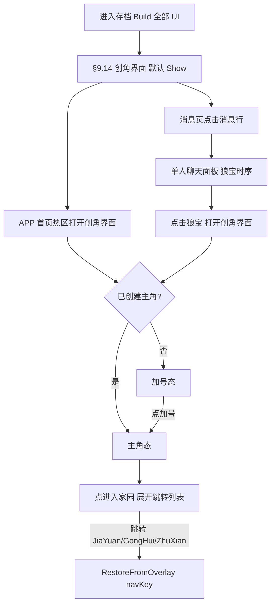

#### 9.14.7 实现类 / Classes

- `PetDemo.Core.FriendProfile` / `CharacterCreationState` / `FriendCatalog`（数据与静态目录、排序）。
- `PetDemo.Save.FriendProfileSave` / `CharacterCreationSave`（存档 DTO）。
- `PetDemo.UI.CharacterCreationScreenView`（界面：三态切换 + 好友列表 + Spine 主角 + 好友展示 + **底部页签栏控制**；`BuildInto` / `Show` / `Hide` / **`OnNavigateToBottomNav`** / `OnCloseRequested` / **`OnVisitFriendHome`**；底部 4 页签互斥高亮切换由本类管理，见 §9.14.10）。
- `PetDemo.UI.CharacterCreationFriendCellView`（好友选择行：头像/名字/亲密度/在线）。
- `PetDemo.UI.TopFriendCellView`（**自 v3.139**；**v3.158 重构**：亲密度页签好友双列网格单元 — 九宫格背景 `friends_bg_1` + 头像/头像框/名字/性别图标/在线图标 + 左上 `friends_bg_2` 叠 `IntimacyIcon`/`IntimacyText`；整体点击打开好友详情弹窗；`AutoWire` / `Bind(FriendProfile, Action<FriendProfile> onClick)`）。
- `PetDemo.Core.TopFriendCatalog`（**自 v3.158**：亲密度好友列表配置表加载；CSV `Resources/Configs/TopFriends.csv` → `List<FriendProfile>`；`Load` / `ClearCache`，缺表回退 `FriendCatalog.BuildDefault()`）。
- `PetDemo.EditorTools.TopFriendCellPrefabGenerator`（**自 v3.158**：`Tools/PetDemo/Generate Top Friend Cell Prefab` 生成 `Resources/Prefabs/Farm/TopFriendCell.prefab`）。
- `PetDemo.UI.EnterHomeNavCellView`（**自 v3.141**：进入家园页签跳转长框行 — 图标/名称 + 右侧「跳转」按钮；`AutoWire` / `Bind`）。
- `PetDemo.EditorTools.CharacterCreationScreenPrefabGenerator`（`Tools/PetDemo/Generate Character Creation Screen Prefab`）。
- `PetDemo.UI.DressUpPanelView` / `PetDemo.UI.DressUpPanelLayout`（装扮界面：上下分栏 + 商店 4 页签；`GetOrCreate` / `Bind` / `Show` / `Hide`，见 §9.14.9）。
- `PetDemo.UI.HomeTabPanelView` / `PetDemo.UI.HomeTabPanelLayout`（家园页签面板：角色 Spine + 等级经验 + 信息子页签 + **v3.187 气泡文字**；`GetOrCreate` / `Bind` / `Show` / `Hide`，见 §9.14.11）。
- `PetDemo.Core.HomeTabBubbleConfig` / `PetDemo.Core.HomeTabBubbleCatalog`（**自 v3.187**：家园气泡 CSV；`Load` / `GetEligible` / `ClearCache` / `BuildDefault`，见 §B.20）。
- `PetDemo.EditorTools.HomeTabPanelPrefabGenerator`（**自 v3.186**：`Tools/PetDemo/Generate Home Tab Panel Prefab`）。
- `PetDemo.UI.DressUpActionSpinePresenter`（**自 v3.153**：装扮 Tab2 动作页 Spine 预览；LangRen/LangMeiRen 骨骼构建、`standby_1` 待机、`dz_001` `work_2` 协程序列，见 §9.14.9）。
- `PetDemo.Core.DressUpItemCatalog` / `PetDemo.Core.DressUpItemConfig`（**自 v3.145**：装扮商店道具配置表加载与排序；CSV `Resources/Configs/DressUpItems.csv`；`Load` / `GetItemsByTab`，见 §9.14.9）。
- `PetDemo.UI.DressUpItemCellView`（**自 v3.160**：装扮商店道具单元独立预制体；`AutoWire` / `Bind(DressUpItemConfig, Action)` / `SetSelected`；选中叠加层 `SelectionOverlay`，见 §9.14.9）。
- `PetDemo.EditorTools.DressUpItemCellPrefabGenerator`（**自 v3.160**：`Tools/PetDemo/Generate Dress-Up Item Cell Prefab` 生成 `Resources/Prefabs/Farm/DressUpItemCell.prefab`）。
- `PetDemo.EditorTools.DressUpPanelPrefabGenerator`（`Tools/PetDemo/Generate Dress-Up Panel Prefab`）。

#### 9.14.8 好友展示 / Friend Showcase (v3.118)

**中文：** 创角界面新增「亲密度好友展示」，所有展示用好友均按**纯亲密度从高到低**排序（忽略在线状态，亲密度相同按 `id` 升序兜底）。

1. **亲密度好友列表（自 v3.158 起：配置表驱动 + 独立预制体 + 双列网格）**：「亲密度」页签（§9.14.10）下的**全量好友滚动列表**（`ScrollRect`，vertical）。
   - **数据源（替换 Service 默认数据）**：列表数据完全由**配置表** `Resources/Configs/TopFriends.csv` 驱动（经 `TopFriendCatalog.Load()` 解析为 `List<FriendProfile>`，缺表回退 `FriendCatalog.BuildDefault()`），按**纯亲密度降序**展示。字段：`id, displayName, avatar, gender, intimacy, intimacyInterrupted, online, avatarFrame, spinePrefab`（见 §9.14.2 扩展字段与下表）。
   - **预制体（独立资源）**：单元改为**独立预制体** `Resources/Prefabs/Farm/TopFriendCell.prefab`（由 `TopFriendCellPrefabGenerator` 经 `CharacterCreationScreenLayout.BuildTopFriendCellRoot` 生成），`View` 运行时 `Resources.Load<GameObject>("Prefabs/Farm/TopFriendCell")` 实例化进 `TopFriendContent` 并 `Bind` 填充数据。
   - **布局（双列网格）**：`TopFriendContent` 使用 `GridLayoutGroup`（`cellSize = 500×430`、`constraint = FixedColumnCount`、`constraintCount = 2`，配合 `spacing` / `padding` 与 `ContentSizeFitter(Vertical=PreferredSize)`）；即**每行 2 个**单元。
   - **单元内容**：背景图 `AirUI/friends_bg_1` 以**九宫格（Sliced）**方式铺满单元（边缘造型不变、中心可拉伸，需在 `friends_bg_1.png.meta` 设置 `spriteBorder`）；内部含：好友头像 `Avatar`（`avatarResource`，可选叠加头像框 `avatarFrame`，留空则不显示头像框）、好友名字 `NameText`（`displayName`）、性别图标（女 `AirUI/friends_icon_woman` / 男 `AirUI/friends_icon_man`）、在线图标（在线 `AirUI/friends_ing_1` / 离线 `AirUI/friends_ing_2`）及图标右侧 `OnlineText`（在线→「在线」，离线→「离线」，黑色文字，字号 32）。
   - **左上角亲密度区**：单元**左上角**放置 `AirUI/friends_bg_2`；在其**更高层级**（子节点）显示亲密度图标 `IntimacyIcon` 与亲密度文字 `IntimacyText`（"亲密度 X"）。`IntimacyIcon` 按配置 `intimacyInterrupted` 取值（中断 `AirUI/Xing_2_1`，未中断 `AirUI/Xing_2`，**不再随机**）。
   - **点击行为**：整个单元可点击（`Button`），点击后打开**好友详情弹窗**（见下第 2 点）；单元自身**不再含**「去找Ta / 去Ta家 / 发消息」三按钮（迁移至弹窗）。
   - 缺图按既有模式回退纯色并 `Debug.LogWarning`。

   **TopFriends.csv 字段表：**

   | 列 | 含义 | 取值/映射 |
   |----|------|-----------|
   | `id` | 角色 ID | 如 `friend-01` |
   | `displayName` | 角色名字（`NameText`） | 文本 |
   | `avatar` | 角色头像（`Avatar`） | Resources 路径，如 `AirUI/WanJia_icon_1` |
   | `gender` | 性别 | `male`→`friends_icon_man`，`female`→`friends_icon_woman` |
   | `intimacy` | 亲密度值（`IntimacyText`） | 0..100 |
   | `intimacyInterrupted` | 亲密度是否中断（`IntimacyIcon`） | `true`→`Xing_2_1`，`false`→`Xing_2` |
   | `online` | 是否在线 | `true`→`friends_ing_1` + `OnlineText`「在线」；`false`→`friends_ing_2` +「离线」 |
   | `avatarFrame` | 头像框 | Resources 路径，留空=无框，如 `AirUI/friends_Avatar_frame_1` |
   | `spinePrefab` | 模型 Spine 名称 | Resources 预制体路径，如 `Prefabs/Air/Hero_Role_cunmin` |

   **推荐好友空态（自 v3.203 起）**：当 `CharacterCreationState.friendListMode == RecommendPrompt` 时，隐藏 `TopFriendScrollView` 与全部 `TopFriendCell`，在 `IntimacyTopPanel` 显示 `RecommendFriendPanel`：正文 `BodyText`「你现在还没有好友」（**白色**、`fontSize=42`，无 `TitleText`）、选项 1「去小镇寻找」、选项 2「邀请狼人杀好友」（上下布局）。点击选项 2 → `friendListMode=WerewolfListZero`，恢复 Cell 列表，数据仍读 `TopFriends.csv`，`IntimacyText` 展示层强制「亲密度 0」。点击选项 1 → `friendListMode=TownSearch`，切到 §9.14.10 `EnterHomeButton` 公会嵌入，并调用 `GongHuiScreenView.ApplyTownSearchNpcBootstrap()`：将 `Npcs/Npc_1~3` 随机偏移至主角附近（半径约 150~350，最小间距 80），`NamePlate/InteractButton/Label` 文案改为「打招呼」（一次性，同会话不重复随机）。

2. **好友详情弹窗（自 v3.158 起：Spine + 三按钮）**：点击 `TopFriendCell` 弹出全屏好友详情弹窗（半透明遮罩 + 居中内容，点击遮罩关闭；`Show()` 时自动隐藏，与其它创角弹窗互斥）。
   - 中央展示该角色的**模型 Spine**：按配置 `spinePrefabPath` 加载预制体探针取 `SkeletonDataAsset`，经 `SkeletonGraphic.AddSkeletonGraphicComponent` 构建并循环播放待机动作（动画候选链同 §9.14.1），缺资源时回退纯色占位。
   - 底部并排三按钮 `GoFindButton` / `VisitHomeButton` / `MessageButton`（去找Ta / 去Ta家 / 发消息），功能与原单元三按钮一致：去Ta家→`OnVisitFriendHome` 事件接 `FriendHomeScreenView.ShowFor`；去找Ta / 发消息暂为占位 `Debug.Log`。
3. **介绍图弹窗**：点击上述任一 `Xing_2` / `Xing_2_0` 图标，弹出全屏介绍图 `AirUI/QinMiDu_0`（半透明遮罩 + 居中大图，点击遮罩关闭）。与好友角色立绘弹窗互斥（同时只显示其一）。
4. **赚钱介绍图弹窗（v3.121）**：主角态点击 `RoleAddFavorButton`（「加好感」），全屏展示 `AirUI/ZhuanQian`（铺满弹窗区域，`preserveAspect=true`）；**右上角**提供 `CloseButton`（72×72，锚点右上，偏移 `(-20,-20)`，显示「×」，与 §9.14.9 关闭按钮范式一致），点击关闭；与其它创角弹窗互斥（`Show()` 时自动隐藏）。
5. **ZhongDuan 角标与提示弹窗（v3.131）**：当 Top3 面板中某位好友的图标为 `AirUI/Xing_2_0`（当前为第 2 格 / `index=1`）时，在该图标**右下角**叠加可点击角标 `AirUI/ZhongDuan`（**48×48**，锚点右下，相对图标右下角偏移 `(-4, 4)`）。点击角标弹出 **ZhongDuan 提示弹窗**：全屏 stretch + 纯黑半透明遮罩（`rgba(0,0,0,0.65)`，与 `QinMiDuPopup` 一致）+ 居中 `AirUI/ZhongDuan_1`（`preserveAspect=true`，尺寸 **900×1200**）；点击遮罩关闭。点击 `Xing_2_0` 主图标（非角标区域）仍打开 `QinMiDu_0` 介绍图。与好友立绘弹窗、`QinMiDu` 弹窗、`ZhuanQian` 弹窗互斥（`Show()` 时自动隐藏）。

**中文：** 头像 / 图标 / 立绘 / 介绍图 / 赚钱图 / ZhongDuan 角标与提示图缺图时按既有模式回退纯色占位并 `Debug.LogWarning`。

#### 9.14.9 装扮界面 / Dress-Up Panel (v3.119)

**中文：** 主角态点击「装扮」按钮（§9.14.1）打开「装扮界面」，以**预制体**方式制作（`Resources/Prefabs/Farm/DressUpPanel.prefab`），层级与运行时回退共用 `DressUpPanelLayout.BuildRuntime`（缺 prefab 时回退编程构建，同 §9.14 创角界面范式）。界面**上下分栏**：

1. **上半部分（角色展示）**：**自 v3.151 起**按商店页签切换单/双立绘展示模式（由 `DressUpPanelView.SelectTab` → `DressUpPanelLayout.ApplyTopHalfRoleLayout` 驱动）：
   - **Tab0 / Tab1 / Tab3**（装扮 / 幻化 / 聊天）：仅 `PlayerRole` **居中**独占 TopHalf（锚点 `(0.29, 0.08)` ~ `(0.71, 0.9)`，宽度与单侧立绘一致）；`FriendRole`（含子节点 `PlayerTag` 头像与名字）、`IntimacyPanel` **隐藏**。
   - **Tab2**（动作）：恢复双立绘并排——`PlayerRole` 左 `(0.04, 0.08)` ~ `(0.46, 0.9)`、`FriendRole` 右 `(0.54, 0.08)` ~ `(0.96, 0.9)`；`IntimacyPanel` 与 `PlayerTag` **显示**（与 v3.119 原设计一致）。
   - 玩家角色立绘默认 `AirUI/WanJia_1`；好友角色立绘默认 `AirUI/WanJia_6`（与 §9.14.8 rank1 立绘一致）。**自 v3.152 起**，Tab0 / Tab1 支持**立绘预览**：点击道具后将 `PlayerRole` 切换为配置表 `icon`；切换至 Tab0 时恢复 `AirUI/WanJia_1`、切换至 Tab1 时恢复 `AirUI/WanJia_6`（不保留跨 Tab 预览状态）；Tab3 点击不改变 `PlayerRole`。**自 v3.153 起**，Tab2（动作）点击道具后将 `PlayerRole` / `FriendRole` 由静态 `Image` 切换为 Spine UI 预览（见下「Tab2 Spine 动作预览」）；切离 Tab2 或离开装扮界面时销毁 Spine 子节点并恢复 `Image`。
   - 在**好友角色头上**展示**玩家的头像**（`AirUI/WanJia_icon_1`）与**该好友的名字**（`displayName`；不读写存档；仅 Tab2 可见）。
   - 在两张立绘**中间上部**展示与该好友的**亲密度数值**与**亲密度图标**（图标与 §9.14.8 `IntimacyTopPanel` 保持一致：`AirUI/Xing_2`；仅 Tab2 可见）。
2. **下半部分（商店页签）**：商店主体背景 `ShopBg` 的 `Image` **由预制体直接配置**（Sprite / Color 在 `DressUpPanel.prefab` 编辑器中设置）；`DressUpPanelView` **运行时不再**通过 `Resources` 覆盖 `ShopBg` 的 sprite 或 color。含 **4 个页签**（**自 v3.145 起**页签名为）：「装扮（Tab0）、幻化（Tab1）、动作（Tab2）、聊天（Tab3）」。
   - 页签按钮素材：**选中**时 Tab 根 `Image` 显示 `AirUI/SheJiao_Sheet_3` 且 `color = #FFFFFF`；**未选中**时根 `Image` **隐藏**（`sprite = null`、`color.a = 0`，与 `DressUpPanel.prefab` 预制体默认一致）。默认打开「装扮（Tab0）」页签。
   - **自 v3.162 起，页签 Label 双态样式**：`DressUpPanelView.SelectTab` **仅**修改**当前打开**页签的 `Label`（`Text`）：`fontSize = 40`、`color = #FFFFFF`；切离时恢复预制体默认（`fontSize = 36`、`color ≈ #97A3CB`）。**从未被选中的**页签 `Image` 与 `Label` **均不修改**；**曾被选中后切离**的页签须调用 `ApplyTabImageSprite(..., selected:false)` 清除 `SheJiao_Sheet_3` 并恢复透明。
   - **自 v3.145 起**：各页签内容不再是单张整图，而是由**道具配置表**（§"道具配置表"）驱动的**售卖道具网格**（见下）。

**中文：** 数据来源：最高亲密度好友取自 `IPlantingService.GetFriends()` 按纯亲密度降序（同 §9.14.8 排序）。所有立绘 / 头像 / 图标 / 页签 / 道具图标缺图时回退纯色占位并 `Debug.LogWarning`；`Show()` 时默认选中「装扮（Tab0）」页签。

**中文（道具配置表，自 v3.145 起）：** 装扮商店所有页签的售卖道具信息由 **CSV 配置表** `Resources/Configs/DressUpItems.csv` 统一定义（仅用于演示，不做真实购买 / 亲密度校验 / 存储），运行时由 `PetDemo.Core.DressUpItemCatalog.Load()` 经 `Resources.Load<TextAsset>("Configs/DressUpItems")` 解析、缓存。

1. **配置表字段**（CSV 列序固定；首行表头，`#` 开头行与空行忽略）：

   | 字段 | 含义 |
   | --- | --- |
   | `itemId` | 道具 ID（唯一） |
   | `tabIndex` | 道具所属 Tab（0~3） |
   | `icon` | 道具图标资源路径（`Resources` 相对路径；演示期为占位，缺图回退纯色） |
   | `intimacyRequire` | 使用亲密度条件数值（**留空表示无条件**） |
   | `price` | 道具价格（整数） |
   | `sortOrder` | 展示排序（在 Tab 内**由大到小**排序；相同则按配置表行序稳定） |
   | `description` | 道具介绍文本（点击道具弹出的介绍界面后续使用） |

2. **排序规则**：`DressUpItemCatalog.GetItemsByTab(tabIndex)` 取该 Tab 全部道具，按 `sortOrder` **降序**、并列按 CSV **原行序**稳定排序后返回。
3. **道具单元结构（自 v3.160 起：独立预制体）**：单元改为**独立预制体** `Resources/Prefabs/Farm/DressUpItemCell.prefab`（由 `DressUpItemCellPrefabGenerator` 经 `DressUpPanelLayout.BuildDressUpItemCellRoot` 生成），`DressUpPanelView` 运行时 `Resources.Load<GameObject>("Prefabs/Farm/DressUpItemCell")` 实例化进 `ItemContent` 并 `DressUpItemCellView.Bind` 填充数据；缺 prefab 时回退 `BuildDressUpItemCellRoot` 运行时模板（与 TopFriendCell 范式一致）。层级（自上而下内容 + 最上层选中叠加）：
   - 根 `ItemCell`：`Image` 背景 `AirUI/ZhuangBan_sheetBJ2` + `Button`（`transition=None`，点击命中背景；子节点 `raycastTarget=false` 时点击仍落到根按钮）。
   - `Icon`：道具图标（CSV `icon`）；Top=25.7、Bottom=-25.7。
   - `Condition`（**可无**）：`ConditionIcon`=`AirUI/Xing_2` + `ConditionText`=`">"`+数值；Top=4，`ConditionText` 纯黑。
   - `Price`：`PriceIcon`=`AirUI/Xing_1` + `PriceText`=价格；Top=-21、Bottom=21，`PriceText` 纯黑。
   - `SelectionOverlay`（**最末子节点，渲染在最上层**）：全拉伸 `Image`，素材 `AirUI/common_bg_2`，`raycastTarget=false`，默认 `SetActive(false)`。
4. **统一背景**：所有 Tab 内道具单元根背景图 `AirUI/ZhuangBan_sheetBJ2`（预制体烘焙；运行时 Bind 仍可回退加载）。
5. **网格与滚动**：每行**固定 3 个**道具，超出换行（`GridLayoutGroup`，`FixedColumnCount=3` + `ContentSizeFitter` 竖向）；超出镜头部分可通过**竖向滑动**（`ScrollRect`）拖动道具列表。容器层级 `ShopBg → ItemScroll(ScrollRect) → Viewport(Mask) → ItemContent(GridLayoutGroup)`；道具单元由 `DressUpPanelView.PopulateItems` 按配置表实例化 prefab。
6. **点击钩子**：点击道具背景或图标触发 `DressUpPanelView.OnItemClicked(config)`。**自 v3.152 起**，当 `activeTab ∈ {0,1}` 时将 `PlayerRole` 切换为 `config.icon`；Tab3 不改变 `PlayerRole`。**自 v3.153 起**，Tab2 点击触发 Spine 动作预览；`dz_001` 额外编排 `work_2`。**自 v3.160 起（替代 v3.154 背景变暗）**，当 `activeTab ∈ {0,1,2}` 时显示被点击单元 `SelectionOverlay`（`common_bg_2`）；同 Tab **单选互斥**；Tab3 点击不改变单元视觉；切换页签重建网格时选中态清除。**自 v3.160 起 Tab0 默认选中**：打开/切到 Tab0（装扮）时，网格渲染完成后自动选中**排序后第一个**道具（`GetItemsByTab(0)[0]`，当前为 `zb_001`），显示 `SelectionOverlay`，并将 `PlayerRole` 预览为该道具 `icon`（与手动点击一致）。Tab1/2/3 **不**自动默认选中。介绍界面**暂不实现**（当前仅日志占位）。

**中文（Tab2 Spine 动作预览，自 v3.153 起）：** Tab2 点击道具后，`DressUpActionSpinePresenter` 在 `PlayerRole` / `FriendRole` 挂点下运行时构建 `SkeletonGraphic` 子节点 `ActionSpine`，并禁用父节点 `Image`（保留组件以便 Tab0/Tab1 恢复）。

1. **骨骼资源**：
   - `PlayerRole`：`Assets/Scenes/Air/LangRen/Role_cslangren/Role_cslangren_SkeletonData.asset`（运行时优先 `DressUpPanelView` 序列化引用；可回退 `Resources/Prefabs/Air/Hero_Role_cunmin` 探针，与 LangRen 同源）。
   - `FriendRole`：`Assets/Scenes/Air/LangMeiRen/Role_langmeiren/Role_langmeiren_SkeletonData.asset`（运行时依赖 `DressUpPanelView` 序列化引用或 Editor `AssetDatabase` 路径；Player 包体须由 `DressUpPanelPrefabGenerator` 写入 prefab）。
2. **朝向**：`PlayerRole` 展示时**水平镜像**（`GuildSpineCharacterBuilder.SetFacing(faceRight: true)`）；`FriendRole` 不镜像。
3. **默认动画**：任意 Tab2 道具点击后，双方循环播放 `standby_1`（缺失时回退 `animation` / 骨骼首条动画）。
4. **`dz_001` 特殊编排**：`PlayerRole` 单次播放 `work_2` → **0.5 秒**后 `FriendRole` 单次播放 `work_2` → 双方动画结束后回到 `standby_1` 循环。其它动作道具（`dz_002` / `dz_003` 等）本次仅 `standby_1`；`itemId → 动作策略` 映射表预留扩展。
5. **生命周期**：进入 Tab2 时仍显示静态默认立绘（点击后才切 Spine）；`SelectTab` 切离 Tab2、`Hide()`、`OnDestroy()` 时调用 `Teardown()` 销毁 Spine 并恢复 `Image`。
6. **布局（自 v3.155 起）**：`PlayerRole/ActionSpine` 与 `FriendRole/ActionSpine` 共用同一套 `RectTransform` 约定——`anchoredPosition = (0, -218)`，`localScale = (0.7, 0.7, 1)`（由 `DressUpActionSpinePresenter` 构建时写入）。

**中文（自 v3.142 起；自 v3.192 起不再靠再次点击收起）：** 装扮界面在创角界面中作为 §9.14.10「装扮」页签的**内容型页签**呈现，不再全屏覆盖：**移除右上角 `CloseButton`** 与全屏 `Dim` 的点击关闭逻辑，靠底部页签**互斥切换到其它页签**收起；背景图（`ShopBg` 等）采用**底部对齐**。`DressUpPanelView.WireOnce` 对已移除的 `closeButton` / `dimButton` 做空判断。

**中文（自 v3.144 起，装扮页签分屏）：** 打开「装扮」页签时**隐藏**创角界面 `DisplayArea`（含 Spine 主角 / 加号态 / 缺好感态），`DressUpPanel` 根节点全屏拉伸，`TopHalf` / `BottomHalf` 分别锚定屏幕**上方 40%**（`anchorMin.y = 0.6`）与**下方 60%**（`anchorMax.y = 0.6`，`offsetMin.y = BottomTabBarHeight`）；切到他页签时**恢复** `DisplayArea` 可见。布局由 `DressUpPanelLayout.ApplyScreenSplitLayout` 在 `CharacterCreationScreenView.OpenDressUpPanel` 中应用。

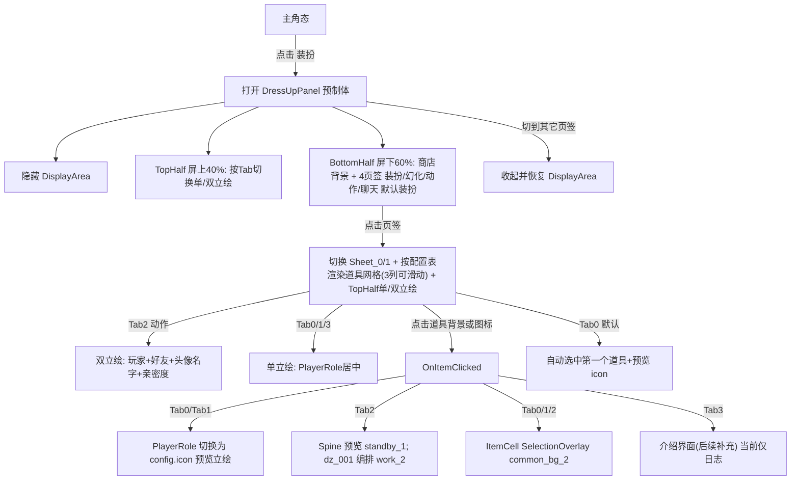

#### 9.14.10 底部页签栏 / Bottom Tab Bar (v3.139)

**中文：** 创角界面底部新增**常驻页签栏 `BottomTabBar`**（锚定屏幕底部、占满宽度、固定高度），**只要处于创角界面即在三态（加号/缺好感/主角）下一直显示**。页签栏含 **5 个等宽互斥页签**（左→右，沿用 §9.10 `RoleGrowthTabBar` 等宽槽位范式，`TabSlotWidth = 屏宽 / 5`；水平内边距 `±5`）：

| 索引 | 节点名 | 图标（Closed / Open） | 点击行为 |
|------|--------|----------------------|----------|
| 0 | `IntimacyTab` | `AirUI/bottom_bar_a_1` / `bottom_bar_a_2` | 切换显示 `IntimacyTopPanel` 全量好友列表（见 §9.14.8 第 1 点）于**内容区**；**已 IconOpen 时再点无变化**（v3.192）；切到他页签则切换 |
| 1 | `DressUpButton` | `AirUI/bottom_bar_b_1` / `bottom_bar_b_2` | 切换显示装扮界面 `DressUpPanel`（§9.14.9）**分屏占满上40%+下60%**并隐藏 `DisplayArea`（见 §9.14.9 v3.144）；**已 IconOpen 时再点无变化**（v3.192）；切到他页签则收起并恢复 `DisplayArea` |
| 2 | `HomeTabButton` | `AirUI/bottom_bar_c_1` / `bottom_bar_c_2` | **自 v3.186 起**：切换显示 `HomeTabPanel`（§9.14.11）并**隐藏 `DisplayArea`**；**已 IconOpen 时再点无变化**（v3.192，含 ZhuanQian 展示期间）；切到他页签则切换 |
| 3 | `EnterHomeButton` | `AirUI/bottom_bar_e_1` / `bottom_bar_e_2` | **自 v3.207 起**：点击后 `Hide()` 创角 → `OnEnterHomeHudRequested(false)` → 装配层进入 §9.8 **EnterHomeHud**（`MainHudLayerRoot` 可见、HUD `BottomTabBar` + `GongHuiScreen`，隐藏 `BottomNavBar`）；**不再**在创角内 `EnterCharacterCreationEmbed` / `ShowGongHuiEmbeddedPanel`。**自 v3.184～v3.206**：曾在创角内嵌公会（已废弃主路径）。创角覆盖层内其它页签逻辑不变；「去小镇寻找」走 `OnEnterHomeHudRequested(true)` 后 `ApplyTownSearchNpcBootstrap` |
| 4 | `RoleAddFavorButton` | `AirUI/bottom_bar_d_1` / `bottom_bar_d_2` | **自 v3.194 起**：打开训练面板 `TrainingPanel`（§9.14.12），全屏内容区止于 `BottomTabBar` 之上并**隐藏 `DisplayArea`**；`SetActiveTab(TabIndexFavor)`（本钮 IconOpen）；**已 IconOpen 时再点无变化**（v3.192）。**不再**由本钮打开 `ZhuanQianPopup`。加好感/`ZhuanQianPopup` 仅由家园「每日任务」经 `OpenAddFavorTab()` 打开（底栏仍高亮家园，见下第 5 点 / §9.14.11） |

**中文（自 v3.146 起，v3.189 调整默认页签）：** 每次 `CharacterCreationScreenView.Show()`（选档后首次进入、TopDingBar / APP 热区 / 狼宝等任意路径再次打开）**默认激活「家园」页签**（索引 2，`HomeTabButton`）：`SetActiveTab(TabIndexHome)` 并 `OpenHomeTabPanel()`，不再以无激活页签（`activeTabIndex = -1`）作为初始态。加号态（未创角）时黑底仍覆盖全部 UI（含 `HomeTabPanel`），创角完成后或已创角再次进入时直接展示 `HomeTabPanel`。  
**English (since v3.146, default tab changed in v3.189):** Every `CharacterCreationScreenView.Show()` defaults to the **家园 / Home** tab (index 2, `HomeTabButton`) via `SetActiveTab(TabIndexHome)` + `OpenHomeTabPanel()`. In plus-state (no character yet) the black backdrop still covers all UI including `HomeTabPanel`; after creation or on re-entry with an existing character, `HomeTabPanel` is shown directly.

**中文（自 v3.142 起，非全屏内容区改造；自 v3.192 再点无变）：** 5 个页签**统一为内容型页签**：同一时刻至多一个页签处于激活高亮态（`IconOpen`）；点击**其它**页签在内容区切换。**自 v3.192 起**：已处于 `IconOpen` 的页签再次点击**不改变**状态与内容（无 `SetActiveTab(-1)` / 无收起当前面板）；仅切到其它页签才切换。关键约束：

1. **非全屏内容区**：亲密度页签内容显示在屏幕**下方 60%** 的内容区（`anchorMax.y = 0.6`，底边位于 `BottomTabBar` 之上 `offsetMin.y = BottomTabBarHeight`）；屏幕**上方 40% 持续显示 `DisplayArea`**。**装扮 / 家园 / 训练为例外**（§9.14.9 v3.144 / §9.14.11 v3.186 / §9.14.12 v3.194）：打开时隐藏 `DisplayArea`；装扮 `DressUpPanel.TopHalf` / `BottomHalf` 分别占屏上 40% 与屏下 60%；家园 `HomeTabPanel`、训练 `TrainingPanel` 全屏拉伸且 `offsetMin.y = BottomTabBarHeight`。**进入家园（v3.207）**离开创角进入 EnterHomeHud，不再在创角内嵌公会。
2. **底栏常驻**：无论切换到哪个页签，`BottomTabBar` 始终显示且不被内容区覆盖（内容区与底栏不重叠）。
3. **背景图底部对齐**：各页签内容的背景图统一采用**底部对齐**模式（水平拉伸、`pivot.y=0`、贴内容区底边、`preserveAspect`）。
4. **无关闭按钮**：删除「装扮」`DressUpPanel` 与「加好感」`ZhuanQian` 原右上角 `CloseButton`；二者由全屏覆盖层改为**嵌入内容区**的内容型页签，靠页签互斥切换收起，不再依赖独立关闭按钮（`DressUpPanel` 亦不再使用全屏 `Dim` 关闭）。训练面板同理靠页签互斥收起。
5. **ZhuanQian 与底栏 / ScreenClose（自 v3.191；v3.192 修订收起路径；v3.194 与训练底栏解耦）**：`OpenAddFavorTab()` **仅**由家园「每日任务」调用，打开 `ZhuanQianPopup` 时：隐藏含 `HomeTabPanel` / `TrainingPanel` 在内的其它内容面板，但 **`SetActiveTab(TabIndexHome)`**（家园 IconOpen、训练页签 IconClosed）。收起路径：点 `ScreenCloseButton`（创角根）→ `HideZhuanQianPopup()` + `OpenHomeTabPanel()`；或切到其它底栏页签。**不再**由 `RoleAddFavorButton` 开/关 ZhuanQian。`ScreenCloseButton` 在 ZhuanQian 可见时**不**触发离开创角回 APP（见 §9.14.6）。

**中文（自 v3.159 起，页签双态图标；v3.185 全页签图片化）：** 每个页签按钮（`IntimacyTab` / `DressUpButton` / `HomeTabButton` / `EnterHomeButton` / `RoleAddFavorButton`）含 **`IconOpen`** / **`IconClosed`** 两个拉伸填满槽位的 `Image` 子节点（`preserveAspect=true`）；**全部 5 个页签**的 open/closed sprite 由 `CharacterCreationScreenLayout` 在构建与 `RefreshBottomTabBarPresentation` 时按上表加载。**`Label` 子节点已废弃**（v3.185 构建时不再创建；旧 prefab 运行时 `HideTabButtonLabels` 隐藏）。`CharacterCreationScreenView.SetTabHighlight(button, active)` **仅切换 `IconOpen`/`IconClosed` 显隐**（同一时刻至多一个页签 `IconOpen` 可见），**不再修改根 `Image.color`**（开关态背景均不变色）。`EnsureBottomTabButton` 在 `WireOnce` 时启用透明命中区（根 `Image` 可禁用/透明）、`Button.transition = None`，并关闭图标 `raycastTarget` 以免挡点击。子节点缺失时静默跳过，兼容旧 prefab。

**中文（自 v3.184；v3.207 修订）：** 创角内嵌公会（`EnterCharacterCreationEmbed` / `BindEmbeddedGongHui` / `ShowGongHuiEmbeddedPanel`）**主路径已废弃**；`EnterHomeButton` 与主底栏 `GongHui` 汇合为 EnterHomeHud（见 §9.8）。API 可保留作兼容，但运行时 EnterHome / 小镇寻找不再调用嵌入。`GongHuiScreenView.SwitchToBottomNav` 在 EnterHomeHud 下直接切主 `BottomNavBar`（恢复显示并 `SetOpenKey`），不再依赖 `characterCreationHost.RequestExitToBottomNav` 的嵌入分支。

**中文（自 v3.141，保留供其它入口）：`EnterHomeTopPanel` 跳转列表** — 结构镜像 `IntimacyTopPanel`（`EnterHomeScrollView` / `Viewport` / `EnterHomeContent` / `EnterHomeNavCellTemplate`），固定 **6 条**（非动态数据）；**不再由 `EnterHomeButton` 触发**，仍供任务列表「前往」等经 `OnNavigateToBottomNav` 跳转：

| navKey | 显示名 | 对应底栏槽位 | 图标资源（缺图回退纯色） |
|--------|--------|--------------|--------------------------|
| `GongHui` | 社区 | `BottomNavSlot_GongHui` | `AirUI/Game_ZuDui` |
| `JiaYuan` | 农场 | `BottomNavSlot_JiaYuan` | `AirUI/Game_NongChang` |
| `ZhuXian` | 冒险 | `BottomNavSlot_ZhuXian` | `AirUI/Game_MaoXian` |

每条 `EnterHomeNavCell` 采用与 `TopFriendCell` 相同的长框样式（背景 `AirUI/TopFriendCellBJ`），**固定尺寸 1014×290**（`CharacterCreationScreenLayout.EnterHomeCellWidth` / `EnterHomeCellHeight`；`EnterHomeContent` 的 `VerticalLayoutGroup.childForceExpandWidth=false` 以保持宽度），左侧图标 + 名称，**右侧「前往」按钮**；点击「前往」→ `Hide()` 创角界面 → `OnNavigateToBottomNav(navKey)` → 装配层 `RestoreFromOverlay(navKey)` 恢复 HUD/世界层并 `SetOpenKey`。

**中文：** `IntimacyTopPanel` / `EnterHomeTopPanel` 与 `BottomTabBar` 均由 [CharacterCreationScreenLayout.cs](PetDemo_2/Assets/Scripts/UI/CharacterCreationScreenLayout.cs) 编排进 prefab，`View` 按节点名 `EnsureFieldsFromHierarchy` 绑定并控制页签切换与列表填充。每条 `TopFriendCell` 右侧「去Ta家」经 `View.OnVisitFriendHome` 事件由 `AirMainMenuRuntimeBuilder` 接入 `FriendHomeScreenView.ShowFor`（仍默认 `navKey=JiaYuan`）。结构调整后须执行菜单 `Tools/PetDemo/Generate Character Creation Screen Prefab` 重新生成预制体。

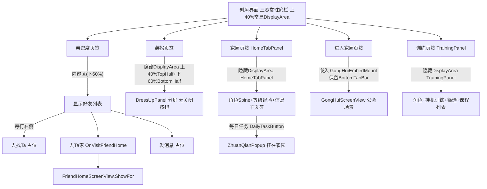

#### 9.14.11 家园页签面板 / Home Tab Panel (v3.186)

**中文：** 本节定义创角界面 `HomeTabButton`（家园页签）的完整内容面板，以**独立预制体**制作（`Resources/Prefabs/Farm/HomeTabPanel.prefab`），层级与运行时回退共用 `HomeTabPanelLayout.BuildRuntime`；`CharacterCreationScreenView` 在打开家园页签时 `HomeTabPanelView.GetOrCreate` 懒加载并 `Show()`，**隐藏 `DisplayArea`**（与 §9.14.9 装扮页签一致），根节点全屏拉伸且 `offsetMin.y = BottomTabBarHeight`。

**中文（布局自上而下）：**

1. **纯色底层 `SolidBackground`**：全屏 `Image`，`RGBA` 由 Layout 常量定义（与创角背景色系一致）。
2. **角色展示区 `CharacterZone`**：锚定屏**上 40%**（`anchorMin.y = ContentRegionTopAnchorY = 0.6`）。
   - **`DecorBackground`**：`AirUI/common_bg_11`，位于 Spine **背后**（先创建 = 下层渲染），`preserveAspect=true`、水平居中。
   - **`RoleMount`**：Spine 挂点，锚点约在屏从上算 **40%** 处（`anchor.y ≈ 0.6`）；运行时构建 `SkeletonGraphic`，**持续循环待机**（动画名候选链与 §9.14.1 一致：`exclusive_2` → `standby_1` → `animation` → `idle` → 骨骼首条）。
   - **`SpeechBubble`（自 v3.187）**：角色**左上方固定位置**的气泡文字（见下「气泡文字」）；框体九宫格 `AirUI/DialogBox_1`（`Image.Type.Sliced`，需已配 `spriteBorder`）；子节点 `BubbleText` 展示文案；根节点可点击（`Button`），点击后隐藏当前气泡并推进下一条。
3. **等级与经验行 `LevelExpRow`**（紧贴角色区下方）：
   - **`LevelBadge`**：背景 `AirUI/Lv_bg_003`，子节点 `LevelText` **仅显示等级数字**（无 `Lv.` 前缀）。
   - **`ExpBarRoot`** 四层（低→高渲染顺序）：`Lv_bg_004` 底轨 → `Lv_bg_005` 进度填充（`currentExp / expToNextLevel` 比例，左对齐 `sizeDelta.x` 缩放，范式同 §9.8.12.4 `StaminaBarView`）→ `Lv_bg_006` 装饰框 → 顶层 `ExpText` 显示 `"{currentExp}/{expToNextLevel}"`。
   - **经验填充宽度（自 v3.209）**：每次 `RefreshLevelExp` 以 `ExpBarRoot.rect.width`（>0 时）作为轨道满宽 `expTrackWidth`，**禁止**在首次读到 0/未布局完成时永久缓存回退值（如 `800`）；仅当轨道宽度暂不可用且尚无有效缓存时才用回退。`ExpFill.sizeDelta.x = expTrackWidth * Clamp01(currentExp / expToNextLevel)`，与体力条 `EnsureFillRect` 一致。`RoleLevelUpPanelView` 共用同一规则。
4. **信息展示区 `InfoSection`**（填满 `LevelExpRow` 下方至 `BottomTabBar` 之上）：
   - **`InfoTabBar`**：两个互斥子页签按钮——**「角色6项属性」**（`HexAttrsTab`）与 **「当前」**（`CurrentTab`）。
   - **`InfoContent`**：
     - **`HexAttrsPage`**（默认显示，自 **v3.188**）：**不再**使用 `HexRadarChart` / `HexLabels`。改为 `AttrGrid` **两列三行**（共 6 项，从左到右、从上到下：智商→记忆→想象→体魄→魅力→情商）。每项节点 `AttrItem_{0..5}` = **属性图标** `Icon`（`AirUI/SX_1_ZhiShang_B` … `SX_6_QingShang_B`）+ **属性数值** `Value`（`Text`，**不显示**中文属性名）。数值来自局外 `RoleStats` 成长字段：`intelligence/memory/imagination/physique/charm/emotionalIntelligence`（由 §B.21 等级表在创角默认 / 旧档回填时写入）。
     - **`CurrentPlaceholderPage`**（自 **v3.201**）：含与 `HexAttrsPage` 同结构的 `AttrGrid`（`AttrItem_{0..5}` = `Icon` + `Value`）。`AttrItem_{i}.Value` **直接同步** `HexAttrsPage` 同索引 `AttrItem_{i}.Value` 的展示数值（`RefreshHexAttrs` 写入 HexAttrs 后镜像到 Current 页）；其余占位 UI（如背景图）可保留。
5. **右上功能按钮 `TopRightActions`（自 v3.190）**：锚定面板根节点**右上角**（`anchor/pivot = (1,1)`，边距约 `24`），**竖排**两枚图标按钮（尺寸约 `120×120`，间距约 `16`，`preserveAspect=true`）：
   - **`RankingButton`（排行榜）**：图标 `AirUI/ZJM_PaiHangbang_1`；可点击；本期仅 `Button.ColorTint` 按下变色反馈，**不打开任何界面、不切换页签**。
   - **`DailyTaskButton`（每日任务）**：图标 `AirUI/ZJM_RenWu_1`；点击后触发 `HomeTabPanelView.OnDailyTaskRequested`，由宿主 `CharacterCreationScreenView.OpenAddFavorTab()` 打开既有 `ZhuanQianPopup`（**自 v3.194 起**：与底栏 `RoleAddFavorButton`/训练页签**解耦**，仅此入口打开加好感；打开后底栏仍为家园 IconOpen，见 §9.14.10）。
6. **关闭按钮 `ScreenCloseButton`（自 v3.193；v3.199 移至左上角）**：锚定面板根节点**左上角**（与 §9.14.6 / §9.14.9 关闭按钮范式一致：`72×72`，`anchor/pivot = (0,1)`，`anchoredPosition ≈ (20, -20)`，「×」文案或等价 Sprite）。点击触发 `HomeTabPanelView.OnCloseRequested` → 宿主 `CharacterCreationScreenView.OnScreenCloseClicked()`（与创角根 `ScreenCloseButton` 同路径）：关闭创角界面并 `AppScreenView.Show()` 回退 §9.15 APP **PageHome**（HUD/世界层保持隐藏）。家园页签可见时 `ZhuanQianPopup` 已隐藏，本按钮**不**承担 ZhuanQian 特例；该特例仍由创角根 `ScreenCloseButton` 处理（§9.14.6 / §9.14.10 v3.191）。
7. **左上体力 HUD `TopLeftStaminaHud`（自 v3.204）**：锚定面板根节点**左上角**、位于 `ScreenCloseButton` **右侧**（`anchor/pivot = (0,1)`，`anchoredPosition ≈ (108, -20)`）；子节点 `StaminaBarSlot` 尺寸 **`275×116`**（与 §9.8.13 统一仓库体力槽一致）。**自 v3.205 起**，`StaminaBarSlot` 可在 `HomeTabPanel.prefab` 内**预先嵌入** `StaminaBar.prefab` 子实例（编辑器拖入并调 RectTransform）；`Show()` 时 `HomeTabPanelView.EnsureStaminaBar()` 调用 `StaminaBarView.GetOrCreateIn(slot, role, service)`——**若槽内已有 `StaminaBarView` 则复用并 `Bind`/`SubscribeService`，否则** `BuildInto` 实例化 `Resources/Prefabs/Farm/StaminaBar.prefab`（缺失则代码回退）。`HomeTabPanelView` 可选序列化字段 `staminaBar` 直接引用嵌入实例。`Bind` 订阅 `IPlantingService.OnStaminaChanged` 实时刷新。新档初始 `stamina=0`（§5），体力条仅显示背景+刻度+左侧 `TiLi_0` 图标。`siblingIndex` 置于 `ScreenCloseButton` 之上，避免被遮挡。
8. **增加经验按钮 `AddExpButton`（自 v3.208）**：位于 `TopLeftStaminaHud` 内、`StaminaBarSlot` **右侧**（黑底白字「增加经验」，约 `140×64`，间距约 `16`）。点击后按当前等级 `expToNextLevel` 的 **40%**（`max(1, floor(expToNextLevel * 0.4))`）调用 `IPlantingService.TryAddRoleExp`；若发生升级则排队打开 §9.14.13 `RoleLevelUpPanel`（连升多级时按级依次展示，OK 推进下一级）。

**中文（数据模型）：** `RoleStats` 含 `level`（默认 `1`）、`currentExp`（默认 `0`）、`expToNextLevel`（**自 v3.208** 优先由 §B.23 按当前等级写入单级需求，缺表回退 §B.21）；自 **v3.188** 另增六项成长属性并 `RoleStatsSave` 持久化。`RoleStats.CreateDefault()` / 新会话 / **升级时**调用 `RoleLevelConfigCatalog.ApplyToRole`：按 `level` 写入六属性、`expToNextLevel`、`maxHp`←`baseHp`、`atk`←`baseAtk`、`agility`←`baseAtkSpeed`（`currentHp` 新建时等于 `maxHp`，应用时若 `currentHp > maxHp` 则 clamp）。旧存档六成长属性全 0 时 `ToModel` 回填 `ApplyToRole`。**不在**每次 UI 刷新时重写战斗字段（避免覆盖收获加成）。**自 v3.208**：`TryAddRoleExp` 累加 `currentExp`；当 `currentExp >= expToNextLevel` 且存在下一级配置时 `level++` 并 `ApplyToRole`，**不扣减** `currentExp`（可溢出本级需求；`LevelExpRow` 填充条 `Clamp01`）。

**中文（气泡文字，自 v3.187）：**

1. **配置表**：`Resources/Configs/HomeTabBubbles.csv`（附录 §B.20）；字段：`entryId`（条目ID）、`triggerCondition`（触发条件）、`roleAnim`（角色播放动作）、`animPlayCount`（动作播放次数，`0`=持续循环）、`bubbleText`（气泡文案）。CSV **行序**即展示优先级（先→后）。
2. **显示条件**：打开 `HomeTabPanel`（`Show()`）时立即求值；收齐当前所有满足 `triggerCondition` 的条目形成队列，展示队列中**第一条**。
3. **隐藏与推进**：点击气泡区域 → 隐藏当前气泡；若队列仍有后续满足条件的条目 → 展示下一条并切换对应角色动作；否则保持隐藏并恢复待机，直到下次 `Show()` 重新求值。
4. **多条件冲突**：同时满足多条时严格按 CSV 行序优先→后排队；每次只显示一条。
5. **触发条件本期取值**：`Always`（打开即满足）。未识别条件视为不满足（`Warning`）。后续可扩展（如等级/任务态等），扩展时先更新本 SPEC 与 §B.20。
6. **角色动作**：展示某条气泡时，若 `roleAnim` 非空则在 `RoleMount` 的 `SkeletonGraphic` 上播放该动画：`animPlayCount == 0` → `loop=true` 持续循环；`animPlayCount > 0` → 连续播放该次数（每次 `loop=false`），全部播完后回退待机循环。气泡被点击切换/关闭时打断当前动作并切到下条动作或待机。动画名在骨骼中找不到时告警并保持待机。
7. **气泡位置**：相对 `CharacterZone` **固定**在角色左上方（Layout 常量：`SpeechBubbleAnchoredPos ≈ (-220, 280)`、尺寸约 `420×160`，不以内容漂移）；位置不随文案长短平移。
8. **气泡框**：`AirUI/DialogBox_1` 九宫格（`Image.Type.Sliced` + `fillCenter=true`）；文案 `fontSize≈30`、黑色、居中、支持换行；字段内禁用英文逗号（用全角 `，`）。

**中文（开局营救，自 v3.206）：**

1. **状态字段**：`CharacterCreationState.openingRescuePending`（新空槽存档初始化 `true`；点击角色营救后 `false` 并落盘；旧档缺字段视为 `false`）。
2. **触发范围**：仅 `HomeTabPanel` 的 `RoleMount` Spine 预览区（**不**改主 HUD 家园世界 `MainRoleCunminPresenter`）。
3. **倒地姿态**：`Show()` / `EnsureRoleSpine` 时若 `IsOpeningRescuePending()==true`，在 `SkeletonGraphic` 上 `SetAnimation(0,"death",false)`（可回退 `Dead`），随即 `entry.TrackTime = entry.AnimationEnd`（或 `Animation.Duration`）冻结到**最后一帧**；**不**循环、**不**播放过程动画。
4. **气泡强制文案**：pending 期间跳过 `HomeTabBubbles.csv` 队列与 `PlayBubbleRoleAnim`；`BubbleText` 固定为「**好饿哦~~~好饿哦~~~**」；气泡仍显示；点击气泡**不**触发营救、**不**推进 CSV 队列（no-op）。
5. **角色点击**：`RoleMount` 下透明 `RoleClickHitbox`（`Image` alpha=0 + `Button`，`raycastTarget=true`）；仅 pending 时可点；点击后调用 `IPlantingService.CompleteOpeningRescue()`（`stamina=staminaMax` + `OnStaminaChanged` + `openingRescuePending=false` + `TrySaveActiveSlot`），随后播 `work_2` 一次（`loop=false`），结束后循环 `standby_1`（缺 clip 时回退 §9.14.1 待机链）。
6. **营救后**：`BeginSpeechBubbleQueue()` 恢复正常 CSV 气泡逻辑；`RoleClickHitbox` 不可点。

**English (opening rescue, since v3.206):** New empty-slot saves set `openingRescuePending=true`. While pending, `HomeTabPanel` `RoleMount` shows `death` frozen on its last frame, speech bubble text is forced to 「好饿哦~~~好饿哦~~~」, and tapping the role calls `CompleteOpeningRescue()` (full stamina + clear flag + save) then plays `work_2` once → `standby_1` loop. Bubble tap does not rescue. After rescue, normal bubble CSV queue resumes.

**中文（接口）：**

- `PetDemo.UI.HomeTabPanelView` / `PetDemo.UI.HomeTabPanelLayout`（`GetOrCreate` / `Bind(IPlantingService)` / `Show` / `Hide` / `RefreshAll`；气泡逻辑内嵌于 `Show`/`Hide`/点击回调；自 **v3.190** 另有事件 `OnDailyTaskRequested`；自 **v3.193** 另有事件 `OnCloseRequested` 与根级 `ScreenCloseButton`；自 **v3.206** 另有开局营救：`ApplyDeathLastFrame` / `RoleClickHitbox` / `CompleteOpeningRescue` 联动）。
- `PetDemo.UI.CharacterCreationScreenView.OpenAddFavorTab()`（自 **v3.190**：公开打开加好感/`ZhuanQianPopup`；**自 v3.194 起仅**供家园「每日任务」使用，底栏 `RoleAddFavorButton` 改开 §9.14.12 训练面板）。
- `PetDemo.Core.HomeTabBubbleConfig` / `PetDemo.Core.HomeTabBubbleCatalog`（`Load` / `GetEligible` / `ClearCache` / `BuildDefault`）。
- `PetDemo.EditorTools.HomeTabPanelPrefabGenerator`（`Tools/PetDemo/Generate Home Tab Panel Prefab`）。
- `PetDemo.EditorTools.StaminaBarPrefabGenerator`（**自 v3.204**：`Tools/PetDemo/Generate Stamina Bar Prefab`）。

**English:** Standalone `HomeTabPanel` prefab for the character-creation **家园** tab: top 40% hero Spine with `common_bg_11` decor over a solid fill; level badge (`Lv_bg_003`) + 4-layer exp bar (`Lv_bg_004`–`006` + text); info area with sub-tabs **角色6项属性** (**v3.188:** 2×3 icon+value grid from growth fields, not hex radar) and **当前** (placeholder). Hides `DisplayArea` while open. `RoleStats` has `level` / `currentExp` / `expToNextLevel` + six growth attrs with save sync; level row from §B.21/§B.23. **Since v3.187:** fixed upper-left speech bubbles in `CharacterZone` driven by `HomeTabBubbles.csv` (nine-slice `DialogBox_1`); show on panel open; tap dismisses and advances queue by CSV order; role anim per entry (`animPlayCount=0` loops). **Since v3.190:** upper-right `TopRightActions` with ranking (`ZJM_PaiHangbang_1`, clickable ColorTint only) and daily-task (`ZJM_RenWu_1` → `OnDailyTaskRequested` → `OpenAddFavorTab` / `ZhuanQianPopup`). **Since v3.193:** root `ScreenCloseButton` fires `OnCloseRequested` → host `OnScreenCloseClicked` → hide character-creation and `AppScreenView.Show()` (PageHome); ZhuanQian special-case remains on the character-creation root close button (**since v3.199:** upper-left anchor). **Since v3.194:** daily-task remains the sole ZhuanQian entry; bottom-tab Favor button opens TrainingPanel instead. **Since v3.204:** upper-left `TopLeftStaminaHud` to the right of `ScreenCloseButton` (`anchoredPosition ≈ (108,-20)`), `StaminaBarSlot` 275×116, `StaminaBarView` bound to `RoleStats.stamina` via `OnStaminaChanged`; new saves start at `stamina=0`. **Since v3.208:** `AddExpButton` to the right of stamina grants 40% of current `expToNextLevel` (min 1) via `TryAddRoleExp` and may open §9.14.13.

#### 9.14.12 训练页签面板 / Training Panel (v3.194)

**中文：** 本节定义创角界面 `RoleAddFavorButton`（训练页签）的完整内容面板，以**独立预制体**制作（`Resources/Prefabs/Farm/TrainingPanel.prefab`），层级与运行时回退共用 `TrainingPanelLayout.BuildRuntime`；`CharacterCreationScreenView` 在点击训练页签时 `TrainingPanelView.GetOrCreate` 懒加载并 `Show()`，**隐藏 `DisplayArea`**，根节点全屏拉伸且 `offsetMin.y = BottomTabBarHeight`。同时仅允许 **1** 门挂机训练。

**中文（布局自上而下三区）：**

1. **上部 `TopSection`（左右布局）**
   - **左 `RoleMount`**：主角 Spine（挂点/待机候选链与 §9.14.1 / §9.14.11 一致；`localScale=0.75`）。
   - **右 `ActiveTrainingSlot`**：
     - **无进行中训练**：文案「请选择1项开始训练」。
     - **进行中**：课程图标 + 名称 + 倒计时（`mm:ss`，基于墙钟 `endUnixMs`，支持离线重进）。
     - **倒计时结束**：倒计时位置改为按钮「完成」；点击后结算（见下），并将增益属性图标飞向左部角色位置（复用/扩展 `RewardFlyFx`）。
2. **中部 `FilterSection`（筛操作区，单行）**
   - 一行展示 6 项属性图标（左→右）：`AirUI/SX_1_ZhiShang_A`、`SX_2_JiYi_A`、`SX_3_XiangXiang_B`、`SX_4_TiPo_A`、`SX_5_MeiLi_A`、`SX_6_QingShang_A`。
   - **已加入筛选**：属性图标正常亮度，并在图标**右下角**叠加 `AirUI/common_bg_5`。
   - **未加入筛选**：属性图标变暗（无角标）。
   - 点击切换加入/剔除；筛选状态写入存档 `TrainingSession.activeFilterMask`（6bit，bit0=智力…bit5=情商）。
   - **匹配规则（OR）**：若 mask=0（未选任何）→ 显示全部课程；否则课程 `filterTags` 与选中属性编号有**任一交集**即显示，否则隐藏。
3. **下部 `CourseSection`（双列课程列表）**
   - **`CourseScroll`（`ScrollRect`）**：相对 `CourseSection` 中心锚点 `anchorMin/Max=(0.5,0.5)`、`pivot=(0.5,0.5)`；**`PosY=40`**、**`Width=1080`**、**`Height=870`**（`anchoredPosition.y` / `sizeDelta`）；`TrainingPanelLayout` 常量 `CourseScrollPosY` / `CourseScrollWidth` / `CourseScrollHeight`。
   - 内容网格：每行 **2** 个课程格；数据来自 §B.22 `Configs/Farm/role_training_courses.csv`。
   - **课程格 `CourseCellTemplate`（自 v3.200）**：左侧课程图标 `Icon`；右侧自上而下 `Name`（课程名）、`Duration`（时长）、`AttrGains`（**属性增益文案**，读取 `attrGains`，格式为中文属性名 + `+` + 数值，多项用全角逗号 `，` 连接，如 `智力+3`、`智力+2，记忆+2，想象+2`；无增益时留空；**不展示** `penalties`）。
   - **未解锁**：课程图变暗 + 叠加锁图标 `AirUI/common_bg_Suo`（透明度 **0.9**）；点击显示 Tips（文案=`unlockTip`）。
   - **已解锁**：点击 `StartTraining(courseId)`；若已有进行中会话 → 忽略并 Tips「已有训练进行中」。
   - 本期解锁判定取配置 `unlockedByDefault`（0/1）；后续可扩条件，须先改 SPEC。

**中文（数据与结算）：**

- 运行时会话 `TrainingSession`：`courseId`（空=无训练）、`endUnixMs`、`activeFilterMask`；挂在 `GameSession` 并经 `GameSaveSnapshot` 持久化。
- `IPlantingService`：`GetTrainingSession` / `SetTrainingFilterMask` / `TryStartTraining` / `TryCompleteTraining`；完成时对 `RoleStats` 六成长属性应用 `attrGains`（加）与 `penalties`（减，下限 0）；`rewardPool` **本期仅存字段、不结算**；触发 `OnRoleStatsChanged` 并自动存档。
- Tips：面板内轻量居中 Toast（短时显示后隐藏），非全屏弹窗。

**中文（接口）：**

- `PetDemo.UI.TrainingPanelView` / `TrainingPanelLayout`（`GetOrCreate` / `Bind` / `Show` / `Hide` / `RefreshAll`）。
- `PetDemo.Core.RoleTrainingCourseConfig` / `RoleTrainingCourseCatalog`。
- `PetDemo.EditorTools.TrainingPanelPrefabGenerator`（`Tools/PetDemo/Generate Training Panel Prefab`）。
- `CharacterCreationScreenView.OpenTrainingPanel()`（底栏训练页签）。

**English:** Standalone `TrainingPanel` prefab for the character-creation Favor-tab button (v3.194): top role + active AFK course / idle hint / Complete CTA; mid single-row OR attribute filter with `common_bg_5` badge; bottom 2-column course grid from §B.22 with lock overlay `common_bg_Suo` α=0.9; one concurrent session persisted on save; complete applies gains/penalties and flies gain icons to the role mount.

#### 9.14.13 主角升级全屏面板 / Role Level-Up Panel (v3.208 / v3.210)

**中文：** 当 `TryAddRoleExp`（或其它加经验入口）使经验达到本级升级阈值并实际升到新等级时，弹出全屏展示界面（**独立预制体** `Resources/Prefabs/Farm/RoleLevelUpPanel.prefab`）。本面板**仅展示**升级结果与解锁说明，不实现真实解锁玩法。与 §12.10 `ProtagonistLevelUpDialogView`（战斗后演示窗）**独立**，互不替换。

**中文（布局）：**

1. **根节点**：全屏拉伸半透明遮罩；默认隐藏；`GetOrCreate` 挂在创角根（或 `HomeTabPanel` 同级）之上并 `SetAsLastSibling`。根节点须带独立 `Canvas`（`overrideSorting=true`，`sortingOrder` 高于创角 `HudPopup`）+ `GraphicRaycaster` + `CanvasGroup(interactable/blocksRaycasts=true)`，保证盖过底栏且可点。
2. **上部 `UpperSection`**：
   - 文案 **`Level UP!`**（`fontSize=60`，内置字体）。
   - 升级后的**等级数字**（`fontSize=100`）。
   - **`LevelExpRow`**：与 §9.14.11 家园页**完全相同**的结构与资源（`Lv_bg_003` + `Lv_bg_004`–`006` + `ExpText`）；由 `HomeTabPanelLayout.BuildLevelExpRow` 共享构建；展示升级后的 `level` / `currentExp` / `expToNextLevel`。
3. **下部 `UnlockSection`**：读取 §B.24 中 `requiredLevel == 本次展示等级` 的解锁项，**每一项一行**（功能图片 + 功能标题 + 功能描述），多项向下排列；无配置时下部可为空。**不用** `ScrollRect`/`Mask`（避免裁切与挡点击）。
4. **底部 `OkButton`（自 v3.210）**：挂在**面板根节点**最上层（不在 `Content` 内）；黑底白字 **`OK`**；`sizeDelta≈320×96`，底边位于 `BottomTabBar` 之上。点击关闭当前展示；若队列中仍有连升的下一级，则展示下一级，否则 `Hide`。
   - **点击命中（强制）**：`Button.targetGraphic` 必须是**不透明矩形**（无 Sprite，或子节点 `HitArea` 的纯色 `Image`，`raycastTarget=true`）。装饰图若有透明像素，只能挂在子节点且 `raycastTarget=false`，**禁止**用带透明区的 Sprite 作为 `targetGraphic`（否则点击穿透到 `DimOverlay`，表现为 OK 无效）。
   - 打开时 `RoleLevelUpPanelLayout.EnsureClickableLayout` 校正旧 prefab（迁 OK 到根、补 HitArea、销毁旧 `UnlockScroll`），`RoleLevelUpPanelView` 每次展示重新 `WireOkButton`。

**中文（连升排队）：** 一次加经验可连升多级；`RoleLevelUpPanelView` 按升到的等级**从低到高排队**，每次只展示一级；点 OK 推进。

**中文（接口）：**

- `PetDemo.UI.RoleLevelUpPanelView` / `RoleLevelUpPanelLayout`（`GetOrCreate` / `EnqueueLevels` / `Show` / `Hide`；事件 `OnClosed`）。
- `PetDemo.EditorTools.RoleLevelUpPanelPrefabGenerator`（`Tools/PetDemo/Generate Role Level Up Panel Prefab`）。
- `IPlantingService.TryAddRoleExp(int amount, out List<int> leveledToLevels)`（§6）：`amount<=0` → false；否则 `currentExp += amount`；`while (currentExp >= expToNextLevel && 存在 level+1 配置) { level++; ApplyToRole; 记录 leveledToLevels }`；触发 `OnRoleStatsChanged` 并落盘；**不扣减** `currentExp`。

**English:** Fullscreen level-up showcase: nested Canvas above HudPopup; unlock list without ScrollRect; OK on root with opaque HitArea (no transparent sprite as targetGraphic) so clicks dismiss / advance the multi-level queue.

---

### 9.15 APP 入口界面 / APP Entry Screen (v3.136)

**中文：** 本节定义选档后的 **APP 入口界面**。**自 v3.143 起**，玩家选档后**默认先进入 §9.14 创角界面**；本 APP 界面预构建但不自动 `Show()`，由创角关闭回退、或经首页热区 / 消息→聊天→狼宝等路径打开。界面以**预制体**方式制作（`Resources/Prefabs/Farm/AppScreenPanel.prefab`），运行时由 `AirMainMenuRuntimeBuilder.Build()` 末尾 `AppScreenView.BuildInto` 装配，排序层 `MainUiSortTier.HudPopup`，显示时遮挡 HUD 与家园世界层。  
**English:** This section defines the APP entry screen. **Since v3.143**, save-slot entry defaults to §9.14 character creation; this APP screen is pre-built but not auto-shown, opened via character-creation close, home hit, or message→chat→Lang Bao. Built as `Resources/Prefabs/Farm/AppScreenPanel.prefab`, assembled via `AppScreenView.BuildInto` at the end of `AirMainMenuRuntimeBuilder.Build()`.

#### 9.15.1 系统设计 / System Design

**中文：** APP 界面含 **2 个页签**（不含 mockup 中的「我的」）：

1. **首页**（默认页）：全屏背景 `AirUI/App_1`；中央「简单」模式大卡区域透明热区 `HomeEnterHit`，点击触发 `OnOpenCharacterCreationRequested` → 隐藏 APP 并打开 §9.14 创角界面。
2. **消息**：全屏背景 `AirUI/App_2`；含 **1 个**透明消息行热区 `MessageHit`（覆盖首条聊天行「情侣」区域，视觉由底图承载），点击打开 §9.15.2 单人聊天面板。

**中文：** 底部 `TabBar` 提供 **2 个透明按钮**（`TabHomeBtn` / `TabMessagesBtn`），各占底栏左/右半宽（约 540×160 @1080 参考分辨率），切换 `PageHome` / `PageMessages` 显隐；Tab 选中态由当前页索引驱动（背景图已含 Tab 高亮，逻辑层仅切换页面）。

#### 9.15.2 单人聊天面板 / Single Chat Panel

**中文：** 预制体 `Resources/Prefabs/Farm/AppSingleChatPanel.prefab`，由 `AppSingleChatPanelView.GetOrCreate` 装配，排序 `HudPopup`，打开时 `SetAsLastSibling` 叠于 APP 之上。全屏背景 `AirUI/App_3`；**暂不实现返回按钮**。

**中文：** **狼宝出现时序**（`Show()` 启动协程，`Hide()` 停止并重置）：

1. 面板打开后 **1.0s**：右下角显示角色「狼宝」立绘 `AirUI/ZhuJue_Q`（`WolfButton`，`preserveAspect=true`，可点击）。
2. 再 **0.5s**：狼宝正上方显示 `AirUI/ZhuJue_Q_XI`（「有待领取」横幅，`WolfBadge`）。
3. 点击狼宝 → 触发 `OnWolfClicked`：隐藏聊天面板与 APP 界面，打开 §9.14 `CharacterCreationScreenView.Show()`。

**中文：** 狼宝默认布局：`WolfMount` 锚点右下 `(1,0)`，偏移约 `(-120, 280)`，尺寸约 `200×280`；`WolfBadge` 同锚点，偏移约 `(-120, 520)`，尺寸约 `220×80`。

#### 9.15.3 资源路径 / Resource Paths

| 用途 | Resources 路径 |
|------|----------------|
| 首页背景 | `AirUI/App_1` |
| 消息页背景 | `AirUI/App_2` |
| 聊天面板背景 | `AirUI/App_3` |
| 狼宝立绘 | `AirUI/ZhuJue_Q` |
| 狼宝横幅 | `AirUI/ZhuJue_Q_XI` |

#### 9.15.4 装配与事件 / Assembly and Events

**中文：** `AirMainMenuRuntimeBuilder.Build()` 末尾：

- `AppScreenView.BuildInto(canvasRect, PlantingService.Instance)` → `Show()`
- `AppSingleChatPanelView.GetOrCreate(canvasRect)`（预构建，默认隐藏）
- `CharacterCreationScreenView.BuildInto`（预构建，默认隐藏）
- `OnOpenCharacterCreationRequested`（APP 首页透明热区）→ `OpenCharacterCreationScreen`；`CharacterCreationScreenView.OnNavigateToBottomNav` → `RestoreFromOverlay(navKey)` 恢复 HUD/世界层并切底栏
- `OnOpenSingleChatRequested` → `AppSingleChatPanelView.Show()`
- `OnWolfClicked` → 隐藏 APP+聊天，`CharacterCreationScreenView.Show()`

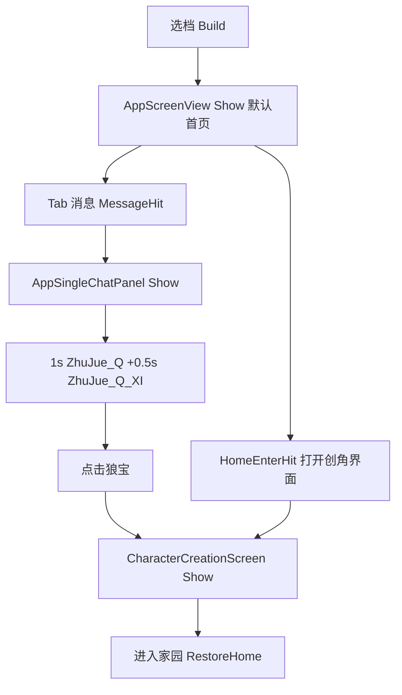

#### 9.15.5 实现类 / Classes

- `PetDemo.UI.AppScreenView` / `PetDemo.UI.AppScreenLayout`（双页签 APP；`BuildInto` / `Show` / `Hide` / `OnOpenCharacterCreationRequested` / `OnOpenSingleChatRequested`）
- `PetDemo.UI.AppSingleChatPanelView` / `PetDemo.UI.AppSingleChatPanelLayout`（单人聊天 + 狼宝时序；`GetOrCreate` / `Show` / `Hide` / `OnWolfClicked`）
- `PetDemo.EditorTools.AppScreenPrefabGenerator`（`Tools/PetDemo/Generate App Screen Prefab`）
- `PetDemo.EditorTools.AppSingleChatPanelPrefabGenerator`（`Tools/PetDemo/Generate App Single Chat Panel Prefab`）

---

## 10. 智能轮训操作机制 / Smart Polling Operation

**中文：** 玩家在种植系统中只通过 **一枚统一按钮** 与 20 块农田交互。系统按 `orderIndex` 1..20 顺序扫描，定位首块「有事可做」的农田作为当前焦点，并执行该田的最高优先级动作；按钮的文字 / 图标始终反映"将要在焦点田执行的那一个动作"。  
**English:** In the planting system the player interacts with all 20 tiles through a **single unified button**. The system scans tiles in `orderIndex` 1..20 order, picks the first actionable tile as the current focus, and executes the highest-priority action on it; the button's label/icon always reflects "the action that will be executed on the focus tile".

### 10.1 优先级表 / Priority Table

**中文：** 给定一块农田 `tile`，其当前可执行动作（自高到低）按下表判定，命中即停：  
**English:** Given a tile, its currently-executable action is determined top-to-bottom by the table below; first hit wins:

| 顺位 / Rank | 动作 / Action | 触发条件 / Condition |
|---|---|---|
| 1 | `Harvest` 收获 | `tile.harvest == AwaitingHarvest` |
| 2 | `Water` 浇水1阶 | `tile.planting == Seeded && tile.water == Empty` |
| 3 | `Water` 浇水2阶 | `tile.planting == Seeded && tile.water == W1` |
| 4 | `Water` 浇水3阶 | `tile.planting == Seeded && tile.water == W2` |
| — | （无可执行 / none） | 上述均不满足，扫描跳过该田 / scan skips the tile |

**中文：** 自 v2.9 起，`Seed` 已从该表移除：播种通过 §9.4.6 的仓库内按钮 + 手势直接驱动 `TrySeedTile(tileId)`；自 v2.10 起，`Fertilize` 也从该表移除：施肥通过 §9.7 的「主界面入口 + 肥料仓库 + 农田点击」三段式直接驱动 `ApplyFertilizerToTile(tileId)`。两者均不再参与统一按钮的全局扫描。本优先级按"动作层级"全局扫描：先在 20 田中寻找所有 `Harvest`，再寻找所有 `Water1`，依次类推；同一动作层级内再按 `orderIndex` 1..20 取首块田。`PestControl` 保留为后续外围事件动作，但不参与当前 P0 统一按钮优先级链。  
**English:** Since v2.9, `Seed` is removed from this table: seeding is driven directly by `TrySeedTile(tileId)` via the in-warehouse button + gesture in §9.4.6; since v2.10, `Fertilize` is also removed: fertilization is driven directly by `ApplyFertilizerToTile(tileId)` through the §9.7 three-stage flow (main-menu entry + fertilizer warehouse + tile tap). Neither participates in the unified-button global scan anymore. This priority is scanned globally by action tier: find any `Harvest` among all 20 tiles first, then any `Water1`, and so on; within the same action tier, choose the first tile by `orderIndex` 1..20. `PestControl` remains reserved for later external events but is not part of the current P0 unified-button priority chain.

**中文：** **开局引导旁注（v2.11）**：自 v2.11 起，`PlantingService` 构造期硬编码 `orderIndex=2 / lajiao`、`orderIndex=3 / fanqie` 两块「已待收获」预置（详见 §B.8）。开局首次按下统一按钮，按本表 Rank 1 与同层级 `orderIndex` 升序规则，焦点会先落在 2 号田的 `Harvest`；执行后再次预览，焦点跳到 3 号田的 `Harvest`，依次走通 §4.1.5 `Wilt`（2 号田）与 `Regrow`（3 号田）两条收获结算分支，并触发 §9.5 主角 `wait_3` 收获动画。  
**English:** **Opening guidance note (v2.11):** since v2.11, the `PlantingService` constructor hardcodes two "already awaiting-harvest" presets — `orderIndex=2 / lajiao` and `orderIndex=3 / fanqie` (see §B.8). The first unified-button press at game start, by Rank 1 of this table and the in-tier ascending `orderIndex` rule, focuses on tile 2's `Harvest`; after the next preview the focus jumps to tile 3's `Harvest`, walking through both §4.1.5 harvest branches (`Wilt` on tile 2 and `Regrow` on tile 3) and triggering the §9.5 villager `wait_3` harvest motion.

### 10.2 扫描算法 / Scan Algorithm

```text
# 自 v2.9 起，Seed 不再出现在统一按钮的扫描链中；自 v2.10 起，Fertilize 也不再出现
# Since v2.9, Seed no longer appears in the unified-button scan chain;
# since v2.10, Fertilize no longer appears either
function executeUnifiedAction():
  for priority in [Harvest, Water1, Water2, Water3]:
    for i in [1..20]:                      # 同层级按 orderIndex 顺序 / in orderIndex order within the tier
      tile = farmTiles[i]
      if matches(priority, tile):          # 见 §10.1 优先级表 / per §10.1 table
        action = actionOf(priority)
        setFocusTile(tile)                 # 触发 OnFocusChanged / fires OnFocusChanged
        apply(action, tile)                # 触发 OnTileFlagsChanged / OnPlantStateChanged 等
        fire OnUnifiedActionExecuted(tile.id, action)
        return
  # 全部 20 田无事可做：按钮置灰 / no actionable tile: disable the button
  setFocusTile(null)
```

**中文：** **按钮文字预览**：UI 在每帧（或每个事件回调后）调用 `previewNextAction()`：执行同样的扫描，但只取首个命中的 `(tile, action)` 而 **不真正执行**，用于刷新按钮文字 / 图标，并把 `FocusRing` 高亮迁移到该田。  
**English:** **Button preview:** the UI calls `previewNextAction()` per frame (or after each event): the same scan returns the first hit `(tile, action)` **without execution**, used to refresh the button label/icon and to move `FocusRing` highlight to that tile.

**中文：** **开局引导旁注（v2.11）**：在 §B.8 预置生效的开局帧，本扫描的首个命中即为 2 号田的 `Harvest`；待 2 号田被收获后再次扫描，命中 3 号田的 `Harvest`。两次结果均不会被仓库 / 肥料弹窗等其他 UI 路径打断，因为预置不触发 §6 事件，UI 在 `FarmGridView.BuildInto` 末尾通过 `RefreshAllSlots()` 直接读取初始快照。  
**English:** **Opening guidance note (v2.11):** on the opening frame after the §B.8 preset takes effect, the first hit of this scan is tile 2's `Harvest`; after tile 2 is harvested, the next scan hits tile 3's `Harvest`. Neither outcome is interrupted by other UI paths (warehouse / fertilize modal, etc.) because the preset raises no §6 events and the UI reads the initial snapshot via `RefreshAllSlots()` at the end of `FarmGridView.BuildInto`.

### 10.3 焦点高亮 / Focus Highlight

**中文：** 仅有「下一次按下按钮将作用于的那块田」显示 `FocusRing` 与 `FocusArrow`（箭头朝下指向该格，可使用轻微上下浮动动画，P0 允许静态）；点击执行后立即重新预览，焦点可能跳到下一块。当全部 20 田无事可做时，焦点为 `null`，`FocusRing/FocusArrow` 全部隐藏，按钮文字显示「暂无操作 / No Action」并置灰。  
**English:** Only the tile "the next tap will act on" shows both `FocusRing` and `FocusArrow` (the arrow points downward to the slot and may use a subtle up-down floating animation; static is acceptable for P0). After a tap, preview is recalculated immediately and focus may jump to another tile. When no tile is actionable, focus is `null`, all `FocusRing/FocusArrow` indicators are hidden, and the button is disabled with "No Action".

### 10.4 与外围事件 / 主循环的协作 / Cooperation with External Events and Main Loop

**中文：** 主循环每帧调用 `IPlantingService.TickGrowth(deltaSeconds)`，推进所有 `Growing` 植物的倒计时；倒计时结束触发的 `tile.water` 变化、`appearanceNode` 切换、`AwaitingHarvest` 进入，都会引起 `OnTileFlagsChanged` / `OnPlantStateChanged` / `OnAppearanceNodeChanged`，UI 据此重新执行 `previewNextAction()` 以同步按钮文字与焦点。外围事件调度器（捉虫）在独立计时器到点时触发 `OnPestEventTriggered`，同样会引发预览重算。  
**English:** The main loop calls `IPlantingService.TickGrowth(deltaSeconds)` each frame, advancing all `Growing` plants' countdowns; countdown completion produces `tile.water` changes, `appearanceNode` swaps, and `AwaitingHarvest` entries, raising `OnTileFlagsChanged` / `OnPlantStateChanged` / `OnAppearanceNodeChanged`. The UI re-runs `previewNextAction()` accordingly to sync button label and focus. The external (pest) event scheduler fires `OnPestEventTriggered` on its own timer and also triggers a preview refresh.

---

## 11. 变更记录 / Revision Log

| 版本 / Ver | 日期 / Date | 说明 / Notes |
|------------|-------------|--------------|
| 3.224 | 2026-07-10 | **九宫格战场 Top 边距**：§12.14.9——嵌入 `TopArea` 的 `GridBattleField` 拉伸后 **Top=200**（`offsetMax.y=-200`），整体下移避开顶部留白/关闭钮。 / **Grid field top inset:** embedded `GridBattleField` Top=200 (`offsetMax.y=-200`). |
| 3.223 | 2026-07-10 | **修复九宫格战角色不可见**：§12.14.9——`UnitAnchor` 嵌套 `Canvas.overrideSorting` 的 `sortingOrder` 改为 **`parentCanvas.sortingOrder + row×10 + col`**（禁止写绝对小值落入世界带 `0..499` 被 HUD `1000+` 盖住）；新建 Canvas 须写入 Spine 所需 `additionalShaderChannels`（`TexCoord1|Normal|Tangent`），并在构建 `SkeletonGraphic` **之前**挂好该 Canvas；补齐 `GraphicRaycaster`。 / **Fix invisible grid-battle Spines:** parent-relative sortingOrder; Spine shader channels on nested canvas; create canvas before SkeletonGraphic. |
| 3.222 | 2026-07-10 | **冒险 Spine 层级/移动/队友骨骼修复**：(1) §12.14.9——九宫格战单位 `SkeletonGraphic` 按槽位行 `Slot_r3 > Slot_r2 > Slot_r1` 设置 `Canvas.overrideSorting`（`sortingOrder = row×10 + col`），下方行遮挡上方行；(2) §12.14.15 / §12.11.5——「下一天」移动过场**全队**（Role + FollowerNpc）同步播 `move_1` 后恢复待机；(3) §9.8.9.7 / §12.14.1.1——`GuildHomeVisitState` 快照除 `npcId` 外同步 `skeletonPrefab`（`GuildNpcMarker.SkeletonKind`→`Hero_Role_langmeiren`/`Hero_Role_cunmin`），冒险读队不再因公会场景 inactive 而回退狼人骨骼。 / **Adventure Spine fixes:** grid row depth sort r3>r2>r1; next-day move anim for full party; visit snapshot stores skeleton prefab per follower. |
| 3.221 | 2026-07-10 | **战斗 Spine 与血条视觉微调**：§12.3 / §12.14.9——战斗中所有 `SkeletonGraphic` 在既有基底缩放上再统一 × **`BattleSpineDisplayScaleMultiplier = 1.15`**（+15%）；角色/NPC 血条锚定于 **Spine 中心点正下方 20px**（全屏 1v1：`PlayerHomePos`/`EnemyHomePos` 的 Y − 20；九宫格：HP 条挂 `slotRt` 中心 `(0, -20)`）。 / **Battle Spine & HP bar layout:** all battle Spines +15% via `BattleSpineDisplayScaleMultiplier`; HP bars 20px below Spine center. |
| 3.220 | 2026-07-10 | **冒险全队入战与探索展示修复**：(1) §9.8.9.7——公会→主线/其它非家园 Tab **保留** `GuildHomeVisitState` 快照供 `PeekFollowers` 读队（修复拉手 NPC 未进 `RunPartyRoster`）；仅「非公会→家园」`Clear`、公会→家园仍 `Consume`。(2) §12.11.10 / §12.14.7——`evt_fight_small_1`（1 只小怪）、`evt_fight_small_2`（2~3 只）、`evt_fight_boss`（1 只 BOSS）**一律**走 §12.14 九宫格全队战；Modal_2 嵌入不再用 legacy 1v1。(3) 探索期 `PartyStandRoot` 全程展示名册全员（开战隐藏、胜后重建）。 / **Full-party adventure fix:** keep follow snapshot when leaving GongHui for non-home tabs; all Modal_2 fight events use grid party battle; exploration PartyStand shows full roster. |
| 3.219 | 2026-07-10 | **§12.14.16 阶段 5 落地**：`RosterBattleSync.SyncRosterHpAfterBattle`（胜：死亡者 `max(1,floor(maxHp×0.3))` 复活、存活者保留战后 HP；负：不写回）；`InvasionBattleModal2View.OnEmbeddedBattleEnded` 多单位胜后回写 + `RebuildPartyStandVisuals`；Editor 自测 `Tools/PetDemo/Self-Test RunPartyRoster Phase5`（§12.14.14 全 9 条）；§12.14.16 阶段 5 状态→`已完成`，P0 五阶段全部完成。 / **Phase 5 shipped:** post-battle roster HP sync + 30% revive; win rebuilds PartyStandRoot; Phase5 Editor self-test covers §12.14.14; Phase 5 status → done; P0 complete. |
| 3.218 | 2026-07-10 | **§12.14.16 阶段 4 落地**：`InvasionBattleView.BuildEmbeddedGrid`（`embedded=true`，`useGridBattle=true`）+ 每槽 Spine/小型 HP 条 + 按 `turnQueue` 依次播放行动动画；`LaunchEmbeddedBattle` 按 `pendingEventId` 分支（`evt_fight_small_2`→多单位战，其余 legacy 1v1）；复用 `EmbeddedResultOverlay/ResultDialog`；Editor 自测 `Tools/PetDemo/Self-Test RunPartyRoster Phase4`；§12.14.16 阶段 4 状态→`已完成`。 / **Phase 4 shipped:** `BuildEmbeddedGrid` + animated grid battle UI embed; `pendingEventId` branch in `LaunchEmbeddedBattle`; Editor self-test; Phase 4 status → done. |
| 3.217 | 2026-07-10 | **§12.14.16 阶段 3 落地**：`GridBattleField.prefab` + `BattleGridSlotMarker` + `GridBattleFieldLayout`（编辑器菜单 `Tools/PetDemo/Generate Grid Battle Field Prefab`）；`BattlePartyAssembler` / `GridEncounterBuilder` / `GridBattleTargetSelector` / `GridBattleResolver` / `GridBattleDriver`（`kGridBattlePetsEnabled=false`）；`GridBattleHeadlessRunner`；Editor 自测 `Tools/PetDemo/Self-Test RunPartyRoster Phase3`（3 人 vs 2~3 怪 headless、即时胜负 §12.14.6.1.1）；§12.14.16 阶段 3 状态→`已完成`。 / **Phase 3 shipped:** grid field prefab + headless battle rules engine; Editor self-test; Phase 3 status → done. |
| 3.216 | 2026-07-10 | **§12.14.16 阶段 2 落地**：`RunPartyRewardApplier`（`ApplyPercentStatToAllPartyMembers` / `ApplyFlatStatToAllPartyMembers` / `AcquireSkillForAllPartyMembers` / `ApplyRewardToAllPartyMembers`）；`InvasionBattleModal2View` 事件路径 `attr:*`/`slot3`/`slot5`/`pick3` 全员收益；`TopArea/PartyStandRoot` + `RebuildPartyStandVisuals`（探索期全队 Spine、战斗隐藏/胜后重建）；Editor 自测 `Tools/PetDemo/Self-Test RunPartyRoster Phase2`；§12.14.16 阶段 2 状态→`已完成`。 / **Phase 2 shipped:** reward fan-out helpers; event paths apply to all roster members; exploration party stand visuals; Editor self-test; Phase 2 status → done. |
| 3.215 | 2026-07-10 | **§12.14.16 阶段 1 落地**：`RunPartyRoster`/`RunAllyEntry`/`BattleGridPos`/`BattleUnitRuntime`/`GridBattleSession` 等（`GridBattleModels` + `RunPartyRosterFactory`）；`GuildHomeVisitState.PeekFollowers()`；`GuildNpcFollowController.GetFollowerNpcIds`；`InvasionBattleModal2View.Show()` 初始化名册（读队/去重/截断 9/`runStats`=`members[0].stats` 别名）；`pendingEventId` 写入与清空；Editor 自测菜单 `Tools/PetDemo/Self-Test RunPartyRoster Phase1`；§12.14.16 阶段 1 状态→`已完成`。 / **Phase 1 shipped:** roster data types + factory; PeekFollowers; Show() roster init + runStats alias + pendingEventId; Editor self-test; Phase 1 status → done. |
| 3.214 | 2026-07-10 | **多单位战分阶段实施计划**：新增 §12.14.16——将 §12.14 P0 拆为 5 个可独立验收的开发阶段（名册底座 → 事件全员收益 → 战斗纯逻辑 → 战斗 UI 嵌入 → 结算回写与端到端验收）；含依赖关系、交付物、阶段验收与工期估算；§12.14.10 交叉引用。本期仅 SPEC，不写代码。 / **Multi-unit battle phased rollout:** new §12.14.16 — five independently verifiable P0 phases with dependencies, deliverables, acceptance, and estimates; §12.14.10 cross-ref; SPEC only, no code. |
| 3.213 | 2026-07-10 | **多单位战规则补充**：§12.14.15 探索期全队 Spine（`PartyStandRoot`）；§12.14.12.1 属性增减边界；§12.14.6.1.1 行动顺序即时胜负；§12.14.1.1 读队降级；`pendingEventId` 战斗分支；结算 UI 沿用简单 `ResultDialog`；修订 §12.11.2/§12.11.3/§12.11.4/§12.11.5/§12.11.10/§12.14.9/§9.8.9.7/§B.17.2。本期仅 SPEC，不写代码。 / **Multi-unit battle rules supplement:** exploration party stand visuals; attr bounds; immediate win/loss on hit; roster fallbacks; `pendingEventId`; simple result dialog; doc consistency; SPEC only, no code. |
| 3.212 | 2026-07-10 | **多单位战规则完善**：§12.14 增补 `RunPartyRoster` 局内名册（`Show()` 一次性读队）；主角站位改 `r2c2`、队友 col2→col1→col3 列内随机；事件 `attr:*`/`pick3`/`slot3/5` 玩家操作、**全员各得一份**（§12.14.12）；独立 HP 与胜后回写（§12.14.13）；暂死 + 胜后死亡者 **30% HP 复活**、存活者 HP 不变（§12.14.6.2）；回写 §12.11.5/§12.11.9/§12.12.3/§12.11.10/§12.4/§9.8.9.7。本期仅 SPEC，不写代码。 / **Multi-unit battle rules refined:** `RunPartyRoster` at `Show()`; Role at `r2c2`, followers random col2→col1→col3; event rewards fan-out to all allies; per-member HP; battle-death + 30% revive on win; cross-refs; SPEC only, no code. |
| 3.211 | 2026-07-10 | **多单位阵型战斗 SPEC**：新增 §12.14——主角 Role + 公会拉手跟随 NPC 对战多怪；3×3 预制体站位；`agility` 降序混排出手；普攻列/行优先级选目标；`evt_fight_small_2` 随机 2~3 只 `enemy_small` 占随机敌方槽；精灵关闭；开战读 `GuildNpcFollowController` / `GuildHomeVisitState.PeekFollowers()`；§4.2/§12.4/§12.5/§12.11.10/§9.8.9.7 交叉引用与 legacy 标注。本期仅 SPEC，不写代码。 / **Multi-unit formation battle SPEC:** new §12.14 — Role + guild followers vs multiple enemies; 3×3 prefab grid; agility-sorted mixed turns; column/row target priority; `evt_fight_small_2` spawns 2–3 small enemies; pets disabled; party read at battle start; cross-refs; SPEC only, no code. |
| 3.210 | 2026-07-10 | **RoleLevelUpPanel OK 点击修复**：§9.14.13——`OkButton` 禁止用带透明像素的 Sprite 作 `targetGraphic`（穿透到 `DimOverlay` 导致点了无响应）；根级 OK + 不透明 `HitArea`；打开时 `EnsureClickableLayout` / 重新 `WireOkButton`。 / **RoleLevelUp OK click fix:** opaque HitArea as Button targetGraphic; no transparent sprite hit-test fallthrough. |
| 3.209 | 2026-07-10 | **经验条填充宽度修正**：§9.14.11 / §9.14.13——`ExpFill` 轨道满宽每次刷新以 `ExpBarRoot.rect.width`（>0）为准，禁止布局未完成时永久缓存回退 `800` 导致进度条超出轨道；`HomeTabPanelView` / `RoleLevelUpPanelView` 对齐 `StaminaBarView.EnsureFillRect`。 / **Exp bar fill width fix:** re-read `ExpBarRoot.rect.width` each refresh; do not permanently cache fallback 800 before layout. |
| 3.208 | 2026-07-10 | **主角升级全屏展示**：§5/§6 加经验与升级（`TryAddRoleExp`，升级不扣 `currentExp`）；§9.14.11 体力条右侧「增加经验」按钮（本级单级需求×40%，最小 1）；新 §9.14.13 `RoleLevelUpPanel`（Level UP! / 等级 / LevelExpRow / 解锁列表 / OK）；§B.23 `role_exp.csv`、§B.24 `role_level_unlocks.csv`；`ApplyToRole` 的 `expToNextLevel` 优先读 §B.23；需生成 `RoleLevelUpPanel.prefab` 并重生成 `HomeTabPanel.prefab`。 / **Role level-up fullscreen:** add-exp + level-up panel; HomeTab debug grant; exp/unlock CSVs; regen prefabs. |
| 3.207 | 2026-07-10 | **EnterHomeHud 底栏**：§9.8 / §9.14.10——`GongHui` / 创角 `EnterHomeButton` 汇合为 EnterHomeHud：`MainHudLayerRoot` 可见时隐藏 `BottomNavBar`、显示同款 HUD `BottomTabBar`（`HudEnterHomeTabBarView`，EnterHome IconOpen）+ `GongHuiScreen`（底 inset=`BottomTabBarHeight`）；废弃创角内嵌公会主路径；其它 BottomNav key 与创角其它页签不变。 / **EnterHomeHud bar:** GongHui/EnterHome → HUD BottomTabBar + GongHui; no CC embed; other tabs unchanged. |
| 3.206 | 2026-07-09 | **开局营救（HomeTabPanel）**：§9.14.11 新档 `openingRescuePending` 时 `RoleMount` 冻结 `death` 末帧、气泡强制「好饿哦~~~好饿哦~~~」、点击角色 `CompleteOpeningRescue` 体力满 + `work_2`×1 → `standby_1` loop；`CharacterCreationState/Save.openingRescuePending` 持久化；`IPlantingService.IsOpeningRescuePending` / `CompleteOpeningRescue`。 / **Opening rescue (HomeTabPanel):** new-save death last frame + hungry bubble; tap role → full stamina + work_2 → standby_1; persisted flag + service API. |
| 3.205 | 2026-07-09 | **家园体力条预制体嵌入复用**：§9.14.11 `StaminaBarView.GetOrCreateIn`——`StaminaBarSlot` 内已嵌入 `StaminaBar.prefab` 时复用，否则 `BuildInto`；`HomeTabPanelView.staminaBar` 可序列化引用。 / **Home stamina bar prefab embed:** `GetOrCreateIn` reuses embedded instance in slot. |
| 3.204 | 2026-07-09 | **家园页签左上体力条**：§9.14.11 新增 `TopLeftStaminaHud`（关闭钮右侧 `anchoredPosition≈(108,-20)`，`StaminaBarSlot` 275×116）；§9.8.12.4 `StaminaBarView` 扩展四层 `TiLi_0/1/2/3`（`IconLayer`+`BarTrack`）+ `StaminaBarPrefabGenerator`；新档 `stamina=0`；需重生成 `StaminaBar.prefab` / `HomeTabPanel.prefab`。 / **Home-tab stamina HUD:** §9.14.11 `TopLeftStaminaHud`; §9.8.12.4 four-layer `StaminaBarView` + prefab generator; regen prefabs. |
| 3.203 | 2026-07-09 | **空存档好友引导**：§9.14.1 AddButton 仍由 `created==false` 驱动；点击创角后 `friendListMode=RecommendPrompt` 并切**家园**页签；亲密度页展示「推荐好友」双选项；选项 2 显示 TopFriends 列表且 `IntimacyText` 强制「亲密度 0」；选项 1 切 EnterHome 公会嵌入并将 `Npc_1~3` 随机移至主角附近、互动钮「打招呼」；`FriendListMode` + `CharacterCreationSave.friendListMode` 持久化。 / **Empty-save friend onboarding:** recommend-friend prompt on intimacy tab after AddButton create; home tab on create; werewolf invite shows cells at intimacy 0; town search embeds guild with nearby NPCs and greet label. |
| 3.202 | 2026-07-09 | **训练课程列表滚动区尺寸**：§9.14.12 `CourseSection/CourseScroll` `PosY=40`、`Height=870`（`Width=1080` 不变）；`TrainingPanelLayout` 常量对齐；需重生成 `TrainingPanel.prefab`。 / **Training course scroll layout:** §9.14.12 `CourseScroll` `PosY=40`, `Height=870`; regen prefab. |
| 3.201 | 2026-07-09 | **家园「当前」页属性数值同步**：§9.14.11 `CurrentPlaceholderPage` 的 `AttrItem_{0..5}.Value` 与 `HexAttrsPage` 同索引 `Value` 展示一致（`HomeTabPanelView.RefreshHexAttrs` 镜像）；`EnsureAttrGridRefs` 接线 Current 页 AttrGrid。 / **Home Current tab attr sync:** `CurrentPlaceholderPage` AttrItem values mirror `HexAttrsPage` by index. |
| 3.200 | 2026-07-09 | **训练课程格属性增益展示**：§9.14.12 `CourseCellTemplate` 新增 `AttrGains` 文案节点，展示 `attrGains`（中文属性名+`+`数值，多项 `，` 分隔）；`RoleTrainingCourseCatalog.FormatAttrGainsDisplay`；需重生成 `TrainingPanel.prefab`。 / **Training course cell attr gains:** §9.14.12 `AttrGains` text on course cells; `FormatAttrGainsDisplay`; regen prefab. |
| 3.199 | 2026-07-09 | **创角/家园关闭钮左上角**：§9.14.6 / §9.14.11 `ScreenCloseButton` 由右上角改为左上角（`anchor/pivot=(0,1)`，`anchoredPosition≈(20,-20)`）；`CharacterCreationScreenLayout` / `HomeTabPanelLayout` 运行时校正旧 prefab；需重生成或 Ensure `CharacterCreationScreen.prefab` / `HomeTabPanel.prefab`。 / **CC/Home ScreenClose top-left:** §9.14.6 / §9.14.11 close button moved to upper-left; layout apply on existing prefabs; regen/Ensure prefabs. |
| 3.198 | 2026-07-09 | **公会右上玩法按钮**：§9.8.9.14 新增 `TopRightWorkflowLayer` 竖排 `WF_XuanShang`/`WF_ZuDui`/`WF_JJC`/`WF_ZhuangYuan`；前三项复用 `NavigateByKey`（主线/好友列表/家园世界）；`WF_JJC` 显示「敬请期待」TipsToast；`GongHuiScreenLayout` + `GongHuiScreenView`/`GongHuiScreenPrefabGenerator`；需重生成 `GongHuiScreenPanel.prefab`。 / **Guild top-right workflow buttons:** §9.8.9.14 four-icon stack; main story / friend list / coming-soon toast / home world; regen prefab. |
| 3.197 | 2026-07-09 | **公会响应区静止跳转**：§9.8.9.11 进入半径后需停止摇杆输入 2s 才触发 `Entered`；倒计时期间 NamePlate `NameText` 显示「正在前往....」；移动/离开清零；`GuildProximityController` 注入 `joystick`。 / **Guild response-area idle nav:** 2s stationary before `Entered`; countdown text on NamePlate; joystick-aware timer reset. |
| 3.196 | 2026-07-09 | **公会建筑跳转修订**：§9.8.9.13 `Building_1`→`MainStoryLine`（主线层）、`Building_2`→`FriendListPanel`、`Building_3`→`JiaYuan`（家园世界层）；移除建筑跳转 `LevelSelect`/`TeamAdventure`；`BindFriendListPanel`。 / **Guild building nav revision:** main story / friend list / home world. |
| 3.195 | 2026-07-09 | **公会场景跳转**：§9.8.9.11 响应区 `navTargetKey` 对接创角底栏（`DressUpButton`/`RoleAddFavorButton`/`HomeTabButton`）；新增 §9.8.9.13 建筑 `ActionButton` 跳转（`Building_1`→`LevelSelect`、`Building_2`→`TeamAdventure`）；`GuildBuildingMarker.navTargetKey` + `GongHuiScreenView.NavigateByKey` + `CharacterCreationScreenView.NavigateFromGuild`/`RequestExitToBottomNav`。 / **Guild scene navigation:** response areas → character-creation tabs; building buttons → level select / team adventure modal. |
| 3.194 | 2026-07-08 | **训练页签 TrainingPanel**：§9.14.10 `RoleAddFavorButton` 改为打开独立预制体 `TrainingPanel`（新 §9.14.12：上角色+挂机槽 / 中 OR 属性筛选+`common_bg_5` / 下双列课程+锁 `common_bg_Suo`）；家园每日任务仍开 ZhuanQian；§B.22 `role_training_courses.csv` + Catalog；`TrainingSession` 存档与 Service 开始/完成结算（惩罚下限 0，rewardPool 仅字段）；完成增益图标飞向角色。 / **Training tab:** Favor button opens `TrainingPanel`; daily task keeps ZhuanQian; course CSV + session save + complete fly FX. |
| 3.193 | 2026-07-08 | **家园页签关闭回 APP PageHome**：§9.14.11 新增根级 `ScreenCloseButton`——点击 `HomeTabPanelView.OnCloseRequested` → 宿主 `OnScreenCloseClicked`（与创角根关闭同路径）→ 隐藏创角并 `AppScreenView.Show()` 回 §9.15 PageHome；ZhuanQian 特例仍由创角根关闭钮处理；需重生成 / Ensure `HomeTabPanel.prefab`。 / **Home-tab close → APP PageHome:** §9.14.11 root `ScreenCloseButton` → `OnCloseRequested` → host close path → `AppScreenView.Show()` (PageHome); ZhuanQian special-case unchanged on CC root close; regen/Ensure prefab. |
| 3.192 | 2026-07-08 | **创角底栏 IconOpen 再点无变**：§9.14.10——已激活（`IconOpen`）的页签再次点击不收起、不改状态；仅切到其它页签才切换。ZhuanQian 展示期间再点家园亦 no-op；收起 ZhuanQian 仍靠 `RoleAddFavorButton`（Closed）或 `ScreenCloseButton`。 / **BottomTabBar no re-toggle:** IconOpen tabs ignore re-clicks; ZhuanQian close still via Favor or ScreenClose. |
| 3.191 | 2026-07-08 | **ZhuanQianPopup 展示时底栏与关闭**：§9.14.10 / §9.14.6——打开 `ZhuanQianPopup`（底栏加好感或家园每日任务）时 `SetActiveTab(Home)`（`HomeTabButton` IconOpen、`RoleAddFavorButton` IconClosed）；`ScreenCloseButton` 在 ZhuanQian 可见时关闭该层并 `OpenHomeTabPanel()`，不回 APP；再次点加好感/家园页签亦收起回 `HomeTabPanel`。 / **ZhuanQian shown as home overlay:** tab highlight stays on Home; ScreenClose returns to `HomeTabPanel` instead of APP. |
| 3.190 | 2026-07-08 | **家园页签右上功能按钮**：§9.14.11 新增 `TopRightActions`——竖排「排行榜」`RankingButton`（`AirUI/ZJM_PaiHangbang_1`，可点仅 ColorTint、不打开界面）与「每日任务」`DailyTaskButton`（`AirUI/ZJM_RenWu_1` → `OnDailyTaskRequested` → `CharacterCreationScreenView.OpenAddFavorTab()` 打开既有 `ZhuanQianPopup`）；需重生成 `HomeTabPanel.prefab`。 / **Home-tab top-right actions:** §9.14.11 adds `TopRightActions` — ranking (`ZJM_PaiHangbang_1`, ColorTint only) and daily task (`ZJM_RenWu_1` → `OpenAddFavorTab` / `ZhuanQianPopup`); regen prefab. |
| 3.189 | 2026-07-08 | **创角界面默认家园页签**：§9.14.10 `Show()` 默认 `SetActiveTab(TabIndexHome)` + `OpenHomeTabPanel()`，创建新角色或从其它界面进入创角界面时默认打开 `HomeTabButton`（取代 v3.146 的亲密度默认）。 / **Character-creation default home tab:** §9.14.10 `Show()` now activates tab 2 (`HomeTabButton`) and opens `HomeTabPanel` on every open, replacing the v3.146 intimacy default. |
| 3.188 | 2026-07-08 | **家园 HexAttrsPage 六成长属性 + 角色等级表**：§9.14.11 `HexAttrsPage` 移除 `HexRadarChart`/`HexLabels`，改为双列三行图标+数值（`SX_1`…`SX_6`，无中文名）；§5 `RoleStats` 增 `intelligence/memory/imagination/physique/charm/emotionalIntelligence` 并持久化；新增 §B.21 `Configs/Farm/role_levels.csv` + `RoleLevelConfigCatalog`（含 `ApplyToRole`：写六属性、`expToNextLevel`、`maxHp`/`atk`/`agility`）；新档与旧档六属性全 0 时回填；战斗六宫与 `DetailAttributeModal` 不变；需重生成 `HomeTabPanel.prefab`。 / **Home HexAttrsPage growth attrs + role level table:** replace radar with 2×3 icon+value grid; six growth fields on `RoleStats`+save; §B.21 `role_levels.csv` + catalog apply on create/legacy load; battle hex unchanged; regen prefab. |
| 3.182 | 2026-07-07 | **公会地图响应区域**：§9.8.9.11 新增 `ResponseAreas/` + `GuildResponseAreaMarker`；靠近显示 NamePlate、走进半径沿边自动触发占位跳转（`navTargetKey` 预留）；扩展 `GuildProximityController`。 / **Guild map response areas:** §9.8.9.11 `ResponseAreas/` + `GuildResponseAreaMarker`; proximity nameplate + edge-triggered enter placeholder; extends `GuildProximityController`. |
| 3.181 | 2026-07-06 | **嵌入 BOSS 战胜利后返回关卡选择**：§12.11.10——`battle_boss` 嵌入战斗胜利、`EmbeddedResultOverlay/ResultDialog` 点「点击关闭」后：`Hide()` 关闭 `InvasionBattleModal_2` 并打开 §9.8.8.6 `LevelSelectScreenPanel`；`battle_small` 小怪胜利仍恢复常态「下一天」。`MainStoryLineScreenView.ShowLevelSelectPanel()` 懒加载关卡选择层。 / **Embedded BOSS victory returns to level select:** §12.11.10 — after `battle_boss` win and closing the embedded `ResultDialog`, hide `InvasionBattleModal_2` and show `LevelSelectScreenPanel`; small-battle win unchanged. `MainStoryLineScreenView.ShowLevelSelectPanel()` lazy-opens the panel. |
| 3.180 | 2026-07-06 | **局外六宫属性初始值**：§5 `RoleStats` 新增 `criticalHit/combo/counterattack/stun/evasion/lifeSteal` 整数默认值（3/6/12/2/4/8）；§12.13 六宫 = 局外基线 + 本局老虎机累加；`RoleStatsSave` 同步。 / **Out-of-run hex defaults:** six int fields on `RoleStats` (3/6/12/2/4/8); §12.13 hex = baseline + slot gains; save updated. |
| 3.179 | 2026-07-06 | **`SlotMachineModal` 依次定格与结果汇总条**：§12.12.2 补充——滚动阶段（`SpinDuration=1.0s`、`SpinTick=0.06s`）结束后按 `Reel0→Reel{n-1}` **依次定格**，相邻轴间隔 **`ReelStopStaggerSec=0.3s`**，未定格轴在间隔内继续滚动；新增 §12.12.7——全部轴定格后在 `IconLayer` 下方显示 `ResultSummary`（`AirUI/ShiJian_1` 九宫格 + 与 EventCard 一致文案，`SlotMachineResultText.FormatResultSummary` 共享格式化）。 / **`SlotMachineModal` sequential reel settle & result summary:** §12.12.2 — after spin phase, reels settle **sequentially** from `Reel0` with **0.3s** stagger, unsettled reels keep scrolling; new §12.12.7 — `ResultSummary` below `IconLayer` with EventCard-matching text via shared `FormatResultSummary`. |
| 3.178 | 2026-07-06 | **`SlotMachineModal` 属性获得飞入特效**：新增 §12.12.6——`Settled` 态 `Finalize` 时于 `Hide()` 前按各 `Reel{n}` 复制图标至主 Canvas，`Hide()` 后延迟 0.3s、0.5s 飞向 `DetailAttrButton` 并缩至 0.25；`SlotAttrFlyFx` + `Show(..., flyTarget)`。 / **`SlotMachineModal` attribute gain fly-in FX:** new §12.12.6 — on `Settled` `Finalize`, clone reel icons to Canvas before `Hide()`, then after 0.3s delay fly 0.5s to `DetailAttrButton` scaling to 0.25; `SlotAttrFlyFx` + `Show(..., flyTarget)`. |
| 3.179 | 2026-07-07 | **公会镜头跟随 v2（视口增量 + 帧 delta 反向平移）**：§9.8.9.6——`TryComputeContentPositionForTarget` 改为在 viewport 局部空间测量偏移并增量校正；新增 `ApplyPlayerContentDelta`，`GuildPlayerController` 每帧传入实际位移 delta 同帧反向平移 content，与 `LateUpdate` 双保险。 / **Guild camera follow v2:** viewport-space incremental correction + per-frame `ApplyPlayerContentDelta` from player move delta. |
| 3.178 | 2026-07-07 | **公会镜头即时跟随（修复 scale 滞后）**：§9.8.9.6——`JiaYuanViewportFollowController` 计算跟随位移时将目标在 `worldContent` 局部偏移乘以 `localScale` 再写入 `anchoredPosition`（修复 `WorldContentLocalScale=1.7` 时镜头跟不上角色）；`GuildPlayerController` 位移后同帧 `SnapToTarget`。 / **Guild instant camera follow (scale fix):** §9.8.9.6 — viewport follow multiplies target local offset by `localScale` before setting `anchoredPosition`; same-frame snap after player move. |
| 3.177 | 2026-07-06 | **`InvasionBattleModal_2` 详细属性弹窗（`DetailAttributeModal`）**：新增 §12.13——`MiddleArea` 最右侧 `DetailAttrButton`（`AirUI/JiNengLiebiao`）打开独立预制体 `DetailAttributeModal`；全屏纯黑半透明遮罩；上/中/下三区（角色待机、`LiuGong_1` 底 + 与主界面一致 HP/攻击/速度、六宫雷达图）；六宫 6 项局外初始 0、仅累加本局老虎机增益至 `runEnhanceBonuses`；动态比例绘制多边形。修订 §12.12.3 / §B.19 `attrId` 映射（`Life`/`Attack` + 六宫项）。 / **`InvasionBattleModal_2` detail-attribute modal:** new §12.13 — `DetailAttrButton` on `MiddleArea` opens `DetailAttributeModal` prefab; semi-transparent black dim; top/middle/bottom (idle character, `LiuGong_1` + same HP/atk/speed as main, hex radar); hex attrs start at 0 outside run, slot gains in `runEnhanceBonuses`; dynamic-scale polygon. §12.12.3 / §B.19 `attrId` mapping updated. |
| 3.176 | 2026-07-06 | **嵌入结算 `ResultDialog` 文本排版**：§12.11.10.1——`EmbeddedResultOverlay/ResultDialog` 内 `ResultText` `PosY=175`、`fontSize=64`、`FontStyle=Bold`；`HintText` `PosY=-340`、`fontSize=40`、`FontStyle=Bold`；由 `InvasionBattleView.ApplyEmbeddedResultDialogTextLayout` 于嵌入实例化后运行时覆写，§12.3 全屏 prefab 默认不变。 / **Embedded result dialog text layout:** §12.11.10.1 — `ResultText` `PosY=175`, `fontSize=64`, bold; `HintText` `PosY=-340`, `fontSize=40`, bold; applied at runtime via `ApplyEmbeddedResultDialogTextLayout`; §12.3 fullscreen prefab defaults unchanged. |
| 3.187 | 2026-07-08 | **家园页签角色气泡文字**：§9.14.11 增补 `CharacterZone/SpeechBubble`——九宫格框 `AirUI/DialogBox_1`、文案固定于角色左上方；新增配置表 `Configs/HomeTabBubbles.csv`（§B.20：`entryId/triggerCondition/roleAnim/animPlayCount/bubbleText`，CSV 行序=优先级）；打开 `HomeTabPanel` 即求值并展示首条满足条件条目，点击气泡隐藏并推进下一条；`animPlayCount=0` 循环动作、`>0` 播完回待机；`HomeTabBubbleCatalog` + Layout/View 接线；需重生成 `HomeTabPanel.prefab`。 / **Home-tab speech bubbles:** §9.14.11 adds fixed upper-left `SpeechBubble` (`DialogBox_1` nine-slice) driven by `HomeTabBubbles.csv` (§B.20); show on open, tap advances queue by CSV order; role anim play-count 0=loop; regen prefab. |
| 3.186 | 2026-07-08 | **创角家园页签 HomeTabPanel**：新增 §9.14.11——`HomeTabButton` 由 `HomeTabPlaceholderPanel` 占位升级为独立预制体 `HomeTabPanel`（屏上 40% Spine+`common_bg_11`、等级 `Lv_bg_003`、经验条 `Lv_bg_004~006` 四层、信息子页签「角色6项属性」六宫雷达 +「当前」占位）；打开时隐藏 `DisplayArea`；`RoleStats` 增 `level/currentExp/expToNextLevel` 并持久化；`HomeTabPanelView`/`HomeTabPanelLayout`/`HomeTabPanelPrefabGenerator`；移除 `HomeTabPlaceholderPanel`；需重生成 `HomeTabPanel.prefab` 与 `CharacterCreationScreen.prefab`。 / **Character-creation home tab HomeTabPanel:** new §9.14.11 — `HomeTabPanel` prefab replaces placeholder; Spine at top 40%, level/exp bar, hex-radar + current placeholder sub-tabs; hides `DisplayArea`; `RoleStats` level/exp fields + save; regen prefabs. |
| 3.185 | 2026-07-08 | **创角底栏页签全图标化**：§9.14.10 废弃页签 `Label` 文字；5 个页签均由 `CharacterCreationScreenLayout` 加载 `bottom_bar_*` 双态图标（`a/b/c/d/e` 各 `_1` Closed / `_2` Open）；`RefreshBottomTabBarPresentation` 运行时刷新旧 prefab；需重生成 `CharacterCreationScreen.prefab`。 / **Character-creation tab bar all-icon:** §9.14.10 deprecates tab `Label` text; all 5 tabs load `bottom_bar_*` open/closed sprites via layout; `RefreshBottomTabBarPresentation` patches old prefabs; regen prefab. |
| 3.184 | 2026-07-08 | **创角底栏五页签 + 公会内嵌**：§9.14.10 底栏由 4 等宽扩为 **5 等宽**（`TabSlotWidth = 屏宽/5`）；`DressUpButton` 与 `EnterHomeButton` 之间新增 `HomeTabButton`（家园，图标 `AirUI/bottom_bar_c_1`/`bottom_bar_c_2`，本期占位 `HomeTabPlaceholderPanel`）；`EnterHomeButton` 改为在创角界面内嵌入 `GongHuiScreenView`（`EnterCharacterCreationEmbed`/`ExitCharacterCreationEmbed`），保留创角 `BottomTabBar`、不走 `OnNavigateToBottomNav`；`EnterHomeTopPanel` 保留供任务列表等其它入口；`AirMainMenuRuntimeBuilder.BindEmbeddedGongHui`；需重生成 `CharacterCreationScreen.prefab`。 / **Character-creation 5-tab bar + embedded guild:** §9.14.10 expands to **5 equal tabs**; new `HomeTabButton` (家园, `bottom_bar_c_1/2`, placeholder panel) between dress-up and enter-home; `EnterHomeButton` embeds `GongHuiScreenView` inside character creation while keeping `BottomTabBar`; `EnterHomeTopPanel` kept for other nav flows; regen prefab. |
| 3.176 | 2026-07-07 | **公会背景切块扩为 3×3**：§9.8.9 背景拼图由 2×2（`2086×3000`）扩为 **3×3**（单块 `1043×1500` → 世界 **`3129×4500`**）；资源命名仍为 `Resources/AirUI/GongHui_0_1_r{row}_c{col}`（`row/col` 均 `0..2`），`GongHuiBackgroundBuilder` 自动扫描矩形网格，`GongHuiScreenView.Awake` 重拼切块并更新 `GongHuiWorldContent.sizeDelta`。 / **Guild background expanded to 3×3 tiles:** §9.8.9 tiled art grows from 2×2 (`2086×3000`) to **3×3** (`1043×1500` per tile → **`3129×4500`** world); same `GongHui_0_1_r{row}_c{col}` naming (`row/col` `0..2`); `GongHuiBackgroundBuilder` auto-scans the rectangular grid; `GongHuiScreenView.Awake` rebuilds tiles and updates world size. |
| 3.175 | 2026-07-06 | **`SlotMachineModal` Reel 真实图标与 Label 布局**：§12.12.1——`IconLayer/Reel{n}` 根 `Image` 从 `attr_enhance.icon` 加载 `Resources` Sprite（`Color.white`、`preserveAspect=true`；裸文件名自动回退 `AirUI/{icon}`）；子 `Label` 展示 `attrName`，拉伸锚点 **Top=78、Bottom=-78**（`offsetMax.y=-78`、`offsetMin.y=-78`）。§12.12.4 属性项图标由占位改为 `Resources/AirUI/{icon}`；§B.19.1 `icon` 已填入图标名并记录加载回退规则。 / **`SlotMachineModal` reel real icons & label layout:** §12.12.1 — `IconLayer/Reel{n}` root `Image` loads `attr_enhance.icon` via `Resources` (`Color.white`, `preserveAspect=true`; bare filenames fall back to `AirUI/{icon}`); child `Label` shows `attrName` with stretch **Top=78, Bottom=-78** (`offsetMax.y=-78`, `offsetMin.y=-78`). §12.12.4 item icons no longer placeholder; §B.19.1 documents icon names and load fallback. |
| 3.174 | 2026-07-06 | **`InvasionBattleModal_2` 嵌入战斗结算弹窗提层级与全屏遮罩**：§12.11.10 新增「嵌入结算弹窗层级（Embedded ResultDialog Overlay）」——嵌入战斗 `ShowResultDialog` 时于 `InvasionBattleModal_2` 根 `panelRt` 下创建 `EmbeddedResultOverlay`（显示时 `SetAsLastSibling` 置顶），其下全屏 `DimBackdrop` `RGBA(0,0,0,0.72)` + 居中 `ResultDialog`（`856×883`，`localScale=(1,1,1)`）；`BuildEmbedded` 增可选参数 `resultOverlayHost`；§12.3 全屏战斗结算弹窗规格不变。 / **`InvasionBattleModal_2` embedded battle result dialog layering:** §12.11.10 adds Embedded ResultDialog Overlay — on embedded `ShowResultDialog`, create `EmbeddedResultOverlay` under the modal root (`SetAsLastSibling` on show), with full-screen `DimBackdrop` `RGBA(0,0,0,0.72)` and centered `ResultDialog` (`856×883`, `localScale=(1,1,1)`); `BuildEmbedded` gains optional `resultOverlayHost`; §12.3 fullscreen result dialog unchanged. |
| 3.173 | 2026-07-03 | **`InvasionBattleModal_2` PlayerSlot 镜像与「下一天」移动过场**：(1) §12.11.4——上部 `PlayerSlot` 内层 `Skeleton` 节点默认 `localScale.x` 取负（`(-1,1,1)`）实现**水平镜像 1 次**（同 §12.3 朝向路径），默认循环**待机**（候选链 `standby_1`→`standby`→`idle`→`exclusive_2`→`animation`→首条）；`TryBuildSkeletonGraphic` 构建成功后保存 `playerSkeleton` 引用。(2) §12.11.5——点「下一天」灰置按钮后、事件展示前新增**角色移动过场**：角色播放移动动画（候选链 `move_1`→`move`→`animation`）循环 **1 秒**，**这 1 秒内 `BottomArea` 事件日志暂停、不追加任何事件卡**，1 秒后角色恢复待机再逐条展示事件；过场对所有事件（含“今日无事发生”）一致生效，`playerSkeleton` 为空时跳过动画但仍等待 1 秒。`InvasionBattleModal2View` 新增 `PlayPlayerMoveLoop`/`PlayPlayerIdleLoop` 与 `MoveAnimCandidates`/`IdleAnimCandidates` 常量。 / **`InvasionBattleModal_2` PlayerSlot mirror & "Next Day" move interlude:** (1) §12.11.4 — the top `PlayerSlot` inner `Skeleton` node defaults `localScale.x` negative (`(-1,1,1)`) for a **single horizontal mirror** (same facing path as §12.3), loops **idle** (chain `standby_1`→`standby`→`idle`→`exclusive_2`→`animation`→first); `TryBuildSkeletonGraphic` keeps the `playerSkeleton` reference. (2) §12.11.5 — after greying the Next-Day button and before revealing events, a **move interlude**: the player loops the move animation (chain `move_1`→`move`→`animation`) for **1 second**, during which the `BottomArea` event log is **paused (no cards appended)**; after 1s the player returns to idle and events reveal card-by-card; applies to all events (incl. "今日无事发生"), skipped animation but still 1s wait when `playerSkeleton` is null. New `PlayPlayerMoveLoop`/`PlayPlayerIdleLoop` + `MoveAnimCandidates`/`IdleAnimCandidates`. |
| 3.172 | 2026-07-03 | **`InvasionBattleModal_2` 小战斗/BOSS 战嵌入复用关卡战斗模拟（`battle_small/battle_boss` 本期落地）**：(1) 新增 §12.11.10——`战斗 Battle` 态按钮点击不再无响应，而是**沿用 §12.3 `InvasionBattleView` 关卡战斗模拟**（左侧阿狼 `Role_cslangren`、回合循环、双血条、结果弹窗、红字飘伤），以**「嵌入模式」`InvasionBattleView.BuildEmbedded(hostRect, session, enemyPrefab, onEnded)`** 将完整战斗渲染到 `InvasionBattleModal_2 → TopArea/PlayerSlot` 区域，并**关闭战斗背景图 `AirUI/ZhanDou_1`**（不创建 `BattleBackground`）；战斗**不经 `InvasionService` 状态机驱动**（新增 `IBattleCombatDriver` 抽象 + 轻量 `LocalBattleCombatDriver`，无体力/倒计时/自动连战/返回家园副作用）。(2) 玩家侧数值取**玩法局内属性副本 `runStats`**（`playerAttack=runStats.atk`、`playerMaxHp=playerHp=runStats.maxHp`）；敌人按事件奖励 `battle_small→enemy_small`、`battle_boss→boss_langren` 从 §B.9 `invasion_units.csv` 取单位与新增 `skeletonPrefab` 列的骨骼（小怪 `Pets/Monster_1_Salamander`、BOSS `Prefabs/Air/Hero_Role_cunmin` 右侧镜像）。(3) 结算：胜→销毁嵌入战斗、恢复站立阿狼、按钮恢复常态「下一天」；负→关闭 `InvasionBattleModal_2`（本局结束）。(4) §B.9 `invasion_units.csv` 新增 `skeletonPrefab` 列与 `enemy_small` 行；`InvasionUnitConfig` 增 `skeletonPrefab` 字段、`InvasionConfigCatalog` 解析新列（缺列兼容）+ 新增 `SmallEnemyUnitId/BossEnemyUnitId` 常量。详见 §12.11.10 / §B.9 / §B.17。 / **`InvasionBattleModal_2` embeds the §12.3 level battle simulation for small/boss fights (`battle_small/battle_boss` applied):** new §12.11.10 — the `Battle` button is no longer inert; it **reuses `InvasionBattleView`** (left-side 阿狼, turn loop, dual HP bars, result dialog, damage floats) via a new **embedded mode `InvasionBattleView.BuildEmbedded(hostRect, session, enemyPrefab, onEnded)`** rendered into `InvasionBattleModal_2 → TopArea/PlayerSlot`, with the **battle background `AirUI/ZhanDou_1` disabled** (no `BattleBackground`); battle is **driven locally, not via `InvasionService`** (new `IBattleCombatDriver` + lightweight `LocalBattleCombatDriver`, no stamina/countdown/auto-chain/return-home side effects). Player stats come from the in-run `runStats` clone; enemy per reward (`battle_small→enemy_small`, `battle_boss→boss_langren`) from §B.9 `invasion_units.csv` with a new `skeletonPrefab` column (small `Pets/Monster_1_Salamander`, boss `Prefabs/Air/Hero_Role_cunmin` mirrored). Outcome: win → destroy embedded battle, restore standing 阿狼, button back to "下一天"; lose → close `InvasionBattleModal_2` (run over). `invasion_units.csv` gains a `skeletonPrefab` column + `enemy_small` row; `InvasionUnitConfig.skeletonPrefab`, catalog parses the new column (back-compatible) + `SmallEnemyUnitId/BossEnemyUnitId`. See §12.11.10 / §B.9 / §B.17. |
| 3.171 | 2026-07-03 | **`InvasionBattleModal_2` 三轴/五轴老虎机抽奖事件（`slot3/slot5` 本期落地）**：(1) 新增**属性增强表** `Configs/Battle/attr_enhance.csv`（`attrId,attrName,icon,desc,value1,value2,value3,value4,value5`，`value{n}` = 该项在 **n 个轴**同时出现时获得的**固定增加值**；`attrId` 作为 `RoleStats` 字段键 `hp/atk/def/speed` 映射到实战属性，未识别键仅记录展示），附录新增 §B.19；新增 `AttrEnhanceConfig` + `AttrEnhanceConfigCatalog`（`LoadFromCsv`/`BuildDefault`/`PickDistinct(n)` 随机不重复取 n 项/`GetGain(count)`）。(2) 新增独立全屏预制体 `Resources/Prefabs/Battle/SlotMachineModal_3.prefab` 与 `SlotMachineModal_5.prefab` + `SlotMachineModalView` + 生成器菜单 `Tools/PetDemo/Generate Slot Machine Modal Prefabs`：**纯黑底**；三轴用 `AirUI/Zhou_3_2`（五轴 `Zhou_5_2`）作轴背景，其上叠**老虎机样式图** `AirUI/Zhou_3_1`（五轴 `Zhou_5_1`）；**抽出的属性项图标显示在本轴中心，层级介于轴背景与样式图之间**（占位=纯色块+属性名）；底部「摇奖」按钮。(3) 玩法：`Show(reelCount, catalog, onComplete)` 先在属性增强表随机不重复选 **reelCount-1 项**（三轴 2 项 / 五轴 4 项），每轴对被选项**等概率**（各 `1/(reelCount-1)`）；点「摇奖」每轴独立按概率定格 → 按**出现的属性项与出现次数**取 `value{count}` 汇总 → `onComplete` 回调。(4) `InvasionBattleModal2View` 集成：`Lottery` 态「打开」按钮点击不再无响应，按事件奖励 `slot3/slot5` 打开对应界面；`onComplete` 把各项固定增加值**累加到局内属性副本 `runStats`**（`ApplyFlatStat`，映射 RoleStats 字段）并追加事件卡记录、刷新中部属性；同一局内多次抽奖**总值相加叠加**，关闭/重开重置、不写回存档。(5) 事件表新增 `evt_lottery5`(`slot5`)、天数表加触发行；`slot3/slot5` 由占位改为落地。详见 §12.12 / §B.19。 / **`InvasionBattleModal_2` 3-reel/5-reel slot-machine lottery (`slot3/slot5` applied):** new **attribute-enhance table** `attr_enhance.csv` (`attrId,attrName,icon,desc,value1..value5`, `value{n}` = flat gain when the item lands on **n reels**; `attrId` maps to `RoleStats` fields `hp/atk/def/speed`) + `AttrEnhanceConfig`/`AttrEnhanceConfigCatalog` (`LoadFromCsv`/`BuildDefault`/`PickDistinct(n)`/`GetGain(count)`), Appendix §B.19; new standalone fullscreen prefabs `SlotMachineModal_3/5.prefab` + `SlotMachineModalView` + generator menu: **pure black bg**, reel bg `Zhou_3_2`/`Zhou_5_2` with the slot frame `Zhou_3_1`/`Zhou_5_1` on top, drawn item icons at each reel center **between** reel-bg and frame (placeholder = color block + name), bottom "摇奖" button; `Show(reelCount, catalog, onComplete)` picks **reelCount-1 distinct** items (3-reel 2 / 5-reel 4), **equal** per-reel probability, on "摇奖" each reel settles independently, aggregates `value{count}` by item and appearance count; `InvasionBattleModal2View` wires the `Lottery` "打开" tap to open the matching modal and applies fixed gains to the **in-run `runStats`** (`ApplyFlatStat`), logs a result card, refreshes middle stats, and **stacks across draws within a run** (reset on close, no save writeback); event table adds `evt_lottery5` (`slot5`) + day rows. See §12.12 / §B.19. |
| 3.170 | 2026-07-03 | **`InvasionBattleModal_2` 三选一技能事件（领悟/顿悟）**：(1) 新增**技能表** `Configs/Battle/skills.csv`（`skillId,skillName,quality,description,icon,effect,weight`，品质 `普通/传说`，描述支持富文本变色，图标取 `AirUI/SkillIcon/*`，效果本期占位），附录新增 §B.18；新增 `BattleSkillConfig`+`SkillQuality`+`SkillConfigCatalog`（`LoadSkillsFromCsv`/`BuildDefaultSkills`/`PickThreeByQuality` 按品质过滤+排除已获得+无重复加权抽 3）。(2) 事件表新增 `evt_insight`(领悟)/`evt_epiphany`(顿悟)（`eventType=奇遇`，奖励 `pick3:normal`/`pick3:legendary`），天数表加触发行；`InvasionEventReward` 增 `skillQuality`，`ParseRewards` 支持 `pick3:normal|legendary`（裸 `pick3` 默认普通）。(3) 新增独立预制体 `Resources/Prefabs/Battle/SkillPickThreeModal.prefab` + `SkillPickThreeModalView` + 生成器菜单 `Tools/PetDemo/Generate Skill Pick Three Modal Prefab`：标题框九宫格 `AirUI/pet_bg_3`、条目框领悟 `pet_bg_1`/顿悟 `pet_bg_2`（`Image.Type.Sliced`），每条目显图标/名称/富文本描述，选中后下方出现「确定」→获取。(4) `InvasionBattleModal2View` 集成：领悟/顿悟展示完成后保持灰置并打开三选一，`onConfirm` 获取技能→左上角**技能条**追加图标（首 `(-480,765)`、右步进 `106px`、每行 5 个、换行 `Y-=50`，协程缩小到 `96×96`）→恢复常态；已获得技能**仅本局有效**（`Show()` 重置）。(5) 为 `pet_bg_1/2/3` 配置九宫格 `spriteBorder`。详见 §12.11.9 / §B.18。 / **`InvasionBattleModal_2` pick-three skill events (领悟/顿悟):** new **skill table** `skills.csv` + `SkillConfig`/`SkillQuality`/`SkillConfigCatalog` (Appendix §B.18); events `evt_insight`/`evt_epiphany` (`Adventure`, `pick3:normal`/`pick3:legendary`); `InvasionEventReward.skillQuality` + `pick3:normal|legendary` parsing; new standalone prefab `SkillPickThreeModal` + `SkillPickThreeModalView` + generator (nine-slice title `pet_bg_3`, option boxes `pet_bg_1`/`pet_bg_2`, icon/name/rich-text, "确定" on select); `InvasionBattleModal2View` opens pick-three on 领悟/顿悟, appends acquired icon to a top-left **skill strip** (first `(-480,765)`, step `106px`, 5/row, wrap `Y-=50`, shrink to `96×96`), per-run only; `pet_bg_1/2/3` nine-slice borders configured. See §12.11.9 / §B.18. |
| 3.169 | 2026-07-03 | **`InvasionBattleModal_2`「下一天」事件玩法完善**：(1) 事件配置由单表拆为**双表**——天数表 `Configs/Battle/invasion_event_days.csv`（`id,day,eventId,weight`，按精确天数加权）+ 事件表 `Configs/Battle/invasion_events.csv`（重构为 `eventId,eventType,eventText,eventReward,background`），详见 §B.16/§B.17。(2) 事件类型 `调整属性/战斗/抽奖/奇遇`（`InvasionEventType`）。(3) 下部事件区改为**可上下滑动的事件日志**（`ScrollRect`，老在上、新在下、自动滚到底），每次事件按字面 `/n` 拆成**多条**、每条一个**九宫格背景框**（`AirUI/ShiJian_1~5`），`eventText` 支持 Unity 富文本 `<color>` 局部变色。(4) `NextDayButton` **状态机**：点击后灰置（`interactable=false`）直到事件展示完成；`战斗`→素材换 `InvasionBattleModal_2_Button_2`、文字「战斗」；`抽奖`→素材换 `InvasionBattleModal_2_Button_3`、文字「打开」（此二类点击本期无响应，效果 TBD）；`调整属性/奇遇`→恢复常态「下一天」。(5) **事件奖励**（玩法局内生效）：`attr:hp|atk|speed:±%` 本期落地——`Show()` 克隆 `RoleStats` 为局内副本，百分比奖励只改副本并刷新中部显示，关闭/重开重置、不写回存档；`battle_small/battle_boss/slot3/slot5/pick3` 本期解析+占位（`LogWarning`，无效果）。(6) `InvasionEventConfigCatalog` 重构为双表加载 + `InvasionEventReward` 解析 + `PickWeightedByDay`；生成器 `InvasionBattleModal2PrefabGenerator` 将 `BottomArea` 改建为 `ScrollRect` 事件日志，需重生成预制体。 / **`InvasionBattleModal_2` "Next Day" event gameplay:** event config split into **two tables** — day table `invasion_event_days.csv` (`id,day,eventId,weight`, exact-day weighting) + event table `invasion_events.csv` (refactored to `eventId,eventType,eventText,eventReward,background`), see §B.16/§B.17; event types `AdjustAttr/Battle/Lottery/Adventure`; bottom event area becomes a **scrollable event log** (`ScrollRect`, old-top/new-bottom, auto-scroll), each event split by literal `/n` into **multiple cards** each with a **nine-slice frame** (`AirUI/ShiJian_1~5`), rich-text `<color>` supported; `NextDayButton` **state machine**: greyed until reveal done, `Battle`→`Button_2`/"战斗", `Lottery`→`Button_3`/"打开" (both inert this release), `AdjustAttr/Adventure`→back to "下一天"; **rewards** in-run only: `attr:hp|atk|speed:±%` applied to a per-`Show()` clone of `RoleStats` (no save writeback), `battle_small/battle_boss/slot3/slot5/pick3` parsed as placeholders; `InvasionEventConfigCatalog` refactored + generator rebuilds `BottomArea` as a `ScrollRect` log (regen prefab). |
| 3.168 | 2026-07-03 | **`InvasionBattleModal_2` 文本微调**：(1) 中部属性区（§12.11.3）文本改为**仅显示数值、不显示属性名**——`HpText = "{currentHp} / {maxHp}"`、`AtkText = "{atk}"`、`SpeedText = "{agility}"`（占位 `-- / --`、`--`、`--`）。(2) 下部「下一天」按钮（§12.11.5）在按钮图上**叠加只显示「下一天」三字的文字标签 `Label`**；`InvasionBattleModal2View.EnsureNextDayLabel()` 于 `Show()` 兼容缺该子节点的旧预制体（运行时补建），生成器 `BuildNextDayButton` 同步烘焙该 `Label`。 / **`InvasionBattleModal_2` text tweaks:** (1) middle attribute texts (§12.11.3) now show **numeric values only, no field labels** — `HpText = "{currentHp} / {maxHp}"`, `AtkText = "{atk}"`, `SpeedText = "{agility}"` (placeholders `-- / --`, `--`, `--`). (2) The bottom Next-Day button (§12.11.5) **overlays a `Label` showing only the three chars "下一天"**; `InvasionBattleModal2View.EnsureNextDayLabel()` runs on `Show()` to back-fill the label for older prefabs missing that child, and the generator's `BuildNextDayButton` bakes the same `Label`. |
| 3.167 | 2026-07-03 | **新战斗界面 `InvasionBattleModal_2`（预制体化 + 「下一天」事件玩法框架）**：(1) 新增 §12.11，定义 `InvasionBattleModal2View` + `Resources/Prefabs/Battle/InvasionBattleModal_2.prefab`（全屏 1080×1920、三段共用背景 `AirUI/ZhanDou_0`：上部 `TopArea` 角色展示/战斗显示区（运行时构建玩家 `Role_cslangren` SkeletonGraphic）、中部 `MiddleArea` 属性区（当前HP/总HP、攻击、速度，读实时 `RoleStats`）、下部 `BottomArea` 事件区 + 「下一天」按钮 `NextDayButton`（`AirUI/InvasionBattleModal_2_Button_1`）+ 天数），右上角 `CloseButton` 关闭；玩法：点「下一天」→ 天数+1 → 按当前天数从事件配置表筛可用事件并按 `weight` 加权随机 1 条 → 事件区展示其 id（占位，事件效果 TBD）；编辑器菜单 `Tools/PetDemo/Generate Invasion Battle Modal 2 Prefab` 生成。(2) 新增 `InvasionEventConfig` + `InvasionEventConfigCatalog`（`CsvTable` 加载 `Configs/Battle/invasion_events.csv`，`PickWeightedByDay(day)` 加权随机 + `BuildDefaultEvents()` 回退），附录新增 §B.16。(3) 修订 §9.8.8：主线 `GoButton` 由「打开 `LevelSelectScreenPanelView`」改为「直接 `InvasionBattleModal2View.GetOrCreate(canvasRect).Show()`」，不再经饿肚子/体力门；`LevelSelectScreenPanel` **暂时停用（保留代码与预制体，不删除）**，`AirMainMenuRuntimeBuilder` 停止预建其实例。(4) `InvasionBattleModal`（1.0，§12.3）保留不变，本次不涉及。 / **New battle screen `InvasionBattleModal_2` (prefab + "Next Day" event framework):** new §12.11 defines `InvasionBattleModal2View` + `Resources/Prefabs/Battle/InvasionBattleModal_2.prefab` (fullscreen 1080×1920, shared `AirUI/ZhanDou_0` background, three parts: top character/battle display building player `Role_cslangren` SkeletonGraphic at runtime, middle attribute area showing current/total HP + attack + speed from live `RoleStats`, bottom event area + `NextDayButton` using `AirUI/InvasionBattleModal_2_Button_1` + day counter, top-right `CloseButton`); mechanic: tap Next Day → day+1 → filter events by current day from the event config table and weighted-random pick 1 by `weight` → show its id in the event area (placeholder, effects TBD); editor menu `Tools/PetDemo/Generate Invasion Battle Modal 2 Prefab`. Adds `InvasionEventConfig` + `InvasionEventConfigCatalog` (`CsvTable` loads `Configs/Battle/invasion_events.csv`, `PickWeightedByDay(day)` + `BuildDefaultEvents()` fallback), Appendix §B.16. §9.8.8 revised: main-story `GoButton` now directly opens `InvasionBattleModal_2` instead of `LevelSelectScreenPanelView`, bypassing the hungry/stamina gate; `LevelSelectScreenPanel` is **temporarily disabled (code & prefab kept, not deleted)** and no longer pre-built by `AirMainMenuRuntimeBuilder`. `InvasionBattleModal` (1.0, §12.3) unchanged this release. |
| 3.166 | 2026-07-03 | **创角加号按钮提层级 + 加号态全屏黑底**：§9.14.1 `AddButton` 由 `DisplayArea` 子节点提升为 `CharacterCreationScreen` 根节点最高层级（最后同级），不再被任何 UI 遮挡；加号态显示时新增全屏纯黑背景 `AddButtonBackdrop`（`RGBA(0,0,0,1)`、`raycastTarget=true` 仅阻挡）覆盖含 `BottomTabBar` 的全部 UI、仅露 `AddButton`，离开加号态时隐藏；`AddButton` 使用精灵 `AirUI/AddButton`；`CharacterCreationScreenLayout.BuildRuntime` 编排 + `CharacterCreationScreenView.EnsureAddButtonTopLevel` 运行时兜底旧预制体；建议重生成 `CharacterCreationScreen.prefab`。 / **Character-creation plus button to top + full-screen backdrop in plus state:** §9.14.1 `AddButton` promoted from `DisplayArea` child to the topmost sibling of the `CharacterCreationScreen` root so no UI can occlude it; plus state adds a full-screen pure-black `AddButtonBackdrop` (`RGBA(0,0,0,1)`, `raycastTarget=true`, block-only) covering all UI including `BottomTabBar` with only `AddButton` visible, hidden when leaving plus state; `AddButton` uses sprite `AirUI/AddButton`; authored in `CharacterCreationScreenLayout.BuildRuntime` with runtime fallback `CharacterCreationScreenView.EnsureAddButtonTopLevel`; regen `CharacterCreationScreen.prefab` recommended. |
| 3.165 | 2026-06-25 | **公会社区入口与 App_4 全屏弹层**：§9.8.9.10 公会 Tab 下 TopDingBar 左下方「打开社区」按钮（`SheQu_Icon`）；点击全屏 `App_4`，任意位置关闭；`GongHuiCommunityEntryView` + `GongHuiCommunityOverlayView`。 / **Guild community entry & App_4 overlay:** §9.8.9.10 Open Community button below TopDingBar on GongHui tab; full-screen `App_4` tap-to-close. |
| 3.164 | 2026-06-25 | **装扮商店页签选中图切离隐藏**：§9.14.9 切离 Tab 时根 `Image` 清除 `SheJiao_Sheet_3` 并恢复 `alpha=0`（修复 `SheJiao_Sheet_2` 缺失导致旧选中图残留）；`DressUpPanelView.ApplyTabImageSprite`。 / **Dress-up tab selected sprite hide on switch:** §9.14.9 clear `SheJiao_Sheet_3` and restore transparent Image when leaving a tab. |
| 3.163 | 2026-06-25 | **进入家园跳转行长框尺寸**：§9.14.10 `EnterHomeNavCellTemplate` 固定 **1014×290**（原 180 高、宽随父级拉伸）；`CharacterCreationScreenLayout` 增 `EnterHomeCellWidth`；需重生成 `CharacterCreationScreen.prefab`。 / **Enter-home nav cell size:** §9.14.10 `EnterHomeNavCellTemplate` fixed **1014×290**; add `EnterHomeCellWidth`; regen prefab. |
| 3.162 | 2026-06-25 | **装扮商店页签 Label 双态**：§9.14.9 打开 Tab 的 `Label` `fontSize=40`、`#FFFFFF`；未打开 Tab 的 `Image.color` 与 `Label` 不变；`DressUpPanelView.SelectTab`。 / **Dress-up shop tab label active style:** active tab label 40px white; inactive tab image color and label untouched. |
| 3.161 | 2026-06-25 | **装扮 ShopBg 预制体直配**：§9.14.9 移除 `ShopBackgroundResource` 运行时加载；`ShopBg` 的 Sprite / Color 仅在 `DressUpPanel.prefab` 编辑器配置，`SelectTab` 不再覆盖。 / **Dress-up ShopBg prefab-only:** drop runtime `Resources` load; sprite/color set on prefab only. |
| 3.160 | 2026-06-25 | **装扮 ItemCell 预制体化 + 叠加选中 + Tab0 默认选中**：§9.14.9 道具单元改为独立预制体 `Resources/Prefabs/Farm/DressUpItemCell.prefab`（`DressUpItemCellView` + `DressUpItemCellPrefabGenerator`）；选中态由背景变暗改为 `SelectionOverlay` 叠加 `AirUI/common_bg_2`；Tab0 打开/切换时默认选中排序后第一个道具并预览 `icon`；需执行 `Generate Dress-Up Item Cell Prefab`。 / **Dress-up ItemCell prefab + overlay selection + Tab0 default:** standalone `DressUpItemCell.prefab`; selection via `common_bg_2` overlay; Tab0 auto-selects first item + portrait preview. |
| 3.159 | 2026-06-25 | **创角底栏页签双态图标 + TopFriend 在线文字 + 点击修复**：§9.14.10 各页签 `IconOpen`/`IconClosed` 仅切显隐（背景 `Image` 不变色）；`EnsureBottomTabButton` 修复禁用根 `Image` 导致装扮/进入家园/加好感页签无法点击；§9.14.8 `OnlineText` 在线/离线文案。 / **Tab dual icons + online text + click fix:** icon toggle only, no bg tint; `EnsureBottomTabButton` fixes disabled hit area on 3 tabs; `OnlineText` beside `OnlineIcon`. |
| 3.158 | 2026-06-22 | **TopFriend 列表配置表化 + 双列网格 + 详情弹窗**：§9.14.8 第 1/2 点重构——单元改为独立预制体 `Resources/Prefabs/Farm/TopFriendCell.prefab`；数据源由 Service 改为 CSV `Resources/Configs/TopFriends.csv`（新增 `TopFriendCatalog`；字段 id/displayName/avatar/gender/intimacy/intimacyInterrupted/online/avatarFrame/spinePrefab）；`FriendProfile` 扩展 isFemale/intimacyInterrupted/avatarFrameResource/spinePrefabPath；`TopFriendContent` 由 `VerticalLayoutGroup` 改为 `GridLayoutGroup` 双列（cellSize 500×430）；单元九宫格背景 `friends_bg_1`（需设 `spriteBorder`）+ 头像/头像框/名字/性别图标(`friends_icon_man/woman`)/在线图标(`friends_ing_1/2`) + 左上 `friends_bg_2` 叠 `IntimacyIcon`(`Xing_2`/`Xing_2_1` 按 `intimacyInterrupted`,不再随机)/`IntimacyText`；三按钮从单元移入新好友详情弹窗（中央 Spine + 去找Ta/去Ta家/发消息）；新增 `TopFriendCellPrefabGenerator`；需重生成 `TopFriendCell.prefab` 与 `CharacterCreationScreen.prefab`。 / **TopFriend list config-driven + 2-col grid + detail popup:** §9.14.8 points 1/2 reworked — standalone `TopFriendCell.prefab`; data from CSV `TopFriends.csv` (new `TopFriendCatalog`); `FriendProfile` extended; `TopFriendContent` → `GridLayoutGroup` 2 columns (500×430); 9-slice `friends_bg_1` bg + avatar/frame/name/gender/online icons + top-left `friends_bg_2` with `IntimacyIcon`(by `intimacyInterrupted`)/`IntimacyText`; three buttons moved from cell into new detail popup (centered Spine + 去找Ta/去Ta家/发消息); new `TopFriendCellPrefabGenerator`; regen both prefabs. |
| 3.157 | 2026-06-22 | **公会 NPC 名牌拉手按钮文案**：§9.8.9.9 所有 `GuildNpcMarker` 名牌 `InteractButton/Label` 文案由「互动」改为「拉手」；`GuildSceneUiFactory.BuildNpcNamePlate` + `SetNpcInteractButtonLabel`；`SetPlateVisible` 每次显示强制同步 Label（修复 Play 会话内旧名牌缓存）；预制体生成器烘焙 `NamePlate`（默认隐藏）。 / **Guild NPC plate hold-hands label:** §9.8.9.9 `InteractButton/Label` → 「拉手」; sync on every show; prefab bakes hidden `NamePlate`. |
| 3.156 | 2026-06-22 | **公会 NPC 骨骼分化与 work_2 互动**：§9.8.9.9 `Npc_1` 使用 LangMeiRen、`Npc_2/3` 使用 LangRen；默认 `standby_1`；`Npc_1` NamePlate 上方 `HuDong_DongZuo_1` 图标点击编排 Player/Npc `work_2`（0.5s 延迟）；新增 `GuildNpcWork2InteractionController`、`Hero_Role_langmeiren` Resources 探针；扩展 `GuildSpineCharacterBuilder`/`GuildNpcMarker`/`GuildPlayerController`/`GuildNpcFollowController`。 / **Guild NPC skeleton split & work_2 interaction:** §9.8.9.9 LangMeiRen for Npc_1, LangRen for Npc_2/3; default `standby_1`; `HuDong_DongZuo_1` icon above Npc_1 NamePlate triggers synchronized `work_2` sequence. |
| 3.155 | 2026-06-22 | **装扮 Tab2 ActionSpine 布局微调**：§9.14.9 `PlayerRole`/`FriendRole` 下 `ActionSpine` 的 `anchoredPosition.y = -218`、`localScale = (0.7, 0.7, 1)`；`DressUpActionSpinePresenter`。 / **Dress-up Tab2 ActionSpine layout:** §9.14.9 `ActionSpine` anchoredPosition `(0,-218)`, scale `(0.7,0.7,1)`. |
| 3.154 | 2026-06-22 | **装扮道具单元选中变暗**：§9.14.9 Tab0/Tab1/Tab2 点击道具时 `ItemCell` 背景 `Image` 变暗表示选中（单选互斥）；Tab3 不变；切换页签清除选中态；`DressUpPanelLayout.ItemCellSelectedColor` + `DressUpPanelView.SelectItemCell`。 / **Dress-up item cell selection darken:** §9.14.9 Tab0/1/2 click darkens selected `ItemCell` background; Tab3 unchanged; cleared on tab switch. |
| 3.153 | 2026-06-22 | **装扮 Tab2 Spine 动作预览**：§9.14.9 Tab2 点击道具后 `PlayerRole`/`FriendRole` 切换为 LangRen/LangMeiRen Spine UI，默认 `standby_1` 循环；Player 水平镜像；`dz_001` 编排 Player `work_2` → 0.5s → Friend `work_2` → 回 `standby_1`；新增 `DressUpActionSpinePresenter`；切离 Tab2 时 `Teardown` 恢复 Image。 / **Dress-up Tab2 Spine action preview:** §9.14.9 Tab2 item click shows LangRen/LangMeiRen Spine with `standby_1`; mirrored player; `dz_001` plays synchronized `work_2` sequence; `DressUpActionSpinePresenter`. |
| 3.152 | 2026-06-22 | **装扮 Tab0/Tab1 立绘预览**：§9.14.9 点击 Tab0/Tab1 道具时将 `PlayerRole` 切换为 CSV `icon`；切换 Tab0 恢复 `WanJia_1`、Tab1 恢复 `WanJia_6`；Tab2/Tab3 不改变 `PlayerRole`；`DressUpPanelView.OnItemClicked` + `RefreshPlayerRoleForTab`。 / **Dress-up Tab0/Tab1 portrait preview:** §9.14.9 clicking items on Tab0/Tab1 switches `PlayerRole` to CSV `icon`; tab switch resets defaults (`WanJia_1` / `WanJia_6`); Tab2/Tab3 unchanged. |
| 3.152 | 2026-06-22 | **修复进入家园首次跳转底栏被覆盖**：§9.8 `BottomNavBarView.Start` 在 `OpenIndex >= 0` 时保留外部 `SetOpenKey` 结果，不再强制 `defaultOpenIndex`（`JiaYuan`）；修复创角 `EnterHomeNavCell`「前往」首次跳转公会/冒险等 Tab 却落到家园的问题。 / **Fix first enter-home nav jump overridden:** §9.8 `BottomNavBarView.Start` preserves externally set `OpenIndex` instead of always resetting to `defaultOpenIndex` (`JiaYuan`); fixes first Navigate from enter-home list landing on home tab. |
| 3.151 | 2026-06-18 | **装扮 TopHalf 按页签切换单/双立绘**：§9.14.9 Tab0/Tab1/Tab3 仅居中显示 `PlayerRole` 并隐藏 `FriendRole`/`IntimacyPanel`；Tab2（动作）恢复双立绘并排 + 头像名字 + 亲密度；`DressUpPanelLayout.ApplyTopHalfRoleLayout` + `DressUpPanelView.SelectTab`。 / **Dress-up TopHalf tab-driven solo/dual portraits:** §9.14.9 Tab0/1/3 show centered `PlayerRole` only; Tab2 (动作) restores dual portraits + intimacy/tag; `ApplyTopHalfRoleLayout`. |
| 3.150 | 2026-06-18 | **进入家园跳转列表文案与图标**：§9.14.10 固定 3 项显示名改为 社区/农场/冒险，图标改为 `AirUI/Game_ZuDui` / `Game_NongChang` / `Game_MaoXian`；`CharacterCreationScreenView.EnterHomeNavEntries`。 / **Enter-home nav list labels & icons:** §9.14.10 three rows now show 社区/农场/冒险 with `AirUI/Game_ZuDui` / `Game_NongChang` / `Game_MaoXian`; `EnterHomeNavEntries`. |
| 3.149 | 2026-06-18 | **装扮道具单元布局微调**：§9.14.9 道具单元 `Icon`/`Condition`/`Price` 子区域拉伸偏移（Top/Bottom）与 `ConditionText`/`PriceText` 纯黑文字；`DressUpPanelLayout.BuildItemCell`。 / **Dress-up item cell layout tweak:** §9.14.9 `Icon`/`Condition`/`Price` stretch offsets and black `ConditionText`/`PriceText`; `BuildItemCell`. |
| 3.148 | 2026-06-18 | **装扮商店道具配置表化**：§9.14.9 4 页签内容由单张整图改为 **CSV 配置表** `Resources/Configs/DressUpItems.csv` 驱动的售卖道具网格；新增 `DressUpItemCatalog`/`DressUpItemConfig`（字段 itemId/tabIndex/icon/intimacyRequire/price/sortOrder/description，`sortOrder` 降序、并列按行序）；页签名改为 装扮/幻化/动作/聊天；道具单元统一背景 `ZhuangBan_sheetBJ2`，自上而下 图标 + 亲密度条件(`Xing_2`+`">"`+数值,可无) + 价格(`Xing_1`+数值)；每行 3 个换行、`ScrollRect` 竖向滑动；点击道具背景/图标触发 `OnItemClicked`（介绍界面后续补充）；需重生成 `DressUpPanel` 预制体。 / **Dress-up shop driven by config table:** §9.14.9 four tabs now render an item grid from CSV `Resources/Configs/DressUpItems.csv` via new `DressUpItemCatalog`/`DressUpItemConfig` (sortOrder desc, stable by row); tabs renamed 装扮/幻化/动作/聊天; each cell uses `ZhuangBan_sheetBJ2` bg with icon + optional intimacy req (`Xing_2`+`">"`+value) + price (`Xing_1`+value); 3 per row, vertical `ScrollRect`; click bg/icon fires `OnItemClicked` (intro panel TBD); regen `DressUpPanel` prefab. |
| 3.147 | 2026-06-18 | **TopFriendCell 布局与亲密度图标弹窗**：§9.14.8 第 1 点——三按钮宽 125、PosX -266/-137/-8；`IntimacyText` PosX 350；新增 50×50 `IntimacyIcon`（`Xing_2`/`Xing_2_1` 各 50% 随机）点击分别打开 `QinMiDu_0`/`ZhongDuan_1` 弹窗；`TopFriendCellView` + `CharacterCreationScreenLayout`；需重生成 `CharacterCreationScreen.prefab`。 / **TopFriendCell layout & intimacy icon popups:** §9.14.8 point 1 — button width 125, PosX -266/-137/-8; `IntimacyText` x=350; new 50×50 `IntimacyIcon` (random `Xing_2`/`Xing_2_1`) opens `QinMiDu_0`/`ZhongDuan_1` popups; regen prefab. |
| 3.146 | 2026-06-18 | **创角界面默认亲密度页签**：§9.14.10 `Show()` 默认 `SetActiveTab(0)` + `ShowIntimacyPanel()`，任意路径打开创角界面均先展示「亲密度」好友列表。 / **Character-creation default intimacy tab:** §9.14.10 `Show()` now activates tab 0 and shows `IntimacyTopPanel` on every open. |
| 3.145 | 2026-06-18 | **创角界面文字纯黑**：§9.14.1 全部 `Text` 统一 `Color.black`；`CharacterCreationScreenLayout.TextColor` 编排；`CharacterCreationFriendCellView` 在线文字不再绿/灰分色；需同步 `CharacterCreationScreen.prefab`。 / **Character-creation text pure black:** §9.14.1 all `Text` use `Color.black`; layout `TextColor`; friend-cell online text no longer green/gray; sync prefab. |
| 3.144 | 2026-06-18 | **装扮页签分屏布局**：§9.14.9 打开「装扮」时隐藏 `DisplayArea`，`DressUpPanel.TopHalf` / `BottomHalf` 分别锚定屏上 40% 与屏下 60%（`BottomTabBar` 之上）；收起时恢复 `DisplayArea`；其它 3 页签仍遵循 v3.142 内容区规则；`DressUpPanelLayout.ApplyScreenSplitLayout`；需重生成 `DressUpPanel` 预制体。 / **Dress-up tab split layout:** §9.14.9 hides `DisplayArea` when 装扮 opens; `TopHalf`/`BottomHalf` anchor to top 40% and bottom 60% above `BottomTabBar`; restore `DisplayArea` on close; other 3 tabs unchanged; regen `DressUpPanel` prefab. |
| 3.143 | 2026-06-18 | **选档后默认打开创角界面**：§9.14.6 `AirMainMenuRuntimeBuilder.Build()` 末尾由 `appScreen.Show()` 改为 `OpenCharacterCreationScreen()`，选档后自动显示 `CharacterCreationScreenView`；§9.15 APP 预构建但不自动显示，仍可通过创角关闭回退。 / **Default to character-creation screen after save-slot entry:** §9.14.6 startup now calls `OpenCharacterCreationScreen()` instead of `appScreen.Show()`; APP remains pre-built but hidden until navigated to. |
| 3.142 | 2026-06-18 | **创角底部页签非全屏改造**：§9.14.10 4 个页签统一为内容型页签——内容显示于屏幕**下方 60%** 内容区（`anchorMax.y=0.6`，位于 `BottomTabBar` 之上），**上方 40% 持续显示 `DisplayArea`**（不再隐藏展示区）；`BottomTabBar` 任何页签下常驻不被覆盖；各页签背景图统一**底部对齐**；「装扮」`DressUpPanel`、「加好感」`ZhuanQian` 由全屏覆盖层改为嵌入内容区并**删除右上角 `CloseButton`**（`DressUpPanel` 取消全屏 `Dim` 关闭）；需重生成 `CharacterCreationScreen` 与 `DressUpPanel` 预制体。 / **Character-creation bottom tabs go non-fullscreen:** §9.14.10 unifies all 4 tabs as content tabs shown in the bottom 60% content region above `BottomTabBar`, keeping the top 40% `DisplayArea` always visible; the tab bar stays visible under every tab; each tab background is bottom-aligned; 装扮/加好感 are embedded in the content region with their top-right `CloseButton` removed (DressUp drops the fullscreen Dim-close); regen both prefabs. |
| 3.141 | 2026-06-18 | **创角「进入家园」跳转列表**：§9.14.10 `EnterHomeButton` 改为内容型页签——切换显示 `EnterHomeTopPanel` 固定 3 项（公会/家园/主线），每行右侧「跳转」→ `OnNavigateToBottomNav(navKey)` → `RestoreFromOverlay` + `SetOpenKey`（对应 `BottomNavSlot_GongHui`/`JiaYuan`/`ZhuXian`）；新增 `EnterHomeNavCellView`；§9.14.6 事件由 `OnEnterHome` 改为 `OnNavigateToBottomNav`；需重生成 prefab。 / **Character-creation enter-home nav list:** §9.14.10 `EnterHomeButton` is now a content tab showing `EnterHomeTopPanel` with 3 fixed rows (Guild/Home/MainStory); each row's 跳转 fires `OnNavigateToBottomNav` → `RestoreFromOverlay` + bottom-nav `SetOpenKey`; adds `EnterHomeNavCellView`; prefab regen required. |
| 3.140 | 2026-06-18 | **创角界面主角 Spine 缩放**：§9.14.1 `DisplayArea` → `RoleMount` → `RoleSpine` 的 `localScale` 设为 `(0.75, 0.75, 1)`（`CharacterCreationScreenView.RoleSpineDisplayScale`）。 / **Character-creation hero Spine scale:** §9.14.1 `RoleSpine` under `RoleMount` uses `localScale (0.75, 0.75, 1)` via `RoleSpineDisplayScale`. |
| 3.139 | 2026-06-18 | **创角界面底部页签栏**：新增 §9.14.10——「进入家园 / 装扮 / 加好感」与新「亲密度」页签合并为底部常驻 `BottomTabBar`（4 等宽互斥页签，三态常驻）；§9.14.8 第 1 点改写——原左上角 Top3 头像改为「亲密度」页签下**预制体编排的全量好友滚动列表**，每条 `TopFriendCell` 长框样式 + 背景 `AirUI/TopFriendCellBJ` + 右侧「去找Ta/去Ta家/发消息」三按钮（功能对齐 §13.2，去Ta家经 `OnVisitFriendHome` 接 `FriendHomeScreenView.ShowFor`）；新增 `TopFriendCellView`；`CharacterCreationScreenLayout` 编排 `BottomTabBar`/`IntimacyTopPanel`/`TopFriendCellTemplate`，需重生成 prefab。 / **Character-creation bottom tab bar:** new §9.14.10 — 进入家园/装扮/加好感 plus a new 亲密度 tab form a persistent `BottomTabBar` (4 equal mutually-exclusive tabs, shown in all 3 states); §9.14.8 point 1 rewritten — the former top-left Top3 avatars become a prefab-authored full friend scroll list under the 亲密度 tab, each `TopFriendCell` a long row with `AirUI/TopFriendCellBJ` background and right-side 去找Ta/去Ta家/发消息 buttons (aligned with §13.2; 去Ta家 wired via `OnVisitFriendHome` to `FriendHomeScreenView.ShowFor`); new `TopFriendCellView`; layout authored in `CharacterCreationScreenLayout`, prefab regen required. |
| 3.138 | 2026-06-12 | **创角界面关闭回 APP**：§9.14.6 右上角 `ScreenCloseButton` 点击 `OnCloseRequested` → 回退 §9.15 APP 首页；`CharacterCreationScreenLayout` / 旧 prefab 运行时补建。 / **Character-creation close returns to APP:** §9.14.6 `ScreenCloseButton` fires `OnCloseRequested` to show APP home again. |
| 3.137 | 2026-06-12 | **APP 首页热区跳转创角**：§9.15 `HomeEnterHit` 点击改为 `OnOpenCharacterCreationRequested` → 打开 §9.14 创角界面（不再直接进入家园）；热区对所有玩家可用。 / **APP home hit opens character creation:** §9.15 `HomeEnterHit` now fires `OnOpenCharacterCreationRequested` instead of entering home directly. |
| 3.136 | 2026-06-12 | **APP 入口流程**：新增 §9.15——选档后首屏改为 APP 双页签（首页 `App_1` / 消息 `App_2`）；消息行透明热区打开单人聊天面板（`App_3`）；1s 后显示 `ZhuJue_Q`、再 0.5s 显示 `ZhuJue_Q_XI`；点击狼宝打开 §9.14 创角界面；已创角存档可在首页热区直接进入家园。修订 §9.14 首屏描述。 / **APP entry flow:** new §9.15 — save-slot first screen is APP with Home/Messages tabs; message hit opens single-chat (`App_3`) with Lang Bao timed reveal; tap Lang Bao opens character creation; created saves can enter home from Home tab hit area. §9.14 first-screen text updated. |
| 3.135 | 2026-06-11 | **公会世界镜头缩放**：§9.8.9 `GongHuiWorldContent.localScale` 设为 `(1.7, 1.7, 1)`（`GongHuiScreenView.WorldContentLocalScale`）；`JiaYuanViewportFollowController.ClampContentPosition` 按 `rect.size × localScale` 计算边界钳位。 / **Guild world zoom:** §9.8.9 `GongHuiWorldContent.localScale` set to `(1.7, 1.7, 1)` via `WorldContentLocalScale`; viewport clamp uses scaled content size. |
| 3.134 | 2026-06-11 | **公会主角缩放**：§9.8.9 `GuildPlayer` `localScale` 调整为 `(0.27, 0.27, 1)`（`GuildSpineCharacterBuilder.GuildPlayerLocalScale`）；NPC 仍用 `DefaultLocalScale` `0.53`。 / **Guild player scale:** §9.8.9 `GuildPlayer` `localScale` set to `(0.27, 0.27, 1)` via `GuildPlayerLocalScale`; NPCs keep `0.53`. |
| 3.133 | 2026-06-11 | **公会背景分块拼图（方案 A）**：§9.8.9 背景由单张 `Image` 改为 `GongHuiBackgroundBuilder` 按 `Resources/AirUI/GongHui_0_1_r{row}_c{col}` 矩形网格拼图（当前 2×2×`1043×1500`→世界 `2086×3000`，像素 1:1、`Scale=1`）；`GongHuiScreenView.BuildSceneSkeleton`/`Awake` 接入；缺切块时回退 `GongHui_0_1`/`Gonghui_0` 单图。 / **Guild tiled background (option A):** §9.8.9 uses `GongHuiBackgroundBuilder` to stitch `GongHui_0_1_r{row}_c{col}` tiles (2×2×1043×1500→2086×3000 world); wired in `BuildSceneSkeleton`/`Awake`; single-sprite fallback when tiles missing. |
| 3.132 | 2026-06-11 | **好友召唤系统**：新增 §13.8——§13.2 好友列表为**亲密度 ≥ 80** 好友的 `ActionRow` 增「召唤Ta」按钮（`SummonButton`），点击关闭弹窗并在家园主角右侧 `200px` 生成该好友村民 Spine（复用 `Hero_Role_cunmin`）+ 头顶头像；点击召唤角色弹「收获」（`ZhaoHuan_1`）/「守卫」（`ZhaoHuan_2`）；收获复用 §9.5.2 协助种植循环（随机已种植田→移动→`attack`×2→收获/浇水），守卫沿 `TileSlot_01→04→20→17→01` 田中心点循环移动；各持续 `600s` 后左移 `1000px` 销毁。跨 Tab 保留并按 `Time.time` 继续计时，允许同时召唤多个。新增 `SummonedFriendPresenter`；`FriendListPanelView.BuildInto` 增 `onSummon` 回调；`AirMainMenuRuntimeBuilder` 装配。 / **Friend summon system:** new §13.8 — friends with **intimacy ≥ 80** get a `SummonButton` in the §13.2 `ActionRow`; tapping closes the modal and spawns that friend's villager Spine (`Hero_Role_cunmin`) `200px` right of the home protagonist with an avatar overhead; tapping the summoned character pops "Harvest" (`ZhaoHuan_1`) / "Guard" (`ZhaoHuan_2`); harvest reuses the §9.5.2 assist loop, guard loops tile centers `TileSlot_01→04→20→17→01`; each runs `600s` then walks left `1000px` and destroys. Persists across tabs, timing by `Time.time`, multiple summons allowed. Adds `SummonedFriendPresenter`; `FriendListPanelView.BuildInto` gains an `onSummon` callback; wired in `AirMainMenuRuntimeBuilder`. |
| 3.131 | 2026-06-11 | **创角 Xing_2_0 ZhongDuan 角标与提示弹窗**：§9.14.8 新增第 5 点——`Xing_2_0` 图标右下角叠加 48×48 `AirUI/ZhongDuan` 角标，点击弹出全屏半透明黑底 + 居中 `AirUI/ZhongDuan_1`（点击遮罩关闭）；与其它创角弹窗互斥。 / **Character-creation ZhongDuan badge & hint popup:** §9.14.8 adds point 5 — 48×48 `AirUI/ZhongDuan` badge on `Xing_2_0` icon opens full-screen dim + centered `AirUI/ZhongDuan_1`; mutually exclusive with other character-creation popups. |
| 3.130 | 2026-06-10 | **好友家园驱赶战斗视觉与结算**：§13.4 驱赶战斗中 `EnemySlot` 改用与 `PlayerSlot` 相同的 `Hero_Role_cunmin`（`localScale = (CharacterScale, CharacterScale, 1)`，右侧正向缩放与左侧玩家 `-CharacterScale` 形成左右镜像朝向）；胜利结算**不展示**「自动推进关卡」Toggle、**不触发** §12.9 3 秒自动开战倒计时；`InvasionBattleView.RebuildEnemyVisualForCurrentBattle` 每次开战按 `EnteredBattleViaFriendHome` 切换敌方模型。 / **Friend-home drive-away battle visuals & settlement:** §13.4 uses the same `Hero_Role_cunmin` for `EnemySlot` as `PlayerSlot` (right-side `(CharacterScale, CharacterScale, 1)` vs left `-CharacterScale` mirror facing); victory result hides auto-advance toggle and skips §12.9 countdown chain; `InvasionBattleView.RebuildEnemyVisualForCurrentBattle` swaps enemy model per battle source. |
| 3.129 | 2026-06-10 | **公会跟随 NPC 进入家园来访**：§9.8.9.7 玩家在公会让 NPC 跟随后**直接**点击 `BottomNavSlot_JiaYuan` 切到家园时，所有跟随中的 NPC 来访家园——在主角左侧 `250px`（多 NPC 依次错开 `150px`）生成村民 Spine 原地待机（`exclusive_2`），倒计时 `5s` 后朝左以 `420px/s` 移动 `1000px`（`move_1`）并销毁；仅"公会→家园"直接切换触发，经其它 Tab 中转则取消。新增静态快照 `GuildHomeVisitState`（公会 `StartFollow` 写入 / 家园 `Consume`）与 `JiaYuanGuildVisitorPresenter`；`GuildNpcFollowController.StartFollow` 发布快照、`OnDisable` 保留快照；`AirMainMenuRuntimeBuilder` 接入 Presenter。 / **Guild followers visit home:** §9.8.9.7 tapping `JiaYuan` directly after guild-following spawns all followers at the player's left `250px` (staggered `150px`), idle (`exclusive_2`) for `5s`, then walk left `1000px` at `420px/s` (`move_1`) and destroy; only the direct Guild→Home switch triggers. Adds `GuildHomeVisitState` + `JiaYuanGuildVisitorPresenter`; `GuildNpcFollowController` publishes/keeps the snapshot; wired in `AirMainMenuRuntimeBuilder`. |
| 3.128 | 2026-06-10 | **好友家园驱赶战斗显隐**：§13.4 点击「驱赶」且成功进入 `InBattle` 后立刻 `Hide()` `FriendHomeScreen`（`suspendedForDriveAwayBattle` 标记）；战斗结算 `CloseBattle` → `OnBattleEnded` 后再 `SetActive(true)` 恢复好友家园（移除驱赶按钮 + `Xing_2` 飞行）；用户点「×」主动 `Hide()` 时清除挂起标记，战后不自动恢复。 / **Friend-home battle visibility:** §13.4 hides `FriendHomeScreen` on successful drive-away battle open; restores it on `OnBattleEnded` after result close; manual back clears suspend flag. |
| 3.127 | 2026-06-10 | **好友家园驱赶按钮可点修复**：§13.3 `DriveAwayButton` 改挂 `FriendFarmGridRoot` 顶层 overlay（同 §13.5 `HomeAssistEventController` 范式，`SetAsLastSibling` + `InverseTransformPoint` 定位）；克隆农田时关闭 `FarmGridRoot/Image`（4096×4096 装饰底图）的 `raycastTarget`，避免其吞掉田格上方按钮点击。 / **Friend-home drive-away button fix:** §13.3 parents `DriveAwayButton` on `FriendFarmGridRoot` overlay (same as §13.5 `HomeAssistEventController`); disable `FarmGridRoot/Image` raycast on clone so the decorative 4096×4096 image no longer swallows clicks. |
| 3.126 | 2026-06-10 | **好友家园村民暂时关闭**：§13.3 `FriendHomeVillager` 暂不构建（`FriendHomeScreenView.ShowFriendHomeVillager = false`）；§13.4 战后 `Xing_2` 飞行在村民缺失时回退屏幕中心起点。恢复时改回 `true` 即可。 / **Friend-home villager temporarily off:** §13.3 skips `FriendHomeVillager` (`ShowFriendHomeVillager = false`); §13.4 star fly falls back to screen center when no villager. |
| 3.125 | 2026-06-10 | **好友系统（演示）**：新增 §13——家园 Tab「好友」入口按钮（`HYXieZhu_0`，位于 §9.7.1 收获入口正上方 `(450,608)`）；好友列表弹窗（复用 §9.14.2 `FriendCatalog`，行=头像/名称/亲密度/在线，点击行展开「去找Ta/去Ta家/发消息」，前后两者占位）；「去Ta家」打开好友家园场景层（克隆 `FarmGridRoot` 纯展示随机植物随机状态、村民 Spine、随机有植物田上「驱赶」按钮 `HYXieZhu_3`）；驱赶 → `InvasionService.OpenBattleFromFriendHome()`（免体力、不推进主线、敌人数据同主线第 5 关即全局 `boss_langren`），战毕返回好友家园并在主角处生成 `Xing_2` 飞向左上角（§13.6 `StarFlyFx`）；每次进入自家家园随机 1 个有植物田上方出现 `HYXieZhu_1`，点击同样触发 `Xing_2` 飞行（§13.5）。新增 `FriendEntryView`/`FriendListPanelView`/`FriendHomeScreenView`/`HomeAssistEventController`/`StarFlyFx`；`InvasionService` 增 `OpenBattleFromFriendHome`/`EnteredBattleViaFriendHome`；`InvasionBattleView` 好友战斗豁免 §12.10 升级弹窗。 / **Friends system (demo):** new §13 — home-tab Friends entry (`HYXieZhu_0` above harvest entry), friend-list modal reusing `FriendCatalog` with per-row expandable actions, friend-home scene layer (display-only random farm clone, villager Spine, `HYXieZhu_3` drive-away button), `OpenBattleFromFriendHome()` (no stamina, no main-story advance, level-5 enemy data = global `boss_langren`), post-battle `Xing_2` star flying top-left via `StarFlyFx`, and an own-home `HYXieZhu_1` assist event per home entry. |
| 3.124 | 2026-06-10 | **公会 NPC 互动跟随**：§9.8.9 NPC 名牌 `InteractButton` 点击后该 NPC 进入跟随主角状态——content 局部空间距主角 > 40px 时以 `420px/s` 直线靠近（40px 停步 / 55px 起步滞回防抖、单帧钳制防过冲），≤ 40px 待机，无碰撞/边界检测，`move_1`/`exclusive_2` 动画 + 水平翻转，支持多 NPC 同时跟随；离开公会界面（切 Tab）时全部复位回出生点并恢复待机。新增 `GuildNpcFollowController`；`GuildNpcMarker` 增加 `OnInteract` 回调与 `NpcSkeleton` 引用；`GongHuiScreenView.EnsureSceneSpawned` 装配订阅。 / **Guild NPC follow on interact:** §9.8.9 tapping a plate's `InteractButton` makes that NPC follow the player at `420px/s` keeping ~40px (40/55px hysteresis, per-frame clamp, no collision), `move_1`/`exclusive_2` anims + flip, multiple followers allowed; leaving the GongHui tab resets all to spawn + idle. Adds `GuildNpcFollowController`, `GuildNpcMarker.OnInteract`/`NpcSkeleton`, wiring in `EnsureSceneSpawned`. |
| 3.123 | 2026-06-10 | **公会场景层预制体化**：§9.8.9 由「仅底图全屏背景层」重写为「预制体驱动的公会 2D 场景层」——新增预制体 `GongHuiScreenPanel.prefab`（`Tools/PetDemo/Generate GongHui Screen Prefab`）、大图世界 + 视口跟随（复用 `JiaYuanViewportFollowController`）、透明虚拟摇杆移动主角（村民 Spine）、人工摆放 `GuildObstacleArea` 矩形碰撞（分轴阻挡防穿模）、`GuildBuildingMarker` 建筑接近名牌 + 占位功能按钮、`GuildNpcMarker` NPC（村民 Spine）接近头顶头像/名字 + 占位互动按钮（默认取 §9.14.2 `FriendCatalog`）；新增 `GongHuiScreenView`/`VirtualJoystickView`/`GuildPlayerController`/`GuildProximityController`；`AirMainMenuRuntimeBuilder` GongHui 改接 `GongHuiScreenView.BuildInto`，`BottomNavSimpleBackgroundScreenView` 继续服务 §9.8.10 商店层。 / **Guild scene prefab rework:** §9.8.9 rewritten from background-only into a prefab-driven guild 2D scene — big-world viewport follow, transparent virtual joystick moving the villager Spine, hand-placed obstacle AABBs, building/NPC proximity plates with placeholder buttons (NPC data from `FriendCatalog`); adds `GongHuiScreenView`/`VirtualJoystickView`/`GuildPlayerController`/`GuildProximityController`; builder wires `GongHuiScreenView.BuildInto` while `BottomNavSimpleBackgroundScreenView` keeps serving §9.8.10. |
| 3.122 | 2026-06-09 | **家园 TopDingBar 跳转创角**：§9.8.15 补全 DingUI 装饰条规格；家园 Tab 下点击 `TopDingBar` 打开 §9.14 创角界面（隐藏 HUD/世界层，「进入家园」恢复）；§9.14.6 同步。 / **Home TopDingBar → character creation:** §9.8.15 documents DingUI bar; tap on `JiaYuan` opens character-creation screen with HUD/world hide. |
| 3.121 | 2026-06-09 | **创角「加好感」全屏赚钱图**：§9.14.1 `RoleAddFavorButton` 点击改为全屏打开 `AirUI/ZhuanQian`；§9.14.8 新增第 4 点赚钱介绍图弹窗（右上角 `CloseButton` 关闭，与其它弹窗互斥）。 / **Character-creation add-favor ZhuanQian overlay:** `RoleAddFavorButton` opens full-screen `AirUI/ZhuanQian` with top-right close button. |
| 3.120 | 2026-06-09 | **装扮界面关闭按钮**：§9.14.9 右上角新增 `CloseButton`（72×72「×」，与仓库面板一致），点击关闭；`DressUpPanelLayout`/`DressUpPanelView` 同步。 / **Dress-up panel close button:** §9.14.9 adds top-right `CloseButton` wired to `Hide()`. |
| 3.119 | 2026-06-09 | **创角界面装扮入口 + 装扮界面**：§9.14.1 主角态「进入家园」两侧新增「装扮」「加好感」按钮（运行时构建）；新增 §9.14.9 装扮界面（预制体 `DressUpPanel.prefab`，上下分栏：上部玩家/最高亲密度好友双立绘 + 玩家头像名字 + 亲密度图标 `Xing_2` 与数值；下部商店背景 `SheJiao_JieMian_0` + 4 页签 动作/装扮/呼唤/聊天，选中 `SheJiao_Sheet_1`/未选 `SheJiao_Sheet_0`，内容 `ZhuangBan_sheet_1..4`，默认动作）；§9.14.7 新增 `DressUpPanelView`/`DressUpPanelLayout`/`DressUpPanelPrefabGenerator`。 / **Character-creation dress-up entry + panel:** §9.14.1 adds 装扮/加好感 buttons flanking 进入家园; new §9.14.9 dress-up panel prefab with top dual portraits + player tag + intimacy icon/value and a bottom 4-tab shop. |
| 3.117 | 2026-06-09 | **创角界面好友展示**：§9.14.1 加号改为直接创角（`CreateCharacterDirect`，无伙伴）；§9.14.5 新增 `CreateCharacterDirect()`；新增 §9.14.8：主角两侧展示 Top2 亲密度好友形象（复用主角 Spine，`scale 0.8`，头像在上、名字在下，持续待机），左上角展示 Top3 好友头像 + `Xing_2`/`Xing_2_0`/`Xing_2` 图标 + 亲密度，点击图标弹出 `AirUI/QinMiDu_0` 介绍图。 / **Character-creation friend showcase:** plus button now creates directly; new `CreateCharacterDirect()`; §9.14.8 adds Top2 friend Spines flanking the hero (scale 0.8) and a Top3 avatar panel with `Xing_2` icons opening `QinMiDu_0`. |
| 3.116 | 2026-06-09 | **创角好友头像素材切换**：§9.14.2 好友头像由 `AirUI/WanJia_0..6` 改为循环引用 `AirUI/WanJia_icon_1..10`（`Assets/Resources/AirUI/`）；`FriendCatalog.BuildDefault` 同步。 / **Character-creation friend avatars:** §9.14.2 now cycles `AirUI/WanJia_icon_1..10` instead of `WanJia_0..6`. |
| 3.85 | 2026-06-05 | **灭虫 HUD 击杀分数上移**：§9.11.3 新增 `HudKillScoreText`（`HudTurnText` 上方，42 号字）；`HudTurnText` 改为 30 号字；`HudCountText` 仅显示虫子/狼人数量。 / **Pest HUD kill-score layout:** separate `HudKillScoreText` above turn line; turn text 30pt. |
| 3.114 | 2026-06-05 | **嵌套 Canvas 射线修复（v3.114）**：§9.8.17 更正——`overrideSorting` 子 Canvas 须自带 `GraphicRaycaster`；`MainHudLayerRoot` / `ApplySortTier` / `JiaYuanWorldDepthSorter` / `MutationRevealPopupView`（挂 HUD 时）补齐射线组件，修复主界面全部 UI 点击无响应。 / **Nested canvas raycast fix (v3.114):** §9.8.17 corrected; each override-sorting canvas needs `GraphicRaycaster`; restores main-menu click handling. |
| 3.113 | 2026-06-05 | **WaterBadge 格内层级**：§9.1.4 新增 `WaterBadge(5)`，低于 `Plant(10)`，使 `PlantSpineHost` 遮挡水分徽标。 / **WaterBadge depth:** §9.1.4 `WaterBadge(5)` below `Plant(10)` so plant Spine occludes water badge. |
| 3.112 | 2026-06-05 | **HUD 与世界层分离（v3.112）**：新增 §9.8.17 `MainUiSortTier` + `MainHudLayerRoot`；世界 Y 排序钳制 `0..499`；全部 HUD 迁入 `1000+` 分级层，修复世界实体盖住底栏/按钮/弹窗。 / **HUD/world layer split (v3.112):** §9.8.17 tiered HUD; world Y-sort clamped 0..499. |
| 3.111 | 2026-06-05 | **家园世界 Y 轴深度排序（v3.111）**：新增 §9.1.4 `JiaYuanWorldDepthSorter`；主角（`VillagerRole` 中心）、精灵、植物及田格全部可见 UI 按 `JiaYuanWorldContent` 局部 Y 动态 `Canvas.overrideSorting`；Y 低者在前；修订 §9.5.1 静态 sibling 层级描述。 / **Home world Y-axis depth sort (v3.111):** §9.1.4 `JiaYuanWorldDepthSorter`; dynamic occlusion for hero/pets/plants/tile UI by local Y; lower Y in front. |
| 3.110 | 2026-06-05 | **收获视角自由拖动镜头（v3.110）**：新增 §9.7.1 三态状态机（`Entry`/`FreePan`/`HarvestLock`）；图标 `ShouHuo_0`/`ShouHuo_2`/`ShouHuo_1`；`JiaYuanViewport` 底层 `HarvestViewPanInput` 滑动手势；`JiaYuanViewportFollowController` 增补 `EnterFreePanMode`/`ExitFreePanMode`/`ApplyFreePanScreenDelta`；自由模式镜头钳位 PosX∈[-696,507]、PosY∈[-748,1050]；关闭钮改为纯 `ShouHuo_1` 图标。 / **Harvest view free camera pan (v3.110):** §9.7.1 three-state machine; `HarvestViewPanInput` on viewport; free-pan API on `JiaYuanViewportFollowController`; fixed position clamp; close button uses `ShouHuo_1` icon only. |
| 3.84 | 2026-06-04 | **灭虫网格格尺寸 120→150**：§9.11.3 每格 **150×150**、外框 782×782；`PestControlGridView.CellSize=150`、数值字号 45、吃虫震动幅度 18；网格 `anchoredPosition (0,-75)`；HUD / 滑动热区 / 胜败 Overlay 纵向位置同步下移，避免与放大网格重叠。 / **Pest grid cell 120→150:** §9.11.3 layout constants; `PestControlGridView` + `PestControlScreenView` aligned. |
| 3.83 | 2026-06-04 | **灭虫胜利 B 回合阈值 30→20**：§9.11.3 `HudTurnText`、§9.11.7/§9.11.10 胜利 B（`Count(Bug)==0 && turn>=20`）与 `PestControlGameModel.VictoryTurnThreshold` 同步；HUD 显示「回合: N / 20」。 / **Pest victory B turn threshold 30→20:** §9.11 HUD and victory B aligned with `VictoryTurnThreshold=20`. |
| 3.82 | 2026-06-04 | **附魔转盘玩法（正式版，取代「打地鼠」演示）**：§9.12 重写为 `EnchantScreenView`（预制件 `EnchantScreen.prefab`，背景 `Game_2_1_0`、指针 `Game_2_1_1`、底座 `Game_2_1_2`、指示灯 `Game_2_1_3`）；规则 4 回合操作指针、3 次命中目标即胜（满 3 胜提前结束，指针 360°/s、点底座立即停、环形角差 ≤30° 判胜、指示灯半径 230px、8 角度随机）；胜利后**不再**走 §9.13 转盘，改为 `CompleteMoleTheft` + `TriggerSingleTileMutation`（变异待收获）→ 停留 1s 自动 `TryHarvestMutation` 弹收获弹窗；失败可「重新挑战」或「放弃」（放弃删除植物）。`IPlantingService` 新增 `GetTileById` / `AbandonMoleTheftPlant`；`TileSlotView` 点击路由改指向 `EnchantScreenView`；`AirMainMenuRuntimeBuilder` 装配附魔预制件，`MoleTheftScreenView` 停用；新增 `EnchantScreenPrefabGenerator`。§4.1.6.1 / §6 同步。 / **Enchant wheel gameplay (full version, replaces whack-a-mole demo):** §9.12 rewritten as `EnchantScreenView` (prefab; 4 rounds, 3-of-4 hits win, pointer 360°/s, tap base to stop, ±30° tolerance, indicator radius 230px); win chains `CompleteMoleTheft` + `TriggerSingleTileMutation` then auto `TryHarvestMutation` after 1s (no §9.13 wheel); loss offers Retry/Abandon (abandon deletes plant). Adds `GetTileById` / `AbandonMoleTheftPlant`; routing + wiring updated; `EnchantScreenPrefabGenerator` added. |
| 3.81 | 2026-06-04 | **灭虫放弃 + 击杀分数胜利**：§9.11.3 新增左下角 `GiveUpButton`（直接 `Close()`，不弹败局 Overlay）；§9.11.4 `CountAwaitingPestControlTiles()`；§9.11.7/§9.11.10 击杀分数（狼吃虫累加虫子 value）、`RequiredKillScore = 虫灾田格数 × 40`、胜利 A 优先于「30 回合清虫」；`PestControlGameModel` / `PestControlScreenView` 实现。 / **Pest give-up + kill-score victory:** give-up button; pest tile count API; kill score win before legacy clear-bugs-at-turn-30. |
| 3.80 | 2026-06-04 | **灭虫胜利清除全部虫灾**：§4.1.6/§9.11 胜利流程改为一次胜利清除农田内所有 `AwaitingPestControl` 田格（清除全部 `PestEventIcon`）；`IPlantingService` 新增 `int CompleteAllPestControl()`（§9.11.4），对每格套用与 `CompletePestControl` 相同的恢复逻辑并逐格触发 `OnTileFlagsChanged`；`PestControlScreenView.OnVictoryClicked` 改用该接口（以 `cleared > 0` 判成功，仍以 `currentTileId` 打开 §9.13 转盘）。 / **Pest victory clears all pests:** one win clears every `AwaitingPestControl` tile; add `CompleteAllPestControl()`; `PestControlScreenView` victory uses it. |
| 3.109 | 2026-06-03 | **农田规模 24→20**：§4.1.1、§5 `farmTiles`、§6 API 扫描范围、§7 P0、§9.1 网格（**5 行 × 4 列** / `orderIndex` 1..20）、§9.2/§10 统一按钮与轮训、§9.7 收获计数、§B.8 预置旁注等正文同步；§4.1.10.1 分组改为共 5 组；建议网格高 **848 px**。实现层：`PlantingService.FarmTileTotal=20`、`FarmGridView.Rows=5`、读档 `ClampSessionFarmTiles`、运行时 `PruneExcessTileSlotViews` 剔除 `TileSlot_21..24`。 / **Farm tiles 24→20:** spec sections aligned; implementation: `PlantingService.FarmTileTotal=20`, `FarmGridView.Rows=5`, save clamp, runtime prune of `TileSlot_21..24`. |
| 0.1 初稿 / Draft | 2026-05-06 | 首次建立双语 SPEC；定义 1080×1920、Role、农场与回合战斗最小闭环。 / Initial bilingual SPEC; defines 1080×1920, Role, minimal farm and turn-based loop. |
| 0.2 | 2026-05-06 | 增加主界面、种子入口按钮与种子仓库弹窗的资源路径与运行时构建约定；Resources/AirUI 副本与 `AirMainMenuRuntimeBuilder` 入口。 / Added main menu, seed button, and seed warehouse modal paths plus runtime build notes; Resources/AirUI mirrors and `AirMainMenuRuntimeBuilder` bootstrap. |
| 0.3 | 2026-05-06 | 实现：`Assets/Scripts/UI/AirMainMenuRuntimeBuilder.cs`；`SampleScene` 增加 `Boot` 物体挂载该组件；运行时自 `Resources/AirUI` 加载三张 Sprite。 / Implemented script, Boot in SampleScene, runtime load from Resources/AirUI. |
| 0.4 | 2026-05-07 | `WarehouseBackground` 尺寸 1080×800，`Pos Y`=-355（运行时代码）。 / `WarehouseBackground` size 1080×800, `Pos Y`=-355 in runtime builder. |
| 0.5 | 2026-05-07 | 新增「种植系统」并取代原 §4.1 极简农场：24 田 6×4 网格、农田五维独立状态机（`planting/fertilizer/water/pest/harvest`）、植物 4 态状态机与 5 节点外观、`Wilt/Regrow` 两种 `afterHarvest`、`Fertilized` ×1.5 速度、外围事件 / 捉虫框架；§5 增补 `CropTile` 五维、`PlantInstance`、`PlantConfig`、`SeedItem`、`PlayerSeedBag` 等数据结构；§6 用 `IPlantingService` 取代 `IFarmService` 并增补一组事件；§7 P0/P1/P2 全面重排；§9 增补 24 田网格布局与统一「操作」按钮约定；新增 §10 智能轮训操作机制（变更记录顺延为 §11）；新增附录 B 植物配置表骨架。 / Added the planting system and replaced the original §4.1 minimal farm: 24-tile 6×4 grid, five independent tile state dimensions, plant 4-state machine with 5 appearance nodes, `Wilt/Regrow` `afterHarvest`, `Fertilized` ×1.5 speed, external pest event framework; expanded §5 with new data structures; replaced `IFarmService` with `IPlantingService` and added new events in §6; reordered P0/P1/P2 in §7; added grid layout and unified action button conventions in §9; added §10 Smart Polling Operation (revision log shifts to §11); added Appendix B Plant Config Table. |
| 0.6 | 2026-05-07 | 新增主角 1~3 阶属性系统：术语表加入 Tier-1/2/3 条目；§4.2 明确 2/3 阶在 P0 仅作数据/展示、不参与 `damage = max(1, atk-def)`，并以 `Crit→Combo→Counter→Block` 与 `effectiveRate = clamp(attackerRate-defenderResist, 0, 1)` 作为 P1 占位；§5 把 `RoleStats` 重写为 1/2/3 阶分组（含 8 个 0..1 浮点字段），并把 `speed` 重命名为 `agility`（同义：决定出手顺序），`BattleUnit.stats` 升级为同形完整 `RoleStats`；§6 在保留 `OnRoleStatsChanged` 的同时新增 `OnRoleAttributeChanged(tier, fieldId)` 细粒度事件；§7 P0/P1/P2 同步增补 1~3 阶相关任务；§9 新增 §9.3 Role 属性面板入口与展示约定；附录 A 增补对应自检项。 / Added the Tier-1/2/3 protagonist attribute system: glossary now defines Tier-1/2/3; §4.2 states Tier-2/3 are data/display only in P0 and do not affect `damage = max(1, atk-def)`, with `Crit→Combo→Counter→Block` plus `effectiveRate = clamp(attackerRate-defenderResist, 0, 1)` reserved as the P1 placeholder; §5 rewrites `RoleStats` into Tier-1/2/3 groups (with 8 new 0..1 float fields) and renames `speed` to `agility` (same semantics: drives turn order), upgrading `BattleUnit.stats` to the full shared schema; §6 adds the fine-grained `OnRoleAttributeChanged(tier, fieldId)` event alongside `OnRoleStatsChanged`; §7 updates P0/P1/P2 with the corresponding work items; §9 adds §9.3 Role Attribute Panel entry and display conventions; Appendix A appends matching checklist items. |
| 0.7 | 2026-05-07 | 引入「种子」与「种子包」双类道具与 4 级品质（普通/稀有/史诗/传说）：§4.1.3 新增活跃道具来源说明；§4.1.4 第 1 步「播种」拆为 `Seed` / `Pack` 两分支（Pack 在播种瞬间按品质权重 roll）；§5 新增 `SeedPackQuality`、`SeedStack`、`SeedPackStack`、`ActiveKind/ActiveSelection`、`SeedPackContents` 等数据结构，重构 `PlayerSeedBag`（移除 `activeSeedId` → 改用 `active: ActiveSelection?`，并把 `seeds` 类型由 `SeedItem` 改为 `SeedStack`），`GameSession` 增补 `packContents`；§6 用 `SelectActive(kind,id)` 取代 `SelectActiveSeed`，新增 `RollSeedPack` 内部接口与 `OnSeedRolledFromPack` 事件；§9 新增 §9.4「种子仓库双 Tab 切换」（含布局、品质色、`active` 同步与互斥）；§10.1 优先级表「Seed」条件改用 `seedBag.active` 与 `countOf(active)` 表达；附录 A 增补两项自检（active 跨节一致、B.4 权重完备）；新增附录 B.4「种子包品质 → 权重表骨架」（4 品质 × 6 作物 Demo 默认权重 + CSV）。 / Introduced two warehouse item categories ("Seed" and "SeedPack") with 4 quality tiers (Common/Rare/Epic/Legendary): §4.1.3 documents the active-item source; §4.1.4 step 1 splits into `Seed` / `Pack` branches (the Pack branch rolls weighted contents at planting time); §5 adds `SeedPackQuality`, `SeedStack`, `SeedPackStack`, `ActiveKind/ActiveSelection`, `SeedPackContents`, refactors `PlayerSeedBag` (replacing `activeSeedId` with `active: ActiveSelection?` and changing `seeds` from `SeedItem` to `SeedStack`), and extends `GameSession` with `packContents`; §6 replaces `SelectActiveSeed` with `SelectActive(kind, id)`, adds the internal `RollSeedPack` and the `OnSeedRolledFromPack` event; §9 adds §9.4 "Seed Warehouse Tabs" (layout, quality colors, active sync and mutual exclusion); §10.1 rewrites the `Seed` priority condition using `seedBag.active` and `countOf(active)`; Appendix A adds two self-check items (cross-section active consistency, B.4 weight completeness); Appendix B.4 "Seed Pack Quality → Weighted Contents Skeleton" is added (4 qualities × 6 crops Demo defaults + CSV). |
| 0.8 | 2026-05-07 | 落地「种植系统」P0 最小可运行闭环：在 Unity 工程内新建 `Assets/Scripts/Core`（数据结构 + 配置目录）、`Assets/Scripts/Farm`（`IPlantingService` + `PlantingService` + `FarmBootstrap`）、`Assets/Scripts/UI/Farm`（`FarmGridView` + `TileSlotView` + `UnifiedActionButtonView`）；扩展 `AirMainMenuRuntimeBuilder` 在仓库弹窗内追加双 Tab 与种子列表；按附录 B.2 装载 6 种作物 `PlantConfig`（节点 5 复用节点 4），按附录 B.4 装载 4 品质 `SeedPackContents`。**P0 验收期 `baseStageSeconds` 临时取 3.0s** 以加速人工验收，正式美术调参时改回附录 B.2 默认值（30s 等）。**SPEC 一致性修正（实现已落地）**：§4.1.4 第 1 步与 §4.1.5 Regrow 分支原文均写 `tile.harvest=AwaitingHarvest`，但与 §10.1 Rank 1（`tile.harvest==AwaitingHarvest` 即触发收获）冲突，会让刚播种或刚 Regrow 的田立即被自动收获、闭环不通；本版本实现端把播种瞬间与 Regrow 重置时的 `tile.harvest` 一律置为 `None`，仅在 `waterConsumed==5` 时（§4.1.4 第 5 条）才推到 `AwaitingHarvest`，使 §10.1 优先级链可正常闭合（待 SPEC 正文 §4.1.4 / §4.1.5 在下一版同步修订）。P0 暂缓的内容：「种子包」Tab 仅做视觉占位，点击后弹「P1 解锁」短提示并切回「种子」Tab（不发起 `SelectActive(Pack,...)`）；`PlantingService.RollSeedPack` 与 `Pack` 分支播种保留接口但抛 `NotImplementedException`；外围捉虫事件调度器、Role 属性面板（§9.3）与回合战斗（§4.2）均不在本版本范围。`Resources/NongZuoWu/` 下补齐 6×4=24 张作物精灵的运行时副本以支持 `Resources.Load`。 / Landed the planting-system P0 minimal playable loop: under the Unity project, added `Assets/Scripts/Core` (data structures + config catalog), `Assets/Scripts/Farm` (`IPlantingService` + `PlantingService` + `FarmBootstrap`), `Assets/Scripts/UI/Farm` (`FarmGridView` + `TileSlotView` + `UnifiedActionButtonView`); extended `AirMainMenuRuntimeBuilder` to inject a dual-tab + seed list into the warehouse modal; loaded 6 `PlantConfig`s per Appendix B.2 (node 5 reuses node 4) and 4 `SeedPackContents` per Appendix B.4. **For P0 acceptance, `baseStageSeconds` is temporarily set to 3.0s** to speed up manual verification; revert to the Appendix B.2 defaults (30s, etc.) when art balancing lands. **SPEC consistency fix (already in code):** §4.1.4 step 1 and the §4.1.5 Regrow branch literally state `tile.harvest=AwaitingHarvest`, but this conflicts with §10.1 Rank 1 (`tile.harvest==AwaitingHarvest` triggers Harvest), which would auto-harvest a freshly seeded or regrown tile and break the loop. The implementation pins `tile.harvest=None` at seed time and on Regrow reset, and only promotes it to `AwaitingHarvest` when `waterConsumed==5` (§4.1.4 step 5), so the §10.1 priority chain closes correctly (the §4.1.4 / §4.1.5 prose is to be aligned in the next SPEC revision). Deferred to a later iteration: the "SeedPack" tab is a visual placeholder only — tapping it shows a brief "P1 解锁" hint and switches back to the Seed tab (no `SelectActive(Pack,...)` call); `PlantingService.RollSeedPack` and the `Pack` branch of `Seed` keep their interfaces but throw `NotImplementedException`; the pest-event scheduler, the Role attribute panel (§9.3), and the turn-based battle (§4.2) are out of scope for this release. Mirror copies of all 6×4=24 crop sprites are placed under `Resources/NongZuoWu/` to satisfy `Resources.Load`. |
| 0.9 | 2026-05-07 | 农田 UI 布局改为预制体驱动：`FarmGridRoot` 与 `TileSlot` 从纯代码构建切换为预制体实例化；默认资源路径 `Resources/Prefabs/Farm/FarmGridRoot.prefab`、`Resources/Prefabs/Farm/TileSlot.prefab`；`AirMainMenuRuntimeBuilder` 增加预制体覆盖字段，优先使用 Inspector 指定资源。`FarmGridView` 继续按 `orderIndex` 生成 24 格并保持 §9.1 的 6×4 排布公式，`TileSlotView` 支持从预制体层级自动绑定子节点，便于在编辑器中直接调位置与大小。 / Farm tile UI layout is moved to prefab-driven flow: `FarmGridRoot` and `TileSlot` switch from pure code construction to prefab instantiation; default paths are `Resources/Prefabs/Farm/FarmGridRoot.prefab` and `Resources/Prefabs/Farm/TileSlot.prefab`; `AirMainMenuRuntimeBuilder` adds prefab override fields and prioritizes Inspector-assigned assets. `FarmGridView` still generates 24 slots by `orderIndex` and keeps the §9.1 6×4 layout formula, while `TileSlotView` supports auto-binding from prefab hierarchy so positions and sizes can be edited directly in the editor. |
| 1.0 | 2026-05-07 | 支持「每格独立调位置/大小」的手动布局模式：`FarmGridView.BuildSlots` 启动时先扫描 `FarmGridRoot` 直接子节点，若发现 ≥24 个 `TileSlotView` 子节点，按 `sibling order 1..24` 直接绑定（不再实例化），每格 `RectTransform` 与子层级完全由预制体决定；不足 24 时回退自动模式。生成器升级为生成包含 24 个嵌套 `TileSlot` 子节点的 `FarmGridRoot.prefab`，初始按 6×4 公式摆位，便于打开预制体即可逐格调整；同时移除 `GridLayoutGroup`（与手动模式互斥），保留 `TileSlot.prefab` 作为模板供嵌套实例引用。SPEC §9.1 增补「两种布局模式」「手动布局识别规则」「`GridLayoutGroup` 与手动模式互斥」三段说明。 / Added per-tile manual layout mode: `FarmGridView.BuildSlots` first scans direct children of `FarmGridRoot`; if ≥24 children carry `TileSlotView`, they are bound by `sibling order 1..24` directly (no instantiation), with each tile's `RectTransform` and child hierarchy fully owned by the prefab. Falls back to auto mode when fewer manual slots are present. The generator now produces a `FarmGridRoot.prefab` with 24 nested `TileSlot` children pre-placed by the 6×4 formula, so opening the prefab exposes every tile for individual editing; `GridLayoutGroup` is removed (mutually exclusive with manual mode) while `TileSlot.prefab` is kept as the source for nested instances. SPEC §9.1 adds the "two layout modes", "manual-mode detection", and "`GridLayoutGroup` vs manual mode" notes. |
| 1.1 | 2026-05-07 | 统一「操作」按钮改为预制体编辑模式：§9.2 新增 `UnifiedActionButton.prefab` 资源约定（默认 `Resources/Prefabs/Farm/UnifiedActionButton.prefab`）、Inspector 覆盖入口与编辑职责拆分。运行时优先实例化预制体并复用样式，仅在预制体缺失时回退代码默认按钮，确保美术与交互调优可在编辑器内完成。 / Unified action button moved to prefab-editing mode: §9.2 now defines `UnifiedActionButton.prefab` convention (default `Resources/Prefabs/Farm/UnifiedActionButton.prefab`), Inspector override entry, and editing responsibility split. Runtime now instantiates prefab first and reuses authored styles, with code-built fallback only when prefab is absent, enabling art/interaction tuning directly in the editor. |
| 1.2 | 2026-05-07 | 新增「目标田箭头标识」：§9.1 的 `TileSlot` 子层级增补 `FocusArrow`（默认隐藏、位于格子上方），§10.3 焦点规则改为 `FocusRing + FocusArrow` 同步显示/隐藏，用于明确统一按钮下一次会操作的目标田，提高玩家在耕种过程中的目标可见性。实现层允许预制体自定义箭头样式；缺省回退可使用代码生成的简易箭头占位。 / Added "target-tile arrow indicator": §9.1 now includes `FocusArrow` in the `TileSlot` hierarchy (hidden by default and positioned above the tile), and §10.3 updates focus rules so `FocusRing + FocusArrow` are shown/hidden together to make the unified button's next target explicit and improve in-process farming readability. Implementation allows prefab-authored arrow styles, with a code-generated simple fallback arrow as default. |
| 1.3 | 2026-05-07 | 种植参数全面 CSV 配置表化：把 §B.2 植物配置、§B.4 种子包权重、`PlantingService` 构造函数中的初始仓库三类硬编码全部迁出到 `Assets/Resources/Configs/Farm/` 下的 `plants.csv` / `seed_pack_contents.csv` / `initial_inventory.csv`。新增 §B.2.1 「配置表落地」明确字段顺序、解析约定与回退；§B.4 现有 CSV 块明确为运行时实际加载内容；新增 §B.5 「初始仓库表」（含字段定义、Demo 默认值、加载流程）。实现层新增 `Core/CsvTable.cs` 通用解析器，`PlantConfigCatalog` 增补 `LoadPlantConfigsFromCsv / LoadPackContentsFromCsv / LoadInitialInventoryFromCsv` 与对应 `BuildDefault*` 回退；`PlantingService` 构造函数加入 `InitialInventory` 入参；`FarmBootstrap.Awake` 改为优先 CSV 装载，缺表时回退默认值，整体保持 P0 闭环不变。 / Migrated all planting parameters to CSV config tables: §B.2 plant configs, §B.4 seed-pack weights, and the initial inventory hardcoded inside the `PlantingService` constructor are all moved out to `plants.csv` / `seed_pack_contents.csv` / `initial_inventory.csv` under `Assets/Resources/Configs/Farm/`. Added §B.2.1 "Config Table Landing" defining column order, parsing convention, and fallback; §B.4's existing CSV block is clarified as the actual runtime content; added §B.5 "Initial Inventory Table" (field definitions, Demo defaults, loading flow). Implementation adds `Core/CsvTable.cs` as a shared parser, expands `PlantConfigCatalog` with `LoadPlantConfigsFromCsv / LoadPackContentsFromCsv / LoadInitialInventoryFromCsv` and matching `BuildDefault*` fallbacks; `PlantingService` constructor accepts an `InitialInventory` parameter; `FarmBootstrap.Awake` now loads from CSV first and falls back to defaults on missing tables, keeping the P0 loop intact. |
| 1.4 | 2026-05-07 | 主界面新增村民展示层与待机动作：§9 新增 §9.5，约定 `Assets/Scenes/Air/Role/Role_cunmin/` 资源接入主界面中上部，P0 使用 `1.png` 展示并通过轻量 `VillagerIdleMotion` 实现上下浮动 + 呼吸缩放；位置与尺寸由 Inspector 调整，便于美术快速迭代。 / Added villager display layer and idle motion on main menu: §9 adds §9.5 to define integration of `Assets/Scenes/Air/Role/Role_cunmin/` into upper-middle main UI; P0 uses `1.png` with a lightweight `VillagerIdleMotion` (vertical bob + breathing scale), while position/size remain Inspector-editable for fast art iteration. |
| 1.5 | 2026-05-07 | 根据新版美术资源重做村民接入：主界面村民从静态图方案切换为 `Hero_Role_cunmin.prefab` 方案，P0 直接复用预制体内骨骼动画并播放 `standby_1` 待机循环；保留 `VillagerRoleRoot` 中上部锚点与 Inspector 位置/缩放微调能力，便于策划与美术快速定位。 / Reworked villager integration with new art assets: switched main-menu villager from static-sprite mode to `Hero_Role_cunmin.prefab`; P0 reuses prefab-authored skeleton animation with looping `standby_1`; keeps `VillagerRoleRoot` upper-middle anchoring plus Inspector position/scale tuning for fast design iteration. |
| 1.6 | 2026-05-07 | 修复 `plants.csv` 中文乱码并补充 CSV 编码规范：`Assets/Resources/Configs/Farm/*.csv` 统一要求 UTF-8（建议带 BOM 以提升 Windows/Excel 可编辑性），禁止 ANSI/GBK；若出现中文异常字符（如 `�`）视为源文件编码损坏，需以受控文本源重写并重新导入资源。 / Fixed Chinese mojibake in `plants.csv` and clarified CSV encoding policy: `Assets/Resources/Configs/Farm/*.csv` must use UTF-8 (BOM recommended for Windows/Excel editing), ANSI/GBK is disallowed; if garbled replacement chars (e.g. `�`) appear, treat as source encoding corruption and rewrite from a trusted text source, then reimport assets. |
| 1.7 | 2026-05-07 | 调整开局初始仓库为「仅种子包」：`initial_inventory.csv` 删除全部 `Seed` 行，改为 `Pack/Common=18`，确保开局播种来源统一为开包分支；§B.5.2 与 B.5 的 CSV 等价块同步更新。 / Adjusted the starting inventory to "seed-pack only": removed all `Seed` rows from `initial_inventory.csv` and changed to `Pack/Common=18`, making opening seeding source consistently come from pack-rolling branch; synchronized §B.5.2 and B.5 CSV-equivalent block accordingly. |
| 1.8 | 2026-05-07 | 取消「种子包需 P1 解锁」限制：`SeedWarehouseListView` 的 `SeedPack` Tab 改为可直接切换与选中，点击品质条目会调用 `SelectActive(Pack, quality)`；`PlantingService.RollSeedPack` 从占位异常改为按 `packContents` 权重表正式抽取并触发播种分支。 / Removed the "SeedPack requires P1 unlock" gate: `SeedWarehouseListView` now allows direct tab switching and selection on the `SeedPack` tab, and tapping a quality entry calls `SelectActive(Pack, quality)`; `PlantingService.RollSeedPack` is upgraded from placeholder exception to real weighted rolling against `packContents` for the seeding flow. |
| 1.9 | 2026-05-07 | 新增「主界面 Role 不可见」调试专项（DEBUG MODE）：先以运行时证据验证 `AirMainMenuRuntimeBuilder.BuildVillagerDisplay` 链路（预制体加载、实例化、父层级、Transform、Renderer/Skeleton 组件状态、缺失脚本计数），再基于日志决定修复；调试期间保留仪表化日志，修复后做前后对比验证并在确认后移除。 / Added a dedicated "Role invisible on main menu" debug track (DEBUG MODE): first validate `AirMainMenuRuntimeBuilder.BuildVillagerDisplay` with runtime evidence (prefab load, instantiation, hierarchy, transform, renderer/skeleton status, missing-script count), then fix based on logs; keep instrumentation during fix and remove only after verified before/after evidence. |
| 1.10 | 2026-05-07 | 补充运行链路探针：针对“Play 后看不到 `AirMainMenuRuntimeBuilder`”场景，新增全局启动日志记录当前活动场景、根对象数量与 `AirMainMenuRuntimeBuilder` 实例计数，用于区分“未进入预期场景”与“进入场景但组件未执行”两类问题。 / Added runtime entry probe: for cases where `AirMainMenuRuntimeBuilder` seems missing after Play, log active scene, root object count, and `AirMainMenuRuntimeBuilder` instance count at startup to distinguish "wrong scene loaded" vs "scene loaded but component not executing". |
| 1.11 | 2026-05-07 | 主界面村民显示容错：当 `Hero_Role_cunmin.prefab` 在运行时检测到骨骼链路失效（如 `SkeletonAnimation` 缺失、缺失脚本数>0、或网格未生成）时，不再静默失败，改为进入可见占位回退（UI 占位角色），并输出明确调试日志，保证 Play 时始终有可见 Role 反馈。 / Added fault tolerance for main-menu villager display: if `Hero_Role_cunmin.prefab` is detected unhealthy at runtime (e.g. missing `SkeletonAnimation`, missing-script count > 0, or no generated mesh), do not fail silently; switch to a visible UI placeholder fallback with explicit debug logs, ensuring the player always gets visible Role feedback in Play mode. |
| 1.12 | 2026-05-07 | 调试收尾：在问题确认修复后移除临时仪表化（`debug-eb1467.log` 写入与 `RuntimeEntryProbe` 启动探针），保留已验证的主界面村民容错回退逻辑，避免运行期额外日志开销。 / Debug cleanup: after fix confirmation, remove temporary instrumentation (`debug-eb1467.log` writes and `RuntimeEntryProbe` startup probe) while keeping the validated villager fallback logic to avoid unnecessary runtime logging overhead. |
| 2.0 | 2026-05-07 | 调整统一「操作」按钮优先级为 `收获 > 播种 > 浇水1阶 > 施肥 > 浇水2阶 > 浇水3阶`，并明确统一按钮按动作层级全局扫描 24 田，同一层级内再按 `orderIndex` 取首块田；`PestControl` 暂不参与 P0 统一按钮优先级链。 / Adjusted unified-button priority to `Harvest > Seed > Water stage 1 > Fertilize > Water stage 2 > Water stage 3`, and clarified that the unified button scans all 24 tiles globally by action tier before choosing the first tile by `orderIndex` within the tier; `PestControl` is outside the P0 unified-button priority chain for now. |
| 2.1 | 2026-05-07 | 种子仓库 `SeedPack` 列表项视觉改版：在 §9.4 增补 `EntryRow_Pack_Common` 基准样式（`item_1340000` 图源、条目卡片 360×360、`IconImage`/`Name`/`Count` 坐标与尺寸、`Count` 居中对齐），并要求其他品质沿用同版式。 / Seed warehouse `SeedPack` entry visual refresh: §9.4 now adds `EntryRow_Pack_Common` baseline style (`item_1340000` source image, 360×360 card, explicit `IconImage`/`Name`/`Count` coordinates and sizes, centered `Count` alignment), with other qualities reusing the same layout template. |
| 2.2 | 2026-05-07 | 补充 `item_1340000` 资源装载约束：发布版必须以 `Resources/AirUI/item_1340000` 为运行时来源；`Assets/Scenes/Air/UI/item_1340000.png` 仅允许作为 Unity Editor 调试回退路径。 / Added `item_1340000` loading constraint: shipping runtime source must be `Resources/AirUI/item_1340000`; `Assets/Scenes/Air/UI/item_1340000.png` is allowed only as an Editor debug fallback path. |
| 2.3 | 2026-05-07 | 主界面村民骨骼正路径打通：(1) 正式将 `spine-unity` 4.2.x Runtime（`Assets/Spine/`）登记为 §9.5 的运行时依赖，材质 `Role_cunmin_Material` 复用其 `Spine/Skeleton` Shader（GUID `1e8a610c…`）；(2) 清理 `Hero_Role_cunmin.prefab` 上一处 GUID 为 `7c3e9a1b4f2d5849a8e6d0c1b5a7f3e2` 的"找不到脚本"占位组件（原意为 P1 阶段基于 motor 的 idle/walk 驱动器），令 `missingMonoScripts==0`、§1.11 不再触发占位回退；(3) 同步移除 `Role_cunmin_Material` 中遗留的 `_USE8NEIGHBOURHOOD_ON` 无效关键字（来自旧 outline 派生 shader），消除 Material Inspector 的无效 keyword 警告；(4) §9.5 增补「运行时依赖与预制体洁净度」段落，明确预制体上只保留 `Transform / MeshFilter / MeshRenderer / SkeletonAnimation` 与子节点 `CarryAnchor`，禁止残留未实装的 P1 控制器。 / Wired the villager skeleton happy path on the main menu: (1) registered the imported `spine-unity` 4.2.x Runtime (`Assets/Spine/`) as the §9.5 runtime dependency, with `Role_cunmin_Material` reusing its `Spine/Skeleton` shader (GUID `1e8a610c…`); (2) removed the missing-script component on `Hero_Role_cunmin.prefab` (GUID `7c3e9a1b4f2d5849a8e6d0c1b5a7f3e2`, intended as a P1 motor-driven idle/walk switcher), restoring `missingMonoScripts==0` so §1.11 no longer falls back to the placeholder; (3) cleaned up the stale `_USE8NEIGHBOURHOOD_ON` invalid keyword on `Role_cunmin_Material` (left over from a previous outline-style shader) to clear the Material Inspector warning; (4) §9.5 adds a "Runtime dependency and prefab hygiene" clause requiring the prefab to keep only `Transform / MeshFilter / MeshRenderer / SkeletonAnimation` (plus the `CarryAnchor` child), forbidding any unimplemented P1 controller from lingering as a missing-script placeholder. |
| 2.4 | 2026-05-07 | Play 时出现 `Version mismatch!`：`Role_cunmin.skel.bytes` 为 Spine **4.1.17** 导出，与已导入 **spine-unity 4.2** 运行时主·次版本不一致，二进制解析失败。§9.5 修订 v2.3 表述（不再写死仅 4.2 Runtime），并新增 **v2.4「Spine 导出版本与 spine-unity Runtime 对齐」**：合规路径为（A）Spine Editor 4.2 重导出村民资源以匹配 4.2 Runtime，或（B）改导入官方 spine-unity **4.1** 并替换 `Assets/Spine/` 以匹配 4.1 骨骼；明确禁止仅改第三方插件绕过校验。 / On Play, `Version mismatch!` appears because `Role_cunmin.skel.bytes` is exported from Spine **4.1.17** while the project uses **spine-unity 4.2**, so major.minor do not match and binary parsing fails. §9.5 updates the v2.3 wording (no longer hard-codes "4.2 only") and adds **v2.4 "Spine export vs spine-unity Runtime alignment"**: either (A) re-export the villager from Spine Editor 4.2 to match the 4.2 runtime, or (B) import the official spine-unity **4.1** package and replace `Assets/Spine/` to match the 4.1 skeleton; hacking third-party sources to bypass the check is explicitly disallowed. |
| 2.6 | 2026-05-07 | 主界面 `Role_cunmin` 重构：`MainRoleCunminPresenter` 专责 Spine 与动画状态（默认循环 `exclusive_2`；`Water`/`Fertilize` 成功执行播放一次 `attack_3`；收获成功且 `role.atk`+1 播放一次 `wait_3`）；交叠策略见 §9.5。`GameSession` 落地 `role: RoleStats`（§5），`PlantingService` 在成功收获路径执行 `atk += 1` 并触发 `IPlantingService.OnRoleStatsChanged`。`AirMainMenuRuntimeBuilder` 移除内联村民构建；村民节点在网格与统一按钮之后创建以满足层级。非 Editor 构建增加 `Resources/Prefabs/Air/Hero_Role_cunmin` 装载约定。 / Main-menu `Role_cunmin` refactor: `MainRoleCunminPresenter` owns Spine and motion (default loop `exclusive_2`; successful `Water`/`Fertilize` plays `attack_3` once; successful harvest with `role.atk` increment plays `wait_3` once); overlap rules in §9.5. `GameSession` now carries `role: RoleStats` (§5); `PlantingService` applies `atk += 1` on successful harvest and raises `IPlantingService.OnRoleStatsChanged`. `AirMainMenuRuntimeBuilder` drops inline villager construction; villager root is built after grid and unified button for draw order. Player builds document `Resources/Prefabs/Air/Hero_Role_cunmin` loading. |
| 2.5 | 2026-05-07 | `WarehouseBackground` 改为独立预制体工作流：§9 主段新增 `WarehouseBackground.prefab`（默认 `Resources/Prefabs/Farm/WarehouseBackground.prefab`）优先实例化约定，缺失时回退代码默认面板；新增独立菜单入口用于单独创建/更新该预制体，不再与其他 Farm UI 预制体批量生成强绑定。 / `WarehouseBackground` moved to a standalone prefab workflow: §9 main section now defines `WarehouseBackground.prefab` (default `Resources/Prefabs/Farm/WarehouseBackground.prefab`) as runtime-first with code fallback when absent; a dedicated menu entry now creates/updates this prefab independently, decoupled from batch Farm UI prefab generation. |
| 2.6 | 2026-05-07 | 在 `WarehouseBackground.prefab` 中新增 `SeedPackOptionTemplate` 子选项模板，定义 `BigIcon + SmallIcon + SmallIcon/Count` 结构；`SeedWarehouseListView` 的 `SeedPack` 列表优先克隆该模板并写入数量，支持预制体内独立编辑图标层级与数值展示位置。 / Added `SeedPackOptionTemplate` sub-option template to `WarehouseBackground.prefab`, defining `BigIcon + SmallIcon + SmallIcon/Count`; the `SeedPack` list in `SeedWarehouseListView` now clones this template first and writes count data, enabling independent prefab-side editing of icon hierarchy and count positioning. |
| 2.7 | 2026-05-08 | `TileSlot` 之 `WaterBadge` 激活态颜色：§9.1 约定 `W1/W2/W3` 分别为 `#4E8AA1` / `#346274` / `#1E4452`，Alpha（0–255）= `80`；`TileSlotView.GetWaterColor` 与 `TileSlot.prefab` 中 `WaterBadge.m_Color`（W1 参考）与之对齐。 / §9.1 defines `WaterBadge` active colors for `W1/W2/W3` as `#4E8AA1` / `#346274` / `#1E4452` with Alpha (0–255) = `80`; `TileSlotView.GetWaterColor` and `WaterBadge.m_Color` in `TileSlot.prefab` (W1 reference) match. |
| 2.8 | 2026-05-08 | `WarehouseListView` 内 `EntryRow_Pack_Common`（运行时由 `WarehouseBackground.prefab/SeedPackOptionTemplate` 克隆而来）`SmallIcon` 的 `PosY` 由 `-416` 调整为 `-278`，§9.4 视觉规范表同步补入 `SmallIcon` 的 RectTransform 行；因运行时所有品质（Common/Rare/Epic/Legendary）共享同一模板克隆，本次锚点调整对 4 个品质条目同时生效。 / `EntryRow_Pack_Common`'s `SmallIcon` (cloned at runtime from `WarehouseBackground.prefab/SeedPackOptionTemplate`) has its `PosY` adjusted from `-416` to `-278`; §9.4's visual-spec table is updated with the `SmallIcon` RectTransform row. Since all qualities (Common/Rare/Epic/Legendary) clone the same template at runtime, this anchor change applies uniformly to all four quality entries. |
| 2.9 | 2026-05-08 | 「播种」操作从统一按钮中下线，迁移到种子仓库内专用按钮 + 手势：§4.1.3 改写统一按钮可切换文案集为 4 种（`Water/Fertilize/PestControl/Harvest`），优先级链改为 `Harvest > Water1 > Fertilize > Water2 > Water3`；§4.1.4 第 1 步改为由 `IPlantingService.TrySeedTile(tileId)` 触发；§6 新增 `TrySeedTile(tileId) → bool` 接口；§9.4 新增 §9.4.6「仓库内播种触发按钮与手势」：`SowActionButton` 挂在 Canvas 根节点（不进入 modal 子树以保证按下后仍能接收 IDrag/IPointerUp），可见条件 `seedBag.active != null && warehouseModalOpen && state==Idle`；`SowGestureController` 维护四态状态机（`Idle / Armed / SlideMode / ClickMode`），按 `EventSystem.pixelDragThreshold` 区分点击与滑动，`SlideMode` 通过 `EventSystem.RaycastAll` 命中 `TileSlotView` 并对未播种过的田调用 `TrySeedTile`，同田防重；`ClickMode` 监听下一次 `TileSlotView.IPointerClick` 完成一次性播种；§10.1/§10.2 同步删除 `Seed` 优先级与扫描伪代码中的对应项。 / `Seed` is removed from the unified action button and migrated to a dedicated in-warehouse button + gesture: §4.1.3 rewrites the unified-button switchable label set to 4 actions (`Water/Fertilize/PestControl/Harvest`) with priority chain `Harvest > Water1 > Fertilize > Water2 > Water3`; §4.1.4 step 1 now triggers via `IPlantingService.TrySeedTile(tileId)`; §6 adds the `TrySeedTile(tileId) → bool` interface; §9.4 adds §9.4.6 "In-Warehouse Sow Button and Gesture": `SowActionButton` is parented under the Canvas root (NOT inside the modal subtree, so IDrag/IPointerUp keep firing after the modal closes), with visibility `seedBag.active != null && warehouseModalOpen && state==Idle`; `SowGestureController` maintains a four-state machine (`Idle / Armed / SlideMode / ClickMode`), distinguishing click-vs-slide via `EventSystem.pixelDragThreshold`, with `SlideMode` using `EventSystem.RaycastAll` to find `TileSlotView` and calling `TrySeedTile` on un-sown tiles (with same-tile dedup), and `ClickMode` listening for the next `TileSlotView.IPointerClick` to perform a one-shot sow; §10.1/§10.2 drop the `Seed` row from the priority table and pseudocode. |
| 2.10 | 2026-05-08 | 「施肥」操作从统一按钮中下线，迁移到主界面入口 + 肥料仓库 + 农田点击三段式：§4.1.3 统一按钮可切换文案集进一步收敛为 3 种（`Water/PestControl/Harvest`），优先级链改为 `Harvest > Water1 > Water2 > Water3`；§5 新增 `FertilizerType / FertilizerStack / PlayerFertilizerBag` 数据结构，`GameSession` 增 `fertilizerBag` 与 `fertilizerTypes`；§6 新增 `SelectActiveFertilizer / GetActiveFertilizer / GetFertilizerBag / ApplyFertilizerToTile` 4 个 API 与 `OnFertilizerBagChanged / OnFertilizeApplied` 2 个事件；§9.5 主角动画补充「`OnFertilizeApplied` 也触发 `attack_3`」；新增 §9.7「施肥入口与肥料仓库弹窗」（入口按钮 `Resources/AirUI/ShiFei-1`，位于 `SeedWarehouseButton` 右侧 `(450, 290)`，弹窗复用 `WarehouseBackground.prefab` 作为独立第二实例，列表点击 → `SelectActiveFertilizer(id)`，主界面点击农田 → `ApplyFertilizerToTile(tileId)`）；§10.1/§10.2 同步删除 `Fertilize` 行与扫描伪代码项；§B.5 字段定义增 `Fertilizer` 行规约（P0 不写实际行）；新增 §B.7 肥料类型配置表（P0 1 行 `demo,占位肥料,1.5`，加载路径 `Assets/Resources/Configs/Farm/fertilizers.csv`）。 / `Fertilize` is removed from the unified action button and migrated to a three-stage flow: main-menu entry + fertilizer warehouse + tile tap. §4.1.3 narrows the unified-button switchable label set to 3 (`Water/PestControl/Harvest`) with priority chain `Harvest > Water1 > Water2 > Water3`; §5 adds `FertilizerType / FertilizerStack / PlayerFertilizerBag` and extends `GameSession` with `fertilizerBag` and `fertilizerTypes`; §6 adds 4 APIs (`SelectActiveFertilizer / GetActiveFertilizer / GetFertilizerBag / ApplyFertilizerToTile`) and 2 events (`OnFertilizerBagChanged / OnFertilizeApplied`); §9.5 villager animation note adds "`OnFertilizeApplied` also triggers `attack_3`"; §9.7 (new) "Fertilize Entry and Fertilizer Warehouse Modal" defines the entry button (`Resources/AirUI/ShiFei-1`, right of `SeedWarehouseButton` at `(450, 290)`), the modal as an independent second instance of `WarehouseBackground.prefab`, the list-tap → `SelectActiveFertilizer(id)`, and main-menu tile-tap → `ApplyFertilizerToTile(tileId)`; §10.1/§10.2 drop the `Fertilize` row from the priority table and pseudocode; §B.5 field definitions add the `Fertilizer` row spec (P0 ships zero rows); §B.7 (new) Fertilizer Types Table ships one row `demo,占位肥料,1.5` and loads from `Assets/Resources/Configs/Farm/fertilizers.csv`. |
| 2.11 | 2026-05-08 | 开局引导性农田预置：`PlantingService` 构造期硬编码 `orderIndex=2 / plantConfigId=lajiao` 与 `orderIndex=3 / plantConfigId=fanqie` 两条「已待收获」预置，作为新手引导的首步操作目标。`tile` 五维写入 `Seeded / AwaitingFertilizer / Empty / PestControlled / AwaitingHarvest`，对应 `PlantInstance` 取 `state=AwaitingHarvest, waterConsumed=5, appearanceNode=5, currentStageRemainingSec=0f`（与 §4.1.4 第 5 步终态一致）。容错策略与 §B.5.3 对齐：`orderIndex` 越界 / `plantConfigId` 缺失走 `Debug.LogWarning` 跳过单条。本路径不触发任何 §6 事件——构造期无订阅者，UI 在 `FarmGridView.BuildInto` 末尾通过 `RefreshAllSlots()` 主动拉取快照后正确显示。新增附录 §B.8「开局引导性农田预置（v2.11）」六小节（系统设计 / 数据结构 / 加载流程与回退 / Demo 默认数据 / 实现优先级 / 技术实现建议），并在 §10.1 / §10.2 末尾追加旁注：开局首次按下统一按钮会先后命中 2 号田与 3 号田的 `Harvest`，直接打通 §10.1 优先级链与 §9.5 主角 `wait_3` 收获动画。 / Initial guidance tile preset: the `PlantingService` constructor hardcodes two "already awaiting-harvest" presets — `orderIndex=2 / plantConfigId=lajiao` and `orderIndex=3 / plantConfigId=fanqie` — as the first guided action target. The five tile dimensions are written as `Seeded / AwaitingFertilizer / Empty / PestControlled / AwaitingHarvest`, with the matching `PlantInstance` set to `state=AwaitingHarvest, waterConsumed=5, appearanceNode=5, currentStageRemainingSec=0f` (consistent with the §4.1.4 step-5 terminal state). Fault tolerance mirrors §B.5.3: out-of-range `orderIndex` or missing `plantConfigId` is logged via `Debug.LogWarning` and skipped per row. This path raises **no** §6 events — there are no subscribers during construction, and the UI later pulls the snapshot through `RefreshAllSlots()` at the end of `FarmGridView.BuildInto` for correct display. Added Appendix §B.8 "Initial Guidance Tile Preset (v2.11)" with six subsections (system design / data structures / loading & fallback / demo defaults / priority / technical notes), and appended a cross-reference paragraph to §10.1 / §10.2: the first unified-action press at game start hits tile 2 then tile 3 with `Harvest`, wiring the §10.1 priority chain directly to the §9.5 villager `wait_3` harvest motion. |
| 3.0 | 2026-05-08 | 新增「怪物入侵」系统（顶部入口 + 全屏回合制战斗）：新增 §12「怪物入侵系统」共 7 小节（总体流程 / 顶部入口 UI 规格 / 全屏战斗 UI 规格 / 回合制规则 / 数据结构 / 配置表 / 资源清单），与 §11 同级；§5 增补 `InvasionUnitConfig`（`unitId / displayName / attack / maxHp`）与 `BattleSession`（`playerHp / enemyHp / phase / turn`）数据结构；§6 增补 `IInvasionService` 4 个 API（`StartCountdown / OpenBattle / Tick / CloseBattle`）与 4 个事件（`OnPhaseChanged / OnCountdownTick / OnBattleHpChanged / OnBattleEnded`）；附录 B 新增 §B.9「入侵单位配置表（v3.0）」，CSV 路径 `Assets/Resources/Configs/Battle/invasion_units.csv`，Demo 默认含 `player atk=12 hp=80` 与 `boss_langren atk=8 hp=60` 两行；运行时由 `InvasionConfigCatalog` 装载并回退至 `BuildDefaultInvasionUnits()`。资源约定：顶部图标两态使用 `Resources/AirUI/RuQin_0` / `RuQin_1`，战斗背景使用 `Resources/AirUI/ZhanDou_1`，玩家形象复用 `Resources/Prefabs/Air/Hero_Role_cunmin.prefab` 并在战斗中左右翻转，敌方使用新建的 `Resources/Prefabs/Air/Boss_langren.prefab`（指向已存在的 `Boss_langren_SkeletonData.asset`）。倒计时首轮 10 秒、后续 180 秒；战斗规则极简（伤害=`attack`，无视防御；我方先手；攻击者移动到画面中心后施加伤害再移回原位）；战斗结束弹出胜负后双方满血复位、图标回 `RuQin_0`、重启 180 秒倒计时。`InvasionService / InvasionEntryView / InvasionBattleView` 三组件由 `AirMainMenuRuntimeBuilder.Build()` 末尾挂载，与既有 `PlantingService / MainRoleCunminPresenter` 解耦，战斗期间不暂停农场 Tick。 / Added the "Monster Invasion" system (top entry + full-screen turn-based battle): new §12 "Monster Invasion System" with 7 subsections (overall flow / top entry UI spec / full-screen battle UI spec / turn-based rules / data structures / config table / asset list), peer to §11; §5 adds `InvasionUnitConfig` (`unitId / displayName / attack / maxHp`) and `BattleSession` (`playerHp / enemyHp / phase / turn`); §6 adds 4 `IInvasionService` APIs (`StartCountdown / OpenBattle / Tick / CloseBattle`) and 4 events (`OnPhaseChanged / OnCountdownTick / OnBattleHpChanged / OnBattleEnded`); Appendix B adds §B.9 "Invasion Units Config Table (v3.0)" — CSV path `Assets/Resources/Configs/Battle/invasion_units.csv`, Demo defaults `player atk=12 hp=80` and `boss_langren atk=8 hp=60`, loaded by `InvasionConfigCatalog` with fallback to `BuildDefaultInvasionUnits()`. Asset conventions: top icon two states use `Resources/AirUI/RuQin_0` / `RuQin_1`, battle background uses `Resources/AirUI/ZhanDou_1`, player reuses `Resources/Prefabs/Air/Hero_Role_cunmin.prefab` and is flipped horizontally in battle, enemy uses the newly created `Resources/Prefabs/Air/Boss_langren.prefab` (referencing the existing `Boss_langren_SkeletonData.asset`). Countdown is 10s for the first cycle and 180s afterwards; battle rules are minimal (damage=`attack`, defense ignored; player-first; attacker moves to screen center, applies damage, then moves back); on battle end a result dialog appears, then both sides are reset to full HP, icon reverts to `RuQin_0`, and a fresh 180s countdown starts. `InvasionService / InvasionEntryView / InvasionBattleView` are mounted at the tail of `AirMainMenuRuntimeBuilder.Build()`, decoupled from the existing `PlantingService / MainRoleCunminPresenter`, and the farm Tick is **not** paused during battle. |
| 3.1 | 2026-05-08 | 新增「战斗胜利掉落」配置与结算：仅当怪物入侵战斗胜利时发放奖励；奖励类型限定为 `Seed` 与 `Fertilizer`，由新增 CSV `Assets/Resources/Configs/Battle/invasion_victory_rewards.csv` 驱动。§12 新增胜利掉落规则，§6 补充 `IPlantingService` 的奖励入包 API（`GrantSeed` / `GrantFertilizer`），附录 B 新增 §B.10「入侵胜利掉落表（v3.1）」。`InvasionService.CloseBattle(playerWon)` 在 `playerWon=true` 时调用掉落发放流程，将奖励写入 `seedBag` 与 `fertilizerBag` 并触发对应背包事件；失败不发奖励。 / Added battle-victory drop configuration and resolution: rewards are granted only when Monster Invasion battle is won; reward kinds are restricted to `Seed` and `Fertilizer`, driven by the new CSV `Assets/Resources/Configs/Battle/invasion_victory_rewards.csv`. §12 now defines victory drop rules, §6 extends `IPlantingService` with reward-grant APIs (`GrantSeed` / `GrantFertilizer`), and Appendix B adds §B.10 "Invasion Victory Rewards Table (v3.1)". `InvasionService.CloseBattle(playerWon)` now runs the reward grant flow when `playerWon=true`, writing rewards into `seedBag` and `fertilizerBag` and firing the corresponding bag-change events; defeat grants nothing. |
| 3.2 | 2026-05-08 | 主界面底部新增四入口图标（`GongHui / JueSe / MaoXian / ShangDian`）：§9 新增 §9.8，定义 `Resources/AirUI` 资源路径、固定左到右顺序、运行时构建 API（`BuildBottomEntryButtons`）与 Inspector 可调坐标策略；P0 实现为可见 + 可点击 + 独立回调占位，不阻断现有农场/战斗主流程。 / Added four bottom entry icons on main menu (`GongHui / JueSe / MaoXian / ShangDian`): §9 adds §9.8 to define `Resources/AirUI` asset paths, fixed left-to-right order, runtime build API (`BuildBottomEntryButtons`), and Inspector-tunable positioning strategy; P0 implementation provides visible + clickable entries with independent placeholder callbacks and does not block existing farm/battle flows. |
| 3.3 | 2026-05-08 | 主界面底部四入口默认坐标微调：`GongHui=(-461,98)`、`JueSe=(-297,98)`、`MaoXian=(295,98)`、`ShangDian=(456,98)`；同步更新 §9.8 坐标基线描述，保持 Inspector 手动可调。 / Tuned default coordinates of the four bottom entries: `GongHui=(-461,98)`, `JueSe=(-297,98)`, `MaoXian=(295,98)`, `ShangDian=(456,98)`; synchronized §9.8 coordinate baseline while keeping Inspector-level manual adjustability. |
| 3.4 | 2026-05-08 | 入侵战斗胜利奖励扩展到 `SeedPack`，并在胜利结果弹窗中展示完整奖励明细：§12.8 奖励类型由 `Seed/Fertilizer` 扩展为 `Seed/Fertilizer/SeedPack`，新增 `kind=SeedPack` 时 `id=quality(Common/Rare/Epic/Legendary)` 的约定；§B.10 升级为 v3.4 并补充默认数据 `SeedPack,Common,1`；实现层新增 `IPlantingService.GrantSeedPack`、`PlantingService` 入包逻辑与 `InvasionBattleView` 胜利弹窗奖励列表渲染。 / Expanded invasion victory rewards with `SeedPack` and added full reward-list rendering in the victory result dialog: §12.8 extends reward kinds from `Seed/Fertilizer` to `Seed/Fertilizer/SeedPack`, with the `kind=SeedPack` convention `id=quality(Common/Rare/Epic/Legendary)`; §B.10 is upgraded to v3.4 and adds default data `SeedPack,Common,1`; implementation adds `IPlantingService.GrantSeedPack`, bag-grant logic in `PlantingService`, and victory reward-list rendering in `InvasionBattleView`. |
| 3.5 | 2026-05-08 | 战斗胜利弹窗奖励展示由「文本明细」调整为「图标列表」：§12.8 补充图标映射约定（`Seed -> PlantConfig.appearanceSpriteIds[0]`，`Fertilizer -> Resources/AirUI/ShiFei-1`，`SeedPack -> Resources/AirUI/item_1340000` + 品质色）；实现层将 `InvasionBattleView` 的奖励区域改为 `Icon + Count` 行项，失败时不显示奖励区域。 / Changed victory-dialog reward rendering from text details to icon list: §12.8 now defines icon mapping (`Seed -> PlantConfig.appearanceSpriteIds[0]`, `Fertilizer -> Resources/AirUI/ShiFei-1`, `SeedPack -> Resources/AirUI/item_1340000` + quality tint); implementation updates `InvasionBattleView` reward area to `Icon + Count` rows and hides the reward area on defeat. |
| 3.5 | 2026-05-08 | 补充主界面底部四入口坐标的序列化优先级说明：§9.8 明确脚本默认值会被场景/预制体中已序列化的 `AirMainMenuRuntimeBuilder` 字段覆盖，调坐标时以组件实例 Inspector 为最终生效源。 / Added serialization-precedence clarification for main-menu bottom entry coordinates: §9.8 now states script defaults can be overridden by serialized `AirMainMenuRuntimeBuilder` fields in scene/prefab, and the component Inspector is the final effective source for tuning. |
| 3.6 | 2026-05-08 | 新增底部四入口旧坐标自动迁移：当 `AirMainMenuRuntimeBuilder` 检测到历史占位组合 `(-360,120)/(-120,120)/(120,120)/(360,120)` 时，运行时一次性改写为 v3.3 基线 `(-461,98)/(-297,98)/(295,98)/(456,98)`；非该组合不覆盖，保持手调值。 / Added auto-migration for legacy bottom-entry coordinates: when `AirMainMenuRuntimeBuilder` detects the legacy tuple `(-360,120)/(-120,120)/(120,120)/(360,120)`, runtime rewrites once to v3.3 baseline `(-461,98)/(-297,98)/(295,98)/(456,98)`; any non-legacy tuple remains untouched to preserve manual tuning. |
| 3.7 | 2026-05-08 | 修订 §12.3 血条精灵兼容性：移除对单一路径 `UI/Skin/UISprite.psd` 的硬依赖，改为「内置路径多候选 + 运行时白纹理兜底」策略，并要求缺失候选路径仅记录一次调试日志且不影响战斗流程。 / Revised §12.3 HP-bar sprite compatibility: removed hard dependency on `UI/Skin/UISprite.psd`, switched to a "multiple built-in candidates + runtime white-texture fallback" strategy, and required missing candidate paths to emit only one debug log without interrupting battle flow. |
| 3.8 | 2026-05-08 | 根据运行时证据修订 §12.3：部分 Unity 版本在 `GetBuiltinResource<Sprite>("UI/Skin/*.psd")` 缺失时会持续输出错误日志，故入侵战斗血条实现改为「不探测内置 `psd`，直接使用运行时白纹理 Sprite 兜底」，从根因上消除控制台报错。 / Updated §12.3 based on runtime evidence: some Unity versions repeatedly log errors when `GetBuiltinResource<Sprite>("UI/Skin/*.psd")` paths are missing, so invasion HP bars now avoid probing built-in `psd` sprites and directly use runtime white-texture sprite fallback to eliminate the console error at root cause. |
| 3.9 | 2026-05-08 | §12.4 / §12.6：玩家胜利时 `exclusive_2` 与敌方 `death` 改为**同一帧同时开播**（各播放一遍，`loop=false`）；Result 弹窗仍以**两条动画均结束**（取较晚完成时刻）为前置条件。实现：`InvasionBattleView.PlayResultAnimations` 并行触发双骨骼 `SetAnimation` 后统一等待。 / §12.4 / §12.6: on player victory, `exclusive_2` and enemy `death` now **start on the same frame** (each once, `loop=false`); `ResultDialog` still waits until **both** finish (later completion gates the dialog). Implementation: `InvasionBattleView.PlayResultAnimations` fires both `SetAnimation` calls then waits jointly. |
| 3.10 | 2026-05-08 | 调试收尾：在确认 `Failed to find UI/Skin/UISprite.psd` 已修复后，移除 `InvasionBattleView` 的临时 NDJSON instrumentation（`BuildHpBar/LoadBuiltinUiSprite` 埋点与日志写入辅助函数），保留白纹理兜底的正式实现。 / Debug cleanup: after confirming the `Failed to find UI/Skin/UISprite.psd` issue is fixed, removed temporary NDJSON instrumentation from `InvasionBattleView` (probes in `BuildHpBar/LoadBuiltinUiSprite` and log writer helpers), while keeping the white-texture fallback as the permanent implementation. |
| 3.11 | 2026-05-08 | 入侵入口联动增强：§12.2 新增「`RuQin_0 -> RuQin_1` 时播放 2 次全屏红色半透明闪烁（每次 20 帧）」；并定义 `UnifiedActionButton` 在入侵态将底图从 `JiaoShui` 切换为 `ZhanDouKaiShi`，且点击行为与 `InvasionEntryButton` 完全一致（同样调用 `OpenBattle` 进入回合战斗），离开入侵态后恢复原有统一操作逻辑与底图。 / Invasion entry linkage enhancement: §12.2 now adds "play two full-screen semi-transparent red flashes (20 frames each) on `RuQin_0 -> RuQin_1`"; it also defines that in invading state `UnifiedActionButton` switches its icon from `JiaoShui` to `ZhanDouKaiShi`, and its click behavior must be identical to `InvasionEntryButton` (same `OpenBattle` flow to enter turn battle), then restores original unified-action behavior and icon after leaving invading state. |
| 3.12 | 2026-05-08 | 肥料仓库 UI 预制体重做：§9.7 前景改为 `Resources/Prefabs/Farm/FertilizerWarehousePanel.prefab`（宽 1080，背景 `FeiLiaoUI_0`、槽位 `FeiLiaoUI_1`）；移除运行时 `FertilizerWarehouseListView` 列表方案；§5 `FertilizerType` 与 §B.7 增 `description`、`iconResource`；「全部施肥」「施肥1个」仅关闭弹窗，施肥仍由农田点击 `ApplyFertilizerToTile`；新增 Editor 菜单 `Tools/PetDemo/Generate Fertilizer Warehouse Prefab`。 / Fertilizer warehouse UI moved to prefab: §9.7 foreground uses `Resources/Prefabs/Farm/FertilizerWarehousePanel.prefab` (width 1080, `FeiLiaoUI_0` background, `FeiLiaoUI_1` slots); drops runtime `FertilizerWarehouseListView` list approach; §5 `FertilizerType` and §B.7 add `description` and `iconResource`; 「全部施肥」 and 「施肥1个」 only close the modal; fertilizing remains tile-tap `ApplyFertilizerToTile`; new Editor menu `Tools/PetDemo/Generate Fertilizer Warehouse Prefab`. |
| 3.13 | 2026-05-08 | DEBUG MODE：肥料仓库预制体加载链路新增运行时可观测性与类型兼容回退。`AirMainMenuRuntimeBuilder.BuildFertilizerWarehousePanel` 必须输出 NDJSON 探针（入口参数、Override 命中、`Resources.Load<GameObject>` 结果、`Resources.Load<RectTransform>` 结果、最终实例化来源），以区分“资源真缺失”与“资源存在但类型加载失败”；当 `GameObject` 载入为空但 `RectTransform` 可载入时允许走 `RectTransform.gameObject` 继续实例化，不阻断弹窗构建。调试期间保留探针，待复现验证通过后再清理。 / DEBUG MODE: add runtime observability and type-compatible fallback to fertilizer prefab loading. `AirMainMenuRuntimeBuilder.BuildFertilizerWarehousePanel` must emit NDJSON probes (entry params, override hit, `Resources.Load<GameObject>` result, `Resources.Load<RectTransform>` result, and final instantiate source) to separate "asset truly missing" from "asset exists but typed load failed"; when `GameObject` load is null but `RectTransform` load succeeds, allow fallback via `RectTransform.gameObject` and continue panel instantiation without blocking modal construction. Keep probes during debugging and remove only after verified reproduction success. |
| 3.14 | 2026-05-08 | 调试收尾（肥料仓库预制体）：在问题确认修复后，移除 `AirMainMenuRuntimeBuilder.BuildFertilizerWarehousePanel` 的临时 NDJSON instrumentation（`debug-8c46b3.log` 写入、探针与辅助转义函数），保留经验证的类型兼容加载路径（`override -> Resources.Load<GameObject> -> Resources.Load<RectTransform>.gameObject`）以增强资源装载鲁棒性。 / Debug cleanup (fertilizer warehouse prefab): after fix confirmation, remove temporary NDJSON instrumentation from `AirMainMenuRuntimeBuilder.BuildFertilizerWarehousePanel` (writes to `debug-8c46b3.log`, probes, and helper escaping function), while keeping the validated type-compatible load path (`override -> Resources.Load<GameObject> -> Resources.Load<RectTransform>.gameObject`) for stronger resource loading robustness. |
| 3.14 | 2026-05-08 | 主界面村民默认纵向坐标下调：`MainRoleCunminPresenter` 中 `VillagerRole` 默认 `anchoredPosition.y` 由 `-505` 调整为 `-600`，用于与当前前景 UI 元素避让；§9.5 的默认坐标与配置结构注释同步更新，Inspector 仍可继续手调覆盖。 / Lowered the default main-menu villager Y position: in `MainRoleCunminPresenter`, `VillagerRole` default `anchoredPosition.y` changes from `-505` to `-600` to better avoid overlap with current foreground UI elements; §9.5 defaults and config-comment notes are synchronized, while Inspector overrides remain supported. |
| 3.16 | 2026-05-08 | 肥料槽位图标尺寸兜底：调试确认 `LowerSection/Slot/Icon` 在部分预制体实例中 `RectTransform.sizeDelta` 被序列化为 `0x0`，导致图标不可见。修复为：`FertilizerWarehousePrefabGenerator` 生成模板时将 `Icon` 默认尺寸设为 `120x120`；`FertilizerWarehousePanelView.CreateSlot` 在运行时检测到 `sizeDelta<=0` 时强制归一为 `120x120`，并记录调试日志供回归验证。 / Fertilizer slot icon size fallback: debugging confirmed some prefab instances serialize `LowerSection/Slot/Icon` `RectTransform.sizeDelta` as `0x0`, making icons invisible. Fix: set template `Icon` default size to `120x120` in `FertilizerWarehousePrefabGenerator`; in `FertilizerWarehousePanelView.CreateSlot`, normalize to `120x120` at runtime when `sizeDelta<=0`, with debug logs kept for verification. |
| 3.15 | 2026-05-08 | 肥料背包空态调试修复：根据运行时日志（UI 链路正常、`validCount` 首次为 0）将 `initial_inventory.csv` Demo 默认值补充 `Fertilizer,demo,1`，并同步 `BuildDefaultInitialInventory()` 回退值与 §B.5.2 文档，确保新开局进入肥料仓库即可看到至少 1 个肥料道具用于 UI 验收。 / Fertilizer bag empty-state debug fix: based on runtime logs (UI pipeline healthy while first `validCount` was 0), add `Fertilizer,demo,1` to `initial_inventory.csv` demo defaults, and sync `BuildDefaultInitialInventory()` fallback plus §B.5.2 docs, ensuring a fresh session shows at least one fertilizer item for UI acceptance. |
| 3.16 | 2026-05-08 | 入侵战斗胜利弹窗奖励布局微调：§12.8 新增行项强约束——每条奖励 `Icon` 固定 `120x120`，`Count` 文本必须位于图标右侧并与图标纵向居中对齐；实现层同步收敛 `InvasionBattleView` 的奖励行 RectTransform 参数，避免不同奖励类型出现尺寸/左右位置漂移。 / Minor layout adjustment for invasion victory reward rows: §12.8 adds hard layout constraints — each reward `Icon` is fixed at `120x120`, and `Count` text must stay on the icon's right side with vertical-center alignment; implementation synchronizes `InvasionBattleView` row RectTransform constants to avoid per-kind size/left-right drift. |
| 3.17 | 2026-05-08 | 入侵战斗结果弹窗容器放大：§12.3 将 `ResultDialog` 尺寸调整为 `880×750`，并固定 `HintText` 在弹窗内 `PosY=-420`，用于适配放大后的结算面板留白与点击提示层级。 / Enlarged invasion battle result dialog container: §12.3 updates `ResultDialog` size to `880×750`, and fixes `HintText` at `PosY=-420` within the dialog to match the enlarged panel spacing and click-hint hierarchy. |
| 3.18 | 2026-05-08 | 新增「农田变异机制 / 精灵 / 技能植物」子系统：§4.1 新增 §4.1.10 共 6 小节（分组与触发条件 / 变异执行 / 锁定语义 / 收获结算 / 弹窗规则 / 状态图），定义同行 4 田同 ID 且 `appearanceNode==4` 时全队替换为单株 `MutationPlant`，状态直接 `AwaitingHarvest`；§5 `CropTile` 增 `lockedByMutationId`，新增 `MutationKind / MutationPlant / PetConfig / SkillConfig` 四类型，`GameSession` 增 `mutations / petConfigs / skillConfigs`；§6 新增 `TryHarvestMutation / GetMutation / GetMutations / GetPetConfig / GetSkillConfig` 5 个 API 与 `OnMutationCreated / OnMutationHarvested` 2 个事件；附录 B 新增 §B.11「精灵配置表」（CSV 路径 `Resources/Configs/Mutation/pets.csv`，Demo 4 行）与 §B.12「技能配置表」（CSV 路径 `Resources/Configs/Mutation/skills.csv`，Demo 2 行 `skill_1001 / skill_1002`，图标取 `Resources/SkilIcon/Skill100x.png`）。实现层 `Models / IPlantingService / PlantingService / PlantConfigCatalog / FarmBootstrap` 同步扩展；UI 新增 `MutationOverlayView`（4 田中心点的可点击图标）、`MutationRevealPopupView`（半透明遮罩 + Pet/Skill 双分支内容）、`PetPreviewRig`（独立 Camera + RenderTexture 渲染 Spine 预制体）；锁定期 `TileSlotView` 短路所有交互。 / Added the "Farm Mutation / Pet / Skill Plant" subsystem: §4.1 adds §4.1.10 with 6 subsections (grouping & trigger / mutation execution / lock semantics / harvest resolution / reveal modal / state diagram), defining that when 4 same-row tiles share the same plantConfigId and all reach `appearanceNode==4`, they are replaced by a single `MutationPlant` directly in `AwaitingHarvest`; §5 `CropTile` adds `lockedByMutationId`, plus 4 new types `MutationKind / MutationPlant / PetConfig / SkillConfig`, and `GameSession` gains `mutations / petConfigs / skillConfigs`; §6 adds 5 APIs (`TryHarvestMutation / GetMutation / GetMutations / GetPetConfig / GetSkillConfig`) and 2 events (`OnMutationCreated / OnMutationHarvested`); Appendix B adds §B.11 "Pet Config Table" (CSV `Resources/Configs/Mutation/pets.csv`, 4 demo rows) and §B.12 "Skill Config Table" (CSV `Resources/Configs/Mutation/skills.csv`, 2 demo rows `skill_1001 / skill_1002` with icons under `Resources/SkilIcon/Skill100x.png`). Implementation extends `Models / IPlantingService / PlantingService / PlantConfigCatalog / FarmBootstrap`; UI adds `MutationOverlayView` (clickable icon at the 4 tiles' centroid), `MutationRevealPopupView` (dim layer + Pet/Skill dual-branch content), `PetPreviewRig` (dedicated Camera + RenderTexture rendering Spine prefabs); during the lock window `TileSlotView` short-circuits every interaction. |
| 3.19 | 2026-05-08 | 变异揭示弹窗技能图标尺寸微调：§4.1.10.5 新增 `LeftPreview/SkillIcon` 缩放约束，固定 `localScale=(0.5,0.5,1)`，避免 Skill 图标在 `360×360` 左侧预览容器中过大并改善图文视觉平衡。 / Minor size adjustment for the mutation reveal skill icon: §4.1.10.5 adds a scale constraint for `LeftPreview/SkillIcon`, fixing `localScale=(0.5,0.5,1)` to prevent over-sized skill icons in the `360×360` left preview container and improve visual balance between icon and text. |
| 3.20 | 2026-05-08 | 四格植物收获入口图标改为按变异类型区分：§4.1.10.4 补充 `MutationOverlayView` 图标映射规则，`MutationKind.Pet -> Resources/AirUI/DaShouHuo_1`、`MutationKind.Skill -> Resources/AirUI/DaShouHuo_2`，替代原「Primary/Fallback」路径语义，避免不同奖励类型视觉混淆。 / Changed four-tile mutation harvest-entry icon mapping to be kind-specific: §4.1.10.4 now defines `MutationOverlayView` icon selection by mutation kind, `MutationKind.Pet -> Resources/AirUI/DaShouHuo_1` and `MutationKind.Skill -> Resources/AirUI/DaShouHuo_2`, replacing the old "Primary/Fallback" path semantics to avoid visual ambiguity between reward types. |
| 3.21 | 2026-05-09 | 修复三段式施肥在生长中被植物 Tips 短路：`TileSlotView` 在 `activeId` 已选且田 `AwaitingFertilizer` 时先于 Tips 调用 `ApplyFertilizerToTile`，使 `PlantingService.TickGrowth` 在当前阶段即能按施肥倍率推进 `currentStageRemainingSec`；§9.1.1 关闭策略段落与 §9.4.6 接口契约条目同步改写优先级描述。 / Fixed fertilizer flow being blocked mid-growth by plant tips short-circuit: `TileSlotView` now attempts `ApplyFertilizerToTile` before showing tips whenever `activeId` is set and the tile is `AwaitingFertilizer`, so `PlantingService.TickGrowth` can accelerate the current-stage countdown immediately; §9.1.1 dismissal/priority wording and §9.4.6 interface-contract bullets updated accordingly. |
| 3.24 | 2026-05-09 | 农田格 `TileSlotView` 增加缺水暂停生长提示：当 `tile.water==Empty` 且植物处于 `Growing`/`Paused`（且非变异锁定）时，在格内中央显示 `Resources/AirUI/QueShui_1`（`NeedWaterIcon`）；有水阶或可自然继续生长时隐藏；§9.1 子层级与变更表同步。 / Farm `TileSlotView` adds a low-water pause hint: when `tile.water==Empty` and the plant is `Growing`/`Paused` (and not mutation-locked), show `Resources/AirUI/QueShui_1` (`NeedWaterIcon`) centered on the tile; hide when any water stage is present or growth no longer applies; §9.1 hierarchy and changelog updated. |
| 3.23 | 2026-05-09 | 主界面 `UnifiedActionButton` 新增 `AutoToggleButton` 自动浇水子按钮：§9.2 新增 §9.2.1，定义 70×70 px 子按钮锚定父节点右下角（`anchor=(1,0)`、`pivot=(0,1)`、`anchoredPosition=(-42,41)`、`sizeDelta=(70,70)`、文本固定 `Auto`），由 `UnifiedActionButtonView` 运行时构建；新增 `Resources/AirUI/JiaoShui-2` 作为自动模式底图，与 v0.5 的 `JiaoShui-1` 共同形成「手动 / 自动」两态；`UnifiedActionButtonView` 维护 `autoMode / autoRunning` 状态机：`autoMode=false` 时点击执行一次性 `ExecuteUnifiedAction()`（底图 `JiaoShui-1`），`autoMode=true` 时点击切换 `autoRunning`，`autoRunning=true` 启动 0.3 s 周期协程循环调用 `ExecuteUnifiedAction()`（底图 `JiaoShui-2`，自然驱动 §10.1 `Harvest > Water1 > Water2 > Water3` 优先级链）；停机条件：再次点击主按钮 / 退出自动模式 / 进入入侵态 / View 销毁；入侵态强制隐藏 `AutoToggleButton` 与切回 `ZhanDouKaiShi`，离开后按 `autoMode` 还原；P0 必做「子按钮 + 双底图 + 0.3 s 协程 + 入侵停机」，P1 可扩展按下态视觉与音效。 / Added `AutoToggleButton` auto-water sub-button on the main-menu `UnifiedActionButton`: §9.2 adds §9.2.1, defining a 70×70 px sub-button anchored to the parent's bottom-right corner (`anchor=(1,0)`, `pivot=(0,1)`, `anchoredPosition=(-42,41)`, `sizeDelta=(70,70)`, fixed label `Auto`), built at runtime by `UnifiedActionButtonView`; added `Resources/AirUI/JiaoShui-2` as the auto-mode background, forming a "manual / auto" pair with the v0.5 `JiaoShui-1`; `UnifiedActionButtonView` now owns the `autoMode / autoRunning` state machine: when `autoMode=false`, clicking the main button performs a one-shot `ExecuteUnifiedAction()` (background `JiaoShui-1`); when `autoMode=true`, clicking toggles `autoRunning`, and `autoRunning=true` starts a 0.3 s periodic coroutine that loop-invokes `ExecuteUnifiedAction()` (background `JiaoShui-2`, naturally driving the §10.1 `Harvest > Water1 > Water2 > Water3` priority chain); stop conditions are: clicking the main button again / leaving auto mode / entering invasion / view destruction; invasion forcibly hides `AutoToggleButton` and switches back to `ZhanDouKaiShi`, restoring per `autoMode` after invasion ends; P0 must implement "sub-button + dual background + 0.3 s coroutine + invasion stop"; P1 may extend pressed visuals and SFX. |
| 3.22 | 2026-05-09 | 「全部施肥」按钮改为一键批量施肥：§9.7 弹窗按钮契约调整——「施肥1个」保持仅关窗，「全部施肥」先关闭肥料弹窗回到主场景，再调用新增的 `IPlantingService.ApplyFertilizerToAllAwaitingTiles()` 自动对所有满足「已种植 + `AwaitingFertilizer` + 未被变异锁定」的农田批量施肥，按 `orderIndex` 升序处理且库存归零即停止；每格成功复用既有 `ApplyFertilizerToTile` 三连事件链 (`OnTileFlagsChanged / OnFertilizerBagChanged / OnFertilizeApplied`)，§9.5 主角 `attack_3` 联动无需特殊处理。§6 新增 `ApplyFertilizerToAllAwaitingTiles() → int` API 描述（返回成功施肥的田数）。 / Changed "全部施肥" button to one-tap batch fertilize: §9.7 modal button contract adjusted — "施肥1个" still only closes the modal; "全部施肥" first closes the fertilizer modal back to the main scene, then calls the newly added `IPlantingService.ApplyFertilizerToAllAwaitingTiles()` to auto-fertilize every tile satisfying "planted + `AwaitingFertilizer` + not mutation-locked", iterating in ascending `orderIndex` and short-circuiting once stock reaches zero; each successful tile reuses the existing `ApplyFertilizerToTile` three-event chain (`OnTileFlagsChanged / OnFertilizerBagChanged / OnFertilizeApplied`), so the §9.5 villager `attack_3` linkage works without extra wiring. §6 adds the `ApplyFertilizerToAllAwaitingTiles() → int` API entry (returns the number of tiles successfully fertilized). |
| 3.24 | 2026-05-09 | 主界面新增「精灵伴侣展示层」：§9 在 §9.5 之后追加 §9.5.1，规定通过 §4.1.10 收获到的精灵（`OnMutationHarvested(kind=Pet)`）必须以 `SkeletonGraphic` 形式持续显示在主角 `Role_cunmin` 的右侧伴侣位，**Y 与 `MainRoleCunminPresenter.villagerAnchoredPosition.y` 一致**，**循环播放 `idle` 动画**，多只按 `petCompanionFirstOffsetX + index * petCompanionStrideX` 横向排开，资源缺失或 `SkeletonDataAsset` 解析失败仅 Warning 不阻塞主流程；新增 `Assets/Scripts/UI/PetCompanionPresenter.cs` 由 `AirMainMenuRuntimeBuilder.Build()` 在 `MainRoleCunminPresenter` 之后挂载并以同一 `canvasRect / service` 入参驱动；与 §4.1.10.5 弹窗使用的 `PetPreviewRig`（独立 Camera + RenderTexture）解耦，确保多只伴侣可与主画布共布局。§9.5.1.1/2/3 三小节给出数据结构、实现优先级与技术建议。 / Added a "Pet Companion Display Layer" on the main menu: §9 appends §9.5.1 after §9.5, mandating that pets obtained via §4.1.10 (`OnMutationHarvested(kind=Pet)`) persistently appear to the right of `Role_cunmin` as `SkeletonGraphic`, with **Y matching `MainRoleCunminPresenter.villagerAnchoredPosition.y`**, **looping `idle`**, and multiple pets laid out horizontally via `petCompanionFirstOffsetX + index * petCompanionStrideX`; missing resources or `SkeletonDataAsset` parse failure only logs a warning without blocking other systems. Added `Assets/Scripts/UI/PetCompanionPresenter.cs`, mounted by `AirMainMenuRuntimeBuilder.Build()` immediately after `MainRoleCunminPresenter` with the same `canvasRect / service` inputs; decoupled from §4.1.10.5's `PetPreviewRig` (dedicated Camera + RenderTexture) so multiple companions co-exist within the main canvas layout. §9.5.1.1/2/3 detail the data structures, implementation priority, and technical notes. |
| 3.25 | 2026-05-09 | `AutoToggleButton` 的 `RectTransform.anchoredPosition` 由 `(8, -8)` 微调为 `(-42, 41)`（仍相对父节点 `UnifiedActionButton` 右下角锚点）；§9.2.1 与 `UnifiedActionButtonView.BuildAutoToggleButton` 实现对齐。 / Tweaked `AutoToggleButton` `RectTransform.anchoredPosition` from `(8, -8)` to `(-42, 41)` (still relative to parent `UnifiedActionButton` bottom-right anchor); §9.2.1 aligned with `UnifiedActionButtonView.BuildAutoToggleButton`. |
| 3.26 | 2026-05-09 | 修复主界面精灵伴侣「有节点无外形」：`PetCompanionPresenter` 从宠物预制体 `SkeletonAnimation` 镜像 `initialSkinName` / `initialFlipX/Y` 与网格生成相关设置，并在 `SkeletonDataAsset` 为多 atlas 或多材质时启用 `allowMultipleCanvasRenderers`；待机动画名匹配改为大小写不敏感以兼容 `Idle`/`idle`。§9.5.1.3 技术建议同步补丁。 / Fixed empty-silhouette pet companions on the main menu: `PetCompanionPresenter` now mirrors `SkeletonAnimation.initialSkinName` / flip flags (plus mesh-gen settings) from authored pet prefabs and enables `allowMultipleCanvasRenderers` when the skeleton data requires multi-texture UI rendering; idle animation resolution is case-insensitive for `Idle`/`idle`. §9.5.1.3 technical notes patched accordingly. |
| 3.27 | 2026-05-14 | **四格变异默认关闭**：`PlantingService` 增加 `kRowMutationTriggerEnabled=false`，跳过 `TryTriggerMutationForTile`；§4.1.10 增补产品配置说明。**收获改入果实背包**：§4.1.5 / 新增 §4.1.11、`GameSession.fruitBag`、`FruitStack` / `PlayerFruitBag`；`TryHarvestTile` 成功后堆叠果实并 `OnFruitBagChanged` + 可选 `OnHarvestFruitReady`，不再默认 `OnHarvestRewardReady`→`ApplyHarvestRoleReward`；§6 / §5 伪代码 / §9.9 同步；主界面 `FruitWarehouseListView` + 果实入口按钮。本期不提供从果实背包食用入口。 / **Row mutation off by default:** `PlantingService` adds `kRowMutationTriggerEnabled=false`, skipping `TryTriggerMutationForTile`; §4.1.10 adds product note. **Harvest → fruit bag:** §4.1.5 + new §4.1.11, `GameSession.fruitBag`, `FruitStack`/`PlayerFruitBag`; on `TryHarvestTile` success stack fruit and fire `OnFruitBagChanged` + optional `OnHarvestFruitReady`, no default `OnHarvestRewardReady`→`ApplyHarvestRoleReward`; §6 / §5 pseudocode / §9.9 aligned; UI adds `FruitWarehouseListView` + fruit entry. No consume-from-bag in this release. |
| 3.28 | 2026-05-14 | 主界面 `UnifiedActionButton` 布局上移并收敛尺寸：§9.2 基线由 `anchoredPosition (0,-780)`、`360×160` 调整为 **`(0,-660)`**、**`282×193`**；`UnifiedActionButton.prefab`、`UnifiedActionButtonView.BuildFallbackButton` 与 `FarmGridPrefabGenerator.BuildUnifiedActionButtonPrefab` 同步，预制体缺失时回退布局与 SPEC 一致。 / Main-menu `UnifiedActionButton` layout moved up with tighter size: §9.2 baseline updates from `anchoredPosition (0,-780)` and `360×160` to **`(0,-660)`** and **`282×193`**; `UnifiedActionButton.prefab`, `UnifiedActionButtonView.BuildFallbackButton`, and `FarmGridPrefabGenerator.BuildUnifiedActionButtonPrefab` are aligned so code fallback matches SPEC when the prefab is missing. |
| 3.29 | 2026-05-14 | 主界面底部一级导航整体重写：§9.8 由「4 入口图标（`GongHui/JueSe/MaoXian/ShangDian`）」改为「5 按钮一级导航切换栏」——新增 `JiaYuan/ZhuXian` 两项、`MaoXian` 下线，按钮顺序固定为 `GongHui/JueSe/JiaYuan/ZhuXian/ShangDian`；切换栏整体 `1080×160` 贴 Canvas 底边，单按钮两态宽度 `Open=364 / Closed=179`，左对齐前缀和布局（恰好 `364+179×4=1080` 占满整行），互斥语义保证任一时刻有且仅有一个 `Open`，默认 `Open=JiaYuan`。新增 `BottomNavBarView` / `BottomNavButtonView` 组件与 `Tools/PetDemo/Generate Bottom Nav Bar Prefab` 编辑器菜单，输出 `Assets/Resources/Prefabs/Farm/BottomNavBar.prefab`；20 个 Sprite（每按钮 `OpenBg/OpenIcon/ClosedBg/ClosedIcon`）由用户在预制件 Inspector 配置。`AirMainMenuRuntimeBuilder` 同步删除 `bottomGongHuiPos / bottomJueSePos / bottomMaoXianPos / bottomShangDianPos / bottomEntryIconSize / TryMigrateLegacyBottomEntryPositions / BuildBottomEntryButtons / BuildBottomEntryButton` 等历史字段方法，改由 `BuildBottomNavBar(canvasRect)` 实例化新预制件，缺失时回退为 5 个无图占位 `Image` 仅保 Play 不空跑。 / Rewrote main-menu bottom primary navigation: §9.8 changes from "four entry icons (`GongHui/JueSe/MaoXian/ShangDian`)" to "five-button switch bar" — adds `JiaYuan/ZhuXian`, retires `MaoXian`; the fixed order is `GongHui/JueSe/JiaYuan/ZhuXian/ShangDian`. The bar is `1080×160` flush to the Canvas bottom, with per-button two-state widths `Open=364 / Closed=179` and a left-aligned prefix-sum layout (`364+179×4=1080` fills the row exactly); a mutex invariant keeps exactly one `Open` at any moment, defaulting to `JiaYuan`. Added `BottomNavBarView` / `BottomNavButtonView` components and the `Tools/PetDemo/Generate Bottom Nav Bar Prefab` editor menu producing `Assets/Resources/Prefabs/Farm/BottomNavBar.prefab`; the 20 sprite slots (`OpenBg/OpenIcon/ClosedBg/ClosedIcon` per button) are configured by the user in the prefab Inspector. `AirMainMenuRuntimeBuilder` retires `bottomGongHuiPos / bottomJueSePos / bottomMaoXianPos / bottomShangDianPos / bottomEntryIconSize / TryMigrateLegacyBottomEntryPositions / BuildBottomEntryButtons / BuildBottomEntryButton` and now calls `BuildBottomNavBar(canvasRect)` to instantiate the new prefab, falling back to five blank `Image` placeholders only to keep Play mode running when the prefab is missing. |
| 3.30 | 2026-05-14 | **入侵倒计时强切默认关闭**：`InvasionService` 增加 `kCountdownAutoInvadingEnabled=false`（与 `PlantingService.kRowMutationTriggerEnabled` 同风格）；为 `false` 时 `Tick` 不递减 `countdownRemaining`、不因计时触发 `Countdown→Invading`，顶部 `InvasionEntryRoot` 倒计时文案冻结（战后 `CloseBattle` 仍会把剩余秒数重置为 180，但同样不递减）；**副作用**：无其它入口时玩家无法进入 `Invading`，从而无法通过既有入口/统一按钮调用 `OpenBattle()`。§12.1 增补产品配置说明与状态图适用条件。 / **Invasion countdown auto-invading off by default:** `InvasionService` adds `kCountdownAutoInvadingEnabled=false` (same style as `PlantingService.kRowMutationTriggerEnabled`); when `false`, `Tick` does not decrement `countdownRemaining` and never timer-drives `Countdown→Invading`, so the `InvasionEntryRoot` countdown label stays frozen (after battle, `CloseBattle` still resets remaining seconds to 180, but time does not advance). **Side effect:** with no alternate entry, the player cannot reach `Invading`, so the existing entry / unified button cannot call `OpenBattle()`. §12.1 adds the product note and diagram applicability. |
| 3.31 | 2026-05-14 | 底部导航 `ZhuXian` 对接主线关卡界面：新增 §9.8.8，定义 `MainStoryLineScreen` 全屏显隐规则、背景 `Resources/AirUI/ZhuXian_1`、标题「主线」与关卡按钮占位；`MainStoryLineScreenView` + `AirMainMenuRuntimeBuilder.BuildBottomNavBar` 订阅 `OnOpenChanged`（`SetSiblingIndex` 保证 `BottomNavBar` 叠在最上层）。 / Bottom-nav `ZhuXian` wires the main-story level screen: new §9.8.8 defines `MainStoryLineScreen` visibility, background `Resources/AirUI/ZhuXian_1`, title 「主线」, and placeholder level buttons; adds `MainStoryLineScreenView` plus `AirMainMenuRuntimeBuilder.BuildBottomNavBar` `OnOpenChanged` wiring (`SetSiblingIndex` keeps `BottomNavBar` on top). |
| 3.32 | 2026-05-14 | 底部导航 `JueSe` 对接「角色成长」界面：新增 §9.10，定义全屏层显隐、`ShuXing/JiNeng/TianFu` 三页签（Open=540 / Closed=270）与三子页占位；`RoleGrowthTabBarView` / `RoleGrowthScreenView` + `Tools/PetDemo/Generate Role Growth Panel Prefab` 输出 `Resources/Prefabs/Farm/RoleGrowthPanel.prefab`；`AirMainMenuRuntimeBuilder` 增加 `roleGrowthPanelPrefab` 覆盖与 `BuildRoleGrowthPanelIntoCanvas`（缺预制体时纯代码兜底）。 / Bottom-nav `JueSe` wires the "Role Growth" screen: new §9.10 defines the full-screen layer, three tabs (`ShuXing/JiNeng/TianFu`, `Open=540` / `Closed=270`) and three page placeholders; adds `RoleGrowthTabBarView` / `RoleGrowthScreenView` plus `Tools/PetDemo/Generate Role Growth Panel Prefab` producing `Resources/Prefabs/Farm/RoleGrowthPanel.prefab`; `AirMainMenuRuntimeBuilder` adds `roleGrowthPanelPrefab` override and `BuildRoleGrowthPanelIntoCanvas` with a code fallback when the prefab is missing. |
| 3.33 | 2026-05-14 | **顶部入侵入口 UI 默认隐藏**：`InvasionEntryView` 增加编译期常量 `kInvasionEntryRootEnabled=false`；为 `false` 时 `BuildInto` 直接返回且不创建 `InvasionEntryRoot`、`InvasionPhaseFlashOverlay` 与事件订阅；`InvasionService` / `InvasionBattleView` 仍由 `AirMainMenuRuntimeBuilder` 构建，若通过其它路径进入 `Invading`，`UnifiedActionButton` 与 `OpenBattle()` 行为不变。§12.2 增补产品配置说明。 / **Top invasion entry UI hidden by default:** `InvasionEntryView` adds compile-time const `kInvasionEntryRootEnabled=false`; when `false`, `BuildInto` returns immediately without creating `InvasionEntryRoot`, `InvasionPhaseFlashOverlay`, or event subscriptions; `InvasionService` / `InvasionBattleView` are still built by `AirMainMenuRuntimeBuilder`, and if `Invading` is reached via another path, `UnifiedActionButton` and `OpenBattle()` behavior is unchanged. §12.2 adds the product note. |
| 3.34 | 2026-05-14 | 底部导航 **公会 `GongHui`** / **商店 `ShangDian`** 对接全屏背景层：新增 §9.8.9 / §9.8.10，背景资源分别为 `Resources/AirUI/Gonghui_0` 与 `Resources/AirUI/ShangDian`；新增 `BottomNavSimpleBackgroundScreenView`，`AirMainMenuRuntimeBuilder.BuildBottomNavBar` 构建 `GongHuiScreen` 与 `ShangDianScreen` 并订阅 `OnOpenChanged`（层级规则与 §9.8.8 一致）。§9.8.6 P1 文案同步。 / Bottom-nav **`GongHui`** / **`ShangDian`** wire full-screen background layers: new §9.8.9 / §9.8.10 with backgrounds `Resources/AirUI/Gonghui_0` and `Resources/AirUI/ShangDian`; adds `BottomNavSimpleBackgroundScreenView`, and `AirMainMenuRuntimeBuilder.BuildBottomNavBar` builds `GongHuiScreen` + `ShangDianScreen` with `OnOpenChanged` (stacking rules match §9.8.8). §9.8.6 P1 text updated. |
| 3.35 | 2026-05-14 | 底部导航 **家园 `JiaYuan`** 增加功能入口与界面：新增 §9.8.11，在 `OpenKey==JiaYuan` 时显示 `JiaYuanHomeFeatureLayer`（订单入口 `AirUI/DingDan` 中部左侧、仓库入口 `AirUI/CangKu` 中部右侧）；订单为遮罩 + `AirUI/DingDan_1` 弹窗及面板右上角关闭；仓库为全屏 `AirUI/ChiFan_test` 背景 + 右上角关闭。实现 `JiaYuanHomeFeatureEntriesView`，`AirMainMenuRuntimeBuilder.BuildBottomNavBar` 在 `ShangDianScreen` 之后 `BuildInto`。§9.8.6 P1 文案同步。 / Bottom-nav **`JiaYuan`** adds feature entries: new §9.8.11 defines `JiaYuanHomeFeatureLayer` when `OpenKey==JiaYuan` (orders entry `AirUI/DingDan` mid-left, warehouse entry `AirUI/CangKu` mid-right); order flow is dim + `AirUI/DingDan_1` modal with a top-right close on the panel; warehouse is full-screen `AirUI/ChiFan_test` with a top-right close. Adds `JiaYuanHomeFeatureEntriesView` and `BuildInto` after `ShangDianScreen` in `AirMainMenuRuntimeBuilder.BuildBottomNavBar`. §9.8.6 P1 text updated. |
| 3.36 | 2026-05-14 | §9.8.11 家园入口按钮坐标修订：`OrderEntryButton` 默认 `anchoredPosition=(74,246)`（`anchor=(0,0.5)`）；`WarehouseEntryButton` 默认 `anchoredPosition=(-74,246)`（`anchor=(1,0.5)`）。`JiaYuanHomeFeatureEntriesView` 常量对齐。 / §9.8.11 home entry layout tweak: `OrderEntryButton` defaults to `anchoredPosition=(74,246)` with `anchor=(0,0.5)`; `WarehouseEntryButton` to `(-74,246)` with `anchor=(1,0.5)`. `JiaYuanHomeFeatureEntriesView` constants aligned. |
| 3.37 | 2026-05-14 | §9.8.10 **`ShangDianScreen`** 背景图由 `Resources/AirUI/ShangDian` 更换为 **`Resources/AirUI/ShangDian_0`**（`ShangDianScreen/Background` 的 `Image.sprite`）；`BottomNavSimpleBackgroundScreenView.ResShangDianBackground` 与 §9.8.6 P1 文案同步。 / §9.8.10 **`ShangDianScreen`** background switches from `Resources/AirUI/ShangDian` to **`Resources/AirUI/ShangDian_0`** for the `Background` `Image.sprite`; `BottomNavSimpleBackgroundScreenView.ResShangDianBackground` and §9.8.6 P1 text updated. |
| 3.38 | 2026-05-14 | §9.8.8 **`MainStoryLineScreen/Title`**：`anchoredPosition.y`（PosY）由 `-120` 调整为 **`-30`**；标题文案由「主线」改为 **「第1章」**；`MainStoryLineScreenView` 构建常量对齐。 / §9.8.8 **`MainStoryLineScreen/Title`**: `anchoredPosition.y` (PosY) changes from `-120` to **`-30`**; title copy changes from 「主线」 to **「第1章」**; `MainStoryLineScreenView` build constants aligned. |
| 3.39 | 2026-05-14 | 底栏附属全屏面板布局抽取：新增 `BottomNavAttachedScreenLayout`（`CreateRootBelowBottomNav` / `AddStretchedResourcesBackground` / `StretchFull` / `CreateChildRect`），`MainStoryLineScreenView` 与 `BottomNavSimpleBackgroundScreenView` 复用；§9.8.8～§9.8.10 技术说明与变更表同步。 / Extract shared bottom-nav attached full-screen layout: add `BottomNavAttachedScreenLayout` for root/background/rect helpers reused by `MainStoryLineScreenView` and `BottomNavSimpleBackgroundScreenView`; §9.8.8–§9.8.10 notes and changelog updated. |
| 3.55 | 2026-05-15 | §9.10 **`RoleGrowthTabBar` 页签槽位等宽**：三槽固定 `TabSlotWidth = 360`（`1080/3`），切换 Open/Closed 仅切子树显隐，不再使用底栏式 `Open=540 / Closed=270` 变宽；`RoleGrowthTabBarView` / `RoleGrowthPanelPrefabGenerator` / `AirMainMenuRuntimeBuilder` 兜底同步。 / §9.10 **`RoleGrowthTabBar` equal tab slots:** three fixed `TabSlotWidth = 360` slots; open/closed only toggles child visibility, not bottom-nav-style `540/270` resizing; `RoleGrowthTabBarView`, prefab generator, and runtime fallback aligned. |
| 3.80 | 2026-06-04 | **仓库 Buff 图标尺寸**：§9.8.13.3.1 `BuffGainedStack` 每行 `Icon` 容器由 **56×56** 调整为 **128×128**（`WarehouseHubPanelView.BuffIconCell`）；`WarehouseHubPanelPrefabGenerator.BuffGainedStackSize` 宽度同步为 **144**。 / **Warehouse buff icon size:** §9.8.13.3.1 row cells **128×128** (`BuffIconCell=128`); prefab generator stack width **144**. |
| 3.79 | 2026-06-04 | **灭虫狼吃虫反馈特效**：§9.11.7/§9.11.9 新增「狼吃虫前置阶段」——狼滑到虫子相邻格→在虫子格播放 `AirUI/Game_1_3_1` 并剧烈震动 0.5s→步入虫子格，期间其他棋子静止，多吃虫并行，仅狼吃虫生效；`PestControlSwipePlan` 增 `eatEvents`（`PestControlEatEvent` 含狼/虫起始格与最终格），`PestControlGameModel` 输出配对，`PestControlGridView` 重写 `PlaySwipePlanRoutine`。 / **Pest wolf-eats-bug feedback FX:** dedicated approach→`Game_1_3_1` shake 0.5s→step-in phase with others frozen; parallel; only wolf-eats-bug. |
| 3.78 | 2026-06-04 | **灭虫同线动作顺序**：§9.11.7/§9.11.9 明确同一行/列内按滑动目标边线向远端依次播放移动、吃、合并表现；`PestControlSwipePlan` 增 `actionOrder`。 / **Pest target-edge action order:** play each line from target edge outward. |
| 3.77 | 2026-06-03 | **灭虫棋子层级**：§9.11.3 狼人 UGUI sibling 高于虫子，重叠时狼人压在上层。 / **Pest piece draw order:** werewolf above bug. |
| 3.76 | 2026-06-03 | **灭虫表现动作顺序**：§9.11.7/9.11.9 明确滑动后 **移动→捕食脉冲→合并脉冲**；`PestControlSwipePlan` 分 `eatConsumedTokenIds`/`mergeConsumedTokenIds`；`PestControlGridView` 三阶段协程。 / **Pest presentation order:** move → eat pulse → merge pulse. |
| 3.75 | 2026-06-03 | **灭虫动画与分值底色**：§9.11.9 动画（0.2s/格、合并/吃脉冲、生成延后）；§9.11.10 + §B.15 `pest_control_value_colors.csv`；`TryPrepareSwipe`/`CommitSwipeAndSpawn`；浮动棋子 `PestControlGridView`。 / **Pest mini-game animation + value tile colors.** |
| 3.74 | 2026-06-03 | **灭虫小游戏键盘操作**：§9.11.3 / §9.11.7 增补方向键（↑↓←→）与滑动等价；`PestControlScreenView.Update` 监听 `KeyCode.*Arrow`。 / **Pest mini-game keyboard:** arrow keys trigger same `HandleSwipe` as touch swipe. |
| 3.73 | 2026-06-03 | **虫灾「灭虫」正式小游戏（v3.64）**：§9.11 由 2s 演示桩升级为 5×5 滑动合并玩法（虫子 `Game_1_2` / 狼人 `Game_1_3`、合并/捕食/30 回合清虫胜利）；新增 §9.11.7–§9.11.8 与附录 **B.14** `pest_control_spawn.csv`；`PestControlGameModel` / `PestControlConfigCatalog` / `PestControlGridView` / `PestControlSwipeInput`；`PestControlScreenView` 重构。 / **Pest extermination mini-game:** §9.11 upgraded from 2s stub to 5×5 swipe-merge game; §9.11.7–9.11.8 + Appendix B.14; new model/config/UI classes; `PestControlScreenView` refactored. |
| 3.72 | 2026-06-03 | **主线关卡胜利固定掉落**：§9.8.8.8 新增 `main_story_levels.csv` 列 `victoryRewards`（`kind:id:count` 多条以 `;` 分隔，固定产出）；附录 B.13；`FixedRewardListParser` + `MainStoryLevelConfigCatalog` 解析；`InvasionService` 主线战读关表发放、非主线仍用 `invasion_victory_rewards.csv`。 / **Main story level fixed victory rewards:** §9.8.8.8 adds `victoryRewards` column; Appendix B.13; `FixedRewardListParser` + catalog parse; `InvasionService` grants per level on main-story wins only. |
| 3.71 | 2026-06-03 | §9.1 **待浇水次数堆叠（修订 v3.70）**：`_pendingWaterCounts` 替代 `_pendingWaterTiles`；展示阶=待浇水次数 1..3（`JiaoShi_Dai_1/2/3`）；点击 ++、`CommitWaterTile` --；上限随 `tile.water`（Empty 3 / W1 2 / W2 1）；修复 commit 后误按水位显示 Dai_2。 / **Pending water count stack:** dictionary counts; overlay tier = count; increment on accept, decrement on commit; cap by water stage. |
| 3.70 | 2026-06-03 | §9.1 **待浇水受理叠层 `PendingWaterIcon`（v3.70）**：统一按钮 `ExecuteUnifiedAction` 成功受理 `Water` 后、在 `CommitWaterTile` 之前，按受理时 `tile.water` 显示 `Resources/AirUI/JiaoShi_Dai_1/2/3`（150×150 居中，叠于 `NeedWaterIcon` 之上）；pending 时隐藏 `QueShui_1`；§6 新增 `GetPendingWaterDisplayTier` 与 `OnWaterPendingChanged`；`TileSlotView` / `FarmGridView` / `PlantingService` 实现。 / §9.1 **pending water overlay:** after unified `Water` accept, show `JiaoShi_Dai_1/2/3` until commit; hide `NeedWaterIcon` while pending; §6 APIs and UI wiring. |
| 3.69 | 2026-05-15 | §12.3 **`ResultDialog` 缩放**：`InvasionBattleModal` 内结算弹窗根节点 `localScale` 调整为 **`(1.4, 1.4, 1)`**；预制体与生成器同步。 / §12.3 **`ResultDialog` scale:** root `localScale` **`(1.4, 1.4, 1)`** under `InvasionBattleModal`; prefab and generator aligned. |
| 3.68 | 2026-05-15 | **修复升级弹窗「前往」首次打开属性页**：`NavigateToTianFuPage` 用 `pendingTabIndexWhenShowingJueSe` 避免 `ApplyMainBottomNavKey` 重置为 0；`RoleGrowthTabBarView.Start` 保留已设 `OpenTabIndex`。 / **Fix Go first-open landing on ShuXing:** pending tab index + Start respects pre-set index. |
| 3.67 | 2026-05-15 | §12.10 **`LaterButton` / `GoButton` 文字隐藏**：不创建可见 `Label`；按钮根节点透明 `Image` 保持可点。 / §12.10 hide button labels; transparent hit target on button root. |
| 3.66 | 2026-05-15 | §12.10 **`LaterButton` `PosY = -117`**、**`GoButton` `PosY = -120`**（相对 `ButtonRow` 中心锚点）。 / §12.10 button vertical offsets within `ButtonRow`. |
| 3.65 | 2026-05-15 | §12.10 **`ButtonRow` `PosY`（`offsetMin.y`）由 `400` 调整为 `478`**（`offsetMax.y = 578`）。 / §12.10 `ButtonRow` bottom offset Y: 400 → 478. |
| 3.64 | 2026-05-15 | §12.10 **`HeroImage` 居中显示**：改为中心锚点 + 全面板 `sizeDelta`，配合 `preserveAspect` 在画面内居中；废弃底边拉伸 + `offsetMin/Max` 方案。 / §12.10 `HeroImage` centered via middle anchor + full-panel rect + `preserveAspect`; drop bottom-stretch offsets. |
| 3.63 | 2026-05-15 | §12.10 **`HeroImage` 区域**：**`PosY = 216`**、**Bottom（`offsetMin.y`）= 284**；不再用按钮行高度推算底边。 / §12.10 `HeroImage` `PosY=216`, bottom inset `284`; decoupled from button-row height. |
| 3.62 | 2026-05-15 | §12.10 **主角升级弹窗坐标微调**：`HeroImage` **`PosY = 32`**；`LaterButton` **`PosX = -126`**；`GoButton` **`PosX = 149`**；`ProtagonistLevelUpDialogView` 常量对齐。 / §12.10 protagonist level-up dialog layout tweak: `HeroImage` Y=32; `LaterButton` X=-126; `GoButton` X=149; constants aligned. |
| 3.61 | 2026-05-15 | **修复 RoleGrowthTabBar 首次进入页签无响应**：`RoleGrowthTabBarView` 将 `tabButtons.OnClicked` 订阅从 `Awake` 移至 `Start`（与 `BottomNavBarView` 一致），避免实例化后 `ApplyMainBottomNavKey` 隐藏层触发 `OnDisable` 取消订阅、而首次 `OnEnable` 因 `started==false` 未重订的问题。§9.10.2 增补生命周期说明。 / **Fix RoleGrowthTabBar first-open tab clicks:** move `OnClicked` subscription from `Awake` to `Start` in `RoleGrowthTabBarView` (aligned with `BottomNavBarView`) so post-instantiate hide via `ApplyMainBottomNavKey` does not leave tabs unsubscribed on first `JueSe` open; §9.10.2 lifecycle note added. |
| 3.60 | 2026-05-15 | **捉虫转盘无变异奖励**：§9.11 胜利后 `WheelLotteryScreenView.Open(tileId, grantMutationOnConfirm: false)`；`WheelLotteryScreenView` 增加参数；捉虫流点击「确定」不调用 `TriggerSingleTileMutation`（两种变异概率 0）；地鼠流保持原 50/50 单格变异。§9.11 / §9.13 / §6 `TriggerSingleTileMutation` 说明同步。 / **Pest wheel no mutation:** §9.11 chains `Open(..., false)`; `WheelLotteryScreenView` adds flag; Confirm skips `TriggerSingleTileMutation`; mole path unchanged. |
| 3.59 | 2026-05-15 | **转盘抽奖 + 单格变异（v3.59）**：§9.13 新增全屏 `WheelLotteryScreenView`（`JL_ZhuanPan_1/2/3`，第 3 层旋转 1520..2830° / 3s；黑透底 +「选择摇奖」/「确定」双态）；§9.11 / §9.12 胜利后串联 `WheelLotteryScreenView.Open`；§4.1.10 扩展 `MutationPlant.tileIds` 可为 1，`IPlantingService.TriggerSingleTileMutation` 写入；`MutationOverlayView` 图标 Pet→`AirUI/ShiWu_2`、Skill→`AirUI/DaShouHuo_2`（覆盖 v3.20）。 / **Wheel lottery + single-tile mutation (v3.59):** §9.13 adds `WheelLotteryScreenView`; §9.11/§9.12 chain Open after victory; §4.1.10 allows `tileIds.Count==1` and `TriggerSingleTileMutation`; `MutationOverlayView` icon mapping updated (Pet `ShiWu_2`, Skill `DaShouHuo_2`). |
| 3.58 | 2026-05-15 | §12.10 **主角升级弹窗布局修复**：`ButtonRow` 用 `offsetMin/Max.y` 实现 `PosY=400`（避免与底边 `offsetMax` 冲突）；`BuildInto` 对已存在实例 `RebuildPanel`；按钮无 `Image` 组件。 / §12.10 layout fix: ButtonRow offsets for Y=400; rebuild on existing instance; buttons without Image. |
| 3.99 | 2026-06-05 | **修复风效 Scene 可见、Game 不可见**：`MainCanvas` 改为 `Screen Space - Camera` + `Main Camera`；风效挂 `JiaYuanWorldScreen` 根层末子节点；粒子 `Hierarchy/View` 缩放与排序。 / **Fix wind FX visible in Scene but not Game:** MainCanvas → Screen Space Camera; wind under JiaYuanWorldScreen root last child; particle Hierarchy/View setup. |
| 3.98 | 2026-06-05 | **修复家园风效不可见**：从 `wind.unitypackage` 解压导入 `Resources/SpecialEffects/Wind.prefab` 及依赖材质/贴图/Shader；`JiaYuanWindEffectController` 改挂 `JiaYuanViewport`（不随 `JiaYuanWorldContent` 平移）；播放时 `SetAsLastSibling` + 重置粒子 SortingOrder 并 `Play()`。 / **Fix invisible home wind FX:** import `Wind.prefab` assets from `wind.unitypackage`; parent wind under viewport not world content; refresh sorting and restart particles on play. |
| 3.98 | 2026-06-05 | **`PlantSpineHost` PosY = 0**：Spine 通道 `anchoredPosition.y` 固定为 `0`（X 继承 `PlantImage`）；§9.1 布局约定同步。 / **`PlantSpineHost` PosY = 0:** Spine channel `anchoredPosition.y = 0`; §9.1 layout note updated. |
| 3.97 | 2026-06-05 | **`PlantSpineHost` Spine 播放缩放**：农田 Spine 通道激活时 `localScale.x/y = 0.75`（Z 继承 `PlantImage`）；§9.1 增补缩放约定。 / **`PlantSpineHost` Spine playback scale:** `localScale.x/y = 0.75` when Spine channel active; §9.1 scale note added. |
| 3.96 | 2026-06-05 | **修复新存档 Play 时 Unity 原生崩溃（SIGSEGV）**：`PlantSpineGraphicBuilder` 改为共享 UI 材质、禁止 `Destroy(graphic.material)`；`FarmGridView` 首次 `RefreshAllSlots` 推迟到 `OnEnable`（家园层激活后再初始化农田 Spine）。 / **Fix native crash on new-game Play:** shared Spine UI material, no material Destroy; defer farm grid refresh until OnEnable. |
| 3.95 | 2026-06-05 | **修复 plants.csv 列错位导致待收获外观回退为 *-4**：空 `spine1..5` 行去掉多余 `,,`；`fanqie` 的 `spine1` 合并为单行；`BuildDefaultPlantConfigs` 与 CSV 对齐（`MoRen_1/2` + 作物 `-1/-2/-3`）；`CsvTable` 跳过全空逗号占位行以免误吞 header；§B.2.1 增补 CSV 格式约束。 / **Fix plants.csv column misalignment showing *-4 at harvest:** correct empty spine placeholders; single-line `fanqie` spine1; default fallback aligned with CSV; `CsvTable` skips all-empty comma rows; §B.2.1 format rules added. |
| 3.94 | 2026-06-05 | **Spine 植物动画与家园风效**：`PlantSpineAnimationPlayer`（`Grow`/`idle`/`work_1`/`work_2`）；`TileSlotView` 动画状态机；`OnPlantTileInteracted`；`JiaYuanWindEffectController`（家园 Tab 停留 30s → 播放 `Resources/SpecialEffects/Wind` 10s → 重计）；风效期间 Spine 植物 `work_2`。 / **Spine plant anims + home wind FX:** animation player; tile FSM; interact event; wind dwell scheduler; `work_2` during wind. |
| 3.93 | 2026-06-05 | **农田植物按节点双轨制（Sprite + 可选 Spine）**：`plants.csv` 在 `sprite5` 与 `fruitIcon` 之间新增可选列 `spine1..5` → `PlantConfig.appearanceSpineIds`；`ResolveFarmAppearance` 按节点优先 Spine、失败或空列回退 `spriteN`；`TileSlotView` 双通道 `PlantImage` + 运行时 `PlantSpineHost`（`PlantSpineGraphicBuilder`）；小图标 UI 仍只用 `appearanceSpriteIds`；番茄 `fanqie` 节点 3/4/5 首批接入 `NongZuoWu/FanQie/FanQie_{1,2,3}_SkeletonData`。 / **Per-node farm plant dual track (Sprite + optional Spine):** optional `spine1..5` CSV columns; `ResolveFarmAppearance`; `TileSlotView` dual channel; icon UIs unchanged; tomato nodes 3–5 first Spine crop. |
| 3.62 | 2026-05-18 | **精灵巡逻**：§9 新增 §9.5.2（双状态 FSM：待机循环 idle 每圈后 65%/35% 抽签；协助种植 = 随机有植物田 → 移动 → 攻击×2 → `TryHarvestTile` / `TryWaterTile` / 无效果）；§6 新增 `TryWaterTile`；`PetCompanionPresenter` 增 `PetCompanionAgent`、`BindBottomNavBar` 与 `JiaYuan` Tab 暂停/重抽签；§9.5.1 修订为默认进入巡逻 FSM。 / **Pet patrol:** new §9.5.2 dual-state FSM; §6 adds `TryWaterTile`; `PetCompanionPresenter` gains agents + bottom-nav home-tab pause/re-roll; §9.5.1 points to patrol FSM. |
| 3.57 | 2026-05-15 | §12.10 **主角升级弹窗排版**：`Panel` `1080×1920`；`ButtonRow` `PosY=400`；`LaterButton` `PosX=388`、`GoButton` `PosX=-332`；两按钮 `Image` 不显示（仅文字可点）。 / §12.10 protagonist level-up dialog layout: `Panel` 1080×1920; `ButtonRow` Y=400; button X offsets; button images hidden. |
| 3.56 | 2026-05-15 | **战斗结算后「主角升级」弹窗**：新增 §12.10；`ProtagonistLevelUpDialogView`（`548×831`、`ShengJi_1`、底部「后续再说/前往」）；手动关闭 `ResultDialog` 后弹出；「前往」→ `RoleGrowthScreenView.NavigateToTianFuPage`；自动连战链不弹窗。 / **Post-battle protagonist level-up dialog:** §12.10; `ProtagonistLevelUpDialogView`; shown after manual result close; Go → `Page_TianFu`; skipped on auto-chain. |
| 3.55 | 2026-05-15 | **结算弹窗奖励区暂时隐藏**：`InvasionBattleResultDialogView.RewardListEnabled = false`（编译期），`RewardList` 在胜利结算时也不显示；恢复展示时改回 `true`。 / **Result dialog reward list temporarily hidden:** `RewardListEnabled = false` compile-time flag. |
| 3.54 | 2026-05-15 | **`RewardList/RewardRow` 预制体排版**：§12.8 奖励行改为 `RewardList`（`VerticalLayoutGroup`）+ 行模板 `RewardRow`（`HorizontalLayoutGroup`、`Icon` 120×120、`Count`）；新增 `InvasionBattleRewardRowView`；运行时克隆模板并绑定掉落；生成器同步产出。 / **Reward rows prefab layout:** §12.8 uses `RewardList` VLG + `RewardRow` template with `InvasionBattleRewardRowView`; runtime clones bind rewards. |
| 3.53 | 2026-05-15 | **入侵战斗结算弹窗预制体化**：§12.3 `ResultDialog` 由代码构建改为 `Resources/Prefabs/Battle/InvasionBattleResultDialog.prefab` + `InvasionBattleResultDialogView`；`InvasionBattleView` 通过 `InstantiateResultDialog` 加载；奖励列表渲染迁入视图组件；编辑器菜单 **Tools/PetDemo/Generate Invasion Battle Result Dialog Prefab** 生成/更新预制体。 / **Invasion result dialog as prefab:** §12.3 `ResultDialog` is now `Resources/Prefabs/Battle/InvasionBattleResultDialog.prefab` with `InvasionBattleResultDialogView`; `InvasionBattleView` loads via `InstantiateResultDialog`; reward list UI moved into the view; editor menu regenerates the prefab. |
| 3.52 | 2026-05-15 | **地鼠偷窃与「打地鼠」全屏演示**：新增 §4.1.6.1（进入 `appearanceNode` 4/5 时按 `moleSpriteProb` 各抽一次，一生最多 1 次）；`CropTile` 增 `moleTheft`；`PlantInstance` 增 `moleTheftEventConsumed` / `moleSpriteRollMask`；`PlantConfig` 增 `moleSpriteProb`；`plants.csv` 在 `pestSpriteProb` 后新增列 `moleSpriteProb`；`TickGrowth` 地鼠偷窃期间暂停生长；`IsHarvestActionable` 阻塞收获；`TileSlotView` 叠放 `WH_Tou` + 点击路由；`IPlantingService.CompleteMoleTheft(tileId)`；新增 §9.12 + `MoleTheftScreenView`（`WH_Game_Tou` + 2s「胜利」）。 / **Mole theft and whack-a-mole fullscreen demo:** §4.1.6.1 rolls at nodes 4/5 via `moleSpriteProb`; `CropTile.moleTheft`; `PlantInstance` mole roll state; `plants.csv` column `moleSpriteProb`; growth/harvest blocked while active; `WH_Tou` overlay; `CompleteMoleTheft`; §9.12 `MoleTheftScreenView`. |
| 3.51 | 2026-05-15 | **Fantazia 怪物展示 +20% 缩放**：`FantaziaMonsterDisplay` 增加 `PackVisualScaleMultiplier=1.2f` 与 `BoostScaleXY` / `BoostedHorizontallyMirroredScale` / `BoostedMirroredUniform` / `ApplyBoostAndHorizontalMirror`；入侵 `EnemySlot`、`PetCompanionPresenter`、`PetPreviewRig` 统一先放大 XY 再镜像；§4.1.10.5、§9.5.1、§9.5.1.3、§12.3、§12.7、附录 B.11.1 与变更表同步。 / **Fantazia monsters +20% display scale:** extend `FantaziaMonsterDisplay` with `PackVisualScaleMultiplier=1.2f` plus boost+mirror helpers; invasion `EnemySlot`, `PetCompanionPresenter`, and `PetPreviewRig` apply XY boost then mirror; §4.1.10.5, §9.5.1, §9.5.1.3, §12.3, §12.7, Appendix B.11.1, and changelog updated. |
| 3.50 | 2026-05-15 | **Fantazia 怪物统一水平镜像**：新增 `FantaziaMonsterDisplay`；`InvasionBattleView` 敌方槽、`PetCompanionPresenter`、`PetPreviewRig` 在根 `Transform` 上对 Fantazia 来源精灵施加 `localScale.x` 镜像；§4.1.10.5、§9.5.1.3、§12.3（含血条段说明）、附录 B.11.1 与变更表同步。 / **Fantazia monsters horizontally mirrored:** add `FantaziaMonsterDisplay`; apply root `localScale.x` mirroring in `InvasionBattleView` enemy slot, `PetCompanionPresenter`, and `PetPreviewRig`; §4.1.10.5, §9.5.1.3, §12.3 (incl. HP-bar paragraph), Appendix B.11.1, and changelog aligned. |
| 3.50 | 2026-05-15 | **虫灾事件与「打虫子」全屏演示**：§4.1.6 重写为「进入 `appearanceNode` 2/3 时按 `pestSpriteProb` 各抽一次」，废弃旧 `pestEventIntervalSec` 定时触发；`PlantInstance` 增 `pestEventConsumed` / `pestSpriteRollMask`；`PlantConfig` 增 `pestSpriteProb`；`plants.csv` 新增列 `pestSpriteProb`（放在 `pestEventProb` 之后）；`TickGrowth` 虫灾期间不推进倒计时；`TileSlotView` 叠放 `WH_Chong` 闪烁图标 + 点击路由；新增 `IPlantingService.CompletePestControl(tileId)` 接口；新增 §9.11「打虫子全屏演示」（`WH_Game_Chong` 背景 + 2s 延迟「胜利」按钮 + `PestControlScreenView`）；§B.2.1 列顺序更新为 v3.50；§5 `PlantConfig` / `PlantInstance` 伪代码同步。 / **Pest event and bug-catching fullscreen demo:** §4.1.6 rewritten to roll once per `appearanceNode` 2/3 via `pestSpriteProb`, deprecating timer-based triggering; `PlantInstance` gains `pestEventConsumed` / `pestSpriteRollMask`; `PlantConfig` gains `pestSpriteProb`; `plants.csv` adds column `pestSpriteProb` after `pestEventProb`; `TickGrowth` skips countdown while pest active; `TileSlotView` adds blinking `WH_Chong` overlay + tap routing; `IPlantingService.CompletePestControl(tileId)` added; new §9.11 "Bug Catching Fullscreen Demo" (`WH_Game_Chong` background + 2s-delayed Victory button + `PestControlScreenView`); §B.2.1 column order updated to v3.50; §5 pseudocode aligned. |
| 3.49 | 2026-05-15 | **§12.3 `EnemySlot` 敌方展示更换为 Salamander**：`InvasionBattleView.ResEnemyPrefab` 改为 `Resources/Pets/Monster_1_Salamander`；新增 `Resources/Pets/Monster_1_Salamander.prefab`（Fantazia 预制体副本）；`InvasionBattleView` 对攻击/死亡动画在 `attack_1`/`death` 与 Fantazia 常用 `Attack`/`Dead` 间做回退匹配；§12.3 表格与 §12.7 资源清单同步。 / **§12.3 `EnemySlot` switches to Salamander:** `InvasionBattleView.ResEnemyPrefab` → `Resources/Pets/Monster_1_Salamander`; add `Resources/Pets/Monster_1_Salamander.prefab` (Fantazia prefab copy); `InvasionBattleView` adds attack/death animation fallbacks between `attack_1`/`death` and common Fantazia names `Attack`/`Dead`; §12.3 table + §12.7 manifest updated. |
| 3.48 | 2026-05-15 | **主角 Spine 切换为 LangRen `Role_cslangren`**：`Hero_Role_cunmin.prefab`（Scenes 与 Resources 两份）内 `SkeletonAnimation.skeletonDataAsset` 与 `MeshRenderer` 材质改指向 `Assets/Scenes/Air/LangRen/Role_cslangren/`；`MainRoleCunminPresenter` 增加待机 / 浇水施肥 / 收获 wait 三类动画名的**候选链回退**（末级为骨骼首条动画），以兼容切片骨骼动画较少的情形；§9.5 / §9.5.1 / §12.3 / §12 资源表与 §9.5「Spine 导出版本与 Runtime 对齐」段落同步。 / **Hero Spine switches to LangRen `Role_cslangren`:** both `Hero_Role_cunmin.prefab` copies retarget `SkeletonAnimation` + `MeshRenderer` to `Assets/Scenes/Air/LangRen/Role_cslangren/`; `MainRoleCunminPresenter` adds **fallback chains** for idle / water-fertilize / harvest-wait clip names (final fallback: first skeleton animation) for slice rigs with few clips; §9.5 / §9.5.1 / §12.3 / §12 asset table + the §9.5 "Spine export vs runtime alignment" clause updated. |
| 3.47 | 2026-05-15 | §9.8.8 **`MainStoryLineScreen` 左上角体力 HUD**：`MainStoryStaminaHud`（`MainStoryStaminaBarSlot` 275×60 + `MainStoryStaminaText`）复用 `StaminaBarView` + `GetRoleStats()`；每次底栏切回 `ZhuXian` 显示层时 `RefreshMainStoryStamina()`；`WarehouseHubPanelView` 新增 `Hidden` 事件于 `Hide()` 派发，主线层在实例仍激活时于回调中再次刷新（覆盖从统一仓库返回）。`WarehouseHubPanelView` / `MainStoryLineScreenView` 实现同步。 / §9.8.8 **`MainStoryLineScreen` top-left stamina HUD:** `MainStoryStaminaHud` (`MainStoryStaminaBarSlot` 275×60 + `MainStoryStaminaText`) reuses `StaminaBarView` + `GetRoleStats()`; `RefreshMainStoryStamina()` on each bottom-nav return to `ZhuXian`; `WarehouseHubPanelView` adds a `Hidden` event fired from `Hide()` so the main-story layer can refresh while still active (covers return from the unified warehouse). Implementation wired in `WarehouseHubPanelView` / `MainStoryLineScreenView`. |
| 3.46 | 2026-05-15 | **`BuffGainedStack` 同作物合并计数**：同一 `plantConfigId` 只吃一行 Buff 演示条目，右下角 `Count` 累加本次吃下的颗数；上限按 **48 种不同作物** 计，超限时删最早一行。`WarehouseHubPanelView.AppendEatBuffBadges` 与 §9.8.13.2 / §9.8.13.3.1 同步。 / **`BuffGainedStack` merge by plant:** one demo row per `plantConfigId` with bottom-right `Count` incremented by fruits eaten this time; cap **48 distinct plant ids**, drop oldest row. `WarehouseHubPanelView.AppendEatBuffBadges` + §9.8.13.2 / §9.8.13.3.1 updated. |
| 3.45 | 2026-05-15 | **仓库右上 Buff 竖排**：`WarehouseHubPanel` 增 `BuffGainedStack`；`Show()` 清空；吃带 `eatBuffIcon` 的果实成功时按颗数追加图标（上限 48，丢最早）。`WarehouseHubPanelPrefabGenerator` 与 §9.8.13.2 / §9.8.13.3.1 同步。 / **Top-right buff stack:** adds `BuffGainedStack`; cleared on `Show()`; append one icon per eaten fruit when `eatBuffIcon` is set (cap 48, drop oldest). Generator + §9.8.13.2 / §9.8.13.3.1 updated. |
| 3.44 | 2026-05-15 | **`plants.csv` 收获数量与 Buff 演示拆分**：新增必填列 `harvestFruitCount`；新增可选列 `eatBuffIcon` → `PlantConfig.eatBuffIconResource`（吃下果实时统一仓库 UI 演示 Buff 图标，**不参与战斗结算**）。移除 `PlantConfig.harvestRewardAmount`；`harvestRoleReward` 列仅解析属性键（`stat:后缀` 中后缀忽略）。`FruitStaminaGain` 回退链去掉旧 `harvestRewardAmount`。附录 B.1/B.2.1、§4.1.11、§9.1.1 Tips、§9.8.13.6 同步。 / **`plants.csv` split harvest count vs buff demo:** required `harvestFruitCount`; optional `eatBuffIcon` → `eatBuffIconResource` (eat-buff icon demo in unified warehouse, **no battle writes**). Removes `harvestRewardAmount`; `harvestRoleReward` parses stat key only (suffix after `:` ignored). `FruitStaminaGain` no longer falls back to the removed field. Appendix B.1/B.2.1, §4.1.11, §9.1.1 tips, §9.8.13.6 updated. |
| 3.43 | 2026-05-15 | **果实专属图标**：`PlantConfig.fruitIconResource` + `ResolveFruitIconResourcePath()`；`plants.csv` 在 `sprite5` 与 `baseStageSeconds` 之间新增可选列 `fruitIcon`（空或缺列则回退成熟节点精灵）。`WarehouseHubPanelView`、`AirMainMenuRuntimeBuilder` 收获飞入、`FruitWarehouseListView` 统一解析。附录 B.1 / B.2.1、§5 `PlantConfig` 伪代码、§9.8.13.3（修正错误 `iconResourcePath` 表述）同步。 / **Dedicated fruit icon:** `PlantConfig.fruitIconResource` + `ResolveFruitIconResourcePath()`; optional `fruitIcon` CSV column between `sprite5` and `baseStageSeconds` (empty or missing column → mature sprite). `WarehouseHubPanelView`, harvest flight in `AirMainMenuRuntimeBuilder`, and `FruitWarehouseListView` share the resolver. Appendix B.1 / B.2.1, §5 pseudocode, §9.8.13.3 (fixes erroneous `iconResourcePath`) updated. |
| 3.42 | 2026-05-14 | **仓库「开始」接入 §12 入侵战斗演示**：`InvasionService` 新增 `OpenBattleFromWarehouseHub()`（`InBattle` 重入忽略并警告；`Countdown` 时先 `Invading` 再 `OpenBattle()`，缓解 v3.30 倒计时冻结下无路径开战）；`WarehouseHubPanelView.OnStartClicked` 先 `Hide()` 再调该 API。§9.8.13.5、§9.8.13.8 P1、§12.1、§12.6 同步。 / **Warehouse `Start` wires §12 invasion battle demo:** adds `InvasionService.OpenBattleFromWarehouseHub()` (warn+no-op if already `InBattle`; from `Countdown`, transition to `Invading` then `OpenBattle()` to mitigate v3.30 frozen-countdown having no path to battle); `WarehouseHubPanelView.OnStartClicked` calls `Hide()` then this API. §9.8.13.5, §9.8.13.8 P1, §12.1, §12.6 updated. |
| 3.43 | 2026-05-15 | **开战体力 10 + 不足切主线 + 胜利「自动推进关卡」连战**：§6 新增 `IPlantingService.TryConsumeStamina(int amount)`；§12 新增 §12.9（扣费时机、`BattleStaminaCostPerEncounter=10`、失败回退 `Invading→Countdown`、底栏 `ZhuXian`、胜利 Toggle、弹窗下 3s 倒计时、`TryOpenBattleFromAutoChain`、失败清意图、链式入场底部 Toggle）；`InvasionService` / `InvasionBattleView` / `PlantingService` / `AirMainMenuRuntimeBuilder` 实现同步。 / **Battle stamina −10, deny → main story, victory auto-advance chain:** §6 adds `TryConsumeStamina`; §12 adds §12.9 (cost, revert phase, bottom-nav `ZhuXian`, victory toggle, 3s countdown, `TryOpenBattleFromAutoChain`, defeat clears intent, in-battle toggle); implementation across invasion/planting/builder. |
| 3.41 | 2026-05-14 | **统一仓库预制体 `WarehouseHubPanel`（合并 FoodWarehouseModal 与 JiaYuanWarehouseFullscreen）**：(1) 新增 §9.8.13，定义 `WarehouseHubPanelView` + `Resources/Prefabs/Farm/WarehouseHubPanel.prefab`（全屏背景 `AirUI/ChiFan_test` + 可关闭半透明遮罩 + `TitleBar` + 右上角 `CloseButton` + `StaminaBarSlot(275×116)` + `StaminaText` + `FruitSlotGrid` 含 26 个 `FruitSlot_##(150×150)` + `BottomBar` 三按钮）；新增编辑器菜单 `Tools/PetDemo/Generate Warehouse Hub Panel Prefab` 一次性生成并独立维护，不耦合其它预制体生成流程。(2) §9.8.11 「家园仓库」从"全屏 `ChiFan_test` + 关闭"改为实例化合并预制体；`JiaYuanHomeFeatureEntriesView.BuildInto` 新增 `IPlantingService plantingService` 入参，`AirMainMenuRuntimeBuilder` 同步透传。(3) §9.8.12.1 设计取舍标记从"独立面板"演进到"合并预制体"；§9.8.12.3 历史规格保留为参考；§9.8.12 食物列表 UI 下线，`FoodWarehouseModalView.Show/Hide` 桥接转调 `WarehouseHubPanelView`；`EatOne(foodId) / EatToFull(foodId)` API 保留兼容但不再由 UI 调用。(4) §9.8.13.5 / §9.8.13.6 底部按钮改为消耗 `PlayerFruitBag.activeId`：`IPlantingService` 新增 `SelectActiveFruit / GetActiveFruit / EatOneFruit / EatFruitToFull`，`PlayerFruitBag` 增 `activeId`，`PlantConfig` 增 `fruitStaminaGain`（默认 10，回退 `harvestRewardAmount`，再回退常量 10）。(5) §9.8.12.4 `StaminaBarView` 加适配：`parent.rect.size` 有效时运行时根 `sizeDelta` 跟随 parent，保证 275×116 槽填充正确，不变动 `DefaultWidth/DefaultHeight=800/60` 常量。**`StartButton` 战斗入口**于 **v3.42** 接入 `OpenBattleFromWarehouseHub`；26 槽溢出分页与图标飞向动效仍属 P1；§9.9 主界面 ShouHuo-0 入口与 `FruitWarehouseListView` 保留并行。 / **Unified Warehouse Hub prefab (merges FoodWarehouseModal and JiaYuanWarehouseFullscreen):** new §9.8.13 defines `WarehouseHubPanelView` + the `Resources/Prefabs/Farm/WarehouseHubPanel.prefab` (fullscreen `AirUI/ChiFan_test` + dismissable dim layer + title + close + 275×116 `StaminaBarSlot` + `StaminaText` + `FruitSlotGrid` with 26 × 150×150 slots + three bottom buttons), produced by the standalone editor menu `Tools/PetDemo/Generate Warehouse Hub Panel Prefab`. §9.8.11 home warehouse switches from a fullscreen `ChiFan_test + Close` to instantiating the merged prefab; `JiaYuanHomeFeatureEntriesView.BuildInto` gains an `IPlantingService` parameter forwarded by `AirMainMenuRuntimeBuilder`. §9.8.12.1 marks the evolution from dedicated modal to unified prefab; §9.8.12.3 historical spec retained for reference; `FoodWarehouseModalView.Show/Hide` becomes a bridge that delegates to `WarehouseHubPanelView`; `EatOne / EatToFull` remain for compatibility but the UI no longer calls them. §9.8.13.5/.6 bottom buttons now consume `PlayerFruitBag.activeId`: `IPlantingService` adds `SelectActiveFruit / GetActiveFruit / EatOneFruit / EatFruitToFull`; `PlayerFruitBag` adds `activeId`; `PlantConfig` adds `fruitStaminaGain` (default 10, fall back to `harvestRewardAmount`, else constant 10). §9.8.12.4 `StaminaBarView` adapts to parent size when valid while keeping `DefaultWidth/DefaultHeight=800/60` constants intact. **`StartButton` battle entry** ships in **v3.42** via `OpenBattleFromWarehouseHub`; >26-stack pagination and harvest-flight FX remain P1; §9.9 ShouHuo-0 entry and `FruitWarehouseListView` kept in parallel. |
| 3.40 | 2026-05-14 | **主线层「章节标记点 + 前往 + 饿肚子提示框」+ 食物仓库 + 体力条**：(1) §9.8.8 重写为 `ChapterPin (AirUI/ZhuXian_1_0/1)` + 单选互斥 + 透明 `EmptyAreaCloseButton`（位于 pin 与背景之间，不阻断底栏）+ `GoButton`（`AirUI/ZhanDouKaiShi`，`sizeDelta=(120,120)`，仅在选中时显示）+ `HungryDialog`（固定文案「阿狼还饿着肚子，需要吃饱了才能上路！」+ 确定/取消）；旧 `LevelSlot_1/2/3` 三连按钮整体下线。(2) 新增 §9.8.12 食物仓库与体力补充：定义 `FoodWarehouseModalView` 子模态（标题 + `StaminaBarView` + 食物列表 + 互斥三按钮 `吃 / 一键吃饱 / 开始`）、`StaminaBarView` 三层结构（`TiLi_1` 底 + `TiLi_2` 中（`sizeDelta.x` 左对齐拉伸）+ `TiLi_3` 顶）、`FoodConfig / FoodStack / PlayerFoodBag` 数据结构、`PlantConfigCatalog.BuildDefaultFoodConfigs/Bag` 默认数据（Demo 2 种：`rougan / mantou`，各 +20 体力）。(3) §5 `RoleStats` 增 `stamina` / `staminaMax`（默认 0/100），`GameSession` 增 `foodBag / foodConfigs`。(4) §6 `IPlantingService` 增 `GetFoodBag / GetFoodConfigs / GetFoodConfig / SelectActiveFood / GetActiveFood / EatOne(foodId) / EatToFull(foodId) / IsRoleFull`，事件增 `OnFoodBagChanged / OnStaminaChanged(int newValue, int max)`。(5) `MainStoryLineScreenView.BuildInto(canvasRect, barView, plantingService)` 入参追加 `IPlantingService`；`AirMainMenuRuntimeBuilder.BuildBottomNavBar` 透传 `plantingService`，并在层创建时挂接 `FoodWarehouseModalView`。**已知遗留**：`StartButton` 战斗入口仍为 `Debug.Log` 占位；`foods.csv` 暂未引入（P1 配表化）；ChapterPin 多点扩展仅预留接口未落地。 / **Main-story "ChapterPin + Go + hungry dialog" + Food Warehouse + Stamina Bar**: (1) §9.8.8 rewritten with `ChapterPin (AirUI/ZhuXian_1_0/1)` + single-select mutex + transparent `EmptyAreaCloseButton` (between pin and background, not blocking the bottom bar) + `GoButton` (`AirUI/ZhanDouKaiShi`, `sizeDelta=(120,120)`, shown only when selected) + `HungryDialog` (fixed copy 「阿狼还饿着肚子，需要吃饱了才能上路！」 + OK/Cancel); legacy `LevelSlot_1/2/3` retired. (2) §9.8.12 (new) defines `FoodWarehouseModalView` (title + `StaminaBarView` + food list + mutex three-button bar "Eat / Eat-to-Full / Start"), `StaminaBarView` 3-layer structure (`TiLi_1` bottom + `TiLi_2` middle (`sizeDelta.x` left-aligned scaling) + `TiLi_3` top), `FoodConfig / FoodStack / PlayerFoodBag` data, and default configs (`rougan / mantou`, +20 each). (3) §5 `RoleStats` adds `stamina / staminaMax` (defaults 0/100), `GameSession` adds `foodBag / foodConfigs`. (4) §6 `IPlantingService` adds `GetFoodBag / GetFoodConfigs / GetFoodConfig / SelectActiveFood / GetActiveFood / EatOne(foodId) / EatToFull(foodId) / IsRoleFull` and events `OnFoodBagChanged / OnStaminaChanged(newValue, max)`. (5) `MainStoryLineScreenView.BuildInto(canvasRect, barView, plantingService)` adds the `IPlantingService` parameter; `AirMainMenuRuntimeBuilder.BuildBottomNavBar` forwards `plantingService` and wires `FoodWarehouseModalView` to the layer. **Known TODO:** `StartButton` battle entry remains a `Debug.Log` placeholder; `foods.csv` is not introduced (deferred to P1); multi-pin extension is interface-only. |

---

## 12. 怪物入侵系统 / Monster Invasion System (v3.0)

**中文：** 自 v3.0 起，主界面新增「怪物入侵」入口与全屏回合制战斗子系统。本节定义入口图标的两态状态机、倒计时机制、全屏战斗 UI 摆位、回合制结算规则、数据结构、配置表与资源约定，与既有种植系统并列、互不干扰；战斗期间农场 Tick **不**暂停（首版约定，必要时再扩展为暂停）。  
**English:** Since v3.0, the main menu adds a "Monster Invasion" entry and a full-screen turn-based battle subsystem. This section defines the icon two-state machine, the countdown timer, the full-screen battle layout, turn-based resolution rules, data structures, the config table, and asset conventions; this subsystem coexists with the planting system without interference, and the farm Tick is **not** paused during battle (first-version convention; can be extended to "paused" later if needed).

### 12.1 总体流程 / Overall Flow

**中文：** 入侵系统由两阶段构成：「倒计时 / Countdown」与「入侵开始 / Invading」。启动 PlayMode 进入倒计时阶段，首轮 10 秒，到点切换到入侵阶段；玩家点击图标进入全屏战斗；战斗任意一方 HP 归 0 后弹出胜/负结果，关闭后双方满血复位、图标回到倒计时阶段、倒计时重置为 180 秒（3 分钟）。  
**English:** The invasion system runs in two phases: "Countdown" and "Invading". Entering PlayMode starts the Countdown phase with a 10-second first cycle; on expiry the system switches to Invading. The player taps the icon to enter the full-screen battle; once any side's HP reaches 0, a victory/defeat result dialog appears, both sides are reset to full HP, the icon goes back to Countdown, and the countdown is reset to 180 seconds (3 minutes).

**中文（产品配置，v3.30）：** `InvasionService.kCountdownAutoInvadingEnabled` 为编译期常量，**Demo 默认 `false`**。为 `false` 时，`Tick` 在 `Countdown` 阶段不消耗时间、不触发 `OnCountdownTick` 递减刷新，且**永不**因计时器归零切换到 `Invading`；`StartCountdown` 仍可在开局与 `CloseBattle` 后写入剩余秒数，故 UI 上可显示「10」或「03:00」等静态读数。此模式下若无其它系统把阶段切入 `Invading`，玩家无法通过顶部入口或 `UnifiedActionButton` 的既有路径调用 `OpenBattle()`（与 `OpenBattle` 的相位守卫一致）；**v3.42 起**另可由 §9.8.13 仓库 **`StartButton`** 经 `OpenBattleFromWarehouseHub()` 进入战斗演示（见下文 v3.42 补充）。将常量改为 `true` 即恢复 v3.0～v3.29 的计时强切行为。  
**English (product flag, v3.30):** `InvasionService.kCountdownAutoInvadingEnabled` is a compile-time const, **`false` by default in Demo**. When `false`, `Tick` does not advance time during `Countdown`, does not emit per-frame countdown ticks, and **never** auto-transitions to `Invading` when the timer hits zero; `StartCountdown` may still set remaining seconds on boot and after `CloseBattle`, so the UI may show a static value such as `10` or `03:00`. With no other path into `Invading`, the player cannot use the top entry or `UnifiedActionButton` to call `OpenBattle()` (same phase guard as today); **since v3.42**, §9.8.13 warehouse **`StartButton`** may also enter the battle demo via `OpenBattleFromWarehouseHub()` (see the v3.42 addendum below). Set the const to `true` to restore the pre-v3.30 timer-driven invading behavior.

**中文（v3.42 补充）：** 在 **`kCountdownAutoInvadingEnabled==false`** 的 Demo 默认下，§9.8.13 统一仓库 **`StartButton`**（**`stamina >= 10`** 时可见，见 §9.8.13.5）提供进入 **`Invading` → `OpenBattle()`** 的正式入口：实现为 **`InvasionService.OpenBattleFromWarehouseHub()`**（§12.6），可与将来开启计时强切、顶部 `InvasionEntryView` 或统一按钮路径并存。  
**English (v3.42 addendum):** When **`kCountdownAutoInvadingEnabled==false`** (Demo default), §9.8.13 **`StartButton`** (visible when **`stamina >= 10`**, see §9.8.13.5) is a **supported entry** into **`Invading` → `OpenBattle()`**: implemented as **`InvasionService.OpenBattleFromWarehouseHub()`** (§12.6), coexisting with future timer-driven invading, the top `InvasionEntryView`, or the unified-button path.

**中文：** 以下状态图仅在 `kCountdownAutoInvadingEnabled==true`（计时强切开启）时完整成立；为 `false` 时不存在 `Countdown --> Invading : timer<=0` 这条自动迁移。  
**English:** The diagram below is fully accurate only when `kCountdownAutoInvadingEnabled==true` (timer-driven invading enabled); when `false`, the automatic edge `Countdown --> Invading : timer<=0` does not exist.

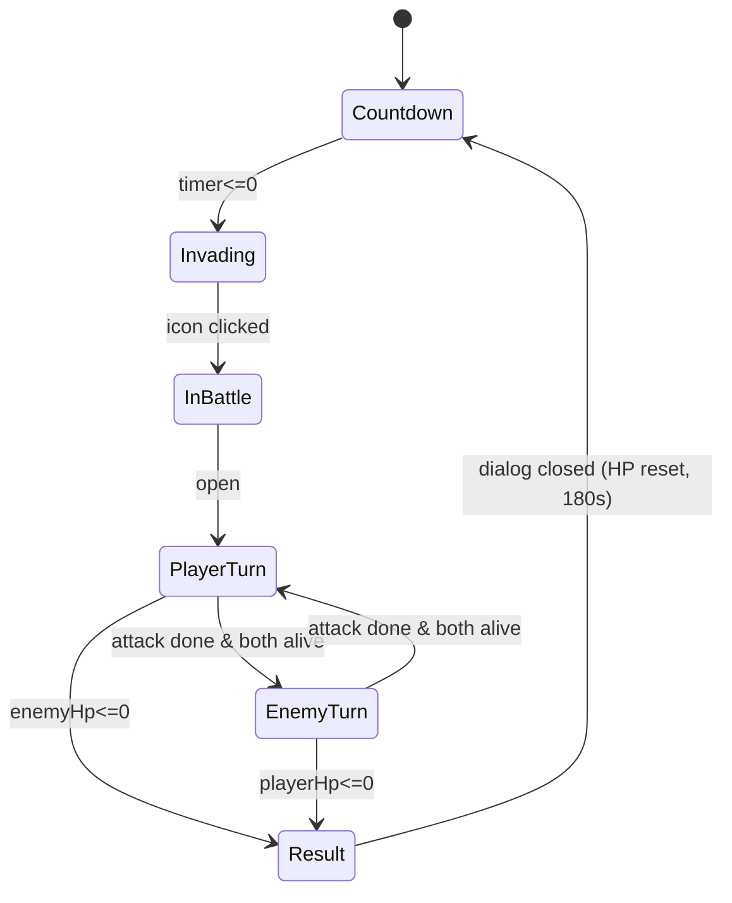

### 12.2 顶部入口 UI 规格 / Top Entry UI Spec

**中文（产品配置，v3.33）：** `InvasionEntryView.kInvasionEntryRootEnabled` 为编译期常量，**Demo 默认 `false`**。为 `false` 时不构建 `InvasionEntryRoot` 子树（含 `InvasionEntryButton`、`InvasionCountdownText`）及 `InvasionPhaseFlashOverlay`，主界面顶部不再显示入侵入口与切态红闪；`IInvasionService` 逻辑与全屏 `InvasionBattleView` 仍可存在。将常量改为 `true` 即恢复 v3.0～v3.32 的顶部入口 UI。  
**English (product flag, v3.33):** `InvasionEntryView.kInvasionEntryRootEnabled` is a compile-time const, **`false` by default in Demo**. When `false`, the build path skips the entire `InvasionEntryRoot` subtree (including `InvasionEntryButton`, `InvasionCountdownText`) and `InvasionPhaseFlashOverlay`, so the top-center invasion entry and phase-switch red flashes are absent; `IInvasionService` and the full-screen `InvasionBattleView` may still exist. Set the const to `true` to restore the pre-v3.33 top entry UI.

**中文：** 入口为主界面顶部居中的图标按钮，两态切换：  
- 倒计时态：`Resources/AirUI/RuQin_0`，按钮**不可点击**（`Button.interactable = false`）；图标正下方显示倒计时文本（fontSize 32，居中白字，`mm:ss` 或 `ss` 格式）。  
- 入侵态：`Resources/AirUI/RuQin_1`，按钮**可点击**；倒计时文本隐藏；点击后打开全屏战斗界面。  
- 入侵态特效：当入口图标由 `RuQin_0` 切到 `RuQin_1` 时立刻启动“呼吸 + 闪烁”循环特效（呼吸：在基础缩放附近做平滑放大缩小；闪烁：透明度在 1.0 与较低阈值间往返）；特效无限循环，直到图标回到 `RuQin_0` 才停止并恢复基础缩放/透明度。
- 入侵态特效参数（可配置，P0 默认值）：`breathSpeed=2.1`、`breathAmplitude=0.10`、`blinkSpeed=5.2`、`minAlpha=0.55`。实现层需支持通过构建参数覆盖默认值；若未传入配置则按默认值执行。
- 切态闪屏特效（新增，v3.11）：当入口由 `RuQin_0` 切到 `RuQin_1` 的瞬间，必须播放 **2 次**全屏红色半透明闪烁；每次闪烁持续 **20 帧**（按运行帧计数，不按秒计时），建议通过 Canvas 顶层红色 Overlay (`Image.color = RGBA(1,0,0,0.35~0.55)`) 执行，并在结束后恢复透明。
- 统一按钮联动（新增，v3.11）：`UnifiedActionButton` 在入侵态需将按钮图片由 `Resources/AirUI/JiaoShui` 切换到 `Resources/AirUI/ZhanDouKaiShi`；点击 `ZhanDouKaiShi` 的行为与点击 `InvasionEntryButton` 完全一致（同路径调用 `IInvasionService.OpenBattle()`），离开入侵态后恢复 `JiaoShui` 与原有 `ExecuteUnifiedAction` 行为。
- 实现优先级（v3.11）：P0 必做「切态双闪屏 + UnifiedActionButton 图标与点击逻辑切换」；P1 可选扩展闪屏材质、缓动曲线与音效。

**English:** The entry is a centered button at the top of the main menu, switching between two states:  
- Countdown: `Resources/AirUI/RuQin_0`, button **not interactable** (`Button.interactable = false`); a countdown text label below the icon (fontSize 32, centered white, `mm:ss` or `ss` format).  
- Invading: `Resources/AirUI/RuQin_1`, button **interactable**; countdown text hidden; tapping it opens the full-screen battle.
- Invading VFX: when the icon switches from `RuQin_0` to `RuQin_1`, start an infinite loop effect that combines breathing scale and alpha blinking; keep looping while the icon stays on `RuQin_1` and stop only when it flips back to `RuQin_0`, restoring baseline scale/alpha.
- Invading VFX tuning (configurable, P0 defaults): `breathSpeed=2.1`, `breathAmplitude=0.10`, `blinkSpeed=5.2`, `minAlpha=0.55`. Implementation should allow overriding these values via build-time parameters; if not provided, defaults apply.
- Phase-switch flash (new in v3.11): when the icon transitions from `RuQin_0` to `RuQin_1`, play **two** full-screen semi-transparent red flashes; each flash lasts **20 frames** (frame-count based, not seconds). Recommended implementation is a top-level Canvas red overlay (`Image.color = RGBA(1,0,0,0.35~0.55)`) that returns to transparent when done.
- Unified-button linkage (new in v3.11): in invading state, `UnifiedActionButton` must switch its image from `Resources/AirUI/JiaoShui` to `Resources/AirUI/ZhanDouKaiShi`; tapping `ZhanDouKaiShi` must be behavior-identical to tapping `InvasionEntryButton` (same `IInvasionService.OpenBattle()` path). When leaving invading state, restore `JiaoShui` and the original `ExecuteUnifiedAction` behavior.
- Implementation priority (v3.11): P0 must include "phase-switch double flash + UnifiedActionButton icon/click-path switch"; P1 may extend with flash material variants, easing curves, and SFX.

| 元素 / Element | RectTransform | 说明 / Notes |
|---|---|---|
| `InvasionEntryButton` | anchor `(0.5, 1) / (0.5, 1)`，size `150×150`，pos `(0, -150)` | 距顶 150px 的居中入口 / Top-center entry, 150px below top |
| `InvasionCountdownText` | anchor `(0.5, 1) / (0.5, 1)`，size `260×60`，pos `(0, -260)` | fontSize 32，居中白字 / fontSize 32, centered white |

### 12.3 全屏战斗 UI 规格 / Full-Screen Battle UI Spec

**中文：** 战斗界面采用全屏 modal 模式（与种子仓库弹窗同结构），打开时 `SetAsLastSibling()` 置顶，关闭时 `gameObject.SetActive(false)`。  
**English:** The battle UI uses a full-screen modal pattern (same shape as the seed warehouse modal); when opening, call `SetAsLastSibling()` to bring it on top; when closing, `gameObject.SetActive(false)`.

| 元素 / Element | 资源 / Asset | RectTransform | 说明 / Notes |
|---|---|---|---|
| `BattleBackground` | `Resources/AirUI/ZhanDou_1` | StretchFull | 全屏背景 / full-screen bg |
| `PlayerSlot` | `Resources/Prefabs/Air/Hero_Role_cunmin.prefab`（**v3.48+** 预制体内骨骼为 `LangRen/Role_cslangren`，路径名历史兼容） | anchor `(0.5, 0.5) / (0.5, 0.5)`，pos `(-280, -120)`，scale **`(-0.6095, 0.6095, 1)`**（`CharacterScaleBase=0.53` × **`BattleSpineDisplayScaleMultiplier=1.15`**） | 居中左 + 左右翻转 / center-left + flipped X |
| `EnemySlot` | `Resources/Pets/Monster_1_Salamander.prefab` | anchor `(0.5, 0.5) / (0.5, 0.5)`，pos `(280, -120)`，scale **`(-0.7314, 0.7314, 1)`**（`CharacterScaleBase×1.15` × **`PackVisualScaleMultiplier=1.2`** 后水平镜像，见 §9.5.1.3 / B.11.1） | 居中右 / center-right |
| `PlayerHpBar` | filled Image | anchor `(0.5, 0.5) / (0.5, 0.5)`，size `240×24`，pos **`(-280, -140)`** | **Spine 中心正下方 20px**（`PlayerHomePos.y - 20`） |
| `EnemyHpBar` | filled Image | anchor `(0.5, 0.5) / (0.5, 0.5)`，size `240×24`，pos **`(280, -140)`** | **Spine 中心正下方 20px**（`EnemyHomePos.y - 20`） |
| `ResultDialog` | **`Resources/Prefabs/Battle/InvasionBattleResultDialog.prefab`**（根挂 `InvasionBattleResultDialogView`） | anchor `(0.5, 0.5) / (0.5, 0.5)`，size `880×750`，pos `(0, 0)`，**scale `(1.4, 1.4, 1)`**；`HintText` pos `(0, -420)`；子节点 `ResultText` / `RewardList`（含 `VerticalLayoutGroup` + 行模板 `RewardRow`）/ `AutoAdvanceWinRow` / `HintText` | 胜负结果弹窗；`RewardList/RewardRow` 为行模板（`Icon` 120×120 + `Count`），运行时克隆并绑定掉落数据；菜单 **Tools/PetDemo/Generate Invasion Battle Result Dialog Prefab** 生成 / victory/defeat dialog; `RewardRow` prefab template with VLG |

**中文（v3.221）：** 战斗中所有 Spine（含主角、敌方、上场精灵、九宫格单位）在各自既有基底缩放上再统一乘以 **`BattleSpineDisplayScaleMultiplier = 1.15`**（在 `GridBattleConstants` 声明，全屏战 `CharacterScaleBase=0.53`、精灵 `PetCharacterScaleBase=0.40`、九宫格 `GridCharacterScaleBase=0.30` 均先乘该系数后再应用镜像/Fantazia 规则）。  
**English (v3.221):** All in-battle Spines get an extra **`BattleSpineDisplayScaleMultiplier = 1.15`** on top of their baseline scales before mirroring / Fantazia rules.

**中文：** 玩家主角通过设置 `localScale.x = -|baseScale|` 实现左右翻转；**敌方（Fantazia）**在战斗常量基底 `CharacterScaleBase`（默认 `0.53`）× **`BattleSpineDisplayScaleMultiplier`** 后，再乘以 **`PackVisualScaleMultiplier`（默认 `1.2`，即放大 20%）**，并取 **`localScale.x = -|…|`** 做水平镜像（与 §9.5.1 / B.11 同约定），使左右站位、体量与美术默认朝向一致。血条采用 `Image (filled, Horizontal)` 表达：背景灰条（`#3F3F3F`，alpha 200）+ 前景红条（`#E04848`，alpha 255）+ 居中数字文本（`{currentHp}/{maxHp}`，fontSize 22）。前景 Fill 以左端为固定端（`fillOrigin=Left`），`fillAmount = clamp(currentHp / maxHp)`，即血量下降时从右向左缩短。  
**English:** The player flips by setting `localScale.x = -|baseScale|`; **the Fantazia enemy** first multiplies the battle baseline `CharacterScale` (default `0.53`) by **`PackVisualScaleMultiplier` (default `1.2`, i.e. +20% scale)**, then applies **`localScale.x = -|CharacterScale × PackVisualScaleMultiplier|`** for horizontal mirroring (same convention as §9.5.1 / B.11) so placement, size, and facing match product rules. HP bars use `Image (filled, Horizontal)` with a gray background (`#3F3F3F`, alpha 200), a red foreground (`#E04848`, alpha 255), and a centered numeric label (`{currentHp}/{maxHp}`, fontSize 22). The foreground Fill keeps the left edge fixed (`fillOrigin=Left`) with `fillAmount = clamp(currentHp / maxHp)`, so HP loss shrinks from right to left.

**中文：** 兼容性要求：用于血条背景与 Fill 的 `Image` 必须绑定有效 `sprite`。入侵战斗 P0 实现固定采用运行时 `Texture2D.whiteTexture` 生成的 `Sprite` 作为稳定兜底，禁止在该路径中调用 `GetBuiltinResource<Sprite>("UI/Skin/*.psd")` 进行探测，以避免不同 Unity 版本在资源缺失时刷出 `Failed to find UI/Skin/...` 错误。`HpText` 必须绑定可用字体（`Arial.ttf` 或 `LegacyRuntime.ttf` fallback），避免不同 Unity 版本出现不可见文本。  
**English:** Compatibility requirement: both HP background and Fill `Image` must have a valid `sprite`. For invasion battle P0, implementation shall consistently use a runtime sprite created from `Texture2D.whiteTexture` as the stable fallback, and must not probe `GetBuiltinResource<Sprite>("UI/Skin/*.psd")` in this path, to avoid repeated `Failed to find UI/Skin/...` errors across Unity versions when built-in assets are absent. `HpText` must use an available font (`Arial.ttf` with `LegacyRuntime.ttf` fallback) to avoid invisible text across Unity versions.

### 12.4 回合制规则 / Turn-Based Rules

**中文（适用范围，v3.220）：** 本节规则**仅适用于** §12.3 **全屏入侵战**（单主角 vs 单敌人、`BattleSession` 简化模型）。**`InvasionBattleModal_2` 嵌入战斗**（含原 `evt_fight_small_1` / `evt_fight_boss`）一律以 **§12.14** 九宫格全队战为准。  
**English (scope, v3.220):** This section applies **only** to §12.3 **fullscreen invasion**. Modal_2 embedded fights (including former 1v1 events) use **§12.14**.

**中文：** 出手顺序固定为「我方先 → 敌方 → 我方 → ...」；每回合执行流程升级为：  
1. 攻击者用 0.25 秒线性插值移动到画面中心 `(0, -120)`；  
2. 到达中心后播放一次攻击动作 `attack_1`（`loop=false`）；  
3. 在攻击动作命中阶段（本版约定为动作结束瞬间）结算伤害 `defender.currentHp -= attacker.attack`（无视防御，伤害下限 0），并立刻触发 `OnBattleHpChanged` 刷新血条；  
4. 攻击者用 0.25 秒线性插值移回原位；  
5. 若对方 `currentHp <= 0`，进入「Result」阶段；否则切换到对方回合。  

**English:** Turn order is fixed as "Player first → Enemy → Player → ..."; each turn is upgraded to:  
1. The attacker linearly moves to screen center `(0, -120)` over 0.25s;  
2. After reaching center, play attack animation `attack_1` once (`loop=false`);  
3. Resolve damage at the attack hit stage (v1 rule: end of attack animation): `defender.currentHp -= attacker.attack` (defense ignored, clamped at 0), and immediately fire `OnBattleHpChanged` to refresh HP bars;  
4. The attacker linearly moves back over 0.25s;  
5. If the defender's `currentHp <= 0`, transition to the "Result" stage; otherwise switch turns.

**中文：** 「Result」阶段先播放胜负动作，再显示弹窗：  
1) 若玩家胜利：**同一时刻**触发我方 `exclusive_2`（一次，`loop=false`）与敌方 `death`（一次，`loop=false`）——即我方胜利动画**起始帧**与敌方死亡动画**起始帧**对齐；  
2) **两条动画均播放结束后**再弹出 `ResultDialog`（"胜利！" 或 "失败..."）；  
3) 玩家点击任意区域关闭后：双方 `currentHp` 重置为 `maxHp`，关闭战斗 modal，图标切回 `RuQin_0`，倒计时重置为 180 秒并继续递减。  
**English:** In the "Result" stage, play win/lose animations before showing the dialog:  
1) On player win: start player's `exclusive_2` once (`loop=false`) and enemy's `death` once (`loop=false`) **on the same frame**—the win animation **start** aligns with the death animation **start**;  
2) Show `ResultDialog` ("胜利！" or "失败...") only after **both** animations finish;  
3) On click-to-close: reset both `currentHp` to `maxHp`, close battle modal, switch icon back to `RuQin_0`, and restart the 180s countdown.

**中文：** **P1 占位**：当前 `damage = attacker.attack`，与 §4.2 SPEC 公式 `damage = max(1, atk - def)` 相互独立；后续平衡或扩展（如防御列、暴击）须先更新 §12.4。  
**English:** **P1 placeholder:** current `damage = attacker.attack`, independent of the §4.2 SPEC formula `damage = max(1, atk - def)`; future balance or extension (defense column, crit, etc.) must update §12.4 first.

**中文：** 实现优先级：P0 先完成「攻击动作串联 + 命中扣血同步 + 胜负动作先于弹窗」，P1 再扩展命中帧精确配置、受击特效与平滑扣血。  
**English:** Implementation priority: P0 first delivers "attack animation chaining + hit-time HP sync + result animations before dialog"; P1 extends configurable hit frames, hit effects, and smooth HP transitions.

### 12.5 数据结构 / Data Structures

**中文：** 在 §5 既有数据结构基础上新增以下纯数据类型（不引入 Unity 依赖）：  
**English:** Add the following pure data types on top of §5 (no Unity dependencies):

```text
// InvasionUnitConfig — 入侵战斗中单位的静态配置（来自附录 B.9）
// InvasionUnitConfig — static unit config for invasion battle (from Appendix B.9)
struct InvasionUnitConfig {
  string unitId;        // 唯一 id（如 "player" / "boss_langren"）
                        // unique id (e.g. "player" / "boss_langren")
  string displayName;   // 显示名 / display name
  int    attack;        // 单次攻击造成的固定伤害 / fixed damage per attack
  int    maxHp;         // 总血量上限 / max HP
}

// InvasionPhase — 入口图标 / 全局阶段
// InvasionPhase — entry-icon / global phase
enum InvasionPhase { Countdown, Invading, InBattle }

// BattleTurn — 战斗内当前出手方
// BattleTurn — whose turn it is in battle
enum BattleTurn { Player, Enemy, Result }

// BattleSession — 战斗会话运行时状态
// BattleSession — runtime state of the battle session
struct BattleSession {
  int        playerHp;        // 当前玩家 HP / current player HP
  int        playerMaxHp;     // 玩家 HP 上限 / player max HP
  int        playerAttack;    // 玩家单次伤害 / player damage per attack
  int        enemyHp;
  int        enemyMaxHp;
  int        enemyAttack;
  BattleTurn turn;            // Player / Enemy / Result
  bool       playerWon;       // Result 阶段记录胜负 / records outcome in Result
}

// BattleAnimationSpec — 战斗表现参数（可在 View 内以常量实现）
// BattleAnimationSpec — battle presentation parameters (can be constants in View)
struct BattleAnimationSpec {
  float moveToCenterSeconds;      // 移动到中心耗时 / move-to-center duration
  float moveBackSeconds;          // 回位耗时 / return duration
  string attackAnimName;          // 攻击动作名（默认 attack_1）/ attack animation name (default attack_1)
  string playerWinAnimName;       // 玩家胜利动作（默认 exclusive_2）/ player win animation (default exclusive_2)
  string enemyDeathAnimName;      // 敌方死亡动作（默认 death）/ enemy death animation (default death)
  float animationWaitTimeout;     // 等待动画完成的超时保护 / timeout while waiting animation completion
}
```

**中文：** 默认值（fallback，与 §B.9 等价）：`player atk=12 hp=80`，`boss_langren atk=8 hp=60`。`BattleSession` 由 `InvasionService.OpenBattle()` 在打开战斗时创建，`CloseBattle()` 时清空。  
**English:** Defaults (fallback, equivalent to §B.9): `player atk=12 hp=80`, `boss_langren atk=8 hp=60`. `BattleSession` is created by `InvasionService.OpenBattle()` and cleared by `CloseBattle()`.

**中文：** `BattleAnimationSpec` 默认值：`moveToCenterSeconds=0.25`，`moveBackSeconds=0.25`，`attackAnimName=attack_1`，`playerWinAnimName=exclusive_2`，`enemyDeathAnimName=death`，`animationWaitTimeout=2.5`。  
**English:** `BattleAnimationSpec` defaults: `moveToCenterSeconds=0.25`, `moveBackSeconds=0.25`, `attackAnimName=attack_1`, `playerWinAnimName=exclusive_2`, `enemyDeathAnimName=death`, `animationWaitTimeout=2.5`.

**中文（v3.211 增补，v3.212 修订，§12.14 多单位战）：** 在 `BattleSession` 之外新增以下纯数据类型（不引入 Unity 依赖）；完整规则见 §12.14。  
**English (v3.211 addendum, v3.212 revised, §12.14 multi-unit battle):** The following pure data types are added alongside `BattleSession` (no Unity dependencies); full rules in §12.14.

```text
// RunPartyRoster — 局内队伍名册（InvasionBattleModal_2 一局 Show→Hide 内持久，§12.14.1.1）
// RunPartyRoster — in-run party roster (persists for one modal session, §12.14.1.1)
class RunPartyRoster {
  List<RunAllyEntry> members;   // 顺序：Role 首位，其余按拉手顺序 / Role first, then handshake order
}

// RunAllyEntry — 局内一名我方成员
// RunAllyEntry — one ally member for the run
class RunAllyEntry {
  string       rosterId;        // 局内唯一 id / unique id this run
  BattleUnitKind kind;          // Role | FollowerNpc
  string       sourceNpcId;     // FollowerNpc 时 = GuildNpcMarker.NpcId；Role 为空
  RoleStats    stats;           // 独立属性副本（含 currentHp / maxHp）/ independent stat clone
  Dictionary<string,int> runEnhanceBonuses;  // 六宫本局累加（每名独立）/ per-member hex bonuses
  List<string> acquiredSkillIds;             // 每名独立技能列表（奇遇 pick3）/ per-member skills
  string       displayName;
  string       skeletonPrefab;
}

// BattleSide — 阵营 / side
enum BattleSide { Ally, Enemy }

// BattleGridPos — 九宫格坐标（row/col 均 ∈ {1,2,3}）/ grid coordinates
struct BattleGridPos {
  int row;   // 1=上 / top, 2=中 / middle, 3=下 / bottom
  int col;   // 1=靠战场中线前排 / front (nearest center line), 3=最外侧 / back
}

// BattleUnitKind — 我方单位种类 / ally unit kind
enum BattleUnitKind { Role, FollowerNpc }

// BattleUnitRuntime — 单场战斗中的一个参战单位运行时快照
// BattleUnitRuntime — runtime snapshot of one combatant in a battle
class BattleUnitRuntime {
  string       instanceId;       // 本场唯一 id / unique id this battle
  string       rosterId;         // 对应 RunAllyEntry.rosterId（敌方为空）/ links to roster entry
  BattleSide   side;
  BattleUnitKind kind;           // 仅 Ally 侧有意义 / meaningful on Ally side only
  string       sourceNpcId;      // kind=FollowerNpc 时填 GuildNpcMarker.NpcId；Role 为空
  BattleGridPos gridPos;
  RoleStats    stats;            // 开战快照，来自 RunAllyEntry.stats / snapshot from roster entry
  bool         isBattleDead;     // 本场是否暂死（currentHp<=0 后 true）/ battle-death flag
  string       displayName;
  string       skeletonPrefab;   // 外观 Resources 路径；Role 用主角骨骼 / appearance prefab path
}

// GridBattleSession — 多单位阵型战运行时状态（§12.14）
// GridBattleSession — multi-unit formation battle runtime state (§12.14)
class GridBattleSession {
  int roundIndex;                          // 当前大回合（从 1 起）/ current major round
  List<BattleUnitRuntime> allies;
  List<BattleUnitRuntime> enemies;
  List<BattleUnitRuntime> turnQueue;       // 本大回合已排序的行动队列（仅存活单位）/ living units only
  int turnCursor;                          // turnQueue 游标 / cursor into turnQueue
  int battleSeed;                          // 随机种子（同速乱序、同优先级目标、站位）/ RNG seed
  bool playerWon;
  bool finished;
  string pendingEventId;                   // 触发本场的事件 id（如 evt_fight_small_2）
}
```

### 12.6 接口与事件 / APIs and Events

**中文：** 新增 `IInvasionService` 接口（与 `IPlantingService` 同级，独立服务），核心 API 与事件：  
**English:** Adds an `IInvasionService` interface (peer to `IPlantingService`, an independent service); core APIs and events:

```text
interface IInvasionService {
  // 状态查询 / state queries
  InvasionPhase GetPhase();
  float GetCountdownRemaining();
  BattleSession GetBattleSession();      // null when not in battle

  // 状态迁移 / state transitions
  void StartCountdown(float seconds);    // 进入 Countdown，设置 timer
                                         // enter Countdown and set timer
  void OpenBattle();                     // 仅 Invading 阶段可调用；成功时先 TryConsumeStamina(10) 再进入 InBattle（§12.9）
                                         // only from Invading; on success debits stamina then enters InBattle (§12.9)
  bool TryOpenBattleFromAutoChain();     // v3.43：胜利 3s 倒计时结束后链式开战；Countdown→Invading→OpenBattle()；失败返回 false（§12.9）
                                         // v3.43: chain start after victory countdown; returns false on denied start (§12.9)
  void OpenBattleFromWarehouseHub();     // §9.8.13.5：仓库「开始」；若当前 Countdown 则先切入 Invading 再 OpenBattle()；已在 InBattle 则忽略并警告 / warehouse Start: if Countdown, transition to Invading then OpenBattle(); no-op with warning if already InBattle
  void CloseBattle(bool playerWon);      // 关闭战斗：HP 复位 + 图标回 Countdown
                                         // close battle: reset HP and icon back to Countdown
  void Tick(float deltaSeconds);         // 由 MonoBehaviour.Update 驱动倒计时
                                         // driven by MonoBehaviour.Update for the countdown

  // 事件 / events
  event Action<InvasionPhase> OnPhaseChanged;            // 阶段切换 / phase changes
  event Action<float>         OnCountdownTick;           // 每 Tick 推送剩余秒数 / pushes remaining seconds each tick
  event Action<BattleSession> OnBattleHpChanged;         // 战斗中 HP 变化 / HP changes in battle
  event Action<bool>          OnBattleEnded;             // 战斗结束（参数：玩家是否胜利）
                                                         // battle ended (arg: whether the player won)
}
```

**中文：** 战斗回合循环由 `InvasionBattleView` 通过协程驱动；每次伤害结算后调用 `OnBattleHpChanged` 通知 UI 刷新血条；当一方 HP 归 0 时调用 `OnBattleEnded` 并切换到 `Result` 阶段，等待玩家点击关闭弹窗后调用 `CloseBattle(playerWon)`，由 `InvasionService` 自动重启 180 秒倒计时。  
**English:** The battle turn loop is driven by `InvasionBattleView` via a coroutine; after each damage resolution `OnBattleHpChanged` is fired so the UI refreshes the HP bars; when one side's HP reaches 0, `OnBattleEnded` is fired and the phase transitions to `Result`, waiting for the player to close the dialog before calling `CloseBattle(playerWon)`, which automatically restarts the 180s countdown via `InvasionService`.

**中文：** 事件时序契约（P0）：`OnBattleHpChanged` 必须在 `attack_1` 命中结算阶段触发，不允许延迟到回位后；Result 弹窗显示前必须完成 `exclusive_2` 与 `death` 的播放（二者同时开播，以**较晚结束**者为等待上限）。  
**English:** Event timing contract (P0): `OnBattleHpChanged` must fire at the `attack_1` hit-resolution stage, not after return movement; result dialog must wait until both `exclusive_2` and `death` finish (they start together; wait until the **later** of the two completes).

**中文：** 技术实现建议：若目标动画不存在或 Skeleton 不可用，允许降级到待机动画并继续战斗流程（只记录 warning，不中断战斗）；等待动画结束需设置超时保护，避免卡死协程。  
**English:** Technical implementation advice: if a target animation is missing or Skeleton is unavailable, fall back to an idle animation and continue flow (warning only, no battle interruption); waiting for animation completion must include a timeout guard to avoid coroutine stalls.

### 12.7 资源清单 / Asset Manifest

**中文：** 本系统战斗 UI 所需 Spine 预制体由 `Resources.Load` 装载：玩家为 §9.5 既有预制体；敌方为 **`Resources/Pets/Monster_1_Salamander.prefab`**（Fantazia 包副本，与 `Resources/Pets` 下其它怪物同约定）。`Boss_langren.prefab` 仍保留于工程，供场景或其它用途复用。  
**English:** Battle UI Spine prefabs load via `Resources.Load`: the player uses the existing §9.5 prefab; the enemy uses **`Resources/Pets/Monster_1_Salamander.prefab`** (a Fantazia copy under `Resources/Pets`, same convention as other pets there). `Boss_langren.prefab` remains in the project for scenes or other reuse.

| 资源 / Asset | 路径 / Path | 来源 / Source |
|---|---|---|
| 倒计时图标 / Countdown icon | `Resources/AirUI/RuQin_0` | 既有 / existing |
| 入侵图标 / Invading icon | `Resources/AirUI/RuQin_1` | 既有 / existing |
| 战斗背景 / Battle background | `Resources/AirUI/ZhanDou_1` | 既有 / existing |
| 玩家预制体 / Player prefab | `Resources/Prefabs/Air/Hero_Role_cunmin.prefab`（**v3.48+** 内嵌 `Role_cslangren`） | 既有路径，复用 §9.5 / existing path, reused from §9.5 |
| 敌方预制体 / Enemy prefab | `Resources/Pets/Monster_1_Salamander.prefab` | Fantazia 源预制体副本；`SkeletonAnimation` 与 `InvasionBattleView` 的 `SkeletonGraphic` 探针路径兼容；攻击/死亡动画名在实现层对 `attack_1`/`death` 与 `Attack`/`Dead` 做回退匹配；**敌方槽根 scale 为 `CharacterScale×1.2` 后 X 取负（放大 20% + 水平镜像）** |
| 单位配置表 / Units config | `Resources/Configs/Battle/invasion_units.csv` | **新建 / NEW**，详见 §B.9 |
| 结算弹窗预制体 / Result dialog prefab | `Resources/Prefabs/Battle/InvasionBattleResultDialog.prefab`（**v3.53+**） | 编辑器 **Tools/PetDemo/Generate Invasion Battle Result Dialog Prefab** 生成；根挂 `InvasionBattleResultDialogView`；**须纳入版本库**；编辑器 `InitializeOnLoad` 在缺失或导入失败时自动重新生成 |

**中文：** 玩家与敌方预制体在战斗 UI 内通过 `SkeletonGraphic` 二次构建（与 §9.5 `MainRoleCunminPresenter` 同方法）：先实例化预制体探针读取 `SkeletonDataAsset`，再用 `Spine/SkeletonGraphic` Shader 在 ScreenSpaceOverlay Canvas 上构建可见 Spine UI 节点。  
**English:** Both prefabs are rebuilt as `SkeletonGraphic` inside the battle UI (same approach as the §9.5 `MainRoleCunminPresenter`): first instantiate the prefab probe to read its `SkeletonDataAsset`, then construct the visible Spine UI node on a ScreenSpaceOverlay canvas using the `Spine/SkeletonGraphic` shader.

### 12.8 战斗胜利掉落 / Victory Rewards

**中文：** 自 v3.4 起，怪物入侵战斗在「胜利」时可发放掉落奖励；失败不发放。奖励由 CSV `Resources/Configs/Battle/invasion_victory_rewards.csv` 配置，支持三类：`Seed`（种子）、`Fertilizer`（肥料）与 `SeedPack`（种子包）。  
**English:** Since v3.4, Monster Invasion battle grants drops on victory; defeat grants nothing. Rewards are configured by CSV `Resources/Configs/Battle/invasion_victory_rewards.csv`, supporting three kinds: `Seed`, `Fertilizer`, and `SeedPack`.

**中文：** 结算时序（在 `CloseBattle(playerWon)` 内）：  
1) 若 `playerWon == false`：跳过掉落发放；  
2) 若 `playerWon == true`：遍历掉落表逐条发放；`kind=Seed` 调用 `IPlantingService.GrantSeed(plantConfigId, count)`，`kind=Fertilizer` 调用 `IPlantingService.GrantFertilizer(fertilizerId, count)`，`kind=SeedPack` 调用 `IPlantingService.GrantSeedPack(quality, count)`（`quality ∈ {Common,Rare,Epic,Legendary}`）；  
3) 掉落发放后再执行原有战斗收尾（关闭战斗 UI、回到 `RuQin_0`、重启 180s 倒计时）。  
**English:** Settlement order (inside `CloseBattle(playerWon)`):  
1) if `playerWon == false`: skip reward grants;  
2) if `playerWon == true`: iterate reward rows and grant each one; `kind=Seed` calls `IPlantingService.GrantSeed(plantConfigId, count)`, and `kind=Fertilizer` calls `IPlantingService.GrantFertilizer(fertilizerId, count)`;  
3) after grants, execute the original battle teardown (close battle UI, return to `RuQin_0`, restart 180s countdown).

**中文：** 容错规则：掉落行非法（`count<=0`、`Seed` 对应 `plantConfigId` 不存在、`Fertilizer` 对应 `fertilizerId` 不存在、`SeedPack` 对应 `quality` 非法）时仅 `Debug.LogWarning` 并跳过该行，不影响其余奖励与战斗收尾。  
**English:** Fault tolerance: malformed reward rows (`count<=0`, missing `plantConfigId` for `Seed`, missing `fertilizerId` for `Fertilizer`, invalid `quality` for `SeedPack`) are logged via `Debug.LogWarning` and skipped, without blocking other rewards or battle teardown.

**中文：** **胜利弹窗展示约定（v3.16，布局 v3.54）**：`ResultDialog` 在胜利时除标题「胜利！」外，需以**图标列表**展示奖励（每条包含 `Icon + Count`）；失败时不显示奖励列表，仅显示「失败...」。图标映射约定：`Seed` 使用该 `plantConfigId` 对应 `PlantConfig.appearanceSpriteIds[0]`；`Fertilizer` 使用 `Resources/AirUI/ShiFei-1`；`SeedPack` 使用 `Resources/AirUI/item_1340000`，并可按 `quality` 着色（`Common/Rare/Epic/Legendary`）。**排版（v3.54）**：`RewardList` 挂 `VerticalLayoutGroup`（行间距 8）；子节点 `RewardRow` 为**预制体行模板**（默认 `inactive` + `LayoutElement.ignoreLayout=true`），挂 `InvasionBattleRewardRowView`；行内 `HorizontalLayoutGroup` + `Icon`（`LayoutElement` 120×120）+ `Count`（`flexibleWidth=1`，左对齐、纵向居中）；运行时 `Instantiate(RewardRow)` 后清除 `ignoreLayout` 并写入图标/数量。  
**English:** **Victory dialog display contract (v3.16, layout v3.54):** on victory, show an **icon list** (`Icon + Count` per row); on defeat, hide the list. Icon mapping unchanged. **Layout (v3.54):** `RewardList` uses `VerticalLayoutGroup` (spacing 8); child `RewardRow` is an **inactive prefab row template** with `InvasionBattleRewardRowView`, `HorizontalLayoutGroup`, fixed 120×120 `Icon`, and flexible `Count`; clones clear `ignoreLayout` and bind reward data at runtime.

### 12.9 开战体力与「自动推进关卡」连战（v3.43）/ Battle stamina cost & auto-advance chain (v3.43)

**中文：** **常量**：每场怪物入侵战斗在 **`InvasionService.OpenBattle()` 成功进入 `InBattle` 之前** 消耗 **`BattleStaminaCostPerEncounter = 10`** 点体力（`IPlantingService.TryConsumeStamina(10)`）。扣费失败则 **不** 创建 `BattleSession`、**不** 进入 `InBattle`。

**English:** **Constant:** each Monster Invasion encounter consumes **`BattleStaminaCostPerEncounter = 10`** stamina **before** `InvasionService.OpenBattle()` successfully enters `InBattle`, via `IPlantingService.TryConsumeStamina(10)`. On failure, **no** `BattleSession` is created and **no** transition to `InBattle`.

**中文：** **体力不足时的阶段与导航**：若当前因 §9.8.13 仓库「开始」等路径已处于 `Invading` 但扣费失败，必须 **`SetPhase(Countdown)`** 回退，避免卡在「入侵态却无战斗」。同时强制将底部导航切至主线层：调用 **`BottomNavBarView.SetOpenKey("ZhuXian")`**（与 `MainStoryLineScreenView.ZhuXianNavKey` 一致）。

**English:** **Phase + navigation on insufficient stamina:** if the flow already reached `Invading` (e.g. warehouse `Start`) but stamina consumption fails, **`SetPhase(Countdown)`** is required to avoid "invading without battle". Also force the bottom nav to the main-story screen: **`BottomNavBarView.SetOpenKey("ZhuXian")`** (same string as `MainStoryLineScreenView.ZhuXianNavKey`).

**中文：** **胜利结算 UI**：`ResultDialog` 内在胜利时增加 **`Toggle` + 文案「自动推进关卡」**（与奖励区、`HintText` 并列，射线命中优先于整面板关闭按钮，避免误触关闭）。勾选且保持为真时，在 **弹窗下方**（`modal` 内、`ResultDialog` 之外的兄弟节点或等效布局）显示 **3 秒倒计时** 文案；倒计时归零仍勾选则 **无需点击**：顺序为 **`CloseBattle(true)`**（含 §12.8 掉落）→ **`TryOpenBattleFromAutoChain()`**（内部：`Countdown`→`Invading`→再次 `OpenBattle()` 并再次扣 10 体力）。倒计时期间若 **取消勾选**，则退回「仅点击关闭」路径，**不**自动开下一场。

**English:** **Victory settlement UI:** on win, add **`Toggle` + label "自动推进关卡"** inside `ResultDialog` (alongside rewards and `HintText`; raycast should win over the full-panel close button). When checked and staying true, show a **3s countdown** label **below** the dialog (sibling under the battle modal). When the countdown reaches zero while still checked, **no tap is required**: sequence **`CloseBattle(true)`** (includes §12.8 drops) → **`TryOpenBattleFromAutoChain()`** (internally: `Countdown`→`Invading`→`OpenBattle()` with another 10 stamina debit). If the player **unchecks during the countdown**, fall back to **tap-to-close only** and **do not** auto-start the next encounter.

**中文：** **失败**：展示失败弹窗时 **清除「自动推进关卡」意图**（与「失败则取消再次触发战斗」一致）；失败分支 **无** 倒计时。

**English:** **Defeat:** clear the auto-advance intent when showing defeat (no auto re-queue); **no** countdown on defeat.

**中文：** **战斗中底部 Toggle**：仅当本场战斗由 **自动连战链** 进入时（`InvasionService` 在成功 `OpenBattle` 后置 `EnteredBattleViaAutoChain == true`，手动首开为 `false`），在战斗全屏 `modal` **底部** 显示与胜利弹窗 **同一语义、同一运行时 bool** 的 `Toggle`（同文案）。战斗中取消勾选 ⇒ 本场胜利结算 **不** 出现 3 秒自动开战倒计时（仅点击关闭）。

**English:** **In-battle bottom toggle:** only when the current encounter was entered via the **auto-chain** (`EnteredBattleViaAutoChain == true` after a successful `OpenBattle`; `false` for the first manual start), render the same **Toggle + label** at the **bottom** of the battle modal, bound to the **same runtime bool** as the victory dialog. Unchecking during battle ⇒ after this encounter's victory, **no** 3s auto-start countdown (tap-to-close only).

**中文：** **链式第二场体力不足**：第二次 `TryConsumeStamina(10)` 失败时，与「体力不足开战」相同：**回退 `Countdown`、切主线、清自动意图**。

**English:** **Second encounter insufficient stamina:** same handling as the first denied start: **`Countdown` + main-story nav + clear auto intent**.

**中文：** **实现注记**：`TryOpenBattleFromAutoChain() → bool` 由 `InvasionBattleView` 在倒计时结束后调用；返回 `false` 表示未进入战斗（体力或服务为空），UI 应清掉自动推进勾选状态。`AirMainMenuRuntimeBuilder` 在构建底栏后将 `BottomNavBarView` 引用注入 `InvasionService`，用于失败导航。

**English:** **Implementation note:** `TryOpenBattleFromAutoChain() → bool` is invoked by `InvasionBattleView` after the countdown; `false` means battle did not start (stamina or missing service); UI must clear the auto-advance toggle state. `AirMainMenuRuntimeBuilder` injects `BottomNavBarView` into `InvasionService` for denied-start navigation.

### 12.10 战斗结算后「主角升级」弹窗 / Post-Battle "Protagonist Level-Up" Dialog

**中文：** 玩家在入侵战斗 **`ResultDialog`** 内点击 **`HintText`**（或等效关闭路径）关闭结算并 **`CloseBattle`** 回到主线后（战斗全屏 `modal` 已隐藏），在主 Canvas 顶层弹出 **「主角升级」** 演示弹窗。**自动推进关卡** 倒计时链式开战路径 **不** 弹出本窗（仍直接 `CloseBattle` + `TryOpenBattleFromAutoChain`）。

**English:** After the player closes the invasion **`ResultDialog`** via **`HintText`** (or equivalent close path) and **`CloseBattle`** returns to the main line (battle fullscreen `modal` hidden), show a **"Protagonist Level-Up"** demo dialog on top of the main Canvas. The **auto-advance** countdown chain path **must not** show this dialog (it keeps `CloseBattle` + `TryOpenBattleFromAutoChain`).

| 元素 / Element | 资源 / Asset | RectTransform | 说明 / Notes |
|---|---|---|---|
| `ProtagonistLevelUpModal` | — | StretchFull（主 Canvas 子节点，默认 `inactive`） | 半透明遮罩 + 居中面板；`SetAsLastSibling()` 后显示 |
| `Panel` | — | anchor `(0.5, 0.5)`，**size `1080×1920`** | 弹窗容器 |
| `ButtonRow` | — | anchor 底边水平拉满，**`offsetMin.y = 478`、`offsetMax.y = 578`**（高度 `100`） | 底部操作行容器；勿用 `anchoredPosition.y`（会被 offset 覆盖） |
| `HeroImage` | `Resources/AirUI/ShengJi_1` | anchor **`(0.5, 0.5)`**，**`anchoredPosition = (0, 0)`**，**`sizeDelta = 1080×1920`**（与 `Panel` 同尺寸）；勿用底边拉伸锚点 | `Image.preserveAspect = true`，精灵在矩形内**居中**缩放 |
| `LaterButton` | — | `ButtonRow` 内 anchor `(0.5, 0.5)`，**`PosX = -126`**、**`PosY = -117`**；无可见 `Image`/文字；透明 `Image` 承接点击 | → `Hide()` |
| `GoButton` | — | `ButtonRow` 内 anchor `(0.5, 0.5)`，**`PosX = 149`**、**`PosY = -120`**；无可见 `Image`/文字；透明 `Image` 承接点击 | → `Hide()` + 打开角色成长 **`Page_TianFu`** |

**中文：** **「前往」导航**：`NavigateToTianFuPage` 在调用 `SetOpenKey("JueSe")` **之前**写入 `pendingTabIndexWhenShowingJueSe = 2`，使 `ApplyMainBottomNavKey` 首次显示层时直接打开 **`Page_TianFu`**（而非常规默认 `Page_ShuXing`）；`RoleGrowthTabBarView.Start` 若 `OpenTabIndex >= 0` 则保留该索引，避免延迟 `Start` 覆盖。页签 key `TianFu`。

**English:** **"Go" navigation:** `NavigateToTianFuPage` sets `pendingTabIndexWhenShowingJueSe = 2` **before** `SetOpenKey("JueSe")` so the first `ApplyMainBottomNavKey` opens **`Page_TianFu`** instead of the default `Page_ShuXing`; `RoleGrowthTabBarView.Start` keeps a pre-set `OpenTabIndex >= 0` so deferred `Start` does not overwrite it. Tab key `TianFu`.

**中文：** 实现：`ProtagonistLevelUpDialogView.BuildInto` 于 `AirMainMenuRuntimeBuilder.BuildBottomNavBar` 内构建；`InvasionBattleView.ShowResultDialog` 在手动关闭且非自动连战链时调用 `ProtagonistLevelUpDialogView.RequestShowAfterBattleClose()`。

**English:** Implementation: `ProtagonistLevelUpDialogView.BuildInto` in `AirMainMenuRuntimeBuilder.BuildBottomNavBar`; `InvasionBattleView.ShowResultDialog` calls `ProtagonistLevelUpDialogView.RequestShowAfterBattleClose()` on manual close when not in the auto-chain path.

---

### 12.11 入侵战斗 2.0 界面 / InvasionBattleModal_2 (v3.167)

**中文：** 自 v3.167 起新增一套**独立的战斗流程界面与玩法体系** `InvasionBattleModal_2`，与既有 §12.3 `InvasionBattleModal`（1.0，回合制）并列、互不影响（后者本次不修改）。本界面**采用预制体的方式制作**：`Resources/Prefabs/Battle/InvasionBattleModal_2.prefab`，由编辑器菜单 **`Tools/PetDemo/Generate Invasion Battle Modal 2 Prefab`** 生成并纳入版本库；根节点挂 `InvasionBattleModal2View`。  
**English:** Since v3.167, a **new, independent battle flow screen and gameplay system** `InvasionBattleModal_2` is added, coexisting with §12.3 `InvasionBattleModal` (1.0, turn-based) without interference (the latter is unchanged this release). This screen is **built as a prefab**: `Resources/Prefabs/Battle/InvasionBattleModal_2.prefab`, produced by the editor menu **`Tools/PetDemo/Generate Invasion Battle Modal 2 Prefab`** and committed; the root carries `InvasionBattleModal2View`.

#### 12.11.1 打开方式与层级 / Open Path and Layering

**中文：** 打开入口为主线界面 §9.8.8 的 **`GoButton`**：点击后不再打开 `LevelSelectScreenPanelView`（§9.8.8.6 该层**暂时停用**，见 §9.8.8 修订），改为 **`InvasionBattleModal2View.GetOrCreate(canvasRect).Show()`** 直接打开本界面，**不经过饿肚子提示框 / 体力门**。界面为全屏 `modal`（主 Canvas 直接子节点，1080×1920 全屏拉伸），`Show()` 时 `SetAsLastSibling()` 置顶、`SetActive(true)`；`GetOrCreate` 优先 `Resources.Load` 预制体、缺失时回退运行时代码构建（与 §9.8.8.6 `LevelSelectScreenPanelView` 同范式）。右上角 **`CloseButton`** 关闭界面（`Hide()` → `SetActive(false)`），返回主线层。  
**English:** The entry is the main-story §9.8.8 **`GoButton`**: tapping it no longer opens `LevelSelectScreenPanelView` (that layer is **temporarily disabled**, see the §9.8.8 revision), and instead calls **`InvasionBattleModal2View.GetOrCreate(canvasRect).Show()`** directly, **bypassing the hungry dialog / stamina gate**. The screen is a fullscreen `modal` (direct child of the main Canvas, 1080×1920 stretch-full); `Show()` calls `SetAsLastSibling()` + `SetActive(true)`; `GetOrCreate` prefers `Resources.Load` prefab and falls back to runtime code build when missing (same pattern as §9.8.8.6 `LevelSelectScreenPanelView`). The top-right **`CloseButton`** hides the screen (`Hide()` → `SetActive(false)`) and returns to the main-story layer.

#### 12.11.2 三段界面结构 / Three-Part Layout

**中文：** 界面分**上、中、下**三个部分，三段共用同一张背景图 **`AirUI/ZhanDou_0`**（全屏 `Image`，`preserveAspect = false` 铺满；缺图深色回退 + `LogWarning`）。  
**English:** The screen has **top / middle / bottom** parts sharing one background sprite **`AirUI/ZhanDou_0`** (fullscreen `Image`, `preserveAspect = false`; dark fallback + `LogWarning` when missing).

| 区域 / Part | 节点 / Node | RectTransform（1080×1920 基准） | 内容 / Content |
|---|---|---|---|
| 上部 / Top | `TopArea` | 顶部拉伸，占上约 45% 高度 | **角色展示与战斗显示区域（v3.213 修订）**：**探索态**——`PartyStandRoot` 展示主角 + 全队队友 Spine 站立（§12.14.15）；**战斗态**——`GridBattleField` 九宫格多单位战（§12.14.9）或 legacy 1v1 嵌入战。`PlayerSlot` 仍作 Role 锚点。 |
| 中部 / Middle | `MiddleArea` | 居中，占中约 25% 高度 | **角色属性显示区域**：`当前生命值/总血量`（`HpText`）、`攻击`（`AtkText`）、`速度`（`SpeedText`）。 |
| 下部 / Bottom | `BottomArea` | 底部拉伸，占下约 30% 高度 | **事件区域**：`EventLabel`（展示发生的事件）+ `DayLabel`（当前天数）+ 「下一天」按钮 `NextDayButton`。 |

**中文：** 上/中/下三段的具体像素高度可在预制体内 Inspector 微调；本 SPEC 仅约定层级与语义，实现层默认按上述比例切分。  
**English:** Exact pixel heights of the three parts are Inspector-tunable in the prefab; this SPEC fixes only hierarchy and semantics, with the above ratios as implementation defaults.

#### 12.11.3 中部属性区数据来源 / Middle Attribute Data Source

**中文（v3.213 修订）：** 中部属性区展示 **Role 局内副本 `runStats`**（= `RunPartyRoster.members[0].stats` 别名，见 §12.14.1.1）：`当前HP/总HP = currentHp/maxHp`、`攻击 = atk`、`速度 = agility`。`Show()` 克隆全局 `RoleStats` 初始化名册后刷新；事件奖励与战斗只修改局内副本，**不**读局外实时 `RoleStats`（实现层**不应**订阅 `OnRoleStatsChanged` 覆盖局内数值）。`Hide()`/`OnDestroy` 时销毁局内状态。`IPlantingService` 为空时属性显示占位 `--` 且不报错。**（v3.168）文本仅显示数值、不显示属性名**：`HpText = "{currentHp} / {maxHp}"`、`AtkText = "{atk}"`、`SpeedText = "{agility}"`。**v3.213**：队友局内数值 **不在 P0 提供独立面板**；`DetailAttributeModal`（§12.13）仍只展示 Role；队友 HP 在战斗中通过槽位 HP 条感知。  
**English (v3.213):** Middle area shows **Role in-run `runStats`** (`members[0].stats` alias), not live outside-run `RoleStats`; no `OnRoleStatsChanged` overwrite; teammates have no separate stat panel in P0.

#### 12.11.4 玩家角色展示 / Player Character Display

**中文：** 上部玩家角色以 **`SkeletonGraphic`** 运行时构建（与 §9.5 `MainRoleCunminPresenter` / §12.7 `InvasionBattleView.TryBuildSkeletonGraphic` 同方法）：实例化预制体探针 `Resources/Prefabs/Air/Hero_Role_cunmin`（v3.48+ 内嵌 `Role_cslangren` 骨骼）读取 `SkeletonDataAsset`，在 `PlayerSlot` 下创建 `SkeletonGraphic` 并循环播放首个 `standby/idle` 动画。缺骨骼/缺 Shader 时回退占位色块 + `LogWarning`，不阻断界面。  
**中文（v3.173 补充）：** 内层 `Skeleton` 节点默认 `localScale.x` 取负（`new Vector3(-1, 1, 1)`）实现**水平镜像 1 次**（与 §12.3 `InvasionBattleView.BuildPlayerSlot` 同朝向路径，无需额外顶点镜像组件）；默认循环播放**待机**（动画名候选链 `standby_1`→`standby`→`idle`→`exclusive_2`→`animation`→骨骼首条）。构建成功后 `View` 保存 `SkeletonGraphic` 引用（`playerSkeleton`）以便 §12.11.5 切换移动/待机动画。  
**English:** The top player is built as a **`SkeletonGraphic`** at runtime (same as §9.5 `MainRoleCunminPresenter` / §12.7 `InvasionBattleView.TryBuildSkeletonGraphic`): instantiate the prefab probe `Resources/Prefabs/Air/Hero_Role_cunmin` (v3.48+ embeds `Role_cslangren`), read its `SkeletonDataAsset`, create a `SkeletonGraphic` under `PlayerSlot`, and loop the first `standby/idle` animation. Missing skeleton/shader falls back to a color block + `LogWarning` without blocking.  
**English (v3.173):** The inner `Skeleton` node defaults its `localScale.x` to negative (`new Vector3(-1, 1, 1)`) for a **single horizontal mirror** (same facing path as §12.3 `InvasionBattleView.BuildPlayerSlot`, no extra vertex-mirror component needed), and loops the **idle** animation (candidate chain `standby_1`→`standby`→`idle`→`exclusive_2`→`animation`→first). On success the `View` keeps the `SkeletonGraphic` reference (`playerSkeleton`) to swap move/idle animations for §12.11.5.

**中文（v3.213 增补，探索期全队站立）：** `Show()` 初始化 `RunPartyRoster` 后调用 **`RebuildPartyStandVisuals(RunPartyRoster roster)`**（建议实现于 `InvasionBattleModal2View`）：在 `TopArea/PartyStandRoot` 下为名册**每名**成员创建 `SkeletonGraphic`（Role 仍可使用 `PlayerSlot` 作中心锚点，队友按 §12.14.15 左右错开）；战斗嵌入时隐藏 `PartyStandRoot`，战斗结束销毁嵌入层后**重建**。详见 §12.14.15。  
**English (v3.213):** After roster init, `RebuildPartyStandVisuals` builds all party stand Spines under `PartyStandRoot`; hidden during grid battle; rebuilt after battle ends. See §12.14.15.

#### 12.11.5 「下一天」玩法机制 / "Next Day" Gameplay Mechanic (v3.169)

**中文：** 下部 **「下一天」按钮 `NextDayButton`**（默认素材 **`AirUI/InvasionBattleModal_2_Button_1`**）在按钮图上**叠加一个文字标签 `Label`**（默认「下一天」，`MiddleCenter`、`raycastTarget=false`）；`View` 在 `Show()` 时通过 `EnsureNextDayLabel()` 兼容缺该子节点的旧预制体（缺则运行时补建）。点击流程：  
1. 当前天数 `day += 1`（界面初始 `day = 0`，`Show()` 时重置），`DayLabel` 刷新；  
2. **立即将按钮灰置**（`interactable = false` + 灰色 `tint`），直到本次事件**展示完成**；  
3. **（v3.173）角色移动过场**：玩家角色切换为**移动动画**（动画名候选链 `move_1`→`move`→`animation`）循环播放 **1 秒**，**这 1 秒内 `BottomArea` 事件日志暂停、不追加/更新任何事件卡**；1 秒结束后角色恢复**待机**循环，随后才进入第 4 步事件展示。该过场对**所有事件**（含“今日无事发生”占位）一致生效；`playerSkeleton` 为空（回退占位）时跳过动画切换但仍等待 1 秒，不阻断流程。仅“事件更新”被暂停，天数 `day+1` 与 `DayLabel` 刷新已在点击即时发生；  
4. 从**天数表**（§B.16，`InvasionEventDayEntry`）筛出 `entry.day == day` 的可触发事件集合，按各条 `weight` **加权随机**抽取 **1 个 `eventId`**（`PickWeightedByDay(day)`），再从**事件表**（§B.17）解析出该事件配置 `InvasionEventConfig`；**（v3.213）**写入 **`pendingEventId = cfg.eventId`**（与 `pendingBattleKind` 并存；`Show()` 时清空）；  
5. 事件展示：将该事件的 `eventText` 按字面 **`/n`** 拆成**多条**，每条生成**一张事件卡**（**九宫格背景框** `AirUI/ShiJian_{background}` + 富文本 `Text`，支持 `<color=#RRGGBB>…</color>` 局部变色），逐条追加到**事件日志 `ScrollRect`**（老在上、新在下），追加后自动滚到底；  
6. 展示完成后**结算奖励**并切换按钮态（见下）。  

**事件日志（滚动）/ Event log：** 下部 `BottomArea` 为一个 `ScrollRect`（`Viewport/Content` + `VerticalLayoutGroup` + `ContentSizeFitter`），事件卡由**上到下由老到新**排列，玩家可上下滑动查看旧事件。  

**按钮状态机 / Button state machine：** 依据被抽中事件的 `eventType`：  
- `调整属性 AdjustAttr` / `奇遇 Adventure`（不含 `pick3`）：展示完成后按钮**恢复常态**（`Button_1` + 「下一天」+ `interactable=true`），可继续推进天数；**v3.212**：`attr:*` 百分比奖励经 `ApplyPercentStatToAllPartyMembers` 写入**名册每名成员**（§12.14.12），中部仍刷新 Role 的 `runStats`；  
- `战斗 Battle`：按钮素材换 **`InvasionBattleModal_2_Button_2`**、文字改 **「战斗」**；  
- `抽奖 Lottery`：按钮素材换 **`InvasionBattleModal_2_Button_3`**、文字改 **「打开」**。  

**中文（v3.170 补充）：** 若被抽中的 `奇遇 Adventure` 事件的奖励为 **`pick3:normal` / `pick3:legendary`**（即「领悟 / 顿悟」），事件卡展示完成后按钮**不立即恢复常态**，而是**保持灰置**并打开 §12.11.9 **三选一技能界面**；玩家点选一项技能并点「确定」获取后，按钮才恢复常态「下一天」。若该品质下无可选技能（已全部获得），追加一条提示卡、按钮直接恢复常态。  
**English (v3.170):** If the drawn `Adventure` event's reward is **`pick3:normal` / `pick3:legendary`** ("领悟 / 顿悟"), after the card reveal the button **stays greyed** and opens the §12.11.9 **skill pick-three screen**; only after the player picks one skill and taps "确定" does the button return to normal. If no skill of that quality remains (all acquired), append a hint card and return to normal directly.  

**中文（v3.171 补充，v3.212 修订）：** 若被抽中的 `抽奖 Lottery` 事件的奖励为 **`slot3` / `slot5`**，事件卡展示完成后按钮进入 **`Lottery` 态「打开」**；玩家点「打开」→ 打开 §12.12 **老虎机抽奖界面**（`slot3`→三轴 `SlotMachineModal_3`、`slot5`→五轴 `SlotMachineModal_5`）；玩家点「摇奖」定格后，界面回调把各属性项的**固定增加值累加到局内属性**——**v3.212**：对 `RunPartyRoster` **每名成员**执行 `ApplyFlatStatToAllPartyMembers`（映射 `RoleStats` 字段，见 §12.14.12）；**v3.171 及以前**仅写 `runStats`。追加一条结果事件卡、刷新中部属性（Role），随后「打开」按钮**恢复常态「下一天」**、关闭老虎机界面。同一局内多次抽奖以**总值相加**方式叠加。  
**English (v3.171, v3.212):** Lottery `slot3`/`slot5`: after spin, apply fixed gains to **every `RunPartyRoster` member** via `ApplyFlatStatToAllPartyMembers` (§12.14.12); middle UI still shows Role stats; button returns to normal.  

**中文（v3.172 / v3.181 / v3.220）：** 若被抽中的 `战斗 Battle` 事件的奖励为 **`battle_small` / `battle_boss`**，事件卡展示完成后按钮进入 **`Battle` 态「战斗」**；玩家点「战斗」→ **`LaunchEmbeddedBattle()` 一律走 §12.14 九宫格全队战**（`pendingEventId` 决定敌方遭遇，见 §12.14.7）：战斗渲染在 `TopArea`、隐藏探索期 `PartyStandRoot`；**小怪胜利**→`SyncRosterHpAfterBattle`、恢复 `PartyStandRoot`、`SetNextDayButtonMode(Normal)`；**BOSS 胜利**→关闭 `InvasionBattleModal_2` 并返回关卡选择；失败→关闭本局。§12.3 全屏入侵战仍可走 legacy 1v1，与 Modal_2 无关。
**English (v3.220):** All Modal_2 `Battle` events use §12.14 grid party battle; `pendingEventId` selects encounter; hide/restore `PartyStandRoot`; §12.3 fullscreen invasion may still use legacy 1v1.

**中文（本期范围，v3.172 修订，v3.212 增补）：** `战斗 Battle` 态「战斗」按钮**本期已接入**嵌入式关卡战斗模拟（见 §12.11.10）；`抽奖 Lottery` 态「打开」按钮**已接入**老虎机抽奖（见 §12.12）。**事件奖励**中 **`attr:hp|atk|speed:±%`（增减属性百分比）**、**`slot3/slot5`（三轴/五轴老虎机）**、**`battle_small/battle_boss`（小战斗/BOSS 战）**、**`pick3:normal|legendary`（领悟/顿悟三选一）** 本期均已落地；**v3.212**：`attr:*` 与 `slot3/5` 及 `pick3` 技能获取对 `RunPartyRoster` **每名成员各得一份**（§12.14.12），`runStats` 为 Role 条目别名；玩法局内副本在 `Show()` 时克隆全局 `RoleStats` 初始化名册，关闭/重开重置、不写回存档。小战斗/BOSS 战亦以名册成员属性为来源（多单位战见 §12.14）。若当天无可用事件，追加一条「今日无事发生」占位卡，天数仍 +1、按钮恢复常态。  
**English:** The bottom **`NextDayButton`** (default asset **`AirUI/InvasionBattleModal_2_Button_1`**) overlays a `Label` (default "下一天"). Click flow: (1) `day += 1`, refresh `DayLabel`; (2) **grey the button immediately** (`interactable=false` + grey tint) until the event reveal completes; (3) from the **day table** (§B.16, `InvasionEventDayEntry`) filter entries with `entry.day == day` and **weighted-random** pick **1 `eventId`** (`PickWeightedByDay(day)`), then resolve its `InvasionEventConfig` from the **event table** (§B.17); (4) split `eventText` by literal **`/n`** into **multiple cards**, each a **nine-slice frame** `AirUI/ShiJian_{background}` + rich-text `Text` (`<color>` supported), appended to the **event-log `ScrollRect`** (old-top / new-bottom, auto-scroll to bottom); (5) settle rewards and switch the button mode. Button state machine by `eventType`: `AdjustAttr`/`Adventure` → back to normal (`Button_1` + "下一天" + interactable); `Battle` → `Button_2` + "战斗"; `Lottery` → `Button_3` + "打开". This release: `Battle/Lottery` button taps are **inert** (effects TBD, gameplay pauses there); only **`attr:hp|atk|speed:±%`** rewards are applied, to an **in-run clone** of `RoleStats` (no save writeback); `battle_small/battle_boss/slot3/slot5/pick3` are parsed as `LogWarning` placeholders. When no event is available, append a "今日无事发生" placeholder card, still `day += 1`, button back to normal.

#### 12.11.6 数据结构 / Data Structures (v3.169)

```text
// InvasionEventType — 事件类型 / event type
enum InvasionEventType { AdjustAttr, Battle, Lottery, Adventure }

// InvasionEventDayEntry — 天数表一行（来自附录 B.16）
// InvasionEventDayEntry — one day-table row (from Appendix B.16)
struct InvasionEventDayEntry {
  int    day;      // 精确匹配的天数 / exact matching day
  string eventId;  // 指向事件表的事件 id / event id referencing the event table
  int    weight;   // 加权随机权重（> 0）/ weighted-random weight (> 0)
}

// InvasionEventRewardKind — 奖励类型 / reward kind
enum InvasionEventRewardKind {
  AttrPercent,   // attr:hp|atk|speed:±%（本期落地 / applied this release）
  BattleSmall,   // battle_small（本期落地：嵌入小战斗 / applied: embedded small battle, §12.11.10）
  BattleBoss,    // battle_boss（本期落地：嵌入 BOSS 战 / applied: embedded boss battle, §12.11.10）
  Slot3,         // slot3（本期落地：三轴老虎机 / applied: 3-reel slot, §12.12）
  Slot5,         // slot5（本期落地：五轴老虎机 / applied: 5-reel slot, §12.12）
  PickThree      // pick3（本期落地：三选一 / applied: pick-three）
}

// InvasionEventReward — 单条事件奖励 / a single event reward
struct InvasionEventReward {
  InvasionEventRewardKind kind;
  string target;         // 仅 AttrPercent 使用：hp|atk|speed / used by AttrPercent only
  int    percent;        // 仅 AttrPercent 使用：带符号百分比 / signed percent for AttrPercent
  SkillQuality skillQuality; // 仅 PickThree 使用：Normal(领悟)/Legendary(顿悟) / used by PickThree only
}

// SkillQuality — 技能品质 / skill quality (v3.170)
enum SkillQuality { Normal, Legendary } // 普通 / 传说

// BattleSkillConfig — 技能表一行（来自附录 B.18；命名区别于既有 §B.12 PetDemo.Core.SkillConfig）
// BattleSkillConfig — one skill-table row (from Appendix B.18; named to avoid clashing with §B.12 PetDemo.Core.SkillConfig)
struct BattleSkillConfig {
  string       skillId;      // 技能唯一 id / unique id
  string       skillName;    // 技能名称 / name
  SkillQuality quality;      // 技能品质：普通/传说 / quality
  string       description;  // 技能描述（支持富文本 <color> 局部变色）/ rich-text description
  string       iconName;     // 技能图标文件名 → AirUI/SkillIcon/{iconName} / icon file name
  string       effect;       // 技能效果（本期占位，不具体设计）/ effect (placeholder this release)
  int          weight;       // 加权随机权重（> 0）/ weighted-random weight (> 0)
}

// InvasionEventConfig — 事件表一行（来自附录 B.17）
// InvasionEventConfig — one event-table row (from Appendix B.17)
struct InvasionEventConfig {
  string eventId;                    // 唯一 id / unique id
  InvasionEventType eventType;       // 事件类型 / event type
  List<string> textSegments;         // eventText 按 "/n" 拆分后的多条 / eventText split by "/n"
  List<InvasionEventReward> rewards; // 事件奖励（可空）/ rewards (may be empty)
  int backgroundIndex;               // 背景框序号 1~5 → AirUI/ShiJian_{n} / frame index
}

// InvasionBattleModal2View — 局内待处理状态（v3.213）
// InvasionBattleModal2View — in-run pending state (v3.213)
string pendingEventId;   // 当前待处理事件 id；RevealEventRoutine 写入；Show() 时清空；LaunchEmbeddedBattle 分支用
InvasionEventRewardKind pendingBattleKind;  // Battle 事件奖励种类（已有）
```

#### 12.11.9 三选一技能事件与技能条 / Skill Pick-Three Event and Skill Strip (v3.170)

**中文：** 「奇遇」事件下新增两类以奖励串区分的**三选一技能事件**：**领悟**（`pick3:normal`，普通品质）与**顿悟**（`pick3:legendary`，传说品质）。触发流程：  
1. 「下一天」抽中领悟/顿悟事件，事件卡照常按 `/n` 逐条展示；  
2. 展示完成后**不恢复常态**，按事件奖励的 `skillQuality` 从**技能表**（§B.18）筛选：先按品质过滤，**排除本局已获得的技能**，再按各技能 `weight` **无重复加权随机**抽取**最多 3 项**（同一 skillId 不重复出现）；  
3. 打开独立预制体界面 **`SkillPickThreeModal`**（`SkillPickThreeModalView.GetOrCreate(canvasRect).Show(quality, options, onConfirm)`）：顶部**标题横幅**用素材 **`AirUI/pet_bg_3`**（整图 `preserveAspect` 展示，美术已含「选择技能」字样与吉祥物，不叠加文字）；三个**条目框**用九宫格素材（`Image.Type.Sliced`）——领悟 **`AirUI/pet_bg_1`**、顿悟 **`AirUI/pet_bg_2`**（美术头部已烘焙「普通」/「传说」品质标签，故不叠加品质文字），**三条目纵向排列（每项独占一行、共三行、从上到下 Option0/1/2）**，条目内**横向排版**（左侧**技能图标** `AirUI/SkillIcon/{iconName}`，右侧上为**技能名称**、下为**富文本描述**）；界面按 `Show()` 传入的 `quality` 统一切换三条目框素材（普通=`pet_bg_1`、传说=`pet_bg_2`），故单一预制体可复用于两种品质；  
4. 玩家点选一项（高亮），三条目**下方出现「确定」按钮**；点「确定」→回调获取该技能、关闭界面；**v3.212**：`AcquireSkillForAllPartyMembers(roster, skillId)` 写入全队（§12.14.12）；  
5. 获取后主界面 `InvasionBattleModal_2` **左上角技能条**追加该技能图标，随后「下一天」恢复常态。  

**技能条布局 / Skill strip layout：** 图标容器锚点/轴心居中（`(0.5,0.5)`），挂在根节点、层级高于三段区域。第 1 个图标 `anchoredPosition = (-480, 765)`；此后**向右**步进 `+106px`（图标 96 + 间隔 10），**每行 5 个**（首个 + 右侧 4 个）；满行后**换行**，Y 相对上一行 `-50px`、X 回到最左（`-480`）。新图标以协程**从较大尺寸持续缩小到 96×96**。  

**本局状态 / Per-run state：** 已获得技能仅**本局有效**——`Show()` 时清空 `RunPartyRoster` 全体 `acquiredSkillIds` 与技能条（与 §12.14.1.1 名册一致），关闭/重开重置、不写回存档；技能**效果本期不设计**（`effect` 仅占位）。**v3.212**：领悟/顿悟三选一由玩家操作一次，所选技能写入**每名**队员的 `acquiredSkillIds`（`AcquireSkillForAllPartyMembers`，§12.14.12）；技能条 UI 仍只展示 Role。  

**English:** Under `Adventure`, two reward-encoded **pick-three skill events** are added: **领悟** (`pick3:normal`, Normal quality) and **顿悟** (`pick3:legendary`, Legendary quality). Flow: (1) the "Next Day" draw hits 领悟/顿悟, event cards reveal per `/n`; (2) instead of returning to normal, filter the **skill table** (§B.18) by the reward's `skillQuality`, **exclude skills already acquired this run**, and **weighted-random pick up to 3 distinct** skills by `weight`; (3) open the standalone prefab **`SkillPickThreeModal`** — title box uses nine-slice `AirUI/pet_bg_3`; the three option boxes use nine-slice `AirUI/pet_bg_1` (领悟) / `AirUI/pet_bg_2` (顿悟), each showing the skill icon (`AirUI/SkillIcon/{iconName}`), name and rich-text description; (4) picking one shows a **"确定" button below**; tapping it acquires the skill and closes; (5) the acquired skill icon is appended to the **top-left skill strip** and the Next-Day button returns to normal. Skill strip: first icon at `anchoredPosition (-480, 765)`, step `+106px` right, **5 per row**, wrap with `Y -= 50px` back to `X = -480`; each new icon **shrinks continuously to 96×96**. Acquired skills are **per-run only** (cleared on `Show()`), effects are placeholders this release.

#### 12.11.7 资源清单 / Asset Manifest (v3.170)

| 资源 / Asset | 路径 / Path | 来源 / Source |
|---|---|---|
| 三段共用背景 / Shared background | `Resources/AirUI/ZhanDou_0` | 已存在 / existing |
| 「下一天」按钮（常态）/ Next Day button (normal) | `Resources/AirUI/InvasionBattleModal_2_Button_1` | 已存在 / existing |
| 「战斗」按钮 / Battle button | `Resources/AirUI/InvasionBattleModal_2_Button_2` | 已存在 / existing |
| 「打开」按钮 / Lottery button | `Resources/AirUI/InvasionBattleModal_2_Button_3` | 已存在 / existing |
| 事件卡背景框（九宫格）/ Event card frames (nine-slice) | `Resources/AirUI/ShiJian_1` … `ShiJian_5` | 已存在（已配 `spriteBorder`）/ existing |
| 三选一标题横幅（整图）/ Pick-three title banner (whole image) | `Resources/AirUI/pet_bg_3` | 已存在（含「选择技能」+吉祥物，`preserveAspect` 展示）/ existing |
| 三选一条目框·领悟（九宫格）/ Option box · 领悟 (nine-slice) | `Resources/AirUI/pet_bg_1` | 已存在（v3.170 配 `spriteBorder`）/ existing |
| 三选一条目框·顿悟（九宫格）/ Option box · 顿悟 (nine-slice) | `Resources/AirUI/pet_bg_2` | 已存在（v3.170 配 `spriteBorder`）/ existing |
| 技能图标 / Skill icons | `Resources/AirUI/SkillIcon/*`（如 `Card_30101`） | 已存在 / existing |
| 玩家预制体探针 / Player prefab probe | `Resources/Prefabs/Air/Hero_Role_cunmin`（内嵌 `Role_cslangren`） | 复用 §9.5 / reused |
| 界面预制体 / Screen prefab | `Resources/Prefabs/Battle/InvasionBattleModal_2.prefab` | 编辑器菜单生成（结构变更需重生成）/ regen via menu |
| 三选一界面预制体 / Pick-three prefab | `Resources/Prefabs/Battle/SkillPickThreeModal.prefab` | **新建 / NEW**，菜单 `Tools/PetDemo/Generate Skill Pick Three Modal Prefab` 生成 |
| 天数表 / Day table | `Resources/Configs/Battle/invasion_event_days.csv` | 详见 §B.16 |
| 事件表 / Event table | `Resources/Configs/Battle/invasion_events.csv` | 详见 §B.17 |
| 技能表 / Skill table | `Resources/Configs/Battle/skills.csv` | **新建 / NEW**，详见 §B.18 |

#### 12.11.8 实现优先级 / Implementation Priority

1. P0（v3.167）：预制体三段结构 + `ZhanDou_0` 背景 + 玩家 `SkeletonGraphic` + 中部实时属性 + 「下一天」按钮 + 事件表加权随机抽取与展示框架 + `GoButton` 改跳 + `LevelSelectScreenPanel` 停用。
2. P0（v3.169）：双表配置 + 滚动九宫格事件日志（`/n` 多条 + 局部变色）+ `NextDayButton` 状态机（战斗/抽奖换素材换字）+ `attr:*` 百分比奖励（玩法局内生效）。
3. P0（v3.170）：技能表 §B.18 + 领悟/顿悟三选一事件（`pick3:normal|legendary`）+ 独立三选一预制体 `SkillPickThreeModal`（九宫格标题/条目框）+ 确定获取 + 左上角技能条缩放堆叠展示（本局有效）。
4. P0（v3.171）：属性增强表 §B.19 + 三轴/五轴老虎机事件（`slot3/slot5`）+ 独立全屏预制体 `SlotMachineModal_3/5`（黑底 + `Zhou_x_2` 轴背景 + 各轴中心属性图标 + `Zhou_x_1` 样式图 + 「摇奖」）+ 等概率抽取 + 固定增加值按出现次数累加 `runStats`（本局叠加）。
5. P0（v3.172）：小战斗/BOSS 战（`battle_small/battle_boss`）嵌入复用 §12.3 `InvasionBattleView` 关卡战斗模拟（`BuildEmbedded`，父挂 `TopArea`、关闭背景、本地 `IBattleCombatDriver` 驱动）+ `invasion_units.csv` 新增 `skeletonPrefab` 列与 `enemy_small` 行 + 胜负流转（详见 §12.11.10）。
6. P0（v3.212，v3.214 分阶段）：`RunPartyRoster` 局内名册 + 多单位战站位/独立 HP/暂死复活/事件全员收益（§12.14）；**按 §12.14.16 五阶段交付，勿一次性合入**。
7. P1（后续）：技能具体效果、失败惩罚细化、天数上限与结算、存档等。

---

#### 12.11.10 小战斗/BOSS 战：嵌入复用关卡战斗模拟 / Embedded Reuse of the Level Battle Simulation (v3.172)

**中文（v3.220 分支）：** `InvasionBattleModal_2` 内所有嵌入战斗均走 §12.14 九宫格全队战（我方 = `RunPartyRoster` 全员）：
- **`evt_fight_small_1`** → 1 只 `enemy_small`；
- **`evt_fight_small_2`** → 2~3 只 `enemy_small`；
- **`evt_fight_boss`**（`eventReward=battle_boss`）→ 1 只 `boss_langren`。

§12.3 全屏入侵战仍可走本节历史路径的 legacy 1v1（与 Modal_2 无关）。

**English (v3.220):** All Modal_2 embedded fights use §12.14 grid party battle; encounter by `pendingEventId` (1 / 2–3 small / 1 boss). §12.3 fullscreen invasion may remain legacy 1v1.

**中文：** `战斗 Battle` 事件触发与呈现：

1. **触发时机：** 「下一天」抽中 `战斗` 事件、事件卡展示完成后，`NextDayButton` 进入 `Battle` 态「战斗」；`RevealEventRoutine` 记录 `pendingBattleKind` 与 **`pendingEventId = cfg.eventId`**（`Show()` 时清空）。
2. **点击「战斗」：** `LaunchEmbeddedBattle()` → `LaunchEmbeddedGridBattle()`：
   - 从 **`RunPartyRoster`** 经 `BattlePartyAssembler` 组装我方；
   - `GridEncounterBuilder.BuildEnemies(pendingEventId, battleSeed)` 按上表刷怪；
   - `InvasionBattleView.BuildEmbeddedGrid(...)`；胜后 `SyncRosterHpAfterBattle`（§12.14.6.2）；
   - 隐藏探索期 `PartyStandRoot`。
3. **结算：** 同既有规则——小怪胜继续「下一天」；BOSS 胜回关卡选择；负关闭本局。

**解耦要点 / Decoupling：** §12.3 全屏 `InvasionBattleView`（非 embedded grid）行为不变。

##### 12.11.10.1 嵌入结算弹窗层级（Embedded ResultDialog Overlay，v3.174）

**中文：** 嵌入战斗结算时，`ResultDialog` **不再**作为 `EmbeddedBattle` 子节点（避免受 `EmbeddedScale=0.75` 缩放及 TopArea 区域裁剪，且无法盖过 `MiddleArea`/`BottomArea`/`SkillStrip`/`CloseButton`）。改为在 `InvasionBattleModal_2` 根 `panelRt` 下由 `InvasionBattleView.InstantiateEmbeddedResultOverlay(resultOverlayHost)` 创建 **`EmbeddedResultOverlay`**（全屏 stretch，默认隐藏），显示时 `SetAsLastSibling()` 置顶。层级由下至上：

1. **`DimBackdrop`**：全屏 `Image`，纯色黑 **`RGBA(0,0,0,0.72)`**（与 §12.11.9 `SkillPickThreeModal` 一致），`raycastTarget=true` 拦截底层点击；
2. **`ResultDialog`**：复用 `Resources/Prefabs/Battle/InvasionBattleResultDialog.prefab`，**全屏居中**——`anchor/pivot (0.5,0.5)`、`anchoredPosition (0,0)`、`sizeDelta (856,883)`、`localScale (1,1,1)`（运行时覆写，**不修改** prefab 默认值，§12.3 全屏战斗仍用 prefab 原布局）。子文本节点同样在嵌入实例化后运行时覆写（**v3.176**）：

| 子节点 / Child | PosY | Text |
|---|---|---|
| `ResultText` | `175` | `fontSize=64`，`FontStyle=Bold` |
| `HintText` | `-340` | `fontSize=40`，`FontStyle=Bold` |

`InvasionBattleView.ApplyEmbeddedResultDialogTextLayout` 在 `InstantiateEmbeddedResultOverlay` 末尾调用。

`LaunchEmbeddedBattle()` 传入 `panelRt` 作为 `resultOverlayHost`；嵌入战斗销毁时 `InvasionBattleView.OnDestroy` 清理 overlay，避免残留在 Modal 根节点。

**中文（v3.213 增补，多单位战结算 UI）：** 多单位战（`evt_fight_small_2`）**复用**本节 `EmbeddedResultOverlay/ResultDialog`（§12.11.10.1），**不扩展**队员 HP 列表或阵亡摘要；与 legacy 1v1 相同：**胜/负标题** + **「点击关闭」**提示。胜后：`SyncRosterHpAfterBattle` → 恢复探索期 `PartyStandRoot`（§12.14.15）→ 小怪继续「下一天」。  
**English (v3.213):** Multi-unit battle reuses the simple win/lose `ResultDialog`; no per-member HP list; after win, sync roster HP and rebuild `PartyStandRoot`.

**English:** On embedded battle settlement, `ResultDialog` is **not** parented under `EmbeddedBattle` (which would inherit `EmbeddedScale=0.75` and fail to cover `MiddleArea`/`BottomArea`/`SkillStrip`/`CloseButton`). Instead `InvasionBattleView.InstantiateEmbeddedResultOverlay(resultOverlayHost)` creates **`EmbeddedResultOverlay`** under the `InvasionBattleModal_2` root `panelRt` (full-screen stretch, hidden by default), brought to front via `SetAsLastSibling()` on show. Layering bottom→top: (1) **`DimBackdrop`** — full-screen black `Image` **`RGBA(0,0,0,0.72)`**, `raycastTarget=true`; (2) **`ResultDialog`** — reuses the existing prefab, **centered fullscreen** with runtime layout override `856×883`, scale `(1,1,1)` (prefab defaults unchanged for §12.3 fullscreen). Child text nodes are also overridden at embedded instantiation time (**v3.176**): `ResultText` `PosY=175`, `fontSize=64`, bold; `HintText` `PosY=-340`, `fontSize=40`, bold — via `ApplyEmbeddedResultDialogTextLayout` at the end of `InstantiateEmbeddedResultOverlay`. `LaunchEmbeddedBattle()` passes `panelRt` as `resultOverlayHost`; `OnDestroy` cleans up the overlay.

---

### 12.12 老虎机抽奖界面 / SlotMachineModal (v3.171)

**中文：** 自 v3.171 起，`InvasionBattleModal_2`「下一天」玩法的 **`抽奖 Lottery` 事件**接入两种**老虎机抽奖界面**：**三轴** `SlotMachineModal_3`（奖励 `slot3`）与**五轴** `SlotMachineModal_5`（奖励 `slot5`）。二者**机制与产出基本一致**，仅**轴数**（3/5）、**随机选项数**（2/4）与所用素材（`Zhou_3_*`/`Zhou_5_*`）不同。**采用预制体的方式制作**：`Resources/Prefabs/Battle/SlotMachineModal_3.prefab` 与 `SlotMachineModal_5.prefab`，由编辑器菜单 **`Tools/PetDemo/Generate Slot Machine Modal Prefabs`** 生成；根节点挂 `SlotMachineModalView`。  
**English:** Since v3.171 the `Lottery` event of the `InvasionBattleModal_2` "Next Day" flow opens one of two **slot-machine screens**: **3-reel** `SlotMachineModal_3` (reward `slot3`) and **5-reel** `SlotMachineModal_5` (reward `slot5`). They are **mechanically and reward-wise identical** except for **reel count** (3/5), **number of randomly-selected items** (2/4) and assets (`Zhou_3_*`/`Zhou_5_*`). Built as prefabs `SlotMachineModal_3/5.prefab` via editor menu **`Tools/PetDemo/Generate Slot Machine Modal Prefabs`**; the root carries `SlotMachineModalView`.

#### 12.12.1 打开方式与层级 / Open Path and Layering

**中文：** 打开入口为 `InvasionBattleModal_2` 下部 `NextDayButton` 处于 **`Lottery` 态「打开」** 时的点击：按当前事件奖励 `slot3`→`SlotMachineModalView.GetOrCreate(canvasRect, 3)`、`slot5`→`GetOrCreate(canvasRect, 5)`，随后 `Show(reelCount, catalog, onComplete)`。界面为**全屏 `modal`**（主 Canvas 直接子节点，1080×1920 全屏拉伸），`Show()` 时 `SetAsLastSibling()` 置顶；`GetOrCreate` 优先 `Resources.Load` 预制体、缺失回退运行时代码构建（与 §12.11.9 `SkillPickThreeModalView` 同范式）。  
**画面为全屏展示，层级由下至上：**  
1. **纯黑色背景**（全屏 `Image`，`RGBA(0,0,0,1)`，`raycastTarget=true` 兼作点击拦截）；  
2. **轴背景** `Zhou`：三轴 `AirUI/Zhou_3_2`、五轴 `AirUI/Zhou_5_2`；  
3. **各轴中心的属性项图标层** `IconLayer`（`Reel0..Reel{n-1}`，定位在**本轴中心点**；层级**介于轴背景与样式图之间**）：每轴 `Reel{n}` 根节点挂 `Image`（`Color.white`、`preserveAspect=true`），运行时从 §B.19 `icon` 列加载 Sprite（先 `Resources.Load(icon)`，裸文件名失败再试 `AirUI/{icon}`）；子节点 `Label` 展示 `attrName`，`RectTransform` 拉伸锚点下 **Top=78、Bottom=-78**（Inspector 语义：`offsetMax.y=-78`、`offsetMin.y=-78`）。  
4. **老虎机样式图**：三轴 `AirUI/Zhou_3_1`、五轴 `AirUI/Zhou_5_1`（叠在轴背景之上）；  
5. **底部「摇奖」按钮**与右上角关闭按钮（最上层）。  

**English:** Entry is a tap on `InvasionBattleModal_2`'s `NextDayButton` while in the `Lottery` "打开" state: `slot3`→`GetOrCreate(canvasRect, 3)`, `slot5`→`GetOrCreate(canvasRect, 5)`, then `Show(reelCount, catalog, onComplete)`. Fullscreen `modal` (direct Canvas child, 1080×1920 stretch), `SetAsLastSibling()` on `Show()`; prefab-first with runtime fallback (same pattern as §12.11.9). Layering bottom→top: (1) **pure black background** (`RGBA(0,0,0,1)`, `raycastTarget=true`); (2) **reel background** `Zhou_3_2`/`Zhou_5_2`; (3) **`IconLayer`** with per-reel `Reel{n}` root `Image` (`Color.white`, `preserveAspect=true`, sprite from §B.19 `icon` via `Resources.Load` with `AirUI/{icon}` fallback) and child `Label` for `attrName` (**Top=78, Bottom=-78**, i.e. `offsetMax.y=-78`, `offsetMin.y=-78`), **between reel-bg and frame**; (4) **slot frame** `Zhou_3_1`/`Zhou_5_1`; (5) bottom "摇奖" button + top-right close (topmost).

#### 12.12.2 玩法机制 / Gameplay Mechanic

**中文：** `Show(reelCount, catalog, onComplete)` 流程：  
1. **随机选项**：在**属性增强表**（§B.19）随机**不重复**选取 **`reelCount - 1` 项**（三轴 2 项、五轴 4 项），作为本次每个轴的**限定候选项**（所有轴共用同一候选集）；  
2. **概率计算**：每个轴对候选项**等概率**——每项出现概率 `= 1 / (reelCount - 1)`（三轴每项 50%、五轴每项 25%）；  
3. **摇奖**：玩家点击「摇奖」按钮，先进入 **滚动阶段**（`SpinDuration=1.0s`，每 `SpinTick=0.06s` 刷新全部轴的随机候选图标）；滚动开始前**一次性**为每轴独立按等概率预生成最终结果。滚动结束后进入 **定格阶段**：从 **`Reel0`** 起按序定格，相邻轴间隔 **`ReelStopStaggerSec=0.3s`**；已定格轴保持结果，未定格轴在间隔内继续随机切换候选图标；  
4. **产出结算**：所有轴定格后，统计**每个属性项出现的次数** `count`，对每个出现过的属性项读取属性增强表的 **`value{count}`**（如某项出现 2 次取 `value2`）作为该项的**固定增加值**；汇总为一组 `(attrId, count, gain)` 通过 `onComplete` 回调返回；界面内即时展示结果汇总条（见 §12.12.7）。  

**English:** `Show(reelCount, catalog, onComplete)`: (1) pick **`reelCount-1` distinct** items from §B.19 (3-reel 2, 5-reel 4) as the shared candidate set for every reel; (2) each reel uses **equal** probability `1/(reelCount-1)` per candidate; (3) on "摇奖", **spin phase** (`SpinDuration=1.0s`, tick `0.06s`) randomizes all reels, with final outcomes **predetermined** per reel before settle; **settle phase** locks reels **sequentially from `Reel0`** with **`ReelStopStaggerSec=0.3s`** between reels while unsettled reels keep scrolling; (4) after all reels settle, aggregate `value{count}` gains and return via `onComplete`; show in-modal result summary (§12.12.7).

#### 12.12.3 产出应用与叠加 / Applying and Stacking Gains

**中文（v3.177 修订，v3.178 补充局外基线，v3.212 全员收益）：** `InvasionBattleModal2View` 的 `onComplete` 回调把每个 `(attrId, gain)` 通过 `ApplyFlatStatToAllPartyMembers(roster, attrId, gain)` 累加到**名册每名成员**（`Life`/`hp`→`maxHp`+同步 `currentHp`；`Attack`/`atk`→`atk`；`def`→`def`；`speed`→`agility`；六宫 6 项→各成员 `runEnhanceBonuses[attrId]`）；中部属性区仍刷新 Role 的 `runStats`。比较时 `Trim` + 大小写不敏感。仅 Role 时等价于写 `runStats`。  
**English (v3.177, v3.212):** `onComplete` applies each `(attrId, gain)` to **every roster member** via `ApplyFlatStatToAllPartyMembers`; middle UI refreshes Role; single-member roster equals legacy `runStats` behavior.

#### 12.12.4 资源清单 / Asset Manifest

| 资源 / Asset | 路径 / Path | 来源 / Source |
|---|---|---|
| 三轴轴背景 / 3-reel reel bg | `Resources/AirUI/Zhou_3_2` | 已存在 / existing |
| 三轴样式图 / 3-reel frame | `Resources/AirUI/Zhou_3_1` | 已存在 / existing |
| 五轴轴背景 / 5-reel reel bg | `Resources/AirUI/Zhou_5_2` | 已存在 / existing |
| 五轴样式图 / 5-reel frame | `Resources/AirUI/Zhou_5_1` | 已存在 / existing |
| 属性项图标 / Item icons | `Resources/AirUI/{attr_enhance.icon}`（CSV 可填裸文件名或完整 Resources 相对路径）/ bare filename or full Resources path | 已存在 `AirUI/battle_img_*` / existing |
| 三轴界面预制体 / 3-reel prefab | `Resources/Prefabs/Battle/SlotMachineModal_3.prefab` | **新建 / NEW**，菜单生成 |
| 五轴界面预制体 / 5-reel prefab | `Resources/Prefabs/Battle/SlotMachineModal_5.prefab` | **新建 / NEW**，菜单生成 |
| 属性增强表 / Attr-enhance table | `Resources/Configs/Battle/attr_enhance.csv` | **新建 / NEW**，详见 §B.19 |

#### 12.12.5 数据结构 / Data Structures

```text
// AttrEnhanceConfig — 属性增强表一行（来自附录 B.19）
// AttrEnhanceConfig — one attr-enhance-table row (from Appendix B.19)
struct AttrEnhanceConfig {
  string attrId;    // 属性项 id，作 RoleStats 字段键 hp/atk/def/speed / stat key
  string attrName;  // 属性名称（展示）/ display name
  string icon;      // 图标 Resources 路径（裸文件名→AirUI/ 回退；可空→无图）/ icon path (bare name → AirUI/ fallback; may be empty)
  string desc;      // 文字描述 / description
  int[]  values;    // 长度 5：value1..value5，出现 n 次时取 values[n-1] / gain per appearance count
  int GetGain(int count); // count 1..5 → values[count-1]（越界钳制）/ clamped
}

// SlotMachineModalView.Show 回调项 / callback item
struct SlotResult { AttrEnhanceConfig cfg; int count; int gain; }
```

#### 12.12.6 属性获得飞入特效 / Attribute Gain Fly-In FX (v3.178)

**中文：** 自 v3.178 起，`SlotMachineModal_3` 与 `SlotMachineModal_5` 在玩家**摇奖定格后**点「关闭」或右上角 X（`state == Settled` 且 `Finalize(BuildResults())`）时，于 `Finalize` 内、`Hide()` **之前**按 `IconLayer` 各 `Reel{n}` 当前 `Image` 在**主 Canvas** 上复制外形一致的临时飞行图标（同 `sprite`、`preserveAspect`、`sizeDelta`；`sprite == null` 的轴跳过）；`Hide()` 后由 `SlotAttrFlyFx` 协调器协程：**停顿 0.3s** → 所有图标同时以 **0.5s** ease-out cubic（`1-(1-p)³`，同 `RewardFlyFx`）飞向 `InvasionBattleModal_2.MiddleArea.DetailAttrButton` 中心，飞行过程中 `localScale` 由 **1** 插值至 **0.25**，结束后 `Destroy` 全部临时节点。`Show(reelCount, catalog, onComplete, flyTarget)` 新增可选参数 `flyTarget`（`RectTransform`）；`InvasionBattleModal2View.OpenSlotMachine` 传入 `detailAttrButton`。`Ready` 态未摇奖直接关闭、`catalog` 为空直接 `Finalize`、`HideIfAny` 强制关闭、或 `flyTarget == null` 时**不播放**飞入（后者 `LogWarning`）。`onComplete` 结算与飞入**并行**，不改变 §12.12.3 属性累加时序。  
**English:** Since v3.178, when the player closes after reels settle (`state == Settled`, `Finalize(BuildResults())` via "关闭" or X), **before** `Hide()` duplicate each `IconLayer/Reel{n}` `Image` onto the main Canvas (same sprite/size; skip null sprites); after `Hide()`, `SlotAttrFlyFx` waits **0.3s**, then flies all icons in **0.5s** with ease-out cubic to `DetailAttrButton` center while scaling **1→0.25**, then destroys them. `Show(..., flyTarget)` gains optional `flyTarget`; `OpenSlotMachine` passes `detailAttrButton`. No FX on Ready close without spin, empty catalog fast-finish, `HideIfAny`, or missing target (`LogWarning`). `onComplete` stacking unchanged and runs in parallel with the FX.

| 参数 / Param | 值 / Value |
|---|---|
| 延迟 / Delay after `Hide()` | `0.3s` |
| 飞行时长 / Fly duration | `0.5s` |
| 终点缩放 / End scale | `0.25` |
| 缓动 / Easing | ease-out cubic `1-(1-p)³` |
| 实现类 / Implementation | `SlotAttrFlyFx` (`CreateIconsAtReels` + `Launch`) |

#### 12.12.7 结果汇总条 / Result Summary Bar (v3.179)

**中文：** 自 v3.179 起，全部轴定格后于 `IconLayer` **下方**显示 `ResultSummary` 节点（层级介于 `IconLayer` 与 `Frame` 之间）：根 `RectTransform` 锚点居中、`anchoredPosition.y≈-220`、宽 `~900`；子 `Frame` 为 `AirUI/ShiJian_1` 九宫格底（`Image.Type.Sliced`、`fillCenter=true`）；子 `Text` 与 EventScroll `EventCard` 一致（`fontSize=34`、黑色、`TextAnchor.MiddleLeft`、`supportRichText=true`、`padding(48,48,30,30)`）。文案由 `SlotMachineResultText.FormatResultSummary(results)` 生成：`摇奖结果：{attrName} +{gain}，…。`（跳过 `gain==0` 与不可映射 `attrId`）；无可展示项时 `摇奖结束，未获得可用属性。`。`Show()` / `ResetReelVisuals()` 时隐藏；仅为预览，属性仍于点「关闭」时经 `onComplete` 累加（§12.12.3）。  
**English:** Since v3.179, after all reels settle, show `ResultSummary` **below** `IconLayer` (between `IconLayer` and `Frame`): centered root at `y≈-220`, width `~900`; child `Frame` uses nine-slice `AirUI/ShiJian_1`; child `Text` matches EventCard styling. Text from `SlotMachineResultText.FormatResultSummary(results)` (`摇奖结果：…` or empty fallback). Hidden on `Show()`/`ResetReelVisuals()`; preview only — stats still apply on close via `onComplete` (§12.12.3).

| 参数 / Param | 值 / Value |
|---|---|
| 轴定格间隔 / Reel stop stagger | `ReelStopStaggerSec = 0.3s` |
| 汇总条 Y / Summary Y | `-220`（1080×1920 基准）/ baseline |
| 汇总条宽 / Summary width | `900` |
| 事件框素材 / Frame sprite | `AirUI/ShiJian_1` |
| 格式化 / Formatter | `SlotMachineResultText.FormatResultSummary` |

### 12.13 详细属性弹窗（DetailAttributeModal，v3.177）

**中文：** `InvasionBattleModal_2` 中部 `MiddleArea` **最右侧**新增功能按钮 **`DetailAttrButton`**（图标 `AirUI/JiNengLiebiao`，可叠加小字「详细属性」），点击打开独立全屏弹窗 **`DetailAttributeModal`**（`DetailAttributeModalView` + `Resources/Prefabs/Battle/DetailAttributeModal.prefab`）。`GetOrCreate` 预制体优先、缺失时运行时代码回退（同 §12.11.9 范式）；`Show()` 时 `SetAsLastSibling()` 置顶。  
**English:** A **`DetailAttrButton`** on the right of `MiddleArea` (icon `AirUI/JiNengLiebiao`) opens the standalone fullscreen **`DetailAttributeModal`** (`DetailAttributeModalView` + prefab); prefab-first with runtime fallback; `SetAsLastSibling()` on show.

#### 12.13.1 布局与资源 / Layout and Assets

| 区域 / Part | 节点 / Node | 内容 / Content |
|---|---|---|
| 遮罩 / Dim | `Dim` | 全屏纯黑半透明 `RGBA(0,0,0,0.72)`，`raycastTarget=true`；点击或右上角 `CloseButton` → `Hide()` |
| 上部 / Top | `TopArea/PlayerSlot` | 运行时 `SkeletonGraphic` 构建玩家角色（`Prefabs/Air/Hero_Role_cunmin`，待机循环，水平镜像同 §12.11.4） |
| 中部 / Middle | `MiddleArea` | 背景 `AirUI/LiuGong_1`；`HpText`/`AtkText`/`SpeedText` 格式与 §12.11.3 **完全一致**（读 `runStats`） |
| 下部 / Bottom | `BottomArea` | 背景 `AirUI/LiuGong_1`；`HexRadarChart`（`HexRadarChartGraphic`）+ 六方向 `Label`（属性名+数值） |

#### 12.13.2 六宫图数据与坐标 / Hex Radar Data and Coordinates

**中文：** 六宫展示 §B.19 中除 `Life`/`Attack` 外的 6 项：`Critical Hit`、`Combo`、`Counterattack`、`Stun`、`Evasion`、`Life Steal`。数值 = **局外 `RoleStats` 六宫字段**（v3.180 默认 暴击 3 / 连击 6 / 反击 12 / 击晕 2 / 闪避 4 / 吸血 8）+ 本局老虎机累加至 `runEnhanceBonuses`（`Show()` 从 `RoleStats` 克隆基线）。**速度**仅在中部 `SpeedText` 展示（`runStats.agility`），不在六宫。  
**角度（顺时针，正上方 0°）：** 0°=`Critical Hit`，60°=`Combo`，120°=`Counterattack`，180°=`Stun`，240°=`Evasion`，300°=`Life Steal`。  
**坐标：** `x = r·sin(θ)`，`y = r·cos(θ)`（UI Y 向上）；**动态比例** `r_i = (value_i / max(6项)) × baseRadius`；全 0 时仅绘参考六边形。  
**English:** Hex shows the six secondary attrs; values = outside-run **`RoleStats` hex baseline** (defaults 3/6/12/2/4/8, v3.180) + in-run slot gains in `runEnhanceBonuses`; speed only in middle `SpeedText`. Dynamic scale: `r_i = (value_i / max) × baseRadius`.

#### 12.13.3 编辑器生成 / Editor Generation

**中文：** 菜单 `Tools/PetDemo/Generate Detail Attribute Modal Prefab` → `Assets/Resources/Prefabs/Battle/DetailAttributeModal.prefab`；`InitializeOnLoad` 缺 prefab 时自动生成。主界面预制体生成器同步在 `MiddleArea` 烘焙 `DetailAttrButton`。  
**English:** Menu `Tools/PetDemo/Generate Detail Attribute Modal Prefab`; auto-generate when missing; `InvasionBattleModal2PrefabGenerator` bakes `DetailAttrButton` on `MiddleArea`.

---

### 12.14 多单位阵型战斗 / Multi-Unit Formation Battle (v3.211, v3.212)

**中文：** 自 v3.211 起，在 `InvasionBattleModal_2` 嵌入战斗框架（§12.11.10）之上新增 **多单位阵型战斗** 子系统：我方由 **主角 Role + 公会 `InteractButton`（拉手）跟随的 NPC** 组成，对战 **多只怪物**；双方各持 **3 行 × 3 列（共 9 格）** 站位点（预制体驱动）；每大回合内所有存活单位按 **`agility`（速度）降序** 行动（同速随机）；普攻按 **列优先、同行优先** 规则自动选目标；**精灵系统在本模式关闭**（不创建上场精灵槽、不执行偶数轮宠物协攻）。每名队员**独立生命值**；战斗中暂死、胜后按 §12.14.6.2 复活。局内事件收益**全员各得一份**（§12.14.12）。首期验收场景：**`evt_fight_small_2`**（随机 2~3 只小怪）。  
**English:** Since v3.211, a **multi-unit formation battle** subsystem is added on the `InvasionBattleModal_2` embedded framework (§12.11.10): allies are **Role + guild handshake followers** vs **multiple monsters**; 3×3 grid; agility-sorted turns; column/row target priority; pets disabled; **per-member HP**; battle-death with §12.14.6.2 revival on win; event rewards fan out to all allies (§12.14.12). First acceptance: **`evt_fight_small_2`** (2–3 small enemies).

**中文（与 legacy 关系，v3.220）：** §12.3 全屏入侵战**仍可**走 §12.4 legacy 1v1；`InvasionBattleModal_2` 内 `evt_fight_small_1` / `evt_fight_small_2` / `evt_fight_boss` **一律**走本节九宫格全队战。  
**English (vs legacy, v3.220):** §12.3 fullscreen invasion may remain legacy 1v1; all Modal_2 fight events use this section's grid party battle.

**中文（v3.214 实施）：** P0 落地顺序与 5 阶段拆分见 **§12.14.16**；规则细节见下文各小节。  
**English (v3.214 delivery):** P0 rollout order and five-phase breakdown are in **§12.14.16**; rule details in subsections below.

#### 12.14.1 参战队伍组装 / Party Assembly

**中文（v3.212 修订）：** 开战瞬间（`LaunchEmbeddedBattle` 内、`GridBattleSession` 创建前）由 `BattlePartyAssembler` 从局内名册 **`RunPartyRoster`**（§12.14.1.1）组装我方 `BattleUnitRuntime` 列表；**不再**于开战时重新读取公会跟随列表。

1. **数据来源**：`RunPartyRoster.members` 中每名 `RunAllyEntry` 生成一个 `BattleUnitRuntime`；`stats` = 该条目**当前** `RunAllyEntry.stats` 深拷贝（含独立 `currentHp`/`maxHp` 与事件累积）。
2. **主角 Role**（`BattleUnitKind.Role`）= 名册首位；`rosterId` 回链名册条目。
3. **NPC 成员**（`BattleUnitKind.FollowerNpc`）= 名册其余条目；`displayName` / `skeletonPrefab` 取自名册（源于 `FriendCatalog` / `GuildNpcMarker`）。
4. **人数上限**：名册总数上限 **9**（`1 + 8` NPC）；超出时按拉手顺序保留前 **8** 名 NPC（在 `Show()` 初始化时截断）。
5. **零跟随**：允许仅主角 1 人在名册（不阻断 `evt_fight_small_2`）。
6. **站位**：调用 `AssignAllyGridPositions(roster, battleSeed)`（§12.14.2）写入各 `BattleUnitRuntime.gridPos`。

**English (v3.212):** At battle start, `BattlePartyAssembler` builds `BattleUnitRuntime` from **`RunPartyRoster`** (§12.14.1.1), not from a fresh guild follow read. Each `RunAllyEntry` → one runtime unit with a deep copy of its current stats; cap 9; placement via §12.14.2.

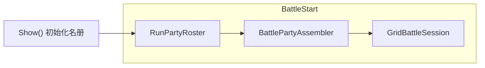

##### 12.14.1.1 局内队伍名册 `RunPartyRoster` / In-Run Party Roster (v3.212)

**中文：** `InvasionBattleModal2View.Show()` 时创建并初始化 **`RunPartyRoster`**，在一局 `Show()`→`Hide()` 内持久；`Hide()` / 重开时销毁重建。

**初始化流程：**

1. 读取公会跟随列表（与 v3.211 相同优先级，**v3.220** 修订）：
   - 若 `GongHuiScreenView` 处于激活态且 live `entries` **非空** → 取 `NpcId`（拉手顺序）；
   - 否则（含公会已切走、或 live 为空）→ `GuildHomeVisitState.PeekFollowers()` 返回快照副本（**不清空**；公会→主线须**保留**快照，见 §9.8.9.7）。
2. **Role 条目**（`members[0]`）：从全局 `RoleStats`（`IPlantingService.GetRoleStats()`）**深拷贝**全部字段至 `stats`；`kind=Role`；`runEnhanceBonuses` 从局外 `RoleStats` 六宫字段克隆基线（同 §12.13）；`acquiredSkillIds` 清空。
3. **FollowerNpc 条目**（按拉手顺序追加）：对每名 NPC **深拷贝同一份**开局 `RoleStats` 基线（与 Role 条目相同起点）至 `stats`；`displayName` / `skeletonPrefab` 取自 `FriendCatalog` / `GuildNpcMarker.skeletonKind`；各自独立 `runEnhanceBonuses` 基线与 `acquiredSkillIds`。
4. **人数截断**：`1 + followerCount` 上限 **9**；超出保留前 **8** 名 NPC。
5. **本局锁定**：初始化后**不再增减**队员；中途公会新拉手不影响本局名册。
6. **探索展示**：`Show()` 后立即 `RebuildPartyStandVisuals`，冒险全程（非战斗嵌入时）展示全队 Spine（§12.14.15）。

**初始化降级规则（v3.213）：**

| 情况 | 行为 |
|------|------|
| 跟随列表为空 | 名册仅含 Role（`members.Count==1`），允许继续探索/战斗 |
| `PeekFollowers()` 与公会 live 列表均为空 | 同上；**不**弹阻断提示（P0） |
| 重复 `NpcId` | 按拉手顺序**去重**，保留首次，后续跳过 + `LogWarning` |
| `FriendCatalog` / `GuildNpcMarker` 找不到 NPC | 仍创建 `FollowerNpc` 条目：`displayName=NpcId`，`skeletonPrefab` 回退主角默认骨骼 + `LogWarning` |
| 超过 9 人 | 截断至 `1+8` NPC（已有规则） |

**P1 可选（P0 不写 UI）：** 未带队友时可在事件日志追加提示卡——本期 SPEC **不强制**。

**与 `runStats` 的关系：**

- 保留字段 **`runStats`** 作为 **Role 条目** `members[0].stats` 的**快捷别名**（`runStats == members[0].stats`），兼容 §12.11 既有引用。
- §12.11.3 中部属性区继续展示 **Role** 的 `runStats`（玩家视角）。
- 事件奖励（§12.14.12）须对 `RunPartyRoster` **每名成员**执行同等写入，而非仅写 `runStats`。

**English:** `RunPartyRoster` is created on `Show()`, fixed for the run. Role clones global `RoleStats`; each follower clones the same baseline at open; `runStats` aliases `members[0].stats`; rewards fan out to all members (§12.14.12).

#### 12.14.2 战场站位（预制体驱动）/ Battle Grid (Prefab-Driven)

**中文：** 战场预制体：**`Resources/Prefabs/Battle/GridBattleField.prefab`**（编辑器菜单 **`Tools/PetDemo/Generate Grid Battle Field Prefab`** 生成；根挂 `GridBattleFieldLayout`）。

| 节点 / Node | 说明 / Notes |
|---|---|
| `AllyGrid/Slot_r{row}c{col}` | 我方左侧 3×3，共 9 个 `RectTransform` 锚点（`row,col ∈ {1,2,3}`） |
| `EnemyGrid/Slot_r{row}c{col}` | 敌方右侧 3×3，共 9 个锚点 |
| 每槽 `BattleGridSlotMarker`（可选组件） | 记录 `side`（Ally/Enemy）、`row`、`col` |

**坐标系约定（面向屏幕，敌在我方右侧）：**
- **行 row**：`1`=上、`2`=中、`3`=下
- **列 col**：从我方视角，`col=1` 为最靠近战场中线（**前排**），`col=3` 为最靠外侧（**后排**）
- 敌方网格使用**同一 row/col 编号语义**（敌方 `col=1` = 敌方靠中线前排）

**我方默认落位（v3.212 修订，本期 P0 无手动布阵）：**

由 `AssignAllyGridPositions(RunPartyRoster roster, int battleSeed)` 分配：

1. **主角 Role** 固定 **`AllyGrid Slot_r2c2`**（第二行第二列，`row=2, col=2`）。
2. **其余队员**（按名册拉手顺序，不含 Role）依次落位：
   - **第一优先**：`col=2` 中除 `(2,2)` 外的空槽（`r1c2`, `r3c2`）**随机无放回**选取；
   - **第二优先**：`col=1` 三槽（`r1c1`, `r2c1`, `r3c1`）**随机无放回**；
   - **第三优先**：`col=3` 三槽（`r1c3`, `r2c3`, `r3c3`）**随机无放回**。
3. **随机种子**：`placementSeed = battleSeed ^ hash("ally_placement")`；同场可复现。
4. 队员数超过 8 时已在 `Show()` 名册初始化时截断。

**敌方落位：** 由遭遇配置决定（§12.14.7）。

**English (v3.212):** Role fixed at `r2c2`; other allies fill `col2` random (excl. r2c2) → `col1` random → `col3` random; seeded placement; enemy per §12.14.7.

#### 12.14.3 回合与行动顺序 / Rounds and Turn Order

**中文：**
- 战斗按 **大回合（Round）** 循环；每大回合内所有 **存活** 单位各行动 **一次**。
- **行动顺序**：按 `stats.agility` **降序**；`agility` 相同则 **随机打乱**（每大回合重新抽签）。
- **随机种子**：`tieBreakSeed = battleSeed ^ (roundIndex * 397) ^ hash(instanceId)`；同大回合同单位顺序稳定、跨回合可变化。
- **阵营**：排序 **不区分** 我方/敌方（混排）。
- **单次行动（P0）**：仅 **普通攻击**；特殊攻击、防御、技能 **不在本期范围**。
- **伤害公式**：沿用 §4.2：`damage = max(1, attacker.stats.atk - defender.stats.def)`（整数）；Tier-2/3 触发率 P0 **不参与**（与 §4.2 一致）。

**English:** Major rounds; each living unit acts once per round; order by `agility` descending, random tie-break per round with seeded RNG; mixed factions; P0 normal attack only; damage `max(1, atk - def)` per §4.2; Tier-2/3 not active in P0.

#### 12.14.4 普攻目标选择（不含特殊攻击）/ Normal Attack Target Selection

**中文：** 攻击者在 **敌对阵营存活单位** 中选目标（我方打敌方、敌方打我方，规则对称）。**不含特殊攻击**（特殊攻击另行设计，本期不实现）。

**第一优先级 — 列（col）：** `col=1` > `col=2` > `col=3`（目标方网格列号；即最靠近攻击者一侧的列优先）

**第二优先级 — 行（row，同列内）：**
1. 与攻击者 **同行**（`|Δrow| = 0`）
2. 行差 **1**（`|Δrow| = 1`）
3. 行差 **2**（`|Δrow| = 2`）

**同优先级多目标：** 随机选一（种子 `battleSeed ^ roundIndex ^ hash(attackerInstanceId) ^ 0xTARGET`）。

**示例：** 我方单位在 `r2c1` 攻击敌方，敌方 `(r2c1)` 与 `(r1c1)` 均存活 → 同属 `col=1` → 同行 `r2c1` 优先于 `r1c1`。

**English:** Pick among living opponents: column priority `col1 > col2 > col3`, then row `same row > |Δrow|=1 > |Δrow|=2`; random among ties; special attacks out of scope.

#### 12.14.5 精灵系统关闭 / Pets Disabled

**中文：** 多单位战（§12.14）嵌入实例化时设 **`kGridBattlePetsEnabled = false`**（编译期常量或 `GridBattleSession` 标志）。**不**创建 §12.3 的 `PetLowerLeft` / `PetUpperLeft` 槽位；**不**执行 §12.4 / §4.1 偶数轮宠物协攻逻辑。§12.3 全屏 1v1 入侵战精灵行为 **不变**。  
**English:** Grid battle sets `kGridBattlePetsEnabled = false`; no pet slots or even-round pet strikes; §12.3 fullscreen 1v1 pet behavior unchanged.

#### 12.14.6 胜负判定、暂死与结算 / Win/Loss, Battle-Death, and Settlement (v3.212)

##### 12.14.6.1 胜负判定 / Win/Loss Conditions

**中文：**
- **胜利**：敌方全部单位 `currentHp <= 0`（无存活敌人）。
- **失败**：我方全部单位 `currentHp <= 0`（**含本场暂死者**；只要无存活我方单位即判负）。
- **回合队列**：每大回合 `BeginRound()` 仅将 **存活** 单位（`currentHp > 0` 且 `!isBattleDead`）纳入 `turnQueue`；`currentHp <= 0` 的单位**不出手、不可被普攻选为目标**（§12.14.4 在存活对手中选取）。

**English:** Win when all enemies dead; lose when all allies dead (including battle-dead); only living units act and can be targeted.

##### 12.14.6.1.1 同时灭亡与行动顺序 / Simultaneous Wipe and Turn Order (v3.213)

**中文：**
- **每次 `ApplyNormalAttack` 结算后立即**调用 `IsBattleFinished`（**不在**整回合末批量判定）。
- 若一次攻击使 **敌方全灭** → **立即胜利**，本回合剩余行动**取消**。
- 若一次攻击使 **我方全灭** 且敌方未全灭 → **立即失败**。
- **不存在**「双方同时归零仍继续」的平局；最后一击归属取决于**当前行动者**。
- 若双方在同一大回合内先后归零：先完成攻击且触发对方全灭的一方获胜（行动顺序由 `agility` 降序 + §12.14.3 tie-break 随机决定）。

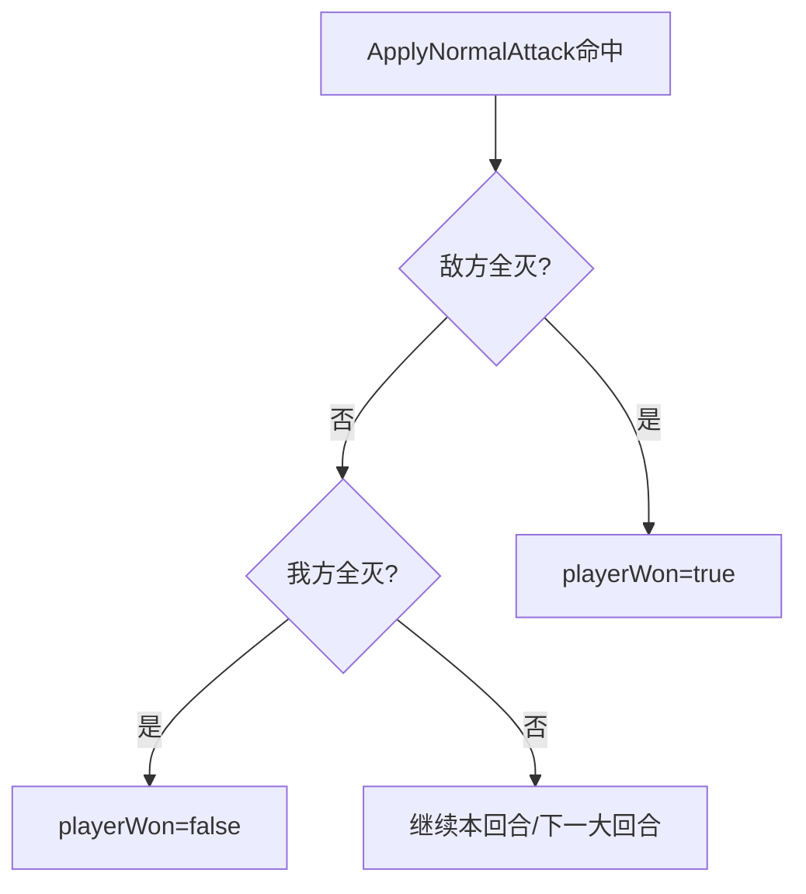

**English:** After each normal attack, check finish immediately; enemy wipe → instant win (cancel remaining turns); ally wipe → instant loss; no draw; last striker wins if both sides die in the same round.

##### 12.14.6.2 暂死与胜后复活 / Battle-Death and Post-Victory Revival

**中文：**
- **战斗中死亡**：单位受击后 `currentHp <= 0` → 设 `isBattleDead=true`；仍占格（播死亡动画 / 灰化），**不出手、不被普攻选中**。
- **战斗失败**：维持各条目 HP 与死亡状态；走 §12.11.10 关闭 `InvasionBattleModal_2`（本局结束）。
- **战斗胜利**（`SyncRosterHpAfterBattle`，§12.14.8）回写 `RunPartyRoster` 后：
  - **存活者**：`currentHp` **不变**；
  - **本场死亡者**：`currentHp = max(1, floor(maxHp * 0.3))`，`isBattleDead=false`，恢复可参战；
  - 下一场战斗可正常入队。
- **结算流转**（`evt_fight_small_2`）：复用 §12.11.10 / §12.11.10.1 嵌入结算——**仅胜/负标题 +「点击关闭」**，**不列**队员 HP 或阵亡摘要；胜 → 销毁嵌入战斗、`SyncRosterHpAfterBattle`、**重建** `PartyStandRoot`（§12.14.15）、`SetNextDayButtonMode(Normal)` 继续「下一天」；负 → `Hide()` 关闭 `InvasionBattleModal_2`。

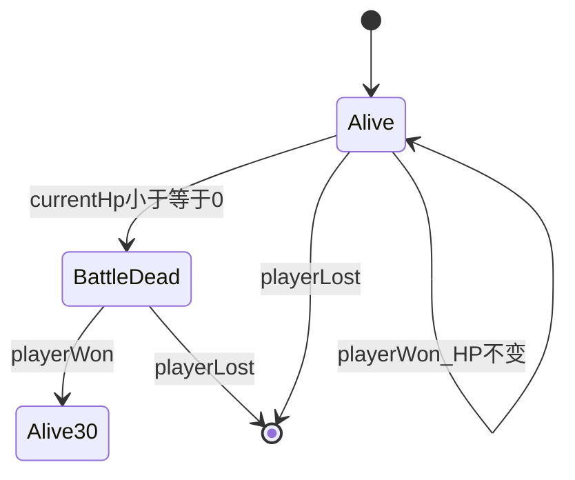

**English:** Battle-death at `currentHp<=0`; on win survivors keep HP, dead allies revive at `max(1, floor(maxHp*0.3))`; on loss close modal. Settlement same as §12.11.10 for `evt_fight_small_2`.

#### 12.14.7 遭遇：战斗事件刷怪 / Encounter Spawn by Fight Event (v3.220)

**中文：** `InvasionBattleModal_2` 嵌入战斗时，`GridEncounterBuilder.BuildEnemies(pendingEventId, battleSeed)` 按事件刷怪；**我方始终为 `RunPartyRoster` 全员**（含第 4 天原「1v1」文案事件，亦带队友入场）。

| `pendingEventId` | 敌人数 | 单位模板 | 站位 |
|---|---|---|---|
| `evt_fight_small_1` | **1** | §B.9 `enemy_small` | 敌方 9 槽无放回随机 1 槽 |
| `evt_fight_small_2` | **2 或 3**（`Random` 含下不含上 → 2..3） | `enemy_small` | 无放回随机对应槽 |
| `evt_fight_boss` | **1** | §B.9 `boss_langren` | 无放回随机 1 槽 |

每只独立实例：`atk`←配置 `attack`、`maxHp/currentHp`←`maxHp`、`def=0`（P0）；小怪 `agility` 默认 `2`，BOSS 可用同默认或配置扩展。

**验收：** 第 **4** 天 `evt_fight_small_1`、第 **8** 天 `evt_fight_small_2`、第 **10** 天 `evt_fight_boss`；带 ≥1 名跟随者时我方槽位数 = 名册人数。

**English (v3.220):** All three fight events use grid party battle; spawn 1 / 2–3 small / 1 boss by `pendingEventId`; allies always full roster.

#### 12.14.8 接口与驱动（实现期）/ APIs and Driver (Implementation)

**中文（v3.212 修订）：** 建议新增以下接口（`PetDemo.Battle` 命名空间），供 `InvasionBattleView` 嵌入多单位分支消费：

```text
interface IBattlePartyAssembler {
  List<BattleUnitRuntime> BuildAllies(RunPartyRoster roster);
  void AssignAllyGridPositions(RunPartyRoster roster, List<BattleUnitRuntime> allies, int battleSeed);
}

interface IGridEncounterBuilder {
  List<BattleUnitRuntime> BuildEnemies(string eventId, int battleSeed);
}

interface IBattleTargetSelector {
  BattleUnitRuntime PickNormalAttackTarget(BattleUnitRuntime attacker,
    IReadOnlyList<BattleUnitRuntime> opponents, int roundIndex, int battleSeed);
}

interface IGridBattleResolver {
  int ResolveNormalAttackDamage(BattleUnitRuntime attacker, BattleUnitRuntime defender);
}

interface IGridBattleDriver {
  GridBattleSession GetSession();
  void BeginRound();                              // 重算 turnQueue（仅存活单位）
  BattleUnitRuntime GetCurrentActor();
  void ApplyNormalAttack(BattleUnitRuntime attacker, BattleUnitRuntime defender);
  bool AdvanceTurn();                             // false = 大回合结束
  bool IsBattleFinished(out bool playerWon);    // §12.14.6.1 / §12.14.6.1.1（每次攻击后立即判定）
}

// 战斗结束回写名册 HP 与胜后复活（§12.14.6.2 / §12.14.13）
void SyncRosterHpAfterBattle(RunPartyRoster roster, GridBattleSession session, bool playerWon);

// 事件奖励全员分发（§12.14.12）
void ApplyRewardToAllPartyMembers(RunPartyRoster roster, InvasionEventReward reward);
void ApplyFlatStatToAllPartyMembers(RunPartyRoster roster, string attrId, int gain);
void ApplyPercentStatToAllPartyMembers(RunPartyRoster roster, string target, int percent);
void AcquireSkillForAllPartyMembers(RunPartyRoster roster, string skillId);
```

**English (v3.212):** Interfaces updated for `RunPartyRoster` assembly, placement, win/loss, roster HP sync, and per-member reward fan-out.

#### 12.14.9 UI 与表现（P0 最小）/ UI and Presentation (P0 Minimum)

**中文：**
- 嵌入 [`InvasionBattleModal2View.TopArea`](PetDemo_2/Assets/Scripts/UI/Battle/InvasionBattleModal2View.cs)：用 **`GridBattleField`** 替换探索期 `PartyStandRoot` 站立布局；`InvasionBattleView.BuildEmbeddedGrid(hostRect, GridBattleSession, onEnded, resultOverlayHost)`（`embedded=true`，`useGridBattle=true`）。
- **（v3.224）布局**：`GridBattleField` 在 `TopArea` 内全宽拉伸，**Top=200**（Inspector 语义：`offsetMax.y=-200`；常量 `GridBattleConstants.GridBattleFieldTopInsetPx`），Bottom/Left/Right 仍为 0。
- **（v3.213）战斗开始**：**隐藏** `PartyStandRoot`（及 `PlayerSlot` 探索期站立层）；**战斗结束**销毁嵌入层后调用 `RebuildPartyStandVisuals` **恢复**探索期全队站立（§12.14.15）。
- 每 occupied 槽：运行时 `SkeletonGraphic`（基底 `GridCharacterScaleBase=0.30` × **`BattleSpineDisplayScaleMultiplier=1.15`**）+ 槽位小型 HP 条（复用 §12.3 血条样式：`fillAmount = currentHp/maxHp`；**挂 `slotRt` 中心，Y 偏移 `-20px`**，即 Spine 中心正下方 20px）。
- **（v3.222 / v3.223）Spine 绘制层级**：按 `GridBattleField` 槽位行 **`Slot_r3 > Slot_r2 > Slot_r1`**（下行遮挡上行）；实现为各单位 `UnitAnchor` 上 `Canvas.overrideSorting=true`，`sortingOrder = parentCanvas.sortingOrder + row × GridRowSortStep + col`（`GridRowSortStep=10`；**相对父 Canvas**，避免绝对小值落入 §9.8.17 世界带被 HUD 盖住）。新建嵌套 Canvas 须带 Spine 通道 `additionalShaderChannels |= TexCoord1|Normal|Tangent`，且在实例化 `SkeletonGraphic` **之前**挂好；并 `MainHudLayerRoot.EnsureGraphicRaycaster`。`GridBattleFieldLayout` 另按行重排槽位 sibling（r1→r3 递增置顶）。
- 行动表现：攻击者移向 **目标槽前方中线邻近点** → 播 `attack_1` → 命中瞬间扣血 + 红字飘字 → 回位（时长沿用 `BattleAnimationSpec`：`moveToCenterSeconds=0.25` 等）。
- **按速度排序的行动在 UI 上依次播放**（非整回合即时结算）；胜负判定仍按 §12.14.6.1.1 **每次命中后立即**检查。

**English:** `GridBattleField` in `TopArea`; hide `PartyStandRoot` during fight, rebuild after; per-slot Spine + mini HP bar; sequential animated turns; immediate win/loss on hit per §12.14.6.1.1.

#### 12.14.10 实现优先级 / Implementation Priority

**中文（v3.214）：** §12.14 **P0** 的落地顺序与阶段拆分见 **§12.14.16**（5 阶段、逐段验收）；下表为功能优先级总览，**不**替代分阶段计划。  
**English (v3.214):** §12.14 **P0** delivery order and phase breakdown are in **§12.14.16** (five phases, incremental acceptance); the table below is a feature-priority overview, not a substitute for the phased plan.

| 优先级 / Priority | 内容 / Content |
|---|---|
| **P0** | `RunPartyRoster`、读队快照保留（§9.8.9.7 v3.220）、探索期 **`PartyStandRoot`**、九宫格全队战、`evt_fight_small_1/2` + `evt_fight_boss` 遭遇、事件全员收益、胜后回写 — **已交付** |
| **P1** | Tier-2/3 触发率接入、特殊攻击、手动布阵、全队增益结算日志卡、全屏入侵战迁移至多单位 |
| **P2** | （原 `small_1`/`boss` 多单位化已并入 P0 v3.220） |

#### 12.14.11 资源清单 / Asset Manifest

| 资源 / Asset | 路径 / Path | 说明 / Notes |
|---|---|---|
| 九宫格战场 / Grid field | `Resources/Prefabs/Battle/GridBattleField.prefab` | 新建；含 AllyGrid/EnemyGrid 各 9 槽 |
| 槽位标记 / Slot marker | `BattleGridSlotMarker` 组件 | `side`, `row`, `col` |
| 小怪骨骼 / Small enemy | `Resources/Pets/Monster_1_Salamander.prefab` | §B.9 `enemy_small.skeletonPrefab` |
| 主角骨骼 / Role | `Resources/Prefabs/Air/Hero_Role_cunmin` | Role 单位外观 |
| NPC 骨骼 / NPC | `FriendProfile.spinePrefabPath` 或 `GuildNpcMarker` 映射 | 跟随 NPC 外观 |

#### 12.14.12 局内事件与多人收益 / In-Run Events and Multi-Member Rewards (v3.212)

**中文：** 当 `RunPartyRoster.members.Count > 1` 时，`invasion_events` 中下列事件类型遵循 **「玩家操作、全员各得一份」** 规则。`战斗 Battle` 事件不走本节（走 §12.14 战斗流程）。

**操作权**：仅**玩家 Role** 进行 UI 交互；NPC **不参与**操作。

| 事件类型 / Event | 玩家操作 / Player action | 收益分发 / Reward fan-out |
|---|---|---|
| `调整属性` (`attr:hp\|atk\|speed:±%`) | 自动结算（无额外界面） | 对名册**每名** `RunAllyEntry.stats` 应用相同百分比；`hp` 增时按该成员自身 `maxHp` 计算并同步 `currentHp` |
| `奇遇` 含 `attr:*` | 同上 | 同上 |
| `奇遇` 含 `pick3:normal\|legendary` | 玩家三选一 + 确定（§12.11.9） | 所选 `skillId` **追加到每名** `acquiredSkillIds`；技能条 UI 仍只展示 Role 的列表 |
| `抽奖` (`slot3` / `slot5`) | 玩家打开老虎机 + 摇奖（§12.12） | `onComplete` 每个 `(attrId, gain)` **累加到每名** `stats` / `runEnhanceBonuses`（映射规则同 §12.12.3） |

**实现约定：**

- 事件卡 `eventText` 仍以「你…」第二人称描述（玩家视角）。
- 数据层须调用 `ApplyRewardToAllPartyMembers` / `ApplyFlatStatToAllPartyMembers` / `ApplyPercentStatToAllPartyMembers` / `AcquireSkillForAllPartyMembers`（§12.14.8）。
- P1 可选：追加系统事件卡「全队 {N} 人各获得相同增益」；P0 可不实现该 UI。
- 仅 1 人（无跟随）时行为与单 `runStats` 等价。

**English:** For multi-member roster, `AdjustAttr`/`Adventure`/`Lottery` rewards apply identically to every `RunAllyEntry`; only the player operates UI; battle events excluded.

##### 12.14.12.1 属性增减边界 / Attribute Change Bounds (v3.213)

**中文：** 百分比 `attr:*`（`ApplyPercentStatToAllPartyMembers`）对**每名成员独立**计算：

| target | 规则 |
|--------|------|
| `hp` | `maxHp = max(1, round(maxHp * (1 + percent/100)))`；**增**：`currentHp` 同比缩放（`round(currentHp * factor)` 后 clamp 至 `[0, maxHp]`）；**减**：`currentHp = min(currentHp, maxHp)`（不主动抬血） |
| `atk` / `speed` | `max(0, round(value * factor))`；`speed` 映射 `agility` |
| `def` | P0 事件表**暂不配置** `attr:def`；若未来扩展，同 `atk` 规则；老虎机 `def` 固定值仍走 `ApplyFlatStatToAllPartyMembers` |

**其它约定：**

- **空奖励**（如 `evt_calm`）：不修改名册，不追加系统卡。
- **局内属性分叉**：除 **HP**（战斗/复活）外，事件对全员施加**相同**数值/比例；**P0 不允许仅 Role 受益的属性事件**。
- `attr:hp` **负向**导致 `currentHp==0`：**不**在探索期判死亡；仅战斗内 HP≤0 触发暂死（§12.14.6.2）。

**English:** Per-member percent attr math with HP max/current rules; empty rewards noop; no Role-only attr events in P0; explore-phase HP=0 is not death.

#### 12.14.13 独立生命值 / Independent Hit Points (v3.212)

**中文：**

- 每名 `RunAllyEntry` 维护独立 `stats.currentHp` / `stats.maxHp`（局内事件与战斗均基于此）。
- 开战时 `BattlePartyAssembler` 从各 `RunAllyEntry.stats` 生成 `BattleUnitRuntime`（**不再**从单一 `runStats` 复制给 NPC）。
- 战斗中伤害仅扣被击单位 `currentHp`；`BattleUnitRuntime.stats` 为开战快照。
- 战斗结束调用 `SyncRosterHpAfterBattle`（§12.14.6.2 / §12.14.8）将各 ally 的 `currentHp` 回写对应 `RunAllyEntry.stats`。
- 事件 `attr:hp:+N%` 对每名队员**独立**计算（各自基于自己的 `maxHp`）。

**English:** Per-member HP in roster and battle; sync back after battle; percent HP events computed per member.

#### 12.14.14 验收要点 / Acceptance Checklist (v3.212, v3.213)

1. 打开界面时带 2 名跟随者 → 名册 3 人；**探索期 TopArea 见 3 个站立 Spine**（§12.14.15）；第 8 天 `evt_fight_small_2` 开战 → Role 在 `r2c2`，另 2 人在 `col2` 剩余槽随机。
2. `evt_boost_atk`（atk +10%）→ 3 人 `atk` 各 +10%。
3. `evt_lottery` 摇奖 +5 atk → 3 人各 +5 atk。
4. `evt_insight` 三选一 → 3 人 `acquiredSkillIds` 均含所选技能。
5. 战斗中 1 名 NPC 阵亡、Role 存活并胜 → NPC `currentHp = max(1, floor(maxHp*0.3))`，Role HP 为战后剩余值。
6. 3 人全灭 → 判负，关闭 `InvasionBattleModal_2`。
7. 敌方全灭 → 判胜，继续「下一天」。
8. **（v3.213）** 最后一击同时杀光双方 → 按**当前行动者**判胜（§12.14.6.1.1）；结算弹窗仅胜/负，不列队员 HP。
9. **（v3.220）** `pendingEventId`：`evt_fight_small_1` / `evt_fight_small_2` / `evt_fight_boss` **均**走 §12.14 全队九宫格战（敌方 1 / 2~3 / 1 BOSS）；公会拉手后切主线打开冒险 → 名册含队友，探索期 `PartyStandRoot` 全程可见。

#### 12.14.15 探索期队伍展示（非战斗）/ Exploration Party Display (v3.213)

**中文：** `InvasionBattleModal_2` 处于**探索态**（未嵌入战斗）时，在 `TopArea` 展示主角 + 全部队友 Spine 站立，视觉类公会跟随。

| 项 | 规则 |
|---|---|
| 时机 | 探索态：`Show()` 初始化名册后、`LaunchEmbeddedBattle` 之前，及每场战斗结束后重建 |
| 容器 | `TopArea` 下除 `PlayerSlot` 外增 **`PartyStandRoot`**（或与 `PlayerSlot` 同级），挂载全队站立 Spine |
| 布局 | **Role** 居中偏前（沿用 §12.11.4 镜像与待机链）；**FollowerNpc** 按名册拉手顺序在 Role **左右错开**排列（建议水平间距 `±120px` 步进，最多 8 名；超出 9 人上限已在名册截断） |
| 外观 | 每名成员 `SkeletonGraphic` + `RunAllyEntry.skeletonPrefab`（缺资源 → 纯色占位 + `LogWarning`，不阻断） |
| 动画 | 全员循环待机（同 §12.11.4 候选链）；「下一天」移动过场（§12.11.5）**全队**（Role + FollowerNpc）同步播 `move_1`（候选链 `move_1`→`move`→`animation`），1s 后全员恢复待机 |
| 与战斗互斥 | 嵌入 `GridBattleField` 时 **隐藏** `PartyStandRoot`/`PlayerSlot` 站立层（§12.14.9）；战斗结束销毁嵌入层后 **重建**探索期站立队 |

**实现依赖（脚注，v3.214 修订）：** 本节属 **阶段 2** 交付物（§12.14.16）；须于阶段 1 完成 `RunPartyRoster` 与 `pendingEventId` 后再实现；否则探索期多人展示与 `small_1`/`small_2` 分支无法验收。

**English:** Exploration state shows full party stand Spines under `PartyStandRoot`; hidden during grid battle; rebuilt after; Role center, followers offset ±120px; move interlude animates **full party** (v3.222). **Phase 2 deliverable** per §12.14.16; depends on Phase 1 roster + `pendingEventId`.

#### 12.14.16 分阶段实施计划（P0）/ Phased Implementation Plan (P0) (v3.214)

**中文：** 本节将 §12.14 **P0 多单位阵型战斗**拆为 **5 个可独立验收的开发阶段**，以降低一次性改动面、便于回归。各阶段须**先更新本节实现状态**（见下表「状态」列），再按对应 SPEC 小节编码；**不得跳过前置阶段**直接做战斗 UI 或结算回写。  
**English:** This subsection splits §12.14 **P0 multi-unit formation battle** into **five independently verifiable phases** to limit change blast radius and ease regression. Update the **Status** column here before coding each phase; **do not skip prerequisites** (e.g. battle UI before the rules engine).

**范围澄清 / Scope clarification：**

- 本节「多人战」= **本地多单位阵型战**（主角 Role + 公会拉手 NPC），**非**联网真人对战（见文档范围外说明）。
- **§12.3 全屏入侵**在各阶段中可保持 legacy 1v1；Modal_2 内战斗事件自 **v3.220** 起全部九宫格全队化。
- 公会→主线须**保留**跟随快照（§9.8.9.7 v3.220），否则探索/战斗名册无队友。

**当前代码基线（v3.219 阶段 5 完成后）/ Code baseline after Phase 5 (v3.219):**

| 项 | 状态 |
|---|---|
| `InvasionBattleModal_2` 探索玩法（事件、老虎机、三选一、legacy 嵌入 1v1） | 已落地 |
| 公会 NPC 跟随（`GuildNpcFollowController`） | 已落地 |
| `RunPartyRoster` / `GridBattleSession` 等纯数据类型 + `Show()` 初始化名册 | **已落地（阶段 1）** |
| `GuildHomeVisitState.PeekFollowers()` | **已落地（阶段 1）** |
| 事件 `attr:*` / `slot3`/`slot5` / `pick3` 全员收益 + `PartyStandRoot` | **已落地（阶段 2）** |
| `BattlePartyAssembler` / `GridEncounterBuilder` / `GridBattleDriver`（headless） | **已落地（阶段 3）** |
| `GridBattleField.prefab` + `BattleGridSlotMarker` | **已落地（阶段 3）** |
| `LaunchEmbeddedBattle` 按 `pendingEventId` 分支 | **已落地（阶段 4）** |
| `GridBattleField` 嵌入战斗 UI / 行动动画 | **已落地（阶段 4）** |
| `SyncRosterHpAfterBattle` | **已落地（阶段 5）** |
| 配置 `evt_fight_small_2`（第 8 天） | 已配置 |

**阶段依赖 / Phase dependencies:**

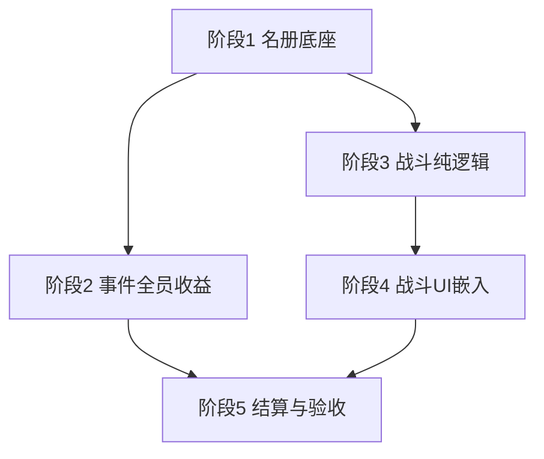

**总工期估算 / Overall estimate:** P0 五阶段合计约 **10–15 个工作日**（含联调与动画打磨；阶段 3、4 为关键路径）。

---

##### 阶段 1：局内名册与读队（数据底座）/ Phase 1: In-Run Roster & Party Read

| 项 | 内容 |
|---|---|
| **目标** | 将单人 `runStats` 升级为全队 `RunPartyRoster`；打通公会拉手 → 参战名单；为后续事件分发与战斗组装提供唯一数据源。 |
| **状态** | `已完成` |
| **依赖 SPEC** | §12.14.1、§12.14.1.1、§12.5 数据结构、`GuildHomeVisitState.PeekFollowers`（§9.8.9.7） |
| **主要交付物** | ① 纯数据类型：`RunPartyRoster`、`RunAllyEntry`、`BattleGridPos`、`BattleUnitRuntime`、`GridBattleSession` 等（建议 `Assets/Scripts/Battle/`）；② `GuildHomeVisitState.PeekFollowers()`；③ `InvasionBattleModal2View.Show()` 初始化名册（读队、去重、截断 9 人、降级规则）；④ `runStats` 作为 `members[0].stats` 别名；⑤ 抽事件时写入 `pendingEventId`（`Show()` 清空） |
| **阶段验收** | 公会带 2 名 NPC 打开界面 → 名册 3 人；无跟随 → 仅 Role、不阻断探索；中部属性区仍正确显示 Role；`pendingEventId` 在「下一天」抽事件后可查询。**自测：** Editor 菜单 `Tools/PetDemo/Self-Test RunPartyRoster Phase1`（Peek 非消费、3 人/1 人/截断/去重/别名）；运行时查 `PartyRoster`/`PendingEventId`。 |
| **预估工期** | 1–2 天 |
| **风险** | `PeekFollowers` 与 `Consume` 语义易混；须保证名册在 `Show()`→`Hide()` 内锁定 |

---

##### 阶段 2：局内事件「全员各得一份」+ 探索期全队站立 / Phase 2: Event Fan-Out & Exploration Party Display

| 项 | 内容 |
|---|---|
| **目标** | 探索期全队共享成长；探索态可见全队 Spine，与战斗数据一致。 |
| **状态** | `已完成` |
| **依赖** | **阶段 1** 完成 |
| **依赖 SPEC** | §12.14.12、§12.14.12.1、§12.14.13、§12.14.15 |
| **主要交付物** | ① `ApplyPercentStatToAllPartyMembers` / `ApplyFlatStatToAllPartyMembers` / `AcquireSkillForAllPartyMembers`（及 `ApplyRewardToAllPartyMembers` 门面）；② 改造 `InvasionBattleModal2View` 现有事件路径：`attr:*`、`slot3/slot5`、`pick3`；③ `TopArea/PartyStandRoot` + `RebuildPartyStandVisuals()` |
| **阶段验收** | 对应 §12.14.14 第 2–4 条及第 1 条探索期部分：3 人队见 3 个站立 Spine；`evt_boost_atk` / 老虎机 / 三选一对全员生效；技能条 UI 仍只展示 Role。**自测：** Editor 菜单 `Tools/PetDemo/Self-Test RunPartyRoster Phase2`（全员 `attr`/`flat`/`pick3` 边界）；运行时带 2 跟随者打开界面见 3 个站立 Spine。 |
| **预估工期** | 约 2 天 |
| **风险** | 须回归 legacy 单人局（`members.Count==1` 等价原 `runStats`） |

---

##### 阶段 3：九宫格战场 + 战斗纯逻辑（无动画）/ Phase 3: Grid Field & Headless Battle Rules

| 项 | 内容 |
|---|---|
| **目标** | 可脱离 UI 跑通的战斗规则引擎，便于单测/调试菜单验证。 |
| **状态** | `已完成` |
| **依赖** | **阶段 1** 完成（阶段 2 可与阶段 3 **并行**，但阶段 4 前须完成阶段 2） |
| **依赖 SPEC** | §12.14.2–§12.14.4、§12.14.5、§12.14.6、§12.14.6.1.1、§12.14.7、§12.14.8、§12.14.11 |
| **主要交付物** | ① `GridBattleField.prefab` + `BattleGridSlotMarker` + 编辑器生成菜单；② `BattlePartyAssembler`、`AssignAllyGridPositions`、`GridEncounterBuilder`（`evt_fight_small_2`：2~3 只 `enemy_small`）；③ `IGridBattleDriver` / `IGridBattleTargetSelector` / `IGridBattleResolver` 实现；④ `kGridBattlePetsEnabled = false` |
| **阶段验收** | 通过 Editor 测试或单元测试：3 人 vs 2~3 怪完整跑完；`agility` 混排、列/行目标选择、**每次攻击后即时胜负**（§12.14.6.1.1）、暂死标记；仅 Role 亦可开战。**自测：** Editor 菜单 `Tools/PetDemo/Self-Test RunPartyRoster Phase3`；`GridBattleHeadlessRunner.RunToCompletion`。 |
| **预估工期** | 3–4 天 |
| **风险** | 本阶段为规则核心；目标选择与同速 tie-break 须与 SPEC 种子公式一致 |

---

##### 阶段 4：战斗 UI 嵌入与 `evt_fight_small_2` 分支 / Phase 4: Battle UI Embed & Event Branch

| 项 | 内容 |
|---|---|
| **目标** | 玩家在第 8 天触发「一群小怪」时进入可玩的九宫格多单位战。 |
| **状态** | `已完成` |
| **依赖** | **阶段 3** 完成；**阶段 2** 完成（`PartyStandRoot` 隐藏/重建） |
| **依赖 SPEC** | §12.14.9、§12.11.10、`pendingEventId` 分支 |
| **主要交付物** | ① `InvasionBattleView.BuildEmbeddedGrid(...)`（`embedded=true`，`useGridBattle=true`）；② 每槽 Spine + 小型 HP 条；按 `turnQueue` **依次播放**行动动画（移向目标 → `attack_1` → 飘字 → 回位）；③ `LaunchEmbeddedBattle()`：`pendingEventId == "evt_fight_small_2"` → 多单位战，否则 legacy 1v1；④ 复用 `EmbeddedResultOverlay/ResultDialog`（不扩展队员 HP 列表） |
| **阶段验收** | 第 8 天 `evt_fight_small_2` → 九宫格多怪战；第 4 天 `evt_fight_small_1` → 仍为旧 1v1；战斗期隐藏 `PartyStandRoot`；行动按序播放非整回合瞬结。**自测：** Editor 菜单 `Tools/PetDemo/Self-Test RunPartyRoster Phase4`；运行时第 8 天触发多单位战。 |
| **预估工期** | 3–5 天 |
| **风险** | 动画协程与 `IGridBattleDriver` 状态须严格同步，避免重复扣血或漏判胜负 |

---

##### 阶段 5：战后回写、复活与端到端验收 / Phase 5: Post-Battle Sync, Revival & E2E Acceptance

| 项 | 内容 |
|---|---|
| **目标** | 战斗结果正确写回名册，打通 P0 完整玩法闭环。 |
| **状态** | `已完成` |
| **依赖** | **阶段 4** 完成；**阶段 2** 已完成（胜后 `RebuildPartyStandVisuals`） |
| **依赖 SPEC** | §12.14.6.2、§12.14.13、§12.14.14（全量 9 条） |
| **主要交付物** | ① `RosterBattleSync.SyncRosterHpAfterBattle`（胜：死亡者 30% maxHp 复活，存活者保留战后 HP；负：不写回、由 `OnEmbeddedBattleEnded` 关闭 `InvasionBattleModal_2`）；② 胜后 `SetExplorationPartyVisible(true)` + `RebuildPartyStandVisuals`；③ Editor 自测 `Tools/PetDemo/Self-Test RunPartyRoster Phase5` 覆盖 §12.14.14 全 9 条 |
| **阶段验收** | §12.14.14 **全部 9 条**；首期最小可玩路径：公会拉手 2 NPC → 推进至第 8 天 → `evt_fight_small_2` → 打完并复活 → 继续「下一天」。**自测：** Editor 菜单 `Tools/PetDemo/Self-Test RunPartyRoster Phase5`。 |
| **预估工期** | 1–2 天 |
| **风险** | 胜后 HP 回写与探索期百分比 `attr:hp` 的边界（§12.14.12.1）须一并回归 |

---

**实施约定 / Implementation conventions (v3.214):**

1. **每阶段开始前**：确认 §12.14.16 对应行「状态」；若实现偏离设计，**先改 SPEC 再改代码**。
2. **每阶段结束时**：仅合并该阶段验收项；**不**在未完成阶段 3 时合入阶段 4 的战斗 UI。
3. **P1/P2**（§12.14.10）**不在**上述 5 阶段内；P0 验收通过后再排期。
4. **建议新增脚本（汇总，非本阶段强制一次写完）**：

| 脚本 / Script | 建议阶段 |
|---|---|
| `RunPartyRoster.cs`、`RunAllyEntry.cs`、`GridBattleTypes.cs` | 阶段 1 |
| `PartyRewardFanOut.cs`（或等价静态类） | 阶段 2 |
| `BattlePartyAssembler.cs`、`GridEncounterBuilder.cs`、`GridBattleDriver.cs` | 阶段 3 |
| `GridBattleFieldLayout.cs`、`InvasionBattleView` 扩展 | 阶段 4 |
| `RosterBattleSync.cs`（`SyncRosterHpAfterBattle`） | 阶段 5 |

**English (summary):** Five phases — (1) roster + `PeekFollowers` + `pendingEventId`, (2) reward fan-out + `PartyStandRoot`, (3) headless grid battle rules + prefab, (4) `BuildEmbeddedGrid` + `evt_fight_small_2` branch, (5) `SyncRosterHpAfterBattle` + full §12.14.14 checklist. Phases 2 and 3 may run in parallel after Phase 1; Phase 4 requires Phase 3; Phase 5 requires Phases 2 and 4. Estimated 10–15 dev-days total for P0.

---

## 13. 好友系统 / Friends System (v3.125)

**中文：** 演示用好友系统：家园 Tab 新增「好友」入口按钮 → 好友列表弹窗（头像/名称/亲密度/在线 + 行内展开 3 操作按钮）→「去Ta家」跳转好友家园场景层（随机植物 + 「驱赶」战斗）→ 战斗结束返回好友家园并播放 `Xing_2` 飞行特效；另含每次进入自家家园的「好友协助」事件（`HYXieZhu_1` 图标 → `Xing_2` 飞行）。好友数据复用 §9.14.2 `FriendCatalog`。

**English:** Demo friends system: a "Friends" entry on the `JiaYuan` tab opens a friend-list modal (avatar / name / intimacy / online + per-row 3 action buttons); "Visit Home" opens a friend-home scene layer (random plants + "Drive Away" battle); after the battle the player returns to the friend home and a `Xing_2` star flies to the top-left corner. Also adds an own-home "friend assist" event (`HYXieZhu_1` icon → `Xing_2` fly) on each home entry. Friend data reuses §9.14.2 `FriendCatalog`.

### 13.1 家园「好友」入口 / Home "Friends" Entry

**中文：** 家园 Tab（`JiaYuan`）下，在 §9.7.1 收获视角入口按钮（`HarvestViewEntryButton`，位置 `(450, 438)`）正上方新增「好友」入口按钮；点击打开 §13.2 好友列表弹窗。显隐规则与 §9.7.1 相同：订阅 `BottomNavBarView.OnOpenChanged`，仅 `OpenKey == "JiaYuan"` 时激活。

**English:** On the `JiaYuan` tab, add a "Friends" entry button directly above the §9.7.1 harvest-view entry (`HarvestViewEntryButton` at `(450, 438)`); tapping it opens the §13.2 friend-list modal. Visibility mirrors §9.7.1 (subscribe `BottomNavBarView.OnOpenChanged`, active only when `OpenKey == "JiaYuan"`).

| 元素 / Element | 资源 / Asset | RectTransform | 说明 / Notes |
|---|---|---|---|
| `FriendEntryLayer` | — | StretchFull（挂 `MainHudLayerRoot`） | 仅 `JiaYuan` Tab 激活 |
| `FriendEntryButton` | `AirUI/HaoYouList_0`（缺图回退纯色块 + 文字「好友」） | anchor `(0.5, 0)`，`anchoredPosition = (450, 608)`，`sizeDelta = 150×150` | 点击 → `FriendListPanelView.Show()` |

### 13.2 好友列表弹窗 / Friend List Modal

**中文：** 运行时构建的全屏弹窗 `FriendListPanelView`（挂 `MainHudLayerRoot`，`ApplySortTier = HudModal`）。数据来源：`IPlantingService.GetFriends()`（即 §9.14.2 `FriendCatalog.BuildDefault()`），按 §9.14.3 `FriendCatalog.SortForDisplay` 排序（在线优先 > 亲密度降序）。

**English:** Runtime-built fullscreen modal `FriendListPanelView` (under `MainHudLayerRoot`, `ApplySortTier = HudModal`). Data: `IPlantingService.GetFriends()` (§9.14.2 `FriendCatalog.BuildDefault()`), sorted with §9.14.3 `SortForDisplay` (online first > intimacy desc).

| 元素 / Element | 资源 / Asset | RectTransform | 说明 / Notes |
|---|---|---|---|
| `FriendListPanel` | — | StretchFull，默认 `inactive` | 根节点 |
| `Dim` | — | StretchFull，黑 `alpha 0.6` | 点击关闭弹窗 |
| `ListPanel` | `AirUI/HaoYouList_0`（缺图纯色回退） | 居中 `840×1280` | 面板容器 |
| `Title` | — | 顶部居中 | 文字「好友」 |
| `ScrollView/Viewport/Content` | — | `VerticalLayoutGroup`（spacing 12） | 行容器（同 §9.14.3 弹窗骨架范式） |
| `FriendRow_<id>` | `AirUI/HaoYouList_2`（缺图纯色行底） | 高 `150` | 自左向右：`Avatar`（`120×120`，`friend.avatarResource`，缺图纯色）→ `NameText` → `IntimacyText`（「亲密度 N」）→ `OnlineDot` + `OnlineText`（在线绿 / 离线灰） |
| `ActionRow` | — | 高 `110`，紧贴所属行正下方 | 含 3 按钮：`GoFindButton`「去找Ta」/ `VisitHomeButton`「去Ta家」/ `MessageButton`「发消息」 |
| `CloseButton` | — | 面板底部居中 `300×90` | 文字「关闭」→ `Hide()` |

**行为 / Behavior：**

- **中文：** 点击好友行 → 在该行正下方展开/收起 `ActionRow`；同一时刻至多一行展开（点击另一行时收起前者）。 / **English:** Tapping a row toggles its `ActionRow` below; at most one row expanded at a time.
- **中文：**「去找Ta」「发消息」为占位按钮（仅日志，无后续功能）。 / **English:** "Go Find" and "Message" are placeholders (log only).
- **中文：**「去Ta家」→ 关闭弹窗并打开 §13.3 好友家园场景层（携带该 `FriendProfile`）。 / **English:** "Visit Home" closes the modal and opens the §13.3 friend-home layer with that `FriendProfile`.

### 13.3 好友家园场景层 / Friend Home Scene Layer

**中文：** 演示用全屏世界层 `FriendHomeScreenView`（挂 `MainHudLayerRoot`，`ApplySortTier = HudModal`，低于战斗层 `HudOverlay`），视觉复刻玩家家园；**纯展示**，不读写 `PlantingService` 农田存档。每次打开时随机重建。

**English:** Demo fullscreen world layer `FriendHomeScreenView` (under `MainHudLayerRoot`, `ApplySortTier = HudModal`, below the battle `HudOverlay` tier) that visually mirrors the player home; **display-only**, never touching `PlantingService` farm data. Rebuilt randomly on each open.

| 元素 / Element | 资源 / Asset | 说明 / Notes |
|---|---|---|
| `FriendHomeScreen` | — | StretchFull 根；全屏 `Image` 阻挡其下射线 |
| `Viewport/WorldContent` | `AirUI/JianYuan_2`（同 §9.8.14） | 静态视口（无跟随/拖动）；`WorldContent.anchoredPosition` 取农田根位置取反，使农田居中 |
| `FarmGridRoot` 克隆 | `Prefabs/Farm/FarmGridRoot` | 实例化后剥离 `FarmGridView` / `TileSlotView` 等行为组件；每格仅保留 `SoilImage` + `PlantImage`，其余徽标/标签一律隐藏 |
| 随机植物 | `PlantConfigCatalog.LoadPlantConfigsFromCsv()` 各 `appearanceSpriteIds` | 每格约 `60%` 概率有植物：随机植物配置 + 随机状态——`Growing`（节点 1..4）/ `AwaitingHarvest`（末节点 + `AirUI/ShouHuo-0` 徽标 `120×120`）/ `Wilted`（末节点灰化 tint） |
| 主角村民 `FriendHomeVillager` | `GuildSpineCharacterBuilder.BuildVillager`（§9.8.9.6，村民 Spine，`exclusive_2` 待机） | **当前关闭**（`FriendHomeScreenView.ShowFriendHomeVillager = false`）；开启时农田下方固定出生位（缺资源回退占位色块） |
| `TitleText` | `AirUI/HaoYouList_2`（缺图纯色回退，同 §13.2 行底） | 挂于 `FriendHomeViewport` 内、顶部居中 `800×80`；`Image` 底图 + 居中「<好友名>的家园」 |
| `BackButton` | — | 右上角 `72×72`「×」（§9.14.9 关闭范式），点击 `Hide()` 回自家家园 |
| `DriveAwayButton` | `AirUI/HYXieZhu_3`（缺图回退文字「驱赶」） | `150×150`，挂 `FriendFarmGridRoot` 顶层 overlay（同 §13.5 协助图标范式：`SetAsLastSibling` + 目标田格 `InverseTransformPoint` + 偏移 `(0, +110)`）；克隆农田时须将 `FarmGridRoot/Image` 装饰底图 `raycastTarget=false`（否则 4096×4096 底图会拦截点击）；点击 → §13.4 驱赶战斗 |

### 13.4 驱赶战斗 / Drive-Away Battle

**中文：**

1. 点击「驱赶」→ 调用新增接口 `InvasionService.OpenBattleFromFriendHome()`：非 `InBattle` 阶段均可开战（`Countdown → Invading → OpenBattle`，同 §12.6 `OpenBattleFromWarehouseHub` 范式）；好友家园战斗**不消耗体力**（跳过 §12.9 的 10 点扣除，演示约定）；不打主线选关标记，胜利**不推进主线进度**；胜利奖励沿用 §12.8 默认入侵奖励；战斗期间 `EnteredBattleViaFriendHome == true`，`CloseBattle` 完成后复位。
2. 敌人数据与主线第 5 关一致：当前实现主线所有关卡共用 `invasion_units.csv` 的 `boss_langren`（见 §12.5），故会话构建直接复用 `BuildBattleSession()`。
3. 点击「驱赶」且成功进入 `InBattle` 后，`FriendHomeScreenView` **立即隐藏**本层（`suspendedForDriveAwayBattle=true`），避免 `HudModal` 层因 `SetAsLastSibling` 等叠在战斗 `HudOverlay` 之上；战斗期间与结算弹窗期间均保持隐藏。
4. 结算弹窗关闭 → `CloseBattle` → `OnBattleEnded`：若 `EnteredBattleViaFriendHome` 且挂起标记仍为真 → **重新显示**好友家园（`SetActive(true)` + `SetAsLastSibling`），在主角村民屏幕位置生成 `Xing_2` 并按 §13.6 飞向左上角（村民关闭时回退屏幕中心），同时移除「驱赶」按钮（每次进入好友家园至多驱赶一次）。用户点右上角「×」主动 `Hide()` 时清除挂起标记，战后**不**自动恢复。
5. `InvasionBattleView.ShowResultDialog` 手动关闭路径在好友家园战斗时**不**触发 §12.10 主角升级弹窗。
6. **敌方展示（视觉）**：驱赶战斗中 `InvasionBattleView.EnemySlot` 使用与 `PlayerSlot` 相同的 `Resources/Prefabs/Air/Hero_Role_cunmin`；位置 `(280, -120)`；`localScale = (CharacterScale, CharacterScale, 1)`（`CharacterScale=0.53`），与左侧玩家 `(-CharacterScale, CharacterScale, 1)` 形成左右镜像朝向。每次 `OpenBattlePanel` 经 `RebuildEnemyVisualForCurrentBattle()` 按 `EnteredBattleViaFriendHome` 切换；普通入侵战仍走 §12.3 Salamander + `BoostedMirroredUniform` 规则。
7. **结算 UI**：驱赶战斗胜利结算**不展示**「自动推进关卡」Toggle，**不触发** §12.9 3 秒自动开战倒计时；仅点击关闭 → `CloseBattle` → 返回好友家园（第 4、5 点不变）。开战时 `autoAdvanceLevels` 强制清零，防止上一场勾选状态泄漏。

**English:**

1. "Drive Away" calls the new `InvasionService.OpenBattleFromFriendHome()`: opens battle from any non-`InBattle` phase (`Countdown → Invading → OpenBattle`, mirroring §12.6); friend-home battles **cost no stamina** (skips the §12.9 deduction, demo convention), set no main-story flag, **never advance main-story progress**, and reuse §12.8 default invasion rewards; `EnteredBattleViaFriendHome == true` during the battle and resets after `CloseBattle`.
2. Enemy data equals main-story level 5: the current implementation shares `boss_langren` from `invasion_units.csv` across all levels (§12.5), so `BuildBattleSession()` is reused as-is.
3. On successful drive-away battle open (`InBattle`), `FriendHomeScreenView` **hides immediately** (`suspendedForDriveAwayBattle=true`) so the `HudModal` layer cannot stack above battle `HudOverlay`; stays hidden through battle and the result dialog.
4. After the result dialog closes → `CloseBattle` → `OnBattleEnded`: if `EnteredBattleViaFriendHome` and the suspend flag is still set, **re-show** the friend home, spawn `Xing_2` at the villager (§13.6), and remove the "Drive Away" button (one drive-away per visit). Manual back (`Hide()`) clears the suspend flag — no auto-restore after battle.
5. The manual-close path of `InvasionBattleView.ShowResultDialog` must **not** show the §12.10 level-up dialog for friend-home battles.
6. **Enemy visuals:** during drive-away battles, `InvasionBattleView.EnemySlot` uses the same `Resources/Prefabs/Air/Hero_Role_cunmin` as `PlayerSlot`; position `(280, -120)`; `localScale = (CharacterScale, CharacterScale, 1)` (`CharacterScale=0.53`), mirroring the left player `(-CharacterScale, CharacterScale, 1)` so both face each other. Each `OpenBattlePanel` calls `RebuildEnemyVisualForCurrentBattle()` keyed on `EnteredBattleViaFriendHome`; normal invasion battles still follow §12.3 Salamander + `BoostedMirroredUniform`.
7. **Settlement UI:** drive-away victory **hides** the "auto-advance level" toggle and **skips** the §12.9 3s auto-start countdown; tap-to-close → `CloseBattle` → return to friend home (items 4–5 unchanged). `autoAdvanceLevels` is forced false on battle open to prevent leaking a prior toggle state.

### 13.5 自家家园好友协助事件 / Own-Home Friend Assist Event

**中文：**

1. 每次进入家园（底栏切到 `JiaYuan`，含创角后首次「进入家园」），`HomeAssistEventController` 从 `PlantingService` 田格中筛选**有植物**（`plantInstanceId` 非空）的田，随机取 1 个，在该田格上方（偏移约 `(0, +120)`）显示图标按钮 `AirUI/HYXieZhu_1`（`150×150`）。
2. 图标挂 `FarmGridRoot` 之上的 overlay 节点（同 §4.1.10 `MutationOverlay` 范式），参与 §9.1.4 世界深度排序（`LayerOffset = MutationIcon`）。
3. 再次进入家园时重新随机（旧图标移除后重建）；无植物田时本次不出现。
4. 点击图标：图标消失；在主角村民（§9.5 `VillagerRole`）的屏幕位置生成 `Xing_2` 并按 §13.6 飞向屏幕左上角。

**English:**

1. On each home entry (bottom-nav switches to `JiaYuan`, incl. the first "Enter Home" after character creation), `HomeAssistEventController` picks one random **planted** tile (`plantInstanceId` non-empty) and shows an `AirUI/HYXieZhu_1` icon button (`150×150`) above it (offset ≈ `(0, +120)`).
2. The icon lives on an overlay node above `FarmGridRoot` (like §4.1.10 `MutationOverlay`) and joins the §9.1.4 world depth sort (`LayerOffset = MutationIcon`).
3. Each re-entry re-randomizes (old icon removed); no icon when no planted tile exists.
4. Tapping it removes the icon and spawns `Xing_2` at the villager's (§9.5 `VillagerRole`) screen position, flying to the top-left (§13.6).

### 13.6 Xing_2 飞行特效 / Star Fly FX

**中文：** 通用静态工具 `StarFlyFx.Play(canvasRect, fromScreenPos)`（范式同 §9.6 收获果实飞袋 `PlayHarvestFruitFx`）：创建临时 `Image`（`AirUI/Xing_2`，`96×96`，挂 `canvasRect` 顶层 + `Canvas overrideSorting = HudTop`，确保覆盖好友家园层）；起点 = 指定屏幕坐标转 canvas 本地坐标；终点 = 画布**左上角**内缩 `(90, -90)`；`0.6s` ease-out cubic 插值 `anchoredPosition`，结束销毁；缺图时跳过并 Warning。

**English:** Shared static helper `StarFlyFx.Play(canvasRect, fromScreenPos)` (mirroring §9.6 `PlayHarvestFruitFx`): a temp `Image` (`AirUI/Xing_2`, `96×96`, parented to `canvasRect` with `Canvas overrideSorting = HudTop` so it renders above the friend-home layer) lerps its `anchoredPosition` from the given screen point to the canvas **top-left** corner inset `(90, -90)` over `0.6s` ease-out cubic, then self-destroys; missing sprite skips with a warning.

### 13.7 资源与文件清单 / Assets & Files

| 类型 / Type | 路径 / Path |
|---|---|
| 好友入口图标 / Friends entry icon | `Resources/AirUI/HaoYouList_0` |
| 协助事件图标 / Assist event icon | `Resources/AirUI/HYXieZhu_1` |
| 驱赶按钮 / Drive-away button | `Resources/AirUI/HYXieZhu_3` |
| 飞行星星 / Flying star | `Resources/AirUI/Xing_2` |
| 列表面板/行/标题背景 / List panel, row & title bg | `Resources/AirUI/HaoYouList_0`（面板）、`Resources/AirUI/HaoYouList_2`（行、§13.3 `TitleText`） |
| 好友头像 / Avatars | `Resources/AirUI/WanJia_icon_1..10`（§9.14.2） |
| 新增脚本 / New scripts | `Assets/Scripts/UI/Friend/FriendEntryView.cs`、`FriendListPanelView.cs`、`FriendHomeScreenView.cs`、`HomeAssistEventController.cs`、`SummonedFriendPresenter.cs`（§13.8）；`Assets/Scripts/UI/StarFlyFx.cs` |
| 召唤按钮 / Summon buttons（§13.8） | `Resources/AirUI/ZhaoHuan_1`（收获）、`Resources/AirUI/ZhaoHuan_2`（守卫）；缺图回退纯色块 + 文字 |
| 召唤角色骨骼 / Summoned char skeleton（§13.8） | `Resources/Prefabs/Air/Hero_Role_cunmin`（复用 §9.8.9.6 村民 Spine） |
| 修改 / Modified | `InvasionService.cs`（`OpenBattleFromFriendHome` / `EnteredBattleViaFriendHome`）、`InvasionBattleView.cs`（好友战斗豁免升级弹窗、§13.4 敌方同模型镜像与结算禁用自动推进）、`AirMainMenuRuntimeBuilder.cs`（装配，含 §13.8 召唤）、`FriendListPanelView.cs`（§13.8「召唤Ta」按钮 + `onSummon` 回调） |

### 13.8 好友召唤系统 / Friend Summon (v3.132)

**中文：** 在 §13.2 好友列表弹窗中，为**亲密度 ≥ 80**（`FriendCatalog.IntimacyThreshold`）的好友 `ActionRow` 增加第 4 个按钮「召唤Ta」（`SummonButton`）。点击后关闭弹窗并在家园主角（§9.5 `MainRoleCunminPresenter.VillagerRoleRectTransform`）**右侧 200px** 生成该好友的村民 Spine 角色（复用 §9.8.9.6 `GuildSpineCharacterBuilder.BuildVillager`），头顶叠加该好友头像（`friend.avatarResource`，缺图回退纯色块）。点击该召唤角色弹出两个浮动按钮「收获」（`AirUI/ZhaoHuan_1`）/「守卫」（`AirUI/ZhaoHuan_2`），选择后进入对应工作行为，持续 **10 分钟（600s）**，到时后角色向左移动 1000px 并销毁（同 §9.8.9.7 离场范式）。由常驻组件 `SummonedFriendPresenter` 统一管理。

**English:** In the §13.2 friend-list modal, friends with **intimacy ≥ 80** (`FriendCatalog.IntimacyThreshold`) get a 4th `ActionRow` button "Summon" (`SummonButton`). Tapping it closes the modal and spawns that friend's villager Spine (reusing §9.8.9.6 `GuildSpineCharacterBuilder.BuildVillager`) **200px to the right** of the home protagonist (§9.5 `MainRoleCunminPresenter.VillagerRoleRectTransform`), with the friend's avatar (`friend.avatarResource`) overlaid above the head (color block fallback). Tapping the summoned character pops two floating buttons "Harvest" (`AirUI/ZhaoHuan_1`) / "Guard" (`AirUI/ZhaoHuan_2`); selecting one starts the corresponding work behavior for **10 minutes (600s)**, after which the character walks left 1000px and is destroyed (same exit pattern as §9.8.9.7). Managed by the persistent `SummonedFriendPresenter`.

#### 13.8.1 系统设计 / System Design

**中文：**
- **召唤角色外观**：项目无按好友 ID 的角色模型，统一复用村民骨骼 `Hero_Role_cunmin`；头顶头像 `Image`（`120×120`，固定本地偏移约 `(0, +360)`）作为角色子节点随之移动。
- **生成位置**：取主角 `VillagerRoleRectTransform` 在 `JiaYuanWorldContent` 局部坐标，`x += 200`，与角色挂同一父节点 `roleParent`（§9.8.14 `JiaYuanWorldContent`）。
- **点击交互**：角色根含全身 `Image(raycastTarget=true) + Button`，点击弹出「收获」/「守卫」浮动按钮组（角色头顶上方）；选择任一进入工作行为；工作进行中再次点击不重复弹出。
- **收获行为**：复用 §9.5.2 协助种植循环——循环执行「随机选已种植田（`_service.FarmTileCount`/`GetTileByOrder(i)`，`plantInstanceId` 非空）→ `LerpAnchoredPosition` 移动到田中心 → 播 `attack` ×2 → `TryHarvestTile` 否则 `TryWaterTile`」，直至累计 600s。
- **守卫行为**：沿 `TileSlot_01 → TileSlot_04 → TileSlot_20 → TileSlot_17 → TileSlot_01` 的田格中心点（`FarmGridView.Instance.TryGetTileLocalPositionIn`，tileId 取 `GetTileByOrder(1/4/20/17).tileId`）顺序循环移动，移动中按 X 方向翻转朝向（`SetFacing`）并播 `move_1`，到点切 `idle`，直至累计 600s。
- **生命周期**：① 10 分钟到时 → 朝左 `420px/s` 移动 1000px 后销毁；② 跨 Tab **保留并继续计时**——计时基于 `Time.time` 起始时间戳，离开 `JiaYuan` Tab 时仅隐藏角色视觉（`SetActive(false)`），返回后继续，工作协程与计时跑在常驻 `SummonedFriendPresenter`（挂 Boot 物体，始终 active）；③ **允许同时召唤多个**好友（presenter 维护召唤代理列表，逐个独立管理）。

**English:**
- **Appearance:** no per-friend model exists, so all reuse the `Hero_Role_cunmin` villager skeleton; an avatar `Image` (`120×120`, fixed local offset ≈ `(0, +360)`) is a child of the character and moves with it.
- **Spawn position:** the protagonist `VillagerRoleRectTransform` position in `JiaYuanWorldContent` local space with `x += 200`, parented to the same `roleParent` (§9.8.14 `JiaYuanWorldContent`).
- **Tap interaction:** the character root has a full-body `Image(raycastTarget=true) + Button`; tapping pops a "Harvest"/"Guard" floating button group above the head; selecting one starts the work behavior; tapping again while working does not re-pop.
- **Harvest behavior:** reuses the §9.5.2 assist loop — repeatedly "pick a random planted tile (`_service.FarmTileCount`/`GetTileByOrder(i)`, non-empty `plantInstanceId`) → `LerpAnchoredPosition` to tile center → play `attack` ×2 → `TryHarvestTile` else `TryWaterTile`" until 600s elapsed.
- **Guard behavior:** loops through tile centers `TileSlot_01 → TileSlot_04 → TileSlot_20 → TileSlot_17 → TileSlot_01` (`FarmGridView.Instance.TryGetTileLocalPositionIn`, tileIds from `GetTileByOrder(1/4/20/17).tileId`), flipping facing by X (`SetFacing`) and playing `move_1` while moving, switching to `idle` at each node, until 600s elapsed.
- **Lifecycle:** ① at 10 min, walk left 1000px at `420px/s` then destroy; ② cross-tab **persist and keep timing** — timing is based on a `Time.time` start timestamp; leaving the `JiaYuan` tab only hides the character (`SetActive(false)`); the work coroutine and timer run on the persistent `SummonedFriendPresenter` (on the Boot object, always active); ③ **multiple friends may be summoned at once** (the presenter keeps a list of independent summon agents).

#### 13.8.2 数据结构与接口 / Data Structures and APIs

```
class SummonedFriendPresenter : MonoBehaviour
    enum WorkMode { None, Harvest, Guard }
    sealed class SummonAgent
        FriendProfile Friend
        RectTransform Rt
        SkeletonGraphic Sg
        WorkMode Mode
        float WorkStartTime          // Time.time，工作开始时间戳；-1 表示尚未选择
        Coroutine Routine
        GameObject ChoiceButtons     // 「收获」/「守卫」浮动按钮组
        bool Leaving
    void Build(RectTransform roleParent, IPlantingService service,
               MainRoleCunminPresenter rolePresenter, BottomNavBarView bottomNav)
    void Summon(FriendProfile friend)          // 生成角色 + 头像 + 待选按钮
    // 内部：OnBottomNavOpenChanged 仅 JiaYuan 显示所有 agent；
    //       HarvestRoutine / GuardRoutine（按 Time.time - WorkStartTime 判 600s）；LeaveAndDestroy

class FriendListPanelView   // 修改
    static FriendListPanelView BuildInto(RectTransform hudRoot, IPlantingService plantingService,
                                         Action<FriendProfile> onVisitHome,
                                         Action<FriendProfile> onSummon)   // 新增 onSummon
```

| 常量 / Const | 值 / Value | 说明 / Notes |
|---|---|---|
| `RightOffset` | `200f` | 主角右侧生成偏移 |
| `WorkDurationSec` | `600f` | 工作持续 10 分钟 |
| `LeaveDistance` | `1000f` | 离场左移距离 |
| `MoveSpeed` | `420f` | 离场/巡逻速度（与 §9.8.9.7 一致） |
| `MoveDurationSec` | `0.857f` | 单段移动插值时长（与 §9.5.2 一致） |
| `AvatarOffsetY` | `360f` | 头顶头像本地偏移 |
| 守卫路径 / Guard path | `TileSlot_01,04,20,17` | `GetTileByOrder(1/4/20/17).tileId` |

#### 13.8.3 实现优先级 / Implementation Priority

1. P0：`FriendListPanelView` 召唤按钮（亲密度阈值 + `onSummon`）+ `SummonedFriendPresenter` 生成角色/头像 + 点击弹「收获」/「守卫」。
2. P0：收获/守卫两套工作循环 + 10 分钟计时 + 离场销毁。
3. P1：跨 Tab 保留与继续计时、多召唤管理。

#### 13.8.4 技术实现建议 / Technical Notes

**中文：** 召唤角色与 §9.5/§9.8.9.7 同挂 `JiaYuanWorldContent`，享 §9.1.4 深度排序；工作协程务必由常驻 presenter（Boot 物体，始终 active）`StartCoroutine`，避免角色随 Tab 隐藏而中断计时；田中心点解析依赖 `FarmGridView.Instance`（家园农田已构建），缺失时该次移动跳过；缺 `ZhaoHuan_1/2` 图与缺村民骨骼时分别回退纯色块。

**English:** Summoned characters share `JiaYuanWorldContent` with §9.5/§9.8.9.7 (depth-sorted per §9.1.4); the work coroutine must be started by the persistent presenter (Boot object, always active) so tab-hide does not stop timing; tile-center lookup uses `FarmGridView.Instance` (home farm built), skipping the move when absent; missing `ZhaoHuan_1/2` sprites and missing villager skeleton fall back to color blocks.

---

## 附录 A：编辑自检清单 / Appendix A: Editorial Checklist

**中文：** 每次编辑本文档后，应逐项核对以下各项；**English:** After each edit, verify the following:

**中文：** 每个新增要点是否均已提供对应的英文表述，且无半句遗漏。  
**English:** Every new point has a matching English statement with no half-missing pairs.

**中文：** 分辨率是否在全篇保持一致为 **竖屏 1080×1920**，未与 **1920×1080** 混用为设计基准。  
**English:** Resolution stays **portrait 1080×1920** everywhere as the design baseline, not mixed up with **1920×1080**.

**中文：** **Role** 是否始终指玩家主角，且与敌人、NPC 命名区分清楚。  
**English:** **Role** consistently means the player protagonist, distinct from enemies and NPCs.

**中文：** 数据结构字段与第 6 节接口、事件命名是否跨章节一致。  
**English:** Data fields align with Section 6 interfaces and event names across sections.

**中文：** 第 7 节优先级是否存在无法实现之循环依赖；P0 是否可在短周期内交付最小可玩。  
**English:** Section 7 priorities have no impossible circular dependencies; P0 is shippable as minimal playable in a short iteration.

**中文：** 若增删 mermaid 图，节点 ID 是否避免空格与保留关键字冲突。  
**English:** If mermaid diagrams change, node IDs avoid spaces and reserved-keyword conflicts.

**中文：** 技术建议与当前 Unity 工程设置若不一致，是否已在第 8 节或第 2 节说明「须在未来实现中对齐」。  
**English:** If technical notes differ from current Unity settings, Sections 8 or 2 state that implementation must align later.

**中文：** §10 智能轮训的优先级表与 §4.1.3 文字描述是否一致；`§4.1.4` 生长规则字段名（`waterConsumed / appearanceNode / currentStageRemainingSec`）是否与 §5 `PlantInstance` 完全对齐。  
**English:** The priority table in §10 matches the prose in §4.1.3; field names in the §4.1.4 growth rules (`waterConsumed / appearanceNode / currentStageRemainingSec`) align exactly with `PlantInstance` in §5.

**中文：** 1~3 阶属性字段命名在 §术语、§4.2、§5、§6、§7、§9.3 中是否完全一致（`atk / def / maxHp / currentHp / agility`、`critRate / comboRate / counterRate / blockRate`、`critResist / comboResist / counterResist / blockResist`），分阶分组顺序保持「Tier-1 → Tier-2 → Tier-3」。  
**English:** The Tier-1/2/3 field names are consistent across glossary, §4.2, §5, §6, §7, §9.3 (`atk / def / maxHp / currentHp / agility`, `critRate / comboRate / counterRate / blockRate`, `critResist / comboResist / counterResist / blockResist`), and the grouping order stays "Tier-1 → Tier-2 → Tier-3".

**中文：** `speed → agility` 重命名是否在全文（§5 `RoleStats`、§6 接口注释、§7 优先级、§9.3 属性面板等）完成；任何残留的 `speed` 是否已转写为 `agility` 或加注「同义旧名」说明，避免实现期出现两个名字。  
**English:** The `speed → agility` rename is complete across the document (§5 `RoleStats`, §6 interface notes, §7 priorities, §9.3 attribute panel, etc.); any remaining `speed` mention is rewritten to `agility` or annotated as a legacy synonym, so implementation does not see two names for the same field.

**中文：** 附录 B 植物配置表的 `appearanceSpriteIds` 长度是否恒为 5；若美术尚未补足节点 5，是否已在 SPEC 中标注「暂用节点 4 复用」。  
**English:** Appendix B `appearanceSpriteIds` length is always 5; if art for node 5 is missing, the SPEC notes "temporarily reuse node 4".

**中文：** `PlayerSeedBag.active`（`ActiveSelection { kind, id }`）的字段名与语义是否在 §4.1.3、§5、§6、§9.4、§10.1 全部一致；`SeedPackQuality` 4 个枚举值在 §5、§9.4 品质色表、附录 B.4 中拼写完全相同（`Common / Rare / Epic / Legendary`），中英对照不互换。  
**English:** `PlayerSeedBag.active` (`ActiveSelection { kind, id }`) field names and semantics are consistent across §4.1.3, §5, §6, §9.4, §10.1; the 4 `SeedPackQuality` enum values appear identically (`Common / Rare / Epic / Legendary`) in §5, the §9.4 quality color table, and Appendix B.4 — without bilingual swaps.

**中文：** 附录 B.4 是否为 `Common / Rare / Epic / Legendary` 4 个品质 **均** 提供了至少 1 条 `entries`；每条 `weight ≥ 0`；行内权重和 > 0；所有 `plantConfigId` 均能在 §B.2 的 6 种作物中找到对应行。  
**English:** Appendix B.4 provides **at least one** `entries` row per quality among `Common / Rare / Epic / Legendary`; every `weight ≥ 0`; the per-quality weight sum is > 0; every `plantConfigId` referenced is present in §B.2's 6 crops.

---

## 附录 B：植物配置表骨架 / Appendix B: Plant Config Table Skeleton

**中文：** 植物配置以表格形式给出，运行时由实现层从此骨架生成 `PlantConfig` 实例并装入 `GameSession.plantConfigs`；6 种作物精灵复用 `Assets/Scenes/Air/NongZuoWu/` 下的 1~4 号节点，节点 5（待收获外观）暂以节点 4 复用，待美术补足后再替换。  
**English:** Plant config is provided as a table; at runtime the implementation loads `PlantConfig` instances from this skeleton into `GameSession.plantConfigs`. The 6 crops reuse node 1~4 sprites under `Assets/Scenes/Air/NongZuoWu/`; node 5 (the "awaiting harvest" appearance) temporarily reuses node 4 until art is supplied.

### B.1 字段定义 / Field Definitions

| 字段 / Field | 类型 / Type | 默认值 / Default | 说明 / Notes |
|---|---|---|---|
| `id` | string | — | 唯一植物 ID / unique plant id |
| `displayName` | string | — | 显示名（中文） / display name |
| `appearanceSpriteIds` | list&lt;string&gt; (length 5) | — | 节点 1..5 精灵资源路径（去掉 `.png`） / sprite paths for nodes 1..5 (without `.png`) |
| `appearanceSpineIds` | list&lt;string&gt; (length 0 或 5) | 全空 | 可选；节点 1..5 的 `SkeletonDataAsset` Resources 路径（不含扩展名）；空串 = 该节点农田主视觉回退 `appearanceSpriteIds` / optional per-node Spine paths; empty → sprite fallback |
| `fruitIconResource` | string | 空 | 果实背包与收获飞入动效专用 `Resources.Load<Sprite>` 路径（不含扩展名）；空则回退为 `appearanceSpriteIds` 末项（成熟节点） / dedicated fruit icon path for bag + harvest FX; empty → last growth sprite |
| `harvestFruitCount` | int | **1** | 每次收获写入 `PlayerFruitBag` 的果实份数（实现层 `max(1,·)` clamp） / fruit units granted per harvest |
| `baseStageSeconds` | float | **30.0** | 每阶水倒计时基础秒数（5 阶 = 一个完整生长周期） / per-stage base seconds (5 stages = one full growth cycle) |
| `fertilizerSpeedMul` | float | **1.5** | 已施肥时的速度倍率 / countdown speed multiplier when fertilized |
| `afterHarvest` | enum | `Wilt` 或 `Regrow` | 收获后分支 / branch after harvest |
| `pestEventIntervalSec` | float | **60.0** | 外围事件抽取间隔（秒） / pest event sampling interval |
| `pestEventProb` | float | **0.20** | 单次抽取触发概率 0..1 / per-sample probability |
| `harvestRewardStat` | enum | `Atk` | 农田 Tips 等用的关联属性标签；由 CSV 列 `harvestRoleReward` 解析，键须为 `atk/def/maxHp/agility`；允许 `stat:任意` 写法，**冒号后忽略** / stat label for tips; parsed from `harvestRoleReward` |
| `eatBuffIconResource` | string | 空 | CSV 列 `eatBuffIcon`：吃下果实后的演示 Buff 图标路径（**不参与战斗结算**） / eat-buff demo icon path |

### B.2 Demo 默认数据 / Demo Default Data

**中文：** 以下为 6 种作物的 Demo 默认值；表中精灵路径相对 `Assets/`，`appearanceSpriteIds[4]`（=节点 5）暂用节点 4 复用占位。`afterHarvest` 选择来源：番茄/辣椒/草莓 → 多次性 `Regrow`，西瓜/南瓜/花生 → 一次性 `Wilt`。  
**English:** Below are demo defaults for the 6 crops; sprite paths are relative to `Assets/`, and `appearanceSpriteIds[4]` (node 5) temporarily reuses node 4. `afterHarvest` selection: tomato / chili / strawberry → perennial `Regrow`; watermelon / pumpkin / peanut → annual `Wilt`.

| `id` | `displayName` | `appearanceSpriteIds` (1..4, 5=4 复用) | `baseStageSeconds` | `fertilizerSpeedMul` | `afterHarvest` | `pestEventIntervalSec` | `pestEventProb` | `harvestRoleReward` |
|---|---|---|---|---|---|---|---|---|
| `fanqie` | 番茄 | `Scenes/Air/NongZuoWu/FanQie-1`、`-2`、`-3`、`-4`、`-4` | 30 | 1.5 | `Regrow` | 60 | 0.20 | `atk:2` |
| `xigua` | 西瓜 | `Scenes/Air/NongZuoWu/XiGua-1`、`-2`、`-3`、`-4`、`-4` | 45 | 1.5 | `Wilt` | 90 | 0.15 | `maxHp:20` |
| `lajiao` | 辣椒 | `Scenes/Air/NongZuoWu/LaJiao-1`、`-2`、`-3`、`-4`、`-4` | 30 | 1.5 | `Regrow` | 60 | 0.25 | `atk:1` |
| `chaomei` | 草莓 | `Scenes/Air/NongZuoWu/ChaoMei-1`、`-2`、`-3`、`-4`、`-4` | 25 | 1.5 | `Regrow` | 50 | 0.20 | `agility:1` |
| `nangua` | 南瓜 | `Scenes/Air/NongZuoWu/NanGua-1`、`-2`、`-3`、`-4`、`-4` | 50 | 1.5 | `Wilt` | 90 | 0.15 | `def:2` |
| `huasheng` | 花生 | `Scenes/Air/NongZuoWu/HuaSheng-1`、`-2`、`-3`、`-4`、`-4` | 35 | 1.5 | `Wilt` | 75 | 0.18 | `def:1` |

**中文：** **运行时装载约定**：与 §9 同例，若需在构建包内通过 `Resources.Load` 装载，应在 `Assets/Resources/NongZuoWu/` 下维护同名副本；当源图变更时同步更新副本。  
**English:** **Runtime loading:** as in §9, if these are to be loaded via `Resources.Load` in builds, keep same-named copies under `Assets/Resources/NongZuoWu/` and sync them when source art changes.

#### B.2.1 配置表落地 / Config Table Landing

**中文：** 自 v1.3 起，§B.2 表格的运行时装载来源迁移为外部 CSV 配置表 `Assets/Resources/Configs/Farm/plants.csv`。列顺序（**v3.93** 修订）为：`id, displayName, sprite1, sprite2, sprite3, sprite4, sprite5, spine1, spine2, spine3, spine4, spine5, fruitIcon, harvestFruitCount, baseStageSeconds, fertilizerSpeedMul, afterHarvest, pestEventIntervalSec, pestEventProb, pestSpriteProb, moleSpriteProb, harvestRoleReward, eatBuffIcon`。其中 `sprite1..5` → `appearanceSpriteIds[0..4]`；**`spine1..5`**（可选，缺列视为全空）→ `appearanceSpineIds[0..4]`，农田主视觉按节点优先 Spine、否则回退对应 `spriteN`；`fruitIcon` → `fruitIconResource`（可选）；**`harvestFruitCount`**（必填，正整数）→ 每次收获入包果实数；**`pestSpriteProb`**（必填，浮点 0..1）→ 进入 sprite2/sprite3 节点时各抽一次的虫灾概率；**`moleSpriteProb`**（必填，浮点 0..1）→ 进入 sprite4/sprite5 节点时各抽一次的地鼠偷窃概率；**`harvestRoleReward`** 仅解析属性键（`stat` 或 `stat:后缀`，后缀忽略）→ `harvestRewardStat`；**`eatBuffIcon`**（可选）→ `eatBuffIconResource`（吃下果实 Buff 演示图标，不参与战斗结算）。  
**English:** Runtime CSV is `Assets/Resources/Configs/Farm/plants.csv`. Column order (**v3.93**): `id, displayName, sprite1, sprite2, sprite3, sprite4, sprite5, spine1, spine2, spine3, spine4, spine5, fruitIcon, harvestFruitCount, baseStageSeconds, fertilizerSpeedMul, afterHarvest, pestEventIntervalSec, pestEventProb, pestSpriteProb, moleSpriteProb, harvestRoleReward, eatBuffIcon`. `sprite1..5` map to growth sprites; **`spine1..5`** (optional; missing columns → all empty) map to `appearanceSpineIds[0..4]` with per-node Spine preference on farm tiles and `spriteN` fallback; `fruitIcon` maps to `fruitIconResource` (optional); **`harvestFruitCount`** (required, positive int) is per-harvest fruit grant; **`pestSpriteProb`** (required, float 0..1) is the per-node pest roll at `sprite2`/`sprite3`; **`moleSpriteProb`** (required, float 0..1) is the per-node mole theft roll at `sprite4`/`sprite5`; **`harvestRoleReward`** parses only the stat key (suffix after `:` ignored); **`eatBuffIcon`** (optional) maps to `eatBuffIconResource` (presentation-only eat buff icon).

**中文：** **解析约定**（与 §B.4 / §B.5 共用）：UTF-8（建议带 BOM，便于 Windows/Excel 编辑链路稳定识别）、首行为 header、`#` 起始的整行视为注释、空行跳过、字段两端 `Trim()`；`afterHarvest` 仅接受 `Wilt / Regrow` 两个枚举字面量（大小写敏感）。明确禁止 ANSI/GBK 等本地代码页编码，避免中文在导入后出现乱码。**v3.95 起**：`spine1..5` 为空时须恰好 5 个连续逗号占位（`sprite5,,,,,,fruitIcon`），禁止在 `spine5` 与 `fruitIcon` 之间多写 `,,` 导致列错位；**禁止字段内换行或双引号包裹**（`CsvTable` 按物理行切分、不处理引号转义）。  
**English:** **Parsing convention** (shared with §B.4 / §B.5): UTF-8 (BOM recommended for robust recognition in Windows/Excel editing flows); first line is header; whole lines starting with `#` are comments; blank lines are skipped; each cell is `Trim()`-ed; `afterHarvest` accepts only `Wilt / Regrow` (case-sensitive). ANSI/GBK and other locale code pages are explicitly disallowed to prevent Chinese mojibake after import. **Since v3.95:** empty `spine1..5` must use exactly five consecutive commas (`sprite5,,,,,,fruitIcon`); do not insert an extra `,,` between `spine5` and `fruitIcon`; **no embedded newlines or quoted fields** (`CsvTable` splits on physical lines only).

**中文：** **加载流程与回退**：`PlantConfigCatalog.LoadPlantConfigsFromCsv()` 通过 `Resources.Load<TextAsset>("Configs/Farm/plants")` 读取；当文件缺失、列数不齐、必填字段为空、或 `afterHarvest` 不在枚举集合内时，记录 `Debug.LogWarning` 并回退到 `BuildDefaultPlantConfigs()` 的内置默认值，确保 P0 闭环不被破坏。  
**English:** **Loading and fallback:** `PlantConfigCatalog.LoadPlantConfigsFromCsv()` reads via `Resources.Load<TextAsset>("Configs/Farm/plants")`; on missing file, malformed rows, empty required fields, or invalid `afterHarvest`, it logs `Debug.LogWarning` and falls back to `BuildDefaultPlantConfigs()` so the P0 loop stays intact.

### B.3 后续可扩展字段（占位） / Future Fields (Placeholders)

**中文：** 以下字段不在 P0：每植物的浇水/施肥资源消耗、捉虫小游戏类型 ID、虫害未处理时的负面收益、收获掉落物列表、解锁条件。计划在升级到 P1 时补全字段定义并更新本附录。  
**English:** The following fields are not in P0: per-plant water/fertilizer resource cost, pest mini-game type id, pest damage if unattended, harvest drop list, unlock conditions. To be defined when raising to P1.

### B.4 种子包品质 → 权重表骨架 / Seed Pack Quality → Weighted Contents Skeleton

**中文：** 自 v0.7 起引入「种子包」道具：同品质 = 同内容；玩家执行「播种」且 `active.kind=Pack` 时，按下表的相对权重抽取 1 种作物（详见 §4.1.4 第 1 步、§5 `SeedPackContents`、§6 `RollSeedPack`、§9.4）。运行时由实现层从此骨架生成 `list<SeedPackContents>` 并装入 `GameSession.packContents`。下表权重为 Demo 默认值，实现可在不变更结构的前提下调整数值。  
**English:** Since v0.7, "seed packs" are introduced: same quality = same contents; when the player performs the `Seed` action with `active.kind=Pack`, one crop is weighted-sampled per the table below (see §4.1.4 step 1, §5 `SeedPackContents`, §6 `RollSeedPack`, §9.4). The implementation loads `list<SeedPackContents>` from this skeleton into `GameSession.packContents`. Weights are Demo defaults and may be tuned without structural changes.

#### B.4.1 字段定义 / Field Definitions

| 字段 / Field | 类型 / Type | 默认值 / Default | 说明 / Notes |
|---|---|---|---|
| `quality` | `SeedPackQuality` | — | 4 个枚举值之一 / one of the 4 enums |
| `entries[i].plantConfigId` | string | — | 必须存在于 §B.2 中 / must exist in §B.2 |
| `entries[i].weight` | float | — | 相对权重，要求 `>= 0`；权重和不要求归一 / relative weight, must be `>= 0`; sum need not be 1 |

**中文：** **抽取算法**：`weightedSample(entries)` 计算 `total = sum(weight)`，在 `[0, total)` 取均匀随机数 `r`，按 `entries` 顺序累加权重直到累计值 `>= r` 命中并返回该 `plantConfigId`；当所有 `weight` 均为 0 时视为配置错误，应在加载阶段给出警告并跳过该品质。  
**English:** **Sampling:** `weightedSample(entries)` computes `total = sum(weight)`, draws a uniform `r` in `[0, total)`, scans entries cumulatively until the running sum reaches `r`, and returns that `plantConfigId`; if every `weight` is 0 the config is invalid — emit a warning at load time and skip the quality.

#### B.4.2 Demo 默认权重 / Demo Default Weights

**中文：** 设计意图：低品质偏向常见、易种作物（番茄/辣椒/草莓）；高品质偏向稀有、长周期作物（西瓜/南瓜/花生）；`Legendary` 保留少量低品质作物作为兜底，避免抽到「全空」体感。每行权重和列于「合计」一列，仅作核对参考。  
**English:** Design intent: lower qualities favor common, fast crops (tomato / chili / strawberry); higher qualities favor rare, long-cycle crops (watermelon / pumpkin / peanut); `Legendary` keeps a small chance for low-tier crops as a safety net so the player never feels the pull is "empty". The right-most "Sum" column is for cross-check only.

| 品质 / Quality | 番茄 `fanqie` | 西瓜 `xigua` | 辣椒 `lajiao` | 草莓 `chaomei` | 南瓜 `nangua` | 花生 `huasheng` | 合计 / Sum |
|---|---:|---:|---:|---:|---:|---:|---:|
| `Common` 普通 | 60 | 0  | 30 | 10 | 0  | 0  | 100 |
| `Rare` 稀有 | 30 | 10 | 30 | 25 | 0  | 5  | 100 |
| `Epic` 史诗 | 0  | 30 | 0  | 35 | 25 | 10 | 100 |
| `Legendary` 传说 | 8  | 25 | 8  | 9  | 25 | 25 | 100 |

**中文：** **CSV 等价表达**（自 v1.3 起即运行时装载路径 `Assets/Resources/Configs/Farm/seed_pack_contents.csv` 的实际内容；解析约定见 §B.2.1；缺失或非法时回退 `PlantConfigCatalog.BuildDefaultPackContents()`）：  
**English:** **CSV equivalent** (since v1.3, this is the actual content at runtime path `Assets/Resources/Configs/Farm/seed_pack_contents.csv`; parsing convention as in §B.2.1; missing/invalid rows fall back to `PlantConfigCatalog.BuildDefaultPackContents()`):

```text
quality, plantConfigId, weight
Common,    fanqie,   60
Common,    lajiao,   30
Common,    chaomei,  10
Rare,      fanqie,   30
Rare,      xigua,    10
Rare,      lajiao,   30
Rare,      chaomei,  25
Rare,      huasheng,  5
Epic,      xigua,    30
Epic,      chaomei,  35
Epic,      nangua,   25
Epic,      huasheng, 10
Legendary, fanqie,    8
Legendary, xigua,    25
Legendary, lajiao,    8
Legendary, chaomei,   9
Legendary, nangua,   25
Legendary, huasheng, 25
```

**English:** **CSV equivalent**: see the block above.

#### B.4.3 后续可扩展项（占位） / Future Items (Placeholders)

**中文：** 以下不在 P0：限定时段的「活动权重表」叠加、保底机制（连续 N 抽未中高稀有度时的提升）、品质本身的稀有度展示与开包动画时长。计划在 P1 时补全。  
**English:** Not in P0: time-limited "event weight overlays", pity mechanics (boost when N consecutive rolls miss the higher tier), quality rarity display and open-pack animation duration. To be defined at P1.

### B.5 初始仓库表 / Initial Inventory Table

**中文：** 自 v1.3 起，玩家首次进入农场时的 `PlayerSeedBag` 初值由外部 CSV 配置表 `Assets/Resources/Configs/Farm/initial_inventory.csv` 装载，取代原 `PlantingService` 构造函数内的硬编码三行。该表只在 `PlantingService` 首次构造时读取一次，运行时行为与原硬编码版本完全一致。  
**English:** Since v1.3, the initial value of `PlayerSeedBag` when the player first enters the farm is loaded from the external CSV `Assets/Resources/Configs/Farm/initial_inventory.csv`, replacing the three hardcoded lines previously inside the `PlantingService` constructor. The table is read once on first construction; runtime behavior matches the original hardcoded version exactly.

#### B.5.1 字段定义 / Field Definitions

| 字段 / Field | 类型 / Type | 说明 / Notes |
|---|---|---|
| `kind` | string | `Seed` / `Pack` / `Fertilizer`（自 v2.10 起新增 `Fertilizer`）；其余值视为非法行 / one of `Seed` / `Pack` / `Fertilizer` (since v2.10); otherwise treated as malformed |
| `id` | string | `kind=Seed` 时为 `plantConfigId`（须存在于 §B.2）；`kind=Pack` 时为 `SeedPackQuality` 字符串值（`Common / Rare / Epic / Legendary`）；`kind=Fertilizer` 时为 `FertilizerType.id`（须存在于 §B.7） / when `kind=Seed`, a `plantConfigId` (must exist in §B.2); when `kind=Pack`, a `SeedPackQuality` literal; when `kind=Fertilizer`, a `FertilizerType.id` (must exist in §B.7) |
| `count` | int | 必须 `>= 1`；非正数视为非法行 / must be `>= 1`; non-positive values are treated as malformed |

**中文：** 解析约定与 §B.2.1 一致：UTF-8、header、`#` 注释、空行跳过、字段 `Trim()`；非法行打 `Debug.LogWarning` 并跳过单行，不影响其它行装载。  
**English:** Parsing convention follows §B.2.1: UTF-8, header, `#` comments, blank-line skip, `Trim()`; malformed rows are logged via `Debug.LogWarning` and skipped without affecting the rest.

#### B.5.2 Demo 默认数据 / Demo Default Data

**中文：** 与 v1.2 之前 `PlantingService` 构造函数中的硬编码值保持一致，便于该次改造前后行为对齐。  
**English:** Matches the hardcoded values previously inside the `PlantingService` constructor (pre-v1.2), so behavior before/after this refactor stays aligned.

| `kind` | `id` | `count` |
|---|---|---:|
| `Pack` | `Common` | 18 |
| `Fertilizer` | `demo` | 1 |

**中文：** **CSV 等价表达**（即 `initial_inventory.csv` 内容）：  
**English:** **CSV equivalent** (the actual content of `initial_inventory.csv`):

```text
kind, id, count
Pack, Common, 18
Fertilizer, demo, 1
```

#### B.5.3 加载流程与回退 / Loading and Fallback

**中文：** `PlantConfigCatalog.LoadInitialInventoryFromCsv()` 通过 `Resources.Load<TextAsset>("Configs/Farm/initial_inventory")` 读取；返回 `InitialInventory { List<SeedStack> seeds; List<SeedPackStack> packs; List<FertilizerStack> fertilizers; }`（自 v2.10 起增 `fertilizers`）；当文件缺失或全部行非法时回退到 `BuildDefaultInitialInventory()`（与 §B.5.2 完全一致，默认含 1 条 `demo` 肥料）。`FarmBootstrap` 在创建 `PlantingService` 前装载本表并通过构造函数注入。  
**English:** `PlantConfigCatalog.LoadInitialInventoryFromCsv()` reads via `Resources.Load<TextAsset>("Configs/Farm/initial_inventory")` and returns `InitialInventory { List<SeedStack> seeds; List<SeedPackStack> packs; List<FertilizerStack> fertilizers; }` (the `fertilizers` field was added in v2.10); on missing file or fully malformed input, it falls back to `BuildDefaultInitialInventory()` (identical to §B.5.2 and including one default `demo` fertilizer). `FarmBootstrap` loads this table before creating `PlantingService` and injects it via the constructor.

---

### B.6 UI 运行时构建器命名冲突规约（v1.4） / UI Runtime Builder Name-Collision Rule (v1.4)

#### B.6.1 系统设计说明 / System Design

**中文：** 对于 Unity UI 运行时构建脚本（如 `AirMainMenuRuntimeBuilder`），当文件同时引入 `System` 与 `UnityEngine` 命名空间时，统一采用**显式类型限定**策略，避免 `Object` 在 C# 编译期解析为歧义符号。  
**English:** For Unity UI runtime builder scripts (for example `AirMainMenuRuntimeBuilder`), when both `System` and `UnityEngine` namespaces are imported, use an **explicit type qualification** strategy to prevent `Object` symbol ambiguity at C# compile time.

#### B.6.2 数据结构定义 / Data Structure Definition

**中文：** 本规约不引入新运行时数据结构；仅约束源码中的类型引用形式。规范化表达如下：  
**English:** This rule introduces no new runtime data structures; it only constrains type reference style in source code.

```text
TypeReferenceRule:
  if symbol == "Object" and Unity API expected:
    use "UnityEngine.Object"
```

#### B.6.3 接口/API 设计 / Interface & API Design

**中文：** 对外行为与原有 Unity API 保持一致，不新增包装接口；调用点直接使用 Unity 原始静态 API：`UnityEngine.Object.FindObjectOfType<T>()`。  
**English:** External behavior remains identical to existing Unity APIs, with no wrapper introduced; call sites should directly use `UnityEngine.Object.FindObjectOfType<T>()`.

#### B.6.4 实现优先级 / Implementation Priority

**中文：** `P0`：修复所有阻塞编译的 `Object` 歧义引用（优先处理入口 UI 构建脚本）；`P1`：全项目静态扫描同类写法并统一。  
**English:** `P0`: fix all compile-blocking ambiguous `Object` references (prioritize entry UI builder scripts); `P1`: run a project-wide scan and normalize similar patterns.

#### B.6.5 技术实现建议 / Technical Implementation Notes

**中文：**  
1) 保留 `using System;` 以支持 `Exception`、`StringComparison` 等现有用法；  
2) 不建议删除命名空间导入来“规避”冲突，应优先显式限定符；  
3) 对 Unity 静态对象查询类 API（`FindObjectOfType` 等）统一采用 `UnityEngine.Object` 前缀。  
**English:**  
1) Keep `using System;` for existing usages such as `Exception` and `StringComparison`;  
2) Avoid removing namespace imports as a workaround, prefer explicit qualification;  
3) Use `UnityEngine.Object` prefix for Unity static object query APIs (`FindObjectOfType`, etc.).

---

### B.7 肥料类型配置表（v2.10，UI 扩展 v3.12） / Fertilizer Types Table (v2.10, UI extension v3.12)

**中文：** 自 v2.10 起，新增 §9.7 施肥三段式所依赖的 `FertilizerType` 配置由 `Assets/Resources/Configs/Farm/fertilizers.csv` 装载；与 §B.2 / §B.4 / §B.5 共用 §B.2.1 的 CSV 解析约定（UTF-8、header、`#` 注释、空行跳过、字段 `Trim()`、非法行 Warning 跳过）。自 **v3.12** 起增加可选列 **`description`**、**`iconResource`**（缺列时装载器兼容旧三列表）。  
**English:** Since v2.10, the `FertilizerType` config required by the §9.7 three-stage fertilize flow is loaded from `Assets/Resources/Configs/Farm/fertilizers.csv`; it shares the CSV parsing convention defined in §B.2.1 (UTF-8, header, `#` comments, blank-line skip, field `Trim()`, malformed rows logged via Warning and skipped) with §B.2 / §B.4 / §B.5. Since **v3.12**, optional columns **`description`** and **`iconResource`** are supported (loader remains compatible with legacy three-column tables when headers are absent).

#### B.7.1 字段定义 / Field Definitions

| 字段 / Field | 类型 / Type | 默认 / Default | 说明 / Notes |
|---|---|---|---|
| `id` | string | — | 唯一肥料 id；同时作为 `FertilizerStack.fertilizerId` 与 `initial_inventory.csv` 中 `kind=Fertilizer` 行的 `id` / unique fertilizer id; also used as `FertilizerStack.fertilizerId` and the `id` value of `kind=Fertilizer` rows in `initial_inventory.csv` |
| `displayName` | string | — | 显示名（中文），UI 与回退文案使用 / display name for UI and fallback text |
| `speedMul` | float | **1.5** | 该肥料生效期间的倒计时倍率，覆盖 `PlantConfig.fertilizerSpeedMul` / countdown speed multiplier when active; overrides `PlantConfig.fertilizerSpeedMul` |
| `description` | string | 空 | 道具描述（§9.7 预制体详情区）；空则 UI 回退为 `displayName` / item description for §9.7 detail area; empty falls back to `displayName` |
| `iconResource` | string | 空 | `Resources` 下 Sprite 路径（无扩展名），如 `AirUI/ShiFei-1`；空则详情/槽位小图标可不显示或使用实现-defined 占位 / Resources sprite path without extension; empty allows hiding icon or implementation placeholder |

#### B.7.2 Demo 默认数据 / Demo Default Data

**中文：** P0 仅交付 1 行占位条目，用于打通施肥的「装载 → 选中 → 应用 → 三连事件 → `attack_3`」链路；后续版本（如战斗掉落）扩展时按相同 CSV 表头追加行即可，运行时不需改代码。  
**English:** P0 ships a single placeholder row to validate the fertilize loading → selection → apply → three-event sequence → `attack_3` chain end-to-end; later versions (e.g. battle drops) can extend by appending rows to the same CSV header without code changes.

| `id` | `displayName` | `speedMul` | `description` | `iconResource` |
|---|---|---:|---|---|
| `demo` | 占位肥料 | 1.5 | Demo 占位描述。 | `AirUI/ShiFei-1` |

**中文：** **CSV 等价表达**（即 `fertilizers.csv` 内容）：  
**English:** **CSV equivalent** (the actual content of `fertilizers.csv`):

```text
id, displayName, speedMul, description, iconResource
demo, 占位肥料, 1.5, Demo 占位描述。, AirUI/ShiFei-1
```

#### B.7.3 加载流程与回退 / Loading and Fallback

**中文：** `PlantConfigCatalog.LoadFertilizerTypesFromCsv()` 通过 `Resources.Load<TextAsset>("Configs/Farm/fertilizers")` 读取；返回 `List<FertilizerType>`；当文件缺失或全部行非法时回退到 `BuildDefaultFertilizerTypes()`（与 §B.7.2 语义一致并含 `description/iconResource` 默认值）。`FarmBootstrap` 在创建 `PlantingService` 前装载该表并通过构造函数注入。  
**English:** `PlantConfigCatalog.LoadFertilizerTypesFromCsv()` reads via `Resources.Load<TextAsset>("Configs/Farm/fertilizers")` and returns `List<FertilizerType>`; on missing file or fully malformed input, it falls back to `BuildDefaultFertilizerTypes()` (same semantics as §B.7.2 including default `description/iconResource`). `FarmBootstrap` loads this table before creating `PlantingService` and injects it via the constructor.

---

### B.8 开局引导性农田预置（v2.11） / Initial Guidance Tile Preset (v2.11)

#### B.8.1 系统设计说明 / System Design

**中文：** 自 v2.11 起，开局首次构造 `PlantingService` 时，对指定 `orderIndex` 的农田硬编码预置「已待收获」终态植物，作为新手引导的第一步操作目标——玩家进入主界面立即可见两块成熟作物，按下统一按钮即触发 `Harvest`，从而把 §10.1 / §10.2 的优先级链与 §9.5 主角 `wait_3` 收获动画串成「开局即体验」的最短闭环。本预置仅在 `PlantingService` 构造期生效一次（与 §B.5 初始仓库装载同帧），不引入 CSV 配置表，不参与运行期热更新；当前项目无持久化，故每次新开 Editor PlayMode 都视为首次开局。  
**English:** Since v2.11, on the first construction of `PlantingService`, specific tiles (by `orderIndex`) are hardcoded with an "already awaiting-harvest" plant as the first guided action target — as soon as the player enters the main menu, two mature crops are visible, and pressing the unified action button immediately triggers `Harvest`, chaining the §10.1 / §10.2 priority chain with the §9.5 villager `wait_3` harvest motion into a "play-on-start" minimal loop. The preset is applied once per `PlantingService` construction (same frame as §B.5 initial-inventory loading), introduces no CSV table, and does not participate in runtime hot-reload; the project has no persistence, so every new Editor PlayMode is treated as a fresh start.

#### B.8.2 数据结构定义 / Data Structure Definition

**中文：** 本节不引入新的运行时类型，仅在 `PlantingService` 内以静态只读列表表达预置条目；字段语义与 §B.2 / §5 完全一致。规范化伪代码：  
**English:** This section introduces no new runtime types; the preset entries live as a static read-only list inside `PlantingService`, with field semantics identical to §B.2 / §5. Normalized pseudocode:

```text
GuidanceTilePreset {
  int    orderIndex;     // 1..20, must exist in farmTiles
  string plantConfigId;  // must exist in PlantConfigCatalog (§B.2)
}

PlantingService.kInitialGuidancePresets : readonly list of GuidanceTilePreset
```

**中文：** 每条 `GuidanceTilePreset` 在 `PlantingService` 构造末尾被消费，对应农田写入「待收获」终态：`tile.planting=Seeded`、`tile.fertilizer=AwaitingFertilizer`（与 §4.1.4 第 5 步一致）、`tile.water=Empty`（5 阶水自然耗尽）、`tile.pest=PestControlled`、`tile.harvest=AwaitingHarvest`、`tile.plantInstanceId` 指向新建的 `PlantInstance`；同时新建的 `PlantInstance` 取 `state=AwaitingHarvest`、`waterConsumed=5`、`appearanceNode=5`（`min(5, waterConsumed+1)`，对应 §4.1.7 待收获外观）、`currentStageRemainingSec=0f`。  
**English:** Each `GuidanceTilePreset` is consumed at the end of the `PlantingService` constructor and writes the awaiting-harvest terminal state to its tile: `tile.planting=Seeded`, `tile.fertilizer=AwaitingFertilizer` (matching §4.1.4 step 5), `tile.water=Empty` (5 water stages naturally consumed), `tile.pest=PestControlled`, `tile.harvest=AwaitingHarvest`, `tile.plantInstanceId` referencing a new `PlantInstance`; the new `PlantInstance` carries `state=AwaitingHarvest`, `waterConsumed=5`, `appearanceNode=5` (`min(5, waterConsumed+1)`, matching the §4.1.7 awaiting-harvest appearance), and `currentStageRemainingSec=0f`.

#### B.8.3 加载流程与回退 / Loading and Fallback

**中文：** `PlantingService` 在构造函数末尾、`Instance = this;` 之前调用私有方法 `ApplyInitialGuidanceTiles()`，遍历 `kInitialGuidancePresets` 调用 `SetupAwaitingHarvestTile(orderIndex, plantConfigId)`。容错策略与 §B.5.3 一致：当 `orderIndex` 越界、对应 `CropTile` 不存在、或 `plantConfigId` 不在 `configById` 中时，打 `Debug.LogWarning` 跳过单条，不影响其他田与仓库装载，也不影响其余预置条目。无需回退到默认数据——预置缺失时就是空田。  
**English:** `PlantingService` calls the private method `ApplyInitialGuidanceTiles()` at the end of its constructor (before `Instance = this;`), iterating `kInitialGuidancePresets` and calling `SetupAwaitingHarvestTile(orderIndex, plantConfigId)`. Fault tolerance matches §B.5.3: when `orderIndex` is out of range, the matching `CropTile` is absent, or the `plantConfigId` is missing from `configById`, log a `Debug.LogWarning` and skip that single row without affecting other tiles, the inventory load, or other preset rows. No fallback table is needed — a missing preset simply leaves the tile empty.

**中文：** **事件链**：构造期 `Instance` 尚未对外暴露、UI 也未订阅，因此本路径**不**触发 `OnTileFlagsChanged / OnPlantStateChanged / OnAppearanceNodeChanged / OnRoleStatsChanged`。UI（`FarmGridView`）在 `BuildInto` 末尾调用 `RefreshAllSlots()` 直接读取 service 当前快照渲染初始格子，因此预置数据可被正确显示。  
**English:** **Event chain:** during construction `Instance` has not yet been exposed and the UI has not subscribed, so this path **does not** fire `OnTileFlagsChanged / OnPlantStateChanged / OnAppearanceNodeChanged / OnRoleStatsChanged`. The UI (`FarmGridView`) calls `RefreshAllSlots()` at the end of `BuildInto` to read the current snapshot from the service and render the initial tiles, so the preset data is correctly displayed.

#### B.8.4 Demo 默认数据 / Demo Default Data

**中文：** 与现有 §B.5.2「仅种子包」开局风格保持一致，预置仅覆盖 2 号、3 号田，剩余 18 田维持空田初始态：  
**English:** Matching the existing §B.5.2 "seed-pack only" opening style, the preset covers only tiles `2` and `3`; the remaining 18 tiles keep the empty initial state:

| `orderIndex` | `plantConfigId` | `state` |
|---:|---|---|
| 2 | `lajiao` | `AwaitingHarvest` |
| 3 | `fanqie` | `AwaitingHarvest` |

**中文：** 选择 `lajiao`（`afterHarvest=Wilt`）与 `fanqie`（`afterHarvest=Regrow`）的组合，是为了让玩家通过开局两次「收获」动作分别体验到 §4.1.5 的两种收获结算分支：2 号田收获后销毁植物并复位为空田、3 号田收获后保留植物并重启 `Growing`。  
**English:** The pairing of `lajiao` (`afterHarvest=Wilt`) and `fanqie` (`afterHarvest=Regrow`) lets the player experience both branches of §4.1.5 via the two opening harvests: tile `2` destroys the plant and resets to an empty tile, while tile `3` keeps the plant and restarts `Growing`.

#### B.8.5 实现优先级 / Implementation Priority

**中文：** **P0**：硬编码两条预置、写入「待收获」终态、与 §10.1 / §10.2 优先级链联通、与 §9.5 主角 `wait_3` 联动；**P1**：把预置迁出到 CSV 配置表（如 `initial_farm_tiles.csv`），引入 `state ∈ {Growing | AwaitingHarvest | …}` 与初始 `waterConsumed` 列以支持更丰富的引导剧本；**P2**：与新档/老档判断、本地持久化（PlayerPrefs 级）联动，避免读档时被覆盖。  
**English:** **P0:** hardcode two presets, write the awaiting-harvest terminal state, chain with the §10.1 / §10.2 priority and §9.5 villager `wait_3`; **P1:** migrate to a CSV table (e.g. `initial_farm_tiles.csv`) with `state ∈ {Growing | AwaitingHarvest | …}` and initial `waterConsumed` columns to support richer guidance scripts; **P2:** integrate with new-vs-existing-save detection and local persistence (PlayerPrefs-level) to avoid overwriting loaded saves.

#### B.8.6 技术实现建议 / Technical Implementation Notes

**中文：**  
1) 预置列表 `kInitialGuidancePresets` 用 `private static readonly` 表达，避免单测/编辑器多次构造时被意外修改；  
2) `SetupAwaitingHarvestTile` 复用既有 `plantInstanceSeq` 自增，与 §4.1.4 第 1 步 `ApplySeed` 路径分配的 `instanceId` 处于同一序号空间，便于事件溯源；  
3) 不在本路径触发任何 §6 事件——构造期无订阅者，且后续 UI 通过 `RefreshAllSlots()` 主动拉取，可避免空回调与重入风险；  
4) 字段写入要求与 §4.1.4 第 5 步「`waterConsumed==5` 即时进入 `AwaitingHarvest`」一致：`tile.water` 取 `Empty`、`tile.fertilizer` 取 `AwaitingFertilizer`、`PlantInstance.currentStageRemainingSec` 取 `0f`，确保再次施肥/再次浇水的状态机入口一致；  
5) P1 迁出 CSV 时复用 §B.5 的解析约定（UTF-8、header、`#` 注释、空行跳过、字段 `Trim()`、非法行 Warning 跳过），并保留 `BuildDefaultInitialFarmTiles()` 内置默认作为缺表回退。  
**English:**  
1) Express `kInitialGuidancePresets` as `private static readonly` to avoid accidental mutation across multiple constructions in unit tests / Editor;  
2) `SetupAwaitingHarvestTile` reuses the existing `plantInstanceSeq` counter so the assigned `instanceId` shares the same number space with §4.1.4 step 1 `ApplySeed` for easier event tracing;  
3) Do not raise any §6 events on this path — there are no subscribers during construction, and the UI later pulls state proactively via `RefreshAllSlots()`, eliminating null-callback and re-entry risk;  
4) Field writes follow §4.1.4 step 5 "`waterConsumed==5` enters `AwaitingHarvest` immediately": `tile.water=Empty`, `tile.fertilizer=AwaitingFertilizer`, `PlantInstance.currentStageRemainingSec=0f`, ensuring the next fertilize/water state-machine entry is consistent;  
5) When migrating to CSV in P1, reuse the §B.5 parsing convention (UTF-8, header, `#` comments, blank-line skip, field `Trim()`, malformed rows logged via Warning) and keep `BuildDefaultInitialFarmTiles()` as the fallback when the table is missing.

---

### B.9 入侵单位配置表（v3.0） / Invasion Units Config Table (v3.0)

#### B.9.1 字段定义 / Field Definitions

**中文：** 配置表 `invasion_units.csv` 提供 §12「怪物入侵系统」每个战斗单位的静态参数。含 `player`、`enemy_small`（小怪）、`boss_langren`（BOSS）三条（v3.172 起新增 `enemy_small` 与 `skeletonPrefab` 列）；可按相同表头追加多种敌人或多名玩家用单位，运行时由 `InvasionConfigCatalog.LoadInvasionUnitsFromCsv()` 装载并以 `unitId` 索引。  
**English:** The `invasion_units.csv` table provides static parameters for each combat unit in §12 "Monster Invasion System". It ships `player`, `enemy_small`, and `boss_langren` (v3.172 adds `enemy_small` and the `skeletonPrefab` column); more enemies or alternative player units can be appended using the same header, loaded at runtime by `InvasionConfigCatalog.LoadInvasionUnitsFromCsv()` and indexed by `unitId`.

| 字段 / Field | 类型 / Type | 默认值 / Default | 说明 / Notes |
|---|---|---|---|
| `unitId` | string | — | 唯一单位 ID；约定 `player` 表示玩家方、`boss_langren` 表示首位敌人 / unique unit id; `player` for the player side, `boss_langren` for the first enemy |
| `displayName` | string | — | 显示名（中文），保留给 UI 展示（如结果弹窗或调试日志） / display name (Chinese), reserved for UI (e.g. result dialog or debug logs) |
| `attack` | int | — | 单次攻击造成的固定伤害；忽略防御 / fixed damage per attack, defense ignored |
| `maxHp` | int | — | 总血量上限；战斗开始时 `currentHp = maxHp` / max HP cap; `currentHp = maxHp` at battle start |
| `skeletonPrefab` | string | 否 / no（可空）| **（v3.172 新增）** 该敌方单位的骨骼预制体 Resources 路径（供 §12.11.10 嵌入战斗按单位切换敌人形象）；空则由调用方回退默认。例：`Pets/Monster_1_Salamander`、`Prefabs/Air/Hero_Role_cunmin` / enemy skeleton prefab resources path for §12.11.10 embedded battle; empty → caller default |

#### B.9.2 Demo 默认数据 / Demo Default Data

**中文：** 默认数据；玩家攻击高血厚，单回合胜负压力低，便于 Demo 验收；`enemy_small`（小怪）与 `boss_langren`（BOSS）供 §12.11.10 嵌入小战斗/BOSS 战使用（玩家侧数值改由 `runStats` 提供，`player` 行仅供 §12.3 全屏战斗回退）：  
**English:** Defaults; the player out-damages/out-tanks for easy demos; `enemy_small` and `boss_langren` drive §12.11.10 embedded small/boss battles (player stats now come from `runStats`; the `player` row only backs the §12.3 fullscreen fallback):

| `unitId` | `displayName` | `attack` | `maxHp` | `skeletonPrefab` |
|---|---|---:|---:|---|
| `player` | Role | 12 | 80 | （空 / empty） |
| `enemy_small` | 小怪 | 6 | 40 | `Pets/Monster_1_Salamander` |
| `boss_langren` | 狼人入侵者 | 8 | 60 | `Prefabs/Air/Hero_Role_cunmin` |

**中文：** **CSV 等价表达**（即 `invasion_units.csv` 内容）：  
**English:** **CSV equivalent** (the actual content of `invasion_units.csv`):

```text
unitId, displayName, attack, maxHp, skeletonPrefab
player, Role, 12, 80,
enemy_small, 小怪, 6, 40, Pets/Monster_1_Salamander
boss_langren, 狼人入侵者, 8, 60, Prefabs/Air/Hero_Role_cunmin
```

#### B.9.3 加载流程与回退 / Loading and Fallback

**中文：** `InvasionConfigCatalog.LoadInvasionUnitsFromCsv()` 通过 `Resources.Load<TextAsset>("Configs/Battle/invasion_units")` 读取，使用 `Core/CsvTable.Parse` 解析；返回 `List<InvasionUnitConfig>`。当文件缺失、必需列缺失或全部行非法时，回退到 `BuildDefaultInvasionUnits()`（与 §B.9.2 完全一致），保证 §12 P0 闭环可跑。CSV 编码沿用 §1.6 规约：UTF-8（推荐 BOM）、`#` 起始行视为注释、空行跳过、字段 `Trim()`、非法行 `Debug.LogWarning` 跳过。  
**English:** `InvasionConfigCatalog.LoadInvasionUnitsFromCsv()` reads via `Resources.Load<TextAsset>("Configs/Battle/invasion_units")` and parses with `Core/CsvTable.Parse`; it returns `List<InvasionUnitConfig>`. On missing file, missing required columns, or fully malformed input, it falls back to `BuildDefaultInvasionUnits()` (identical to §B.9.2), preserving the §12 P0 loop. The CSV encoding follows §1.6: UTF-8 (BOM recommended), lines starting with `#` are comments, blank lines are skipped, fields are `Trim()`-ed, and malformed rows are logged via `Debug.LogWarning` and skipped.

#### B.9.4 实现优先级 / Implementation Priority

**中文：** **P0**：硬编码两条单位 + CSV 装载 + fallback；**P1**：扩展多种敌人（不同 `boss_*` 单位 ID），由倒计时阶段或玩家行为驱动随机选择敌人；**P2**：与 `RoleStats`（§5）打通，玩家方读取 `RoleStats.atk / maxHp` 而非 CSV 静态值，使农场收获带来的 `atk += 1` 也会影响入侵战斗强度。  
**English:** **P0:** hardcode two units + CSV loading + fallback; **P1:** extend to multiple enemies (varied `boss_*` unit IDs), with random enemy selection driven by countdown or player progression; **P2:** wire with `RoleStats` (§5) so the player side reads `RoleStats.atk / maxHp` instead of the static CSV values, ensuring `atk += 1` from successful harvests also affects invasion strength.

---

### B.10 入侵胜利掉落表（v3.4） / Invasion Victory Rewards Table (v3.4)

#### B.10.1 字段定义 / Field Definitions

**中文：** `invasion_victory_rewards.csv` 定义怪物入侵「胜利」后的奖励条目，允许三种 `kind`：`Seed`、`Fertilizer`、`SeedPack`。  
**English:** `invasion_victory_rewards.csv` defines reward rows granted on Monster Invasion victory, with three allowed `kind` values: `Seed`, `Fertilizer`, and `SeedPack`.

| 字段 / Field | 类型 / Type | 默认值 / Default | 说明 / Notes |
|---|---|---|---|
| `kind` | string | — | 仅允许 `Seed` / `Fertilizer` / `SeedPack` / only `Seed` / `Fertilizer` / `SeedPack` |
| `id` | string | — | `kind=Seed` 时为 `plantConfigId`；`kind=Fertilizer` 时为 `fertilizerId`；`kind=SeedPack` 时为品质字符串（`Common/Rare/Epic/Legendary`） / when `kind=Seed`, this is `plantConfigId`; when `kind=Fertilizer`, this is `fertilizerId`; when `kind=SeedPack`, this is quality string (`Common/Rare/Epic/Legendary`) |
| `count` | int | — | 发放数量，必须 `>= 1` / grant amount, must be `>= 1` |

#### B.10.2 Demo 默认数据 / Demo Default Data

| `kind` | `id` | `count` |
|---|---|---:|
| `Seed` | `fanqie` | 2 |
| `Fertilizer` | `demo` | 1 |
| `SeedPack` | `Common` | 1 |

**中文：** **CSV 等价表达**（即 `invasion_victory_rewards.csv` 内容）：  
**English:** **CSV equivalent** (the actual content of `invasion_victory_rewards.csv`):

```text
kind, id, count
Seed, fanqie, 2
Fertilizer, demo, 1
SeedPack, Common, 1
```

#### B.10.3 加载流程与回退 / Loading and Fallback

**中文：** `InvasionConfigCatalog.LoadVictoryRewardsFromCsv()` 通过 `Resources.Load<TextAsset>("Configs/Battle/invasion_victory_rewards")` 读取，解析失败时回退 `BuildDefaultVictoryRewards()`（与 §B.10.2 等价）。非法行仅 Warning + 跳过，不中断整体装载。  
**English:** `InvasionConfigCatalog.LoadVictoryRewardsFromCsv()` reads via `Resources.Load<TextAsset>("Configs/Battle/invasion_victory_rewards")`, and falls back to `BuildDefaultVictoryRewards()` (equivalent to §B.10.2) when parsing fails. Malformed rows are warning-only and skipped without aborting the load.

#### B.10.4 实现优先级 / Implementation Priority

**中文：** **P0**：静态固定掉落（Seed + Fertilizer + SeedPack）与胜利弹窗奖励明细展示；**P1**：支持按敌人 `unitId` 切分掉落表；**P2**：接入权重/区间随机（如最小值-最大值）与稀有度分层。  
**English:** **P0:** static fixed drops (Seed + Fertilizer + SeedPack) plus reward-list rendering in the victory dialog; **P1:** support per-enemy (`unitId`) reward tables; **P2:** add weighted/ranged random drops (min-max) and rarity tiers.

### B.11 精灵配置表（v3.18） / Pet Config Table (v3.18)

#### B.11.1 字段定义 / Field Definitions

**中文：** `pets.csv` 定义可被「农田变异机制」抽取的精灵静态条目（详见 §4.1.10）。每行 1 个精灵，预制体取自 `Assets/Fantazia Animated 2D Monsters/Prefabs/`，并要求复制一份至 `Assets/Resources/Pets/` 以满足运行时 `Resources.Load` 装载。**展示约定**：凡此类来源的怪物在运行时 UI（§4.1.10.5 `PetPreviewRig`、§9.5.1 伴侣、§12.3 入侵战斗敌方槽等）中须在根 Transform 上**先 XY 放大 20%（`PackVisualScaleMultiplier=1.2`），再施加水平镜像**（`FantaziaMonsterDisplay`），不得依赖未处理的默认缩放与朝向。  
**English:** `pets.csv` defines static pet entries that can be rolled by the farm mutation mechanic (see §4.1.10). Each row maps to one pet prefab originating from `Assets/Fantazia Animated 2D Monsters/Prefabs/`, with a duplicate placed under `Assets/Resources/Pets/` so it is loadable via `Resources.Load`. **Display rule:** every such monster must **scale XY by +20% (`PackVisualScaleMultiplier = 1.2`), then horizontally mirror the instantiated root** in runtime UI (§4.1.10.5 `PetPreviewRig`, §9.5.1 companions, §12.3 invasion `EnemySlot`, etc.) via `FantaziaMonsterDisplay`; do not rely on unprocessed default scale/facing.

| 字段 / Field | 类型 / Type | 默认值 / Default | 说明 / Notes |
|---|---|---|---|
| `id` | string | — | 唯一标识，亦为 `MutationPlant.refId` 的取值；建议 `pet_xxx` / unique id; also the value used in `MutationPlant.refId`; suggested `pet_xxx` |
| `displayName` | string | — | 弹窗右栏第一行的中文展示名 / right-column line 1 (display name) |
| `traitDescription` | string | — | 弹窗右栏第二行的特性描述 / right-column line 2 (trait description) |
| `prefabResource` | string | — | `Resources.Load<GameObject>` 路径（不含扩展名），如 `Pets/Monster_11_Pure Slime` / `Resources.Load<GameObject>` path (no extension), e.g. `Pets/Monster_11_Pure Slime` |
| `animations` | string | — | 半角 `;` 分隔的 SkeletonAnimation 动画名（弹窗内随机抽 1 播放）；为空时使用预制体默认动画 / `;`-separated animation names (one is randomly played in the modal); empty falls back to the prefab's default |

#### B.11.2 Demo 默认数据 / Demo Default Data

| `id` | `displayName` | `traitDescription` | `prefabResource` | `animations` |
|---|---|---|---|---|
| `pet_slime` | 纯净史莱姆 | 跳跃中蓄积水分，浇水时回血明显加成。 | `Pets/Monster_11_Pure Slime` | `idle;jump` |
| `pet_hamy_q` | 白晶仓鼠 | 每次收获额外掉落 1 颗低品质种子。 | `Pets/Monster_100_Hamy Alquartz` | `idle;happy` |
| `pet_book` | 普通魔典 | 防御回合获得 +20 临时格挡率。 | `Pets/Monster_70_Normal Book` | `idle;attack` |
| `pet_mushroom` | 普通蘑菇 | 每 30 秒概率喷洒孢子，使邻格 +1 水。 | `Pets/Monster_64_Mushroom` | `idle` |

**中文：** **CSV 等价表达**（即 `pets.csv` 内容）：  
**English:** **CSV equivalent** (the actual content of `pets.csv`):

```text
id, displayName, traitDescription, prefabResource, animations
pet_slime, 纯净史莱姆, 跳跃中蓄积水分，浇水时回血明显加成。, Pets/Monster_11_Pure Slime, idle;jump
pet_hamy_q, 白晶仓鼠, 每次收获额外掉落 1 颗低品质种子。, Pets/Monster_100_Hamy Alquartz, idle;happy
pet_book, 普通魔典, 防御回合获得 +20 临时格挡率。, Pets/Monster_70_Normal Book, idle;attack
pet_mushroom, 普通蘑菇, 每 30 秒概率喷洒孢子，使邻格 +1 水。, Pets/Monster_64_Mushroom, idle
```

#### B.11.3 加载流程与回退 / Loading and Fallback

**中文：** `PlantConfigCatalog.LoadPetConfigsFromCsv()` 通过 `Resources.Load<TextAsset>("Configs/Mutation/pets")` 读取，解析失败时回退 `BuildDefaultPetConfigs()`（与 §B.11.2 等价）。非法行（缺字段 / `prefabResource` 不存在）仅 Warning + 跳过；运行时实例化失败由 `PetPreviewRig` 兜底为 RawImage 不显示纹理（不阻塞弹窗主体）。  
**English:** `PlantConfigCatalog.LoadPetConfigsFromCsv()` reads via `Resources.Load<TextAsset>("Configs/Mutation/pets")`, and falls back to `BuildDefaultPetConfigs()` (equivalent to §B.11.2) when parsing fails. Malformed rows (missing field / unknown `prefabResource`) are warning-only and skipped; runtime instantiation failures are absorbed by `PetPreviewRig` which leaves the RawImage texture empty (without blocking the rest of the modal).

#### B.11.4 实现优先级 / Implementation Priority

**中文：** **P0**：4 行示例数据 + UI 显示动画与文本；**P1**：扩展品质字段、稀有度权重、解锁条件；**P2**：精灵养成（升级 / 战斗参与）。  
**English:** **P0:** 4 example rows plus UI animation/text rendering; **P1:** add quality field, rarity weights, unlock conditions; **P2:** pet progression (level-up / battle participation).

### B.12 技能配置表（v3.18） / Skill Config Table (v3.18)

#### B.12.1 字段定义 / Field Definitions

**中文：** `skills.csv` 定义可被「农田变异机制」抽取的技能静态条目（详见 §4.1.10）。技能图标取自 `Assets/Resources/SkilIcon/`（注意：现有目录名为 `SkilIcon`，与本文档 §4.1.10 一致）。  
**English:** `skills.csv` defines static skill entries that can be rolled by the farm mutation mechanic (see §4.1.10). Skill icons live under `Assets/Resources/SkilIcon/` (note: the existing folder is spelled `SkilIcon`, matching §4.1.10).

| 字段 / Field | 类型 / Type | 默认值 / Default | 说明 / Notes |
|---|---|---|---|
| `id` | string | — | 唯一标识，亦为 `MutationPlant.refId` 的取值；建议 `skill_xxx` / unique id; also the value used in `MutationPlant.refId`; suggested `skill_xxx` |
| `displayName` | string | — | 弹窗右栏第一行的中文展示名 / right-column line 1 (display name) |
| `description` | string | — | 弹窗右栏第二行的描述 / right-column line 2 (description) |
| `iconResource` | string | — | `Resources.Load<Sprite>` 路径（不含扩展名），如 `SkilIcon/Skill1001` / `Resources.Load<Sprite>` path (no extension), e.g. `SkilIcon/Skill1001` |

#### B.12.2 Demo 默认数据 / Demo Default Data

| `id` | `displayName` | `description` | `iconResource` |
|---|---|---|---|
| `skill_1001` | 烈焰冲击 | 对目标造成 150% 攻击力的火焰伤害。 | `SkilIcon/Skill1001` |
| `skill_1002` | 寒霜护甲 | 下一回合获得 30% 减伤。 | `SkilIcon/Skill1002` |

**中文：** **CSV 等价表达**（即 `skills.csv` 内容）：  
**English:** **CSV equivalent** (the actual content of `skills.csv`):

```text
id, displayName, description, iconResource
skill_1001, 烈焰冲击, 对目标造成 150% 攻击力的火焰伤害。, SkilIcon/Skill1001
skill_1002, 寒霜护甲, 下一回合获得 30% 减伤。, SkilIcon/Skill1002
```

#### B.12.3 加载流程与回退 / Loading and Fallback

**中文：** `PlantConfigCatalog.LoadSkillConfigsFromCsv()` 通过 `Resources.Load<TextAsset>("Configs/Mutation/skills")` 读取，解析失败时回退 `BuildDefaultSkillConfigs()`（与 §B.12.2 等价）。非法行（缺字段 / `iconResource` 不存在）仅 Warning + 跳过；运行时图标缺失由 `MutationRevealPopupView` 显示空 Sprite（不阻塞弹窗）。  
**English:** `PlantConfigCatalog.LoadSkillConfigsFromCsv()` reads via `Resources.Load<TextAsset>("Configs/Mutation/skills")`, and falls back to `BuildDefaultSkillConfigs()` (equivalent to §B.12.2) when parsing fails. Malformed rows (missing field / unknown `iconResource`) are warning-only and skipped; missing runtime icons cause `MutationRevealPopupView` to render an empty Sprite without blocking the modal.

#### B.12.4 实现优先级 / Implementation Priority

**中文：** **P0**：2 行示例数据 + 图标 / 名称 / 描述展示；**P1**：补充冷却 / 资源消耗 / 类型字段；**P2**：技能装配槽与战斗实际生效。  
**English:** **P0:** 2 example rows plus icon/name/description rendering; **P1:** add cooldown / cost / type fields; **P2:** skill loadout and actual in-battle effects.

### B.13 主线关卡表（v3.72）/ Main Story Level Table (v3.72)

**中文：** CSV 路径：`Assets/Resources/Configs/MainStory/main_story_levels.csv`（`Resources.Load<TextAsset>("Configs/MainStory/main_story_levels")`）。槽位布局见同目录 `main_story_level_slots.csv`（§9.8.8.7）。  
**English:** CSV path: `Assets/Resources/Configs/MainStory/main_story_levels.csv`. Slot layout: `main_story_level_slots.csv` (§9.8.8.7).

#### B.13.1 字段定义 / Field Definitions

| 列 / Column | 类型 / Type | 必填 / Required | 说明 / Notes |
|---|---|---|---|
| `levelNumber` | int | 是 / yes | 关卡编号，≥1，全表唯一 / level id, ≥1, unique |
| `isBoss` | 0/1 或 bool | 是 / yes | 是否 BOSS 关 / boss flag |
| `displayName` | string | 是 / yes | UI 展示名 / display name |
| `infoSpritePath` | string | 否 / no | 关卡信息图 `Resources` 路径（可空）/ info sprite path |
| `victoryRewards` | string | 否 / no | **固定产出**奖励串；空=无掉落。格式 §9.8.8.8：`kind:id:count` 多条以 `;` 分隔 / fixed rewards; see §9.8.8.8 |

**`victoryRewards` 编码示例 / Encoding example:**

```text
Seed:fanqie:2;Fertilizer:demo:1;SeedPack:Common:1
```

#### B.13.2 Demo 默认数据 / Demo Default Data

**中文：** 与当前 `main_story_levels.csv` 一致；P0 为第 1～5 关配置示例掉落，6～20 关可留空待策划填写。  
**English:** Matches the checked-in CSV; levels 1–5 ship sample rewards, 6–20 may be empty for designers.

#### B.13.3 加载与回退 / Loading and Fallback

**中文：** `MainStoryLevelConfigCatalog.LoadLevelConfigsFromCsv()` 解析 `victoryRewards` 列；缺失列或空单元格 → 该关 `victoryRewards` 为空列表。文件缺失时 `BuildDefaultLevels()` 回退（第 1 关默认 `Seed:fanqie:2`）。  
**English:** `MainStoryLevelConfigCatalog.LoadLevelConfigsFromCsv()` parses `victoryRewards`; missing column or empty cell → empty list. Missing file → `BuildDefaultLevels()` (level 1 default `Seed:fanqie:2`).

### B.14 灭虫小游戏生成表（v3.73）/ Pest Control Spawn Table (v3.73)

**中文：** CSV 路径：`Assets/Resources/Configs/Farm/pest_control_spawn.csv`（`Resources.Load<TextAsset>("Configs/Farm/pest_control_spawn")`）。详见 §9.11.8。  
**English:** CSV path: `Assets/Resources/Configs/Farm/pest_control_spawn.csv`. See §9.11.8.

#### B.14.1 字段定义 / Field Definitions

| 列 / Column | 类型 / Type | 必填 / Required | 说明 / Notes |
|---|---|---|---|
| `turn` | int | 是 / yes | 0=开局；N=第 N 次有效滑动后生成 / 0=initial; N=after Nth valid swipe |
| `entityType` | string | 是 / yes | `Bug` 或 `Werewolf` / `Bug` or `Werewolf` |
| `value` | int | 是 / yes | 2 的幂且 ≥ 2 / power of 2, ≥ 2 |
| `spawnCount` | int | 是 / yes | 本行随机空格放置数 / count to place on random empty cells |

#### B.14.2 Demo 默认数据 / Demo Default Data

**中文：** `turn=0`：`Werewolf×1 value=2` + `Bug×2 value=2`；`turn=1..29`：每回合 `Bug×1 value=2`；`turn=30..35`：每回合 `Bug×1 value=2` 或 `Bug×1 value=4`（交替）。缺表时由 `PestControlConfigCatalog.BuildDefaultSpawnEntries()` 内置等价数据。  
**English:** `turn=0`: one werewolf (2) + two bugs (2); turns 1–29: one bug (2) per turn; turns 30–35: one bug (2 or 4 alternating). Missing CSV falls back to `BuildDefaultSpawnEntries()`.

#### B.14.3 加载与回退 / Loading and Fallback

**中文：** `PestControlConfigCatalog.LoadSpawnEntriesFromCsv()`；非法行 Warning 跳过；全部非法或缺文件 → `BuildDefaultSpawnEntries()`。  
**English:** `PestControlConfigCatalog.LoadSpawnEntriesFromCsv()`; invalid rows warned and skipped; missing or all-invalid → `BuildDefaultSpawnEntries()`.

### B.15 灭虫分值底色表（v3.75）/ Pest Control Value Tile Colors (v3.75)

**路径：** `Assets/Resources/Configs/Farm/pest_control_value_colors.csv`

| 列 | 说明 |
|---|---|
| `分值` | 棋子数值 |
| `狼人底色色号` | `#RRGGBB` |
| `虫子底色色号` | `#RRGGBB` |

**加载：** `PestControlValueColorCatalog.GetColors(value, out wolfBg, out bugBg)`；缺表回退内置 2/4/8/16/32 行。

### B.16 入侵事件天数表（v3.169）/ Invasion Event Day Table (v3.169)

**中文：** 供 §12.11 `InvasionBattleModal_2` 的「下一天」玩法按**当前天数**筛选并加权随机抽取事件；每行给出「某一天可触发的某事件及其权重」，同一天可有多行。  
**English:** Drives the "Next Day" mechanic — filter by the **current day** and weighted-random pick; each row is "an event triggerable on a given day + its weight"; multiple rows per day allowed.

**路径 / Path：** `Assets/Resources/Configs/Battle/invasion_event_days.csv`

#### B.16.1 字段定义 / Field Definitions

| 列 / Column | 类型 / Type | 必填 / Required | 说明 / Notes |
|---|---|---|---|
| `id` | int/string | 是 / yes | 行唯一编号（编辑用途）/ row id (for editing) |
| `day` | int | 是 / yes | 精确匹配的天数，须 ≥ 1 / exact matching day, ≥ 1 |
| `eventId` | string | 是 / yes | 指向事件表（§B.17）的事件 id / event id referencing §B.17 |
| `weight` | int | 是 / yes | 加权随机权重，须 > 0 / weighted-random weight, > 0 |

#### B.16.2 Demo 默认数据 / Demo Default Data

| id | day | eventId | weight |
|---|---|---|---|
| 1 | 1 | `evt_calm` | 50 |
| 2 | 1 | `evt_boost_atk` | 30 |
| 3 | 1 | `evt_forage` | 20 |
| 4 | 2 | `evt_calm` | 40 |
| 5 | 2 | `evt_boost_hp` | 30 |
| 6 | 2 | `evt_fight_small` | 30 |
| 7 | 3 | `evt_lottery` | 40 |
| 8 | 3 | `evt_curse_speed` | 30 |
| 9 | 3 | `evt_fight_boss` | 30 |
| 10 | 1 | `evt_insight` | 40 |
| 11 | 2 | `evt_insight` | 40 |
| 12 | 3 | `evt_epiphany` | 40 |
| 13 | 2 | `evt_lottery5` | 30 |
| 14 | 3 | `evt_lottery5` | 30 |

#### B.16.3 加载与回退 / Loading and Fallback

**中文：** `InvasionEventConfigCatalog.LoadDayTableFromCsv()`（`CsvTable` 解析，非法行 `Warning` 跳过）；缺文件或全部非法 → `BuildDefaultDayEntries()`（等价上表）。加权随机由 `PickWeightedByDay(List<InvasionEventDayEntry>, int day)` 提供：先按 `entry.day == day` 过滤，再按 `weight` 抽 1 条 `eventId`；无可用事件返回 `null`。  
**English:** `InvasionEventConfigCatalog.LoadDayTableFromCsv()` (`CsvTable`; invalid rows warned/skipped); missing/all-invalid → `BuildDefaultDayEntries()`. Weighted random via `PickWeightedByDay(List<InvasionEventDayEntry>, int day)`: filter by `entry.day == day`, pick 1 `eventId` by `weight`; `null` when none.

---

### B.17 入侵事件明细表（v3.169）/ Invasion Event Detail Table (v3.169)

**中文：** 描述每个事件的类型、文本、奖励与背景框；被 §B.16 天数表通过 `eventId` 引用。  
**English:** Describes each event's type, text, rewards and background frame; referenced by the §B.16 day table via `eventId`.

**路径 / Path：** `Assets/Resources/Configs/Battle/invasion_events.csv`

#### B.17.1 字段定义 / Field Definitions

| 列 / Column | 类型 / Type | 必填 / Required | 说明 / Notes |
|---|---|---|---|
| `eventId` | string | 是 / yes | 事件唯一 id / unique event id |
| `eventType` | enum | 是 / yes | `调整属性/战斗/抽奖/奇遇`（兼容英文 `AdjustAttr/Battle/Lottery/Adventure`）/ type (Chinese or English) |
| `eventText` | string | 是 / yes | 事件文本；支持 Unity 富文本 `<color=#RRGGBB>…</color>` 局部变色；多条用字面 **`/n`** 分隔（每条一张卡）/ rich-text; split by literal `/n` into cards |
| `eventReward` | string | 否 / no | 奖励串，多条以 `;` 分隔（见 B.17.2）；空表示无奖励 / reward string, `;`-separated |
| `background` | int | 否 / no | 背景框序号 1~5 → `AirUI/ShiJian_{n}`（缺省或非法回退 1）/ frame index 1~5 |

#### B.17.2 奖励串编码 / Reward String Encoding

**中文：** 单条格式如下，多条以 `;` 分隔：  
- `attr:hp|atk|speed:±百分比` —— 增减属性百分比（**本期落地**，作用于玩法局内属性副本）。例：`attr:atk:+10`、`attr:hp:-5`、`attr:speed:+20`。  
- `battle_small` —— 触发小战斗（**本期落地**：嵌入复用关卡战斗模拟、敌人 `enemy_small`，见 §12.11.10）。  
- `battle_boss` —— 触发最终 BOSS 战斗（**本期落地**：嵌入复用关卡战斗模拟、敌人 `boss_langren`，见 §12.11.10）。  
- `slot3` —— 触发**三轴老虎机**（**本期落地**，见 §12.12）。  
- `slot5` —— 触发**五轴老虎机**（**本期落地**，见 §12.12）。  
- `pick3:normal` —— 触发**普通品质**三选一（领悟，**本期落地**，见 §12.11.9）。  
- `pick3:legendary` —— 触发**传说品质**三选一（顿悟，**本期落地**，见 §12.11.9）。  
- `pick3` —— 裸写默认等价 `pick3:normal`（兼容）。  

**中文（v3.213 脚注）：** `evt_fight_small_1` 与 `evt_fight_small_2` 共用奖励串 `battle_small`，**必须以 `pendingEventId`（事件 `eventId`）区分**分支——`small_2` 走 §12.14 多单位战，`small_1` 走 §12.11.10 legacy 1v1（见 §12.14.7）。

**English:** One reward per token, `;`-separated: `attr:hp|atk|speed:±percent` (applied to the in-run stats clone this release); `slot3` / `slot5` trigger the 3-reel/5-reel slot machine (applied this release, see §12.12); `pick3:normal` / `pick3:legendary` trigger the Normal/Legendary skill pick-three (领悟/顿悟, applied this release, see §12.11.9; bare `pick3` defaults to `pick3:normal`); `battle_small` / `battle_boss` embed and reuse the level battle simulation (applied this release, enemies `enemy_small` / `boss_langren`, see §12.11.10). **(v3.213)** `evt_fight_small_1` and `evt_fight_small_2` both use `battle_small`; branch by `pendingEventId`.

#### B.17.3 Demo 默认数据 / Demo Default Data

| eventId | eventType | eventText | eventReward | background |
|---|---|---|---|---|
| `evt_calm` | 奇遇 | 平静的一天，你稍作休整。 | | 1 |
| `evt_boost_atk` | 调整属性 | 你找到一柄利器，`<color=#FF3B30>攻击提升 10%</color>`！ | `attr:atk:+10` | 2 |
| `evt_boost_hp` | 调整属性 | 温泉让你恢复元气，`<color=#33CC33>生命提升 15%</color>`。 | `attr:hp:+15` | 2 |
| `evt_curse_speed` | 奇遇 | 沼泽拖慢了脚步，`<color=#3399FF>速度下降 10%</color>`。/n但你发现了一条捷径。 | `attr:speed:-10` | 3 |
| `evt_forage` | 调整属性 | 发现补给。/n`<color=#33CC33>生命 +5%</color>`、`<color=#FF3B30>攻击 +5%</color>`。 | `attr:hp:+5;attr:atk:+5` | 4 |
| `evt_fight_small_1` | 战斗 | 前方出现一只小怪！ | `battle_small` | 5 |
| `evt_fight_small_2` | 战斗 | 前方出现一群小怪！ | `battle_small` | 5 |
| `evt_fight_boss` | 战斗 | `<color=#FF3B30>最终 BOSS 出现了！</color>` | `battle_boss` | 5 |
| `evt_lottery` | 抽奖 | 你发现一个神秘宝箱。 | `slot3` | 4 |
| `evt_lottery5` | 抽奖 | 一台华丽的五轴宝机出现在眼前！ | `slot5` | 4 |
| `evt_insight` | 奇遇 | 你静心参悟，`<color=#33CC33>领悟</color>`了新的招式。 | `pick3:normal` | 1 |
| `evt_epiphany` | 奇遇 | 灵光乍现，你`<color=#FFB300>顿悟</color>`了传说级奥义！ | `pick3:legendary` | 3 |

**注 / Note：** 表内 `eventText` 的反引号仅为 Markdown 展示富文本标签，实际 CSV 不含反引号。/ Backticks above are Markdown-only; the actual CSV has no backticks.

#### B.17.4 加载与回退 / Loading and Fallback

**中文：** `InvasionEventConfigCatalog.LoadEventsFromCsv()` → `Dictionary<string, InvasionEventConfig>`（`CsvTable` 解析，`eventText` 按 `/n` 拆 `textSegments`，`eventReward` 交 `InvasionEventReward` 解析器，非法行/非法奖励条目 `Warning` 跳过）；缺文件或全部非法 → `BuildDefaultEvents()`（等价上表）。  
**English:** `InvasionEventConfigCatalog.LoadEventsFromCsv()` → `Dictionary<string, InvasionEventConfig>` (`CsvTable`; `eventText` split by `/n`, `eventReward` parsed; invalid rows/tokens warned & skipped); missing/all-invalid → `BuildDefaultEvents()`.

---

### B.18 技能表（v3.170）/ Skill Table (v3.170)

**中文：** 供 §12.11.9 领悟/顿悟三选一按**技能品质**筛选并加权随机抽取 3 项技能；被事件表（§B.17）的 `pick3:normal|legendary` 奖励通过品质引用。  
**English:** Drives the §12.11.9 pick-three — filter by **quality** and weighted-random pick 3 skills; referenced by §B.17 `pick3:normal|legendary` rewards via quality.

**路径 / Path：** `Assets/Resources/Configs/Battle/skills.csv`

#### B.18.1 字段定义 / Field Definitions

| 列 / Column | 类型 / Type | 必填 / Required | 说明 / Notes |
|---|---|---|---|
| `skillId` | string | 是 / yes | 技能唯一 id / unique id |
| `skillName` | string | 是 / yes | 技能名称 / name |
| `quality` | enum | 是 / yes | `普通`/`传说`（兼容英文 `Normal`/`Legendary`）/ quality |
| `description` | string | 否 / no | 技能描述；支持富文本 `<color=#RRGGBB>…</color>` 局部变色（字段内禁用英文逗号，用全角）/ rich-text |
| `icon` | string | 是 / yes | 图标文件名 → `AirUI/SkillIcon/{icon}`（如 `Card_30101`）/ icon file name |
| `effect` | string | 否 / no | 技能效果（**本期占位，不具体设计**）/ effect (placeholder) |
| `weight` | int | 是 / yes | 加权随机权重，须 > 0 / weighted-random weight, > 0 |

#### B.18.2 Demo 默认数据 / Demo Default Data（节选 / excerpt）

| skillId | skillName | quality | icon | weight |
|---|---|---|---|---|
| `skill_n_1` | 迅捷步伐 | 普通 | `Card_30101` | 10 |
| `skill_n_2` | 铁骨强身 | 普通 | `Card_30102` | 10 |
| `skill_n_3` | 锐利爪击 | 普通 | `Card_30103` | 10 |
| `skill_n_4` | 回复吐息 | 普通 | `Card_30104` | 8 |
| `skill_n_5` | 坚韧护盾 | 普通 | `Card_30105` | 8 |
| `skill_n_6` | 疾风连打 | 普通 | `Card_30106` | 6 |
| `skill_l_1` | 龙神之怒 | 传说 | `Card_30201` | 5 |
| `skill_l_2` | 不灭金身 | 传说 | `Card_30203` | 5 |
| `skill_l_3` | 万象天引 | 传说 | `Card_30204` | 4 |
| `skill_l_4` | 时空断裂 | 传说 | `Card_30205` | 3 |

**注 / Note：** `description` 列本表从略；实际 CSV 每行含富文本描述与占位 `effect`。/ `description` omitted here; the actual CSV includes rich-text descriptions and placeholder `effect`.

#### B.18.3 加载与回退 / Loading and Fallback

**中文：** `SkillConfigCatalog.LoadSkillsFromCsv()` → `List<BattleSkillConfig>`（`CsvTable` 解析，`quality` 非法回退 `普通`，`weight` 非法/≤0 的行 `Warning` 跳过）；缺文件或全部非法 → `BuildDefaultSkills()`（等价上表）。抽取由 `PickThreeByQuality(all, quality, excludeIds)` 提供：按 `quality` 过滤 + 排除 `excludeIds`（本局已获得），按 `weight` **无重复**加权随机取**最多 3 项**；不足 3 项则返回全部剩余，无剩余返回空。  
**English:** `SkillConfigCatalog.LoadSkillsFromCsv()` → `List<BattleSkillConfig>` (`CsvTable`; invalid `quality` → `普通`, invalid/≤0 `weight` rows warned & skipped); missing/all-invalid → `BuildDefaultSkills()`. `PickThreeByQuality(all, quality, excludeIds)` filters by quality, excludes acquired ids, and weighted-random picks **up to 3 distinct** by `weight`.

---

### B.19 属性增强表（v3.171）/ Attribute Enhancement Table (v3.171)

**中文：** 供 §12.12 三轴/五轴老虎机抽奖与 §12.13 详细属性六宫图使用：老虎机摇奖后按**属性项出现次数**读取**固定增加值**并累加；`Life`/`Attack` 写入 `runStats`，六宫 6 项写入 `runEnhanceBonuses`（局外基线来自 §5 `RoleStats` 六宫字段，v3.180）。  
**English:** Drives §12.12 slot machine and §12.13 hex radar: gains by appearance count; `Life`/`Attack` → `runStats`, six hex attrs → `runEnhanceBonuses` (outside-run baseline from §5 `RoleStats` hex fields, v3.180).

**路径 / Path：** `Assets/Resources/Configs/Battle/attr_enhance.csv`

#### B.19.1 字段定义 / Field Definitions

| 列 / Column | 类型 / Type | 必填 / Required | 说明 / Notes |
|---|---|---|---|
| `attrId` | string | 是 / yes | 属性项 id（v3.177）：`Life`/`hp`→`maxHp`；`Attack`/`atk`→`atk`；`def`→`def`；`speed`→`agility`；`Critical Hit`/`Combo`/`Counterattack`/`Stun`/`Evasion`/`Life Steal`→`runEnhanceBonuses`；未识别仅 `LogWarning` / stat key mapping per §12.12.3 |
| `attrName` | string | 是 / yes | 属性名称（界面展示 + 结果卡）/ display name |
| `icon` | string | 否 / no | 图标 Resources 相对路径（不带扩展名），如 `battle_img_009_01`；加载时先 `Resources.Load(icon)`，失败且不含 `/` 再试 `AirUI/{icon}`；可空则无图 / icon path (e.g. `battle_img_009_01`); load `Resources.Load(icon)` then `AirUI/{icon}` fallback; may be empty |
| `desc` | string | 否 / no | 文字描述（支持富文本；字段内禁用英文逗号，用全角）/ description |
| `value1` | int | 是 / yes | 该项在 **1 个轴**出现时的固定增加值 / gain when landing on 1 reel |
| `value2` | int | 是 / yes | 出现在 **2 个轴** / on 2 reels |
| `value3` | int | 是 / yes | 出现在 **3 个轴** / on 3 reels |
| `value4` | int | 是 / yes | 出现在 **4 个轴** / on 4 reels |
| `value5` | int | 是 / yes | 出现在 **5 个轴** / on 5 reels |

**说明：** 三轴最多出现 3 次（用到 `value1..value3`），五轴最多 5 次（用到 `value1..value5`）。`GetGain(count)` 取 `value{count}`（`count` 钳制到 `1..5`）。/ 3-reel uses `value1..value3`, 5-reel `value1..value5`; `GetGain(count)` clamps `count` to `1..5`.

#### B.19.2 Demo 默认数据 / Demo Default Data

| attrId | attrName | icon | value1 | value2 | value3 | value4 | value5 |
|---|---|---|---|---|---|---|---|
| `Life` | 生命 | battle_img_009_01 | 1 | 3 | 6 | 12 | 20 |
| `Attack` | 攻击 | battle_img_001_01 | 1 | 3 | 6 | 12 | 20 |
| `Critical Hit` | 暴击 | battle_img_003_01 | 1 | 3 | 6 | 12 | 20 |
| `Combo` | 连击 | battle_img_005_01 | 1 | 3 | 6 | 12 | 20 |
| `Counterattack` | 反击 | battle_img_007_01 | 1 | 3 | 6 | 12 | 20 |
| `Stun` | 击晕 | battle_img_008_01 | 1 | 3 | 6 | 12 | 20 |
| `Evasion` | 闪避 | battle_img_004_01 | 1 | 3 | 6 | 12 | 20 |
| `Life Steal` | 吸血 | battle_img_006_01 | 1 | 3 | 6 | 12 | 20 |

**注 / Note：** `desc` 列本表从略；与 `attr_enhance.csv` 对齐。`Life`/`Attack` 映射 `runStats`；六宫 6 项映射 `runEnhanceBonuses`（§12.13）。兼容旧键 `hp`/`atk`/`def`/`speed`。/ Aligned with CSV; `Life`/`Attack` → `runStats`; hex six → `runEnhanceBonuses`; legacy keys `hp`/`atk`/`def`/`speed` still accepted.

#### B.19.3 加载与回退 / Loading and Fallback

**中文：** `AttrEnhanceConfigCatalog.LoadFromCsv()` → `List<AttrEnhanceConfig>`（`CsvTable` 解析，`IndexOfHeader` 按列名取索引，缺必需列或整表非法 → `BuildDefault()`（等价上表），非法行 `Warning` 跳过，缺失的 `value{n}` 补 0）。随机由 `PickDistinct(all, count)` 提供：从全部项中**随机不重复**取 `count` 项（`count` 大于池大小时返回洗牌后的全部）。产出由 `GetGain(count)` 提供。图标展示由 `SlotMachineModalView.LoadAttrEnhanceIcon(icon)`：`Resources.Load<Sprite>(icon)` → 失败且 `icon` 不含 `/` 时再 `Resources.Load<Sprite>("AirUI/" + icon)`。  
**English:** `AttrEnhanceConfigCatalog.LoadFromCsv()` → `List<AttrEnhanceConfig>` (`CsvTable` + `IndexOfHeader`; missing required columns or all-invalid → `BuildDefault()`, invalid rows warned/skipped, missing `value{n}` default 0). `PickDistinct(all, count)` random-distinct picks `count`; `GetGain(count)` returns the per-count gain. Icon display via `SlotMachineModalView.LoadAttrEnhanceIcon(icon)`: `Resources.Load<Sprite>(icon)` then `Resources.Load<Sprite>("AirUI/" + icon)` when bare filename.

### B.20 家园页签气泡文字表（v3.187）/ Home Tab Speech Bubble Table (v3.187)

**中文：** 供 §9.14.11 `HomeTabPanel` `CharacterZone` 气泡文字使用：打开面板时按 CSV **行序**筛出满足 `triggerCondition` 的条目组成队列，依次展示；点击气泡推进下一条。  
**English:** Drives §9.14.11 home-tab speech bubbles: on panel open, filter rows whose `triggerCondition` matches (CSV order = priority queue); tap advances.

**路径 / Path：** `Assets/Resources/Configs/HomeTabBubbles.csv`

#### B.20.1 字段定义 / Field Definitions

| 列 / Column | 类型 / Type | 必填 / Required | 说明 / Notes |
|---|---|---|---|
| `entryId` | string | 是 / yes | 条目唯一 ID / unique entry id |
| `triggerCondition` | string | 是 / yes | 触发条件。本期：`Always`=打开面板即满足；其它值视为不满足并 `Warning` / trigger; `Always` matches on open; others fail + warn |
| `roleAnim` | string | 否 / no | 气泡展示时角色 Spine 动画名；空则保持待机 / Spine clip while bubble shown; empty keeps idle |
| `animPlayCount` | int | 是 / yes | 动作播放次数：`0`=持续循环；`>0`=连续播放该次数后回待机 / `0`=loop; `>0`=play N times then idle |
| `bubbleText` | string | 是 / yes | 气泡文案（字段内禁用英文逗号，用全角 `，`；可含换行字面 `\n` 由加载器替换为真实换行）/ bubble copy (no ASCII commas; `\n` → newline) |

**排序 / Order：** CSV 有效行出现顺序即优先级（越靠前越先展示）。不另设 `sortOrder` 列。

#### B.20.2 Demo 默认数据 / Demo Default Data

| entryId | triggerCondition | roleAnim | animPlayCount | bubbleText |
|---|---|---|---|---|
| `bubble_welcome` | Always | exclusive_2 | 0 | 欢迎回来！点我继续听我说~ |
| `bubble_tip_exp` | Always | standby_1 | 2 | 下方可以看到等级和经验哦。 |
| `bubble_tip_attrs` | Always | | 0 | 信息区可以查看角色六项属性。 |

#### B.20.3 加载与回退 / Loading and Fallback

**中文：** `HomeTabBubbleCatalog.Load()` → `List<HomeTabBubbleConfig>`（`CsvTable` 解析；缺表或非法 → `BuildDefault()` 等价上表；缺 `entryId`/`bubbleText` 的行跳过）。`GetEligible()` 按行序返回当前满足条件的列表（本期条件仅识别 `Always`）。  
**English:** `HomeTabBubbleCatalog.Load()` → list (`CsvTable`; missing/invalid → `BuildDefault()`). `GetEligible()` returns matching rows in CSV order; this release only `Always`.

### B.21 角色等级成长表（v3.188）/ Role Level Growth Table (v3.188)

**中文：** 供 §9.14.11 `HomeTabPanel` 与 §5 `RoleStats` 使用：按等级配置六项成长属性、升级所需经验（**兼容列**）、基础血量、基础攻击、基础攻击速度；在**新角色默认**、**旧档六成长属性全 0 回填**与**升级**时通过 `RoleLevelConfigCatalog.ApplyToRole` 写入运行时，**不**在每次 UI 刷新时覆盖（避免吃掉收获等加成）。**自 v3.208**：运行时 `expToNextLevel` **优先**取 §B.23 单级经验；本表 `expToNextLevel` 列仅作缺经验表时的回退。  
**English:** Drives §9.14.11 / §5: per-level growth attrs + exp-to-next (compat) + base HP/atk/atk-speed; applied on new-role default, legacy all-zero growth, and level-up via `ApplyToRole` — **not** on every UI refresh. **Since v3.208:** runtime `expToNextLevel` prefers §B.23; this column is fallback only.

**路径 / Path：** `Assets/Resources/Configs/Farm/role_levels.csv`

#### B.21.1 字段定义 / Field Definitions

| 列 / Column | 类型 / Type | 必填 / Required | 说明 / Notes |
|---|---|---|---|
| `level` | int | 是 / yes | 角色等级（≥1）/ role level (≥1) |
| `intelligence` | int | 是 / yes | 智商 → `RoleStats.intelligence` / → intelligence |
| `memory` | int | 是 / yes | 记忆 → `memory` |
| `imagination` | int | 是 / yes | 想象 → `imagination` |
| `physique` | int | 是 / yes | 体魄 → `physique` |
| `charm` | int | 是 / yes | 魅力 → `charm` |
| `emotionalIntelligence` | int | 是 / yes | 情商 → `emotionalIntelligence` |
| `expToNextLevel` | int | 是 / yes | 升至下一级所需经验（兼容列；运行时优先 §B.23）/ exp to next (compat; runtime prefers §B.23) |
| `baseHp` | int | 是 / yes | 基础血量 → `maxHp`（应用时若 `currentHp > maxHp` 则 clamp）/ → `maxHp` |
| `baseAtk` | int | 是 / yes | 基础攻击 → `atk` |
| `baseAtkSpeed` | int | 是 / yes | 基础攻击速度 → `agility`（同义作攻速展示/出手）/ → `agility` |

#### B.21.2 UI 图标映射（HexAttrsPage）/ UI Icon Mapping

| 顺序（左→右、上→下）/ Order | 字段 / Field | 图标 Resources / Icon |
|---|---|---|
| 0 | `intelligence` | `AirUI/SX_1_ZhiShang_B` |
| 1 | `memory` | `AirUI/SX_2_JiYi_B` |
| 2 | `imagination` | `AirUI/SX_3_XiangXiang_B` |
| 3 | `physique` | `AirUI/SX_4_TiPo_B` |
| 4 | `charm` | `AirUI/SX_5_MeiLi_B` |
| 5 | `emotionalIntelligence` | `AirUI/SX_6_QingShang_B` |

#### B.21.3 Demo 默认数据（1–10 级占位）/ Demo Default Data (Lv1–10 placeholders)

| level | intelligence | memory | imagination | physique | charm | emotionalIntelligence | expToNextLevel | baseHp | baseAtk | baseAtkSpeed |
|---|---|---|---|---|---|---|---|---|---|---|
| 1 | 10 | 10 | 10 | 10 | 10 | 10 | 100 | 25 | 12 | 2 |
| 2 | 12 | 12 | 12 | 12 | 12 | 12 | 150 | 30 | 14 | 3 |
| 3 | 14 | 14 | 14 | 14 | 14 | 14 | 200 | 36 | 16 | 3 |
| 4 | 16 | 16 | 16 | 16 | 16 | 16 | 260 | 42 | 18 | 4 |
| 5 | 18 | 18 | 18 | 18 | 18 | 18 | 330 | 50 | 20 | 4 |
| 6 | 20 | 20 | 20 | 20 | 20 | 20 | 410 | 58 | 23 | 5 |
| 7 | 22 | 22 | 22 | 22 | 22 | 22 | 500 | 66 | 26 | 5 |
| 8 | 24 | 24 | 24 | 24 | 24 | 24 | 600 | 75 | 29 | 6 |
| 9 | 26 | 26 | 26 | 26 | 26 | 26 | 720 | 85 | 32 | 6 |
| 10 | 28 | 28 | 28 | 28 | 28 | 28 | 850 | 95 | 36 | 7 |

#### B.21.4 加载与回退 / Loading and Fallback

**中文：** `RoleLevelConfigCatalog.LoadFromCsv()` → 按 `level` 索引的字典（`CsvTable`；缺表/缺列/无有效行 → `BuildDefault()` 等价上表）。`TryGet(level, out RoleLevelConfig)`；`ApplyToRole(RoleStats role)`：取 `role.level`（≤0 视为 1）对应行写入成长与战斗基础字段；`expToNextLevel` **优先** `RoleExpConfigCatalog.GetExpForLevel(level)`，缺则用本表列；缺行时回退 Lv1 或内置默认。`CreateDefault()`、旧档六成长属性全 0 的 `ToModel`、以及升级路径调用 `ApplyToRole`。  
**English:** `LoadFromCsv()` → level-keyed map. `ApplyToRole` writes growth + combat base; `expToNextLevel` prefers §B.23 catalog.

---


### B.22 主角训练课程表 / Role Training Courses (v3.194)

**中文：** 驱动 §9.14.12 训练面板课程列表与结算；缺表/解析失败时 `RoleTrainingCourseCatalog.BuildDefault()`。

**路径 / Path：** `Assets/Resources/Configs/Farm/role_training_courses.csv`

#### B.22.1 字段定义 / Field Definitions

| 列 / Column | 类型 / Type | 必填 | 说明 / Notes |
|---|---|---|---|
| `id` | string | 是 | 训练课程 ID |
| `name` | string | 是 | 课程名称 |
| `icon` | string | 是 | 课程图标 Resources 路径（无扩展名，如 `AirUI/SX_1_ZhiShang_B`） |
| `filterTags` | string | 是 | 筛选标签：属性编号 1–6，多值用 `\|`（1=智力…6=情商） |
| `durationSec` | int | 是 | 训练时长（秒）≥1 |
| `attrGains` | string | 否 | 增属性：`attrId:delta` 多段 `\|`（如 `1:5\|4:2`） |
| `penalties` | string | 否 | 惩罚减属性：同上结构 |
| `rewardPool` | string | 否 | 概率奖励占位（本期不解析结算） |
| `description` | string | 否 | 文字描述（可空） |
| `unlockedByDefault` | int | 是 | `0`=不解锁，`1`=初始解锁 |
| `unlockTip` | string | 否 | 未解锁点击 Tips 文案 |

#### B.22.2 属性编号 / Attribute Index

| 编号 | 字段 | 筛选图标 |
|---|---|---|
| 1 | intelligence | `AirUI/SX_1_ZhiShang_A` |
| 2 | memory | `AirUI/SX_2_JiYi_A` |
| 3 | imagination | `AirUI/SX_3_XiangXiang_B` |
| 4 | physique | `AirUI/SX_4_TiPo_A` |
| 5 | charm | `AirUI/SX_5_MeiLi_A` |
| 6 | emotionalIntelligence | `AirUI/SX_6_QingShang_A` |

#### B.22.3 Demo 默认数据 / Demo Defaults

| id | name | icon | filterTags | durationSec | attrGains | penalties | rewardPool | description | unlockedByDefault | unlockTip |
|---|---|---|---|---|---|---|---|---|---|---|
| train_int_01 | 晨读训练 | AirUI/SX_1_ZhiShang_B | 1 | 30 | 1:3 |  |  | 提升智力 | 1 |  |
| train_mem_01 | 记忆翻牌 | AirUI/SX_2_JiYi_B | 2 | 30 | 2:3 |  |  |  | 1 |  |
| train_img_01 | 幻想速写 | AirUI/SX_3_XiangXiang_B | 3 | 45 | 3:4 | 4:1 |  | 耗体力换想象 | 1 |  |
| train_phy_01 | 耐力跑 | AirUI/SX_4_TiPo_B | 4 | 45 | 4:4 |  |  |  | 1 |  |
| train_cha_01 | 舞台彩排 | AirUI/SX_5_MeiLi_B | 5 | 60 | 5:5 | 1:1 |  |  | 0 | 完成主线第1章解锁 |
| train_eq_01 | 倾诉练习 | AirUI/SX_6_QingShang_B | 6 | 60 | 6:5 |  |  |  | 0 | 亲密度达80解锁 |
| train_mix_01 | 综合脑力 | AirUI/SX_1_ZhiShang_B | 1\|2\|3 | 90 | 1:2\|2:2\|3:2 | 4:1 | item:demo_reward | 多属性训练 | 1 |  |

#### B.22.4 加载与回退 / Loading and Fallback

**中文：** `RoleTrainingCourseCatalog.LoadFromCsv()` → 按 `id` 索引列表；缺表/缺列/无有效行 → `BuildDefault()` 等价上表。`TryGet(id)` / `GetAll()` / `MatchesFilter(course, mask)`（OR；mask=0 全通过）。  
**English:** Catalog loads CSV or defaults; OR filter match when mask≠0; empty mask shows all.

---
### B.23 主角经验表（v3.208）/ Role Exp Table (v3.208)

**中文：** 判定升至某目标等级所需的**单级经验**与**累加总经验**；驱动 `TryAddRoleExp` 升级阈值与 `ApplyToRole` 写回 `expToNextLevel`。累加列供配置校验/展示参考，运行时升级以单级经验为准。  
**English:** Per-target-level single-step and cumulative exp; drives level-up thresholds. Runtime uses single-step; cumulative is reference.

**路径 / Path：** `Assets/Resources/Configs/Farm/role_exp.csv`

#### B.23.1 字段定义 / Field Definitions

| 列 / Column | 类型 | 必填 | 说明 |
|---|---|---|---|
| `targetLevel` | int | 是 | 目标等级（≥2；表示从 targetLevel-1 升到 targetLevel 的需求挂在「当前等级 = targetLevel-1」的 `expToNextLevel` 上，或按「当前等级行」存单级需求——Demo 约定：`targetLevel` 行的 `expForLevel` = **处于 level=targetLevel 时**升到下一级所需单级经验，与历史 `role_levels.expToNextLevel` 对齐） |
| `expForLevel` | int | 是 | 需要的单级经验值（≥1） |
| `cumulativeExp` | int | 是 | 累加总经验值（从 1 级起累加各单级需求的前缀和，供校验） |

**约定（v3.208 Demo）：** 表行 `targetLevel = L` 的 `expForLevel` 写入 `RoleStats.level == L` 时的 `expToNextLevel`（与 §B.21 同级行一致）。满级（无 L+1 成长配置）时不再升级，仍可累加 `currentExp`。

#### B.23.2 Demo 默认数据 / Demo Defaults

| targetLevel | expForLevel | cumulativeExp |
|---|---|---|
| 1 | 100 | 100 |
| 2 | 150 | 250 |
| 3 | 200 | 450 |
| 4 | 260 | 710 |
| 5 | 330 | 1040 |
| 6 | 410 | 1450 |
| 7 | 500 | 1950 |
| 8 | 600 | 2550 |
| 9 | 720 | 3270 |
| 10 | 850 | 4120 |

#### B.23.3 加载与回退 / Loading and Fallback

**中文：** `RoleExpConfigCatalog`：`TryGet` / `GetExpForLevel` / `GetCumulative`；缺表 → `BuildDefault()` 等价上表。  
**English:** Catalog with CSV or defaults.

---

### B.24 解锁说明配置表（v3.208）/ Level Unlock Display Table (v3.208)

**中文：** 供 §9.14.13 升级界面下部展示；**仅展示**，不实现真实解锁。按 `requiredLevel` 过滤，CSV 行序排列。  
**English:** Display-only unlock rows for the level-up panel.

**路径 / Path：** `Assets/Resources/Configs/Farm/role_level_unlocks.csv`

#### B.24.1 字段定义 / Field Definitions

| 列 / Column | 类型 | 必填 | 说明 |
|---|---|---|---|
| `unlockId` | string | 是 | 解锁项 ID |
| `requiredLevel` | int | 是 | 解锁所需等级（展示等级） |
| `iconPath` | string | 是 | 功能图片 Resources 路径（无扩展名） |
| `title` | string | 是 | 功能标题 |
| `description` | string | 是 | 功能描述（禁用英文逗号，用全角 `，`） |

#### B.24.2 Demo 默认数据 / Demo Defaults

| unlockId | requiredLevel | iconPath | title | description |
|---|---|---|---|---|
| unlock_lv2_train | 2 | AirUI/Skill_1001 | 训练入门 | 解锁基础训练课程入口（展示） |
| unlock_lv3_arena | 3 | AirUI/WF_JJC | 竞技场预告 | 解锁竞技场玩法预告（展示） |
| unlock_lv3_team | 3 | AirUI/WF_ZuDui | 组队预告 | 解锁组队玩法预告（展示） |
| unlock_lv5_bounty | 5 | AirUI/WF_XuanShang | 悬赏预告 | 解锁悬赏玩法预告（展示） |
| unlock_lv5_manor | 5 | AirUI/WF_ZhuangYuan | 庄园预告 | 解锁庄园玩法预告（展示） |

#### B.24.4 加载与回退 / Loading and Fallback

**中文：** `RoleLevelUnlockCatalog.GetUnlocksForLevel(level)` 按行序返回 `requiredLevel == level` 的列表；缺表 → `BuildDefault()`。  
**English:** Filter by requiredLevel; CSV or defaults.

---

*文档结束 / End of document.*
