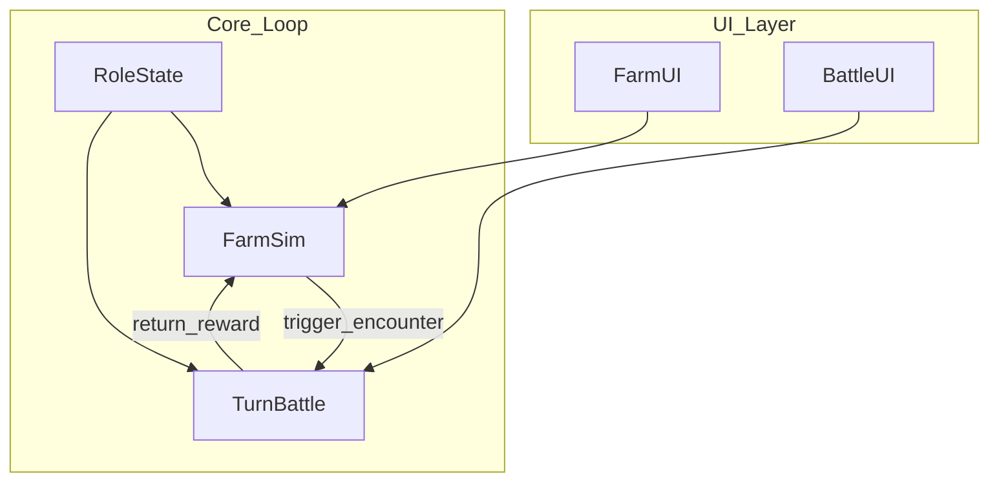
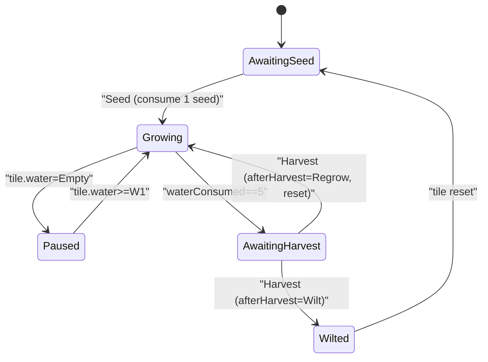
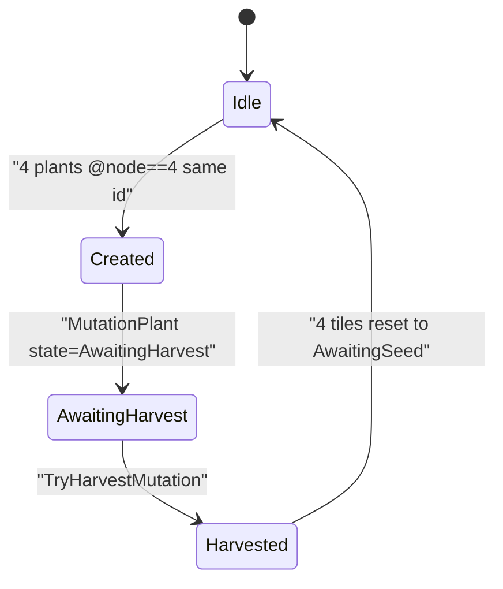
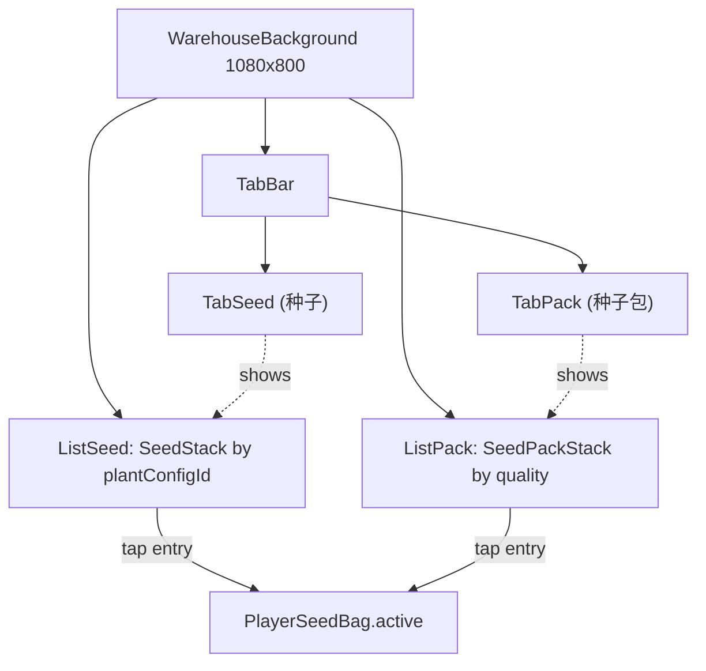
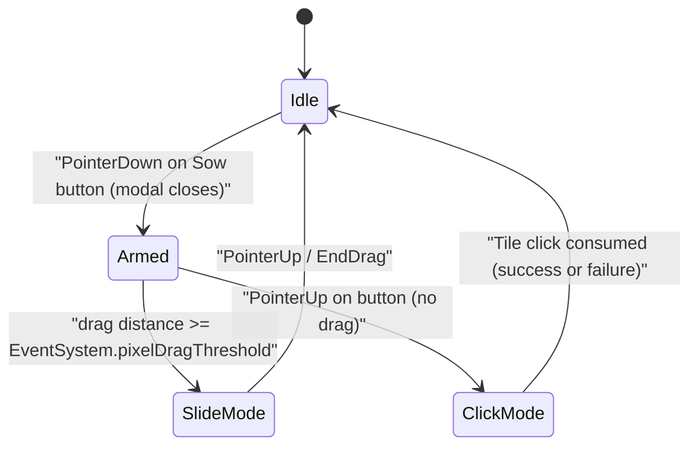
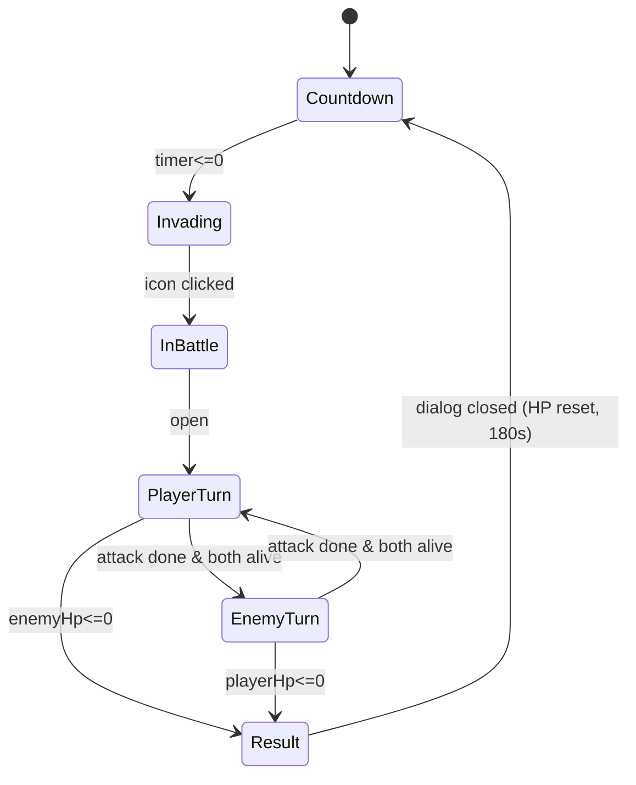

# 农场经营 + 回合战斗 手机游戏 Demo — 规格说明（SPEC）

# Farm Management + Turn-Based Battle Mobile Game Demo — Specification (SPEC)

---

## 术语与命名 / Glossary

**中文：** 本文档中 **Role** 专指由玩家操控的主角之显示名与剧情名；实现代码中可使用如 `PlayerRole`、`PlayerActor` 等类型名，以避免与引擎或语言保留概念混淆。  
**English:** In this document, **Role** is the display and narrative name of the player-controlled protagonist; implementation may use type names such as `PlayerRole` or `PlayerActor` to avoid confusion with engine or language reserved concepts.

**中文：** **设计基准分辨率** 指竖屏下逻辑设计画布为 **宽 1080 像素 × 高 1920 像素**（1080×1920）；UI 与布局以此为准，在其它物理分辨率上通过缩放与安全区适配。  
**English:** **Design baseline resolution** means a portrait logical design canvas of **1080 pixels wide × 1920 pixels tall** (1080×1920); UI and layout follow this baseline, with scaling and safe-area adaptation on other physical resolutions.

**中文：** **安全区** 指避开刘海、圆角与系统手势带的可交互内容区域；具体边距可在实现阶段按平台取 `Screen.safeArea` 或等价 API。  
**English:** **Safe area** is the region for interactive content that avoids notches, rounded corners, and system gesture areas; margins can be taken from `Screen.safeArea` or equivalent APIs per platform during implementation.

**中文：** **农场（Farm）** 指种植、生长、收获与资源产出的模拟模块（Demo 可极简）。  
**English:** **Farm** refers to the simulation module for planting, growth, harvest, and resource output (the demo may be minimal).

**中文：** **回合战斗（Turn-Based Battle）** 指按回合顺序结算行动的战斗模块。  
**English:** **Turn-based battle** refers to the combat module where actions are resolved in turn order.

**中文：** Unity 工程路径：`PetDemo_2/PetDemo_2`（相对仓库根目录）。  
**English:** Unity project path: `PetDemo_2/PetDemo_2` (relative to repository root).

**中文：** **1 阶 / 2 阶 / 3 阶属性（Tier-1 / Tier-2 / Tier-3 Attributes）** 指主角 Role 与战斗单位（含敌人）的分组数值集合：**1 阶**为基础战斗常量（攻击 `atk`、防御 `def`、生命 `maxHp/currentHp`、敏捷 `agility`），直接参与伤害与出手顺序；**2 阶**为施加方触发率（暴击率 `critRate`、连击率 `comboRate`、反击率 `counterRate`、格挡率 `blockRate`），取值范围 `0..1`；**3 阶**为承受方对应的抵消率（`critResist / comboResist / counterResist / blockResist`），同样 `0..1`，与 2 阶字段一一抵消。  
**English:** **Tier-1 / Tier-2 / Tier-3 Attributes** are grouped numeric stat sets carried by Role and any battle unit (including enemies): **Tier-1** are base combat constants (attack `atk`, defense `def`, life `maxHp/currentHp`, agility `agility`) that directly drive damage and turn order; **Tier-2** are attacker-side trigger rates (`critRate`, `comboRate`, `counterRate`, `blockRate`) in `0..1`; **Tier-3** are the defender-side resistances (`critResist`, `comboResist`, `counterResist`, `blockResist`) in `0..1`, paired one-to-one with Tier-2 fields to offset them.

---

## 1. 目标与范围 / Goals and Scope

**中文：** 本 Demo 旨在验证一条可玩闭环：玩家在农场完成至少一次「种植→等待/推进→收获→获得资源」，并可通过既定入口进入一场最小回合战斗，战斗结束后带着简单奖励或状态变化返回农场流程；全程以竖屏 1080×1920 为设计基准，主角统一称为 Role。  
**English:** This demo aims to validate one playable loop: the player completes at least one farm cycle of “plant → wait/advance → harvest → gain resources,” can enter one minimal turn-based battle through a defined entry point, and returns to the farm flow with simple rewards or state changes; the whole experience uses portrait 1080×1920 as the design baseline, and the protagonist is consistently named Role.

**中文：** **范围内**：竖屏 UI 壳层、农场极简循环、回合战斗最小规则集、农场与战斗之间的场景或界面切换、Role 的基础属性在两侧系统中的体现（可简化为少量数值）。  
**English:** **In scope:** portrait UI shell, a minimal farm loop, a minimal turn-based rule set, navigation between farm and battle (scenes or UI flow), and Role’s basic attributes reflected in both systems (can be simplified to a few stats).

**中文：** **范围外（非目标）**：联网多人、账号与云存档、内购与广告、完整经济平衡、长剧情、大量关卡与敌人种类、高级 AI、本地化全流程（SPEC 双语仅为文档要求，不代表游戏内多语言成品）。  
**English:** **Out of scope (non-goals):** online multiplayer, accounts and cloud saves, IAP and ads, full economic balance, long narrative, large amounts of levels and enemy types, advanced AI, and full in-game localization (bilingual SPEC is documentation-only, not a shipped multilingual product).

---

## 2. 设计基准与显示 / Display and Safe Area

**中文：** 设计基准分辨率为 **1080×1920**，**竖屏**；宽度 1080、高度 1920 为逻辑像素（与 Canvas 参考分辨率一致）。  
**English:** The design baseline resolution is **1080×1920**, **portrait**; width 1080 and height 1920 are logical pixels (aligned with the Canvas reference resolution).

**中文：** 重要 UI（血条、主要按钮、作物格）应落在安全区内；背景可全屏铺色或铺图至边缘，但需避免关键信息贴边被裁切。  
**English:** Important UI (health bars, primary buttons, crop slots) should lie within the safe area; backgrounds may extend to full bleed, but critical information must not be clipped at edges.

**中文：** 触摸目标建议最小约 **44×44** 逻辑像素（或按平台指南取等价值），以保证手机可操作。  
**English:** Touch targets should be at least about **44×44** logical pixels (or equivalent per platform guidelines) for reliable mobile interaction.

**中文：** 当前 Unity 工程 `ProjectSettings` 中默认窗口尺寸可能仍为 **1920×1080** 习惯配置；**实现阶段**须将 Player 与 Game 视图策略与本文档的 **1080×1920 竖屏** 对齐（见第 8 节）。  
**English:** The Unity project `ProjectSettings` may still use **1920×1080** style defaults; **during implementation**, Player and Game view strategy must be aligned with this document’s **1080×1920 portrait** baseline (see Section 8).

---

## 3. 系统架构与流程 / System Design

**中文：** 建议划分为：**FarmSim**（农场模拟）、**TurnBattle**（回合战斗）、**RoleState**（Role 的跨场景属性与背包简化状态）、**FarmUI** / **BattleUI**（展示与输入）、**Navigation**（在农场与战斗之间切换场景或界面栈）。农场可在满足条件时触发战斗，战斗结束后将奖励写回 `RoleState` 与农场相关资源。  
**English:** Suggested modules: **FarmSim** (farm simulation), **TurnBattle** (turn-based combat), **RoleState** (cross-scene Role stats and simplified inventory), **FarmUI** / **BattleUI** (presentation and input), and **Navigation** (scene or UI-stack switches between farm and battle). The farm may trigger battle when conditions are met; after battle, rewards are written back to `RoleState` and farm-related resources.



**中文：** **数据流摘要**：UI 将玩家操作交给模拟或战斗核心；核心读写 `RoleState`；战斗结束通过 `return_reward` 更新农场可用资源或 Role 属性。  
**English:** **Data flow summary:** UI forwards player actions to simulation or battle cores; cores read/write `RoleState`; battle completion updates farm-available resources or Role stats via `return_reward`.

---

## 4. 核心玩法规则（草案）/ Core Gameplay Rules

### 4.1 种植系统 / Planting System

**中文：** 本节自 v0.5 起取代原「极简农场（`Empty/Planted/Growing/Mature` 四态）」，作为新的农场子系统。  
**English:** Since v0.5, this section replaces the previous "minimal farm (`Empty/Planted/Growing/Mature` four-state)" model and serves as the new farm subsystem.

#### 4.1.1 农田规模与分组 / Tile Layout

**中文：** **农田规模与分组**：固定 24 块农田，每 4 块为 1 组、共 6 组；每块农田同一时间最多容纳 1 株植物。UI 上以 6 行 × 4 列网格在 [UI0.png](PetDemo_2/Assets/Scenes/Air/UI/UI0.png) 主界面之上同屏可见，无需滚动。  
**English:** **Tile scale and grouping:** a fixed 24 tiles arranged as 6 groups of 4; each tile holds at most 1 plant at any moment. The UI presents a 6-row × 4-column grid overlaid on [UI0.png](PetDemo_2/Assets/Scenes/Air/UI/UI0.png), fully visible on screen with no scrolling.

**中文：** 农田按 `orderIndex` 1..24 排序（自上而下、每行内自左而右），轮训操作机制按此顺序扫描（详见 §10）。  
**English:** Tiles are ordered by `orderIndex` 1..24 (top-to-bottom, left-to-right within each row); the smart polling mechanism scans in this order (see §10).

#### 4.1.2 农田 5 维独立状态 / Five Independent Tile State Dimensions

**中文：** 每块农田同时持有以下五个互不耦合的子状态机；每一维必处于其唯一取值之一。  
**English:** Each tile holds the following five mutually-decoupled sub-state-machines simultaneously; each dimension must hold exactly one value.

| 维度 / Dimension | 取值 / Values | 说明 / Notes |
|---|---|---|
| `planting` | `AwaitingSeed` / `Seeded` | 待播种 / 已播种 |
| `fertilizer` | `AwaitingFertilizer` / `Fertilized` / `None` | 待施肥 / 已施肥 / 未激活 |
| `water` | `Empty` / `W1` / `W2` / `W3` | 待浇水 / 浇水 1~3 阶；上限 W3，达到 W3 后不可再浇 / max W3, cannot water further once at W3 |
| `pest` | `AwaitingPestControl` / `PestControlled` / `None` | 待捉虫 / 已捉虫 / 未激活 |
| `harvest` | `AwaitingHarvest` / `Harvested` / `None` | 待收获 / 已收获 / 未激活 |

**中文：** `None` 仅当 `planting = AwaitingSeed`（即空田）时取，表示该维度尚未激活；一旦播种，对应维度立即转入有效初始取值（具体初值见 §4.1.4）。  
**English:** `None` is used only when `planting = AwaitingSeed` (empty tile), meaning the dimension is inactive; once seeded, the corresponding dimension immediately enters a valid initial value (see §4.1.4 for initial values).

#### 4.1.3 玩家可执行操作与统一按钮 / Player Actions and Unified Button

**中文：** 玩家共可执行 5 种操作：`播种 / Seed`、`浇水 / Water`、`施肥 / Fertilize`、`捉虫 / PestControl`、`收获 / Harvest`。**自 v2.9 起，`Seed`「播种」从统一按钮中下线**；**自 v2.10 起，`Fertilize`「施肥」也从统一按钮中下线**：统一按钮现仅承担 `Water / PestControl / Harvest` 3 种动作的动态切换，按当前焦点田的最高优先级显示文字与图标；`Seed` 的触发改由「种子仓库内播种触发按钮 + 手势」承担（详见 §9.4.6），`Fertilize` 的触发改由「主界面施肥入口按钮 + 肥料仓库 + 农田点击」三段式承担（详见 §9.7）。具体统一按钮的扫描与优先级算法见 §10。  
**English:** The player has 5 actions in total: `Seed`, `Water`, `Fertilize`, `PestControl`, `Harvest`. **Since v2.9, `Seed` is removed from the unified action button**; **since v2.10, `Fertilize` is also removed from the unified action button**: the unified button now dynamically switches only among `Water / PestControl / Harvest` based on the focused tile's highest-priority action. `Seed` is triggered through the in-warehouse sow button + gesture instead (see §9.4.6); `Fertilize` is triggered through a three-stage flow: main-menu fertilize entry button + fertilizer warehouse modal + tile tap (see §9.7). See §10 for the unified-button scan and priority algorithms.

**中文：** 统一按钮操作优先级（v2.10 起）：`收获 > 浇水1阶 > 浇水2阶 > 浇水3阶`；其中 `浇水1阶/2阶/3阶` 分别表示把当前水位从 `Empty -> W1`、`W1 -> W2`、`W2 -> W3` 的那一次浇水。`Seed` 与 `Fertilize` 均不再出现在该链中。  
**English:** Unified-button action priority (since v2.10): `Harvest > Water stage 1 > Water stage 2 > Water stage 3`; the three water stages mean the water actions that advance `Empty -> W1`, `W1 -> W2`, and `W2 -> W3` respectively. Both `Seed` and `Fertilize` are no longer in this chain.

**中文：** **「播种」操作的活跃道具来源**：种子仓库中存放两类道具——「具体种子（Seed）」与「种子包（SeedPack）」。玩家在仓库中选中其一作为 `PlayerSeedBag.active`（详见 §5、§9.4）；当焦点田进入「播种」分支时，按 `active.kind` 决定具体行为：  
- `Seed`：直接产出与该 `plantConfigId` 对应的固定植物；  
- `SeedPack`：按该品质对应的固定权重表（同品质 = 同内容，详见附录 B.4）随机抽取 1 种 `plantConfigId` 后产出植物。  

无论哪一分支，最终在农田上创建 `PlantInstance` 的初始化逻辑（`waterConsumed=0`、`tile.planting=Seeded` 等）保持一致，详见 §4.1.4。  
**English:** **Active item source for the `Seed` action:** the seed warehouse stores two item categories — concrete `Seed` and `SeedPack`. The player picks one as `PlayerSeedBag.active` (see §5 and §9.4). When the focused tile enters the `Seed` branch, behavior depends on `active.kind`:  
- `Seed`: directly produces the fixed plant for that `plantConfigId`;  
- `SeedPack`: weighted-rolls one `plantConfigId` from the fixed contents table of that quality (same quality = same contents; see Appendix B.4) and then produces the plant.  

Either branch ends with the same `PlantInstance` initialization on the tile (`waterConsumed=0`, `tile.planting=Seeded`, etc.); see §4.1.4 for full details.

#### 4.1.4 植物状态机与生长进程 / Plant State Machine and Growth Process

**中文：** 植物状态：`Growing`（生长）/ `Paused`（暂停生长）/ `AwaitingHarvest`（待收获）/ `Wilted`（枯萎）。植物维护 `waterConsumed (0..5)` 与 `appearanceNode (1..5)` 两个数值字段，并以 `currentStageRemainingSec` 跟踪当前一阶水的剩余倒计时。  
**English:** Plant states: `Growing` / `Paused` / `AwaitingHarvest` / `Wilted`. Each plant maintains numeric fields `waterConsumed (0..5)`, `appearanceNode (1..5)`, and `currentStageRemainingSec` for the current water-stage countdown.

**中文：** **生长进程规则（核心）**：

1. **播种**：自 v2.9 起，触发入口改为 `IPlantingService.TrySeedTile(tileId)`（由 §9.4.6 的仓库内播种按钮 + 手势驱动），统一按钮不再触发该分支。命中 `tile.planting==AwaitingSeed && active!=null && countOf(active)>0` 后，依据 `PlayerSeedBag.active.kind` 分两支处理（详见 §4.1.3、§5、附录 B.4）：
   - **`Seed` 分支**：消耗 `SeedStack(active.id)` 中 1 个 → 选定 `plantConfigId = active.id`。
   - **`Pack` 分支**：消耗 `SeedPackStack(active.id)`（即对应品质堆）中 1 个 → 调用 `RollSeedPack(active.id) → plantConfigId`，按附录 B.4 的固定权重表随机抽取一种作物，并触发 `OnSeedRolledFromPack(tileId, packQuality, rolledPlantConfigId)`。
   
   两分支汇合后：在该田创建 `PlantInstance` 并进入 `Growing`；初值 `waterConsumed=0`、`appearanceNode=1`、`currentStageRemainingSec=baseStageSeconds`；同时设置 `tile.planting=Seeded`、`tile.fertilizer=AwaitingFertilizer`、`tile.harvest=AwaitingHarvest`、`tile.pest=PestControlled`、`tile.water=Empty`。
2. **暂停 / 恢复**：`tile.water=Empty` 时植物处于 `Paused`，倒计时冻结；`tile.water∈{W1,W2,W3}` 时植物处于 `Growing`，倒计时按当前速度推进。
3. **倒计时结束**：执行 `tile.water` 阶 −1、`waterConsumed +=1`、`appearanceNode = min(5, waterConsumed+1)`、重置 `currentStageRemainingSec=baseStageSeconds`。若 `tile.water` 减为 `Empty`，植物切换为 `Paused`。
4. **施肥加速**：当 `tile.fertilizer=Fertilized` 时，倒计时按 ×1.5 速度推进（即 `currentStageRemainingSec` 每秒减少 1.5 秒，等价于剩余时间整体 ×0.667）。
5. **待收获判定**：`waterConsumed == 5` 时立即进入 `AwaitingHarvest`，停止倒计时；同时把 `tile.harvest` 推为 `AwaitingHarvest`，并强制将 `tile.fertilizer` 复位为 `AwaitingFertilizer`（允许下一周期再次施肥）。

**English:** **Growth process rules (core):**

1. **Seeding:** since v2.9, the entry point is `IPlantingService.TrySeedTile(tileId)` (driven by the in-warehouse sow button + gesture in §9.4.6); the unified action button no longer triggers this branch. After confirming `tile.planting==AwaitingSeed && active!=null && countOf(active)>0`, branch by `PlayerSeedBag.active.kind` (see §4.1.3, §5, Appendix B.4):
   - **`Seed` branch:** consume 1 from `SeedStack(active.id)` → choose `plantConfigId = active.id`.
   - **`Pack` branch:** consume 1 from `SeedPackStack(active.id)` (the stack of that quality) → invoke `RollSeedPack(active.id) → plantConfigId` to weighted-sample one crop from the fixed contents table in Appendix B.4, and fire `OnSeedRolledFromPack(tileId, packQuality, rolledPlantConfigId)`.
   
   After either branch: create a `PlantInstance` on the tile and enter `Growing`; initial values `waterConsumed=0`, `appearanceNode=1`, `currentStageRemainingSec=baseStageSeconds`; tile flags set to `tile.planting=Seeded`, `tile.fertilizer=AwaitingFertilizer`, `tile.harvest=AwaitingHarvest`, `tile.pest=PestControlled`, `tile.water=Empty`.
2. **Pause / resume:** when `tile.water=Empty`, the plant is `Paused` with the countdown frozen; when `tile.water∈{W1,W2,W3}`, the plant is `Growing` with the countdown active at the current speed.
3. **Countdown end:** apply `tile.water` stage −1, `waterConsumed +=1`, `appearanceNode = min(5, waterConsumed+1)`, and reset `currentStageRemainingSec=baseStageSeconds`. If `tile.water` falls to `Empty`, the plant switches to `Paused`.
4. **Fertilizer acceleration:** when `tile.fertilizer=Fertilized`, the countdown advances at ×1.5 speed (i.e. `currentStageRemainingSec` decreases by 1.5 per real second, equivalent to overall remaining time ×0.667).
5. **Maturity:** as soon as `waterConsumed == 5` the plant enters `AwaitingHarvest` and the countdown stops; the tile's `harvest` is pushed to `AwaitingHarvest`, and `tile.fertilizer` is forcibly reset to `AwaitingFertilizer` (allowing fertilization in the next cycle).

#### 4.1.5 收获结算 / Harvest Resolution

**中文：** 玩家执行「收获」后，依据 `PlantConfig.afterHarvest` 选择分支：

- **`Wilt`（一次性 / annual）**：销毁 `PlantInstance`，农田全维度复位为初始（`planting=AwaitingSeed`、`fertilizer/pest/harvest=None`、`water=Empty`、`plantInstanceId=null`）。
- **`Regrow`（多次性 / perennial）**：保留 `PlantInstance`，重置 `waterConsumed=0`、`appearanceNode=1`、`state=Growing`；同时 `tile.harvest=AwaitingHarvest`、`tile.fertilizer=AwaitingFertilizer`、`tile.pest=PestControlled`、`tile.water` 保留当前阶（玩家可继续利用先前剩余的水）。

**中文（自 v3.27 起，v3.44 修订数量字段）：** 普通农田收获成功后，将 `max(1, PlantConfig.harvestFruitCount)` 份「果实」按 `plantConfigId` 堆叠写入 `GameSession.fruitBag`（详见 §4.1.11），**不**再直接修改 `RoleStats`。`harvestRewardStat` 仍保留在 `PlantConfig` 中，供农田 Tips 等展示关联；`eatBuffIconResource` 供吃下果实时的**纯演示** Buff 图标（不参与战斗结算）。  
**English (since v3.27, v3.44 revises count field):** After a normal tile harvest succeeds, add `max(1, PlantConfig.harvestFruitCount)` **fruit** units stacked by `plantConfigId` into `GameSession.fruitBag` (see §4.1.11); **do not** write `RoleStats` directly. `harvestRewardStat` remains for tile-tip association text; `eatBuffIconResource` is a **presentation-only** buff icon after eating fruit (no battle stat writes).

**English:** When the player performs `Harvest`, the branch is selected by `PlantConfig.afterHarvest`:

- **`Wilt` (annual):** destroy the `PlantInstance` and reset all tile dimensions to initial (`planting=AwaitingSeed`, `fertilizer/pest/harvest=None`, `water=Empty`, `plantInstanceId=null`).
- **`Regrow` (perennial):** keep the `PlantInstance`, reset `waterConsumed=0`, `appearanceNode=1`, `state=Growing`; set `tile.harvest=AwaitingHarvest`, `tile.fertilizer=AwaitingFertilizer`, `tile.pest=PestControlled`; `tile.water` keeps its current stage (the player may continue to use any leftover water).

#### 4.1.6 外围事件 / 捉虫 / External Event and Pest Control

**中文：** 植物处于 `Growing` 时，外围事件调度器按植物 `pestEventIntervalSec` 与 `pestEventProb` 配置抽取触发：成功触发即将 `tile.pest` 翻为 `AwaitingPestControl`。玩家执行「捉虫」后翻回 `PestControlled`。**捉虫的具体玩法（如小游戏、判定规则、未及时处理的负面收益）暂列为 P1，待后续补充**；Demo 实现为单击即完成、暂不影响生长倒计时。  
**English:** While a plant is `Growing`, an external event scheduler samples per-plant `pestEventIntervalSec` and `pestEventProb` config: on success it flips `tile.pest` to `AwaitingPestControl`. Performing `PestControl` flips it back to `PestControlled`. **The detailed pest-catch gameplay (mini-game, hit checks, penalties for inaction) is P1, pending later definition**; the demo implements it as a single tap with no current effect on the growth countdown.

#### 4.1.7 5 节点外观映射 / Five-Node Appearance Mapping

**中文：** 植物外观节点 = `min(5, waterConsumed + 1)`。播种瞬间为节点 1；每消耗 1 阶水 +1；消耗第 4 阶水后到达节点 5，对应「待收获」外观。具体精灵 ID 与作物列表见附录 B。  
**English:** Appearance node = `min(5, waterConsumed + 1)`. Seeding sets node 1; each water-stage consumed advances by 1; after the 4th stage consumed the plant reaches node 5 — the "awaiting harvest" appearance. Sprite IDs and crop list are listed in Appendix B.

#### 4.1.8 植物状态机示意 / Plant State Machine Diagram



#### 4.1.9 可砍需求 / Cuttables

**中文：** 捉虫小游戏、施肥/浇水的资源消耗、虫害负面收益、土壤肥力衰减、天气与季节——首版 SPEC 不纳入 P0。  
**English:** **Cuttables:** pest mini-game, fertilizer/water resource costs, pest damage penalties, soil fertility decay, weather and seasons — not in P0.

#### 4.1.10 农田变异机制 / Group Mutation (v3.17)

**中文：** 自 v3.17 起，在 §4.1 种植系统之上叠加一层「同组同 ID 同步成熟」奖励玩法：当同一行 4 田全部满足触发条件时，4 株 `PlantInstance` 即时被一株「四格植物」（`MutationPlant`）替换，并直接进入 `AwaitingHarvest`；玩家点击该 4 格植物收获时，按 50% / 50% 分流为「精灵植物」或「技能植物」，弹窗展示对应配置内容。本子系统不替换原有种植 5 维状态机，仅在触发时**临时锁定**这 4 田。  
**English:** Since v3.17, a "same-row-same-ID-synchronized maturation" bonus mechanic is layered on top of §4.1: when all 4 tiles in a single row satisfy the trigger condition, the 4 `PlantInstance`s are instantly replaced by one "four-tile plant" (`MutationPlant`) which enters `AwaitingHarvest` directly; tapping the harvest icon on it resolves a 50/50 roll between "Pet plant" and "Skill plant", revealing the corresponding config in a modal. This subsystem does not replace the planting state machine — it only temporarily **locks** the four tiles while the mutation is active.

**中文（产品配置 v3.27）：** 当前 Demo **默认关闭**上述「四格合并」触发：`PlantingService` 内 `kRowMutationTriggerEnabled == false` 时不调用 `TryTriggerMutationForTile`，不产生新 `MutationPlant`；同组四田各自继续浇水至自然 `AwaitingHarvest`。实现代码与 §4.1.10 数据结构（`MutationPlant`、`MutationOverlayView` 等）保留，将来将常量改为 `true` 即可恢复。  
**English (product config v3.27):** In the current demo the row-merge trigger above is **off by default:** when `PlantingService.kRowMutationTriggerEnabled` is `false`, `TryTriggerMutationForTile` is not invoked and no new `MutationPlant` is created; the four tiles in a group continue watering independently to natural `AwaitingHarvest`. Implementation and §4.1.10 data structures (`MutationPlant`, `MutationOverlayView`, etc.) remain so flipping the constant back to `true` can re-enable the feature.

##### 4.1.10.1 分组与触发条件 / Grouping and Trigger

**中文：** **分组定义**：与 §4.1.1 / §9.1 的视觉分组完全一致——每行 4 田为 1 组，`groupIndex = ((orderIndex - 1) / 4) + 1`，共 6 组；第 1 组成员 `orderIndex ∈ {1,2,3,4}`，第 6 组成员 `orderIndex ∈ {21,22,23,24}`。  
**English:** **Grouping:** identical to the visual grouping in §4.1.1 / §9.1 — each row of 4 tiles is one group, with `groupIndex = ((orderIndex - 1) / 4) + 1`, totaling 6 groups; group 1 has `orderIndex ∈ {1..4}`, group 6 has `orderIndex ∈ {21..24}`.

**中文：** **触发条件（必须 4 项全部满足）**：
1. 4 田 `tile.planting == Seeded` 且 `tile.lockedByMutationId` 均为空。
2. 4 田 `tile.plantInstanceId` 均非空，对应 4 株 `PlantInstance` 存在。
3. 4 株 `PlantInstance` 的 `plantConfigId` 完全相同。
4. 4 株 `PlantInstance` 的 `appearanceNode == 4`（即已消耗 3 阶水，尚未自然进入 `AwaitingHarvest`）。

**English:** **Trigger condition (all four required):**
1. All 4 tiles have `tile.planting == Seeded` and empty `tile.lockedByMutationId`.
2. All 4 tiles have non-empty `tile.plantInstanceId` with corresponding `PlantInstance`s present.
3. All 4 `PlantInstance`s share the same `plantConfigId`.
4. All 4 `PlantInstance`s have `appearanceNode == 4` (i.e. consumed 3 water stages and not yet naturally `AwaitingHarvest`).

**中文：** **检测时机**：仅在 `AdvanceOneStage` 把某株植物的 `appearanceNode` 推进到 4 后立即检测一次该植物所在组；其它路径（播种、收获、施肥、外围事件）不触发检测。一旦组内任意一株推进到 `appearanceNode == 5` 或 `AwaitingHarvest`，该组本周期的窗口期结束，玩家若想再次触发，需重新走「Seed → 浇水到 node==4」的流程（与 §4.1.5 一致）。  
**English:** **Detection timing:** only checked once whenever `AdvanceOneStage` advances a plant's `appearanceNode` to 4, examining that plant's group; no other path (seed, harvest, fertilize, external event) triggers detection. Once any plant in the group advances to `appearanceNode == 5` or `AwaitingHarvest`, the window for this cycle is closed and the player must replant and re-water back to node 4 to retry (consistent with §4.1.5).

##### 4.1.10.2 变异执行 / Mutation Execution

**中文：** 满足触发条件后，按以下顺序原子执行：
1. **品类抽签**：按 50% / 50% 抽取 `MutationKind ∈ {Pet, Skill}`；若中签的列表为空则降级到另一类型，二者皆空时记录 Warning 并放弃本次变异（4 田保持原状，玩家可继续浇水自然成熟）。
2. **内容抽签**：从 `petConfigs` 或 `skillConfigs` 中均匀随机选 1 条 `refId`。
3. **删除 4 株植物**：从 `session.plants` 与 `plantById` 中移除 4 株 `PlantInstance`。
4. **写入 4 田锁定**：4 田 `lockedByMutationId = mutationId`；同时把这 4 田的 5 维子状态写为 `planting=Seeded`、`fertilizer=None`、`water=Empty`、`pest=None`、`harvest=None`、`plantInstanceId=null`（即"被托管在变异植物之下"，UI 不再渲染单格植物或徽标）。
5. **创建 `MutationPlant`**：写入 `session.mutations`，字段 `instanceId / kind / refId / groupIndex / tileIds (4) / state=AwaitingHarvest`。
6. **事件**：依次触发 4 次 `OnTileFlagsChanged(tileId)`、最后触发一次 `OnMutationCreated(mutationId)`。

**English:** After the trigger passes, execute atomically in this order:
1. **Kind roll:** 50% / 50% pick `MutationKind ∈ {Pet, Skill}`; if the chosen list is empty fall back to the other; if both empty, log a warning and skip (4 tiles unchanged, player can continue watering to natural maturity).
2. **Content roll:** uniformly pick a `refId` from `petConfigs` or `skillConfigs`.
3. **Delete 4 plants:** remove the 4 `PlantInstance`s from `session.plants` and `plantById`.
4. **Lock 4 tiles:** set `lockedByMutationId = mutationId` on the 4 tiles; also reset their 5-dimension state to `planting=Seeded`, `fertilizer=None`, `water=Empty`, `pest=None`, `harvest=None`, `plantInstanceId=null` (i.e. "hosted under the mutation plant", and UI suppresses per-tile plant rendering).
5. **Create `MutationPlant`:** push to `session.mutations` with fields `instanceId / kind / refId / groupIndex / tileIds (4) / state=AwaitingHarvest`.
6. **Events:** fire `OnTileFlagsChanged(tileId)` 4 times in `orderIndex` ascending order, then `OnMutationCreated(mutationId)` once.

##### 4.1.10.3 锁定语义 / Lock Semantics

**中文：** 当 `tile.lockedByMutationId != null` 时，该田对所有玩家操作短路：
- §4.1.3 五动作（`Seed / Water / Fertilize / PestControl / Harvest`）的 `IsXxxActionable` 起始判定一律 `return false`；
- §10 智能轮训 `FindNextAction` 不会扫描到该田；
- §9.1.1 农田 Tips 的"已种植且非待收获"分支不再触发；
- §9.7 三段式施肥的 tile 点击不写入肥料。

**English:** When `tile.lockedByMutationId != null`, the tile short-circuits every player action:
- the §4.1.3 five-action `IsXxxActionable` checks all `return false` upfront;
- §10 smart polling `FindNextAction` never scans this tile;
- the §9.1.1 "planted & not awaiting harvest" tip branch never triggers;
- the §9.7 fertilize-tap path does not apply fertilizer.

##### 4.1.10.4 收获结算 / Harvest Resolution

**中文：** `MutationPlant` 不参与统一按钮的优先级链，仅响应「直接点击」（由 §5.2 `MutationOverlayView` 中的图标点击转发）。**自 v3.20 起，`MutationOverlayView` 的四格植物图标按 `MutationKind` 区分资源：`kind=Pet` 使用 `Resources/AirUI/DaShouHuo_1`，`kind=Skill` 使用 `Resources/AirUI/DaShouHuo_2`**。点击后调用 `IPlantingService.TryHarvestMutation(mutationId)`，按以下顺序执行：
1. 校验 `mutation` 存在且 `state == AwaitingHarvest`；否则返回 `false`。
2. `mutation.state = Harvested`；从 `session.mutations` 中移除。
3. 4 田 `lockedByMutationId = null`，并按 `Wilt` 路径全维度复位（`planting=AwaitingSeed`、`fertilizer/pest/harvest=None`、`water=Empty`、`plantInstanceId=null`）。
4. 触发 4 次 `OnTileFlagsChanged(tileId)`，再触发一次 `OnMutationHarvested(mutationId, kind, refId)`；UI 层据此弹窗。

**English:** `MutationPlant` does not participate in the unified-button priority chain; it only responds to **direct taps** forwarded by §5.2 `MutationOverlayView`. **Since v3.20, the four-tile mutation icon is selected by `MutationKind`: `kind=Pet` uses `Resources/AirUI/DaShouHuo_1`, and `kind=Skill` uses `Resources/AirUI/DaShouHuo_2`.** The tap calls `IPlantingService.TryHarvestMutation(mutationId)`, executed in order:
1. Verify the mutation exists and `state == AwaitingHarvest`; otherwise return `false`.
2. Set `mutation.state = Harvested` and remove from `session.mutations`.
3. Set `lockedByMutationId = null` on the 4 tiles and reset all dimensions per the `Wilt` path (`planting=AwaitingSeed`, `fertilizer/pest/harvest=None`, `water=Empty`, `plantInstanceId=null`).
4. Fire 4 `OnTileFlagsChanged(tileId)` events, then `OnMutationHarvested(mutationId, kind, refId)`; the UI layer renders the modal accordingly.

##### 4.1.10.5 弹窗规则 / Reveal Modal

**中文：** 弹窗（`MutationRevealPopupView`）以半透明遮罩 + 中央面板形式呈现：
- **Pet 分支**：左侧通过 `PetPreviewRig`（独立 `Camera + RenderTexture`，渲染 Spine `SkeletonAnimation` 预制体）输出到 `RawImage`；右侧两行文本展示 `PetConfig.displayName`、`PetConfig.traitDescription`；动画从 `PetConfig.randomAnimations` 中均匀抽签选 1 个，若列表为空则使用 `SkeletonAnimation` 当前默认动画。
- **Skill 分支**：左侧 `Image.sprite = Resources.Load<Sprite>(SkillConfig.iconResource)`；右侧两行文本展示 `SkillConfig.displayName`、`SkillConfig.description`。
- **Skill 图标缩放约束（v3.19）**：`LeftPreview/SkillIcon` 的本地缩放固定为 `localScale = (0.5, 0.5, 1)`，用于在保持 `preserveAspect=true` 前提下避免技能图标在 360×360 预览容器中过大占位。

弹窗仅由 `OnMutationHarvested` 驱动；点击遮罩或关闭按钮关闭，关闭时销毁 Pet 实例并停止预览 Camera 渲染。

**English:** The modal (`MutationRevealPopupView`) renders a dim layer + center panel:
- **Pet branch:** left side uses `PetPreviewRig` (its own `Camera + RenderTexture` rendering a Spine `SkeletonAnimation` prefab) blitted into a `RawImage`; right side shows two lines `PetConfig.displayName`, `PetConfig.traitDescription`; the animation is uniformly sampled from `PetConfig.randomAnimations`, falling back to the prefab's default animation if empty.
- **Skill branch:** left side uses `Image.sprite = Resources.Load<Sprite>(SkillConfig.iconResource)`; right side shows `SkillConfig.displayName`, `SkillConfig.description`.
- **Skill icon scale constraint (v3.19):** `LeftPreview/SkillIcon` keeps a fixed local scale `localScale = (0.5, 0.5, 1)` so that with `preserveAspect=true` the skill icon does not over-occupy the 360×360 preview container.

The modal is driven only by `OnMutationHarvested`; tapping the dim layer or close button dismisses it, destroys the Pet instance, and stops the preview camera.

##### 4.1.10.6 状态图 / Mutation State Diagram



#### 4.1.11 果实背包 / Fruit Bag (v3.27)

**中文：** 普通农田收获（§4.1.5 `TryHarvestTile` → `ApplyHarvest`）成功后，奖励以「果实」形式进入 `PlayerFruitBag`，按 `plantConfigId` 堆叠累加数量；收获本身 **不**改变 `RoleStats`。`PlantingService` 在写入后触发 `OnFruitBagChanged`；可选触发 `OnHarvestFruitReady(tileId, plantConfigId, count)` 供 UI 播放飞向果实入口的动效（不写入属性）。主界面提供「果实背包」入口按钮 + 半透明遮罩 + 只读列表（作物名、数量），布局约定见 §9.9。**自 v3.41 起**，§9.8.13 统一仓库面板把 `PlayerFruitBag` 作为果实槽数据源，并通过 `IPlantingService.EatOneFruit(plantConfigId)` / `EatFruitToFull(plantConfigId)` 把选中果实换算为 `RoleStats.stamina`（换算系数见 §9.8.13.6 与 `PlantConfig.fruitStaminaGain`）；§9.9 入口与本入口并行存在，互不替代。  
**English:** After a normal farm harvest (`TryHarvestTile` → `ApplyHarvest` in §4.1.5), rewards are stored as **fruit** in `PlayerFruitBag`, stacked and incremented by `plantConfigId`. Harvesting itself does **not** change `RoleStats`. `PlantingService` raises `OnFruitBagChanged` after writes; it may also raise `OnHarvestFruitReady(tileId, plantConfigId, count)` for optional UI flight toward the fruit-bag button (no stat write). The main menu exposes a fruit-bag entry, dim modal, and read-only list — see §9.9. **Since v3.41**, the §9.8.13 unified warehouse panel uses `PlayerFruitBag` as the data source for its fruit slot grid and converts the selected fruit into `RoleStats.stamina` via `IPlantingService.EatOneFruit(plantConfigId)` / `EatFruitToFull(plantConfigId)` (formula in §9.8.13.6 and `PlantConfig.fruitStaminaGain`); the §9.9 entry coexists with the §9.8.13 entries without replacement.

### 4.2 回合战斗 / Turn-Based Battle

**中文：** **Demo 极简目标**：单场战斗包含 **Role** 与 **至少一名敌人**；按 **敏捷（`agility`，原 `speed`）或固定先后** 决定出手顺序；每回合单位可选择 **攻击** 或 **防御**（Demo 可仅实现攻击）；一方 **HP ≤ 0** 则战斗结束。  
**English:** **Minimal demo goal:** one battle with **Role** and **at least one enemy**; turn order by **agility (`agility`, formerly `speed`) or fixed order**; each turn a unit may **attack** or **defend** (demo may implement attack only); battle ends when one side has **HP ≤ 0**.

**中文：** 伤害公式首版可采用：`damage = max(1, attacker.atk - defender.def)`，再按需取整；后续平衡调整须先更新 SPEC。  
**English:** Initial damage formula: `damage = max(1, attacker.atk - defender.def)`, rounded as needed; balance changes require SPEC updates first.

**中文：** **2/3 阶属性的 P0 行为**：本阶段仅作为 `RoleStats` 中的可读字段与 UI 展示数据，**不参与** `damage = max(1, attacker.atk - defender.def)` 的实际结算；P0 期间无论 `critRate / comboRate / counterRate / blockRate` 与对应抵消率取何值，伤害公式不变。出手顺序仍由 1 阶 `agility` 驱动（与原 `speed` 同义）。  
**English:** **Tier-2/3 P0 behavior:** during P0 these are read-only fields on `RoleStats` for UI display only and **do not** participate in the actual `damage = max(1, attacker.atk - defender.def)` resolution; regardless of the values of `critRate / comboRate / counterRate / blockRate` and their resistances, the damage formula stays unchanged in P0. Turn order is still driven by Tier-1 `agility` (same semantics as the legacy `speed`).

**中文：** **P1 接入占位**：当 2/3 阶进入战斗结算时，建议判定顺序为 `暴击 → 连击 → 反击 → 格挡`，每项以 `effectiveRate = clamp(attackerRate - defenderResist, 0, 1)` 抵消思路计算最终触发率；具体随机化、与基础伤害的乘加关系、与 `defend` 行动的叠加规则均留待 P1 SPEC 细化（变更必须先更新本节）。  
**English:** **P1 hookup placeholder:** when Tier-2/3 enter battle resolution, the proposed check order is `Crit → Combo → Counter → Block`; each uses `effectiveRate = clamp(attackerRate - defenderResist, 0, 1)` to derive the final trigger rate; randomization, multiplicative/additive interaction with base damage, and stacking with the `Defend` action are all deferred to P1 SPEC details (any change must update this section first).

**中文：** **可砍需求**：技能树、元素克制、Buff/Debuff 复杂栈、多目标与位置——首版 SPEC 不纳入 P0。  
**English:** **Cuttable for later:** skill trees, elemental counters, complex buff/debuff stacks, multi-target positioning — not in P0.

### 4.3 串联 / Linking Farm and Battle

**中文：** 进入战斗的条件示例：收获达到指定次数、或点击「试炼」按钮消耗 `CropToken`；实现任选其一即可满足 Demo。  
**English:** Example battle entry conditions: harvest count threshold, or a “trial” button consuming `CropToken`; implementing any one satisfies the demo.

**中文：** 战斗胜利奖励示例：增加金币、恢复 Role HP、或解锁下一作物；Demo 至少实现一种可感知反馈。  
**English:** Example victory rewards: gold increase, Role HP restore, or unlocking the next crop; the demo should implement at least one clear feedback.

---

## 5. 数据结构 / Data Structures

**中文：** 以下为逻辑结构草案；字段名在实现中应保持一致，变更须同步 SPEC。  
**English:** The following are logical schema drafts; field names should stay consistent in code, and changes must sync back to the SPEC.

```text
// RoleStats — 主角 Role（与所有战斗单位）的可战斗与可展示属性
// 字段按 1/2/3 阶分组；1 阶为整数，2/3 阶为 0..1 的浮点
// RoleStats — combat & display stats for Role and any battle unit (incl. enemies)
// Fields grouped by Tier-1/2/3; Tier-1 are ints, Tier-2/3 are floats in [0,1]
struct RoleStats {
  string displayName;       // 固定为 "Role" / fixed "Role"
  // ---- Tier-1：基础战斗属性 / Base combat stats ----
  int atk;                  // 攻击 / attack
  int def;                  // 防御 / defense
  int maxHp;                // 生命上限 / max life
  int currentHp;            // 当前生命 / current life
  int agility;              // 敏捷；决定出手顺序；Demo 可恒为 10
                            // agility; drives turn order; demo may fix at 10
                            // 取代旧字段 speed（同义重命名，见 §11 v0.6）
                            // replaces the legacy field "speed" (rename, see §11 v0.6)
  // ---- 体力（v3.40 新增，见 §9.8.12） / Stamina (new in v3.40, see §9.8.12) ----
  int stamina;              // 体力当前值，整数 [0, staminaMax]；默认 0
                            // current stamina, integer in [0, staminaMax]; default 0
  int staminaMax;           // 体力上限；默认 100；本期固定不变
                            // stamina max; default 100; immutable in this release
                            // 写入入口仅有 IPlantingService.EatOne / EatToFull
                            // only writers: IPlantingService.EatOne / EatToFull
                            // 「主角已吃饱」≡ stamina == staminaMax
                            // "role is full" ≡ stamina == staminaMax
  // ---- Tier-2：施加方触发率（0..1） / Attacker trigger rates [0,1] ----
  float critRate;           // 暴击率 / crit rate
  float comboRate;          // 连击率 / combo rate
  float counterRate;        // 反击率 / counter rate
  float blockRate;          // 格挡率 / block rate
  // ---- Tier-3：承受方抵消率（0..1） / Defender resistances [0,1] ----
  float critResist;         // 抵消暴击率 / crit resist
  float comboResist;        // 抵消连击率 / combo resist
  float counterResist;      // 抵消反击率 / counter resist
  float blockResist;        // 抵消格挡率 / block resist
}

// Demo 默认值 / Demo defaults (Role)：
//   Tier-1: atk=10, def=5, maxHp=50, currentHp=50, agility=10
//   Stamina (v3.40): stamina=0, staminaMax=100
//   Tier-2: critRate=comboRate=counterRate=blockRate=0.05
//   Tier-3: critResist=comboResist=counterResist=blockResist=0.00
// 敌人模板 / Enemy templates 共用同形 RoleStats，2/3 阶默认全 0；具体平衡数值在 P1 实装时补全。
// Enemies share the same RoleStats schema with Tier-2/3 defaulted to 0;
// concrete balance values are supplied when P1 implementation lands.

// CropTile — 单块农田（5 维独立状态机，详见 §4.1.2）
// CropTile — single farm tile (five independent dimensions, see §4.1.2)
enum PlantingFlag   { AwaitingSeed, Seeded }
enum FertilizerFlag { None, AwaitingFertilizer, Fertilized }
enum WaterStage     { Empty, W1, W2, W3 }                  // 上限 W3 / max W3
enum PestFlag       { None, AwaitingPestControl, PestControlled }
enum HarvestFlag    { None, AwaitingHarvest, Harvested }

struct CropTile {
  string tileId;
  int orderIndex;                  // 1..24，决定轮训扫描顺序 / drives polling order
  PlantingFlag    planting;
  FertilizerFlag  fertilizer;
  WaterStage      water;
  PestFlag        pest;
  HarvestFlag     harvest;
  string plantInstanceId;          // 空表示无植物 / empty when AwaitingSeed
  string lockedByMutationId;       // v3.17：被同组变异植物锁定时写入 MutationPlant.instanceId；
                                   // 非空时所有 5 类操作短路返回 false（详见 §4.1.10.3）
                                   // v3.17: when locked by group mutation, holds MutationPlant.instanceId;
                                   // when non-empty all 5 actions short-circuit (see §4.1.10.3)
}

// 种子仓库道具体系（自 v0.6 起）：仓库内存放两类道具——
//   1) 具体「种子 / Seed」（按 plantConfigId 堆叠，1 个 = 1 颗固定植物）
//   2) 「种子包 / SeedPack」（按品质 quality 堆叠；同品质 = 同内容；播种瞬间开包）
// Seed warehouse item system (since v0.6): two item categories live in the warehouse —
//   1) concrete Seed (stacked by plantConfigId; 1 item = 1 fixed plant)
//   2) SeedPack    (stacked by quality; same quality = same contents; rolled on planting)

// SeedPackQuality — 种子包品质 4 级 / four pack-quality tiers
//  Common 普通(白) | Rare 稀有(蓝) | Epic 史诗(紫) | Legendary 传说(橙)
enum SeedPackQuality { Common, Rare, Epic, Legendary }

// SeedStack — 仓库中具体种子的堆叠条目，以 plantConfigId 为堆叠键
// SeedStack — concrete-seed stack in the warehouse, stacked by plantConfigId
struct SeedStack {
  string plantConfigId;            // 同时也是堆叠键 / also the stacking key
  int    count;
}

// SeedPackStack — 仓库中种子包的堆叠条目，以品质为堆叠键
// SeedPackStack — seed-pack stack in the warehouse, stacked by quality
struct SeedPackStack {
  SeedPackQuality quality;         // 同时也是堆叠键 / also the stacking key
  int             count;
}

// ActiveKind / ActiveSelection — 玩家当前选中的活跃道具（用于「播种」操作）
// ActiveKind / ActiveSelection — currently active item picked for the `Seed` action
enum ActiveKind { Seed, Pack }
struct ActiveSelection {
  ActiveKind kind;
  string     id;                   // kind=Seed 时为 plantConfigId / when Seed: plantConfigId
                                   // kind=Pack 时为 SeedPackQuality 的字符串值
                                   // when Pack: stringified SeedPackQuality
}

// PlayerSeedBag — 玩家的种子仓库（即背包，详见 §4.1.3 / §9 / §9.4）
// PlayerSeedBag — player's seed warehouse (serves as bag, see §4.1.3, §9, §9.4)
struct PlayerSeedBag {
  list<SeedStack>     seeds;       // 按 plantConfigId 堆叠 / stacked by plantConfigId
  list<SeedPackStack> seedPacks;   // 按 quality 堆叠       / stacked by quality
  ActiveSelection?    active;      // 当前活跃道具（最多一个，可空） / current active item, at most one
}

// SeedPackContents — 单一品质对应的固定权重表（同品质 = 同内容）
// SeedPackContents — fixed weighted contents per quality (same quality = same contents)
struct SeedPackContentsEntry {
  string plantConfigId;            // 抽中后产出的作物 / yielded crop on roll
  float  weight;                   // 相对权重，权重和不必为 1 / relative weight, sum need not be 1
}
struct SeedPackContents {
  SeedPackQuality              quality;
  list<SeedPackContentsEntry>  entries;
}

// 肥料道具体系（自 v2.10 起）：仓库内存放具名「肥料 / Fertilizer」道具
//   每种 FertilizerType 由 (id, displayName, speedMul, description, iconResource) 描述；
//   speedMul 在该次施肥生效期间覆盖 PlantConfig.fertilizerSpeedMul；description/iconResource
//   供 §9.7 预制体详情区与图标展示。具体的施肥触发流程见 §9.7。
// Fertilizer item system (since v2.10): named fertilizer items live in a dedicated
//   bag. Each FertilizerType is described by (id, displayName, speedMul, description,
//   iconResource); speedMul overrides PlantConfig.fertilizerSpeedMul when applied;
//   description/iconResource feed the §9.7 prefab detail area and icons.
//   Trigger flow is documented in §9.7.

// FertilizerType — 肥料静态配置（来自附录 B.7）
// FertilizerType — static fertilizer config (from Appendix B.7)
struct FertilizerType {
  string id;                       // 唯一 id；同时作为 FertilizerStack 的堆叠键
                                   // unique id; also the stacking key in FertilizerStack
  string displayName;              // 显示名（中文） / display name
  float  speedMul;                 // 该肥料生效时的倒计时速度倍率 / countdown speed mul when active
  string description;            // 道具描述（UI 详情区）；可空则回退 displayName / item description for UI; fallback to displayName when empty
  string iconResource;           // Resources 下 Sprite 路径（无扩展名），如 AirUI/ShiFei-1 / Resources sprite path for icon
}

// FertilizerStack — 肥料背包中的堆叠条目，以 fertilizerId 为堆叠键
// FertilizerStack — fertilizer bag stack, stacked by fertilizerId
struct FertilizerStack {
  string fertilizerId;             // 同时也是堆叠键 / also the stacking key
  int    count;
}

// PlayerFertilizerBag — 玩家的肥料仓库（即背包）
// PlayerFertilizerBag — player's fertilizer warehouse (serves as bag)
struct PlayerFertilizerBag {
  list<FertilizerStack> stacks;    // 按 fertilizerId 堆叠 / stacked by fertilizerId
  string?               activeId;  // 当前活跃肥料 id；空 = 未选 / current active fertilizer id; empty = none
}

// FruitStack — 果实背包堆叠条目（自 v3.27 起，见 §4.1.11）
// FruitStack — fruit bag stack entry (since v3.27, see §4.1.11)
struct FruitStack {
  string plantConfigId;            // 堆叠键 / stacking key
  int    count;
}

// PlayerFruitBag — 玩家果实背包（自 v3.41 起追加 activeId，用于 §9.8.13 统一仓库的"吃果实"流程）
// PlayerFruitBag — player's fruit bag (since v3.41: adds activeId for the §9.8.13 "eat fruit" flow)
struct PlayerFruitBag {
  list<FruitStack> stacks;         // 按 plantConfigId 堆叠 / stacked by plantConfigId
  string?          activeId;       // 当前选中果实的 plantConfigId；空 = 未选 / current selected fruit's plantConfigId; empty = none
}

// FoodConfig — 食物道具静态配置（自 v3.40 起，详见 §9.8.12）
// FoodConfig — static config of a food item (since v3.40, see §9.8.12)
struct FoodConfig {
  string id;                       // 唯一 id；也是 FoodStack 堆叠键 / unique id, also stacking key
  string displayName;              // 显示名（中文） / display name
  int    staminaGain;              // 单次食用回复的体力，固定 20（Demo 默认；预留可配置）
                                   // stamina restored per consumption; fixed 20 in Demo (configurable)
  string iconResourcePath;         // Resources 下 Sprite 路径（无扩展名），可空
                                   // Resources sprite path (no extension), nullable
  string description;              // 简短描述，可空 / short description, nullable
}

// FoodStack — 食物背包堆叠条目（以 foodId 为堆叠键）
// FoodStack — food bag stack entry (stacked by foodId)
struct FoodStack {
  string foodId;                   // 同时也是堆叠键 / also the stacking key
  int    count;
}

// PlayerFoodBag — 玩家食物仓库（即背包，自 v3.40 起）
// PlayerFoodBag — player's food warehouse (since v3.40)
struct PlayerFoodBag {
  list<FoodStack> stacks;          // 按 foodId 堆叠 / stacked by foodId
  string          activeId;        // 当前选中的食物 id；空 = 未选 / current selected; empty = none
}

// PlantConfig — 植物静态配置（来自附录 B 的配置表）
// PlantConfig — static plant config (from the table in Appendix B)
enum AfterHarvest { Wilt, Regrow }
struct PlantConfig {
  string id;
  string displayName;
  list<string> appearanceSpriteIds; // 长度 5：节点 1..5 / length 5: node 1..5
  string fruitIconResource;
  int harvestFruitCount;
  string eatBuffIconResource;
  // harvestRewardStat（实现：RoleStatType）、fruitStaminaGain 等见 C# `Models.PlantConfig`。
  float  baseStageSeconds;          // 每阶水倒计时基础秒数 / per-stage base seconds
  float  fertilizerSpeedMul;        // 默认 1.5 / default 1.5
  AfterHarvest afterHarvest;
  float  pestEventIntervalSec;      // 外围事件抽取间隔 / pest event sampling interval
  float  pestEventProb;             // 单次抽取触发概率 0..1 / per-sample probability
}

// PlantInstance — 在场植物运行时实例
// PlantInstance — runtime plant instance on a tile
enum PlantState { Growing, Paused, AwaitingHarvest, Wilted }
struct PlantInstance {
  string instanceId;
  string plantConfigId;             // 与 PlantConfig.id 对应 / matches PlantConfig.id
  string tileId;                    // 所在农田 / hosting tile
  PlantState state;
  int   waterConsumed;              // 0..5
  int   appearanceNode;             // 1..5，= min(5, waterConsumed + 1)
  float currentStageRemainingSec;   // 当前一阶水的剩余倒计时 / remaining countdown of current stage
}

// 农田变异机制（自 v3.17 起，见 §4.1.10）
// Group mutation mechanic (since v3.17, see §4.1.10)

// MutationKind — 变异植物的内容分支
// MutationKind — content branch of the mutation plant
enum MutationKind { Pet, Skill }

// MutationPlant — 一株「四格植物」的运行时实例；占据同组 4 田直到收获
// MutationPlant — runtime instance of a "four-tile plant"; locks 4 tiles in a group until harvested
struct MutationPlant {
  string instanceId;                 // 唯一 id；同时也是 CropTile.lockedByMutationId 的取值
                                     // unique id; also the value written to CropTile.lockedByMutationId
  MutationKind kind;
  string refId;                      // kind==Pet 时为 PetConfig.id；kind==Skill 时为 SkillConfig.id
                                     // PetConfig.id when Pet; SkillConfig.id when Skill
  int    groupIndex;                 // 1..6
  list<string> tileIds;              // 长度 4，按 orderIndex 升序
                                     // length 4, ordered by ascending orderIndex
  PlantState state;                  // 仅取 AwaitingHarvest / Harvested
                                     // only AwaitingHarvest / Harvested
}

// PetConfig — 精灵静态配置（来自附录 B.11）
// PetConfig — static pet config (from Appendix B.11)
struct PetConfig {
  string id;                         // 唯一 id / unique id
  string displayName;                // 中文展示名 / display name
  string traitDescription;           // 精灵特性描述（弹窗右栏第二行） / trait description (modal line 2)
  string prefabResource;             // Resources 下 GameObject 路径（不带扩展名），例 "Pets/Monster_11_Pure Slime"
                                     // Resources path of GameObject (no extension), e.g. "Pets/Monster_11_Pure Slime"
  list<string> randomAnimations;     // SkeletonAnimation 中可随机抽取的动画名；若空则使用预制体默认
                                     // animation names available for random pick on SkeletonAnimation;
                                     // empty falls back to the prefab's default
}

// SkillConfig — 技能静态配置（来自附录 B.12）
// SkillConfig — static skill config (from Appendix B.12)
struct SkillConfig {
  string id;                         // 唯一 id / unique id
  string displayName;                // 中文展示名 / display name
  string description;                // 技能描述（弹窗右栏第二行） / description (modal line 2)
  string iconResource;               // Resources 下 Sprite 路径（不带扩展名），例 "SkilIcon/Skill1001"
                                     // Resources sprite path (no extension), e.g. "SkilIcon/Skill1001"
}

// BattleUnit — 战斗中的单位实例
// BattleUnit — unit instance in battle
struct BattleUnit {
  string unitId;
  bool isPlayerControlled;  // Role 为 true / true for Role
  RoleStats stats;          // 敌我同形：均使用完整 1~3 阶 RoleStats
                            // shared schema: both sides use the full Tier-1/2/3 RoleStats
                            // 敌人 Tier-2/3 默认全 0，P0 不参与结算（见 §4.2）
                            // enemy Tier-2/3 default to 0, not active in P0 (see §4.2)
}

// BattleAction — 回合内行动
// BattleAction — action in a turn
enum ActionType { Attack, Defend, Pass }
struct BattleAction {
  string actorUnitId;
  ActionType type;
  string targetUnitId;      // Defend 可为空 / may be empty for Defend
}

// GameSession — Demo 级会话状态（非完整存档系统）
// GameSession — demo-level session state (not a full save system)
struct GameSession {
  RoleStats role;
  list<CropTile> farmTiles;          // 固定长度 24 / fixed length 24
  list<PlantInstance> plants;         // 当前在场植物 / live plants
  PlayerSeedBag seedBag;              // 种子仓库 = 背包 / warehouse-as-bag
  PlayerFertilizerBag fertilizerBag;  // 肥料仓库 = 背包（自 v2.10 起） / fertilizer bag (since v2.10)
  PlayerFruitBag fruitBag;             // 果实背包（自 v3.27 起，§4.1.11） / fruit bag (since v3.27, §4.1.11)
  PlayerFoodBag  foodBag;              // 食物仓库（自 v3.40 起，§9.8.12） / food bag (since v3.40, §9.8.12)
  list<FoodConfig> foodConfigs;        // 食物静态表（Demo 直接内置；P1 可改 CSV） / food configs (built-in for Demo)
  list<PlantConfig> plantConfigs;     // 由附录 B 数据加载 / loaded from Appendix B
  list<SeedPackContents> packContents; // 4 品质权重表，由附录 B.4 加载 / 4 quality tables, loaded from Appendix B.4
  list<FertilizerType> fertilizerTypes; // 肥料类型表，由附录 B.6 加载（自 v2.10 起） / fertilizer types from Appendix B.6 (since v2.10)
  list<MutationPlant> mutations;      // 当前在场的变异植物（自 v3.17 起） / live mutation plants (since v3.17)
  list<PetConfig>  petConfigs;        // 精灵静态表，由附录 B.11 加载（自 v3.17 起） / pet configs from Appendix B.11 (since v3.17)
  list<SkillConfig> skillConfigs;     // 技能静态表，由附录 B.12 加载（自 v3.17 起） / skill configs from Appendix B.12 (since v3.17)
  int cropTokens;
  bool battleUnlocked;                // 可选 / optional
}
```

---

## 6. 接口与交互 / APIs and Interactions

**中文：** 本 Demo **无对外 REST/HTTP API**；所有交互为客户端内 C# 接口与 UI 事件。  
**English:** This demo has **no external REST/HTTP APIs**; all interaction is in-client C# APIs and UI events.

**中文：** **输入**：单指触摸点击/短按；农场为地块与按钮；战斗为行动按钮（攻击/防御/结束回合若需要）。  
**English:** **Input:** single-finger tap/short press; farm uses tiles and buttons; battle uses action buttons (attack/defend/end turn if needed).

**中文：** **建议对内服务接口（概念层）**  
**English:** **Suggested internal service interfaces (conceptual)**

种植系统 / Planting system（自 v0.5 起取代 `IFarmService`）：

- `IPlantingService.SelectActive(kind, id)` — 设置当前活跃道具：`kind=Seed` 时 `id` 为 `plantConfigId`；`kind=Pack` 时 `id` 为 `SeedPackQuality` 字符串值（自 v0.6 起取代 `SelectActiveSeed`） / set the current active item: when `kind=Seed`, `id` is a `plantConfigId`; when `kind=Pack`, `id` is the stringified `SeedPackQuality` (replaces `SelectActiveSeed` since v0.6)
- `IPlantingService.GetActive() → ActiveSelection?` — 读取当前活跃道具 / read the current active selection
- `IPlantingService.RollSeedPack(quality) → plantConfigId` — 内部接口：按 `SeedPackContents[quality]` 的固定权重表抽取 1 种作物（详见附录 B.4） / internal: weighted-sample one crop from the fixed contents table for the quality (see Appendix B.4)
- `IPlantingService.SelectActiveFertilizer(fertilizerId)` — 自 v2.10 起新增：设置当前活跃肥料 id（写入 `PlayerFertilizerBag.activeId`）；`fertilizerId` 必须存在于 `GameSession.fertilizerTypes`，否则记录 Warning 并保持原值。成功后触发 `OnFertilizerBagChanged`。 / Since v2.10: set the active fertilizer id (writes `PlayerFertilizerBag.activeId`); the id must exist in `GameSession.fertilizerTypes`, otherwise log a warning and keep the previous value. Fires `OnFertilizerBagChanged` on success.
- `IPlantingService.GetActiveFertilizer() → string?` — 自 v2.10 起新增：读取当前活跃肥料 id（未选时返回空） / Since v2.10: read the current active fertilizer id (empty when none).
- `IPlantingService.GetFertilizerBag() → PlayerFertilizerBag` — 自 v2.10 起新增：返回 `GameSession.fertilizerBag` 引用（UI 刷新用） / Since v2.10: returns the `GameSession.fertilizerBag` reference for UI refresh.
- `IPlantingService.ApplyFertilizerToTile(tileId) → bool` — 自 v2.10 起新增：对指定 `tileId` 应用当前活跃肥料；失败原因（返回 `false`）：`tileId` 不存在 / `tile.fertilizer != AwaitingFertilizer` / `activeId == null` / `count(activeId) <= 0` / `activeId` 不在 `fertilizerTypes`。成功后将 `tile.fertilizer` 推为 `Fertilized`、库存 -1、并先后触发 `OnTileFlagsChanged(tileId)`、`OnFertilizerBagChanged`、`OnFertilizeApplied(tileId, fertilizerId)`；该次施肥的速度倍率取活跃 `FertilizerType.speedMul`，覆盖 `PlantConfig.fertilizerSpeedMul`。 / Since v2.10: apply the active fertilizer to the given `tileId`. Returns `false` on missing tile / `tile.fertilizer != AwaitingFertilizer` / `activeId == null` / `count(activeId) <= 0` / unknown `activeId`. On success: pushes `tile.fertilizer` to `Fertilized`, decrements stock by 1, and fires `OnTileFlagsChanged(tileId)`, `OnFertilizerBagChanged`, and `OnFertilizeApplied(tileId, fertilizerId)` in order; the active `FertilizerType.speedMul` overrides `PlantConfig.fertilizerSpeedMul` for this fertilization.
- `IPlantingService.ApplyFertilizerToAllAwaitingTiles() → int` — 自 v3.22 起新增：批量施肥入口（§9.7「全部施肥」按钮调用）。按 `orderIndex` 1..24 升序遍历 24 块田，对每块满足 `tile.planting == Seeded && tile.fertilizer == AwaitingFertilizer && lockedByMutationId == null` 的农田调用一次内部施肥路径（与 `ApplyFertilizerToTile` 完全一致：库存 -1、`tile.fertilizer = Fertilized`、写入 `PlantInstance.appliedFertilizerSpeedMul`、触发 `OnTileFlagsChanged(tileId)` + `OnFertilizerBagChanged` + `OnFertilizeApplied(tileId, fertilizerId)` 三连事件）；当 `bag.activeId` 为空、未在 `fertilizerTypes`、对应堆叠 `count<=0` 或库存在循环中归零时立即停止剩余田的处理。返回值为本次实际成功施肥的田数（≥0），便于 UI 或日志记录；不发出额外的"批量完成"事件——所有联动通过逐田三连事件触达。 / Since v3.22: batch-fertilize entry (used by §9.7 "全部施肥" button). Iterates the 24 tiles in ascending `orderIndex` 1..24 and for each tile satisfying `tile.planting == Seeded && tile.fertilizer == AwaitingFertilizer && lockedByMutationId == null` invokes the same internal fertilize path as `ApplyFertilizerToTile` (decrements stock, sets `tile.fertilizer = Fertilized`, writes `PlantInstance.appliedFertilizerSpeedMul`, and fires the three-event sequence `OnTileFlagsChanged(tileId)` + `OnFertilizerBagChanged` + `OnFertilizeApplied(tileId, fertilizerId)`); the loop short-circuits the moment `bag.activeId` is empty / unknown to `fertilizerTypes` / the matching stack count drops to zero. Returns the number of tiles successfully fertilized in this call (≥0) for UI or logging use; no additional "batch-complete" event is emitted — all linkage is delivered via per-tile three-event sequences.
- `IPlantingService.ExecuteUnifiedAction()` — 触发统一「操作」按钮：执行智能轮训扫描并对首块「有事可做」的农田执行最高优先级动作（自 v2.9 起扫描链不再包含 `Seed`；自 v2.10 起也不再包含 `Fertilize`，详见 §10） / triggers the unified action button: smart polling scan + execute highest-priority action on the first actionable tile (since v2.9 the chain excludes `Seed`; since v2.10 it also excludes `Fertilize`; see §10)
- `IPlantingService.TrySeedTile(tileId) → bool` — 自 v2.9 起新增：直接尝试在指定 `tileId` 上播种；内部沿用 §4.1.4 第 1 步的 `Seed/Pack` 双分支语义，并触发既有事件链（`OnTileFlagsChanged / OnSeedBagChanged / OnSeedRolledFromPack`）。失败原因（返回 `false`）包括：`tileId` 不存在 / `tile.planting != AwaitingSeed` / `seedBag.active == null` / `countOf(active) == 0` / 对应 `plantConfigId` 不在 `plantConfigs` 中。供 §9.4.6 的仓库内播种按钮 + 手势直接调用，单次成功消耗 1 个种子或 1 个种子包。 / Since v2.9: directly attempt to seed the tile by `tileId`; reuses the §4.1.4 step-1 `Seed/Pack` branch semantics and fires the existing events. Returns `false` on: missing `tileId` / `tile.planting != AwaitingSeed` / `seedBag.active == null` / `countOf(active) == 0` / unknown `plantConfigId`. Called directly by the in-warehouse sow button and gesture in §9.4.6; one success consumes one seed or one seed pack.
- `IPlantingService.TryHarvestTile(tileId) → bool` — 自 v3.2 起新增：直接尝试对指定 `tileId` 执行收获（供 §9.1 农田点击入口调用）。失败返回 `false`：`tileId` 不存在 / `tile.harvest != AwaitingHarvest` / `plantInstanceId` 或 `PlantConfig` 缺失。成功后沿用 §4.1.5 的 `Wilt/Regrow` 分支，将果实写入 `fruitBag` 并触发 `OnFruitBagChanged` 与（可选）`OnHarvestFruitReady`；**自 v3.27 起不再**发出 `OnHarvestRewardReady`。 / Since v3.2: directly attempt harvest on target `tileId` (for §9.1 tile-tap entry). Returns `false` on missing tile / non-harvestable tile / missing plant instance or config. On success, follows §4.1.5 `Wilt/Regrow`, writes fruit into `fruitBag`, and fires `OnFruitBagChanged` plus (optionally) `OnHarvestFruitReady`; **since v3.27** it does **not** emit `OnHarvestRewardReady`.
- `IPlantingService.GetFruitBag() → PlayerFruitBag` — 自 v3.27 起新增：返回 `GameSession.fruitBag` 引用（UI 刷新用）。 / Since v3.27: returns the `GameSession.fruitBag` reference for UI refresh.
- `IPlantingService.ApplyHarvestRoleReward(statType, amount)` — 自 v3.2 起新增：提交一次属性奖励，写入 `GameSession.role` 并触发 `OnRoleStatsChanged`；**普通收获路径不再调用**（自 v3.27 起收获改入果实背包，见 §4.1.11）。 / Since v3.2: commit a stat reward into `GameSession.role` and fire `OnRoleStatsChanged`; **normal harvest no longer calls this** since v3.27 (harvest goes to fruit bag per §4.1.11).
- `IPlantingService.GetRoleStats() → RoleStats` — 自 v3.2 起新增：返回主角属性快照，供主界面属性显示初始化与刷新。 / Since v3.2: returns role stats snapshot for main-menu display init/refresh.
- `IPlantingService.GetTile(orderIndex) → CropTile` — 按 1..24 的顺序号读取农田 / fetch a tile by 1..24 order index
- `IPlantingService.GetActionableActionOf(tileId) → ActionType?` — 查询某农田当前可执行的最高优先级动作（无可执行返回空） / query the highest-priority action available on a tile (null if none)
- `IPlantingService.GetCurrentFocusTileId() → string?` — 读取当前焦点田（用于 UI 高亮） / get the current focus tile (for UI highlight)
- `IPlantingService.TickGrowth(deltaSeconds)` — 推进所有 `Growing` 植物的倒计时（由主循环调用） / tick all `Growing` plants' countdowns (called by main loop)
- `IPlantingService` 事件 **`OnRoleStatsChanged`** — 粗粒度：当 `GameSession.role` 实际发生写入时触发。  
- `OnFruitBagChanged()` — 自 v3.27 起新增：`fruitBag.stacks` 内容变化（收获入包等）。 / Since v3.27: `fruitBag.stacks` changed (e.g. harvest grant).
- `OnHarvestFruitReady(tileId, plantConfigId, count)` — 自 v3.27 起新增：一次收获刚写入果实背包后的可选表现事件（尚未、也不应写入 `RoleStats`）；UI 可据此播放飞向果实入口动效。 / Since v3.27: optional presentation event after fruit is granted (not applied to `RoleStats`); UI may use it for flight FX toward the fruit-bag entry.
- `OnHarvestRewardReady(tileId, statType, amount)` — **v3.2–v3.26**：一次收获产出待表现属性奖励；**v3.27 起普通收获不再发出**（保留事件占位供将来其它系统复用时可再启用）。 / **v3.2–v3.26:** pending stat reward after harvest; **since v3.27** normal harvest does **not** emit this (kept as a reserved hook for other systems if needed).
- `IPlantingService.TryHarvestMutation(mutationId) → bool` — 自 v3.17 起新增：直接尝试收获指定 `MutationPlant`（由 §5.2 `MutationOverlayView` 的图标点击转发）。失败原因（返回 `false`）：`mutationId` 不存在 / `state != AwaitingHarvest`。成功后将 `mutation.state` 推为 `Harvested` 并从 `session.mutations` 移除；4 田 `lockedByMutationId=null` 并按 `Wilt` 路径全维度复位（`planting=AwaitingSeed`、`fertilizer/pest/harvest=None`、`water=Empty`、`plantInstanceId=null`）；按 4 田 `orderIndex` 升序触发 4 次 `OnTileFlagsChanged(tileId)`，最后触发一次 `OnMutationHarvested(mutationId, kind, refId)`。 / Since v3.17: directly attempt to harvest a `MutationPlant` (forwarded by the icon tap in §5.2 `MutationOverlayView`). Returns `false` on missing id or non-`AwaitingHarvest` state. On success: set `mutation.state = Harvested` and remove from `session.mutations`; clear `lockedByMutationId` on the 4 tiles and reset all dimensions per the `Wilt` path; fire 4 `OnTileFlagsChanged(tileId)` events in ascending `orderIndex`, then `OnMutationHarvested(mutationId, kind, refId)`.
- `IPlantingService.GetMutation(mutationId) → MutationPlant?` / `GetMutations() → IReadOnlyList<MutationPlant>` — 自 v3.17 起新增：UI 拉取 / 枚举当前在场的 `MutationPlant`。 / Since v3.17: UI fetch / enumerate live `MutationPlant`s.
- `IPlantingService.GetPetConfig(id) → PetConfig?` / `GetSkillConfig(id) → SkillConfig?` — 自 v3.17 起新增：根据 `MutationPlant.refId` 取静态配置（弹窗渲染用）。 / Since v3.17: lookup static config by `MutationPlant.refId` for modal rendering.

食物 / 体力（自 v3.40 起新增，详见 §9.8.12）/ Food & Stamina (since v3.40, see §9.8.12)：

- `IPlantingService.GetFoodBag() → PlayerFoodBag` — 返回 `GameSession.foodBag` 引用（UI 刷新用）。 / Returns the `GameSession.foodBag` reference for UI refresh.
- `IPlantingService.GetFoodConfigs() → IReadOnlyList<FoodConfig>` — 返回 `GameSession.foodConfigs` 引用（UI 列表渲染、查名/查图标用）。 / Returns the `GameSession.foodConfigs` reference (for UI lookup/render).
- `IPlantingService.GetFoodConfig(foodId) → FoodConfig?` — 按 id 查找单条 `FoodConfig`，未找到返回 `null`。 / Lookup a single `FoodConfig` by id, `null` when missing.
- `IPlantingService.SelectActiveFood(foodId)` — 写入 `PlayerFoodBag.activeId`；`foodId` 为空或对应库存 0 时清空选中；否则 id 必须存在于 `foodConfigs` 且 `count > 0`，非法时 `Debug.LogWarning` 并保持原值。成功后触发 `OnFoodBagChanged`。 / Writes `PlayerFoodBag.activeId`; clearing if empty or zero-stock; otherwise the id must exist in `foodConfigs` with positive count. Logs warning on invalid id. Fires `OnFoodBagChanged` on success.
- `IPlantingService.GetActiveFood() → string?` — 读取当前活跃食物 id（未选时返回空）。 / Reads the current active food id (empty when none).
- `IPlantingService.EatOne(foodId) → bool` — 消耗 1 个指定食物，体力 `+= FoodConfig.staminaGain`，并 `clamp(0, staminaMax)`。失败原因（返回 `false`）：`foodId` 不存在 / 库存 ≤ 0 / 体力已满（`stamina == staminaMax`）。成功后依次触发：`OnFoodBagChanged`、`OnStaminaChanged(stamina, staminaMax)`。 / Consumes one unit of the food, increments `stamina` by `FoodConfig.staminaGain` clamped to `[0, staminaMax]`. Returns `false` on missing id / non-positive stock / already-full stamina. On success fires `OnFoodBagChanged` then `OnStaminaChanged(stamina, staminaMax)`.
- `IPlantingService.EatToFull(foodId) → int` — 在不超过上限的前提下，循环消耗指定 `foodId` 直至体力满或库存耗尽；每次 `+= staminaGain` 且 `clamp(0, staminaMax)`。返回实际消耗的食物份数（≥0）。仅触发 1 次 `OnFoodBagChanged` 与 1 次 `OnStaminaChanged`（合批），减少事件抖动。 / Repeatedly consumes the food while stamina is below max and stock remains; each step adds `staminaGain` clamped to `[0, staminaMax]`. Returns the number of units consumed (≥0). Fires `OnFoodBagChanged` once and `OnStaminaChanged` once (batched) to reduce event churn.
- `IPlantingService.IsRoleFull() → bool` — 等价于 `stamina == staminaMax`；**统一仓库 §9.8.13** 用其控制「吃 / 一键吃饱」在未满时显示、满时隐藏；**「开始」按钮**另见 §9.8.13.5（`stamina >= 10` 即显，无需满体力）。 / Equivalent to `stamina == staminaMax`; **§9.8.13** uses it for **Eat / Eat-to-Full** (shown while not full). **Start** visibility is defined separately in §9.8.13.5 (`stamina >= 10`, not tied to full).

果实食用 / Eat-fruit (自 v3.41 起新增，详见 §9.8.13)：

- `IPlantingService.SelectActiveFruit(plantConfigId)` — 写入 `PlayerFruitBag.activeId`；`plantConfigId` 为空或对应库存 0 时清空选中；否则必须存在于 `plantConfigs` 且果实库存 `count > 0`，非法时 `Debug.LogWarning` 并保持原值。成功后触发 `OnFruitBagChanged`。 / Writes `PlayerFruitBag.activeId`; clears on empty or zero-stock id; otherwise the id must exist in `plantConfigs` with positive fruit stock. Invalid input logs a warning and leaves the value unchanged. Fires `OnFruitBagChanged` on success.
- `IPlantingService.GetActiveFruit() → string?` — 读取当前活跃果实 `plantConfigId`（未选时返回空）。 / Reads the current active fruit id (empty when none).
- `IPlantingService.EatOneFruit(plantConfigId) → bool` — 消耗 1 个指定果实，`stamina += FruitStaminaGain(plantConfigId)`，并 `clamp(0, staminaMax)`。`FruitStaminaGain` 见 §9.8.13.6（优先 `PlantConfig.fruitStaminaGain`（>0），否则常量 `10`）。失败原因（返回 `false`）：`plantConfigId` 不存在 / 果实库存 ≤ 0 / 体力已满。成功后依次触发：`OnFruitBagChanged`、`OnStaminaChanged(stamina, staminaMax)`。 / Consumes one unit of the fruit and adds `FruitStaminaGain(plantConfigId)` to `stamina` (clamped). Returns `false` on missing id / non-positive stock / already-full stamina. On success fires `OnFruitBagChanged` then `OnStaminaChanged`.
- `IPlantingService.EatFruitToFull(plantConfigId) → int` — 在不超过上限的前提下循环消耗指定 `plantConfigId` 直至体力满或果实库存耗尽；返回实际消耗的果实份数（≥0）。仅触发 1 次 `OnFruitBagChanged` 与 1 次 `OnStaminaChanged`（合批）。 / Loop-consumes the fruit until stamina is full or stock runs out; returns the count of units eaten. Batched events.

体力扣除（战斗开战，自 v3.43 起新增，详见 §12.9）/ Stamina consume (battle start, since v3.43, see §12.9)：

- `IPlantingService.TryConsumeStamina(int amount) → bool` — 若 `amount <= 0` 视为非法，返回 `false` 且不修改体力。若 `GameSession.role.stamina < amount`，返回 `false` 且不修改体力。否则执行 `stamina -= amount` 并 `clamp(0, staminaMax)`，触发 **1 次** `OnStaminaChanged(stamina, staminaMax)`；**不**触发 `OnRoleStatsChanged`（与 `EatOne` / `EatOneFruit` 体力路径一致）。 / If `amount <= 0`, invalid, returns `false` without writes. If `GameSession.role.stamina < amount`, returns `false` without writes. Otherwise subtracts `amount`, clamps to `[0, staminaMax]`, fires **one** `OnStaminaChanged(stamina, staminaMax)`; does **not** fire `OnRoleStatsChanged` (same as food/fruit stamina paths).

战斗系统 / Battle system：

- `IBattleService.StartEncounter(enemyTemplateId)` — 开始战斗 / start battle  
- `IBattleService.SubmitAction(BattleAction)` — 提交本回合行动 / submit turn action  
- `INavigationService.GoToFarm()` / `GoToBattle()` — 场景或界面切换 / scene or UI navigation  

**中文：** **操作类型枚举**（与按钮文字/图标映射）：`enum ActionType { Seed, Water, Fertilize, PestControl, Harvest }`。  
**English:** **Action type enum** (mapped to button label/icon): `enum ActionType { Seed, Water, Fertilize, PestControl, Harvest }`.

**中文：** **事件（命名示例）**：

- `OnTileFlagsChanged(tileId)` — 农田任一维度状态变化（UI 刷新单格） / any of a tile's five dimensions changed
- `OnPlantStateChanged(plantInstanceId, newState)` — 植物状态机切换 / plant state-machine transition
- `OnAppearanceNodeChanged(plantInstanceId, node)` — 植物外观节点变化（驱动精灵切换） / plant appearance node change (drives sprite swap)
- `OnFocusChanged(tileId)` — 当前焦点田变化（UI 高亮迁移） / focused tile changed
- `OnUnifiedActionExecuted(tileId, actionType)` — 一次统一按钮操作执行完成 / a unified action has been executed
- `OnSeedBagChanged()` — 仓库 = 背包内容变化（种子 / 种子包数量、当前 `active` 选择等） / warehouse/bag content changed (seed / pack counts, current `active`, etc.)
- `OnSeedRolledFromPack(tileId, packQuality, rolledPlantConfigId)` — 「播种」分支为 `Pack` 时，按品质权重表 roll 出具体作物的瞬间触发；UI 可据此播放开包动画 / fired at the moment the `Pack` branch of `Seed` rolls a concrete crop from the quality contents table; the UI may use it to play an open-pack animation
- `OnFertilizerBagChanged()` — 自 v2.10 起新增：肥料背包内容变化（堆叠数量、当前 `activeId` 选择等） / Since v2.10: fertilizer bag content changed (stack counts, current `activeId`, etc.)
- `OnFertilizeApplied(tileId, fertilizerId)` — 自 v2.10 起新增：一次施肥成功执行完成（由 `ApplyFertilizerToTile` 触发，对应 §9.5 的村民 `attack_3` 动画驱动） / Since v2.10: a fertilization has been successfully applied (fired by `ApplyFertilizerToTile`; drives the §9.5 villager `attack_3` animation)
- `OnMutationCreated(mutationId)` — 自 v3.17 起新增：同组 4 田触发条件成立后由 `PlantingService.ApplyMutation` 末尾发出；UI 由此在 4 田中心点实例化「四格植物」图标（§5.2）。 / Since v3.17: emitted at the end of `PlantingService.ApplyMutation` once the row trigger condition succeeds; the UI uses it to instantiate the "four-tile plant" icon at the 4 tiles' centroid (§5.2).
- `OnMutationHarvested(mutationId, kind, refId)` — 自 v3.17 起新增：玩家点击 4 格植物执行 `TryHarvestMutation` 成功后发出；UI 据 `kind` 选择 Pet 弹窗或 Skill 弹窗并按 `refId` 渲染内容（§4.1.10.5）。 / Since v3.17: emitted when `TryHarvestMutation` succeeds; the UI picks Pet or Skill modal by `kind` and renders content by `refId` (§4.1.10.5).
- `OnFoodBagChanged()` — 自 v3.40 起新增：`foodBag.stacks` 或 `foodBag.activeId` 发生变化（食用、库存变化、选中切换等）。 / Since v3.40: `foodBag.stacks` or `foodBag.activeId` changed (consume / stock change / selection change).
- `OnStaminaChanged(int newValue, int max)` — 自 v3.40 起新增：体力实际写入后触发；订阅者用于刷新 `StaminaBarView` 等 UI；`newValue` 已 `clamp(0, max)`。 / Since v3.40: fired after stamina is written; subscribers refresh UI such as `StaminaBarView`; `newValue` is already clamped to `[0, max]`.
- `OnPestEventTriggered(tileId)` — 外围事件触发：田进入待捉虫 / pest event triggered on a tile
- `OnBattleEnded(result)`、`OnRoleStatsChanged` — 战斗与角色属性事件（沿用，作为粗粒度通知） / battle and role events (carried over, coarse-grained)
- `OnRoleAttributeChanged(tier, fieldId)` — 角色属性的细粒度变更通知；`tier ∈ {1,2,3}` 对应 §5 中 1/2/3 阶分组，`fieldId` 为字段名字符串（如 `"atk" / "critRate" / "blockResist"`），便于属性面板按阶或按字段做局部刷新 / fine-grained role attribute change; `tier ∈ {1,2,3}` matches Tier-1/2/3 grouping in §5, `fieldId` is the field name string (e.g. `"atk" / "critRate" / "blockResist"`) to enable per-tier or per-field partial refresh on the attribute panel

**English:** **Events (examples):** see the bilingual list above; all are intended for UI refresh.

**中文：** 场景加载可使用 Unity `SceneManager` 或单场景内面板切换；SPEC 不强制二选一，由实现选型并在变更记录中注明。  
**English:** Scene loading may use Unity `SceneManager` or in-scene panel switching; the SPEC does not mandate either; record the choice in the revision log.

---

## 7. 实现优先级与依赖 / Implementation Priority

**中文：** **P0**：竖屏 1080×1920 UI 壳；显示 Role 名称与基础属性（覆盖完整 1 阶 `atk / def / maxHp / currentHp / agility`，并以只读形式展示 2/3 阶字段）；`RoleStats` 数据结构升级为 1~3 阶分组（§5）；24 农田 6×4 网格在主界面同屏可见；五维独立状态机；统一「操作」按钮 + 智能轮训（§10）；5 节点植物外观；`Wilt / Regrow` 两种 `afterHarvest`；`Fertilized` ×1.5 速度；至少 1 种作物可走通「播种 → 浇水 → 施肥（可选）→ 待收获 → 收获」闭环；一场最小回合战斗（Role vs 1 敌），按 `damage = max(1, atk - def)` 结算（2/3 阶不参与）；战斗结束后回到农场并体现一项奖励或状态变化。  
**English:** **P0:** portrait 1080×1920 UI shell; show Role name and basic stats (full Tier-1 `atk / def / maxHp / currentHp / agility`, plus Tier-2/3 fields rendered read-only); `RoleStats` upgraded to the Tier-1/2/3 grouping (§5); 24 tiles in a 6×4 grid fully visible on the main screen; five independent state dimensions; unified action button + smart polling (§10); 5-node plant appearance; both `Wilt` and `Regrow` `afterHarvest`; `Fertilized` ×1.5 speed; at least one crop completes the loop "Seed → Water → Fertilize (optional) → AwaitingHarvest → Harvest"; one minimal battle (Role vs one enemy) resolved by `damage = max(1, atk - def)` (Tier-2/3 not active); return to farm with one visible reward or state change.

**中文：** **P1**：外围事件 / 捉虫的具体玩法（小游戏、判定、未及时处理的负面收益）；多作物（附录 B 6 种全部接入）；播种、收获、施肥的过场动效；与 §4.2 战斗的串联条件（如以收获物代替原 `cropTokens`）；简单敌人数值模板与防御行动；**2/3 阶属性接入战斗结算**：按 §4.2 占位顺序 `暴击 → 连击 → 反击 → 格挡` 实现判定与 `effectiveRate = clamp(attackerRate - defenderResist, 0, 1)` 抵消，并补全敌人模板的 1~3 阶默认数值。  
**English:** **P1:** detailed pest mini-game (hit checks, penalties); all 6 crops from Appendix B wired in; seed/harvest/fertilize transition motion; battle entry conditions linked to harvested goods (replacing the original `cropTokens` placeholder); simple enemy stat templates and the defend action; **Tier-2/3 attributes enter battle resolution**: implement the `Crit → Combo → Counter → Block` order from §4.2 with `effectiveRate = clamp(attackerRate - defenderResist, 0, 1)`, and supply Tier-1/2/3 defaults for enemy templates.

**中文：** **P2**：仓库 ↔ 背包分离与升级；本地持久化（PlayerPrefs 级）保存农田与植物快照（含完整 1~3 阶 `RoleStats`）；天气/季节、土壤肥力衰减；胜利结算面板；属性成长 / 装备加成对 1~3 阶字段的修改通道。  
**English:** **P2:** warehouse-vs-bag separation and upgrades; local persistence (PlayerPrefs-level) for tile and plant snapshots (including full Tier-1/2/3 `RoleStats`); weather/seasons, soil fertility decay; victory summary panel; growth/equipment modifiers feeding into Tier-1/2/3 fields.

**中文：** **依赖关系**：`RoleState`（含完整 1~3 阶 `RoleStats`）为种植与战斗的共享依赖；`RoleStats` 数据结构升级先于 §4.2 P1 战斗扩展；`PlantConfig` 为种植的静态依赖（来自附录 B）；Navigation 依赖两者就绪；无循环依赖。  
**English:** **Dependencies:** `RoleState` (carrying the full Tier-1/2/3 `RoleStats`) is shared by Planting and Battle; the `RoleStats` schema upgrade must land before the P1 battle extension in §4.2; `PlantConfig` is a static dependency for Planting (from Appendix B); Navigation depends on both being ready; no circular dependency.

---

## 8. 技术实现建议 / Technical Notes (Unity)

**中文：** **Canvas**：使用 Screen Space - Overlay 或 Camera 模式均可；**Canvas Scaler** 建议 **Scale With Screen Size**，参考分辨率 **1080×1920**，Match 可设为 **0.5** 或按宽度优先微调，使竖屏手机接近设计稿。  
**English:** **Canvas:** Overlay or Camera mode is fine; **Canvas Scaler** should use **Scale With Screen Size** with reference resolution **1080×1920**; Match around **0.5** or width-biased tuning for phones.

**中文：** **Player Settings**：将 **默认方向** 设为竖屏优先，并限制不必要横屏；将 **默认分辨率/Game 视图** 与 **1080×1920** 对齐；Android/iOS 图标与启动图非 P0，可后续补。  
**English:** **Player Settings:** set **default orientation** to portrait-primary and restrict unnecessary landscape; align **default resolution / Game view** with **1080×1920**; icons and splash screens are not P0.

**中文：** **与当前工程差异**：仓库内 `ProjectSettings` 常见默认仍为 **1920×1080** 横屏习惯；实现时须改为与本 SPEC 一致，避免 UI 在错误纵横比下验收。  
**English:** **Gap vs current project:** `ProjectSettings` may still reflect **1920×1080** landscape habits; implementation must align with this SPEC to avoid wrong-aspect acceptance.

**中文：** **资源**：`PetDemo_2/PetDemo_2/Assets/Scenes/Air/Role/` 下已有角色相关美术，**可选复用**为 Role 展示；若路径或资产变更，更新本节说明。  
**English:** **Assets:** character art under `PetDemo_2/PetDemo_2/Assets/Scenes/Air/Role/` may **optionally** represent Role; update this note if paths or assets change.

**中文：** **组织建议**：脚本分 Assembly 或文件夹 `Farm`、`Battle`、`UI`、`Core`；保持单一入口场景加载流程清晰。  
**English:** **Organization:** scripts under folders such as `Farm`, `Battle`, `UI`, `Core`; keep a clear bootstrap scene flow.

---

## 9. 主界面与种子仓库弹窗 / Main Menu and Seed Warehouse Modal

**中文：** **主界面** 以全屏 `Image` 展示美术资源 `Assets/Scenes/Air/UI/UI0.png` 作为主要画面；Canvas 参考分辨率 **1080×1920**（竖屏），与第 2、8 节一致。  
**English:** The **main menu** uses a full-screen `Image` with art `Assets/Scenes/Air/UI/UI0.png` as the primary screen; the Canvas reference resolution is **1080×1920** (portrait), consistent with Sections 2 and 8.

**中文：** 主界面包含一枚 **种子仓库入口按钮**，其 `Image.sprite` 使用 `Assets/Scenes/Air/UI/ZhongZi-1.png`；点击后显示 **种子仓库** 弹窗层（`GameObject` 默认隐藏，点击后 `SetActive(true)`）。  
**English:** The main menu includes a **seed warehouse entry button** whose `Image.sprite` uses `Assets/Scenes/Air/UI/ZhongZi-1.png`; tapping it shows the **seed warehouse** modal layer (a `GameObject` hidden by default, then `SetActive(true)`).

**中文：** **种子仓库** 为叠在主界面之上的弹窗：底层为半透明遮罩（可点击关闭），前景为 `Image`，背景图使用 `Assets/Scenes/Air/UI/ZhongZiCangKu_1.png`；具体布局与边距可在实现中微调，但资源路径须保持一致。  
**English:** The **seed warehouse** is a modal over the main menu: a semi-transparent dim layer (tap to close) with a foreground `Image` using `Assets/Scenes/Air/UI/ZhongZiCangKu_1.png`; layout margins may be tuned in implementation, but asset paths must stay as specified.

**中文：** **运行时装载约定**：为确保构建包内 `Resources.Load` 可用，在 `Assets/Resources/AirUI/` 下维护与上述三张图 **同名** 的副本（`UI0.png`、`ZhongZi-1.png`、`ZhongZiCangKu_1.png`）；更新 `Scenes/Air/UI` 源图后应同步更新 `Resources/AirUI` 副本，避免运行时与美术稿不一致。  
**English:** **Runtime loading:** To support `Resources.Load` in builds, keep **same-named** copies under `Assets/Resources/AirUI/` (`UI0.png`, `ZhongZi-1.png`, `ZhongZiCangKu_1.png`); when source art under `Scenes/Air/UI` changes, sync the `Resources/AirUI` copies to avoid runtime vs. design mismatch.

**中文：** **场景入口**：在 `Assets/Scenes/SampleScene.unity`（或后续主菜单场景）中放置挂有 `AirMainMenuRuntimeBuilder` 的根物体（例如 `Boot`），于 `Awake` 中创建 `EventSystem`（若缺失）、`Canvas` 及上述 UI 层级。  
**English:** **Scene bootstrap:** In `Assets/Scenes/SampleScene.unity` (or a later main-menu scene), place a root object (e.g. `Boot`) with `AirMainMenuRuntimeBuilder`, which in `Awake` creates `EventSystem` (if missing), `Canvas`, and the UI hierarchy above.

**中文：** **占位说明**：若 `ZhongZiCangKu_1.png` 尚未由美术提供，可使用临时图占位，但文件名与路径不变，便于替换。  
**English:** If `ZhongZiCangKu_1.png` is not yet delivered, use a temporary image but keep the same file name and path for easy replacement.

**中文：** **种子仓库面板（WarehouseBackground）** 自 v2.5 起改为**独立预制体驱动**：运行时优先实例化 `WarehouseBackground.prefab`（默认 `Resources/Prefabs/Farm/WarehouseBackground.prefab`，可由 `AirMainMenuRuntimeBuilder` Inspector 覆盖）；仅在预制体缺失时回退代码创建默认面板（`Width/Height=1080×800`、中心锚点、`anchoredPosition.y=-355`）。  
**English:** **Seed warehouse panel (`WarehouseBackground`)** is **standalone prefab-driven** since v2.5: runtime first instantiates `WarehouseBackground.prefab` (default `Resources/Prefabs/Farm/WarehouseBackground.prefab`, overrideable from `AirMainMenuRuntimeBuilder` Inspector); only falls back to code-built defaults when prefab is missing (`Width/Height=1080×800`, center anchors, `anchoredPosition.y=-355`).

**中文：** **独立创建与编辑约定（v2.5）**：`WarehouseBackground.prefab` 必须支持**单独创建/更新**，不与 `FarmGridRoot/TileSlot/UnifiedActionButton` 的批量生成流程耦合；编辑器菜单应提供独立入口（如 `Tools/PetDemo/Generate Warehouse Background Prefab`）用于只重建该预制体。  
**English:** **Standalone creation/editing convention (v2.5):** `WarehouseBackground.prefab` must support **independent create/update**, decoupled from batch generation of `FarmGridRoot/TileSlot/UnifiedActionButton`; the editor should provide a dedicated menu entry (e.g. `Tools/PetDemo/Generate Warehouse Background Prefab`) to rebuild only this prefab.

**中文：** **编辑职责**：`WarehouseBackground` 的位置、尺寸、层级挂点、遮罩内边距由预制体承担；`AirMainMenuRuntimeBuilder` 仅负责「打开/关闭弹窗」与「将 `SeedWarehouseListView` 挂入面板根节点」，不覆盖预制体中的样式与布局。  
**English:** **Editing responsibility:** `WarehouseBackground` prefab owns position, size, hierarchy mount point, and modal spacing; `AirMainMenuRuntimeBuilder` only handles modal open/close and attaches `SeedWarehouseListView` into the panel root, without overriding prefab-authored style/layout.

### 9.1 24 农田网格布局 / 24-Tile Grid Layout

**中文：** 24 农田以 **6 行 × 4 列** 网格直接叠加在 [UI0.png](PetDemo_2/Assets/Scenes/Air/UI/UI0.png) 主背景之上，同屏可见、无需滚动；网格父容器 `FarmGridRoot` 锚点为画布中心（0.5, 0.5）。  
**English:** The 24 tiles are laid out as a **6-row × 4-column** grid directly overlaid on the [UI0.png](PetDemo_2/Assets/Scenes/Air/UI/UI0.png) main background, fully visible without scrolling; the grid parent `FarmGridRoot` is anchored at canvas center (0.5, 0.5).

**中文：** **设计建议尺寸（可在实现中按美术微调，但比例保持）**：

| 项 / Item | 值 / Value | 说明 / Notes |
|---|---|---|
| 单格 `TileSlot` | 220 × 160 px | 包含农田底图、植物精灵、状态徽标位 / hosts soil sprite, plant sprite, and status badges |
| 列间距 / column gap | 24 px | 4 列共 3 个间距 / 3 gaps for 4 columns |
| 行间距 / row gap | 12 px | 6 行共 5 个间距 / 5 gaps for 6 rows |
| 网格宽 / grid width | 4 × 220 + 3 × 24 = **952 px** | 留 64 px 横向边距 / leaves ~64 px margin |
| 网格高 / grid height | 6 × 160 + 5 × 12 = **1020 px** | 留出顶部 Role 区与底部按钮区 / leaves room for Role at top and buttons at bottom |
| `FarmGridRoot.anchoredPosition` | `(0, 60)` | 相对画布中心略向上偏；可由实现按 UI0.png 美术再调 / slightly above center; tunable per artwork |

**English:** **Suggested design sizes (tunable in implementation while keeping proportions):** see the table above.

**中文：** **`orderIndex` 编号规则**：自上而下、每行内自左而右；第 1 行 = `1..4`、第 2 行 = `5..8`、…、第 6 行 = `21..24`。这一编号同时决定 §10 智能轮训的扫描顺序与每组 4 块的视觉分组。  
**English:** **`orderIndex` numbering:** top-to-bottom, left-to-right within each row; row 1 = `1..4`, row 2 = `5..8`, …, row 6 = `21..24`. This numbering drives the scan order of §10 smart polling and the visual 4-tile grouping.

**中文：** **每个 `TileSlot` 的子层级建议**：底图 `SoilImage`（土壤）→ 植物精灵 `PlantImage`（按 `appearanceNode` 切换）→ **（v3.24）** 缺水提示 `NeedWaterIcon`（条件显示，叠于田面中央，见下段）→ 状态徽标层 `StatusBadges`（小图标显示当前 `water` 阶、`fertilizer`、`pest`、`harvest` 提示）→ 焦点高亮 `FocusRing`（默认隐藏，由 `OnFocusChanged` 事件驱动显示）→ 焦点箭头 `FocusArrow`（默认隐藏，位于格子上方，指示「统一按钮下一次将操作的目标田」）。  
**English:** **Suggested child hierarchy for each `TileSlot`:** `SoilImage` (soil) → `PlantImage` (swapped by `appearanceNode`) → **(v3.24)** conditional `NeedWaterIcon` (center overlay; see next paragraph) → `StatusBadges` (icons for current `water` stage, `fertilizer`, `pest`, `harvest`) → `FocusRing` (hidden by default, shown when driven by `OnFocusChanged`) → `FocusArrow` (hidden by default, positioned above the slot, indicating the tile that the unified button will operate on next).

**中文：** **`WaterBadge` 激活态着色（`Image.color`，与 `tile.water` 对应）**：`W1` = `#4E8AA1`，`W2` = `#346274`，`W3` = `#1E4452`；**Alpha（0–255）统一为 `80`**（Unity `float` α ≈ `80/255`）。由 `TileSlotView.Refresh` → `GetWaterColor` 在运行时写入；`TileSlot.prefab` 中 `WaterBadge` 的序列化 `m_Color` 仅作编辑器默认参考，应以本段为权威。  
**English:** **`WaterBadge` active tint (`Image.color`, mapped from `tile.water`):** `W1` = `#4E8AA1`, `W2` = `#346274`, `W3` = `#1E4452`; **Alpha (0–255) is uniformly `80`** (Unity `float` α ≈ `80/255`). Applied at runtime by `TileSlotView.Refresh` → `GetWaterColor`; serialized `m_Color` on `WaterBadge` in `TileSlot.prefab` is editor reference only — this paragraph is authoritative.

**中文：** **自 v0.9 起，网格改为预制体驱动**：`FarmGridRoot` 与 `TileSlot` 均改为可在编辑器中直接调 `RectTransform` 的预制体。运行时由 `FarmGridView` 负责实例化 `FarmGridRoot`，并按 `orderIndex 1..24` 实例化 24 个 `TileSlot` 子节点；位置公式与 §9.1 的 6×4 规则保持不变。  
**English:** **Since v0.9, the grid is prefab-driven:** both `FarmGridRoot` and `TileSlot` become editor-adjustable prefabs with editable `RectTransform`s. At runtime, `FarmGridView` instantiates `FarmGridRoot`, then instantiates 24 `TileSlot` children in `orderIndex 1..24`; the positioning formula still follows the same 6×4 rule in §9.1.

**中文：** **预制体资源约定**：默认从 `Resources/Prefabs/Farm/` 加载 `FarmGridRoot.prefab` 与 `TileSlot.prefab`；若项目改用其他路径，可在 `AirMainMenuRuntimeBuilder` 上通过序列化字段覆盖（以 Inspector 配置为准）。  
**English:** **Prefab asset convention:** defaults are loaded from `Resources/Prefabs/Farm/` as `FarmGridRoot.prefab` and `TileSlot.prefab`; if the project uses a different path, override via serialized fields on `AirMainMenuRuntimeBuilder` (Inspector values take precedence).

**中文：** **编辑职责拆分**：整体网格位置与层级由 `FarmGridRoot` 预制体负责（如 `anchoredPosition`、父层级关系）；单格尺寸、植物图层边距、徽标与高亮布局由 `TileSlot` 预制体负责。这样可在不改代码的前提下完成大多数 UI 调整。  
**English:** **Editing responsibility split:** overall grid placement/layering is owned by the `FarmGridRoot` prefab (e.g., `anchoredPosition`, parent hierarchy), while per-tile size, plant padding, badge layout, and focus styling are owned by the `TileSlot` prefab. Most UI tweaks can then be done without code changes.

**中文：** **两种布局模式（自 v1.0 起）**：`FarmGridView` 启动时先扫描 `FarmGridRoot` 的直接子节点，若发现 `≥ FarmTileCount`（24）个挂载 `TileSlotView` 组件的子节点，则进入「**手动布局模式**」——直接按 `sibling order 1..24` 绑定到 `orderIndex`，不再实例化新格子，每格的 `RectTransform`（`anchoredPosition` / `sizeDelta` / `pivot` / `anchors`）以及子层级布局完全由预制体决定，从而支持每格独立位置与大小。否则进入「**自动布局模式**」，按 §9.1 的 6×4 公式由代码生成 24 格（必要时可挂 `GridLayoutGroup` 让根节点接管布局）。  
**English:** **Two layout modes (since v1.0):** when `FarmGridView` starts, it first scans direct children of `FarmGridRoot`. If it finds at least `FarmTileCount` (24) direct children carrying a `TileSlotView` component, it enters **manual layout mode** — binding them to `orderIndex` 1..24 by `sibling order` and skipping any instantiation, so each tile's `RectTransform` (`anchoredPosition` / `sizeDelta` / `pivot` / `anchors`) and child hierarchy is fully owned by the prefab, enabling per-tile position and size editing. Otherwise it enters **auto layout mode**, generating 24 tiles via the 6×4 formula in §9.1 (optionally letting a `GridLayoutGroup` on the root drive the layout).

**中文：** **收获直点入口（v3.2）**：当农田 `tile.harvest==AwaitingHarvest` 时，`TileSlotView` 需显示 `Resources/AirUI/ShouHuo-0` 图标，并允许玩家直接点击该田触发 `IPlantingService.TryHarvestTile(tileId)`；若同次点击既满足收获又满足施肥，收获优先。  
**English:** **Direct tap harvest entry (v3.2):** when `tile.harvest==AwaitingHarvest`, `TileSlotView` should show `Resources/AirUI/ShouHuo-0` and allow direct tap to call `IPlantingService.TryHarvestTile(tileId)`; if both harvest and fertilize are possible on one tap, harvest takes priority.

**中文：** **缺水暂停生长提示（v3.24）**：当植物因 §4.1.4「暂停 / 恢复」处于**需浇水才能继续生长**时（`tile.water==Empty` 且 `PlantInstance.state ∈ {Growing, Paused}`，且该格未被 §4.1.10.3 变异锁定），在本格田面中央叠加 `Resources/AirUI/QueShui_1`（子节点名 `NeedWaterIcon`，`Image.raycastTarget=false`，可由预制体提供或由 `TileSlotView` 在缺失时运行时创建并插在 `FocusRing` 之前以保证叠放顺序）。一旦 `tile.water` 为 `W1/W2/W3`（可继续推进生长倒计时）或植物不再处于上述生长链（如 `AwaitingHarvest`），图标隐藏。由 `TileSlotView.Refresh` 根据 `OnTileFlagsChanged` / `OnPlantStateChanged` 等既有事件链刷新。  
**English:** **Low-water growth-pause hint (v3.24):** when §4.1.4 pause/resume implies the plant **needs watering to keep growing** (`tile.water==Empty` and `PlantInstance.state ∈ {Growing, Paused}`, and the tile is not mutation-locked per §4.1.10.3), overlay `Resources/AirUI/QueShui_1` at the tile center (`NeedWaterIcon`, `Image.raycastTarget=false`; may be prefab-authored or runtime-created by `TileSlotView` when missing, inserted just before `FocusRing` for draw order). Hide as soon as `tile.water` is `W1/W2/W3` (countdown can advance) or the plant leaves that growth chain (e.g. `AwaitingHarvest`). Updated via `TileSlotView.Refresh` on the existing `OnTileFlagsChanged` / `OnPlantStateChanged` event chain.

#### 9.1.1 农田格子上方 Tips（v3.15） / Tile-Top Tips

**中文：** 自 v3.15 起，`TileSlotView` 新增「植物信息 Tips」交互：仅当玩家点击**已种植且非待收获**（即 `tile.plantInstanceId!=null` 且 `tile.harvest!=AwaitingHarvest`）的田格时弹出；空地（未种植）不弹。Tips 显示在目标格子的正上方，背景图使用 `FeiLiaoUI_1`（运行时加载路径建议 `Resources/AirUI/FeiLiaoUI_1`，若缺失则允许降级为纯色底）。  
**English:** Since v3.15, `TileSlotView` adds a "plant info tip" interaction: it only appears when the player taps a tile that is **planted and not awaiting harvest** (`tile.plantInstanceId!=null` and `tile.harvest!=AwaitingHarvest`); empty tiles do not trigger it. The tip is displayed directly above the target tile, using `FeiLiaoUI_1` as the background (recommended runtime path `Resources/AirUI/FeiLiaoUI_1`; if missing, degrade to a solid-color background).

**中文：** **阶段文案规则**：阶段取 `PlantInstance.appearanceNode (1..5)`。当阶段为 `1~2` 时，Tips 固定单行显示 `未知`；当阶段达到 `3+` 时，Tips 改为两行：第一行 `PlantConfig.displayName`，第二行由实现拼接为「每次收获 `harvestFruitCount` 个果实 + 关联属性标签 +（若配置了 `eatBuffIconResource`）吃下演示 Buff 说明」，**不参与战斗数值结算**。  
**English:** **Stage text rules:** stage is `PlantInstance.appearanceNode (1..5)`. For stages `1~2`, the tip shows a fixed single line: `未知`. For stage `3+`, the tip becomes two lines: first line `PlantConfig.displayName`; second line is built from `harvestFruitCount`, the associated stat label, and an optional eat-buff demo note when `eatBuffIconResource` is set — **no battle stat resolution**.

**中文：** **属性标签映射（Tips 第二行中文标签用）**：`Atk -> 攻击`、`Def -> 防御`、`MaxHp -> 生命上限`、`Agility -> 敏捷`。**自 v3.44 起**不再在 Tips 中拼接「+N」属性增量（收获数量改由 `harvestFruitCount` 明示；`eatBuffIcon` 仅为吃下演示）。  
**English:** **Stat label mapping (for tip line 2):** `Atk -> 攻击`, etc. **Since v3.44**, tips no longer append a misleading `+N` stat delta; harvest size is shown via `harvestFruitCount`, and `eatBuffIcon` is eat-time demo only.

**中文：** **关闭策略与优先级**：Tips 打开后创建画面级外部点击关闭区（点击非 Tips 区域即关闭），并启动 5 秒自动关闭计时；若期间再次点击其它符合条件的田格，Tips 复用同一实例并重置位置、文案与 5 秒计时。`TileSlotView` 单击农田的**处理顺序**为：`ClickMode` 播种消费 > 收获直点 > **（自 v3.21 起）** 若 `PlayerFertilizerBag.activeId` 已选且目标田 `Seeded && fertilizer==AwaitingFertilizer`，则调用 `ApplyFertilizerToTile(tileId)`（成功则短路） > 已种植且非待收获时再触发 Tips。避免出现「Tips 无条件短路导致生长阶段永远不执行施肥」的假缺陷。  
**English:** **Dismiss policy and priority:** when opened, the tip creates a screen-level outside-click dismiss area (tap outside tip to close) and starts a 5-second auto-dismiss timer; if another eligible tile is tapped during display, the same tip instance is reused and its position/content/timer are reset. **`TileSlotView` tile-click handling order:** click-mode sow consume > direct harvest tap > (**since v3.21**) if `PlayerFertilizerBag.activeId` is set and the tile is fertilize-eligible (`Seeded && fertilizer==AwaitingFertilizer`), call `ApplyFertilizerToTile(tileId)` (return on success) > trigger tips only afterward for planted non-harvest tiles. This avoids a false regression where unconditional tip handling prevents fertilization mid-growth.

**中文：** **Tips 文本布局（v3.16）**：`Line1` 的 `RectTransform.anchoredPosition.y = -80`，`Line2` 的 `RectTransform.anchoredPosition.y = -140`（两者均相对 Tips 顶部锚点）。  
**English:** **Tip text layout (v3.16):** `Line1` uses `RectTransform.anchoredPosition.y = -80`, and `Line2` uses `RectTransform.anchoredPosition.y = -140` (both relative to the tip top anchor).

**中文：** **手动布局识别规则**：仅检索 `FarmGridRoot` 的 **直接** 子节点（不递归），按当前 `sibling index` 升序取前 24 个挂 `TileSlotView` 的对象绑定到 `orderIndex 1..24`；其它装饰子节点（无 `TileSlotView`）会被忽略。若手动节点不足 24 个，则整体回退到自动模式以保证 24 格完整。  
**English:** **Manual-mode detection:** only the **direct** children of `FarmGridRoot` are scanned (no recursion); the first 24 children carrying `TileSlotView`, ordered by ascending `sibling index`, are bound to `orderIndex 1..24`. Decorative children (without `TileSlotView`) are ignored. If fewer than 24 manual slots are present, the system falls back to auto mode to guarantee 24 tiles overall.

**中文：** **`GridLayoutGroup` 与手动模式互斥**：手动布局模式下不应在 `FarmGridRoot` 上启用 `GridLayoutGroup`（否则其每帧重新排版会覆盖手工位置）；自动布局模式下若挂 `GridLayoutGroup`，则其 `cellSize` 与 `spacing` 接管单格尺寸/间距。  
**English:** **`GridLayoutGroup` is mutually exclusive with manual mode:** in manual layout, do not enable `GridLayoutGroup` on `FarmGridRoot` (it would re-arrange children every frame and overwrite handcrafted positions); in auto layout, if `GridLayoutGroup` is present, its `cellSize` and `spacing` take over per-cell size and gaps.

### 9.2 统一「操作」按钮 / Unified Action Button

**中文：** 主界面底部居中放置一枚 `UnifiedActionButton`（建议尺寸 **282 × 193** px，位于 `anchoredPosition (0, -660)`，相对画布中心锚点）；其文字与图标随当前焦点田的最高优先级动作动态切换（`Seed / Water / Fertilize / PestControl / Harvest`），点击调用 `IPlantingService.ExecuteUnifiedAction()`。  
**English:** A `UnifiedActionButton` is placed at the bottom-center of the main screen (suggested size **282 × 193** px, at `anchoredPosition (0, -660)` relative to the canvas center anchor); its label and icon switch dynamically by the focused tile's highest-priority action (`Seed / Water / Fertilize / PestControl / Harvest`), and tapping it invokes `IPlantingService.ExecuteUnifiedAction()`.

**中文：** 当 24 田全部「无事可做」时，按钮置灰并显示「暂无操作 / No Action」，禁用点击。  
**English:** When none of the 24 tiles is actionable, the button is disabled and shows "暂无操作 / No Action".

**中文：** **自 v1.1 起，统一按钮改为预制体驱动**：运行时优先实例化 `UnifiedActionButton.prefab`，并直接复用预制体中配置好的 `RectTransform`、背景 `Image`、`Button` 过渡色、文字 `Text` 样式；仅在缺失预制体时回退到代码构建默认样式。  
**English:** **Since v1.1, the unified button is prefab-driven:** runtime now prefers instantiating `UnifiedActionButton.prefab` and reuses the prefab-authored `RectTransform`, background `Image`, `Button` transition colors, and label `Text` style; only falls back to code-built defaults when prefab is missing.

**中文：** **预制体资源约定**：默认从 `Resources/Prefabs/Farm/UnifiedActionButton.prefab` 加载；如项目使用其它位置，可在 `AirMainMenuRuntimeBuilder` 的序列化字段中覆盖，且 Inspector 配置优先于默认路径。  
**English:** **Prefab asset convention:** default load path is `Resources/Prefabs/Farm/UnifiedActionButton.prefab`; if another location is preferred, override via serialized fields on `AirMainMenuRuntimeBuilder`, with Inspector assignment taking precedence.

**中文：** **编辑职责**：按钮位置/尺寸、圆角底图、字体大小、颜色状态（Normal/Highlighted/Pressed/Disabled）应在预制体内编辑；`UnifiedActionButtonView` 仅负责服务绑定、文案切换、可交互状态与事件订阅，不覆盖预制体样式。  
**English:** **Editing responsibility:** button position/size, rounded background, font size, and color states (Normal/Highlighted/Pressed/Disabled) should be edited in the prefab; `UnifiedActionButtonView` is responsible only for service binding, label switching, interactable state, and event subscriptions, without overriding prefab styling.

#### 9.2.1 Auto 自动浇水子按钮 / Auto Auto-Water Sub-Button (v3.23)

**中文：** 自 v3.23 起，`UnifiedActionButton` 在其右下角附挂一枚 **70 × 70 px** 的 `AutoToggleButton` 子按钮，按钮文案固定为 `Auto`，由 `UnifiedActionButtonView` 在运行时自动构建（不依赖额外预制体），父节点为 `UnifiedActionButton` 根 `RectTransform`，与统一按钮一同移动。  
**English:** Since v3.23, `UnifiedActionButton` carries a **70 × 70 px** `AutoToggleButton` sub-button at its bottom-right corner, with fixed label `Auto`, built at runtime by `UnifiedActionButtonView` (no extra prefab required), parented under the `UnifiedActionButton` root `RectTransform` so it moves with the unified button.

**中文：** **`AutoToggleButton` 锚点与定位约定**：`anchorMin = anchorMax = (1, 0)`（父节点右下角），`pivot = (0, 1)`（自身左上角对齐至父节点右下角），`anchoredPosition = (-42, 41)`（设计基准分辨率下相对该锚点的微调位置）；`sizeDelta = (70, 70)`。文案 `Auto` 居中、白字、`fontSize = 28`，可在实现端微调。  
**English:** **`AutoToggleButton` anchor/placement convention:** `anchorMin = anchorMax = (1, 0)` (parent bottom-right corner), `pivot = (0, 1)` (own top-left aligned to the corner), `anchoredPosition = (-42, 41)` (tuned offset in baseline-resolution logic pixels from that anchor); `sizeDelta = (70, 70)`. Label `Auto` is centered white text at `fontSize = 28`, tunable in implementation.

**中文：** **资源约定**：统一按钮底图增加第二张精灵 `Resources/AirUI/JiaoShui-2`，与 v0.5 起的 `Resources/AirUI/JiaoShui-1`（即原 `JiaoShui`）共同构成「手动 / 自动」两态底图；入侵态仍由 `Resources/AirUI/ZhanDouKaiShi` 接管，与本节互斥。  
**English:** **Asset convention:** the unified button gains a second sprite `Resources/AirUI/JiaoShui-2`, which together with `Resources/AirUI/JiaoShui-1` (originally `JiaoShui` since v0.5) forms the "manual / auto" two-state background; in invasion phase `Resources/AirUI/ZhanDouKaiShi` still takes over and is mutually exclusive with this section.

**中文：** **`UnifiedActionButtonView` 自动模式状态机**：维护布尔值 `autoMode`（默认 `false`）与 `autoRunning`（默认 `false`）。`autoMode == false` 时统一按钮底图为 `JiaoShui-1`，点击行为不变（一次性 `IPlantingService.ExecuteUnifiedAction()`）；`autoMode == true` 时统一按钮底图为 `JiaoShui-2`，点击行为变为「切换 `autoRunning`」：`false → true` 启动自动浇水协程，`true → false` 停止之。`AutoToggleButton` 点击负责翻转 `autoMode`；翻转回 `false` 时若 `autoRunning == true` 必须立刻停止协程并清零，避免子按钮关闭后协程残留。  
**English:** **`UnifiedActionButtonView` auto-mode state machine:** maintains booleans `autoMode` (default `false`) and `autoRunning` (default `false`). When `autoMode == false`, the unified button shows `JiaoShui-1` and click runs the original one-shot `IPlantingService.ExecuteUnifiedAction()`; when `autoMode == true`, the unified button shows `JiaoShui-2` and click toggles `autoRunning`: `false → true` starts the auto-water coroutine, `true → false` stops it. `AutoToggleButton` clicks toggle `autoMode`; flipping back to `false` while `autoRunning == true` must immediately stop the coroutine and clear it, so the loop never lingers after the sub-button is turned off.

**中文：** **自动浇水协程约定**：以 `0.3 s`（300 ms）为固定周期循环调用 `IPlantingService.ExecuteUnifiedAction()`；按 §10.1 v2.10 后的优先级链 `Harvest > Water1 > Water2 > Water3`，自动循环天然实现「自动浇水（含偶发的自动收获）」。当出现下列任一条件时，协程必须立即停止并将 `autoRunning` 置为 `false`：(a) 玩家再次点击统一按钮；(b) 玩家点击 `AutoToggleButton` 退出自动模式；(c) 进入入侵态（`InvasionService.GetPhase() == Invading`）；(d) `UnifiedActionButtonView` 被销毁。  
**English:** **Auto-water coroutine contract:** loop-invokes `IPlantingService.ExecuteUnifiedAction()` at a fixed `0.3 s` (300 ms) cadence; per the §10.1 post-v2.10 chain `Harvest > Water1 > Water2 > Water3`, this loop naturally realizes "auto watering (with occasional auto harvest)". The coroutine must immediately stop and clear `autoRunning` to `false` whenever any of the following holds: (a) the player clicks the unified button again; (b) the player clicks `AutoToggleButton` to leave auto mode; (c) invasion phase begins (`InvasionService.GetPhase() == Invading`); (d) `UnifiedActionButtonView` is destroyed.

**中文：** **入侵态联动**：进入入侵态时统一按钮底图切回 `ZhanDouKaiShi` 并按 v3.11 触发 `OpenBattle()`；同时 `AutoToggleButton` 必须隐藏（`gameObject.SetActive(false)`）以避免玩家在战斗入口位置误触。离开入侵态后恢复 `AutoToggleButton` 显示，并按 `autoMode` 现值还原 `JiaoShui-1` 或 `JiaoShui-2`；`autoRunning` 在入侵态被强制清零（不会自动恢复）。  
**English:** **Invasion linkage:** on entering invasion, the unified button reverts to `ZhanDouKaiShi` and triggers `OpenBattle()` per v3.11; meanwhile `AutoToggleButton` must be hidden (`gameObject.SetActive(false)`) to prevent mis-taps at the battle entry. On leaving invasion, `AutoToggleButton` is shown again and the unified background is restored to `JiaoShui-1` or `JiaoShui-2` according to the current `autoMode`; `autoRunning` is force-cleared during invasion and does not resume automatically.

**中文：** **可见性与禁用**：当 24 田全部「无事可做」时，统一按钮按 §9.2 既有规则置灰禁用；`AutoToggleButton` 始终保持可点击（仅做模式切换不消耗服务调用），不随统一按钮的 `interactable` 状态同步禁用。`autoRunning == true` 时若主按钮被服务方置为不可交互，协程仍可正常调用 `ExecuteUnifiedAction()`（服务内部会以 `false` 返回值短路），不需要额外的 UI 中断。  
**English:** **Visibility and disable:** when none of the 24 tiles is actionable, the unified button is greyed out per §9.2; `AutoToggleButton` always stays clickable (it only flips mode and does not consume service calls) and does not mirror the unified button's `interactable` state. While `autoRunning == true`, even if the main button becomes non-interactable, the coroutine still calls `ExecuteUnifiedAction()` (the service internally returns `false` and short-circuits); no extra UI interruption is required.

**中文：** **实现优先级（v3.23）**：P0 必做「`AutoToggleButton` 子按钮构建 + 双底图切换 + 0.3 s 自动循环 + 入侵态联动停机」；P1 可选扩展按钮按下/抬起态精灵差异、按下时的轻量动效与音效。  
**English:** **Implementation priority (v3.23):** P0 must implement "`AutoToggleButton` sub-button construction + dual-background switch + 0.3 s auto loop + invasion-phase stop"; P1 may add pressed/released sprite differences, lightweight press feedback, and SFX.

### 9.3 Role 属性面板 / Role Attribute Panel

**中文：** 主界面顶部 Role 区允许扩展为「属性面板入口」按钮（与种子仓库入口对齐风格，置于安全区内）；点击后弹出 **Role 属性面板** 弹窗层（与 §9 种子仓库一致的遮罩 + 前景结构），用于以只读方式展示 §5 中 `RoleStats` 的全部 1~3 阶字段。P0 实现仅需文字行展示数值，无需特效与曲线图。  
**English:** The top Role area on the main screen may be extended with an "attribute panel entry" button (visually aligned with the seed warehouse entry, inside the safe area); tapping it opens the **Role Attribute Panel** modal (same mask + foreground pattern as the §9 seed warehouse) to display every Tier-1/2/3 field of `RoleStats` from §5 in read-only form. P0 implementation only requires text rows; no effects or charts.

**中文：** **属性面板分组与展示顺序**（与 §5 字段顺序保持一致）：

| 分组 / Group | 字段 / Fields | 显示格式 / Display |
|---|---|---|
| 1 阶 / Tier-1 | `atk` 攻击、`def` 防御、`maxHp/currentHp` 生命、`agility` 敏捷 | 整数；生命显示为 `currentHp / maxHp` |
| 2 阶 / Tier-2 | `critRate` 暴击率、`comboRate` 连击率、`counterRate` 反击率、`blockRate` 格挡率 | 百分比，保留 1 位小数（如 `5.0%`） |
| 3 阶 / Tier-3 | `critResist`、`comboResist`、`counterResist`、`blockResist` 抵消率 | 百分比，保留 1 位小数 |

**English:** **Panel grouping and display order (matching §5 field order):** see the table above; Tier-1 numeric, life shown as `currentHp / maxHp`; Tier-2/3 shown as percentages with 1 decimal place (e.g. `5.0%`).

**中文：** **刷新驱动**：属性面板订阅 §6 的 `OnRoleAttributeChanged(tier, fieldId)` 事件做按字段局部刷新；同时兼容粗粒度 `OnRoleStatsChanged` 做整面板重绘。面板关闭时取消订阅，避免冗余事件回调。  
**English:** **Refresh driver:** the panel subscribes to `OnRoleAttributeChanged(tier, fieldId)` from §6 for per-field partial refresh, and also handles the coarse-grained `OnRoleStatsChanged` for full redraws. Subscriptions are released when the panel closes to avoid redundant callbacks.

**中文：** **占位说明**：属性面板的入口图标与背景图美术资源未在 §9 列出，P0 可直接复用现有美术或使用占位色块；正式美术补全后在变更记录中注明，并按 §9 同例在 `Assets/Resources/AirUI/` 下维护副本。  
**English:** **Placeholder note:** entry icon and panel background art are not yet listed in §9; P0 may reuse existing art or use placeholder color blocks. When final art is delivered, record it in the revision log and mirror copies under `Assets/Resources/AirUI/` per the §9 convention.

### 9.4 种子仓库双 Tab 切换 / Seed Warehouse Tabs

**中文：** 种子仓库面板（基于现有 [ZhongZiCangKu_1.png](PetDemo_2/Assets/Scenes/Air/UI/ZhongZiCangKu_1.png)，1080×800、`anchoredPosition.y = -355`）顶部新增 `TabBar`，包含两枚 Tab：「种子 / Seed」与「种子包 / SeedPack」。同一时间只渲染当前 Tab 对应的列表，未选中 Tab 半透明。  
**English:** A `TabBar` is added at the top of the seed warehouse panel (existing [ZhongZiCangKu_1.png](PetDemo_2/Assets/Scenes/Air/UI/ZhongZiCangKu_1.png), 1080×800, `anchoredPosition.y = -355`) with two tabs: "种子 / Seed" and "种子包 / SeedPack". Only the active tab's list is rendered; the inactive tab is semi-transparent.

**中文：** **默认打开页签**：每次从主界面点击种子仓库入口并打开弹窗时，默认激活「种子包 / SeedPack」Tab（而非「种子 / Seed」）。  
**English:** **Default opening tab:** whenever the seed warehouse modal is opened from the main menu entry button, the default active tab is `SeedPack` (not `Seed`).



**中文：** **布局建议（设计像素，可在实现中按美术微调）**：

| 项 / Item | 值 / Value | 说明 / Notes |
|---|---|---|
| `TabBar` 尺寸 / size | 1000 × 80 px | 位于面板顶部内边距 24 px 处 / 24 px padding from panel top |
| 单 `Tab` 尺寸 / each tab | 480 × 80 px | 两 Tab 间距 40 px / 40 px gap between tabs |
| 选中态 / selected | 不透明 + 强调色描边 | inactive Tab 半透明 0.5 / inactive at 0.5 alpha |
| `EntryRow` 列表项 | 行高 96 px，左侧图标 80 × 80 px，右侧名称 + 数量 | tap → 写入 `bag.active` / tap writes `bag.active` |
| 列表区域 / list region | 1000 × ~600 px | 顶部 24 px 起，向下铺满；超出可竖向滚动 / vertical scroll if overflow |

**English:** **Suggested layout (design pixels, tunable in implementation):** see the table above.

**中文：** **「种子」Tab 列表条目（`SeedStack`）**：图标 = 对应 `PlantConfig.appearanceSpriteIds[0]`（节点 1，即播种期外形）；名称 = `PlantConfig.displayName`；数量 = `count`。点选时调用 `IPlantingService.SelectActive(Seed, plantConfigId)`，行高亮且其它行取消高亮。  
**English:** **`Seed` tab entry (`SeedStack`):** icon = `PlantConfig.appearanceSpriteIds[0]` (node 1, the seeded look); name = `PlantConfig.displayName`; count = `count`. On tap, invokes `IPlantingService.SelectActive(Seed, plantConfigId)`, highlights the row, and clears other highlights.

**中文：** **实现约束（v2.2）**：`Seed` 条目构建逻辑不得依赖 `SeedPackQuality` 或 `quality` 局部变量；其背景样式仅由 Seed 条目默认样式与 `active` 高亮状态决定。  
**English:** **Implementation constraint (v2.2):** `Seed` entry construction must not depend on `SeedPackQuality` or any `quality` local variable; its background style is driven only by the Seed default style and `active` highlight state.

**中文：** **「种子包」Tab 列表条目（`SeedPackStack`）**：图标使用通用「种子包」精灵 + 品质色徽标外圈；名称 = 品质本地化字符串（普通 / 稀有 / 史诗 / 传说）；数量 = `count`。点选时调用 `IPlantingService.SelectActive(Pack, quality)`。  
**English:** **`SeedPack` tab entry (`SeedPackStack`):** icon = a generic seed-pack sprite framed by the quality color ring; name = the localized quality string (Common / Rare / Epic / Legendary); count = `count`. On tap, invokes `IPlantingService.SelectActive(Pack, quality)`.

**中文：** **品质色（建议值，可在实现中按美术调整）**：

| 品质 / Quality | 中文名 / CN | 建议色 / Suggested color | 备注 / Notes |
|---|---|---|---|
| `Common` | 普通 | 白 (`#F5F5F5`) | 默认起步品质 / starter quality |
| `Rare` | 稀有 | 蓝 (`#4FA3FF`) | — |
| `Epic` | 史诗 | 紫 (`#A26CFF`) | — |
| `Legendary` | 传说 | 橙 (`#FF9F40`) | 最高品质 / highest tier |

**English:** **Quality colors (suggested, tunable per artwork):** see the table above.

**中文：** **空 Tab 提示**：若当前 Tab 列表为空，居中显示提示文案——种子 Tab 显示「暂无种子，去开包看看吧」；种子包 Tab 显示「暂无种子包」。提示不阻止 Tab 切换。  
**English:** **Empty-tab hint:** when the active tab list is empty, show a centered hint — Seed tab shows "暂无种子，去开包看看吧 / No seeds yet, open a pack"; Pack tab shows "暂无种子包 / No seed packs yet". The hint never blocks tab switching.

**中文：** **`active` 同步与互斥**：仓库 UI 始终高亮反映 `PlayerSeedBag.active`：当 `active.kind=Seed` 时仅在「种子」Tab 列表中高亮 `id=active.id` 的行；当 `active.kind=Pack` 时仅在「种子包」Tab 列表中高亮 `quality=active.id` 的行。两 Tab 之间永远只有一行处于「活跃」态。当玩家在另一 Tab 选中条目时，旧的 `active` 自动被覆盖（不需要额外清除）。  
**English:** **`active` sync and mutual exclusion:** the warehouse UI always reflects `PlayerSeedBag.active` — when `active.kind=Seed`, only the `id=active.id` row in the Seed tab is highlighted; when `active.kind=Pack`, only the `quality=active.id` row in the Pack tab is highlighted. Across both tabs only one row is active at a time. Selecting an item in the other tab overwrites the previous `active` (no explicit clearing needed).

**中文：** **种子包条目视觉规范（v2.1，`EntryRow_Pack_Common` 基准）**：`WarehouseBackground` 的 `ListFrame` 内展示「种子包」时，行样式改为卡片化布局，以下参数为 `Common` 的强约束，其他品质沿用同一布局仅替换文本与品质逻辑。  
**English:** **Seed-pack entry visual spec (v2.1, `EntryRow_Pack_Common` baseline):** inside `WarehouseBackground/ListFrame`, seed-pack entries use a card-like layout. The following values are hard constraints for `Common`; other qualities reuse the same layout and only differ by text/quality logic.

**中文：** **预制体子选项模板（v2.6）**：`WarehouseBackground.prefab` 内新增 `SeedPackOptionTemplate`（默认隐藏）作为「种子包」子选项模板，要求至少包含：`BigIcon`（大图标）、`SmallIcon`（小图标），以及 `SmallIcon/Count`（数量文本，显示该品质种子包当前拥有数）。运行时构建 `SeedPack` 列表时优先克隆该模板并写入图标/数量；模板缺失时才回退到代码构建。  
**English:** **Prefab sub-option template (v2.6):** add `SeedPackOptionTemplate` (hidden by default) inside `WarehouseBackground.prefab` as the seed-pack sub-option template, which must include at least `BigIcon` (large icon), `SmallIcon` (small icon), and `SmallIcon/Count` (count label showing current owned amount for that pack quality). Runtime should clone this template first when building the `SeedPack` list and fill icons/count; only fallback to code-built layout when the template is absent.

| 节点 / Node | 属性 / Property | 值 / Value | 说明 / Notes |
|---|---|---|---|
| `EntryRow_Pack_Common` | `Image.sourceImage` | `item_1340000` | 背板图 / card background sprite |
| `EntryRow_Pack_Common` | `Image.color` | `#FFFFFF` + `A=255` | 全白不透明 / opaque white |
| `EntryRow_Pack_Common` | `RectTransform` | `PosX=-7`, `PosY=114`, `Width=360`, `Height=360` | 基准卡片尺寸与锚点位移 |
| `IconImage` | `Image.sourceImage` | `item_1340000` | 图标图源与背板一致（临时资源约定） |
| `IconImage` | `RectTransform` | `PosX=-417`, `PosY=-395`, `Width=128`, `Height=128` | 图标位置与尺寸 |
| `Name` | `RectTransform` | `PosX=-415`, `PosY=-476`, `Width=96`, `Height=96` | 品质名位置与尺寸 |
| `Count` | `RectTransform` | `PosX=-422`, `PosY=-515` | 数量文本位置 |
| `Count` | `Text.alignment` | `MiddleCenter` | 数量文本居中 |
| `SmallIcon` | `RectTransform` | `PosX=-425`, `PosY=-278`, `Width=96`, `Height=96` | 小图标位置与尺寸（v2.8：PosY 由 -416 调整为 -278，向上抬升以避免与 `Count` 文本重叠）/ Small icon position and size (v2.8: PosY adjusted from -416 to -278, raised to avoid overlap with the `Count` label) |

**中文：** **资源装载约束（v2.1）**：运行时 `Image.sourceImage=item_1340000` 必须可被 `Resources.Load<Sprite>()` 命中，建议落地为 `Assets/Resources/AirUI/item_1340000.png`（加载路径 `AirUI/item_1340000`）；若仅存在于 `Assets/Scenes/Air/UI/`，仅可作为 Unity Editor 下的调试回退，不作为发布版资源来源。  
**English:** **Asset loading constraint (v2.1):** runtime `Image.sourceImage=item_1340000` must be resolvable via `Resources.Load<Sprite>()`, preferably at `Assets/Resources/AirUI/item_1340000.png` (load path `AirUI/item_1340000`); if it exists only under `Assets/Scenes/Air/UI/`, it may be used as an Editor-only debug fallback and must not be treated as the shipping runtime source.

#### 9.4.6 仓库内播种触发按钮与手势 / In-Warehouse Sow Button and Gesture

**中文：** 自 v2.9 起，「播种」操作的玩家入口从统一按钮迁移到种子仓库面板内的专用「播种」按钮 + 手势。设计目标：玩家在仓库选中 1 种「种子」或「种子包」后，仓库底部出现「播种」按钮，按下该按钮即关闭仓库 modal 并进入播种手势态；按住拖动可连续在多块田上播种，单击松开后可对单块田点击播种（一次性）。  
**English:** Since v2.9, the player entry for `Seed` is moved from the unified button to a dedicated in-warehouse "Sow" button + gesture. Design goal: after the player selects one `Seed` or `SeedPack` in the warehouse, a "Sow" button appears at the bottom of the warehouse panel; pressing it immediately closes the warehouse modal and enters a sow-gesture state. Holding-and-dragging seeds multiple tiles in one gesture; tap-and-release arms a one-shot click-sow that consumes the next tap on a sowable tile.

**中文：** **可见性与显示位置**：`SowActionButton` 的 GameObject 实际挂在 Canvas 根节点（不进入 `SeedWarehouseModal` 子树），但视觉位置位于 `WarehouseBackground` 底部居中，建议尺寸 360 × 120 px，`anchoredPosition (0, -680)` 附近（位于 24 田统一按钮之上、仓库面板内底部空白区）。显示条件：`seedBag.active != null` **且** 仓库 modal 处于打开状态 **且** 当前手势状态为 `Idle`；任一条件不满足则按钮 `SetActive(false)`。该挂载位置（Canvas 根而非 modal 子树）是支持「按下按钮 → 关闭 modal → 后续 IDrag/IPointerUp 仍能触发」这一交互链路的必要前提。  
**English:** **Visibility and placement:** the `SowActionButton` GameObject is parented under the Canvas root (NOT inside `SeedWarehouseModal` subtree), but visually positioned at the bottom-center of `WarehouseBackground` (suggested size 360 × 120 px, `anchoredPosition (0, -680)`, sitting above the 24-tile unified button and inside the bottom whitespace of the warehouse panel). Visibility conditions: `seedBag.active != null` **and** the warehouse modal is open **and** the current gesture state is `Idle`; any failure causes `SetActive(false)`. The Canvas-root parenting (not modal-subtree) is required so that the interaction chain "press button → close modal → later IDrag/IPointerUp still fire" works correctly.

**中文：** **手势状态机**：`SowGestureController` 维护四态 `Idle / Armed / SlideMode / ClickMode`，跨手势持有 `HashSet<string> sownThisGesture` 用于同田防重。  
**English:** **Gesture state machine:** `SowGestureController` maintains four states `Idle / Armed / SlideMode / ClickMode`, with a cross-gesture `HashSet<string> sownThisGesture` to deduplicate per-tile sows within a single drag.



**中文：** **状态转移与行为**：

| 起始 / From | 触发 / Trigger | 终态 / To | 关键行为 / Key Behavior |
|---|---|---|---|
| `Idle` | `IPointerDown` on Sow button | `Armed` | 关闭 `SeedWarehouseModal`（`SetActive(false)`）；清空 `sownThisGesture`；记录起手指针位置 / close modal; clear dedup set; record press origin |
| `Armed` | `IBeginDrag` 或位移 ≥ `EventSystem.pixelDragThreshold` | `SlideMode` | 隐藏按钮（保留 GameObject 与 raycast 以接收后续 IDrag/IPointerUp）；进入持续命中阶段 / hide button visuals while keeping the GameObject alive for IDrag/IPointerUp |
| `Armed` | `IPointerUp` 且未达到拖拽阈值 | `ClickMode` | 隐藏按钮；进入「下一次 Tile 点击播种」待命态 / hide button; arm one-shot click sow |
| `SlideMode` | `IDrag` | `SlideMode` | 用 `EventSystem.RaycastAll(eventData)` 找首个 `TileSlotView`；若 `tileId` 不在 `sownThisGesture` 中且 `tile.planting==AwaitingSeed && active!=null && countOf(active)>0`，调用 `TrySeedTile(tileId)`，成功后加入 `sownThisGesture` / raycast tile under cursor; if eligible, call `TrySeedTile`, then add to dedup set |
| `SlideMode` | `IPointerUp` / `IEndDrag` | `Idle` | 清理状态；按钮可见性按 `Idle` 规则重新评估（默认仓库已关闭，按钮维持隐藏直到玩家再次打开仓库并选中 active） / cleanup; button visibility reevaluated by Idle rules |
| `ClickMode` | `TileSlotView.IPointerClick(tileId)` | `Idle` | 调用 `TrySeedTile(tileId)`；无论成功失败均退出 `ClickMode`（成功消耗 1 个种子 / 包，失败保留 active 不变） / call `TrySeedTile`; exit regardless of result |
| `ClickMode` | 玩家再次点击 `SowActionButton`（如手动取消）| `Idle` | 直接退出待命态（按钮在 `ClickMode` 期间默认隐藏，故此分支为可选保险） / cancel branch (button is hidden during ClickMode by default, so this branch is optional) |

**English:** **Transitions and behavior:** see the table above.

**中文：** **判定阈值**：使用 Unity `EventSystem.pixelDragThreshold`（默认值约 5–10 px，由 `EventSystem` 单例提供）作为「点击 / 滑动」分界。`SowActionButtonView` 实现 `IPointerDownHandler / IPointerUpHandler / IBeginDragHandler / IDragHandler / IEndDragHandler`，依赖 EventSystem 自带的拖拽分发流水线。  
**English:** **Threshold:** use Unity's `EventSystem.pixelDragThreshold` (default ~5–10 px, provided by the `EventSystem` singleton) as the click-vs-slide boundary. `SowActionButtonView` implements `IPointerDownHandler / IPointerUpHandler / IBeginDragHandler / IDragHandler / IEndDragHandler`, relying on the EventSystem's built-in drag dispatch pipeline.

**中文：** **同田防重**：`sownThisGesture` 在每次 `Armed` 进入时清空；`SlideMode` 内每次 `IDrag` 触发的 raycast 命中若已在集合中则跳过；保证一次拖动经过同一 tile 时不会消耗多份种子。`ClickMode` 不需要该集合（一次性消费）。  
**English:** **Same-tile dedup:** `sownThisGesture` is cleared whenever `Armed` is entered; in `SlideMode`, each `IDrag` raycast hit is skipped if already in the set, so a single drag traversing the same tile never consumes multiple seeds. `ClickMode` does not need this set (single-shot consume).

**中文：** **`countOf(active)==0` 自动结束**：`TrySeedTile` 在内部检查 `seeds` / `seedPacks` 堆数量为 0 时返回 `false`；`SlideMode` 仍按指针位置继续追踪（不强制结束手势），但所有后续命中均不消耗种子；玩家松手即结束。`active` 在数量耗尽时不自动清零（`PlayerSeedBag.active` 保留），由仓库 UI 在下次打开时根据 `seeds` / `seedPacks` 列表中是否仍有该堆做高亮态显示。  
**English:** **Auto-stop on empty count:** `TrySeedTile` returns `false` when the internal stack count drops to 0; `SlideMode` keeps tracking the pointer (does not force-end the gesture) but no subsequent hit consumes a seed; the player ends the gesture by releasing. `active` is not auto-cleared when the count drains (`PlayerSeedBag.active` stays); the warehouse UI re-evaluates highlight on next open based on remaining stacks.

**中文：** **接口契约**：
- `IPlantingService.TrySeedTile(tileId) → bool`：见 §6
- `TileSlotView` 实现 `IPointerClickHandler`：在 `SowGestureController.IsClickMode` 为 true 时调用 `controller.RequestClickModeSow(tileId)`；否则：`AwaitingHarvest` 走 `TryHarvestTile(tileId)`；若已选肥料且田 `Seeded && fertilizer==AwaitingFertilizer`（§9.7）则先试 `ApplyFertilizerToTile(tileId)`；失败或未选肥料时再对已种植且非待收获触发 §9.1.1 Tips
- `SowGestureController.Init(modalRt, service)`：在 `AirMainMenuRuntimeBuilder` 构建仓库 modal 后注入 modal 引用与服务句柄，用于 IPointerDown 关闭 modal

**English:** **Interface contracts:**
- `IPlantingService.TrySeedTile(tileId) → bool`: see §6
- `TileSlotView` implements `IPointerClickHandler`: when `SowGestureController.IsClickMode` is true, call `controller.RequestClickModeSow(tileId)`; otherwise: `AwaitingHarvest` goes to `TryHarvestTile(tileId)`; when a fertilizer is selected and the tile is `Seeded && fertilizer==AwaitingFertilizer` (§9.7), attempt `ApplyFertilizerToTile(tileId)` first; on failure/no selection, trigger §9.1.1 tips for planted tiles that are not awaiting harvest
- `SowGestureController.Init(modalRt, service)`: injected by `AirMainMenuRuntimeBuilder` after the warehouse modal is built, providing the modal reference and service handle so that `IPointerDown` can close the modal

**中文：** **实现优先级**：P0 必做「按钮显隐 + IPointerDown 关闭 modal + SlideMode 持续命中 + ClickMode 一次性命中 + 同田防重」；视觉过场（按钮按下抖动、命中田闪烁）可延至 P1。  
**English:** **Implementation priority:** P0 must ship "button visibility + close modal on IPointerDown + SlideMode continuous hit + ClickMode one-shot hit + same-tile dedup"; visual polish (button press bounce, hit-tile flash) may wait until P1.

### 9.5 主界面村民展示与待机动作 / Main Menu Villager Display and Idle Motion

**中文：** 主界面增加一名可视化主角 Role；**自 v3.48 起** Spine 形象切换为 **`Assets/Scenes/Air/LangRen/Role_cslangren`**（`Role_cslangren_SkeletonData` / `Role_cslangren_Material`），**仍通过**历史路径 `Assets/Scenes/Air/Role/Hero_Role_cunmin.prefab` 与 `Resources/Prefabs/Air/Hero_Role_cunmin.prefab` 装载（文件名保持兼容，预制体内引用已指向 LangRen 骨骼）。**待机 / 浇水施肥 / 收获队列** 三类动画名由 `MainRoleCunminPresenter` 的 Inspector 字段配置，并在运行时按候选链解析：**待机** `idleAnimationName`（默认 `exclusive_2`）→ `exclusive_2` → `standby_1` → `animation` → `idle` → 骨骼首条动画；**浇水与施肥** `waterFertilizeAnimationName`（默认 `attack_3`）→ `attack_3` → `attack_1` → `attack` → `animation` → 首条；**收获相关 wait** `harvestGrowthAnimationName`（默认 `wait_3`）→ `wait_3` → `wait_1` → `wait` → `animation` → 首条。交互动画语义不变：**每次统一按钮成功执行 `Water` → 播放一次解析后的「攻击类」动画（不循环）后回到待机**；**自 v2.10 起，每次 `OnFertilizeApplied`（即 §9.7 三段式施肥成功）也触发同一条「攻击类」动画**；**自 v3.2 起至 v3.26**：每次收获成功且 `GameSession.role` 因收获实际变化（经 `OnRoleStatsChanged`）→ 播放一次解析后的「wait 类」动画后回到待机；**自 v3.27 起**，普通农田收获不再直接改 `RoleStats`，故默认不再因收获排队 wait 动画（仍保留 `OnRoleStatsChanged`→wait 队列逻辑供战斗等其它来源使用）。**UGUI 层级**：`VillagerRoleRoot` 须在 **农田网格与统一操作按钮之后** 创建（或等价地调整 `siblingIndex`），使角色显示在 **主背景与网格之上**、**种子仓库遮罩弹窗之下**（弹窗打开时仍盖住角色）。  
**English:** Add a visible protagonist Role on the main menu. **Since v3.48**, the Spine silhouette is **`Assets/Scenes/Air/LangRen/Role_cslangren`** (`Role_cslangren_SkeletonData` / `Role_cslangren_Material`), still loaded via the legacy paths `Assets/Scenes/Air/Role/Hero_Role_cunmin.prefab` and `Resources/Prefabs/Air/Hero_Role_cunmin.prefab` (filename kept for compatibility; the prefab now references the LangRen skeleton). **Idle / water-fertilize / harvest-queue** clip names are configured on `MainRoleCunminPresenter` and resolved at runtime with fallbacks: **idle** `idleAnimationName` (default `exclusive_2`) → `exclusive_2` → `standby_1` → `animation` → `idle` → first skeleton animation; **water+fertilize** `waterFertilizeAnimationName` (default `attack_3`) → `attack_3` → `attack_1` → `attack` → `animation` → first; **harvest wait** `harvestGrowthAnimationName` (default `wait_3`) → `wait_3` → `wait_1` → `wait` → `animation` → first. Interaction semantics are unchanged: **each successful unified `Water` plays the resolved "attack-like" clip once (non-looping) then returns to idle**; **since v2.10, each `OnFertilizeApplied` also triggers the same "attack-like" clip**; **v3.2–v3.26:** each successful harvest that changes `GameSession.role` plays the resolved "wait-like" clip once then returns to idle; **since v3.27**, normal farm harvest no longer writes `RoleStats` by default, so harvest no longer queues wait clips (the `OnRoleStatsChanged` queue remains for other sources such as battle). **UGUI layering:** `VillagerRoleRoot` must be created **after** the farm grid and unified action button (or equivalent `siblingIndex` adjustment) so the character draws **above background and grid** and **below** the seed-warehouse modal mask when open.

**中文：** **动画交叠默认策略**：解析后的「攻击类」动画（历史默认 `attack_3`）连点时 **打断并重播** 当前攻击类片段。若在攻击类播放期间触发「wait 类」（历史默认 `wait_3`，收获涨属性），**将 wait 类排入队列**，待当前攻击类结束后再播；若在 wait 类期间触发新的攻击类，**打断 wait 类并播放攻击类**，已排队的额外 wait 类仍按队列依次播完。  
**English:** **Animation overlap policy:** rapid water/fertilize taps **interrupt and restart** the resolved **attack-like** clip (historically `attack_3`). If a **wait-like** clip is requested while an attack-like clip is playing (harvest stat gain; historically `wait_3`), **queue the wait-like clip** until the attack-like clip completes. If an attack-like clip is requested while a wait-like clip is playing, **interrupt the wait-like clip and play the attack-like clip**; any queued extra wait-like clips still drain in order.

**中文：** 村民节点默认锚点为画布顶部中点（`anchorMin = anchorMax = (0.5, 1)`），当前默认初始坐标为 `(0, -600)`（v3.14），用于与主界面前景元素避让；具体数值仍可由策划/美术在 `MainRoleCunminPresenter` 的 Inspector 微调。  
**English:** The role node defaults to top-center canvas anchors (`anchorMin = anchorMax = (0.5, 1)`), with current default initial coordinates `(0, -600)` (v3.14) to better avoid foreground overlap on the main menu; final coordinates remain Inspector-tunable in `MainRoleCunminPresenter`.

**中文：** **数据结构定义（运行时配置）**：  
**English:** **Data structure definition (runtime config):**

```csharp
struct MainRoleCunminConfig {
    GameObject villagerPrefab;          // default: Hero_Role_cunmin.prefab; Player 构建需 Resources 副本，见下
    Vector2 anchoredPosition;           // default: (0, -600), editable in Inspector
    Vector3 localScale;                 // default: (0.35, 0.35, 1)
    string idleAnimationName;           // default: "exclusive_2" (loop)
    string waterFertilizeAnimationName; // default: "attack_3" (once)
    string harvestGrowthAnimationName;  // default: "wait_3" (once)
}
```

**中文：** **接口/API 设计**：`AirMainMenuRuntimeBuilder` **不再内联** Spine 与村民预制体逻辑；在同一 `Boot` 物体上挂载 `MainRoleCunminPresenter`，由其在 `Build(RectTransform canvasRect, IPlantingService service)`（或等价入口）内创建 `VillagerRoleRoot`、实例化预制体、订阅 `OnUnifiedActionExecuted` 与 `OnRoleStatsChanged`，并用 **强类型** `Spine.Unity.SkeletonAnimation` 驱动动画。Builder 在农田 UI 与统一按钮构建完成之后调用该 Presenter 一次即可。  
**English:** **Interface/API design:** `AirMainMenuRuntimeBuilder` must **not** embed Spine/villager prefab logic inline. Add `MainRoleCunminPresenter` on the same `Boot` object; it implements `Build(RectTransform canvasRect, IPlantingService service)` (or equivalent), creates `VillagerRoleRoot`, instantiates the prefab, subscribes to `OnUnifiedActionExecuted` and `OnRoleStatsChanged`, and drives animations via **strongly typed** `Spine.Unity.SkeletonAnimation`. The builder invokes this presenter **once after** farm grid and unified button are built.

**中文：** **资源装载约束（Player 构建）**：非 Editor 环境下不能使用 `AssetDatabase`；须额外提供可被 `Resources.Load<GameObject>("Prefabs/Air/Hero_Role_cunmin")` 命中的预制体副本（建议路径 `Assets/Resources/Prefabs/Air/Hero_Role_cunmin.prefab`，与工程内权威美术预制体保持内容一致）。Editor 下仍可回退 `Assets/Scenes/Air/Role/Hero_Role_cunmin.prefab`。  
**English:** **Asset loading (player builds):** `AssetDatabase` is unavailable outside the Editor; ship a prefab copy addressable via `Resources.Load<GameObject>("Prefabs/Air/Hero_Role_cunmin")` (recommended path `Assets/Resources/Prefabs/Air/Hero_Role_cunmin.prefab`, kept in sync with the authored asset). In the Editor, loading from `Assets/Scenes/Air/Role/Hero_Role_cunmin.prefab` remains a valid fallback.

**中文：** **实现优先级**：P0 必做「预制体显示 + 待机/攻击类/wait 类动画经 §9.5 候选链可解析 + 浇水/施肥触发攻击类动画 + 收获涨 atk 时 wait 类动画 + Inspector 可调位置/层级正确」；更复杂的状态机可延至 P1。  
**English:** **Implementation priority:** P0 must ship prefab display + idle/attack/wait clips resolvable via the §9.5 fallback chains + attack-like clip on water/fertilize + wait-like clip when harvest increments atk + Inspector-tunable pose + correct draw order; richer state machines may wait until P1.

**中文：** **技术实现建议**：优先保留 `Hero_Role_cunmin.prefab` 内部材质、骨骼与默认动画配置，避免运行时二次拼装；`VillagerRoleRoot` 仅承担锚点定位（中上部）与缩放控制。若后续换美术，仅替换预制体引用，不改主界面构建流程。  
**English:** **Technical notes:** Prefer preserving material/skeleton/default animation authored inside `Hero_Role_cunmin.prefab` to avoid runtime reassembly; `VillagerRoleRoot` should only control anchoring (upper-middle) and scale. Future art swaps should only replace prefab reference without changing the main-menu build pipeline.

**中文：** **运行时依赖与预制体洁净度（v2.3）**：村民骨骼链路依赖工程内已导入的 `spine-unity` Runtime（位于 `Assets/Spine/`），其提供 `Spine/Skeleton` Shader 与 `SkeletonAnimation`、`SkeletonDataAsset`、`SpineAtlasAsset` 等 MonoBehaviour 类型；缺失该 Runtime 时 §1.11 容错路径会切到 UI 占位回退，但 P0 正路径不可达。**Runtime 的主版本·次版本必须与骨骼导出数据一致**，详见下一条「Spine 导出版本与运行时对齐（v2.4）」。`Hero_Role_cunmin.prefab` 上**只保留** `Transform / MeshFilter / MeshRenderer / SkeletonAnimation` 四类组件（外加子节点 `CarryAnchor` 这一仅 Transform 的锚点），不允许残留任何 P1 才需要的角色驱动器（如基于 `motor` 的 idle/walk 切换器）；任何 P1 控制器若以"未实装的脚本占位"形式留在预制体中，会因 `missingMonoScripts > 0` 而触发回退，等价于把 P0 正路径直接掐断。  
**English:** **Runtime dependency and prefab hygiene (v2.3):** the villager skeleton path depends on the imported `spine-unity` Runtime under `Assets/Spine/`, which provides the `Spine/Skeleton` shader and the `SkeletonAnimation` / `SkeletonDataAsset` / `SpineAtlasAsset` MonoBehaviours; without this Runtime, §1.11 fallback to UI placeholder kicks in but the P0 happy path is unreachable. **The Runtime major.minor must match the skeleton export data** — see the next clause "Spine export vs runtime alignment (v2.4)". `Hero_Role_cunmin.prefab` must contain **only** `Transform / MeshFilter / MeshRenderer / SkeletonAnimation` (plus a `CarryAnchor` Transform-only child), with no leftover P1-only character drivers (e.g. motor-driven idle/walk switchers). Any P1 controller left behind as a "missing-script placeholder" will trip `missingMonoScripts > 0`, which forces fallback and effectively disables the P0 happy path.

**中文：** **Spine 导出版本与 spine-unity Runtime 对齐（v2.4）**：`SkeletonDataAsset` 引用的 `*.skel.bytes`（或 JSON）内含 Spine Editor 导出版本号；当前 Demo 主角骨骼 `Role_cslangren.skel.bytes`（及历史 `Role_cunmin.skel.bytes`）报告 **4.1.x**（例如 `4.1.17`）时，工程内必须使用官方 **spine-unity 4.1**（及匹配的 spine-csharp），否则 `SkeletonBinary.ReadSkeletonData` 无法解析，编辑器弹出 `Version mismatch! Skeleton data could not be loaded`，村民链路退回 §1.11。**两条合规路径（二选一）**：（**A**）在 Spine Editor **4.2** 中打开工程并重新导出对应骨骼全套资源（至少替换 `*.skel.bytes`，并按官方流程刷新 atlas / 贴图 / `.atlas.txt`），从而与已导入的 **spine-unity 4.2** 对齐；（**B**）骨骼继续使用 **4.1.x** 导出物不变，则从官网下载并导入 **spine-unity 4.1** 对应 unitypackage，**替换** 工程中现有的 `Assets/Spine/`（及可选示例目录），使 Runtime 与数据同为 4.1。**禁止**仅篡改第三方插件源码以绕过版本对话框——主版本·次版本不匹配时二进制格式可能根本不可用。  
**English:** **Spine export vs spine-unity Runtime alignment (v2.4):** `SkeletonDataAsset` references `*.skel.bytes` (or JSON) that embed the Spine Editor export version string; when the hero skeleton export (e.g. `Role_cslangren.skel.bytes`, and historically `Role_cunmin.skel.bytes`) reports **4.1.x** (e.g. `4.1.17`), the project must use the official **spine-unity 4.1** runtime (and matching spine-csharp); otherwise `SkeletonBinary.ReadSkeletonData` fails to parse, Unity shows `Version mismatch! Skeleton data could not be loaded`, and the villager path falls back to §1.11. **Two compliant paths (pick one):** (**A**) Re-export the skeleton from Spine Editor **4.2** (replace at least `*.skel.bytes`, and refresh atlas / textures / `.atlas.txt` per Spine workflow) to align with the already-imported **spine-unity 4.2**; (**B**) Keep the **4.1.x** export assets unchanged, download and import the official **spine-unity 4.1** unitypackage, and **replace** the existing `Assets/Spine/` (and optional Examples) so Runtime and data are both 4.1. **Do not** hack third-party runtime sources only to silence the version dialog — mismatched major.minor may mean an incompatible binary format.

### 9.5.1 主界面精灵伴侣展示 / Main Menu Pet Companion Display (v3.24)

**中文：** 自 v3.24 起，玩家通过 §4.1.10 收获到的「精灵」（即 `OnMutationHarvested` 事件中 `kind == MutationKind.Pet`）必须以**伴侣**形式持续出现在主界面 **§9.5 主角** 的旁边。每只精灵以 `SkeletonGraphic` 形式渲染（与 §9.5 主角同构，避免与 Screen Space Overlay 主画布相互遮挡），**循环播放 `idle` 动作**，**Y 坐标与主角的 `villagerAnchoredPosition.y` 完全一致**，X 坐标位于主角右侧，以固定步长依次排开。  
**English:** Since v3.24, every Pet obtained via §4.1.10 (i.e. `OnMutationHarvested` with `kind == MutationKind.Pet`) must appear as a persistent **companion** beside the **§9.5 hero** on the main menu. Each pet is rendered with `SkeletonGraphic` (mirroring §9.5 to avoid being occluded by the Screen Space Overlay canvas), **looping the `idle` animation**, with **Y coordinate matching the role's `villagerAnchoredPosition.y` exactly** and X laid out to the right of the role at a fixed stride.

**中文：** **触发与数据来源**：  
**English:** **Trigger and data source:**

- **触发** / **Trigger**：`IPlantingService.OnMutationHarvested(mutationId, kind, refId)` 中 `kind == MutationKind.Pet`。
- **数据查询** / **Lookup**：通过 `IPlantingService.GetPetConfig(refId)` 获取 `PetConfig`；通过 `Resources.Load<GameObject>(PetConfig.prefabResource)` 取得权威 Spine 预制体并提取其 `SkeletonDataAsset`。
- **资源回退** / **Fallback**：若 `prefabResource` 为空 / 资源缺失 / `SkeletonDataAsset` 解析失败，仅记录 `Debug.LogWarning` 并跳过本次创建，不阻塞 §4.1.10.5 的 `MutationRevealPopupView` 弹窗与其它系统。

**中文：** **位置规则**：  
**English:** **Position rule:**

- 在主画布下创建 **`PetCompanionRoot`** 节点，锚点与 `MainRoleCunminPresenter.VillagerRoleRoot` 一致（`anchorMin = anchorMax = (0.5, 1)`、`pivot = (0.5, 0.5)`、`anchoredPosition = (0, 0)`），保证两者坐标系完全对齐。
- 每只精灵作为 `PetCompanionRoot` 的子节点（命名 `PetCompanion_{petId}_{seq}`），其 `RectTransform` 锚点 `(0.5, 0.5)`、`pivot=(0.5, 0.5)`，`anchoredPosition.y` **直接复用 `MainRoleCunminPresenter.villagerAnchoredPosition.y`**（默认 `-600`），`anchoredPosition.x` 按 `petCompanionFirstOffsetX + (index * petCompanionStrideX)` 计算（默认 `320 + index * 220`）。
- 默认 `sizeDelta = (480, 720)`、`localScale = (0.40, 0.40, 1)`，与主角 `(0.53, 0.53)` 整体协调，使精灵略小于主角以体现「随从」尺度，可在 Inspector 微调。
- **重复持久化** / **Persistence**：精灵一旦显示则在场景内一直保留；同一 `petId` 多次收获将连续追加（叠加显示多只）。

**中文：** **动画规则**：  
**English:** **Animation rule:**

- 默认每只精灵循环播放 `idle` 动画。
- 若骨骼数据中缺少名为 `idle` 的动画，按以下顺序回退：先取 `PetConfig.randomAnimations` 中的第一项；再回退到骨骼数据 `Animations[0]`；皆缺失时仅记录 Warning，不阻塞渲染（精灵以静默 Pose 显示）。

**中文：** **UGUI 层级**：`PetCompanionRoot` 在主画布上挂载于 `MainRoleCunminPresenter` 之后（与 `VillagerRoleRoot` 同为 `MainCanvas` 直接子节点），位于农田网格、统一按钮之上、种子/肥料/变异弹窗之下；弹窗打开时仍由弹窗的更高 sortingOrder 覆盖伴侣。  
**English:** **UGUI layering:** `PetCompanionRoot` is appended to the main canvas **after** `MainRoleCunminPresenter` (sibling of `VillagerRoleRoot` under `MainCanvas`), drawing above farm grid / unified button and below seed / fertilizer / mutation modals; modals with higher `sortingOrder` still cover the companions when open.

#### 9.5.1.1 数据结构与接口 / Data Structure and APIs

**中文：** **数据结构定义（运行时配置）**：  
**English:** **Data structure definition (runtime config):**

```csharp
class PetCompanionPresenter : MonoBehaviour {
    Vector2 rootAnchoredPosition;        // default (0, 0)；与 VillagerRoleRoot 一致
    float   petCompanionFirstOffsetX;    // default 320；首只精灵相对主角的 X 偏移
    float   petCompanionStrideX;         // default 220；多只精灵之间的 X 步长
    float   companionAnchoredPosY;       // default -600；与 MainRoleCunminPresenter.villagerAnchoredPosition.y 同步
    Vector2 petGraphicSize;              // default (480, 720)
    Vector3 petLocalScale;               // default (0.40, 0.40, 1)
    string  idleAnimationName;           // default "idle"

    void Build(RectTransform canvasRect, IPlantingService service);
    // 订阅 OnMutationHarvested；当 kind==Pet 时拉取 PetConfig 并 SpawnCompanion(petConfig)
}
```

**中文：** **接口/API 设计**：`PetCompanionPresenter` 由 `AirMainMenuRuntimeBuilder.Build()` 在创建 `MainRoleCunminPresenter` 后追加挂载，并以同一 `canvasRect / service` 入参调用 `Build`。Presenter 内部维护 `List<RectTransform>` 已生成精灵节点，新精灵在末尾追加；`OnDestroy` 解订阅服务事件。  
**English:** **Interface/API design:** `PetCompanionPresenter` is mounted by `AirMainMenuRuntimeBuilder.Build()` immediately after `MainRoleCunminPresenter`, sharing the same `canvasRect / service` parameters. The presenter maintains an internal `List<RectTransform>` of spawned pet nodes, appends new ones to the tail, and unsubscribes from service events in `OnDestroy`.

#### 9.5.1.2 实现优先级 / Implementation Priority

**中文：** P0 必做「Pet 收获后立即出现 + 与主角同 Y + 循环 `idle` 动画 + 多只横向排开 + 资源缺失安全回退」；P1 可加入入场动画（淡入 / 弹跳）、点击交互（弹出精灵详情）、行为 AI（呼吸 / 跟随主角动作）、持久化到存档等。  
**English:** P0 must ship "pet appears immediately after harvest + same Y as the role + looping `idle` + horizontal layout for multiple pets + safe fallback on missing assets"; P1 may add entry animation (fade / bounce), click interaction (pet detail popup), behavior AI (breathing / following the role), and save persistence.

#### 9.5.1.3 技术实现建议 / Technical Notes

**中文：**
- **复用 §9.5 模式**：与 `MainRoleCunminPresenter.TryBuildSkeletonGraphic` 类似——实例化预制体只做探针读取，随后销毁。**必须**同步预制体权威 `SkeletonAnimation` 上的 `initialSkinName`（及 `initialFlipX/Y`）；若仅用 `SkeletonDataAsset` 的默认皮肤而预制体配置了 `V1/V3` 等变体皮肤，运行时骨骼可能无任何附件挂载，从而导致 `SkeletonGraphic` 顶点为空、画面上「看得见节点但完全没有外形」（典型如 `Monster_102_Hamy Alsapphire` 的 `initialSkinName=V3`）。**多图集/多材质**：当 `SkeletonDataAsset.atlasAssets.Length > 1` 或 `atlasAssets[0].MaterialCount > 1` 时，`SkeletonGraphic` 必须启用 `allowMultipleCanvasRenderers`（与 Spine Unity 官方对 Unity UI 单 CanvasRenderer 单纹理限制的说明一致）。
- **Shader 依赖**：`SkeletonGraphic` 需 `Spine/SkeletonGraphic` Shader（spine-unity Runtime 自带）；缺失时 Presenter 仅记录一次 Warning 并跳过本只精灵。
- **缺失脚本扫描**：与 §9.5 同样调用 `GetComponentsInChildren<MonoBehaviour>(true)` 校验 `null != null` 计数，规避 P1 残留脚本占位的预制体。
- **不与主角动画耦合**：精灵的循环 `idle` 完全独立，不订阅 `OnUnifiedActionExecuted / OnRoleStatsChanged / OnFertilizeApplied`，避免与 `attack_3 / wait_3` 主角动画冲突。
- **不复用 `PetPreviewRig`**：`PetPreviewRig` 输出的 `RenderTexture` 仅用于 `MutationRevealPopupView` 单只预览；伴侣需多只共存且与 UI 一同布局，故必须使用 `SkeletonGraphic` 直挂主画布。

**English:**
- **Mirror §9.5 pattern, with prefab fidelity:** akin to `MainRoleCunminPresenter.TryBuildSkeletonGraphic` — probe-instantiate the prefab once, read its authored setup, then destroy the probe. **You MUST** mirror the authoritative `SkeletonAnimation.initialSkinName` (and `initialFlipX/Y`) onto `SkeletonGraphic`. If UI creation only uses `SkeletonDataAsset`'s implicit default skin while the prefab was authored with a variant skin (e.g. `V3` on `Monster_102_Hamy Alsapphire`), attachments may resolve to emptiness → zero mesh vertices → a RectTransform hierarchy that looks present but renders no silhouette.**Multi-page / multi-material atlases:** when `SkeletonDataAsset.atlasAssets.Length > 1` or `atlasAssets[0].MaterialCount > 1`, `SkeletonGraphic.allowMultipleCanvasRenderers` must be enabled (official Spine constraint for Canvas UI vs one texture per `CanvasRenderer`).
- **Shader dependency:** `SkeletonGraphic` requires the `Spine/SkeletonGraphic` shader (shipped by spine-unity Runtime); when missing, the presenter logs a single warning and skips that pet.
- **Missing-script guard:** like §9.5, call `GetComponentsInChildren<MonoBehaviour>(true)` and count nulls to dodge prefabs polluted by P1 placeholders.
- **Decoupled from role animation:** the looping `idle` is fully independent — the presenter must NOT subscribe to `OnUnifiedActionExecuted / OnRoleStatsChanged / OnFertilizeApplied` to avoid clashing with `attack_3 / wait_3`.
- **Do not reuse `PetPreviewRig`:** `PetPreviewRig` outputs a single `RenderTexture` consumed by `MutationRevealPopupView`; companions need multiple instances co-existing within the canvas layout, so they must use `SkeletonGraphic` directly under the main canvas.

### 9.6 主界面主角四维属性直显 / Main Menu Hero Four-Stat Display

**中文：** 主界面增加一行主角属性文本，固定展示 **攻击 / 防御 / 血量 / 敏捷** 四项基础数值；用于 P0 快速验证角色战斗信息可见性。该行文本默认位于主界面中部并横向排开，后续允许在 Inspector 中微调位置与间距。  
**English:** Add a single row of hero stats on the main menu, showing four base values: **Attack / Defense / HP / Agility**. This is a P0 visibility feature for quick combat-stat verification. The row is centered horizontally by default and supports later Inspector tuning for position and spacing.

**中文：** **数据结构定义（运行时配置）**：  
**English:** **Data structure definition (runtime config):**

```csharp
struct HeroMainMenuStatsDisplayConfig {
    int atk;                    // 攻击
    int def;                    // 防御
    int hp;                     // 血量（P0 先显示单值）
    int agility;                // 敏捷
    int fontSize;               // 固定 36
    Vector2 centeredAnchorPos;  // 默认 (0, 106)，居中锚点
    float atkPosX;              // 默认 -378
    float defPosX;              // 默认 -105
    float hpPosX;               // 默认 154
    float agilityPosX;          // 默认 421
}
```

**中文：** **接口/API 设计**：`AirMainMenuRuntimeBuilder.Build()` 增加 `BuildHeroStatsDisplay(canvasRect)` 子流程；该流程创建 `HeroStatsRow` 根节点与 4 个子 `Text`（`AtkText / DefText / HpText / AgilityText`），统一设置 `fontSize=36`、`alignment=MiddleCenter`。四项文本在 P0 阶段仅显示数值（如 `120`、`80`、`1000`、`60`），不显示属性名。`HeroStatsRow` 默认 `anchoredPosition.y=106`，四个子文本默认 `anchoredPosition.x` 依次为 `-378 / -105 / 154 / 421`。为兼容历史场景：若 `heroStatsRowAnchoredPosition.y≈0` 或仍保留旧默认 `y≈182`，运行时统一改为 `106`。  
**English:** **Interface/API design:** `AirMainMenuRuntimeBuilder.Build()` adds `BuildHeroStatsDisplay(canvasRect)`, creating `HeroStatsRow` with four child texts (`AtkText / DefText / HpText / AgilityText`) using shared `fontSize=36` and `alignment=MiddleCenter`. In P0, each text shows numeric value only (e.g., `120`, `80`, `1000`, `60`) without field labels. Defaults: `HeroStatsRow.anchoredPosition.y=106`, and child text `anchoredPosition.x` values are `-378 / -105 / 154 / 421`. Back-compat: if serialized `heroStatsRowAnchoredPosition.y≈0` **or** the legacy default `y≈182`, runtime forces `106`.

**中文：** **实现优先级（更新）**：P0 必做真实 `RoleStats` 显示与事件驱动刷新；自 v3.2 起收获属性增量采用「图标飞行到目标属性位后再更新数值」，并在命中后执行目标文本放大回弹与闪烁。  
**English:** **Implementation priority (updated):** P0 must ship live `RoleStats` display with event-driven refresh. Since v3.2, harvest stat increments update only after icon-flight reaches the target stat position, then play a pop-and-flash effect on the target text.

**中文：** **技术实现建议**：初版避免引入复杂布局组件，直接按固定坐标手工放置 4 个 `Text` 节点；`HeroStatsRow` 的 `PosY` 与各子文本 `PosX` 通过序列化字段暴露给 Inspector，便于策划/美术后续调整而无需改代码。  
**English:** **Technical notes:** avoid complex layout components in the first pass and place the four texts with fixed coordinates. Expose `HeroStatsRow` `PosY` and each child text `PosX` as serialized fields in Inspector for easy follow-up tuning without code changes.

### 9.7 施肥入口与肥料仓库弹窗 / Fertilize Entry and Fertilizer Warehouse Modal

**中文：** 自 v2.10 起，`Fertilize`「施肥」从统一按钮（§9.2 / §10）下线，改为「**主界面入口按钮 + 肥料仓库弹窗 + 农田点击**」三段式触发，对齐 §9.4.6 中 `Seed` 的播种交互模型。  
**English:** Since v2.10, `Fertilize` is removed from the unified button (§9.2 / §10) and switches to a three-stage flow: **main-menu entry button + fertilizer warehouse modal + tile tap**, mirroring the `Seed` interaction model in §9.4.6.

**中文：** **入口按钮（`FertilizeEntryButton`）**：在主界面 `SeedWarehouseButton` 右侧紧邻放置，建议尺寸 150×150，`anchorMin = anchorMax = (0.5, 0)`、`anchoredPosition = (450, 290)`、`Image.sprite` 加载自 `Resources/AirUI/ShiFei-1`；`Button.transition = None`，仅承担「打开 / 关闭肥料仓库弹窗」职责。  
**English:** **Entry button (`FertilizeEntryButton`):** placed immediately to the right of `SeedWarehouseButton` on the main menu; suggested size 150×150, `anchorMin = anchorMax = (0.5, 0)`, `anchoredPosition = (450, 290)`, `Image.sprite` loaded from `Resources/AirUI/ShiFei-1`; `Button.transition = None`, only responsible for opening/closing the fertilizer warehouse modal.

**中文：** **肥料仓库弹窗（`FertilizeWarehouseModal`）**：与 §9 种子仓库弹窗采用一致的「半透明遮罩 + 前景面板」结构；前景面板实例化 **`Resources/Prefabs/Farm/FertilizerWarehousePanel.prefab`**（与种子仓库 **不同** prefab；不修改种子仓库 `WarehouseBackground.prefab`），点击 dim 区或入口按钮可关闭。根节点 **`RectTransform.sizeDelta.x = 1080`**；根 `Image.sprite` 美术源为 `Assets/Scenes/Air/UI/FeiLiaoUI_0.png`（由菜单 `Tools/PetDemo/Generate Fertilizer Warehouse Prefab` 写入预制体）。**上半区**：展示当前选中肥料的放大图标与 **`FertilizerType.description`**（空则回退 `displayName`）；其下两个按钮文案固定为「全部施肥」「施肥1个」。**「施肥1个」**仅关闭肥料弹窗（不调用 `ApplyFertilizerToTile`），便于玩家返回主界面后点击农田完成单格施肥。**「全部施肥」（自 v3.22 起）** 先关闭肥料弹窗回到主场景，再调用 `IPlantingService.ApplyFertilizerToAllAwaitingTiles()` 自动对所有满足「已种植且 `tile.fertilizer == AwaitingFertilizer` 且未被变异锁定」条件的农田批量施肥；按 `orderIndex` 升序处理，每格成功消耗 1 份当前活跃肥料库存，库存归零或活跃 id 不存在时立即停止；每次成功仍按 §9.7「农田点击执行」逐格触发 `OnTileFlagsChanged / OnFertilizerBagChanged / OnFertilizeApplied` 三连事件，UI 与 §9.5 主角 `attack_3` 联动复用既有路径无需特殊处理。**下半区**：以 `FeiLiaoUI_1.png` 为槽位底图，图标形式列出 `PlayerFertilizerBag.stacks` 中 `count>0` 的条目，槽内小图标来自 `FertilizerType.iconResource`（`Resources.Load<Sprite>`）；点击槽调用 `IPlantingService.SelectActiveFertilizer(id)` 并刷新选中高亮。**默认选中**：打开弹窗且背包非空时，若 `activeId` 为空或指向已无库存的 id，则自动选中 **第一条有效堆叠**。`stacks` 为空时居中显示「暂无肥料 / No Fertilizer」，详情区与按钮可按实现禁用或留空。  
**English:** **Fertilizer warehouse modal (`FertilizeWarehouseModal`):** uses the same "dim mask + foreground panel" pattern as the §9 seed warehouse modal; the foreground instantiates **`Resources/Prefabs/Farm/FertilizerWarehousePanel.prefab`** (distinct from the seed `WarehouseBackground.prefab`; do not modify the seed prefab); tapping the dim area or the entry button closes it. Root **`RectTransform.sizeDelta.x = 1080`**; root `Image.sprite` is authored from `Assets/Scenes/Air/UI/FeiLiaoUI_0.png` (baked by `Tools/PetDemo/Generate Fertilizer Warehouse Prefab`). **Upper half:** shows the selected fertilizer's large icon and **`FertilizerType.description`** (fallback to `displayName` when empty); below are two buttons labeled 「全部施肥」 and 「施肥1个」. **「施肥1个」** only closes the fertilizer modal (it does **not** call `ApplyFertilizerToTile`), so the player returns to the farm and taps a tile to fertilize one slot. **「全部施肥」 (since v3.22)** first closes the fertilizer modal back to the main scene, then calls `IPlantingService.ApplyFertilizerToAllAwaitingTiles()` to batch-fertilize every tile that satisfies "planted AND `tile.fertilizer == AwaitingFertilizer` AND not mutation-locked". The service iterates tiles in ascending `orderIndex`, each success consumes 1 stock of the current active fertilizer, and the loop stops immediately when stock reaches zero or the active id is invalidated. Each successful per-tile apply still fires the §9.7 "tile-tap execution" three-event sequence (`OnTileFlagsChanged / OnFertilizerBagChanged / OnFertilizeApplied`), so the UI and §9.5 villager `attack_3` linkage reuse the existing path with no special handling needed. **Lower half:** lists owned stacks (`count>0`) as icon slots using `FeiLiaoUI_1.png` as the slot background; small icons load from `FertilizerType.iconResource` via `Resources.Load<Sprite>`; tapping a slot calls `SelectActiveFertilizer(id)` and updates selection highlight. **Default selection:** when opening with a non-empty bag, if `activeId` is empty or points at zero stock, auto-select the **first valid stack**. When `stacks` is empty, show the centered "暂无肥料 / No Fertilizer" hint; detail area and buttons may be disabled or left empty per implementation.

**中文：** **农田点击执行**：`TileSlotView` 自 v2.10 起在根节点挂 `Button`，`onClick` 回调到 `FarmGridView` 持有的 `IPlantingService` 调用 `ApplyFertilizerToTile(tileId)`。仅在 `tile.fertilizer == AwaitingFertilizer && bag.activeId != null && countOf(activeId) > 0` 时返回 `true`、`tile.fertilizer` 推为 `Fertilized` 且库存 -1 并触发 §6 三连事件；其他情况返回 `false`，UI 不报错（也不影响焦点高亮、统一按钮预览等既有逻辑）。同一格的「焦点 / `FocusRing` / `FocusArrow`」依然由统一按钮的扫描决定，不因施肥点击改变。  
**English:** **Tile-tap execution:** since v2.10, `TileSlotView` carries a `Button` on its root node; the `onClick` callback routes back to the `IPlantingService` instance held by `FarmGridView` and calls `ApplyFertilizerToTile(tileId)`. It returns `true` only when `tile.fertilizer == AwaitingFertilizer && bag.activeId != null && countOf(activeId) > 0`, pushing `tile.fertilizer` to `Fertilized`, decrementing stock by 1, and firing the §6 three-event sequence; otherwise returns `false` silently (without affecting focus highlight, unified-button preview, etc.). The "focus / `FocusRing` / `FocusArrow`" of the same tile is still determined by the unified-button scan and is unaffected by the fertilize tap.

**中文：** **倒计时倍率**：该次施肥生效期间，`PlantInstance` 的倒计时按 **活跃肥料的 `FertilizerType.speedMul`** 推进，**覆盖** `PlantConfig.fertilizerSpeedMul` 的默认 1.5。倍率随 `tile.fertilizer` 在 §4.1.4 第 5 步被强制复位为 `AwaitingFertilizer` 时一并失效（下一周期的施肥将根据当时的活跃肥料重新覆盖）。  
**English:** **Countdown multiplier:** during a fertilization, the `PlantInstance` countdown advances at the active fertilizer's `FertilizerType.speedMul`, **overriding** `PlantConfig.fertilizerSpeedMul` default 1.5. The override is cleared when `tile.fertilizer` is forcibly reset to `AwaitingFertilizer` in §4.1.4 step 5 (the next cycle re-applies the override using the then-active fertilizer).

**中文：** **数据装载**：`FertilizerType` 列表由 `Assets/Resources/Configs/Farm/fertilizers.csv` 加载（详见附录 B.6）；`PlayerFertilizerBag.stacks` 的开局值由 `initial_inventory.csv` 中 `kind=Fertilizer` 行写入（详见附录 B.5），P0 默认无任何肥料行——开局玩家无肥料，需由后续战斗等系统产出。  
**English:** **Data loading:** `FertilizerType` entries are loaded from `Assets/Resources/Configs/Farm/fertilizers.csv` (see Appendix B.6); the initial value of `PlayerFertilizerBag.stacks` is written from `kind=Fertilizer` rows in `initial_inventory.csv` (see Appendix B.5); P0 ships with no fertilizer rows — the player has no fertilizer at game start, and supply must come from later systems such as battle drops.

**中文：** **实现优先级**：P0 必做「入口按钮 + 弹窗（预制体_icon 条 + 详情 + 双按钮）+ 空态提示 + 农田点击应用 + 三连事件 + `attack_3` 联动 + 「全部施肥」一键批量施肥（自 v3.22 起）」；肥料类型扩展、获取途径（战斗掉落 / 商店 / 任务）等留待后续版本扩展。  
**English:** **Implementation priority:** P0 must ship the entry button, modal (prefab with icon strip + detail + two buttons), empty hint, tile-tap apply, three-event sequence, `attack_3` linkage, and the 「全部施肥」 one-tap batch-fertilize flow (since v3.22); extending fertilizer types and acquisition channels (battle drop / shop / quest) are deferred to later versions.

### 9.8 主界面底部一级导航切换栏 / Main Menu Bottom Primary Navigation Switch Bar

**中文：** 自 v3.29 起，§9.8 由「4 入口图标」整体重写为「5 按钮一级导航切换栏」。主界面底部布置 1 条整体宽 `1080` × 高 `160` 的横向切换栏，沿屏幕底边贴紧，包含 5 个固定顺序的按钮（从左到右）：`GongHui`（公会）、`JueSe`（角色）、`JiaYuan`（家园）、`ZhuXian`（主线）、`ShangDian`（商店）。该切换栏**完全替代** v3.2 的「底部 4 入口图标」实现，原 `MaoXian`（冒险）入口下线，新增 `JiaYuan` 与 `ZhuXian` 两项。  
**English:** Since v3.29, §9.8 is fully rewritten from "four bottom entry icons" to "five-button primary navigation switch bar". The main menu hosts a single horizontal bar at the screen bottom, width `1080` × height `160`, containing five fixed-order buttons (left-to-right): `GongHui`, `JueSe`, `JiaYuan`, `ZhuXian`, `ShangDian`. The new bar **fully replaces** the v3.2 four-entry implementation: `MaoXian` is retired and `JiaYuan` / `ZhuXian` are introduced.

#### 9.8.1 两态尺寸与互斥语义 / Two-State Sizes and Mutex

**中文：** 每个按钮持有两种状态：`Open`（打开中）与 `Closed`（关闭中）。**任一时刻必须有且仅有 1 个按钮处于 `Open`**，其余 4 个按钮必为 `Closed`；点击任一 `Closed` 按钮，运行时立即把它切换为 `Open` 并把原 `Open` 按钮翻回 `Closed`。`Open` 按钮宽度 = `364` 像素，`Closed` 按钮宽度 = `179` 像素；由 `364 + 179 × 4 = 1080` 可知，无论哪一个按钮处于 `Open`，5 个按钮的宽度总和恰好填满整条 1080 宽切换栏，不会出现空隙或溢出。  
**English:** Each button holds one of two states: `Open` or `Closed`. **Exactly one button must be `Open` at any moment**, with the other four forced into `Closed`. Tapping any `Closed` button immediately promotes it to `Open` and demotes the previous `Open` button back to `Closed`. Width is `364` for `Open` and `179` for `Closed`; since `364 + 179 × 4 = 1080`, the five buttons together exactly fill the 1080-wide bar regardless of which button is `Open`, leaving no gap or overflow.

**中文：** **默认 `Open` 项**：`JiaYuan`（家园，索引 2）；可在 `BottomNavBarView.defaultOpenIndex` Inspector 字段中改为其它索引（0..4）。  
**English:** **Default `Open` item:** `JiaYuan` (index 2); adjustable via the Inspector field `BottomNavBarView.defaultOpenIndex` to any index in `0..4`.

#### 9.8.2 几何与左对齐布局 / Geometry and Left-Aligned Layout

**中文：** 容器 `BottomNavBar` 的 `RectTransform`：`anchorMin = anchorMax = (0.5, 0)`、`pivot = (0.5, 0)`、`anchoredPosition = (0, 0)`、`sizeDelta = (1080, 160)`，贴 Canvas 底边居中。5 个子按钮在容器内以**左对齐前缀和**方式逐个排开（不引入 `HorizontalLayoutGroup`，直接写坐标，避免切换时的布局抖动）：  
**English:** The container `BottomNavBar` uses `anchorMin = anchorMax = (0.5, 0)`, `pivot = (0.5, 0)`, `anchoredPosition = (0, 0)`, `sizeDelta = (1080, 160)`, hugging the Canvas bottom and horizontally centered. The five child buttons are placed left-aligned via a width prefix-sum directly (no `HorizontalLayoutGroup`, to avoid layout jitter when switching state):

```text
# o = 当前打开按钮索引 (0..4)
# i = 按钮索引 (0..4)
width(i) = 364 if i == o else 179
x(i)     = Σ_{k<i} width(k)            # 左对齐前缀和 / left-aligned prefix sum
y(i)     = 0                            # 子按钮全部贴底
```

**中文：** 每个子按钮节点 `BottomNavSlot_<Key>` 的 `RectTransform`：`anchorMin = anchorMax = (0, 0)`、`pivot = (0, 0)`、`sizeDelta = (width(i), 160)`、`anchoredPosition = (x(i), 0)`。切换 `Open` 时，`BottomNavBarView` 在一次循环里更新所有 5 个子节点的 `sizeDelta.x` 与 `anchoredPosition.x`，并显隐每个按钮的 `OpenState` / `ClosedState` 子树。  
**English:** Each child slot `BottomNavSlot_<Key>` uses `anchorMin = anchorMax = (0, 0)`, `pivot = (0, 0)`, `sizeDelta = (width(i), 160)`, `anchoredPosition = (x(i), 0)`. On `Open` change, `BottomNavBarView` updates `sizeDelta.x` and `anchoredPosition.x` of all five slots in a single pass, and toggles each button's `OpenState` / `ClosedState` subtree visibility.

#### 9.8.3 节点结构 / Node Hierarchy

**中文：** 每个按钮固定 3 个子节点；图标与按钮底图均由用户在预制件 Inspector 配置（脚本不内置 `Resources.Load` 强依赖）。  
**English:** Each button has three fixed children; icons and background sprites are configured by the user in the prefab Inspector (no hardcoded `Resources.Load` dependency).

```text
BottomNavBar (RectTransform + BottomNavBarView)
└── BottomNavSlot_<Key> (RectTransform + BottomNavButtonView)
    ├── OpenState (RectTransform, sizeDelta = 364 × 160)
    │   ├── OpenBg   (Image, sizeDelta = 364 × 160, raycastTarget = false)
    │   └── OpenIcon (Image, 居中, preserveAspect = true, raycastTarget = false)
    ├── ClosedState (RectTransform, sizeDelta = 179 × 160)
    │   ├── ClosedBg   (Image, sizeDelta = 179 × 160, raycastTarget = false)
    │   └── ClosedIcon (Image, 居中, preserveAspect = true, raycastTarget = false)
    └── HitArea (Image + Button, 覆盖全节点, raycastTarget = true, Image.color.a = 0)
```

#### 9.8.4 数据结构与接口 / Data Structures and APIs

**中文：** 运行时类型定义（伪代码）：  
**English:** Runtime types (pseudocode):

```csharp
public class BottomNavBarView : MonoBehaviour
{
    [SerializeField] private int defaultOpenIndex; // 默认 2 (JiaYuan)
    [SerializeField] private List<BottomNavButtonView> buttons; // 长度固定 5，顺序锁定

    public event Action<int, string> OnOpenChanged; // (newIndex, newKey)
    public int OpenIndex { get; }
    public string OpenKey { get; }

    public void SetOpenIndex(int index);
    public void SetOpenKey(string key);
}

public class BottomNavButtonView : MonoBehaviour
{
    [SerializeField] private string key;            // GongHui/JueSe/JiaYuan/ZhuXian/ShangDian
    [SerializeField] private RectTransform selfRt;
    [SerializeField] private RectTransform openState;
    [SerializeField] private RectTransform closedState;
    [SerializeField] private Button hitButton;

    public string Key { get; }
    public event Action<BottomNavButtonView> OnClicked;
    public void ApplyState(bool isOpen, float width); // 改 selfRt.sizeDelta.x 与显隐子节点
}
```

**中文：** **互斥实现**：`SetOpenIndex(i)` 内部强制 `for k in 0..4: buttons[k].ApplyState(k == i, k == i ? 364 : 179)`，并按 §9.8.2 公式逐个写入 `anchoredPosition.x`；执行完毕后触发 `OnOpenChanged(i, buttons[i].Key)`。每个 `BottomNavButtonView` 的 `hitButton.onClick` 在 Awake 时统一指向自身 `OnClicked` 事件，`BottomNavBarView` 在 Start 阶段订阅全部 5 个按钮的 `OnClicked` 并转发到 `SetOpenIndex(indexOfClicked)`。  
**English:** **Mutex enforcement:** `SetOpenIndex(i)` forces `for k in 0..4: buttons[k].ApplyState(k == i, k == i ? 364 : 179)` and writes each `anchoredPosition.x` per §9.8.2; after the pass it fires `OnOpenChanged(i, buttons[i].Key)`. Each `BottomNavButtonView` wires `hitButton.onClick` to its own `OnClicked` event in `Awake`; `BottomNavBarView` subscribes to all five buttons' `OnClicked` in `Start` and forwards each click to `SetOpenIndex(indexOfClicked)`.

#### 9.8.5 预制件生成与资源约定 / Prefab Generation and Asset Convention

**中文：** 切换栏以 **预制件形式** 制作并提供独立的 `Tools/PetDemo/Generate Bottom Nav Bar Prefab` 菜单：菜单触发 `BottomNavBarPrefabGenerator.Generate()` 在 `Assets/Resources/Prefabs/Farm/BottomNavBar.prefab` 重新生成预制件，含完整的 5 × 3 子节点骨架与已挂载的 `BottomNavBarView` / `BottomNavButtonView` 组件，并把 `buttons / selfRt / openState / closedState / hitButton` 等引用通过 `SerializedObject` 写入。**5 × 4 = 20 个 Sprite 槽位**（每个按钮的 `OpenBg / OpenIcon / ClosedBg / ClosedIcon`）由用户在预制件 Inspector 中手动指定，脚本侧不做硬编码资源路径绑定。  
**English:** The bar is shipped as a **prefab** with a dedicated `Tools/PetDemo/Generate Bottom Nav Bar Prefab` menu. The menu invokes `BottomNavBarPrefabGenerator.Generate()` to regenerate `Assets/Resources/Prefabs/Farm/BottomNavBar.prefab`, including the full 5 × 3 child skeleton with `BottomNavBarView` / `BottomNavButtonView` components attached and all references (`buttons / selfRt / openState / closedState / hitButton`) populated via `SerializedObject`. The **5 × 4 = 20 sprite slots** (`OpenBg / OpenIcon / ClosedBg / ClosedIcon` per button) are configured by the user in the prefab Inspector; the script never hardcodes Resources paths.

**中文：** **运行时构建**：`AirMainMenuRuntimeBuilder.Build()` 在主背景、仓库入口、网格、统一按钮、四角主角等流程之后调用 `BuildBottomNavBar(canvasRect)`。该方法优先使用 Inspector 上的 `bottomNavBarPrefab` Override，缺省时 `Resources.Load<RectTransform>("Prefabs/Farm/BottomNavBar")` 实例化；两者均缺失时 `Debug.LogError` 提示玩家执行菜单生成，并以一段最小化纯代码兜底创建 5 个无图占位 `Image` 节点（仅保证 Play 模式不空跑，不参与正式视觉）。  
**English:** **Runtime construction:** `AirMainMenuRuntimeBuilder.Build()` calls `BuildBottomNavBar(canvasRect)` after building the background, warehouse entries, farm grid, unified action button, and main villager. The method prefers an Inspector `bottomNavBarPrefab` override, otherwise it falls back to `Resources.Load<RectTransform>("Prefabs/Farm/BottomNavBar")`. When both are missing, it logs an error prompting the user to run the menu, and builds a minimal pure-code fallback with five blank `Image` placeholders (just to keep Play running, not for production visuals).

#### 9.8.6 实现优先级 / Implementation Priority

**中文：** **P0 必做**：5 按钮预制件骨架 + `BottomNavBarView` 互斥状态机 + 左对齐前缀和布局 + `Tools/PetDemo/Generate Bottom Nav Bar Prefab` 菜单 + `AirMainMenuRuntimeBuilder` 接入。**P1**：`OnOpenChanged` 与公会 / 角色 / 家园 / 主线 / 商店实际功能页的对接（其中 **角色 `JueSe`** 自 v3.32 起对接 §9.10「角色成长」全屏层；**主线 `ZhuXian`** 自 v3.31 起对接 §9.8.8「主线关卡选择」全屏层；**公会 `GongHui`** 自 v3.34 起对接 §9.8.9 全屏背景 `AirUI/Gonghui_0`；**商店 `ShangDian`** 自 v3.34 起对接 §9.8.10 全屏背景 `AirUI/ShangDian_0`（v3.37 由 `AirUI/ShangDian` 更换）；**家园 `JiaYuan`** 自 v3.35 起在 §9.8.11 增加订单弹窗与仓库全屏入口及资源路径），按下态视觉反馈、切换动效。  
**English:** **P0:** prefab skeleton, `BottomNavBarView` mutex state machine, left-aligned prefix-sum layout, `Tools/PetDemo/Generate Bottom Nav Bar Prefab` menu, and `AirMainMenuRuntimeBuilder` integration. **P1:** wiring `OnOpenChanged` to the real Guild / Role / Home / MainStory / Shop pages (where **`JueSe`** is wired since v3.32 to the §9.10 "Role Growth" full-screen layer, **`ZhuXian`** since v3.31 to the §9.8.8 "Main Story level select" full-screen layer, **`GongHui`** since v3.34 to the §9.8.9 full-screen background `AirUI/Gonghui_0`, **`ShangDian`** since v3.34 to the §9.8.10 full-screen background `AirUI/ShangDian_0` (switched from `AirUI/ShangDian` in v3.37), and **`JiaYuan`** since v3.35 adds the §9.8.11 order modal + warehouse full-screen entries and asset paths), pressed-state visuals, and switch transitions.

#### 9.8.7 历史变更兼容说明 / Legacy Compatibility Note

**中文：** v3.2 引入的 `BuildBottomEntryButtons` / `BottomEntry_GongHui...ShangDian` 节点与 `bottomGongHuiPos / bottomJueSePos / bottomMaoXianPos / bottomShangDianPos / bottomEntryIconSize / TryMigrateLegacyBottomEntryPositions` 等 `AirMainMenuRuntimeBuilder` 字段及方法在 v3.29 起整体下线；场景或预制体中已序列化的旧字段值在 Unity 序列化层会显示为 missing property，可通过一次重新保存场景清理。  
**English:** The v3.2 `BuildBottomEntryButtons` / `BottomEntry_GongHui...ShangDian` nodes and the `AirMainMenuRuntimeBuilder` fields/methods (`bottomGongHuiPos / bottomJueSePos / bottomMaoXianPos / bottomShangDianPos / bottomEntryIconSize / TryMigrateLegacyBottomEntryPositions`) are fully retired in v3.29. Serialized legacy values in scenes/prefabs will appear as missing properties in Unity's serializer and can be cleaned by re-saving the scene once.

#### 9.8.8 主线关卡选择界面 / Main Story Level Select Screen (v3.31, 章节标记点 + 前往 + 饿肚子提示 v3.40)

**中文：** 当底部导航 `OnOpenChanged` 的 `newKey == "ZhuXian"`（玩家点击 `BottomNavSlot_ZhuXian` 并成功切换为 `Open`）时，在主 Canvas 上显示全屏面板 **`MainStoryLineScreen`**（与 `BottomNavBar` 同级、`RectTransform` 全屏拉伸，`SetSiblingIndex` 置于 `BottomNavBar` 之下，保证底栏始终可点）。面板根节点默认 `active=false`；当 `newKey != "ZhuXian"` 时隐藏，并强制隐藏其上的「前往」按钮与「饿肚子提示框」（关闭弹窗，但保留实例避免反复销毁/重建）。背景图固定为 **`Resources.Load<Sprite>("AirUI/ZhuXian_1")`**，`Image.preserveAspect = false` 铺满；资源缺失时回退为深色纯色并 `Debug.LogWarning`。面板顶部居中标题节点 **`Title`** 锚定 `anchorMin/Max=(0.5,1)`、`pivot=(0.5,1)`，**`anchoredPosition.y`（PosY）固定为 `-30`**，文案固定为「**第1章**」。**自 v3.47 起**，面板**左上角**（`anchorMin/Max=(0,1)`、`pivot=(0,1)`、`anchoredPosition=(20,-20)`）增加 **`MainStoryStaminaHud`**：`MainStoryStaminaBarSlot` 尺寸 **`275×60`**（与 §9.8.12.4 `StaminaBarView` 复用同一套 `TiLi_*` 资源），其 `siblingIndex` 位于 **`EmptyAreaCloseButton` 之上**、**`ChapterPin` 之下或同级靠后**（须保证体力 HUD 不被全屏透明层遮挡）；可选 **`MainStoryStaminaText`**（`fontSize≈28`、白字、`raycastTarget=false`）置于槽位下方展示 **`stamina / staminaMax`**。数据来自 `IPlantingService.GetRoleStats()` + `StaminaBarView.BuildInto(slot, role, plantingService)`；`plantingService==null` 时仍显示 HUD 占位（数值文案 `-- / --`，体力条按空 `RoleStats` 显示 0 档）。**刷新时机（v3.47）**：(1) 每次底栏切回 `ZhuXian` 且本层 `SetActive(true)` 时调用 **`RefreshMainStoryStamina()`**；(2) 每次 **`WarehouseHubPanelView.Hide()`**（统一仓库关闭，含从主线「确定」进入后再关闭）且 **`MainStoryLineScreen` 根节点处于激活**时同样调用，确保从仓库返回主线后条与数字与 `RoleStats` 一致。实现类型为 `PetDemo.UI.MainStoryLineScreenView`，由 `AirMainMenuRuntimeBuilder.BuildBottomNavBar` 在实例化 `BottomNavBar` 之后调用 `BuildInto(canvasRect, barView, plantingService)` 构建并订阅 `OnOpenChanged`；`OnDestroy` 时解除订阅。全屏根节点、`Background` 的 `Resources` 加载与拉伸规则与 §9.8.9 / §9.8.10 共用静态工具 **`PetDemo.UI.BottomNavAttachedScreenLayout`**（`CreateRootBelowBottomNav` + `AddStretchedResourcesBackground`）。**v3.40 起，旧版用于占位的 `LevelSlot_1 / LevelSlot_2 / LevelSlot_3` 三连按钮整体下线**；主线层改为「章节标记点 + 前往按钮 + 饿肚子提示框」三段式（详见下文）。  
**English:** When `OnOpenChanged` reports `newKey == "ZhuXian"` (the player taps `BottomNavSlot_ZhuXian` and it becomes `Open`), show a full-screen panel **`MainStoryLineScreen`** on the main Canvas (sibling of `BottomNavBar`, stretch-full `RectTransform`, `SetSiblingIndex` **below** `BottomNavBar` so the bar stays interactable on top). The panel root defaults to `active=false`; hide when `newKey != "ZhuXian"`, and force-hide the "Go" button and the "hungry" dialog above it (close modals, keep instances to avoid churn). The background is **`Resources.Load<Sprite>("AirUI/ZhuXian_1")`** with `Image.preserveAspect = false` to fill; missing asset falls back to a dark color with `Debug.LogWarning`. The top-centered **`Title`** uses `anchorMin/Max=(0.5,1)`, `pivot=(0.5,1)`, with **`anchoredPosition.y` (PosY) fixed at `-30`**, copy 「**第1章**」. **Since v3.47**, a **top-left** HUD (**`MainStoryStaminaHud`**) is added at `anchorMin/Max=(0,1)`, `pivot=(0,1)`, `anchoredPosition=(20,-20)`: a **`MainStoryStaminaBarSlot`** sized **`275×60`** reuses the §9.8.12.4 `StaminaBarView` / `TiLi_*` stack; its `siblingIndex` must sit **above** **`EmptyAreaCloseButton`** so the transparent layer does not cover it, and remain **below or before** interactive pins as needed. Optional **`MainStoryStaminaText`** (~`fontSize=28`, white, `raycastTarget=false`) sits under the slot showing **`stamina / staminaMax`**. Data comes from `IPlantingService.GetRoleStats()` via `StaminaBarView.BuildInto(slot, role, plantingService)`; when `plantingService == null`, the HUD still renders with placeholder copy `-- / --` and an empty-role bar at 0. **Refresh rules (v3.47):** (1) call **`RefreshMainStoryStamina()`** whenever the bottom nav returns to `ZhuXian` and this layer becomes active; (2) also call it after **`WarehouseHubPanelView.Hide()`** whenever **`MainStoryLineScreen`** is still active, so returning from the unified warehouse restamps the bar and numbers from `RoleStats`. Implement as `PetDemo.UI.MainStoryLineScreenView`, constructed from `AirMainMenuRuntimeBuilder.BuildBottomNavBar` after the bottom bar is instantiated via `BuildInto(canvasRect, barView, plantingService)` with `OnOpenChanged` subscription; unsubscribe on `OnDestroy`. Root, background load and stretch rules are shared with §9.8.9 / §9.8.10 via **`PetDemo.UI.BottomNavAttachedScreenLayout`** (`CreateRootBelowBottomNav` + `AddStretchedResourcesBackground`). **Since v3.40, the legacy `LevelSlot_1 / LevelSlot_2 / LevelSlot_3` placeholder buttons are retired**; the layer is rewritten to a three-stage flow: chapter pin + Go button + hungry dialog (see below).

##### 9.8.8.1 章节标记点 / Chapter Pin (v3.40)

**中文：** **章节标记点（`ChapterPin`）** 用于在主线背景上指示可进入的章节起点。P0 默认实例化 **1 个**，未来可扩展为多个；多点情况下保持**单选互斥**（同一时刻最多 1 个处于 `Selected`）。两种状态精灵：  
- 未选中：**`Resources.Load<Sprite>("AirUI/ZhuXian_1_0")`**；  
- 已选中：**`Resources.Load<Sprite>("AirUI/ZhuXian_1_1")`**。

每个 `ChapterPin` 的 `RectTransform`：`anchorMin = anchorMax = (0.5, 0.5)`、`pivot = (0.5, 0.5)`，**默认尺寸 `220 × 220` 像素**（实现允许在 Inspector 微调，但宽高比锁定）。P0 节点 **`ChapterPin_1`** 的 `anchoredPosition`（PosX/PosY）固定为 **`(25, -332)`**（相对 `MainStoryLineScreen` 全屏根的中心锚点）；多点扩展时按 SPEC 后续版本表给定坐标。**显示初始状态**：每次 `MainStoryLineScreenView` 被 `BottomNavBarView.OnOpenChanged` 切换到显示态时（即 `newKey == "ZhuXian"` 且层从隐藏切到显示），默认把 P0 的唯一 `ChapterPin` 置为 `Selected`，并显示「前往」按钮。

**English:** A **`ChapterPin`** marks an enterable chapter on the main-story background. P0 ships **one** instance with the option to expand later; with multiple pins, **single-selection mutex** holds (at most one `Selected` at a time). Two-state sprites:  
- Unselected: **`Resources.Load<Sprite>("AirUI/ZhuXian_1_0")`**;  
- Selected: **`Resources.Load<Sprite>("AirUI/ZhuXian_1_1")`**.

Each `ChapterPin` `RectTransform` uses `anchorMin = anchorMax = (0.5, 0.5)`, `pivot = (0.5, 0.5)`, **default size `220 × 220` px** (Inspector-tunable but locking aspect ratio). The P0 node **`ChapterPin_1`** fixes **`anchoredPosition = (25, -332)`** (relative to the full-screen root's center anchor); later extensions specify per-pin coordinates. **Initial state on show:** every time `MainStoryLineScreenView` becomes visible via `BottomNavBarView.OnOpenChanged` (i.e. `newKey == "ZhuXian"` and the layer transitions from hidden to shown), the sole P0 pin defaults to `Selected` and the "Go" button is rendered.

##### 9.8.8.2 空白点击切回未选中 / Tap Outside to Deselect (v3.40)

**中文：** `MainStoryLineScreen` 根节点上挂一枚**全屏透明 `Image`（`Color.alpha = 0` 但 `raycastTarget = true`）+ `Button`**，命名 `EmptyAreaCloseButton`；其 `siblingIndex` 必须**在背景之上、在章节标记点与前往按钮之下**，确保只在背景空白处接收点击。点击该按钮后 `ChapterPin` 状态回到 `Unselected`，「前往」按钮隐藏。**底栏点击不受影响**：`BottomNavBar` 在 Canvas 中的 `siblingIndex` 比 `MainStoryLineScreen` 大（§9.8.8 已规定），因此底栏的点击不会被该透明层吞掉。**未来多个章节标记点扩展**：本透明层依旧只承担"取消选中"语义；点击某 `ChapterPin` 时执行单选互斥，其它 pin 自动取消选中，并把选中状态写入新点击的 pin。  
**English:** A fullscreen transparent `Image` (alpha 0, `raycastTarget = true`) + `Button` is attached to `MainStoryLineScreen` (named `EmptyAreaCloseButton`); its `siblingIndex` is **above the background but below pins and the Go button**, so only background blank space receives the click. Tapping it returns the pin to `Unselected` and hides the Go button. **The bottom bar stays interactable**: `BottomNavBar` has a higher `siblingIndex` in the Canvas than `MainStoryLineScreen` (§9.8.8 mandates this), so its taps are not swallowed by this layer. **Multi-pin extension:** the transparent layer keeps only the "deselect" semantics; tapping any `ChapterPin` enforces single-selection mutex by deselecting peers and selecting the tapped one.

##### 9.8.8.3 「前往」按钮 / Go Button (v3.40)

**中文：** **「前往」按钮（`GoButton`）** 仅当任一 `ChapterPin` 处于 `Selected` 时显示；位于该 pin 的**正下方**：`RectTransform` 以 pin 的 `anchoredPosition` 为参考，`offset.y = -200`（即 pin 中心向下 200 px），尺寸 `120 × 120` px（即 **`AirUI/ZhanDouKaiShi` 原图视觉宽高 ×0.5**，参考 §12.2 中 `RuQin_*` 的 150 同等数量级；实现可直接用 `localScale = (0.5, 0.5, 1)` 或 `sizeDelta = (120, 120)` 二选一，本 SPEC 选择 `sizeDelta = (120, 120)` + `Image.preserveAspect = true` 路径，以避免 Spine/CanvasRenderer 因 `localScale` 改变 raycast 命中区域）。背景图 `Image.sprite = Resources.Load<Sprite>("AirUI/ZhanDouKaiShi")`；缺图时回退为纯色按钮并 `Debug.LogWarning`。`Button.transition = None`。  
**English:** **`GoButton`** is shown only when any `ChapterPin` is `Selected`; positioned **directly below** that pin: `RectTransform.anchoredPosition` follows the pin's anchored position with `offset.y = -200`, size `120 × 120` px (i.e. **`AirUI/ZhanDouKaiShi` visually scaled ×0.5**, comparable to the 150-scale `RuQin_*` family in §12.2). Implementation may use either `localScale = (0.5, 0.5, 1)` or `sizeDelta = (120, 120)`; this SPEC chooses **`sizeDelta = (120, 120)`** + `Image.preserveAspect = true` to keep the raycast region predictable. `Image.sprite = Resources.Load<Sprite>("AirUI/ZhanDouKaiShi")`; missing asset falls back to a solid-color button and `Debug.LogWarning`. `Button.transition = None`.

##### 9.8.8.4 「前往」点击 → 饿肚子提示框 / Go Click → Hungry Dialog (v3.40)

**中文：** 点击「前往」打开 **`HungryDialog`**，半透明遮罩 + 中央对话框。**P0 行为**：始终弹出该提示框，无论 `IsRoleFull()` 当前为 `true` 或 `false`。**扩展预留**：未来开关 `kGoUsesHungryGate` 为 `true` 时保持此分支；为 `false` 且 `IsRoleFull()==true` 时跳过提示框直接进入"战斗入口"（本期占位为 `Debug.Log("[MainStoryLineScreenView] 战斗入口待 SPEC 对接")`）。  
**English:** Tapping **Go** opens **`HungryDialog`** — a dim mask + centered dialog. **P0 behavior:** always opens the dialog, regardless of `IsRoleFull()`. **Reserved hook:** when `kGoUsesHungryGate = true` keeps this branch; when `false` and `IsRoleFull() == true`, skip the dialog and enter the battle entry directly (placeholder `Debug.Log("[MainStoryLineScreenView] 战斗入口待 SPEC 对接")` in this release).

**对话框规格 / Dialog spec：**

| 元素 / Element | 锚点与尺寸 / Anchor & size | 说明 / Notes |
|---|---|---|
| `DimLayer` | StretchFull | 半透明遮罩 (`Color = RGBA(0,0,0,0.55)`)，点击**不**关闭弹窗（防止误关）；仅遮挡背后 UI。 / Dim mask, does **not** close the dialog on tap. |
| `DialogPanel` | `anchor=(0.5,0.5)`、`pivot=(0.5,0.5)`、`sizeDelta=(880, 520)` | 圆角面板（颜色 `#1F1A2C` 或近似深紫；可用纯色 `Image` + 边距）。 / Rounded dark panel via solid `Image`. |
| `MessageText` | `anchor=(0.5,0.5)`、`anchoredPosition=(0, 60)`、`sizeDelta=(780, 200)` | 固定文案「**阿狼还饿着肚子，需要吃饱了才能上路！**」；`fontSize=44`、`alignment=MiddleCenter`、白色。 / Fixed copy, `fontSize=44`, centered white. |
| `OkButton` | `anchor=(0.5,0.5)`、`anchoredPosition=(150, -140)`、`sizeDelta=(220, 100)` | 文案「**确定**」`fontSize=40`；背景 `#4FA3FF`。 / Label 「确定」, background `#4FA3FF`. |
| `CancelButton` | `anchor=(0.5,0.5)`、`anchoredPosition=(-150, -140)`、`sizeDelta=(220, 100)` | 文案「**取消**」；背景 `#888888`。 / Label 「取消」, background `#888888`. |

**中文：** **交互**：  
- 点「取消」：关闭 `HungryDialog`，停留在 `MainStoryLineScreen`；不取消 `ChapterPin` 的选中态。  
- 点「确定」：先关闭 `HungryDialog`，再通过 `FoodWarehouseModalView.Show(plantingService)` 打开「**食物仓库**」（详见 §9.8.12）。**注意**：本期实现层在打开食物仓库时**不**强制关闭/隐藏 `MainStoryLineScreen`——食物仓库为子模态弹窗（半透明遮罩 + 居中面板），其遮罩层可阻挡主线层的输入；玩家在仓库内点击「开始」（§9.8.13：**体力 ≥ 10** 即显示，见 §9.8.13.5）才进入战斗演示入口。SPEC 也允许未来策划调整为"打开食物仓库前先 `MainStoryLineScreen.SetActive(false)`"，二选一不影响数据流。

**English:** **Interactions:**  
- **Cancel:** closes `HungryDialog`, stays on `MainStoryLineScreen`; the `ChapterPin` selection is **not** cleared.  
- **OK:** closes `HungryDialog`, then opens the **Food Warehouse** via `FoodWarehouseModalView.Show(plantingService)` (see §9.8.12). **Note:** this release does **not** force-hide `MainStoryLineScreen` when opening the food warehouse — the warehouse is a child modal (dim mask + centered panel) whose mask blocks input to the story layer. The **Start** button in the unified warehouse (§9.8.13) is shown when **`stamina >= 10`** (see §9.8.13.5) and enters the battle demo via `OpenBattleFromWarehouseHub()`. The SPEC allows a future tweak that hides `MainStoryLineScreen` before opening the warehouse; both options preserve the data flow.

##### 9.8.8.5 数据流与服务依赖 / Data Flow and Service Dependency (v3.40)

**中文：** `MainStoryLineScreenView.BuildInto(canvasRect, barView, plantingService)` 入参追加 `IPlantingService plantingService`，并将其透传给 `FoodWarehouseModalView`（详见 §9.8.12）以便读取 `foodBag / RoleStats.stamina` 等。`plantingService` 为 `null` 时本层仍可显示（章节标记点 + 前往按钮 + 提示框可见可点），点击「确定」打开食物仓库时若服务为空，则 `Debug.LogWarning` 并保持提示框关闭，不阻断主线层。  
**English:** `MainStoryLineScreenView.BuildInto(canvasRect, barView, plantingService)` adds `IPlantingService plantingService` and forwards it to `FoodWarehouseModalView` (see §9.8.12) to read `foodBag` / `RoleStats.stamina`. When `plantingService == null`, the layer still renders (pin + Go + dialog visible and clickable); tapping OK without a service logs a warning, keeps the dialog closed, and does not block the layer.

**中文：** **实现优先级**：P0 必做「单 ChapterPin + 选中互斥 + 空白点击取消 + 「前往」显示规则 + 饿肚子提示框 + 「确定」打开食物仓库」；P1 可扩展多 ChapterPin + 关卡数据驱动 + `IsRoleFull()` 时直跳战斗入口。  
**English:** **Priority:** P0 ships single `ChapterPin` + mutex + tap-outside deselect + `GoButton` visibility + hungry dialog + OK opens food warehouse; P1 extends to multi-pin + data-driven stages + direct-to-battle when `IsRoleFull()`.

#### 9.8.9 公会全屏背景层（底部导航 GongHui）(v3.34)

**中文：** 当 `OnOpenChanged` 的 `newKey == "GongHui"` 时，在主 Canvas 上显示全屏面板 **`GongHuiScreen`**（与 `BottomNavBar` 同级、`RectTransform` 全屏拉伸，`SetSiblingIndex` 置于 `BottomNavBar` 之下，保证底栏始终可点）。根节点默认 `active=false`；`newKey != "GongHui"` 时隐藏。背景图为 **`Resources.Load<Sprite>("AirUI/Gonghui_0")`**（对应源文件 `Assets/Resources/AirUI/Gonghui_0.png`），`Image.preserveAspect = false` 铺满；资源缺失时回退为深色纯色并 `Debug.LogWarning`。本期仅承载底图，公会玩法控件为后续扩展。实现类型为 `PetDemo.UI.BottomNavSimpleBackgroundScreenView.BuildInto(..., navKey: "GongHui", resourcesSpritePath: "AirUI/Gonghui_0")`，布局与背景构建复用 **`BottomNavAttachedScreenLayout`**；由 `AirMainMenuRuntimeBuilder.BuildBottomNavBar` 在 `MainStoryLineScreenView.BuildInto` 之后构建；`OnDestroy` 时解除订阅。  
**English:** When `newKey == "GongHui"`, show a full-screen panel **`GongHuiScreen`** (sibling of `BottomNavBar`, stretch-full, `SetSiblingIndex` below the bar). Root defaults to `active=false`; hide when `newKey != "GongHui"`. Background **`Resources.Load<Sprite>("AirUI/Gonghui_0")`** (`preserveAspect = false`); on missing asset, dark solid fallback + `Debug.LogWarning`. This release is background-only; guild feature UI is future work. Implemented via `PetDemo.UI.BottomNavSimpleBackgroundScreenView.BuildInto` from `AirMainMenuRuntimeBuilder.BuildBottomNavBar`, sharing **`BottomNavAttachedScreenLayout`** for root/background construction; unsubscribe on `OnDestroy`.

#### 9.8.10 商店全屏背景层（底部导航 ShangDian）(v3.34, 背景资源 v3.37)

**中文：** 当 `newKey == "ShangDian"` 时，显示全屏面板 **`ShangDianScreen`**，规则同 §9.8.9（叠在底栏下、互斥显隐）。背景图为 **`Resources.Load<Sprite>("AirUI/ShangDian_0")`**（对应源文件 `Assets/Resources/AirUI/ShangDian_0.png`），`preserveAspect = false`；缺失时同色回退与告警。由 `BottomNavSimpleBackgroundScreenView.BuildInto(..., "ShangDian", "AirUI/ShangDian_0")` 构建（常量 `ResShangDianBackground`），布局与背景构建复用 **`BottomNavAttachedScreenLayout`**。  
**English:** When `newKey == "ShangDian"`, show **`ShangDianScreen`** with the same stacking/visibility rules as §9.8.9. Background **`Resources.Load<Sprite>("AirUI/ShangDian_0")`** (`Assets/Resources/AirUI/ShangDian_0.png`), `preserveAspect = false`; same fallback on missing asset. Built via `BottomNavSimpleBackgroundScreenView.BuildInto` with `navKey == "ShangDian"` and `resourcesSpritePath == "AirUI/ShangDian_0"` (`ResShangDianBackground`), sharing **`BottomNavAttachedScreenLayout`** for root/background construction.

#### 9.8.11 家园功能入口：订单弹窗与仓库全屏（底部导航 JiaYuan）(v3.35)

**中文：** 当 `OnOpenChanged` 的 `newKey == "JiaYuan"` 时，在主 Canvas 上显示 **`JiaYuanHomeFeatureLayer`**（与 `BottomNavBar` 同级，`SetSiblingIndex` 置于 `BottomNavBar` 之下，保证底栏始终可点）。该层内提供两个临时摆位的功能入口按钮：**「订单」** `OrderEntryButton` 锚定在画面**竖直中线偏左、整体上移**（默认 `anchor=(0,0.5)`、`anchoredPosition=(74,246)`、`sizeDelta=(140,140)`），图标 **`Resources.Load<Sprite>("AirUI/DingDan")`**；**「仓库」** `WarehouseEntryButton` 锚定在画面**竖直中线偏右、同上纵向**（默认 `anchor=(1,0.5)`、`anchoredPosition=(-74,246)`、`sizeDelta=(140,140)`），图标 **`Resources.Load<Sprite>("AirUI/CangKu")`**。`newKey != "JiaYuan"` 时整层隐藏，并强制关闭已打开的订单弹窗与仓库全屏，避免切换到底栏其它页后残留遮挡。

**中文（订单弹窗）：** 点击「订单」打开 **`OrderModal`**（半透明遮罩 `alpha≈0.55`，点击遮罩关闭）；前景居中 **`OrderPanel`**（默认约 `960×1500`）使用 **`Resources.Load<Sprite>("AirUI/DingDan_1")`** 作为订单界面主图，`Image.preserveAspect = true`；**`OrderPanel` 右上角**（`anchor=(1,1)`、`anchoredPosition≈(-20,-20)`、`72×72`）提供关闭按钮（点击与遮罩等效关闭）。打开弹窗时将该 modal 节点 `SetAsLastSibling()`，保证叠在同层其它子节点之上。

**中文（仓库全屏，v3.41 起）：** 点击「仓库」打开 **统一仓库预制体 `WarehouseHubPanel`**（详见 §9.8.13）：`JiaYuanHomeFeatureEntriesView` 不再代码搭建全屏 `Image(ChiFan_test) + 关闭按钮`，而是经 `WarehouseHubPanelView.GetOrCreate(canvasRect).Show(plantingService)` 实例化 `Resources/Prefabs/Farm/WarehouseHubPanel.prefab` 并置顶。该预制体内部承担全屏背景（沿用 `AirUI/ChiFan_test`）+ 可关闭半透明遮罩 + 26 个 150×150 果实槽（绑定 `PlayerFruitBag`）+ 275×116 `StaminaBarSlot` + 三按钮（吃 / 一键吃饱 / 开始）+ 右上角关闭按钮，关闭与原版语义一致（不改变底栏选中项）。打开时同样 `SetAsLastSibling()` 置于本层子树最前。**家园仓库与主线层「确定」入口共用同一预制体实例**，无需为不同入口区分子树。

**English:** When `newKey == "JiaYuan"`, show **`JiaYuanHomeFeatureLayer`** on the main canvas (sibling of `BottomNavBar`, `SetSiblingIndex` below the bar). It hosts two temporary entry buttons: **`OrderEntryButton`** anchored **left-of-center, raised** (defaults: `anchor=(0,0.5)`, `anchoredPosition=(74,246)`, `sizeDelta=(140,140)`), sprite **`Resources.Load<Sprite>("AirUI/DingDan")`**; **`WarehouseEntryButton`** anchored **right-of-center, same vertical** (`anchor=(1,0.5)`, `anchoredPosition=(-74,246)`, `sizeDelta=(140,140)`), sprite **`Resources.Load<Sprite>("AirUI/CangKu")`**. When `newKey != "JiaYuan"`, hide the whole layer and force-close any open order modal and warehouse screen.

**English (order modal):** Tapping **Orders** opens **`OrderModal`** (dim mask ~`0.55` alpha, tap-to-close). A centered **`OrderPanel`** (~`960×1500`) shows **`Resources.Load<Sprite>("AirUI/DingDan_1")`** with `preserveAspect = true`; a **top-right** close control on the panel closes the modal. Opening calls `SetAsLastSibling()` on the modal within the layer.

**English (warehouse full-screen, since v3.41):** Tapping **Warehouse** opens the **unified `WarehouseHubPanel` prefab** (see §9.8.13): `JiaYuanHomeFeatureEntriesView` no longer code-builds a fullscreen `Image(ChiFan_test) + CloseButton`; instead it instantiates `Resources/Prefabs/Farm/WarehouseHubPanel.prefab` via `WarehouseHubPanelView.GetOrCreate(canvasRect).Show(plantingService)` and brings it to the front. That prefab carries the fullscreen background (still `AirUI/ChiFan_test`) + a dismissable dim layer + 26 fruit slots of 150×150 (bound to `PlayerFruitBag`) + a 275×116 `StaminaBarSlot` + the three bottom buttons (Eat / Eat-to-Full / Start) + a top-right Close button; the close path preserves the legacy semantics (bottom-nav selection unchanged). Opening still calls `SetAsLastSibling()`. **The home warehouse and the main-story OK entry share the same prefab instance**, with no per-entry subtree branching.

**中文：** 实现类型为 **`PetDemo.UI.JiaYuanHomeFeatureEntriesView`**，由 **`AirMainMenuRuntimeBuilder.BuildBottomNavBar`** 在 `ShangDianScreen` 构建之后调用 **`BuildInto(canvasRect, barView, plantingService)`**（自 v3.41 起增加 `IPlantingService plantingService` 入参，用于透传给 §9.8.13 `WarehouseHubPanelView`）；订阅 `OnOpenChanged` 并在 `OnDestroy` 解除订阅。`plantingService` 允许为 `null`，仅会导致仓库按钮被点击时 `Debug.LogWarning` 并不弹面板。

**English:** Implemented as **`PetDemo.UI.JiaYuanHomeFeatureEntriesView`**, constructed from **`AirMainMenuRuntimeBuilder.BuildBottomNavBar`** after `ShangDianScreen` via **`BuildInto(canvasRect, barView, plantingService)`** (since v3.41 the call gains an `IPlantingService plantingService` parameter, forwarded to §9.8.13 `WarehouseHubPanelView`); subscribes to `OnOpenChanged` and unsubscribes on `OnDestroy`. `plantingService` is allowed to be `null`, in which case tapping the warehouse button logs a warning without showing the panel.

#### 9.8.12 食物仓库与体力补充 / Food Warehouse and Stamina Recovery (v3.40)

**中文：** 本章节定义 **食物仓库面板 `FoodWarehouseModalView`**、**`StaminaBarView` 体力条预制体**、以及与 §9.8.8 主线层之间的协作。**重要：本食物仓库面板是 v3.40 新增的、面向"吃食物 → 回体力 → 上路"流程的子模态弹窗，与 §9.4 种子仓库、§9.7 肥料仓库、§9.8.11 家园仓库三者并列且互不复用。**  
**English:** This subsection defines the **food warehouse modal `FoodWarehouseModalView`**, the **`StaminaBarView` stamina bar prefab/runtime component**, and the cooperation with §9.8.8. **Important: the food warehouse introduced in v3.40 is a child modal for the "eat → restore stamina → set off" flow. It is parallel to and not reused by the seed warehouse (§9.4), the fertilizer warehouse (§9.7), or the home warehouse (§9.8.11).**

##### 9.8.12.1 设计取舍：从独立面板演进到合并预制体（v3.41） / Design Evolution: From Dedicated Modal to Unified Prefab (v3.41)

**中文（v3.40 历史决策，保留备查）：** v3.40 评估时选择 **新建独立面板**，原因：(1) `JiaYuanWarehouseFullscreen`（§9.8.11）当前仅是全屏背景图 `AirUI/ChiFan_test` + 右上角关闭按钮，**不**承载任何交互/数据；(2) 食物仓库需绑定 `IPlantingService`、读取 `RoleStats.stamina` 与 `PlayerFoodBag`；(3) 命名上 SPEC §9 中"仓库"语义已被种子/肥料/家园占用；(4) 玩家从 `MainStoryLineScreen` 进入食物仓库的路径与"家园 → 仓库"路径互不相通。

**中文（自 v3.41 起新决策）：** 上述独立面板路径**正式收敛为单一预制体**：新增 §9.8.13 「统一仓库预制体 `WarehouseHubPanel`」，把 `FoodWarehouseModal`（中央弹窗形态）与 `JiaYuanWarehouseFullscreen`（全屏背景形态）合并为一份 **全屏 + 可关闭遮罩** 的预制体。两处历史入口（主线层「前往 → 确定」、家园 → 仓库按钮）改为实例化同一预制体；`FoodWarehouseModalView` 与 `JiaYuanHomeFeatureEntriesView` 内不再代码搭建面板，仅负责"打开/关闭"桥接。食物列表（`FoodList`）相关的列表 UI **下线**；底部三按钮（吃 / 一键吃饱 / 开始）保留并切换为消耗 `PlayerFruitBag` 选中果实（详见 §9.8.13.6），原 `EatOne(foodId) / EatToFull(foodId)` 接口为兼容继续保留，仅 UI 不再调用。  
**English (since v3.41):** The original modal path **converges into a single prefab**: §9.8.13 (new) introduces the unified warehouse hub prefab `WarehouseHubPanel`, merging the centered `FoodWarehouseModal` and the fullscreen `JiaYuanWarehouseFullscreen` into one **fullscreen + dismissable dim layer** prefab. Both legacy entries (main-story "Go → OK", and Home → Warehouse button) now instantiate the same prefab; `FoodWarehouseModalView` and `JiaYuanHomeFeatureEntriesView` no longer code-build the panel and merely bridge open/close. The `FoodList` UI is retired; the three bottom buttons (Eat / Eat-to-Full / Start) are preserved but switched to consume the selected fruit in `PlayerFruitBag` (see §9.8.13.6); the legacy `EatOne(foodId) / EatToFull(foodId)` APIs remain for compatibility but are no longer called by this UI.

##### 9.8.12.2 体力字段归属 / Stamina Field Ownership

**中文：** 体力字段直接挂在 **`RoleStats.stamina` / `RoleStats.staminaMax`**（与 `currentHp / maxHp / atk / def / agility` 同级，详见 §5），原因：(1) 项目目前没有独立的 `RoleState` 类型；`GameSession.role: RoleStats` 已是跨场景的"角色快照"承载者；(2) `stamina` 在 §9.6 主界面四维显示、未来战斗入口、§9.10 角色成长页等都可能被读取，挂在 `RoleStats` 上让现有 `IPlantingService.GetRole()` 自然可达；(3) 避免新建 `RoleState` 子类型，减少对 §11 历史变更的兼容负担。  
**English:** Stamina lives on **`RoleStats.stamina` / `RoleStats.staminaMax`** (sibling of `currentHp / maxHp / atk / def / agility`, see §5). Rationale: (1) the project has no dedicated `RoleState` type; `GameSession.role: RoleStats` is already the cross-scene "role snapshot"; (2) `stamina` may be read by §9.6 main-menu stats display, the future battle entry, and §9.10 role-growth page, all of which can reach it via `IPlantingService.GetRole()`; (3) avoids introducing a parallel `RoleState` type and the compatibility burden it would add to §11.

##### 9.8.12.3 食物仓库面板规格 / Food Warehouse Modal Spec

**中文（自 v3.41 起）：** 原 `FoodWarehouseModalView` 居中弹窗规格**整体迁移至 §9.8.13 统一仓库预制体**；以下保留 v3.40 历史规格仅作为变更参考，**实现层应以 §9.8.13 为准**。`FoodWarehouseModalView` 在 v3.41 中保留 `Show(plantingService) / Hide()` 桥接 API（与既有 `MainStoryLineScreen` 入口兼容），但内部委托给 `WarehouseHubPanelView`。

**中文（v3.40 历史规格，仅供参考）：** **`FoodWarehouseModalView`** 是一个**子模态弹窗**（半透明遮罩 + 居中前景面板），作为主 Canvas 的直接子节点；打开时通过 `Show(plantingService)` 创建（或重用）实例，并 `SetAsLastSibling()` 置于**整个 Canvas 子树的最上层**（覆盖 `BottomNavBar` 与 `MainStoryLineScreen`）。`DimLayer` 接管所有输入直至弹窗关闭，因此**期间底栏不可点**，与 §9.7 肥料仓库的 modal 行为对齐。本期约定 `FoodWarehouseModalView` **不**切换 `BottomNavBar.OnOpenChanged`，防止打开/关闭弹窗时丢失主线层状态。  
**English (since v3.41):** The centered-modal spec of `FoodWarehouseModalView` has **moved into §9.8.13 in full**; the v3.40 historical layout/table below is preserved only for traceability — **implementations should follow §9.8.13**. `FoodWarehouseModalView` keeps the `Show(plantingService) / Hide()` bridge APIs in v3.41 (compatible with the existing `MainStoryLineScreen` entry) and delegates internally to `WarehouseHubPanelView`.  
**English (v3.40 historical spec, retained for reference):** `FoodWarehouseModalView` is a **child modal** (dim mask + centered panel) parented under the main Canvas. `Show(plantingService)` creates or reuses the instance and `SetAsLastSibling()` keeps it on top of the **entire Canvas subtree** (above `BottomNavBar` and `MainStoryLineScreen`). The `DimLayer` intercepts all input until the modal closes, so **the bottom bar is non-interactive while open**, mirroring §9.7's fertilizer-warehouse modal. The modal does **not** toggle `BottomNavBar.OnOpenChanged`, preserving the underlying main-story state.

**布局 / Layout：**

| 元素 / Element | 锚点 + 尺寸 / Anchor & size | 说明 / Notes |
|---|---|---|
| `DimLayer` | StretchFull | 半透明遮罩 `RGBA(0,0,0,0.55)`；**点击不关闭**（避免误触造成体力丢失/状态丢失）。 / Dim mask, does **not** close on tap. |
| `Panel` | `anchor=(0.5,0.5)`、`pivot=(0.5,0.5)`、`sizeDelta=(960, 1500)` | 居中容器，深色（`Image` solid color），上下结构。 / Centered dark container, top-down sections. |
| `TitleBar` | `anchor=(0.5,1)`、`pivot=(0.5,1)`、`anchoredPosition=(0,-30)`、`sizeDelta=(900, 80)` | 标题「**食物仓库**」`fontSize=44`，白色，居中。 / Title 「食物仓库」, `fontSize=44`. |
| `CloseButton` | `anchor=(1,1)`、`pivot=(1,1)`、`anchoredPosition=(-20,-20)`、`sizeDelta=(72,72)` | 右上角"×"按钮；点击关闭弹窗。 / Top-right "×" close button. |
| `StaminaBarSlot` | `anchor=(0.5,1)`、`pivot=(0.5,1)`、`anchoredPosition=(0,-130)`、`sizeDelta=(800, 60)` | 容纳 §9.8.12.4 `StaminaBarView` 实例；同时旁边显示"`stamina / staminaMax`"文本。 / Hosts `StaminaBarView` plus "`stamina/staminaMax`" label. |
| `StaminaText` | `anchor=(0.5,1)`、`pivot=(0.5,1)`、`anchoredPosition=(0,-205)`、`sizeDelta=(400,40)` | 字号 36，居中显示 `stamina / staminaMax`。 / Centered `stamina / staminaMax` label. |
| `FoodList` | `anchor=(0.5,0.5)`、`pivot=(0.5,0.5)`、`anchoredPosition=(0,40)`、`sizeDelta=(880, 800)` | 食物条目滚动/竖排列表（详见下文）。 / Food entries (see below). |
| `BottomBar` | `anchor=(0.5,0)`、`pivot=(0.5,0)`、`anchoredPosition=(0, 40)`、`sizeDelta=(900, 130)` | 底部按钮区；按下述规则切换显示。 / Bottom button row; toggled per below rules. |

**食物列表 / Food list：**

**中文：** `FoodList` 内按 `IPlantingService.GetFoodBag().stacks` 顺序渲染**仅 `count > 0`** 的食物条目；每条 `FoodSlot` `sizeDelta=(840, 120)`，水平叠放：左侧 80×80 图标（`Resources.Load<Sprite>(FoodConfig.iconResourcePath)`，缺图时纯色占位 + 文字"?")，右侧两行文字（第一行 `displayName`、字号 32；第二行 `×count`、字号 28，灰色）。选中态下背景色由 `RGBA(0,0,0,0)` 变为 `RGBA(255,209,79,1)`（金黄色高亮，alpha=1 或半透 0.3 任选，本 SPEC 选 0.3），并把 `IPlantingService.SelectActiveFood(foodId)` 写入 `foodBag.activeId`。再次点击同一条目（已选）则取消选中（写入空字符串）；点击其它条目执行单选互斥。`OnFoodBagChanged` 触发列表重建（重建后会按 `foodBag.activeId` 自动复原高亮）。  
**English:** `FoodList` renders entries from `IPlantingService.GetFoodBag().stacks` with **`count > 0`** only; each `FoodSlot` is `840×120`, horizontal layout: 80×80 icon on the left (`Resources.Load<Sprite>(FoodConfig.iconResourcePath)`; solid-color "?" fallback), two text lines on the right (first `displayName`, size 32; second `×count`, size 28, grey). Selected state changes the background to `RGBA(255,209,79,0.3)` and writes `foodBag.activeId` via `IPlantingService.SelectActiveFood(foodId)`. Tapping the same selected entry toggles selection off; tapping a different entry enforces single-select mutex. `OnFoodBagChanged` rebuilds the list and restores the highlight by `foodBag.activeId`.

**底部按钮规则 / Bottom buttons：**

**中文：** `BottomBar` 内放置三枚按钮：**「吃」`EatButton`** / **「一键吃饱」`EatToFullButton`** / **「开始」`StartButton`**。按以下规则**互斥**切换：

| 状态 / State | `EatButton` | `EatToFullButton` | `StartButton` |
|---|---|---|---|
| `IsRoleFull() == true` | 隐藏 / hidden | 隐藏 / hidden | 显示 / shown |
| `IsRoleFull() == false`、当前有选中食物且库存 > 0 | 可点击 / interactable | 可点击 / interactable | 隐藏 / hidden |
| `IsRoleFull() == false`、无选中食物或选中库存 = 0 | 置灰但显示 / disabled & visible | 置灰但显示 / disabled & visible（仅当**所有食物库存为 0** 时一并置灰；否则仍可点击：会从第一个有库存的 `FoodStack` 开始消耗） | 隐藏 / hidden |

**English:** `BottomBar` hosts three buttons: **`EatButton`** / **`EatToFullButton`** / **`StartButton`**, switched **mutually exclusive** per table above. `EatToFullButton` stays interactable whenever **any** `FoodStack.count > 0`, in which case it auto-eats from the first non-empty stack regardless of `activeId` (so the player does not have to first pick a food).

**中文（§9.8.13 统一仓库勘误）：** 上表为 v3.40 **食物列表版**底部栏的参考语义；**当前 shipped 的 `WarehouseHubPanelView`（§9.8.13）** 中，`EatButton` / `EatToFullButton` 仍按上表在 **`!IsRoleFull()`** 时显示、满体力时隐藏；**`StartButton` 改为 `role.stamina >= 10` 即显示**（可与 `Eat*` 在 `10 <= stamina < staminaMax` 时同时出现），**不再**要求 `IsRoleFull()==true`。详见 §9.8.13.5。

**English (§9.8.13 unified hub errata):** The table above is the v3.40 **food-list modal** reference. In the shipped **`WarehouseHubPanelView` (§9.8.13)**, `Eat*` still follow the table while **`!IsRoleFull()`**; **`StartButton` shows when `role.stamina >= 10`** (may appear together with `Eat*` when `10 <= stamina < staminaMax`) and **does not** require `IsRoleFull()==true`. See §9.8.13.5.

**中文（按钮行为）：**

- **「吃」`EatButton`**：调用 `IPlantingService.EatOne(foodBag.activeId)`；返回 `true` 时不弹其它提示；返回 `false` 时按原因区分：
  - `activeId == null/empty`：`Debug.Log("[FoodWarehouseModalView] 未选中食物")` 并提示气泡（可省略）。
  - `count == 0`：理论上不会发生（库存为 0 的条目会被列表过滤），仍走 `Debug.LogWarning`。
  - `IsRoleFull() == true`：理论上按钮已隐藏；防御性 `Debug.Log`。
- **「一键吃饱」`EatToFullButton`**：优先使用 `foodBag.activeId`，否则按 `foodBag.stacks` 顺序找到第一个 `count > 0` 的食物 id 后调用 `IPlantingService.EatToFull(autoFoodId)`。
- **「开始」`StartButton`**：本期占位 `Debug.Log("[FoodWarehouseModalView] 开始战斗 → 入口待 SPEC 对接")`；**关闭** `FoodWarehouseModalView`；保留 `MainStoryLineScreen` 选中态。**扩展点**：未来此处接入战斗场景跳转或战斗弹窗。

**English (button actions):**

- **`EatButton`** calls `IPlantingService.EatOne(foodBag.activeId)`; `true` is silent, `false` branches: empty `activeId` logs info; zero stock logs warning (filtered list should prevent this); already-full logs info defensively.
- **`EatToFullButton`** prefers `foodBag.activeId`; otherwise it picks the first `FoodStack.count > 0` and calls `IPlantingService.EatToFull(autoFoodId)`.
- **`StartButton`** placeholder `Debug.Log`; closes the modal; keeps the `MainStoryLineScreen` selection. **Hook:** later wires to the battle scene/modal.

##### 9.8.12.4 体力条预制体 `StaminaBarView` / Stamina Bar (v3.40)

**中文：** **`StaminaBarView`** 同时存在 **运行时构建** 和 **可选预制体** 两种形态：  
- 运行时构建路径：`PetDemo.UI.StaminaBarView.BuildInto(parent, role)`，挂在指定 `RectTransform` 下生成本 View；  
- 预制体路径：`Resources/Prefabs/Farm/StaminaBar.prefab`，提供 `Tools/PetDemo/Generate Stamina Bar Prefab` 编辑器菜单一键生成（不依赖 prefab 时也能跑通）。

**节点结构（从底到顶，对应 `Transform.GetSiblingIndex()` 从 0 递增）/ Node hierarchy (bottom to top, increasing `siblingIndex`)：**

```
StaminaBarRoot               // RectTransform, sizeDelta=(800, 60)
├── BottomLayer (sibling=0)  // Image, sprite="AirUI/TiLi_1", StretchFull, raycastTarget=false
├── FillLayer (sibling=1)    // Image, sprite="AirUI/TiLi_2"
│                            // 左对齐拉伸：anchorMin=(0,0), anchorMax=(0,1), pivot=(0,0.5)
│                            // 通过 sizeDelta.x = totalWidth * stamina / staminaMax 缩放（左对齐 fill）
│                            // raycastTarget=false
└── TopLayer (sibling=2)     // Image, sprite="AirUI/TiLi_3", StretchFull, raycastTarget=false
```

**中文（填充实现选择）：** SPEC 在两个候选中选定 **`RectTransform.sizeDelta.x` 缩放 + 左对齐锚点**（候选 A），原因：(1) `TiLi_2` 资源边缘没有 9-slice，使用 `Image.fillMethod` 可能在中段拉出锯齿；(2) 用 `sizeDelta.x` 配合 `anchorMin=(0,0)/anchorMax=(0,1)` 可以保证"向右拉长"和"左对齐"两个语义同时成立；(3) 这种方式也是 §9.6 `MainHeroStatsPresenter` HP 横条的常用做法。**坐标**：以 `StaminaBarRoot` 内部空间为参考，`FillLayer.anchoredPosition = (0,0)`、`sizeDelta = (totalWidth * stamina / staminaMax, totalHeight)`。  
**English (fill mode):** SPEC picks **`RectTransform.sizeDelta.x` scaling + left-anchored pivot** (option A). Reasons: (1) the `TiLi_2` sprite has no 9-slice, so `Image.fillMethod` could alias at the seam; (2) `sizeDelta.x` with `anchorMin=(0,0)`/`anchorMax=(0,1)` keeps both "fill rightward" and "left-aligned" semantics; (3) §9.6 HP bar already uses the same idiom. **Coordinates:** within `StaminaBarRoot`'s local space, `FillLayer.anchoredPosition = (0,0)`, `sizeDelta = (totalWidth * stamina / staminaMax, totalHeight)`.

**中文（API）：** 
- `void Bind(IRoleStateReadonly role)`：保存只读引用并立即 `Refresh()`。本 SPEC 中 `IRoleStateReadonly` 等同于 `RoleStats`（已是公共字段），只读语义由调用方保证。
- `void Refresh()`：从 `role.stamina / role.staminaMax` 计算填充比例，写入 `FillLayer.sizeDelta.x`；`stamina == 0` 时 `FillLayer.gameObject.SetActive(false)` 以避免 0 宽度像素残留，`stamina > 0` 时恢复显示。
- `static StaminaBarView BuildInto(RectTransform parent, IRoleStateReadonly role, IPlantingService service = null)`：在 `parent` 下生成节点（如果 `Resources/Prefabs/Farm/StaminaBar.prefab` 存在则 `Instantiate`，否则代码搭建），调用 `Bind(role)`；若提供 `service`，则**订阅 `service.OnStaminaChanged`** 并在 `OnDestroy` 解除（避免悬挂）。

**English (API):**
- `void Bind(IRoleStateReadonly role)` stores a read-only reference and calls `Refresh()`. `IRoleStateReadonly` is `RoleStats` itself; read-only is enforced by callers.
- `void Refresh()` recomputes the fill from `role.stamina / role.staminaMax`, writes `FillLayer.sizeDelta.x`; hides `FillLayer` when `stamina == 0`.
- `static StaminaBarView BuildInto(RectTransform parent, IRoleStateReadonly role, IPlantingService service = null)` instantiates the bar (prefab if present at `Resources/Prefabs/Farm/StaminaBar.prefab`, otherwise code-built), binds the role, and (optionally) subscribes to `service.OnStaminaChanged`, unsubscribing on `OnDestroy`.

##### 9.8.12.5 默认食物配置与初始仓库 / Default Food Configs and Initial Bag

**中文：** 本期 SPEC **不**引入 `foods.csv`；`GameSession.foodConfigs` 由 `PlantConfigCatalog.BuildDefaultFoodConfigs()` 提供（**Demo 默认 2 种食物**：见下表）；`GameSession.foodBag` 由 `PlantConfigCatalog.BuildDefaultFoodBag()` 提供，初始库存（Demo）也见下表。`PlantingService.Initialize(session, ...)` 内若发现 `session.foodConfigs == null/empty` 或 `session.foodBag == null` 则自动回退到默认值，保证关卡可立即进入。

| `FoodConfig.id` | `displayName` | `staminaGain` | `iconResourcePath` | 初始 `count` |
|---|---|---|---|---|
| `rougan` | 肉干 / Jerky | 20 | `AirUI/CangKu`（占位；待美术给「肉干」专属图） | 3 |
| `mantou` | 馒头 / Steamed bun | 20 | `AirUI/CangKu`（占位） | 2 |

**English:** v3.40 does not introduce `foods.csv`; `GameSession.foodConfigs` is supplied by `PlantConfigCatalog.BuildDefaultFoodConfigs()`, and `GameSession.foodBag` by `PlantConfigCatalog.BuildDefaultFoodBag()`. `PlantingService.Initialize(session, ...)` falls back to these defaults when missing/empty so the level is immediately playable. **Demo data is in the table above; icons are temporary `AirUI/CangKu` placeholders pending art replacement.**

##### 9.8.12.6 与既有仓库章节的关系 / Relationship with Existing Warehouses

**中文：** 总览：

| 仓库 / Warehouse | 数据源 / Data | UI 章节 / UI Section | 入口 / Entry | 关系 / Relationship |
|---|---|---|---|---|
| 种子仓库 | `PlayerSeedBag` | §9.4 | 主界面种子图标 / 农田点击 | 独立 / Independent |
| 肥料仓库 | `PlayerFertilizerBag` | §9.7 | 主界面肥料图标 | 独立 / Independent |
| 果实背包 | `PlayerFruitBag` | §9.9 | 主界面 ShouHuo-0 图标 | 独立 / Independent |
| 家园仓库 | 无（仅静态背景） | §9.8.11 | 底栏「家园」→ `CangKu` | **静态展示**；不与本章节复用 / Static, not reused here |
| **食物仓库 (v3.40)** | `PlayerFoodBag` | **§9.8.12** | 主线层「前往」→ 提示框「确定」 | **独立子模态**，与上四者完全分离 |

**English:** Overview table above. **The food warehouse (v3.40) is fully separate from the seed/fertilizer/fruit/home warehouses; only `IPlantingService` is shared as the data layer.**

##### 9.8.12.7 实现优先级 / Implementation Priority

**中文：** P0 必做（v3.40）：`stamina/staminaMax` 字段 + `PlayerFoodBag` + `FoodConfig` 默认数据 + `IPlantingService.EatOne/EatToFull/GetFoodBag/GetFoodConfigs/SelectActiveFood/IsRoleFull` + `OnStaminaChanged / OnFoodBagChanged` + `MainStoryLineScreenView` 章节标记点 + 前往按钮 + 饿肚子提示框 + `FoodWarehouseModalView` + `StaminaBarView`。  
P1 预留：`foods.csv` 配表化、`StartButton` 接入真实战斗入口、多 ChapterPin 关卡数据驱动、`IsRoleFull()` 时「前往」直跳战斗、`StaminaBarView` 内嵌到 §9.6 主界面四维显示等。  
**English:** **P0 (v3.40)** ships everything listed above; **P1** reserves `foods.csv`, real battle entry, multi-pin data, direct-to-battle when full, and embedding `StaminaBarView` into §9.6 main-menu stats.

#### 9.8.13 统一仓库预制体 / Unified Warehouse Hub Panel Prefab (v3.41)

**中文：** 本章节定义 **统一仓库预制体 `WarehouseHubPanel`** 与运行时组件 **`WarehouseHubPanelView`**，把 §9.8.11 「家园仓库」与 §9.8.12 「食物仓库」合并为同一份全屏 + 可关闭遮罩的预制体；两处入口（主线层「前往 → 饿肚子提示框 → 确定」与底栏「家园 → 仓库」）共用同一预制体实例（首次实例化、之后重用），由独立编辑器菜单 **`Tools/PetDemo/Generate Warehouse Hub Panel Prefab`** 生成。  
**English:** This subsection defines the **unified warehouse hub prefab `WarehouseHubPanel`** and its runtime component **`WarehouseHubPanelView`**, merging §9.8.11 (home warehouse) and §9.8.12 (food warehouse) into one fullscreen + dismissable-dim prefab. Both entries (main-story Go → hungry dialog → OK, and the home Warehouse button) share the same prefab instance (first-create-then-reuse), produced by the dedicated menu **`Tools/PetDemo/Generate Warehouse Hub Panel Prefab`**.

##### 9.8.13.1 入口与生命周期 / Entries and Lifecycle

**中文：** 预制体路径固定为 **`Assets/Resources/Prefabs/Farm/WarehouseHubPanel.prefab`**；`WarehouseHubPanelView.GetOrCreate(canvasRect)` 在画布下查找已有节点（`Find("WarehouseHubPanel")`）或调用 `Resources.Load<GameObject>("Prefabs/Farm/WarehouseHubPanel")` + `Instantiate(prefab, canvasRect, false)`；缺失预制体时记 `Debug.LogError` 并返回 `null`（**不**做代码兜底，避免重复维护两套布局）。`Show(plantingService)` 调用 `gameObject.SetActive(true)` 与 `SetAsLastSibling()`，并保存 `IPlantingService` 引用、订阅 `OnFruitBagChanged / OnStaminaChanged`；`Hide()` 反向 `SetActive(false)`，订阅在 `OnDestroy` 中解除以避免悬挂。

- **入口 A — 主线饿肚子确定**：`MainStoryLineScreenView` 在饿肚子提示框点击「确定」时，沿用 v3.40 的桥接 `FoodWarehouseModalView.Show(plantingService)`；自 v3.41 起 `FoodWarehouseModalView` 内部委托给 `WarehouseHubPanelView.GetOrCreate(canvasRect).Show(plantingService)`。
- **入口 B — 家园仓库按钮**：`JiaYuanHomeFeatureEntriesView` 仓库按钮 `onClick` 直接调用 `WarehouseHubPanelView.GetOrCreate(canvasRect).Show(plantingService)`。`BuildInto` 在 v3.41 起新增 `IPlantingService plantingService` 入参（详见 §9.8.11 末段）。

**English:** Prefab path is fixed at **`Assets/Resources/Prefabs/Farm/WarehouseHubPanel.prefab`**. `WarehouseHubPanelView.GetOrCreate(canvasRect)` first looks up an existing child (`Find("WarehouseHubPanel")`) or instantiates the resource (`Resources.Load + Instantiate(prefab, canvasRect, false)`); missing prefab logs an error and returns `null` (no code fallback). `Show(plantingService)` activates the GO + `SetAsLastSibling()`, stores the service reference, and subscribes `OnFruitBagChanged / OnStaminaChanged`. `Hide()` deactivates; subscriptions are released in `OnDestroy`.

- **Entry A — Main-story OK:** `MainStoryLineScreenView` calls `FoodWarehouseModalView.Show(plantingService)` (v3.40 bridge); since v3.41 the bridge delegates to `WarehouseHubPanelView.GetOrCreate(canvasRect).Show(plantingService)`.
- **Entry B — Home warehouse button:** `JiaYuanHomeFeatureEntriesView` directly calls `WarehouseHubPanelView.GetOrCreate(canvasRect).Show(plantingService)`. `BuildInto` gains an `IPlantingService plantingService` parameter (see §9.8.11 footer).

##### 9.8.13.2 节点结构 / Prefab Node Hierarchy

**中文：** 预制体根 `WarehouseHubPanel` 是全屏 stretch 的 `RectTransform`，挂 `WarehouseHubPanelView` 组件。**所有子节点位置由用户在 Unity 预制体编辑器中自行配置；本 SPEC 仅给出"必须存在 + 必须的 `sizeDelta`"约束；菜单生成器把它们以默认锚点 + 中心位置一次性创建好，方便用户后续整体微调。**

```
WarehouseHubPanel                    // RectTransform, anchors=(0,0)/(1,1), offsetMin/Max=(0,0), 挂 WarehouseHubPanelView
├── FullscreenBackground (sibling=0) // Image, sprite="AirUI/ChiFan_test", anchors=stretchFull, preserveAspect=false
├── DimLayer            (sibling=1)  // Image RGBA(0,0,0,0.55) + Button → 调 view.Hide()，anchors=stretchFull，gameObject 默认 active=true
├── TitleBar            (sibling=2)  // Text "仓库" fontSize=44，居中白色（位置可由用户在预制体中再调）
├── CloseButton         (sibling=3)  // 右上角 "×" 按钮，sizeDelta=(72,72)
├── BuffGainedStack     (sibling=4)  // 右上锚点竖排容器：`VerticalLayoutGroup` + `ContentSizeFitter`；吃下带 `eatBuffIcon` 的果实时由 `WarehouseHubPanelView` 自上而下追加「每 `plantConfigId` 一行」条目（`Icon` + 右下角 `Count` 数字；同 ID 累加计数，演示用，不参与战斗结算）
├── StaminaBarSlot      (sibling=5)  // 空 RectTransform，sizeDelta=(275, 116)，运行时 StaminaBarView 实例填充
├── StaminaText         (sibling=6)  // Text "stamina / staminaMax"，fontSize=36
├── FruitSlotGrid       (sibling=7)  // 容器 RectTransform；不强制 LayoutGroup（保留用户自由摆位）
│   ├── FruitSlot_01..FruitSlot_26   // 26 个槽，单槽结构见 §9.8.13.3
└── BottomBar           (sibling=8)  // 容器；内含 3 子按钮
    ├── EatButton                    // sizeDelta=(260,110)
    ├── EatToFullButton              // sizeDelta=(320,110)
    └── StartButton                  // sizeDelta=(320,110)
```

**English:** The prefab root `WarehouseHubPanel` is a fullscreen-stretched `RectTransform` carrying `WarehouseHubPanelView`. **All child positions are configured by the user in the prefab editor; this SPEC only mandates "must exist + must respect required `sizeDelta`". The generator creates them once with default anchors at the parent's center so the user can move them as a group later.** Hierarchy mirrors the diagram above.

##### 9.8.13.3 26 个果实槽与 PlayerFruitBag 绑定 / 26 Fruit Slots Bound to PlayerFruitBag

**中文：** `FruitSlotGrid` 必须含 **恰好 26 个** 子槽，命名前缀 `FruitSlot_`、序号 01~26（两位补零，便于 `name` 排序）。每个槽：

| 子节点 / Child | 说明 / Notes |
|---|---|
| Root | `RectTransform sizeDelta=(150,150)`，pivot=`(0.5,0.5)`；挂 `Image`（底纹，半透明白或同色占位）+ `Button`；`Button.transition=None`，`onClick` 由 `WarehouseHubPanelView` 在 `Rebuild()` 期间绑定 → `SelectActiveFruit(plantConfigId)`。 |
| `Icon` | `RectTransform sizeDelta=(150,150)`、pivot=`(0.5,0.5)`、anchoredPosition=`(0,0)`；`Image.preserveAspect=true`；运行时由 `WarehouseHubPanelView` 按 `PlantConfig.ResolveFruitIconResourcePath()` → `Resources.Load<Sprite>`（缺图占位灰）。 |
| `Count` | `Text`，`fontSize=28`，底部居中（`anchor=(0.5,0)`、`anchoredPosition=(0,8)`、`sizeDelta=(140,36)`），运行时填 `"×count"`。 |
| `SelectMask` | `Image RGBA(255,209,79,0.3)`，stretchFull；默认 `SetActive(false)`，当槽对应的 `plantConfigId == fruitBag.activeId` 时 `SetActive(true)`。 |

**运行时绑定规则**：`WarehouseHubPanelView.RefreshFruitSlots()` 遍历 `PlayerFruitBag.stacks` 中 `count > 0` 的条目，按 `plantConfigs` 中的 `displayOrder`（不存在则按 `plantConfigId` 字典序）取前 26 个，逐一写入槽 01~26 的 `Icon / Count / SelectMask` 与 `Button.onClick`；多于 26 的部分在本期不展示；少于 26 的剩余槽 `Icon.gameObject.SetActive(false)`、`Count.text=""`、`SelectMask.SetActive(false)`，但槽根节点仍然激活以保留布局占位。点击已选中槽 → 取消选中（`SelectActiveFruit(null)`），点击其它槽 → 单选互斥写入 `activeId`。

**English:** `FruitSlotGrid` must contain **exactly 26** children named `FruitSlot_01..FruitSlot_26`. Each slot has: a 150×150 `Image` + `Button` root; an `Icon` of 150×150 (`preserveAspect=true`) loading `Resources.Load<Sprite>(PlantConfig.ResolveFruitIconResourcePath())`; a `Count` `Text` (`fontSize=28`) at the bottom; a stretch-full `SelectMask` (`RGBA(255,209,79,0.3)`) toggled by the selection. `WarehouseHubPanelView.RefreshFruitSlots()` walks `PlayerFruitBag.stacks` (`count > 0` only), ordered by `PlantConfig.displayOrder` then `plantConfigId`, fills the first up to 26 slots, hides unused icons (slot root stays active to keep layout). Tapping the selected slot clears `activeId`; tapping another slot enforces single-select mutex.

##### 9.8.13.3.1 右上已获得 Buff 竖排 / Top-Right Gained-Buff Stack

**中文：** 预制体含 **`BuffGainedStack`** 节点（与 `CloseButton` 同级，默认锚点右上 `(1,1)`、`pivot=(1,1)`，带 `VerticalLayoutGroup` + `ContentSizeFitter`）。`WarehouseHubPanelView.Show()` 时清空其子节点；当 **`EatOneFruit` / `EatFruitToFull` 成功**且对应 `PlantConfig.eatBuffIconResource` 非空时，以 **`plantConfigId` 为键**维护竖排条目：每个键对应一行 **`56×56`** 容器（`LayoutElement`），子节点 **`Icon`**（`eatBuffIconResource` 的 `Image`，`preserveAspect=true`，`raycastTarget=false`）与 **`Count`**（右下角 `Text`，纯数字字符串，表示本面板会话内该作物果实被吃下的累计颗数）。若该键已存在，则将本次成功吃下的颗数 **累加** 到 `Count.text` 解析出的整数上，**不新增行**；若不存在则追加新行，初值等于本次吃下的颗数。超过 **48 个不同 `plantConfigId`** 时丢弃**最早创建**的一行（FIFO）。缺预制体节点时运行时可自动创建同名兜底容器。  
**English:** The prefab includes **`BuffGainedStack`** (sibling of `CloseButton`, top-right anchored, `VerticalLayoutGroup` + `ContentSizeFitter`). `WarehouseHubPanelView.Show()` clears its children. On successful **`EatOneFruit` / `EatFruitToFull`**, if `PlantConfig.eatBuffIconResource` is set, maintain one vertical row per **`plantConfigId`**: each row is a **56×56** cell (`LayoutElement`) with an **`Icon`** `Image` (buff sprite, `preserveAspect=true`, `raycastTarget=false`) and a bottom-right **`Count`** `Text` holding a plain numeric string for total fruits eaten this session for that plant id. If the row already exists, **add** the newly consumed count to the parsed integer; **do not** add another row. Otherwise append a new row initialized to the consumed count. Cap **48 distinct `plantConfigId` rows** by dropping the **oldest-created** row (FIFO). Runtime may create the node if missing.

##### 9.8.13.4 StaminaBarSlot 与 StaminaBarView 适配 / StaminaBarSlot and StaminaBarView Fit (275×116)

**中文：** `StaminaBarSlot` 的 `RectTransform.sizeDelta` 固定为 **`(275, 116)`**（替代 §9.8.12.3 历史 `(800, 60)`）。`WarehouseHubPanelView.EnsureStaminaBar()` 在 `Show()` 后调用 `StaminaBarView.BuildInto(slot, role, service)`；§9.8.12.4 `StaminaBarView` 在 v3.41 需补一个适配：**当 `parent.rect.size` 有效（任一维 > 0）时，运行时构建的 `StaminaBarRoot.sizeDelta` 跟随 `parent` 而非常量 `(800,60)`**（不变动现有 `DefaultWidth/DefaultHeight = 800/60` 常量，保证 §9.6 等其它使用点行为不变）。`FillLayer` 仍按左对齐 `sizeDelta.x = baseWidth * stamina / staminaMax` 缩放，`baseWidth` 取 `rootRect.rect.width`，故 275 槽下的填充正确。  
**English:** `StaminaBarSlot.sizeDelta` is fixed at **`(275, 116)`** (replacing §9.8.12.3 historical `(800, 60)`). `WarehouseHubPanelView.EnsureStaminaBar()` calls `StaminaBarView.BuildInto(slot, role, service)` on `Show()`; in v3.41 §9.8.12.4 `StaminaBarView` adds a small adapter: **when `parent.rect.size` is valid (any axis > 0), the runtime-built `StaminaBarRoot.sizeDelta` follows the parent instead of the `(800,60)` constants** (the `DefaultWidth/DefaultHeight = 800/60` constants are not changed, so other call sites such as §9.6 stay intact). `FillLayer` still uses left-anchored `sizeDelta.x = baseWidth * stamina / staminaMax` with `baseWidth = rootRect.rect.width`, so the 275-wide slot renders correctly.

`StaminaText` 仍位于 `StaminaBarSlot` 附近，显示 `"stamina / staminaMax"`，`fontSize=36`，文字居中白色；具体相对位置由用户在预制体编辑器中配置。

##### 9.8.13.5 底部按钮规则（v3.41 修订）/ Bottom Buttons (v3.41 Revision)

**中文：** `BottomBar` 保留三按钮：**「吃」`EatButton`** / **「一键吃饱」`EatToFullButton`** / **「开始」`StartButton`**。**消耗源**自 v3.41 起从 `PlayerFoodBag` 切换到 `PlayerFruitBag`。显隐规则如下（与 §9.8.12.3 历史「三态互斥」表相比，**`StartButton` 阈值已放宽**）：

- **`EatButton` / `EatToFullButton`**：与 §9.8.12.3 一致——**`IsRoleFull() == false` 时 `gameObject` 显示**，`IsRoleFull() == true` 时隐藏。交互上仍按 `WarehouseHubPanelView.RefreshButtonsVisibility`：`EatButton` 需有选中果实且该 `plantConfigId` 库存 `>0` 才可点；`EatToFullButton` 在任一果实库存 `>0` 时可点（否则置灰）。
- **`StartButton`**：**`role.stamina >= 10` 时显示**（`role` 取自 `IPlantingService.GetRoleStats()`；缺省按 `0` 计）。体力低于 10 时隐藏。**允许**在 `10 <= stamina < staminaMax` 时与 `Eat*` **同时可见**，便于玩家边补体力边开战。常量 **`WarehouseHubPanelView.StartButtonVisibleMinStamina = 10`** 与本文档对齐。

**点击行为：**

- **「吃」`EatButton`**：调用 `IPlantingService.EatOneFruit(fruitBag.activeId)`；返回 `true` 静默；`false` 时按 `activeId` 空/库存 0/已满 三类原因走 `Debug.Log/Warning`。
- **「一键吃饱」`EatToFullButton`**：优先用 `fruitBag.activeId`，否则从 `fruitBag.stacks` 顺序找第一个 `count > 0` 的 `plantConfigId` 调用 `EatFruitToFull(autoFruitId)`。
- **「开始」`StartButton`**：点击后先 **`Hide()`** 关闭统一仓库（不改变底栏 `MainStoryLineScreen` 等选中态）；若 **`InvasionService.Instance`** 非空则调用 **`OpenBattleFromWarehouseHub()`**（见 §12.6），进入与 §12 既有管线一致的 **`InvasionBattleView`** 全屏回合战斗演示；若实例为空则 **`Debug.LogWarning`**（主界面未构建入侵服务时与既有行为对齐）。

**English:** `BottomBar` keeps three buttons. **Consumption source switches from `PlayerFoodBag` to `PlayerFruitBag` in v3.41.** Visibility rules ( **`StartButton` threshold relaxed** vs. the legacy §9.8.12.3 mutex table):

- **`EatButton` / `EatToFullButton`:** same as §9.8.12.3 — **shown while `!IsRoleFull()`**, hidden when full. Interaction matches `WarehouseHubPanelView.RefreshButtonsVisibility`: `EatButton` needs a selected fruit with stock; `EatToFullButton` is interactable when any fruit stack has `count > 0`.
- **`StartButton`:** **shown when `role.stamina >= 10`** (`role` from `IPlantingService.GetRoleStats()`, treat missing as `0`). Hidden below 10. **May appear together with `Eat*`** when `10 <= stamina < staminaMax`. The constant **`WarehouseHubPanelView.StartButtonVisibleMinStamina = 10`** matches this spec.

**Click behavior:**

- **`EatButton`** calls `EatOneFruit(fruitBag.activeId)`; on `false`, logs by reason (empty `activeId` / zero stock / already full).
- **`EatToFullButton`** prefers `activeId`, else the first non-empty `plantConfigId` in `fruitBag.stacks`, then `EatFruitToFull(autoFruitId)`.
- **`StartButton`** first **`Hide()`**s the warehouse (bottom-nav selection unchanged); if **`InvasionService.Instance`** is non-null, calls **`OpenBattleFromWarehouseHub()`** (§12.6) into **`InvasionBattleView`**; otherwise **`Debug.LogWarning`**.

##### 9.8.13.6 IPlantingService 新增 API 与果实→体力换算 / New APIs and Fruit-to-Stamina Conversion

**中文：** `IPlantingService` 在 v3.41 起新增 4 个 API（详见 §6 总表）：

```csharp
void   SelectActiveFruit(string plantConfigId);    // 写入 PlayerFruitBag.activeId，单选互斥；非法 id 仅警告
string GetActiveFruit();                            // 读当前 activeId（未选返回空）
bool   EatOneFruit(string plantConfigId);           // 消耗 1 个果实 + stamina += FruitStaminaGain(plantConfigId)，clamp 上限
int    EatFruitToFull(string plantConfigId);       // 循环 EatOneFruit，合批触发 1 次 OnFruitBagChanged + 1 次 OnStaminaChanged
```

**换算公式 `FruitStaminaGain(plantConfigId)`（v3.41 默认，v3.44 精简回退）：**
1. 若 `PlantConfig.fruitStaminaGain > 0`（默认 `10`），返回该值；
2. 否则回退为常量 `10`。

`PlantConfig` 的 `fruitStaminaGain` 允许通过 `plants.csv` 未来扩列覆盖。**每次收获写入果实背包的份数**自 **v3.44** 起由 **`harvestFruitCount`**（CSV 列 `harvestFruitCount`）决定。`eatBuffIconResource`（CSV：`eatBuffIcon`）仅用于统一仓库内「吃果实」成功后的 **Buff 图标演示**，**不写入战斗属性、不参与战斗结算**。

`OnFruitBagChanged` 现在涵盖：堆叠数量变化、`activeId` 变化（包括清空）、果实被吃掉等所有写入路径；UI 在订阅后只需 `RefreshFruitSlots()` 全量重建即可。`OnStaminaChanged(stamina, staminaMax)` 与 §9.8.12 同语义。

**English:** `FruitStaminaGain(plantConfigId)` is: `PlantConfig.fruitStaminaGain` if > 0; else constant `10` (**v3.44** removes the old `harvestRewardAmount` stamina fallback). Per-harvest fruit grants are driven by **`harvestFruitCount`**. `eatBuffIconResource` is a presentation-only eat-buff icon in the unified warehouse. `OnFruitBagChanged` covers stack count, activeId, and eat-fruit paths; UI rebuilds once on each event.

##### 9.8.13.7 编辑器菜单与产物路径 / Editor Menu and Output Path

**中文：** 提供独立编辑器菜单 **`Tools/PetDemo/Generate Warehouse Hub Panel Prefab`**，调用 `WarehouseHubPanelPrefabGenerator.Generate()` 一次性产出 `Assets/Resources/Prefabs/Farm/WarehouseHubPanel.prefab`：
- 根：`RectTransform` 全屏 stretch + `Image(sprite="AirUI/ChiFan_test", preserveAspect=false, color=white)` + `WarehouseHubPanelView` 组件。
- 子节点：`DimLayer / TitleBar / CloseButton / StaminaBarSlot(275×116) / StaminaText / FruitSlotGrid + 26 个 FruitSlot_01..FruitSlot_26 / BottomBar + 3 按钮`，全部以 **父中心、默认锚点 `(0.5,0.5)`** 创建，便于用户后续在预制体内统一拖动位置。
- 通过 `SerializedObject` 把 `dimLayerButton / closeButton / titleText / buffGainedStackRoot / staminaSlot / staminaText / fruitSlots(数组长度 26) / eatButton / eatToFullButton / startButton` 等引用写入 `WarehouseHubPanelView` 序列化字段。
- 缺资源（如 `ChiFan_test` Sprite 未导入）时仅 `Debug.LogWarning`，不阻断生成流程。

菜单生成器**与既有批量预制体生成解耦**（参考 §9 中 `WarehouseBackground.prefab / FertilizerWarehousePanel.prefab / RoleGrowthPanel.prefab` 的独立产出约定），单独执行该菜单只重建本预制体，不影响 `FarmGridRoot / TileSlot / UnifiedActionButton / BottomNavBar / FertilizerWarehousePanel / RoleGrowthPanel`。

**English:** A standalone menu **`Tools/PetDemo/Generate Warehouse Hub Panel Prefab`** invokes `WarehouseHubPanelPrefabGenerator.Generate()` to produce `Assets/Resources/Prefabs/Farm/WarehouseHubPanel.prefab` once: fullscreen-stretched root + `Image(ChiFan_test)` + `WarehouseHubPanelView` component + children (DimLayer / TitleBar / CloseButton / StaminaBarSlot(275×116) / StaminaText / FruitSlotGrid + 26 `FruitSlot_##` / BottomBar + 3 buttons), all created at the parent's center with anchors `(0.5,0.5)` so the user can drag them as a group later. References are wired via `SerializedObject`. Missing sprites log warnings but do not block generation. The menu is decoupled from other prefab generators following the §9 convention (`WarehouseBackground.prefab`, `FertilizerWarehousePanel.prefab`, `RoleGrowthPanel.prefab`, etc.).

##### 9.8.13.8 与既有章节关系与实现优先级 / Relationship with Other Sections and Priority

**中文：** 与既有仓库的关系（v3.41 修订）：

| 仓库 / Warehouse | 数据源 / Data | UI 章节 / UI Section | 入口 / Entry | 关系 / Relationship |
|---|---|---|---|---|
| 种子仓库 | `PlayerSeedBag` | §9.4 | 主界面种子图标 / 农田点击 | 独立 / Independent |
| 肥料仓库 | `PlayerFertilizerBag` | §9.7 | 主界面肥料图标 | 独立 / Independent |
| 果实背包入口（主界面） | `PlayerFruitBag` | §9.9 | 主界面 ShouHuo-0 图标 | **保留并与本章节并行**，只读列表入口 / Kept in parallel; read-only list |
| 家园 + 食物仓库（合并） | `PlayerFruitBag` + `RoleStats.stamina` | **§9.8.13（本节）** | 家园「仓库」按钮 / 主线层「前往 → 确定」 | **统一预制体**；替代 v3.40 的 `FoodWarehouseModal` 与 v3.35 的 `JiaYuanWarehouseFullscreen` |
| ~~食物仓库（v3.40 独立面板）~~ | ~~`PlayerFoodBag`~~ | ~~§9.8.12~~ | ~~主线层「前往 → 确定」~~ | **自 v3.41 起合并到 §9.8.13；API 保留但 UI 不再使用** |

**实现优先级 / Priority：**
- **P0（v3.41）**：`WarehouseHubPanelView` + `WarehouseHubPanelPrefabGenerator` + `Tools/PetDemo` 菜单 + 26 槽 + `StaminaBarSlot(275×116)` + 三按钮（按 §9.8.13.5 切到果实消耗）+ `IPlantingService` 新增 4 API + `PlantConfig.fruitStaminaGain` + `PlayerFruitBag.activeId` + 两处入口（`FoodWarehouseModalView` 桥接、`JiaYuanHomeFeatureEntriesView` 直连）。
- **P1**：26 槽溢出分页、果实图标动效（飞向槽）、~~`StartButton` 接入 §12 入侵战斗演示~~（**v3.42 已落地**，见 §9.8.13.5 / §12.6）、`plants.csv` 配置 `fruitStaminaGain`、`StaminaBarSlot` 进一步与主界面 §9.6 体力条共用。

**English:** P0 ships everything listed above; P1 reserves pagination beyond 26 slots, harvest-to-slot flight FX, ~~wiring `StartButton` to the §12 invasion battle demo~~ (**shipped in v3.42**, see §9.8.13.5 / §12.6), `plants.csv` integration for `fruitStaminaGain`, and shared stamina bar with §9.6.

### 9.9 果实背包入口与弹窗 / Fruit Bag Entry and Modal (v3.27)

**中文：** 主界面在肥料入口按钮右侧追加「果实背包」入口按钮（默认 `RectTransform.anchoredPosition=(615, 290)`、`sizeDelta=(150,150)`，底图优先 `Resources/AirUI/ShouHuo-0`，缺失时回退为纯色占位）；点击打开独立半透明遮罩弹窗，前景面板复用 `Resources/Prefabs/Farm/WarehouseBackground.prefab`（与种子仓同款底板），内容由 `FruitWarehouseListView` 只读列出 `PlayerFruitBag.stacks`（`displayName` + `count`）；点击遮罩关闭。`MainHeroStatsPresenter` 订阅 `OnHarvestFruitReady` 可将小图标飞向该入口（可选），**不得**再调用 `ApplyHarvestRoleReward` 作为收获默认路径。  
**English:** Add a **fruit bag** entry to the right of the fertilizer entry (default `anchoredPosition=(615, 290)`, `sizeDelta=(150,150)`, sprite `Resources/AirUI/ShouHuo-0` with solid-color fallback). Tap opens an independent dimmed modal; the foreground reuses `Resources/Prefabs/Farm/WarehouseBackground.prefab` like the seed warehouse, while `FruitWarehouseListView` read-only-lists `PlayerFruitBag.stacks` (`displayName` + `count`); tap the dim layer to close. `MainHeroStatsPresenter` may subscribe to `OnHarvestFruitReady` for an optional icon flight toward this entry and **must not** call `ApplyHarvestRoleReward` on the default harvest path.

### 9.10 主界面「角色」成长页（底部导航 JueSe）/ Main Menu "Role Growth" Layer (Bottom Nav `JueSe`) (v3.32)

**中文：** 当底部一级导航 §9.8 的 `OpenKey == "JueSe"` 时，主画布上显示 **「角色」成长界面** 全屏层（`RectTransform` 铺满 `MainCanvas`，绘制顺序在农场/仓库等 UI **之下**、底部导航栏 **之上**，保证底栏始终可点）。该层用于后续「角色成长」玩法（属性养成、技能、天赋等）的承载容器；**离开 `JueSe`（切换到其它底栏 key）时整层隐藏**，不销毁实例。  
**English:** When the §9.8 bottom bar has `OpenKey == "JueSe"`, a **"Role Growth"** full-screen layer is shown on the main canvas (`RectTransform` stretches across `MainCanvas`, drawn **below** farm/warehouse UI and **above** the bottom nav so the bar stays clickable). The layer hosts future role-progression features; **switching away from `JueSe` hides the layer** without destroying the instance.

#### 9.10.1 页签与子页面 / Tabs and Sub-Pages

**中文：** 层内顶部为 **页签栏**（宽 `1080` × 高 `100`），含 3 个固定顺序互斥页签（左→右）：`ShuXing`（属性）、`JiNeng`（技能）、`TianFu`（天赋）。每个页签与 §9.8 相同采用 **`OpenState` / `ClosedState` 两态视觉** + `HitArea`，互斥规则与左对齐前缀和布局一致，但宽度公式为：`Open = 540`，`Closed = 270`（因 `540 + 270 × 2 = 1080`）。**每次**因底栏进入 `JueSe` 而显示该层时，页签重置为默认 **`ShuXing`（属性，索引 0）**。页签下方为 **`Page_ShuXing` / `Page_JiNeng` / `Page_TianFu`** 三个兄弟节点，与当前选中页签一一对应显隐；三页内容占位由预制体搭好，**美术资源由用户在预制体 Inspector 中自行挂载**（脚本不硬编码 `Resources` 图路径）。  
**English:** Inside the layer, a **tab bar** sits at the top (`1080 × 100`) with three fixed-order mutex tabs (left-to-right): `ShuXing`, `JiNeng`, `TianFu`. Each tab mirrors §9.8 with **`OpenState` / `ClosedState`** plus `HitArea`, same mutex and left-aligned prefix-sum layout, but widths are **`Open = 540`**, **`Closed = 270`** (`540 + 270 × 2 = 1080`). **Every time** the layer becomes visible because the bottom bar entered `JueSe`, the tab selection resets to **`ShuXing` (index 0)**. Below the tabs, sibling nodes **`Page_ShuXing` / `Page_JiNeng` / `Page_TianFu`** toggle visibility with the selected tab; page chrome is prefab-authored and **sprites are assigned by the user in the Inspector** (no hardcoded `Resources` paths).

#### 9.10.2 数据结构与接口 / Data Structures and APIs

```csharp
// 页签栏：逻辑同 BottomNavBarView，但按钮数 = 3、条高 = 100、Open/Close 宽 = 540/270。
public class RoleGrowthTabBarView : MonoBehaviour
{
    [SerializeField] private int defaultOpenIndex; // 默认 0 (ShuXing)
    [SerializeField] private List<BottomNavButtonView> tabButtons; // 长度 3，顺序 ShuXing/JiNeng/TianFu

    public event Action<int, string> OnTabChanged; // (index, key)
    public int OpenTabIndex { get; }
    public void SetOpenTabIndex(int index);
}

// 全屏层根：显隐 + 页内容与底栏 JueSe 同步。
public class RoleGrowthScreenView : MonoBehaviour
{
    public void ApplyMainBottomNavKey(string bottomNavKey); // "JueSe" 时显示并重置页签为属性
    // 内部订阅 RoleGrowthTabBarView.OnTabChanged 切换 Page_* 显隐
}
```

#### 9.10.3 预制体与编辑器菜单 / Prefab and Editor Menu

**中文：** 「角色」界面以 **预制体** 交付，路径 **`Assets/Resources/Prefabs/Farm/RoleGrowthPanel.prefab`**。提供独立菜单 **`Tools/PetDemo/Generate Role Growth Panel Prefab`**，调用 `RoleGrowthPanelPrefabGenerator.Generate()` 生成骨架（全屏根 + 半透明遮罩占位 + 页签栏三槽位 + 三子页面空 `RectTransform`），组件引用经 `SerializedObject` 写入。`AirMainMenuRuntimeBuilder` 在 `BuildBottomNavBar` **之前**实例化该预制体（优先 Inspector `roleGrowthPanelPrefab`，否则 `Resources.Load("Prefabs/Farm/RoleGrowthPanel")`）；缺失时 `Debug.LogError` 并回退为最小纯代码占位。底栏 `OnOpenChanged` 回调内调用 `RoleGrowthScreenView.ApplyMainBottomNavKey(key)`。  
**English:** The role UI is a **prefab** at **`Assets/Resources/Prefabs/Farm/RoleGrowthPanel.prefab`**. A dedicated menu **`Tools/PetDemo/Generate Role Growth Panel Prefab`** invokes `RoleGrowthPanelPrefabGenerator.Generate()` to build the skeleton (fullscreen root + dim placeholder + three tab slots + three empty page roots) and serialize references. `AirMainMenuRuntimeBuilder` instantiates it **before** `BuildBottomNavBar` (Inspector `roleGrowthPanelPrefab` override, else `Resources.Load("Prefabs/Farm/RoleGrowthPanel")`); if missing, log an error and use a minimal code fallback. The bottom bar's `OnOpenChanged` handler calls `RoleGrowthScreenView.ApplyMainBottomNavKey(key)`.

#### 9.10.4 实现优先级 / Implementation Priority

**中文：** P0：预制体生成菜单 + `RoleGrowthScreenView` / `RoleGrowthTabBarView` + 底栏 `JueSe` 显隐联动 + 三页签互斥与默认属性页。P1：属性/技能/天赋具体数值与养成逻辑接入。  
**English:** P0: prefab generator menu, `RoleGrowthScreenView` / `RoleGrowthTabBarView`, bottom-nav `JueSe` visibility wiring, three-tab mutex and default Attributes tab. P1: wire real stats/skill/talent progression data.

---

## 10. 智能轮训操作机制 / Smart Polling Operation

**中文：** 玩家在种植系统中只通过 **一枚统一按钮** 与 24 块农田交互。系统按 `orderIndex` 1..24 顺序扫描，定位首块「有事可做」的农田作为当前焦点，并执行该田的最高优先级动作；按钮的文字 / 图标始终反映"将要在焦点田执行的那一个动作"。  
**English:** In the planting system the player interacts with all 24 tiles through a **single unified button**. The system scans tiles in `orderIndex` 1..24 order, picks the first actionable tile as the current focus, and executes the highest-priority action on it; the button's label/icon always reflects "the action that will be executed on the focus tile".

### 10.1 优先级表 / Priority Table

**中文：** 给定一块农田 `tile`，其当前可执行动作（自高到低）按下表判定，命中即停：  
**English:** Given a tile, its currently-executable action is determined top-to-bottom by the table below; first hit wins:

| 顺位 / Rank | 动作 / Action | 触发条件 / Condition |
|---|---|---|
| 1 | `Harvest` 收获 | `tile.harvest == AwaitingHarvest` |
| 2 | `Water` 浇水1阶 | `tile.planting == Seeded && tile.water == Empty` |
| 3 | `Water` 浇水2阶 | `tile.planting == Seeded && tile.water == W1` |
| 4 | `Water` 浇水3阶 | `tile.planting == Seeded && tile.water == W2` |
| — | （无可执行 / none） | 上述均不满足，扫描跳过该田 / scan skips the tile |

**中文：** 自 v2.9 起，`Seed` 已从该表移除：播种通过 §9.4.6 的仓库内按钮 + 手势直接驱动 `TrySeedTile(tileId)`；自 v2.10 起，`Fertilize` 也从该表移除：施肥通过 §9.7 的「主界面入口 + 肥料仓库 + 农田点击」三段式直接驱动 `ApplyFertilizerToTile(tileId)`。两者均不再参与统一按钮的全局扫描。本优先级按"动作层级"全局扫描：先在 24 田中寻找所有 `Harvest`，再寻找所有 `Water1`，依次类推；同一动作层级内再按 `orderIndex` 1..24 取首块田。`PestControl` 保留为后续外围事件动作，但不参与当前 P0 统一按钮优先级链。  
**English:** Since v2.9, `Seed` is removed from this table: seeding is driven directly by `TrySeedTile(tileId)` via the in-warehouse button + gesture in §9.4.6; since v2.10, `Fertilize` is also removed: fertilization is driven directly by `ApplyFertilizerToTile(tileId)` through the §9.7 three-stage flow (main-menu entry + fertilizer warehouse + tile tap). Neither participates in the unified-button global scan anymore. This priority is scanned globally by action tier: find any `Harvest` among all 24 tiles first, then any `Water1`, and so on; within the same action tier, choose the first tile by `orderIndex` 1..24. `PestControl` remains reserved for later external events but is not part of the current P0 unified-button priority chain.

**中文：** **开局引导旁注（v2.11）**：自 v2.11 起，`PlantingService` 构造期硬编码 `orderIndex=2 / lajiao`、`orderIndex=3 / fanqie` 两块「已待收获」预置（详见 §B.8）。开局首次按下统一按钮，按本表 Rank 1 与同层级 `orderIndex` 升序规则，焦点会先落在 2 号田的 `Harvest`；执行后再次预览，焦点跳到 3 号田的 `Harvest`，依次走通 §4.1.5 `Wilt`（2 号田）与 `Regrow`（3 号田）两条收获结算分支，并触发 §9.5 主角 `wait_3` 收获动画。  
**English:** **Opening guidance note (v2.11):** since v2.11, the `PlantingService` constructor hardcodes two "already awaiting-harvest" presets — `orderIndex=2 / lajiao` and `orderIndex=3 / fanqie` (see §B.8). The first unified-button press at game start, by Rank 1 of this table and the in-tier ascending `orderIndex` rule, focuses on tile 2's `Harvest`; after the next preview the focus jumps to tile 3's `Harvest`, walking through both §4.1.5 harvest branches (`Wilt` on tile 2 and `Regrow` on tile 3) and triggering the §9.5 villager `wait_3` harvest motion.

### 10.2 扫描算法 / Scan Algorithm

```text
# 自 v2.9 起，Seed 不再出现在统一按钮的扫描链中；自 v2.10 起，Fertilize 也不再出现
# Since v2.9, Seed no longer appears in the unified-button scan chain;
# since v2.10, Fertilize no longer appears either
function executeUnifiedAction():
  for priority in [Harvest, Water1, Water2, Water3]:
    for i in [1..24]:                      # 同层级按 orderIndex 顺序 / in orderIndex order within the tier
      tile = farmTiles[i]
      if matches(priority, tile):          # 见 §10.1 优先级表 / per §10.1 table
        action = actionOf(priority)
        setFocusTile(tile)                 # 触发 OnFocusChanged / fires OnFocusChanged
        apply(action, tile)                # 触发 OnTileFlagsChanged / OnPlantStateChanged 等
        fire OnUnifiedActionExecuted(tile.id, action)
        return
  # 全部 24 田无事可做：按钮置灰 / no actionable tile: disable the button
  setFocusTile(null)
```

**中文：** **按钮文字预览**：UI 在每帧（或每个事件回调后）调用 `previewNextAction()`：执行同样的扫描，但只取首个命中的 `(tile, action)` 而 **不真正执行**，用于刷新按钮文字 / 图标，并把 `FocusRing` 高亮迁移到该田。  
**English:** **Button preview:** the UI calls `previewNextAction()` per frame (or after each event): the same scan returns the first hit `(tile, action)` **without execution**, used to refresh the button label/icon and to move `FocusRing` highlight to that tile.

**中文：** **开局引导旁注（v2.11）**：在 §B.8 预置生效的开局帧，本扫描的首个命中即为 2 号田的 `Harvest`；待 2 号田被收获后再次扫描，命中 3 号田的 `Harvest`。两次结果均不会被仓库 / 肥料弹窗等其他 UI 路径打断，因为预置不触发 §6 事件，UI 在 `FarmGridView.BuildInto` 末尾通过 `RefreshAllSlots()` 直接读取初始快照。  
**English:** **Opening guidance note (v2.11):** on the opening frame after the §B.8 preset takes effect, the first hit of this scan is tile 2's `Harvest`; after tile 2 is harvested, the next scan hits tile 3's `Harvest`. Neither outcome is interrupted by other UI paths (warehouse / fertilize modal, etc.) because the preset raises no §6 events and the UI reads the initial snapshot via `RefreshAllSlots()` at the end of `FarmGridView.BuildInto`.

### 10.3 焦点高亮 / Focus Highlight

**中文：** 仅有「下一次按下按钮将作用于的那块田」显示 `FocusRing` 与 `FocusArrow`（箭头朝下指向该格，可使用轻微上下浮动动画，P0 允许静态）；点击执行后立即重新预览，焦点可能跳到下一块。当全部 24 田无事可做时，焦点为 `null`，`FocusRing/FocusArrow` 全部隐藏，按钮文字显示「暂无操作 / No Action」并置灰。  
**English:** Only the tile "the next tap will act on" shows both `FocusRing` and `FocusArrow` (the arrow points downward to the slot and may use a subtle up-down floating animation; static is acceptable for P0). After a tap, preview is recalculated immediately and focus may jump to another tile. When no tile is actionable, focus is `null`, all `FocusRing/FocusArrow` indicators are hidden, and the button is disabled with "No Action".

### 10.4 与外围事件 / 主循环的协作 / Cooperation with External Events and Main Loop

**中文：** 主循环每帧调用 `IPlantingService.TickGrowth(deltaSeconds)`，推进所有 `Growing` 植物的倒计时；倒计时结束触发的 `tile.water` 变化、`appearanceNode` 切换、`AwaitingHarvest` 进入，都会引起 `OnTileFlagsChanged` / `OnPlantStateChanged` / `OnAppearanceNodeChanged`，UI 据此重新执行 `previewNextAction()` 以同步按钮文字与焦点。外围事件调度器（捉虫）在独立计时器到点时触发 `OnPestEventTriggered`，同样会引发预览重算。  
**English:** The main loop calls `IPlantingService.TickGrowth(deltaSeconds)` each frame, advancing all `Growing` plants' countdowns; countdown completion produces `tile.water` changes, `appearanceNode` swaps, and `AwaitingHarvest` entries, raising `OnTileFlagsChanged` / `OnPlantStateChanged` / `OnAppearanceNodeChanged`. The UI re-runs `previewNextAction()` accordingly to sync button label and focus. The external (pest) event scheduler fires `OnPestEventTriggered` on its own timer and also triggers a preview refresh.

---

## 11. 变更记录 / Revision Log

| 版本 / Ver | 日期 / Date | 说明 / Notes |
|------------|-------------|--------------|
| 0.1 初稿 / Draft | 2026-05-06 | 首次建立双语 SPEC；定义 1080×1920、Role、农场与回合战斗最小闭环。 / Initial bilingual SPEC; defines 1080×1920, Role, minimal farm and turn-based loop. |
| 0.2 | 2026-05-06 | 增加主界面、种子入口按钮与种子仓库弹窗的资源路径与运行时构建约定；Resources/AirUI 副本与 `AirMainMenuRuntimeBuilder` 入口。 / Added main menu, seed button, and seed warehouse modal paths plus runtime build notes; Resources/AirUI mirrors and `AirMainMenuRuntimeBuilder` bootstrap. |
| 0.3 | 2026-05-06 | 实现：`Assets/Scripts/UI/AirMainMenuRuntimeBuilder.cs`；`SampleScene` 增加 `Boot` 物体挂载该组件；运行时自 `Resources/AirUI` 加载三张 Sprite。 / Implemented script, Boot in SampleScene, runtime load from Resources/AirUI. |
| 0.4 | 2026-05-07 | `WarehouseBackground` 尺寸 1080×800，`Pos Y`=-355（运行时代码）。 / `WarehouseBackground` size 1080×800, `Pos Y`=-355 in runtime builder. |
| 0.5 | 2026-05-07 | 新增「种植系统」并取代原 §4.1 极简农场：24 田 6×4 网格、农田五维独立状态机（`planting/fertilizer/water/pest/harvest`）、植物 4 态状态机与 5 节点外观、`Wilt/Regrow` 两种 `afterHarvest`、`Fertilized` ×1.5 速度、外围事件 / 捉虫框架；§5 增补 `CropTile` 五维、`PlantInstance`、`PlantConfig`、`SeedItem`、`PlayerSeedBag` 等数据结构；§6 用 `IPlantingService` 取代 `IFarmService` 并增补一组事件；§7 P0/P1/P2 全面重排；§9 增补 24 田网格布局与统一「操作」按钮约定；新增 §10 智能轮训操作机制（变更记录顺延为 §11）；新增附录 B 植物配置表骨架。 / Added the planting system and replaced the original §4.1 minimal farm: 24-tile 6×4 grid, five independent tile state dimensions, plant 4-state machine with 5 appearance nodes, `Wilt/Regrow` `afterHarvest`, `Fertilized` ×1.5 speed, external pest event framework; expanded §5 with new data structures; replaced `IFarmService` with `IPlantingService` and added new events in §6; reordered P0/P1/P2 in §7; added grid layout and unified action button conventions in §9; added §10 Smart Polling Operation (revision log shifts to §11); added Appendix B Plant Config Table. |
| 0.6 | 2026-05-07 | 新增主角 1~3 阶属性系统：术语表加入 Tier-1/2/3 条目；§4.2 明确 2/3 阶在 P0 仅作数据/展示、不参与 `damage = max(1, atk-def)`，并以 `Crit→Combo→Counter→Block` 与 `effectiveRate = clamp(attackerRate-defenderResist, 0, 1)` 作为 P1 占位；§5 把 `RoleStats` 重写为 1/2/3 阶分组（含 8 个 0..1 浮点字段），并把 `speed` 重命名为 `agility`（同义：决定出手顺序），`BattleUnit.stats` 升级为同形完整 `RoleStats`；§6 在保留 `OnRoleStatsChanged` 的同时新增 `OnRoleAttributeChanged(tier, fieldId)` 细粒度事件；§7 P0/P1/P2 同步增补 1~3 阶相关任务；§9 新增 §9.3 Role 属性面板入口与展示约定；附录 A 增补对应自检项。 / Added the Tier-1/2/3 protagonist attribute system: glossary now defines Tier-1/2/3; §4.2 states Tier-2/3 are data/display only in P0 and do not affect `damage = max(1, atk-def)`, with `Crit→Combo→Counter→Block` plus `effectiveRate = clamp(attackerRate-defenderResist, 0, 1)` reserved as the P1 placeholder; §5 rewrites `RoleStats` into Tier-1/2/3 groups (with 8 new 0..1 float fields) and renames `speed` to `agility` (same semantics: drives turn order), upgrading `BattleUnit.stats` to the full shared schema; §6 adds the fine-grained `OnRoleAttributeChanged(tier, fieldId)` event alongside `OnRoleStatsChanged`; §7 updates P0/P1/P2 with the corresponding work items; §9 adds §9.3 Role Attribute Panel entry and display conventions; Appendix A appends matching checklist items. |
| 0.7 | 2026-05-07 | 引入「种子」与「种子包」双类道具与 4 级品质（普通/稀有/史诗/传说）：§4.1.3 新增活跃道具来源说明；§4.1.4 第 1 步「播种」拆为 `Seed` / `Pack` 两分支（Pack 在播种瞬间按品质权重 roll）；§5 新增 `SeedPackQuality`、`SeedStack`、`SeedPackStack`、`ActiveKind/ActiveSelection`、`SeedPackContents` 等数据结构，重构 `PlayerSeedBag`（移除 `activeSeedId` → 改用 `active: ActiveSelection?`，并把 `seeds` 类型由 `SeedItem` 改为 `SeedStack`），`GameSession` 增补 `packContents`；§6 用 `SelectActive(kind,id)` 取代 `SelectActiveSeed`，新增 `RollSeedPack` 内部接口与 `OnSeedRolledFromPack` 事件；§9 新增 §9.4「种子仓库双 Tab 切换」（含布局、品质色、`active` 同步与互斥）；§10.1 优先级表「Seed」条件改用 `seedBag.active` 与 `countOf(active)` 表达；附录 A 增补两项自检（active 跨节一致、B.4 权重完备）；新增附录 B.4「种子包品质 → 权重表骨架」（4 品质 × 6 作物 Demo 默认权重 + CSV）。 / Introduced two warehouse item categories ("Seed" and "SeedPack") with 4 quality tiers (Common/Rare/Epic/Legendary): §4.1.3 documents the active-item source; §4.1.4 step 1 splits into `Seed` / `Pack` branches (the Pack branch rolls weighted contents at planting time); §5 adds `SeedPackQuality`, `SeedStack`, `SeedPackStack`, `ActiveKind/ActiveSelection`, `SeedPackContents`, refactors `PlayerSeedBag` (replacing `activeSeedId` with `active: ActiveSelection?` and changing `seeds` from `SeedItem` to `SeedStack`), and extends `GameSession` with `packContents`; §6 replaces `SelectActiveSeed` with `SelectActive(kind, id)`, adds the internal `RollSeedPack` and the `OnSeedRolledFromPack` event; §9 adds §9.4 "Seed Warehouse Tabs" (layout, quality colors, active sync and mutual exclusion); §10.1 rewrites the `Seed` priority condition using `seedBag.active` and `countOf(active)`; Appendix A adds two self-check items (cross-section active consistency, B.4 weight completeness); Appendix B.4 "Seed Pack Quality → Weighted Contents Skeleton" is added (4 qualities × 6 crops Demo defaults + CSV). |
| 0.8 | 2026-05-07 | 落地「种植系统」P0 最小可运行闭环：在 Unity 工程内新建 `Assets/Scripts/Core`（数据结构 + 配置目录）、`Assets/Scripts/Farm`（`IPlantingService` + `PlantingService` + `FarmBootstrap`）、`Assets/Scripts/UI/Farm`（`FarmGridView` + `TileSlotView` + `UnifiedActionButtonView`）；扩展 `AirMainMenuRuntimeBuilder` 在仓库弹窗内追加双 Tab 与种子列表；按附录 B.2 装载 6 种作物 `PlantConfig`（节点 5 复用节点 4），按附录 B.4 装载 4 品质 `SeedPackContents`。**P0 验收期 `baseStageSeconds` 临时取 3.0s** 以加速人工验收，正式美术调参时改回附录 B.2 默认值（30s 等）。**SPEC 一致性修正（实现已落地）**：§4.1.4 第 1 步与 §4.1.5 Regrow 分支原文均写 `tile.harvest=AwaitingHarvest`，但与 §10.1 Rank 1（`tile.harvest==AwaitingHarvest` 即触发收获）冲突，会让刚播种或刚 Regrow 的田立即被自动收获、闭环不通；本版本实现端把播种瞬间与 Regrow 重置时的 `tile.harvest` 一律置为 `None`，仅在 `waterConsumed==5` 时（§4.1.4 第 5 条）才推到 `AwaitingHarvest`，使 §10.1 优先级链可正常闭合（待 SPEC 正文 §4.1.4 / §4.1.5 在下一版同步修订）。P0 暂缓的内容：「种子包」Tab 仅做视觉占位，点击后弹「P1 解锁」短提示并切回「种子」Tab（不发起 `SelectActive(Pack,...)`）；`PlantingService.RollSeedPack` 与 `Pack` 分支播种保留接口但抛 `NotImplementedException`；外围捉虫事件调度器、Role 属性面板（§9.3）与回合战斗（§4.2）均不在本版本范围。`Resources/NongZuoWu/` 下补齐 6×4=24 张作物精灵的运行时副本以支持 `Resources.Load`。 / Landed the planting-system P0 minimal playable loop: under the Unity project, added `Assets/Scripts/Core` (data structures + config catalog), `Assets/Scripts/Farm` (`IPlantingService` + `PlantingService` + `FarmBootstrap`), `Assets/Scripts/UI/Farm` (`FarmGridView` + `TileSlotView` + `UnifiedActionButtonView`); extended `AirMainMenuRuntimeBuilder` to inject a dual-tab + seed list into the warehouse modal; loaded 6 `PlantConfig`s per Appendix B.2 (node 5 reuses node 4) and 4 `SeedPackContents` per Appendix B.4. **For P0 acceptance, `baseStageSeconds` is temporarily set to 3.0s** to speed up manual verification; revert to the Appendix B.2 defaults (30s, etc.) when art balancing lands. **SPEC consistency fix (already in code):** §4.1.4 step 1 and the §4.1.5 Regrow branch literally state `tile.harvest=AwaitingHarvest`, but this conflicts with §10.1 Rank 1 (`tile.harvest==AwaitingHarvest` triggers Harvest), which would auto-harvest a freshly seeded or regrown tile and break the loop. The implementation pins `tile.harvest=None` at seed time and on Regrow reset, and only promotes it to `AwaitingHarvest` when `waterConsumed==5` (§4.1.4 step 5), so the §10.1 priority chain closes correctly (the §4.1.4 / §4.1.5 prose is to be aligned in the next SPEC revision). Deferred to a later iteration: the "SeedPack" tab is a visual placeholder only — tapping it shows a brief "P1 解锁" hint and switches back to the Seed tab (no `SelectActive(Pack,...)` call); `PlantingService.RollSeedPack` and the `Pack` branch of `Seed` keep their interfaces but throw `NotImplementedException`; the pest-event scheduler, the Role attribute panel (§9.3), and the turn-based battle (§4.2) are out of scope for this release. Mirror copies of all 6×4=24 crop sprites are placed under `Resources/NongZuoWu/` to satisfy `Resources.Load`. |
| 0.9 | 2026-05-07 | 农田 UI 布局改为预制体驱动：`FarmGridRoot` 与 `TileSlot` 从纯代码构建切换为预制体实例化；默认资源路径 `Resources/Prefabs/Farm/FarmGridRoot.prefab`、`Resources/Prefabs/Farm/TileSlot.prefab`；`AirMainMenuRuntimeBuilder` 增加预制体覆盖字段，优先使用 Inspector 指定资源。`FarmGridView` 继续按 `orderIndex` 生成 24 格并保持 §9.1 的 6×4 排布公式，`TileSlotView` 支持从预制体层级自动绑定子节点，便于在编辑器中直接调位置与大小。 / Farm tile UI layout is moved to prefab-driven flow: `FarmGridRoot` and `TileSlot` switch from pure code construction to prefab instantiation; default paths are `Resources/Prefabs/Farm/FarmGridRoot.prefab` and `Resources/Prefabs/Farm/TileSlot.prefab`; `AirMainMenuRuntimeBuilder` adds prefab override fields and prioritizes Inspector-assigned assets. `FarmGridView` still generates 24 slots by `orderIndex` and keeps the §9.1 6×4 layout formula, while `TileSlotView` supports auto-binding from prefab hierarchy so positions and sizes can be edited directly in the editor. |
| 1.0 | 2026-05-07 | 支持「每格独立调位置/大小」的手动布局模式：`FarmGridView.BuildSlots` 启动时先扫描 `FarmGridRoot` 直接子节点，若发现 ≥24 个 `TileSlotView` 子节点，按 `sibling order 1..24` 直接绑定（不再实例化），每格 `RectTransform` 与子层级完全由预制体决定；不足 24 时回退自动模式。生成器升级为生成包含 24 个嵌套 `TileSlot` 子节点的 `FarmGridRoot.prefab`，初始按 6×4 公式摆位，便于打开预制体即可逐格调整；同时移除 `GridLayoutGroup`（与手动模式互斥），保留 `TileSlot.prefab` 作为模板供嵌套实例引用。SPEC §9.1 增补「两种布局模式」「手动布局识别规则」「`GridLayoutGroup` 与手动模式互斥」三段说明。 / Added per-tile manual layout mode: `FarmGridView.BuildSlots` first scans direct children of `FarmGridRoot`; if ≥24 children carry `TileSlotView`, they are bound by `sibling order 1..24` directly (no instantiation), with each tile's `RectTransform` and child hierarchy fully owned by the prefab. Falls back to auto mode when fewer manual slots are present. The generator now produces a `FarmGridRoot.prefab` with 24 nested `TileSlot` children pre-placed by the 6×4 formula, so opening the prefab exposes every tile for individual editing; `GridLayoutGroup` is removed (mutually exclusive with manual mode) while `TileSlot.prefab` is kept as the source for nested instances. SPEC §9.1 adds the "two layout modes", "manual-mode detection", and "`GridLayoutGroup` vs manual mode" notes. |
| 1.1 | 2026-05-07 | 统一「操作」按钮改为预制体编辑模式：§9.2 新增 `UnifiedActionButton.prefab` 资源约定（默认 `Resources/Prefabs/Farm/UnifiedActionButton.prefab`）、Inspector 覆盖入口与编辑职责拆分。运行时优先实例化预制体并复用样式，仅在预制体缺失时回退代码默认按钮，确保美术与交互调优可在编辑器内完成。 / Unified action button moved to prefab-editing mode: §9.2 now defines `UnifiedActionButton.prefab` convention (default `Resources/Prefabs/Farm/UnifiedActionButton.prefab`), Inspector override entry, and editing responsibility split. Runtime now instantiates prefab first and reuses authored styles, with code-built fallback only when prefab is absent, enabling art/interaction tuning directly in the editor. |
| 1.2 | 2026-05-07 | 新增「目标田箭头标识」：§9.1 的 `TileSlot` 子层级增补 `FocusArrow`（默认隐藏、位于格子上方），§10.3 焦点规则改为 `FocusRing + FocusArrow` 同步显示/隐藏，用于明确统一按钮下一次会操作的目标田，提高玩家在耕种过程中的目标可见性。实现层允许预制体自定义箭头样式；缺省回退可使用代码生成的简易箭头占位。 / Added "target-tile arrow indicator": §9.1 now includes `FocusArrow` in the `TileSlot` hierarchy (hidden by default and positioned above the tile), and §10.3 updates focus rules so `FocusRing + FocusArrow` are shown/hidden together to make the unified button's next target explicit and improve in-process farming readability. Implementation allows prefab-authored arrow styles, with a code-generated simple fallback arrow as default. |
| 1.3 | 2026-05-07 | 种植参数全面 CSV 配置表化：把 §B.2 植物配置、§B.4 种子包权重、`PlantingService` 构造函数中的初始仓库三类硬编码全部迁出到 `Assets/Resources/Configs/Farm/` 下的 `plants.csv` / `seed_pack_contents.csv` / `initial_inventory.csv`。新增 §B.2.1 「配置表落地」明确字段顺序、解析约定与回退；§B.4 现有 CSV 块明确为运行时实际加载内容；新增 §B.5 「初始仓库表」（含字段定义、Demo 默认值、加载流程）。实现层新增 `Core/CsvTable.cs` 通用解析器，`PlantConfigCatalog` 增补 `LoadPlantConfigsFromCsv / LoadPackContentsFromCsv / LoadInitialInventoryFromCsv` 与对应 `BuildDefault*` 回退；`PlantingService` 构造函数加入 `InitialInventory` 入参；`FarmBootstrap.Awake` 改为优先 CSV 装载，缺表时回退默认值，整体保持 P0 闭环不变。 / Migrated all planting parameters to CSV config tables: §B.2 plant configs, §B.4 seed-pack weights, and the initial inventory hardcoded inside the `PlantingService` constructor are all moved out to `plants.csv` / `seed_pack_contents.csv` / `initial_inventory.csv` under `Assets/Resources/Configs/Farm/`. Added §B.2.1 "Config Table Landing" defining column order, parsing convention, and fallback; §B.4's existing CSV block is clarified as the actual runtime content; added §B.5 "Initial Inventory Table" (field definitions, Demo defaults, loading flow). Implementation adds `Core/CsvTable.cs` as a shared parser, expands `PlantConfigCatalog` with `LoadPlantConfigsFromCsv / LoadPackContentsFromCsv / LoadInitialInventoryFromCsv` and matching `BuildDefault*` fallbacks; `PlantingService` constructor accepts an `InitialInventory` parameter; `FarmBootstrap.Awake` now loads from CSV first and falls back to defaults on missing tables, keeping the P0 loop intact. |
| 1.4 | 2026-05-07 | 主界面新增村民展示层与待机动作：§9 新增 §9.5，约定 `Assets/Scenes/Air/Role/Role_cunmin/` 资源接入主界面中上部，P0 使用 `1.png` 展示并通过轻量 `VillagerIdleMotion` 实现上下浮动 + 呼吸缩放；位置与尺寸由 Inspector 调整，便于美术快速迭代。 / Added villager display layer and idle motion on main menu: §9 adds §9.5 to define integration of `Assets/Scenes/Air/Role/Role_cunmin/` into upper-middle main UI; P0 uses `1.png` with a lightweight `VillagerIdleMotion` (vertical bob + breathing scale), while position/size remain Inspector-editable for fast art iteration. |
| 1.5 | 2026-05-07 | 根据新版美术资源重做村民接入：主界面村民从静态图方案切换为 `Hero_Role_cunmin.prefab` 方案，P0 直接复用预制体内骨骼动画并播放 `standby_1` 待机循环；保留 `VillagerRoleRoot` 中上部锚点与 Inspector 位置/缩放微调能力，便于策划与美术快速定位。 / Reworked villager integration with new art assets: switched main-menu villager from static-sprite mode to `Hero_Role_cunmin.prefab`; P0 reuses prefab-authored skeleton animation with looping `standby_1`; keeps `VillagerRoleRoot` upper-middle anchoring plus Inspector position/scale tuning for fast design iteration. |
| 1.6 | 2026-05-07 | 修复 `plants.csv` 中文乱码并补充 CSV 编码规范：`Assets/Resources/Configs/Farm/*.csv` 统一要求 UTF-8（建议带 BOM 以提升 Windows/Excel 可编辑性），禁止 ANSI/GBK；若出现中文异常字符（如 `�`）视为源文件编码损坏，需以受控文本源重写并重新导入资源。 / Fixed Chinese mojibake in `plants.csv` and clarified CSV encoding policy: `Assets/Resources/Configs/Farm/*.csv` must use UTF-8 (BOM recommended for Windows/Excel editing), ANSI/GBK is disallowed; if garbled replacement chars (e.g. `�`) appear, treat as source encoding corruption and rewrite from a trusted text source, then reimport assets. |
| 1.7 | 2026-05-07 | 调整开局初始仓库为「仅种子包」：`initial_inventory.csv` 删除全部 `Seed` 行，改为 `Pack/Common=18`，确保开局播种来源统一为开包分支；§B.5.2 与 B.5 的 CSV 等价块同步更新。 / Adjusted the starting inventory to "seed-pack only": removed all `Seed` rows from `initial_inventory.csv` and changed to `Pack/Common=18`, making opening seeding source consistently come from pack-rolling branch; synchronized §B.5.2 and B.5 CSV-equivalent block accordingly. |
| 1.8 | 2026-05-07 | 取消「种子包需 P1 解锁」限制：`SeedWarehouseListView` 的 `SeedPack` Tab 改为可直接切换与选中，点击品质条目会调用 `SelectActive(Pack, quality)`；`PlantingService.RollSeedPack` 从占位异常改为按 `packContents` 权重表正式抽取并触发播种分支。 / Removed the "SeedPack requires P1 unlock" gate: `SeedWarehouseListView` now allows direct tab switching and selection on the `SeedPack` tab, and tapping a quality entry calls `SelectActive(Pack, quality)`; `PlantingService.RollSeedPack` is upgraded from placeholder exception to real weighted rolling against `packContents` for the seeding flow. |
| 1.9 | 2026-05-07 | 新增「主界面 Role 不可见」调试专项（DEBUG MODE）：先以运行时证据验证 `AirMainMenuRuntimeBuilder.BuildVillagerDisplay` 链路（预制体加载、实例化、父层级、Transform、Renderer/Skeleton 组件状态、缺失脚本计数），再基于日志决定修复；调试期间保留仪表化日志，修复后做前后对比验证并在确认后移除。 / Added a dedicated "Role invisible on main menu" debug track (DEBUG MODE): first validate `AirMainMenuRuntimeBuilder.BuildVillagerDisplay` with runtime evidence (prefab load, instantiation, hierarchy, transform, renderer/skeleton status, missing-script count), then fix based on logs; keep instrumentation during fix and remove only after verified before/after evidence. |
| 1.10 | 2026-05-07 | 补充运行链路探针：针对“Play 后看不到 `AirMainMenuRuntimeBuilder`”场景，新增全局启动日志记录当前活动场景、根对象数量与 `AirMainMenuRuntimeBuilder` 实例计数，用于区分“未进入预期场景”与“进入场景但组件未执行”两类问题。 / Added runtime entry probe: for cases where `AirMainMenuRuntimeBuilder` seems missing after Play, log active scene, root object count, and `AirMainMenuRuntimeBuilder` instance count at startup to distinguish "wrong scene loaded" vs "scene loaded but component not executing". |
| 1.11 | 2026-05-07 | 主界面村民显示容错：当 `Hero_Role_cunmin.prefab` 在运行时检测到骨骼链路失效（如 `SkeletonAnimation` 缺失、缺失脚本数>0、或网格未生成）时，不再静默失败，改为进入可见占位回退（UI 占位角色），并输出明确调试日志，保证 Play 时始终有可见 Role 反馈。 / Added fault tolerance for main-menu villager display: if `Hero_Role_cunmin.prefab` is detected unhealthy at runtime (e.g. missing `SkeletonAnimation`, missing-script count > 0, or no generated mesh), do not fail silently; switch to a visible UI placeholder fallback with explicit debug logs, ensuring the player always gets visible Role feedback in Play mode. |
| 1.12 | 2026-05-07 | 调试收尾：在问题确认修复后移除临时仪表化（`debug-eb1467.log` 写入与 `RuntimeEntryProbe` 启动探针），保留已验证的主界面村民容错回退逻辑，避免运行期额外日志开销。 / Debug cleanup: after fix confirmation, remove temporary instrumentation (`debug-eb1467.log` writes and `RuntimeEntryProbe` startup probe) while keeping the validated villager fallback logic to avoid unnecessary runtime logging overhead. |
| 2.0 | 2026-05-07 | 调整统一「操作」按钮优先级为 `收获 > 播种 > 浇水1阶 > 施肥 > 浇水2阶 > 浇水3阶`，并明确统一按钮按动作层级全局扫描 24 田，同一层级内再按 `orderIndex` 取首块田；`PestControl` 暂不参与 P0 统一按钮优先级链。 / Adjusted unified-button priority to `Harvest > Seed > Water stage 1 > Fertilize > Water stage 2 > Water stage 3`, and clarified that the unified button scans all 24 tiles globally by action tier before choosing the first tile by `orderIndex` within the tier; `PestControl` is outside the P0 unified-button priority chain for now. |
| 2.1 | 2026-05-07 | 种子仓库 `SeedPack` 列表项视觉改版：在 §9.4 增补 `EntryRow_Pack_Common` 基准样式（`item_1340000` 图源、条目卡片 360×360、`IconImage`/`Name`/`Count` 坐标与尺寸、`Count` 居中对齐），并要求其他品质沿用同版式。 / Seed warehouse `SeedPack` entry visual refresh: §9.4 now adds `EntryRow_Pack_Common` baseline style (`item_1340000` source image, 360×360 card, explicit `IconImage`/`Name`/`Count` coordinates and sizes, centered `Count` alignment), with other qualities reusing the same layout template. |
| 2.2 | 2026-05-07 | 补充 `item_1340000` 资源装载约束：发布版必须以 `Resources/AirUI/item_1340000` 为运行时来源；`Assets/Scenes/Air/UI/item_1340000.png` 仅允许作为 Unity Editor 调试回退路径。 / Added `item_1340000` loading constraint: shipping runtime source must be `Resources/AirUI/item_1340000`; `Assets/Scenes/Air/UI/item_1340000.png` is allowed only as an Editor debug fallback path. |
| 2.3 | 2026-05-07 | 主界面村民骨骼正路径打通：(1) 正式将 `spine-unity` 4.2.x Runtime（`Assets/Spine/`）登记为 §9.5 的运行时依赖，材质 `Role_cunmin_Material` 复用其 `Spine/Skeleton` Shader（GUID `1e8a610c…`）；(2) 清理 `Hero_Role_cunmin.prefab` 上一处 GUID 为 `7c3e9a1b4f2d5849a8e6d0c1b5a7f3e2` 的"找不到脚本"占位组件（原意为 P1 阶段基于 motor 的 idle/walk 驱动器），令 `missingMonoScripts==0`、§1.11 不再触发占位回退；(3) 同步移除 `Role_cunmin_Material` 中遗留的 `_USE8NEIGHBOURHOOD_ON` 无效关键字（来自旧 outline 派生 shader），消除 Material Inspector 的无效 keyword 警告；(4) §9.5 增补「运行时依赖与预制体洁净度」段落，明确预制体上只保留 `Transform / MeshFilter / MeshRenderer / SkeletonAnimation` 与子节点 `CarryAnchor`，禁止残留未实装的 P1 控制器。 / Wired the villager skeleton happy path on the main menu: (1) registered the imported `spine-unity` 4.2.x Runtime (`Assets/Spine/`) as the §9.5 runtime dependency, with `Role_cunmin_Material` reusing its `Spine/Skeleton` shader (GUID `1e8a610c…`); (2) removed the missing-script component on `Hero_Role_cunmin.prefab` (GUID `7c3e9a1b4f2d5849a8e6d0c1b5a7f3e2`, intended as a P1 motor-driven idle/walk switcher), restoring `missingMonoScripts==0` so §1.11 no longer falls back to the placeholder; (3) cleaned up the stale `_USE8NEIGHBOURHOOD_ON` invalid keyword on `Role_cunmin_Material` (left over from a previous outline-style shader) to clear the Material Inspector warning; (4) §9.5 adds a "Runtime dependency and prefab hygiene" clause requiring the prefab to keep only `Transform / MeshFilter / MeshRenderer / SkeletonAnimation` (plus the `CarryAnchor` child), forbidding any unimplemented P1 controller from lingering as a missing-script placeholder. |
| 2.4 | 2026-05-07 | Play 时出现 `Version mismatch!`：`Role_cunmin.skel.bytes` 为 Spine **4.1.17** 导出，与已导入 **spine-unity 4.2** 运行时主·次版本不一致，二进制解析失败。§9.5 修订 v2.3 表述（不再写死仅 4.2 Runtime），并新增 **v2.4「Spine 导出版本与 spine-unity Runtime 对齐」**：合规路径为（A）Spine Editor 4.2 重导出村民资源以匹配 4.2 Runtime，或（B）改导入官方 spine-unity **4.1** 并替换 `Assets/Spine/` 以匹配 4.1 骨骼；明确禁止仅改第三方插件绕过校验。 / On Play, `Version mismatch!` appears because `Role_cunmin.skel.bytes` is exported from Spine **4.1.17** while the project uses **spine-unity 4.2**, so major.minor do not match and binary parsing fails. §9.5 updates the v2.3 wording (no longer hard-codes "4.2 only") and adds **v2.4 "Spine export vs spine-unity Runtime alignment"**: either (A) re-export the villager from Spine Editor 4.2 to match the 4.2 runtime, or (B) import the official spine-unity **4.1** package and replace `Assets/Spine/` to match the 4.1 skeleton; hacking third-party sources to bypass the check is explicitly disallowed. |
| 2.6 | 2026-05-07 | 主界面 `Role_cunmin` 重构：`MainRoleCunminPresenter` 专责 Spine 与动画状态（默认循环 `exclusive_2`；`Water`/`Fertilize` 成功执行播放一次 `attack_3`；收获成功且 `role.atk`+1 播放一次 `wait_3`）；交叠策略见 §9.5。`GameSession` 落地 `role: RoleStats`（§5），`PlantingService` 在成功收获路径执行 `atk += 1` 并触发 `IPlantingService.OnRoleStatsChanged`。`AirMainMenuRuntimeBuilder` 移除内联村民构建；村民节点在网格与统一按钮之后创建以满足层级。非 Editor 构建增加 `Resources/Prefabs/Air/Hero_Role_cunmin` 装载约定。 / Main-menu `Role_cunmin` refactor: `MainRoleCunminPresenter` owns Spine and motion (default loop `exclusive_2`; successful `Water`/`Fertilize` plays `attack_3` once; successful harvest with `role.atk` increment plays `wait_3` once); overlap rules in §9.5. `GameSession` now carries `role: RoleStats` (§5); `PlantingService` applies `atk += 1` on successful harvest and raises `IPlantingService.OnRoleStatsChanged`. `AirMainMenuRuntimeBuilder` drops inline villager construction; villager root is built after grid and unified button for draw order. Player builds document `Resources/Prefabs/Air/Hero_Role_cunmin` loading. |
| 2.5 | 2026-05-07 | `WarehouseBackground` 改为独立预制体工作流：§9 主段新增 `WarehouseBackground.prefab`（默认 `Resources/Prefabs/Farm/WarehouseBackground.prefab`）优先实例化约定，缺失时回退代码默认面板；新增独立菜单入口用于单独创建/更新该预制体，不再与其他 Farm UI 预制体批量生成强绑定。 / `WarehouseBackground` moved to a standalone prefab workflow: §9 main section now defines `WarehouseBackground.prefab` (default `Resources/Prefabs/Farm/WarehouseBackground.prefab`) as runtime-first with code fallback when absent; a dedicated menu entry now creates/updates this prefab independently, decoupled from batch Farm UI prefab generation. |
| 2.6 | 2026-05-07 | 在 `WarehouseBackground.prefab` 中新增 `SeedPackOptionTemplate` 子选项模板，定义 `BigIcon + SmallIcon + SmallIcon/Count` 结构；`SeedWarehouseListView` 的 `SeedPack` 列表优先克隆该模板并写入数量，支持预制体内独立编辑图标层级与数值展示位置。 / Added `SeedPackOptionTemplate` sub-option template to `WarehouseBackground.prefab`, defining `BigIcon + SmallIcon + SmallIcon/Count`; the `SeedPack` list in `SeedWarehouseListView` now clones this template first and writes count data, enabling independent prefab-side editing of icon hierarchy and count positioning. |
| 2.7 | 2026-05-08 | `TileSlot` 之 `WaterBadge` 激活态颜色：§9.1 约定 `W1/W2/W3` 分别为 `#4E8AA1` / `#346274` / `#1E4452`，Alpha（0–255）= `80`；`TileSlotView.GetWaterColor` 与 `TileSlot.prefab` 中 `WaterBadge.m_Color`（W1 参考）与之对齐。 / §9.1 defines `WaterBadge` active colors for `W1/W2/W3` as `#4E8AA1` / `#346274` / `#1E4452` with Alpha (0–255) = `80`; `TileSlotView.GetWaterColor` and `WaterBadge.m_Color` in `TileSlot.prefab` (W1 reference) match. |
| 2.8 | 2026-05-08 | `WarehouseListView` 内 `EntryRow_Pack_Common`（运行时由 `WarehouseBackground.prefab/SeedPackOptionTemplate` 克隆而来）`SmallIcon` 的 `PosY` 由 `-416` 调整为 `-278`，§9.4 视觉规范表同步补入 `SmallIcon` 的 RectTransform 行；因运行时所有品质（Common/Rare/Epic/Legendary）共享同一模板克隆，本次锚点调整对 4 个品质条目同时生效。 / `EntryRow_Pack_Common`'s `SmallIcon` (cloned at runtime from `WarehouseBackground.prefab/SeedPackOptionTemplate`) has its `PosY` adjusted from `-416` to `-278`; §9.4's visual-spec table is updated with the `SmallIcon` RectTransform row. Since all qualities (Common/Rare/Epic/Legendary) clone the same template at runtime, this anchor change applies uniformly to all four quality entries. |
| 2.9 | 2026-05-08 | 「播种」操作从统一按钮中下线，迁移到种子仓库内专用按钮 + 手势：§4.1.3 改写统一按钮可切换文案集为 4 种（`Water/Fertilize/PestControl/Harvest`），优先级链改为 `Harvest > Water1 > Fertilize > Water2 > Water3`；§4.1.4 第 1 步改为由 `IPlantingService.TrySeedTile(tileId)` 触发；§6 新增 `TrySeedTile(tileId) → bool` 接口；§9.4 新增 §9.4.6「仓库内播种触发按钮与手势」：`SowActionButton` 挂在 Canvas 根节点（不进入 modal 子树以保证按下后仍能接收 IDrag/IPointerUp），可见条件 `seedBag.active != null && warehouseModalOpen && state==Idle`；`SowGestureController` 维护四态状态机（`Idle / Armed / SlideMode / ClickMode`），按 `EventSystem.pixelDragThreshold` 区分点击与滑动，`SlideMode` 通过 `EventSystem.RaycastAll` 命中 `TileSlotView` 并对未播种过的田调用 `TrySeedTile`，同田防重；`ClickMode` 监听下一次 `TileSlotView.IPointerClick` 完成一次性播种；§10.1/§10.2 同步删除 `Seed` 优先级与扫描伪代码中的对应项。 / `Seed` is removed from the unified action button and migrated to a dedicated in-warehouse button + gesture: §4.1.3 rewrites the unified-button switchable label set to 4 actions (`Water/Fertilize/PestControl/Harvest`) with priority chain `Harvest > Water1 > Fertilize > Water2 > Water3`; §4.1.4 step 1 now triggers via `IPlantingService.TrySeedTile(tileId)`; §6 adds the `TrySeedTile(tileId) → bool` interface; §9.4 adds §9.4.6 "In-Warehouse Sow Button and Gesture": `SowActionButton` is parented under the Canvas root (NOT inside the modal subtree, so IDrag/IPointerUp keep firing after the modal closes), with visibility `seedBag.active != null && warehouseModalOpen && state==Idle`; `SowGestureController` maintains a four-state machine (`Idle / Armed / SlideMode / ClickMode`), distinguishing click-vs-slide via `EventSystem.pixelDragThreshold`, with `SlideMode` using `EventSystem.RaycastAll` to find `TileSlotView` and calling `TrySeedTile` on un-sown tiles (with same-tile dedup), and `ClickMode` listening for the next `TileSlotView.IPointerClick` to perform a one-shot sow; §10.1/§10.2 drop the `Seed` row from the priority table and pseudocode. |
| 2.10 | 2026-05-08 | 「施肥」操作从统一按钮中下线，迁移到主界面入口 + 肥料仓库 + 农田点击三段式：§4.1.3 统一按钮可切换文案集进一步收敛为 3 种（`Water/PestControl/Harvest`），优先级链改为 `Harvest > Water1 > Water2 > Water3`；§5 新增 `FertilizerType / FertilizerStack / PlayerFertilizerBag` 数据结构，`GameSession` 增 `fertilizerBag` 与 `fertilizerTypes`；§6 新增 `SelectActiveFertilizer / GetActiveFertilizer / GetFertilizerBag / ApplyFertilizerToTile` 4 个 API 与 `OnFertilizerBagChanged / OnFertilizeApplied` 2 个事件；§9.5 主角动画补充「`OnFertilizeApplied` 也触发 `attack_3`」；新增 §9.7「施肥入口与肥料仓库弹窗」（入口按钮 `Resources/AirUI/ShiFei-1`，位于 `SeedWarehouseButton` 右侧 `(450, 290)`，弹窗复用 `WarehouseBackground.prefab` 作为独立第二实例，列表点击 → `SelectActiveFertilizer(id)`，主界面点击农田 → `ApplyFertilizerToTile(tileId)`）；§10.1/§10.2 同步删除 `Fertilize` 行与扫描伪代码项；§B.5 字段定义增 `Fertilizer` 行规约（P0 不写实际行）；新增 §B.7 肥料类型配置表（P0 1 行 `demo,占位肥料,1.5`，加载路径 `Assets/Resources/Configs/Farm/fertilizers.csv`）。 / `Fertilize` is removed from the unified action button and migrated to a three-stage flow: main-menu entry + fertilizer warehouse + tile tap. §4.1.3 narrows the unified-button switchable label set to 3 (`Water/PestControl/Harvest`) with priority chain `Harvest > Water1 > Water2 > Water3`; §5 adds `FertilizerType / FertilizerStack / PlayerFertilizerBag` and extends `GameSession` with `fertilizerBag` and `fertilizerTypes`; §6 adds 4 APIs (`SelectActiveFertilizer / GetActiveFertilizer / GetFertilizerBag / ApplyFertilizerToTile`) and 2 events (`OnFertilizerBagChanged / OnFertilizeApplied`); §9.5 villager animation note adds "`OnFertilizeApplied` also triggers `attack_3`"; §9.7 (new) "Fertilize Entry and Fertilizer Warehouse Modal" defines the entry button (`Resources/AirUI/ShiFei-1`, right of `SeedWarehouseButton` at `(450, 290)`), the modal as an independent second instance of `WarehouseBackground.prefab`, the list-tap → `SelectActiveFertilizer(id)`, and main-menu tile-tap → `ApplyFertilizerToTile(tileId)`; §10.1/§10.2 drop the `Fertilize` row from the priority table and pseudocode; §B.5 field definitions add the `Fertilizer` row spec (P0 ships zero rows); §B.7 (new) Fertilizer Types Table ships one row `demo,占位肥料,1.5` and loads from `Assets/Resources/Configs/Farm/fertilizers.csv`. |
| 2.11 | 2026-05-08 | 开局引导性农田预置：`PlantingService` 构造期硬编码 `orderIndex=2 / plantConfigId=lajiao` 与 `orderIndex=3 / plantConfigId=fanqie` 两条「已待收获」预置，作为新手引导的首步操作目标。`tile` 五维写入 `Seeded / AwaitingFertilizer / Empty / PestControlled / AwaitingHarvest`，对应 `PlantInstance` 取 `state=AwaitingHarvest, waterConsumed=5, appearanceNode=5, currentStageRemainingSec=0f`（与 §4.1.4 第 5 步终态一致）。容错策略与 §B.5.3 对齐：`orderIndex` 越界 / `plantConfigId` 缺失走 `Debug.LogWarning` 跳过单条。本路径不触发任何 §6 事件——构造期无订阅者，UI 在 `FarmGridView.BuildInto` 末尾通过 `RefreshAllSlots()` 主动拉取快照后正确显示。新增附录 §B.8「开局引导性农田预置（v2.11）」六小节（系统设计 / 数据结构 / 加载流程与回退 / Demo 默认数据 / 实现优先级 / 技术实现建议），并在 §10.1 / §10.2 末尾追加旁注：开局首次按下统一按钮会先后命中 2 号田与 3 号田的 `Harvest`，直接打通 §10.1 优先级链与 §9.5 主角 `wait_3` 收获动画。 / Initial guidance tile preset: the `PlantingService` constructor hardcodes two "already awaiting-harvest" presets — `orderIndex=2 / plantConfigId=lajiao` and `orderIndex=3 / plantConfigId=fanqie` — as the first guided action target. The five tile dimensions are written as `Seeded / AwaitingFertilizer / Empty / PestControlled / AwaitingHarvest`, with the matching `PlantInstance` set to `state=AwaitingHarvest, waterConsumed=5, appearanceNode=5, currentStageRemainingSec=0f` (consistent with the §4.1.4 step-5 terminal state). Fault tolerance mirrors §B.5.3: out-of-range `orderIndex` or missing `plantConfigId` is logged via `Debug.LogWarning` and skipped per row. This path raises **no** §6 events — there are no subscribers during construction, and the UI later pulls the snapshot through `RefreshAllSlots()` at the end of `FarmGridView.BuildInto` for correct display. Added Appendix §B.8 "Initial Guidance Tile Preset (v2.11)" with six subsections (system design / data structures / loading & fallback / demo defaults / priority / technical notes), and appended a cross-reference paragraph to §10.1 / §10.2: the first unified-action press at game start hits tile 2 then tile 3 with `Harvest`, wiring the §10.1 priority chain directly to the §9.5 villager `wait_3` harvest motion. |
| 3.0 | 2026-05-08 | 新增「怪物入侵」系统（顶部入口 + 全屏回合制战斗）：新增 §12「怪物入侵系统」共 7 小节（总体流程 / 顶部入口 UI 规格 / 全屏战斗 UI 规格 / 回合制规则 / 数据结构 / 配置表 / 资源清单），与 §11 同级；§5 增补 `InvasionUnitConfig`（`unitId / displayName / attack / maxHp`）与 `BattleSession`（`playerHp / enemyHp / phase / turn`）数据结构；§6 增补 `IInvasionService` 4 个 API（`StartCountdown / OpenBattle / Tick / CloseBattle`）与 4 个事件（`OnPhaseChanged / OnCountdownTick / OnBattleHpChanged / OnBattleEnded`）；附录 B 新增 §B.9「入侵单位配置表（v3.0）」，CSV 路径 `Assets/Resources/Configs/Battle/invasion_units.csv`，Demo 默认含 `player atk=12 hp=80` 与 `boss_langren atk=8 hp=60` 两行；运行时由 `InvasionConfigCatalog` 装载并回退至 `BuildDefaultInvasionUnits()`。资源约定：顶部图标两态使用 `Resources/AirUI/RuQin_0` / `RuQin_1`，战斗背景使用 `Resources/AirUI/ZhanDou_1`，玩家形象复用 `Resources/Prefabs/Air/Hero_Role_cunmin.prefab` 并在战斗中左右翻转，敌方使用新建的 `Resources/Prefabs/Air/Boss_langren.prefab`（指向已存在的 `Boss_langren_SkeletonData.asset`）。倒计时首轮 10 秒、后续 180 秒；战斗规则极简（伤害=`attack`，无视防御；我方先手；攻击者移动到画面中心后施加伤害再移回原位）；战斗结束弹出胜负后双方满血复位、图标回 `RuQin_0`、重启 180 秒倒计时。`InvasionService / InvasionEntryView / InvasionBattleView` 三组件由 `AirMainMenuRuntimeBuilder.Build()` 末尾挂载，与既有 `PlantingService / MainRoleCunminPresenter` 解耦，战斗期间不暂停农场 Tick。 / Added the "Monster Invasion" system (top entry + full-screen turn-based battle): new §12 "Monster Invasion System" with 7 subsections (overall flow / top entry UI spec / full-screen battle UI spec / turn-based rules / data structures / config table / asset list), peer to §11; §5 adds `InvasionUnitConfig` (`unitId / displayName / attack / maxHp`) and `BattleSession` (`playerHp / enemyHp / phase / turn`); §6 adds 4 `IInvasionService` APIs (`StartCountdown / OpenBattle / Tick / CloseBattle`) and 4 events (`OnPhaseChanged / OnCountdownTick / OnBattleHpChanged / OnBattleEnded`); Appendix B adds §B.9 "Invasion Units Config Table (v3.0)" — CSV path `Assets/Resources/Configs/Battle/invasion_units.csv`, Demo defaults `player atk=12 hp=80` and `boss_langren atk=8 hp=60`, loaded by `InvasionConfigCatalog` with fallback to `BuildDefaultInvasionUnits()`. Asset conventions: top icon two states use `Resources/AirUI/RuQin_0` / `RuQin_1`, battle background uses `Resources/AirUI/ZhanDou_1`, player reuses `Resources/Prefabs/Air/Hero_Role_cunmin.prefab` and is flipped horizontally in battle, enemy uses the newly created `Resources/Prefabs/Air/Boss_langren.prefab` (referencing the existing `Boss_langren_SkeletonData.asset`). Countdown is 10s for the first cycle and 180s afterwards; battle rules are minimal (damage=`attack`, defense ignored; player-first; attacker moves to screen center, applies damage, then moves back); on battle end a result dialog appears, then both sides are reset to full HP, icon reverts to `RuQin_0`, and a fresh 180s countdown starts. `InvasionService / InvasionEntryView / InvasionBattleView` are mounted at the tail of `AirMainMenuRuntimeBuilder.Build()`, decoupled from the existing `PlantingService / MainRoleCunminPresenter`, and the farm Tick is **not** paused during battle. |
| 3.1 | 2026-05-08 | 新增「战斗胜利掉落」配置与结算：仅当怪物入侵战斗胜利时发放奖励；奖励类型限定为 `Seed` 与 `Fertilizer`，由新增 CSV `Assets/Resources/Configs/Battle/invasion_victory_rewards.csv` 驱动。§12 新增胜利掉落规则，§6 补充 `IPlantingService` 的奖励入包 API（`GrantSeed` / `GrantFertilizer`），附录 B 新增 §B.10「入侵胜利掉落表（v3.1）」。`InvasionService.CloseBattle(playerWon)` 在 `playerWon=true` 时调用掉落发放流程，将奖励写入 `seedBag` 与 `fertilizerBag` 并触发对应背包事件；失败不发奖励。 / Added battle-victory drop configuration and resolution: rewards are granted only when Monster Invasion battle is won; reward kinds are restricted to `Seed` and `Fertilizer`, driven by the new CSV `Assets/Resources/Configs/Battle/invasion_victory_rewards.csv`. §12 now defines victory drop rules, §6 extends `IPlantingService` with reward-grant APIs (`GrantSeed` / `GrantFertilizer`), and Appendix B adds §B.10 "Invasion Victory Rewards Table (v3.1)". `InvasionService.CloseBattle(playerWon)` now runs the reward grant flow when `playerWon=true`, writing rewards into `seedBag` and `fertilizerBag` and firing the corresponding bag-change events; defeat grants nothing. |
| 3.2 | 2026-05-08 | 主界面底部新增四入口图标（`GongHui / JueSe / MaoXian / ShangDian`）：§9 新增 §9.8，定义 `Resources/AirUI` 资源路径、固定左到右顺序、运行时构建 API（`BuildBottomEntryButtons`）与 Inspector 可调坐标策略；P0 实现为可见 + 可点击 + 独立回调占位，不阻断现有农场/战斗主流程。 / Added four bottom entry icons on main menu (`GongHui / JueSe / MaoXian / ShangDian`): §9 adds §9.8 to define `Resources/AirUI` asset paths, fixed left-to-right order, runtime build API (`BuildBottomEntryButtons`), and Inspector-tunable positioning strategy; P0 implementation provides visible + clickable entries with independent placeholder callbacks and does not block existing farm/battle flows. |
| 3.3 | 2026-05-08 | 主界面底部四入口默认坐标微调：`GongHui=(-461,98)`、`JueSe=(-297,98)`、`MaoXian=(295,98)`、`ShangDian=(456,98)`；同步更新 §9.8 坐标基线描述，保持 Inspector 手动可调。 / Tuned default coordinates of the four bottom entries: `GongHui=(-461,98)`, `JueSe=(-297,98)`, `MaoXian=(295,98)`, `ShangDian=(456,98)`; synchronized §9.8 coordinate baseline while keeping Inspector-level manual adjustability. |
| 3.4 | 2026-05-08 | 入侵战斗胜利奖励扩展到 `SeedPack`，并在胜利结果弹窗中展示完整奖励明细：§12.8 奖励类型由 `Seed/Fertilizer` 扩展为 `Seed/Fertilizer/SeedPack`，新增 `kind=SeedPack` 时 `id=quality(Common/Rare/Epic/Legendary)` 的约定；§B.10 升级为 v3.4 并补充默认数据 `SeedPack,Common,1`；实现层新增 `IPlantingService.GrantSeedPack`、`PlantingService` 入包逻辑与 `InvasionBattleView` 胜利弹窗奖励列表渲染。 / Expanded invasion victory rewards with `SeedPack` and added full reward-list rendering in the victory result dialog: §12.8 extends reward kinds from `Seed/Fertilizer` to `Seed/Fertilizer/SeedPack`, with the `kind=SeedPack` convention `id=quality(Common/Rare/Epic/Legendary)`; §B.10 is upgraded to v3.4 and adds default data `SeedPack,Common,1`; implementation adds `IPlantingService.GrantSeedPack`, bag-grant logic in `PlantingService`, and victory reward-list rendering in `InvasionBattleView`. |
| 3.5 | 2026-05-08 | 战斗胜利弹窗奖励展示由「文本明细」调整为「图标列表」：§12.8 补充图标映射约定（`Seed -> PlantConfig.appearanceSpriteIds[0]`，`Fertilizer -> Resources/AirUI/ShiFei-1`，`SeedPack -> Resources/AirUI/item_1340000` + 品质色）；实现层将 `InvasionBattleView` 的奖励区域改为 `Icon + Count` 行项，失败时不显示奖励区域。 / Changed victory-dialog reward rendering from text details to icon list: §12.8 now defines icon mapping (`Seed -> PlantConfig.appearanceSpriteIds[0]`, `Fertilizer -> Resources/AirUI/ShiFei-1`, `SeedPack -> Resources/AirUI/item_1340000` + quality tint); implementation updates `InvasionBattleView` reward area to `Icon + Count` rows and hides the reward area on defeat. |
| 3.5 | 2026-05-08 | 补充主界面底部四入口坐标的序列化优先级说明：§9.8 明确脚本默认值会被场景/预制体中已序列化的 `AirMainMenuRuntimeBuilder` 字段覆盖，调坐标时以组件实例 Inspector 为最终生效源。 / Added serialization-precedence clarification for main-menu bottom entry coordinates: §9.8 now states script defaults can be overridden by serialized `AirMainMenuRuntimeBuilder` fields in scene/prefab, and the component Inspector is the final effective source for tuning. |
| 3.6 | 2026-05-08 | 新增底部四入口旧坐标自动迁移：当 `AirMainMenuRuntimeBuilder` 检测到历史占位组合 `(-360,120)/(-120,120)/(120,120)/(360,120)` 时，运行时一次性改写为 v3.3 基线 `(-461,98)/(-297,98)/(295,98)/(456,98)`；非该组合不覆盖，保持手调值。 / Added auto-migration for legacy bottom-entry coordinates: when `AirMainMenuRuntimeBuilder` detects the legacy tuple `(-360,120)/(-120,120)/(120,120)/(360,120)`, runtime rewrites once to v3.3 baseline `(-461,98)/(-297,98)/(295,98)/(456,98)`; any non-legacy tuple remains untouched to preserve manual tuning. |
| 3.7 | 2026-05-08 | 修订 §12.3 血条精灵兼容性：移除对单一路径 `UI/Skin/UISprite.psd` 的硬依赖，改为「内置路径多候选 + 运行时白纹理兜底」策略，并要求缺失候选路径仅记录一次调试日志且不影响战斗流程。 / Revised §12.3 HP-bar sprite compatibility: removed hard dependency on `UI/Skin/UISprite.psd`, switched to a "multiple built-in candidates + runtime white-texture fallback" strategy, and required missing candidate paths to emit only one debug log without interrupting battle flow. |
| 3.8 | 2026-05-08 | 根据运行时证据修订 §12.3：部分 Unity 版本在 `GetBuiltinResource<Sprite>("UI/Skin/*.psd")` 缺失时会持续输出错误日志，故入侵战斗血条实现改为「不探测内置 `psd`，直接使用运行时白纹理 Sprite 兜底」，从根因上消除控制台报错。 / Updated §12.3 based on runtime evidence: some Unity versions repeatedly log errors when `GetBuiltinResource<Sprite>("UI/Skin/*.psd")` paths are missing, so invasion HP bars now avoid probing built-in `psd` sprites and directly use runtime white-texture sprite fallback to eliminate the console error at root cause. |
| 3.9 | 2026-05-08 | §12.4 / §12.6：玩家胜利时 `exclusive_2` 与敌方 `death` 改为**同一帧同时开播**（各播放一遍，`loop=false`）；Result 弹窗仍以**两条动画均结束**（取较晚完成时刻）为前置条件。实现：`InvasionBattleView.PlayResultAnimations` 并行触发双骨骼 `SetAnimation` 后统一等待。 / §12.4 / §12.6: on player victory, `exclusive_2` and enemy `death` now **start on the same frame** (each once, `loop=false`); `ResultDialog` still waits until **both** finish (later completion gates the dialog). Implementation: `InvasionBattleView.PlayResultAnimations` fires both `SetAnimation` calls then waits jointly. |
| 3.10 | 2026-05-08 | 调试收尾：在确认 `Failed to find UI/Skin/UISprite.psd` 已修复后，移除 `InvasionBattleView` 的临时 NDJSON instrumentation（`BuildHpBar/LoadBuiltinUiSprite` 埋点与日志写入辅助函数），保留白纹理兜底的正式实现。 / Debug cleanup: after confirming the `Failed to find UI/Skin/UISprite.psd` issue is fixed, removed temporary NDJSON instrumentation from `InvasionBattleView` (probes in `BuildHpBar/LoadBuiltinUiSprite` and log writer helpers), while keeping the white-texture fallback as the permanent implementation. |
| 3.11 | 2026-05-08 | 入侵入口联动增强：§12.2 新增「`RuQin_0 -> RuQin_1` 时播放 2 次全屏红色半透明闪烁（每次 20 帧）」；并定义 `UnifiedActionButton` 在入侵态将底图从 `JiaoShui` 切换为 `ZhanDouKaiShi`，且点击行为与 `InvasionEntryButton` 完全一致（同样调用 `OpenBattle` 进入回合战斗），离开入侵态后恢复原有统一操作逻辑与底图。 / Invasion entry linkage enhancement: §12.2 now adds "play two full-screen semi-transparent red flashes (20 frames each) on `RuQin_0 -> RuQin_1`"; it also defines that in invading state `UnifiedActionButton` switches its icon from `JiaoShui` to `ZhanDouKaiShi`, and its click behavior must be identical to `InvasionEntryButton` (same `OpenBattle` flow to enter turn battle), then restores original unified-action behavior and icon after leaving invading state. |
| 3.12 | 2026-05-08 | 肥料仓库 UI 预制体重做：§9.7 前景改为 `Resources/Prefabs/Farm/FertilizerWarehousePanel.prefab`（宽 1080，背景 `FeiLiaoUI_0`、槽位 `FeiLiaoUI_1`）；移除运行时 `FertilizerWarehouseListView` 列表方案；§5 `FertilizerType` 与 §B.7 增 `description`、`iconResource`；「全部施肥」「施肥1个」仅关闭弹窗，施肥仍由农田点击 `ApplyFertilizerToTile`；新增 Editor 菜单 `Tools/PetDemo/Generate Fertilizer Warehouse Prefab`。 / Fertilizer warehouse UI moved to prefab: §9.7 foreground uses `Resources/Prefabs/Farm/FertilizerWarehousePanel.prefab` (width 1080, `FeiLiaoUI_0` background, `FeiLiaoUI_1` slots); drops runtime `FertilizerWarehouseListView` list approach; §5 `FertilizerType` and §B.7 add `description` and `iconResource`; 「全部施肥」 and 「施肥1个」 only close the modal; fertilizing remains tile-tap `ApplyFertilizerToTile`; new Editor menu `Tools/PetDemo/Generate Fertilizer Warehouse Prefab`. |
| 3.13 | 2026-05-08 | DEBUG MODE：肥料仓库预制体加载链路新增运行时可观测性与类型兼容回退。`AirMainMenuRuntimeBuilder.BuildFertilizerWarehousePanel` 必须输出 NDJSON 探针（入口参数、Override 命中、`Resources.Load<GameObject>` 结果、`Resources.Load<RectTransform>` 结果、最终实例化来源），以区分“资源真缺失”与“资源存在但类型加载失败”；当 `GameObject` 载入为空但 `RectTransform` 可载入时允许走 `RectTransform.gameObject` 继续实例化，不阻断弹窗构建。调试期间保留探针，待复现验证通过后再清理。 / DEBUG MODE: add runtime observability and type-compatible fallback to fertilizer prefab loading. `AirMainMenuRuntimeBuilder.BuildFertilizerWarehousePanel` must emit NDJSON probes (entry params, override hit, `Resources.Load<GameObject>` result, `Resources.Load<RectTransform>` result, and final instantiate source) to separate "asset truly missing" from "asset exists but typed load failed"; when `GameObject` load is null but `RectTransform` load succeeds, allow fallback via `RectTransform.gameObject` and continue panel instantiation without blocking modal construction. Keep probes during debugging and remove only after verified reproduction success. |
| 3.14 | 2026-05-08 | 调试收尾（肥料仓库预制体）：在问题确认修复后，移除 `AirMainMenuRuntimeBuilder.BuildFertilizerWarehousePanel` 的临时 NDJSON instrumentation（`debug-8c46b3.log` 写入、探针与辅助转义函数），保留经验证的类型兼容加载路径（`override -> Resources.Load<GameObject> -> Resources.Load<RectTransform>.gameObject`）以增强资源装载鲁棒性。 / Debug cleanup (fertilizer warehouse prefab): after fix confirmation, remove temporary NDJSON instrumentation from `AirMainMenuRuntimeBuilder.BuildFertilizerWarehousePanel` (writes to `debug-8c46b3.log`, probes, and helper escaping function), while keeping the validated type-compatible load path (`override -> Resources.Load<GameObject> -> Resources.Load<RectTransform>.gameObject`) for stronger resource loading robustness. |
| 3.14 | 2026-05-08 | 主界面村民默认纵向坐标下调：`MainRoleCunminPresenter` 中 `VillagerRole` 默认 `anchoredPosition.y` 由 `-505` 调整为 `-600`，用于与当前前景 UI 元素避让；§9.5 的默认坐标与配置结构注释同步更新，Inspector 仍可继续手调覆盖。 / Lowered the default main-menu villager Y position: in `MainRoleCunminPresenter`, `VillagerRole` default `anchoredPosition.y` changes from `-505` to `-600` to better avoid overlap with current foreground UI elements; §9.5 defaults and config-comment notes are synchronized, while Inspector overrides remain supported. |
| 3.16 | 2026-05-08 | 肥料槽位图标尺寸兜底：调试确认 `LowerSection/Slot/Icon` 在部分预制体实例中 `RectTransform.sizeDelta` 被序列化为 `0x0`，导致图标不可见。修复为：`FertilizerWarehousePrefabGenerator` 生成模板时将 `Icon` 默认尺寸设为 `120x120`；`FertilizerWarehousePanelView.CreateSlot` 在运行时检测到 `sizeDelta<=0` 时强制归一为 `120x120`，并记录调试日志供回归验证。 / Fertilizer slot icon size fallback: debugging confirmed some prefab instances serialize `LowerSection/Slot/Icon` `RectTransform.sizeDelta` as `0x0`, making icons invisible. Fix: set template `Icon` default size to `120x120` in `FertilizerWarehousePrefabGenerator`; in `FertilizerWarehousePanelView.CreateSlot`, normalize to `120x120` at runtime when `sizeDelta<=0`, with debug logs kept for verification. |
| 3.15 | 2026-05-08 | 肥料背包空态调试修复：根据运行时日志（UI 链路正常、`validCount` 首次为 0）将 `initial_inventory.csv` Demo 默认值补充 `Fertilizer,demo,1`，并同步 `BuildDefaultInitialInventory()` 回退值与 §B.5.2 文档，确保新开局进入肥料仓库即可看到至少 1 个肥料道具用于 UI 验收。 / Fertilizer bag empty-state debug fix: based on runtime logs (UI pipeline healthy while first `validCount` was 0), add `Fertilizer,demo,1` to `initial_inventory.csv` demo defaults, and sync `BuildDefaultInitialInventory()` fallback plus §B.5.2 docs, ensuring a fresh session shows at least one fertilizer item for UI acceptance. |
| 3.16 | 2026-05-08 | 入侵战斗胜利弹窗奖励布局微调：§12.8 新增行项强约束——每条奖励 `Icon` 固定 `120x120`，`Count` 文本必须位于图标右侧并与图标纵向居中对齐；实现层同步收敛 `InvasionBattleView` 的奖励行 RectTransform 参数，避免不同奖励类型出现尺寸/左右位置漂移。 / Minor layout adjustment for invasion victory reward rows: §12.8 adds hard layout constraints — each reward `Icon` is fixed at `120x120`, and `Count` text must stay on the icon's right side with vertical-center alignment; implementation synchronizes `InvasionBattleView` row RectTransform constants to avoid per-kind size/left-right drift. |
| 3.17 | 2026-05-08 | 入侵战斗结果弹窗容器放大：§12.3 将 `ResultDialog` 尺寸调整为 `880×750`，并固定 `HintText` 在弹窗内 `PosY=-420`，用于适配放大后的结算面板留白与点击提示层级。 / Enlarged invasion battle result dialog container: §12.3 updates `ResultDialog` size to `880×750`, and fixes `HintText` at `PosY=-420` within the dialog to match the enlarged panel spacing and click-hint hierarchy. |
| 3.18 | 2026-05-08 | 新增「农田变异机制 / 精灵 / 技能植物」子系统：§4.1 新增 §4.1.10 共 6 小节（分组与触发条件 / 变异执行 / 锁定语义 / 收获结算 / 弹窗规则 / 状态图），定义同行 4 田同 ID 且 `appearanceNode==4` 时全队替换为单株 `MutationPlant`，状态直接 `AwaitingHarvest`；§5 `CropTile` 增 `lockedByMutationId`，新增 `MutationKind / MutationPlant / PetConfig / SkillConfig` 四类型，`GameSession` 增 `mutations / petConfigs / skillConfigs`；§6 新增 `TryHarvestMutation / GetMutation / GetMutations / GetPetConfig / GetSkillConfig` 5 个 API 与 `OnMutationCreated / OnMutationHarvested` 2 个事件；附录 B 新增 §B.11「精灵配置表」（CSV 路径 `Resources/Configs/Mutation/pets.csv`，Demo 4 行）与 §B.12「技能配置表」（CSV 路径 `Resources/Configs/Mutation/skills.csv`，Demo 2 行 `skill_1001 / skill_1002`，图标取 `Resources/SkilIcon/Skill100x.png`）。实现层 `Models / IPlantingService / PlantingService / PlantConfigCatalog / FarmBootstrap` 同步扩展；UI 新增 `MutationOverlayView`（4 田中心点的可点击图标）、`MutationRevealPopupView`（半透明遮罩 + Pet/Skill 双分支内容）、`PetPreviewRig`（独立 Camera + RenderTexture 渲染 Spine 预制体）；锁定期 `TileSlotView` 短路所有交互。 / Added the "Farm Mutation / Pet / Skill Plant" subsystem: §4.1 adds §4.1.10 with 6 subsections (grouping & trigger / mutation execution / lock semantics / harvest resolution / reveal modal / state diagram), defining that when 4 same-row tiles share the same plantConfigId and all reach `appearanceNode==4`, they are replaced by a single `MutationPlant` directly in `AwaitingHarvest`; §5 `CropTile` adds `lockedByMutationId`, plus 4 new types `MutationKind / MutationPlant / PetConfig / SkillConfig`, and `GameSession` gains `mutations / petConfigs / skillConfigs`; §6 adds 5 APIs (`TryHarvestMutation / GetMutation / GetMutations / GetPetConfig / GetSkillConfig`) and 2 events (`OnMutationCreated / OnMutationHarvested`); Appendix B adds §B.11 "Pet Config Table" (CSV `Resources/Configs/Mutation/pets.csv`, 4 demo rows) and §B.12 "Skill Config Table" (CSV `Resources/Configs/Mutation/skills.csv`, 2 demo rows `skill_1001 / skill_1002` with icons under `Resources/SkilIcon/Skill100x.png`). Implementation extends `Models / IPlantingService / PlantingService / PlantConfigCatalog / FarmBootstrap`; UI adds `MutationOverlayView` (clickable icon at the 4 tiles' centroid), `MutationRevealPopupView` (dim layer + Pet/Skill dual-branch content), `PetPreviewRig` (dedicated Camera + RenderTexture rendering Spine prefabs); during the lock window `TileSlotView` short-circuits every interaction. |
| 3.19 | 2026-05-08 | 变异揭示弹窗技能图标尺寸微调：§4.1.10.5 新增 `LeftPreview/SkillIcon` 缩放约束，固定 `localScale=(0.5,0.5,1)`，避免 Skill 图标在 `360×360` 左侧预览容器中过大并改善图文视觉平衡。 / Minor size adjustment for the mutation reveal skill icon: §4.1.10.5 adds a scale constraint for `LeftPreview/SkillIcon`, fixing `localScale=(0.5,0.5,1)` to prevent over-sized skill icons in the `360×360` left preview container and improve visual balance between icon and text. |
| 3.20 | 2026-05-08 | 四格植物收获入口图标改为按变异类型区分：§4.1.10.4 补充 `MutationOverlayView` 图标映射规则，`MutationKind.Pet -> Resources/AirUI/DaShouHuo_1`、`MutationKind.Skill -> Resources/AirUI/DaShouHuo_2`，替代原「Primary/Fallback」路径语义，避免不同奖励类型视觉混淆。 / Changed four-tile mutation harvest-entry icon mapping to be kind-specific: §4.1.10.4 now defines `MutationOverlayView` icon selection by mutation kind, `MutationKind.Pet -> Resources/AirUI/DaShouHuo_1` and `MutationKind.Skill -> Resources/AirUI/DaShouHuo_2`, replacing the old "Primary/Fallback" path semantics to avoid visual ambiguity between reward types. |
| 3.21 | 2026-05-09 | 修复三段式施肥在生长中被植物 Tips 短路：`TileSlotView` 在 `activeId` 已选且田 `AwaitingFertilizer` 时先于 Tips 调用 `ApplyFertilizerToTile`，使 `PlantingService.TickGrowth` 在当前阶段即能按施肥倍率推进 `currentStageRemainingSec`；§9.1.1 关闭策略段落与 §9.4.6 接口契约条目同步改写优先级描述。 / Fixed fertilizer flow being blocked mid-growth by plant tips short-circuit: `TileSlotView` now attempts `ApplyFertilizerToTile` before showing tips whenever `activeId` is set and the tile is `AwaitingFertilizer`, so `PlantingService.TickGrowth` can accelerate the current-stage countdown immediately; §9.1.1 dismissal/priority wording and §9.4.6 interface-contract bullets updated accordingly. |
| 3.24 | 2026-05-09 | 农田格 `TileSlotView` 增加缺水暂停生长提示：当 `tile.water==Empty` 且植物处于 `Growing`/`Paused`（且非变异锁定）时，在格内中央显示 `Resources/AirUI/QueShui_1`（`NeedWaterIcon`）；有水阶或可自然继续生长时隐藏；§9.1 子层级与变更表同步。 / Farm `TileSlotView` adds a low-water pause hint: when `tile.water==Empty` and the plant is `Growing`/`Paused` (and not mutation-locked), show `Resources/AirUI/QueShui_1` (`NeedWaterIcon`) centered on the tile; hide when any water stage is present or growth no longer applies; §9.1 hierarchy and changelog updated. |
| 3.23 | 2026-05-09 | 主界面 `UnifiedActionButton` 新增 `AutoToggleButton` 自动浇水子按钮：§9.2 新增 §9.2.1，定义 70×70 px 子按钮锚定父节点右下角（`anchor=(1,0)`、`pivot=(0,1)`、`anchoredPosition=(-42,41)`、`sizeDelta=(70,70)`、文本固定 `Auto`），由 `UnifiedActionButtonView` 运行时构建；新增 `Resources/AirUI/JiaoShui-2` 作为自动模式底图，与 v0.5 的 `JiaoShui-1` 共同形成「手动 / 自动」两态；`UnifiedActionButtonView` 维护 `autoMode / autoRunning` 状态机：`autoMode=false` 时点击执行一次性 `ExecuteUnifiedAction()`（底图 `JiaoShui-1`），`autoMode=true` 时点击切换 `autoRunning`，`autoRunning=true` 启动 0.3 s 周期协程循环调用 `ExecuteUnifiedAction()`（底图 `JiaoShui-2`，自然驱动 §10.1 `Harvest > Water1 > Water2 > Water3` 优先级链）；停机条件：再次点击主按钮 / 退出自动模式 / 进入入侵态 / View 销毁；入侵态强制隐藏 `AutoToggleButton` 与切回 `ZhanDouKaiShi`，离开后按 `autoMode` 还原；P0 必做「子按钮 + 双底图 + 0.3 s 协程 + 入侵停机」，P1 可扩展按下态视觉与音效。 / Added `AutoToggleButton` auto-water sub-button on the main-menu `UnifiedActionButton`: §9.2 adds §9.2.1, defining a 70×70 px sub-button anchored to the parent's bottom-right corner (`anchor=(1,0)`, `pivot=(0,1)`, `anchoredPosition=(-42,41)`, `sizeDelta=(70,70)`, fixed label `Auto`), built at runtime by `UnifiedActionButtonView`; added `Resources/AirUI/JiaoShui-2` as the auto-mode background, forming a "manual / auto" pair with the v0.5 `JiaoShui-1`; `UnifiedActionButtonView` now owns the `autoMode / autoRunning` state machine: when `autoMode=false`, clicking the main button performs a one-shot `ExecuteUnifiedAction()` (background `JiaoShui-1`); when `autoMode=true`, clicking toggles `autoRunning`, and `autoRunning=true` starts a 0.3 s periodic coroutine that loop-invokes `ExecuteUnifiedAction()` (background `JiaoShui-2`, naturally driving the §10.1 `Harvest > Water1 > Water2 > Water3` priority chain); stop conditions are: clicking the main button again / leaving auto mode / entering invasion / view destruction; invasion forcibly hides `AutoToggleButton` and switches back to `ZhanDouKaiShi`, restoring per `autoMode` after invasion ends; P0 must implement "sub-button + dual background + 0.3 s coroutine + invasion stop"; P1 may extend pressed visuals and SFX. |
| 3.22 | 2026-05-09 | 「全部施肥」按钮改为一键批量施肥：§9.7 弹窗按钮契约调整——「施肥1个」保持仅关窗，「全部施肥」先关闭肥料弹窗回到主场景，再调用新增的 `IPlantingService.ApplyFertilizerToAllAwaitingTiles()` 自动对所有满足「已种植 + `AwaitingFertilizer` + 未被变异锁定」的农田批量施肥，按 `orderIndex` 升序处理且库存归零即停止；每格成功复用既有 `ApplyFertilizerToTile` 三连事件链 (`OnTileFlagsChanged / OnFertilizerBagChanged / OnFertilizeApplied`)，§9.5 主角 `attack_3` 联动无需特殊处理。§6 新增 `ApplyFertilizerToAllAwaitingTiles() → int` API 描述（返回成功施肥的田数）。 / Changed "全部施肥" button to one-tap batch fertilize: §9.7 modal button contract adjusted — "施肥1个" still only closes the modal; "全部施肥" first closes the fertilizer modal back to the main scene, then calls the newly added `IPlantingService.ApplyFertilizerToAllAwaitingTiles()` to auto-fertilize every tile satisfying "planted + `AwaitingFertilizer` + not mutation-locked", iterating in ascending `orderIndex` and short-circuiting once stock reaches zero; each successful tile reuses the existing `ApplyFertilizerToTile` three-event chain (`OnTileFlagsChanged / OnFertilizerBagChanged / OnFertilizeApplied`), so the §9.5 villager `attack_3` linkage works without extra wiring. §6 adds the `ApplyFertilizerToAllAwaitingTiles() → int` API entry (returns the number of tiles successfully fertilized). |
| 3.24 | 2026-05-09 | 主界面新增「精灵伴侣展示层」：§9 在 §9.5 之后追加 §9.5.1，规定通过 §4.1.10 收获到的精灵（`OnMutationHarvested(kind=Pet)`）必须以 `SkeletonGraphic` 形式持续显示在主角 `Role_cunmin` 的右侧伴侣位，**Y 与 `MainRoleCunminPresenter.villagerAnchoredPosition.y` 一致**，**循环播放 `idle` 动画**，多只按 `petCompanionFirstOffsetX + index * petCompanionStrideX` 横向排开，资源缺失或 `SkeletonDataAsset` 解析失败仅 Warning 不阻塞主流程；新增 `Assets/Scripts/UI/PetCompanionPresenter.cs` 由 `AirMainMenuRuntimeBuilder.Build()` 在 `MainRoleCunminPresenter` 之后挂载并以同一 `canvasRect / service` 入参驱动；与 §4.1.10.5 弹窗使用的 `PetPreviewRig`（独立 Camera + RenderTexture）解耦，确保多只伴侣可与主画布共布局。§9.5.1.1/2/3 三小节给出数据结构、实现优先级与技术建议。 / Added a "Pet Companion Display Layer" on the main menu: §9 appends §9.5.1 after §9.5, mandating that pets obtained via §4.1.10 (`OnMutationHarvested(kind=Pet)`) persistently appear to the right of `Role_cunmin` as `SkeletonGraphic`, with **Y matching `MainRoleCunminPresenter.villagerAnchoredPosition.y`**, **looping `idle`**, and multiple pets laid out horizontally via `petCompanionFirstOffsetX + index * petCompanionStrideX`; missing resources or `SkeletonDataAsset` parse failure only logs a warning without blocking other systems. Added `Assets/Scripts/UI/PetCompanionPresenter.cs`, mounted by `AirMainMenuRuntimeBuilder.Build()` immediately after `MainRoleCunminPresenter` with the same `canvasRect / service` inputs; decoupled from §4.1.10.5's `PetPreviewRig` (dedicated Camera + RenderTexture) so multiple companions co-exist within the main canvas layout. §9.5.1.1/2/3 detail the data structures, implementation priority, and technical notes. |
| 3.25 | 2026-05-09 | `AutoToggleButton` 的 `RectTransform.anchoredPosition` 由 `(8, -8)` 微调为 `(-42, 41)`（仍相对父节点 `UnifiedActionButton` 右下角锚点）；§9.2.1 与 `UnifiedActionButtonView.BuildAutoToggleButton` 实现对齐。 / Tweaked `AutoToggleButton` `RectTransform.anchoredPosition` from `(8, -8)` to `(-42, 41)` (still relative to parent `UnifiedActionButton` bottom-right anchor); §9.2.1 aligned with `UnifiedActionButtonView.BuildAutoToggleButton`. |
| 3.26 | 2026-05-09 | 修复主界面精灵伴侣「有节点无外形」：`PetCompanionPresenter` 从宠物预制体 `SkeletonAnimation` 镜像 `initialSkinName` / `initialFlipX/Y` 与网格生成相关设置，并在 `SkeletonDataAsset` 为多 atlas 或多材质时启用 `allowMultipleCanvasRenderers`；待机动画名匹配改为大小写不敏感以兼容 `Idle`/`idle`。§9.5.1.3 技术建议同步补丁。 / Fixed empty-silhouette pet companions on the main menu: `PetCompanionPresenter` now mirrors `SkeletonAnimation.initialSkinName` / flip flags (plus mesh-gen settings) from authored pet prefabs and enables `allowMultipleCanvasRenderers` when the skeleton data requires multi-texture UI rendering; idle animation resolution is case-insensitive for `Idle`/`idle`. §9.5.1.3 technical notes patched accordingly. |
| 3.27 | 2026-05-14 | **四格变异默认关闭**：`PlantingService` 增加 `kRowMutationTriggerEnabled=false`，跳过 `TryTriggerMutationForTile`；§4.1.10 增补产品配置说明。**收获改入果实背包**：§4.1.5 / 新增 §4.1.11、`GameSession.fruitBag`、`FruitStack` / `PlayerFruitBag`；`TryHarvestTile` 成功后堆叠果实并 `OnFruitBagChanged` + 可选 `OnHarvestFruitReady`，不再默认 `OnHarvestRewardReady`→`ApplyHarvestRoleReward`；§6 / §5 伪代码 / §9.9 同步；主界面 `FruitWarehouseListView` + 果实入口按钮。本期不提供从果实背包食用入口。 / **Row mutation off by default:** `PlantingService` adds `kRowMutationTriggerEnabled=false`, skipping `TryTriggerMutationForTile`; §4.1.10 adds product note. **Harvest → fruit bag:** §4.1.5 + new §4.1.11, `GameSession.fruitBag`, `FruitStack`/`PlayerFruitBag`; on `TryHarvestTile` success stack fruit and fire `OnFruitBagChanged` + optional `OnHarvestFruitReady`, no default `OnHarvestRewardReady`→`ApplyHarvestRoleReward`; §6 / §5 pseudocode / §9.9 aligned; UI adds `FruitWarehouseListView` + fruit entry. No consume-from-bag in this release. |
| 3.28 | 2026-05-14 | 主界面 `UnifiedActionButton` 布局上移并收敛尺寸：§9.2 基线由 `anchoredPosition (0,-780)`、`360×160` 调整为 **`(0,-660)`**、**`282×193`**；`UnifiedActionButton.prefab`、`UnifiedActionButtonView.BuildFallbackButton` 与 `FarmGridPrefabGenerator.BuildUnifiedActionButtonPrefab` 同步，预制体缺失时回退布局与 SPEC 一致。 / Main-menu `UnifiedActionButton` layout moved up with tighter size: §9.2 baseline updates from `anchoredPosition (0,-780)` and `360×160` to **`(0,-660)`** and **`282×193`**; `UnifiedActionButton.prefab`, `UnifiedActionButtonView.BuildFallbackButton`, and `FarmGridPrefabGenerator.BuildUnifiedActionButtonPrefab` are aligned so code fallback matches SPEC when the prefab is missing. |
| 3.29 | 2026-05-14 | 主界面底部一级导航整体重写：§9.8 由「4 入口图标（`GongHui/JueSe/MaoXian/ShangDian`）」改为「5 按钮一级导航切换栏」——新增 `JiaYuan/ZhuXian` 两项、`MaoXian` 下线，按钮顺序固定为 `GongHui/JueSe/JiaYuan/ZhuXian/ShangDian`；切换栏整体 `1080×160` 贴 Canvas 底边，单按钮两态宽度 `Open=364 / Closed=179`，左对齐前缀和布局（恰好 `364+179×4=1080` 占满整行），互斥语义保证任一时刻有且仅有一个 `Open`，默认 `Open=JiaYuan`。新增 `BottomNavBarView` / `BottomNavButtonView` 组件与 `Tools/PetDemo/Generate Bottom Nav Bar Prefab` 编辑器菜单，输出 `Assets/Resources/Prefabs/Farm/BottomNavBar.prefab`；20 个 Sprite（每按钮 `OpenBg/OpenIcon/ClosedBg/ClosedIcon`）由用户在预制件 Inspector 配置。`AirMainMenuRuntimeBuilder` 同步删除 `bottomGongHuiPos / bottomJueSePos / bottomMaoXianPos / bottomShangDianPos / bottomEntryIconSize / TryMigrateLegacyBottomEntryPositions / BuildBottomEntryButtons / BuildBottomEntryButton` 等历史字段方法，改由 `BuildBottomNavBar(canvasRect)` 实例化新预制件，缺失时回退为 5 个无图占位 `Image` 仅保 Play 不空跑。 / Rewrote main-menu bottom primary navigation: §9.8 changes from "four entry icons (`GongHui/JueSe/MaoXian/ShangDian`)" to "five-button switch bar" — adds `JiaYuan/ZhuXian`, retires `MaoXian`; the fixed order is `GongHui/JueSe/JiaYuan/ZhuXian/ShangDian`. The bar is `1080×160` flush to the Canvas bottom, with per-button two-state widths `Open=364 / Closed=179` and a left-aligned prefix-sum layout (`364+179×4=1080` fills the row exactly); a mutex invariant keeps exactly one `Open` at any moment, defaulting to `JiaYuan`. Added `BottomNavBarView` / `BottomNavButtonView` components and the `Tools/PetDemo/Generate Bottom Nav Bar Prefab` editor menu producing `Assets/Resources/Prefabs/Farm/BottomNavBar.prefab`; the 20 sprite slots (`OpenBg/OpenIcon/ClosedBg/ClosedIcon` per button) are configured by the user in the prefab Inspector. `AirMainMenuRuntimeBuilder` retires `bottomGongHuiPos / bottomJueSePos / bottomMaoXianPos / bottomShangDianPos / bottomEntryIconSize / TryMigrateLegacyBottomEntryPositions / BuildBottomEntryButtons / BuildBottomEntryButton` and now calls `BuildBottomNavBar(canvasRect)` to instantiate the new prefab, falling back to five blank `Image` placeholders only to keep Play mode running when the prefab is missing. |
| 3.30 | 2026-05-14 | **入侵倒计时强切默认关闭**：`InvasionService` 增加 `kCountdownAutoInvadingEnabled=false`（与 `PlantingService.kRowMutationTriggerEnabled` 同风格）；为 `false` 时 `Tick` 不递减 `countdownRemaining`、不因计时触发 `Countdown→Invading`，顶部 `InvasionEntryRoot` 倒计时文案冻结（战后 `CloseBattle` 仍会把剩余秒数重置为 180，但同样不递减）；**副作用**：无其它入口时玩家无法进入 `Invading`，从而无法通过既有入口/统一按钮调用 `OpenBattle()`。§12.1 增补产品配置说明与状态图适用条件。 / **Invasion countdown auto-invading off by default:** `InvasionService` adds `kCountdownAutoInvadingEnabled=false` (same style as `PlantingService.kRowMutationTriggerEnabled`); when `false`, `Tick` does not decrement `countdownRemaining` and never timer-drives `Countdown→Invading`, so the `InvasionEntryRoot` countdown label stays frozen (after battle, `CloseBattle` still resets remaining seconds to 180, but time does not advance). **Side effect:** with no alternate entry, the player cannot reach `Invading`, so the existing entry / unified button cannot call `OpenBattle()`. §12.1 adds the product note and diagram applicability. |
| 3.31 | 2026-05-14 | 底部导航 `ZhuXian` 对接主线关卡界面：新增 §9.8.8，定义 `MainStoryLineScreen` 全屏显隐规则、背景 `Resources/AirUI/ZhuXian_1`、标题「主线」与关卡按钮占位；`MainStoryLineScreenView` + `AirMainMenuRuntimeBuilder.BuildBottomNavBar` 订阅 `OnOpenChanged`（`SetSiblingIndex` 保证 `BottomNavBar` 叠在最上层）。 / Bottom-nav `ZhuXian` wires the main-story level screen: new §9.8.8 defines `MainStoryLineScreen` visibility, background `Resources/AirUI/ZhuXian_1`, title 「主线」, and placeholder level buttons; adds `MainStoryLineScreenView` plus `AirMainMenuRuntimeBuilder.BuildBottomNavBar` `OnOpenChanged` wiring (`SetSiblingIndex` keeps `BottomNavBar` on top). |
| 3.32 | 2026-05-14 | 底部导航 `JueSe` 对接「角色成长」界面：新增 §9.10，定义全屏层显隐、`ShuXing/JiNeng/TianFu` 三页签（Open=540 / Closed=270）与三子页占位；`RoleGrowthTabBarView` / `RoleGrowthScreenView` + `Tools/PetDemo/Generate Role Growth Panel Prefab` 输出 `Resources/Prefabs/Farm/RoleGrowthPanel.prefab`；`AirMainMenuRuntimeBuilder` 增加 `roleGrowthPanelPrefab` 覆盖与 `BuildRoleGrowthPanelIntoCanvas`（缺预制体时纯代码兜底）。 / Bottom-nav `JueSe` wires the "Role Growth" screen: new §9.10 defines the full-screen layer, three tabs (`ShuXing/JiNeng/TianFu`, `Open=540` / `Closed=270`) and three page placeholders; adds `RoleGrowthTabBarView` / `RoleGrowthScreenView` plus `Tools/PetDemo/Generate Role Growth Panel Prefab` producing `Resources/Prefabs/Farm/RoleGrowthPanel.prefab`; `AirMainMenuRuntimeBuilder` adds `roleGrowthPanelPrefab` override and `BuildRoleGrowthPanelIntoCanvas` with a code fallback when the prefab is missing. |
| 3.33 | 2026-05-14 | **顶部入侵入口 UI 默认隐藏**：`InvasionEntryView` 增加编译期常量 `kInvasionEntryRootEnabled=false`；为 `false` 时 `BuildInto` 直接返回且不创建 `InvasionEntryRoot`、`InvasionPhaseFlashOverlay` 与事件订阅；`InvasionService` / `InvasionBattleView` 仍由 `AirMainMenuRuntimeBuilder` 构建，若通过其它路径进入 `Invading`，`UnifiedActionButton` 与 `OpenBattle()` 行为不变。§12.2 增补产品配置说明。 / **Top invasion entry UI hidden by default:** `InvasionEntryView` adds compile-time const `kInvasionEntryRootEnabled=false`; when `false`, `BuildInto` returns immediately without creating `InvasionEntryRoot`, `InvasionPhaseFlashOverlay`, or event subscriptions; `InvasionService` / `InvasionBattleView` are still built by `AirMainMenuRuntimeBuilder`, and if `Invading` is reached via another path, `UnifiedActionButton` and `OpenBattle()` behavior is unchanged. §12.2 adds the product note. |
| 3.34 | 2026-05-14 | 底部导航 **公会 `GongHui`** / **商店 `ShangDian`** 对接全屏背景层：新增 §9.8.9 / §9.8.10，背景资源分别为 `Resources/AirUI/Gonghui_0` 与 `Resources/AirUI/ShangDian`；新增 `BottomNavSimpleBackgroundScreenView`，`AirMainMenuRuntimeBuilder.BuildBottomNavBar` 构建 `GongHuiScreen` 与 `ShangDianScreen` 并订阅 `OnOpenChanged`（层级规则与 §9.8.8 一致）。§9.8.6 P1 文案同步。 / Bottom-nav **`GongHui`** / **`ShangDian`** wire full-screen background layers: new §9.8.9 / §9.8.10 with backgrounds `Resources/AirUI/Gonghui_0` and `Resources/AirUI/ShangDian`; adds `BottomNavSimpleBackgroundScreenView`, and `AirMainMenuRuntimeBuilder.BuildBottomNavBar` builds `GongHuiScreen` + `ShangDianScreen` with `OnOpenChanged` (stacking rules match §9.8.8). §9.8.6 P1 text updated. |
| 3.35 | 2026-05-14 | 底部导航 **家园 `JiaYuan`** 增加功能入口与界面：新增 §9.8.11，在 `OpenKey==JiaYuan` 时显示 `JiaYuanHomeFeatureLayer`（订单入口 `AirUI/DingDan` 中部左侧、仓库入口 `AirUI/CangKu` 中部右侧）；订单为遮罩 + `AirUI/DingDan_1` 弹窗及面板右上角关闭；仓库为全屏 `AirUI/ChiFan_test` 背景 + 右上角关闭。实现 `JiaYuanHomeFeatureEntriesView`，`AirMainMenuRuntimeBuilder.BuildBottomNavBar` 在 `ShangDianScreen` 之后 `BuildInto`。§9.8.6 P1 文案同步。 / Bottom-nav **`JiaYuan`** adds feature entries: new §9.8.11 defines `JiaYuanHomeFeatureLayer` when `OpenKey==JiaYuan` (orders entry `AirUI/DingDan` mid-left, warehouse entry `AirUI/CangKu` mid-right); order flow is dim + `AirUI/DingDan_1` modal with a top-right close on the panel; warehouse is full-screen `AirUI/ChiFan_test` with a top-right close. Adds `JiaYuanHomeFeatureEntriesView` and `BuildInto` after `ShangDianScreen` in `AirMainMenuRuntimeBuilder.BuildBottomNavBar`. §9.8.6 P1 text updated. |
| 3.36 | 2026-05-14 | §9.8.11 家园入口按钮坐标修订：`OrderEntryButton` 默认 `anchoredPosition=(74,246)`（`anchor=(0,0.5)`）；`WarehouseEntryButton` 默认 `anchoredPosition=(-74,246)`（`anchor=(1,0.5)`）。`JiaYuanHomeFeatureEntriesView` 常量对齐。 / §9.8.11 home entry layout tweak: `OrderEntryButton` defaults to `anchoredPosition=(74,246)` with `anchor=(0,0.5)`; `WarehouseEntryButton` to `(-74,246)` with `anchor=(1,0.5)`. `JiaYuanHomeFeatureEntriesView` constants aligned. |
| 3.37 | 2026-05-14 | §9.8.10 **`ShangDianScreen`** 背景图由 `Resources/AirUI/ShangDian` 更换为 **`Resources/AirUI/ShangDian_0`**（`ShangDianScreen/Background` 的 `Image.sprite`）；`BottomNavSimpleBackgroundScreenView.ResShangDianBackground` 与 §9.8.6 P1 文案同步。 / §9.8.10 **`ShangDianScreen`** background switches from `Resources/AirUI/ShangDian` to **`Resources/AirUI/ShangDian_0`** for the `Background` `Image.sprite`; `BottomNavSimpleBackgroundScreenView.ResShangDianBackground` and §9.8.6 P1 text updated. |
| 3.38 | 2026-05-14 | §9.8.8 **`MainStoryLineScreen/Title`**：`anchoredPosition.y`（PosY）由 `-120` 调整为 **`-30`**；标题文案由「主线」改为 **「第1章」**；`MainStoryLineScreenView` 构建常量对齐。 / §9.8.8 **`MainStoryLineScreen/Title`**: `anchoredPosition.y` (PosY) changes from `-120` to **`-30`**; title copy changes from 「主线」 to **「第1章」**; `MainStoryLineScreenView` build constants aligned. |
| 3.39 | 2026-05-14 | 底栏附属全屏面板布局抽取：新增 `BottomNavAttachedScreenLayout`（`CreateRootBelowBottomNav` / `AddStretchedResourcesBackground` / `StretchFull` / `CreateChildRect`），`MainStoryLineScreenView` 与 `BottomNavSimpleBackgroundScreenView` 复用；§9.8.8～§9.8.10 技术说明与变更表同步。 / Extract shared bottom-nav attached full-screen layout: add `BottomNavAttachedScreenLayout` for root/background/rect helpers reused by `MainStoryLineScreenView` and `BottomNavSimpleBackgroundScreenView`; §9.8.8–§9.8.10 notes and changelog updated. |
| 3.48 | 2026-05-15 | **主角 Spine 切换为 LangRen `Role_cslangren`**：`Hero_Role_cunmin.prefab`（Scenes 与 Resources 两份）内 `SkeletonAnimation.skeletonDataAsset` 与 `MeshRenderer` 材质改指向 `Assets/Scenes/Air/LangRen/Role_cslangren/`；`MainRoleCunminPresenter` 增加待机 / 浇水施肥 / 收获 wait 三类动画名的**候选链回退**（末级为骨骼首条动画），以兼容切片骨骼动画较少的情形；§9.5 / §9.5.1 / §12.3 / §12 资源表与 §9.5「Spine 导出版本与 Runtime 对齐」段落同步。 / **Hero Spine switches to LangRen `Role_cslangren`:** both `Hero_Role_cunmin.prefab` copies retarget `SkeletonAnimation` + `MeshRenderer` to `Assets/Scenes/Air/LangRen/Role_cslangren/`; `MainRoleCunminPresenter` adds **fallback chains** for idle / water-fertilize / harvest-wait clip names (final fallback: first skeleton animation) for slice rigs with few clips; §9.5 / §9.5.1 / §12.3 / §12 asset table + the §9.5 "Spine export vs runtime alignment" clause updated. |
| 3.47 | 2026-05-15 | §9.8.8 **`MainStoryLineScreen` 左上角体力 HUD**：`MainStoryStaminaHud`（`MainStoryStaminaBarSlot` 275×60 + `MainStoryStaminaText`）复用 `StaminaBarView` + `GetRoleStats()`；每次底栏切回 `ZhuXian` 显示层时 `RefreshMainStoryStamina()`；`WarehouseHubPanelView` 新增 `Hidden` 事件于 `Hide()` 派发，主线层在实例仍激活时于回调中再次刷新（覆盖从统一仓库返回）。`WarehouseHubPanelView` / `MainStoryLineScreenView` 实现同步。 / §9.8.8 **`MainStoryLineScreen` top-left stamina HUD:** `MainStoryStaminaHud` (`MainStoryStaminaBarSlot` 275×60 + `MainStoryStaminaText`) reuses `StaminaBarView` + `GetRoleStats()`; `RefreshMainStoryStamina()` on each bottom-nav return to `ZhuXian`; `WarehouseHubPanelView` adds a `Hidden` event fired from `Hide()` so the main-story layer can refresh while still active (covers return from the unified warehouse). Implementation wired in `WarehouseHubPanelView` / `MainStoryLineScreenView`. |
| 3.46 | 2026-05-15 | **`BuffGainedStack` 同作物合并计数**：同一 `plantConfigId` 只吃一行 Buff 演示条目，右下角 `Count` 累加本次吃下的颗数；上限按 **48 种不同作物** 计，超限时删最早一行。`WarehouseHubPanelView.AppendEatBuffBadges` 与 §9.8.13.2 / §9.8.13.3.1 同步。 / **`BuffGainedStack` merge by plant:** one demo row per `plantConfigId` with bottom-right `Count` incremented by fruits eaten this time; cap **48 distinct plant ids**, drop oldest row. `WarehouseHubPanelView.AppendEatBuffBadges` + §9.8.13.2 / §9.8.13.3.1 updated. |
| 3.45 | 2026-05-15 | **仓库右上 Buff 竖排**：`WarehouseHubPanel` 增 `BuffGainedStack`；`Show()` 清空；吃带 `eatBuffIcon` 的果实成功时按颗数追加图标（上限 48，丢最早）。`WarehouseHubPanelPrefabGenerator` 与 §9.8.13.2 / §9.8.13.3.1 同步。 / **Top-right buff stack:** adds `BuffGainedStack`; cleared on `Show()`; append one icon per eaten fruit when `eatBuffIcon` is set (cap 48, drop oldest). Generator + §9.8.13.2 / §9.8.13.3.1 updated. |
| 3.44 | 2026-05-15 | **`plants.csv` 收获数量与 Buff 演示拆分**：新增必填列 `harvestFruitCount`；新增可选列 `eatBuffIcon` → `PlantConfig.eatBuffIconResource`（吃下果实时统一仓库 UI 演示 Buff 图标，**不参与战斗结算**）。移除 `PlantConfig.harvestRewardAmount`；`harvestRoleReward` 列仅解析属性键（`stat:后缀` 中后缀忽略）。`FruitStaminaGain` 回退链去掉旧 `harvestRewardAmount`。附录 B.1/B.2.1、§4.1.11、§9.1.1 Tips、§9.8.13.6 同步。 / **`plants.csv` split harvest count vs buff demo:** required `harvestFruitCount`; optional `eatBuffIcon` → `eatBuffIconResource` (eat-buff icon demo in unified warehouse, **no battle writes**). Removes `harvestRewardAmount`; `harvestRoleReward` parses stat key only (suffix after `:` ignored). `FruitStaminaGain` no longer falls back to the removed field. Appendix B.1/B.2.1, §4.1.11, §9.1.1 tips, §9.8.13.6 updated. |
| 3.43 | 2026-05-15 | **果实专属图标**：`PlantConfig.fruitIconResource` + `ResolveFruitIconResourcePath()`；`plants.csv` 在 `sprite5` 与 `baseStageSeconds` 之间新增可选列 `fruitIcon`（空或缺列则回退成熟节点精灵）。`WarehouseHubPanelView`、`AirMainMenuRuntimeBuilder` 收获飞入、`FruitWarehouseListView` 统一解析。附录 B.1 / B.2.1、§5 `PlantConfig` 伪代码、§9.8.13.3（修正错误 `iconResourcePath` 表述）同步。 / **Dedicated fruit icon:** `PlantConfig.fruitIconResource` + `ResolveFruitIconResourcePath()`; optional `fruitIcon` CSV column between `sprite5` and `baseStageSeconds` (empty or missing column → mature sprite). `WarehouseHubPanelView`, harvest flight in `AirMainMenuRuntimeBuilder`, and `FruitWarehouseListView` share the resolver. Appendix B.1 / B.2.1, §5 pseudocode, §9.8.13.3 (fixes erroneous `iconResourcePath`) updated. |
| 3.42 | 2026-05-14 | **仓库「开始」接入 §12 入侵战斗演示**：`InvasionService` 新增 `OpenBattleFromWarehouseHub()`（`InBattle` 重入忽略并警告；`Countdown` 时先 `Invading` 再 `OpenBattle()`，缓解 v3.30 倒计时冻结下无路径开战）；`WarehouseHubPanelView.OnStartClicked` 先 `Hide()` 再调该 API。§9.8.13.5、§9.8.13.8 P1、§12.1、§12.6 同步。 / **Warehouse `Start` wires §12 invasion battle demo:** adds `InvasionService.OpenBattleFromWarehouseHub()` (warn+no-op if already `InBattle`; from `Countdown`, transition to `Invading` then `OpenBattle()` to mitigate v3.30 frozen-countdown having no path to battle); `WarehouseHubPanelView.OnStartClicked` calls `Hide()` then this API. §9.8.13.5, §9.8.13.8 P1, §12.1, §12.6 updated. |
| 3.43 | 2026-05-15 | **开战体力 10 + 不足切主线 + 胜利「自动推进关卡」连战**：§6 新增 `IPlantingService.TryConsumeStamina(int amount)`；§12 新增 §12.9（扣费时机、`BattleStaminaCostPerEncounter=10`、失败回退 `Invading→Countdown`、底栏 `ZhuXian`、胜利 Toggle、弹窗下 3s 倒计时、`TryOpenBattleFromAutoChain`、失败清意图、链式入场底部 Toggle）；`InvasionService` / `InvasionBattleView` / `PlantingService` / `AirMainMenuRuntimeBuilder` 实现同步。 / **Battle stamina −10, deny → main story, victory auto-advance chain:** §6 adds `TryConsumeStamina`; §12 adds §12.9 (cost, revert phase, bottom-nav `ZhuXian`, victory toggle, 3s countdown, `TryOpenBattleFromAutoChain`, defeat clears intent, in-battle toggle); implementation across invasion/planting/builder. |
| 3.41 | 2026-05-14 | **统一仓库预制体 `WarehouseHubPanel`（合并 FoodWarehouseModal 与 JiaYuanWarehouseFullscreen）**：(1) 新增 §9.8.13，定义 `WarehouseHubPanelView` + `Resources/Prefabs/Farm/WarehouseHubPanel.prefab`（全屏背景 `AirUI/ChiFan_test` + 可关闭半透明遮罩 + `TitleBar` + 右上角 `CloseButton` + `StaminaBarSlot(275×116)` + `StaminaText` + `FruitSlotGrid` 含 26 个 `FruitSlot_##(150×150)` + `BottomBar` 三按钮）；新增编辑器菜单 `Tools/PetDemo/Generate Warehouse Hub Panel Prefab` 一次性生成并独立维护，不耦合其它预制体生成流程。(2) §9.8.11 「家园仓库」从"全屏 `ChiFan_test` + 关闭"改为实例化合并预制体；`JiaYuanHomeFeatureEntriesView.BuildInto` 新增 `IPlantingService plantingService` 入参，`AirMainMenuRuntimeBuilder` 同步透传。(3) §9.8.12.1 设计取舍标记从"独立面板"演进到"合并预制体"；§9.8.12.3 历史规格保留为参考；§9.8.12 食物列表 UI 下线，`FoodWarehouseModalView.Show/Hide` 桥接转调 `WarehouseHubPanelView`；`EatOne(foodId) / EatToFull(foodId)` API 保留兼容但不再由 UI 调用。(4) §9.8.13.5 / §9.8.13.6 底部按钮改为消耗 `PlayerFruitBag.activeId`：`IPlantingService` 新增 `SelectActiveFruit / GetActiveFruit / EatOneFruit / EatFruitToFull`，`PlayerFruitBag` 增 `activeId`，`PlantConfig` 增 `fruitStaminaGain`（默认 10，回退 `harvestRewardAmount`，再回退常量 10）。(5) §9.8.12.4 `StaminaBarView` 加适配：`parent.rect.size` 有效时运行时根 `sizeDelta` 跟随 parent，保证 275×116 槽填充正确，不变动 `DefaultWidth/DefaultHeight=800/60` 常量。**`StartButton` 战斗入口**于 **v3.42** 接入 `OpenBattleFromWarehouseHub`；26 槽溢出分页与图标飞向动效仍属 P1；§9.9 主界面 ShouHuo-0 入口与 `FruitWarehouseListView` 保留并行。 / **Unified Warehouse Hub prefab (merges FoodWarehouseModal and JiaYuanWarehouseFullscreen):** new §9.8.13 defines `WarehouseHubPanelView` + the `Resources/Prefabs/Farm/WarehouseHubPanel.prefab` (fullscreen `AirUI/ChiFan_test` + dismissable dim layer + title + close + 275×116 `StaminaBarSlot` + `StaminaText` + `FruitSlotGrid` with 26 × 150×150 slots + three bottom buttons), produced by the standalone editor menu `Tools/PetDemo/Generate Warehouse Hub Panel Prefab`. §9.8.11 home warehouse switches from a fullscreen `ChiFan_test + Close` to instantiating the merged prefab; `JiaYuanHomeFeatureEntriesView.BuildInto` gains an `IPlantingService` parameter forwarded by `AirMainMenuRuntimeBuilder`. §9.8.12.1 marks the evolution from dedicated modal to unified prefab; §9.8.12.3 historical spec retained for reference; `FoodWarehouseModalView.Show/Hide` becomes a bridge that delegates to `WarehouseHubPanelView`; `EatOne / EatToFull` remain for compatibility but the UI no longer calls them. §9.8.13.5/.6 bottom buttons now consume `PlayerFruitBag.activeId`: `IPlantingService` adds `SelectActiveFruit / GetActiveFruit / EatOneFruit / EatFruitToFull`; `PlayerFruitBag` adds `activeId`; `PlantConfig` adds `fruitStaminaGain` (default 10, fall back to `harvestRewardAmount`, else constant 10). §9.8.12.4 `StaminaBarView` adapts to parent size when valid while keeping `DefaultWidth/DefaultHeight=800/60` constants intact. **`StartButton` battle entry** ships in **v3.42** via `OpenBattleFromWarehouseHub`; >26-stack pagination and harvest-flight FX remain P1; §9.9 ShouHuo-0 entry and `FruitWarehouseListView` kept in parallel. |
| 3.40 | 2026-05-14 | **主线层「章节标记点 + 前往 + 饿肚子提示框」+ 食物仓库 + 体力条**：(1) §9.8.8 重写为 `ChapterPin (AirUI/ZhuXian_1_0/1)` + 单选互斥 + 透明 `EmptyAreaCloseButton`（位于 pin 与背景之间，不阻断底栏）+ `GoButton`（`AirUI/ZhanDouKaiShi`，`sizeDelta=(120,120)`，仅在选中时显示）+ `HungryDialog`（固定文案「阿狼还饿着肚子，需要吃饱了才能上路！」+ 确定/取消）；旧 `LevelSlot_1/2/3` 三连按钮整体下线。(2) 新增 §9.8.12 食物仓库与体力补充：定义 `FoodWarehouseModalView` 子模态（标题 + `StaminaBarView` + 食物列表 + 互斥三按钮 `吃 / 一键吃饱 / 开始`）、`StaminaBarView` 三层结构（`TiLi_1` 底 + `TiLi_2` 中（`sizeDelta.x` 左对齐拉伸）+ `TiLi_3` 顶）、`FoodConfig / FoodStack / PlayerFoodBag` 数据结构、`PlantConfigCatalog.BuildDefaultFoodConfigs/Bag` 默认数据（Demo 2 种：`rougan / mantou`，各 +20 体力）。(3) §5 `RoleStats` 增 `stamina` / `staminaMax`（默认 0/100），`GameSession` 增 `foodBag / foodConfigs`。(4) §6 `IPlantingService` 增 `GetFoodBag / GetFoodConfigs / GetFoodConfig / SelectActiveFood / GetActiveFood / EatOne(foodId) / EatToFull(foodId) / IsRoleFull`，事件增 `OnFoodBagChanged / OnStaminaChanged(int newValue, int max)`。(5) `MainStoryLineScreenView.BuildInto(canvasRect, barView, plantingService)` 入参追加 `IPlantingService`；`AirMainMenuRuntimeBuilder.BuildBottomNavBar` 透传 `plantingService`，并在层创建时挂接 `FoodWarehouseModalView`。**已知遗留**：`StartButton` 战斗入口仍为 `Debug.Log` 占位；`foods.csv` 暂未引入（P1 配表化）；ChapterPin 多点扩展仅预留接口未落地。 / **Main-story "ChapterPin + Go + hungry dialog" + Food Warehouse + Stamina Bar**: (1) §9.8.8 rewritten with `ChapterPin (AirUI/ZhuXian_1_0/1)` + single-select mutex + transparent `EmptyAreaCloseButton` (between pin and background, not blocking the bottom bar) + `GoButton` (`AirUI/ZhanDouKaiShi`, `sizeDelta=(120,120)`, shown only when selected) + `HungryDialog` (fixed copy 「阿狼还饿着肚子，需要吃饱了才能上路！」 + OK/Cancel); legacy `LevelSlot_1/2/3` retired. (2) §9.8.12 (new) defines `FoodWarehouseModalView` (title + `StaminaBarView` + food list + mutex three-button bar "Eat / Eat-to-Full / Start"), `StaminaBarView` 3-layer structure (`TiLi_1` bottom + `TiLi_2` middle (`sizeDelta.x` left-aligned scaling) + `TiLi_3` top), `FoodConfig / FoodStack / PlayerFoodBag` data, and default configs (`rougan / mantou`, +20 each). (3) §5 `RoleStats` adds `stamina / staminaMax` (defaults 0/100), `GameSession` adds `foodBag / foodConfigs`. (4) §6 `IPlantingService` adds `GetFoodBag / GetFoodConfigs / GetFoodConfig / SelectActiveFood / GetActiveFood / EatOne(foodId) / EatToFull(foodId) / IsRoleFull` and events `OnFoodBagChanged / OnStaminaChanged(newValue, max)`. (5) `MainStoryLineScreenView.BuildInto(canvasRect, barView, plantingService)` adds the `IPlantingService` parameter; `AirMainMenuRuntimeBuilder.BuildBottomNavBar` forwards `plantingService` and wires `FoodWarehouseModalView` to the layer. **Known TODO:** `StartButton` battle entry remains a `Debug.Log` placeholder; `foods.csv` is not introduced (deferred to P1); multi-pin extension is interface-only. |

---

## 12. 怪物入侵系统 / Monster Invasion System (v3.0)

**中文：** 自 v3.0 起，主界面新增「怪物入侵」入口与全屏回合制战斗子系统。本节定义入口图标的两态状态机、倒计时机制、全屏战斗 UI 摆位、回合制结算规则、数据结构、配置表与资源约定，与既有种植系统并列、互不干扰；战斗期间农场 Tick **不**暂停（首版约定，必要时再扩展为暂停）。  
**English:** Since v3.0, the main menu adds a "Monster Invasion" entry and a full-screen turn-based battle subsystem. This section defines the icon two-state machine, the countdown timer, the full-screen battle layout, turn-based resolution rules, data structures, the config table, and asset conventions; this subsystem coexists with the planting system without interference, and the farm Tick is **not** paused during battle (first-version convention; can be extended to "paused" later if needed).

### 12.1 总体流程 / Overall Flow

**中文：** 入侵系统由两阶段构成：「倒计时 / Countdown」与「入侵开始 / Invading」。启动 PlayMode 进入倒计时阶段，首轮 10 秒，到点切换到入侵阶段；玩家点击图标进入全屏战斗；战斗任意一方 HP 归 0 后弹出胜/负结果，关闭后双方满血复位、图标回到倒计时阶段、倒计时重置为 180 秒（3 分钟）。  
**English:** The invasion system runs in two phases: "Countdown" and "Invading". Entering PlayMode starts the Countdown phase with a 10-second first cycle; on expiry the system switches to Invading. The player taps the icon to enter the full-screen battle; once any side's HP reaches 0, a victory/defeat result dialog appears, both sides are reset to full HP, the icon goes back to Countdown, and the countdown is reset to 180 seconds (3 minutes).

**中文（产品配置，v3.30）：** `InvasionService.kCountdownAutoInvadingEnabled` 为编译期常量，**Demo 默认 `false`**。为 `false` 时，`Tick` 在 `Countdown` 阶段不消耗时间、不触发 `OnCountdownTick` 递减刷新，且**永不**因计时器归零切换到 `Invading`；`StartCountdown` 仍可在开局与 `CloseBattle` 后写入剩余秒数，故 UI 上可显示「10」或「03:00」等静态读数。此模式下若无其它系统把阶段切入 `Invading`，玩家无法通过顶部入口或 `UnifiedActionButton` 的既有路径调用 `OpenBattle()`（与 `OpenBattle` 的相位守卫一致）；**v3.42 起**另可由 §9.8.13 仓库 **`StartButton`** 经 `OpenBattleFromWarehouseHub()` 进入战斗演示（见下文 v3.42 补充）。将常量改为 `true` 即恢复 v3.0～v3.29 的计时强切行为。  
**English (product flag, v3.30):** `InvasionService.kCountdownAutoInvadingEnabled` is a compile-time const, **`false` by default in Demo**. When `false`, `Tick` does not advance time during `Countdown`, does not emit per-frame countdown ticks, and **never** auto-transitions to `Invading` when the timer hits zero; `StartCountdown` may still set remaining seconds on boot and after `CloseBattle`, so the UI may show a static value such as `10` or `03:00`. With no other path into `Invading`, the player cannot use the top entry or `UnifiedActionButton` to call `OpenBattle()` (same phase guard as today); **since v3.42**, §9.8.13 warehouse **`StartButton`** may also enter the battle demo via `OpenBattleFromWarehouseHub()` (see the v3.42 addendum below). Set the const to `true` to restore the pre-v3.30 timer-driven invading behavior.

**中文（v3.42 补充）：** 在 **`kCountdownAutoInvadingEnabled==false`** 的 Demo 默认下，§9.8.13 统一仓库 **`StartButton`**（**`stamina >= 10`** 时可见，见 §9.8.13.5）提供进入 **`Invading` → `OpenBattle()`** 的正式入口：实现为 **`InvasionService.OpenBattleFromWarehouseHub()`**（§12.6），可与将来开启计时强切、顶部 `InvasionEntryView` 或统一按钮路径并存。  
**English (v3.42 addendum):** When **`kCountdownAutoInvadingEnabled==false`** (Demo default), §9.8.13 **`StartButton`** (visible when **`stamina >= 10`**, see §9.8.13.5) is a **supported entry** into **`Invading` → `OpenBattle()`**: implemented as **`InvasionService.OpenBattleFromWarehouseHub()`** (§12.6), coexisting with future timer-driven invading, the top `InvasionEntryView`, or the unified-button path.

**中文：** 以下状态图仅在 `kCountdownAutoInvadingEnabled==true`（计时强切开启）时完整成立；为 `false` 时不存在 `Countdown --> Invading : timer<=0` 这条自动迁移。  
**English:** The diagram below is fully accurate only when `kCountdownAutoInvadingEnabled==true` (timer-driven invading enabled); when `false`, the automatic edge `Countdown --> Invading : timer<=0` does not exist.



### 12.2 顶部入口 UI 规格 / Top Entry UI Spec

**中文（产品配置，v3.33）：** `InvasionEntryView.kInvasionEntryRootEnabled` 为编译期常量，**Demo 默认 `false`**。为 `false` 时不构建 `InvasionEntryRoot` 子树（含 `InvasionEntryButton`、`InvasionCountdownText`）及 `InvasionPhaseFlashOverlay`，主界面顶部不再显示入侵入口与切态红闪；`IInvasionService` 逻辑与全屏 `InvasionBattleView` 仍可存在。将常量改为 `true` 即恢复 v3.0～v3.32 的顶部入口 UI。  
**English (product flag, v3.33):** `InvasionEntryView.kInvasionEntryRootEnabled` is a compile-time const, **`false` by default in Demo**. When `false`, the build path skips the entire `InvasionEntryRoot` subtree (including `InvasionEntryButton`, `InvasionCountdownText`) and `InvasionPhaseFlashOverlay`, so the top-center invasion entry and phase-switch red flashes are absent; `IInvasionService` and the full-screen `InvasionBattleView` may still exist. Set the const to `true` to restore the pre-v3.33 top entry UI.

**中文：** 入口为主界面顶部居中的图标按钮，两态切换：  
- 倒计时态：`Resources/AirUI/RuQin_0`，按钮**不可点击**（`Button.interactable = false`）；图标正下方显示倒计时文本（fontSize 32，居中白字，`mm:ss` 或 `ss` 格式）。  
- 入侵态：`Resources/AirUI/RuQin_1`，按钮**可点击**；倒计时文本隐藏；点击后打开全屏战斗界面。  
- 入侵态特效：当入口图标由 `RuQin_0` 切到 `RuQin_1` 时立刻启动“呼吸 + 闪烁”循环特效（呼吸：在基础缩放附近做平滑放大缩小；闪烁：透明度在 1.0 与较低阈值间往返）；特效无限循环，直到图标回到 `RuQin_0` 才停止并恢复基础缩放/透明度。
- 入侵态特效参数（可配置，P0 默认值）：`breathSpeed=2.1`、`breathAmplitude=0.10`、`blinkSpeed=5.2`、`minAlpha=0.55`。实现层需支持通过构建参数覆盖默认值；若未传入配置则按默认值执行。
- 切态闪屏特效（新增，v3.11）：当入口由 `RuQin_0` 切到 `RuQin_1` 的瞬间，必须播放 **2 次**全屏红色半透明闪烁；每次闪烁持续 **20 帧**（按运行帧计数，不按秒计时），建议通过 Canvas 顶层红色 Overlay (`Image.color = RGBA(1,0,0,0.35~0.55)`) 执行，并在结束后恢复透明。
- 统一按钮联动（新增，v3.11）：`UnifiedActionButton` 在入侵态需将按钮图片由 `Resources/AirUI/JiaoShui` 切换到 `Resources/AirUI/ZhanDouKaiShi`；点击 `ZhanDouKaiShi` 的行为与点击 `InvasionEntryButton` 完全一致（同路径调用 `IInvasionService.OpenBattle()`），离开入侵态后恢复 `JiaoShui` 与原有 `ExecuteUnifiedAction` 行为。
- 实现优先级（v3.11）：P0 必做「切态双闪屏 + UnifiedActionButton 图标与点击逻辑切换」；P1 可选扩展闪屏材质、缓动曲线与音效。

**English:** The entry is a centered button at the top of the main menu, switching between two states:  
- Countdown: `Resources/AirUI/RuQin_0`, button **not interactable** (`Button.interactable = false`); a countdown text label below the icon (fontSize 32, centered white, `mm:ss` or `ss` format).  
- Invading: `Resources/AirUI/RuQin_1`, button **interactable**; countdown text hidden; tapping it opens the full-screen battle.
- Invading VFX: when the icon switches from `RuQin_0` to `RuQin_1`, start an infinite loop effect that combines breathing scale and alpha blinking; keep looping while the icon stays on `RuQin_1` and stop only when it flips back to `RuQin_0`, restoring baseline scale/alpha.
- Invading VFX tuning (configurable, P0 defaults): `breathSpeed=2.1`, `breathAmplitude=0.10`, `blinkSpeed=5.2`, `minAlpha=0.55`. Implementation should allow overriding these values via build-time parameters; if not provided, defaults apply.
- Phase-switch flash (new in v3.11): when the icon transitions from `RuQin_0` to `RuQin_1`, play **two** full-screen semi-transparent red flashes; each flash lasts **20 frames** (frame-count based, not seconds). Recommended implementation is a top-level Canvas red overlay (`Image.color = RGBA(1,0,0,0.35~0.55)`) that returns to transparent when done.
- Unified-button linkage (new in v3.11): in invading state, `UnifiedActionButton` must switch its image from `Resources/AirUI/JiaoShui` to `Resources/AirUI/ZhanDouKaiShi`; tapping `ZhanDouKaiShi` must be behavior-identical to tapping `InvasionEntryButton` (same `IInvasionService.OpenBattle()` path). When leaving invading state, restore `JiaoShui` and the original `ExecuteUnifiedAction` behavior.
- Implementation priority (v3.11): P0 must include "phase-switch double flash + UnifiedActionButton icon/click-path switch"; P1 may extend with flash material variants, easing curves, and SFX.

| 元素 / Element | RectTransform | 说明 / Notes |
|---|---|---|
| `InvasionEntryButton` | anchor `(0.5, 1) / (0.5, 1)`，size `150×150`，pos `(0, -150)` | 距顶 150px 的居中入口 / Top-center entry, 150px below top |
| `InvasionCountdownText` | anchor `(0.5, 1) / (0.5, 1)`，size `260×60`，pos `(0, -260)` | fontSize 32，居中白字 / fontSize 32, centered white |

### 12.3 全屏战斗 UI 规格 / Full-Screen Battle UI Spec

**中文：** 战斗界面采用全屏 modal 模式（与种子仓库弹窗同结构），打开时 `SetAsLastSibling()` 置顶，关闭时 `gameObject.SetActive(false)`。  
**English:** The battle UI uses a full-screen modal pattern (same shape as the seed warehouse modal); when opening, call `SetAsLastSibling()` to bring it on top; when closing, `gameObject.SetActive(false)`.

| 元素 / Element | 资源 / Asset | RectTransform | 说明 / Notes |
|---|---|---|---|
| `BattleBackground` | `Resources/AirUI/ZhanDou_1` | StretchFull | 全屏背景 / full-screen bg |
| `PlayerSlot` | `Resources/Prefabs/Air/Hero_Role_cunmin.prefab`（**v3.48+** 预制体内骨骼为 `LangRen/Role_cslangren`，路径名历史兼容） | anchor `(0.5, 0.5) / (0.5, 0.5)`，pos `(-280, -120)`，scale `(-0.53, 0.53, 1)` | 居中左 + 左右翻转 / center-left + flipped X |
| `EnemySlot` | `Resources/Prefabs/Air/Boss_langren.prefab` | anchor `(0.5, 0.5) / (0.5, 0.5)`，pos `(280, -120)`，scale `(0.53, 0.53, 1)` | 居中右 / center-right |
| `PlayerHpBar` | filled Image | anchor `(0.5, 0.5) / (0.5, 0.5)`，size `240×24`，pos `(-280, -460)` | 角色锚点正下方 / below the player anchor |
| `EnemyHpBar` | filled Image | anchor `(0.5, 0.5) / (0.5, 0.5)`，size `240×24`，pos `(280, -460)` | 角色锚点正下方 / below the enemy anchor |
| `ResultDialog` | code-built panel | anchor `(0.5, 0.5) / (0.5, 0.5)`，size `880×750`，pos `(0, 0)`；`HintText` pos `(0, -420)` | 胜负结果弹窗，点击任意处关闭 / victory/defeat dialog, click anywhere to close |

**中文：** 玩家主角通过设置 `localScale.x = -|baseScale|` 实现左右翻转；敌人保持正常方向。血条采用 `Image (filled, Horizontal)` 表达：背景灰条（`#3F3F3F`，alpha 200）+ 前景红条（`#E04848`，alpha 255）+ 居中数字文本（`{currentHp}/{maxHp}`，fontSize 22）。前景 Fill 以左端为固定端（`fillOrigin=Left`），`fillAmount = clamp(currentHp / maxHp)`，即血量下降时从右向左缩短。  
**English:** The player flips by setting `localScale.x = -|baseScale|`; the enemy keeps its native facing. HP bars use `Image (filled, Horizontal)` with a gray background (`#3F3F3F`, alpha 200), a red foreground (`#E04848`, alpha 255), and a centered numeric label (`{currentHp}/{maxHp}`, fontSize 22). The foreground Fill keeps the left edge fixed (`fillOrigin=Left`) with `fillAmount = clamp(currentHp / maxHp)`, so HP loss shrinks from right to left.

**中文：** 兼容性要求：用于血条背景与 Fill 的 `Image` 必须绑定有效 `sprite`。入侵战斗 P0 实现固定采用运行时 `Texture2D.whiteTexture` 生成的 `Sprite` 作为稳定兜底，禁止在该路径中调用 `GetBuiltinResource<Sprite>("UI/Skin/*.psd")` 进行探测，以避免不同 Unity 版本在资源缺失时刷出 `Failed to find UI/Skin/...` 错误。`HpText` 必须绑定可用字体（`Arial.ttf` 或 `LegacyRuntime.ttf` fallback），避免不同 Unity 版本出现不可见文本。  
**English:** Compatibility requirement: both HP background and Fill `Image` must have a valid `sprite`. For invasion battle P0, implementation shall consistently use a runtime sprite created from `Texture2D.whiteTexture` as the stable fallback, and must not probe `GetBuiltinResource<Sprite>("UI/Skin/*.psd")` in this path, to avoid repeated `Failed to find UI/Skin/...` errors across Unity versions when built-in assets are absent. `HpText` must use an available font (`Arial.ttf` with `LegacyRuntime.ttf` fallback) to avoid invisible text across Unity versions.

### 12.4 回合制规则 / Turn-Based Rules

**中文：** 出手顺序固定为「我方先 → 敌方 → 我方 → ...」；每回合执行流程升级为：  
1. 攻击者用 0.25 秒线性插值移动到画面中心 `(0, -120)`；  
2. 到达中心后播放一次攻击动作 `attack_1`（`loop=false`）；  
3. 在攻击动作命中阶段（本版约定为动作结束瞬间）结算伤害 `defender.currentHp -= attacker.attack`（无视防御，伤害下限 0），并立刻触发 `OnBattleHpChanged` 刷新血条；  
4. 攻击者用 0.25 秒线性插值移回原位；  
5. 若对方 `currentHp <= 0`，进入「Result」阶段；否则切换到对方回合。  

**English:** Turn order is fixed as "Player first → Enemy → Player → ..."; each turn is upgraded to:  
1. The attacker linearly moves to screen center `(0, -120)` over 0.25s;  
2. After reaching center, play attack animation `attack_1` once (`loop=false`);  
3. Resolve damage at the attack hit stage (v1 rule: end of attack animation): `defender.currentHp -= attacker.attack` (defense ignored, clamped at 0), and immediately fire `OnBattleHpChanged` to refresh HP bars;  
4. The attacker linearly moves back over 0.25s;  
5. If the defender's `currentHp <= 0`, transition to the "Result" stage; otherwise switch turns.

**中文：** 「Result」阶段先播放胜负动作，再显示弹窗：  
1) 若玩家胜利：**同一时刻**触发我方 `exclusive_2`（一次，`loop=false`）与敌方 `death`（一次，`loop=false`）——即我方胜利动画**起始帧**与敌方死亡动画**起始帧**对齐；  
2) **两条动画均播放结束后**再弹出 `ResultDialog`（"胜利！" 或 "失败..."）；  
3) 玩家点击任意区域关闭后：双方 `currentHp` 重置为 `maxHp`，关闭战斗 modal，图标切回 `RuQin_0`，倒计时重置为 180 秒并继续递减。  
**English:** In the "Result" stage, play win/lose animations before showing the dialog:  
1) On player win: start player's `exclusive_2` once (`loop=false`) and enemy's `death` once (`loop=false`) **on the same frame**—the win animation **start** aligns with the death animation **start**;  
2) Show `ResultDialog` ("胜利！" or "失败...") only after **both** animations finish;  
3) On click-to-close: reset both `currentHp` to `maxHp`, close battle modal, switch icon back to `RuQin_0`, and restart the 180s countdown.

**中文：** **P1 占位**：当前 `damage = attacker.attack`，与 §4.2 SPEC 公式 `damage = max(1, atk - def)` 相互独立；后续平衡或扩展（如防御列、暴击）须先更新 §12.4。  
**English:** **P1 placeholder:** current `damage = attacker.attack`, independent of the §4.2 SPEC formula `damage = max(1, atk - def)`; future balance or extension (defense column, crit, etc.) must update §12.4 first.

**中文：** 实现优先级：P0 先完成「攻击动作串联 + 命中扣血同步 + 胜负动作先于弹窗」，P1 再扩展命中帧精确配置、受击特效与平滑扣血。  
**English:** Implementation priority: P0 first delivers "attack animation chaining + hit-time HP sync + result animations before dialog"; P1 extends configurable hit frames, hit effects, and smooth HP transitions.

### 12.5 数据结构 / Data Structures

**中文：** 在 §5 既有数据结构基础上新增以下纯数据类型（不引入 Unity 依赖）：  
**English:** Add the following pure data types on top of §5 (no Unity dependencies):

```text
// InvasionUnitConfig — 入侵战斗中单位的静态配置（来自附录 B.9）
// InvasionUnitConfig — static unit config for invasion battle (from Appendix B.9)
struct InvasionUnitConfig {
  string unitId;        // 唯一 id（如 "player" / "boss_langren"）
                        // unique id (e.g. "player" / "boss_langren")
  string displayName;   // 显示名 / display name
  int    attack;        // 单次攻击造成的固定伤害 / fixed damage per attack
  int    maxHp;         // 总血量上限 / max HP
}

// InvasionPhase — 入口图标 / 全局阶段
// InvasionPhase — entry-icon / global phase
enum InvasionPhase { Countdown, Invading, InBattle }

// BattleTurn — 战斗内当前出手方
// BattleTurn — whose turn it is in battle
enum BattleTurn { Player, Enemy, Result }

// BattleSession — 战斗会话运行时状态
// BattleSession — runtime state of the battle session
struct BattleSession {
  int        playerHp;        // 当前玩家 HP / current player HP
  int        playerMaxHp;     // 玩家 HP 上限 / player max HP
  int        playerAttack;    // 玩家单次伤害 / player damage per attack
  int        enemyHp;
  int        enemyMaxHp;
  int        enemyAttack;
  BattleTurn turn;            // Player / Enemy / Result
  bool       playerWon;       // Result 阶段记录胜负 / records outcome in Result
}

// BattleAnimationSpec — 战斗表现参数（可在 View 内以常量实现）
// BattleAnimationSpec — battle presentation parameters (can be constants in View)
struct BattleAnimationSpec {
  float moveToCenterSeconds;      // 移动到中心耗时 / move-to-center duration
  float moveBackSeconds;          // 回位耗时 / return duration
  string attackAnimName;          // 攻击动作名（默认 attack_1）/ attack animation name (default attack_1)
  string playerWinAnimName;       // 玩家胜利动作（默认 exclusive_2）/ player win animation (default exclusive_2)
  string enemyDeathAnimName;      // 敌方死亡动作（默认 death）/ enemy death animation (default death)
  float animationWaitTimeout;     // 等待动画完成的超时保护 / timeout while waiting animation completion
}
```

**中文：** 默认值（fallback，与 §B.9 等价）：`player atk=12 hp=80`，`boss_langren atk=8 hp=60`。`BattleSession` 由 `InvasionService.OpenBattle()` 在打开战斗时创建，`CloseBattle()` 时清空。  
**English:** Defaults (fallback, equivalent to §B.9): `player atk=12 hp=80`, `boss_langren atk=8 hp=60`. `BattleSession` is created by `InvasionService.OpenBattle()` and cleared by `CloseBattle()`.

**中文：** `BattleAnimationSpec` 默认值：`moveToCenterSeconds=0.25`，`moveBackSeconds=0.25`，`attackAnimName=attack_1`，`playerWinAnimName=exclusive_2`，`enemyDeathAnimName=death`，`animationWaitTimeout=2.5`。  
**English:** `BattleAnimationSpec` defaults: `moveToCenterSeconds=0.25`, `moveBackSeconds=0.25`, `attackAnimName=attack_1`, `playerWinAnimName=exclusive_2`, `enemyDeathAnimName=death`, `animationWaitTimeout=2.5`.

### 12.6 接口与事件 / APIs and Events

**中文：** 新增 `IInvasionService` 接口（与 `IPlantingService` 同级，独立服务），核心 API 与事件：  
**English:** Adds an `IInvasionService` interface (peer to `IPlantingService`, an independent service); core APIs and events:

```text
interface IInvasionService {
  // 状态查询 / state queries
  InvasionPhase GetPhase();
  float GetCountdownRemaining();
  BattleSession GetBattleSession();      // null when not in battle

  // 状态迁移 / state transitions
  void StartCountdown(float seconds);    // 进入 Countdown，设置 timer
                                         // enter Countdown and set timer
  void OpenBattle();                     // 仅 Invading 阶段可调用；成功时先 TryConsumeStamina(10) 再进入 InBattle（§12.9）
                                         // only from Invading; on success debits stamina then enters InBattle (§12.9)
  bool TryOpenBattleFromAutoChain();     // v3.43：胜利 3s 倒计时结束后链式开战；Countdown→Invading→OpenBattle()；失败返回 false（§12.9）
                                         // v3.43: chain start after victory countdown; returns false on denied start (§12.9)
  void OpenBattleFromWarehouseHub();     // §9.8.13.5：仓库「开始」；若当前 Countdown 则先切入 Invading 再 OpenBattle()；已在 InBattle 则忽略并警告 / warehouse Start: if Countdown, transition to Invading then OpenBattle(); no-op with warning if already InBattle
  void CloseBattle(bool playerWon);      // 关闭战斗：HP 复位 + 图标回 Countdown
                                         // close battle: reset HP and icon back to Countdown
  void Tick(float deltaSeconds);         // 由 MonoBehaviour.Update 驱动倒计时
                                         // driven by MonoBehaviour.Update for the countdown

  // 事件 / events
  event Action<InvasionPhase> OnPhaseChanged;            // 阶段切换 / phase changes
  event Action<float>         OnCountdownTick;           // 每 Tick 推送剩余秒数 / pushes remaining seconds each tick
  event Action<BattleSession> OnBattleHpChanged;         // 战斗中 HP 变化 / HP changes in battle
  event Action<bool>          OnBattleEnded;             // 战斗结束（参数：玩家是否胜利）
                                                         // battle ended (arg: whether the player won)
}
```

**中文：** 战斗回合循环由 `InvasionBattleView` 通过协程驱动；每次伤害结算后调用 `OnBattleHpChanged` 通知 UI 刷新血条；当一方 HP 归 0 时调用 `OnBattleEnded` 并切换到 `Result` 阶段，等待玩家点击关闭弹窗后调用 `CloseBattle(playerWon)`，由 `InvasionService` 自动重启 180 秒倒计时。  
**English:** The battle turn loop is driven by `InvasionBattleView` via a coroutine; after each damage resolution `OnBattleHpChanged` is fired so the UI refreshes the HP bars; when one side's HP reaches 0, `OnBattleEnded` is fired and the phase transitions to `Result`, waiting for the player to close the dialog before calling `CloseBattle(playerWon)`, which automatically restarts the 180s countdown via `InvasionService`.

**中文：** 事件时序契约（P0）：`OnBattleHpChanged` 必须在 `attack_1` 命中结算阶段触发，不允许延迟到回位后；Result 弹窗显示前必须完成 `exclusive_2` 与 `death` 的播放（二者同时开播，以**较晚结束**者为等待上限）。  
**English:** Event timing contract (P0): `OnBattleHpChanged` must fire at the `attack_1` hit-resolution stage, not after return movement; result dialog must wait until both `exclusive_2` and `death` finish (they start together; wait until the **later** of the two completes).

**中文：** 技术实现建议：若目标动画不存在或 Skeleton 不可用，允许降级到待机动画并继续战斗流程（只记录 warning，不中断战斗）；等待动画结束需设置超时保护，避免卡死协程。  
**English:** Technical implementation advice: if a target animation is missing or Skeleton is unavailable, fall back to an idle animation and continue flow (warning only, no battle interruption); waiting for animation completion must include a timeout guard to avoid coroutine stalls.

### 12.7 资源清单 / Asset Manifest

**中文：** 本系统所需资源全部来自既有工程，仅需新建一个 Boss 预制体作为 Spine 的 Resources 入口：  
**English:** All assets are from the existing project; only one new Boss prefab is needed to serve as a Resources entry for Spine:

| 资源 / Asset | 路径 / Path | 来源 / Source |
|---|---|---|
| 倒计时图标 / Countdown icon | `Resources/AirUI/RuQin_0` | 既有 / existing |
| 入侵图标 / Invading icon | `Resources/AirUI/RuQin_1` | 既有 / existing |
| 战斗背景 / Battle background | `Resources/AirUI/ZhanDou_1` | 既有 / existing |
| 玩家预制体 / Player prefab | `Resources/Prefabs/Air/Hero_Role_cunmin.prefab`（**v3.48+** 内嵌 `Role_cslangren`） | 既有路径，复用 §9.5 / existing path, reused from §9.5 |
| 敌方预制体 / Enemy prefab | `Resources/Prefabs/Air/Boss_langren.prefab` | **新建 / NEW**：内含 `SkeletonAnimation`，引用既有 `Assets/Scenes/Air/Boss/Boss_langren/Boss_langren_SkeletonData.asset` |
| 单位配置表 / Units config | `Resources/Configs/Battle/invasion_units.csv` | **新建 / NEW**，详见 §B.9 |

**中文：** 玩家与敌方预制体在战斗 UI 内通过 `SkeletonGraphic` 二次构建（与 §9.5 `MainRoleCunminPresenter` 同方法）：先实例化预制体探针读取 `SkeletonDataAsset`，再用 `Spine/SkeletonGraphic` Shader 在 ScreenSpaceOverlay Canvas 上构建可见 Spine UI 节点。  
**English:** Both prefabs are rebuilt as `SkeletonGraphic` inside the battle UI (same approach as the §9.5 `MainRoleCunminPresenter`): first instantiate the prefab probe to read its `SkeletonDataAsset`, then construct the visible Spine UI node on a ScreenSpaceOverlay canvas using the `Spine/SkeletonGraphic` shader.

### 12.8 战斗胜利掉落 / Victory Rewards

**中文：** 自 v3.4 起，怪物入侵战斗在「胜利」时可发放掉落奖励；失败不发放。奖励由 CSV `Resources/Configs/Battle/invasion_victory_rewards.csv` 配置，支持三类：`Seed`（种子）、`Fertilizer`（肥料）与 `SeedPack`（种子包）。  
**English:** Since v3.4, Monster Invasion battle grants drops on victory; defeat grants nothing. Rewards are configured by CSV `Resources/Configs/Battle/invasion_victory_rewards.csv`, supporting three kinds: `Seed`, `Fertilizer`, and `SeedPack`.

**中文：** 结算时序（在 `CloseBattle(playerWon)` 内）：  
1) 若 `playerWon == false`：跳过掉落发放；  
2) 若 `playerWon == true`：遍历掉落表逐条发放；`kind=Seed` 调用 `IPlantingService.GrantSeed(plantConfigId, count)`，`kind=Fertilizer` 调用 `IPlantingService.GrantFertilizer(fertilizerId, count)`，`kind=SeedPack` 调用 `IPlantingService.GrantSeedPack(quality, count)`（`quality ∈ {Common,Rare,Epic,Legendary}`）；  
3) 掉落发放后再执行原有战斗收尾（关闭战斗 UI、回到 `RuQin_0`、重启 180s 倒计时）。  
**English:** Settlement order (inside `CloseBattle(playerWon)`):  
1) if `playerWon == false`: skip reward grants;  
2) if `playerWon == true`: iterate reward rows and grant each one; `kind=Seed` calls `IPlantingService.GrantSeed(plantConfigId, count)`, and `kind=Fertilizer` calls `IPlantingService.GrantFertilizer(fertilizerId, count)`;  
3) after grants, execute the original battle teardown (close battle UI, return to `RuQin_0`, restart 180s countdown).

**中文：** 容错规则：掉落行非法（`count<=0`、`Seed` 对应 `plantConfigId` 不存在、`Fertilizer` 对应 `fertilizerId` 不存在、`SeedPack` 对应 `quality` 非法）时仅 `Debug.LogWarning` 并跳过该行，不影响其余奖励与战斗收尾。  
**English:** Fault tolerance: malformed reward rows (`count<=0`, missing `plantConfigId` for `Seed`, missing `fertilizerId` for `Fertilizer`, invalid `quality` for `SeedPack`) are logged via `Debug.LogWarning` and skipped, without blocking other rewards or battle teardown.

**中文：** **胜利弹窗展示约定（v3.16）**：`ResultDialog` 在胜利时除标题「胜利！」外，需以**图标列表**展示奖励（每条包含 `Icon + Count`）；失败时不显示奖励列表，仅显示「失败...」。图标映射约定：`Seed` 使用该 `plantConfigId` 对应 `PlantConfig.appearanceSpriteIds[0]`；`Fertilizer` 使用 `Resources/AirUI/ShiFei-1`；`SeedPack` 使用 `Resources/AirUI/item_1340000`，并可按 `quality` 着色（`Common/Rare/Epic/Legendary`）。布局强约束：`Icon` 的 `Width=120`、`Height=120` 固定；`Count` 文本锚点在同一行图标右侧并保持垂直居中。  
**English:** **Victory dialog display contract (v3.16):** on victory, `ResultDialog` must render rewards as an **icon list** (each row contains `Icon + Count`) below "胜利！"; on defeat, no reward list is shown and only "失败..." is displayed. Icon mapping: `Seed` uses `PlantConfig.appearanceSpriteIds[0]` for the given `plantConfigId`; `Fertilizer` uses `Resources/AirUI/ShiFei-1`; `SeedPack` uses `Resources/AirUI/item_1340000`, optionally tinted by `quality` (`Common/Rare/Epic/Legendary`). Hard layout constraints: each row uses fixed `Icon Width=120` and `Height=120`; the `Count` label is anchored to the icon's right side and vertically centered.

### 12.9 开战体力与「自动推进关卡」连战（v3.43）/ Battle stamina cost & auto-advance chain (v3.43)

**中文：** **常量**：每场怪物入侵战斗在 **`InvasionService.OpenBattle()` 成功进入 `InBattle` 之前** 消耗 **`BattleStaminaCostPerEncounter = 10`** 点体力（`IPlantingService.TryConsumeStamina(10)`）。扣费失败则 **不** 创建 `BattleSession`、**不** 进入 `InBattle`。

**English:** **Constant:** each Monster Invasion encounter consumes **`BattleStaminaCostPerEncounter = 10`** stamina **before** `InvasionService.OpenBattle()` successfully enters `InBattle`, via `IPlantingService.TryConsumeStamina(10)`. On failure, **no** `BattleSession` is created and **no** transition to `InBattle`.

**中文：** **体力不足时的阶段与导航**：若当前因 §9.8.13 仓库「开始」等路径已处于 `Invading` 但扣费失败，必须 **`SetPhase(Countdown)`** 回退，避免卡在「入侵态却无战斗」。同时强制将底部导航切至主线层：调用 **`BottomNavBarView.SetOpenKey("ZhuXian")`**（与 `MainStoryLineScreenView.ZhuXianNavKey` 一致）。

**English:** **Phase + navigation on insufficient stamina:** if the flow already reached `Invading` (e.g. warehouse `Start`) but stamina consumption fails, **`SetPhase(Countdown)`** is required to avoid "invading without battle". Also force the bottom nav to the main-story screen: **`BottomNavBarView.SetOpenKey("ZhuXian")`** (same string as `MainStoryLineScreenView.ZhuXianNavKey`).

**中文：** **胜利结算 UI**：`ResultDialog` 内在胜利时增加 **`Toggle` + 文案「自动推进关卡」**（与奖励区、`HintText` 并列，射线命中优先于整面板关闭按钮，避免误触关闭）。勾选且保持为真时，在 **弹窗下方**（`modal` 内、`ResultDialog` 之外的兄弟节点或等效布局）显示 **3 秒倒计时** 文案；倒计时归零仍勾选则 **无需点击**：顺序为 **`CloseBattle(true)`**（含 §12.8 掉落）→ **`TryOpenBattleFromAutoChain()`**（内部：`Countdown`→`Invading`→再次 `OpenBattle()` 并再次扣 10 体力）。倒计时期间若 **取消勾选**，则退回「仅点击关闭」路径，**不**自动开下一场。

**English:** **Victory settlement UI:** on win, add **`Toggle` + label "自动推进关卡"** inside `ResultDialog` (alongside rewards and `HintText`; raycast should win over the full-panel close button). When checked and staying true, show a **3s countdown** label **below** the dialog (sibling under the battle modal). When the countdown reaches zero while still checked, **no tap is required**: sequence **`CloseBattle(true)`** (includes §12.8 drops) → **`TryOpenBattleFromAutoChain()`** (internally: `Countdown`→`Invading`→`OpenBattle()` with another 10 stamina debit). If the player **unchecks during the countdown**, fall back to **tap-to-close only** and **do not** auto-start the next encounter.

**中文：** **失败**：展示失败弹窗时 **清除「自动推进关卡」意图**（与「失败则取消再次触发战斗」一致）；失败分支 **无** 倒计时。

**English:** **Defeat:** clear the auto-advance intent when showing defeat (no auto re-queue); **no** countdown on defeat.

**中文：** **战斗中底部 Toggle**：仅当本场战斗由 **自动连战链** 进入时（`InvasionService` 在成功 `OpenBattle` 后置 `EnteredBattleViaAutoChain == true`，手动首开为 `false`），在战斗全屏 `modal` **底部** 显示与胜利弹窗 **同一语义、同一运行时 bool** 的 `Toggle`（同文案）。战斗中取消勾选 ⇒ 本场胜利结算 **不** 出现 3 秒自动开战倒计时（仅点击关闭）。

**English:** **In-battle bottom toggle:** only when the current encounter was entered via the **auto-chain** (`EnteredBattleViaAutoChain == true` after a successful `OpenBattle`; `false` for the first manual start), render the same **Toggle + label** at the **bottom** of the battle modal, bound to the **same runtime bool** as the victory dialog. Unchecking during battle ⇒ after this encounter's victory, **no** 3s auto-start countdown (tap-to-close only).

**中文：** **链式第二场体力不足**：第二次 `TryConsumeStamina(10)` 失败时，与「体力不足开战」相同：**回退 `Countdown`、切主线、清自动意图**。

**English:** **Second encounter insufficient stamina:** same handling as the first denied start: **`Countdown` + main-story nav + clear auto intent**.

**中文：** **实现注记**：`TryOpenBattleFromAutoChain() → bool` 由 `InvasionBattleView` 在倒计时结束后调用；返回 `false` 表示未进入战斗（体力或服务为空），UI 应清掉自动推进勾选状态。`AirMainMenuRuntimeBuilder` 在构建底栏后将 `BottomNavBarView` 引用注入 `InvasionService`，用于失败导航。

**English:** **Implementation note:** `TryOpenBattleFromAutoChain() → bool` is invoked by `InvasionBattleView` after the countdown; `false` means battle did not start (stamina or missing service); UI must clear the auto-advance toggle state. `AirMainMenuRuntimeBuilder` injects `BottomNavBarView` into `InvasionService` for denied-start navigation.

---

## 附录 A：编辑自检清单 / Appendix A: Editorial Checklist

**中文：** 每次编辑本文档后，应逐项核对以下各项；**English:** After each edit, verify the following:

**中文：** 每个新增要点是否均已提供对应的英文表述，且无半句遗漏。  
**English:** Every new point has a matching English statement with no half-missing pairs.

**中文：** 分辨率是否在全篇保持一致为 **竖屏 1080×1920**，未与 **1920×1080** 混用为设计基准。  
**English:** Resolution stays **portrait 1080×1920** everywhere as the design baseline, not mixed up with **1920×1080**.

**中文：** **Role** 是否始终指玩家主角，且与敌人、NPC 命名区分清楚。  
**English:** **Role** consistently means the player protagonist, distinct from enemies and NPCs.

**中文：** 数据结构字段与第 6 节接口、事件命名是否跨章节一致。  
**English:** Data fields align with Section 6 interfaces and event names across sections.

**中文：** 第 7 节优先级是否存在无法实现之循环依赖；P0 是否可在短周期内交付最小可玩。  
**English:** Section 7 priorities have no impossible circular dependencies; P0 is shippable as minimal playable in a short iteration.

**中文：** 若增删 mermaid 图，节点 ID 是否避免空格与保留关键字冲突。  
**English:** If mermaid diagrams change, node IDs avoid spaces and reserved-keyword conflicts.

**中文：** 技术建议与当前 Unity 工程设置若不一致，是否已在第 8 节或第 2 节说明「须在未来实现中对齐」。  
**English:** If technical notes differ from current Unity settings, Sections 8 or 2 state that implementation must align later.

**中文：** §10 智能轮训的优先级表与 §4.1.3 文字描述是否一致；`§4.1.4` 生长规则字段名（`waterConsumed / appearanceNode / currentStageRemainingSec`）是否与 §5 `PlantInstance` 完全对齐。  
**English:** The priority table in §10 matches the prose in §4.1.3; field names in the §4.1.4 growth rules (`waterConsumed / appearanceNode / currentStageRemainingSec`) align exactly with `PlantInstance` in §5.

**中文：** 1~3 阶属性字段命名在 §术语、§4.2、§5、§6、§7、§9.3 中是否完全一致（`atk / def / maxHp / currentHp / agility`、`critRate / comboRate / counterRate / blockRate`、`critResist / comboResist / counterResist / blockResist`），分阶分组顺序保持「Tier-1 → Tier-2 → Tier-3」。  
**English:** The Tier-1/2/3 field names are consistent across glossary, §4.2, §5, §6, §7, §9.3 (`atk / def / maxHp / currentHp / agility`, `critRate / comboRate / counterRate / blockRate`, `critResist / comboResist / counterResist / blockResist`), and the grouping order stays "Tier-1 → Tier-2 → Tier-3".

**中文：** `speed → agility` 重命名是否在全文（§5 `RoleStats`、§6 接口注释、§7 优先级、§9.3 属性面板等）完成；任何残留的 `speed` 是否已转写为 `agility` 或加注「同义旧名」说明，避免实现期出现两个名字。  
**English:** The `speed → agility` rename is complete across the document (§5 `RoleStats`, §6 interface notes, §7 priorities, §9.3 attribute panel, etc.); any remaining `speed` mention is rewritten to `agility` or annotated as a legacy synonym, so implementation does not see two names for the same field.

**中文：** 附录 B 植物配置表的 `appearanceSpriteIds` 长度是否恒为 5；若美术尚未补足节点 5，是否已在 SPEC 中标注「暂用节点 4 复用」。  
**English:** Appendix B `appearanceSpriteIds` length is always 5; if art for node 5 is missing, the SPEC notes "temporarily reuse node 4".

**中文：** `PlayerSeedBag.active`（`ActiveSelection { kind, id }`）的字段名与语义是否在 §4.1.3、§5、§6、§9.4、§10.1 全部一致；`SeedPackQuality` 4 个枚举值在 §5、§9.4 品质色表、附录 B.4 中拼写完全相同（`Common / Rare / Epic / Legendary`），中英对照不互换。  
**English:** `PlayerSeedBag.active` (`ActiveSelection { kind, id }`) field names and semantics are consistent across §4.1.3, §5, §6, §9.4, §10.1; the 4 `SeedPackQuality` enum values appear identically (`Common / Rare / Epic / Legendary`) in §5, the §9.4 quality color table, and Appendix B.4 — without bilingual swaps.

**中文：** 附录 B.4 是否为 `Common / Rare / Epic / Legendary` 4 个品质 **均** 提供了至少 1 条 `entries`；每条 `weight ≥ 0`；行内权重和 > 0；所有 `plantConfigId` 均能在 §B.2 的 6 种作物中找到对应行。  
**English:** Appendix B.4 provides **at least one** `entries` row per quality among `Common / Rare / Epic / Legendary`; every `weight ≥ 0`; the per-quality weight sum is > 0; every `plantConfigId` referenced is present in §B.2's 6 crops.

---

## 附录 B：植物配置表骨架 / Appendix B: Plant Config Table Skeleton

**中文：** 植物配置以表格形式给出，运行时由实现层从此骨架生成 `PlantConfig` 实例并装入 `GameSession.plantConfigs`；6 种作物精灵复用 `Assets/Scenes/Air/NongZuoWu/` 下的 1~4 号节点，节点 5（待收获外观）暂以节点 4 复用，待美术补足后再替换。  
**English:** Plant config is provided as a table; at runtime the implementation loads `PlantConfig` instances from this skeleton into `GameSession.plantConfigs`. The 6 crops reuse node 1~4 sprites under `Assets/Scenes/Air/NongZuoWu/`; node 5 (the "awaiting harvest" appearance) temporarily reuses node 4 until art is supplied.

### B.1 字段定义 / Field Definitions

| 字段 / Field | 类型 / Type | 默认值 / Default | 说明 / Notes |
|---|---|---|---|
| `id` | string | — | 唯一植物 ID / unique plant id |
| `displayName` | string | — | 显示名（中文） / display name |
| `appearanceSpriteIds` | list&lt;string&gt; (length 5) | — | 节点 1..5 精灵资源路径（去掉 `.png`） / sprite paths for nodes 1..5 (without `.png`) |
| `fruitIconResource` | string | 空 | 果实背包与收获飞入动效专用 `Resources.Load<Sprite>` 路径（不含扩展名）；空则回退为 `appearanceSpriteIds` 末项（成熟节点） / dedicated fruit icon path for bag + harvest FX; empty → last growth sprite |
| `harvestFruitCount` | int | **1** | 每次收获写入 `PlayerFruitBag` 的果实份数（实现层 `max(1,·)` clamp） / fruit units granted per harvest |
| `baseStageSeconds` | float | **30.0** | 每阶水倒计时基础秒数（5 阶 = 一个完整生长周期） / per-stage base seconds (5 stages = one full growth cycle) |
| `fertilizerSpeedMul` | float | **1.5** | 已施肥时的速度倍率 / countdown speed multiplier when fertilized |
| `afterHarvest` | enum | `Wilt` 或 `Regrow` | 收获后分支 / branch after harvest |
| `pestEventIntervalSec` | float | **60.0** | 外围事件抽取间隔（秒） / pest event sampling interval |
| `pestEventProb` | float | **0.20** | 单次抽取触发概率 0..1 / per-sample probability |
| `harvestRewardStat` | enum | `Atk` | 农田 Tips 等用的关联属性标签；由 CSV 列 `harvestRoleReward` 解析，键须为 `atk/def/maxHp/agility`；允许 `stat:任意` 写法，**冒号后忽略** / stat label for tips; parsed from `harvestRoleReward` |
| `eatBuffIconResource` | string | 空 | CSV 列 `eatBuffIcon`：吃下果实后的演示 Buff 图标路径（**不参与战斗结算**） / eat-buff demo icon path |

### B.2 Demo 默认数据 / Demo Default Data

**中文：** 以下为 6 种作物的 Demo 默认值；表中精灵路径相对 `Assets/`，`appearanceSpriteIds[4]`（=节点 5）暂用节点 4 复用占位。`afterHarvest` 选择来源：番茄/辣椒/草莓 → 多次性 `Regrow`，西瓜/南瓜/花生 → 一次性 `Wilt`。  
**English:** Below are demo defaults for the 6 crops; sprite paths are relative to `Assets/`, and `appearanceSpriteIds[4]` (node 5) temporarily reuses node 4. `afterHarvest` selection: tomato / chili / strawberry → perennial `Regrow`; watermelon / pumpkin / peanut → annual `Wilt`.

| `id` | `displayName` | `appearanceSpriteIds` (1..4, 5=4 复用) | `baseStageSeconds` | `fertilizerSpeedMul` | `afterHarvest` | `pestEventIntervalSec` | `pestEventProb` | `harvestRoleReward` |
|---|---|---|---|---|---|---|---|---|
| `fanqie` | 番茄 | `Scenes/Air/NongZuoWu/FanQie-1`、`-2`、`-3`、`-4`、`-4` | 30 | 1.5 | `Regrow` | 60 | 0.20 | `atk:2` |
| `xigua` | 西瓜 | `Scenes/Air/NongZuoWu/XiGua-1`、`-2`、`-3`、`-4`、`-4` | 45 | 1.5 | `Wilt` | 90 | 0.15 | `maxHp:20` |
| `lajiao` | 辣椒 | `Scenes/Air/NongZuoWu/LaJiao-1`、`-2`、`-3`、`-4`、`-4` | 30 | 1.5 | `Regrow` | 60 | 0.25 | `atk:1` |
| `chaomei` | 草莓 | `Scenes/Air/NongZuoWu/ChaoMei-1`、`-2`、`-3`、`-4`、`-4` | 25 | 1.5 | `Regrow` | 50 | 0.20 | `agility:1` |
| `nangua` | 南瓜 | `Scenes/Air/NongZuoWu/NanGua-1`、`-2`、`-3`、`-4`、`-4` | 50 | 1.5 | `Wilt` | 90 | 0.15 | `def:2` |
| `huasheng` | 花生 | `Scenes/Air/NongZuoWu/HuaSheng-1`、`-2`、`-3`、`-4`、`-4` | 35 | 1.5 | `Wilt` | 75 | 0.18 | `def:1` |

**中文：** **运行时装载约定**：与 §9 同例，若需在构建包内通过 `Resources.Load` 装载，应在 `Assets/Resources/NongZuoWu/` 下维护同名副本；当源图变更时同步更新副本。  
**English:** **Runtime loading:** as in §9, if these are to be loaded via `Resources.Load` in builds, keep same-named copies under `Assets/Resources/NongZuoWu/` and sync them when source art changes.

#### B.2.1 配置表落地 / Config Table Landing

**中文：** 自 v1.3 起，§B.2 表格的运行时装载来源迁移为外部 CSV 配置表 `Assets/Resources/Configs/Farm/plants.csv`。列顺序（**v3.44** 修订）为：`id, displayName, sprite1, sprite2, sprite3, sprite4, sprite5, fruitIcon, harvestFruitCount, baseStageSeconds, fertilizerSpeedMul, afterHarvest, pestEventIntervalSec, pestEventProb, harvestRoleReward, eatBuffIcon`。其中 `sprite1..5` → `appearanceSpriteIds[0..4]`；`fruitIcon` → `fruitIconResource`（可选）；**`harvestFruitCount`**（必填，正整数）→ 每次收获入包果实数；**`harvestRoleReward`** 仅解析属性键（`stat` 或 `stat:后缀`，后缀忽略）→ `harvestRewardStat`；**`eatBuffIcon`**（可选）→ `eatBuffIconResource`（吃下果实 Buff 演示图标，不参与战斗结算）。  
**English:** Runtime CSV is `Assets/Resources/Configs/Farm/plants.csv`. Column order (**v3.44**): `id, displayName, sprite1, sprite2, sprite3, sprite4, sprite5, fruitIcon, harvestFruitCount, baseStageSeconds, fertilizerSpeedMul, afterHarvest, pestEventIntervalSec, pestEventProb, harvestRoleReward, eatBuffIcon`. `sprite1..5` map to growth sprites; `fruitIcon` maps to `fruitIconResource` (optional); **`harvestFruitCount`** (required, positive int) is per-harvest fruit grant; **`harvestRoleReward`** parses only the stat key (suffix after `:` ignored); **`eatBuffIcon`** (optional) maps to `eatBuffIconResource` (presentation-only eat buff icon).

**中文：** **解析约定**（与 §B.4 / §B.5 共用）：UTF-8（建议带 BOM，便于 Windows/Excel 编辑链路稳定识别）、首行为 header、`#` 起始的整行视为注释、空行跳过、字段两端 `Trim()`；`afterHarvest` 仅接受 `Wilt / Regrow` 两个枚举字面量（大小写敏感）。明确禁止 ANSI/GBK 等本地代码页编码，避免中文在导入后出现乱码。  
**English:** **Parsing convention** (shared with §B.4 / §B.5): UTF-8 (BOM recommended for robust recognition in Windows/Excel editing flows); first line is header; whole lines starting with `#` are comments; blank lines are skipped; each cell is `Trim()`-ed; `afterHarvest` accepts only `Wilt / Regrow` (case-sensitive). ANSI/GBK and other locale code pages are explicitly disallowed to prevent Chinese mojibake after import.

**中文：** **加载流程与回退**：`PlantConfigCatalog.LoadPlantConfigsFromCsv()` 通过 `Resources.Load<TextAsset>("Configs/Farm/plants")` 读取；当文件缺失、列数不齐、必填字段为空、或 `afterHarvest` 不在枚举集合内时，记录 `Debug.LogWarning` 并回退到 `BuildDefaultPlantConfigs()` 的内置默认值，确保 P0 闭环不被破坏。  
**English:** **Loading and fallback:** `PlantConfigCatalog.LoadPlantConfigsFromCsv()` reads via `Resources.Load<TextAsset>("Configs/Farm/plants")`; on missing file, malformed rows, empty required fields, or invalid `afterHarvest`, it logs `Debug.LogWarning` and falls back to `BuildDefaultPlantConfigs()` so the P0 loop stays intact.

### B.3 后续可扩展字段（占位） / Future Fields (Placeholders)

**中文：** 以下字段不在 P0：每植物的浇水/施肥资源消耗、捉虫小游戏类型 ID、虫害未处理时的负面收益、收获掉落物列表、解锁条件。计划在升级到 P1 时补全字段定义并更新本附录。  
**English:** The following fields are not in P0: per-plant water/fertilizer resource cost, pest mini-game type id, pest damage if unattended, harvest drop list, unlock conditions. To be defined when raising to P1.

### B.4 种子包品质 → 权重表骨架 / Seed Pack Quality → Weighted Contents Skeleton

**中文：** 自 v0.7 起引入「种子包」道具：同品质 = 同内容；玩家执行「播种」且 `active.kind=Pack` 时，按下表的相对权重抽取 1 种作物（详见 §4.1.4 第 1 步、§5 `SeedPackContents`、§6 `RollSeedPack`、§9.4）。运行时由实现层从此骨架生成 `list<SeedPackContents>` 并装入 `GameSession.packContents`。下表权重为 Demo 默认值，实现可在不变更结构的前提下调整数值。  
**English:** Since v0.7, "seed packs" are introduced: same quality = same contents; when the player performs the `Seed` action with `active.kind=Pack`, one crop is weighted-sampled per the table below (see §4.1.4 step 1, §5 `SeedPackContents`, §6 `RollSeedPack`, §9.4). The implementation loads `list<SeedPackContents>` from this skeleton into `GameSession.packContents`. Weights are Demo defaults and may be tuned without structural changes.

#### B.4.1 字段定义 / Field Definitions

| 字段 / Field | 类型 / Type | 默认值 / Default | 说明 / Notes |
|---|---|---|---|
| `quality` | `SeedPackQuality` | — | 4 个枚举值之一 / one of the 4 enums |
| `entries[i].plantConfigId` | string | — | 必须存在于 §B.2 中 / must exist in §B.2 |
| `entries[i].weight` | float | — | 相对权重，要求 `>= 0`；权重和不要求归一 / relative weight, must be `>= 0`; sum need not be 1 |

**中文：** **抽取算法**：`weightedSample(entries)` 计算 `total = sum(weight)`，在 `[0, total)` 取均匀随机数 `r`，按 `entries` 顺序累加权重直到累计值 `>= r` 命中并返回该 `plantConfigId`；当所有 `weight` 均为 0 时视为配置错误，应在加载阶段给出警告并跳过该品质。  
**English:** **Sampling:** `weightedSample(entries)` computes `total = sum(weight)`, draws a uniform `r` in `[0, total)`, scans entries cumulatively until the running sum reaches `r`, and returns that `plantConfigId`; if every `weight` is 0 the config is invalid — emit a warning at load time and skip the quality.

#### B.4.2 Demo 默认权重 / Demo Default Weights

**中文：** 设计意图：低品质偏向常见、易种作物（番茄/辣椒/草莓）；高品质偏向稀有、长周期作物（西瓜/南瓜/花生）；`Legendary` 保留少量低品质作物作为兜底，避免抽到「全空」体感。每行权重和列于「合计」一列，仅作核对参考。  
**English:** Design intent: lower qualities favor common, fast crops (tomato / chili / strawberry); higher qualities favor rare, long-cycle crops (watermelon / pumpkin / peanut); `Legendary` keeps a small chance for low-tier crops as a safety net so the player never feels the pull is "empty". The right-most "Sum" column is for cross-check only.

| 品质 / Quality | 番茄 `fanqie` | 西瓜 `xigua` | 辣椒 `lajiao` | 草莓 `chaomei` | 南瓜 `nangua` | 花生 `huasheng` | 合计 / Sum |
|---|---:|---:|---:|---:|---:|---:|---:|
| `Common` 普通 | 60 | 0  | 30 | 10 | 0  | 0  | 100 |
| `Rare` 稀有 | 30 | 10 | 30 | 25 | 0  | 5  | 100 |
| `Epic` 史诗 | 0  | 30 | 0  | 35 | 25 | 10 | 100 |
| `Legendary` 传说 | 8  | 25 | 8  | 9  | 25 | 25 | 100 |

**中文：** **CSV 等价表达**（自 v1.3 起即运行时装载路径 `Assets/Resources/Configs/Farm/seed_pack_contents.csv` 的实际内容；解析约定见 §B.2.1；缺失或非法时回退 `PlantConfigCatalog.BuildDefaultPackContents()`）：  
**English:** **CSV equivalent** (since v1.3, this is the actual content at runtime path `Assets/Resources/Configs/Farm/seed_pack_contents.csv`; parsing convention as in §B.2.1; missing/invalid rows fall back to `PlantConfigCatalog.BuildDefaultPackContents()`):

```text
quality, plantConfigId, weight
Common,    fanqie,   60
Common,    lajiao,   30
Common,    chaomei,  10
Rare,      fanqie,   30
Rare,      xigua,    10
Rare,      lajiao,   30
Rare,      chaomei,  25
Rare,      huasheng,  5
Epic,      xigua,    30
Epic,      chaomei,  35
Epic,      nangua,   25
Epic,      huasheng, 10
Legendary, fanqie,    8
Legendary, xigua,    25
Legendary, lajiao,    8
Legendary, chaomei,   9
Legendary, nangua,   25
Legendary, huasheng, 25
```

**English:** **CSV equivalent**: see the block above.

#### B.4.3 后续可扩展项（占位） / Future Items (Placeholders)

**中文：** 以下不在 P0：限定时段的「活动权重表」叠加、保底机制（连续 N 抽未中高稀有度时的提升）、品质本身的稀有度展示与开包动画时长。计划在 P1 时补全。  
**English:** Not in P0: time-limited "event weight overlays", pity mechanics (boost when N consecutive rolls miss the higher tier), quality rarity display and open-pack animation duration. To be defined at P1.

### B.5 初始仓库表 / Initial Inventory Table

**中文：** 自 v1.3 起，玩家首次进入农场时的 `PlayerSeedBag` 初值由外部 CSV 配置表 `Assets/Resources/Configs/Farm/initial_inventory.csv` 装载，取代原 `PlantingService` 构造函数内的硬编码三行。该表只在 `PlantingService` 首次构造时读取一次，运行时行为与原硬编码版本完全一致。  
**English:** Since v1.3, the initial value of `PlayerSeedBag` when the player first enters the farm is loaded from the external CSV `Assets/Resources/Configs/Farm/initial_inventory.csv`, replacing the three hardcoded lines previously inside the `PlantingService` constructor. The table is read once on first construction; runtime behavior matches the original hardcoded version exactly.

#### B.5.1 字段定义 / Field Definitions

| 字段 / Field | 类型 / Type | 说明 / Notes |
|---|---|---|
| `kind` | string | `Seed` / `Pack` / `Fertilizer`（自 v2.10 起新增 `Fertilizer`）；其余值视为非法行 / one of `Seed` / `Pack` / `Fertilizer` (since v2.10); otherwise treated as malformed |
| `id` | string | `kind=Seed` 时为 `plantConfigId`（须存在于 §B.2）；`kind=Pack` 时为 `SeedPackQuality` 字符串值（`Common / Rare / Epic / Legendary`）；`kind=Fertilizer` 时为 `FertilizerType.id`（须存在于 §B.7） / when `kind=Seed`, a `plantConfigId` (must exist in §B.2); when `kind=Pack`, a `SeedPackQuality` literal; when `kind=Fertilizer`, a `FertilizerType.id` (must exist in §B.7) |
| `count` | int | 必须 `>= 1`；非正数视为非法行 / must be `>= 1`; non-positive values are treated as malformed |

**中文：** 解析约定与 §B.2.1 一致：UTF-8、header、`#` 注释、空行跳过、字段 `Trim()`；非法行打 `Debug.LogWarning` 并跳过单行，不影响其它行装载。  
**English:** Parsing convention follows §B.2.1: UTF-8, header, `#` comments, blank-line skip, `Trim()`; malformed rows are logged via `Debug.LogWarning` and skipped without affecting the rest.

#### B.5.2 Demo 默认数据 / Demo Default Data

**中文：** 与 v1.2 之前 `PlantingService` 构造函数中的硬编码值保持一致，便于该次改造前后行为对齐。  
**English:** Matches the hardcoded values previously inside the `PlantingService` constructor (pre-v1.2), so behavior before/after this refactor stays aligned.

| `kind` | `id` | `count` |
|---|---|---:|
| `Pack` | `Common` | 18 |
| `Fertilizer` | `demo` | 1 |

**中文：** **CSV 等价表达**（即 `initial_inventory.csv` 内容）：  
**English:** **CSV equivalent** (the actual content of `initial_inventory.csv`):

```text
kind, id, count
Pack, Common, 18
Fertilizer, demo, 1
```

#### B.5.3 加载流程与回退 / Loading and Fallback

**中文：** `PlantConfigCatalog.LoadInitialInventoryFromCsv()` 通过 `Resources.Load<TextAsset>("Configs/Farm/initial_inventory")` 读取；返回 `InitialInventory { List<SeedStack> seeds; List<SeedPackStack> packs; List<FertilizerStack> fertilizers; }`（自 v2.10 起增 `fertilizers`）；当文件缺失或全部行非法时回退到 `BuildDefaultInitialInventory()`（与 §B.5.2 完全一致，默认含 1 条 `demo` 肥料）。`FarmBootstrap` 在创建 `PlantingService` 前装载本表并通过构造函数注入。  
**English:** `PlantConfigCatalog.LoadInitialInventoryFromCsv()` reads via `Resources.Load<TextAsset>("Configs/Farm/initial_inventory")` and returns `InitialInventory { List<SeedStack> seeds; List<SeedPackStack> packs; List<FertilizerStack> fertilizers; }` (the `fertilizers` field was added in v2.10); on missing file or fully malformed input, it falls back to `BuildDefaultInitialInventory()` (identical to §B.5.2 and including one default `demo` fertilizer). `FarmBootstrap` loads this table before creating `PlantingService` and injects it via the constructor.

---

### B.6 UI 运行时构建器命名冲突规约（v1.4） / UI Runtime Builder Name-Collision Rule (v1.4)

#### B.6.1 系统设计说明 / System Design

**中文：** 对于 Unity UI 运行时构建脚本（如 `AirMainMenuRuntimeBuilder`），当文件同时引入 `System` 与 `UnityEngine` 命名空间时，统一采用**显式类型限定**策略，避免 `Object` 在 C# 编译期解析为歧义符号。  
**English:** For Unity UI runtime builder scripts (for example `AirMainMenuRuntimeBuilder`), when both `System` and `UnityEngine` namespaces are imported, use an **explicit type qualification** strategy to prevent `Object` symbol ambiguity at C# compile time.

#### B.6.2 数据结构定义 / Data Structure Definition

**中文：** 本规约不引入新运行时数据结构；仅约束源码中的类型引用形式。规范化表达如下：  
**English:** This rule introduces no new runtime data structures; it only constrains type reference style in source code.

```text
TypeReferenceRule:
  if symbol == "Object" and Unity API expected:
    use "UnityEngine.Object"
```

#### B.6.3 接口/API 设计 / Interface & API Design

**中文：** 对外行为与原有 Unity API 保持一致，不新增包装接口；调用点直接使用 Unity 原始静态 API：`UnityEngine.Object.FindObjectOfType<T>()`。  
**English:** External behavior remains identical to existing Unity APIs, with no wrapper introduced; call sites should directly use `UnityEngine.Object.FindObjectOfType<T>()`.

#### B.6.4 实现优先级 / Implementation Priority

**中文：** `P0`：修复所有阻塞编译的 `Object` 歧义引用（优先处理入口 UI 构建脚本）；`P1`：全项目静态扫描同类写法并统一。  
**English:** `P0`: fix all compile-blocking ambiguous `Object` references (prioritize entry UI builder scripts); `P1`: run a project-wide scan and normalize similar patterns.

#### B.6.5 技术实现建议 / Technical Implementation Notes

**中文：**  
1) 保留 `using System;` 以支持 `Exception`、`StringComparison` 等现有用法；  
2) 不建议删除命名空间导入来“规避”冲突，应优先显式限定符；  
3) 对 Unity 静态对象查询类 API（`FindObjectOfType` 等）统一采用 `UnityEngine.Object` 前缀。  
**English:**  
1) Keep `using System;` for existing usages such as `Exception` and `StringComparison`;  
2) Avoid removing namespace imports as a workaround, prefer explicit qualification;  
3) Use `UnityEngine.Object` prefix for Unity static object query APIs (`FindObjectOfType`, etc.).

---

### B.7 肥料类型配置表（v2.10，UI 扩展 v3.12） / Fertilizer Types Table (v2.10, UI extension v3.12)

**中文：** 自 v2.10 起，新增 §9.7 施肥三段式所依赖的 `FertilizerType` 配置由 `Assets/Resources/Configs/Farm/fertilizers.csv` 装载；与 §B.2 / §B.4 / §B.5 共用 §B.2.1 的 CSV 解析约定（UTF-8、header、`#` 注释、空行跳过、字段 `Trim()`、非法行 Warning 跳过）。自 **v3.12** 起增加可选列 **`description`**、**`iconResource`**（缺列时装载器兼容旧三列表）。  
**English:** Since v2.10, the `FertilizerType` config required by the §9.7 three-stage fertilize flow is loaded from `Assets/Resources/Configs/Farm/fertilizers.csv`; it shares the CSV parsing convention defined in §B.2.1 (UTF-8, header, `#` comments, blank-line skip, field `Trim()`, malformed rows logged via Warning and skipped) with §B.2 / §B.4 / §B.5. Since **v3.12**, optional columns **`description`** and **`iconResource`** are supported (loader remains compatible with legacy three-column tables when headers are absent).

#### B.7.1 字段定义 / Field Definitions

| 字段 / Field | 类型 / Type | 默认 / Default | 说明 / Notes |
|---|---|---|---|
| `id` | string | — | 唯一肥料 id；同时作为 `FertilizerStack.fertilizerId` 与 `initial_inventory.csv` 中 `kind=Fertilizer` 行的 `id` / unique fertilizer id; also used as `FertilizerStack.fertilizerId` and the `id` value of `kind=Fertilizer` rows in `initial_inventory.csv` |
| `displayName` | string | — | 显示名（中文），UI 与回退文案使用 / display name for UI and fallback text |
| `speedMul` | float | **1.5** | 该肥料生效期间的倒计时倍率，覆盖 `PlantConfig.fertilizerSpeedMul` / countdown speed multiplier when active; overrides `PlantConfig.fertilizerSpeedMul` |
| `description` | string | 空 | 道具描述（§9.7 预制体详情区）；空则 UI 回退为 `displayName` / item description for §9.7 detail area; empty falls back to `displayName` |
| `iconResource` | string | 空 | `Resources` 下 Sprite 路径（无扩展名），如 `AirUI/ShiFei-1`；空则详情/槽位小图标可不显示或使用实现-defined 占位 / Resources sprite path without extension; empty allows hiding icon or implementation placeholder |

#### B.7.2 Demo 默认数据 / Demo Default Data

**中文：** P0 仅交付 1 行占位条目，用于打通施肥的「装载 → 选中 → 应用 → 三连事件 → `attack_3`」链路；后续版本（如战斗掉落）扩展时按相同 CSV 表头追加行即可，运行时不需改代码。  
**English:** P0 ships a single placeholder row to validate the fertilize loading → selection → apply → three-event sequence → `attack_3` chain end-to-end; later versions (e.g. battle drops) can extend by appending rows to the same CSV header without code changes.

| `id` | `displayName` | `speedMul` | `description` | `iconResource` |
|---|---|---:|---|---|
| `demo` | 占位肥料 | 1.5 | Demo 占位描述。 | `AirUI/ShiFei-1` |

**中文：** **CSV 等价表达**（即 `fertilizers.csv` 内容）：  
**English:** **CSV equivalent** (the actual content of `fertilizers.csv`):

```text
id, displayName, speedMul, description, iconResource
demo, 占位肥料, 1.5, Demo 占位描述。, AirUI/ShiFei-1
```

#### B.7.3 加载流程与回退 / Loading and Fallback

**中文：** `PlantConfigCatalog.LoadFertilizerTypesFromCsv()` 通过 `Resources.Load<TextAsset>("Configs/Farm/fertilizers")` 读取；返回 `List<FertilizerType>`；当文件缺失或全部行非法时回退到 `BuildDefaultFertilizerTypes()`（与 §B.7.2 语义一致并含 `description/iconResource` 默认值）。`FarmBootstrap` 在创建 `PlantingService` 前装载该表并通过构造函数注入。  
**English:** `PlantConfigCatalog.LoadFertilizerTypesFromCsv()` reads via `Resources.Load<TextAsset>("Configs/Farm/fertilizers")` and returns `List<FertilizerType>`; on missing file or fully malformed input, it falls back to `BuildDefaultFertilizerTypes()` (same semantics as §B.7.2 including default `description/iconResource`). `FarmBootstrap` loads this table before creating `PlantingService` and injects it via the constructor.

---

### B.8 开局引导性农田预置（v2.11） / Initial Guidance Tile Preset (v2.11)

#### B.8.1 系统设计说明 / System Design

**中文：** 自 v2.11 起，开局首次构造 `PlantingService` 时，对指定 `orderIndex` 的农田硬编码预置「已待收获」终态植物，作为新手引导的第一步操作目标——玩家进入主界面立即可见两块成熟作物，按下统一按钮即触发 `Harvest`，从而把 §10.1 / §10.2 的优先级链与 §9.5 主角 `wait_3` 收获动画串成「开局即体验」的最短闭环。本预置仅在 `PlantingService` 构造期生效一次（与 §B.5 初始仓库装载同帧），不引入 CSV 配置表，不参与运行期热更新；当前项目无持久化，故每次新开 Editor PlayMode 都视为首次开局。  
**English:** Since v2.11, on the first construction of `PlantingService`, specific tiles (by `orderIndex`) are hardcoded with an "already awaiting-harvest" plant as the first guided action target — as soon as the player enters the main menu, two mature crops are visible, and pressing the unified action button immediately triggers `Harvest`, chaining the §10.1 / §10.2 priority chain with the §9.5 villager `wait_3` harvest motion into a "play-on-start" minimal loop. The preset is applied once per `PlantingService` construction (same frame as §B.5 initial-inventory loading), introduces no CSV table, and does not participate in runtime hot-reload; the project has no persistence, so every new Editor PlayMode is treated as a fresh start.

#### B.8.2 数据结构定义 / Data Structure Definition

**中文：** 本节不引入新的运行时类型，仅在 `PlantingService` 内以静态只读列表表达预置条目；字段语义与 §B.2 / §5 完全一致。规范化伪代码：  
**English:** This section introduces no new runtime types; the preset entries live as a static read-only list inside `PlantingService`, with field semantics identical to §B.2 / §5. Normalized pseudocode:

```text
GuidanceTilePreset {
  int    orderIndex;     // 1..24, must exist in farmTiles
  string plantConfigId;  // must exist in PlantConfigCatalog (§B.2)
}

PlantingService.kInitialGuidancePresets : readonly list of GuidanceTilePreset
```

**中文：** 每条 `GuidanceTilePreset` 在 `PlantingService` 构造末尾被消费，对应农田写入「待收获」终态：`tile.planting=Seeded`、`tile.fertilizer=AwaitingFertilizer`（与 §4.1.4 第 5 步一致）、`tile.water=Empty`（5 阶水自然耗尽）、`tile.pest=PestControlled`、`tile.harvest=AwaitingHarvest`、`tile.plantInstanceId` 指向新建的 `PlantInstance`；同时新建的 `PlantInstance` 取 `state=AwaitingHarvest`、`waterConsumed=5`、`appearanceNode=5`（`min(5, waterConsumed+1)`，对应 §4.1.7 待收获外观）、`currentStageRemainingSec=0f`。  
**English:** Each `GuidanceTilePreset` is consumed at the end of the `PlantingService` constructor and writes the awaiting-harvest terminal state to its tile: `tile.planting=Seeded`, `tile.fertilizer=AwaitingFertilizer` (matching §4.1.4 step 5), `tile.water=Empty` (5 water stages naturally consumed), `tile.pest=PestControlled`, `tile.harvest=AwaitingHarvest`, `tile.plantInstanceId` referencing a new `PlantInstance`; the new `PlantInstance` carries `state=AwaitingHarvest`, `waterConsumed=5`, `appearanceNode=5` (`min(5, waterConsumed+1)`, matching the §4.1.7 awaiting-harvest appearance), and `currentStageRemainingSec=0f`.

#### B.8.3 加载流程与回退 / Loading and Fallback

**中文：** `PlantingService` 在构造函数末尾、`Instance = this;` 之前调用私有方法 `ApplyInitialGuidanceTiles()`，遍历 `kInitialGuidancePresets` 调用 `SetupAwaitingHarvestTile(orderIndex, plantConfigId)`。容错策略与 §B.5.3 一致：当 `orderIndex` 越界、对应 `CropTile` 不存在、或 `plantConfigId` 不在 `configById` 中时，打 `Debug.LogWarning` 跳过单条，不影响其他田与仓库装载，也不影响其余预置条目。无需回退到默认数据——预置缺失时就是空田。  
**English:** `PlantingService` calls the private method `ApplyInitialGuidanceTiles()` at the end of its constructor (before `Instance = this;`), iterating `kInitialGuidancePresets` and calling `SetupAwaitingHarvestTile(orderIndex, plantConfigId)`. Fault tolerance matches §B.5.3: when `orderIndex` is out of range, the matching `CropTile` is absent, or the `plantConfigId` is missing from `configById`, log a `Debug.LogWarning` and skip that single row without affecting other tiles, the inventory load, or other preset rows. No fallback table is needed — a missing preset simply leaves the tile empty.

**中文：** **事件链**：构造期 `Instance` 尚未对外暴露、UI 也未订阅，因此本路径**不**触发 `OnTileFlagsChanged / OnPlantStateChanged / OnAppearanceNodeChanged / OnRoleStatsChanged`。UI（`FarmGridView`）在 `BuildInto` 末尾调用 `RefreshAllSlots()` 直接读取 service 当前快照渲染初始格子，因此预置数据可被正确显示。  
**English:** **Event chain:** during construction `Instance` has not yet been exposed and the UI has not subscribed, so this path **does not** fire `OnTileFlagsChanged / OnPlantStateChanged / OnAppearanceNodeChanged / OnRoleStatsChanged`. The UI (`FarmGridView`) calls `RefreshAllSlots()` at the end of `BuildInto` to read the current snapshot from the service and render the initial tiles, so the preset data is correctly displayed.

#### B.8.4 Demo 默认数据 / Demo Default Data

**中文：** 与现有 §B.5.2「仅种子包」开局风格保持一致，预置仅覆盖 2 号、3 号田，剩余 22 田维持空田初始态：  
**English:** Matching the existing §B.5.2 "seed-pack only" opening style, the preset covers only tiles `2` and `3`; the remaining 22 tiles keep the empty initial state:

| `orderIndex` | `plantConfigId` | `state` |
|---:|---|---|
| 2 | `lajiao` | `AwaitingHarvest` |
| 3 | `fanqie` | `AwaitingHarvest` |

**中文：** 选择 `lajiao`（`afterHarvest=Wilt`）与 `fanqie`（`afterHarvest=Regrow`）的组合，是为了让玩家通过开局两次「收获」动作分别体验到 §4.1.5 的两种收获结算分支：2 号田收获后销毁植物并复位为空田、3 号田收获后保留植物并重启 `Growing`。  
**English:** The pairing of `lajiao` (`afterHarvest=Wilt`) and `fanqie` (`afterHarvest=Regrow`) lets the player experience both branches of §4.1.5 via the two opening harvests: tile `2` destroys the plant and resets to an empty tile, while tile `3` keeps the plant and restarts `Growing`.

#### B.8.5 实现优先级 / Implementation Priority

**中文：** **P0**：硬编码两条预置、写入「待收获」终态、与 §10.1 / §10.2 优先级链联通、与 §9.5 主角 `wait_3` 联动；**P1**：把预置迁出到 CSV 配置表（如 `initial_farm_tiles.csv`），引入 `state ∈ {Growing | AwaitingHarvest | …}` 与初始 `waterConsumed` 列以支持更丰富的引导剧本；**P2**：与新档/老档判断、本地持久化（PlayerPrefs 级）联动，避免读档时被覆盖。  
**English:** **P0:** hardcode two presets, write the awaiting-harvest terminal state, chain with the §10.1 / §10.2 priority and §9.5 villager `wait_3`; **P1:** migrate to a CSV table (e.g. `initial_farm_tiles.csv`) with `state ∈ {Growing | AwaitingHarvest | …}` and initial `waterConsumed` columns to support richer guidance scripts; **P2:** integrate with new-vs-existing-save detection and local persistence (PlayerPrefs-level) to avoid overwriting loaded saves.

#### B.8.6 技术实现建议 / Technical Implementation Notes

**中文：**  
1) 预置列表 `kInitialGuidancePresets` 用 `private static readonly` 表达，避免单测/编辑器多次构造时被意外修改；  
2) `SetupAwaitingHarvestTile` 复用既有 `plantInstanceSeq` 自增，与 §4.1.4 第 1 步 `ApplySeed` 路径分配的 `instanceId` 处于同一序号空间，便于事件溯源；  
3) 不在本路径触发任何 §6 事件——构造期无订阅者，且后续 UI 通过 `RefreshAllSlots()` 主动拉取，可避免空回调与重入风险；  
4) 字段写入要求与 §4.1.4 第 5 步「`waterConsumed==5` 即时进入 `AwaitingHarvest`」一致：`tile.water` 取 `Empty`、`tile.fertilizer` 取 `AwaitingFertilizer`、`PlantInstance.currentStageRemainingSec` 取 `0f`，确保再次施肥/再次浇水的状态机入口一致；  
5) P1 迁出 CSV 时复用 §B.5 的解析约定（UTF-8、header、`#` 注释、空行跳过、字段 `Trim()`、非法行 Warning 跳过），并保留 `BuildDefaultInitialFarmTiles()` 内置默认作为缺表回退。  
**English:**  
1) Express `kInitialGuidancePresets` as `private static readonly` to avoid accidental mutation across multiple constructions in unit tests / Editor;  
2) `SetupAwaitingHarvestTile` reuses the existing `plantInstanceSeq` counter so the assigned `instanceId` shares the same number space with §4.1.4 step 1 `ApplySeed` for easier event tracing;  
3) Do not raise any §6 events on this path — there are no subscribers during construction, and the UI later pulls state proactively via `RefreshAllSlots()`, eliminating null-callback and re-entry risk;  
4) Field writes follow §4.1.4 step 5 "`waterConsumed==5` enters `AwaitingHarvest` immediately": `tile.water=Empty`, `tile.fertilizer=AwaitingFertilizer`, `PlantInstance.currentStageRemainingSec=0f`, ensuring the next fertilize/water state-machine entry is consistent;  
5) When migrating to CSV in P1, reuse the §B.5 parsing convention (UTF-8, header, `#` comments, blank-line skip, field `Trim()`, malformed rows logged via Warning) and keep `BuildDefaultInitialFarmTiles()` as the fallback when the table is missing.

---

### B.9 入侵单位配置表（v3.0） / Invasion Units Config Table (v3.0)

#### B.9.1 字段定义 / Field Definitions

**中文：** 配置表 `invasion_units.csv` 提供 §12「怪物入侵系统」每个战斗单位的静态参数。当前 P0 仅含 `player` 与 `boss_langren` 两条；P1 起可按相同表头追加多种敌人或多名玩家用单位，运行时由 `InvasionConfigCatalog.LoadInvasionUnitsFromCsv()` 装载并以 `unitId` 索引。  
**English:** The `invasion_units.csv` table provides static parameters for each combat unit in §12 "Monster Invasion System". P0 ships only `player` and `boss_langren`; from P1 onward, more enemies or alternative player units can be appended using the same header, loaded at runtime by `InvasionConfigCatalog.LoadInvasionUnitsFromCsv()` and indexed by `unitId`.

| 字段 / Field | 类型 / Type | 默认值 / Default | 说明 / Notes |
|---|---|---|---|
| `unitId` | string | — | 唯一单位 ID；约定 `player` 表示玩家方、`boss_langren` 表示首位敌人 / unique unit id; `player` for the player side, `boss_langren` for the first enemy |
| `displayName` | string | — | 显示名（中文），保留给 UI 展示（如结果弹窗或调试日志） / display name (Chinese), reserved for UI (e.g. result dialog or debug logs) |
| `attack` | int | — | 单次攻击造成的固定伤害；忽略防御 / fixed damage per attack, defense ignored |
| `maxHp` | int | — | 总血量上限；战斗开始时 `currentHp = maxHp` / max HP cap; `currentHp = maxHp` at battle start |

#### B.9.2 Demo 默认数据 / Demo Default Data

**中文：** P0 默认两条；玩家攻击高血厚，单回合胜负压力低，便于 Demo 验收：  
**English:** P0 ships two defaults; the player out-damages and out-tanks the enemy to keep early demos easy:

| `unitId` | `displayName` | `attack` | `maxHp` |
|---|---|---:|---:|
| `player` | Role | 12 | 80 |
| `boss_langren` | 狼人入侵者 | 8 | 60 |

**中文：** **CSV 等价表达**（即 `invasion_units.csv` 内容）：  
**English:** **CSV equivalent** (the actual content of `invasion_units.csv`):

```text
unitId, displayName, attack, maxHp
player, Role, 12, 80
boss_langren, 狼人入侵者, 8, 60
```

#### B.9.3 加载流程与回退 / Loading and Fallback

**中文：** `InvasionConfigCatalog.LoadInvasionUnitsFromCsv()` 通过 `Resources.Load<TextAsset>("Configs/Battle/invasion_units")` 读取，使用 `Core/CsvTable.Parse` 解析；返回 `List<InvasionUnitConfig>`。当文件缺失、必需列缺失或全部行非法时，回退到 `BuildDefaultInvasionUnits()`（与 §B.9.2 完全一致），保证 §12 P0 闭环可跑。CSV 编码沿用 §1.6 规约：UTF-8（推荐 BOM）、`#` 起始行视为注释、空行跳过、字段 `Trim()`、非法行 `Debug.LogWarning` 跳过。  
**English:** `InvasionConfigCatalog.LoadInvasionUnitsFromCsv()` reads via `Resources.Load<TextAsset>("Configs/Battle/invasion_units")` and parses with `Core/CsvTable.Parse`; it returns `List<InvasionUnitConfig>`. On missing file, missing required columns, or fully malformed input, it falls back to `BuildDefaultInvasionUnits()` (identical to §B.9.2), preserving the §12 P0 loop. The CSV encoding follows §1.6: UTF-8 (BOM recommended), lines starting with `#` are comments, blank lines are skipped, fields are `Trim()`-ed, and malformed rows are logged via `Debug.LogWarning` and skipped.

#### B.9.4 实现优先级 / Implementation Priority

**中文：** **P0**：硬编码两条单位 + CSV 装载 + fallback；**P1**：扩展多种敌人（不同 `boss_*` 单位 ID），由倒计时阶段或玩家行为驱动随机选择敌人；**P2**：与 `RoleStats`（§5）打通，玩家方读取 `RoleStats.atk / maxHp` 而非 CSV 静态值，使农场收获带来的 `atk += 1` 也会影响入侵战斗强度。  
**English:** **P0:** hardcode two units + CSV loading + fallback; **P1:** extend to multiple enemies (varied `boss_*` unit IDs), with random enemy selection driven by countdown or player progression; **P2:** wire with `RoleStats` (§5) so the player side reads `RoleStats.atk / maxHp` instead of the static CSV values, ensuring `atk += 1` from successful harvests also affects invasion strength.

---

### B.10 入侵胜利掉落表（v3.4） / Invasion Victory Rewards Table (v3.4)

#### B.10.1 字段定义 / Field Definitions

**中文：** `invasion_victory_rewards.csv` 定义怪物入侵「胜利」后的奖励条目，允许三种 `kind`：`Seed`、`Fertilizer`、`SeedPack`。  
**English:** `invasion_victory_rewards.csv` defines reward rows granted on Monster Invasion victory, with three allowed `kind` values: `Seed`, `Fertilizer`, and `SeedPack`.

| 字段 / Field | 类型 / Type | 默认值 / Default | 说明 / Notes |
|---|---|---|---|
| `kind` | string | — | 仅允许 `Seed` / `Fertilizer` / `SeedPack` / only `Seed` / `Fertilizer` / `SeedPack` |
| `id` | string | — | `kind=Seed` 时为 `plantConfigId`；`kind=Fertilizer` 时为 `fertilizerId`；`kind=SeedPack` 时为品质字符串（`Common/Rare/Epic/Legendary`） / when `kind=Seed`, this is `plantConfigId`; when `kind=Fertilizer`, this is `fertilizerId`; when `kind=SeedPack`, this is quality string (`Common/Rare/Epic/Legendary`) |
| `count` | int | — | 发放数量，必须 `>= 1` / grant amount, must be `>= 1` |

#### B.10.2 Demo 默认数据 / Demo Default Data

| `kind` | `id` | `count` |
|---|---|---:|
| `Seed` | `fanqie` | 2 |
| `Fertilizer` | `demo` | 1 |
| `SeedPack` | `Common` | 1 |

**中文：** **CSV 等价表达**（即 `invasion_victory_rewards.csv` 内容）：  
**English:** **CSV equivalent** (the actual content of `invasion_victory_rewards.csv`):

```text
kind, id, count
Seed, fanqie, 2
Fertilizer, demo, 1
SeedPack, Common, 1
```

#### B.10.3 加载流程与回退 / Loading and Fallback

**中文：** `InvasionConfigCatalog.LoadVictoryRewardsFromCsv()` 通过 `Resources.Load<TextAsset>("Configs/Battle/invasion_victory_rewards")` 读取，解析失败时回退 `BuildDefaultVictoryRewards()`（与 §B.10.2 等价）。非法行仅 Warning + 跳过，不中断整体装载。  
**English:** `InvasionConfigCatalog.LoadVictoryRewardsFromCsv()` reads via `Resources.Load<TextAsset>("Configs/Battle/invasion_victory_rewards")`, and falls back to `BuildDefaultVictoryRewards()` (equivalent to §B.10.2) when parsing fails. Malformed rows are warning-only and skipped without aborting the load.

#### B.10.4 实现优先级 / Implementation Priority

**中文：** **P0**：静态固定掉落（Seed + Fertilizer + SeedPack）与胜利弹窗奖励明细展示；**P1**：支持按敌人 `unitId` 切分掉落表；**P2**：接入权重/区间随机（如最小值-最大值）与稀有度分层。  
**English:** **P0:** static fixed drops (Seed + Fertilizer + SeedPack) plus reward-list rendering in the victory dialog; **P1:** support per-enemy (`unitId`) reward tables; **P2:** add weighted/ranged random drops (min-max) and rarity tiers.

### B.11 精灵配置表（v3.18） / Pet Config Table (v3.18)

#### B.11.1 字段定义 / Field Definitions

**中文：** `pets.csv` 定义可被「农田变异机制」抽取的精灵静态条目（详见 §4.1.10）。每行 1 个精灵，预制体取自 `Assets/Fantazia Animated 2D Monsters/Prefabs/`，并要求复制一份至 `Assets/Resources/Pets/` 以满足运行时 `Resources.Load` 装载。  
**English:** `pets.csv` defines static pet entries that can be rolled by the farm mutation mechanic (see §4.1.10). Each row maps to one pet prefab originating from `Assets/Fantazia Animated 2D Monsters/Prefabs/`, with a duplicate placed under `Assets/Resources/Pets/` so it is loadable via `Resources.Load`.

| 字段 / Field | 类型 / Type | 默认值 / Default | 说明 / Notes |
|---|---|---|---|
| `id` | string | — | 唯一标识，亦为 `MutationPlant.refId` 的取值；建议 `pet_xxx` / unique id; also the value used in `MutationPlant.refId`; suggested `pet_xxx` |
| `displayName` | string | — | 弹窗右栏第一行的中文展示名 / right-column line 1 (display name) |
| `traitDescription` | string | — | 弹窗右栏第二行的特性描述 / right-column line 2 (trait description) |
| `prefabResource` | string | — | `Resources.Load<GameObject>` 路径（不含扩展名），如 `Pets/Monster_11_Pure Slime` / `Resources.Load<GameObject>` path (no extension), e.g. `Pets/Monster_11_Pure Slime` |
| `animations` | string | — | 半角 `;` 分隔的 SkeletonAnimation 动画名（弹窗内随机抽 1 播放）；为空时使用预制体默认动画 / `;`-separated animation names (one is randomly played in the modal); empty falls back to the prefab's default |

#### B.11.2 Demo 默认数据 / Demo Default Data

| `id` | `displayName` | `traitDescription` | `prefabResource` | `animations` |
|---|---|---|---|---|
| `pet_slime` | 纯净史莱姆 | 跳跃中蓄积水分，浇水时回血明显加成。 | `Pets/Monster_11_Pure Slime` | `idle;jump` |
| `pet_hamy_q` | 白晶仓鼠 | 每次收获额外掉落 1 颗低品质种子。 | `Pets/Monster_100_Hamy Alquartz` | `idle;happy` |
| `pet_book` | 普通魔典 | 防御回合获得 +20 临时格挡率。 | `Pets/Monster_70_Normal Book` | `idle;attack` |
| `pet_mushroom` | 普通蘑菇 | 每 30 秒概率喷洒孢子，使邻格 +1 水。 | `Pets/Monster_64_Mushroom` | `idle` |

**中文：** **CSV 等价表达**（即 `pets.csv` 内容）：  
**English:** **CSV equivalent** (the actual content of `pets.csv`):

```text
id, displayName, traitDescription, prefabResource, animations
pet_slime, 纯净史莱姆, 跳跃中蓄积水分，浇水时回血明显加成。, Pets/Monster_11_Pure Slime, idle;jump
pet_hamy_q, 白晶仓鼠, 每次收获额外掉落 1 颗低品质种子。, Pets/Monster_100_Hamy Alquartz, idle;happy
pet_book, 普通魔典, 防御回合获得 +20 临时格挡率。, Pets/Monster_70_Normal Book, idle;attack
pet_mushroom, 普通蘑菇, 每 30 秒概率喷洒孢子，使邻格 +1 水。, Pets/Monster_64_Mushroom, idle
```

#### B.11.3 加载流程与回退 / Loading and Fallback

**中文：** `PlantConfigCatalog.LoadPetConfigsFromCsv()` 通过 `Resources.Load<TextAsset>("Configs/Mutation/pets")` 读取，解析失败时回退 `BuildDefaultPetConfigs()`（与 §B.11.2 等价）。非法行（缺字段 / `prefabResource` 不存在）仅 Warning + 跳过；运行时实例化失败由 `PetPreviewRig` 兜底为 RawImage 不显示纹理（不阻塞弹窗主体）。  
**English:** `PlantConfigCatalog.LoadPetConfigsFromCsv()` reads via `Resources.Load<TextAsset>("Configs/Mutation/pets")`, and falls back to `BuildDefaultPetConfigs()` (equivalent to §B.11.2) when parsing fails. Malformed rows (missing field / unknown `prefabResource`) are warning-only and skipped; runtime instantiation failures are absorbed by `PetPreviewRig` which leaves the RawImage texture empty (without blocking the rest of the modal).

#### B.11.4 实现优先级 / Implementation Priority

**中文：** **P0**：4 行示例数据 + UI 显示动画与文本；**P1**：扩展品质字段、稀有度权重、解锁条件；**P2**：精灵养成（升级 / 战斗参与）。  
**English:** **P0:** 4 example rows plus UI animation/text rendering; **P1:** add quality field, rarity weights, unlock conditions; **P2:** pet progression (level-up / battle participation).

### B.12 技能配置表（v3.18） / Skill Config Table (v3.18)

#### B.12.1 字段定义 / Field Definitions

**中文：** `skills.csv` 定义可被「农田变异机制」抽取的技能静态条目（详见 §4.1.10）。技能图标取自 `Assets/Resources/SkilIcon/`（注意：现有目录名为 `SkilIcon`，与本文档 §4.1.10 一致）。  
**English:** `skills.csv` defines static skill entries that can be rolled by the farm mutation mechanic (see §4.1.10). Skill icons live under `Assets/Resources/SkilIcon/` (note: the existing folder is spelled `SkilIcon`, matching §4.1.10).

| 字段 / Field | 类型 / Type | 默认值 / Default | 说明 / Notes |
|---|---|---|---|
| `id` | string | — | 唯一标识，亦为 `MutationPlant.refId` 的取值；建议 `skill_xxx` / unique id; also the value used in `MutationPlant.refId`; suggested `skill_xxx` |
| `displayName` | string | — | 弹窗右栏第一行的中文展示名 / right-column line 1 (display name) |
| `description` | string | — | 弹窗右栏第二行的描述 / right-column line 2 (description) |
| `iconResource` | string | — | `Resources.Load<Sprite>` 路径（不含扩展名），如 `SkilIcon/Skill1001` / `Resources.Load<Sprite>` path (no extension), e.g. `SkilIcon/Skill1001` |

#### B.12.2 Demo 默认数据 / Demo Default Data

| `id` | `displayName` | `description` | `iconResource` |
|---|---|---|---|
| `skill_1001` | 烈焰冲击 | 对目标造成 150% 攻击力的火焰伤害。 | `SkilIcon/Skill1001` |
| `skill_1002` | 寒霜护甲 | 下一回合获得 30% 减伤。 | `SkilIcon/Skill1002` |

**中文：** **CSV 等价表达**（即 `skills.csv` 内容）：  
**English:** **CSV equivalent** (the actual content of `skills.csv`):

```text
id, displayName, description, iconResource
skill_1001, 烈焰冲击, 对目标造成 150% 攻击力的火焰伤害。, SkilIcon/Skill1001
skill_1002, 寒霜护甲, 下一回合获得 30% 减伤。, SkilIcon/Skill1002
```

#### B.12.3 加载流程与回退 / Loading and Fallback

**中文：** `PlantConfigCatalog.LoadSkillConfigsFromCsv()` 通过 `Resources.Load<TextAsset>("Configs/Mutation/skills")` 读取，解析失败时回退 `BuildDefaultSkillConfigs()`（与 §B.12.2 等价）。非法行（缺字段 / `iconResource` 不存在）仅 Warning + 跳过；运行时图标缺失由 `MutationRevealPopupView` 显示空 Sprite（不阻塞弹窗）。  
**English:** `PlantConfigCatalog.LoadSkillConfigsFromCsv()` reads via `Resources.Load<TextAsset>("Configs/Mutation/skills")`, and falls back to `BuildDefaultSkillConfigs()` (equivalent to §B.12.2) when parsing fails. Malformed rows (missing field / unknown `iconResource`) are warning-only and skipped; missing runtime icons cause `MutationRevealPopupView` to render an empty Sprite without blocking the modal.

#### B.12.4 实现优先级 / Implementation Priority

**中文：** **P0**：2 行示例数据 + 图标 / 名称 / 描述展示；**P1**：补充冷却 / 资源消耗 / 类型字段；**P2**：技能装配槽与战斗实际生效。  
**English:** **P0:** 2 example rows plus icon/name/description rendering; **P1:** add cooldown / cost / type fields; **P2:** skill loadout and actual in-battle effects.

---

*文档结束 / End of document.*
